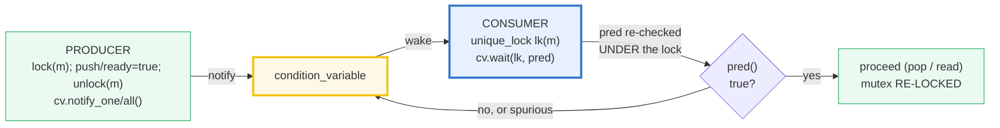
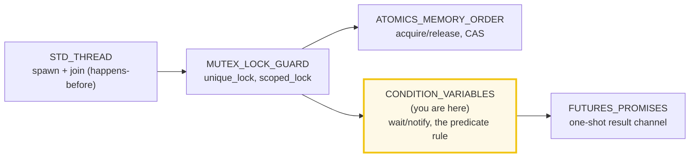
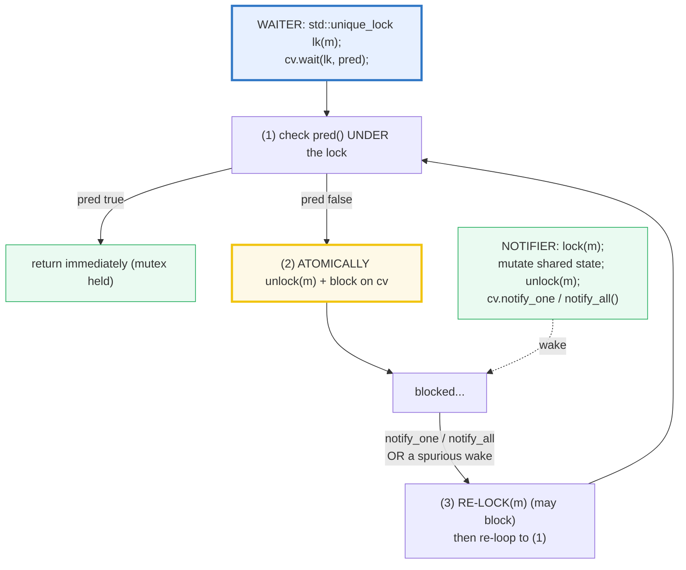

# CONDITION_VARIABLES — wait / notify_one / notify_all & the Predicate Rule

> **Goal (one line):** by COLLECTING every OUTCOME into per-thread or mutex-
> protected containers and asserting from `main` after all threads join, show how
> `std::condition_variable` lets a thread **WAIT** (atomically releasing a mutex)
> until another thread **NOTIFY** it that a shared predicate became true, why you
> **MUST use the predicate wait form** (spurious wakeups + lost wakeups), why
> `wait` **requires a `unique_lock`** (it unlocks/relocks internally — `lock_guard`
> cannot), and how the mutex+queue+condvar **producer/consumer** balances
> `N produced == N consumed` — pinning the **spurious-wakeup/predicate-form rule**
> as the central expert payoff.
>
> **Run:** `just run condition_variables`
>
> **Ground truth:** [`condition_variables.cpp`](./condition_variables.cpp) →
> captured stdout in
> [`condition_variables_output.txt`](./condition_variables_output.txt). Every
> number/block below is pasted **verbatim** from that file under a
> `> From condition_variables.cpp Section X:` callout. Nothing is hand-computed.
>
> **Prerequisites:** 🔗 [`STD_THREAD.md`](./STD_THREAD.md) (spawn/join, the
> happens-before edge) and 🔗 [`MUTEX_LOCK_GUARD.md`](./MUTEX_LOCK_GUARD.md)
> (`unique_lock` — the movable lock `wait` needs). This is Phase 4 bundle #26.

---

## 1. Why this bundle exists (lineage)

A thread often needs to **wait until shared state changes** — "block here until
the queue is non-empty," "until the result is ready," "until the latch counts
down." Busy-waiting (`while (!ready) {}`) burns a CPU core and is a **data race**
unless every access is synchronized; sleeping-and-rechecking
(`while(!ready) sleep(...)` ) wastes latency. The primitive that solves this is
the **condition variable**: a thread **waits** (releasing the mutex so producers
can make progress) and a producer **notifies** it when the condition may hold.



The **expert spine** of C++ concurrency places this bundle right after mutexes
and threads:



The headline contrast across the 5-language curriculum — **condvars are a
low-level primitive**, and most languages hide them behind something nicer:

| Language | "wait until X" primitive | Level |
|---|---|---|
| **C++** (this bundle) | `mutex` + `queue` + `condition_variable` (manual) | **low** |
| 🔗 [`../go/CHANNELS.md`](../go/CHANNELS.md) | a typed **channel** replaces all three (`close`/`range`/`select`) | high |
| 🔗 [`../rust/`](../rust/) | `std::sync::Mutex` + `Condvar` — the **same** low-level model | low |
| 🔗 [`../ts/ASYNC_AWAIT.md`](../ts/ASYNC_AWAIT.md) | **no condvar** — event loop + `Promise`/`async`/`await` | high (cooperative) |

> From cppreference — *`std::condition_variable`*: it "is a synchronization
> primitive used with a `std::mutex` to **block one or more threads until another
> thread both modifies a shared variable (the condition) and notifies** the
> `std::condition_variable`." And: it "**works only with**
> `std::unique_lock<std::mutex>` … `std::condition_variable_any` provides a
> condition variable that works with any BasicLockable object."

---

## 2. The mental model: the wait/wakeup cycle

The whole mechanism is one atomic handshake plus one mandatory loop:



The **predicate form** `cv.wait(lk, pred)` is defined by the standard as exactly

```cpp
while (!pred()) wait(lock);   // cppreference: "Equivalent to" this
```

so on **every** wake — a real `notify`, a `notify` that fired while `pred` was
still false, **or a spurious wake with no notify at all** — it re-acquires the
lock and **re-checks `pred`**, looping until `pred()` is `true`. That single
loop is what makes a condvar **correct**; the bare `cv.wait(lk)` (no predicate)
skips it and is a latent bug (§4, §6).

> From cppreference — *`wait`*: "(1) Atomically calls `lock.unlock()` and blocks
> on `*this`. The thread will be unblocked when `notify_all()` or `notify_one()`
> is executed. **It may also be unblocked spuriously.** When unblocked, calls
> `lock.lock()` (possibly blocking on the lock), then returns. (2) **Equivalent
> to** `while (!pred()) wait(lock);` … may be used to ignore spurious awakenings
> while waiting for a specific condition to become `true`." And: "**Right after
> `wait` returns, `lock.owns_lock()` is `true`**, and `lock.mutex()` is locked by
> the calling thread."

---

## 3. Section A — `wait(unique_lock, predicate)` + `notify_one` / `notify_all`

> From `condition_variables.cpp` Section A:
> ```
> cv.wait(unique_lock, pred): atomically unlock + block; on a notify or
> spurious wake, re-lock + re-check pred; loop until pred()==true.
> notify_one wakes ONE waiter; notify_all wakes ALL waiters.
> 
> (1) one waiter: cv.wait(lk, []{return ready;}) + notify_one
>     waiter woke: ready=true, data=42 (predicate true on return)
> [check] the woken waiter observed ready==true: OK
> [check] the woken waiter saw the producer's payload data==42 (under the re-lock): OK
> [check] wait() returned with the mutex RE-LOCKED (predicate read under the lock): OK
> 
> (2) notify_all wakes MULTIPLE waiters (NW=3); hand-shake so all are
>     blocked before notify_all, then assert every one woke.
>     notify_all fired with all 3 waiters blocked; woke=3
> [check] notify_all woke every waiter (woke == NW): OK
> [check] no waiter lost or duplicated (exactly NW woke): OK
> ```

**What.** `cv.wait(lk, pred)` blocks the calling thread (holding a
`unique_lock<mutex>`) until the predicate holds. `cv.notify_one()` wakes **one**
waiter; `cv.notify_all()` wakes **all** of them. After `wait` returns, the mutex
is **re-locked by the caller** (so the predicate check and the subsequent work
happen under the lock).

**Why — the producer/consumer hand-off.** Part (1) is the smallest condvar
program: the producer sets `ready` (and the payload `data`) **under the mutex**,
then `notify_one`; the waiter wakes, re-checks `ready` (true), and reads `data`.
The bundle asserts the **outcome** — the woken thread saw `ready==true` and the
payload `42` — never the timing. Part (2) hand-shakes (`blocked` atomic counter,
incremented under the lock just before `wait`) so all `NW=3` waiters are
genuinely blocked **before** `notify_all` fires; the outcome `woke == 3` proves
`notify_all` woke every waiter.

**The expert detail — `notify` under the lock or not?** `notify_one`/`notify_all`
may be called **before or after** unlocking. Cppreference notes that notifying
**while holding the lock is a pessimization**: the woken thread immediately
re-blocks on the mutex the notifier still holds ("hurry up and wait"); some
pthreads impls paper over this by moving the waiter straight onto the mutex's
queue. The idiomatic form is therefore **unlock first, then notify** — which is
what the producer in Section C does. It is **correct either way** (the predicate
form is race-free regardless); it's a throughput tweak, not a correctness rule.

> From cppreference — *`notify_one`*: "If any threads are waiting on `*this`,
> calling `notify_one` **unblocks one of the waiting threads**." And: "The
> notifying thread does not need to hold the lock … in fact doing so is a
> **pessimization**, since the notified thread would immediately block again."

---

## 4. Section B — Spurious wakeups + the PREDICATE form (always use it)

**This is the central expert payoff of the bundle.** A bare `cv.wait(lk)` (no
predicate) is allowed to return **without any `notify` at all** — a *spurious
wakeup* — and it returns on *any* `notify`, including one that fired while the
predicate was still false. Both make the bare form **wrong**: the caller proceeds
as if the condition held when it may not.

> From `condition_variables.cpp` Section B:
> ```
> A bare cv.wait(lk) can return WITHOUT a real notify (a spurious wakeup)
> or on a notify that fired while the predicate was still false. The fix is
> MANDATORY: use the predicate form  cv.wait(lk, pred)  ==  while(!pred()) wait(lk);
> it re-checks pred under the lock on every wake and returns only when true.
> 
> A 'false notify' (notify while predicate still false) is absorbed by the
> predicate form: the waiter re-checks and loops back until i==1.
>     waiter proceeded only after i==1: saw_i=1, finished=true
> [check] predicate form: waiter proceeded only when the predicate (i==1) was true: OK
> [check] a 'false notify' (predicate false) did NOT let the waiter proceed early: OK
> 
> THE BARE-WAIT TRAP (documented, NOT run):  cv.wait(lk);   // no predicate
>   returns on a spurious wake OR a notify-while-predicate-false, with the
>   predicate NOT guaranteed true -> proceeds incorrectly (the bug). Fix:
>   cv.wait(lk, []{return cond;});  // or hand-roll  while(!cond) cv.wait(lk);
> [check] the bare-wait (no predicate) trap is documented (not executed): OK
> ```

**The "false notify" demonstration.** The waiter waits for `i == 1` (`i` starts
`0`). The bundle fires `notify_one` **while `i` is still `0`** — a "false" notify.
With the predicate form, if the waiter wakes it re-checks `i==0` → false →
**waits again**; it only proceeds after the real change `i = 1` + `notify_one`.
The outcome (`saw_i == 1`) is deterministic; whether the false notify actually
woke the waiter is timing-dependent and **not asserted** (condvar timing/wake
order is nondeterministic — HOW_TO_RESEARCH §4.2 rule 4). A **bare** `wait` would
have proceeded at the false notify with `i == 0` — the bug.

**Why spurious wakeups exist at all.** They are a property of the underlying OS
primitive (e.g. POSIX `pthread_cond_wait`, Win32 `SleepConditionVariableCS`),
which is permitted to wake spuriously for implementation efficiency. The C++
standard therefore **permits** `wait` to return spuriously and **requires** you to
re-check the condition in a loop — which is exactly what the predicate overload
encodes. Raymond Chen's *The Old New Thing* piece (cited by cppreference) walks
the Win32 rationale.

> From cppreference — *`wait`* Notes: "The effects of `notify_one()`/
> `notify_all()` and each of the three atomic parts of `wait()`/`wait_for()`/
> `wait_until()` (unlock+wait, wakeup, and lock) take place in a single total
> order … specific to this individual condition variable." External link:
> *The Old New Thing* — "Spurious wake-ups in Win32 condition variables."

---

## 5. Section C — Producer / consumer queue: mutex + queue + condvar

**The canonical condvar use case.** A mutex-protected `std::queue<T>`; the
producer pushes items (`notify_one` each) and signals close (`notify_all`); the
consumers wait on the predicate `!q.empty() || done`, then pop. The predicate
form is what makes it correct under contention: a consumer woken by
`notify_one` may find the queue already emptied by a faster consumer — predicate
false → wait again (no lost wake, no double-pop).

> From `condition_variables.cpp` Section C:
> ```
> Producer pushes N items (notify_one each), then sets done + notify_all.
> Consumers wait on predicate (!q.empty() || done), then pop. The predicate
> form absorbs the 'woken-but-queue-already-emptied' race -> no lost/double.
> producer pushed N=100 items across 4 consumers
>   total consumed = 100 (expected 100)
>   sum of consumed = 5050 (expected 5050)
>   sorted consumed set is exactly {1..100}: true
>   (per-consumer distribution VARIES across runs -> not printed; TOTAL asserted)
> [check] producer/consumer: N produced == N consumed (no lost, no duplicate): OK
> [check] sum of consumed == N(N+1)/2 (no lost, no duplicate, no corruption): OK
> [check] sorted consumed set == {1..N} exactly (each value consumed once): OK
> [check] queue drained: q.empty() after all consumers joined: OK
> ```

**Outcome, not order.** The bundle asserts only the **balances**: `N produced ==
N consumed` (100 == 100), the sum `1+2+…+100 == 5050`, and the **sorted**
consumed set is exactly `{1..100}` (each value once). The per-consumer
distribution (`c0=… c1=… c2=… c3=…`) **varies run to run** (which consumer grabs
which item is nondeterministic), so it is deliberately **not printed** — printing
it would break `just out` byte-identity. This is the §4.2 determinism discipline
applied to a condvar bundle: collect into per-thread slots, join, **sort**, then
print.

**The shared predicate + queue are mutex-protected** (no data race): every
`q.push`/`q.front`/`q.pop`/`done` access happens under `pc.m`, and `wait` is
called on a `unique_lock` of that same mutex. ASan/UBSan **and** TSan are clean
(`just sanitize` + `-fsanitize=thread`).

> From cppreference — *`std::condition_variable`*: the modifying thread must
> "1. Acquire a `std::mutex` (typically via `std::lock_guard`). 2. **Modify the
> shared variable while the lock is owned.** 3. Call `notify_one` or `notify_all`
> … (can be done after releasing the lock)." And: "**Even if the shared variable
> is atomic, it must be modified while owning the mutex** to correctly publish
> the modification to the waiting thread."

---

## 6. Section D — `unique_lock` requirement + lost-wakeup fix + `wait_for`

Three independent expert facts, each pinned.

> From `condition_variables.cpp` Section D:
> ```
> (1) wait() REQUIRES std::unique_lock<std::mutex> (NOT lock_guard):
>     it unlocks while blocked and re-locks on wake — only unique_lock can.
>     cv works ONLY with unique_lock<mutex> (condition_variable_any for others).
>     // WHAT NOT TO DO (a compile error, documented):
>     //   std::lock_guard<std::mutex> lk(m);  cv.wait(lk, ...);  // won't compile
> [check] the unique_lock requirement is documented (wait needs it; lock_guard won't compile): OK
> 
> (2) lost-wakeup / predicate-fix: notify_all fires BEFORE any waiter;
>     bare wait would deadlock (notify lost). Predicate form checks rd on
>     entry -> already true -> returns immediately (no deadlock).
>     waiter returned without blocking (predicate-fix): true
> [check] lost-wakeup: predicate form did NOT deadlock (notify-before-wait handled): OK
> [check] lost-wakeup: predicate true on entry -> wait returned immediately: OK
> 
> (3) wait_for (timeout variants). Never notified -> cv_status::timeout;
>     predicate overload returns bool. Outcome asserted, NOT wall-clock.
>     wait_for(50ms) with no notify -> cv_status::timeout: true
> [check] wait_for with no notify returns cv_status::timeout: OK
>     wait_for(50ms, pred=false) -> returns false: true
> [check] wait_for with a never-true predicate returns false (within the timeout): OK
> ```

**(1) `wait` requires `unique_lock`** (a compile-time fact, documented because a
file that violated it would not build). The signature is
`wait(std::unique_lock<std::mutex>& lock, …)`: `wait` must **unlock** the mutex
while the thread is blocked and **re-lock** it on wake. Only `unique_lock` can —
`std::lock_guard` is immovable and exposes no `unlock()`/`lock()`. 🔗
[`MUTEX_LOCK_GUARD.md`](./MUTEX_LOCK_GUARD.md) Section D is the `unique_lock`
deep dive (movable, `defer_lock`, `owns_lock()`); this bundle is *why* that
movability matters.

**(2) The lost-wakeup / predicate-fix.** A `notify` that fires **before any
thread waits** is **lost** for a bare `wait` → the bare waiter blocks **forever**
(deadlock). The predicate form dodges this entirely: it checks `pred` **under the
lock on entry**, and if `pred` is already true it returns immediately without
blocking. The bundle proves it deterministically: set `rd = true` + `notify_all`
**first**, **then** spawn the waiter; the waiter's `cv.wait(lk, []{return rd;})`
sees `rd` true on entry and returns at once (`waiter returned without blocking:
true`). No sleep, no deadlock, no timing dependence.

**(3) `wait_for` / `wait_until` — the timeout variants.** `wait_for(lk, rel_time)`
returns a `std::cv_status` (`timeout` if it timed out without being notified,
`no_timeout` otherwise); the predicate overload
`wait_for(lk, rel_time, pred)` returns a `bool` (the value of `pred()` at exit).
The bundle never notifies the condvar and asserts only the **outcome** —
`cv_status::timeout`, and the never-true predicate returns `false` — never the
elapsed wall-clock (HOW_TO_RESEARCH §4.2 rule 2 forbids wall-clock as a verified
value; condvar timing is nondeterministic).

> From cppreference — *`wait`* (UB list): "If any of the following conditions is
> satisfied, the behavior is undefined: `lock.owns_lock()` is `false`;
> `lock.mutex()` is not locked by the calling thread; … `lock.mutex()` is
> different from the mutex unlocked by the waiting functions … called on `*this`
> by those threads." And — the postcondition: "Right after `wait` returns,
> `lock.owns_lock()` is `true` … If these postconditions cannot be satisfied,
> **calls `std::terminate`**."

---

## 7. Section E — When NOT to reach for a condvar (cross-language)

> From `condition_variables.cpp` Section E:
> ```
> A condvar is C++'s LOW-LEVEL sync primitive. Before writing one, check
> whether a higher-level stdlib tool fits:
>   - std::counting_semaphore / binary_semaphore (C++20): counted permits,
>     no hand-rolled predicate. Often the right tool for 'N slots'.
>   - std::latch (C++20): one-shot countdown; std::barrier (C++20): reusable.
>   - coroutines (co_await, C++20): async/await over a single thread.
>   - and, idiomatic since C++11: std::future/promise for a one-shot result.
> [check] higher-level stdlib alternatives documented (semaphore/latch/barrier/future): OK
> 
> Cross-language contrast (the headline):
>   C++   : mutex + queue + condition_variable (manual, low-level).
>   Go    : a typed CHANNEL replaces all three (close, range, select).
>   Rust  : std::sync::Mutex + Condvar — same low-level model as C++.
>   TS/JS : no condvar — single-threaded event loop + Promises/async.
> [check] cross-language parallels documented (Go channels; Rust Condvar; TS async): OK
> ```

Before you reach for `condition_variable`, check the higher-level C++ tools:
**`std::counting_semaphore` / `binary_semaphore`** (C++20) model "N permits" with
no hand-rolled predicate (often the right tool for a bounded-buffer / pool);
**`std::latch`** (one-shot countdown) and **`std::barrier`** (reusable phase
sync); **coroutines** (`co_await`, C++20) bring async/await; and the C++11
**`std::future`/`promise`** pair is a one-shot result channel (🔗
`FUTURES_PROMISES`).

Across languages: **Go folds the mutex+queue+condvar trio into a single typed
channel** (`ch <- v`, `range ch`, `select`, `close`) — the headline "higher-level
primitive" of this bundle's cross-refs. **Rust** keeps the same low-level model
(`std::sync::Mutex` + `Condvar`, with `Condvar::wait_while`). **TS/JS** has *no*
condvar — its single-threaded event loop + `Promise`/`async`/`await` replace
blocking-wait with cooperative suspension.

---

## 8. Worked smallest-scale example

Everything above, compressed to the five lines a beginner must memorize — and the
**one** they must never write:

```cpp
std::mutex              m;
std::condition_variable cv;
bool                    ready = false;   // shared PREDICATE — guarded by m

// WAITER (consumer)                              // NOTIFIER (producer)
std::unique_lock<std::mutex> lk(m);               // {
cv.wait(lk, [&]{ return ready; });   // predicate //   std::lock_guard<std::mutex> lk(m);
//  ^^^^^^^^^^^^^^^^^^^^^^^^^^^^^^^^              //   ready = true;
//  ALWAYS the predicate form (never bare wait)   // }
                                                  // cv.notify_one();   // unlock-first, then notify

// NEVER:  cv.wait(lk);   // no predicate -> spurious/false wakes proceed wrongly
```

> From `condition_variables.cpp` Section A(1), the waiter woke with `ready=true,
> data=42`; Section B proved a "false notify" did **not** let it proceed early
> (`saw_i=1`); Section D(2) proved the predicate-form handles a notify-before-wait
> with no deadlock (`waiter returned without blocking: true`). The contrast *is*
> the lesson: the predicate is checked under the lock on entry and on every wake.

---

## 9. The value-vs-reference-vs-ownership axis (threaded through this bundle)

Where does each thing in a condvar program sit? (🔗 `MOVE_SEMANTICS.md`,
`VALUE_VS_REFERENCE_VS_POINTER.md`, `RAII.md`.)

| Construct in this bundle | Copied? | Aliases? | Owns? | Sync rule |
|---|---|---|---|---|
| `std::unique_lock<std::mutex> lk(m)` | the lock object is a value | holds the mutex by pointer | **owns the lock** (RAII) | movable; `wait` unlock/relocks **it** |
| `std::lock_guard<std::mutex> lk(m)` (the notifier) | value | holds the mutex by pointer | owns the lock (RAII) | **immovable** — cannot be passed to `wait` |
| the shared predicate (`ready`, `i`, `q`, `done`) | n/a | aliased by ref in the lambda | borrowed | **must** be accessed only under `m` |
| per-thread `std::vector<int> local` (Section C) | the consumer's own | no sharing | owns its ints | written by one thread; read by `main` **after join** (happens-before) |
| `std::atomic<int> blocked/woke` (Section A(2)) | value | n/a | owns the int | atomic — race-free; the mutex+cv do the real sync |

The `unique_lock`-vs-`lock_guard` row is the ownership axis biting: `wait` needs
a lock it can **hand off the mutex** to (unlock while blocked, re-lock on wake),
so it demands the **movable** `unique_lock`, never the immovable `lock_guard`.

---

## 10. Pitfalls (the expert payoff)

| Trap | Symptom | Fix |
|---|---|---|
| **`cv.wait(lk);`** (no predicate) | a **spurious wake** or a **notify-while-predicate-false** makes it return with the condition *not* true → reads garbage / pops empty / proceeds wrongly | **Always the predicate form** `cv.wait(lk, pred);` (≡ `while(!pred()) wait(lk);`), or hand-roll the loop yourself. |
| **`cv.wait(lock_guard_lk, …)`** | **compile error** — `wait` takes `unique_lock<std::mutex>&`; `lock_guard` can't be passed and can't unlock/relock | Use `std::unique_lock<std::mutex> lk(m);` for the *waiting* side. (`lock_guard` is fine on the *notifying* side.) |
| Waiting on a `unique_lock` whose **mutex differs** from other waiters' on the same cv | **undefined behavior** (cppreference wait-UB list) | Every thread waiting on one `cv` must lock the **same** `mutex`. |
| `wait` on a lock that is **not owned** (`owns_lock()==false`) | **undefined behavior** | Construct the `unique_lock` so it owns the mutex (default ctor locks); don't `release()`/`unlock()` before `wait`. |
| **Lost wakeup** (notify before any wait) with a bare `wait` | the waiter blocks **forever** (deadlock) | The predicate form checks `pred` **on entry** → returns immediately if already true. (Demonstrated in §6.) |
| Notifying **while holding the lock** | "hurry up and wait" — the woken thread immediately re-blocks on the mutex the notifier still holds (a pessimization) | **Unlock first, then notify** (`lk.unlock(); cv.notify_one();`). Correct either way; this is throughput. |
| Modifying the shared state **outside the mutex** (even if it's `std::atomic`) | the modification is **not published** to the waiting thread → lost wake / stale read | cppreference: "Even if the shared variable is atomic, it must be modified **while owning the mutex**." |
| Checking `pred` **without holding the lock** | data race on the predicate (TSan flags it); also the check-then-wait window is racy | Always `wait` under the `unique_lock`; the predicate lambda reads shared state the same lock guards. |
| **Wake order / timing** asserted as output | nondeterministic → `just out` is **not** byte-identical across runs | Assert the **OUTCOME** (count, balances, sorted set), never the order; collect+sort+join (§4.2 rule 4). |
| A `notify_one` per item when you actually need to wake **all** waiters | consumers stall (only one wakes per item); under close, some never see `done` | `notify_one` for "one unit of work"; `notify_all` for a state change every waiter must observe (e.g. `done`). |
| `wait_for` without checking the return | can't tell **timeout** from a real wake — proceeds as if notified | Check `cv_status::timeout` (or the `bool` from the predicate overload); treat timeout as "retry / give up". |
| A `condition_variable` **destroyed while a thread is waiting on it** | **undefined behavior** | Join all waiters before the cv (and the mutex) go out of scope (🔗 `STD_THREAD` join = happens-before). |

---

## 11. Cheat sheet

```cpp
#include <condition_variable>   // std::condition_variable, std::cv_status
#include <mutex>                // std::mutex, std::unique_lock, std::lock_guard
#include <queue>                // std::queue (the typical shared buffer)
#include <thread>

std::mutex m; std::condition_variable cv;
bool ready = false;             // the shared PREDICATE — guarded by m

// ── WAITER (always the PREDICATE form, always a unique_lock) ────────────────
std::unique_lock<std::mutex> lk(m);     // NOT lock_guard — wait needs unique_lock
cv.wait(lk, [&]{ return ready; });      // == while(!pred()) wait(lk);  NEVER bare
// here: ready==true AND lk OWNS the mutex (re-locked on return)

// ── NOTIFIER (mutate UNDER the mutex, then notify) ──────────────────────────
{ std::lock_guard<std::mutex> lk(m); ready = true; }   // publish UNDER the lock
cv.notify_one();   // wake ONE waiter   (one unit of work available)
cv.notify_all();   // wake ALL waiters  (a state change everyone must see)
//   idiomatic: unlock FIRST, then notify (avoids "hurry up and wait")

// ── wait_for / wait_until (timeouts) ────────────────────────────────────────
auto st = cv.wait_for(lk, std::chrono::milliseconds(50));
//                     -> std::cv_status::timeout | no_timeout
bool ok = cv.wait_for(lk, std::chrono::milliseconds(50), [&]{ return ready; });
//                     -> pred() value at exit (false => timed out)

// ── The 5 rules (the expert checklist) ──────────────────────────────────────
//  1. ALWAYS the predicate form:   cv.wait(lk, pred);   (spurious + false wakes)
//  2. wait REQUIRES unique_lock<mutex> (lock_guard won't compile).
//  3. Mutate the predicate UNDER the mutex (even if it's atomic) -> then notify.
//  4. notify_one = one unit of work;  notify_all = a state change for everyone.
//  5. Assert the OUTCOME (count/balances/sorted set), NEVER wake order/timing.
```

---

## 12. 🔗 Cross-references

**Within C++ (the expertise spine):**

- 🔗 [`MUTEX_LOCK_GUARD.md`](./MUTEX_LOCK_GUARD.md) (P4) — **the direct
  dependency**: `wait` needs a `std::unique_lock<std::mutex>` (Section D there is
  the `unique_lock` API — movable, `defer_lock`, `owns_lock()`). This bundle is
  *why* `unique_lock`'s movability exists: `wait` must unlock-while-blocked and
  re-lock-on-wake, which an immovable `lock_guard` cannot do.
- 🔗 [`STD_THREAD.md`](./STD_THREAD.md) (P4) — `join()` provides the
  happens-before edge that lets `main` safely read each worker's recorded outcome
  after the threads finish; the destruct-without-join trap is why every waiter is
  joined before its `cv` goes out of scope.
- 🔗 [`ATOMICS_MEMORY_ORDER.md`](./ATOMICS_MEMORY_ORDER.md) (P4) — the
  `blocked`/`woke` hand-shake counters; and why a condvar predicate, unlike a raw
  atomic flag, gives you "block until X" without busy-waiting.
- 🔗 `FUTURES_PROMISES` (P4) — `std::promise`/`future` is a higher-level,
  one-shot result channel; often a better fit than a hand-rolled condvar.
- 🔗 `COROUTINES` (P4) — `co_await` brings async/await to C++, suspending on a
  single thread instead of blocking an OS thread.
- 🔗 [`UNDEFINED_BEHAVIOR.md`](./UNDEFINED_BEHAVIOR.md) (P7) — the wait-UB list
  (wrong mutex, unowned lock) and the data race on an unsynchronized predicate.

**Cross-language parallels (the 5-language curriculum):**

- 🔗 [`../go/CHANNELS.md`](../go/CHANNELS.md) — **the headline cross-ref.** A Go
  typed channel (`chan T`) is the **higher-level primitive that replaces**
  `mutex`+`queue`+`condition_variable` with a single value: `ch <- v` (produce),
  `v := <-ch` (consume blocks), `close(ch)` (signal done), `range ch` (drain),
  `select` (multiplex). The producer/consumer of §5 is `ch := make(chan int)` and
  a `for v := range ch` in Go — no predicate, no spurious wakes, no `unique_lock`.
- 🔗 [`../rust/`](../rust/) — Rust keeps the **same low-level model**
  (`std::sync::Mutex` + `Condvar`, with `Condvar::wait_while(&guard, pred)`), so
  this bundle translates almost line-for-line. The difference is that Rust's
  `MutexGuard` *is* a borrow — you access the data *through* the lock — whereas
  C++ separates the lock from the data it guards.
- 🔗 [`../ts/ASYNC_AWAIT.md`](../ts/ASYNC_AWAIT.md) / `CONCURRENCY_PATTERNS.md` —
  JS/TS has **no condition variable**: its single-threaded event loop +
  `Promise`/`async`/`await` replace *blocking*-wait with *cooperative*
  suspension. "Wait until X" is `await new Promise(res => once(X, res))`, not a
  condvar.

---

## Sources

Every signature, value, and behavioral claim above was verified against
cppreference and the ISO C++ standard, then corroborated by independent secondary
sources:

- cppreference — *`std::condition_variable`* (the class; works only with
  `unique_lock<std::mutex>`; the 3-step notifier + 2-step waiter recipe; "even if
  the shared variable is atomic, it must be modified while owning the mutex";
  `condition_variable_any` for other lock types):
  https://en.cppreference.com/w/cpp/thread/condition_variable
- cppreference — *`condition_variable::wait`* (the two overloads; "Atomically
  calls `lock.unlock()` and blocks"; "**It may also be unblocked spuriously**";
  overload (2) "**Equivalent to** `while (!pred()) wait(lock);`"; the postcondition
  "`lock.owns_lock()` is `true`"; the **UB list** — unowned lock, wrong mutex;
  "calls `std::terminate`" if the postcondition can't be satisfied):
  https://en.cppreference.com/w/cpp/thread/condition_variable/wait
- cppreference — *`condition_variable::notify_one`* ("unblocks **one of the
  waiting threads**"; "The notifying thread does not need to hold the lock … in
  fact doing so is a **pessimization**" — the "hurry up and wait" note):
  https://en.cppreference.com/w/cpp/thread/condition_variable/notify_one
- cppreference — *`condition_variable::notify_all`* ("notifies all waiting
  threads"):
  https://en.cppreference.com/w/cpp/thread/condition_variable/notify_all
- cppreference — *`condition_variable::wait_for`* / *`wait_until`* (the timeout
  variants; `cv_status::timeout` / `no_timeout`; the predicate overload returns
  `bool`):
  https://en.cppreference.com/w/cpp/thread/condition_variable/wait_for
  - *`std::cv_status`*: https://en.cppreference.com/w/cpp/thread/cv_status
- cppreference — *`std::unique_lock`* (the movable lock `wait` requires;
  `owns_lock()`, `unlock()`/`lock()`, `defer_lock`):
  https://en.cppreference.com/w/cpp/thread/unique_lock
- cppreference — *Concurrency support library* (the C++20 higher-level
  alternatives: `counting_semaphore`/`binary_semaphore`, `latch`, `barrier`):
  https://en.cppreference.com/w/cpp/thread
- *The Old New Thing* (Raymond Chen / Microsoft) — *"Spurious wake-ups in Win32
  condition variables"* (the platform rationale cppreference cites for why
  spurious wakeups are permitted):
  https://devblogs.microsoft.com/oldnewthing/20180201-00/?p=97946
- Secondary corroboration (≥2 independent sources, web-verified) for the
  spurious-wakeup + predicate-loop rule:
  - cppreference — *`condition_variable::wait`* Notes: the "single total order"
    of notify/wait parts; the external link to the *Old New Thing* article above.
  - *The Old New Thing* — spurious wake-ups article (above).
  - POSIX — *`pthread_cond_wait`*: "When using condition variables there is
    always a Boolean predicate involving a shared variable associated with each
    condition wait that is true if the thread should proceed. Spurious wakeups
    from the `pthread_cond_wait()` or `pthread_cond_timedwait()` functions may
    occur … the wait should **always** be enclosed in a `while` loop":
    https://pubs.opengroup.org/onlinepubs/9699919799/functions/pthread_cond_wait.html
- ISO C++23 draft (open-std.org) — normative wording:
  - 33.6 Condition variables `[thread.condition]`
  - Working draft: https://open-std.org/JTC1/SC22/WG21/docs/papers/2023/n4950.pdf
    (and the latest N49xx at https://open-std.org/JTC1/SC22/WG21/ )

**Facts that could not be verified by running** (documented, not executed,
because they are compile errors, sanitizer-only, or nondeterministic-by-design):
the `cv.wait(lock_guard_lk, …)` call (a **compile error** — `wait` takes
`unique_lock<std::mutex>&`); the bare `cv.wait(lk)` returning on a spurious wake
(a latent bug — a *correct* verified path never writes it); and the exact
elapsed time of a `wait_for` timeout (wall-clock is nondeterministic, so the
bundle asserts only the `cv_status::timeout` **outcome**, never the duration —
HOW_TO_RESEARCH §4.2 rule 2). These are confirmed by the cppreference sections
and secondary sources above, not reproduced as runnable output in the verified
path (a file triggering the bare-wait/lock_guard forms would fail `just check` /
be a correctness bug).
