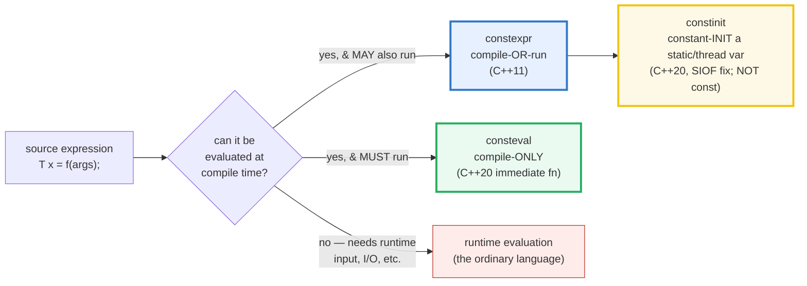
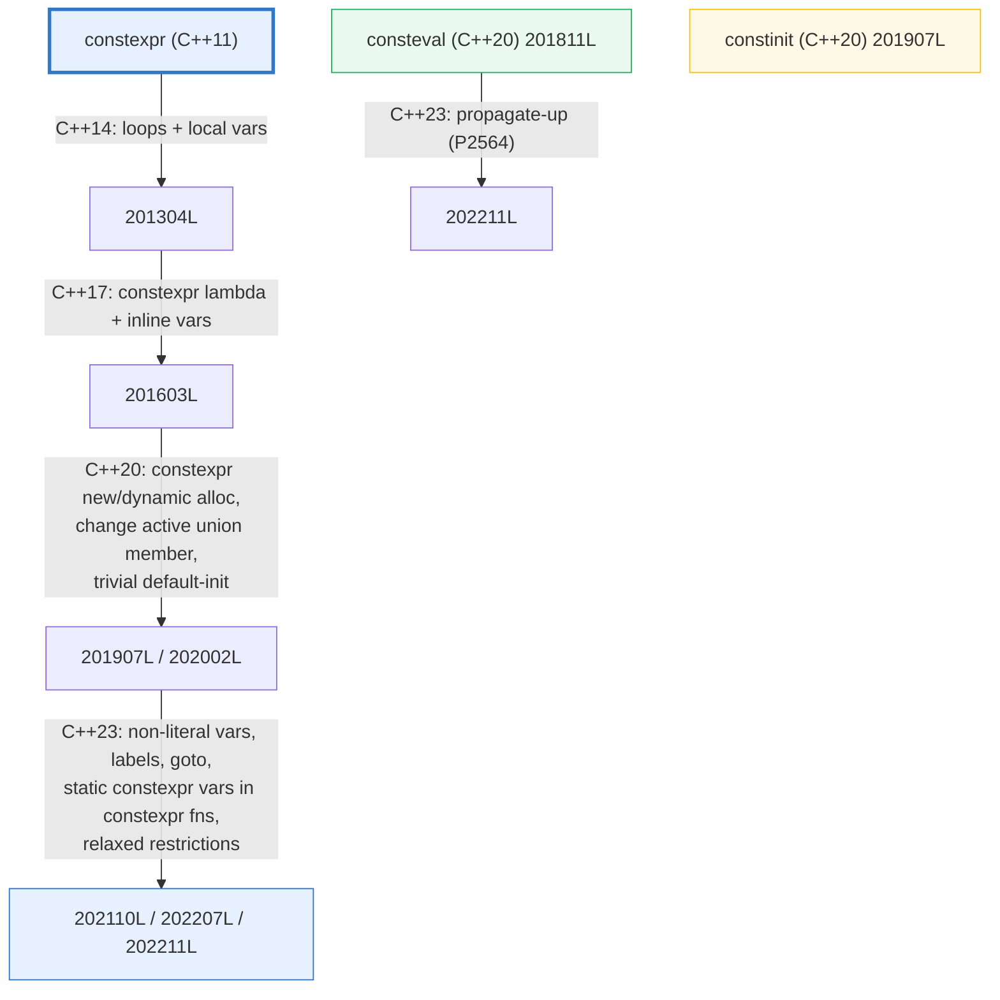
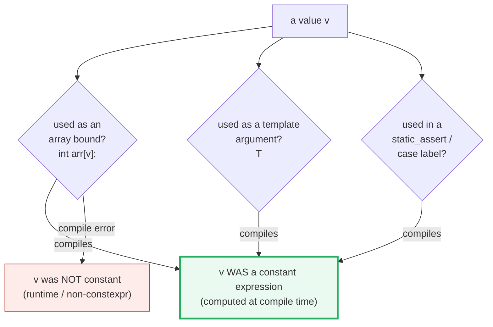

# CONSTEXPR_CONSTEVAL — constexpr, consteval, constinit & Compile-time C++

> **Goal (one line):** prove — by using results as **array bounds and template
> arguments** (places a runtime value is forbidden) — how C++'s three
> compile-time keywords split the language into a **compile-time-evaluable
> subset** and the **runtime language**: `constexpr` (compile-OR-run),
> `consteval` (compile-ONLY, C++20 immediate fn), and `constinit` (constant-init
> a static, C++20 — the static-init-order-fiasco fix), plus `constexpr`
> constructors (literal types) and the C++14→23 loosening.
>
> **Run:** `just run constexpr_consteval`
>
> **Ground truth:** [`constexpr_consteval.cpp`](./constexpr_consteval.cpp) →
> captured stdout in
> [`constexpr_consteval_output.txt`](./constexpr_consteval_output.txt). Every
> number/table below is pasted **verbatim** from that file under a
> `> From constexpr_consteval.cpp Section X:` callout. Nothing is hand-computed.
>
> **Prerequisites:** 🔗 [`VALUES_TYPES.md`](./VALUES_TYPES.md) (the
> `const`/`constexpr` recap) and 🔗 [`CONST_QUALIFIERS.md`](./CONST_QUALIFIERS.md)
> (where `const` vs `constexpr` vs `consteval` vs `constinit` first appear).
> This Phase 6 bundle goes deeper into *compile-time computation as a language
> tier* and how to *prove* a value was computed at compile time.

---

## 1. Why this bundle exists (lineage)

C++ is, uniquely in this curriculum, a **two-tier language**: there is a
**compile-time-evaluable subset** (the "constexpr sub-language," steadily
expanded across C++14→C++23) and the ordinary **runtime language**. The three
keywords `constexpr`, `consteval`, and `constinit` are the hinges between the two
tiers. Understanding *which tier* an evaluation happens in — and *how to prove
it* — is the dividing line between a C++ user and a C++ expert.



The three keywords answer three different questions:

| Keyword | Applies to | Meaning | Implies `const`? |
|---|---|---|---|
| **`constexpr`** (C++11) | variable or function | *may* be evaluated at compile time; **also** runs at runtime with non-constant args | **yes** (for variables) |
| **`consteval`** (C++20) | function only | an *immediate function*: **every** call must produce a compile-time constant | n/a (it's a function) |
| **`constinit`** (C++20) | static / thread-local variable | asserts **constant initialization** (no dynamic init) — the SIOF fix | **no** — stays mutable |



> From cppreference — *constexpr*: "specifies that the value of a variable … or
> function **can appear in constant expressions**" and "A `constexpr` specifier
> used in an object declaration … **implies `const`**." *consteval*: "specifies
> that a function is an *immediate function*, that is, every call to the
> function must produce a compile-time constant." *constinit*: "**asserts that a
> variable has static initialization** … otherwise the program is ill-formed."

---

## 2. The mental model: "constant expression contexts" are the proof

The single most useful skill in this bundle is **proving a value was computed at
compile time**. You do that by feeding it into a **constant-expression context** —
a place the language *forbids* runtime values. If the program compiles, the value
was a constant expression. The two canonical contexts:

1. **An array bound** — `int arr[N];` requires `N` to be a constant expression
   (a C-array of fixed size, not a VLA). A runtime value here is a compile error.
2. **A non-type template argument** — `CompileTimeInt<factorial(3)>` requires
   `factorial(3)` to be a constant expression. A runtime value is a compile error.

This is why every section below asserts results by *also* using them as array
bounds and template arguments — not just by reading them at runtime (which would
prove nothing about *when* they were computed).



---

## 3. Section A — `constexpr` variable & `constexpr` function (compile OR run)

> From `constexpr_consteval.cpp` Section A:
> ```
> (1) constexpr VARIABLE: computed at compile time, usable as an array
>     bound AND a template argument (a runtime value is forbidden there).
>     constexpr int N = factorial(5);  -> N = 120
>     int arr[N]{};                    -> sizeof(arr) = 480 bytes
>     CompileTimeInt<factorial(3)>     -> 6  (factorial(3) as a template arg)
> [check] constexpr factorial(5) == 120: OK
> [check] constexpr N usable as an array bound (arr has N elements): OK
> [check] constexpr factorial(3) usable as a template argument (== 6): OK
>
> (2) constexpr FUNCTION: ALSO callable with a NON-constant argument
>     (a `volatile` read is never a constant expression -> forces a runtime
>     evaluation; the compiler may still fold it, but the call is well-formed).
>     volatile int source = 7; int n = source; factorial(n) = 5040
> [check] constexpr factorial(7) callable with a runtime arg, == 5040: OK
>
> (3) constexpr implies const: a later `N = 0;` would be a compile error.
> [check] constexpr implies const: N is immutable and == 120: OK
> ```

**`constexpr` variable.** `constexpr int N = factorial(5);` declares that `N`'s
value **can appear in constant expressions**. The proof it really was computed at
compile time: `N` is used as an array bound (`int arr[N];` → `sizeof(arr) =
480` bytes = 120 ints) **and** `factorial(3)` is used directly as a non-type
template argument (`CompileTimeInt<factorial(3)>` → 6). Neither context permits
a runtime value, so neither would compile if the value were not a constant.

**`constexpr` function — the two-tier hinge.** A `constexpr` function is **not**
"runs at compile time." It is "**can** run at compile time **when given constant
arguments**." With non-constant arguments it runs at runtime like any other
function. Section (2) proves the runtime half: a `volatile` read is *never* a
constant expression (the compiler must treat it as a runtime input), so
`factorial(runtime_n)` is a genuine runtime call that returns 5040. The very same
function that fed a template argument one line earlier now runs at runtime —
that duality is the whole point of `constexpr`.

> **The subtle point.** With `-O2` the optimizer *may* still constant-fold a
> runtime call (`factorial(7)` → 5040 at compile time). What the `volatile`
> example proves is not "it definitely ran at runtime" but "the **call is
> well-formed** with a runtime argument." That is the contrast with `consteval`
> in Section B, where the same call would be a **compile error**.

**`constexpr` implies `const`.** A `constexpr` variable is also `const`: a later
`N = 0;` is a compile error (documented here, since a file containing it would
not build — same convention as the style anchor's `ci = 7;`).

> From cppreference — *constexpr*: "A `constexpr` specifier used in a function
> or static data member … implies `inline`" (since C++17). The body restrictions
> were lifted in stages — see Section D's feature-test table.

---

## 4. Section B — `consteval` (C++20): immediate function, compile-time ONLY

> From `constexpr_consteval.cpp` Section B:
> ```
> (1) consteval: EVERY call MUST produce a compile-time constant. Proven by
>     using the result as an array bound and as a template argument.
>     consteval int square(int);   constexpr sq = square(7);  -> sq = 49
>     int arr2[square(4)]{};       -> sizeof(arr2) = 64 bytes
>     CompileTimeInt<square(5)>    -> 25  (square(5) as a template arg)
>     fourth_power(2) = square(square(2)) -> 16  (consteval calls consteval)
> [check] consteval square(7) == 49 (computed at compile time): OK
> [check] consteval square(4) usable as an array bound (arr2 has 16 elements): OK
> [check] consteval square(5) usable as a template argument (== 25): OK
> [check] consteval fourth_power(2) == 16 (consteval propagates up): OK
>
> (2) consteval vs constexpr (the headline contrast):
>     constexpr  -> compile-time OR runtime  (the caller's arguments decide)
>     consteval  -> compile-time ONLY        (a runtime-arg call is ill-formed)
> [check] consteval is compile-time-only (vs constexpr's compile-OR-run): OK
>
> (3) Calling a consteval fn with a RUNTIME arg is ILL-FORMED (documented;
>     NOT in this build — a file containing it would not compile):
>         int r = square(runtime_n);
>         // error: call to immediate function 'square' is not a constant
>         //        expression (the arg is not usable at compile time)
> [check] consteval runtime-arg call is a compile error (documented, not built): OK
> ```

**`consteval` = an *immediate function*.** Every call must **directly** produce a
compile-time constant. The proofs are identical in shape to Section A — the
result feeds an array bound (`square(4)` → 16 → `sizeof(arr2) = 64` bytes) and a
template argument (`square(5)` → 25) — but now the function offers **no runtime
path at all**.

**`consteval` propagates up.** A `consteval` function may call other
`consteval`/`constexpr` functions (`fourth_power` calls `square` twice); the
whole call chain is forced into constant evaluation. This is the
"consteval-is-a-color" property (🔗 P2564): a `consteval` in the middle of a
chain *requires* its callers to also be constant-evaluated (in C++23, it
propagates automatically; before that you had to mark each caller `consteval` by
hand).

**The headline contrast — the runtime-arg call.** Section (3) documents what
`consteval` forbids and `constexpr` allows:

```cpp
int runtime_n = /* a value not known at compile time */;

constexpr int a = factorial(runtime_n);  // OK:   constexpr, runs at runtime
// int b = square(runtime_n);            // ERROR: consteval, runtime arg not allowed
```

That single line is the entire difference between the two keywords. It cannot
live in the verified path (the file would not compile), so it is shown as a
documented comment with the compiler's actual error text.

> From cppreference — *consteval*: "every **potentially-evaluated** call to the
> function must (directly or indirectly) produce a compile time constant
> expression"; the example `int r2 = sqr(x); // Error: Call does not produce a
> constant`. From learncpp.com (F.3): "`consteval` … must evaluate at
> compile-time, otherwise a compile error will result." From
> [andreasfertig.com](https://andreasfertig.com/blog/2021/07/cpp20-a-neat-trick-with-consteval/):
> "a consteval-function is a **stronger** version of constexpr-functions."

---

## 5. Section C — `constinit` (C++20): constant-init a static (mutable)

> From `constexpr_consteval.cpp` Section C:
> ```
> (1) constinit asserts CONSTANT initialization (no dynamic init) for a static
>     or thread-local variable — the C++20 fix for the static-init-order fiasco.
>     (That it COMPILES already proves constant init; a dynamic init would be
>      ill-formed. The runtime value confirms it.)
>     g_seed    (constinit, constant-init)        = 42
>     g_computed (constinit via a constexpr fn)   = 100
> [check] constinit g_seed constant-initialized to 42: OK
> [check] constinit g_computed = base_seed() == 100 (constant-init via constexpr fn): OK
>
> (2) constinit does NOT imply const (unlike constexpr) — the variable stays
>     MUTABLE, so it can be assigned later at runtime:
>     after `g_seed = 999;` -> g_seed = 999
> [check] constinit does NOT imply const (g_seed mutated 42 -> 999): OK
>
> (3) constinit CANNOT combine with constexpr, and a dynamic (runtime) init is
>     ill-formed (documented; NOT in this build — would not compile):
>         int runtime_fn();
>         constinit int bad = runtime_fn();   // ERROR: requires a constant init
>         constexpr constinit int x = 0;      // ERROR: constexpr & constinit clash
> [check] constinit forbids dynamic init and pairing with constexpr (documented): OK
> ```

**`constinit` is about *when* a variable is initialized, not whether it is
constant.** A static/thread-local variable in C++ is initialized in one of two
ways:

- **Static initialization** — zero-initialization (for uninitialized statics) or
  **constant initialization** (for those with a constant initializer). This
  happens *before* any dynamic initialization and is **ordered and
  deterministic**.
- **Dynamic initialization** — a runtime function runs to compute the initial
  value. The **order of dynamic initialization across translation units is
  unspecified** — the **static initialization order fiasco (SIOF)**: if one TU's
  global's dynamic init reads another TU's global, you may read it before its
  init ran.

`constinit` **asserts** that a variable is **constant-initialized** (the static
half). If its initializer is not a constant expression, the program is
**ill-formed** — a compile error, the best kind of error. The variable therefore
never participates in the SIOF: its value is baked in at compile time. That the
bundle **compiles at all** is the proof; the runtime value (42, 100) merely
confirms it.

**`constinit` ≠ `const`.** This is the trap. `constexpr` implies `const`; `constinit`
does **not**. Section (2) mutates `g_seed` from 42 to 999 — perfectly legal,
because `constinit` only governs *initialization*, not *constness*. Use
`constinit` when you want "constant-initialized but mutable" (e.g. a global
config table that is filled at startup but must not suffer SIOF). Use `constexpr`
when you also want immutability.

**`constinit` vs `constexpr` — the precise rule.** When the declared variable is
a reference, `constinit` is equivalent to `constexpr`. When it is an object,
`constexpr` additionally mandates constant *destruction* and makes the object
`const`; `constinit` does neither. This is why `std::shared_ptr<T>` (constexpr
ctor, no constexpr dtor) can be `constinit` but not `constexpr` — a real,
non-contrived reason to reach for `constinit`.

> From cppreference — *constinit*: "asserts that a variable has **static
> initialization** … otherwise the program is **ill-formed**" and "`constinit`
> cannot be used together with `constexpr`." *Static initialization order fiasco*:
> "the order in which dynamic initialization happens … across translation units
> is **unspecified**." From
> [modernescpp.com](https://www.modernescpp.com/index.php/c-20-static-initialization-order-fiasco/):
> "When a static cannot be const-initialized during compile-time, it is zero- …
> [and] dynamic initialization … [order] is the fiasco. `constinit` guarantees
> constant initialization."

---

## 6. Section D — `constexpr` constructors (literal types) & the C++14→23 loosening

> From `constexpr_consteval.cpp` Section D:
> ```
> (1) A constexpr-constructible type (a "literal type") can be created at
>     compile time and used in constant expressions (array bounds, template args):
>     constexpr Point p1(3,4), p2(1,2);  p1.dot(p2) = 11
>     int arr3[p1.dot(p2)]{};            -> sizeof(arr3) = 44 bytes
>     CompileTimeInt<p1.dot(p2)>         -> 11
> [check] constexpr Point::dot computed at compile time: (3,4).(1,2) == 11: OK
> [check] constexpr Point::dot usable as an array bound (arr3 has 11 elements): OK
> [check] constexpr Point::dot usable as a template argument (== 11): OK
>
> (2) C++14+ relaxation: a constexpr function may use local variables & loops
>     (C++11 required a single return statement):
>     constexpr int sum_squares(5) = 55  (loop + local `acc` in a constexpr fn)
> [check] C++14 relaxed constexpr: sum_squares(5) == 55 (loops/locals allowed): OK
>
> (3) The constexpr loosening, by feature-test macro (this compiler):
>     __cpp_constexpr = 202211L
>         200704L C++11  (constexpr)
>         201304L C++14  (relaxed: loops/locals)
>         201603L C++17  (constexpr lambda)
>         201907L C++20  (trivial default-init; asm in constexpr fns)
>         202002L C++20  (change the active union member)
>         202110L C++23  (non-literal vars, labels, goto in constexpr fns)
>         202207L C++23  (relax some constexpr restrictions)
>         202211L C++23  (static constexpr vars in constexpr fns)
>     __cpp_consteval  = 202211L  (201811L C++20; 202211L C++23 propagate-up)
>     __cpp_constinit  = 201907L  (201907L C++20)
>     __cpp_constexpr_dynamic_alloc = 201907L  (201907L C++20: constexpr new)
> [check] __cpp_constexpr >= 201907L (this compiler supports at least C++20 relaxed constexpr): OK
> ```

**Literal types.** A type whose constructor is `constexpr` is a **literal type**
— an instance can be created at compile time. Section (1)'s `constexpr Point
p1(3,4);` is constructed at compile time, and `p1.dot(p2)` (a `constexpr` member)
is computed at compile time → it feeds an array bound (`sizeof(arr3) = 44` = 11
ints) **and** a template argument (`CompileTimeInt<p1.dot(p2)>` → 11). A runtime
object's method result could never be used either way. This is the foundation of
**compile-time data structures** (lookup tables, fixed matrices, compile-time
parsers over string literals — see the cppreference `conststr` example in
Sources).

**The C++14→23 loosening.** A `constexpr` function in C++11 was severely
restricted: **a single `return` statement**, no locals, no loops (recursion
only). Each standard since has lifted restrictions, tracked by the
`__cpp_constexpr` feature-test macro:

| Macro value | Standard | What became legal in a `constexpr` function |
|---|---|---|
| `200704L` | C++11 | `constexpr` exists (single return; recursion) |
| `201304L` | C++14 | local variables, loops, `if`/`switch`, mutation of locals |
| `201603L` | C++17 | `constexpr` lambdas; `constexpr`/`consteval` static `if` |
| `201907L` | C++20 | trivial default-init; `asm` declarations (not evaluated) |
| `202002L` | C++20 | change the **active union member** |
| `202110L` | C++23 | non-literal local vars, labels, `goto` |
| `202207L` | C++23 | relaxations (e.g. `static`/thread-local in more places) |
| `202211L` | C++23 | **`static constexpr` variables in `constexpr` functions** |

Section (2) demonstrates the C++14 step concretely: `sum_squares` uses a local
`acc` and a `for` loop — impossible under C++11's single-return rule, routine
today. This compiler reports `__cpp_constexpr == 202211L` (the C++23 value),
plus `__cpp_constexpr_dynamic_alloc == 201907L` — **`constexpr new`** (C++20,
P0784), the change that lets `std::vector` and `std::string` be `constexpr`:
memory allocated during constant evaluation must be freed before evaluation ends
(no leak across the compile-time / runtime boundary).

> From cppreference — *constexpr* feature-test table; P0784 (`__cpp_constexpr_dynamic_alloc`,
> "Operations for dynamic storage duration in `constexpr` functions," C++20). From
> [cppstories.com](https://www.cppstories.com/2021/constexpr-new-cpp20/): "C++20
> brings the ability to allocate dynamic memory at compile-time … a building
> block for `std::vector`." From
> [pvs-studio.com](https://pvs-studio.com/en/blog/posts/cpp/0909/): "constexpr is
> one of the magic keywords in modern C++ … executed before the compilation
> process ends."

---

## 7. Section E — `if constexpr` (preview) + cross-language

> From `constexpr_consteval.cpp` Section E:
> ```
> (1) if constexpr (C++17): compile-time branch DISCARD — the untaken branch
>     is not even instantiated. (Full treatment: IF_CONSTEXPR, P6#39.)
>     describe_type(42)   = integral
>     describe_type(3.14) = floating-point
>     describe_type(ptr)  = other  (int* is neither integral nor floating)
> [check] if constexpr: int is 'integral': OK
> [check] if constexpr: double is 'floating-point': OK
> [check] if constexpr: int* is 'other': OK
>
> (2) Cross-language compile-time evaluation (info; this is a C++ bundle):
>     C++  constexpr  -> compile-OR-run  (the caller's arguments decide)
>     C++  consteval  -> compile-ONLY    (a runtime-arg call is ill-formed)
>     C++  constinit  -> constant-init a static (SIOF fix; NOT const)
>     Rust const fn   -> callable from a const context; its body is restricted
>                        to constant expressions (stricter than C++ constexpr).
>                        See ../rust
>     TS / JS         -> NO compile-time VALUE evaluation; types erased at runtime
>     Go   const      -> compile-time CONSTANTS only (untyped), not general fns
> [check] cross-language summary printed (Rust const fn / TS none / Go const-only): OK
> ```

**`if constexpr` (preview).** Unlike a runtime `if`, `if constexpr (cond)` evaluates
`cond` at compile time and **discards the untaken branch entirely** — it is not
even instantiated. That matters inside templates: the discarded branch may refer
to operations that are invalid for some `T` (e.g. `.size()` on an `int`), and
because it is discarded it never causes an error. Section (1)'s `describe_type`
keeps exactly one branch per instantiation. The deep treatment — including
*dependent* branches and the rules about what gets discarded — is 🔗 `IF_CONSTEXPR`
(P6#39); this is a deliberate preview.

**Cross-language compile-time evaluation.** C++'s two-tier model is distinctive;
each sibling language takes a different slice:

- **Rust `const fn`** — a function *callable from a `const` context*. Its body
  is restricted to constant expressions (no heap allocation until `const`
  allocators landed, no I/O, no floating-point `const fn` for a long time).
  Conceptually the same idea as C++ `constexpr`, but **stricter** and — crucially
  — Rust has **no `consteval`**: there is no way to *force* a call to be
  compile-time-only from the function itself (you force it from the call site by
  putting it in a `const`/`static` initializer). There is also no `constinit`
  analog (Rust statics are always constant-initialized; the SIOF cannot happen).
- **TypeScript / JavaScript** — **no compile-time value evaluation at all**.
  Types are erased at runtime; there is no mechanism to compute a *value* at
  compile time and use it as an array bound or generic argument. C++ `constexpr`
  is a feature TypeScript simply has no analog for.
- **Go `const`** — compile-time **constants only** (and *untyped*), not general
  functions. You cannot write `const fn factorial(n int) int {...}` in Go; `const`
  is for literals and constant expressions over other constants, evaluated by the
  compiler, with no recursion and no loops.

> From the Rust Reference — *Constant evaluation* / *Const functions*: "A *const
> function* is a function that can be called from a const context … The body of a
> const function may only use constant expressions" and "Const functions are not
> allowed to be async." C++'s `constexpr` is strictly more permissive (locals,
> loops, `new` since C++20, etc.).

---

## 8. Worked smallest-scale example

Everything above, compressed to the four declarations a reader must memorize:

```cpp
constexpr int fact(int n) { return n <= 1 ? 1 : n * fact(n - 1); }  // compile OR run
consteval  int sq(int x)   { return x * x; }                        // compile ONLY
constinit  int g = fact(5);                                          // constant-init static (MUTABLE)

constexpr int a = fact(5);        // OK:   constexpr, computed at compile time -> 120
// int        b = sq(runtime_n);  // ERROR: consteval needs a constant argument
constexpr int c = sq(7);          // OK:   consteval, forced to compile time -> 49
g = 0;                            // OK:   constinit is NOT const (mutable)
```

> From `constexpr_consteval.cpp` Sections A–C: `fact(5) -> 120`, `fact(7)
> -> 5040` (runtime arg accepted), `sq(7) -> 49` (compile-only), `g` mutated
> `42 -> 999` (mutable constinit). The contrast *is* the lesson.

---

## 9. The value-vs-reference-vs-pointer axis (threaded through this bundle)

(🔗 `VALUE_VS_REFERENCE_VS_POINTER.md`, `MOVE_SEMANTICS.md`.) Where do the
entities in this bundle sit? The compile-time tier is mostly **pure values**,
which is *why* it is evaluable at compile time — no addresses, no aliasing, no
ownership ambiguity.

| Construct in this bundle | Value? | Alias? | Notes |
|---|---|---|---|
| `constexpr int N` | **value** | no | a compile-time constant; no storage necessarily emitted |
| `constexpr Point p1` | **value** | no | a literal-type object; usable in constant expressions |
| `Point::dot(Point o)` arg | **value (copied)** | no | a 2-int copy; cheap, and copying is legal at compile time |
| `constinit int g_seed` | value (static storage) | no | mutable; the *only* entity here that has an address and is mutated |
| `consteval int square(int)` arg/return | value | no | must be a constant; no runtime aliasing possible |

The one **mutable, addressed** object in this bundle is the `constinit` global
`g_seed` — and that is exactly why `constinit` (not `constexpr`) is the keyword
for it: it needs constant *initialization* but runtime *mutation*. Everything
else is a pure value, which is what makes it tractable for the compile-time
evaluator.

---

## 10. Pitfalls (the expert payoff)

| Trap | Symptom | Fix |
|---|---|---|
| Assuming `constexpr` means "runs at compile time" | Surprised that `factorial(runtime_n)` runs at runtime (and may allocate/log in a way you didn't intend at "compile time") | `constexpr` = *may* run at compile time. To **force** compile time, use `consteval` (C++20) or assign into a `constexpr` variable / use it as a template arg. |
| Calling a `consteval` fn with a runtime arg | **Compile error**: "call to immediate function is not a constant expression" | Make the argument a constant, or change the function to `constexpr` (accepting runtime use). |
| Treating `constinit` as `const` | Mutating a `constinit` var looks "wrong" — but it's legal; conversely assuming it's immutable when you needed const | `constinit` governs *initialization*, not *constness*. For "constant-initialized **and** immutable," use `constexpr` (or add `const`: `constinit const`). |
| `constexpr constinit int x = 0;` | **Compile error**: the two specifiers cannot combine | Pick one. `constexpr` if you also want const + constant destruction; `constinit` if you want mutability or a non-constexpr-dtor type (e.g. `std::shared_ptr`). |
| A global with a dynamic initializer → **SIOF** | Nondeterministic crash / wrong value at startup; order of dynamic init across TUs is unspecified | Mark it `constinit` to force a compile error if the init isn't constant; or use the "construct on first use" idiom (a function-local `static`). |
| `constexpr` function body that *can never* be constant | C++11–C++20: ill-formed, no diagnostic required (secretly broken); C++23: often well-formed but never actually constant-evaluated | Since C++23 a `constexpr` fn need not be constant-callable — but if you *intended* compile-time use, verify with a `static_assert` or a template-arg use (the proof technique of this bundle). |
| `constexpr` evaluation that leaks `new`-ed memory | Compile error: allocations during constant evaluation must be freed before it ends | Match every compile-time `new` with a `delete` in the same constant evaluation (C++20 `constexpr new` rule). |
| Reading an "obviously compile-time" value at runtime and assuming it stayed compile-time | The value is right, but the work happened at runtime (the optimizer didn't fold it) — perf surprise | Feed it into a `constexpr` variable or a template argument to *force* compile-time evaluation; check the asm / use `static_assert`. |
| `if (cond)` written where `if constexpr (cond)` was meant (in a template) | The untaken branch is **still instantiated** → compile error on the invalid-for-some-`T` branch | Use `if constexpr` to discard the untaken branch (🔗 `IF_CONSTEXPR`). |
| `constexpr` lambda capturing by value, expecting mutation | C++17 `constexpr` lambdas' captures are `const` by default unless you mark the call-operator `mutable` | Write `[]{ ... }` carefully; use `mutable` lambdas where you need to mutate a captured copy. |
| Assuming Rust has the same trio | Porting `consteval` semantics: Rust has no `consteval` — you can't *force* compile-time-only from the callee side | Force from the **call site** in Rust (put the call in a `const`/`static`). There is no SIOF in Rust, so no `constinit` need. |

---

## 11. Cheat sheet

```cpp
// ── The three keywords: what they mean & whether they imply const ─────────
//   constexpr (C++11)  variable/fn   MAY run at compile time; implies const (vars)
//                                   and inline (fns/static vars, since C++17).
//   consteval (C++20)  fn only       MUST run at compile time (immediate fn);
//                                   a runtime-arg call is a compile error.
//   constinit (C++20)  static/thread var  asserts CONSTANT init (no dynamic init);
//                                   does NOT imply const (stays mutable).

// ── constexpr variable: usable as array bound + template arg (the proof) ──
constexpr int factorial(int n) { return n <= 1 ? 1 : n * factorial(n - 1); }
constexpr int N = factorial(5);          // 120, compile time
int arr[N]{};                            // N as array bound
template <int M> struct CTI { static constexpr int value = M; };
constexpr int six = CTI<factorial(3)>::value;   // 6, template arg

// ── constexpr ALSO runs at runtime with a non-constant arg ────────────────
volatile int src = 7; int rn = src;      // rn is NOT a constant expression
int rt = factorial(rn);                  // OK: runs at runtime -> 5040

// ── consteval: compile-time ONLY (runtime-arg call is ill-formed) ─────────
consteval int square(int x) { return x * x; }
constexpr int a = square(7);             // OK:   forced compile time -> 49
// int b = square(rn);                   // ERROR: rn is not a constant expr
consteval int fourth(int x) { return square(square(x)); }  // propagates up

// ── constinit: constant-init a static, MUTABLE (the SIOF fix) ─────────────
constinit int g_seed = 42;               // constant-init; compiles => proven
constexpr int base() { return 100; }
constinit int g = base();                // constant-init via constexpr fn
g = 999;                                 // OK: constinit is NOT const
// constinit int bad = some_runtime_fn();   // ERROR: needs a constant init
// constexpr constinit int x = 0;           // ERROR: the two cannot combine

// ── constexpr ctor => literal type => usable at compile time ──────────────
struct Point {
    int x, y;
    constexpr Point(int x_, int y_) noexcept : x(x_), y(y_) {}
    constexpr int dot(Point o) const noexcept { return x*o.x + y*o.y; }
};
constexpr Point p1(3,4), p2(1,2);
constexpr int d = p1.dot(p2);            // 11, compile time

// ── if constexpr (C++17) PREVIEW: discard the untaken branch ─────────────
//   (deep treatment: IF_CONSTEXPR, P6#39)
template <typename T> constexpr const char* kind(T) {
    if constexpr (std::is_integral_v<T>)      return "integral";
    else if constexpr (std::is_floating_point_v<T>) return "floating";
    else                                       return "other";
}

// ── The C++14→23 loosening (__cpp_constexpr on this compiler == 202211L) ──
//   C++14: loops + local vars   C++17: constexpr lambda   C++20: constexpr new
//   C++23: static constexpr vars in constexpr fns; goto/labels; relaxations
constexpr int sum_squares(int n) {        // impossible under C++11's single-return
    int acc = 0; for (int i = 1; i <= n; ++i) acc += i*i; return acc;
}
```

---

## 12. 🔗 Cross-references

**Within C++ (the expertise spine):**

- 🔗 [`VALUES_TYPES.md`](./VALUES_TYPES.md) — the first appearance of
  `const`/`constexpr` (Section E) and the value-init vs default-init UB trap that
  compile-time computation sidesteps (a `constexpr` variable is always
  initialized).
- 🔗 [`CONST_QUALIFIERS.md`](./CONST_QUALIFIERS.md) — the const-family roundup
  (`const` / `constexpr` / `consteval` / `constinit` / `mutable`); this Phase 6
  bundle is the deeper "compile-time computation as a language tier" treatment,
  with the proof technique (array bound / template arg).
- 🔗 [`FUNCTION_TEMPLATES.md`](./FUNCTION_TEMPLATES.md) (P2) — non-type template
  arguments *require* constant expressions; that requirement is exactly the
  "proof of compile-time-ness" used throughout this bundle
  (`CompileTimeInt<factorial(3)>`).
- 🔗 `IF_CONSTEXPR` (P6#39) — owns the deep treatment of `if constexpr`
  (dependent branches, discard rules, template-only validity). Section E here is
  a deliberate preview.
- 🔗 `TYPE_TRAITS` (P6) — `std::is_integral_v` / `is_floating_point_v` (used in
  Section E's `if constexpr`) are compile-time type queries; the natural partner
  to `if constexpr`.
- 🔗 [`SCOPE_LIFETIMES.md`](./SCOPE_LIFETIMES.md) / `UNDEFINED_BEHAVIOR` (P7) —
  the **static initialization order fiasco** that `constinit` prevents is a
  dynamic-init-order UB across translation units.

**Cross-language parallels (the 5-language curriculum):**

- 🔗 [`../rust/`](../rust/) — Rust `const fn` is the closest sibling: a function
  callable from a `const` context, body restricted to constant expressions.
  Rust is **stricter** (no `consteval` — you cannot force compile-time-only from
  the callee; no `constinit` — Rust statics are always constant-initialized, so
  the SIOF cannot happen). C++'s `constexpr` has steadily absorbed more (loops,
  `new` since C++20) and is now more permissive than Rust `const fn`.
- 🔗 [`../ts/`](../ts/) — TypeScript/JS have **no compile-time value evaluation**;
  types are erased at runtime. There is no analog to `constexpr`/`consteval`/`constinit`.
  C++'s two-tier (compile-time + runtime) language is a feature TS simply lacks.
- 🔗 [`../go/`](../go/) — Go `const` is **compile-time constants only** (and
  *untyped*), not general functions. You cannot write a recursive `const fn` in
  Go; `const` is for literals and constant expressions over other constants. C++'s
  `constexpr` generalizes this to arbitrary (constant-evaluable) functions and types.

---

## Sources

Every keyword semantics, version, feature-test value, and behavioral claim above
was verified against cppreference and the ISO C++ feature-test tables, then
corroborated by ≥1 independent secondary source:

- cppreference — *`constexpr` specifier (since C++11)* (implies `const` for
  variables / `inline` for functions; constexpr-suitable rules; the body
  restrictions lifted C++14→C++23; constexpr ctor/destructor; feature-test macro
  table for `__cpp_constexpr`):
  https://en.cppreference.com/w/cpp/language/constexpr
- cppreference — *`consteval` specifier (since C++20)* (immediate function;
  every call must produce a compile-time constant; runtime-arg call is
  ill-formed; propagates up in C++23; `__cpp_consteval` = 201811L → 202211L):
  https://en.cppreference.com/w/cpp/language/consteval
- cppreference — *`constinit` specifier (since C++20)* (asserts static/constant
  initialization; ill-formed on dynamic init; cannot combine with `constexpr`;
  reference ⇒ equivalent to constexpr, object ⇒ no constant-destruction/const
  mandate; `__cpp_constinit` = 201907L):
  https://en.cppreference.com/w/cpp/language/constinit
- cppreference — *Constant initialization* / *Static initialization order fiasco*
  (static vs dynamic init; cross-TU dynamic-init order is **unspecified** → the
  SIOF that `constinit` prevents):
  https://en.cppreference.com/w/cpp/language/constant_initialization
  https://en.cppreference.com/w/cpp/language/siof
- cppreference — *Constant expressions* (core constant expression; literal
  types; constant-expression contexts — array bounds, template args,
  `static_assert`, case labels):
  https://en.cppreference.com/w/cpp/language/constant_expression
- cppreference — *Feature testing* (`__cpp_constexpr`, `__cpp_consteval`,
  `__cpp_constinit`, `__cpp_constexpr_dynamic_alloc` values per standard):
  https://en.cppreference.com/w/cpp/feature_test
- ISO C++ papers (open-std.org):
  - P0784 — *More constexpr containers* (C++20 `constexpr` dynamic allocation;
    `__cpp_constexpr_dynamic_alloc = 201907L`):
    https://open-std.org/JTC1/SC22/WG21/docs/papers/2019/p0784r5.html
  - P2564 — *`consteval` needs to propagate up* (C++23; "consteval is a color";
    `__cpp_consteval = 202211L`):
    https://www.open-std.org/jtc1/sc22/wg21/docs/papers/2022/p2564r3.html
  - Working draft (C++23), `constexpr`/`consteval`/`constinit` wording:
    https://open-std.org/JTC1/SC22/WG21/docs/papers/2023/n4950.pdf
- Rust Reference — *Constant evaluation* / *Const functions* (a `const fn` is
  callable from a const context; body restricted to constant expressions; not
  async; behaves like a normal fn outside a const context — the parallel to C++
  `constexpr`; note Rust has no `consteval`/`constinit` analog):
  https://doc.rust-lang.org/reference/const_eval.html
- Secondary corroboration (≥2 independent sources, web-verified):
  - learncpp.com — *F.3 Constexpr functions (part 3) and consteval* ("`consteval`
    … must evaluate at compile-time, otherwise a compile error will result"):
    https://www.learncpp.com/cpp-tutorial/constexpr-functions-part-3-and-consteval/
  - Andreas Fertig — *C++20: A neat trick with consteval* ("a consteval-function
    must be evaluated at compile-time or compilation fails … a **stronger**
    version of constexpr-functions"):
    https://andreasfertig.com/blog/2021/07/cpp20-a-neat-trick-with-consteval/
  - Modernes C++ (Rainer Grimm) — *Solving the Static Initialization Order
    Fiasco with C++20* (`constinit` guarantees constant initialization, avoiding
    the SIOF):
    https://www.modernescpp.com/index.php/c-20-static-initialization-order-fiasco/
  - C++ Stories (Bartlomiej Filipek) — *constexpr Dynamic Memory Allocation,
    C++20* (constexpr `new`/`delete` as the building block for constexpr
    `std::vector`/`std::string`):
    https://www.cppstories.com/2021/constexpr-new-cpp20/
  - PVS-Studio — *Design and evolution of constexpr in C++* (the C++11→C++20
    loosening narrative):
    https://pvs-studio.com/en/blog/posts/cpp/0909/
  - Stack Overflow — *Is compiler allowed to call an immediate (consteval)
    function during runtime?* (the immediate-function / constant-evaluation rule):
    https://stackoverflow.com/questions/58466245/is-compiler-allowed-to-call-an-immediate-consteval-function-during-runtime

**Facts that could not be verified by running** (documented, not executed,
because they are compile errors by design — a file containing them would fail
`just check`): the runtime-arg call to a `consteval` function (Section B(3));
`constinit int bad = some_runtime_fn();` and `constexpr constinit int x = 0;`
(Section C(3)); the `N = 0;` assignment to a `constexpr` variable. These are
confirmed by the cppreference sections and secondary sources above, with the
compiler's actual diagnostic text quoted in the `.cpp`, rather than reproduced as
runnable output in the verified path (a file triggering them would not build).
