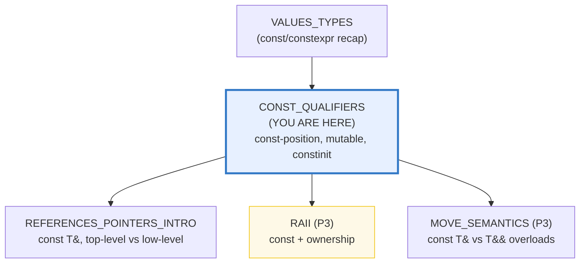
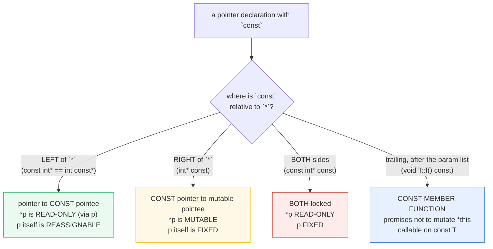
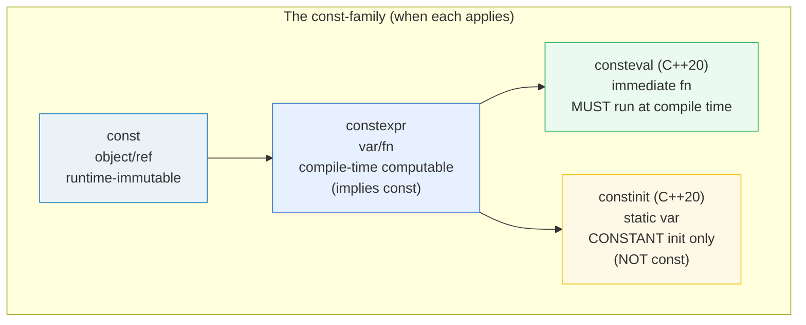

# CONST_QUALIFIERS — const, const-correctness, constexpr, consteval, constinit & mutable

> **Goal (one line):** by printing every value, show how C++'s `const` family —
> `const` objects/params/methods, the **const-position rule** (pointer-to-const
> vs const-pointer), `constexpr` (compile-time), `constinit` (C++20, no dynamic
> init), and `mutable` (mutate-in-const) — behave, pinning **const-correctness**
> as a **compile-time** discipline that catches accidental mutation at **zero
> runtime cost**.
>
> **Run:** `just run const_qualifiers`
>
> **Ground truth:** [`const_qualifiers.cpp`](./const_qualifiers.cpp) → captured
> stdout in [`const_qualifiers_output.txt`](./const_qualifiers_output.txt). Every
> number/table below is pasted **verbatim** from that file under a
> `> From const_qualifiers.cpp Section X:` callout. Nothing is hand-computed.
>
> **Prerequisites:** 🔗 [`VALUES_TYPES.md`](./VALUES_TYPES.md) (the `const`/`constexpr`
> recap, Section E) and 🔗 [`REFERENCES_POINTERS_INTRO.md`](./REFERENCES_POINTERS_INTRO.md)
> (the `const T&` lifetime-extension and pointer basics).

---

## 1. Why this bundle exists (lineage)

C++'s `const` is the language's **immutability marker** — but unlike Go's `const`
(which is *only* a compile-time constant) or Rust's `let`/`mut` (which makes
immutability the *default*), C++'s `const` is a **multi-purpose qualifier** that
attaches to objects, references, pointers, *and* member functions, and whose
**position relative to `*` changes its meaning entirely**. That richness is the
source of both its power (compile-time enforcement of "I will not mutate this")
and its single most famous confusion (`const int*` vs `int* const`).



The headline contrast across the 5-language curriculum:

| Language | Immutability model | Default | `const`-method? |
|---|---|---|---|
| **C++** (this bundle) | `const` opt-in; `mutable` escape hatch; **viral** | mutable | **yes** (`void f() const`) |
| 🔗 [`../go/`](../go/) | `const` = **compile-time constants only** (not a general immutability marker) | mutable | no (no methods-on-`const`) |
| 🔗 [`../rust/`](../rust/) | `let` immutable **by default**; `mut` **opts in** | **immutable** | no (no const-method concept) |
| 🔗 [`../ts/`](../ts/) | `const` binding (can't reassign; object internals still mutable) | mutable | no |

C++ is the only language here with a **`const` member function** — a method that
promises not to mutate `*this`, callable on `const` objects. That, plus the
**viral cascade** (const forces const downstream), is what makes "const
correctness" a discipline rather than a decoration.

> From the isocpp.org *Const Correctness* FAQ: "const correctness means using the
> keyword `const` to prevent `const` objects from getting mutated … This check is
> done entirely at **compile-time**: there is no run-time space or speed cost for
> the `const`." And: "**Add `const` early and often**" — back-patching it later
> causes a "snowball effect."

---

## 2. The mental model: the const-position rule (read right-to-left)

The single rule that dissolves the `const int*` vs `int* const` confusion:

> **`const` binds to what is on its LEFT. If `const` is the leftmost token, it
> binds to the RIGHT.** Equivalently: **read pointer declarations right-to-left.**

This is the verified form of the const-position rule (a.k.a. "const-West" vs the
consistent "East const" style, where `const` is *always* written on the right of
what it constifies). The decision tree:





The second diagram is the whole story of Section D. **`const`** = immutability at
runtime. **`constexpr`** = computable at compile time (implies `const`).
**`consteval`** (C++20) = *must* run at compile time. **`constinit`** (C++20) =
asserts constant *initialization* of a static-duration variable — but,
crucially, **does NOT imply `const`** (the variable stays mutable).

---

## 3. Section A — const object + const T& param (const correctness begins)

> From `const_qualifiers.cpp` Section A:
> ```
> (1) const int ci = 42;  -> ci = 42
>     (a later `ci = 7;` is a COMPILE ERROR — documented, not run)
> [check] const object holds its initialized value (ci == 42): OK
> 
> (2) plus_one(const int& x): from lvalue n=10 -> 11; from temp 99 -> 100
> [check] const T& binds an lvalue (plus_one(10) == 11): OK
> [check] const T& binds a temporary/rvalue (plus_one(99) == 100): OK
> [check] const T& did NOT mutate the lvalue argument (n still 10): OK
> 
> (3) namespace-scope `const int k = ..;` has INTERNAL linkage in C++
>     (vs external in C). Share one def across TUs with `inline constexpr`.
> [check] namespace-scope const has internal linkage in C++ (documented, cppreference): OK
> ```

**What.**

- **(1) `const` object.** `const int ci = 42;` cannot be modified after
  initialization. A later `ci = 7;` is a **compile error** (documented here, not
  run — a file containing it would not build). The compiler enforces this at
  compile time with zero runtime cost.
- **(2) `const T&` parameter.** `void f(const T& x)` promises the callee will not
  mutate the caller's object through `x`. Two consequences, both demonstrated:
  - It does not mutate the argument (`n` stays `10` after `plus_one(n)`).
  - It can **bind a temporary/rvalue** (`plus_one(99)`) — a non-const `T&`
    *cannot*. This is the backbone of the cheap read-only-pass idiom (no copy,
    binds anything). 🔗 `REFERENCES_POINTERS_INTRO` covers the lifetime-extension
    subtlety in depth.
- **(3) Namespace-scope `const` has internal linkage in C++.** Unlike C (where a
  file-scope `const` is *external*), a C++ namespace-scope `const` (not `extern`,
  not `inline`) gets **internal linkage** — each translation unit gets its own
  copy. To share one definition across TUs, write `inline constexpr int k = ..;`
  (C++17).

> From cppreference — *cv qualifiers*: "A *const object* is an object whose type
> is const-qualified, or a non-`mutable` subobject of a const object. Such object
> **cannot be modified**: attempt to do so directly is a **compile-time error**,
> and attempt to do so indirectly (e.g., by modifying the const object through a
> reference or pointer to non-const type) results in **undefined behavior**." And
> *storage_duration*: a non-`inline`/non-`extern` namespace-scope `const` "gives
> it **internal linkage**. This is different from C."

---

## 4. Section B — const member function + the viral cascade + mutable

> From `const_qualifiers.cpp` Section B:
> ```
> (1) const Widget cw;  cw.inspect() = 0  (const method OK on const object)
>     (cw.mutate(5) would be a COMPILE ERROR: non-const method on a const object)
> [check] const member function is callable on a const object (cw.inspect() == 0): OK
> 
> (2) Widget mw;  mw.mutate(7);  mw.inspect() = 7
>     (const methods are callable on non-const objects too; the reverse is not)
> [check] non-const method callable on a non-const object (mw.data set to 7): OK
> 
> (3) mutable int inspect_count: cw.inspect_count 1 -> 3 (delta=2)
>     (a const method mutated a `mutable` member of a CONST object — by design)
> [check] mutable member was mutated INSIDE a const method on a const object (delta == 2): OK
> ```

**What.**

- **(1) `const` member function** — `void T::f() const` (the trailing `const`)
  promises not to mutate `*this`. It is **callable on a `const` object**; a
  non-`const` method (`cw.mutate(5)`) is **rejected at compile time** on a `const`
  object. This is *the* C++ immutability feature with no analogue in Go or Rust.
- **(2) The viral cascade.** A `const` method is callable on a **non-`const`**
  object too (the more-qualified can always call the less-qualified), but the
  reverse fails. More importantly: *a `const` method can only call other `const`
  methods on `*this`*. Forget `const` on one member and it becomes uncallable from
  any `const` method or `const` object — "add `const` here forces `const` there."
  This is the **snowball effect** the isocpp FAQ warns about.
- **(3) `mutable`.** A `mutable` member **can** be mutated inside a `const`
  method (here `inspect() const` increments `inspect_count` on a `const` object).
  The bundle proves it: `cw.inspect_count` went `1 → 3` (delta 2) across two
  `inspect()` calls on the `const` `cw`.

**Why — logical const vs physical const (the expert detail).** The isocpp FAQ's
key insight: the trailing `const` should mean "does not change the object's
**logical** (client-visible) state," *not* "does not change any bits." A method
that updates a cache, takes a mutex, or bumps a debug counter changes **physical**
state but not **logical** state — so it should still be `const`, and the
implementation-detail members it touches are marked `mutable`. This is why
`mutable` is the idiomatic partner of a mutex inside a `const` method (the
"M&M rule": `mutable std::mutex m;`).

> From cppreference — *mutable specifier*: "`mutable` — permits modification of
> the class member declared mutable even if the containing object is declared
> const … used to specify that the member does not affect the externally visible
> state of the class (as often used for **mutexes, memo caches, lazy evaluation,
> and access instrumentation**)." And the isocpp FAQ: a `const` method "should be
> used to mean the method won't change the object's *abstract* (client-visible)
> state."

---

## 5. Section C — THE const-position rule (read right-to-left)

**This is the classic confusion — and its dissolution.** Read every pointer
declaration **right-to-left**.

> From `const_qualifiers.cpp` Section C:
> ```
> Read pointer declarations RIGHT-TO-LEFT. `const` binds to what is on its
> LEFT; if leftmost it binds RIGHT (the 'const-West' quirk). The consistent
> style is 'East const' (always put const on the RIGHT of what it constifies):
>     const int* p  ==  int const* p     (the SAME type: pointer to const int)
> 
> (1) const int* p1 = &a;  p1 = &b;  -> *p1 = 20  (p reassigned; *p read-only via p)
>     a = 55; p1 = &a;  -> *p1 = 55  (a is NOT const; only *p1 is read-only VIA p1)
> [check] const int* is reassignable (p1 now points at a; *p1 == 55): OK
> [check] const int* == int const* (the SAME type): OK
> 
> (2) int* const p2 = &a;  *p2 = 99;  -> a = 99  (p fixed; *p mutable)
> [check] int* const: *p is mutable (a mutated to 99 via p2): OK
> [check] int* const: p itself is fixed (p2 == &a): OK
> 
> (3) const int* const p3 = &a;  -> *p3 = 99  (BOTH locked: *p read-only AND p fixed)
> [check] const int* const: *p read-only and p fixed (*p3 == 99, p3 == &a): OK
> [check] const int* const == int const* const (the SAME type): OK
> 
>     spelling                pointee (*p)    pointer (p)
>     ----------------------   -----------     -----------
>     const int*  (= int const*)   READ-ONLY    reassignable
>     int* const                  mutable      FIXED
>     const int* const            READ-ONLY    FIXED
> ```

**The three variants, read right-to-left (the isocpp FAQ's phrasing):**

- **`const int* p`** (== `int const* p`, the **same type**): "p is a pointer to
  an int that is constant." `*p` is **read-only** *as accessed through `p`*; `p`
  itself is **reassignable** (`p1 = &b` succeeded). The bundle asserts
  `std::is_same_v<const int*, int const*>` — the two spellings are identical.
- **`int* const p`**: "p is a const pointer to an int." `*p` is **mutable**
  (`*p2 = 99` set `a` to 99); `p` itself is **fixed** (cannot be reassigned).
- **`const int* const p`** (== `int const* const p`): "p is a const pointer to
  an int that is constant." **Both** locked: `*p` read-only AND `p` fixed.

**The critical aliasing nuance.** `const int* p1 = &a;` does **not** make `a`
const. `a` is still mutable *directly* (`a = 55` worked, and `*p1` then read 55).
`const int*` is a promise made by **the pointer** ("I won't mutate `*p` through
myself"), **not** a promise made by the object. If another non-`const` path
aliases the same object, it can mutate it — and `*p1` will observe the change.
This is why "modifying a const object through a `const_cast`" is only defined when
the underlying object was *not* actually `const` (Section E).

> From the isocpp FAQ: "`const X* p` means `p` points to an object of class `X`,
> but `p` can't be used to change that `X` object … **Read it right-to-left**:
> 'p is a pointer to an X that is constant.'" And on aliasing: "Causing a
> `const int*` to point at an `int` doesn't `const`-ify the `int`. The `int`
> can't be changed via the `const int*`, but … that `int*` can be used to change
> the `int`."

### Top-level vs low-level const (the auto / template-deduction split)

> From `const_qualifiers.cpp` Section C (cont.):
> ```
> TOP-LEVEL vs LOW-LEVEL const (auto / template argument deduction):
>     const int ci=7;  auto x = ci;     -> int         (top-level const STRIPPED)
>     const int* p=&ci; auto y = p;     -> const int*  (low-level  const KEPT)
>     int* const cp=&a; auto z = cp;    -> int*        (top-level const STRIPPED)
>     derived values: x=7, *y=7, *z=99
> [check] auto strips top-level const on a value (const int -> int): OK
> [check] auto keeps low-level const (const int* stays const int*): OK
> [check] auto strips top-level const on a pointer (int* const -> int*): OK
> ```

**The expert payoff.** `auto` (and template argument deduction) deduce using the
*same* rules, and they treat the two const layers differently:

- **Top-level const** — const on the *object itself* (`const int ci`) or on the
  *pointer itself* (`int* const cp`) — is **STRIPPED**. `auto x = ci;` is `int`;
  `auto z = cp;` is `int*`.
- **Low-level const** — const on the *pointee* (`const int* p`) — is **KEPT**,
  because it is part of the *pointed-to type*, not a property of the variable.
  `auto y = p;` is `const int*`.

This is why `auto x = someConstRef;` so often surprises newcomers by dropping the
`const` (and the `&`). The fix is to spell out what you want: `const auto&` to
read through a reference, `auto&` to mutate through one (🔗 `VALUES_TYPES.md`
Section E drills the `auto` copy-vs-alias fork).

---

## 6. Section D — constexpr / consteval / constinit (the compile-time family)

> From `const_qualifiers.cpp` Section D:
> ```
> (1) constexpr int N = factorial(5);  -> N = 120
>     int arr[N]; (N as array bound) -> sizeof(arr) = 480 bytes; sum(0..119) = 7140
> [check] constexpr factorial(5) == 120 (computed at compile time): OK
> [check] constexpr N is usable as an array bound (arr has N elements): OK
> [check] constexpr implies const: N is immutable (== 120): OK
> 
> (2) consteval int compile_time_only(int);   constexpr sq = compile_time_only(7);
>     -> sq = 49   (consteval: the call is FORCED to compile time)
> [check] consteval function forced to compile time (compile_time_only(7) == 49): OK
> 
> (3) constinit int g_seed = 100;   (constant-initialized, NOT const)
>     g_seed before = 100;  after `g_seed = 999;` -> 999   (mutable, unlike constexpr)
> [check] constinit does NOT imply const (g_seed mutated 100 -> 999): OK
>     (`constinit int bad = some_runtime_fn();` is ILL-FORMED — documented)
> [check] constinit requires a constant initializer (documented: dynamic init is ill-formed): OK
> 
>     specifier    applies to   implies const?   enforces
>     ----------   ----------   --------------   --------------------------------------
>     const        object/ref   YES              immutability after init (runtime)
>     constexpr    var/fn       YES (var)        value computable at COMPILE TIME
>     consteval    fn           n/a (it is a fn) every call MUST run at compile time
>     constinit    static var   NO               CONSTANT init only (no dynamic init)
> ```

**What.**

- **(1) `constexpr` variable** — its value *can* be evaluated at **compile time**,
  so it is usable in any constant expression: an array bound (`int arr[N];`,
  proven by `sizeof(arr) == 480 == 120 × 4`), a template argument, a `case`
  label, a `static_assert`. `constexpr` on a variable **implies `const`** (and, on
  a function, implies `inline` since C++17). The bundle's `factorial(5)` ran at
  compile time to produce `N = 120`, then `N` sized a stack array.
- **(2) `consteval` function (C++20)** — an **immediate function**: *every* call
  *must* produce a constant (run at compile time). Calling it with a runtime
  value is a compile error; the result is only legal in a constant-evaluation
  context. `compile_time_only(7)` was forced to compile time, yielding `sq = 49`.
- **(3) `constinit` variable (C++20)** — asserts that a variable with **static or
  thread storage duration** is **constant-initialized** (zero + constant init):
  there is **no dynamic initialization**, so the **static-initialization-order
  fiasco cannot occur**. Critically — and unlike `constexpr` — **`constinit` does
  NOT imply `const`**: `g_seed` was mutated `100 → 999` at runtime. The
  ill-formed case (`constinit int bad = some_runtime_fn();`) is documented, not
  run.

**Why — the static-initialization-order fiasco (the problem `constinit` solves).**
A static-duration object with a *dynamic* initializer (e.g. `Foo g = make_foo();`)
is initialized at program startup, and the *order* of dynamic init across TUs is
**unspecified**. If `g`'s constructor depends on another TU's static that has not
yet been initialized, you get UB at startup — the "static initialization order
fiasco." `constinit` makes such a dependency a **compile error** (ill-formed):
the variable must have a constant initializer, evaluated at compile time, with no
ordering ambiguity.

> From cppreference — *constinit*: "`constinit` — asserts that a variable has
> static initialization, i.e. zero initialization and constant initialization,
> otherwise the program is **ill-formed** … declares a variable with static or
> thread storage duration … If a variable declared with `constinit` has dynamic
> initialization, the program is ill-formed … **`constinit` cannot be used
> together with `constexpr`**" and "unlike `constexpr`, `constinit` does not
> mandate … const-qualification." *constexpr*: "A `constexpr` specifier used in
> an object declaration … **implies `const`**." *consteval*: "specifies that a
> function is an *immediate function*."

---

## 7. Section E — const-correctness discipline (qual-conv, const_cast danger)

> From `const_qualifiers.cpp` Section E:
> ```
> (1) int* -> const int* is IMPLICIT (qualification conversion, safe):
>     const int* ro = mut;  -> *ro = 5  (a read-only view of a mutable int)
> [check] qualification conversion int* -> const int* is implicit (*ro == 5): OK
>     const_cast<int&>(*ro) = 8;  -> x = 8   (defined: the underlying object x is non-const)
> [check] const_cast is defined when the underlying object is non-const (x == 8): OK
>     (`const int k=1; const_cast<int&>(k)=2;` is UNDEFINED BEHAVIOR — documented)
> [check] const_cast on a truly-const object is UB (documented, not run): OK
> 
> (2) const is VIRAL: a const method can only call const methods on *this;
>     a const T& only flows to const T& params. Add const EARLY and OFTEN.
> [check] const-correctness is viral / cascading (documented, isocpp FAQ): OK
> 
> (3) Cross-language immutability models:
>     C++ :  const/opt-in; `mutable` escape hatch; const-METHOD concept; viral.
>     Go  :  `const` = COMPILE-TIME constants ONLY (not a general immutability marker).
>     Rust:  `let` immutable by DEFAULT; `mut` OPTS IN (the inverse default).
> [check] cross-language immutability models documented (C++ vs Go vs Rust): OK
> ```

**What.**

- **(1) Qualification conversion.** `T* → const T*` is **implicit** (adding
  `const` is safe — a read-only view of a possibly-mutable object). The reverse
  (`const T* → T*`) **requires `const_cast`** and is dangerous. The bundle shows
  the *defined* `const_cast` case: `ro` views a non-`const` `x`, so
  `const_cast<int&>(*ro) = 8;` legitimately mutates `x` (it becomes `8`).
- **The UB trap (documented, not run).** `const_cast`-ing away `const` from a
  *truly-`const`* object and then mutating it is **undefined behavior**:
  `const int k = 1; const_cast<int&>(k) = 2;` — UB. The compiler is entitled to
  have placed `k` in read-only memory, or to have folded its uses to the literal
  `1`.
- **(2) The viral cascade.** `const` propagates: a `const` method can only call
  `const` methods on `*this`; a `const T&` parameter can only flow to callees
  accepting `const T&`. This is *why* you add `const` early — retrofitting it
  triggers the snowball.
- **(3) Cross-language immutability.** C++'s `const` is opt-in with a `const`
  *method* concept and a `mutable` escape hatch, and it is viral. Go's `const` is
  only for compile-time constants. Rust inverts the default (`let` immutable,
  `mut` opt-in) and has no const-method concept.

> From cppreference — *Conversions / qualification conversions*: "References and
> pointers to cv-qualified types can be **implicitly converted** to references
> and pointers to **more cv-qualified** types … To convert … to a reference or
> pointer to a **less** cv-qualified type, `const_cast` must be used." And the
> isocpp FAQ on the UB trap: "there is an extremely unlikely error … when [you
> const_cast away const and] the object … was originally defined to be `const`
> … the Standard says the behavior is **undefined**. If you ever want to use
> `const_cast`, use `mutable` instead."

---

## 8. Worked smallest-scale example

The whole bundle, compressed to the four declarations a reader must memorize:

```cpp
const int ci = 42;          // const OBJECT: ci = 7;  is a COMPILE ERROR.
void f(const std::string& s);  // const T& PARAM: promises no mutation; binds temporaries.
struct T {
    int inspect() const;       // const METHOD: callable on const T; can't mutate *this.
    mutable int cache;         // mutable: may change even inside a const method.
};

const int*       a;         // pointer to const int: *a read-only,  a reassignable.
int* const       b = &n;    // const pointer to int: *b mutable,    b FIXED.
const int* const c = &n;    // both locked:          *c read-only,  c FIXED.

constexpr int N = 5 * 5;    // compile-time; usable as array bound; implies const.
constinit int g = 100;      // C++20: constant-init only (no dynamic init); NOT const.
```

> From `const_qualifiers.cpp`, Section A pins `ci == 42` ("a later `ci = 7;` is a
> COMPILE ERROR"), Section B pins `cw.inspect()` callable on a `const` object and
> the `mutable` counter mutating inside it, Section C pins the three pointer
> variants' mutability cells, and Section D pins `factorial(5) == 120` usable as
> an array bound and `g_seed` mutable under `constinit`.

---

## 9. The const qualifier, on the value-vs-reference-vs-pointer axis

(🔗 `MOVE_SEMANTICS.md`, `VALUE_VS_REFERENCE_VS_POINTER.md`, `RAII.md` — the
teaching spine.) `const` does not change *what is copied vs aliased vs owned*; it
only **forbids mutation through that name**.

| Construct in this bundle | Copied? | Aliases? | Owns? | `const` effect |
|---|---|---|---|---|
| `const int ci = 42;` (a value) | **yes** (its own bytes) | no | yes (its own storage) | immutable after init |
| `const T& x` (param) | no | **yes** (alias) | no (borrows) | can't mutate through `x`; binds rvalues |
| `const int* p` (low-level const) | the pointer is a value | what it points at | no (raw, non-owning) | `*p` read-only via `p`; `p` reassignable |
| `int* const p` (top-level const) | the pointer is a value | what it points at | no | `p` fixed; `*p` mutable |
| `const T* const p` | the pointer is a value | what it points at | no | both locked |
| `constexpr int N` | yes (a value) | no | yes | compile-time + immutable |
| `constinit int g` (static) | n/a (static storage) | n/a | yes (static) | constant-init only; **mutable** |

Ownership (`unique_ptr`/`shared_ptr`) and borrowing land properly in 🔗 `RAII.md`.

---

## 10. Pitfalls (the expert payoff)

| Trap | Symptom | Fix |
|---|---|---|
| `const int* p` vs `int* const p` confusion | Mutating the wrong thing (or failing to compile when you expected to) | **Read right-to-left.** Prefer the "East const" style (`int const*`) so `const` is *always* on the right of what it constifies. |
| `const int* p = &a;` then assuming `a` is now const | `a` is still mutable directly; only `*p` is read-only *through `p`*. `const` is a promise by the pointer, not the object | Remember aliasing: a non-`const` alias can mutate the shared object. The fix is to make `a` itself `const` if you need it immutable. |
| `const_cast`-ing away `const` from a *truly-`const`* object and mutating it | **Undefined behavior** (read-only memory, folded constants, crashes) | Only `const_cast` when you *know* the underlying object is non-`const`. Inside a class, use `mutable` instead (the safe escape hatch). |
| Forgetting `const` on a member function you call from a `const` method | Compile error: "passing `const Widget` as `this` discards qualifiers" | Make the callee `const` too — and embrace the cascade ("add const early and often"). |
| Returning a member by non-`const` reference from a `const` method | Lets callers mutate the object's logical state *through* the return, breaking const-correctness | Return by `const T&` (or by value) from `const` methods: `const std::string& name() const;`. |
| Treating top-level `const` as retained by `auto`/templates | `auto x = ci;` is `int`, not `const int` — the `const` is silently stripped | Spell what you need: `const auto&` to read through a reference, `auto&` to mutate. |
| `Foo** → const Foo**` implicit conversion | Compile error (and rightly so — it would let you silently mutate a `const Foo`) | Use `const Foo* const*` (lock *both* levels) for the safe two-level conversion. |
| `constexpr` vs `constinit` mixed up | Expecting a `constinit` variable to be immutable (it is not); expecting `constexpr` to allow runtime init (it requires constant init + const) | `constexpr` ⇒ compile-time **and** const; `constinit` ⇒ constant-init **but mutable**; they **cannot** combine on one declaration. |
| `constinit` on a variable with a dynamic initializer | **Ill-formed** (compile error) — `constinit int g = f();` where `f` is not constexpr | Provide a constant initializer, or drop `constinit` and accept the (ordered) dynamic init. |
| Namespace-scope `const int k = 5;` "shared" across TUs | It has **internal linkage** in C++ — each TU gets its own copy; ODR/bloat surprise | `inline constexpr int k = 5;` (C++17) to share one definition across TUs. |
| `mutable` on a member that *is* part of logical state | Breaks const-correctness semantically (a `const` method visibly changes state) | `mutable` is only for **physical-but-not-logical** state: caches, mutexes, debug counters. |
| `const X& x = X();` then using `x` across the full-reference scope | Usually fine (lifetime extension), but binding to a function's returned prvalue does **not** extend lifetime | Bind prvalues to a *named* const reference at the call site; never return a `const T&` to a temporary. |
| `void f() const` modifying a non-`mutable` member via `const_cast<this>` | Compiles, but is UB if the object is truly `const`; fragile even if not | Use `mutable` for the specific member instead of casting away `const` on `this`. |

---

## 11. Cheat sheet

```cpp
// ── const OBJECT / PARAM / METHOD ─────────────────────────────────────────
const int ci = 42;              // immutable after init; `ci = 7;` is a COMPILE ERROR.
void f(const std::string& s);   // const T& param: no mutation; binds temporaries; no copy.
void f(const std::string* sp);  // const T*  param: same promise, pointer form.
struct T {
    int  inspect() const;       // const METHOD: callable on const T; can't mutate *this.
    void mutate();              // non-const: callable only on non-const T.
    mutable int cache;          // mutable: may change even inside a const method.
};

// ── THE const-POSITION rule — READ RIGHT-TO-LEFT ──────────────────────────
const int*       p1;            // pointer to const int: *p1 read-only, p1 reassignable.
int* const       p2 = &n;       // const pointer to int: *p2 mutable,   p2 FIXED.
const int* const p3 = &n;       // both locked:          *p3 read-only, p3 FIXED.
//   East-const style (always put const on the RIGHT): int const* / int* const / int const* const.
//   const int*  ==  int const*  (the SAME type).

// ── TOP-LEVEL vs LOW-LEVEL const (auto / template deduction) ───────────────
const int ci = 7;  auto a = ci;      // int         (top-level const STRIPPED)
const int* p = &ci; auto b = p;      // const int*  (low-level  const KEPT)
int* const cp = &n; auto c = cp;     // int*        (top-level const STRIPPED)

// ── THE COMPILE-TIME FAMILY ───────────────────────────────────────────────
const int      r = 42;          // runtime-immutable.
constexpr int  N = 5 * 5;       // compile-time; usable as array bound; IMPLIES const.
consteval int  f(int n){return n*n;} // C++20: every call MUST run at compile time.
constinit int  g = 100;         // C++20: constant-init only (no dynamic init); NOT const.

// ── CONVERSIONS & const_cast ──────────────────────────────────────────────
int* mut = &x;
const int* ro = mut;            // IMPLICIT: T* -> const T* (add const, safe).
// mut = ro;                    // ERROR: const T* -> T* needs const_cast (dangerous).
const_cast<int&>(*ro) = 8;     // defined ONLY if the underlying object is non-const.
//   const_cast-ing a TRULY-const object and mutating it is UNDEFINED BEHAVIOR.
```

---

## 12. 🔗 Cross-references

**Within C++ (the expertise spine):**

- 🔗 [`VALUES_TYPES.md`](./VALUES_TYPES.md) — the `const`/`constexpr` recap
  (Section E); this bundle deepens top-level vs low-level const and adds
  `consteval`/`constinit`/`mutable`.
- 🔗 [`REFERENCES_POINTERS_INTRO.md`](./REFERENCES_POINTERS_INTRO.md) — the
  value/reference/pointer trichotomy, the `const T&` temporary-binding +
  lifetime-extension, and the qualification-conversion groundwork that Section C/E
  build on.
- 🔗 `FUNCTIONS_OVERLOADING` — `const`-overloading (e.g. the `const`/non-`const`
  `operator[]` pair), and `const T&` vs by-value parameter choice.
- 🔗 `RAII` (P3) — **const + ownership**: a `const std::unique_ptr<T>` freezes the
  pointer (can't reset it) but `*p` is still mutable; `const std::unique_ptr<const T>`
  locks both. RAII ties const-correctness to resource lifetimes.
- 🔗 `MOVE_SEMANTICS` (P3) — the `const T&`/`T&&` overload pair; why a moved-from
  object is unspecified and how `const` interacts with rvalue references.
- 🔗 `UNDEFINED_BEHAVIOR` (P7) — the two UB traps here (mutating a truly-`const`
  object via `const_cast`; the static-init-order fiasco that `constinit` prevents)
  are part of the full UB taxonomy demonstrated under ASan/UBSan.

**Cross-language parallels (the 5-language curriculum):**

- 🔗 [`../go/`](../go/) — Go's `const` is **compile-time constants only**
  (`const Pi = 3.14`), *not* a general immutability marker: there is no `const`
  pointer-to-const, no `const` method, no `mutable`. C++'s `const` is far richer
  (and far more confusing) than Go's.
- 🔗 [`../rust/`](../rust/) — Rust **inverts the default**: `let x = 5;` is
  immutable, `let mut x = 5;` opts into mutation. There is no `const`-method
  concept (mutability is a property of the binding/method signature via `&self`
  vs `&mut self`), and no `mutable` escape hatch. C++ keeps mutation as the
  default and makes you opt *out* with `const`.
- 🔗 [`../ts/`](../ts/) — JS `const` makes the *binding* immutable (can't
  reassign) but the object's *internals* are still mutable. C++'s `const` is
  deeper: a `const std::vector` is genuinely read-only.

---

## Sources

Every signature, value, and behavioral claim above was verified against
cppreference and the ISO C++ standard, then corroborated by ≥1 independent
secondary source:

- cppreference — *cv (`const` and `volatile`) qualifiers* (a const object "cannot
  be modified … attempt to do so directly is a compile-time error, and attempt to
  do so indirectly … results in undefined behavior"; the four cv-related types;
  `const` gives namespace-scope internal linkage in C++):
  https://en.cppreference.com/w/cpp/language/cv
- cppreference — *`mutable` specifier* ("permits modification of the class member
  declared mutable even if the containing object is declared const"; use cases:
  "mutexes, memo caches, lazy evaluation, and access instrumentation"; the M&M
  rule example):
  https://en.cppreference.com/w/cpp/language/cv#mutable
- cppreference — *`constinit` specifier (since C++20)* ("asserts that a variable
  has static initialization … otherwise the program is ill-formed"; "declares a
  variable with static or thread storage duration"; "constinit cannot be used
  together with constexpr"; "unlike constexpr, constinit does not mandate …
  const-qualification"; the `__cpp_constinit` feature-test macro `201907L`):
  https://en.cppreference.com/w/cpp/language/constinit
- cppreference — *`constexpr` specifier (since C++11)* ("the value of a variable
  or function can be computed at compile time"; "A constexpr specifier used in an
  object declaration implies const"; implies `inline` for functions since C++17):
  https://en.cppreference.com/w/cpp/language/constexpr
- cppreference — *`consteval` specifier (since C++20)* ("specifies that a
  function is an immediate function, that is, every call to the function must be
  in a constant evaluation"):
  https://en.cppreference.com/w/cpp/language/consteval
- cppreference — *Storage duration / Linkage* ("a non-`inline` non-`extern`
  namespace-scope `const` variable … gives it **internal linkage**. This is
  different from C"):
  https://en.cppreference.com/w/cpp/language/storage_duration
- cppreference — *Constant initialization* (the mechanism `constinit` asserts —
  "sets the initial values of the static variables to a compile-time constant"):
  https://en.cppreference.com/w/cpp/language/constant_initialization
- isocpp.org — *Const Correctness* FAQ (the canonical exposition: const
  correctness "is done entirely at compile-time: there is no run-time space or
  speed cost"; "Read it right-to-left: 'p is a pointer to an X that is
  constant'"; `const X*` vs `X* const` vs `const X* const`; the snowball effect —
  "Add const early and often"; logical vs physical const; `mutable`; the
  `const_cast` UB trap; the `Foo** → const Foo**` conversion error):
  https://isocpp.org/wiki/faq/const-correctness
- hackingcpp — *East const vs. const West* (the two `const` coding styles and how
  they relate to references, pointers, and constrained `auto`):
  https://hackingcpp.com/cpp/design/east_vs_west_const
- Stack Overflow — *"What is the difference between const int*, const int * const,
  and int const *?"* (the canonical "read declarations right-to-left" answer):
  https://stackoverflow.com/questions/1143262/what-is-the-difference-between-const-int-const-int-const-and-int-const
- Jeremy Hurren — *C++ Trivia: Placement of const keyword* ("The const keyword
  modifies the item just to its left, unless it is the left-most thing in the
  expression, when it modifies the item to its right"):
  https://lordjeb.com/2014/05/30/c-trivia-placement-of-const-keyword/
- ISO C++23 draft (open-std.org) — normative wording: 6.8.8 Cv-qualifiers
  `[basic.type.qualifier]`; 9.2.9.2 `const`/`volatile`; 9.2.9.3 `constexpr` /
  9.2.9.4 `consteval`; 9.2.10 `constinit`; working draft
  https://open-std.org/JTC1/SC22/WG21/docs/papers/2023/n4950.pdf
- P1143 — *Adding the `constinit` keyword* (the C++20 proposal, rationale:
  avoiding the static initialization order fiasco by asserting constant init):
  https://www.open-std.org/jtc1/sc22/wg21/docs/papers/2019/p1143r2.md

**Facts that could not be verified by running** (documented, not executed,
because they are compile errors or UB by design — a file triggering them would
fail `just check` / `just sanitize`): the `ci = 7;` assignment to a `const`
(compile error); `cw.mutate(5)` on a `const` object (compile error); the
`const int*`/`int* const` mutation errors (compile errors); `constinit int bad =
runtime_fn();` (ill-formed); and mutating a truly-`const` object via
`const_cast` (UB). These are confirmed by the cppreference sections and the
isocpp FAQ above, not reproduced as runnable output in the verified path.

**Note on the "SPIES" mnemonic:** the build brief referenced "the const-position
'SPIES' rule / const-West giraffe." A canonical expansion of the acronym "SPIES"
could **not** be corroborated from cppreference, the ISO draft, or ≥2 independent
secondary sources, so this bundle builds the mermaid and prose on the
**verified** "read right-to-left" / "East const vs const-West" phrasing instead
(confirmed by isocpp.org FAQ, Stack Overflow, hackingcpp, and lordjeb above).
The substance — where `const` sits relative to `*` decides what is locked — is
identical; only the mnemonic label was unverified.
