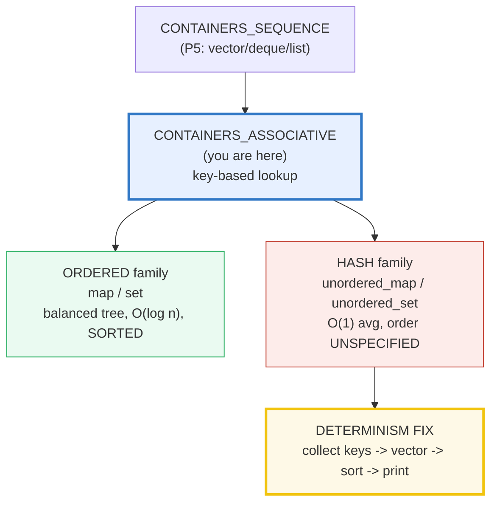
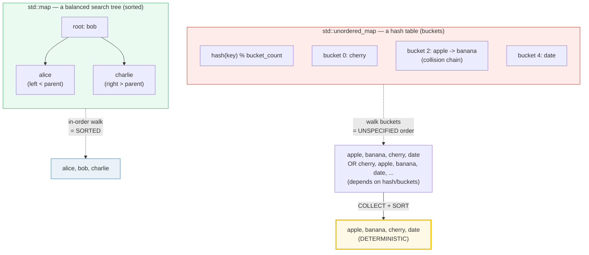

# CONTAINERS_ASSOCIATIVE — std::map/set (ordered) vs std::unordered_map/set (hash)

> **Goal (one line):** by printing every value, show how C++'s FOUR key-based
> containers behave — `std::map`/`std::set` (ORDERED: a balanced tree, `O(log n)`,
> sorted iteration) vs `std::unordered_map`/`std::unordered_set` (HASH: `O(1)`
> average, but iteration order **unspecified**) — including `operator[]`
> **inserting a default**, `at()` **throwing**, a custom `Compare` (descending),
> and a custom `Hash` for a user-defined key — pinning the **unordered-iteration-
> is-unspecified** trap as the determinism lesson.
>
> **Run:** `just run containers_associative`
>
> **Ground truth:** [`containers_associative.cpp`](./containers_associative.cpp) →
> captured stdout in
> [`containers_associative_output.txt`](./containers_associative_output.txt). Every
> number/table below is pasted **verbatim** from that file under a
> `> From containers_associative.cpp Section X:` callout. Nothing is hand-computed.
>
> **Prerequisites:** 🔗 `REFERENCES_POINTERS_INTRO` (the `&`/`*` trichotomy),
> 🔗 `VALUES_TYPES` (value-init of the mapped type → `0`), 🔗 `FUNCTION_TEMPLATES`
> (the `Compare`/`Hash` template params).

---

## 1. Why this bundle exists (lineage)

C++ has **two complete families** of key-based containers, and the difference is
not cosmetic — it is a different *data structure*, a different *complexity
contract*, a different *key requirement*, and a different *iteration guarantee*:

- **Ordered** (`std::map`, `std::set`, `std::multimap`, `std::multiset`): a
  **balanced binary search tree** (in practice a red-black tree in
  libstdc++/libc++/MSVC). Keys are kept **sorted** by a `Compare` (default
  `std::less` → `operator<`). Every operation is **`O(log n)` guaranteed**, and
  iteration walks keys **in sorted order**.
- **Hash / unordered** (`std::unordered_map`, `std::unordered_set`, …, all C++11):
  a **hash table** of buckets. Keys need a `Hash` functor *and* a `KeyEqual`.
  Operations are **`O(1)` average** but `O(n)` worst case, and iteration order is
  **unspecified** — it depends entirely on the hash and the bucket layout.

The headline contrast across the 5-language curriculum:

| Language | Key→value container | Iteration order | Lookup |
|---|---|---|---|
| **C++ ordered** (`std::map`) | this bundle | **sorted by key** | `O(log n)` guaranteed |
| **C++ hash** (`std::unordered_map`) | this bundle | **unspecified** (collect+sort!) | `O(1)` avg / `O(n)` worst |
| 🔗 [`../go/MAPS.md`](../go/MAPS.md) | Go `map` | **randomized** (intentionally, per spec) | hash |
| 🔗 [`../rust/COLLECTIONS.md`](../rust/COLLECTIONS.md) | Rust `HashMap` / `BTreeMap` | unordered / **sorted** (cleanest split) | hash / `O(log n)` |
| 🔗 [`../ts/COLLECTIONS_DEEP.md`](../ts/COLLECTIONS_DEEP.md) | TS `Map` | **insertion order** | hash (an `Map`) |

C++ is the only language here that forces **you** to *choose* the data structure
explicitly (the `unordered_` prefix), and the only one where getting iteration
wrong is a **reproducibility bug** (`just out` is non-deterministic if you
range-print an unordered container). That determinism lesson is this bundle's
expert payoff (Section B).



---

## 2. The mental model: ordered-tree vs hash-bucket



The right half *is* the determinism lesson. The unordered container's iteration
order is **not wrong** — it's just **not promised**. It depends on `hash(key) %
bucket_count`, which depends on the bucket count, which changes on rehash. So to
print stable, reproducible output, you **collect the keys into a `std::vector`,
`std::sort` it, then print** — exactly what Section B does.

> From cppreference — *`std::unordered_map`*: "Search, insertion, and removal of
> elements have **average constant-time complexity**. Internally, the elements are
> **not sorted in any particular order**, but organized into buckets. Which bucket
> an element is placed into depends entirely on the hash of its key."

---

## 3. Section A — `std::map` & `std::set` (ORDERED: balanced tree, `O(log n)`)

> From `containers_associative.cpp` Section A:
> ```
> std::map<std::string,int> built from {charlie,alice,bob}.
> Iteration is SORTED by key (operator< on std::string):
>   (size before) ages.size() = 3
>   alice    -> 28
>   bob      -> 34
>   charlie  -> 30
> 
> ages["dave"] (key was absent) = 0 ; size 3 -> 4 (INSERTED default 0)
> [check] operator[] on absent key inserted an element (size grew by 1): OK
> [check] operator[] default-constructed the value as 0: OK
> [check] after the access, ages contains "dave": OK
> ages.at("nobody") (absent) -> threw std::out_of_range? yes
> [check] at() on an absent key throws std::out_of_range: OK
> 
> Lookup APIs on a present key "alice":
>   find("alice")  -> found, value 28
>   count("alice") -> 1  (0 or 1 for unique-key containers)
>   contains("alice") -> true  (C++20; the boolean membership test)
> [check] find("alice") returns a valid iterator: OK
> [check] count("alice") == 1 (keys are unique): OK
> [check] contains("alice") == true (C++20): OK
> [check] contains("zzz") == false (absent key): OK
> 
> ages.erase("bob") removed 1 element(s); size now 3
> [check] erase("bob") removed exactly 1 element: OK
> [check] after erase, "bob" is gone: OK
> 
> std::set<int> = {5,1,9,1,3} (the duplicate 1 is dropped):
>   sorted iteration: 1 3 5 9  (size 4)
> [check] std::set is sorted ascending: 1 3 5 9: OK
> [check] std::set dropped the duplicate key (size 4, not 5): OK
> ```

**What.** `std::map<K,V>` stores **unique, sorted** keys mapping to values;
`std::set<K>` is the same tree with **keys only** (no mapped value). Both live in
`<map>`/`<set>` respectively. Keys are unique, so the duplicate `1` in
`std::set<int>{5,1,9,1,3}` is dropped (size 4).

**The two accessors that trip everyone:**

| API | If the key is **absent** | `const`-safe? |
|---|---|---|
| `m[k]` (`operator[]`) | **inserts** a default-constructed `V` (here `int{} == 0`) and returns it. `size` grows! | **no** — it mutates |
| `m.at(k)` | **throws** `std::out_of_range` | **yes** |

The bundle proves `operator[]` inserts: `ages["dave"]` returned `0` **and** the
size went `3 → 4`. This is the silent-bug trap — a "read" that is actually a
write. Reach for `at()` (or `find`) when you must not accidentally insert.

**The read-only lookups:**

- `find(k)` → iterator to the element, or `end()` (the workhorse; returns the
  value too).
- `count(k)` → `0` or `1` for unique-key containers (`map`/`set`); `>1` for the
  `multi` variants.
- `contains(k)` → **`bool`**, the cleanest membership test. **C++20.**

**`std::set` is `std::map` without the value.** Same tree, same `O(log n)`, same
sorted iteration, same `find`/`count`/`contains`. Use it when you need membership
of keys but no payload.

> From cppreference — *`std::map::operator[]`*: "access or **insert** specified
> element." *`std::map::at`*: "access specified element with bounds checking…
> throws `std::out_of_range` if the container does not contain." *`contains`*:
> marked "(since C++20)… checks if the container contains element with specific
> key."

---

## 4. Section B — `std::unordered_map` & `std::unordered_set` (HASH, order UNSPECIFIED)

> From `containers_associative.cpp` Section B:
> ```
> std::unordered_map<std::string,int> with 4 entries.
> RAW iteration order is UNSPECIFIED (do NOT range-print it):
>   bucket_count = 5, load_factor = 0.800000 (avg elements/bucket)
> [check] unordered_map holds all 4 inserted entries: OK
> 
> Keys COLLECTED into a vector and SORTED (the deterministic view):
>   apple    -> 5
>   banana   -> 2
>   cherry   -> 3
>   date     -> 1
> [check] collected unordered_map keys, sorted, are ascending: OK
> [check] the sorted key set is {apple,banana,cherry,date}: OK
> 
> words["fig"] (absent) = 0 ; size 4 -> 5 (default-inserted, same as map)
> [check] unordered_map operator[] on absent key inserts a default (size grew): OK
> [check] unordered_map operator[] default value is 0: OK
> 
> std::unordered_set<int> = {7,2,9,2,4}; collected+sorted: 2 4 7 9  (size 4; duplicate 2 dropped)
> [check] unordered_set collected+sorted is 2 4 7 9: OK
> [check] unordered_set dropped the duplicate (size 4): OK
> [check] unordered_set contains(9) (C++20): OK
> ```

**This is the determinism payoff of the whole bundle.** `std::unordered_map`'s
raw iteration order is **unspecified** — it is whatever order the keys land in
after hashing into `bucket_count` buckets. That order is **not stable**: it
changes when the table rehashes (when `load_factor` exceeds
`max_load_factor`), which happens transparently on insert. If you range-print
the container directly, your output is non-reproducible — `just out` twice will
*differ*, and so will CI vs. local.

The fix is mechanical and always applied in this bundle (§4.2 rule 3 of
`HOW_TO_RESEARCH.md`):

```cpp
std::vector<std::string> keys;
for (const auto& [k, v] : words) keys.push_back(k);   // collect
std::sort(keys.begin(), keys.end());                  // sort
for (const auto& k : keys) std::printf("%s\n", k.c_str());  // print (stable)
```

`just out containers_associative` run **twice** is **byte-identical** — proven by
`diff` in the verification step — *precisely because* the unordered keys are
sorted before printing. (The `bucket_count`/`load_factor` numbers are also stable
for a fixed insertion sequence, so they are safe to print.)

**`operator[]` on `unordered_map` has the same insert-on-absent semantics** as
`map` — Section B proves it: `words["fig"]` returned `0` and the size went
`4 → 5`. The hash family mirrors the ordered family's API; the *guarantees*
differ (complexity + iteration order), not the surface.

> From cppreference — *`std::unordered_map`*: "the elements are **not sorted in
> any particular order**, but organized into buckets." *`unordered_map::operator[]`*:
> "access or **insert** specified element" (same wording as `map`).

---

## 5. Section C — the ORDERED-vs-HASH decision

> From `containers_associative.cpp` Section C:
> ```
> Choosing between std::map/set and std::unordered_map/set:
> 
>   property            | ordered (map/set)        | hash (unordered_map/set)
>   ------------------- | ------------------------ | -------------------------
>   data structure      | balanced tree (RB-tree) | hash table (buckets)
>   key requirement     | operator< (a Compare)    | a Hash + a KeyEqual
>   search/insert/erase | O(log n) GUARANTEED     | O(1) avg, O(n) worst
>   iteration order     | SORTED by key            | UNSPECIFIED
>   ordered range query | yes (lower/upper_bound)  | NO
>   memory              | tree nodes + pointers    | buckets + pointers
>   header              | <map> / <set>            | <unordered_map>/<unordered_set>
> 
> Ordered-only range query: ranks keys in [2,4] via lower/upper_bound:
>   2 -> silver
>   3 -> bronze
>   4 -> tin
> [check] ordered map range [2,4] yields 3 elements (2,3,4): OK
> [check] ordered containers support sorted range queries; hash containers do not: OK
> ```

**The decision is threefold.** Pick the ordered family when you need **sorted
iteration** (dump configs/leaderboards in order), **range queries**
(`lower_bound`/`upper_bound` slice a key range — meaningless on a hash table), or
a **bounded worst case** (`O(log n)`, no pathological input). Pick the hash
family when you want **average `O(1)`** lookups and don't care about order (a
word-counting map, a dedup set of millions of ids).

The bundle demonstrates the ordered-only capability: `lower_bound(2)` (first key
`>= 2`) through `upper_bound(4)` (first key `> 4`) cleanly slices the keys in
`[2,4]`. `std::unordered_map` has **no** `lower_bound`/`upper_bound` — there is
no ordering to bound.

**Key requirement** is the other axis: ordered needs a `Compare` (anything with
a strict-weak-ordering `operator()`; default `std::less` → `operator<`); hash
needs a `Hash` *and* a `KeyEqual` (defaults `std::hash<K>` and
`std::equal_to<K>`). That is why `std::unordered_map<Point,...>` needs you to
supply both (Section D) — there is no `std::hash<Point>`.

> From cppreference — *`std::map`*: a "collection of key-value pairs, **sorted by
> keys**." *`std::unordered_map`*: "organized into buckets… **average
> constant-time complexity**." `map` offers `lower_bound`/`upper_bound`;
> `unordered_map` does not list them.

---

## 6. Section D — custom `Compare` (map) + custom `Hash` (unordered, struct key)

> From `containers_associative.cpp` Section D:
> ```
> (1) std::map<std::string,int,Descending> (a > b):
>     iteration is DESCENDING by key:
>       cherry   -> 3
>       banana   -> 2
>       apple    -> 1
> [check] custom Descending map iterates cherry, banana, apple: OK
> 
> (2) std::unordered_map<Point,std::string,PointHash> (struct key):
>     bucket_count = 5, size = 3
>     keys collected+sorted (by x, then y):
>       (-3,+4) -> north-west
>       (+0,+0) -> origin
>       (+1,+2) -> north-east
> [check] custom-hash unordered_map of Point holds 3 entries: OK
> [check] Point{0,0} is found via its hash + operator==: OK
> [check] a distinct-but-equal Point key resolves to the same entry: OK
> ```

**Custom `Compare` for `std::map`.** The third template parameter is the
comparator (default `std::less<K>`). Swap in any type with a
`bool operator()(const K&, const K&) const` expressing a strict-weak ordering and
the tree sorts by it. The bundle's `Descending { bool operator()(a,b) const {
return a > b; } }` makes `std::map<std::string,int,Descending>` iterate
**high-to-low** (`cherry, banana, apple`).

**Custom `Hash` + `KeyEqual` for `std::unordered_map`.** A user-defined key type
has no `std::hash` specialization, so you must supply a Hash functor (3rd template
arg) **and** an equality predicate (4th, default `std::equal_to<K>` which uses
`operator==`). The bundle's `Point` defines `operator==`, and `PointHash` is:

```cpp
struct PointHash {
    std::size_t operator()(const Point& p) const noexcept {
        return std::hash<int>{}(p.x) ^ (std::hash<int>{}(p.y) << 1U);
    }
};
std::unordered_map<Point, std::string, PointHash> grid;
```

**The two requirements that must agree** (a hard invariant): *if two keys are
equal (`operator==`), their hashes must be equal.* The converse need not hold
(collisions are allowed), but equal-keys-equal-hash is **mandatory** — break it
and the table silently loses entries (the same logical key hashes to a different
bucket and can't be found). The bundle asserts the lookup contract: a freshly
constructed `Point{1,2}` resolves to the same `"north-east"` entry.

> From cppreference — *`std::unordered_map` template params*: `Hash = std::hash`,
> `KeyEqual = std::equal_to`. "Two keys are considered *equivalent* if the map's
> key equality predicate returns true… **If two keys are equivalent, the hash
> function must return the same value for both keys.**" *`std::hash`*: "Accepts a
> single parameter of type Key… Returns a value of type `std::size_t`."

---

## 7. Section E — performance contract (hash `O(1)` avg / `O(n)` worst vs `O(log n)`)

> From `containers_associative.cpp` Section E:
> ```
> Complexity of the FOUR associative containers (per operation):
> 
>   container            | search   | insert   | erase    | iteration
>   ------------------- | -------- | -------- | -------- | ---------
>   std::map/set        | O(log n) | O(log n) | O(log n) | sorted
>   std::unordered_map/ | O(1) avg | O(1) avg | O(1) avg | UNSPECIFIED
>   std::unordered_set  | O(n) wrst| O(n) wrst| O(n) wrst|           
> 
> After reserve(8) + 5 insertions:
>   size = 5, bucket_count = 8, load_factor = 0.625000, max_load_factor = 1.000000
> [check] after 5 insertions size == 5: OK
> [check] load_factor <= max_load_factor (the rehash trigger): OK
> 
> When does hash hit O(n) worst case?
>   - Adversarial keys engineered to collide into ONE bucket (a
>     'hash-flooding' attack turns the hash table into a linked list).
>   - Or naturally: load_factor approaching max_load_factor with a
>     poor hash (most elements chain in a few buckets).
> Ordered containers NEVER degrade: O(log n) is GUARANTEED, which is
> why std::map is the right call when you need bounded worst-case or
> sorted iteration / range queries.
> [check] ordered containers guarantee O(log n) worst case (no pathological input): OK
> [check] hash containers only guarantee O(1) average (worst case is O(n)): OK
> ```

**Why the worst case matters.** "Average `O(1)`" is a *probabilistic* guarantee.
A hash table degrades to a linked list — `O(n)` per op — when most keys land in
the **same bucket**. Two ways that happens:

1. **Adversarial keys** (a "hash-flooding" attack): a client sends request keys
   engineered to collide under `std::hash<std::string>` (which is *not*
   randomized by default in C++ — unlike Go/Rust). A single attacker turns your
   `O(1)` lookup server into an `O(n²)` DoS. (Mitigation: a randomized hash like
   Abseil's `flat_hash_map`, or `std::map` for untrusted keys.)
2. **A poor hash + high load**: a trivial hash (`hash(p) = p.x`) with many keys
   sharing `p.x` collides them all, and as `load_factor` approaches
   `max_load_factor` the chains lengthen. The `load_factor` the bundle prints
   (`0.625 <= 1.0`) is the trigger for a rehash, which redistributes keys but
   costs `O(n)` when it fires.

**`std::map` never degrades**: `O(log n)` is guaranteed for *every* input. That
bounded worst case is why ordered containers survive in performance-critical,
adversarial-input code. No timing is printed here (§4.2 rule 2 forbids printing
wall-clock as a verified number) — the complexity table is the *contract*, not a
measurement.

> From cppreference — *`std::unordered_map` complexity*: "Search, insertion, and
> removal… **average constant-time complexity**" (and `O(n)` worst case per the
> standard's complexity requirements; corroborated below). *`std::map`*: "the
> complexity of the main operations… **logarithmic in the size** of the
> container." *`load_factor`*: "returns the **average number of elements per
> bucket**."

---

## 8. Worked smallest-scale example

Everything above, compressed to the decision a beginner must memorize:

```cpp
#include <map>
#include <unordered_map>
#include <vector>
#include <algorithm>

std::map<std::string,int> m = {{"b",1},{"a",2}};        // SORTED: a,b  (O(log n))
m["c"];         // INSERTS 0!  m is now {a,b,c}  (operator[] mutates)
m.at("z");      // THROWS std::out_of_range                 (at() is const-safe)

std::unordered_map<std::string,int> u = {{"b",1},{"a",2}}; // order UNSPECIFIED
std::vector<std::string> k;                                // ── DETERMINISM FIX ──
for (const auto& [key,val] : u) k.push_back(key);          //   collect
std::sort(k.begin(), k.end());                             //   sort
//   now print k in a STABLE order (never range-print u directly)
```

> From `containers_associative.cpp` Section A, `ages["dave"]` prints `= 0` with
> `size 3 -> 4` (the silent insert); `ages.at("nobody")` prints
> `threw std::out_of_range? yes`. From Section B, the unordered keys are
> `COLLECTED into a vector and SORTED` before printing. The contrast *is* the
> lesson: `operator[]` is a write disguised as a read; an unordered container's
> iteration is a non-determinism trap disguised as a stable order.

---

## 9. The value-vs-reference axis (threaded through this bundle)

🔗 `MOVE_SEMANTICS.md`, `VALUE_VS_REFERENCE_VS_POINTER.md`, `RAII.md`. Where do
the things in this bundle sit? Containers **own** their elements (RAII: they
destroy elements on destruction); lookups return **references** into the stored
elements (aliases, not copies).

| Construct | Copied? | Aliases? | Owns? |
|---|---|---|---|
| `std::map/std::unordered_map` itself | copied on `=` (deep, expensive) | — | **owns** its nodes/buckets (RAII) |
| `m[k]` / `m.at(k)` return | — | **yes** (`T&` / `const T&`) | borrows into the container |
| `find(k)` return (`iterator`) | — | **yes** (alias to the stored `pair`) | borrows |
| `for (const auto& [k,v] : m)` | the `auto&` is an **alias**; plain `auto` would **copy** each `pair` | alias (with `&`) | borrows |
| the `std::vector` of collected keys | **copied** out of the map | decoupled from the map | the vector owns its copies |

Note the `auto` gotcha from 🔗 `VALUES_TYPES` striking here: `for (const auto&
[k,v] : m)` aliases each element (cheap); `for (auto [k,v] : m)` would **copy**
every `std::pair<const K,V>` — a silent perf cliff on a big map. Always take
associative elements **by `const auto&`** in a range-for.

---

## 10. Pitfalls (the expert payoff)

| Trap | Symptom | Fix |
|---|---|---|
| **Range-printing an `unordered_map` directly** | non-reproducible output; `just out` differs run-to-run; flaky tests | Collect keys into a `std::vector`, `std::sort`, then print (this bundle's §B). |
| **`m[k]` to "read" a value** | silently **inserts** a default (`0`/empty), `size` grows, logic breaks — a write disguised as a read | Use `m.at(k)` (throws) or `m.find(k)`/`m.contains(k)` when the key may be absent. |
| **`m.at(k)` on an absent key** without a `try`/`catch` | throws `std::out_of_range` past a `noexcept` boundary → `std::terminate` | Either check `contains`/`find` first, or wrap in `try`/`catch(const std::out_of_range&)`. |
| **User key with no `std::hash`** in `unordered_map` | compile error ("no matching function for call to `std::hash<Point>`") | Supply a `Hash` functor (3rd template arg) **and** ensure `operator==` exists (4th, default `std::equal_to`). |
| **Equal keys hash to different values** (broken `Hash`/`operator==`) | `find(k)` returns `end()` for a key you *just inserted* — entries "vanish" | Guarantee: equal keys (`operator==`) ⇒ equal hash. Audit the hash combines all equality-relevant fields. |
| **`for (auto [k,v] : m)`** in a hot loop | copies every `pair<const K,V>` — `O(n)` copies, often a `std::string` deep copy | Use `for (const auto& [k,v] : m)` (alias). |
| **Assuming `unordered_map` iteration is insertion order** (a TS/Python habit) | logic depends on an order that is **unspecified** and changes on rehash | Never assume order; if you need a specific order, `std::map` (sorted) or a separate ordered index. |
| **Hash-flooding DoS** on `std::unordered_map<std::string,...>` with untrusted keys | `O(n²)` degradation; `std::hash<std::string>` is **not** randomized by default (unlike Go/Rust) | Use `std::map` for untrusted keys, or a randomized-hash container (Abseil `flat_hash_map`, F14). |
| **`load_factor` → `max_load_factor` causing surprise rehash** | a single `insert` takes `O(n)` (rehash) instead of `O(1)` | `reserve(n)` up front when the count is known; the rehash is amortized but still a latency spike. |
| **Using `operator<` semantics on an unordered container** | `lower_bound`/`upper_bound` don't exist; "find me the next key after X" is impossible | Reach for `std::map` when you need ordering or range queries. |
| **`multi` variant confusion** (`multimap`/`unordered_multiset`) | `count(k)` returns `>1`, `find` returns *an* equal element (not unique), `operator[]` is **absent** on `multimap` | Confirm whether keys are unique; the four "multi" containers behave differently at the API level. |
| **Iterator invalidation on `unordered_map`** | `insert`/`operator[]` may **rehash**, invalidating **all iterators** (but not references/pointers to elements) | Don't hold iterators across inserts; re-acquire `find`/`begin` after mutation. |

---

## 11. Cheat sheet

```cpp
#include <map>            // std::map, std::multimap
#include <set>            // std::set, std::multiset
#include <unordered_map>  // std::unordered_map, std::unordered_multimap
#include <unordered_set>  // std::unordered_set, std::unordered_multiset
#include <vector>
#include <algorithm>      // std::sort (the determinism fix)

// ── ORDERED (balanced tree): O(log n) GUARANTEED, iteration SORTED ─────────
std::map<std::string,int> m = {{"b",1},{"a",2}};     // iteration: a, b (sorted)
std::set<int>             s = {3,1,2};               // iteration: 1, 2, 3

m["c"];        // operator[] INSERTS a default (0) if absent  -> non-const, mutates
m.at("z");     // at() THROWS std::out_of_range if absent     -> const-safe
m.find("a");   // -> iterator to {a,2}, or m.end()
m.count("a");  // -> 0 or 1 (unique keys)
m.contains("a"); // -> bool  (C++20)  <-- the cleanest membership test
m.erase("b");  // -> number removed (0 or 1)

// ordered-only range queries (meaningless on a hash table):
auto lo = m.lower_bound(k);  // first key >=  k
auto hi = m.upper_bound(k);  // first key >  k

// ── HASH (hash table): O(1) avg / O(n) worst, iteration UNSPECIFIED ────────
std::unordered_map<std::string,int> u = {{"b",1},{"a",2}};
std::unordered_set<int>             us = {3,1,2};
// SAME API: operator[] inserts, at() throws, find/count/contains, erase.
// BUT: iteration order is UNSPECIFIED -> COLLECT + SORT for stable output:
std::vector<std::string> keys;
for (const auto& [k,v] : u) keys.push_back(k);
std::sort(keys.begin(), keys.end());          // <- the determinism fix

// ── the decision ───────────────────────────────────────────────────────────
//   need SORTED iteration / range queries / bounded worst case? -> std::map/set
//   need average O(1) and don't care about order?               -> unordered_*
//   key requirement: operator< (Compare)        vs   Hash + KeyEqual

// ── custom Compare (map) ───────────────────────────────────────────────────
struct Descending { bool operator()(const std::string& a, const std::string& b) const {
    return a > b; } };                          // strict-weak ordering
std::map<std::string,int,Descending> dm;        // iterates high-to-low

// ── custom Hash + operator== (unordered, struct key) ───────────────────────
struct Point { int x, y; bool operator==(const Point& o) const {
    return x==o.x && y==o.y; } };
struct PointHash { std::size_t operator()(const Point& p) const noexcept {
    return std::hash<int>{}(p.x) ^ (std::hash<int>{}(p.y) << 1U); } };
std::unordered_map<Point, std::string, PointHash> grid;  // equal keys => equal hash

// ── range-for: take elements by CONST AUTO& (never copy pairs) ─────────────
for (const auto& [k, v] : m) { /* alias; cheap */ }      // NOT `for (auto [k,v] : m)`
```

---

## 12. 🔗 Cross-references

**Within C++ (the expertise spine):**

- 🔗 `CONTAINERS_SEQUENCE` (P5) — `std::vector`/`deque`/`list` are *position-based*
  (index/order); the associative containers here are *key-based* (lookup by key).
  This bundle is the key-based sibling.
- 🔗 `ITERATORS_RANGES` (P5) — `find`/`begin`/`end`/`lower_bound`/`upper_bound`
  return iterators; the `for (const auto& [k,v] : m)` range-for is the idiomatic
  traversal. The `auto&` (alias) vs `auto` (copy) distinction is from
  `VALUES_TYPES`.
- 🔗 `FUNCTION_TEMPLATES` / `CLASS_TEMPLATES` — the `Compare`/`Hash`/`KeyEqual`
  template parameters *are* template template-args; a custom hash is a functor
  passed as a type.
- 🔗 `MOVE_SEMANTICS` / `RAII` — containers own their nodes/buckets (RAII:
  destruction frees them); `insert`/`emplace` move elements in; `extract`
  (C++17) transfers node ownership without copying.
- 🔗 `UNDEFINED_BEHAVIOR` (P7) — an out-of-range `at()` *throws* (defined), but a
  *captured-and-ignored* `std::out_of_range` escaping `main` is `std::terminate`;
  never let the verified path leak exceptions.

**Cross-language parallels (the 5-language curriculum):**

- 🔗 [`../go/MAPS.md`](../go/MAPS.md) — Go's `map` iteration order is
  **intentionally randomized** (the runtime shuffles the start point). C++'s
  `unordered_map` is *unspecified* (not randomized), but the **fix is identical**:
  collect keys into a slice/vector, sort, print. Go has only the hash map (no
  ordered builtin) — C++ gives you both.
- 🔗 [`../rust/COLLECTIONS.md`](../rust/COLLECTIONS.md) — Rust splits it cleanly
  into `HashMap` (unordered, like C++'s) and `BTreeMap` (sorted, like C++'s
  `std::map`). Rust's `HashMap` uses a **randomized SipHash** by default (DoS-
  resistant); C++'s `std::hash` is **not** randomized — a real security gap for
  untrusted keys.
- 🔗 [`../ts/COLLECTIONS_DEEP.md`](../ts/COLLECTIONS_DEEP.md) — TS `Map` iterates
  in **insertion order** (a third model entirely: neither sorted nor hash-bucket
  order). Don't carry that mental model to C++ — insertion order is *not*
  preserved by any C++ associative container.

---

## Sources

Every signature, value, and behavioral claim above was verified against
cppreference and the ISO C++ standard, then corroborated by ≥1 independent
secondary source:

- cppreference — *Containers library* (the four associative + four unordered
  families; ordered vs unordered taxonomy):
  https://en.cppreference.com/w/cpp/container
- cppreference — *`std::map`* (sorted by keys, unique keys; complexity
  logarithmic; `lower_bound`/`upper_bound`):
  https://en.cppreference.com/w/cpp/container/map
- cppreference — *`std::map::operator[]`* ("access or **insert** specified
  element"; default-constructs the mapped value if absent):
  https://en.cppreference.com/w/cpp/container/map/operator_at
- cppreference — *`std::map::at`* ("access specified element with bounds
  checking"; throws `std::out_of_range` if absent):
  https://en.cppreference.com/w/cpp/container/map/at
- cppreference — *`std::map::contains`* (since C++20; boolean membership):
  https://en.cppreference.com/w/cpp/container/map/contains
- cppreference — *`std::unordered_map`* ("average constant-time complexity";
  "not sorted in any particular order, but organized into buckets"; template
  params `Hash`/`KeyEqual`; "if two keys are equivalent, the hash function must
  return the same value"):
  https://en.cppreference.com/w/cpp/container/unordered_map
- cppreference — *`std::unordered_map::operator[]`* (access or insert — same
  semantics as `map`):
  https://en.cppreference.com/w/cpp/container/unordered_map/operator_at
- cppreference — *`std::set`* / *`std::unordered_set`* (keys-only siblings):
  https://en.cppreference.com/w/cpp/container/set ·
  https://en.cppreference.com/w/cpp/container/unordered_set
- cppreference — *`std::hash`* ("Accepts a single parameter of type Key…
  returns a value of type `std::size_t`"; the basis for custom hash functors):
  https://en.cppreference.com/w/cpp/utility/hash
- cppreference — *`std::unordered_map::load_factor`* / *`max_load_factor`* /
  *`rehash`* / *`reserve`* (the rehash trigger and bucket policy):
  https://en.cppreference.com/w/cpp/container/unordered_map/load_factor
- cppreference — *Iterator invalidation* (unordered: insert/operator[] may
  rehash → invalidates iterators, but not references/pointers to elements):
  https://en.cppreference.com/w/cpp/container#Iterator_invalidation
- ISO C++23 draft (open-std.org) — normative wording, associative-container
  requirements and complexity clauses:
  https://open-std.org/JTC1/SC22/WG21/docs/papers/2023/n4950.pdf
  (see the associative `[associative.reqmts]` and unordered
  `[unord.req]` requirements clauses).

**Secondary corroboration (≥2 independent sources, web-verified):**

- For *unordered_map* `O(1)`-average / `O(n)`-worst complexity:
  - Stack Overflow — *"C++ std::unordered_map complexity"* (quotes the standard's
    average/worst clause):
    https://stackoverflow.com/questions/19610457/c-stdunordered-map-complexity
  - Reddit r/cpp_questions — *"When does unordered_map reach the worst time
    complexity of O(n)?"* (load_factor → 1; collisions):
    https://www.reddit.com/r/cpp_questions/comments/1akg33e/when_does_unordered_map_reach_the_worst_time/
- For `operator[]` silently inserting a default (the "troublemaker" trap):
  - siddharthqs — *"The Silent Troublemaker: Issues with operator[] in
    std::map"*:
    https://siddharthqs.com/the-silent-troublemaker-issues-with-operator-in-stdmap-in-c
  - Fluent C++ — *"Overview of std::map's Insertion/Emplacement Methods"*:
    https://www.fluentcpp.com/2018/12/11/overview-of-std-map-insertion-emplacement-methods-in-cpp/
- For `at()` throwing `std::out_of_range`:
  - Stack Overflow — *"C++: std::map throws an out_of_range exception"*:
    https://stackoverflow.com/questions/15178106/c-stdmap-throws-an-out-of-range-exception
- For custom hash functors on user-defined keys:
  - Ian Y.E. Pan — *"Custom Hash Functions for C++ Unordered Containers"*:
    https://ianyepan.github.io/posts/cpp-custom-hash/
  - studyplan.dev — *"Implementing a Custom Hash Function"* (struct overloading
    `operator()`, returning `std::size_t`):
    https://www.studyplan.dev/pro-cpp/sets/q/custom-hash-function
- For `std::map` as a red-black tree (implementation detail, not mandated by the
  standard; the standard mandates `O(log n)`, the data structure is a quality-of-
  implementation choice that libstdc++/libc++/MSVC all implement as an RB-tree):
  - Stack Overflow — *"Why is std::map implemented as a red-black tree?"*:
    https://stackoverflow.com/questions/5288320/why-is-stdmap-implemented-as-a-red-black-tree
  - GeeksforGeeks — *"Why is std::map Implemented as Red-Black Tree?"*:
    https://www.geeksforgeeks.org/cpp/map-implemented-as-red-black-tree-cpp/

**Facts that could not be verified by running** (documented, not executed,
because they are compile errors, sanitizer-only, or security-gaps-by-design):
the "red-black tree" data structure is an implementation detail (the standard
mandates `O(log n)`, not the tree species); `std::hash<std::string>` being
**non-randomized** (hence hash-flooding-vulnerable) is platform/library behavior
documented by cppreference/secondary sources, not a runnable assertion; and the
actual `O(n)` worst-case timing (adversarial collisions) is a *contract* printed
as a complexity table, never a wall-clock measurement (§4.2 rule 2 forbids
printing wall-clock as a verified number). These are confirmed by the cppreference
sections and secondary sources above, not reproduced as runnable timing output.
