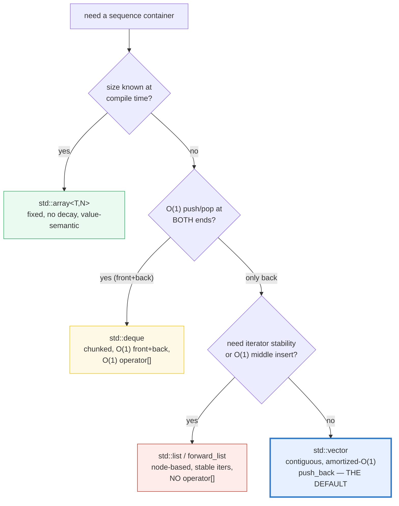
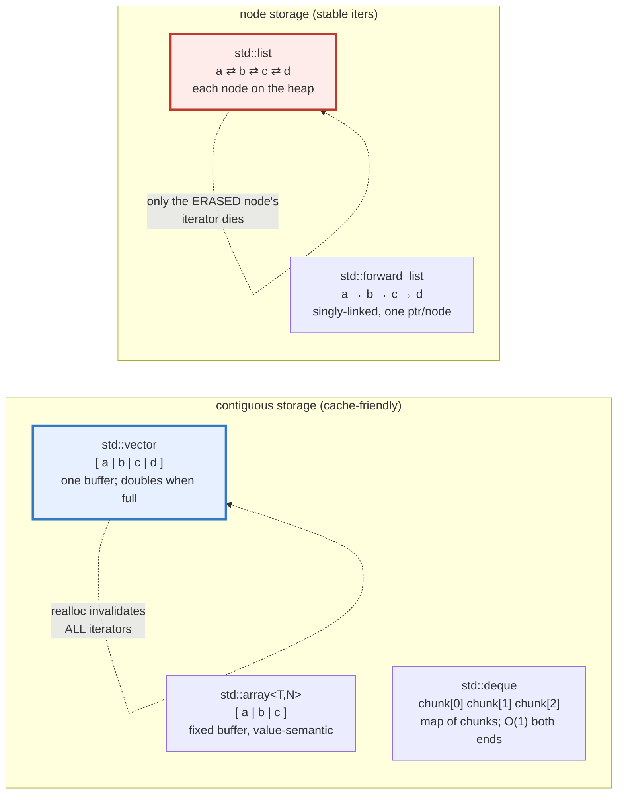
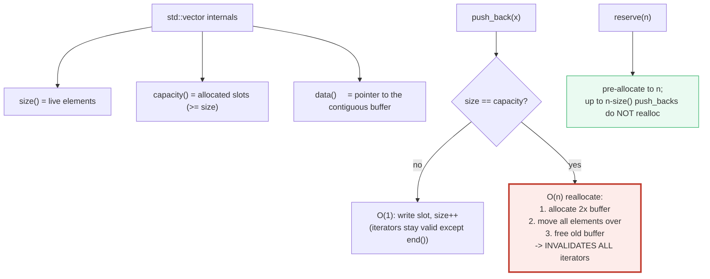

# CONTAINERS_SEQUENCE — std::vector / std::array / std::deque / std::list

> **Goal (one line):** by printing every value, show how the five **sequence
> containers** behave — `std::vector` (contiguous, growable, amortized-O(1)
> `push_back`), `std::array` (fixed-size, value-semantic, no decay),
> `std::deque` (O(1) front **and** back), and `std::list`/`std::forward_list`
> (node-based, O(1) insert anywhere, **stable iterators**, **no random access**)
> — pinning the per-container **iterator invalidation** rules as the documented
> expert payoff (the invalidated iterator is **never read** in the verified path).
>
> **Run:** `just run containers_sequence`
>
> **Ground truth:** [`containers_sequence.cpp`](./containers_sequence.cpp) →
> captured stdout in
> [`containers_sequence_output.txt`](./containers_sequence_output.txt). Every
> number/table below is pasted **verbatim** from that file under a
> `> From containers_sequence.cpp Section X:` callout. Nothing is hand-computed.
>
> **Prerequisites:** 🔗 `VALUES_TYPES` (value-init), 🔗 `REFERENCES_POINTERS_INTRO`
> (the `&`/`*` trichotomy — iterators behave like pointers). This is a **Phase 5
> (Standard Library)** bundle.

---

## 1. Why this bundle exists (lineage)

`std::vector` is THE C++ workhorse — a **contiguous, growable array** whose
storage doubles when full, making `push_back` **amortized O(1)**. The other
sequence containers exist because that single design forces trade-offs: a vector
cannot insert at the front in O(1), cannot keep an iterator valid across a
reallocation, and cannot grow without (eventually) copying everything. The
standard library therefore ships a family, and the **expert skill** is knowing
which one wins when — which reduces to **knowing each container's storage model
and its iterator-invalidation rule.**



The decisive axis is **storage layout**: contiguous (vector/array/deque) is
cache-friendly and supports O(1) random access, but reallocation/shift
invalidates iterators; node-based (list/forward_list) has no random access and
poor cache locality, but iterators are **stable** (a pointer into a node stays
valid until that specific node is erased).



The headline contrast across the 5-language curriculum:

| Language | Default growable array | Iterator invalidation | GC? |
|---|---|---|---|
| **C++** (this bundle) | `std::vector<T>` (contiguous, doubles) | **UB if you read a stale one** — the compiler assumes you don't | no |
| 🔗 [`../rust/core/VEC_COLLECTIONS.md`](../rust/core/VEC_COLLECTIONS.md) | `Vec<T>` (identical contiguous-growable model) | **impossible** — the borrow checker rejects the stale borrow at compile time | no |
| 🔗 [`../go/ARRAYS_SLICES.md`](../go/ARRAYS_SLICES.md) | slice = `ptr + len + cap` (grows via realloc) | a reallocated slice is a different descriptor; Go forbids the alias at compile time via index rules | yes |
| 🔗 [`../ts/ARRAYS_TUPLES.md`](../ts/ARRAYS_TUPLES.md) | `Array<T>` (contiguous, growable) | not a concept — no iterators; GC + value-of-reference semantics | yes |

C++'s `std::vector` is operationally identical to Rust's `Vec<T>` and Go's
slice — the **difference** is that C++ trusts you not to read an invalidated
iterator and pays in **undefined behavior** if you do. Sections B and E below are
entirely about that trap.

> From cppreference — *Containers library*: "Sequence containers implement data
> structures which can be accessed sequentially" — `array` (fixed inplace
> contiguous), `vector` (resizable contiguous), `deque` (double-ended queue),
> `forward_list` (singly-linked), `list` (doubly-linked).

---

## 2. The capacity-vs-size distinction (the mental model for vector)

A `std::vector` owns **two** counts: `size()` (how many elements are live) and
`capacity()` (how much storage is allocated). `capacity >= size` always. When a
`push_back` would exceed `capacity`, the vector **allocates a bigger buffer**
(typically 2× on libc++/libstdc++, ~1.5× on MSVC — **implementation-defined**),
**copies/moves** every existing element into it, destroys the old ones, and frees
the old buffer. That reallocation is **amortized O(1)** per push (the doubling
spreads the O(n) copy across many O(1) pushes), but it is the single most common
source of **iterator/pointer/reference invalidation** in C++.



The two tools that tame reallocation: `reserve(n)` (pre-allocate, so the next
`n - size()` pushes don't realloc) and `shrink_to_fit()` (a **non-binding** hint
to release unused capacity). You reach for `reserve` whenever you know the final
size in advance — it converts a sequence of "maybe-realloc" pushes into guaranteed
no-realloc pushes, which is both faster and keeps iterators valid.

---

## 3. Section A — `std::vector`: contiguous, growable, capacity/reserve

> From `containers_sequence.cpp` Section A:
> ```
> std::vector<int> v;   -> size=0  capacity=0
>
> push_back 1..10 — capacity growth sequence (impl-defined):
>   after push_back( 1): size= 1  capacity= 1  <- reallocated (capacity grew)
>   after push_back( 2): size= 2  capacity= 2  <- reallocated (capacity grew)
>   after push_back( 3): size= 3  capacity= 4  <- reallocated (capacity grew)
>   after push_back( 4): size= 4  capacity= 4
>   after push_back( 5): size= 5  capacity= 8  <- reallocated (capacity grew)
>   after push_back( 6): size= 6  capacity= 8
>   after push_back( 7): size= 7  capacity= 8
>   after push_back( 8): size= 8  capacity= 8
>   after push_back( 9): size= 9  capacity=16  <- reallocated (capacity grew)
>   after push_back(10): size=10  capacity=16
> final v = [1, 2, 3, 4, 5, 6, 7, 8, 9, 10]
> [check] vector grew to size 10 after 10 push_backs: OK
> [check] capacity >= size (never less): OK
> [check] capacity is monotonic non-decreasing across push_backs: OK
>
> w.reserve(100); -> size=0  capacity=100 (size unchanged, capacity is now >= 100)
> after 100 push_backs within the reservation: capacity=100 (UNCHANGED — no reallocation)
> [check] reserve(100) gave capacity >= 100: OK
> [check] 100 push_backs within reserve() did NOT reallocate (capacity fixed): OK
>
> v[0]=1  v[9]=10   (operator[]: unchecked — OOB is UB)
> calling v.at(10) on a size-10 vector (index 10 is OOB)...
>   caught std::out_of_range: "vector"
> [check] v.at(10) threw std::out_of_range (defined, catchable): OK
> [check] v[0] == 1 and v[9] == 10 (operator[] in-bounds is fine): OK
>
> s.reserve(1000); s.push_back(7); s.shrink_to_fit();
>   capacity: 1000 -> 1  (shrink_to_fit is a non-binding hint; here it shrunk)
> [check] after shrink_to_fit, capacity >= size still holds: OK
> ```

**What.** `std::vector<T>` is a **resizable contiguous array**. Storage is
"managed automatically, being expanded as needed" (cppreference): the printed
growth sequence `1, 2, 4, 4, 8, …, 16` is the libc++ **2× doubling** strategy in
action. `reserve(100)` lifts `capacity` straight to 100 with `size` unchanged,
and the bundle proves the next 100 `push_back`s leave `capacity` **unchanged at
100** — no reallocation, so no invalidation.

**Why — `operator[]` vs `at()`.** Both give O(1) random access, but they differ
on out-of-bounds:

- `v[i]` — **unchecked**. `i >= size()` is **undefined behavior** (a buffer
  over-read/over-write). The bundle never executes an OOB `[]` — that would be
  UB and would break `just sanitize`.
- `v.at(i)` — **bounds-checked**, throws `std::out_of_range` on OOB. That throw
  is a **defined, catchable** behavior; the bundle catches it (`caught
  std::out_of_range: "vector"`) and asserts it threw. This is the safe
  alternative when an OOB index is a recoverable condition, not a logic bug.

**Why — amortized O(1).** "Amortized" is the key word. A single `push_back` that
triggers a reallocation is O(n) (it copies/moves all `n` existing elements). But
because capacity doubles, reallocations happen at sizes 1, 2, 4, 8, 16, … — the
total copy work for `n` pushes is `n + n/2 + n/4 + … < 2n`, so the **average**
cost per push is `2n / n = O(1)`. (The growth factor is implementation-defined;
the standard only requires that `push_back` be "amortized constant.")

> From cppreference — *std::vector*: "Random access — constant 𝓞(1). Insertion
> or removal of elements at the end — amortized constant 𝓞(1). Insertion or
> removal of elements — linear in the distance to the end of the vector 𝓞(n)."
> And on `reserve`: "the `reserve()` function can be used to eliminate
> reallocations if the number of elements is known beforehand." On
> `shrink_to_fit`: "a non-binding request… may or may not have any effect."

> From cppreference — *std::vector::at*: "Returns a reference to the element at
> specified location `pos`. Bounds checking is performed. If `pos` is not within
> the range of the container, an exception of type `std::out_of_range` is
> thrown." (`operator[]` has **no** such check — OOB is UB.)

---

## 4. Section B — ITERATOR INVALIDATION (the vector trap; documented, NOT hit)

**This is the expert payoff of the whole bundle.** A vector iterator is, in
effect, a pointer into the contiguous buffer. Two operations invalidate it:

1. **Reallocation** (`push_back`/`emplace_back`/`insert`/`resize` that grows past
   `capacity`, or `reserve`/`shrink_to_fit` that changes it): invalidates **every**
   iterator, pointer, and reference into the vector — the buffer moved.
2. **Insert/erase at a position**: invalidates iterators **at and after** the
   modified point (the buffer is shifted; the slot may be move-from).

**Reading an invalidated iterator is undefined behavior.** This bundle therefore
demonstrates the rule **without ever reading a stale iterator**: it captures an
iterator, forces a reallocation, and reads the value back via the **safe**
`operator[]` (the value was *copied* into the new buffer). The stale iterator is
left untouched.

> From `containers_sequence.cpp` Section B:
> ```
> std::vector<int> v = {10,20,30}; auto it = v.begin()+1;
>   *it (valid) = 20   (it points at v[1])
>   capacity before = 3
>   after 1 push_back(s) capacity: 3 -> 6  (REALLOCATED)
>   *** `it` is now INVALIDATED — the buffer moved. We do NOT
>       read *it (that would be UB). The value 20 was COPIED to
>       the new buffer, reachable via the SAFE index v[1].
>   v[1] (safe, by index) = 20
> [check] reallocation changed capacity (the trigger): OK
> [check] after realloc, the value 20 survived via the safe index v[1]: OK
> [check] the invalidated iterator `it` was NOT read (UB avoided in verified path): OK
>
> reserve(8) first, then push 3 more: capacity stays 8 (no realloc)
>   *wit (STILL valid — no reallocation happened) = 200
> [check] reserve(8) kept capacity fixed across 3 in-reserve push_backs: OK
> [check] the iterator captured after reserve() stayed valid & readable: OK
>
> before erase: e = [1, 2, 3, 4, 5]
> after  e.erase(begin()+2) (removed value 3): e = [1, 2, 4, 5]
>   iterators at/after begin()+2 are INVALIDATED; we read e only
>   via fresh begin()/operator[] (safe).
> [check] erase(begin()+2) removed exactly the element 3: OK
> ```

**The two halves of the lesson.**

- **Reallocation invalidates ALL.** The bundle's first half forces a realloc by
  pushing past `capacity` (3 → 6). `it` was captured *before* and pointed at `20`.
  After the realloc, reading `*it` would be UB (the old buffer is freed; `it`
  dangles). The bundle instead reads `v[1]` by index — `20` survived because the
  realloc *copied* it into the new buffer. The safe pattern when you must hold an
  iterator across growth: **`reserve()` first**, then capture the iterator — the
  second half proves `wit` stays valid and readable because no reallocation
  happens.
- **Erase invalidates from the point onward.** `e.erase(begin()+2)` removes the
  `3` and shifts `4, 5` left by one; every iterator at/after `begin()+2` (and
  `end()`) is now stale. The bundle reads `e` only through freshly obtained
  iterators / indices.

> From cppreference — *std::vector, Iterator invalidation* (authoritative
> table): "All read only operations — Never. … `clear`, `operator=`, `assign` —
> Always. `reserve`, `shrink_to_fit` — If the vector changed capacity, all of
> them; if not, none. `erase` — Erased elements and all elements after them
> (including `end()`). `push_back`, `emplace_back` — If the vector changed
> capacity, all of them; if not, only `end()`. `insert`, `emplace` — If the
> vector changed capacity, all of them; if not, only those at or after the
> insertion point (including `end()`)."

> From Stack Overflow — *"Does resizing a vector invalidate iterators?"*: "Yes,
> resizing a vector might invalidate all iterators pointing into the vector. The
> vector is implemented by internally allocating an array where the data is
> stored. … When the vector grows past its capacity, it allocates a new array and
> copies the elements, making all old iterators dangle."

### The trap, demonstrated (NOT in the verified path)

```cpp
std::vector<int> v = {1, 2, 3};
auto it = v.begin();          // points at the '1'
// ... some time later, after many push_backs that force a realloc ...
// std::printf("%d\n", *it);  // <-- UNDEFINED BEHAVIOR: 'it' dangles after realloc
```

That single commented `*it` is the bug behind countless "works in debug, crashes
in release" reports. Under the as-if rule the compiler may **assume no UB**, so
it can delete the surrounding bounds check, hoist the read, or fold it to a
constant — the symptom ranges from a wrong value to a heap-use-after-free crash.
`just sanitize` (ASan + UBSan) catches the use-after-free variant at the moment
of the dangling read; the discipline is to never write the line in the first
place (`reserve` ahead, or re-acquire the iterator after growth).

---

## 5. Section C — `std::array` (fixed, value-semantic, no decay) + `std::deque`

> From `containers_sequence.cpp` Section C:
> ```
> std::array<int,3> a = {1,2,3};
>   a.size() = 3   (knows its size — unlike a C array)
>   sizeof(a) = 12  (== 3 * sizeof(int) = 12; NOT pointer-sized 8)
>   a.front()=1  a.back()=3  a[1]=2  a.data()=non-null
> [check] std::array<int,3>::size() == 3: OK
> [check] std::array does NOT decay: sizeof(a) == 3*sizeof(int) (not sizeof(int*)): OK
>   copy: std::array<int,3> b = a; b[0]=99; -> a[0]=1 (untouched), b[0]=99
> [check] std::array is value-semantic: mutating a copy leaves the original alone: OK
>
> std::deque<int> d; d.push_back(2); d.push_front(1); d.push_back(3);
>   d = [1, 2, 3]   (push_front put 1 at the front in O(1))
>   d.front()=1  d.back()=3  d[1]=2 (operator[] is O(1))
>   vector equivalent: v.insert(begin(),1) is O(n) (shifts all); vd = [1,2,3]
> [check] deque push_front placed 1 at the front in O(1): OK
> [check] deque supports O(1) operator[] random access: OK
> [check] deque size is 3 after 2 push_back + 1 push_front: OK
> ```

**`std::array<T, N>` — the C-array replacement.** It is a thin wrapper around a
C array with three things a raw C array lacks:

1. **It knows its size.** `a.size() == 3` and `a.size()` is a constant
   expression. A raw `int c[3]` loses its size to `sizeof`/decay the moment you
   pass it anywhere.
2. **It does NOT decay to a pointer.** The bundle proves `sizeof(a) == 12`
   (3 × `sizeof(int)`), **not** 8 (`sizeof(int*)`). `std::array` is a real
   object that keeps its element storage inline — it's a value, not a pointer.
3. **It has value semantics.** `std::array<int,3> b = a;` is a **deep copy**; the
   bundle mutates `b[0] = 99` and shows `a[0]` is untouched. A raw C array cannot
   be copied by assignment at all.

`std::array` cannot grow (N is a template parameter, fixed at compile time), has
no `push_back`/`reserve`/`capacity`, and — being fixed — its iterators are never
invalidated by size changes (only by destruction of the array). Use it whenever
the size is a compile-time constant; it has **zero overhead** over a C array.

**`std::deque<T>` — double-ended queue.** A chunked (a "map of fixed-size
chunks") sequence that supports **O(1)** `push_front`/`push_back`/
`pop_front`/`pop_back` **and** O(1) random access via `operator[]`/`at()`. The
bundle shows the operation a vector literally cannot do in O(1): `d.push_front(1)`
prepends in O(1), while the vector's only front-insert (`v.insert(begin(), 1)`)
is **O(n)** because it must shift every element. Reach for `deque` when you need
a queue/deque with random access; note its storage is **not guaranteed
contiguous** (so `data()` is absent and pointer arithmetic across the whole range
is not valid).

> From cppreference — *std::deque*: "an indexed sequence container that allows
> fast insertion and deletion at both its beginning and its end" with "random
> access - constant 𝓞(1)" and "insertion or removal at the beginning or end -
> constant 𝓞(1)". *std::array*: "a container that encapsulates constant size
> arrays … supports … random access iterators … has the same aggregate
> initialization syntax as a C-style array" and (per *Implicit conversions*) does
> **not** decay — `std::array` is an aggregate holding its elements as members.

> From cs.stackexchange (corroborating O(1) — not merely amortized): "C++'s
> `std::deque` guarantees O(1) (not amortized) random access and insertion and
> deletion at the ends."

---

## 6. Section D — `std::list` / `std::forward_list`: node-based, STABLE iterators

> From `containers_sequence.cpp` Section D:
> ```
> std::list<int> l = {1,2,4}; auto lit = next(begin()); // -> 2
> l.insert(lit, 99);  -> l = [1, 99, 2, 4]; *lit (STILL valid) = 2
> l.push_back(5);     -> *lit (STILL valid — no realloc) = 2
> l.erase(node holding 99); -> *lit (STILL valid — only erased node dies) = 2
> l.erase(lit); (erased the node lit pointed at) -> lit is now INVALIDATED; not read.
>   last safe value read from lit (before erase) = 2
>   final l = [1, 4, 5]
> [check] list: insert(99)+erase(99)+erase(lit=2) net-left the list as {1,4,5}: OK
> [check] list: the last safe value read from `lit` before its erase was 2: OK
>
> splice: x={10,20}, y={30,40,50}; auto spit = y node 40;
>   x.splice(x.end(), y, spit);  -> x = [10, 20, 40], y = [30, 50]
>   *spit (STILL valid — now observes the node in x) = 40
> [check] splice moved node 40 out of y (y lost it): OK
> [check] splice moved node 40 into x: OK
> [check] spit stayed valid across splice (now points in x): OK
>
> std::forward_list<int> fl = {3,4}; fl.push_front(2); fl.push_front(1);
>   fl = [1, 2, 3, 4]   (singly-linked; push_front only; NO push_back; NO size())
> [check] forward_list push_front built {1,2,3,4}: OK
> ```

**What.** `std::list<T>` is a **doubly-linked** list; `std::forward_list<T>` is a
**singly-linked** list. Each element lives in its own heap node, so there is **no
contiguous storage** and therefore **no random access** — neither has `operator[]`
or `at()` (the bundle notes `l[2];` is a **compile error**, documented not built).
`forward_list` is the minimal-overhead variant: one pointer per node (vs `list`'s
two), and it omits `size()` (which would be O(n)) and `push_back` (O(n) to reach
the tail) — only `push_front`/`insert_after`/`erase_after` are O(1).

**Why — O(1) insert/erase at a KNOWN iterator, and iterator STABILITY.** Because
each element is its own node, inserting or erasing at an iterator position just
**relinks a few pointers** — O(1), no shifting, no reallocation. The bundle
proves the defining property: `lit` (pointing at `2`) stays **valid and
readable** across an `insert`, a `push_back`, and an `erase` of a *different*
node. Only when the bundle erases the *exact* node `lit` points at does `lit`
become invalid — and the bundle then **never reads it** (UB, just like the vector
case). This "only the erased element's iterator dies" rule is **iterator
stability**, and it is the single reason to choose a list over a vector.

**`splice` — move nodes, not values.** `x.splice(pos, y, it)` unlinks a node
from `y` and links it into `x` in **O(1)** by repointing pointers — **no element
is copied or moved**. The bundle splices node `40` from `y` into `x`; the iterator
`spit` (which pointed at `40`) is **still valid** and now observes `40` in its new
home `x`. This is the foundation of O(1) intrusive data structures (e.g. LRU
caches: keep a `list` of entries, and a `map<key, list::iterator>` to splice any
entry to the front in O(1)).

> From cppreference — *std::list*: "a container that supports constant time
> insertion and removal of elements from anywhere in the container. Fast random
> access is not supported." And the invalidation table: list insertion keeps "all
> iterators and references valid"; erasure invalidates "only the iterators and
> references to the erased elements." *std::forward_list*: "designed for …
> constant time insert and erase operations … does not have `size()`" (per
> `forward_list` notes).

> From Stack Overflow — *"How does std::list achieve constant time insertions?"*:
> the doubly-linked list "maintains stable pointer/iterator links to list
> elements regardless of erasure, insertion, … splicing." And plflib.org
> (corroborating splice iterator stability): "Like `std::list`, [it] maintains
> stable pointer/iterator links … regardless of … splicing."

---

## 7. Section E — invalidation rules + `emplace_back` vs `push_back` + the choice

> From `containers_sequence.cpp` Section E:
> ```
> ITERATOR INVALIDATION (per cppreference, Containers library):
>   container       insertion                                  erasure
>   --------------  ----------------------------------------   ------------------------------------------
>   vector          realloc -> ALL; else at/after the point   erased + at/after (incl end())
>   deque           at ends -> only end(); middle -> ALL      all EXCEPT erased (end() may invalidate)
>   list            ALL iterators stay valid (no realloc)     only the ERASED element
>   forward_list    ALL iterators stay valid                  only the ERASED element
>   array           N/A (fixed size — cannot insert/erase)    N/A
>
> The headline contrasts:
>   * vector REALLOCATION invalidates EVERY iterator/pointer/reference.
>   * list erase invalidates ONLY the erased node (everything else stable).
>
> emplace_back(1,2) constructs in place; push_back(Point(3,4)) /
> push_back({5,6}) build a temp then move it in. Result is identical:
>   pv = [(1,2), (3,4), (5,6)]
> [check] emplace_back(1,2) placed Point(1,2): OK
> [check] push_back(Point(3,4)) placed Point(3,4): OK
> [check] push_back({5,6}) placed Point(5,6): OK
>
> CHOICE MATRIX (which container wins when):
>   need...                                   pick
>   ----------------------------------------  ----------------------
>   default / contiguous / cache-friendly      std::vector
>   fixed size known at compile time           std::array<T,N>
>   O(1) push/pop at BOTH ends                 std::deque
>   O(1) insert/erase in the MIDDLE + stable   std::list
>     iterators, minimal memory overhead       std::forward_list
>
> Rule of thumb: reach for std::vector unless you have a measured reason
> not to — its contiguous storage is cache-friendly and push_back is
> amortized O(1). std::array for fixed sizes; std::deque for front+back;
> std::list only when iterator stability or frequent middle insert/erase
> dominates (and even then, benchmark against vector first).
> [check] vector is the default choice (contiguous, amortized-O(1) push_back): OK
> ```

**The invalidation table is the cheat sheet.** Two facts to internalize: a
**vector reallocation invalidates every iterator/pointer/reference** into it
(documented in Section B, never executed as a read), and a **list erase
invalidates only the erased node** (everything else stable — Section D). `deque`
sits awkwardly in between: insertion/erasure **at the ends** invalidates only
`end()` (and references/iterators to elements stay valid **as references** but
the iterators may be invalidated — the rules are subtle enough that the rule of
thumb is "treat any `deque` mutation as potentially invalidating, re-acquire").

**`emplace_back` vs `push_back`.** Both append to the end (amortized O(1)).
`push_back(x)` takes an already-built object and copies/moves it in (it needs a
complete `T`). `emplace_back(args...)` **forwards `args` directly to `T`'s
constructor** — the element is constructed **in place**, with no temporary. The
bundle shows the clearest case: with `struct Point { int x,y; Point(int,int); }`,
`emplace_back(1,2)` constructs the `Point` directly inside the vector, while
`push_back(Point(3,4))` and `push_back({5,6})` first build a temporary `Point`
then move it in. The result is identical; `emplace_back` just skips the temp.
(For a cheap-to-move type like `Point` the difference is negligible; for a type
that is expensive to construct or non-movable, `emplace_back` is the right call.)

**The choice matrix.** The default is `std::vector` — contiguous storage is
cache-friendly (a sequential scan is dramatically faster than on a list because
of prefetching), `push_back` is amortized O(1), and the invalidation rules are
simple. Reach for the others only when you have a **measured** reason:

- `std::array<T,N>` — fixed size known at compile time; zero overhead over a C
  array; value semantics and no decay.
- `std::deque` — you need O(1) push/pop at **both** ends plus random access
  (e.g. a work-stealing queue, a sliding window with index access).
- `std::list`/`forward_list` — you need **iterator stability** (a long-lived
  iterator that stays valid across many mutations) or **frequent O(1)
  insert/erase in the middle**. Even then: **benchmark against `vector` first** —
  cache effects often make `vector` faster than `list` even for workloads that
  "should" favor a linked list.

> From cppreference — *std::vector::emplace_back* (C++11): "constructs an element
> in-place at the end" by "perfect forwarding" of the arguments, "no temporary
> object is created at the point of emplacement" (unlike `push_back`, which
> "appends the given element value to the end of the container … copy/move").

---

## 8. Worked smallest-scale example

The whole bundle, compressed to the five idioms a beginner must memorize:

```cpp
std::vector<int> v;          // contiguous, growable; push_back is amortized O(1)
v.reserve(1'000);            // pre-allocate -> next 1000 push_backs do NOT realloc
std::array<int, 4> a{};      // fixed, value-semantic, NO decay to pointer

std::deque<int> q;
q.push_front(0);             // O(1) at BOTH ends (vector can't do front in O(1))

std::list<int> l = {1, 2, 3};
auto it = l.begin();         // STABLE: survives insert/erase of OTHER nodes
l.insert(it, 99);            // O(1) insert; `it` still valid
// l[1];                     // compile ERROR — list has NO operator[]

v.emplace_back(42);          // constructs in place (no temp) vs push_back(obj)
```

> From `containers_sequence.cpp`: Section A prints the capacity-doubling sequence
> and the `reserve`-then-no-realloc proof; Section B proves the reallocation trap
> without reading a stale iterator; Section D proves `lit` survives three
> mutations and dies only on its own erase. The contrast **vector-realloc-trashes
> -all vs list-only-the-erased-node** *is* the lesson.

---

## 9. The value-vs-reference-vs-pointer axis (threaded through this bundle)

🔗 The through-line of the whole curriculum (`VALUES_TYPES`, `MOVE_SEMANTICS`,
`REFERENCES_POINTERS_INTRO`). Where does each container operation sit?

| Construct in this bundle | What's copied/moved? | What aliases? | Owns? |
|---|---|---|---|
| `std::vector<int> v2 = v;` | **all elements** (deep copy) | nothing | yes (its own buffer) |
| `std::array<int,N> b = a;` | **all N elements** (inline copy) | nothing | yes (inline storage) |
| `auto it = v.begin();` | the iterator (a value, ~a pointer) | what it derefs to | no (borrows into `v`) |
| `l.splice(pos, other, it)` | **nothing** — only node pointers relink | the node now lives in `l` | ownership **transferred** between lists |
| `v.push_back(x)` | `x` is **copied or moved** in | nothing | yes (now owns a copy) |
| `v.emplace_back(args...)` | `args...` forwarded; `T` built **in place** | nothing | yes |

`vector`/`array`/`deque` are **owning value types** (deep-copy on copy, RAII
destroy on scope exit — 🔗 `RAII`). Their iterators and `data()` are
**non-owning borrows** that dangle the moment the container reallocates or is
destroyed. `list::splice` is the rare operation that **transfers ownership of a
node** without copying its payload — a half-step toward `std::unique_ptr`'s move
(🔗 `MOVE_SEMANTICS`, `UNIQUE_PTR`).

---

## 10. Pitfalls (the expert payoff)

| Trap | Symptom | Fix |
|---|---|---|
| **Reading a vector iterator after a `push_back` that reallocated** | **undefined behavior** — dangling read; ASan "heap-use-after-free", or silent miscompilation | `reserve()` first, or re-acquire the iterator after growth (`it = v.begin() + offset`). |
| `for (auto it = v.begin(); it != v.end(); ++it) { v.push_back(*it); }` | infinite loop / UB: `end()` and `it` both invalidate on realloc | Don't mutate a vector while iterating it by iterator; collect indices/values first, or `reserve()` enough. |
| **`erase(it)` then using `it`** | UB — `erase` invalidates `it` and everything after | Use the return value: `it = v.erase(it);` (returns a valid iterator to the next element). |
| `v[v.size()]` (off-by-one, OOB `operator[]`) | **UB** — buffer over-read; no throw, no check | Use `at()` for checked access, or `v.back()` / range-checked loop. |
| Holding a reference/pointer to a vector element across a `push_back` | the reference dangles after a realloc | `reserve()` first, or copy the value out, or use an index (re-validated). |
| `for (auto& e : big_vector)` while a `push_back` grows it mid-loop | range-for caches `end()`; reallocation → UB | Don't mutate during a range-for; build a separate vector or `reserve`. |
| `l[5]` on a `std::list`/`forward_list` | **compile error** — no `operator[]` (no random access) | Walk with an iterator (`std::next(l.begin(), 5)` is **O(n)**), or use a `vector`. |
| `forward_list.push_back(x)` / `fl.size()` | **compile error** — `forward_list` has neither | Use `push_front`/`insert_after`; track size yourself if needed (or use `list`). |
| Assuming `std::deque` is contiguous (using `data()` / pointer math) | no `data()` member; pointer math across chunks is UB | Treat deque as opaque; use `operator[]`/iterators only. |
| Assuming a specific capacity growth factor (2×) | portability bug (MSVC ~1.5×) | Never assert on an exact capacity; only `capacity >= size` and monotonic. |
| Using `std::list` for "speed" without benchmarking | often **slower** than `vector` (no cache locality, per-node allocation) | Benchmark first; prefer `vector` unless iterator stability is required. |
| `shrink_to_fit()` assumed to free memory | non-binding hint — may do nothing | Don't rely on it; if you need a tight copy, swap into a fresh vector (`std::vector<T>().swap(v)`). |
| Holding an iterator into a `deque` across a middle insertion | all iterators/references invalidated (complex rules) | Re-acquire; treat any middle mutation of a deque as invalidating. |
| `push_back(Point(1,2))` creating an expensive temporary | extra construct + move | `emplace_back(1,2)` — constructs in place (no temp). |

---

## 11. Cheat sheet

```cpp
// ── std::vector<T>: contiguous, growable, THE DEFAULT ──────────────────────
std::vector<int> v;                 // size 0, capacity 0
v.reserve(1'000);                   // pre-allocate; next 1000 push_backs don't realloc
v.push_back(7);                     // amortized O(1) append
v.emplace_back(1, 2);               // construct in place (no temp)
v[3];                               // O(1), UNCHECKED (OOB is UB)
v.at(3);                            // O(1), CHECKED (throws std::out_of_range)
v.size(); v.capacity();             // live count vs allocated count (cap >= size)
v.shrink_to_fit();                  // NON-BINDING hint to release unused capacity
// INVALIDATION: realloc (cap changed) -> ALL iters/ptrs/refs invalidated.
//               erase -> erased + at/after (incl end()).

// ── std::array<T,N>: fixed, value-semantic, NO decay ───────────────────────
std::array<int, 4> a = {1, 2, 3, 4};// size is a template param (compile-time)
a.size();                           // == 4, constexpr
sizeof(a);                          // == 4*sizeof(int) (NOT pointer-sized)
std::array<int, 4> b = a;           // DEEP COPY (value semantics); a untouched
// No push_back/reserve/capacity (fixed). Iterators never invalidated by size change.

// ── std::deque<T>: O(1) at BOTH ends + O(1) random access ──────────────────
std::deque<int> d;
d.push_front(0);  d.push_back(9);   // BOTH O(1) (vector can't push_front O(1))
d[2];                               // O(1) random access (NOT contiguous — no data())

// ── std::list<T> / std::forward_list<T>: node-based, STABLE iterators ──────
std::list<int> l = {1, 2, 3};
auto it = l.begin();
l.insert(it, 99);                   // O(1) insert; it STILL VALID (node-based)
l.erase(it2);                       // O(1) erase; only it2's node dies, rest stable
l.splice(l.end(), other, oit);      // O(1) node transfer; oit STILL VALID (now in l)
// l[2];  // COMPILE ERROR — list has NO operator[] (no random access)
std::forward_list<int> fl;          // singly-linked: push_front only, NO size(), NO push_back

// ── the choice ─────────────────────────────────────────────────────────────
//   default / contiguous / cache-friendly      -> std::vector
//   fixed size known at compile time           -> std::array<T,N>
//   O(1) push/pop at BOTH ends                 -> std::deque
//   O(1) middle insert/erase + stable iters    -> std::list / forward_list
```

---

## 12. 🔗 Cross-references

**Within C++ (the expertise spine):**

- 🔗 `VALUES_TYPES` (P1) — value-initialization (`T x{};`) is what makes
  `std::array<int,3> a{};` and `std::vector<int> v{};` safe: empty containers are
  zero/empty, never indeterminate.
- 🔗 `REFERENCES_POINTERS_INTRO` (P1) — an iterator **is** a pointer-like borrow;
  the dangling-reference trap of this bundle is the same trap as a dangling `T*`.
- 🔗 `MOVE_SEMANTICS` (P5) — `vector` reallocation **moves** elements (when the
  element type is movable) rather than copying; `emplace_back` constructs in place
  via perfect forwarding. `list::splice` is a move of ownership with zero payload
  copy.
- 🔗 `ITERATORS_RANGES` (P5) — iterators are the generic glue between containers
  and `<algorithm>`; the invalidation rules here are what make iterator-based code
  correct.
- 🔗 `ALGORITHMS` (P5) — `std::sort`/`find`/`transform` operate on *iterator
  ranges*, container-agnostic; the contiguous iterators of `vector`/`array` unlock
  the fast `<algorithm>` specializations.
- 🔗 `UNDEFINED_BEHAVIOR` (P7) — the invalidated-iterator read (Section B) and the
  OOB `operator[]` (Section A) are textbook UB; demonstrated there under ASan/UBSan.
- 🔗 `RAII` (P4) — every sequence container is an RAII type: it owns its buffer /
  nodes and frees them deterministically on scope exit (no GC).

**Cross-language parallels (the 5-language curriculum):**

- 🔗 [`../rust/core/VEC_COLLECTIONS.md`](../rust/core/VEC_COLLECTIONS.md) —
  Rust's `Vec<T>` is the **identical** contiguous-growable model (doubling growth,
  amortized-O(1) `push`), but Rust's **borrow checker makes the
  invalidated-iterator trap impossible at compile time**: you cannot keep a `&mut`
  borrow alive across a `push` that may reallocate. C++ trusts you; Rust forbids
  you.
- 🔗 [`../go/ARRAYS_SLICES.md`](../go/ARRAYS_SLICES.md) — a Go slice is a
  `ptr + len + cap` descriptor (exactly `vector`'s three fields); `append` grows
  it the same way. Go has a GC and treats the descriptor as a value, so a
  reallocated slice is simply a new descriptor — no UB, but you must reassign the
  result of `append`.
- 🔗 [`../ts/ARRAYS_TUPLES.md`](../ts/ARRAYS_TUPLES.md) — a JS `Array<T>` is
  contiguous and growable (operationally like `vector`), but under a GC and **not
  type-homogeneous** (a `number[]` can hold strings at runtime); there are no
  iterators and no invalidation concept.

---

## Sources

Every signature, value, and behavioral claim above was verified against
cppreference and the ISO C++ standard, then corroborated by ≥1 independent
secondary source:

- cppreference — *Containers library* (sequence vs associative vs unordered vs
  adaptor classification; the authoritative **Iterator invalidation** table):
  https://en.cppreference.com/w/cpp/container
- cppreference — *std::vector* (contiguous, dynamic; "Random access — constant
  𝓞(1)", "Insertion or removal of elements at the end — amortized constant 𝓞(1)",
  "Insertion or removal of elements — linear in the distance to the end 𝓞(n)";
  `reserve`/`capacity`/`shrink_to_fit`; the per-operation **Iterator
  invalidation** sub-table):
  https://en.cppreference.com/w/cpp/container/vector
- cppreference — *std::vector::push_back* ("If after the operation the new size()
  is greater than old capacity() a reallocation takes place, in which case all
  iterators … are invalidated"):
  https://en.cppreference.com/w/cpp/container/vector/push_back
- cppreference — *std::vector::at* (bounds-checked; throws `std::out_of_range`)
  and *std::vector::operator_at* (unchecked; OOB is UB):
  https://en.cppreference.com/w/cpp/container/vector/at
- cppreference — *std::vector::reserve* (pre-allocate; "eliminate reallocations
  if the number of elements is known beforehand"):
  https://en.cppreference.com/w/cpp/container/vector/reserve
- cppreference — *std::vector::emplace_back* (constructs in place via perfect
  forwarding; "no temporary object is created at the point of emplacement"):
  https://en.cppreference.com/w/cpp/container/vector/emplace_back
- cppreference — *std::array* (fixed-size, aggregate, value-semantic; no decay;
  constant-time random access; iterators never invalidated by size changes):
  https://en.cppreference.com/w/cpp/container/array
- cppreference — *std::deque* (double-ended queue; "fast insertion and deletion
  at both its beginning and its end"; constant-time random access; not guaranteed
  contiguous):
  https://en.cppreference.com/w/cpp/container/deque
- cppreference — *std::list* (doubly-linked; "constant time insertion and removal
  of elements from anywhere"; "Fast random access is not supported"; insertion
  keeps all iterators valid, erasure invalidates only the erased):
  https://en.cppreference.com/w/cpp/container/list
- cppreference — *std::list::splice* (transfers elements between lists in O(1);
  iterators to spliced elements remain valid, now referring into the destination):
  https://en.cppreference.com/w/cpp/container/list/splice
- cppreference — *std::forward_list* (singly-linked; constant-time insert/erase
  *after* a position; "does not have `size()`"; `push_front` only):
  https://en.cppreference.com/w/cpp/container/forward_list
- ISO C++23 draft (open-std.org) — normative wording:
  - 24.3 Sequence containers `[sequences]`
  - 24.3.11 `class template vector` `[vector]`
  - 24.3.12 `class template deque` `[deque]`
  - 24.3.10 `class template list` `[list]`
  - 24.3.9 `class template forward_list` `[forwardlist]`
  - 24.3.7 `class template array` `[array]`
  - Working draft: https://open-std.org/JTC1/SC22/WG21/docs/papers/2023/n4950.pdf
- Secondary corroboration (≥2 independent sources, web-verified):
  - **Vector reallocation invalidates all iterators** — Stack Overflow,
    *"Does resizing a vector invalidate iterators?"*:
    https://stackoverflow.com/questions/1624803/does-resizing-a-vector-invalidate-iterators
    — GeeksforGeeks, *"Iterator Invalidation in C++"*:
    https://www.geeksforgeeks.org/cpp/iterator-invalidation-cpp/
    — Light Cone (Medium), *"Iterator Invalidation in Modern C++"*:
    https://lightcone.medium.com/iterator-invalidation-in-modern-c-ca0f3c161c5f
    — learnModernCpp, *"Understanding Iterator Invalidation"*:
    https://learnmoderncpp.com/2024/09/04/understanding-iterator-invalidation/
  - **`std::list` O(1) insert/erase + iterator stability + splice** — Stack
    Overflow, *"How does std::list achieve constant time insertions/deletions …?"*:
    https://www.reddit.com/r/cpp_questions/comments/wtwhki/how_does_stdlist_achieve_constant_time/
    — nextptr, *"std::list splice for implementing LRU cache"*:
    https://www.nextptr.com/tutorial/ta1576645374/stdlist-splice-for-implementing-lru-cache
    — plflib.org, *plf::list* (corroborates node stability across splice):
    https://plflib.org/list.htm
  - **`std::deque` O(1) (not amortized) random access + ends** — cs.stackexchange,
    *"Can there exist a deque … that supports amortized-O(1) …?"*:
    https://cs.stackexchange.com/questions/168870/can-there-exist-a-deque-like-data-structure-that-supports-amortized-o1-rando
    — studyplan.dev, *"C++ Double Ended Queues using std::deque"*:
    https://www.studyplan.dev/pro-cpp/deque

**Facts that could not be verified by running** (documented, not executed,
because they are compile errors, UB, or platform/implementation-defined by
design): the `operator[]` OOB read on a vector (UB — would break `just sanitize`,
so the bundle uses the throwing `at()` instead); reading a vector iterator after
a reallocation (UB — the bundle documents the rule and reads via the safe index
instead); `l[2]` on a `std::list` / `forward_list` (compile error — no
`operator[]`); `forward_list::size()` / `push_back` (compile error — absent); and
the exact capacity growth factor (implementation-defined — libc++/libstdc++ 2×,
MSVC ~1.5× — so the bundle asserts only `capacity >= size` and monotonicity, and
*prints* the actual sequence for illustration). These are confirmed by the
cppreference sections and secondary sources above, not reproduced as runnable
output in the verified path (a file triggering the UB/compile-errors would fail
`just check` / `just sanitize`).
