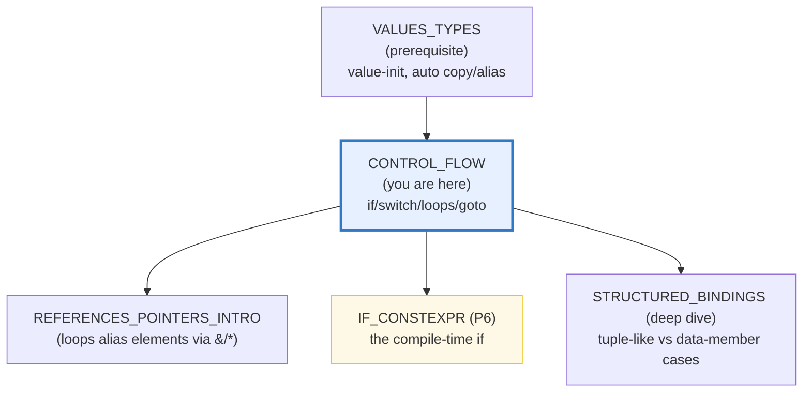
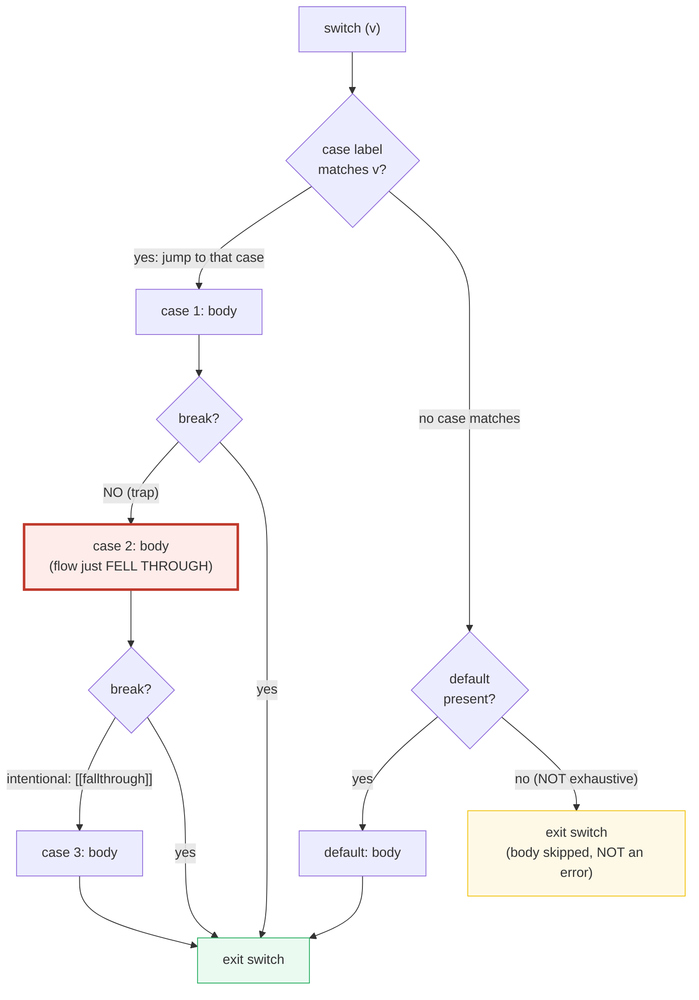
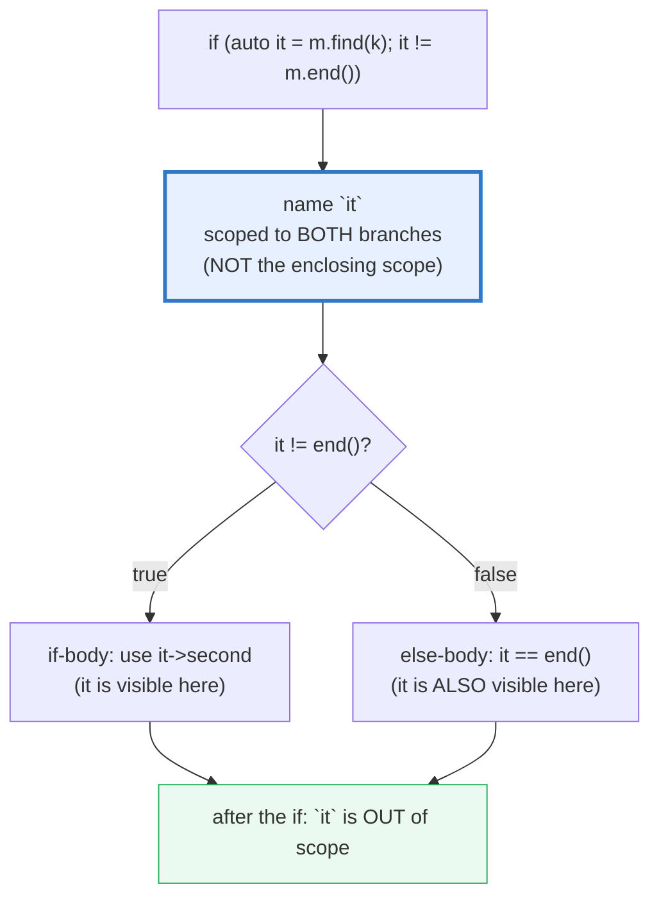

# CONTROL_FLOW — if / switch / loops / structured bindings / goto

> **Goal (one line):** by printing every value, show how C++'s control-flow
> statements actually behave — `if`/`else` + ternary + **if-with-initializer**
> (C++17), `switch` (**falls through by default**; **NOT exhaustive**;
> with-initializer), range-`for` + classic `for`/`while`/`do-while` +
> `break`/`continue`, **structured bindings** (C++17), and `goto` (the one
> legitimate use: breaking nested loops, since **C++ has NO labeled break**).
>
> **Run:** `just run control_flow`
>
> **Ground truth:** [`control_flow.cpp`](./control_flow.cpp) → captured stdout in
> [`control_flow_output.txt`](./control_flow_output.txt). Every value/table below
> is pasted **verbatim** from that file under a
> `> From control_flow.cpp Section X:` callout. Nothing is hand-computed.
>
> **Prerequisites:** 🔗 [`VALUES_TYPES.md`](./VALUES_TYPES.md) (the style anchor;
> value-init, `const`/`constexpr`, and the `auto` copy-vs-`auto&` alias fork that
> decides what a range-`for` element *is*).

---

## 1. Why this bundle exists (lineage)

C++ inherited C's control flow almost verbatim and then bolted on **modern
sugar**: the `if`/`switch` **with-initializer** and **`if constexpr`** (C++17),
the **range-`for`** (C++11), and **structured bindings** (C++17). Underneath,
though, the bones are C's — and two of those bones are *famous bug sources*:

1. **`switch` falls through by default.** Omit a `break` and execution silently
   tumbles into the next `case`. Apple's infamous 2014 SSL "goto fail" bug was a
   C-family control-flow slip; the classic `switch`-fall-through bug is its
   cousin. C++17 added the `[[fallthrough]]` attribute *only to document intent*
   — it does not change behavior, it just silences `-Wimplicit-fallthrough`.
2. **`switch` is NOT exhaustive.** A `default` is optional, and an unmatched
   value silently runs nothing. This is the **opposite** of Rust's `match`,
   which the compiler *forces* to cover every case.

And one thing C++ pointedly **lacks**: **labeled `break`/`continue**. Java has
`break outer;`, Go has `break Outer`, Rust has labeled loops (`'outer:`). C++
does not — so to leave a *nested* loop in one jump, the idiom is either a flag,
a helper function + `return`, or the much-maligned **`goto`**. That single gap
is `goto`'s one clean legitimate use.



The headline contrast across the 5-language curriculum:

| Language | Switch fall-through? | Switch exhaustive? | Labeled break? | The "cleanup" hook |
|---|---|---|---|---|
| **C++** (this bundle) | **yes (the trap)** | **no** | **no** (use `goto`) | **RAII** (scope-bound destructors) |
| 🔗 [`../go/CONTROL_FLOW_DEFER.md`](../go/CONTROL_FLOW_DEFER.md) | no (`break` auto) | n/a (`switch` need not exhaust) | **yes** (`break Outer`) | **`defer`** |
| 🔗 [`../rust/core/CONTROL_FLOW.md`](../rust/core/CONTROL_FLOW.md) | **no** (no fall-through at all) | **yes** (`match` forced-complete) | yes (`'lbl:`) | RAII (`Drop`) |
| 🔗 [`../ts/`](../ts/) | no | n/a | no | GC + `finally` |

C++ is the only language here that gives you **fall-through *and* a missing
exhaustiveness check** — two real bug classes the others simply removed — while
trusting the programmer and the sanitizer to catch them.

> From cppreference — *switch*: "`case` and `default` labels in themselves do
> not alter the flow of control. To exit from a `switch` statement from the
> middle, see [`break` statements](https://en.cppreference.com/w/cpp/language/break).
> Compilers may issue warnings on fallthrough … unless the attribute
> `[[fallthrough]]` appears immediately before the `case` label to indicate that
> the fallthrough is intentional (since C++17)."

---

## 2. The mental model: two diagrams

### 2.1 switch: break-exits vs falls-into-next

The whole `switch` trap in one picture. The labels are **not** boundaries — only
`break` (or the closing `}`) stops the flow:



### 2.2 if-with-initializer: the scoped name

The C++17 `if (init; cond)` is exactly `{ init; if (cond) {...} else {...} }`
*except* that the name declared in `init` is visible in **both** branches (and
nowhere else). That one scope rule is why it exists — it ends the "leak a temp
`it` into the enclosing scope" pattern:



---

## 3. Section A — `if`/`else` + ternary + if-with-initializer

> From `control_flow.cpp` Section A:
> ```
> (1) if/else if/else:  score=85 -> grade=B
> [check] if/else picks the first true branch (score 85 -> B): OK
> (2) ternary:  n=-3  abs(n)=3  sign=<0
> [check] ternary abs(-3) == 3: OK
> [check] ternary picks the '<0' arm for n=-3: OK
> (3a) if-with-init found:  banana -> 2
> [check] if-with-init: the scoped var `it` is usable in the if-body: OK
> (3b) if-with-init else:  missing key -> it == end()? yes
> [check] if-with-init: the scoped var is ALSO visible in the else branch: OK
> (4) if constexpr:  classify(42)=value  classify(&x)=pointer
> [check] if constexpr picked 'value' for an int argument: OK
> [check] if constexpr picked 'pointer' for an int* argument: OK
> ```

**`if`/`else if`/`else`.** The condition is **contextually converted to `bool`**
(🔗 `VALUES_TYPES.md` §7 — that is the same conversion that decides whether a
pointer/integer is "truthy"). The **first** true branch wins; an `else` binds to
the *nearest* unmatched `if` (the classic dangling-`else` ambiguity, resolved in
favor of the inner `if`). If `statement-true` is itself an `if`, the `else` must
be present — this is why the bundle's `else if` chain parses unambiguously.

**The ternary `cond ? a : b`.** Unlike `if` (a *statement*), the ternary is an
**expression** — it yields a value, so it can initialize variables and feed
function arguments. Both arms must share a **common type** via the usual
arithmetic/conversion rules; mismatched arms (e.g. `int` vs `const char*`) are a
compile error without an explicit cast. Use it for *one* of two values; reach for
`if`/`else` once the arms grow side effects or statements.

**`if` with initializer (C++17) — `if (init-stmt; condition)`.** The bundle
proves the scope rule twice:
- `(3a)` the name `it` is **usable inside the if-body** (`banana_count =
  it->second` → `2`).
- `(3b)` the name `it` is **also visible in the else-body** (`else_saw_end =
  (it == stock.end())` → `true`).

This is the idiomatic "lookup, then test" form: `if (auto it = m.find(k); it !=
m.end())`. Before C++17 the same code leaked `it` into the enclosing scope; the
initializer form scopes it tightly to the decision. The `init-stmt` may equally
be a `std::lock_guard` (lock-then-test), a `std::expected`/error code, or a
`fgets` buffer — anything where "set up, then branch on the result" is the shape.

**`if constexpr` (C++17) — the compile-time `if`.** Briefly: the condition is a
**constant expression**, and the **not-taken branch is discarded** at compile
time. Inside a template the discarded arm is *not instantiated*, so it may
contain code valid for only one branch (`*t` when `t` is a pointer, else `t`).
The bundle's `classify(42) → "value"` / `classify(&x) → "pointer"` shows both
arms selecting at compile time. This is **not** a runtime branch — full depth
lands in 🔗 `IF_CONSTEXPR` (P6).

> From cppreference — *if*: the with-initializer form "is equivalent to `{`
> init-statement `if (` condition `)` … `}` Except that names declared by the
> init-statement … and names declared by condition … are in the **same scope**,
> which is also the scope of both statements."

---

## 4. Section B — `switch`: fall-through (the trap) + with-init + NOT exhaustive

> From `control_flow.cpp` Section B:
> ```
> (1) fall-through (v=1; no breaks 1->2->3):  fell = 111
> [check] switch fall-through: case 1->2->3 all ran (1+10+100 == 111): OK
> (2) break stops fall-through (v=1):  stopped = 1
> [check] switch break: only case 1 ran (stopped == 1): OK
> (3) NOT exhaustive (v=7, no default):  touched = 0 (unchanged)
> [check] switch is NOT exhaustive: unmatched value ran nothing (touched == 0): OK
> (4) switch on enum class:  Yellow -> slow
> [check] switch matched the Yellow enumerator: OK
> ```

**The trap — fall-through.** `(1)` is the headline demo: with `v == 1` and *no*
`break` between cases 1→2→3, all three bodies ran and `fell == 111` (1 + 10 +
100). `case`/`default` labels **do not alter flow** — they are just jump targets.
Only `break` (or the closing `}`) exits the switch. The bundle marks every
intentional fall-through with `[[fallthrough]];` so `-Wimplicit-fallthrough`
(`-Wall`/`-Wextra`) stays silent — but **the behavior is identical with or
without the attribute**; it only documents the programmer's intent. `(2)` is the
same switch *with* a `break` after case 1: only case 1 ran (`stopped == 1`).

**`switch` with initializer (C++17).** `switch (int v = 1; v)` is exactly `{
int v = 1; switch (v) {...} }` with `v` scoped to the switch body (mirrors the
`if` with-initializer of §3). Useful when the matched value comes from a
conversion (`switch (auto d = Device{}; d.state())`).

**`switch` is NOT exhaustive.** `(3)` is the quiet part of the trap: a value of
`7` matches no `case`, there is **no `default`**, and the body is **skipped
entirely — with no error**. `touched` stays `0`. Rust's `match` would refuse to
compile until you covered every case; C++ trusts you. Always ask: *what happens
on a value I didn't list?* If the answer matters, add a `default` (and have the
compiler warn on missed enumerators — many compilers emit `-Wswitch` when a
non-exhaustive enum `switch` lacks a `default`).

**`switch` on enumerations.** `(4)` switches on a scoped `enum class Light`; the
condition type must be **integral or enumeration** (a class type is
contextually converted to one). Integral promotions apply — switching on a
`char` promotes it to `int`. Note CWG 2629: a `switch` condition **cannot** be a
floating-point variable declaration.

> From cppreference — *switch*: condition "can only yield … integral types,
> enumeration types, class types"; "If the yielded value is of a class type, it
> is contextually implicitly converted to an integral or enumeration type." And
> on exhaustiveness: "Otherwise [no case matches, no default], none of the
> statements in the `switch` statement will be executed."

---

## 5. Section C — range-`for` + classic for/while/do-while + break/continue

> From `control_flow.cpp` Section C:
> ```
> (1) range-for over std::array (const auto&):  sum = 150
> [check] range-for visited all 5 elements in order (sum == 150): OK
> (2) range-for over std::string "education":  vowels = 5
> [check] range-for counted vowels in 'education' (== 5): OK
> (3) classic loops:  for_sum=15  while_prod=24  do_count=3
> [check] classic for sum 1..5 == 15: OK
> [check] classic while factorial(4) == 24: OK
> [check] do-while ran 3 times (d=0,1,2): OK
> (4) do-while body runs once even when condition is false:  runs=1
> [check] do-while body runs once before testing (runs == 1): OK
> (5) break/continue:  evens=30  first i with i*i>20 = 5
> [check] continue skipped odds: sum of evens 2..10 == 30: OK
> [check] break exited on first i with i*i>20 (i == 5): OK
> ```

**range-`for` (C++11) — `for (item-decl : range)`.** It **desugars** to a
`begin()`/`end()` iterator loop:

```cpp
// `for (const auto& x : arr) use(x);` is EXACTLY:
{ auto&& __range = arr;
  auto __begin = begin(__range), __end = end(__range);
  for (; __begin != __end; ++__begin) {
    const auto& x = *__begin;   // your item-declaration
    use(x);
  } }
```

The begin/end lookup is: array → pointer arithmetic (`range + N`); a class with
member `begin`/`end` → members; otherwise ADL `begin(range)`/`end(range)`. The
**expert fork** is the item-declaration's value/reference choice (🔗
`VALUES_TYPES.md` §7):
- `for (auto x : c)` — **copy** each element (wasteful for big types).
- `for (const auto& x : c)` — **read-only alias** (the idiomatic read form;
  no copy). The bundle's `(1)` uses this over `std::array`.
- `for (auto& x : c)` — **mutable alias** (mutate elements in place).
- `for (auto&& x : c)` — **forwarding reference** (the generic-code default).

`(2)` iterates a `std::string` char-by-char (char-by-value is fine — chars are
cheap). Two expert gotchas not in the verified path: iterating a **non-const
copy-on-write** container may trigger a deep copy via its non-const `begin()`
(use `std::as_const`); and before C++23, `for (auto& x : foo().items())` was
**UB** when `foo()` returned by value (the temporary died mid-loop) — the
C++20 init-statement `for (T t = foo(); auto& x : t.items())` is the fix, and
C++23 extended the temporary's lifetime to the whole loop.

**Classic `for` / `while` / `do-while`.** Identical to C. `(3)` runs all three:
`for` sums 1..5 = 15, `while` computes 4! = 24, `do-while` counts to 3.

**`do-while` runs its body at least once.** `(4)` is the defining property: with
the condition `false` from the start, the body still executes **once** (the test
is *after* the body), so `runs == 1`. This is the only loop that tests *after* —
use it when the first iteration must always happen (read-until-EOL, menu loops).

**`break` / `continue`.** `break` exits the **innermost** loop/switch;
`continue` skips to the next iteration of the **innermost** loop. `(5)` uses
both: `continue` skips the odds (sum of evens 2..10 = 30), and `break` exits on
the first `i` with `i*i > 20` (`i == 5`). Neither touches an *outer* loop —
which is exactly why nested-loop escape needs a flag, a function, or `goto`
(§7, §8).

> From cppreference — *range-for*: the desugaring "produces code equivalent to
> the following"; "It is safe, and in fact, preferable in generic code, to use
> deduction to forwarding reference, `for (auto&& var : sequence)`."

---

## 6. Section D — structured bindings (C++17) + the no-labeled-break note

> From `control_flow.cpp` Section D:
> ```
> (1) auto [a,b] = pair{7,3.5}:  a=7  b=3.500000
> [check] structured binding destructured a std::pair (a == 7): OK
> [check] structured binding pair second == 3.500000: OK
> (2) auto [x,y] = Point{3,4}:  x=3  y=4
> [check] structured binding destructured a struct (px == 3, py == 4): OK
> (3) auto [a0,a1,a2] = int[3]{1,2,3}:  1 2 3
> [check] structured binding destructured a C-array (1 2 3): OK
> (4) range-for [k,v] over std::map:  keys="apple banana cherry " total=6
> [check] structured bindings in range-for: keys in sorted order: OK
> [check] structured bindings range-for summed map values (1+2+3 == 6): OK
> (5) nested-loop break via FLAG (no labeled break in C++):  (1,2)
> [check] flag-based nested break found first cell with x+y>=3: (1,2): OK
> ```

**Structured bindings — `auto [a, b] = expr;`.** One declaration that binds
**several names to sub-objects** of `expr`. The mechanism introduces a hidden
variable `e` holding the value, then makes each identifier an alias of `e`'s
sub-objects. The number of identifiers **must equal** the structured-binding
size of `e`. Three binding cases:

| Case | When | What the names alias | Bundle demo |
|---|---|---|---|
| **1 — array** | `e` is an array of known bound | each array element | `(3)` `int[3]{1,2,3}` → `1 2 3` |
| **2 — tuple-like** | `std::tuple_size<E>` is complete with a `value` member | `get<I>(e)` for each I | `(1)` `std::pair{7,3.5}` → `7` / `3.500000` |
| **3 — data members** | non-union class, no `tuple_size` | each non-static data member, in declaration order | `(2)` `Point{3,4}` → `3` / `4` |

`(4)` is the killer combo — **range-`for` + structured bindings** over a
`std::map`: `for (const auto& [k, v] : prices)`. Because `std::map` is
**ORDERED**, the iteration is deterministic (`apple banana cherry`); an
`unordered_map` would iterate in an unspecified order and would have to be
sorted first (HOW_TO_RESEARCH §4.2 #3).

The crucial `decltype` rule: `decltype(x)` for a structured binding names the
**referenced type**, not necessarily a reference — in the tuple-like case it is
`std::tuple_element<I,E>::type`, which may be a bare value type even though a
hidden reference always underlies the binding. (🔗 `STRUCTURED_BINDINGS` deepens
all three cases; this bundle covers the everyday usage.)

**The no-labeled-break note.** `(5)` is the **flag approach** to leaving a
nested loop: a `bool found` threaded into both loop conditions
(`x < 3 && !found`, `y < 3 && !found`). It works, but it is verbose and the
intent ("leave *both* loops now") is buried. Java would write `break outer;`,
Go `break Outer`, Rust `'outer: ... break 'outer`. **C++ has none of these** —
so the alternatives are the flag, a helper function + `return`, or `goto` (§7).
That gap is precisely `goto`'s one legitimate use.

> From cppreference — *structured bindings*: "Binds the specified names to
> subobjects or elements of the initializer. Like a reference, a structured
> binding is an alias to an existing object. Unlike a reference, a structured
> binding does not have to be of a reference type." And *break*: "A `break`
> statement cannot be used to break out of multiple nested loops. The `goto`
> statement may be used for this purpose."

---

## 7. Section E — `goto`: the one legitimate use

> From `control_flow.cpp` Section E:
> ```
> (1) goto breaks nested loops in one jump:  found (1,2)
> [check] goto nested-loop break found first cell with x+y>=3: (1,2): OK
> (2) backward goto as a loop:  count = 3
> [check] backward goto looped until count == 3: OK
> (3) goto rules: same-function only; a forward jump into an
>     initialized variable's scope is ill-formed (won't compile);
>     destructors run when a goto exits a scope (RAII respected).
> [check] goto rules documented (verified path stays clean): OK
> ```

**`goto` — `goto label;`.** It transfers control unconditionally to a label in
the **same function** (before or after the `goto`). Dijkstra's 1968 "Go To
Statement Considered Harmful" argued against its careless use, and modern C++
style largely agrees — **except** for one clean case.

**(1) Breaking a nested loop in one jump.** This is the legitimate use. With no
labeled `break` in the language, `goto found;` leaves *both* loops the instant a
cell with `x + y >= 3` is found (`(1, 2)`). It is clearer than the flag dance of
§6(5) and faster than factoring into a helper function. A forward `goto` over
**no initialized declarations** (as here) compiles **warning-clean** under
`-Wall -Wextra -Wpedantic` — no `-Wno-` suppression needed.

**(2) Backward `goto` forms a loop.** Legal but obsolete — a `while`/`for` says
the same thing more clearly. The important RAII detail: when a `goto` **exits**
the scope of an automatic variable, that variable's **destructor runs**
(deterministic cleanup; ⟷ Rust's `Drop`, ⟷ Go's `defer` done at scope end
instead). So `goto` does not subvert RAII.

**(3) The compile-time rule.** A forward `goto` **cannot** jump *into* the scope
of a variable with an initializer — it is **ill-formed** (won't compile), unless
the skipped variable is a scalar/class-with-trivial-ctor-and-dtor declared
*without* an initializer. This is a *safety* feature: it makes the
"skip-initialization" use-after-uninit UB (🔗 `VALUES_TYPES.md` §5) impossible
to write via `goto`. The bundle documents the rule; the offending
jump-into-scope would not compile, so it is not in the verified path.

> From cppreference — *goto*: "The `goto` statement must be in the same
> function as the label … If transfer of control exits the scope of any
> automatic variables … the destructors are called for all variables whose scope
> was exited … If transfer of control enters the scope of any automatic
> variables … the program is ill-formed." External link: Dijkstra, *"Go To
> Statement Considered Harmful"* (CACM, 1968).

---

## 8. Worked smallest-scale example

Everything above, compressed to the lines a beginner must memorize — *and* the
two traps and the one gap:

```cpp
// ── if / ternary / if-with-init ─────────────────────────────────────────────
if (score >= 80) grade = "B";            // statement form
int abs_n = (n >= 0) ? n : -n;           // EXPRESSION form (yields a value)
if (auto it = m.find(k); it != m.end())  // C++17: `it` scoped to if AND else
    use(it->second);

// ── switch: MIND THE BREAK, and it is NOT exhaustive ────────────────────────
switch (v) {
    case 1: do1(); break;        // break exits — omit it and you FALL THROUGH
    case 2: do2(); [[fallthrough]]; // C++17: intentional fall-through (no warn)
    case 3: do3(); break;
    // NO default: an unmatched value runs nothing (NOT an error — NOT Rust match)
}

// ── loops: range-for reads with const auto& (no copy) ───────────────────────
for (const auto& x : container) sum += x;   // alias, read-only, no copy
do { body(); } while (cond);                // body runs AT LEAST once

// ── structured bindings: one decl, several names ────────────────────────────
auto [a, b]   = std::pair{1, 2.0};          // tuple-like (Case 2)
auto [k, v]   = *map_iter;                  // destructure in a range-for too

// ── the gap: NO labeled break — goto leaves a nested loop in one jump ───────
for (int x = 0; x < N; ++x)
    for (int y = 0; y < M; ++y)
        if (found(x, y)) goto done;         // the one legit goto
done:;
```

> From `control_flow.cpp`, the verified run prints `fell = 111` (fall-through,
> B(1)), `stopped = 1` (`break`, B(2)), `touched = 0` (NOT exhaustive, B(3)),
> and `found (1,2)` via `goto` (E(1)). Those four numbers *are* the lesson: two
> traps (`111`, `0`), one fix (`1`), and one gap filled by `goto`.

---

## 9. The value-vs-reference-vs-pointer axis (threaded through this bundle)

🔗 The C++ expertise spine (`VALUES_TYPES.md` §9): what is copied, what aliases,
what owns? Control flow is where this axis shows up *inside the constructs*:

| Construct in this bundle | Copies? | Aliases? | Owns? |
|---|---|---|---|
| `if (auto it = m.find(k); ...)` — the `it` | **yes** (it's a value: an iterator copy) | what `it` refers to | no (borrows into the map) |
| `for (auto x : c)` — the loop item | **yes** (each element copied) | no | the copy's own bytes |
| `for (const auto& x : c)` — the loop item | no | **yes** (const alias) | no (borrows) |
| `for (auto& x : c)` — the loop item | no | **yes** (mutable alias) | no (borrows) |
| `auto [a, b] = pair;` — by value | the hidden `e` **copies** pair; `a`,`b` alias `e`'s parts | yes (into `e`) | `e`'s storage |
| `auto& [k, v] = elem;` — by reference | no | **yes** (into the original) | no |

The `const auto&` choice in range-`for` is the single most common value/ref
decision in everyday C++ — and it is the warm-up for 🔗
`REFERENCES_POINTERS_INTRO`. The RAII thread (destructors run when a `goto`
exits scope, §7) is the bridge to 🔗 `RAII`.

---

## 10. Pitfalls (the expert payoff)

| Trap | Symptom | Fix |
|---|---|---|
| **Missing `break` in a `switch`** (the famous one) | Silent fall-through: the next `case`'s code runs too (bundle B(1): `fell == 111` instead of `1`) | Add `break;` (or `return`); if fall-through is intended, mark it `[[fallthrough]];` to silence `-Wimplicit-fallthrough`. Always compile with `-Wall -Wextra`. |
| Forgetting `switch` is **NOT exhaustive** | A new enum value (or out-of-range int) silently runs *nothing* — no `default`, no error | Add a `default:` for "shouldn't happen" cases; enable `-Wswitch` (warns on unhandled enumerators); contrast Rust's forced-complete `match`. |
| `switch` on a **non-integral** condition | Compile error (float variable decl banned by CWG 2629); class types need a conversion | The condition must be integral/enum (or a class convertible to one). Use an `if`/`else if` chain for floats/strings. |
| **Declaring a variable in a `case` without `{}`** | "jump to case label" error (or UB: the variable's scope spans the whole switch but only one case initializes it) | Wrap each `case` body in its own `{ }` block so declarations are scoped to that case. |
| `for (auto x : container)` on a **heavy** type | A **copy** of every element — silent perf hit | Use `for (const auto& x : ...)` to read, `for (auto& x : ...)` to mutate. |
| `for (auto& x : foo().items())` before C++23 | **UB** — the temporary from `foo()` dies before the loop ends (dangling) | C++20: `for (T t = foo(); auto& x : t.items())`; C++23 extends the temporary's lifetime to the loop. |
| range-`for` over a **non-const copy-on-write** container | Triggers a **deep copy** via the non-const `begin()` | `for (auto& x : std::as_const(cow))` to force the const (shared) path. |
| Expecting `auto [a,b] = expr;` to be a **reference** | It's a **copy** into the hidden `e`; mutating `a` doesn't change `expr` | Write `auto& [a,b] = expr;` (or `const auto&`) to alias the original. |
| Mismatched structured-binding **count** | Compile error: "decomposes into N elements" | The identifier count must equal the structured-binding size (array length / `tuple_size::value` / data-member count). |
| Expecting a **labeled `break`** (Java/Go/Rust habit) | Compile error — C++ has none | Use a flag in the loop conditions, a helper function + `return`, or a scoped `goto label;` (the one legit use). |
| `goto` **forward into a variable's scope** | Compile error (ill-formed) — protects against skip-initialization UB | Restructure so the label is after the declaration, or declare without an initializer only when safe (prefer restructuring). |
| `goto` used for ordinary branching | Spaghetti, unreadable flow | Reserve `goto` for the nested-loop-break case (and rare error-cleanup ladders in C-style code); use `if`/loops/exceptions otherwise. |
| `do { } while(cond);` body **not** a compound statement | Easy to write a one-statement do-while by accident (the `;` is required and easy to drop) | Always brace the body: `do { ... } while (cond);`. |
| `switch (0) case 0: case 1: f();` (Duff's-device-style) | Legal but cryptic; labels need not be in a `{}` block | Avoid the "labels without a compound statement" form in new code; keep each `case` in a braced block. |

---

## 11. Cheat sheet

```cpp
// ── if / ternary / if-with-init (C++17) ─────────────────────────────────────
if (cond) a(); else b();                 // statement
int v = cond ? x : y;                    // EXPRESSION (yields a value)
if (auto it = m.find(k); it != m.end())  // init-stmt; name scoped to if AND else
    use(it->second);
if constexpr (cond) {...} else {...}     // C++17: compile-time if (branch discarded)

// ── switch: FALLS THROUGH; NOT exhaustive; with-init (C++17) ────────────────
switch (auto s = make(); s) {            // integral/enum condition (no floats)
    case 1: f1(); break;                 // break EXITS — omit it => FALL THROUGH
    case 2: f2(); [[fallthrough]];        // C++17: intentional (silences warning)
    case 3: f3(); break;
    default: fdef();                     // OPTIONAL (switch is NOT exhaustive)
}
// an unmatched value with no default runs NOTHING (not an error)

// ── loops ───────────────────────────────────────────────────────────────────
for (const auto& x : c) read(x);         // range-for: const auto& = no copy (read)
for (auto& x : c) modify(x);             // mutable alias (mutate in place)
for (auto&& x : c) generic(x);           // forwarding ref (generic code default)
for (init; cond; incr) {...}             // classic
while (cond) {...}                       // test BEFORE body (0+ iterations)
do {...} while (cond);                   // test AFTER body (1+ iterations, always)
break;      // exit innermost loop/switch        continue;  // next iter of innermost loop

// ── structured bindings (C++17): one decl, several names ────────────────────
auto [a, b]  = std::pair{1, 2.0};        // tuple-like (Case 2) — COPIES into hidden e
auto& [k, v] = *map_iter;                // by-ref: alias the original
auto [x, y]  = Point{3, 4};              // data members, declaration order (Case 3)
auto [a,b,c] = arr;                      // array elements (Case 1); count must match
for (const auto& [k, v] : map) {...}     // destructure inside a range-for

// ── the gap: NO labeled break in C++ ────────────────────────────────────────
//   to leave a NESTED loop: flag + loop cond, helper fn + return, OR goto:
for (int x=0; x<N; ++x)
    for (int y=0; y<M; ++y)
        if (hit(x,y)) goto done;         // the ONE legit goto
done:;

// ── goto rules ──────────────────────────────────────────────────────────────
//   same function only; forward goto CANNOT enter an initialized var's scope;
//   exiting a scope via goto runs destructors (RAII respected).
```

---

## 12. 🔗 Cross-references

**Within C++ (the expertise spine):**

- 🔗 [`VALUES_TYPES.md`](./VALUES_TYPES.md) (P1) — the prerequisite. The `auto`
  copy-vs-`auto&` alias fork (§7) *is* the range-`for` item-declaration choice;
  value-init vs default-init underlies why a `switch` on an uninitialized int is
  UB-before-the-branch.
- 🔗 `REFERENCES_POINTERS_INTRO` (P1) — the value/reference/pointer trichotomy.
  This bundle's `for (const auto& x : c)` is the warm-up; `if (auto it = ...)`
  uses iterator *values* that *borrow* into the container.
- 🔗 `IF_CONSTEXPR` (P6) — the compile-time `if` gets its full treatment there
  (branch discarding, dependent-`false` workaround, return-type deduction,
  `if consteval` from C++23). This bundle covers the everyday usage (§3).
- 🔗 `STRUCTURED_BINDINGS` — the deep dive on all three binding cases
  (array/tuple-like/data-member), `decltype` semantics, and lambda capture
  (allowed since C++20).
- 🔗 `RAII` (P2) — the "destructors run when a `goto` exits scope" rule (§7) is
  RAII in action; ⟷ Rust's `Drop`. C++ uses scope-bound destructors where Go
  uses `defer`.
- 🔗 `UNDEFINED_BEHAVIOR` (P7) — the `for (auto& x : foo().items())` pre-C++23
  dangling-temporary and the (prevented-by-ill-formed) `goto`-skip-initialization
  are control-flow-shaped UB entry points.

**Cross-language parallels (the 5-language curriculum):**

- 🔗 [`../go/CONTROL_FLOW_DEFER.md`](../go/CONTROL_FLOW_DEFER.md) — Go collapses
  `while`/`do-while` into a single `for` keyword, has **labeled `break`**
  (`break Outer`) so it needs no `goto`, and uses **`defer`** for cleanup where
  C++ uses RAII (scope-bound destructors). Go's `switch` does **not** fall
  through by default (the opposite default from C++).
- 🔗 [`../rust/core/CONTROL_FLOW.md`](../rust/core/CONTROL_FLOW.md) — Rust's
  `match` is **exhaustive** (the compiler forces every case) and is an
  **expression** (yields a value, like C++'s ternary but far more powerful);
  Rust has **no fall-through** at all (eliminating C++'s famous `switch` bug
  class), and labeled loops (`'outer:`) give it a clean nested-break with no
  `goto`.
- 🔗 [`../ts/`](../ts/) — JS has no `switch` fall-through trap *removed* either
  (it does fall through, like C++), but runs under a GC with `try/finally`; C++
  trusts the programmer and pays in UB/leaks if wrong.

---

## Sources

Every signature, value, and behavioral claim above was verified against
cppreference and the ISO C++ standard, then corroborated by ≥1 independent
secondary source:

- cppreference — *`if` statement* (with-initializer since C++17; `if constexpr`
  C++17; `if consteval` C++23; the init/condition shared scope; dangling-`else`):
  https://en.cppreference.com/w/cpp/language/if
- cppreference — *`switch` statement* (fall-through: "case and default labels in
  themselves do not alter the flow of control"; `[[fallthrough]]` C++17;
  with-initializer C++17; condition integral/enum/class, integral promotions;
  NOT exhaustive: "none of the statements … will be executed"; CWG 2629 bans
  float conditions):
  https://en.cppreference.com/w/cpp/language/switch
- cppreference — *Range-based `for` loop* (C++11; the begin/end desugaring;
  array→pointer, member vs ADL lookup; init-statement C++20; lifetime extension
  C++23; copy-on-write deep-copy note; "preferable … `for (auto&& var :
  sequence)`"):
  https://en.cppreference.com/w/cpp/language/range-for
- cppreference — *`goto` statement* (same-function; forward jump into an
  initialized variable's scope is ill-formed; destructors run on scope exit;
  nested-loop-break use; Dijkstra external link):
  https://en.cppreference.com/w/cpp/language/goto
- cppreference — *Structured binding declaration* (C++17; the three cases:
  array / tuple-like via `std::tuple_size` / data members; the hidden variable
  `e`; identifier count must equal binding size; `decltype` is the referenced
  type):
  https://en.cppreference.com/w/cpp/language/structured_binding
- cppreference — *`break` statement* ("A `break` statement cannot be used to
  break out of multiple nested loops. The `goto` statement may be used for this
  purpose."):
  https://en.cppreference.com/w/cpp/language/break
- cppreference — *Attributes: `[[fallthrough]]`* (C++17; "indicates that a
  fall-through in a switch statement is intentional and a warning should not be
  issued for it"):
  https://en.cppreference.com/w/cpp/language/attributes/fallthrough
- Secondary corroboration (≥2 independent sources, web-verified):
  - **No labeled break in C++** (so `goto`/flag/function are the nested-loop
    escapes):
    - Stack Overflow — *"Can I use break to exit multiple nested 'for' loops?"*
      (top answers: function+return, goto, or flag; no labeled break in C++):
      https://stackoverflow.com/questions/1257744/can-i-use-break-to-exit-multiple-nested-for-loops
    - open-std P3568R0 — *"`break label;` and `continue label;`"* (a 2025
      proposal to *add* labeled break/continue, confirming C++ lacks them today):
      https://www.open-std.org/jtc1/sc22/wg21/docs/papers/2025/p3568r0.html
    - Reddit r/cpp — *"Why doesn't C/C++ have a multi-break statement?"*
      ("The idiomatic method of breaking multiple loops is with a goto"):
      https://www.reddit.com/r/cpp/comments/7mp2dn/why_doesnt_cc_have_a_multibreak_statement/
  - **`[[fallthrough]]` silences `-Wimplicit-fallthrough`** (gcc/clang):
    - C++ Stories — *"C++17 in details: Attributes"* ("`[[fallthrough]]` …
      indicates that a fall-through in a switch statement is intentional and a
      warning should not be issued for it. Clang: … GCC: …"):
      https://www.cppstories.com/2017/07/cpp17-in-details-attributes/
    - GCC patch — Marek Polacek, *"Implement -Wswitch-fallthrough"* ("the
      `[[fallthrough]]` attribute was approved for C++17"):
      https://gcc.gnu.org/ml/gcc-patches/2016-07/msg00532.html
    - Clang C++ status — `[[fallthrough]]` attribute, P0188R1, Clang 3.9:
      https://clang.llvm.org/cxx_status.html
- ISO C++23 draft (open-std.org) — normative wording:
  - 8.5.2 Selection statements `[stmt.select]` (`if`/`switch` with initializer,
    `if constexpr`)
  - 8.6 Iteration statements `[stmt.iter]` (`for`/`while`/`do`/range-`for`)
  - 8.7 Jump statements `[stmt.jump]` (`break`/`continue`/`goto`/`return`)
  - 9.6 Structured binding declarations `[dcl.struct.bind]`
  - Working draft: https://open-std.org/JTC1/SC22/WG21/docs/papers/2023/n4950.pdf
- E. W. Dijkstra — *"Go To Statement Considered Harmful"* (CACM, vol. 11 #3,
  March 1968): https://en.cppreference.com/w/cpp/language/goto (external link)
  / archived text: http://david.tribble.com/text/goto.html

**Facts that could not be verified by running** (documented, not executed,
because they are compile errors or sanitizer-only by design): the `goto`
forward-jump-into-an-initialized-variable's-scope (ill-formed — won't compile,
so gated behind `#ifdef DEMO_UB`); the pre-C++23 `for (auto& x :
foo().items())` dangling-temporary UB (would need an older standard and an
ASan/msan run to reproduce); and the missing-`break`-without-`[[fallthrough]]`
**warning** text itself (the bundle marks every fall-through with
`[[fallthrough]]` to stay `-Wall -Wextra -Wpedantic` clean, so the warning is
absent from the verified build by design). These are confirmed by the
cppreference sections and secondary sources above, not reproduced as runnable
output (a file triggering them would fail `just check` / `just sanitize`).
