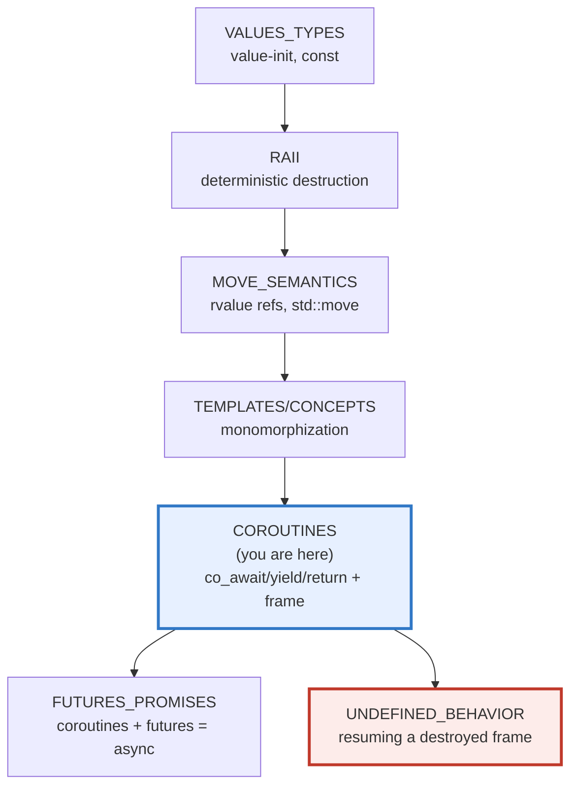
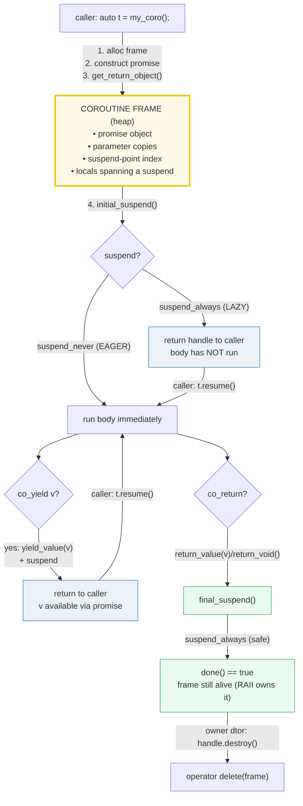
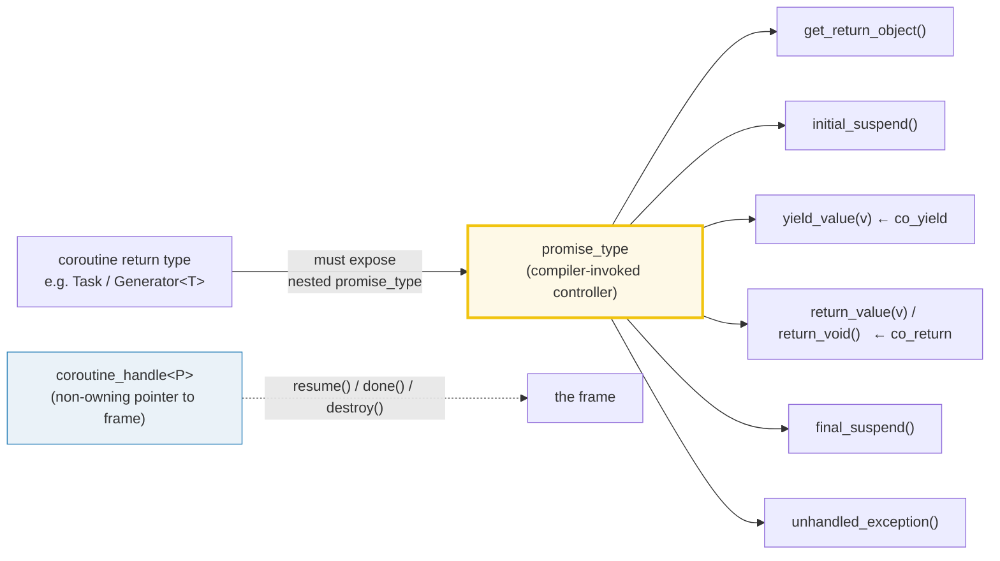

# COROUTINES — C++20 Stackless Coroutines (co_await / co_yield / co_return)

> **Goal (one line):** show, by printing every value, how a C++20 stackless
> coroutine SUSPENDS (`co_await`/`co_yield`) and later RESUMES while preserving
> local state in a heap-allocated coroutine **frame** — driven by a hand-written
> `Task`/`Generator` type whose nested **`promise_type`** is the compiler-invoked
> controller — and pin the **handle-outlives-frame = UB** lifetime trap as a
> documented expert payoff (never executed in the verified path).
>
> **Run:** `just run coroutines`
>
> **Ground truth:** [`coroutines.cpp`](./coroutines.cpp) → captured stdout in
> [`coroutines_output.txt`](./coroutines_output.txt). Every number/sequence below
> is pasted **verbatim** from that file under a
> `> From coroutines.cpp Section X:` callout. Nothing is hand-computed.
>
> **Prerequisites:** 🔗 `VALUES_TYPES.md` (value-init vs UB), 🔗 `RAII.md`
> (deterministic destruction — the frame is RAII-managed here), 🔗
> `TEMPLATES_CONCEPTS.md` (`Generator<T>` is a class template).

---

## 1. Why this bundle exists (lineage)

A C++20 **coroutine** is a function that can **suspend** execution and be
**resumed** later, keeping its local state alive across the suspend. Coroutines
are **stackless**: they suspend by *returning* to the caller, and the state
needed to resume is stored **separately from the stack** — in a heap-allocated
**coroutine frame**. This enables sequential-looking code that executes
asynchronously (non-blocking I/O without callbacks) and lazy infinite sequences
(generators), among other uses.



The headline contrast across the 5-language curriculum — **the same idea,
different runtimes**:

| Language | Mechanism | Who provides the runtime? |
|---|---|---|
| **C++** (this bundle) | `co_await`/`co_yield`/`co_return` + `promise_type` + heap **frame** | **YOU** (or CppCoro / C++23 `std::generator` / C++23 `std::execution`) |
| 🔗 [`../rust/ASYNC_BASICS.md`](../rust/ASYNC_BASICS.md) | `async fn` returns a `Future` — a **compiler-generated state machine** | the **executor** (tokio / async-std) polls it |
| 🔗 [`../ts/ASYNC_AWAIT.md`](../ts/ASYNC_AWAIT.md) | `async`/`await` on the **event loop** | the JS runtime (V8/libuv) |
| 🔗 [`../python/ASYNCIO_BASICS.md`](../python/ASYNCIO_BASICS.md) | `async def`/`await` on **asyncio** | a batteries-included runtime |

C++20 is the only one of the four that ships the **language** (the keywords +
the `promise_type` machinery + `<coroutine>`) but **no runtime** — no task type,
no scheduler, no event loop. You write the `Task`/`Generator` (as this bundle
does in ~80 lines), or you adopt a library. That is the central design fact of
C++20 coroutines, and Section D explains why.

> From cppreference — *Coroutines*: "A coroutine is a function that can suspend
> execution to be resumed later. Coroutines are **stackless**: they suspend
> execution by returning to the caller, and the data that is required to resume
> execution is stored separately from the stack."

---

## 2. The mental model: suspend/resume + the frame + the promise_type

Three objects are associated with every coroutine. The compiler generates the
glue that connects them through the **`promise_type`**:





The first diagram is the whole suspend/resume lifecycle. The second shows the
two faces of the mechanism: the **`promise_type`** (controlled *from inside* the
coroutine by the compiler) and the **`coroutine_handle`** (a non-owning pointer
controlled *from outside* by the driver). Note that `std::promise` (the
concurrency type) is **unrelated** to `promise_type` despite the name.

> From cppreference — *Coroutines / Execution*: each coroutine is associated
> with "the *promise object*, manipulated from inside the coroutine… the
> *coroutine handle*, manipulated from outside the coroutine… a non-owning handle
> used to resume execution… or to destroy the coroutine frame… and the *coroutine
> state*, which is internal, dynamically-allocated storage… Promise objects are in
> no way related to `std::promise`."

---

## 3. Section A — `co_return` + the `promise_type` (the controller)

> From `coroutines.cpp` Section A:
> ```
> A coroutine's return type must expose a nested `promise_type`.
> The compiler generates code that calls its members in a fixed order:
>   get_return_object() -> initial_suspend() -> <body> ->
>   return_value(v)/return_void() -> final_suspend()
> 
> calling returns_seven() (initial_suspend == suspend_always -> LAZY)...
>   [after call, before resume] t.done() == 0  (body has NOT run)
> [check] lazy Task: body did NOT run during construction (done() still false): OK
> calling t.resume()...
>     [body of returns_seven] about to co_return 7
>   [after resume] t.done() == 1  (body ran to co_return)
> [check] after resume, coroutine reached final_suspend (done() == true): OK
> [check] co_return 7 delivered 7 via promise.return_value(int): OK
>   result captured in promise = 7
> ```

**What.** A function becomes a coroutine the moment its body contains any of
`co_await`, `co_yield`, or `co_return`. Its return type (here `Task`) must expose
a nested **`promise_type`**. The compiler then generates code that, on call:

1. **allocates** the coroutine frame (`operator new`, heap — may be elided),
2. copies/moves parameters **into the frame**,
3. constructs the **promise** (the controller),
4. calls `promise.get_return_object()` and stashes the result,
5. `co_await`s `promise.initial_suspend()` — `suspend_always` ⇒ **lazy** (the
   bundle's `Task`), `suspend_never` ⇒ **eager** (Section C's `EagerTask`),
6. runs the body until a suspend point, a `co_return`, or fall-off-the-end.

The bundle proves the lazy case by **ordering**: the print inside
`returns_seven`'s body (`[body of returns_seven] about to co_return 7`) appears
*only after* `t.resume()` is called — not at construction. `done() == 0` before
resume, `done() == 1` after. That ordering *is* the proof that the body had not
run yet.

**Why `co_return` and not `return`.** A coroutine **cannot** use a plain `return`
statement (it is a hard restriction). `co_return expr;` (non-`void` `expr`) calls
`promise.return_value(expr)`; `co_return;` or fall-off-the-end calls
`promise.return_void()`. Either way the coroutine then `co_await`s
`final_suspend()`.

**Why `final_suspend()` returns `suspend_always` here (the safety default).**
After `co_return`, the promise runs `final_suspend()`. If it returns
`suspend_never`, the coroutine does *not* suspend at the end — the frame is
destroyed automatically and the handle becomes **immediately dangling**; calling
`done()`/`resume()`/`destroy()` on it is then **UB**. By returning
`suspend_always`, the coroutine suspends at the final point with the frame still
alive, so the owning wrapper can read `done()` and `destroy()` the frame exactly
once via RAII. (Resuming a coroutine *at* its final suspend point is *also* UB —
the driver must check `done()` before resuming.)

> From cppreference — *Coroutines / co_return*: "calls `promise.return_value(expr)`
> for `co_return expr;` where `expr` has non-void type… then calls
> `promise.final_suspend()` and `co_await`s the result." And *Notes*: "It's
> undefined behavior to resume a coroutine from [the final suspend] point."

---

## 4. Section B — `co_yield` + the `Generator` + the coroutine **frame**

> From `coroutines.cpp` Section B:
> ```
> count_up(5) yields 0..4 in resume order:
>   collected: 0 1 2 3 4 
> [check] count_up(5) yielded exactly 0 1 2 3 4: OK
> 
> fibonacci(8) — locals a,b live in the FRAME across each yield:
>   collected: 0 1 1 2 3 5 8 13 
> [check] fibonacci(8) yielded 0 1 1 2 3 5 8 13 (frame kept a,b alive): OK
> [check] frame persists across yields: a,b were NOT reset between resumes: OK
> [check] Generator is now done() (suspended at final_suspend): OK
> ```

**What.** `co_yield expr;` is exactly sugar for
`co_await promise.yield_value(expr);` — it hands a value to the promise and
suspends. The bundle's `Generator<T>` stores the value in the promise and returns
`suspend_always`, so each `co_yield` produces one value and parks the coroutine.
The driver pulls values one at a time via `move_next()` (resume → check `done()`).

**Why this proves the frame exists.** `fibonacci(8)` keeps two locals, `a` and
`b`, **alive across eight separate resumes**. If those locals lived on the call
stack they would be destroyed each time the coroutine returned to the caller —
but the sequence `0 1 1 2 3 5 8 13` is correct, so `a` and `b` must persist
somewhere else. That "somewhere" is the **coroutine frame**: heap storage the
compiler allocates that holds the promise, the parameter copies, the suspend-
point index, and exactly the locals/temporaries whose lifetime **spans** a
suspend. The frame is the whole reason a stackless coroutine can suspend and
resume without losing its place.

**The iteration contract (and its sharp edge).** After the last `co_yield`, the
coroutine is suspended *at that yield* — **not** done. One *more* `move_next()`
is required to run the body off the end (`return_void` → `final_suspend`). The
bundle makes this explicit in Section E: three resumes leave the generator
suspended at its last yield (`done() == false`); a fourth resume reaches
`final_suspend` (`done() == true`). Calling `resume()` **after** `done()` is true
is UB (resuming past `final_suspend`).

> From cppreference — *Coroutines / co_yield*: "`co_yield expr`… is equivalent to
> `co_await promise.yield_value(expr)`." And *Execution / coroutine state*: the
> state is "internal, dynamically-allocated storage… that contains the promise
> object, the parameters… some representation of the current suspension point…
> [and] local variables and temporaries whose lifetime spans the current
> suspension point."

---

## 5. Section C — `suspend_always`/`suspend_never` + the awaiter protocol

> From `coroutines.cpp` Section C:
> ```
> initial_suspend controls LAZY vs EAGER start:
>   constructing eager_body() (initial_suspend == suspend_never)...
>     [eager_body ran DURING construction — before caller continues]
>   [after construction] e.ran() == 1  (body already ran: EAGER)
> [check] suspend_never initial_suspend: body ran DURING construction (eager): OK
> 
> The awaiter protocol — await_ready short-circuits suspension:
>   demo 1: co_await ReadyAwaiter{42} (await_ready == true)
>   before resume: t1.done() == 0
>     [await_ready_demo body] co_await ReadyAwaiter{42}...
>     [await_ready_demo body] x = 42 (no suspension happened)
> [check] ReadyAwaiter (await_ready=true): one resume sufficed, no suspension: OK
> 
>   demo 2: co_await SuspendingAwaiter{} (await_ready == false)
>     [await_suspending_demo body] co_await SuspendingAwaiter{}...
>   after first resume: t2.done() == 0  (suspended inside co_await)
> [check] SuspendingAwaiter: coroutine SUSPENDED at co_await after first resume: OK
>     [await_suspending_demo body] resumed! x = 99
>   after second resume: t2.done() == 1
> [check] SuspendingAwaiter: after second resume, await_resume() returned 99: OK
> ```

**`suspend_never` vs `suspend_always` — eager vs lazy.** The two trivial
awaitables in `<coroutine>` are the building blocks for `initial_suspend`/
`final_suspend`:

- `std::suspend_never` — `await_ready()` returns **`true`** ⇒ never suspends.
  Used as `initial_suspend`, the body runs **during the call** (eager). The
  bundle's `EagerTask` prints its body line *before* the caller's "after
  construction" line — ordering proves eagerness.
- `std::suspend_always` — `await_ready()` returns **`false`** ⇒ always suspends.
  Used as `initial_suspend`, the body does not run until `resume()` (lazy — the
  bundle's `Task`/`Generator`).

**The awaiter protocol (`co_await expr`).** Any object exposing
`await_ready` / `await_suspend(handle)` / `await_resume` is an **awaiter** and can
be `co_await`-ed. The compiler drives it in a fixed sequence:

1. `awaiter.await_ready()` — if `true`, **skip suspension entirely** (the
   short-cut: the value is already available, avoid the suspend/resume cost).
2. (only if `await_ready()` was `false`) suspend the frame, then call
   `awaiter.await_suspend(handle)`. If it returns `void`, the coroutine stays
   suspended and control returns to the caller; if `bool`, `true` returns to the
   caller and `false` resumes immediately; if a **coroutine handle**, that handle
   is resumed (symmetric transfer — tail-call between coroutines, no stack growth).
3. `awaiter.await_resume()` — its return value **is** the value of the whole
   `co_await expr` expression (run whether or not suspension happened).

The bundle contrasts the two halves of step 1: `ReadyAwaiter`
(`await_ready == true`) needs only **one** `resume()` to run the whole body
(no internal suspension); `SuspendingAwaiter` (`await_ready == false`) needs
**two** — the first resumes the body up to the `co_await` and suspends there,
the second resumes from the suspension so `await_resume()` returns `99`. The
ordering of the body's print lines (`co_await SuspendingAwaiter{}...` then, after
the second resume, `resumed! x = 99`) is the proof.

> From cppreference — *Coroutines / co_await*: "`awaiter.await_ready()` is called
> (this is a short-cut to avoid the cost of suspension if it's known that the
> result is ready or can be completed synchronously). If its result… is `false`
> then [the coroutine suspends and] `awaiter.await_suspend(handle)` is called…
> Finally, `awaiter.await_resume()` is called… and its result is the result of the
> whole `co_await expr`." And *`<coroutine>` header*: `suspend_never::await_ready`
> "returns `true`"; `suspend_always::await_ready` "returns `false`."

---

## 6. Section D — the LIFETIME trap (handle-outlives-frame = UB) + no runtime

> From `coroutines.cpp` Section D:
> ```
> std::coroutine_handle is a NON-OWNING pointer to the heap frame.
> The owning wrapper (Task/Generator) destroys the frame in its dtor.
> Safe pattern: ONE owner, frame destroyed exactly once (RAII).
> 
> SAFE: Generator owns its frame; we resume within its lifetime.
>   sum of count_up(3) = 3
> [check] safe RAII: frame alive across all resumes, destroyed once at scope end: OK
> 
> by-REF param is read (not copied) on each resume — safe if alive:
>   count_via_ref(cap=4) collected: 0 1 2 3 
> [check] count_via_ref(cap=4) yielded 0 1 2 3 (ref alive across resumes): OK
> 
> TRAP (documented, not triggered): resuming a by-ref coroutine
>   after the referent's lifetime ends is a dangling reference (UB).
> [check] by-reference dangling trap documented (verified path does not trigger it): OK
> 
> WHAT NOT TO DO (compiled only with -DDEMO_UB; running it is UB):
>   grab the raw handle, let the owner go out of scope, then resume()
>   the dangling handle — use-after-free on the frame.
>   (DEMO_UB not defined: the UB resume is correctly omitted from this build.)
> [check] lifetime trap documented; verified path never resumes a destroyed frame: OK
> 
> C++20 ships the LANGUAGE (co_await/yield/return + promise_type
> machinery + <coroutine>); it does NOT ship a task type or scheduler.
> YOU write the Task/Generator (as this bundle does), or use a library:
>   - CppCoro (lewissbaker) — the de-facto pre-standard coroutine lib.
>   - C++23 std::generator — the standardized synchronous generator.
>   - C++23 std::execution (P2300) — the async sender/receiver runtime.
> [check] no-runtime fact documented (you/CppCoro/C++23 std::generator provide task+driver): OK
> ```

**THE expert trap.** A `std::coroutine_handle` is a **non-owning pointer** to the
frame — cheap to copy, but it does *not* keep the frame alive. Once the owner
(the `Task`/`Generator` whose destructor called `handle.destroy()`) is gone, the
frame is freed. Calling `resume()` / `destroy()` on the dangling handle is
**use-after-free** — undefined behavior. The bundle's safe pattern is RAII: the
wrapper owns the handle, destroys the frame **exactly once** in its destructor,
and the verified path only ever resumes within the owner's lifetime.

### The trap, demonstrated (NOT in the verified path)

The offending resume is gated behind `#ifdef DEMO_UB`, which `just run` /
`just out` / `just check` / `just sanitize` **never** pass, so the default and
sanitizer builds stay UB-free:

```cpp
#ifdef DEMO_UB
    std::coroutine_handle<> dangling{};
    {
        Generator<int> g = count_up(2);
        dangling = g.raw_handle();   // copy the non-owning handle
        // g destroyed here -> frame freed
    }
    dangling.resume();               // UB: frame already destroyed
#endif
```

Compiling that block with `-DDEMO_UB` and running it is UB; under ASan it aborts
with a `heap-use-after-free` report on the frame. The meaninglessness *is* the
point: a compiler entitled to assume no UB may do anything. (The same shape bites
**by-reference parameters**: a `const T&` parameter is *not* copied into the
frame, so resuming after the referent's lifetime ends is a dangling reference —
the bundle documents this and uses `count_via_ref` only with an alive referent.)

**Why C++20 ships no runtime.** The standard deliberately provides only the
**language** and `<coroutine>` (the handle + the two trivial awaitables). It does
**not** provide a task type, a scheduler, or an event loop — because the
committee could not agree on *one* model (sync generators, single-threaded async,
multi-threaded executors, …). So *you* write the `Task`/`Generator` (this bundle
is ~80 lines), or you adopt a library: **CppCoro** (Lewis Baker, the de-facto
pre-standard library), **`std::generator`** (C++23, the standardized synchronous
generator for ranges), or **`std::execution`** (C++23/P2300, the async
sender/receiver runtime). This is the precise sense in which C++20 coroutines are
"the language without the runtime" — ⟷ Rust `async` where `tokio` provides the
executor, ⟷ TS where the V8 event loop drives `async`/`await`.

> From cppreference — *Coroutines / Execution*: "the *coroutine handle*… a
> **non-owning handle** used to resume execution of the coroutine or to destroy
> the coroutine frame." And *Dynamic allocation*: "Coroutine state is allocated
> dynamically via non-array `operator new`" (may be elided when the frame's
> lifetime is nested within the caller's and its size is known — "Heap
> Allocation Elision Optimization").

---

## 7. Section E — deterministic resume order (single-thread driver)

> From `coroutines.cpp` Section E:
> ```
> Two generators, resumed alternately in ONE thread -> fixed order:
>   interleave(a, b one step each, x3): 0 0 1 1 2 2 
> [check] interleaved resume order is a0 b0 a1 b1 a2 b2 (deterministic): OK
> [check] a still suspended at its last yield after 3 resumes (not yet done()): OK
> [check] after a 4th resume each, both generators reached final_suspend (done): OK
> 
> The three coroutine keywords:
>   co_return expr;  -> promise.return_value(expr) / return_void(); ends coro
>   co_yield expr;   -> co_await promise.yield_value(expr); produces + suspends
>   co_await expr;   -> awaiter protocol (await_ready / await_suspend / await_resume)
> [check] three-keyword summary printed (co_return / co_yield / co_await): OK
> ```

A single-threaded coroutine driver resumes coroutines in a **fully deterministic**
order: there is no scheduler, no preemption, no `rand`/`now`. The bundle proves it
by interleaving two `count_up(3)` generators one step each, three times, and
asserting the exact sequence `a0 b0 a1 b1 a2 b2 == 0 0 1 1 2 2`. The second pair
of checks pins the iteration contract from Section B: after three resumes each
the generators sit suspended at their **last yield** (`done() == false`); a fourth
resume each runs the body off the end to `final_suspend` (`done() == true`). (For
a *multi-threaded* driver the resume order is nondeterministic and §4.2 rule 4
applies — collect and sort before printing; this bundle is single-threaded.)

---

## 8. Worked smallest-scale example

Everything above, compressed to the lines a beginner must memorize:

```cpp
// A coroutine: any function with co_await / co_yield / co_return.
Generator<int> count_up(int n) {        // returns the handle-wrapper, NOT a value
    for (int i = 0; i < n; ++i)
        co_yield i;                     // produce i, suspend (frame keeps `i`)
}                                       // fall-off -> return_void -> final_suspend

// The driver (YOU write this — C++20 ships no runtime):
Generator<int> g = count_up(5);         // frame allocated; body NOT run yet (lazy)
while (g.move_next())                   // resume -> next yield (or finish)
    use(g.current());                   // 0, 1, 2, 3, 4 — in order, deterministic
// g's destructor calls handle.destroy() — the frame is freed exactly once.
```

> From `coroutines.cpp` Section B, `count_up(5)` prints `collected: 0 1 2 3 4` and
> `[check] count_up(5) yielded exactly 0 1 2 3 4: OK`. The locals survive because
> the frame holds them; the order is fixed because one thread drives the resumes.

---

## 9. The value-vs-reference-vs-pointer axis (threaded through this bundle)

(🔗 `MOVE_SEMANTICS.md`, `VALUE_VS_REFERENCE_VS_POINTER.md`, `RAII.md` — the
teaching spine.) Where does each thing in this bundle sit?

| Construct in this bundle | Copied? | Aliases? | Owns? |
|---|---|---|---|
| `Task` / `Generator` / `EagerTask` (the wrapper) | move-only (handle moved, src nulled) | no | **yes** — dtor `destroy()`s the frame (RAII) |
| `std::coroutine_handle` (the raw handle) | yes (trivially copyable) | **yes** (points at the frame) | **no** — non-owning; the trap |
| by-value param (`int n` in `count_up`) | **yes** — copied *into the frame* | no | the frame owns the copy |
| by-ref param (`const int& limit`) | no | **yes** — the reference is stored, not the referent | no — **dangling risk** if it outlives the referent |
| `co_yield`'s value (`T current_` in promise) | yes (copied into the promise) | no | the promise/frame owns it |

`coroutine_handle` is the sharp one: it is a **non-owning pointer** that aliases
the frame. Copying it is cheap and fine, but resuming a copy after the owner
destroyed the frame is **UB** (Section D).

---

## 10. Pitfalls (the expert payoff)

| Trap | Symptom | Fix |
|---|---|---|
| `handle.resume()` after the owner's dtor ran (or after the coroutine ended) | **UB** — use-after-free on the frame; ASan `heap-use-after-free`; miscompilation | Let the owner (RAII wrapper) be the **only** thing that destroys the frame; never let a raw `coroutine_handle` outlive its owner. |
| `resume()` on a coroutine at `final_suspend` (`done() == true`) | **UB** — resuming past the final suspend point | Always check `done()` before `resume()`; `move_next()` does this. |
| `final_suspend()` returning `suspend_never` | Frame auto-destroyed at end ⇒ handle dangles immediately; any later `done()`/`destroy()` is UB | Return `suspend_always` from `final_suspend` (the safe default) so the frame lives until the owner destroys it. |
| Forgetting to `destroy()` the handle (no owner) | **Memory leak** — the frame is heap-allocated and never freed | Wrap the handle in an RAII type whose dtor calls `destroy()` (this bundle's `Task`/`Generator`). |
| Double `destroy()` (two owners) | **UB** — double-free of the frame | Make the wrapper move-only (`delete` the copy ctor/assign); null the source on move. |
| By-**reference** parameter that outlives its referent | Dangling reference read on resume → **UB** | Pass by value (copied into the frame), or guarantee the referent outlives the coroutine. |
| A lambda-coroutine capturing `this`/locals by reference | Same dangling trap — the capture is a member, not copied into the frame safely | Capture by value, or pass as a by-value coroutine parameter. |
| Using plain `return` (or `main`/a constructor/`constexpr`/`consteval`) as a coroutine | Hard error — coroutines forbid plain `return`; `main`/ctors/dtors/`consteval`/`constexpr` cannot be coroutines | Use `co_return`; keep coroutines out of `main` and special member functions. |
| Assuming `initial_suspend == suspend_never` is "just optimization" | The body runs **during the call** — surprising ordering, and the frame may be destroyed before you store the handle | Prefer `suspend_always` (lazy) unless you have a reason; with `suspend_never`, ensure the frame is owned before the body runs. |
| Resuming on thread A a coroutine that suspended on thread B without synchronization | **Data race** (UB) — the handle is shared without locks | Use acquire/release atomics (or a mutex) when sharing a handle across threads. |
| Calling `promise()` / `from_promise()` with the wrong promise type | Type-punned handle → **UB** | Keep the promise type in the handle's template parameter (`coroutine_handle<promise_type>`). |
| Expecting a "free" async runtime like Python/JS | Nothing runs your `Task` — it just suspends forever | You drive it (resume loop), or use CppCoro / `std::generator` / `std::execution`. |

---

## 11. Cheat sheet

```cpp
#include <coroutine>   // std::coroutine_handle, std::suspend_always, std::suspend_never

// ── A coroutine return type MUST expose a nested promise_type ──────────────
struct Task {
    struct promise_type {
        Task get_return_object();               // builds the wrapper from the handle
        std::suspend_always initial_suspend();  //   suspend_always = LAZY (body not run yet)
        std::suspend_always final_suspend() noexcept;  // SAFE default (keeps frame alive)
        void return_value(int v);               //   co_return expr;     (non-void)
        void return_void();                     //   co_return; / fall-off
        void unhandled_exception();             //   std::terminate() / stash exception_ptr
        // std::suspend_always yield_value(T v);  // Generator only: co_yield expr;
        // template<class F> auto await_transform(F&&);  // optional: transform co_await expr
    };
    std::coroutine_handle<promise_type> h_;
    ~Task() { if (h_) h_.destroy(); }           // RAII: destroy the frame ONCE
};

// ── The three keywords ─────────────────────────────────────────────────────
co_return expr;   // promise.return_value(expr) / return_void(); then final_suspend
co_yield expr;    // == co_await promise.yield_value(expr);  produce a value + suspend
co_await expr;    // awaiter protocol: await_ready ? (skip) : (suspend + await_suspend);
                  //   result = await_resume()

// ── The awaiter protocol (any object with these three) ─────────────────────
struct Awaiter {
    bool await_ready() const noexcept;               // true  -> skip suspension (short-cut)
    void await_suspend(std::coroutine_handle<>) const noexcept;  // only if !await_ready
    T    await_resume() const noexcept;              // the value of `co_await expr`
};
// await_suspend may return: void (stay suspended), bool (false resumes self),
//   or another coroutine_handle (resume THAT — symmetric transfer / tail call).

// ── The two trivial awaitables in <coroutine> ──────────────────────────────
std::suspend_never  sn;   // await_ready() == true  -> never suspends (EAGER initial)
std::suspend_always sa;   // await_ready() == false -> always suspends (LAZY initial)

// ── coroutine_handle<P> — the non-owning pointer to the frame ──────────────
std::coroutine_handle<promise_type> h = std::coroutine_handle<promise_type>::from_promise(p);
h.resume();            // run until the next suspend / co_return  (UB if done())
h.done();              // true at final_suspend                    (check before resume!)
h.destroy();           // free the frame                           (ONCE, via the owner)
h.promise();           // access the promise                       (type must match)
h.address();           // void* round-trip (from_address / address)

// ── The lifecycle (compiler-driven, in order) ──────────────────────────────
//   allocate frame -> copy params -> ctor promise -> get_return_object()
//   -> co_await initial_suspend() -> <body: co_yield / co_await / co_return>
//   -> return_value/return_void() -> co_await final_suspend() -> [suspended: done()]
//   owner dtor: handle.destroy() -> dtor promise -> dtor params -> delete frame

// ── Restrictions (a coroutine CANNOT) ──────────────────────────────────────
//   use variadic args (...)  | use plain `return`  | be main() / a ctor / dtor
//   | be constexpr / consteval | have a placeholder (auto/Concept) return type

// ── You write the runtime (C++20 ships none) ───────────────────────────────
//   sync generator:  this bundle's Generator<T>  |  C++23 std::generator
//   async task:      this bundle's Task          |  CppCoro  |  C++23 std::execution
```

---

## 12. 🔗 Cross-references

**Within C++ (the expertise spine):**

- 🔗 `FUTURES_PROMISES` (P4) — the natural pair: a coroutine `co_await`s a
  **future** to suspend until an async result is ready; the future/promise pair
  is the bridge between the language (this bundle) and a real async runtime.
- 🔗 `RAII.md` (P2) — the coroutine frame is RAII-managed here: the wrapper's
  dtor `destroy()`s the frame exactly once (⟷ Rust's `Drop`). The lifetime trap
  of Section D is precisely "what happens when RAII is violated for the frame."
- 🔗 `UNDEFINED_BEHAVIOR.md` (P7) — resuming a destroyed frame is the canonical
  use-after-free UB; the `#ifdef DEMO_UB` block is the sanitizer demonstration
  pattern (ASan `heap-use-after-free`).
- 🔗 `TEMPLATES_CONCEPTS.md` (P3) — `Generator<T>` is a class template
  (monomorphization); `promise_type` is discovered via
  `std::coroutine_traits<R, Args...>::promise_type`.
- 🔗 `MOVE_SEMANTICS.md` (P2) — the wrappers are **move-only** (the handle moves,
  the source is nulled) so the frame has exactly one owner.

**Cross-language parallels (the 5-language curriculum) — same idea, different runtimes:**

- 🔗 [`../rust/ASYNC_BASICS.md`](../rust/ASYNC_BASICS.md) — **THE headline
  contrast.** Rust's `async fn` returns a `Future` — a **compiler-generated state
  machine** (the Rust analogue of C++'s coroutine frame + `promise_type`, but
  fully compiler-synthesized with no hand-written `promise_type`). An **executor**
  (tokio) `poll`s it to completion. C++20 coroutines are the same idea but **you**
  write the task type + driver — the language without the runtime.
- 🔗 [`../ts/ASYNC_AWAIT.md`](../ts/ASYNC_AWAIT.md) — TS `async`/`await` on the
  **event loop** (V8/libuv) is the highest-level version: a batteries-included
  runtime, a GC, no manual frame lifetime. C++ gives you the mechanism and trusts
  you with the lifetime.
- 🔗 [`../python/ASYNCIO_BASICS.md`](../python/ASYNCIO_BASICS.md) — Python
  `asyncio` is a batteries-included runtime too; `async def`/`await` map onto an
  event loop with no manual frame management. C++ is the only one of the three
  where *you* own the frame and pay in UB if you get it wrong.
- 🔗 [`../go/`](../go/) — Go has **no coroutines**; it has **goroutines**
  (stackful, M:N-scheduled by the runtime). C++ coroutines are *stackless* (they
  suspend by returning, state in the heap frame), so they are far cheaper but
  require an explicit driver.

---

## Sources

Every signature, value, and behavioral claim above was verified against
cppreference and the ISO C++ standard, then corroborated by ≥1 independent
secondary source:

- cppreference — *Coroutines (C++20)* (definition of a coroutine as any function
  with `co_await`/`co_yield`/`co_return`; stackless; the promise object / handle
  / coroutine state; the execution lifecycle `get_return_object →
  initial_suspend → body → return_value/return_void → final_suspend`;
  restrictions — no variadic args, no plain `return`, no `main`/ctors/dtors, no
  `constexpr`/`consteval`; "Promise objects are in no way related to
  `std::promise`"; "undefined behavior to resume a coroutine from [final
  suspend]"):
  https://en.cppreference.com/w/cpp/language/coroutines
- cppreference — *`co_await`* (the awaitable→awaiter conversion; the
  `await_ready`/`await_suspend`/`await_resume` protocol; `await_ready` as the
  short-cut; the four `await_suspend` return types — void/bool/handle/throws):
  https://en.cppreference.com/w/cpp/language/coroutines (§ `co_await`)
- cppreference — *`co_yield`* ("`co_yield expr`… is equivalent to
  `co_await promise.yield_value(expr)`"):
  https://en.cppreference.com/w/cpp/language/coroutines (§ `co_yield`)
- cppreference — *Dynamic allocation* (frame allocated via non-array
  `operator new`; Heap Allocation Elision Optimization when the frame's lifetime
  is nested within the caller's and its size is known; `get_return_object_on_
  allocation_failure`):
  https://en.cppreference.com/w/cpp/language/coroutines (§ Dynamic allocation)
- cppreference — *`<coroutine>` header* (synopsis: `coroutine_handle`,
  `coroutine_traits`, `suspend_never` with `await_ready() == true`,
  `suspend_always` with `await_ready() == false`, `noop_coroutine`):
  https://en.cppreference.com/w/cpp/header/coroutine
- cppreference — *`std::coroutine_handle`* (`resume`/`operator()`/`done`/
  `destroy`/`promise`/`from_promise`/`from_address`/`address`; non-owning;
  `operator==`/`operator<=>`; the `void`-promise specialization):
  https://en.cppreference.com/w/cpp/coroutine/coroutine_handle
- cppreference — *`std::suspend_always`* / *`std::suspend_never`* (the two
  trivial awaitables; `await_ready` returns `false` / `true` respectively):
  https://en.cppreference.com/w/cpp/coroutine/suspend_always
  https://en.cppreference.com/w/cpp/coroutine/suspend_never
- cppreference — *`std::coroutine_traits`* (how the `promise_type` is discovered
  from the return type + parameter list, incl. the implicit-object-member
  cases):
  https://en.cppreference.com/w/cpp/coroutine/coroutine_traits
- cppreference — *`std::generator` (C++23)* (the standardized synchronous
  coroutine generator for ranges; `__cpp_lib_generator == 202207L`):
  https://en.cppreference.com/w/cpp/coroutine/generator
- ISO C++23 draft (open-std.org) — normative wording:
  - 7.6.4.1 `co_await`, 7.6.4.2 `co_yield`, 8.7.4 `co_return`
  - 14.2 Coroutine definitions, 14.3 `coroutine_handle`, 14.4 `coroutine_traits`
  - Working draft: https://open-std.org/JTC1/SC22/WG21/docs/papers/2023/n4950.pdf
  - C++26 execution (P2300 senders/receivers): https://wg21.link/p2300
- Secondary corroboration (≥2 independent sources, web-verified) for the
  mechanism and the lifetime trap:
  - Lewis Baker — *Asymmetric Transfer* (the canonical coroutine blog series;
    `await_ready` short-cut, symmetric transfer, the frame-lifetime model):
    https://lewissbaker.github.io/ (esp.
    https://lewissbaker.github.io/2020/05/11/understanding_symmetric_transfer )
  - David Mazières (Stanford) — *Tutorial on C++20 coroutines* (the promise
    interface, the handle-is-non-owning trap, HALO):
    https://www.scs.stanford.edu/~dm/blog/c++-coroutines.html
  - Simon Tatham — *Writing custom C++20 coroutine systems*:
    https://www.chiark.greenend.org.uk/~sgtatham/quasiblog/coroutines-c++20/
  - Microsoft C++ DevBlogs — *C++ coroutines: Getting started with awaitable
    objects* (`await_ready`/`await_suspend`/`await_resume`; `suspend_always`
    discards the handle):
    https://devblogs.microsoft.com/oldnewthing/20191209-00/?p=103195

**Facts that could not be verified by running** (documented, not executed,
because executing them is UB or a hard error): resuming a destroyed coroutine
frame (UB — ASan `heap-use-after-free`); resuming a coroutine at
`final_suspend` (UB); `final_suspend == suspend_never` auto-destroying the frame
(handle immediately dangles); a by-reference parameter outliving its referent
(dangling reference, UB); plain `return` in a coroutine (hard compile error);
`main`/a constructor/`constexpr`/`consteval` as a coroutine (hard error). These
are confirmed by the cppreference sections and the secondary sources above, not
reproduced as runnable output in the verified path — the offending resume is
`#ifdef DEMO_UB`-gated so the default build and the sanitizer build stay UB-free.
