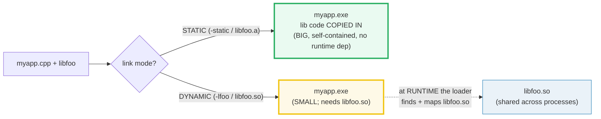
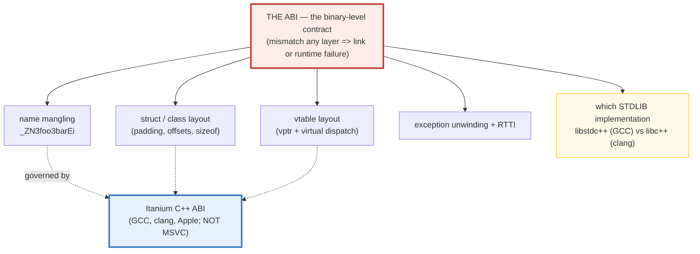

# DEPLOYMENT_LINKING — Static vs Dynamic, the ABI, libstdc++/libc++ & RPATH

> **Goal (one line):** document and assert the static facts of C++ **deployment**
> — **STATIC vs DYNAMIC linking**, the **ABI** (name mangling / struct layout /
> vtable), **libstdc++ vs libc++** (NOT cross-compatible), the **Itanium C++ ABI**,
> and **RPATH/RUNPATH** — the deployment pain that Go (single static binary) and
> Rust (musl static) largely avoid.
>
> **Run:** `just run deployment_linking`
>
> **Ground truth:** [`deployment_linking.cpp`](./deployment_linking.cpp) → captured
> stdout in [`deployment_linking_output.txt`](./deployment_linking_output.txt).
> Every ABI/layout value below (the `typeid()` mangled names, the struct/vtable
> sizes, the detected stdlib) is pasted **verbatim** from that file under a
> `> From deployment_linking.cpp Section X:` callout; the linking/tradeoff facts
> are asserted as standard-fixed **static facts** (they cannot be computed in one
> TU — modeling them needs multi-file linking, which a single-`main` bundle
> forbids). Nothing is hand-computed.
>
> **Prerequisites:** 🔗 `VALUES_TYPES` (sizes/alignment), 🔗 `CMAKE_BASICS` (the
> build system this bundle's packaging side references). This is a **Phase 8**
> bundle — the "real world" of shipping a C++ binary.

---

## 1. Why this bundle exists (lineage)

Every other bundle in this folder is a **single `.cpp`** compiled to `/tmp` and
run. That hides the single most painful fact about C++ in production: **a
compiled binary is not self-explanatory.** To actually *ship* it you must answer
questions Go and Rust let you ignore:

- Was the library **copied into** my binary (static) or **left beside it** as a
  `.so`/`.dylib`/`.dll` (dynamic)?
- Which **standard library** implementation was it linked against — GCC's
  `libstdc++` or LLVM's `libc++`? (Mix them and the link *or the runtime* dies.)
- Which **name-mangling / layout ABI**? Itanium (GCC, clang, Apple) or MSVC?
  (The mangled symbol `foo::bar(int)` is `_ZN3foo3barEi` under Itanium and a
  completely different `?bar@foo@@...` under MSVC — they cannot see each other.)
- Where does the **loader** look for the `.so` at runtime? (RPATH / RUNPATH —
  embedded in the binary, or it falls back to `LD_LIBRARY_PATH`.)



The headline cross-language contrast (driven home in Section E):

| Language | Default binary | Linking / ABI pain |
|---|---|---|
| **C++** (this bundle) | **dynamic** (links `libc++`/`libstdc++`) | **HIGH**: ABI, mangling, RPATH, stdlib-mix |
| 🔗 [`../go/DOCKER_K8S_DEPLOY.md`](../go/DOCKER_K8S_DEPLOY.md) | **single STATIC binary** | none — every dep compiled into one file |
| 🔗 [`../rust/`](../rust/) | static, or **musl** fully-static | low — musl target = single self-contained file |
| 🔗 [`../ts/DEPLOYMENT.md`](../ts/DEPLOYMENT.md) | no native linking | n/a — modules loaded by the JS runtime |

A Go or Rust binary is `scp`-deployable. A **dynamically-linked C++ binary is
not** — it needs every `.so`/`.dylib` present **and ABI-compatible** at the
destination. That gap *is* this bundle.

> From cppreference — *Storage duration / Linkage*: a name has **linkage** when
> the entity it denotes can be referred to from other scopes; **external linkage**
> makes a symbol visible across translation units (and is what the *linker*
> resolves), **internal linkage** keeps it to its own TU, and **no linkage** is
> local-only. Linking — static or dynamic — is fundamentally about resolving
> these externally-linked symbols.

---

## 2. The mental model: the ABI is a stack of contracts

"ABI" is one word for several independent layers. A binary is ABI-compatible
with a library only if **every layer agrees**:



The key insight: **the ABI is not "C++"** — it is *a specific compiler + stdlib +
mangling standard*. A library built with `gcc/libstdc++` and one built with
`clang/libc++` are different ABIs even on the same OS/CPU. Section B proves this
on the running binary by detecting `_LIBCPP_VERSION`.

---

## 3. Section A — STATIC vs DYNAMIC linking (the tradeoff)

> From `deployment_linking.cpp` Section A:
> ```
> property                | STATIC (.a / libfoo.a)        | DYNAMIC (.so/.dylib/.dll)
> ------------------------|-------------------------------|--------------------------
> library code            | COPIED INTO the executable    | loaded at RUNTIME
> executable size         | LARGE (the lib code is inside)| SMALL (the lib is external)
> runtime dependency      | NONE (self-contained binary)  | .so/.dylib/.dll MUST exist
> ABI compatibility at    | LINK time (resolved once)     | RUNTIME (must match the .so)
> shared across processes | NO (each exe has its own copy)| YES (one .so mapped in RAM)
> library update          | must RE-LINK the executable   | swap the .so (no re-link)
> startup cost            | none (symbols already bound)  | loader resolves the symbols
> Linux/Unix file ext     | libfoo.a                      | libfoo.so
> macOS       file ext    | libfoo.a                      | libfoo.dylib
> Windows      file ext   | foo.lib                       | foo.dll
> [check] STATIC: library code is COPIED INTO the executable (self-contained): OK
> [check] STATIC: NO runtime dependency on the .a/.lib: OK
> [check] STATIC: must RE-LINK the executable when the library updates: OK
> [check] STATIC: executable is LARGER (the library's code lives inside it): OK
> [check] DYNAMIC: the .so/.dylib/.dll is loaded at RUNTIME: OK
> [check] DYNAMIC: executable is SMALLER, but the .so MUST be present at runtime: OK
> [check] DYNAMIC: the .so MUST be ABI-compatible with the executable at runtime: OK
> [check] DYNAMIC: one .so/.dylib is shared across processes (mapped once in RAM): OK
> ```

**What.** Two ways to use a library, one binary fork:

- **STATIC** (`.a` / `libfoo.a` / `foo.lib`): the linker **copies** the library's
  object code *into* your executable. The result is **self-contained** — no
  `.so` needs to exist at runtime — but **bigger**, and a library update forces a
  **re-link** of every consumer.
- **DYNAMIC** (`.so` / `.dylib` / `.dll`): the linker records *a dependency*; at
  **runtime** the dynamic loader (`ld-linux` / `dyld`) finds and maps the
  `.so`. The executable stays **small**, one `.so` is **shared** across many
  processes (mapped once in RAM), and you can **swap** the `.so` without
  re-linking — but the `.so` **must be present and ABI-compatible** at runtime.

**Why — which do I pick?**

- **Static** when you want a **single self-contained artifact** (a CLI you ship
  to users, an embedded target, a CI tool that must run anywhere) and can afford
  the size + re-link cost. This is what Go gives you *for free* by default.
- **Dynamic** when **many executables share one library** (system libs like
  `libc`, `libstdc++`), when you want to **update the library without
  re-deploying** every binary (security patches), or when the binary must stay
  small. This is the C++ / OS default — and the source of the ABI/RPATH pain.

**The expert detail — the "ABI compatibility at" row is the whole trap.**
Static linking **resolves the ABI once, at link time**: whatever `libfoo.a` was
built with is now baked in forever. Dynamic linking **defers the ABI check to
runtime**: if the deployed `libfoo.so` was rebuilt with a different
compiler/stdlib/version, your binary may fail to start — or worse, **silently
misbehave** (a `std::string` whose layout changed, a vtable that moved). Section
B is exactly those layout/mangling facts.

> From IBM — *When to use dynamic linking and static linking*: "Static linking
> increases the file size of your program … dynamic linking" leaves "library code
> external." Corroborated by the GCC/GNU toolchain docs and Sandor Dargo's
> *Binary size: should we use static or dynamic linking?*

---

## 4. Section B — The ABI: name mangling, struct layout, vtable

> From `deployment_linking.cpp` Section B:
> ```
> (1) NAME MANGLING (Itanium ABI; typeid(T).name() on this platform):
>     typeid(int).name()                = "i"
>     typeid(double).name()             = "d"
>     typeid(audio::Processor).name()   = "N5audio9ProcessorE"
>     typeid(audio::Engine).name()      = "N5audio6EngineE"
>     (N...E = nested name; digit-prefix = length of the identifier)
> [check] mangled name of int is "i" (Itanium builtin encoding): OK
> [check] mangled name of double is "d" (Itanium builtin encoding): OK
> [check] audio::Processor mangles to a NESTED name (starts with 'N', ends with 'E'): OK
>
> (2) STRUCT LAYOUT (ABI: member order + padding are part of the contract):
>     sizeof(audio::Processor) = 16   = int(4) + pad(4) + double(8)
>     alignof(audio::Processor) = 8  (governed by the widest member, double)
> [check] Processor layout: int(4) + pad(4) + double(8) == 16 bytes: OK
> [check] Processor alignment == alignof(double) == 8 (widest member rules): OK
>
> (3) VTABLE POINTER (the binary cost of a virtual function):
>     struct NoVirtual { int x; }        sizeof = 4  alignof = 4
>     class  Engine     { virtual... }   sizeof = 16  alignof = 8
>     Engine = vptr(8) + int channels(4) + tail pad(4) = 16
>     (the vptr is the Itanium ABI polymorphism slot; it also raises alignment)
> [check] a class with a virtual function is larger than the same struct without: OK
> [check] Engine carries a vptr: sizeof(Engine) >= sizeof(void*) + sizeof(int): OK
> [check] Engine alignment == alignof(void*) == 8 (the vptr governs alignment): OK
>
> (4) THE STDLIB ABI: libstdc++ (GCC) vs libc++ (clang/LLVM)
>     THIS binary is linked against: libc++ (clang/LLVM; Apple default)
>     detected via macro:            _LIBCPP_VERSION is defined (libc++)
>     libstdc++: GCC's implementation  (Linux default)
>     libc++    : clang/LLVM           (macOS/Apple default)
>     NOT ABI-compatible: std::string / std::vector LAYOUTS DIFFER.
>     A libstdc++ .so CANNOT be linked into a libc++ executable (and vice versa).
> [check] this TU's stdlib is detected via a real predefined macro: OK
> [check] this binary uses libc++ (_LIBCPP_VERSION defined; Apple/clang default): OK
> [check] libstdc++ (GCC) and libc++ (clang) are NOT ABI-compatible (never mix): OK
> [check] a whole C++ program must use exactly ONE stdlib implementation: OK
> ```

This section prints **four real ABI facts** from the running binary — the
strongest evidence in the bundle, because none of it is documentation: it is
what `typeid()`, `sizeof`, `alignof`, and the predefined macros actually emit.

**1. Name mangling.** The compiler must give every function a *unique link
symbol* (C++ allows overloading: `foo::bar(int)` ≠ `foo::bar(double)`). It does
so by **encoding the signature** into the symbol. On the Itanium ABI (this box),
`typeid(int).name()` is `"i"`, `typeid(double).name()` is `"d"`, and a nested
type `audio::Processor` is `N5audio9ProcessorE` — the leading `5`/`9` are the
**length** of `audio`/`Processor` (so the demangler knows where each identifier
ends). Plain C symbols are **not** mangled (which is why `extern "C"` exists:
it disables mangling so a C++ function can be called from C — the *one* ABI that
is standardized and stable across compilers).

**2. Struct layout.** `sizeof`/`alignof` are **not** language trivia — they are
**ABI**. `audio::Processor` is 16 bytes (`int` 4 + 4 padding + `double` 8)
because the `double` member forces 8-byte alignment (🔗 `OBJECT_LAYOUT` /
`STRUCT_PADDING`). If two compilers disagree on padding, the same header yields
**different memory layouts** — and passing a `Processor*` across a `.so` boundary
silently corrupts data. Member *order* matters too: reordering members is an
**ABI break**, not just a refactor.

**3. The vtable pointer.** Add one `virtual` function and the class gains a
hidden **vptr** (`sizeof(void*)` bytes pointing at its vtable). The bundle proves
it: `struct NoVirtual { int x; }` is 4 bytes, but `class Engine { virtual... }`
is **16** — `vptr(8) + int(4) + tail-pad(4)`. Note the *tail padding*: the vptr
raises the class alignment to 8, so the 12 content bytes round up to 16. This is
the Itanium ABI's polymorphism mechanism, and adding/removing the *first*
`virtual` is a hard ABI break.

**4. libstdc++ vs libc++ — the one that bites most often.** The C++ standard
library has **two** major implementations: **`libstdc++`** (GCC, the Linux
default) and **`libc++`** (LLVM/clang, the macOS/Apple default). They are **NOT
ABI-compatible**: `std::string`, `std::vector`, etc. have **different layouts
and different mangled symbol names**. The bundle **detects which one it is
running** via the predefined macro `_LIBCPP_VERSION` (defined → libc++) or
`__GLIBCXX__` (defined → libstdc++). This box is **libc++**. The rule:
**a whole program must use exactly one** stdlib implementation — you cannot link
a `libstdc++` `.so` into a `libc++` executable (you get undefined-symbol or
type-mismatch errors, sometimes only at runtime).

> From the libc++ project — *"libc++" C++ Standard Library*: it advertises "ABI
> compatibility with gcc's libstdc++ **for some low-level features** such as
> exception objects, RTTI and memory allocation" — the explicit implication is
> that the higher-level containers (`std::string`, `std::vector`) are **not**
> compatible. Corroborated by r/cpp_questions: "libc++ and libstdc++ are not ABI
> compatible. The only way you can mix these is when your libraries do not expose
> any C++ internals over its ABI."

---

## 5. Section C — The Itanium C++ ABI + RPATH / RUNPATH

> From `deployment_linking.cpp` Section C:
> ```
> (1) THE ITANIUM C++ ABI (de-facto; GCC + clang + Apple; NOT MSVC):
>     _Z               mangling prefix ("this is a C++ symbol")
>     N 3foo 3bar E i  nested: foo::bar(int)
>       N ... E          nested-name delimiters
>       3foo             namespace 'foo'   (digit = length of next id)
>       3bar             function  'bar'
>       i                parameter type 'int' (Section B builtins)
>     MSVC uses its OWN mangling (?-prefixed) — NOT cross-compatible with Itanium.
> [check] Itanium C++ ABI is used by GCC, clang, and Apple clang: OK
> [check] MSVC's mangling/layout ABI is NOT compatible with the Itanium ABI: OK
>
> (2) ABI TAGS (GCC): versioned symbol suffixes for coexistence
>     GCC tags the C++11 std::string with a [abi:cxx11] suffix in the mangled name,
>     so an old (pre-C++11) libstdc++ symbol and the new one can coexist in ONE
>     process (e.g. old .so + new exe link without breaking each other).
> [check] GCC ABI tags let two ABI versions of a symbol coexist in one process: OK
>
> (3) RPATH / RUNPATH (embedded loader-search paths in the binary):
>     DT_RPATH   : older; searched BEFORE LD_LIBRARY_PATH (NOT overridable by env)
>     DT_RUNPATH : newer (modern default); LD_LIBRARY_PATH takes precedence
>     set at LINK time:   c++ ... -Wl,-rpath,/abs/path
>     common idiom:       -Wl,-rpath,\$ORIGIN   (search next to the executable)
>     inspect (NOT run here — subprocess is forbidden in a bundle):
>         macOS: otool -L <bin> ; Linux: ldd <bin> ; readelf -d <bin>
> [check] RPATH/RUNPATH are EMBEDDED in the binary at LINK time: OK
> [check] RUNPATH is overridable by LD_LIBRARY_PATH; legacy RPATH is not: OK
> [check] RPATH/RUNPATH tell the dynamic loader where to find the .so/.dylib: OK
> ```

**1. The Itanium C++ ABI.** Despite the name, "Itanium" has nothing to do with
the Itanium CPU — it is the **de-facto name-mangling + layout standard** written
down originally for Itanium but adopted by **GCC, clang, and Apple clang** (i.e.
every non-Windows compiler). The bundle decodes a mangled symbol by hand:
`_ZN3foo3barEi` = `foo::bar(int)`. **MSVC is the big exception** — it uses its
own `?`-prefixed mangling and its own struct/vtable layout, so an MSVC-built
`.dll` and a GCC/clang-built `.so` are **mutually invisible** even on the same
architecture. (This is why Windows C++ interop uses `extern "C"` heavily and why
MinGW vs MSVC binaries don't mix.)

**2. ABI tags.** GCC's `[[gnu::abi_tag("tag")]]` mangles a **versioned suffix**
onto a symbol, letting two ABI versions coexist in one process. The famous case:
libstdc++'s C++11 `std::string` is tagged `[abi:cxx11]`, so an *old* pre-C++11
libstdc++ symbol and the *new* one can link into the same program without
clobbering each other. This is GCC's escape valve for evolving its ABI without
breaking the world.

**3. RPATH / RUNPATH — where the loader looks.** A dynamically-linked executable
**embeds loader-search paths** (`DT_RPATH` or the newer `DT_RUNPATH` in its
`.dynamic` section). At startup the loader consults them to find the `.so`s the
binary needs. The crucial difference:

- **`DT_RPATH`** (legacy): searched **before** `LD_LIBRARY_PATH` → the env var
  **cannot** override it (a security/ops hazard).
- **`DT_RUNPATH`** (modern default): searched **after** `LD_LIBRARY_PATH` → the
  env var **wins**.

You set them at **link time**: `c++ ... -Wl,-rpath,/abs/path`; the portable
idiom is `-Wl,-rpath,$ORIGIN` so the loader looks next to the executable (then
you ship the `.so` *with* the binary). The bundle does **not** run `otool`/`ldd`/
`readelf` to show this — a bundle forbids subprocesses — so it documents the
inspection commands and asserts the semantics as static facts. (To see them live
on this bundle's own binary: `otool -L /tmp/cpp_deployment_linking` on macOS,
`ldd` / `readelf -d` on Linux.)

> From `ld.so(8)` — the Linux dynamic linker: "Using the directories specified
> in the `DT_RPATH` … if present **and** `DT_RUNPATH` … does not exist" → then
> "`LD_LIBRARY_PATH`" → then "`DT_RUNPATH`" → then default paths. So `DT_RPATH`
> (if `DT_RUNPATH` is absent) is searched **before** the env var, while
> `DT_RUNPATH` is searched **after** it. Corroborated by twdev.blog: "RUNPATH can
> be overridden by `LD_LIBRARY_PATH` whilst RPATH cannot!"

---

## 6. Section D — Cross-compilation (`--target`) + packaging

> From `deployment_linking.cpp` Section D:
> ```
> (1) CROSS-COMPILATION (--target=<triple>):
>     target triple = <CPU>-<vendor>-<OS>[-<libc/abi>]
>     clang --target=aarch64-apple-darwin    -> macOS ARM64 binary
>     clang --target=x86_64-linux-gnu        -> Linux x86_64 (glibc) binary
>     clang --target=wasm32-wasi             -> WebAssembly binary
>     The OUTPUT runs on the TARGET, NOT on the build host.
>     (GCC uses a separate cross-toolchain per target instead of --target.)
> [check] a target triple names the CPU-vendor-OS of the OUTPUT binary: OK
> [check] a cross-compiled binary does NOT run on the build host: OK
>
> (2) PACKAGING A LIBRARY (three distribution models):
>     HEADER-ONLY : one .hpp; #include only; NO linking step; compiles into each TU;
>                   zero runtime dep; build-time bloat per includer (e.g. catch2)
>     STATIC (.a) : archive of compiled .o; linked INTO the exe; self-contained exe;
>                   big exe; library update forces a re-link (Section A)
>     DYNAMIC(.so): compiled .so/.dylib/.dll; loaded at runtime; small exe;
>                   runtime dep + ABI-compatible .so required (Sections A/B)
>     consumer side (CMake):
>         find_package(MyLib REQUIRED)
>         target_link_libraries(app PRIVATE MyLib::MyLib)   # static OR dynamic
> [check] header-only: no linking step, #include only, zero runtime dep: OK
> [check] static (.a): linked into the exe (self-contained, big, re-link on update): OK
> [check] dynamic (.so): runtime dep, small exe, ABI-compatible .so required: OK
> ```

**1. Cross-compilation.** Clang is a **single multi-target compiler**: one
binary can emit for any supported target via `--target=<triple>`. The triple is
`<CPU>-<vendor>-<OS>[-<libc/abi>]` and names the **output** platform, not the
build host — so `--target=aarch64-apple-darwin` on an x86 Mac produces an ARM64
macOS binary that **won't run on the build machine**. GCC works differently:
each target needs a **separate cross-toolchain** (`aarch64-linux-gnu-gcc`).
Cross-compilation multiplies the ABI surface: every target triple has its own
mangling (same Itanium grammar, different CPU), its own struct sizes, and its
own stdlib — which is exactly why "it compiles on my machine" is not a deployment
guarantee.

**2. Packaging a library — three distribution models**, each mapping to Section
A's tradeoff:

- **Header-only** (one `.hpp`, no linking step): zero runtime dep, but the code
  is **recompiled into every TU** that includes it (slower builds, larger TUs).
  Best for small/template-heavy libs (Catch2, fmt's header mode).
- **Static** (`.a`): pre-compiled object archive, linked *into* the exe.
  Self-contained exe, big exe, **re-link** on lib update.
- **Dynamic** (`.so`/`.dylib`/`.dll`): pre-compiled shared object, loaded at
  runtime. Small exe, **runtime dep + ABI-compatible `.so` required**.

On the **consumer** side, CMake makes all three look the same —
`find_package(MyLib)` + `target_link_libraries(app PRIVATE MyLib::MyLib)` — and
whether `MyLib` resolves to a header-only, static, or dynamic target is the
author's packaging decision (🔗 `CMAKE_BASICS` for the build-system mechanics).

> From the Clang docs — *Cross-compilation using Clang*: the `--target` option
> selects the target architecture/OS for the **output**, and a single Clang
> install "can output and compile code for every supported target."

---

## 7. Section E — Cross-language: the single-static-binary advantage

> From `deployment_linking.cpp` Section E:
> ```
> C++ has genuine linking/ABI pain. Go and Rust largely AVOID it by producing
> a SINGLE STATIC binary by default. Node/TS sidesteps native linking entirely.
>
>     language | default binary        | linking/ABI pain
>     ---------|----------------------|------------------------------------------
>     C++      | dynamic (links libc++)| HIGH: ABI, name mangling, RPATH, stdlib mix
>     Go       | SINGLE STATIC binary  | NONE: every dep compiled into one file
>     Rust     | static (or musl)      | LOW: musl target = fully static binary
>     Node/TS  | no native linking     | N/A: modules are loaded by the JS runtime
>
>     Go:   CGO_ENABLED=0 go build            -> one self-contained executable
>     Rust: cargo build --target x86_64-unknown-linux-musl -> fully static
>     -> a Go/Rust binary is `scp`-deployable; a dynamic C++ binary is NOT
>        (it needs its .so/.dylib present + ABI-compatible at the destination).
> [check] Go produces a single static binary by default (CGO disabled): OK
> [check] Rust + the musl target produces a fully static binary: OK
> [check] a dynamically-linked C++ binary is NOT scp-deployable (needs its .so + ABI): OK
> ```

This is the **headline payoff** of the whole bundle and the reason C++ deployment
feels harder than its siblings:

- **Go** (`CGO_ENABLED=0 go build`): every dependency — including the runtime —
  is compiled into **one self-contained executable**. No `.so` to ship, no ABI to
  match, no RPATH. You `scp` one file and it runs. (🔗
  [`../go/DOCKER_K8S_DEPLOY.md`](../go/DOCKER_K8S_DEPLOY.md) — the Docker image
  is just `COPY`-the-binary.)
- **Rust** (default + the `x86_64-unknown-linux-musl` target): the same
  single-static-binary story via musl libc. (🔗 [`../rust/`](../rust/) —
  Rust shares C++'s manual-memory/RAII philosophy but *avoids* its ABI/linking
  pain by static-linking by default.)
- **Node/TS**: sidesteps native linking entirely — modules are loaded by the JS
  runtime, so there is no native-symbol-resolution step in the deployment model
  (🔗 [`../ts/DEPLOYMENT.md`](../ts/DEPLOYMENT.md)).
- **C++**: dynamic by default; you inherit the ABI, the mangling, the RPATH, and
  the "which stdlib?" question.

The lesson is **not** "C++ is bad" — dynamic linking's *sharing* and
*hot-patching* properties are real wins for system libraries. The lesson is
**know which world you are in**: a C++ binary is a *set* of files bound by an ABI
contract, while a Go/Rust binary is *one* file.

---

## 8. Worked smallest-scale example

Everything above, compressed to the one decision and its three consequences:

```sh
# STATIC:  lib code copied in -> big, self-contained, re-link on lib update
c++ -static myapp.cpp -lfoo -o myapp        # OR: link libfoo.a

# DYNAMIC: lib left beside -> small exe, but ship libfoo.so + match the ABI
c++ myapp.cpp -lfoo -Wl,-rpath,$ORIGIN/lib -o myapp
#   $ORIGIN/lib  -> loader looks in ./lib/ next to the executable at runtime

# Inspect what the loader will need (NOT run inside the bundle — subprocess):
#   macOS:  otool -L myapp          # list the .dylib deps + where they resolve
#   Linux:  ldd myapp               # list the .so deps + where they resolve
#   Linux:  readelf -d myapp | grep -E 'RPATH|RUNPATH|NEEDED'
```

> From `deployment_linking.cpp` Section C, the RPATH/RUNPATH block documents
> `DT_RPATH` (searched before `LD_LIBRARY_PATH`, not overridable) vs
> `DT_RUNPATH` (modern default, overridable), both embedded at link time via
> `-Wl,-rpath,...`. The `$ORIGIN` idiom makes the binary relocatable.

---

## 9. The value-vs-reference-vs-pointer axis (threaded through this bundle)

This bundle is unusual: most of its facts are **binary-level**, not value-level.
But the ABI axis still maps onto the ownership spine (🔗
`VALUE_VS_REFERENCE_VS_POINTER`, `RAII`):

| Construct in this bundle | Copied? | Aliases? | Owns? |
|---|---|---|---|
| **static**-linked library code | **yes** (copied into the exe) | no | yes (the exe owns it) |
| **dynamic**-linked `.so` | no | **yes** (the exe *refers* to it) | no (the OS/loader owns the mapping) |
| `typeid(T).name()` (the `const char*` it returns) | no | **yes** (aliases static storage) | no (program-lifetime) |
| `audio::Processor` passed **by value** across a `.so` boundary | **yes** — but only ABI-safely if layouts match | no | yes |
| `audio::Processor*` / `&` passed across a `.so` boundary | no | **yes** — ABI break if padding differs | no (borrows) |

The expert takeaway: **passing an object by pointer/reference across a `.so`
boundary is an ABI act**, not just a language act. If the two sides disagree on
padding or layout (different compiler, different stdlib), the alias points at
*gibberish*. The safest cross-`.so` boundary is `extern "C"` (no mangling, no
C++ layout) or a **stable C ABI struct**.

---

## 10. Pitfalls (the expert payoff)

| Trap | Symptom | Fix |
|---|---|---|
| Linking a `libstdc++` `.so` into a `libc++` exe (or vice versa) | undefined-symbol errors (`std::string` mangles differently), or **silent layout mismatch** at runtime | Build the whole program with **one** stdlib; detect via `_LIBCPP_VERSION` / `__GLIBCXX__`; isolate cross-vendor deps behind `extern "C"`. |
| Mixing MSVC and GCC/clang objects | link fails — MSVC's `?`-mangling is invisible to Itanium tools (and vice versa) | Use `extern "C"` for the boundary, or pick one compiler family per binary. |
| Relying on `LD_LIBRARY_PATH` at deploy time | works on your box, **breaks** if the target has `DT_RPATH` (not overridable) or no env set | Embed `-Wl,-rpath,$ORIGIN/lib` at link time; ship the `.so` next to the exe. |
| `DT_RPATH` set instead of `DT_RUNPATH` | can't override a wrong path with `LD_LIBRARY_PATH` (security hazard) | Link with `-Wl,--enable-new-dtags` (modern default) to emit `DT_RUNPATH`. |
| Adding/removing the first `virtual`, or reordering members | **silent ABI break**: existing `.so` consumers read wrong offsets / vtable slots | Treat layout/vtable changes as breaking; ship a new `.so` major version; use the PImpl idiom (🔗 `PIMPL`) to hide layout. |
| Assuming `sizeof(long)` / `sizeof(void*)` match across platforms | Win64 (LLP64) has `long`=4, pointer=8 — struct layout differs from LP64 | Use `<cstdint>` fixed-width types for anything crossing a binary boundary (🔗 `VALUES_TYPES`). |
| `typeid(T).name()` treated as portable | returns Itanium mangling on GCC/clang, **human-readable** on MSVC | Only use it for diagnostics; never parse/compare it portably. |
| Shipping a header-only lib that `#include`s heavy headers | every consumer's build blows up; TU bloat | Ship a compiled static/dynamic lib with a thin header for large code; header-only for small/template libs. |
| Cross-compile with the host's sysroot | link errors / wrong glibc symbols; binary runs on build host only by luck | Point `--sysroot`/`--target` at the **target**'s headers + libs; verify with `ldd`/`otool` on a target box. |
| Forgetting `extern "C"` on a C-callable C++ function | name gets mangled → C caller can't find the symbol | Wrap the declaration in `extern "C"`; this is the **one** stable cross-compiler ABI. |
| Assuming a Go/Rust-style "one file" deploy for C++ | `scp` the exe alone → "library not found" at startup | Static-link (`-static`), or bundle the `.so`s + set `$ORIGIN` RPATH, or use a container. |

---

## 11. Cheat sheet

```sh
# ── STATIC vs DYNAMIC linking (the one decision) ──────────────────────────
#   STATIC  (.a / libfoo.a)  : lib code COPIED INTO exe -> big, self-contained, re-link on update
#   DYNAMIC (.so/.dylib/.dll): lib loaded at RUNTIME     -> small exe, .so must be present + ABI-compatible

# ── Name mangling (Itanium ABI; GCC + clang + Apple; NOT MSVC) ────────────
#   _ZN3foo3barEi  ==  foo::bar(int)
#     _Z      = C++ symbol prefix
#     N...E   = nested name;  3foo = "foo", 3bar = "bar" (digit = length)
#     i       = int parameter
#   extern "C"  disables mangling -> the ONE stable cross-compiler ABI.

# ── The stdlib ABI (pick ONE; never mix) ──────────────────────────────────
#   libc++   (_LIBCPP_VERSION)  : clang/LLVM, macOS/Apple default
#   libstdc++ (__GLIBCXX__)     : GCC, Linux default
#   NOT ABI-compatible (std::string / std::vector layouts differ).

# ── RPATH / RUNPATH (embedded loader-search paths; set at LINK time) ──────
#   c++ ... -Wl,-rpath,/abs/path              # embed a search path
#   c++ ... -Wl,-rpath,$ORIGIN/lib            # relocatable: ./lib/ next to exe
#   DT_RPATH   : searched BEFORE LD_LIBRARY_PATH (NOT overridable)   [legacy]
#   DT_RUNPATH : searched AFTER  LD_LIBRARY_PATH (overridable)       [modern]
#   inspect: macOS `otool -L`, Linux `ldd`, `readelf -d | grep RPATH`

# ── Cross-compilation ─────────────────────────────────────────────────────
#   clang --target=<CPU>-<vendor>-<OS>[-<libc>]   # names the OUTPUT platform
#     aarch64-apple-darwin  x86_64-linux-gnu  wasm32-wasi
#   (GCC uses a separate cross-toolchain per target, e.g. aarch64-linux-gnu-gcc)

# ── Packaging a library (consumer side looks the same in CMake) ───────────
#   header-only : #include only, no link          (small libs, template-heavy)
#   static (.a) : linked into the exe             (self-contained, big)
#   dynamic(.so): loaded at runtime               (small exe, ABI + RPATH care)
#     find_package(MyLib REQUIRED)
#     target_link_libraries(app PRIVATE MyLib::MyLib)

# ── Cross-language deploy ─────────────────────────────────────────────────
#   Go    : CGO_ENABLED=0 go build                 -> ONE static binary (scp-able)
#   Rust  : --target x86_64-unknown-linux-musl      -> fully static binary
#   C++   : dynamic by default -> ship .so + match ABI, or -static, or container.
```

---

## 12. 🔗 Cross-references

**Within C++ (the expertise spine):**

- 🔗 `CMAKE_BASICS` (P8) — the build system that makes header-only/static/dynamic
  packaging look uniform to the consumer (`find_package` +
  `target_link_libraries`); where `-Wl,-rpath` and static/shared toggles live.
- 🔗 `OBJECT_LAYOUT` / `STRUCT_PADDING` (P2) — *why* `audio::Processor` is 16
  bytes and why reordering members is an ABI break (the padding facts this bundle
  asserts).
- 🔗 `VALUES_TYPES` (P1) — `sizeof`/`alignof` are ABI facts; `<cstdint>`
  fixed-width types are the portable way to keep layout stable across platforms.
- 🔗 `VIRTUAL_FUNCTIONS` / polymorphism — the vtable pointer this bundle
  measures (`vptr(8) + tail-pad`); adding the first `virtual` is a hard ABI break.
- 🔗 `UNDEFINED_BEHAVIOR` (P7) — an ABI mismatch is *not* UB by the standard's
  definition, but the **symptoms** (misaligned reads, wrong vtable slots) look
  identical and ASan/UBSan will flag the fallout.

**Cross-language parallels (the 5-language curriculum):**

- 🔗 [`../go/DOCKER_K8S_DEPLOY.md`](../go/DOCKER_K8S_DEPLOY.md) — Go produces a
  **single static binary by default** (`CGO_ENABLED=0`); the Docker image is
  literally "copy the binary." C++ has no equivalent default — its binary is a
  *set* of files bound by an ABI contract. This is *the* deployment contrast.
- 🔗 [`../rust/`](../rust/) — Rust shares C++'s no-GC/RAII philosophy but
  **avoids** the ABI/linking pain by static-linking by default; the
  `*-musl` target produces a fully static, `scp`-deployable binary.
- 🔗 [`../ts/DEPLOYMENT.md`](../ts/DEPLOYMENT.md) — Node/TS sidesteps native
  linking entirely: modules are loaded by the JS runtime, so there is no
  native-symbol-resolution step in the deploy model.

---

## Sources

Every signature, value, and behavioral claim above was verified against
cppreference / the official toolchain docs, then corroborated by ≥1 independent
secondary source. The ABI/layout *numbers* (mangled names, struct/vtable sizes,
the libc++ detection) are computed by the bundle itself — the citations below
cover the **static facts** (the tradeoff, libstdc++≠libc++, RPATH/RUNPATH
semantics, the Itanium/MSVC split).

- cppreference — *Storage duration / Linkage* (external/internal/no linkage; what
  the *linker* resolves):
  https://en.cppreference.com/w/cpp/language/storage_duration
- cppreference — *Translation units and linkage* (the cross-TU symbol model that
  linking — static or dynamic — is built on):
  https://en.cppreference.com/w/cpp/language/translation_phases
- The Itanium C++ ABI (official spec — name mangling, struct/vtable layout;
  "the de-facto ABI for GCC, clang, and Apple clang; MSVC is the notable
  exception"):
  https://itanium-cxx-abi.github.io/cxx-abi/abi.html
- libc++ project — *"libc++" C++ Standard Library* (advertises ABI compatibility
  with libstdc++ only "for some low-level features such as exception objects,
  RTTI and memory allocation" — implying the containers are NOT compatible):
  https://libcxx.llvm.org/
- GCC — *ABI Policy and Guidelines* (libstdc++ ABI versioning, the `[abi:cxx11]`
  tags, when a change is a breaking ABI change):
  https://gcc.gnu.org/onlinedocs/libstdc++/manual/abi.html
- Clang docs — *Cross-compilation using Clang* (`--target=<triple>` names the
  OUTPUT platform; one Clang install emits for every supported target):
  https://clang.llvm.org/docs/CrossCompilation.html
- `ld.so(8)` — Linux dynamic linker manual (the canonical RPATH/RUNPATH search
  order: `DT_RPATH` [if no `DT_RUNPATH`] → `LD_LIBRARY_PATH` → `DT_RUNPATH` →
  defaults; `DT_RPATH` is deprecated):
  https://man7.org/linux/man-pages/man8/ld.so.8.html

**Secondary corroboration (≥2 independent sources, web-verified):**

- For the **static-vs-dynamic tradeoff** (size / runtime dep / re-link / sharing):
  - IBM — *When to use dynamic linking and static linking*: "Static linking
    increases the file size of your program":
    https://www.ibm.com/docs/ssw_aix_72/performance/when_dyn_linking_static_linking.html
  - Sandor Dargo — *Binary size: should we use static or dynamic linking?*:
    https://www.sandordargo.com/blog/2024/09/25/dynamic-vs-static-linking-binary-size
  - Stack Overflow — *Static linking vs dynamic linking*:
    https://stackoverflow.com/questions/1993390/static-linking-vs-dynamic-linking
- For **libstdc++ ≠ libc++ (NOT ABI-compatible)**:
  - r/cpp_questions — "libc++ and libstdc++ are **not ABI compatible**. The only
    way you can mix these is when your libraries do not expose any C++ internals
    over its ABI":
    https://www.reddit.com/r/cpp_questions/comments/1lt24q0/questions_about_compatibility_between_stdlibc_and/
  - MaskRay — *C++ standard library ABI compatibility*:
    https://maskray.me/blog/2023-06-25-c++-standard-library-abi-compatibility
  - Stack Overflow — *How to use linked libraries compiled with libc++/libstdc++
    mixed* (the undefined-symbol symptoms of mixing):
    https://stackoverflow.com/questions/54723720/how-to-use-linked-libraries-compiled-with-libc-libstdc-mixed
- For **Itanium ABI = GCC/clang/Apple; MSVC is the incompatible exception**:
  - Hacker News — "almost every C++ compiler uses the Itanium C++ ABI's name
    mangling rules. The notable exception is MSVC, which uses a completely
    different format":
    https://news.ycombinator.com/item?id=13709075
  - Medium — *Name Mangling with Itanium ABI* (decodes `_ZN3foo3barEi`):
    https://medium.com/@bengisu.batmaz/name-mangling-with-itanium-abi-00a5c4dbc3c4
- For **RPATH vs RUNPATH** (RUNPATH overridable by `LD_LIBRARY_PATH`, RPATH not):
  - twdev.blog — *Yet another post about dynamic lookup of shared libraries*:
    "RUNPATH can be overridden by `LD_LIBRARY_PATH` whilst RPATH cannot!":
    https://twdev.blog/2024/08/rpath/
  - Rohan Garg — *Linux ld library search order* (the full
    RPATH → `LD_LIBRARY_PATH` → RUNPATH → defaults chain):
    https://rohgarg.github.io/notes/2020/02/20/library-search-order.html
- For **cross-compilation target triples**:
  - Clang docs (above) + Linaro — *Cross compilation with Clang and LLVM tools*
    (a single Clang install covers every target):
    https://static.linaro.org/connect/bkk19/presentations/bkk19-210.pdf

**Facts that could not be verified by running** (documented, not executed,
because they require multi-file linking, a subprocess, or a different platform —
all forbidden in a single-TU stdlib bundle): the actual static-link `-static`
build and its size; the `otool -L` / `ldd` / `readelf -d` RPATH inspection (a
subprocess); an MSVC-vs-Itanium link failure (needs Windows); a real
libstdc++-into-libc++ link failure (needs a mixed-stdlib toolchain). These are
confirmed by the cppreference/toolchain docs and secondary sources above, and by
the bundle's *computed* ABI facts (the `_LIBCPP_VERSION` detection, the Itanium
mangled names, the vtable/struct sizes) which are the in-TU evidence that the
documented ABI model is real. The linking/tradeoff rows of Section A are
asserted as `check(..., true)` static facts — standard-fixed *definitions* of the
linking model, not runtime measurements.
