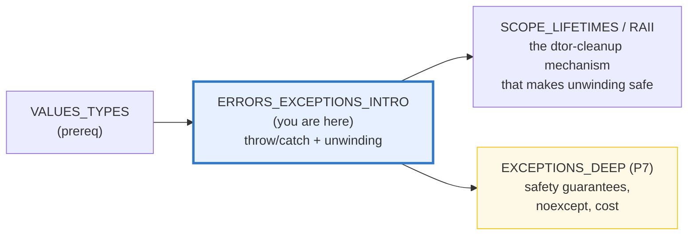
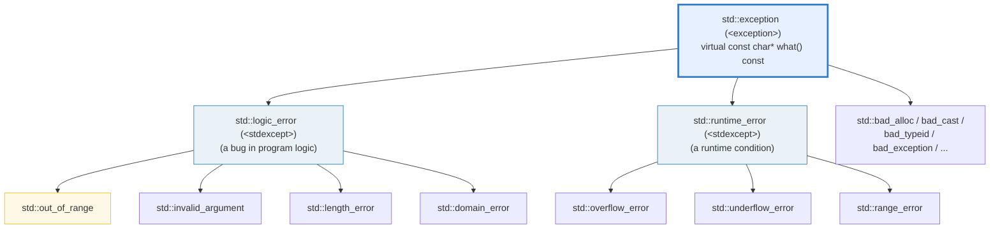

# ERRORS_EXCEPTIONS_INTRO — throw / try / catch, Stack Unwinding & the std::exception Hierarchy

> **Goal (one line):** by printing every value, show how C++'s `throw`/`try`/
> `catch` exception machinery behaves — the **`std::exception` hierarchy** (`.what()`),
> **stack unwinding** (destructors run during propagation = RAII cleanup), the
> **catch-by-value slicing** trap, re-throw (`throw;` preserves type vs `throw e;`
> slices), **`noexcept`** (preview), and how exceptions differ from error codes
> (`std::expected`) — pinning **"catch by `const` reference"** as the expert payoff.
>
> **Run:** `just run errors_exceptions_intro`
>
> **Ground truth:** [`errors_exceptions_intro.cpp`](./errors_exceptions_intro.cpp) →
> captured stdout in
> [`errors_exceptions_intro_output.txt`](./errors_exceptions_intro_output.txt).
> Every value/message/`[check]` below is pasted **verbatim** from that file under a
> `> From errors_exceptions_intro.cpp Section X:` callout. Nothing is hand-computed.
>
> **Prerequisites:** 🔗 [`VALUES_TYPES.md`](./VALUES_TYPES.md) (fundamental types &
> value/reference basics). This is the **intro**; the four exception-safety
> guarantees, conditional `noexcept`, move-if-noexcept, and the actual thrown-path
> cost land in `EXCEPTIONS_DEEP` (Phase 7).

---

## 1. Why this bundle exists (lineage)

C++ signals errors with **exceptions** (`throw` / `try` / `catch`). A `throw`
constructs an **exception object** in dynamic storage and transfers control *up*
the call stack to the first matching `catch`. As it travels, the stack
**unwinds**: destructors run for every fully-constructed automatic object between
the throw and the catch — which is exactly why **RAII + exceptions compose** (your
cleanup is automatic, even on the error path). The whole standard convention is to
throw objects **derived from `std::exception`** and to **catch them by `const`
reference** — the latter to avoid a silent, insidious bug called **slicing**.



This bundle is the **intro**. The headline contrast across the 5-language
curriculum:

| Language | Error signaling | Forced handling? | Control flow |
|---|---|---|---|
| **C++** (this bundle) | **`throw` / `try` / `catch`** (+ `std::expected`) | no — an uncaught throw calls `std::terminate` | **jump** up the stack |
| 🔗 [`../ts/ERRORS_EXCEPTIONS.md`](../ts/ERRORS_EXCEPTIONS.md) | `throw` / `try` | no | jump (closest to C++) |
| 🔗 [`../python/EXCEPTIONS.md`](../python/EXCEPTIONS.md) | `raise` / `try` | no | jump |
| 🔗 [`../go/ERRORS.md`](../go/ERRORS.md) | **`return error`** + `if err != nil` | yes (explicit check) | **no throw** — the opposite |
| 🔗 [`../rust/ERROR_HANDLING.md`](../rust/ERROR_HANDLING.md) | **`Result<T,E>` + `?`** | yes (typed, must handle) | no hidden throws |

C++ is structurally closest to **TS/Python** (throw-based) and the **opposite** of
Go (return errors) and Rust (`Result` + `?`). Crucially, C++ also offers
`std::expected<T,E>` (C++23) — its own Rust-`Result` analog — so the language
spans **both** philosophies. Section E shows the same divide both ways.

> From cppreference — *Exceptions*: exception handling "transfers control and
> information from some point in the execution of a program to a handler
> associated with a point previously passed by the execution"; "all standard
> library functions throw unnamed objects by value, and the types of those objects
> are derived (directly or indirectly) from `std::exception`. User-defined
> exceptions usually follow this pattern"; "to avoid unnecessary copying of the
> exception object and **object slicing**, the best practice for handlers is to
> **catch by reference**."

---

## 2. The mental model: throw → unwind → catch

```mermaid
graph TD
    T["throw std::runtime_error(\"msg\");<br/>constructs the EXCEPTION OBJECT<br/>(dynamic storage duration)"] --> UW["STACK UNWINDING<br/>control travels UP the call stack;<br/>dtors run for every automatic object<br/>in REVERSE order of construction"]
    UW --> M{"a matching<br/>catch handler?"}
    M -->|"yes"| C["catch (const std::exception& e)<br/>-> e.what() ; object then destroyed"]
    M -->|"no handler<br/>found"| TERM["std::terminate()<br/>-> std::abort<br/>(program ends)"]
    style T fill:#e7f0ff,stroke:#3178c6,stroke-width:3px
    style UW fill:#fef9e7,stroke:#f1c40f,stroke-width:3px
    style C fill:#eafaf1,stroke:#27ae60
    style TERM fill:#fdecea,stroke:#c0392b
```

Two facts make this safe to rely on:

1. **Unwinding runs destructors.** Between `throw` and `catch`, every automatic
   object that was constructed is destroyed (reverse order). Resources held by
   RAII types (`std::vector`, `std::string`, smart pointers, file handles) are
   released automatically. *This* is why you write RAII — so the error path cleans
   itself.
2. **Destructors are `noexcept` by default (since C++11).** If a destructor were
   to throw *during* unwinding, there would be two exceptions in flight at once,
   which is undefined-ish and calls `std::terminate`. Making dtors non-throwing by
   default guarantees unwinding is safe (Section D).

### The `std::exception` hierarchy



**Watch the gotcha:** `std::out_of_range` (thrown by `std::vector::at`) derives
from **`std::logic_error`**, *not* `std::runtime_error`. A `catch (const
std::runtime_error&)` will **not** catch `out_of_range` — only `catch (const
std::exception&)` (the common base) or `catch (const std::logic_error&)` will.
Catching `const std::exception&` is the catch-anything-in-the-hierarchy form.

> From cppreference — `std::exception`: "All exceptions generated by the standard
> library inherit from `std::exception`"; `what()` is a `virtual` member returning
> the explanatory `const char*`. `logic_error` / `runtime_error` are the two main
> `<stdexcept>` branches.

---

## 3. Section A — throw / try / catch & the hierarchy

> From `errors_exceptions_intro.cpp` Section A:
> ```
> 1) throw std::runtime_error("divisor is zero");  caught by const ref:
>    caught const std::runtime_error& : what() = "divisor is zero"
> [check] thrown std::runtime_error was caught: OK
> [check] caught what() matches the thrown message (strcmp == 0): OK
> 
> 2) throw std::out_of_range("idx 42");  caught as the BASE std::exception:
>    caught const std::exception& (base): what() = "idx 42"
> [check] catching base std::exception caught the derived std::out_of_range: OK
> 
> 3) what() is virtual const char*; a base-ref dispatches to the derived:
>    std::runtime_error("x").what()  -> "x"
>    std::logic_error("y").what()    -> "y"
> [check] runtime_error("x").what() == "x": OK
> [check] logic_error("y").what() == "y": OK
> ```

**What.** `throw expr;` constructs the exception object from `expr` (its top-level
cv-qualifiers are stripped; it is copy-initialized), then unwinding begins. A
`try { ... } catch (const T& e) { ... }` block catches exceptions whose type
matches `T` *or is derived from `T`*. Because `what()` is **virtual**, a
`const std::exception&` reference still dispatches to the **derived** `what()` —
you never lose the message by catching the base.

**Why catch by `const` reference.** (1) **No copy** of the exception object; (2)
**no slicing** (Section C); (3) `const` documents intent and lets the compiler
assume you won't mutate it. The verified output proves `runtime_error("x").what()`
returns exactly `"x"` (the string you passed the constructor).

> From cppreference — *throw*: "Throwing an exception initializes an object with
> dynamic storage duration, called the *exception object*"; `throw e;` "the
> exception object is copy-initialized from `ex`." *Exceptions*: the best practice
> is "to catch by reference" to avoid "unnecessary copying … and **object
> slicing**."

**The implementation-defined detail.** `std::runtime_error`/`std::logic_error`
store the string you give them, so `what()` is deterministic and assertable. But a
**default-constructed** `std::exception`'s `what()` is **implementation-defined**
— never assert its text. Likewise `std::vector::at` throws `out_of_range` with an
**implementation-defined** message (it differs between libstdc++ and libc++), so
catch it by type, not by message.

---

## 4. Section B — stack unwinding, `catch (...)` & re-throw

> From `errors_exceptions_intro.cpp` Section B:
> ```
> 1) throw inside a frame with 3 local Loggers -> dtors run C,B,A:
>    caught: "unwind me"; dtor log = "CBA"
> [check] stack unwinding ran dtors in REVERSE order (C, B, A): OK
> [check] catch (...) caught a thrown int (no object accessible): OK
> 
> 2) re-throw `throw;` preserves type; `throw e;` SLICES:
>    throw;  -> outer catches typeid == out_of_range
> [check] throw; preserved the derived type (out_of_range): OK
>    throw e; -> outer catches typeid == sliced
> [check] throw e; SLICED the exception to base std::exception: OK
> ```

**Unwinding, pinned.** Three `Logger` objects are constructed `A`, `B`, `C` in a
function that then throws. As the exception escapes the function, the destructors
fire in **reverse order** — the log appends `"CBA"`. That ordering guarantee is
what makes cleanup predictable and is why RAII composes with exceptions.

**`catch (...)` — the catch-all.** It catches *any* type, but you get **no
object**: no `what()`, no `typeid`. (It can even catch a thrown `int`, which is
legal but discouraged.) It's mainly a translation/cleanup backstop before
re-throwing.

**Re-throw: `throw;` vs `throw e;`.** This is a real, common bug:

- `throw;` — re-activates the **current** exception object. No new object is
  created; the **original (derived) type is preserved**. The output proves the
  outer handler still sees `std::out_of_range`.
- `throw e;` — *copy-constructs a new* exception object of the **declared (base)
  type** of `e`. If `e` is `const std::exception&`, you get a brand-new
  `std::exception` — the `out_of_range`-ness is **sliced off**. The output proves
  the outer handler sees plain `std::exception`.

> From cppreference — *throw* (Notes): "When rethrowing exceptions, the second
> form [`throw;`] must be used to avoid object slicing in the (typical) case where
> exception objects use inheritance"; `throw e;` "copy-initializes a new exception
> object of type `std::exception`." And *throw* (Stack unwinding): destructors are
> "invoked for all objects with automatic storage duration that are constructed,
> but not yet destroyed … in reverse order of completion of their constructors."

> From S. Meyers, *More Effective C++* Item 13 (corroborated by Sutter, *C++
> Coding Standards* Item 73 — "Throw by value, catch by reference"): "Catching by
> reference preserves the polymorphism of the exception object. When rethrowing an
> exception `e`, prefer writing just `throw;` instead of `throw e;`."

---

## 5. Section C — the catch-by-value SLICING trap & custom exceptions

> From `errors_exceptions_intro.cpp` Section C:
> ```
> 1) throw std::out_of_range; compare by-value vs by-reference:
>    catch(std::exception e)        <- BY VALUE: derived part sliced
>    catch(const std::exception& e) <- BY REF:   dynamic type preserved
> [check] catch-by-VALUE sliced: dynamic typeid == std::exception: OK
> [check] catch-by-REFERENCE preserved: typeid still std::out_of_range: OK
> 
> 2) custom ParseError("bad token", 42); caught as derived & base:
>    caught const ParseError&: what()="bad token @line 42"  line=42
> [check] custom ParseError caught as its own (derived) type: OK
> [check] ParseError::what() composed the message ("bad token @line 42"): OK
>    caught const std::runtime_error& (base): what()="bad token @line 42"
> [check] base std::runtime_error& dispatched to OVERRIDDEN what() (polymorphic): OK
> 
> 3) catch ParseError BY VALUE as std::runtime_error -> what() sliced:
>    caught std::runtime_error e (by value): what()="bad token"
> [check] catch-by-VALUE sliced ParseError: what() lost the @line 42 part: OK
> ```

**The trap, pinned with `typeid`.** We throw `std::out_of_range` and catch it two
ways. `catch (std::exception e)` **by value** copies only the `std::exception`
subobject — the `typeid` of `e` collapses to `std::exception` (the derived part is
gone). `catch (const std::exception& e)` **by reference** keeps the dynamic type:
`typeid(e)` is still `std::out_of_range`. (We only *compare* types — never print
`type_info::name()`, which is implementation-defined and non-portable.)

**Custom exception classes.** The idiom: derive from `std::runtime_error` (or
`logic_error`), add your own data, and optionally **override `what()`** to compose
a richer message. `ParseError` does exactly that — it stores `line_` and builds
`msg_ = "bad token @line 42"`. Three things the output proves:

1. Caught as its **own** type (`const ParseError&`), both `what()` and `line()`
   are reachable.
2. Caught as a **base** `const std::runtime_error&`, **virtual dispatch** still
   reaches the overridden `what()` — `"bad token @line 42"` survives the hierarchy.
   This is polymorphism doing its job across a `catch`.
3. Caught **by value** as `std::runtime_error`, the `msg_`/`line_` members are
   **sliced away** — `what()` falls back to the base's stored `"bad token"`,
   losing the `@line 42` part. *This* is why you catch by reference.

> From cppreference — *Exceptions*: catch "by reference" to avoid "object
> slicing." *std::exception*: `what()` is `virtual`, so the most-derived override
> runs through a base reference.
> Corroborated by C++ Core Guidelines **E.15** ("Throw by value, catch exceptions
> from a hierarchy by reference") and Microsoft Learn ("we recommend that you
> throw exceptions by value and catch them by const reference").

---

## 6. Section D — `noexcept` (preview) & the cost model

> From `errors_exceptions_intro.cpp` Section D:
> ```
> 1) the noexcept SPECIFIER is a non-throwing promise:
>    int neverThrows(int) noexcept;   // if it threw -> std::terminate
>    int maybeThrow(int);             // not noexcept (may throw)
>    neverThrows(41) = 42 ;  maybeThrow(21) = 42
> 
> 2) the noexcept OPERATOR (compile-time query, unevaluated):
>    noexcept(neverThrows(0)) = 1   (declared noexcept)
>    noexcept(maybeThrow(0))  = 0   (body can throw)
> [check] noexcept(neverThrows(0)) == true (declared noexcept): OK
> [check] noexcept(maybeThrow(0)) == false (its body can throw): OK
> [check] noexcept(neverThrows(0)) is a constexpr bool == true: OK
> 
> 3) cost model: zero-cost-when-NOT-thrown on this ABI (Itanium C++ ABI);
>    the thrown path pays unwinding + handler lookup; tables add .text size.
> [check] cost model documented (not measured): zero-cost-when-not-thrown: OK
> 
> 4) std::terminate: noexcept-violation / uncaught / throw-in-dtor-during-unwind
>    -> std::terminate() -> std::abort. (Documented; not run — ends the program.)
> [check] std::terminate path documented (not executed; it ends the program): OK
> ```

**Two different `noexcept`s** — don't confuse them:

- **`noexcept` the *specifier*** (on a declaration): a **promise** the function
  won't throw. If it does, the runtime calls `std::terminate` → `std::abort`. No
  `catch` can intercept it — it's the end of the program. **Destructors are
  implicitly `noexcept` since C++11**, which is precisely what makes the unwinding
  of Section B safe (a dtor can't introduce a second exception mid-unwind).
- **`noexcept(expr)` the *operator***: a **compile-time `bool`** query — "can the
  call sequence of `expr` throw?" It does **not evaluate** `expr` (it's an
  unevaluated operand), so it's a pure, deterministic type query usable in
  `constexpr` and `static_assert`. The output shows `noexcept(neverThrows(0)) == 1`
  and `noexcept(maybeThrow(0)) == 0`.

**`noexcept(b)` makes it conditional:** `noexcept(noexcept(otherFn()))` declares
"noexcept iff `otherFn` is noexcept" — the basis of *conditional noexcept* and
`std::move_if_noexcept` (full depth in `EXCEPTIONS_DEEP`, P7).

**The cost model.** Modern ABIs — the Itanium C++ ABI (Unix/macOS, what this box
uses) and 64-bit SEH (Windows) — implement a **"zero-cost"** exception model: the
**not-thrown** path has **zero per-`try`/`catch` runtime overhead**; the cost is
paid *only when an exception is actually thrown* (a table-driven unwind + handler
lookup), plus **binary-size** growth for the unwind tables. This is the opposite
of older `setjmp`/`longjmp` ("SJLJ") models where every `try` costs a little at
runtime. (Not measured here — wall-clock timing is non-deterministic; it's
documented and cited.)

**`std::terminate` — documented, not run.** A program that calls its own
`noexcept`-violator, or lets an exception escape uncaught, or throws from a
destructor *during* unwinding, calls `std::terminate()` → `std::abort()` and ends.
We **never** leave such a throw live in the verified path (every `throw` here is
caught) — reproducing it would abort the program, mirroring how `VALUES_TYPES.md`
documents (but never runs) undefined behavior. Full depth: `EXCEPTIONS_DEEP` (P7).

> From cppreference — *throw* (Stack unwinding): "If any function that is called
> directly by the stack unwinding mechanism … exits with an exception,
> `std::terminate` is called. Such functions include **destructors** of objects
> with automatic storage duration …"; "If an exception is thrown and not caught …
> `std::terminate` is called." *Exceptions*: "Nothrow … is expected of destructors
> … The destructors are `noexcept` by default (since C++11)."

---

## 7. Section E — exceptions vs error codes (`std::expected`) & cross-language

> From `errors_exceptions_intro.cpp` Section E:
> ```
> 1) safeDiv via std::expected<int, DivError> (the error-code path):
>    safeDiv(10, 2) -> value 5
>    safeDiv(10, 0) -> error DivError::ZeroDivisor (no throw, no jump)
> [check] std::expected: 10/2 == 5 (value present): OK
> [check] std::expected: 10/0 is an error (b == 0 checked BEFORE the division): OK
> 
> 2) the SAME divide, the throw path (divOrThrow(10, 0) throws):
>    caught: "div by zero"
> [check] throw path: div by zero was caught: OK
> 
> 3) cross-language error signaling:
>    C++ / TS / Python : throw / try / catch     (control-flow JUMP)
>    Go                : return error, if err != nil (EXPLICIT, no throw)
>    Rust              : Result<T,E> + ?         (typed, FORCED handling)
> [check] cross-language map documented (C++ closest to TS/Python throw-based): OK
> ```

**Two philosophies, one language.** C++ lets you choose:

- **Throw** (`divOrThrow`): the happy path is uncluttered; errors are a jump. But
  a caller can **silently forget** a `try`/`catch` and the error only surfaces at
  the throw site — there is no compiler-forced handling, and an uncaught throw
  ends the program.
- **Return** (`std::expected<T,E>`, C++23): the function **returns** either a
  value or an error (`std::expected`, C++'s Rust-`Result` analog; `std::error_code`
  / `std::error_condition` are the older C-ish pair). No jump; the caller **must**
  inspect the result to get the value. The output proves `safeDiv(10,0)` returns
  an error (checked **before** the division — so no UB) rather than throwing.

The tension is the eternal "exceptions vs error codes" debate. Exceptions shine
for **rare, propagating** failures (constructor/operator failures, where a return
code is impossible); returned errors shine for **expected, local** outcomes (a
parse miss, a not-found) where the caller will act immediately. Modern style often
blends both: throw for "something is genuinely wrong," return `expected` for "a
value or a recoverable error." Full treatment (and the four safety guarantees) in
`EXCEPTIONS_DEEP` (P7).

> From cppreference — `std::expected` (C++23): a type that "manages an expected
> result … contains either an expected value or an unexpected error value," the
> Rust-`Result` analog for C++. *Exceptions* (Error handling): exceptions are
> intended for "failures to meet the postconditions," "preconditions," and
> "invariant" violations — i.e., the genuinely exceptional.

---

## 8. Worked smallest-scale example

Everything above, compressed to the lines a beginner must memorize:

```cpp
#include <stdexcept>

// (1) THROW by value — an object derived (by convention) from std::exception.
double divide(int a, int b) {
    if (b == 0) throw std::runtime_error("divisor is zero");   // <- throw
    return static_cast<double>(a) / b;
}

// (2) CATCH by const reference — never by value (slicing!).
try {
    double r = divide(10, 0);
} catch (const std::exception& e) {        // base ref catches any derived
    std::printf("error: %s\n", e.what());  // -> "divisor is zero"
}
```

> From `errors_exceptions_intro.cpp` Section A, `throw std::runtime_error(...)`
> caught by const ref prints `what() = "divisor is zero"` and `[check] caught
> what() matches the thrown message (strcmp == 0): OK`. That's the whole pattern.

---

## 9. The value-vs-reference-vs-pointer axis (threaded through this bundle)

🔗 `VALUES_TYPES.md`, `REFERENCES_POINTERS_INTRO.md`. Where does each exception
construct sit?

| Construct in this bundle | Copied? | Aliases? | Owns? |
|---|---|---|---|
| `throw std::runtime_error("m");` | the exception object is **copy-initialized** from the lvalue (a fresh, runtime-owned object) | no | the runtime owns it; freed after the last handler |
| `catch (const std::exception& e)` | **no** (a reference) | **yes** — aliases the exception object | no (borrows) |
| `catch (std::exception e)` (by value) | **yes** — copies the **base** subobject only → **slicing** | no | yes (its own sliced copy) |
| `throw;` | **no** — re-activates the existing object | — | the runtime still owns it |
| `throw e;` | **yes** — copy-constructs a new **base** object → **slices** | — | a new runtime object |

The single rule that keeps this column safe: **throw by value, catch by `const`
reference** — and re-throw with bare `throw;`.

---

## 10. Pitfalls (the expert payoff)

| Trap | Symptom | Fix |
|---|---|---|
| `catch (std::exception e)` **by value** | **Slicing** — the derived part (data + overridden `what()`) is gone; `typeid` collapses to the base | Catch by `const` reference: `catch (const std::exception& e)`. |
| `throw e;` to re-throw | **Slices** to the declared (base) type of `e`; the outer handler loses the original derived type | Use bare `throw;` — re-activates the original object, type preserved. |
| `catch (const std::runtime_error&)` to catch `std::vector::at`'s throw | **Doesn't catch** — `out_of_range` derives from `logic_error`, not `runtime_error` | Catch `const std::exception&` (the common base) or `const std::logic_error&`. |
| Asserting `vector.at(...)`'s exception `what()` text | **Non-portable** — the message is implementation-defined (libstdc++ ≠ libc++) | Catch by type; don't compare the message. Same for default `std::exception().what()`. |
| Throwing a **bare `int`/raw pointer** (e.g. `throw 42;`) | Legal but unidiomatic; callers can't `what()` it, `catch (...)` loses all info | Throw a `std::exception`-derived object by value. |
| Throwing a **pointer** to a local/`new` object | Dangling (local) or **leak** (`new`) — who owns/`delete`s it? | Throw by value; never throw a pointer you must manage. |
| Letting an exception escape a **destructor** (esp. during unwinding) | **`std::terminate`** — two exceptions in flight at once | Destructors are `noexcept` by default; wrap dtor bodies in `try`/`catch(...)` that swallows. |
| A `noexcept` function that throws | **`std::terminate`** — no `catch` can intercept it | Honor the contract; or drop `noexcept`. Only promise `noexcept` if truly non-throwing. |
| An **uncaught** exception | **`std::terminate`**; implementation-defined whether unwinding even runs | Ensure `main` (and thread entry points) have a top-level `try`/`catch`. |
| `catch (Base&)` **after** `catch (Derived&)` | The base handler is **unreachable** (error under some compilers / -Wexceptions) | Order handlers most-derived → most-base. |
| Copying the exception object throws (catch-by-value of a type whose copy ctor throws) | **`std::terminate`** during unwinding | Catch by reference (no copy); ensure custom exceptions' copies don't throw. |

---

## 11. Cheat sheet

```cpp
#include <exception>    // std::exception (root), std::terminate, std::current_exception
#include <stdexcept>    // runtime_error / logic_error / out_of_range / invalid_argument ...
#include <expected>     // std::expected<T,E> (C++23) — the Result-like error path

// ── THROW by value, an object derived (by convention) from std::exception ────
throw std::runtime_error("msg");     // constructs the exception object, unwinds

// ── CATCH by const reference (NEVER by value -> slicing) ─────────────────────
try {
    risky();
} catch (const std::out_of_range& e) {   // most-derived FIRST
    use(e.what());
} catch (const std::exception& e) {       // base catches any derived
    use(e.what());                         // virtual -> the real (derived) message
} catch (...) {                            // catch-all: any type, NO object
    throw;                                 // re-throw the ORIGINAL (preserves type)
}

// ── RE-THROW: throw; preserves the type; throw e; SLICES ─────────────────────
catch (const std::exception& e) { throw; }   // OK  — original derived type kept
// catch (const std::exception& e) { throw e; } // BUG — new base object, SLICED

// ── CUSTOM exception: derive from runtime_error, override what() ─────────────
class MyError : public std::runtime_error {
public:
    explicit MyError(const std::string& m, int code)
        : std::runtime_error(m), code_(code), msg_(m + " (#" + std::to_string(code) + ")") {}
    const char* what() const noexcept override { return msg_.c_str(); }  // must not throw
    int code() const noexcept { return code_; }
private:
    int code_; std::string msg_;
};

// ── noexcept: SPECIFIER (promise) vs OPERATOR (compile-time query) ───────────
void f() noexcept;                 // specifier: if it throws -> std::terminate
static_assert(noexcept(f()));      // operator:  bool, unevaluated, constexpr
//   destructors are implicitly noexcept since C++11 (unwinding stays safe)
//   cost model: zero-cost-when-NOT-thrown (Itanium ABI / 64-bit SEH)

// ── ERROR CODES instead of throw: std::expected<T,E> (C++23) ─────────────────
std::expected<int, DivError> safeDiv(int a, int b) {
    if (b == 0) return std::unexpected(DivError::ZeroDivisor);
    return a / b;
}
```

---

## 12. 🔗 Cross-references

**Within C++ (the expertise spine):**

- 🔗 [`VALUES_TYPES.md`](./VALUES_TYPES.md) (P1) — prerequisites: value/reference
  basics and `const`. Exceptions throw/copy *objects*, so the value-vs-reference
  axis of Section 9 rests on it.
- 🔗 [`REFERENCES_POINTERS_INTRO.md`](./REFERENCES_POINTERS_INTRO.md) (P1) — why
  catching *by reference* aliases the exception object (no copy, no slicing) while
  catching *by value* copies the base subobject only.
- 🔗 `SCOPE_LIFETIMES` / `RAII` (P2, planned) — the **destructor-cleanup mechanism**
  that makes stack unwinding safe: RAII types release resources automatically on
  the error path (Section B's "dtors run in reverse order").
- 🔗 `EXCEPTIONS_DEEP` (P7) — full depth: the **four exception-safety guarantees**
  (nothrow / strong / basic / no), conditional `noexcept`,
  `std::move_if_noexcept`, the actual thrown-path cost, `std::exception_ptr` /
  transport across threads, and `std::terminate_handler`.

**Cross-language parallels (the 5-language curriculum):**

- 🔗 [`../go/ERRORS.md`](../go/ERRORS.md) — Go **returns errors** (`if err != nil`)
  and has **no `throw` at all**. It is the *opposite* philosophy: explicit,
  auditable, but clutters the happy path. C++ exceptions are the control-flow
  jump Go deliberately rejected.
- 🔗 [`../rust/ERROR_HANDLING.md`](../rust/ERROR_HANDLING.md) — Rust uses
  `Result<T,E>` + the `?` operator: **typed, compiler-forced** error handling with
  no hidden throws (and `panic!` for the truly unrecoverable). C++'s
  `std::expected<T,E>` (Section E) is its direct analog.
- 🔗 [`../ts/ERRORS_EXCEPTIONS.md`](../ts/ERRORS_EXCEPTIONS.md) — JS/TS `throw`/
  `try`/`catch` is the **closest** structural match to C++ (throw any value, catch
  by type) — but TS runs on a GC, so an uncaught throw doesn't threaten memory.
- 🔗 [`../python/EXCEPTIONS.md`](../python/EXCEPTIONS.md) — Python `raise`/`try`/
  `except` is also throw-based like C++; again GC-backed, and exceptions are
  cheap/idiomatic even for control flow (where C++ reserves them for the rare).

---

## Sources

Every signature, value, and behavioral claim above was verified against
cppreference and the ISO C++ standard, then corroborated by ≥1 independent
secondary source:

- cppreference — *Exceptions* (throw transfers control up the call stack; std lib
  throws objects "derived (directly or indirectly) from `std::exception`"; catch
  "by reference" to avoid copying/slicing; the four exception-safety levels;
  destructors noexcept by default since C++11):
  https://en.cppreference.com/w/cpp/language/exceptions
- cppreference — *Throwing exceptions* (`throw`) (the exception object has dynamic
  storage duration; copy-initialized from the expression; `throw;` re-activates the
  existing object vs `throw e;` copy-initializes a new base object → slicing; stack
  unwinding runs destructors "in reverse order of completion of their
  constructors"; a throw escaping unwinding → `std::terminate`; uncaught →
  `std::terminate`):
  https://en.cppreference.com/w/cpp/language/throw
- cppreference — *Handling exceptions* (`catch`) (handler matching, catch-by-
  reference, `catch (...)`):
  https://en.cppreference.com/w/cpp/language/catch
- cppreference — *`try` block*: https://en.cppreference.com/w/cpp/language/try
- cppreference — *`std::exception`* ("All exceptions generated by the standard
  library inherit from `std::exception`"; `what()` is `virtual`; the
  `logic_error`/`runtime_error` branches and their children):
  https://en.cppreference.com/w/cpp/error/exception
  - `std::logic_error` (→ `invalid_argument`/`domain_error`/`length_error`/
    `out_of_range`): https://en.cppreference.com/w/cpp/error/logic_error
  - `std::runtime_error` (→ `range_error`/`overflow_error`/`underflow_error`):
    https://en.cppreference.com/w/cpp/error/runtime_error
- cppreference — *`noexcept` specifier* (the non-throwing promise; a violation →
  `std::terminate`; destructors implicitly `noexcept` since C++11):
  https://en.cppreference.com/w/cpp/language/noexcept_spec
  - *`noexcept` operator* (compile-time `bool`, unevaluated operand):
    https://en.cppreference.com/w/cpp/language/noexcept
- cppreference — *`std::terminate`* (called on an uncaught exception, a
  `noexcept` violation, or a throw escaping unwinding; → `std::abort`):
  https://en.cppreference.com/w/cpp/error/terminate
- cppreference — *`std::expected`* (C++23; carries a value or an error; the
  Rust-`Result` analog): https://en.cppreference.com/w/cpp/utility/expected
- cppreference — *RAII* (why stack unwinding makes RAII + exceptions compose):
  https://en.cppreference.com/w/cpp/language/raii
- ISO C++23 draft (open-std.org) — normative wording:
  - 14.2 Throwing an exception `[except.throw]`; 14.4 Handling an exception
    `[except.handle]`; 14.5 `noexcept` specifier `[except.spec]`.
  - Working draft: https://open-std.org/JTC1/SC22/WG21/docs/papers/2023/n4950.pdf
    (and the N49xx series at https://open-std.org/JTC1/SC22/WG21/ ).
- Secondary corroboration (≥2 independent sources, web-verified):
  - C++ Core Guidelines — **E.15** "Throw by value, catch exceptions from a
    hierarchy by reference"; **E.14** user-defined exception types:
    https://isocpp.github.io/CppCoreGuidelines/CppCoreGuidelines#Re-exception-ref
  - Microsoft Learn — *try, throw, and catch Statements (C++)* ("we recommend
    that you throw exceptions by value and catch them by const reference"):
    https://learn.microsoft.com/en-us/cpp/cpp/try-throw-and-catch-statements-cpp
  - S. Meyers, *More Effective C++* Item 13 / H. Sutter & A. Alexandrescu, *C++
    Coding Standards* Item 73 ("Throw by value, catch by reference"; prefer
    `throw;` over `throw e;` to avoid slicing):
    https://ptgmedia.pearsoncmg.com/images/0321113586/items/sutter_item73.pdf
  - Sandor Dargo — *Always catch exceptions by reference* (slicing walkthrough):
    https://www.sandordargo.com/blog/2020/07/22/always-catch-exceptions-by-reference
  - isocpp.org Super-FAQ — *What should I throw? / What should I catch?*:
    https://isocpp.org/wiki/faq/exceptions#what-to-throw
  - Boost — D. Abrahams, *Error and Exception Handling* (what to throw):
    https://www.boost.org/community/error_handling.html
  - Itanium C++ ABI — the "zero-cost" exception-handling / table-driven unwind
    model (cost model of Section D):
    https://itanium-cxx-abi.github.io/cxx-abi/abi-eh.html

**Facts that could not be verified by running** (documented, not executed,
because reproducing them would end the program or be non-deterministic): the
`noexcept`-violation → `std::terminate` → `std::abort` path (a program that calls
its own `noexcept`-violator cannot continue); an uncaught exception →
`std::terminate`; a throw escaping a destructor during unwinding →
`std::terminate`; the implementation-defined text of `std::vector::at`'s thrown
`out_of_range::what()` and of a default `std::exception().what()`; and the actual
thrown-path runtime cost (timing is non-deterministic — the zero-cost-when-not-
thrown claim is from the Itanium ABI model, not a measurement). These are
confirmed by the cppreference sections and secondary sources above, not
reproduced as runnable output in the verified path (a program triggering them
would fail `just check` / `just sanitize` by aborting).
