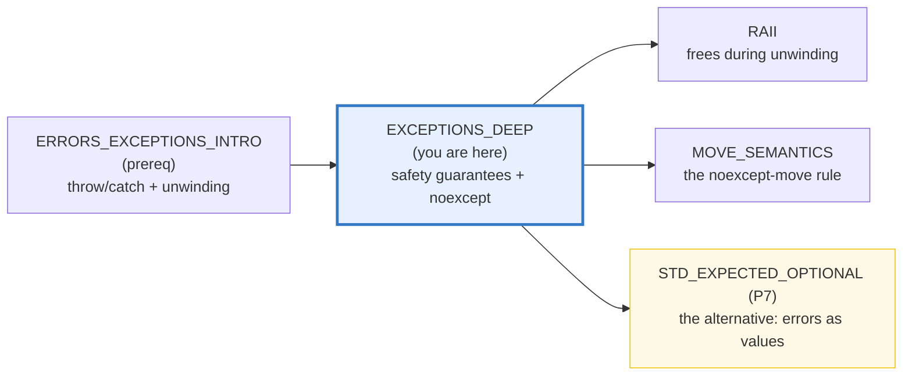
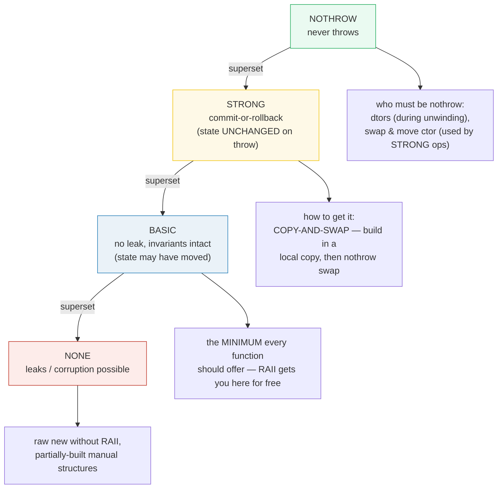
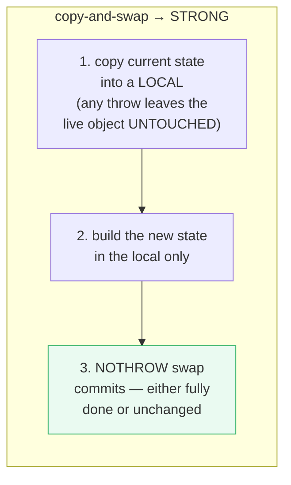
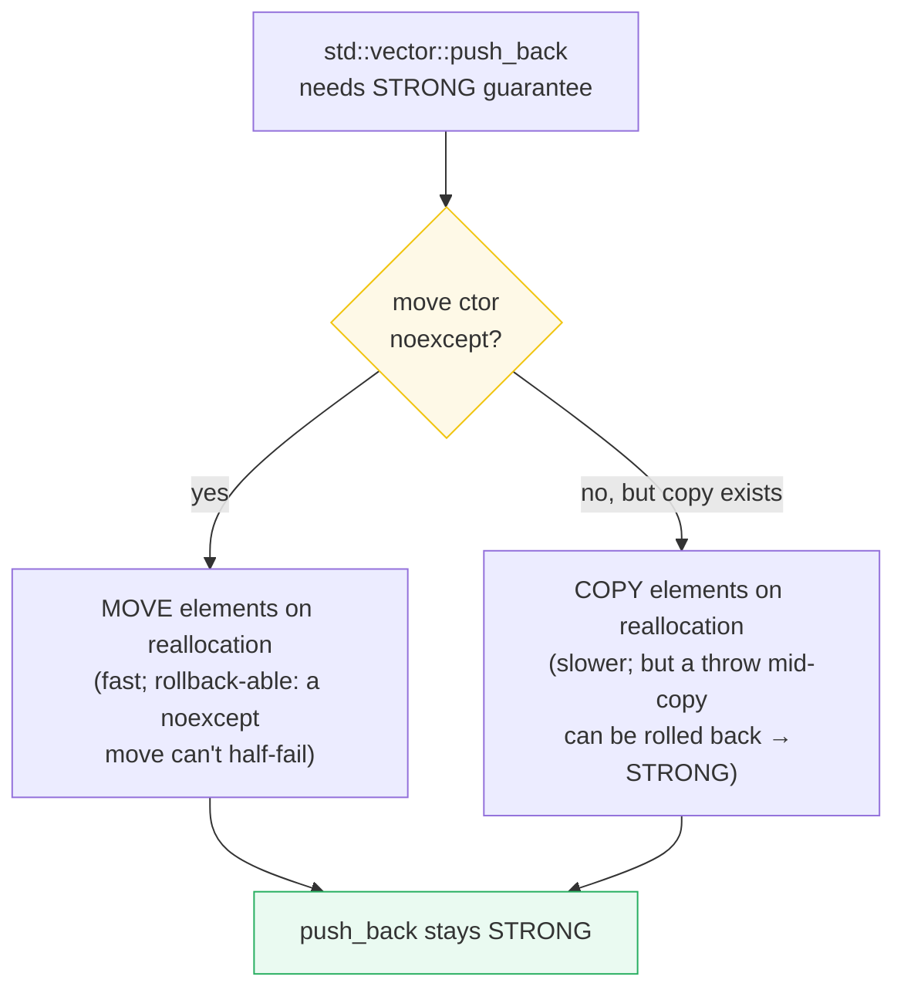

# EXCEPTIONS_DEEP — The Four Safety Guarantees, noexcept & the Cost Model

> **Goal (one line):** by printing every value, show C++ exception **SAFETY** in
> full depth — the **four exception-safety guarantees** (Abrahams: nothrow /
> strong-commit-or-rollback / basic / none), the **strong guarantee via
> copy-and-swap**, **RAII freeing resources during stack unwinding**, the
> **`noexcept` specifier/operator**, the **`noexcept`-move-vs-copy** decision
> `std::vector` makes on reallocation (`move_if_noexcept`), why you **never throw
> from a destructor** (`std::terminate`), and the **exceptions-vs-error-codes-vs-
> `std::expected`** tradeoff — pinning **copy-and-swap for the strong guarantee**
> as the expert payoff.
>
> **Run:** `just run exceptions_deep`
>
> **Ground truth:** [`exceptions_deep.cpp`](./exceptions_deep.cpp) → captured stdout
> in [`exceptions_deep_output.txt`](./exceptions_deep_output.txt). Every value /
> message / `[check]` below is pasted **verbatim** from that file under a
> `> From exceptions_deep.cpp Section X:` callout. Nothing is hand-computed.
>
> **Prerequisites:** 🔗 [`ERRORS_EXCEPTIONS_INTRO.md`](./ERRORS_EXCEPTIONS_INTRO.md)
> (throw/catch/unwinding/slicing — the intro), 🔗 [`RAII.md`](./RAII.md) (the
> dtor-cleanup mechanism that makes unwinding safe), 🔗
> [`MOVE_SEMANTICS.md`](./MOVE_SEMANTICS.md) (the `noexcept`-move rule whose *why*
> this bundle explains). This is the **Phase 7 deep dive** the intro forwards to.

---

## 1. Why this bundle exists (lineage)

The intro bundle ([`ERRORS_EXCEPTIONS_INTRO`](./ERRORS_EXCEPTIONS_INTRO.md))
answered *"how does `throw`/`catch` work?"* This one answers the harder, expert
question: **what guarantee does a function give the caller when it fails?** Not
all code that catches is correct — a function that leaks or corrupts state on a
thrown error is broken even if every exception is caught. **Exception safety**
(classified by David Abrahams, 2000) is the vocabulary for that guarantee, and it
has four levels. The jump from *basic* to *strong* is the entire reason the
**copy-and-swap idiom** and the **`noexcept`-move** rule exist.



The headline contrast across the 5-language curriculum — error **safety** is
broader than error **signaling**:

| Language | Can you *write* unsafe-on-error code? | Who enforces the guarantee? |
|---|---|---|
| **C++** (this bundle) | **yes** — a leak/corrupt-on-throw function compiles fine | the **programmer** (via RAII, copy-and-swap, `noexcept`); the compiler does *not* check |
| 🔗 [`../rust/ERROR_HANDLING.md`](../rust/ERROR_HANDLING.md) | **no** — `Drop` + ownership make leaks/corruption-on-error near-impossible | the **borrow checker + compiler** |
| 🔗 [`../go/ERRORS.md`](../go/ERRORS.md) | partially — `defer` runs on error, but you can still leak goroutines/resources | the **programmer** + `defer` |
| 🔗 [`../ts/ERRORS_EXCEPTIONS.md`](../ts/ERRORS_EXCEPTIONS.md) / [`../python/EXCEPTIONS.md`](../python/EXCEPTIONS.md) | rarely — GC handles memory; only *external* resources leak | the **GC** + the programmer |

C++ is the only language here that lets you *write* a function with **no**
exception guarantee and discover it only at runtime (a leak, a crash, broken
invariants). That is the expert topic this bundle drills.

> From cppreference — *Exceptions* (Exception safety): the four levels are
> "generally recognized" and are "strict supersets of each other": **Nothrow /
> nofail** (never throws; expected of destructors and "swaps, move constructors,
> and other functions used by those that provide strong exception guarantee"),
> **Strong** ("the state of the program is rolled back to the state just before
> the function call — e.g. `std::vector::push_back`"), **Basic** ("the program
> is in a valid state. No resources are leaked, and all objects' invariants are
> intact"), and **No guarantee** ("resource leaks, memory corruption, or other
> invariant-destroying errors may have occurred"). Generic components may
> additionally offer *exception-neutral* guarantee.

---

## 2. The mental model: the safety ladder



The ladder is cumulative: a **nothrow** function trivially satisfies **strong**
(no throw → nothing to roll back), which satisfies **basic** (no leak), which is
above **none**. Section A proves the three runnable rungs (nothrow, strong,
basic) and documents the fourth (none).





The third diagram is the payoff of Section C: `std::vector` *deliberately copies*
elements whose move ctor is not `noexcept` — sacrificing speed to preserve the
**strong** guarantee of `push_back`/`resize`. This is *why* move ctors should be
`noexcept`.

---

## 3. Section A — the four guarantees & strong via copy-and-swap

> From `exceptions_deep.cpp` Section A:
> ```
> The four guarantees (Abrahams), strict supersets of each other:
>   NOTHROW : never throws (dtors, swap, move ctors)
>   STRONG  : commit-or-rollback (state UNCHANGED on throw)
>   BASIC   : no leak, invariants intact (state may have moved)
>   NONE    : leaks / corruption / broken invariants possible
> 
> (1) NOTHROW — intSwap(int&,int&) noexcept:
>     x=2 y=1 (swapped); noexcept(intSwap(x,y))=1
> [check] nothrow intSwap swapped the values (x==2, y==1): OK
> [check] intSwap is noexcept (the no-throw guarantee): OK
> 
> (2) STRONG — appendStrong({10,20,30}, fail_at=1) on {1,2,3}:
>     (builds new state in a copy; throw leaves the bag UNCHANGED)
>     caught: "appendStrong: simulated failure"
>     bag after = { 1, 2, 3 } (size 3)
> [check] STRONG appendStrong ROLLED BACK: size still 3: OK
> [check] STRONG appendStrong ROLLED BACK: contents unchanged {1,2,3}: OK
> 
> (3) BASIC — appendBasic({10,20,30}, fail_at=1) on {1,2,3}:
>     (mutates in place; throw leaves a VALID but partially-mutated bag)
>     caught: "appendBasic: simulated failure"
>     bag after = { 1, 2, 3, 10 } (size 4)
> [check] BASIC appendBasic did NOT roll back: size grew to 4 (one push before throw): OK
> [check] BASIC appendBasic left a VALID state {1,2,3,10}: OK
> 
> (4) NONE — raw `new` without RAII LEAKS on throw (documented, not run):
>     int* p = new int(42);  if (fail) throw ...;  delete p; // <- delete skipped -> LEAK
>     fix: std::unique_ptr<int> p(new int(42)); // dtor frees even on throw (RAII)
> [check] no-guarantee leak documented (RAII/unique_ptr is the fix; never run the leak): OK
> ```

**The four levels, pinned by a single deterministic failure.** We drive the
*same* operation (append `{10,20,30}` to `{1,2,3}`, failing at index 1) two ways
and read back the resulting state:

**(1) Nothrow** — `intSwap` is `noexcept`; it provably cannot fail, so it gives the
strongest guarantee trivially.

**(2) Strong** — `appendStrong` builds the new state in a **local copy** (`tmp`),
then commits with the **nothrow** `vector::swap`. The simulated throw fires *while
building the copy* (index 1), so the live `v_` is **never touched**. The output
proves the bag is still exactly `{1, 2, 3}` after the catch. **Commit-or-rollback.**

**(3) Basic** — `appendBasic` mutates `v_` **in place**. The same throw fires at
index 1, but by then one element (`10`) has already been pushed onto the live
object. The bag is now `{1, 2, 3, 10}` — **valid, no leak, invariants intact**,
but **not rolled back**. This is the *basic* guarantee: the program is in a sane
state, just not the pre-call state.

**(4) None** — raw `new`/`delete` without RAII leaks on throw (the `delete` is
skipped). We **document, never run** it (it would fail `just sanitize`). The fix
is RAII (`std::unique_ptr`), whose dtor frees even on the error path (Section B).

**The copy-and-swap mechanics.** Three steps, and only the third touches the live
object:

```cpp
void appendStrong(const std::vector<int>& items, int failAt) {
    std::vector<int> tmp(v_);                  // 1. copy current state
    for (size_t i = 0; i < items.size(); ++i) {
        if ((int)i == failAt) throw ...;       //    throw here -> tmp dies, v_ UNTOUCHED
        tmp.push_back(items[i]);               // 2. mutate the COPY only
    }
    tmp.swap(v_);                              // 3. nothrow commit (or never reached)
}
```

The swap must be **nothrow** — otherwise the swap itself could throw *after* the
copy was built, leaving two half-swapped objects. `std::vector::swap` (and
`std::swap` on most standard types) is `noexcept`; for your own types, mark the
swap and move ctor `noexcept` (Section C / 🔗 `MOVE_SEMANTICS`). This is also why
the **rule of five** pairs copy-and-swap with a `noexcept` move.

> From cppreference — *Exceptions* (Exception safety): the strong guarantee means
> "the state of the program is rolled back to the state just before the function
> call"; `std::vector::push_back` is the canonical example. *Abrahams, "Exception
> Safety in Generic Components"* (2000) is the origin of the four-level taxonomy.
> Corroborated by the C++ Core Guidelines and Sutter/Alexandrescu, *C++ Coding
> Standards*.

---

## 4. Section B — stack unwinding + RAII (no leak)

> From `exceptions_deep.cpp` Section B:
> ```
> (1) two Trackers constructed, then throw -> dtors run during unwinding:
> [check] Trackers alive after construction (==2): OK
>     caught: "unwind test"; Tracker::alive after catch = 0
> [check] RAII freed BOTH Trackers during unwinding (alive==0): OK
> 
> (2) unwinding order is REVERSE of construction:
>     construction order = 1,2 ; dtor order during unwind = "21"
> [check] unwinding ran dtors in REVERSE order ("21"): OK
> 
> (3) dtors are implicitly noexcept (C++11+) -> unwinding can't meet a 2nd throw:
> [check] Tracker's dtor is noexcept (is_nothrow_destructible_v<Tracker>): OK
> [check] throw-from-dtor-DURING-unwind -> std::terminate (documented; never run — ends program): OK
> ```

**RAII frees during unwinding — no leak, even on the error path.** Two `Tracker`
objects are constructed, then a throw escapes the scope. As the exception
propagates, the stack **unwinds**: the destructor of every fully-constructed
automatic object runs. The live counter returns to **0** after the catch — both
`Tracker`s were freed, *automatically*, by their dtors. This is *why* RAII +
exceptions compose: you never write `try`/`finally` cleanup; the destructor does
it. A `std::vector`, `std::string`, `std::unique_ptr`, or file handle held across
a `throw` is released during unwinding. (🔗 [`RAII.md`](./RAII.md).)

**Reverse order of construction.** Section (2) constructs `1` then `2`; the
unwinding dtor log is `"21"` — the **innermost** (last-constructed) object dies
**first**. This mirrors the intro bundle's `Logger` demo and is what makes nested
cleanup predictable (a container destroys its elements before its own members).

**The no-throw-during-unwind rule.** Section (3) asserts the guarantee that makes
all of this safe: destructors are **implicitly `noexcept` since C++11**. If a
dtor were to throw *while another exception is already propagating*, there would
be **two exceptions in flight** at once, which the runtime resolves by calling
`std::terminate` → `std::abort` — no `catch` can save it (Section D). The
implicit-`noexcept` default is precisely the language feature that prevents this.
We **document** the terminate path; we never run it (it ends the program).

> From cppreference — *throw* (Stack unwinding): destructors are invoked for all
> fully-constructed automatic objects "in reverse order of completion of their
> constructors"; "If any function that is called directly by the stack unwinding
> mechanism … exits with an exception, `std::terminate` is called. Such functions
> include **destructors** of objects with automatic storage duration." *noexcept
> specifier*: "The destructors are `noexcept` by default (since C++11)."

---

## 5. Section C — `noexcept` & the move-vs-copy reallocation choice

> From `exceptions_deep.cpp` Section C:
> ```
> (1) noexcept SPECIFIER (promise) vs OPERATOR (compile-time query):
>     int alwaysOk() noexcept;   int mayFail();
>     alwaysOk() = 1 ;  mayFail() = 2  (both called with safe bodies)
>     noexcept(alwaysOk()) = 1 ;  noexcept(mayFail()) = 0
> [check] alwaysOk() is noexcept (specifier promise): OK
> [check] mayFail() is potentially-throwing (!noexcept): OK
> 
> (2) conditional noexcept — noexcept(noexcept(T())):
>     usingT<int>()           noexcept = 1 (int() is noexcept)
>     usingT<ThrowsDefault>() noexcept = 0 (ThrowsDefault() may throw)
> [check] usingT<int>() is noexcept (propagated: int() is noexcept): OK
> [check] usingT<ThrowsDefault>() is NOT noexcept (propagated: ctor may throw): OK
> 
> (3) move_if_noexcept — vector's strong-guarantee move/copy decision:
>     is_nothrow_move_constructible<MoveOk>  = 1 (noexcept move)
>     is_nothrow_move_constructible<MoveBad> = 0 (throwing move)
> [check] MoveOk has a noexcept move ctor (is_nothrow_move_constructible): OK
> [check] MoveBad has a THROWING move ctor (!is_nothrow_move_constructible): OK
>     move_if_noexcept(MoveOk&)  -> MoveOk&&  (MOVE on reallocation)
>     move_if_noexcept(MoveBad&) -> const MoveBad& (COPY on reallocation)
> [check] move_if_noexcept(MoveOk&) yields MoveOk&& (move — noexcept): OK
> [check] move_if_noexcept(MoveBad&) yields const MoveBad& (copy — for strong guarantee): OK
>     => std::vector MOVES MoveOk on realloc; COPIES MoveBad. A throwing move
>        would break push_back's STRONG guarantee (a half-moved element can't roll back).
> [check] mark move ctors noexcept so vector MOVES (else it COPIES for the strong guarantee): OK
> ```

**Two different `noexcept`s — don't confuse them (the intro's preview, deepened):**

- **`noexcept` the *specifier*** (on a declaration): a **promise** the function
  won't throw. A violation calls `std::terminate` → `std::abort` — no `catch`
  can intercept it. Since C++17 the exception specification is **part of the
  type** (you can't overload on it, but pointer-to-function conversions enforce
  it: a pointer to a non-throwing function converts to one that may throw, not
  vice-versa).
- **`noexcept(expr)` the *operator***: a **compile-time `bool`** — "can the call
  sequence of `expr` throw?" It does **not evaluate** `expr` (unevaluated
  operand), so it's a pure, deterministic type query usable in `constexpr` and
  `static_assert`. The output shows `noexcept(alwaysOk()) == 1` and
  `noexcept(mayFail()) == 0`.

**Conditional `noexcept` — `noexcept(noexcept(expr))`.** The idiom
`template<class T> void f() noexcept(noexcept(T()))` declares *"f is noexcept iff
T's default ctor is."* Section (2) proves propagation: `usingT<int>()` is noexcept
(`int()` can't throw), but `usingT<ThrowsDefault>()` is not (its ctor is declared
without `noexcept` → potentially-throwing). This is how generic code *inherits*
the strongest guarantee its template arguments allow.

**The move-vs-copy reallocation decision (the *why* behind `noexcept`-move).**
This deepens 🔗 [`MOVE_SEMANTICS.md`](./MOVE_SEMANTICS.md) Section D (which shows
the *effect* — vector moves vs copies on realloc). Here is the **reason**: to keep
`push_back`/`resize` **strong**, `std::vector` cannot relocate elements with a
move that might throw — a throw mid-relocation would leave a half-moved element
that **cannot be rolled back** (the source was already mutated). So the standard
mandates: **vector `move`s elements on reallocation iff the move ctor is
`noexcept` (or there is no copy ctor); otherwise it `copy`s.** The mechanism is
`std::move_if_noexcept`:

```cpp
// returns T&& iff  is_nothrow_move_constructible_v<T> || !is_copy_constructible_v<T>
// else          const T&
auto relocated = std::move_if_noexcept(element);   // vector uses this internally
```

Section (3) proves the two branches at **compile time** via `decltype` (declval is
unevaluated): `move_if_noexcept(MoveOk&)` yields `MoveOk&&` (move), while
`move_if_noexcept(MoveBad&)` yields `const MoveBad&` (copy). So `std::vector`
will **move** `MoveOk` on reallocation (fast) but **copy** `MoveBad` (slower,
but rollback-safe). **This is the #1 reason to mark your move ctor `noexcept`** —
a missing `noexcept` silently turns O(N) moves into O(N) copies.

> From cppreference — *`noexcept` specifier* (Notes): "containers such as
> `std::vector` will move their elements if the elements' move constructor is
> `noexcept`, and copy otherwise (unless the copy constructor is not accessible,
> but a potentially throwing move constructor is, in which case the strong
> exception guarantee is waived)." `std::move_if_noexcept`: "obtains an rvalue
> reference … if its move constructor does not throw exceptions or if there is no
> copy constructor … otherwise obtains an lvalue reference … It is typically used
> to combine move semantics with strong exception guarantee."

---

## 6. Section D — never throw from a destructor; `noexcept(false)`; the cost model

> From `exceptions_deep.cpp` Section D:
> ```
> (1) destructors are implicitly noexcept (C++11+) -> unwinding is safe:
> [check] ImplicitDtor's dtor is noexcept (the default): OK
> [check] std::vector<int>'s dtor is noexcept (RAII frees during unwinding): OK
> 
> (2) noexcept(false) dtor — legal, but dangerous:
>     struct BadDtor { ~BadDtor() noexcept(false) {} };  // declared, never throws here
> [check] BadDtor's dtor is potentially-throwing (!is_nothrow_destructible): OK
>     if ~BadDtor actually threw WHILE another exception propagated -> std::terminate.
> [check] throw-from-dtor-during-unwind -> std::terminate (documented; body never throws here): OK
> 
> (3) the other std::terminate triggers (documented; never run):
>     a) a noexcept function that throws  -> std::terminate
>     b) an uncaught exception            -> std::terminate
> [check] noexcept-violation -> std::terminate (documented; never run): OK
> [check] uncaught exception -> std::terminate (every throw in THIS bundle is caught): OK
> 
> (4) cost model: zero-cost-when-NOT-thrown (table-driven EH, Itanium C++ ABI):
>     happy path: NO per-try/catch overhead (the compiler emits unwind TABLES instead)
>     thrown path: unwinding-table walk + handler lookup (expensive) + .text size growth
>     (opposite of older setjmp/longjmp 'SJLJ' models where every try costs a little)
> [check] cost model documented (not measured): zero-cost-when-not-thrown on this ABI: OK
> ```

**Never throw from a destructor.** Section (1) asserts the default: dtors are
**implicitly `noexcept`** since C++11, so `is_nothrow_destructible_v` is `true`
for ordinary types. Section (2) shows a `noexcept(false)` dtor is *legal*
(`is_nothrow_destructible_v<BadDtor>` is `false`) — but its body does **not**
throw. We **document, never run** the dangerous path: if a dtor *actually* threw
while another exception was propagating, `std::terminate()` → `std::abort()` would
fire and the program would end. The implicit-`noexcept` default is the language
guarantee that prevents this; overriding it to `noexcept(false)` is almost always
a bug. If a dtor *might* encounter a failing operation, wrap it in
`try { ... } catch(...) { /* swallow */ }` — never let an exception escape.

**The three `std::terminate` triggers** (Section 3, all documented — every throw
in this bundle is caught): **(a)** a `noexcept` function that throws, **(b)** an
uncaught exception escaping `main`/a thread entry point, and **(c)** a throw
escaping a destructor during unwinding (Section 2). All three end the program
with no chance for a `catch`. A top-level `try`/`catch` in `main` (and thread
entry points) prevents (b).

**The cost model (Section 4 — documented, not measured).** Modern ABIs implement
**"zero-cost-when-not-thrown"** exception handling: the Itanium C++ ABI (Unix/
macOS — this box) and 64-bit SEH (Windows) emit **unwind tables** in `.text`, so
the **happy path** pays **no per-`try`/`catch` runtime overhead** at all — a
`try` block compiles to the same code as a plain block. The cost lands **only
when an exception is actually thrown** (a table-driven stack walk + handler
lookup — orders of magnitude slower than a normal return), **plus binary-size
growth** for the tables. This is the opposite of older **`setjmp`/`longjmp`
("SJLJ")** models where every `try` cost a little at runtime. Practical
consequence: **throw for genuinely exceptional, rare failures** (a constructor
that can't establish its invariant), **not** for expected, hot-path outcomes
(those should be `std::expected`/error codes — Section E).

> From cppreference — *`noexcept` specifier*: "Whenever an exception is thrown and
> the search for a handler encounters the outermost block of a non-throwing
> function, the function `std::terminate` is called"; "unlike pre-C++17 `throw()`,
> `noexcept` will not call `std::unexpected`, may or may not unwind the stack, and
> will call `std::terminate`." *`std::terminate`*: called on an uncaught exception,
> a `noexcept` violation, or a throw escaping unwinding. Itanium C++ ABI — the
> table-driven "zero-cost" EH model (cost model of Section 4).

---

## 7. Section E — exceptions vs error codes vs `std::expected`

> From `exceptions_deep.cpp` Section E:
> ```
> (1) THROW (control-flow jump to a handler):
>     divThrow(10, 0) -> caught "div by zero"
> [check] throw path: div by zero caught: OK
> 
> (2) ERROR CODE (explicit return; caller must check):
>     divCode(10, 0, out) -> DivCode::ZeroDivisor
> [check] error-code path: divCode(10,0) returned ZeroDivisor: OK
> [check] error-code path: quotient left untouched (==0): OK
> 
> (3) std::expected<int,string> (C++23 — typed value-or-error, no jump):
>     divExpected(10, 2) -> 5
>     divExpected(10, 0) -> error "div by zero"
> [check] std::expected: 10/2 == 5 (value present): OK
> [check] std::expected: 10/0 is an error (no throw, no jump): OK
> 
> (4) cross-language error signaling:
>     C++     : throw/try/catch  AND  std::expected<T,E> (both philosophies)
>     TS      : throw/try/catch   (closest to C++; GC-backed)
>     Python  : raise/try/except  (throw-based; GC-backed; cheap/idiomatic)
>     Go      : return error, if err != nil  (EXPLICIT, no throw)
>     Rust    : Result<T,E> + ?   (typed, FORCED handling, NO exceptions)
> [check] cross-language map documented (C++ spans both throw AND return-expected): OK
> ```

**C++ spans both philosophies — the only language here that does.** The same
divide-by-zero is shown three ways:

| Style | Mechanism | Control flow | Forced handling? |
|---|---|---|---|
| **Throw** (`divThrow`) | `throw` → `catch` | **jump** up the stack | no — an uncaught throw ends the program |
| **Error code** (`divCode`) | return an enum + out-param | normal return | the caller *can* ignore the code (silent bug) |
| **`std::expected<T,E>`** (`divExpected`) | return a value-or-error | normal return | you must `.has_value()`/`.value()` to read it (harder to ignore) |

`std::expected<T,E>` (C++23) is C++'s **Rust-`Result<T,E>` analog**: a typed sum
that carries either the value or an error, with **no control-flow jump**. The
caller must inspect it to access the value, which nudges toward correctness
(though, unlike Rust's `?`, forgetting to check is *not* a compile error — it's
runtime undefined/`terminate` via `.value()` on an unexpected). `std::error_code`/
`std::error_condition` are the older C-ish error-value pair.

**When to use which.** This is the eternal "exceptions vs error codes" debate,
now with `std::expected` as the middle ground:

- **Throw** for *rare, propagating* failures — especially where a return value is
  impossible (a **constructor** or **operator** that can't establish its
  invariant; the standard library throws from `at`/`new`/`make_shared`). The happy
  path stays clean; zero-cost-when-not-thrown.
- **`std::expected` / error codes** for *expected, local* outcomes the caller will
  act on immediately — a parse miss, a not-found, a validation failure. No jump,
  explicit at the call site, and they don't drag in the unwind-table machinery.

Modern style blends both: throw for "something is genuinely wrong," return
`expected` for "a value or a recoverable error." The cross-language pivot
(🔗 `STD_EXPECTED_OPTIONAL`, P7) is that Rust made `Result<T,E>` + `?` the
**default**, with no exceptions at all — the opposite end from C++/TS/Python's
throw-first culture.

> From cppreference — *`std::expected`* (C++23): "manages an expected result …
> contains either an expected value or an unexpected error value." *Exceptions*
> (Error handling): exceptions signal "failures to meet the postconditions,"
> "preconditions," and "invariant" violations — i.e., the genuinely exceptional.

---

## 8. Worked smallest-scale example

Everything above, compressed to the copy-and-swap that earns the **strong**
guarantee — the single idiom a developer must memorize:

```cpp
#include <stdexcept>
#include <utility>
#include <vector>

class Bag {
    std::vector<int> v_;
public:
    // STRONG: on ANY throw, *this is UNCHANGED.
    void append(const std::vector<int>& items) {
        std::vector<int> tmp(v_);                 // 1. build in a COPY
        for (int x : items) {
            if (x < 0) throw std::invalid_argument("negative");
            tmp.push_back(x);                     // 2. mutate the COPY only
        }
        tmp.swap(v_);                             // 3. nothrow commit
    }
};
```

> From `exceptions_deep.cpp` Section A, `appendStrong` on `{1,2,3}` with a
> mid-build throw prints `bag after = { 1, 2, 3 } (size 3)` and
> `[check] STRONG appendStrong ROLLED BACK: contents unchanged {1,2,3}: OK`. The
> contrast — `appendBasic` mutating in place — prints `bag after = { 1, 2, 3, 10 }`
> and `[check] BASIC appendBasic did NOT roll back`. That contrast *is* the
> strong-vs-basic distinction.

---

## 9. The value-vs-reference-vs-pointer axis (threaded through this bundle)

🔗 `VALUES_TYPES.md`, `MOVE_SEMANTICS.md`. Where does each exception-safety
construct sit on the own/borrow/copy axis?

| Construct in this bundle | Copied? | Owns? | Safety role |
|---|---|---|---|
| `std::vector<int> tmp(v_);` (copy-and-swap) | **yes** (the copy is the rollback buffer) | yes (its own storage) | the copy absorbs the throw; the live object stays unchanged → **strong** |
| `tmp.swap(v_)` | moves the buffers (no element copy) | ownership swaps | the **nothrow** commit step |
| `Tracker a(1);` across a throw | no (RAII handle) | **yes** (its dtor releases) | dtor runs during unwinding → **basic+** (no leak) |
| `int* p = new int(42);` then throw | no | raw, **manual** | the `delete` is skipped → **none** (leak); fix = `unique_ptr` |
| `std::move_if_noexcept(x)` | returns `T&&` or `const T&` | relocates or copies | picks move-if-safe to keep `vector` **strong** |

The single rule that keeps this column safe: **own resources with RAII, and
commit a multi-step mutation with a nothrow swap of a pre-built copy**.

---

## 10. Pitfalls (the expert payoff)

| Trap | Symptom | Fix |
|---|---|---|
| A function gives only **basic** (or **none**) when callers assume **strong** | State silently mutated/leaked after a caught exception; hard-to-trace corruption | Use **copy-and-swap** for multi-step mutations; own resources with RAII. Document the guarantee in the contract. |
| Mutating the live object *before* the nothrow commit (broken copy-and-swap) | A throw mid-mutation leaves the object half-changed → only **basic** | Build *all* new state in a local/copy; touch the live object **only** in the final nothrow `swap`. |
| A **non-`noexcept` swap** in copy-and-swap | The swap itself can throw after the copy is built → two half-swapped objects | Mark `swap` and the move ctor `noexcept`. `std::swap` of standard types is noexcept; yours must be too. |
| Move ctor **without `noexcept`** | `std::vector` **copies** on reallocation (O(N) copies, not moves) — silent perf cliff | Mark the move ctor/assign `noexcept` (🔗 `MOVE_SEMANTICS`). |
| A destructor that **throws** (esp. during unwinding) | `std::terminate` → `std::abort`; two exceptions in flight | Destructors are implicitly noexcept; wrap any failing dtor operation in `try`/`catch(...)` that swallows. **Never** let an exception escape a dtor. |
| A `noexcept` function that **does** throw | `std::terminate` — no `catch` can intercept it | Only promise `noexcept` if truly non-throwing; or drop it. Verify with `noexcept(expr)` before promising. |
| Raw `new`/`delete` held across a `throw` | **Leak** (the `delete` is skipped) — only a **none** guarantee | Use `std::unique_ptr`/`std::vector` (RAII frees during unwinding → **basic+**). |
| An **uncaught** exception | `std::terminate`; implementation-defined whether unwinding even runs | Top-level `try`/`catch` in `main` and every thread entry point. |
| Assuming `throw` is **cheap** because the happy path is zero-cost | Thrown path is **orders of magnitude** slower than a return; overuse destroys throughput in hot loops | Throw only for rare failures; use `std::expected`/error codes for expected, local outcomes. |
| `noexcept(false)` on a dtor / a member the compiler *assumes* noexcept | Breaks the unwinding-safety invariant; `is_nothrow_destructible` lies → containers make wrong move/copy choices | Let dtors stay implicitly noexcept; don't sprinkle `noexcept(false)`. |
| Throwing from `what()` or an exception's **copy ctor** | `std::terminate` *at the throw site*; the error is never delivered | `what()` is `const noexcept`; never embed members (e.g. `std::string`) whose copy could throw — Abrahams' guideline. |

---

## 11. Cheat sheet

```cpp
#include <exception>    // std::exception, std::terminate
#include <stdexcept>    // runtime_error / invalid_argument / out_of_range ...
#include <expected>     // std::expected<T,E> (C++23) — value-or-error, no jump
#include <type_traits>  // is_nothrow_move_constructible_v / is_nothrow_destructible_v
#include <utility>      // std::move_if_noexcept, std::swap
#include <vector>

// ── The 4 exception-safety GUARANTEES (Abrahams; strict supersets) ──────────
//   NOTHROW : never throws                  (dtors, swap, move ctors)
//   STRONG  : commit-or-rollback            (state UNCHANGED on throw)
//   BASIC   : no leak, invariants intact    (state may have moved) — the minimum
//   NONE    : leaks / corruption possible   (raw new without RAII)

// ── STRONG via copy-and-swap (build in a local, nothrow-swap to commit) ─────
void append(const std::vector<int>& items) {
    std::vector<int> tmp(v_);            // 1. copy (throw here -> v_ untouched)
    for (int x : items) tmp.push_back(x);// 2. mutate the COPY only
    tmp.swap(v_);                        // 3. nothrow commit (strong guarantee)
}

// ── noexcept: SPECIFIER (promise) vs OPERATOR (compile-time query) ──────────
void f() noexcept;                  // specifier: if it throws -> std::terminate
static_assert(noexcept(f()));       // operator:  bool, unevaluated, constexpr
//   conditional:   template<class T> void g() noexcept(noexcept(T()));
//   dtors are implicitly noexcept since C++11 (unwinding stays safe)

// ── move_if_noexcept — vector's move-vs-copy reallocation decision ──────────
//   yields T&&  iff  is_nothrow_move_constructible_v<T> || !is_copy_constructible_v<T>
//   else        const T&      (vector COPIES a throwing-move type for the STRONG guarantee)
//   => MARK YOUR MOVE CTOR noexcept, or vector will COPY on reallocation.

// ── NEVER throw from a destructor (three std::terminate triggers) ───────────
//   throw escaping a dtor DURING unwinding  -> std::terminate (two in flight)
//   a noexcept function that throws         -> std::terminate
//   an uncaught exception                   -> std::terminate
//   fix: wrap failing dtor ops in try/catch(...) that swallows.

// ── COST model: zero-cost-when-NOT-thrown (Itanium C++ ABI / 64-bit SEH) ────
//   happy path: NO per-try/catch overhead (unwind TABLES in .text)
//   thrown path: table-driven stack walk + handler lookup (expensive) + .text size

// ── EXCEPTIONS vs ERROR CODES vs std::expected<T,E> (C++23) ─────────────────
std::expected<int, std::string> divE(int a, int b) {
    if (b == 0) return std::unexpected(std::string("div by zero"));
    return a / b;                       // value-or-error, no jump (Rust Result analog)
}
//   throw: rare/propagating failures (ctors/operators that can't return)
//   expected/error-code: expected, local outcomes the caller handles immediately
```

---

## 12. 🔗 Cross-references

**Within C++ (the expertise spine):**

- 🔗 [`ERRORS_EXCEPTIONS_INTRO.md`](./ERRORS_EXCEPTIONS_INTRO.md) (P1) — the
  **prerequisite**: `throw`/`catch`, the `std::exception` hierarchy, stack
  unwinding, the catch-by-value slicing trap, and the `noexcept` *preview*. This
  bundle is the full depth that intro forwards to.
- 🔗 [`RAII.md`](./RAII.md) (P2) — the **destructor-cleanup mechanism** that
  makes stack unwinding leak-free (Section B): RAII types release resources
  automatically on the error path. Without RAII you get the **none** guarantee.
- 🔗 [`MOVE_SEMANTICS.md`](./MOVE_SEMANTICS.md) (P3) — Section D there shows the
  *effect* of the `noexcept`-move rule (vector moves vs copies on realloc); this
  bundle supplies the *reason* (the **strong** guarantee of `push_back`).
- 🔗 [`RULE_OF_0_3_5.md`](./RULE_OF_0_3_5.md) (P3) — copy-and-swap is the
  rule-of-five assignment; marking the move/swap `noexcept` is what makes it give
  the **strong** guarantee.
- 🔗 `UNDEFINED_BEHAVIOR` (P7) — an uncaught exception and a throw escaping a
  `noexcept` function are not UB but `std::terminate`; the discipline of "catch
  every throw in the verified path" mirrors "ship no UB."
- 🔗 `STD_EXPECTED_OPTIONAL` (P7, planned) — the **alternative** to exceptions:
  errors as values (`std::expected`/`std::optional`), the cross-language pivot of
  Section E.

**Cross-language parallels (the 5-language curriculum):**

- 🔗 [`../rust/ERROR_HANDLING.md`](../rust/ERROR_HANDLING.md) — Rust uses
  `Result<T,E>` + the `?` operator: **typed, compiler-forced** error handling
  with **no exceptions** at all. Rust's `Drop` + ownership make leak-on-error
  near-impossible — C++'s "none guarantee" simply cannot happen there. This is
  the **opposite** philosophy, and `std::expected` (Section E) is C++ reaching
  toward it.
- 🔗 [`../go/ERRORS.md`](../go/ERRORS.md) — Go **returns errors** (`if err != nil`)
  and has **no `throw`**; `defer` provides the unwinding-cleanup role that RAII
  plays in C++ (so Go leaks *external* resources only, not memory, under a GC).
- 🔗 [`../ts/ERRORS_EXCEPTIONS.md`](../ts/ERRORS_EXCEPTIONS.md) — JS/TS
  `throw`/`try`/`catch` is the **closest** structural match to C++ (throw any
  value, catch by type), but runs on a GC so an uncaught throw doesn't threaten
  memory the way C++'s none-guarantee leaks do.
- 🔗 [`../python/EXCEPTIONS.md`](../python/EXCEPTIONS.md) — Python `raise`/`try`/
  `except` is also throw-based; GC-backed, and exceptions are cheap/idiomatic even
  for control flow (where C++ reserves them for the genuinely rare, per the cost
  model of Section D).

---

## Sources

Every signature, value, and behavioral claim above was verified against
cppreference and the ISO C++ standard, then corroborated by ≥1 independent
secondary source:

- cppreference — *Exceptions* (the four exception-safety levels are "generally
  recognized" and "strict supersets of each other": nothrow/nofail, strong
  commit-or-rollback with `vector::push_back` as the example, basic "no resources
  are leaked … invariants … intact", no guarantee; exception-neutral for generic
  components; nothrow expected of dtors/swap/move ctors):
  https://en.cppreference.com/w/cpp/language/exceptions
- cppreference — *`noexcept` specifier* (since C++11; the non-throwing promise; a
  violation → `std::terminate` with "may or may not unwind the stack"; dtors
  "noexcept by default"; conditional `noexcept(expr)`; since C++17 part of the
  type; the Notes on `std::vector` moving iff move ctor is `noexcept` and copying
  otherwise, waiving the strong guarantee if copy is unavailable):
  https://en.cppreference.com/w/cpp/language/noexcept_spec
  - *`noexcept` operator* (compile-time `bool`, unevaluated operand):
    https://en.cppreference.com/w/cpp/language/noexcept
- cppreference — *`std::move_if_noexcept`* ("obtains an rvalue reference … if its
  move constructor does not throw exceptions or if there is no copy constructor …
  otherwise obtains an lvalue reference … typically used to combine move
  semantics with strong exception guarantee"; return type rule
  `T&&` iff `is_nothrow_move_constructible_v<T> || !is_copy_constructible_v<T>`):
  https://en.cppreference.com/w/cpp/utility/move_if_noexcept
- cppreference — *`std::terminate`* (called on an uncaught exception, a
  `noexcept` violation, or a throw escaping unwinding; → `std::abort`):
  https://en.cppreference.com/w/cpp/error/terminate
- cppreference — *Throwing exceptions* (`throw`) (stack unwinding runs destructors
  "in reverse order of completion of their constructors"; "If any function that is
  called directly by the stack unwinding mechanism … exits with an exception,
  `std::terminate` is called. Such functions include **destructors**"; uncaught →
  `std::terminate`):
  https://en.cppreference.com/w/cpp/language/throw
- cppreference — *`std::expected`* (C++23; carries a value or an error; the
  Rust-`Result` analog): https://en.cppreference.com/w/cpp/utility/expected
- cppreference — *RAII* (why stack unwinding makes RAII + exceptions compose):
  https://en.cppreference.com/w/cpp/language/raii
- D. Abrahams — *"Exception Safety in Generic Components"* (2000; the origin of
  the four-level exception-safety taxonomy, cited by cppreference) and
  *"Error and Exception Handling"* (Boost community page — guidelines: derive from
  `std::exception`, never embed a member whose copy could throw → `std::terminate`
  at the throw site, protect `what()` with `catch(...)`):
  - https://www.boost.org/community/error_handling.html
  - (Dagstuhl seminar, LNCS vol. 1766 — referenced from the Boost page.)
- Itanium C++ ABI — *Exception Handling* (the table-driven "zero-cost" EH model
  that underpins the cost model of Section D: no happy-path overhead, unwind
  tables in `.text`):
  https://itanium-cxx-abi.github.io/cxx-abi/abi-eh.html
- Secondary corroboration (≥2 independent sources, web-verified):
  - H. Sutter, A. Alexandrescu — *C++ Coding Standards* (Item 70 "distinguish
    errors and non-errors"; the four-guarantee taxonomy; Item 73 throw-by-value/
    catch-by-reference): https://ptgmedia.pearsoncmg.com/images/0321113586/items/sutter_item73.pdf
  - C++ Core Guidelines — **E.6** "Use RAII to avoid leaks"; **E.12** "use
    `noexcept` to eliminate the possibility of failures"; **E.14**/E.15:
    https://isocpp.github.io/CppCoreGuidelines/CppCoreGuidelines#Re-errors
  - ISO C++23 draft (open-std.org) — 14.5 `noexcept` specifier `[except.spec]`;
    14.2/14.4 throw/catch `[except.throw]`/`[except.handle]`:
    https://open-std.org/JTC1/SC22/WG21/docs/papers/2023/n4950.pdf
  - Microsoft Learn — *Exceptions and error handling (modern C++)* (RAII +
    exceptions; noexcept): https://learn.microsoft.com/en-us/cpp/cpp/errors-and-exception-handling-modern-cpp

**Facts that could not be verified by running** (documented, not executed,
because reproducing them would end the program via `std::terminate` → `std::abort`,
or be non-deterministic): the throw-from-dtor-during-unwind → `std::terminate`
path (two exceptions in flight); a `noexcept` function that throws →
`std::terminate`; an uncaught exception → `std::terminate` (every `throw` in this
bundle is caught, so none of these fire); the actual "none-guarantee" leak from
raw `new` without RAII (it would fail `just sanitize`, so the leak is documented,
never run); and the actual thrown-path runtime cost (timing is non-deterministic —
the zero-cost-when-not-thrown claim is from the Itanium C++ ABI model, not a
measurement). These are confirmed by the cppreference sections, the Itanium ABI
spec, and the secondary sources above, not reproduced as runnable output in the
verified path (a program triggering them would fail `just check` / `just sanitize`
by aborting).
