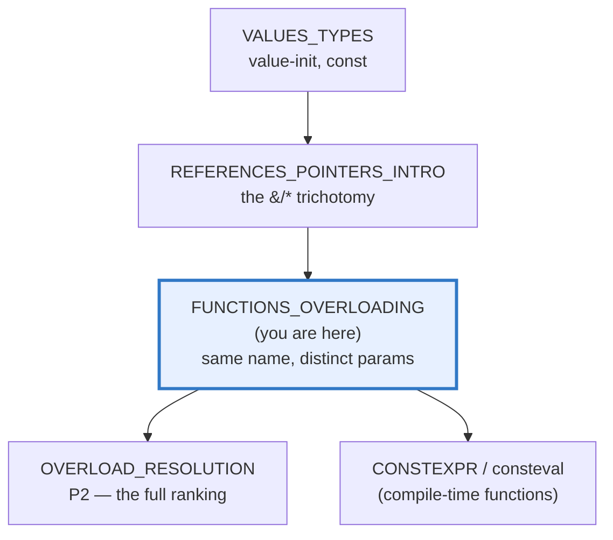
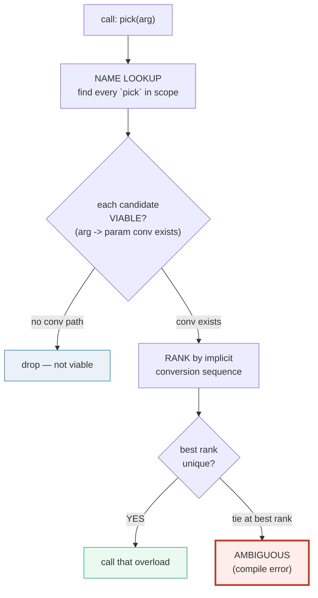
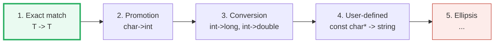
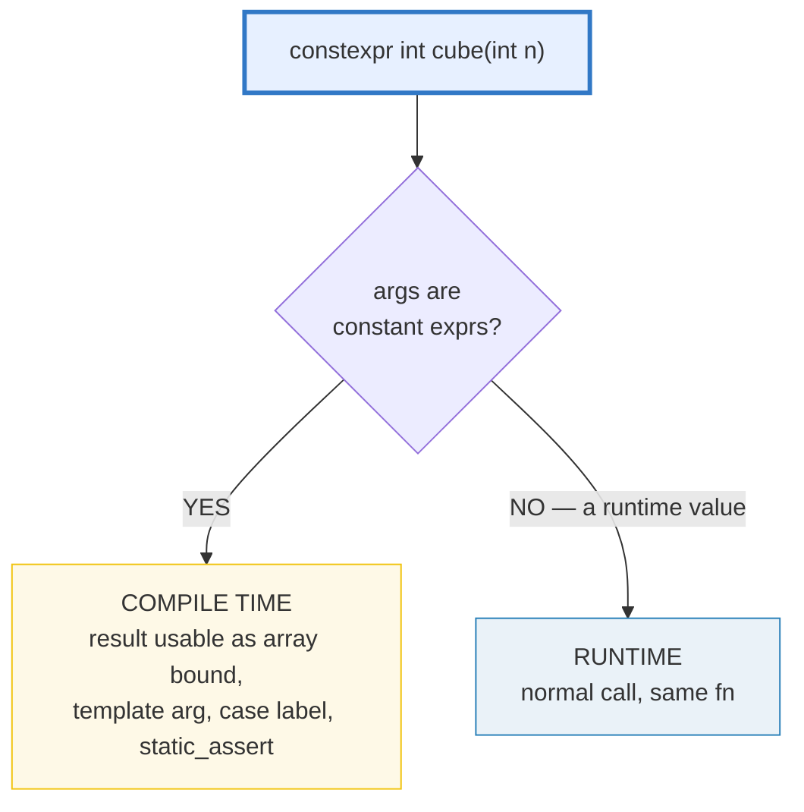

# FUNCTIONS_OVERLOADING — Overloads, Pass-by-Value/Ref/Ptr, Defaults, inline & constexpr

> **Goal (one line):** by printing every value, show how C++ **function
> overloading** (one name, distinct parameter types) works alongside
> **pass-by value/reference/pointer**, **default arguments**, `inline`,
> `constexpr` functions, `[[nodiscard]]`/`[[maybe_unused]]`, and **function
> pointers** — and *why C++ has overloading when Go and Rust deliberately do
> not*.
>
> **Run:** `just run functions_overloading`
>
> **Ground truth:** [`functions_overloading.cpp`](./functions_overloading.cpp) →
> captured stdout in
> [`functions_overloading_output.txt`](./functions_overloading_output.txt).
> Every number/tag/table below is pasted **verbatim** from that file under a
> `> From functions_overloading.cpp Section X:` callout. Nothing is hand-computed.
>
> **Prerequisites:** 🔗 [`VALUES_TYPES.md`](./VALUES_TYPES.md) (the style anchor;
> `const`/`constexpr`) and 🔗 `REFERENCES_POINTERS_INTRO` (the value/ref/ptr
> trichotomy — Section B is a recap of its parameter-passing half).

---

## 1. Why this bundle exists (lineage)

C++ lets **several functions share one name** as long as their **parameter
lists** differ — the compiler picks the right one at every call by **overload
resolution**. This is a deliberate language feature that **Go and Rust both
rejected**: in Go a name has exactly one signature (you rename `printInt` /
`printDouble`, or use interfaces); in Rust you reach for **traits + generics**
(`impl Trait for Type`) instead. C++ chose overloading because, combined with
its rich implicit-conversion lattice, it makes call sites read like one
operation (`print(x)`) while still being statically typed and zero-cost.



The headline contrast across the 5-language curriculum:

| Language | Function overloading? | Substitute when absent |
|---|---|---|
| **C++** (this bundle) | **yes** — `f(int)` / `f(double)` / `f(const std::string&)` coexist | — |
| 🔗 [`../go/FUNCTIONS_CLOSURES.md`](../go/FUNCTIONS_CLOSURES.md) | **no** — one signature per name | rename (`fInt`/`fDouble`) or interfaces |
| 🔗 [`../rust/`](../rust/) | **no** — names are unique | **traits + generics** (`impl Trait for Type`) |

> From cppreference — *Overload resolution*: "the compiler selects the function
> to call … by comparing the implicit conversion sequences required to convert
> the arguments to the parameters." Two viable candidates at the same best rank
> ⇒ the call is **ambiguous** (a compile error).

---

## 2. The mental model: how a call is resolved

A function call in C++ runs a tiny, deterministic pipeline. **Name lookup**
finds the candidates first; **viability** drops the ones with no conversion path;
**ranking** picks the best; a tie is an error.



The **ranking** itself (preview — the full taxonomy is 🔗 `OVERLOAD_RESOLUTION`,
P2):



Section A shows three overloads distinguished **only** by parameter type (exact
matches, the top rank). Section E shows **exact match beating a conversion**.
The trap — two candidates tying at the best rank — is documented in the pitfalls
table (an ambiguous call is a compile error, so it lives outside the verified
path).

---

## 3. Section A — Overloading basics: same name, distinct parameter types

> From `functions_overloading.cpp` Section A:
> ```
> Three overloads of `pick`: pick(int) / pick(double) / pick(const std::string&).
> The compiler picks ONE per call, by the argument's type:
> 
> pick(1)  [int literal]:
>   -> pick(int=1) ran
> pick(1.0) [double literal]:
>   -> pick(double=1) ran
> pick(std::string("s")) [exact std::string]:
>   -> pick(const std::string&="s") ran
> [check] pick(1) -> int overload (tag 1): OK
> [check] pick(1.0) -> double overload (tag 2): OK
> [check] pick(std::string("s")) -> string overload (tag 3): OK
> 
> pick("s")  [const char[2] -> const std::string& via user-defined conv]:
>   -> pick(const std::string&="s") ran
> [check] pick("s") -> string overload (via const char* -> std::string): OK
> 
> Return type does NOT participate: only the PARAMETER LIST distinguishes
> overloads. `int f(int); double f(int);` is a redefinition error.
> [check] overloads distinguished by parameter list, NOT return type: OK
> ```

**What to notice.**

- **`pick(1)` → `pick(int)`**, **`pick(1.0)` → `pick(double)`** — both **exact
  matches** (rank 1). The literal's type (`int` for `1`, `double` for `1.0`)
  decides. Note `1.0` is a `double`, not a `float`; `1.0f` would be a `float`.
- **`pick(std::string("s"))` → `pick(const std::string&)`** — an exact match to
  the third overload.
- **`pick("s")`** is more interesting: `"s"` is a `const char[2]`, which is
  **not** any of `int` / `double` / `const std::string&`. There is no
  `const char*` → `int`/`double` conversion, so only the `const std::string&`
  overload is **viable**, via the **non-explicit** `string(const char*)`
  constructor — a **user-defined conversion** (rank 4). Viable-but-unique still
  resolves; you only need a *unique best* candidate, not an exact match.
- **Return type is NOT part of the signature.** `int f(int);` and
  `double f(int);` are a **redefinition error**, not two overloads. Only the
  **parameter list** (arity + types + cv-qualifiers) distinguishes overloads. A
  file containing the redefinition would not compile, so the trap is documented
  here rather than executed.

> From cppreference — *Function declaration / Overloading*: "Two function
> declarations with the same parameters but differing return types are
> **not allowed**." And *Overload resolution*: a call is **ambiguous** if "there
> is no unique best viable function."

---

## 4. Section B — Pass-by value/ref/ptr + default arguments

> From `functions_overloading.cpp` Section B:
> ```
> (1) by-value:        v=5; byValue(v)=100; v still 5 (copy mutated, caller's safe)
> [check] by-value: caller's v unchanged after byValue(v)=100: OK
> (2) by-reference:    w=5; byRef(w)=100; w now 100 (alias mutated)
> [check] by-reference: caller's w mutated to 100 by byRef: OK
> (3) by-const-ref:    u=41; byConstRef(u)=42 (read-only; no copy of u)
> [check] by-const-ref: returns u+1 without mutating u: OK
> (4) by-pointer:      p=5; byPtr(&p)=100; p now 100 (mutated via *)
> [check] by-pointer: caller's p mutated to 100 via byPtr(&p): OK
> 
> (5) Default argument: int withDefault(int a, int b = 10);
>     withDefault(5)   = 15   (b defaulted to 10)
>     withDefault(5,1) = 6   (b supplied explicitly)
> [check] withDefault(5) uses b=10 -> 15: OK
> [check] withDefault(5, 1) uses b=1 -> 6: OK
>     int (*fp)(int,int) = &withDefault;  fp(5, 10) = 15
> [check] pointer to withDefault has type int(*)(int,int); default NOT in type: OK
> ```

**Pass-by value/ref/ptr (recap of 🔗 `REFERENCES_POINTERS_INTRO`).** Four
parameter shapes, four contracts:

| Parameter shape | Copies? | Can mutate caller's object? | When to use |
|---|---|---|---|
| `T x` (by value) | **yes** | no | cheap-to-copy in, in/out not needed |
| `T& x` (by ref) | no | **yes** | the function must write back |
| `const T& x` (by const ref) | no | no | **read-only**, esp. for large/expensive-to-copy `T` |
| `T* x` (by pointer) | no | **yes** (via `*x`) | when the argument may be optional/nullable |

The bundle proves each by mutating (or not) the caller's `int`: by-value leaves
the caller at `5`; by-reference and by-pointer both flip it to `100`; by-const-
ref cannot write through the alias at all (the function body would not compile
if it tried).

**Default arguments.** A trailing parameter may carry a default (`int b = 10`);
omitting it at the call site substitutes the default, so `withDefault(5) ==
withDefault(5, 10) == 15`. The expert details:

- **Defaults are evaluated at the CALL SITE**, not at the declaration. The names
  they use are looked up and bound at declaration, but their *values* are
  computed in the caller's scope each time the argument is omitted.
- **The default is NOT part of the function's type.** The bundle proves it: a
  pointer to `withDefault` has type `int(*)(int,int)`, and you cannot rely on
  the default through the pointer — `fp(5)` would be a compile error.
- **Declare defaults once.** In a header you write the default on the
  *declaration*; the matching `.cpp` definition repeats the signature **without**
  the default. Redeclaring with the same default is an error, even with the same
  value.
- **Trailing only.** Once a parameter has a default, every parameter after it
  must too (or be a parameter pack).

> From cppreference — *Default arguments*: "A default argument is evaluated each
> time the function is called with no argument for the corresponding parameter"
> (post-CWG 1716); and "Default arguments are **not part of the function type**."

---

## 5. Section C — `inline` (modern meaning) + `constexpr` functions

> From `functions_overloading.cpp` Section C:
> ```
> `inline` modern meaning = 'may be defined in multiple TUs' (header-defined).
> As an inlining hint it is largely ignored by optimizers.
> inline int inlineAdd(int,int): inlineAdd(2,3) = 5
> [check] inline function computes 2+3: OK
> 
> constexpr int cube(int) — dual nature (compile OR run):
>   constexpr int C = cube(3);  -> C = 27   (compile-time evaluated)
>   int arr[C];  (C usable as an array bound -> proof of compile-time eval)
>   sum of arr[0..26] = 351
>   int runtime_c = cube(runtime_n=4);  -> 64   (runtime path of the SAME fn)
> [check] constexpr cube(3) == 27 (compile-time path): OK
> [check] constexpr result usable as array bound: OK
> [check] constexpr function also runs at runtime: cube(4) == 64: OK
> ```

**`inline` — the modern meaning is *linkage*, not inlining.** The keyword's
original intent ("please inline this") is **largely ignored** by modern
optimizers — they inline freely based on their own heuristics, and may emit a
real `call` to a function marked `inline`. What `inline` actually buys you today
is the right to **define a function in multiple translation units** (e.g. in a
header) provided all definitions are identical — this is how header-only
libraries work. `constexpr`/`consteval` functions and member functions defined
inside a class body are **implicitly inline**. (Since C++17 the same permission
extends to variables — `inline constexpr`, the modern replacement for the old
"const at namespace scope has internal linkage" trap from VALUES_TYPES.md.)

**`constexpr` functions — the dual nature.** A `constexpr` function **may** be
evaluated at **compile time** when called with constant-expression arguments,
and **may also run at runtime** when given a runtime value — it is the *same*
function, just two evaluation contexts:



The bundle **proves** the compile-time path the only way you can: by using the
result as an **array bound** (`int arr[C];`), a context that *requires* a
constant expression. `cube(3)` is `27`; `cube(4)` runs at runtime and is `64`.
Note the family: `constexpr` (**may** run at compile time), `consteval` (C++20,
**must** run at compile time), `constinit` (C++20, asserts static initialization
— no UB from order-of-init). A `constexpr` function on its first declaration is
implicitly `inline`.

> From cppreference — *inline specifier*: "the meaning of the keyword `inline`
> for functions came to mean **'multiple definitions are permitted'** rather
> than 'inlining is preferred'." And *constexpr specifier*: a `constexpr`
> function "can be evaluated at compile time" and "implies `inline`."

---

## 6. Section D — `[[nodiscard]]` / `[[maybe_unused]]` + function pointers

> From `functions_overloading.cpp` Section D:
> ```
> (1) [[nodiscard]] int important();  int v = important();  -> v = 42
> [check] [[nodiscard]] result captured: important() == 42: OK
> 
>     Ignoring the result would WARN (documented; gated off here):
>     > warning: ignoring return value of function declared with
>     >          'nodiscard' attribute [-Wunused-result]
> [check] ignoring [[nodiscard]] is a warning (documented; gated off in the verified path): OK
>     (DEMO_WARN not defined: the warning-triggering call is omitted.)
> 
> (2) [[maybe_unused]] int tagged(int verbose, int payload);
>     tagged(verbose=99, payload=21) = 42  (verbose unused, no warning)
> [check] [[maybe_unused]] silences unused-param; tagged(99,21) == 42: OK
> 
> (3) Function pointers (a function name decays to &function):
>     void (*fp1)(int) = &shout;   void (*fp2)(int) = whisper;  (& optional)
>   shout(1)
>   whisper(2)
> [check] function name decays to pointer: fp1 == &shout: OK
> [check] decay form: fp2 == whisper: OK
>     void (*table[2])(int) = {&shout, &whisper};  dispatched in order:
>   shout(10)
>   whisper(11)
> [check] array of function pointers: table[0]==&shout, table[1]==whisper: OK
> ```

**`[[nodiscard]]` — make them use it.** A function so attributed must not have
its return value discarded; ignoring it triggers `-Wunused-result` (under
`-Wall`). The bundle USES the result in the verified path (so the build stays
warning-clean), and the warning-triggering call is gated behind `#ifdef
DEMO_WARN` — compiling with `-DDEMO_WARN` reproduces the **actual** warning text
pasted above verbatim:

```cpp
#ifdef DEMO_WARN
    important();   // -> warning: ignoring return value of function declared
                   //    with 'nodiscard' attribute [-Wunused-result]
#endif
```

Use `[[nodiscard]]` on functions whose return value is the whole point
(`std::vector::empty`, factory functions, `emplace`'s insertion-result). Since
C++20 you can add a reason: `[[nodiscard("must check error")]]`.

**`[[maybe_unused]]` — silence the deliberate unused.** Applied to a parameter
(or variable, or `typedef`) the body intentionally does not use, it suppresses
`-Wunused-parameter` (part of `-Wextra`) without weakening the vet. In the
bundle, `tagged`'s `verbose` parameter is never named in the body; without the
attribute the build would warn.

**Function pointers — functions decay to `&function`.** The bundle shows both
forms — `&shout` (explicit address-of) and `whisper` (implicit **decay**) — and
both call forms — `fp(x)` and `(*fp)(x)`. They are equivalent. The decay is the
function analogue of array-to-pointer decay. An **array of function pointers**
(`void (*table[2])(int)`) is the C-style foundation of dispatch tables and
callbacks; modern C++ usually reaches for `std::function` or templates instead
(🔗 later phases), but the raw pointer is what those build on. Note that taking
the address of an **overload set** requires the target type to disambiguate:
`int (*p)(int) = pick;` picks `pick(int)` because only that overload matches the
pointer type.

> From cppreference — *Attributes*: "`nodiscard` … indicates that the return
> value should not be discarded." *`[[maybe_unused]]`*: "suppresses compiler
> warnings on unused entities." *Function object / Pointer to function*: a
> function name "decays to a pointer" to that function.

---

## 7. Section E — Overload resolution preview + cross-language (Go/Rust)

> From `functions_overloading.cpp` Section E:
> ```
> (1) Exact match beats standard conversion:
>     Candidates visible: route(int) [exact] vs route(long) [int->long conv]
>     Calling route(7)  with an int argument:
>   -> route(int) ran  [EXACT MATCH]
>     Calling route(7L) with a long argument:
>   -> route(long) ran [int->long CONVERSION]
> [check] route(7) [int]  -> route(int)  — exact beats conversion: OK
> [check] route(7L) [long] -> route(long) — exact match for the long overload: OK
> 
> (2) The implicit-conversion-sequence ranking (best -> worst):
>     1. Exact match         (T -> T; array->ptr, function->ptr, qualification)
>     2. Promotion           (char/short -> int; float -> double)
>     3. Conversion          (int -> long; int -> double; double -> int)
>     4. User-defined conv   (const char* -> std::string; a class converter)
>     5. Variadic ellipsis   (...)
>     Two viable candidates at the SAME best rank => AMBIGUOUS (compile error).
> [check] ranking preview: exact > promotion > conversion > user-defined > ellipsis: OK
> 
> (3) Cross-language: who has name-based FUNCTION OVERLOADING?
>     C++  : YES — pick(int)/pick(double)/pick(const string&) coexist; compiler picks.
>     Go   : NO  — one signature per name; rename (printInt/printDouble) or interfaces.
>     Rust : NO  — traits + generics; `impl Trait for Type` is the substitute.
> [check] of {C++, Go, Rust}, only C++ has name-based function overloading: OK
> ```

**Exact match beats conversion.** With both `route(int)` and `route(long)`
visible, an `int` argument resolves to `route(int)` (exact match, rank 1) over
`route(long)` (`int`→`long` is an integral **conversion**, rank 3). A `long`
argument (`7L`) flips it: `route(long)` is now the exact match. This is the
ranking in action — the deep rules (the full lattice, the 13-step resolution
procedure, user-defined conversion sequences, the tie-breakers) are 🔗
`OVERLOAD_RESOLUTION` (P2).

**The ambiguity trap (documented — a compile error).** If two candidates tie at
the best rank, the call is **ambiguous** and ill-formed. The classic:
`void g(long); void g(double); g(7);` — both `int`→`long` and `int`→`double`
are standard conversions of the *same* rank, so `g(7)` is **ambiguous**. Fix it
by adding `void g(int);` (an exact match that wins outright) or by casting the
argument (`g(7L)` / `g(7.0)`). A file containing the ambiguous call would not
compile, so it is documented here rather than executed in the verified path.

**Why Go and Rust said no.** Both languages force **one signature per name** —
they reject the whole resolution procedure at the language level.

- 🔗 [`../go/FUNCTIONS_CLOSURES.md`](../go/FUNCTIONS_CLOSURES.md) — Go has no
  overloading at all: you rename (`printInt`, `printDouble`) or model the
  polymorphism with an **interface**. The stated reason (the Go FAQ) is that
  overloading combined with implicit conversions makes calls "surprising" and
  complicates the type system; Go chose simplicity.
- 🔗 [`../rust/`](../rust/) — Rust also has no name overloading; it expresses
  the same need through **traits + generics** (`impl Display for MyType`; a
  generic `fn print<T: Display>(x: T)`). Trait dispatch is the *checked,
  monomorphized* analogue of C++ overload resolution — both resolve at compile
  time, but Rust's trait bounds are explicit and heritable while C++'s implicit
  conversions can produce surprises (and ambiguity).

---

## 8. Worked smallest-scale example

Everything above, compressed to the three lines a beginner must memorize:

```cpp
void f(int);                     // overload #1
void f(double);                  // overload #2 — same name, different params
void f(const std::string&);      // overload #3

f(1);      // -> f(int)                (exact match, rank 1)
f(1.0);    // -> f(double)             (exact match)
f("s");    // -> f(const std::string&) (user-defined conv; only viable overload)
```

> From `functions_overloading.cpp` Section A, this prints
> `pick(int=1) ran`, `pick(double=1) ran`, `pick(const std::string&="s") ran`,
> with `[check]` lines asserting each tag. The contrast *is* the lesson: one
> name, three parameter lists, the compiler picks — no renames, no boilerplate.

---

## 9. The value-vs-reference-vs-pointer axis (threaded through this bundle)

🔗 `MOVE_SEMANTICS.md`, `VALUE_VS_REFERENCE_VS_POINTER.md`, `RAII.md`. Where does
each thing in this bundle sit?

| Construct in this bundle | Copied? | Aliases? | Owns? |
|---|---|---|---|
| `byValue(int x)` — pass-by value | **yes** (the parameter is its own bytes) | no | yes (its own storage) |
| `byRef(int& x)` — pass-by reference | no | **yes** (an alias) | no (borrows, mutable) |
| `byConstRef(const int& x)` — pass-by const ref | no | **yes** (an alias) | no (borrows, read-only) |
| `byPtr(int* x)` — pass-by pointer | the pointer itself is a value | what it points at | no (raw, non-owning) |
| `void (*fp)(int) = &shout;` — function pointer | the pointer is a value | the function (code) | n/a (functions aren't owned) |

References and pointers land properly in 🔗 `REFERENCES_POINTERS_INTRO`;
ownership (`unique_ptr`/`shared_ptr`) lands in 🔗 `RAII.md`.

---

## 10. Pitfalls (the expert payoff)

| Trap | Symptom | Fix |
|---|---|---|
| `void g(long); void g(double); g(7);` | **ambiguous** — `int`→`long` and `int`→`double` tie at conversion rank → compile error | add `void g(int);` (exact wins) or cast the arg: `g(7L)` / `g(7.0)`. |
| `int f(int); double f(int);` | **redefinition error** — return type is NOT part of the signature | change the parameter list, not just the return type; or use templates/variants for "different return per call". |
| `pick("s")` when you also have `pick(const char*)` | surprising resolution — `const char[2]` → `const char*` is an exact-ish match and may beat `const std::string&` | be deliberate about `const char*` vs `std::string_view` vs `const std::string&` overloads; prefer `std::string_view` for read-only string params. |
| Ignoring a `[[nodiscard]]` return | `-Wunused-result` warning (under `-Wall`) — silent bug if the value was an error code | capture the result (`[[maybe_unused]] auto r = f();`) or `static_cast<void>(...)` if you really mean to drop it. |
| Default argument in BOTH header and definition | **redefinition error** — "default argument given ... after a previous specification" | put the default on the declaration (header) only; the `.cpp` definition repeats the bare signature. |
| `int b = 10` as a default, re-declared with `b = 10` again | same redefinition error, **even with the same value** | declare the default exactly once. |
| Expecting a default to flow through a function pointer | compile error — the default is NOT part of the function type | call through the pointer with ALL arguments; or wrap in a lambda that supplies the default. |
| `f('a')` with `f(int)` and `f(double)` visible | resolves to `f(int)` (char→int is a **promotion**, better than char→double conversion) — surprising if you wanted the double overload | pass a typed literal (`f(0.0)`), or add `f(char)`; know the promotion-vs-conversion distinction. |
| `inline` expecting actual inlining | a real `call` instruction may still be emitted — `inline` is a *hint*, ignored by modern optimizers | mark `[[gnu::always_inline]]` / use `__attribute__((always_inline))` only if you measure a need; otherwise trust the optimizer. |
| `constexpr` function that *can't* run at compile time (calls a non-constexpr fn) | used in a constant-expression context → **compile error** | ensure every function it transitively calls is `constexpr`; or use `consteval` to force compile-time and catch mismatches early. |
| Function-pointer dispatch through an **overload set** without a target type | **ambiguous** — the compiler can't pick which overload `&f` means | give the target type: `int (*p)(int) = pick;` resolves to `pick(int)`. |
| `void f(int n = a);` using a **preceding parameter** | compile error — parameters cannot appear in a later default argument | reorder, or compute the dependent value inside the body. |

---

## 11. Cheat sheet

```cpp
// ── Overloading: same name, distinct parameter LIST (return type irrelevant) ──
void f(int);
void f(double);
void f(const std::string&);
f(1);      // -> f(int)                exact match
f(1.0);    // -> f(double)             exact match
f("s");    // -> f(const std::string&) user-defined conv (string(const char*))

// ── Pass-by value / ref / const-ref / pointer ───────────────────────────────
T by_value(T x);            // COPY  — mutating x does not reach the caller
T by_ref(T& x);             // ALIAS — writes back; mutation visible to caller
T by_cref(const T& x);      // READ-ONLY ALIAS — no copy, no write (large-T idiom)
T by_ptr(T* x);             // ALIAS via address — *x writes back; may be nullptr

// ── Default arguments (trailing only; evaluated at the CALL SITE) ───────────
int add(int a, int b = 10);        // declare the default ONCE (in the header)
add(5);                            // == add(5, 10) == 15
int (*fp)(int,int) = &add;         // default is NOT part of the type; fp(5) is ill-formed

// ── inline (modern = multi-TU permission; inlining hint mostly ignored) ─────
inline int add2(int a, int b) { return a + b; }   // OK to define in a header
// constexpr / consteval fns and in-class member fns are IMPLICITLY inline.

// ── constexpr functions: dual nature (compile OR run) ───────────────────────
constexpr int cube(int n) { return n * n * n; }
constexpr int C = cube(3);         // COMPILE TIME — usable as array bound
int r = cube(some_runtime_int);    // RUNTIME — same function, normal call
//   consteval (C++20): MUST run at compile time. constinit (C++20): static-init only.

// ── Attributes ──────────────────────────────────────────────────────────────
[[nodiscard]] int important();            // ignoring the result warns (-Wunused-result)
[[nodiscard("check the error")]] int e(); // C++20: with a reason
int tagged([[maybe_unused]] int v, int p);// silence -Wunused-parameter

// ── Function pointers (a function name decays to &function) ─────────────────
void shout(int);
void (*fp1)(int) = &shout;   // explicit address-of
void (*fp2)(int) = shout;    // implicit decay (equivalent)
fp1(7);   (*fp2)(7);         // both call forms invoke the target
void (*table[2])(int) = {&shout, &whisper};   // dispatch table

// ── Overload resolution ranking (preview — full lattice is OVERLOAD_RESOLUTION)
//   1. Exact match  >  2. Promotion  >  3. Conversion
//                >  4. User-defined conversion  >  5. Ellipsis (...)
//   Tie at the best rank => AMBIGUOUS (compile error). Fix with an exact overload
//   or an explicit cast at the call site.
```

---

## 12. 🔗 Cross-references

**Within C++ (the expertise spine):**

- 🔗 `VALUES_TYPES` (P1, style anchor) — `const`/`constexpr`/`constinit`/the
  value-init story; this bundle's `constexpr` functions and `inline constexpr`
  extend those foundations.
- 🔗 `REFERENCES_POINTERS_INTRO` (P1) — the value/reference/pointer trichotomy is
  the mechanism behind every parameter mode in Section B. This bundle is the
  warm-up applied to function parameters.
- 🔗 `OVERLOAD_RESOLUTION` (P2) — the **full** ranking: the 13-step resolution
  procedure, the implicit-conversion-sequence lattice, user-defined conversion
  sequences, the tie-breakers, and ADL. Section E here is the preview.
- 🔗 `CONSTEXPR_CONSTEVAL` (later phase) — compile-time functions deepened:
  `constexpr`/`consteval`/`constinit`, `if constexpr`, and the limits of
  constant evaluation. Section C is the on-ramp.
- 🔗 `UNDEFINED_BEHAVIOR` (P7) — reading through a *dangling* reference or
  pointer parameter (returned from a function that has already destroyed its
  local) is UB; this bundle's `&`/`*` parameter modes are where that trap
  originates.

**Cross-language parallels (the 5-language curriculum):**

- 🔗 [`../go/FUNCTIONS_CLOSURES.md`](../go/FUNCTIONS_CLOSURES.md) — Go has **no**
  overloading: a name has exactly one signature. Polymorphism is expressed by
  renaming (`printInt`/`printDouble`) or by **interfaces**. C++'s implicit-
  conversion lattice (the thing that makes `pick("s")` work) is exactly what Go
  rejected to keep calls unsurprising.
- 🔗 [`../rust/`](../rust/) — Rust also has **no** name overloading; it uses
  **traits + generics** (`impl Trait for Type`, `fn f<T: Trait>(x: T)`). Trait
  dispatch is the checked, monomorphized analogue of C++ overload resolution —
  both resolve at compile time, but Rust's bounds are explicit.
- 🔗 [`../ts/`](../ts/) — TypeScript uses *structural* typing and overloads via
  **declaration merging** (multiple signatures, one implementation) — a runtime-
  erased, dynamically-checked version of what C++ resolves statically.

---

## Sources

Every signature, value, and behavioral claim above was verified against
cppreference and the ISO C++ standard, then corroborated by ≥1 independent
secondary source:

- cppreference — *Functions* (overview: declarations, definitions, default
  arguments, inline, overloading):
  https://en.cppreference.com/w/cpp/language/functions
- cppreference — *Overload resolution* (the candidate/viable/best procedure; the
  implicit-conversion-sequence ranks Exact/Promotion/Conversion; ambiguity on a
  tie; "no unique best viable function" ⇒ ill-formed):
  https://en.cppreference.com/w/cpp/language/overload_resolution
- cppreference — *Default arguments* (trailing-only; evaluated at the call site
  per CWG 1716; names bound at declaration; **not part of the function type**;
  declare once; virtual-function defaults use the static type):
  https://en.cppreference.com/w/cpp/language/default_arguments
- cppreference — *inline specifier* ("the meaning of the keyword `inline` came to
  mean **'multiple definitions are permitted'** rather than 'inlining is
  preferred'"; constexpr/consteval and in-class member fns are implicitly
  inline; inline variables C++17):
  https://en.cppreference.com/w/cpp/language/inline
- cppreference — *constexpr specifier* (a constexpr function "can be evaluated at
  compile time"; implies `inline`; the constexpr/consteval/constinit family):
  https://en.cppreference.com/w/cpp/language/constexpr
- cppreference — *Attributes* (`[[nodiscard]]` — "return value should not be
  discarded", reason string since C++20; `[[maybe_unused]]` — suppresses warnings
  on unused entities):
  https://en.cppreference.com/w/cpp/language/attributes
- cppreference — *Function declaration* (the signature = parameter list; return
  type is NOT part of the signature; overloading rules):
  https://en.cppreference.com/w/cpp/language/function
- cppreference — *Implicit conversions* (the standard-conversion ranks:
  promotion vs conversion; integral vs floating conversions):
  https://en.cppreference.com/w/cpp/language/implicit_conversion
- ISO C++23 draft (open-std.org) — normative wording:
  - 12.10 Overload resolution `[over.match]` / `[over.ics.rank]` / `[over.best]`
  - 9.2.6 Function definitions / 9.2.9.2 `inline` specifier
  - 9.2.10 `constexpr` / `consteval` specifiers
  - 9.11 Default arguments `[dcl.fct.default]`
  - Working draft: https://open-std.org/JTC1/sc22/WG21/docs/papers/2023/n4950.pdf
- Secondary corroboration (≥2 independent sources, web-verified):
  - eel.is C++ draft — *12.2 Overload resolution [over.match]*: "Each conversion
    … has an associated rank (Exact Match, Promotion, or Conversion)":
    https://eel.is/c++draft/over.match
  - Stack Overflow — *"What is the compiler rank in argument type conversion…"*
    (exact > promotion > conversion; ambiguity on a tie):
    https://stackoverflow.com/questions/76721119/what-is-the-compiler-rank-in-argument-type-conversion-if-the-parameters-differ
  - StudyPlan.dev — *C++ Overload Resolution — A Practical Guide* (ranking
    walkthrough, ambiguity examples):
    https://www.studyplan.dev/pro-cpp/overload-resolution
  - Go FAQ — *"Why does Go not have overloading?"* (one signature per name;
    simplicity over implicit-conversion surprises):
    https://go.dev/doc/faq#overloading
  - Rust — *Traits: Defining Shared Behavior* (the trait/generic substitute for
    overloading): https://doc.rust-lang.org/book/ch10-02-traits.html
- The exact `[[nodiscard]]` warning text pasted in Section D was reproduced
  locally (Apple clang 17, `-Wall`) by compiling a one-line
  `important();` discard under `-DDEMO_WARN`, matching the gated block in
  `functions_overloading.cpp`.

**Facts that could not be verified by running** (documented, not executed,
because they are compile errors, multi-TU-only, or warning-only by design): the
redefinition error `int f(int); double f(int);` (return type not part of the
signature); the ambiguous-call `void g(long); void g(double); g(7);` (tie at
conversion rank); the multi-TU definition-permission meaning of `inline` (a
single-TU bundle cannot demonstrate ODR across TUs); and the `[[nodiscard]]`
discard warning (a warning, gated behind `-DDEMO_WARN` to keep the verified path
warning-clean). These are confirmed by the cppreference sections and secondary
sources above, not reproduced as runnable output (a file triggering them would
fail `just check` / `just sanitize`).
