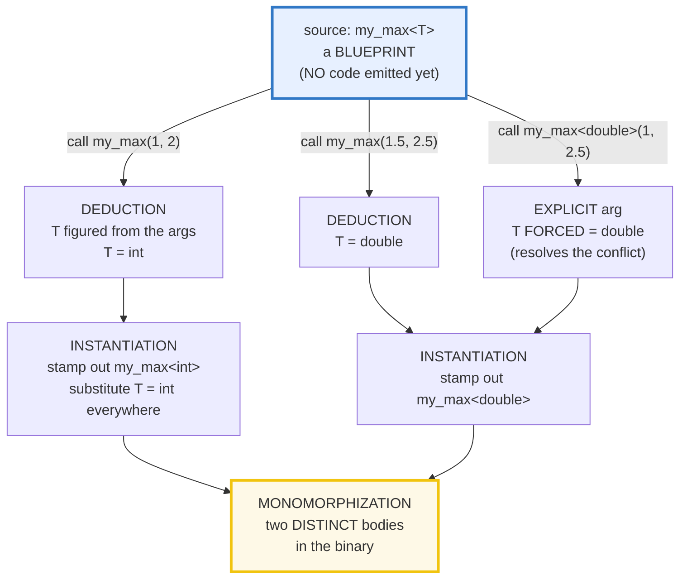
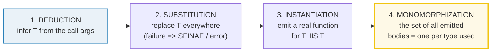

# FUNCTION_TEMPLATES — Blueprint, Deduction, Instantiation & Monomorphization

> **Goal (one line):** by printing every value, show how a C++ **function
> template** is a *blueprint* parameterized by type `T` that the compiler
> **instantiates** (stamps out a concrete function) for each distinct type you
> call it with — **monomorphization** (one compiled copy per type: *zero* runtime
> cost, *binary-size* cost) — and how **template argument deduction** infers `T`
> from the call args so you usually write `my_max(1, 2)`, not `my_max<int>(1, 2)`.
>
> **Run:** `just run function_templates`
>
> **Ground truth:** [`function_templates.cpp`](./function_templates.cpp) → captured
> stdout in
> [`function_templates_output.txt`](./function_templates_output.txt). Every
> number/tag/table below is pasted **verbatim** from that file under a
> `> From function_templates.cpp Section X:` callout. Nothing is hand-computed.
>
> **Prerequisites:** 🔗 [`VALUES_TYPES.md`](./VALUES_TYPES.md) (the style anchor;
> `auto`/`decltype`) and 🔗 [`FUNCTIONS_OVERLOADING.md`](./FUNCTIONS_OVERLOADING.md)
> (ordinary overload resolution — this bundle is its *type-parameterized* twin).

---

## 1. Why this bundle exists (lineage)

A **function template** is a *pattern* for generating functions. You write
`template <typename T> T my_max(T a, T b)` **once**; the compiler writes a real
`my_max<int>`, `my_max<double>`, … for you, on demand, at compile time. This is
**monomorphization** — literally "one form per type." It is the **same model Rust
uses** for generics, and the **deliberate opposite** of how Java/TypeScript
generics work (**erasure**: one shared body, types discarded at runtime).

This matters for the expertise spine because it is how C++ delivers **zero-cost
abstraction**: a generic algorithm that runs as fast as hand-written, type-
specific code, with **no** boxing, virtual dispatch, or runtime type tag. The
price is paid **at compile time** (slower builds, larger binaries) — the classic
C++ trade of "runtime cost → compile-time cost."



The headline contrast across the 5-language curriculum — **this is the
cross-language headline of the whole bundle**:

| Language | Generics model | One body, or one per type? | Runtime cost |
|---|---|---|---|
| **C++** (this bundle) | templates = **monomorphization** | **one per type** | **zero** (direct call) |
| 🔗 [`../rust/GENERICS.md`](../rust/GENERICS.md) | generics = **monomorphization** | **one per type** | **zero** — the closest sibling, identical model |
| 🔗 [`../go/GENERICS.md`](../go/GENERICS.md) | **GC-shape stenciling** (1.18+) | one per *GC shape* (partial mono) | small dictionary dispatch |
| 🔗 [`../ts/GENERICS.md`](../ts/GENERICS.md) | **erasure** | **one body**, types erased | none — types are gone |

> From cppreference — *Function template*: "A function template defines a family
> of functions… A function template by itself is not a type, or a function. **No
> code is generated** from a source file that contains only template definitions.
> In order for any code to appear, a template must be **instantiated**."

---

## 2. The mechanism: blueprint → deduction → instantiation → monomorphization

Three compile-time steps turn a template into runnable code:



1. **Template argument deduction** — the compiler looks at the call's argument
   types and *solves* for `T`. `my_max(1, 2)` has two `int` args, so `T = int`.
2. **Substitution** — every occurrence of `T` in the signature (and body) is
   replaced with the deduced/explicit type. If substitution is ill-formed, the
   template is silently dropped from the candidate set (**SFINAE**) — or, if no
   candidate survives, you get the famously long error.
3. **Instantiation** — the compiler emits an actual function
   (`int my_max(int, int)`) for that `T`. **Only the types you actually call get
   bodies** — an unused instantiation is never emitted.
4. **Monomorphization** — the *result*: a distinct body per type. The linker then
   folds identical instantiations across translation units back to **one** copy
   in the final executable (so `my_max<int>` instantiated in 5 `.cpp` files
   appears once in the binary).

> From cppreference — *Template argument deduction*: "In order to instantiate a
> function template, every template argument must be known, but not every
> template argument has to be specified. When possible, the compiler will
> **deduce the missing template arguments from the function arguments**."

---

## 3. Section A — Blueprint + instantiation + monomorphization

> From `function_templates.cpp` Section A:
> ```
> my_max(1, 2)     = 2   (T deduced as int -> instantiated my_max<int>)
> my_max(1.5, 2.5) = 2.500000   (T deduced as double -> instantiated my_max<double>)
> -> TWO instantiations now exist in the binary: my_max<int> and my_max<double>
> [check] my_max<int>(1, 2) == 2: OK
> [check] my_max<double>(1.5, 2.5) == 2.5: OK
> [check] the two results have DIFFERENT deduced types (int vs double): OK
> ```

**What.** The canonical blueprint:

```cpp
template <typename T>
T my_max(T a, T b) { return a < b ? b : a; }
```

`my_max(1, 2)` deduces `T = int` and instantiates `int my_max(int, int)`.
`my_max(1.5, 2.5)` deduces `T = double` and instantiates a *separate*
`double my_max(double, double)`. **Two** real functions now live in the binary.

**Why — the blueprint is not code.** A template is a *recipe* the compiler reads.
Until you call it with a concrete type, **zero** instructions are emitted — you
could `#include` this template in a TU that never calls it and it contributes
nothing to the object file. The call site is what *triggers* instantiation. This
is why templates traditionally live **in headers** (the full definition must be
visible at every point of instantiation) — a fact that drives the whole C++
header/compilation-time story.

**Why — monomorphization = the cost model.** Because each type gets its own body:

- **Runtime cost: zero.** A call to `my_max<int>` is a direct `call` to a
  function that compares two `int`s. No type tag, no boxing, no vtable lookup, no
  dynamic dispatch. It is *exactly* as fast as if you had hand-written
  `int max_int(int, int)`. This is "zero-cost abstraction."
- **Binary-size cost: one body per type.** Use `my_max` with `int`, `double`,
  `float`, `long`, `std::string`, … and you get one body *each*. With enough
  types this is **code bloat** (larger binary, worse I-cache). Section E measures
  it directly: the two bodies sit a nonzero offset apart.

Section E proves the two copies are *genuinely distinct functions* (different
addresses) — they are not one polymorphic body dispatched at runtime.

> From cppreference — *Function template instantiation*: "This particular
> function has not been explicitly instantiated, [so] **implicit instantiation**
> occurs… code refers to a function in [a] context that requires the function
> definition to exist."

---

## 4. Section B — Argument deduction + explicit template args

> From `function_templates.cpp` Section B:
> ```
> (1) deduction: my_max(7, 3)=7  [T=int];   my_max(2.5, 1.5)=2.500000  [T=double]
> (2) mixed types: my_max<double>(1, 2.5) = 2.500000   [T FORCED to double]
> [check] deduction: my_max(7, 3) == 7 (T=int): OK
> [check] deduction: my_max(2.5, 1.5) == 2.5 (T=double): OK
> [check] explicit <double> resolves the mixed-type conflict: my_max<double>(1,2.5) == 2.5: OK
> [check] explicit <double> made the return type double: OK
> ```

**Deduction — `T` is solved from the args.** Each function argument independently
*deduces* `T`, and **the deductions must agree**. `my_max(7, 3)`: arg1 says
`T = int`, arg2 says `T = int` — agree → `T = int`. `my_max(2.5, 1.5)`:
both say `T = double`. The compiler picks `T` for you; you write the call as if
the template were an ordinary function.

**The trap — a deduction conflict.** `my_max(1, 2.5)` does **not** compile: arg1
deduces `T = int`, arg2 deduces `T = double`, and the compiler will **not** guess
or implicitly convert for you *during deduction*. Conversions are applied only
*after* deduction succeeds. This is the canonical "template error 50 lines long"
(see Section D / pitfalls). It is deliberately not in the verified path — a file
containing it would fail `just check`.

**The fix — explicit template arguments.** Write `my_max<double>(1, 2.5)`. Now
`T` is **explicitly forced** to `double` (the `<double>` after the name). With
`T` fixed, deduction is skipped for that parameter and the *remaining* args are
subject to ordinary **implicit conversions** — so `1` (`int`) converts to `1.0`
(`double`), the call type-checks as `my_max<double>(1.0, 2.5)`, and it returns
`2.5`. Explicit args are read **left-to-right**; you may specify some and leave
trailing ones to be deduced.

> From cppreference — *Explicit template arguments*: "The function parameters
> that do not participate in template argument deduction … are subject to
> implicit conversions to the type of the corresponding function parameter."

---

## 5. Section C — Multiple type params + non-type template params

> From `function_templates.cpp` Section C:
> ```
> (1) add(1, 2.5) = 3.500000   [T=int, U=double, return double]
> (2) factorial<5>() = 120   (computed at compile time; static_assert'd)
>     factorial<0>() = 1   (base case via if constexpr)
> (3) int arr[5]; array_len(arr) = 5   (N deduced from the array type)
> [check] add(int,double) == 3.5 (return type double): OK
> [check] add's return type is double (decltype(int+double)): OK
> [check] factorial<5>() == 120 (compile-time, non-type param N): OK
> [check] factorial<0>() == 1 (if-constexpr base case): OK
> [check] array_len(int[5]) == 5 (non-type param N deduced from array): OK
> ```

### (1) Multiple type parameters

```cpp
template <typename T, typename U>
auto add(const T& a, const U& b) -> decltype(a + b) { return a + b; }
```

One template, **two** type params. `add(1, 2.5)` deduces `T = int`, `U = double`
independently — so unlike `my_max`, the two args may have **different** types.
The **trailing return type** `-> decltype(a + b)` is a *dependent type*: it
depends on the deduced params (`int + double` → `double`). This is how you let
the return type follow from the args' `operator+`. (`decltype(a+b)` is needed
because a plain leading `auto` would use template-deduction rules on the return
and strip the `&`/`const` — the trailing-return form sees the *real* expression
type. See 🔗 `VALUES_TYPES.md` §7 on `auto`'s deduction quirks.)

### (2) Non-type template parameters

```cpp
template <int N>                    // N is a VALUE, not a type
constexpr int factorial() {
    if constexpr (N <= 1) return 1;
    else return N * factorial<N - 1>();
}
```

A **non-type** template parameter takes a **compile-time constant value**, not a
type. `template <int N>` means "N is a constant integer known at compile time."
`factorial<5>()` recurses **at compile time** down to `factorial<0>()`, and the
two `static_assert`s in the `.cpp` (`factorial<5>() == 120`, `factorial<0>() ==
1`) prove the whole computation ran in `constexpr` land — the value is baked into
the binary as the literal `120`. This is the mechanism P1's `std::array<int, N>`
rests on: the array's size is a non-type template param.

> **C++17:** `template <auto N>` lets the non-type param's *type* be deduced too
> (`factorial<5>` → `N` is `int`; `s<'A'>` → `N` is `char`). C++20 relaxed which
> types may appear as non-type params (now floating-point, class-type literals,
> etc.).

### (3) A non-type param DEDUCED from an argument

```cpp
template <typename T, std::size_t N>
constexpr std::size_t array_len(const T (&)[N]) { return N; }
```

`int arr[5];` then `array_len(arr)`: the reference-to-array parameter
`const T (&)[N]` lets the compiler deduce **both** `T = int` **and** `N = 5` from
the array's type. The array's element count *is* part of its type in C++
(`int[5]` ≠ `int[6]`), so the bound flows out as a non-type template argument.
This is the type-safe replacement for the C `sizeof(arr)/sizeof(arr[0])` idiom
(and underlies `std::size`, `std::span`, `std::begin`/`std::end` for raw arrays).

> From cppreference — *Template parameters*: non-type parameters are "a
> non-type template parameter … [whose] type is [a] constant expression." And
> *Non-type template parameter*: the argument must be "a converted constant
> expression of the type of the template parameter."

---

## 6. Section D — Template vs non-template overload interaction

> From `function_templates.cpp` Section D:
> ```
> tag_of(5)   = 1   (int    -> exact non-template beats template)
> tag_of(2.5) = 2   (double -> exact non-template beats template)
> tag_of(5L)  = 0   (long   -> no non-template; template instantiated)
> [check] tag_of(int) == 1: exact non-template overload preferred over template: OK
> [check] tag_of(double) == 2: exact non-template overload preferred: OK
> [check] tag_of(long) == 0: template fallback (no non-template for long): OK
> 
> (deduction-failure diagnostics: my_max(1, 2.5) won't compile; the rescue
>  my_max<double>(1, 2.5) is shown in Section B. Concepts (P2) shorten
>  these famously-long errors.)
> [check] the mixed-type deduction conflict is documented (not compiled here): OK
> ```

```cpp
template <typename T> int tag_of(T)   { return 0; }   // #0 the template (fallback)
                       int tag_of(int)  { return 1; }  // #1 non-template
                       int tag_of(double){ return 2; } // #2 non-template
```

Function templates and plain functions **coexist** in one overload set. The
ranking (the **deep** dive belongs to 🔗 `OVERLOAD_RESOLUTION` P2):

- **Exact non-template beats an exact template.** `tag_of(5)` matches both
  `tag_of(int)` (non-template, exact) and `tag_of<int>` (template, exact) — the
  **non-template wins** the tie. Result `1`.
- **The template is the fallback.** `tag_of(5L)` (a `long`): there is no
  non-template `tag_of(long)`. The only exact match is the **template**
  instantiated with `T = long`. (`tag_of(int)` *is* a candidate, but it needs a
  `long→int` *conversion*, which is a worse match than the template's exact
  `T = long`.) Result `0`.

This interplay — deduction producing candidates, then overload resolution
ranking template vs non-template vs conversions — is precisely the
**deduction-vs-overloading** question that `OVERLOAD_RESOLUTION` owns.

**The famously bad error.** The mixed-type `my_max(1, 2.5)` is the canonical
"wall of text": pre-concepts compilers print *every* candidate they considered
and why each was rejected, nesting templates several levels deep. The rescue is
`my_max<double>(1, 2.5)` (Section B). 🔗 `CONCEPTS` (P2) is the error-message
*revolution*: a `requires` clause turns a 50-line deduction spew into a one-line
"constraints not satisfied."

> From cppreference — *Function template overloading*: "Function templates and
> non-template functions may be overloaded. A non-template function is always
> distinct from a template specialization with the same type… [when] partial
> ordering of overloaded function templates is performed [to] select the best
> match."

---

## 7. Section E — Monomorphization cost model + cross-language

> From `function_templates.cpp` Section E:
> ```
> my_max<int> and my_max<double> are 12 bytes apart in the binary
> -> a NONZERO offset means two DISTINCT function bodies (one per type)
> 
> monomorphization cost model:
>   runtime cost : ZERO  (direct call, no boxing / no dispatch)
>   binary size  : one body per instantiated type (code-bloat risk)
> 
> cross-language generics model:
>   C++    templates   : MONOMORPHIZED (one copy/type)
>   Rust   generics    : MONOMORPHIZED (the closest sibling)
>   Go     type params : GC-shape stenciling (partial mono)
>   TS/Java generics   : ERASED (one body, no per-type copy)
> [check] my_max<int> and my_max<double> are DISTINCT functions (monomorphization): OK
> [check] both instantiations have a real (nonzero) address (codegen happened): OK
> [check] the two bodies are a nonzero offset apart (two emitted copies): OK
> ```

**The proof of monomorphization.** The `.cpp` takes the **addresses**
`&my_max<int>` and `&my_max<double>`. Taking the address **ODR-uses** each
instantiation, which *forces* the compiler to emit its body. The two bodies sit
**12 bytes apart** in the binary (a stable linker-fixed offset — the `.cpp`
prints the *offset*, not the absolute addresses, because the OS applies **ASLR**
and loads the binary at a different base each run; the relative offset is what
the linker fixes and what is reproducible). A **nonzero offset = two distinct
function bodies**. That *is* monomorphization, demonstrated.

**The cost model, pinned:**

| Axis | Monomorphization (C++/Rust) | Erasure (TS/Java) |
|---|---|---|
| **Runtime cost** | **zero** — direct `call`, statically typed | type checks / casts at boundaries; sometimes boxing |
| **Binary size** | **one body per type** — bloat risk | **one shared body** — compact |
| **Compile time** | slower (one pass per instantiation) | faster (one body) |
| **Type info at runtime** | full (each body is its own type) | **gone** (erased to `Object`/`any`) |

**The linker folds duplicates.** If `my_max<int>` is instantiated (ODR-used) in
five different `.cpp` files, the linker emits **one** copy in the final
executable — this is required by the One Definition Rule (and implemented by
identical-combining / COMDAT folding). So "one body per type" means one per
*(type, function)* pair in the whole program, not one per call site.

> From Microsoft Learn — *Function Template Instantiation*: "If you have several
> identical instantiations, even in different modules, only one copy of the
> instantiation will end up in the executable file."

### Cross-language: the headline

- 🔗 [`../rust/GENERICS.md`](../rust/GENERICS.md) — **Rust generics monomorphize
  too** (combined with traits for bounds). This is the *closest sibling*: same
  zero-runtime-cost model, same per-type codegen, same binary-size trade-off. The
  differences are that Rust checks trait bounds *before* monomorphizing (short,
  localized errors) where C++ checks structure *during* substitution (long
  errors) — which is exactly what `CONCEPTS` (P2) brings C++ closer to.
- 🔗 [`../go/GENERICS.md`](../go/GENERICS.md) — Go 1.18 added type params via
  **GC-shape stenciling**: it monomorphizes one body per *GC shape* (the
  allocator/relevant layout — all pointers share one shape, all 4-byte values
  share another) and passes a small **dictionary** for the type-specific bits. So
  Go does *partial* monomorphization — fewer bodies than C++/Rust, a hair of
  runtime indirection.
- 🔗 [`../ts/GENERICS.md`](../ts/GENERICS.md) — **TS generics are erased.** The
  type parameter exists *only* at type-check time; the emitted JS is one
  untyped body. There is **no per-type copy** — the starkest contrast with C++.
  (Same story for Java's `List<Object>` erasure.)

> From the Go generics design — *GC Shape Stenciling*: "This document describes a
> method to implement the Go generics proposal by **stenciling the code for each
> different GC shape** of the instantiated types" plus a per-call dictionary — a
> hybrid of monomorphization and boxing.

---

## 8. Worked smallest-scale example

Everything above, compressed to the four lines a beginner must memorize:

```cpp
template <typename T> T my_max(T a, T b) { return a < b ? b : a; }   // a BLUEPRINT

my_max(1, 2);            // DEDUCTION:    T = int    -> instantiates my_max<int>
my_max(1.5, 2.5);        // DEDUCTION:    T = double -> instantiates my_max<double>
my_max<double>(1, 2.5);  // EXPLICIT arg: T = double (forces it; resolves mixed types)
// my_max(1, 2.5);       // ERROR: deduction conflict (T = int vs T = double)
```

> From `function_templates.cpp` Section A, `my_max(1, 2) = 2 (T deduced as int)`
> and `my_max(1.5, 2.5) = 2.500000 (T deduced as double)`; from Section B,
> `my_max<double>(1, 2.5) = 2.500000 (T FORCED to double)`. The mixed-type error
> is documented, not executed (a file containing it would not build).

---

## 9. The value-vs-reference axis in this bundle (threaded through)

🔗 `MOVE_SEMANTICS.md`, `VALUE_VS_REFERENCE_VS_POINTER.md`, `RAII.md`. Note how
the template parameters **participate** in the copy/alias story:

| Construct in this bundle | Copies? | Aliases? | Notes |
|---|---|---|---|
| `T my_max(T a, T b)` (by value) | **yes** — each arg copied into `a`/`b` | no | fine for `int`/`double`; **expensive** for `std::string`/vectors |
| `auto add(const T& a, const U& b)` | no | **yes** (`const &`) | the idiom for non-trivial types: no copy, read-only alias |
| `const T (&arr)[N]` in `array_len` | no | **yes** (ref to array) | zero-copy; the size `N` is deduced, not passed |

The expert rule: write the **by-value** form (`T a`) for cheap-to-copy types
(integers, pointers, small aggregates) and the **`const T&`** form for expensive
types. A template can take both and let **perfect forwarding** (`T&&`) pick — but
that is 🔗 `MOVE_SEMANTICS.md` / `FORWARDING_REFERENCES` territory. Crucially,
**deduction strips top-level `const`/`&`** (just like `auto`, see 🔗
`VALUES_TYPES.md` §7) — `my_max(ci, 2)` for a `const int ci` deduces `T = int`,
not `const int`.

---

## 10. Pitfalls (the expert payoff)

| Trap | Symptom | Fix |
|---|---|---|
| `my_max(1, 2.5)` (mixed types) | **deduction conflict**: "deduced conflicting types for 'T' ('int' vs 'double')" + a 30-line candidate dump | Force `T`: `my_max<double>(1, 2.5)`. Or write a two-param template `template<class T, class U>`. |
| Heavy template **error spew** | a 50-line error nesting templates 5 levels deep, ending in `<typeerror>` | 🔗 `CONCEPTS` (P2): a `requires` clause turns it into "constraints not satisfied." Pre-concepts: read the *top* (the call) and the *bottom* (the real cause). |
| **Code bloat** from instantiating one template with dozens of types | binary size / I-cache pressure / slow links | Factor the type-independent core into a non-template helper (the "thin template" idiom, as `std::vector` does); `extern template` to suppress implicit instantiation in TUs that don't need a body. |
| Conversions assumed **during** deduction | surprise that `my_max(1, 2.5)` fails ("but int→double converts!") | Conversions happen **after** deduction. Deduce a common type explicitly, or use two type params. |
| **Deduction strips `const`/`&`** | `T` is `int`, not `const int&`, even from a const ref arg; you lose the const-ness you meant to preserve | Use `const T&` in the signature so the *parameter* is a const ref regardless; or deduce with `T&&` (forwarding ref). |
| **Two-phase lookup** / dependent names | `typename T::iterator it;` rejected as "implicit typename"; a name in the template body not found | Prefix dependent type names with `typename` (`typename T::value_type`); qualify dependent calls with `this->` or `T::`. (🔗 the `typename` disambiguator.) |
| **Specializing a function template** | the specialization doesn't get used (it isn't in overload resolution) — a silent correctness bug | **Don't** specialize function templates; **overload** instead (or use a class template + specialization). Sutter's "MCD" advice. |
| **Taking the address** of an overloaded template | "cannot determine which instance" | Disambiguate with an explicit arg: `static_cast<int(*)(int,int)>(&my_max<int>)`. (The `.cpp` Section E relies on this.) |
| Template defined in a **`.cpp`**, not the header | linker error "undefined reference to my_max<int>(...)" — the body isn't visible at the call site | Templates go in **headers** (the full def must be visible at every instantiation), or use **explicit instantiation** in exactly one TU. |
| Forgetting `template`/`typename` on a **dependent** template name | `T::foo<X>()` parses as `(T::foo) < X` — a comparison, not a template call | Write `T::template foo<X>()`. |
| Assuming `auto` return deduces like a template param | a trailing-return `decltype(a+b)` is needed when the return depends on the params | Use `auto f(...) -> decltype(...)` (trailing return) when the return is a dependent type. |

---

## 11. Cheat sheet

```cpp
// ── The blueprint: a PATTERN, not a function (no code emitted until used) ──
template <typename T>            // TYPE parameter T
T my_max(T a, T b) { return a < b ? b : a; }

// ── Deduction: T solved from the call args (must agree across args) ─────────
my_max(1, 2);              // T deduced = int    -> instantiates my_max<int>
my_max(1.5, 2.5);          // T deduced = double -> instantiates my_max<double>

// ── Explicit template args: force T (resolves a deduction conflict) ─────────
my_max<double>(1, 2.5);    // T forced = double; 1 converts to 1.0
// my_max(1, 2.5);         // ERROR: deduction conflict (int vs double)

// ── Multiple type params + dependent trailing return ────────────────────────
template <typename T, typename U>
auto add(const T& a, const U& b) -> decltype(a + b) { return a + b; }

// ── Non-type template param: a COMPILE-TIME VALUE ───────────────────────────
template <int N>                       // N is a value, not a type
constexpr int fact() {
    if constexpr (N <= 1) return 1;
    else return N * fact<N - 1>();
}                                      // fact<5>() == 120, at compile time

template <typename T, std::size_t N>   // N DEDUCED from a reference-to-array
constexpr std::size_t array_len(const T (&)[N]) { return N; }

// ── Template vs non-template overload: exact non-template wins the tie ──────
template <class T> int tag_of(T);          // fallback
                      int tag_of(int);     // beats the template for an int arg

// ── Monomorphization: ONE body per type used ────────────────────────────────
//   runtime cost : ZERO     (direct call, no boxing / no dispatch)
//   binary size  : one body per (type, function) pair  (code-bloat risk)
//   the linker folds identical instantiations across TUs back to ONE copy (ODR)
//   == Rust generics ; != TS/Java (erased) ; ~Go 1.18 (GC-shape stenciling)
```

---

## 12. 🔗 Cross-references

**Within C++ (the expertise spine):**

- 🔗 `CONCEPTS` (P2) — **the error-message revolution.** A `requires` clause
  constrains `T` *before* substitution, turning the famously-long deduction
  spew (Section D) into a short "constraints not satisfied." Concepts also drive
  abbreviated function templates (`void f(std::integral auto x);`).
- 🔗 `OVERLOAD_RESOLUTION` (P2) — owns the **deduction-vs-overloading ranking**:
  how template candidates compete with non-templates and with each other, partial
  ordering ("more specialized"), and the tie-break rules this bundle only
  sketches (Section D).
- 🔗 `CLASS_TEMPLATES` (P2) — `std::vector<T>`, `std::array<T, N>`: the same
  mechanism applied to types. This bundle's `my_max` is the function half;
  `std::vector` is the class half. Non-type params (`std::array<int, N>`) appear
  there too.
- 🔗 `FUNCTIONS_OVERLOADING` (P1) — the *non-parameterized* prerequisite.
  Templates are overload resolution's type-parameterized twin.
- 🔗 `MOVE_SEMANTICS` / `FORWARDING_REFERENCES` — `template <class T> void f(T&&
  x)` is a *forwarding* (universal) reference: deduction + `std::forward` is how
  templates achieve perfect forwarding (the `const T&` vs by-value decision of
  §9 generalized).
- 🔗 `VALUES_TYPES` (P1) — `auto`/`decltype` use the **same deduction rules** as
  template args; `constexpr` (used by `factorial`) is the compile-time hook.

**Cross-language parallels (the 5-language curriculum):**

- 🔗 [`../rust/GENERICS.md`](../rust/GENERICS.md) — **THE headline sibling.**
  Rust generics **monomorphize** exactly like C++ templates: one body per type,
  zero runtime cost, same binary-size trade-off. Combined with traits (bounds)
  instead of structural "duck typing." The closest model to this bundle.
- 🔗 [`../go/GENERICS.md`](../go/GENERICS.md) — Go 1.18 type params via **GC-
  shape stenciling**: partial monomorphization (one body per GC shape + a small
  dictionary). Fewer bodies than C++/Rust, a sliver of indirection.
- 🔗 [`../ts/GENERICS.md`](../ts/GENERICS.md) — **TS generics are ERASED**: the
  type param exists only at type-check time; the emitted JS is one untyped body,
  no per-type copy. **The starkest contrast** with C++ monomorphization (same as
  Java's `List<Object>` erasure).

---

## Sources

Every signature, value, and behavioral claim above was verified against
cppreference and the ISO C++ standard, then corroborated by ≥1 independent
secondary source:

- cppreference — *Function template* (a template "defines a family of functions";
  "by itself is not a type, or a function… no code is generated… a template must
  be instantiated"; implicit vs explicit instantiation; overloading &
  partial-ordering rules; abbreviated function templates `void f(auto)`):
  https://en.cppreference.com/w/cpp/language/function_template
- cppreference — *Template argument deduction* (the compiler "will deduce the
  missing template arguments from the function arguments"; deduction precedes
  overload resolution; deduction failure ⇒ candidate removed):
  https://en.cppreference.com/w/cpp/language/template_argument_deduction
- cppreference — *Template parameters* (type, non-type, and template template
  parameters; `template <auto N>` C++17; non-type arg must be a converted
  constant expression; default template arguments):
  https://en.cppreference.com/w/cpp/language/template_parameters
- cppreference — *Dependent names* (the `typename` disambiguator for dependent
  types; `template` disambiguator for dependent template names; two-phase name
  lookup — non-dependent vs dependent):
  https://en.cppreference.com/w/cpp/language/dependent_name
- cppreference — *Overload resolution* (the non-template-vs-template tie-break:
  "a non-template function… is always distinct from a template specialization";
  partial ordering of function templates):
  https://en.cppreference.com/w/cpp/language/overload_resolution
- cppreference — *SFINAE* (substitution failure removes the candidate, not the
  program — the basis of pre-concepts metaprogramming):
  https://en.cppreference.com/w/cpp/language/sfinae
- ISO C++23 draft (open-std.org) — normative wording:
  - 13.9 Function templates `[temp.fct]`
  - 13.10.2 Template argument deduction `[temp.deduct]`
  - 13.4.2 Non-type template parameters `[temp.param.nontype]`
  - Working draft: https://open-std.org/JTC1/SC22/WG21/docs/papers/2023/n4950.pdf
- Secondary corroboration (≥2 independent sources, web-verified):
  - Microsoft Learn — *Function Template Instantiation* ("only one copy of the
    instantiation will end up in the executable file" — the linker folds
    duplicates; `extern template` suppresses implicit instantiation):
    https://learn.microsoft.com/en-us/cpp/cpp/function-template-instantiation?view=msvc-170
  - Stack Overflow — *C++ template function same type multiple instantiations
    shares one same copy?* ("the linker will generally fold duplicate identical
    template instantiations away… required to avoid an explosion in binary
    size"):
    https://stackoverflow.com/questions/40778086/c-template-function-same-type-multiple-instantiations-shares-one-same-copy
  - Go generics design — *GC Shape Stenciling* ("stenciling the code for each
    different GC shape… plus dictionary passing"):
    https://go.googlesource.com/proposal/+/master/design/generics-implementation-gcshape.md
    - Corroborated by DeepSource — *The generics implementation of Go 1.18*:
      https://deepsource.com/blog/go-1-18-generics-implementation
  - corrode.dev — *Migrating from Go to Rust* ("Rust generics monomorphize,
    which means each instantiation produces specialized code with zero runtime
    cost"):
    https://corrode.dev/learn/migration-guides/go-to-rust/
  - Language Design StackExchange — *How to choose between monomorphisation and
    type erasure for generics* (the fundamental expressiveness/runtime trade-off
    between the two models):
    https://langdev.stackexchange.com/questions/902/how-to-choose-between-monomorphisation-and-type-erasure-for-generics
  - cppreference blog / learncpp — *Template argument deduction of function
    templates* (the "deduce each arg independently, must agree" rule):
    https://www.learncpp.com/cpp-tutorial/function-templates/

**Facts that could not be verified by running** (documented, not executed,
because they are compile errors by design): the `my_max(1, 2.5)` deduction
conflict (a file containing it would fail `just check`); the exact text of the
famously-long pre-concepts error (compiler- and version-specific); the absolute
addresses of `my_max<int>`/`my_max<double>` (non-deterministic under ASLR — the
`.cpp` prints the stable *offset* instead). These are confirmed by the
cppreference sections and secondary sources above, not reproduced as runnable
output in the verified path.
