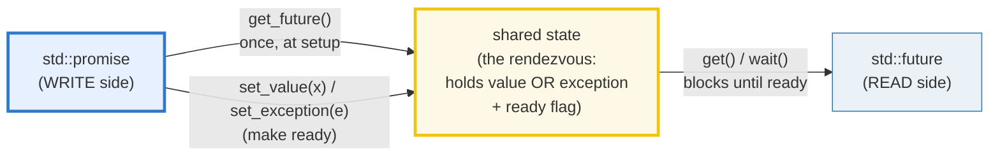
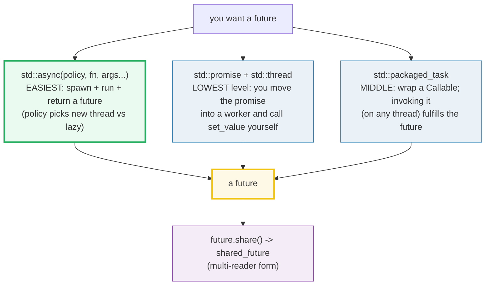
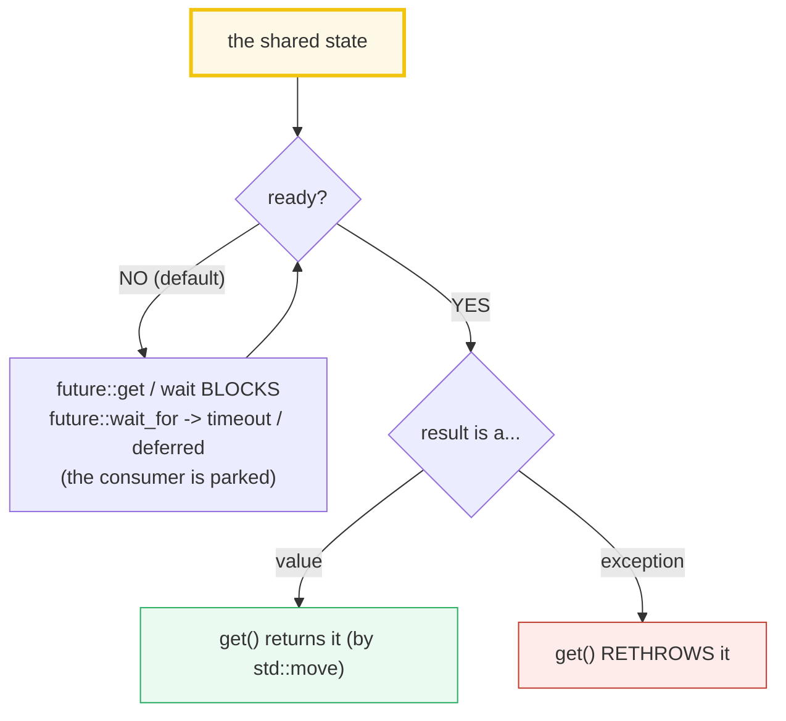

# FUTURES_PROMISES — `std::future` / `std::promise` / `std::async` / `std::packaged_task`

> **Goal (one line):** by printing every **result** (never the completion order), show
> how `std::future<T>` (the **read** side) and `std::promise<T>` (the **write** side)
> form C++'s **one-shot async-result channel**, how `std::async` / `std::packaged_task`
> / `std::shared_future` build on it, and pin the **launch-policy footgun** (the
> default `async|deferred` may run **lazily, not concurrently**), the
> **`get()`-twice-is-UB** trap, and the **destructor-of-a-future-from-`async`-blocks**
> gotcha as documented expert payoffs.
>
> **Run:** `just run futures_promises`
>
> **Ground truth:** [`futures_promises.cpp`](./futures_promises.cpp) → captured stdout in
> [`futures_promises_output.txt`](./futures_promises_output.txt). Every number/table below
> is pasted **verbatim** from that file under a
> `> From futures_promises.cpp Section X:` callout. Nothing is hand-computed.
>
> **Prerequisites:** 🔗 `STD_THREAD` (the 1:1 OS thread; `join()` happens-before edge),
> 🔗 `RAII` / 🔗 `MOVE_SEMANTICS` (a `promise`/`future`/`packaged_task` is **move-only** —
> ownership of the shared state transfers), 🔗 `ERRORS_EXCEPTIONS_INTRO` (exception
> propagation through `get()`). This is a **Phase 4** bundle — the result-returning layer
> above raw `std::thread`.

---

## 1. Why this bundle exists (lineage)

`std::thread` (🔗 `STD_THREAD`) is a **fire-and-forget** primitive: it runs a function on a
new OS thread and gives you **no way to receive its return value**. To get a result back you
had to hand-roll a shared variable + a mutex (or `std::atomic`) + a `join`. C++11 added the
**futures** layer to do that for you: a **one-shot async-result channel** built out of two
ends plus the **shared state** that joins them.



The three ways to **produce** a future, in order of how much machinery they hide:



The headline contrast across the 5-language curriculum — **C++ futures are the closest
sibling to TypeScript Promises** (a one-shot async-result channel), differing mainly in
**how the consumer waits**:

| Language | The result channel | Consumer waits by | Failure mode |
|---|---|---|---|
| **C++** (this bundle) | `promise<T>` → `future<T>` (one-shot) | **blocking `get()`** (synchronizes) | `get()` **rethrows**; race is **UB** |
| 🔗 [`../ts/PROMISES.md`](../ts/PROMISES.md) | `Promise<T>` (one-shot) | **`then`/`await`** callback (never blocks) | `.catch()`; no UB (GC'd, single-threaded) |
| 🔗 [`../go/CHANNELS.md`](../go/CHANNELS.md) | a **channel** (N-shot, general) | `<-ch` receive (blocks, or `select`) | close + comma-ok; no UB |
| 🔗 [`../rust`](../rust/) (Rust) | `tokio::oneshot` channel + `JoinHandle` | `.await` (async) / `recv()` (mpsc) | `Result<T, JoinError>`; data race **rejected at compile time** |

The crucial C++-specific fact, threaded through the whole bundle: **the shared state IS the
synchronization.** The promise's `set_value` "**synchronizes-with**" the future's successful
`get()`/`wait()` (cppreference). So you do **not** need an extra mutex to receive the result
— unlike a hand-rolled `std::thread` + raw shared variable, where the unsynchronized access
would be a **data race** (🔗 `ATOMICS_MEMORY_ORDER`).

> From cppreference — `std::promise`: "the operation that stores a value in the shared
> state **synchronizes-with** … the successful return from any function that is waiting on
> the shared state (such as `std::future::get`)."

---

## 2. The mental model: shared state, and the four operations on it

A future/promise pair is really **one object** — the *shared state* — with two handles. The
state holds: a **result** (a value **or** an exception, not yet), and a **ready flag**.
Exactly one side writes it; one or more sides read it.



The four things a **promise** can do to the shared state, and what the paired future sees:

| Promise action | Shared state becomes | Future sees at `get()` |
|---|---|---|
| `set_value(x)` | **ready**, holds `x` | returns `x` |
| `set_exception(ptr)` | **ready**, holds an exception | **rethrows** it |
| `set_value_at_thread_exit(x)` | ready **at thread exit** (after thread-locals destroyed) | returns `x` |
| *(promise destroyed without setting)* | **abandoned** → ready, holds `future_error{broken_promise}` | **throws** `future_error` |

A `future` does **two** things to the state: `wait()`/`wait_for()`/`wait_until()` **peek**
without consuming (state stays ready, `valid()` stays `true`); `get()` **waits then consumes**
— after `get()`, `valid()` is `false` and **a second `get()` is UB**.

---

## 3. Section A — `std::async` (the easy API) + `future::get()` (blocks, returns, rethrows)

> From `futures_promises.cpp` Section A:
> ```
> (1) std::async(launch::async, fn) -> future; get() returns the value.
>     before get(): f1.valid() = true
> [check] future from async is valid() before get(): OK
>     f1.get() = 55; after get(): f1.valid() = false
> [check] async get() returns the computed value (7*7+6 == 55): OK
> [check] after get(), valid() == false (the result was consumed): OK
>
> (2) future<void>: get() just waits (no value carried).
>     after fv.get(): worker set side = true
> [check] future<void>: get() synchronized the worker's write (side == true): OK
>
> (3) EXCEPTION PROPAGATION: if the async fn THROWS, get() RETHROWS.
>     caught at get(): runtime_error("async boom")
> [check] an exception thrown in the async fn is rethrown by get(): OK
> [check] the rethrown exception carries the original message ("async boom"): OK
> [check] after a get() that rethrew, valid() == false (still consumed): OK
> ```

**What.** `std::async(policy, fn, args...)` runs `fn(args...)` and returns a
`std::future<V>` (`V = std::invoke_result_t<decay_t<F>, decay_t<Args>...>`). The consumer
calls `f.get()`, which **blocks until the result is ready, then returns it** (by
`std::move`). That single call is both the **wait** and the **fetch**.

**Why — `get()` is the synchronization point.** Internally `get()` calls `wait()`, which
parks the calling thread on the shared state's ready flag until the worker makes it ready.
That ready-making edge **synchronizes-with** the return from `get()` — so every write the
worker did *before* `set_value`/returning is visible to the consumer *after* `get()`. No
mutex, no `std::atomic`, no `join` needed to receive the **value**. (This is why the bundle
is race-free: there is no raw shared memory — the value flows *through* the channel.)

**Exception propagation — `get()` rethrows.** If `fn` throws, the exception is **stored in
the shared state** and `get()` **rethrows** it at the consumer. This is the structured way
to ferry a failure out of a worker: you do not lose the exception to the thread boundary.
Section A (3) proves it — `runtime_error("async boom")` thrown in the async fn arrives
intact at `get()`.

**`future<void>`.** When the operation has no return value, `future<void>` is just a
**completion signal**: `get()` waits and returns nothing. Section A (2) uses it to prove the
synchronization — after `fv.get()`, the worker's write to `side` is visible (`side == true`).

**The `get()`-twice trap.** `get()` *consumes* the result: after it, `valid()` is `false`.
The standard makes a second `get()` **undefined behavior**: "If `valid()` is `false` before
the call to this function, the behavior is **undefined**." (Documented in Section A (4);
the offending call is `#ifdef DEMO_UB`-gated and never compiled.)

> From cppreference — `std::future<T>::get`: "`get` … waits (by calling `wait()`) until the
> shared state is ready, then retrieves the value … Right after calling this function,
> `valid()` is `false`. If `valid()` is `false` before the call to this function, the
> behavior is **undefined**." And: "If an exception was stored in the shared state … then
> that exception will be **thrown**."

---

## 4. Section B — `std::promise` (writer) / `std::future` (reader) across threads

> From `futures_promises.cpp` Section B:
> ```
> (1) promise -> worker thread -> set_value -> main's get().
>     worker set 9*9+10; main got f1.get() = 91
> [check] promise->worker->set_value -> paired future.get() delivers 91 across threads: OK
> [check] after get(), the reader future is invalid (one-shot): OK
>
> (2) set_exception: the worker stores an exception; get() rethrows.
>     caught at get(): runtime_error("promise boom")
> [check] promise::set_exception -> paired future.get() rethrows across threads: OK
> [check] the rethrown exception carries the original message ("promise boom"): OK
>
> (3) promise<void> as a one-shot SIGNAL: set_value() with no value.
>     main unblocked at bf.get(); worker reached = true
> [check] promise<void> set_value -> future.get() unblocks (one-shot signal): OK
>
> (4) THE BROKEN-PROMISE trap (documented; the safe path is shown).
>     A promise destroyed WITHOUT set_value/set_exception ABANDONS the
>     shared state: it stores std::future_error{broken_promise}, makes it
>     ready, and the paired future.get() THROWS. (Demonstrated safely below.)
>     caught future_error: The associated promise has been destructed prior to the associated state becoming ready.
> [check] a promise destroyed without set_value -> get() throws future_error{broken_promise}: OK
> ```

**What.** `std::promise<T>` is the **write** end; `p.get_future()` returns the **one** paired
`std::future<T>` (the **read** end). You typically **move the promise into the worker
thread** (it is move-only — 🔗 `MOVE_SEMANTICS`), the worker calls `set_value(x)` (or
`set_exception`), and `main`'s `f.get()` receives it. Section B (1) shows exactly this
handoff delivering `9*9+10 == 91` across the thread boundary.

**Why — `get_future()` is the pairing step; `set_value` is the rendezvous.** `get_future()`
may be called **once** (a second call throws `future_error{future_already_retrieved}`).
`set_value`/`set_exception` **make the shared state ready** and unblock any consumer parked
in `get()`/`wait()`. Because the value travels *through* the channel, the consumer reads it
race-free — the synchronizes-with edge is built into `set_value`.

**`set_exception` — the explicit failure path.** When the worker catches an error, it stores
a live exception pointer via `set_exception(std::current_exception())`; the consumer's
`get()` then **rethrows** it (Section B (2)). This is the lower-level equivalent of an async
fn that throws (Section A (3)) — here *you* control what gets stored.

**`promise<void>` as a one-shot signal/barrier.** With no value to carry, `set_value()` (no
arg) just flips the ready flag — a one-shot **event** (Section B (3)). `bf.get()` blocks
until the worker calls `set_value()`, then unblocks. (This is the promise/future analogue of
🔗 `MUTEX_LOCK_GUARD`'s condition-variable signal, but single-use and self-synchronizing.)

**The broken-promise trap.** A promise destroyed **without** setting a value/exception
**abandons** its shared state: it stores a `std::future_error` with code
`future_errc::broken_promise`, makes the state ready, and the paired `get()` **throws** that
`future_error`. Section B (4) demonstrates the *safe* version: the promise is dropped first
(end of its inner scope), *then* `f3.get()` runs and catches the `broken_promise` error
(verbatim: `"The associated promise has been destructed prior to the associated state
becoming ready."`). **Pitfall:** if you call `get()` *while the promise is still alive and
will never set*, you **deadlock** — `get()` blocks forever. Always destroy the promise (or
`set_value`) first.

> From cppreference — `std::promise`: "Note that the `std::promise` object is meant to be
> used **only once**." And `std::promise::~promise`: "Abandons the shared state: … if the
> shared state is not ready, stores an exception object of type `std::future_error` with
> error condition `std::future_errc::broken_promise`, makes the shared state ready, and then
> releases it."

---

## 5. Section C — the launch-policy footgun + `get()`-twice UB + destructor-blocks

**This is the expert payoff of the bundle.** Three traps, all documented (none executed as
UB):

> From `futures_promises.cpp` Section C:
> ```
> (1) launch::async: DEFINITELY a new thread.
> [check] launch::async get() returns the computed value (111): OK
>     worker thread id != main's id (ran in a NEW thread)
> [check] launch::async ran in a DIFFERENT thread (id != main): OK
>
> (2) launch::deferred: LAZY — runs in the CALLING thread on get()/wait().
> [check] launch::deferred get() returns the computed value (222): OK
>     deferred fn thread id == main's id (ran in the CALLING thread)
> [check] launch::deferred ran in the CALLING thread (id == main) — NOT concurrent: OK
>
> (3) DEFAULT policy (async|deferred): impl-defined which runs.
>     Assert ONLY the value here (the policy is not portable).
> [check] default policy get() returns the computed value (333): OK
>
> (4) THE DESTRUCTOR-BLOCKS GOTCHA (documented; NOT timed here).
>     A future OBTAINED FROM std::async whose shared state is still held at
>     destruction BLOCKS until the op finishes. Futures from promise /
>     packaged_task NEVER block. So this is effectively sequential:
>     //   std::async(std::launch::async, []{ f(); });  // temp dtor WAITS
>     //   std::async(std::launch::async, []{ g(); });  // ...then g starts
>     Fix: hold the future (bind to a name), or std::launch::deferred, or
>     std::jthread / a real thread pool for fan-out.
> [check] the destructor-blocks gotcha is documented (not executed): OK
> ```

**The launch-policy footgun (proven deterministically).** `std::async` takes a `launch`
bitmask. The bundle proves the difference **without any timing** — by comparing the worker's
`thread::id` to `main`'s:

- `std::launch::async` — "as if in a new thread." Section C (1): the worker's `get_id()` is
  **`!=` main's** → it genuinely ran on another thread. **This is the only policy that
  guarantees concurrency.**
- `std::launch::deferred` — **lazy**. Section C (2): the worker's `get_id()` is **`==`
  main's** → the fn did **not** run until `get()` was called, and it ran **in the calling
  thread**. It is **not concurrent at all** — `async(deferred, ...)` is a deferred
  *computation*, not a deferred *thread*.
- **The default** (`async | deferred`, used when you omit the policy) — "**implementation-
  defined** which policy is selected." You **cannot tell** whether your "async" work runs on
  a new thread or lazily in the caller. Section C (3) therefore asserts **only the value**
  (333), not the thread id. **Rule of thumb:** if you need concurrency, **always pass
  `std::launch::async` explicitly.** Relying on the default is the footgun — it may serialize
  your "parallel" work.

> From cppreference — `std::async`: "1) Behaves as if (2) is called with policy being
> `std::launch::async | std::launch::deferred`." And the deferred clause: "The first call to
> a non-timed wait function on the `std::future` … will evaluate `INVOKE(…)` **in the thread
> that called the waiting function**." And policy selection: "For the default … it is
> **implementation-defined** which policy is selected."

**The destructor-blocks gotcha.** A `std::future` **obtained from `std::async`** whose shared
state is still held when the future is destroyed **blocks in its destructor** until the async
op finishes. Futures from **other** sources (`promise`/`packaged_task`) **never** block. The
consequence is surprising: two temporaries
`std::async(std::launch::async, f); std::async(std::launch::async, g);` are **effectively
sequential** — the first temporary's destructor waits for `f()` to finish before `g()` even
starts. (You can't *print* this without timing, so the bundle documents it; the verified path
always calls `get()` first, which releases the shared state so the destructor doesn't block.)
**Fix:** bind the future to a name, collect them in a container (Section E), or use
`std::jthread` / a thread pool for fan-out.

> From cppreference — `std::async` Notes: "If the `std::future` obtained from `std::async`
> is not moved from or bound to a reference, the destructor of the `std::future` will
> **block** at the end of the full expression until the asynchronous operation completes …
> Note that the destructors of `std::future`s obtained by means other than a call to
> `std::async` **never block**."

**`get()`-twice is UB (recap).** After the first `get()`, `valid()` is `false`; a second
call is undefined behavior. Documented in Sections A (4) and C (5); the offending line is
`#ifdef DEMO_UB`-gated.

---

## 6. Section D — `std::packaged_task` + `std::shared_future` + `wait()`/`wait_for()`

> From `futures_promises.cpp` Section D:
> ```
> (1) packaged_task invoked directly.
>     task(6,7) fulfilled the future; get() = 43
> [check] packaged_task: invoking it fulfills the paired future (6*6+7 == 43): OK
>
> (2) packaged_task MOVED into a std::thread (common pattern).
>     task2(8) ran on a worker; get() = 72
> [check] packaged_task moved into a thread: get() delivers 8*8+8 == 72 across threads: OK
>
> (3) shared_future: future::share() -> MANY readers can get().
> [check] after share(), the original future is invalid (state moved to shared_future): OK
>     sf.get() x3 = 42, 42, 42 (all the same value)
> [check] shared_future allows MULTIPLE get() (a regular future does not): OK
> [check] shared_future is still valid() after several gets: OK
>
> (4) wait() blocks WITHOUT consuming; wait_for() returns a status.
> [check] after wait(), valid() is STILL true (wait does not consume): OK
>     wf.wait() then wf.get() = 5
> [check] wait() then get() returns the computed value (5): OK
> ```

**`std::packaged_task` — a Callable that produces a future.** It wraps any Callable; the
paired future (`task.get_future()`) is fulfilled when you **invoke** the task
(`task(args...)`). Section D (1) calls it inline (`task(6,7)` → `get() == 43`); Section D
(2) **moves it into a `std::thread`** (`std::move(task2), 8`) — the common pattern that
bridges "a function" and "a future I can wait on." This is the middle ground between
`std::async` (which manages the thread for you) and raw `promise`+`thread` (where you manage
both).

**`std::shared_future<T>` — the multi-reader future.** A regular `future` is **one-shot**:
`get()` invalidates it, and only **one** `future` can read a shared state. `future::share()`
transfers the shared state to a `shared_future<T>`, which **many** readers can `get()`
(each gets the same stored value). Section D (3) calls `sf.get()` **three times** — all
return `42`, and `sf.valid()` stays `true`. This is the answer to "I want N threads to all
observe one result": `share()` once, hand each thread a copy of the `shared_future`. (Note:
after `share()`, the original `future` is invalid — the state moved.)

**`wait()` / `wait_for()` / `wait_until()` — peek without consuming.** `wait()` blocks until
ready **but does not consume** — `valid()` stays `true` and `get()` still works afterwards
(Section D (4)). `wait_for(duration)` / `wait_until(time_point)` are the **timed** variants:
they return a `std::future_status` of `deferred`, `timeout`, or `ready`. The bundle does
**not** assert a `wait_for` status (it depends on scheduling → nondeterministic); it only
proves that `wait()` leaves the future gettable.

> From cppreference — `std::packaged_task`: "wraps any `Callable` target … so that it can be
> invoked asynchronously. Its return value or exception thrown is stored in a shared state
> which can be accessed through `std::future` objects." `std::shared_future`: "waits for a
> value (possibly referenced by other futures) that is set asynchronously."

---

## 7. Section E — COLLECT + SORT + JOIN: deterministic parallel fan-out

> From `futures_promises.cpp` Section E:
> ```
> Launch 6 tasks with std::async(launch::async); each computes n*n+n.
> COMPLETION ORDER is nondeterministic; the RESULT SET is not. We get()
> each future, pair {n, n*n+n}, SORT, and print -> byte-identical output.
>
>     sorted results (n, n*n+n):
>       n=1  ->  2
>       n=2  ->  6
>       n=3  ->  12
>       n=4  ->  20
>       n=5  ->  30
>       n=6  ->  42
> [check] collected exactly N results after all get()s: OK
> [check] the sorted set is the deterministic {n, n*n+n} for n=1..6 (NOT arrival order): OK
> [check] pinned value: n=2 -> 2*2+2 == 6: OK
> [check] pinned value: n=6 -> 6*6+6 == 42: OK
> ```

**This is the determinism discipline (§4.2 rule 4) applied to futures.** Six
`launch::async` tasks are launched **concurrently** (all futures created first, held in a
`vector`). Each computes `n*n+n`. The **computed values** are deterministic; the
**completion order** is not. The bundle therefore:

1. **launches all** into a `vector<std::future<long long>>` (so they run concurrently, not
   serialized);
2. **`get()`s each** in index order (each `get()` blocks until *that* one is ready —
   independent of completion order);
3. **pairs `{n, result}`, sorts, prints** from `main` after every `get()`.

The sorted result set — `2, 6, 12, 20, 30, 42` — is **byte-identical across runs**, and the
checks assert **the values**, never the order. (Note the destructor-blocks discipline in
action: every future is `get()`'d, which invalidates it, so the `vector`'s destruction does
**not** block.)

---

## 8. Worked smallest-scale example

Everything above, compressed to the three idioms a beginner must memorize:

```cpp
// (1) EASIEST — std::async runs fn and hands you the future; get() blocks + returns.
std::future<int> f = std::async(std::launch::async, [] { return 7 * 7; });
int v = f.get();                       // 49; blocks until ready; f.valid()==false after

// (2) LOWEST level — promise (writer) moved into a worker; future (reader) in main.
std::promise<int> p;  std::future<int> pf = p.get_future();
std::thread t([p = std::move(p)]() mutable { p.set_value(42); });  // writer
int w = pf.get();                      // 42; blocks until set_value -> ready
t.join();

// (3) MIDDLE — packaged_task wraps a fn; invoking it fulfills the future.
std::packaged_task<int(int)> task([](int n) { return n * n; });
std::future<int> tf = task.get_future();
task(8);                               // run it (here inline; or std::move into a thread)
int x = tf.get();                      // 64
```

> From Sections A (1), B (1), D (1) respectively: `f1.get() = 55`, `f1.get() = 91`,
> `get() = 43` — all three channels deliver the computed value across the
> synchronization edge built into `get()`/`set_value`.

---

## 9. Ownership & move semantics (the value/reference/pointer axis, applied)

A `future`/`promise`/`packaged_task` is **move-only** (🔗 `MOVE_SEMANTICS`, 🔗 `RAII`): there
is no copy, because each one is a **unique** handle to a single shared state. The table pins
where each thing sits on the ownership axis:

| Construct | Copyable? | Owns? | Notes |
|---|---|---|---|
| `std::promise<T>` | **move-only** | yes (the write handle) | "meant to be used **only once**"; moved into the worker |
| `std::future<T>` | **move-only** | yes (the **unique** read handle) | `get()` consumes; one-shot |
| `std::shared_future<T>` | **copyable** | shared (refcounted) | `future::share()` produces it; many readers |
| `std::packaged_task` | **move-only** | yes (the callable + its state) | moved into a `std::thread` |
| the **shared state** itself | (internal) | held by the promise + future(s) | destroyed when the **last** handle releases it |

The move-only-ness is *why* you write `std::move(p)` into a worker and `std::move(task)`
into a thread — and *why* `future::share()` returns a *new* `shared_future` rather than
letting you copy the `future`. (🔗 `UNIQUE_PTR` is the same RAII-move shape for single
ownership.)

---

## 10. Pitfalls (the expert payoff)

| Trap | Symptom | Fix |
|---|---|---|
| Omitting the launch policy (`std::async(fn, ...)`) | **default `async\|deferred`** is impl-defined → work may run **lazily in the caller**, not concurrently; surprises scale-out | Pass **`std::launch::async`** explicitly when you need concurrency. |
| `std::launch::deferred` mistaken for "async" | fn **does not run** until `get()`/`wait()`; runs **in the calling thread** → no parallelism, possible deadlock if you never call a wait fn | Use `launch::async`; only use `deferred` for genuine lazy eval, and always trigger it. |
| Calling `f.get()` **twice** | **undefined behavior** (after the 1st, `valid()==false`) | Call `get()` exactly once; guard with `valid()`, or `.share()` into a `shared_future` for multi-read. |
| A future from `std::async` destroyed while still holding its state | its destructor **blocks** until the op finishes → "parallel" `async` calls silently **serialize** | Bind the future to a name / collect in a container, or call `get()` (releases the state) before end-of-scope. |
| `promise` destroyed **without** `set_value`/`set_exception` | **broken promise**: the paired `get()` **throws** `future_error{broken_promise}` (often unexpected) | Always fulfill the promise on every exit path (RAII wrapper, or `set_exception` in a `catch`). |
| Calling `f.get()` while the promise is still alive and will never set | **deadlock** — `get()` blocks forever (the state is never made ready) | Destroy (fulfill/abandon) the promise *before* the consumer's `get()`. |
| `p.get_future()` called **twice** | throws `future_error{future_already_retrieved}` | Call `get_future()` exactly once, at setup, on the producer side. |
| `set_value` called **twice** | throws `future_error{promise_already_satisfied}` | Set the result exactly once. |
| Two threads `get()` the same (regular) `future` | the future is move-only → can't share; racing on it is UB | `future::share()` → `shared_future` (copyable; safe for many readers). |
| Capturing a local by **reference** into a `std::async`/worker lambda whose lifetime ends before `get()` | **dangling** → use-after-free (UB); the classic detached-thread peril | Capture by value, or move ownership in; ensure the referent outlives `get()`. |
| Treating `wait_for`'s return as "definitely timed out" | with the default policy it can return `deferred` (the fn never started) → you spin forever waiting for a thread that won't run | Check for `future_status::deferred`; or force `launch::async`. |
| Assuming `std::async` gives a thread **pool** | it spawns (typically) a **new thread per call** (`launch::async`) — no reuse, ~MB stack each; fan-out of 10 000 starves | For heavy fan-out use a real thread pool / `std::jthread` + a queue (Phase 8), not raw `async`. |

---

## 11. Cheat sheet

```cpp
#include <future>
#include <thread>
#include <exception>   // std::make_exception_ptr, std::current_exception

// ── std::async — EASIEST: run fn, return a future (get() blocks + returns) ─────
//   ALWAYS pass launch::async if you want real concurrency; the DEFAULT
//   (async|deferred) is impl-defined and may run LAZILY in the caller.
std::future<int> f = std::async(std::launch::async, [] { return 7; });
int v = f.get();                 // blocks until ready; returns 7; f.valid()==false after
//   get() TWICE is UB.  If fn threw, get() RETHROWS it.
//   A future FROM async BLOCKS in its dtor if its state is still held.

// ── std::promise (writer) / std::future (reader) — the channel ends ──────────
std::promise<int> p;
std::future<int> pf = p.get_future();          // pair them ONCE (get_future is once-only)
std::thread t([p = std::move(p)]() mutable {   // move the promise into the worker
    p.set_value(42);                           //   ...or p.set_exception(std::current_exception())
});                                            //   ...or (destroyed w/o set) -> broken_promise
int w = pf.get();                              // blocks until set_value -> ready; returns 42
t.join();

// ── std::packaged_task — wrap a Callable; invoking it fulfills the future ────
std::packaged_task<int(int)> task([](int n) { return n * n; });
std::future<int> tf = task.get_future();
std::thread tt(std::move(task), 8);            // run it on a thread (or call task(8) inline)
tt.join();
int x = tf.get();                              // 64

// ── std::shared_future — the MULTI-READER future (copyable; many get()s) ─────
std::shared_future<int> sf = std::async(std::launch::async, [] { return 42; }).share();
int a = sf.get(), b = sf.get();                // BOTH OK; sf.valid() stays true

// ── wait / wait_for / wait_until — peek WITHOUT consuming ────────────────────
f.wait();                                      // blocks; does NOT consume (valid() stays true)
auto s = f.wait_for(std::chrono::milliseconds(10));   // -> future_status::deferred/timeout/ready
//   f.valid() is true after wait*(); false after get().

// ── the sync model ────────────────────────────────────────────────────────────
//   set_value / the async fn's return  SYNCHRONIZES-WITH  get()/wait() return.
//   No extra mutex needed: the value flows THROUGH the channel (no raw shared mem).
```

---

## 12. 🔗 Cross-references

**Within C++ (the expertise spine):**

- 🔗 `STD_THREAD` (P4) — the **fire-and-forget** layer *below* this one. A raw `std::thread`
  cannot return a value; futures/promise are the result-returning layer built on top. Both
  are 1:1 OS threads.
- 🔗 `MUTEX_LOCK_GUARD` (P4) — the alternative synchronization. With futures the value
  travels *through* the channel (self-synchronizing); with a raw shared variable you must
  add a mutex/`condition_variable` yourself. `promise<void>` is a one-shot condition-
  variable signal.
- 🔗 `ATOMICS_MEMORY_ORDER` (P4) — the deep dive on the **synchronizes-with** / happens-
  before edge that `set_value`↔`get()` relies on, and why an unsynchronized access would be
  a data race (UB).
- 🔗 `RAII` / 🔗 `MOVE_SEMANTICS` — a `promise`/`future`/`packaged_task` is **move-only**
  (unique ownership of the shared state); `shared_future` is the refcounted, copyable form.
- 🔗 `ERRORS_EXCEPTIONS_INTRO` — `get()` **rethrows** a stored exception; the structured way
  to ferry a throw across a thread boundary (`set_exception` / an async fn that throws).

**Cross-language parallels (the 5-language curriculum):**

- 🔗 [`../ts/PROMISES.md`](../ts/PROMISES.md) — **the CLOSEST sibling.** A TS `Promise<T>`
  and a C++ `future<T>` are the same idea: a **one-shot async-result channel**. The
  difference is the *consumer style*: C++ blocks at `get()` (synchronizes), TS chains with
  `.then`/`await` (a callback; never blocks). Both propagate rejections/exceptions through
  the channel.
- 🔗 [`../go/CHANNELS.md`](../go/CHANNELS.md) — Go's **channel** is the *general* primitive
  (N-shot, carries values, composes with `select`). C++'s future/promise is the **one-shot,
  single-value** special case; Go folds both into the channel. (🔗 `../go/GOROUTINES.md` for
  the M:N scheduler that runs them.)
- 🔗 [`../rust`](../rust/) — Rust's async result channels (`tokio::oneshot`, `mpsc`) +
  `JoinHandle` play the future/promise role; `std::thread` (1:1, like C++) pairs with
  `oneshot`/`mpsc` for results. Rust **proves** thread-safety at compile time (`Send`/`Sync`);
  C++ trusts you and a misuse is a data race (UB).
- 🔗 [`../ts/ASYNC_AWAIT.md`](../ts/ASYNC_AWAIT.md) / `WORKER_THREADS.md` — the TS async
  runtime and worker story that the C++ futures layer most closely mirrors conceptually.

---

## Sources

Every signature, value, and behavioral claim above was verified against cppreference and the
ISO C++ standard, then corroborated by ≥1 independent secondary source:

- cppreference — `std::async` (launch policies; default `async|deferred` is
  implementation-defined; `deferred` runs in the **calling thread** on the first wait fn;
  the destructor-blocks Notes; exceptions stored in the shared state):
  https://en.cppreference.com/w/cpp/thread/async
- cppreference — `std::future` (the read side; `valid()`; `share()` → `shared_future`;
  `wait`/`wait_for`/`wait_until`; "a `std::future` is a **unique** reference to the result"):
  https://en.cppreference.com/w/cpp/thread/future
- cppreference — `std::future<T>::get` ("waits (by calling `wait()`) until the shared state
  is ready, then retrieves the value … Right after calling this function, `valid()` is
  `false`. If `valid()` is `false` before the call … the behavior is **undefined**"; stored
  exception is **thrown**; returns `std::move(v)`):
  https://en.cppreference.com/w/cpp/thread/future/get
- cppreference — `std::promise` (the write side; "meant to be used **only once**"; the
  make-ready / release / **abandon** model; `set_value` **synchronizes-with** the wait/get
  return; `get_future` once-only):
  https://en.cppreference.com/w/cpp/thread/promise
  - `std::promise::~promise` (abandon → stores `future_error{broken_promise}`, makes ready):
    https://en.cppreference.com/w/cpp/thread/promise/~promise
  - `std::promise::set_value` / `set_exception`:
    https://en.cppreference.com/w/cpp/thread/promise/set_value
- cppreference — `std::packaged_task` ("wraps any `Callable` target … so that it can be
  invoked asynchronously; its return value or exception … is stored in a shared state";
  `get_future` / `operator()` / move into a `std::thread`):
  https://en.cppreference.com/w/cpp/thread/packaged_task
- cppreference — `std::shared_future` ("waits for a value (possibly referenced by other
  futures)"; `get()` callable by multiple readers; copyable):
  https://en.cppreference.com/w/cpp/thread/shared_future
- cppreference — `std::launch` (`async` / `deferred` bitmask) and `std::future_status`
  (`deferred` / `timeout` / `ready`):
  https://en.cppreference.com/w/cpp/thread/launch
  https://en.cppreference.com/w/cpp/thread/future_status
- cppreference — `<future>` header overview (the async-return-object / shared-state model):
  https://en.cppreference.com/w/cpp/header/future
- ISO C++23 draft (open-std.org) — normative wording:
  - 33.10 Futures `[futures]`, 33.10.1 Overview, 33.10.5 `promise`, 33.10.6 `future`,
    33.10.7 `shared_future`, 33.10.8 `async`, 33.10.10 `packaged_task`.
  - Working draft: https://open-std.org/JTC1/SC22/WG21/docs/papers/2023/n4950.pdf
    (and the latest N49xx series at https://open-std.org/JTC1/SC22/WG21/ ).

**Secondary corroboration (≥2 independent sources, web-verified):**

- For the **destructor-blocks** gotcha — cppreference `std::async` Notes (above) is the
  primary; corroborated by Scott Meyers, *Effective Modern C++*, Item 36 ("Specify
  `std::launch::async` if asynchronous execution is necessary") and Item 35 (task-based
  concurrency), which document both the default-policy footgun and the blocking-destructor
  behavior: https://www.oreilly.com/library/view/effective-modern-c/9781491908419/
- For the **default-policy / deferred footgun** — cppreference `std::async` (above); Bartosz
  Milewski, *"Broken Promises — C++0x Futures"* (the laziness/synchronization subtleties):
  https://bartoszmilewski.com/2009/03/03/broken-promises-c0x-futures/
- For **`get()`-twice is UB** — cppreference `std::future::get` (above); Stack Overflow,
  *"Is it legal to call `shared_future::get()` multiple times …"* (contrasts the one-shot
  `future::get` UB with the multi-reader `shared_future::get`):
  https://stackoverflow.com/questions/56756112/is-it-legal-to-call-shared-futureget-multiple-times-on-the-same-instance-in
- For the **broken-promise** behavior — cppreference `std::promise`/`~promise` (above);
  cplusplus.com, `std::promise::set_value` error codes (`promise_already_satisfied`,
  `no_state`):
  https://cplusplus.com/reference/future/promise/set_value/

**Facts that could not be verified by running** (documented, not executed, because they are
UB, compile/behavior-only, or timing-dependent by design): the `get()`-twice UB (would be UB
— gated behind `#ifdef DEMO_UB`); the destructor-blocks timing (cannot be *printed* without
timing, which is nondeterministic — so documented, not asserted); and exactly *which* policy
the default `async|deferred` selects on a given implementation (implementation-defined — the
bundle asserts only the **value**, never the thread id, for the default). These are confirmed
by the cppreference sections and secondary sources above, not reproduced as runnable output
in the verified path (the offending lines would fail `just check` / `just sanitize`).
