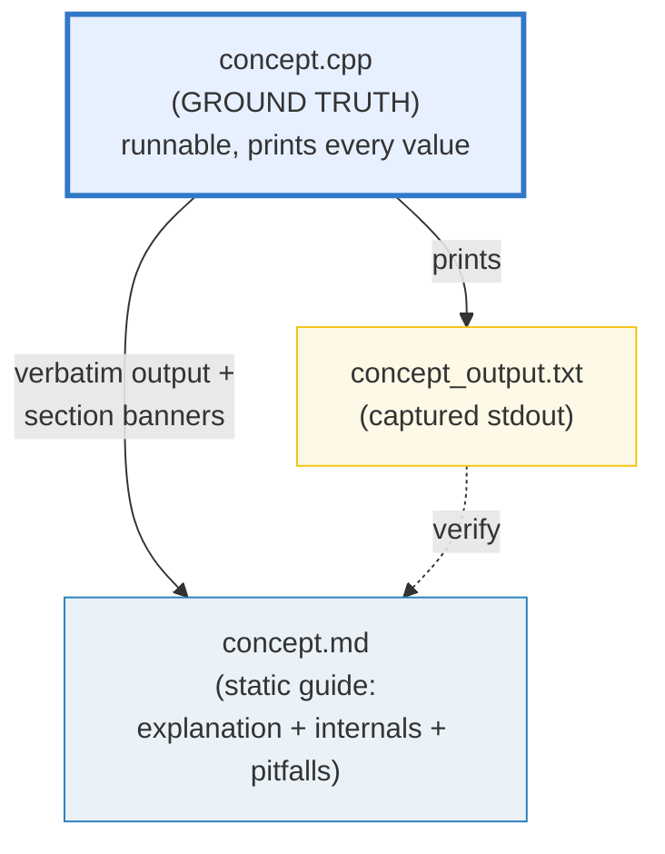
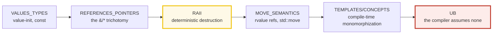

# HOW_TO_RESEARCH — The "Concept-as-a-Bundle" Workflow (C++)

> A note from past-me to future-me: **how this `cpp/` folder is organized, why
> it is laid out this way, and how to extend it.** Each concept is a small,
> runnable `.cpp` program whose output is pasted verbatim into a `.md` guide.
> Nothing is hand-waved; every claim is reproducible by compiling + running.
>
> **The north-star goal:** a reader who walks every bundle start-to-finish
> becomes a **C++ expert** — fluent in the value/reference/pointer trichotomy
> and move semantics, RAII and the smart pointers, templates/concepts and
> compile-time computation, the concurrency memory model, **undefined behavior**
> (the central C++ expert topic), and the modern (C++23) standard library.
>
> **The golden rule of building:** you (the orchestrator) **never write or edit
> a bundle file by hand.** Every bundle is produced by a **subagent** (one worker
> per bundle). Your job is to write tight worker briefs, launch them in parallel
> (max 4 at a time), and run the verification sweep. This is the
> [`../go/`](../go/) / [`../rust/`](../rust/) / [`../ts/`](../ts/) delegation
> discipline, applied to **modern C++ (C++23)**.
>
> Sister folders:
> - [`../go/`](../go/) · [`../rust/`](../rust/) · [`../ts/`](../ts/) ·
>   [`../python/`](../python/) — the cross-language siblings. C++ is closest to
>   **Rust** (manual memory, no GC, templates = monomorphization, RAII ≈ Drop).

---

## 0. The one rule (of a bundle)

> **Every concept is a `.cpp` + `_output.txt` + `.md` triple that cite each
> other, all deriving from ONE runnable `.cpp`. Nothing is hand-computed.**

If a claim, value, or output appears in a `.md`, it was printed by the `.cpp`
(or recomputed with identical logic). This is the discipline that keeps the
guides trustworthy as they scale to 50+ topics.



There is **no `.html`** in this folder's bundles. The runnable `.cpp` *is* the
interactive artifact — a reader opens it, compiles it, edits it, and watches the
output change. This keeps the surface area small and the focus on code.

---

## 1. The directory layout

```
cpp/
├── HOW_TO_RESEARCH.md          ← you are here (per-bundle workflow)
├── SUBAGENTS_GUIDE.md          ← delegation at scale (the worker prompt + batch sweep)
├── TODO.md                     ← the phase-by-phase build checklist (all ~51 bundles)
├── Justfile                    ← the canonical compile/run/verify interface
├── .gitignore                  ← ignores binaries/CMake-build/coverage (NOT _output.txt)
│
├── values_types.cpp            ← ground-truth impl   ─┐
├── values_types_output.txt     ← captured stdout       │ one concept bundle (FLAT, like go/)
├── VALUES_TYPES.md             ← static guide          ─┘
│
├── ... (51 bundles, all flat in cpp/)
├── boost.asio/  crow/  redis-plus-plus/   ← .md-only companion walkthroughs (Phase 8 ecosystem)
└── scripts/skeleton.cpp        ← the bundle scaffold (banner/check helpers)
```

A **concept bundle** = `{name}.cpp` + `{name}_output.txt` + `{NAME}.md`, all
three **flat in `cpp/`** (like `../go/` and `../python/`; unlike `../rust/`'s
workspace-members and `../ts/`'s pnpm members). Phases 1–7 are **pure stdlib**,
so no dep-tier subdirectories are needed — each `.cpp` is self-contained.

**Naming convention** (matches `../go/`, `../rust/`, `../ts/`, `../python/`):
- `.cpp` / `_output.txt` → `lower_snake_case` (e.g. `move_semantics.cpp`).
- `.md` → `UPPER_SNAKE_CASE` (e.g. `MOVE_SEMANTICS.md`).
- One stem per concept; the three files share it so cross-links are obvious.

### Why every bundle compiles to `/tmp` (not in source)

`just run NAME` is `c++ -std=c++23 -O2 -Wall -Wextra NAME.cpp -o /tmp/cpp_NAME &&
/tmp/cpp_NAME`. The binary lands in **`/tmp`** (like `go run` compiling to a
temp dir) — nothing is left in `cpp/`. This avoids the multi-`main` collision
entirely: we **never** compile `*.cpp` together (each is a standalone
single-`main` program compiled individually), so no build-tag (`//go:build
ignore`) is needed (unlike `../go/`). The `.gitignore` still guards against
accidental in-source builds.

### Why C++23 (not 20)

It's 2026 — C++23 (published Dec 2024) is the current standard and is
well-supported by clang 17 / gcc 14. The curriculum compiles `-std=c++23` and
uses first-class C++23: `std::expected` (the Rust-`Result` analog), `std::print`,
`std::mdspan`, `std::optional` monadic ops, C++23 `ranges`. C++26 features
(reflection, contracts) are mentioned as "upcoming" where relevant.

---

## 2. The three roles of each file

| File | Role | Hard rules |
|---|---|---|
| **`name.cpp`** | Ground truth. Clean, runnable, **self-contained** single-`main` TU that prints every value the `.md` needs, behind a section banner. | Single source of truth. Run via `just run name`. Each teachable point gets its own `sectionX()` printing a banner + a readable block. Tiny but complete examples. Deterministic inputs only. Add `[check] ... OK` asserts for invariants (see §4). **Must be UB-free** and warning-clean (`-Wall -Wextra -Wpedantic`). |
| **`{NAME}.md`** | Static, rigorous guide. Mermaid diagrams + **verbatim** output pasted from the `.cpp`. | Every output block sits under a `> From name.cpp Section X:` callout — no orphan numbers. Explains **what**, **why** (internals), and the **expert-level gotchas**. Cross-refs to siblings marked 🔗. Ends with a pitfalls table + cheat sheet + `## Sources`. |
| **`name_output.txt`** | Captured stdout. Committed so the `.md` can be re-derived/audited without running. | `just out name`. Diff it against the `.md` callouts to audit any value. |

---

## 3. The "expert depth" requirement

A junior tutorial stops at "here's how you declare a pointer." This folder's bar
is higher. **Every `.md` a worker produces must answer three layers:**

1. **What** — the syntax / API and a runnable worked example (the `.cpp`).
2. **Why** — the mechanism beneath it. For C++ this usually means: the
   **value/reference/pointer trichotomy** (what's copied, what aliases, what
   owns), **RAII** (deterministic scope-bound destruction — ⟷ Rust's `Drop`),
   **move semantics** (`&&`/`std::move` — C++'s opt-in ownership transfer, a
   half-step toward Rust), **templates = compile-time monomorphization** (⟷ Rust
   generics, ≠ Java erasure), the **concurrency memory model** (acquire/release/
   seq_cst — ⟷ Rust atomics, Go `sync/atomic`), or — uniquely — **undefined
   behavior** (the compiler assumes no UB, so UB can do *anything*; this is THE
   thing that separates C++ users from C++ experts).
3. **Gotchas that separate juniors from experts** — the silent-bug traps: dangling
   references/pointers, use-after-move, iterator invalidation, ODR violations,
   the most-vexing-parse, uninitialized reads, signed-overflow UB, data races,
   slicing, the static-init order fiasco, forgetting the virtual destructor, etc.

The **pitfalls table** at the end of each `.md` is non-negotiable — it is the
"expert payoff." If a worker ships a `.md` with no pitfalls table, re-spawn it.

---

## 4. The `.cpp` authoring conventions (the house style)

Every bundle's `.cpp` follows the same skeleton so output is uniform and
verifiable. Workers MUST replicate it exactly. Study `scripts/skeleton.cpp`
and `values_types.cpp` (the Phase 1 style anchor) and copy their structure.

### 4.1 The required file skeleton

```cpp
// values_types.cpp — Phase 1 bundle #1 (STYLE ANCHOR).
//
// GOAL (one line): show, by printing every value, how C++'s fundamental types,
// value initialization, and const behave.
//
// This is the GROUND TRUTH for VALUES_TYPES.md. Every number, table, and worked
// example in the guide is printed by this file. Change it -> re-compile ->
// re-paste. Never hand-compute.
//
// Run:
//     just run values_types   (== c++ -std=c++23 -O2 -Wall -Wextra values_types.cpp -o /tmp/x && /tmp/x)

#include <cstdio>
#include <cstdlib>
#include <cstring>

namespace {

constexpr int BANNER_WIDTH = 70;

void sectionBanner(const char* title) {
    char bar[BANNER_WIDTH + 1];
    std::memset(bar, '=', BANNER_WIDTH);
    bar[BANNER_WIDTH] = '\0';
    std::printf("\n%s\nSECTION %s\n%s\n", bar, title, bar);
}

// check asserts an invariant and prints a uniform [check] ... OK line.
// On failure: prints to stderr, exits non-zero (so just check / just sweep catch it).
void check(const char* description, bool ok) {
    if (!ok) {
        std::fprintf(stderr, "INVARIANT VIOLATED: %s\n", description);
        std::exit(EXIT_FAILURE);
    }
    std::printf("[check] %s: OK\n", description);
}

// ... sectionA, sectionB, ... each prints a banner + a readable block + checks ...

}  // namespace

int main() {
    std::printf("values_types.cpp — Phase 1 bundle #1 (style anchor).\n");
    std::printf("Every value below is computed by this file.\n");
    sectionA();
    sectionB();
    sectionBanner("DONE — all sections printed");
}
```

### 4.2 The C++-specific HARD RULES (these make output reproducible)

C++ differs from Go/Rust/TS in ways that bite determinism AND correctness. Every
worker MUST honor:

1. **No unseeded `std::rand()` for a printed value.** Use `std::mt19937` with a
   **fixed seed** (`std::mt19937 rng(42);`). Bare `rand()`/`srand(time(...))` is
   non-reproducible.

2. **No `std::chrono::system_clock::now()` for a printed value.** Wall-clock is
   non-reproducible. If a bundle must demonstrate time, construct fixed durations
   and never assert the current instant. `steady_clock` may appear only as a
   relative measurement you don't print as a verified number.

3. **`std::unordered_map`/`unordered_set` iteration order is UNSPECIFIED.**
   Never range-print an unordered container directly — **collect keys into a
   `std::vector`, `std::sort` it, then print**. (`std::map`/`std::set` ARE
   ordered — those are fine.)

   ```cpp
   std::unordered_map<std::string,int> m = {{"b",1},{"a",2}};
   std::vector<std::string> keys;
   for (const auto& [k,v] : m) keys.push_back(k);
   std::sort(keys.begin(), keys.end());
   for (const auto& k : keys) std::printf("  %s: %d\n", k.c_str(), m[k]);
   ```

4. **Thread / async output ORDER is nondeterministic.** For any concurrency
   bundle, never print directly from a worker thread. Collect results into a
   container (guarded by a mutex, or posted to a queue), **sort**, then print
   from `main` after all threads join. Stable stdout is the goal.

5. **Bundles MUST be UB-free** for reproducible output. UB makes output
   *meaningless* (the compiler may assume it doesn't happen). Every bundle must
   `just sanitize NAME` clean under ASan+UBSan. **UB is TAUGHT** (Phase 7) via
   sanitizer demonstrations + documented examples — never shipped in a runnable
   bundle's verified path. (A deliberate-UB demo must `#ifdef DEMO_UB`-gate the
   offending line so the default build stays clean.)

6. **Floating point: prefer integers for printed values.** If a float is
   unavoidable, print to **fixed precision** (`%.6f` / `std::setprecision`) so it
   doesn't drift across compilers/flags. **Never use `-ffast-math`** (breaks
   IEEE-754 determinism).

7. **`-Wall -Wextra -Wpedantic` is canon (the "vet").** The file MUST compile
   with **zero warnings**. A warning is an automatic verification FAIL — fix the
   cause, don't suppress (`-Wno` is forbidden without an orchestrator-approved
   reason). This enforces expert-level discipline.

8. **No raw `assert()` that must stay in release.** Use the `check(desc, ok)`
   helper above. It prints `[check] desc: OK` and **exits non-zero** on failure
   → the sweep flags it. (`assert()` is a debug-only macro, compiled out by
   `-DNDEBUG`/`-O2`-implied NDEBUG in some setups — unreliable for the gate.)

9. **Value-vs-reference-vs-pointer is a teaching axis.** When a section touches a
   value, the `.md` must address: is it passed/returned by value (copied), by
   reference (`&`, aliased), or by pointer (`*`, aliased + nullable)? Does it
   own (RAII/smart pointer) or borrow? This is the through-line of C++ expertise
   (🔗 `MOVE_SEMANTICS.md`, `VALUE_VS_REFERENCE_VS_POINTER.md`, `RAII.md`).

10. **Self-contained single TU, stdlib-first.** Each `.cpp` is one translation
    unit with no sibling-file includes. Phases 1–7 are **pure stdlib** (no
    external deps). If a worker "needs" a third-party lib, it implements from
    scratch — or waits for a later phase. `#include` only standard headers.

---

## 5. The `.md` authoring conventions

Each `{NAME}.md` is a static, rigorous guide. Structure (copy the style anchor
`VALUES_TYPES.md`):

1. **Header block** — one-line goal; "Run: `just run name`"; prerequisites.
2. **Lineage / "why this exists"** — for ecosystem bundles, the old→new story
   (e.g. why `std::expected` exists over raw exceptions / error codes; why
   `unique_ptr` over `new`/`delete`).
3. **Mermaid diagram(s)** — at least one per guide (ownership graph, memory
   layout, the value/ref/ptr split, scheduler state, the type-trait decision
   tree, whatever makes the mechanism visible).
4. **`> From name.cpp Section X:` callouts** — every printed value/table sits
   under such a callout, pasted **verbatim** from `_output.txt`.
5. **The "why" (internals) section** — the depth layer: RAII, move semantics,
   template instantiation, the memory model, UB, ABI.
6. **🔗 cross-references** — to sibling bundles + **cross-language parallels**.
   C++ is part of a 5-language curriculum; call out: "🔗 `../rust/OWNERSHIP.md`
   — Rust enforces ownership at compile time; C++ trusts the programmer and
   catches misuse at runtime (sanitizers) or not at all (UB)."
7. **Pitfalls table** — non-negotiable; columns: trap | symptom | fix.
8. **Cheat sheet** — a one-block quick reference.
9. **`## Sources`** — URLs (cppreference.com, open-std.org C++23 drafts, ISO C++
   papers, isocpp.org, the compiler docs). Every signature/version cited must be
   web-verified (see `SUBAGENTS_GUIDE.md` §2 Step 2).

---

## 6. Tooling & environment

**The `Justfile` is the canonical interface.** Run, capture, verify, and
scaffold through `just` — every recipe routes through `c++ -std=c++23 ... -o
/tmp/cpp_*`, so **no binary ever lands in `cpp/`**. Run `just --list`:

| Recipe | Does |
|---|---|
| `just run NAME` | compile (to /tmp) + run a bundle |
| `just out NAME` | (re)capture `NAME_output.txt` |
| `just check NAME` | verify ONE: compile (-Wall -Wextra -Wpedantic clean) + run + `[check]` count + output presence |
| `just sanitize NAME` | re-run under **ASan + UBSan** (the C++ safety net — bundles must be clean) |
| `just sweep` | verify ALL bundles |
| `just new NAME` | scaffold from `scripts/skeleton.cpp` |
| `just list` | list every bundle stem |

Under the hood:

- **`c++ -std=c++23 -O2 -Wall -Wextra -Wpedantic NAME.cpp -o /tmp/cpp_NAME`** —
  the build. `c++` is Apple clang 17 here (Linux boxes alias `c++` to `g++`;
  both honor these flags). C++23 stdlib supported.
- **`-fsanitize=address,undefined`** (via `just sanitize`) — AddressSanitizer
  (use-after-free, leaks, OOB) + UndefinedBehaviorSanitizer (signed overflow,
  null deref, alignment). The C++ answer to "how do I know this is safe?".
  Used from Phase 7 on; every bundle must pass it.
- **CMake** (Phase 8) — the de-facto build system for real multi-target C++.
  Taught hands-on in P8; the stdlib bundles don't need it.
- **`clang-format`** (optional, if installed) — formatting; `just fmt` may wrap
  it if present (else skip — the skeleton is the style reference).

> **Offline by default.** Pure stdlib + self-contained examples let every bundle
> run with **no network, no package manager, no API key**. No bundle should
> require a live service.

---

## 7. Verifying a single bundle (worker self-check)

Every worker runs this before reporting done (`just check NAME` does most of it):

1. `just check name` — compiles **warning-clean** (`-Wall -Wextra -Wpedantic`),
   runs, every `[check] ... OK` prints, `_output.txt` present.
2. `just out name` — the captured file is non-empty and **byte-identical on
   re-run** (determinism: seeded `mt19937`, fixed times, sorted unordered keys,
   serialized thread output, UB-free).
3. `just sanitize name` — ASan + UBSan report **clean** (no errors, no leaks).
4. The `.md` callouts match `_output.txt` verbatim.

For the **batch** sweep, see [`SUBAGENTS_GUIDE.md`](./SUBAGENTS_GUIDE.md) §5
(or `just sweep`).

---

## 8. Cross-referencing conventions

The whole point is **contrast to build understanding**. C++ is in a **5-language
curriculum** (`../go/` `../rust/` `../ts/` `../python/`), so tell workers to be
explicit about BOTH sibling-within-C++ links AND cross-language parallels:

- 🔗 = a cross-reference; always state *why* in one line.
- **Cross-language parallels are first-class.** Examples:
  - "🔗 `../rust/OWNERSHIP.md` — Rust enforces single ownership at compile time;
    C++ trusts you and pays in UB/leaks if you're wrong."
  - "🔗 `../go/POINTERS.md` — Go's value/pointer is a simpler version of C++'s
    value/reference/pointer trichotomy (no references in Go)."
  - "🔗 `../ts/VALUE_VS_REFERENCE.md` — JS shares object references under a GC;
    C++ lets you choose value/reference/pointer with no GC safety net."

The expertise spine across the C++ phases:



That chain — **value/ref/ptr → RAII → move → templates → UB** — *is* C++
expertise.

---

## 9. Common failure modes (single-bundle)

| Worker symptom | Cause | Fix |
|---|---|---|
| `compile: FAILED` | syntax/type error, wrong header, missing `#include` | re-spawn with the correct anchor concepts + exact signature |
| warnings under `-Wall -Wextra` | unused var, sign-compare, missing `[[nodiscard]]`, narrowing | fix the cause; never `-Wno-` suppress without approval |
| `[check]` count is 0 | worker skipped invariants | re-spawn, emphasize "add a `check(...)` for every invariant" |
| `_output.txt` differs on re-run | unseeded `rand()` / `system_clock::now()` / unsorted `unordered_map` / unordered thread output / **UB** | re-spawn citing §4.2 rules 1–5; run `just sanitize` to rule out UB |
| `ASan/UBSan: REPORTED ISSUES` | a real bug (use-after-free, OOB, overflow, leak) — the bundle has UB! | re-spawn — this is a correctness failure, not a determinism nit; fix the UB |
| Numbers in `.md` don't match `_output.txt` | worker hand-typed a table | re-spawn; `just out name` to regenerate, paste verbatim |
| No `## Sources` | worker skipped web search | re-spawn, make Step 2 non-optional |
| No pitfalls table | worker wrote a junior tutorial | re-spawn, cite §3 (the "expert payoff") |

---

## 10. Why this produces experts (not just users)

- **The `.cpp` makes it falsifiable.** Anyone can compile + run and see the exact
  output — including the internals (object layout via `sizeof`/`alignof`,
  `static_cast` revelations, sanitizer diagnostics, `std::thread` interleavings).
  No hand-waving over "trust me, that's how move semantics works."
- **The three-layer depth rule** forces every concept past syntax into mechanism
  and into the UB/leak traps working engineers actually hit.
- **Subagent delegation keeps depth uniform** — bundle #51 is as deep as #1.
- **Cross-language cross-references force the big picture.** Linking C++ RAII to
  Rust's `Drop`, C++ `std::atomic` to Rust atomics, and C++ templates to Rust
  generics — that comparison *is* polyglot expertise.

---

## 11. Where to start

1. Open [`TODO.md`](./TODO.md) for the full phase-by-phase build plan (~51
   bundles, 8 phases + walkthroughs).
2. Open [`SUBAGENTS_GUIDE.md`](./SUBAGENTS_GUIDE.md) for the worker prompt
   template + batch verification sweep.
3. Launch the **Phase 1 swarm** (max 4 workers per batch), designating
   `values_types` as the style anchor. Ship it first, then launch the rest of
   Phase 1 against it.
