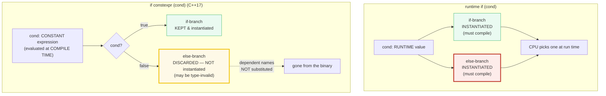

# IF_CONSTEXPR — Compile-Time Branch Discard (C++17 `if constexpr`)

> **Goal (one line):** prove — by compiling **type-invalid code in a discarded
> branch** and asserting the right branch ran — that `if constexpr (cond)`
> (C++17) evaluates `cond` at **compile time** and **discards** the false branch
> **without instantiating it**, so the discarded branch may contain code that is
> **type-invalid** for the actual template arguments (e.g. calling `.size()` on
> an `int`). This is the key tool for branch-on-type generic code, and it
> **replaces SFINAE/`enable_if`** for that case.
>
> **Run:** `just run if_constexpr`
>
> **Ground truth:** [`if_constexpr.cpp`](./if_constexpr.cpp) → captured stdout in
> [`if_constexpr_output.txt`](./if_constexpr_output.txt). Every value/line below
> is pasted **verbatim** from that file under a
> `> From if_constexpr.cpp Section X:` callout. Nothing is hand-computed.
>
> **Prerequisites:** 🔗 [`FUNCTION_TEMPLATES.md`](./FUNCTION_TEMPLATES.md) and
> 🔗 [`CONSTEXPR_CONSTEVAL.md`](./CONSTEXPR_CONSTEVAL.md) (the compile-time
> sub-language this leans on). Read those first.

---

## 1. Why this bundle exists (lineage) — "static branch on type, finally clean"

Before C++17, the only ways to write *"do one thing for ints, another for things
with `.size()`"* in a template were:

1. **SFINAE + `std::enable_if`** — two (or more) separate template overloads,
   each *enabled* only when a type predicate holds, relying on overload
   resolution silently dropping the ill-formed candidates (🔗
   `SFINAE_ENABLE_IF`). Workable but verbose, and the failure mode was a wall of
   nested-template diagnostics.
2. **Tag dispatch** — forward to one of several implementation overloads chosen
   by a `std::true_type`/`std::false_type` tag. Cleaner than SFINAE but still
   multiple functions.
3. **Template specialization** — a full/partial specialization per type. Heavy.

`if constexpr` (C++17, feature-test `__cpp_if_constexpr == 201606L`) collapsed
all three into **one function body**. It is not "an `if` that sometimes
optimizes a branch away" — it is a *compile-time* selection in which **the false
branch is the *discarded statement***: inside a template it is **not
instantiated**, so it never even has its dependent names substituted against the
real `T`. That single rule is what lets a discarded branch be **type-invalid**
and still compile.



The contrast *is* the lesson. On the left, a runtime `if` compiles **both**
branches into the binary and the CPU chooses; if either branch is type-invalid
for `T`, that is a **hard compile error**. On the right, `if constexpr` evaluates
the condition at compile time and **discards** the loser before instantiation —
so the loser can be type-invalid for `T`, because its dependent names are never
substituted.

> From cppreference — *if statement / Constexpr if*: "In a constexpr if
> statement, `condition` must be a … constant expression … If `condition` yields
> `true`, then `statement-false` is discarded (if present), otherwise,
> `statement-true` is discarded." And: "If a constexpr if statement appears
> inside a templated entity … the discarded statement is **not instantiated**
> when the enclosing template is instantiated."

---

## 2. Section A — if constexpr basics: compile-time cond, false branch DISCARDED

> From `if_constexpr.cpp` Section A:
> ```
> cond must be a constant expression of type bool (compile-time).
> The FALSE branch is the DISCARDED statement (not instantiated).
>
> if constexpr (take_if == true):   if_ran=1  else_ran=0
> if constexpr (take_else == false): if_ran=0  else_ran=1
> if constexpr (sizeof(int) >= 4):   if-branch ran (sizeof(int) >= 4 on this platform)
> [check] if constexpr (true)  -> only the if-branch ran: OK
> [check] if constexpr (false) -> only the else-branch ran: OK
> [check] sizeof(int) >= 4 (a constant expression usable as a constexpr-if cond): OK
> ```

**What.** `if constexpr (cond)` requires `cond` to be a **contextually converted
constant expression of type `bool`** — i.e. something the compiler can evaluate
at compile time. The bundle proves the selection is compile-time two ways:

- Two `constexpr bool`s (`take_if = true`, `take_else = false`) drive two
  constexpr-if blocks; each time **only the matching branch's flag is set**. For
  `take_else = false` the if-branch is the discarded statement and is absent
  from the binary.
- The condition does **not** have to be a named `bool`. `sizeof(int) >= 4` is a
  constant expression (every `sizeof` is), so it is a legal constexpr-if
  condition. So is a `constexpr` function call, an arithmetic combination of
  constants, a `<type_traits>` predicate (`std::is_integral_v<T>`), or a
  concept (`std::integral<T>`, Section D).

**Why — what "discarded" actually means to the compiler.** The taken branch is
instantiated normally; the **discarded** branch is *not*. Inside a template that
means the discarded branch's body is never instantiated — its **dependent
names** (like `x.size()`, which depends on the template parameter `T`) are
**never substituted** against the real `T`. That is the precise mechanism that
lets Section B's type-invalid branch compile. (Outside any template the
discarded branch is still **fully checked**, Section D point (c).)

---

## 3. Section B — THE payoff: a discarded branch can be TYPE-INVALID

**This is the expert payoff of the whole bundle.** The template below calls
`x.size()` in its else-branch. For `T = int` there is **no `int::size()`** —
that code is type-invalid. Yet the program **compiles**, because `if constexpr`
discards the else-branch for `T = int` before it is ever instantiated.

> From `if_constexpr.cpp` Section B:
> ```
> Template branchOnType<T> returns x/2 for integers, x.size() otherwise.
> The non-matching branch is DISCARDED (not instantiated) -> compiles.
>
> branchOnType(int 42)        = 21   (if-branch ran: 42/2)
> branchOnType(string "hello")  = 5   (else-branch ran: .size())
> [check] branchOnType<int>: if-branch ran (42/2 == 21): OK
> [check] branchOnType<string>: else-branch ran ("hello".size() == 5): OK
> [check] the discarded else-branch (int::size()) compiled — PROOF if constexpr discards it: OK
>
> return type std::size_t is shared by both instantiations (explicit here).
> [check] branchOnType<int> & <string> share the explicit return type std::size_t: OK
> ```

The whole template, from [`if_constexpr.cpp`](./if_constexpr.cpp):

```cpp
template <class T>
std::size_t branchOnType(const T& x) {
    if constexpr (std::is_integral_v<T>) {
        return static_cast<std::size_t>(x) / 2;   // KEPT for T=int
    } else {
        return x.size();                          // DISCARDED for T=int -> compiles anyway
    }
}
```

**Read it twice.** For `T = int`, `std::is_integral_v<T>` is `true`, so the
**if-branch** is kept and `x/2` runs (`42/2 == 21`). The **else-branch** —
`x.size()` — is the discarded statement; `int::size()` would be a compile error,
but it is never substituted, so it is never checked, so it compiles. For
`T = std::string` the condition is `false`, the roles reverse, and `.size()`
runs (`"hello".size() == 5`). Both instantiations assert the correct branch ran.

**This is impossible with a runtime `if`.** A plain `if (std::is_integral_v<T>)`
inside the same template would instantiate **both** branches for `T = int`, and
`int::size()` would be a hard compile error (Section C proves it). The discard
is the *entire* reason `if constexpr` exists.

**Bonus — return-type deduction.** When the return type is `auto`, it is deduced
**only from the kept branch**; the discarded branch's `return` does not
participate. cppreference's canonical example:

```cpp
template <typename T>
auto get_value(T t) {
    if constexpr (std::is_pointer_v<T>)
        return *t;   // deduces int for T = int*
    else
        return t;    // deduces int for T = int
}
```

This bundle uses an **explicit** `std::size_t` return (both instantiations share
it), but the same rule governs the `auto` form.

> From cppreference — *Constexpr if*: "The `return` statements in a discarded
> statement do not participate in function return type deduction."

---

## 4. Section C — CONTRAST: runtime `if` compiles BOTH branches

> From `if_constexpr.cpp` Section C:
> ```
> (1) runtime if (v=7 > 5): got=1  (BOTH branches compiled; CPU picks)
> (2) if constexpr (k=7 > 5): got2=1  (ONE branch compiled; else DISCARDED)
> [check] runtime if: v>5 picked the if-branch (got==1): OK
> [check] if constexpr: k>5 kept the if-branch (got2==1): OK
>
> (3) runtime if inside a template would instantiate BOTH branches:
>     if (std::is_integral_v<T>) return x/2; else return x.size();
>     -> for T=int the else (int::size()) is a COMPILE ERROR.
>     (Gated behind #ifdef DEMO_COMPILE_ERROR; `just run` never sets it.)
> [check] runtime if cannot discard a type-invalid branch (documented, not compiled): OK
> ```

**The contrast, pinned.**

| | runtime `if (cond)` | `if constexpr (cond)` |
|---|---|---|
| `cond` | a **runtime** value | a **constant expression** |
| if-branch | **instantiated** (must compile) | kept if `cond` true, else discarded |
| else-branch | **instantiated** (must compile) | kept if `cond` false, else discarded |
| type-invalid branch for `T`? | **hard compile error** | **fine** (discarded → not substituted) |
| binary | both branches present; CPU picks | exactly one branch present |

**(1)** A runtime `if (v > 5)` with a runtime `v` — **both** branches are
compiled into the binary and the CPU selects one. `(2)` The same logic as
`if constexpr (k > 5)` with a `constexpr k` — only the taken branch exists; the
else is discarded.

**(3) The broken version, demonstrated (never compiled by `just`).** The
offending template is gated behind `#ifdef DEMO_COMPILE_ERROR`, which `just run`
/ `just out` / `just check` / `just sanitize` **never** pass, so the default and
sanitizer builds stay clean:

```cpp
#ifdef DEMO_COMPILE_ERROR
template <class T>
auto brokenRuntimeIf(const T& x) {
    if (std::is_integral_v<T>) {           // RUNTIME if -> BOTH branches instantiated
        return static_cast<std::size_t>(x) / 2;
    } else {
        return x.size();                   // ERROR for T=int: int has no .size()
    }
}
static_assert(sizeof(brokenRuntimeIf(42)) > 0, "force instantiation");
#endif
```

Building with `-DDEMO_COMPILE_ERROR` and forcing the `T = int` instantiation
fires the expected error (clang):

```
if_constexpr.cpp:219:17: error: member reference base type 'const int' is not a structure or union
```

That is the *exact* failure `if constexpr` prevents by discarding the else
before instantiation.

---

## 5. Section D — if-with-initializer + concepts; the discard rules

> From `if_constexpr.cpp` Section D:
> ```
> (a) sumVariadic(1,2,3,4,5) = 15   (if constexpr terminates the recursion)
> (b) describe(42)          = an integral type
>     describe(std::string) = a class type
> [check] sumVariadic(1..5) == 15: OK
> [check] describe(int) -> "an integral type" (concept std::integral<T>): OK
> [check] describe(std::string) -> "a class type" (std::is_class_v<T>): OK
>
> (c) discard rules: a discarded branch is PARSED but not INSTANTIATED.
>     branchOnType<int> compiled -> the discarded `x.size()` was never
>     substituted against int. (Outside a template, a discarded branch
>     IS fully checked — `if constexpr(false){ ...gibberish... }` errors.)
> [check] discarded branch's dependent names are NOT substituted (this file compiled): OK
> ```

**(a) if-with-initializer (C++17).** `if constexpr` composes with the
if-with-initializer: `if constexpr (init; cond) { ... }`. The textbook use is
**variadic recursion termination** — test `sizeof...(pack)`:

```cpp
template <class T, class... Ts>
int sumVariadic(T first, Ts... rest) {
    if constexpr (constexpr std::size_t n = sizeof...(Ts); n > 0) {
        return first + sumVariadic(rest...);   // recurse while pack non-empty
    } else {
        return first;                          // base case: one argument left
    }
}
```

`sumVariadic(1,2,3,4,5) == 15`. Note the `constexpr` on the init variable: the
init-statement's variable must be `constexpr` for the **constexpr-if condition**
to read it (a plain `auto n` is a runtime variable and would be rejected as
"not a constant expression"). Without the initializer you would write
`if constexpr (sizeof...(Ts) > 0)` directly — equivalent, but the initializer
form keeps the pack length in scope if you want to use it in the body.

**(b) Concepts drop in cleanly (C++20).** A concept is a compile-time
predicate, so it is a legal constexpr-if condition — and it reads far better
than the `<type_traits>` `_v` form:

```cpp
if constexpr (std::integral<T>) { ... }     // concept (C++20) — preferred
if constexpr (std::is_integral_v<T>) { ... }  // type-trait — equivalent, noisier
```

🔗 `CONCEPTS` (P2) is the full treatment; the pairing here is that **concepts
name the predicate** and **`if constexpr` branches on it inside one body**.

**(c) The discard rules — three layers an expert must know.**

1. **A discarded statement is still PARSED.** It must be syntactically valid —
   balanced braces, valid tokens, a semicolon where one is required. You cannot
   write `if constexpr (false) { int x = ; }`; the parser rejects it.
2. **Inside a template, a discarded statement is NOT instantiated** — its
   dependent names are **not substituted** against the real `T`. That is why
   `branchOnType<int>` compiles despite the discarded `x.size()`. The bundle's
   very existence *is* the proof: if the discarded `x.size()` had been
   substituted against `int`, this file would not compile.
3. **Outside any template, a discarded statement IS fully checked.**
   `if constexpr (false) { int i = 0; int* p = i; }` is an **error** even though
   the branch is discarded — because outside a template there is no
   instantiation step to skip; semantic checking (name lookup, type checking)
   still runs. `if constexpr` is **not** a substitute for `#ifdef`. cppreference
   spells it out:

```cpp
void f() {
    if constexpr (false) {
        int i = 0;
        int* p = i;   // Error even though in a discarded statement (non-template)
    }
}
```

> From cppreference — *Constexpr if*: "Outside a template, a discarded statement
> is fully checked. `if constexpr` is not a substitute for the `#if`
> preprocessing directive." And: "the discarded statement is **not
> instantiated** when the enclosing template is instantiated."

---

## 6. Section E — Replaces SFINAE for branch-on-type; cross-language

> From `if_constexpr.cpp` Section E:
> ```
> genericSize(42)       = 4  (int -> sizeof(int) == 4)
> genericSize("abcd")   = 4  (string -> .size()   == 4)
> genericSize(7L)       = 8  (long -> sizeof(long) == 8)
> [check] genericSize(int 42) == sizeof(int) (if-branch ran): OK
> [check] genericSize("abcd") == 4 (else-branch .size() ran): OK
> [check] genericSize(long 7L) == sizeof(long) (if-branch ran): OK
>
> One function body replaces TWO SFINAE overloads (see SFINAE_ENABLE_IF).
> Cross-language: Rust -> separate trait impls; TS -> types erased; Go -> interfaces + type switch.
> [check] if constexpr replaces SFINAE for the branch-on-type case: OK
> ```

**The SFINAE it replaces.** The pre-C++17 way to write `genericSize` needed
**two** template overloads, each enabled by `std::enable_if` on a type
predicate (🔗 `SFINAE_ENABLE_IF`):

```cpp
// PRE-C++17: two overloads, SFINAE-gated. (Documented; not in this bundle.)
template <class T,
          class = std::enable_if_t<std::is_integral_v<T>>>
std::size_t genericSize(const T& x) { return sizeof(T); }

template <class T,
          class = std::enable_if_t<!std::is_integral_v<T>>>
std::size_t genericSize(const T& x) { return x.size(); }
```

The `if constexpr` version is **one** body. `genericSize(int 42) == 4`
(`sizeof(int)`), `genericSize("abcd") == 4` (`.size()`), `genericSize(7L) == 8`
(`sizeof(long)` on LP64) — all from a single function. That collapse is why
`if constexpr` is the recommended replacement for the branch-on-type SFINAE
idiom in new code.

> From cppreference — *if statement / Notes*: `if constexpr` plus C++20 concepts
> together retire the `enable_if`/SFINAE pattern for constraining and branching
> on type; the standard-library `<concepts>` and `<type_traits>` predicates both
> serve as constexpr-if conditions.

**Cross-language parallels (the 5-language curriculum).** `if constexpr` is a
distinctly C++ feature — branching **at compile time, on type, inside
monomorphized generics**. None of the sibling languages has it; each solves the
same "do different things for different types" problem differently:

| Language | Compile-time branch on type? | How it branches on type instead |
|---|---|---|
| **C++** (this bundle) | **yes** — `if constexpr` discards a branch pre-instantiation | `if constexpr (std::integral<T>)` in one body |
| 🔗 [`../rust/`](../rust/) | **no** — generics monomorphize, but there is no `if constexpr` | **separate trait impls** (`impl Trait for i32` vs `impl Trait for Vec<_>`) or **enum `match`** — branching is *structural*, not a compile-time `if` |
| 🔗 [`../ts/`](../ts/) | **no** — types are **erased** at runtime | runtime `typeof`/`in` checks + **user-defined type guards**; no compile-time type branching |
| 🔗 [`../go/`](../go/) | **no** — no generics-time branching | **interfaces** + runtime **type switch** (`switch v := x.(type)`) |
| 🔗 [`../python/`](../python/) | **no** — dynamically typed | runtime `isinstance` / `hasattr` (duck typing) |

The headline contrast is with Rust: both languages monomorphize generics, but
Rust deliberately rejected a compile-time `if` on type and instead routes
type-specific behavior through **separate `impl` blocks** (one per type) or
**`enum` + `match`** (one arm per variant). C++'s `if constexpr` keeps the
behavior in **one** body and lets the compiler discard what does not apply.
Neither is strictly better; Rust's model is more explicit and checks each `impl`
independently, while C++'s is more compact and reads like ordinary code.

---

## 7. Worked smallest-scale example

Everything above, compressed to the one template a reader must internalize:

```cpp
template <class T>
std::size_t doit(const T& x) {
    if constexpr (std::is_integral_v<T>)
        return static_cast<std::size_t>(x) / 2;   // T=int   -> kept; 21
    else
        return x.size();                          // T=int   -> DISCARDED (no int::size(), compiles)
}                                                 // T=string -> .size(); 5
```

> From `if_constexpr.cpp` Section B, `branchOnType(int 42) = 21` (if-branch) and
> `branchOnType(string "hello") = 5` (else-branch). The fact that **both lines
> compile** is the proof: the discarded `x.size()` for `T=int` was never
> instantiated.

---

## 8. Pitfalls (the expert payoff)

| Trap | Symptom | Fix |
|---|---|---|
| Plain `auto n = ...;` in the if-init, then `if constexpr (n ...)` | "constexpr if condition is not a constant expression — read of non-const variable" | Make the init `constexpr`: `if constexpr (constexpr auto n = sizeof...(Ts); n > 0)`. Or drop the variable: `if constexpr (sizeof...(Ts) > 0)`. |
| `if constexpr (false) { gibberish }` outside any template | **Hard error** — outside a template a discarded statement is still fully checked | `if constexpr` is not `#ifdef`. Use `#if 0` / the preprocessor for uncompiled scratch, or move the branch inside a template. |
| A discarded `else` that is ill-formed for **every** `T` | "invalid for every specialization" error (e.g. `int[-1]`, or `static_assert(false)` pre-CWG2518) | Make the assertion type-dependent: `template<class> constexpr bool always_false_v = false; static_assert(always_false_v<T>);` (CWG2518, C++23, now also allows plain `static_assert(false)` in a discarded branch, but the dependent form is portable). |
| `if constexpr (c) return a; else return b;` with **`auto`** return, branches returning *different* types | deduced return type mismatch across instantiations, or surprising type per `T` | Return type is deduced **only from the kept branch** — that is usually *wanted*, but if you need a stable return type across all `T`, spell it out (`-> std::size_t`). |
| Expecting `if constexpr` to *guarantee* no codegen for the taken false-branch of a **non-template** | the branch is discarded but the function is still fully checked (pitfall #2 in disguise) | Remember: discard ≠ no semantic check. Only *template instantiation* is skipped. |
| Using `if constexpr` where a **concept constraint** or **overload** is clearer | a chain of `if constexpr (C1<T>) ... else if constexpr (C2<T>) ...` that reimplements overload resolution by hand | If the branches are mutually exclusive on type and you don't need a shared body, prefer **concepts + constrained overloads** (🔗 `CONCEPTS`); reserve `if constexpr` for *one body, type-specific fast paths*. |
| `if (std::is_integral_v<T>)` written by habit where `if constexpr` was meant | compiles **until** a branch is type-invalid for some `T`, then a confusing "no member named …" error in the *other* branch | Inside a template, write `if constexpr` whenever the branches are type-specific. The runtime `if` instantiates both. |
| Branching on a value that is **not** a constant expression | "constexpr if condition is not a constant expression" | `cond` must be a constant expression (a `constexpr`/`consteval` result, a `sizeof`, a `_v` trait, a concept, an arithmetic combo of constants). A runtime variable is rejected. |
| Assuming the discarded branch is never *parsed* | syntax errors in the discarded branch slip in, then fail the build unexpectedly | The discarded branch **is** parsed (must be syntactically valid). Only instantiation + dependent-name substitution are skipped. |

---

## 9. Cheat sheet

```cpp
#include <concepts>      // std::integral<T>      (concept, C++20)
#include <type_traits>   // std::is_integral_v<T> (trait)

// ── The form ──────────────────────────────────────────────────────────────
//   if constexpr ( CONSTANT_EXPRESSION_OF_BOOL ) { ... }      // kept if true
//   else                                          { ... }      // DISCARDED if true
//   cond MUST be a constant expression. The false branch is the DISCARDED
//   statement: inside a template it is NOT instantiated (dependent names not
//   substituted) -> may be type-invalid for the real T.

// ── THE payoff: type-invalid discarded branch compiles ────────────────────
template <class T>
std::size_t doit(const T& x) {
    if constexpr (std::is_integral_v<T>)
        return static_cast<std::size_t>(x) / 2;   // KEPT for T=int
    else
        return x.size();                          // DISCARDED for T=int -> OK
}

// ── Condition can be a concept (cleaner) ──────────────────────────────────
if constexpr (std::integral<T>) { /* ... */ }

// ── if-with-initializer (C++17): variadic recursion termination ───────────
template <class T, class... Ts>
int sum(T first, Ts... rest) {
    if constexpr (constexpr std::size_t n = sizeof...(Ts); n > 0)
        return first + sum(rest...);
    else
        return first;
}   // init variable MUST be `constexpr` to be read in the constexpr-if cond.

// ── auto return: deduced ONLY from the kept branch ────────────────────────
template <typename T> auto get(T t) {
    if constexpr (std::is_pointer_v<T>) return *t;   // int for T=int*
    else                                  return t;  // int for T=int
}

// ── Discard rules ─────────────────────────────────────────────────────────
//   discarded branch  -> PARSED (must be syntactically valid)
//                     -> NOT instantiated inside a template (dep. names not substituted)
//                     -> STILL fully checked OUTSIDE a template (not a #ifdef!)

// ── Replaces ──────────────────────────────────────────────────────────────
//   * SFINAE/enable_if for the "branch on type" case (one body, not N overloads)
//   * tag dispatch, partial specialization for type-specific fast paths
```

---

## 10. 🔗 Cross-references

**Within C++ (the expertise spine):**

- 🔗 [`CONSTEXPR_CONSTEVAL.md`](./CONSTEXPR_CONSTEVAL.md) (P6) — the compile-time
  sub-language `if constexpr` lives in. `if constexpr` requires its condition to
  be a *constant expression*; that vocabulary (`constexpr`/`consteval`/
  `constinit`, what counts as a constant expression) is defined there.
- 🔗 [`SFINAE_ENABLE_IF.md`](./SFINAE_ENABLE_IF.md) (P6) — the **messier
  pre-C++17 alternative** `if constexpr` replaces for the branch-on-type case.
  Section E shows the two-overhead `enable_if` form collapsing into one body.
- 🔗 [`CONCEPTS.md`](./CONCEPTS.md) (P2) — concepts *name* the compile-time
  predicate (`std::integral<T>`); `if constexpr` *branches* on it inside one
  body. They pair cleanly: `if constexpr (std::integral<T>)`.
- 🔗 [`FUNCTION_TEMPLATES.md`](./FUNCTION_TEMPLATES.md) (P2) — the template
  instantiation model that makes "discarded ⇒ not instantiated" meaningful
  (only inside a template is the discarded branch's substitution skipped).
- 🔗 [`VARIADIC_TEMPLATES.md`](./VARIADIC_TEMPLATES.md) — `if constexpr
  (sizeof...(Ts) > 0)` is the modern recursion terminator (Section D).
- 🔗 [`UNDEFINED_BEHAVIOR.md`](./UNDEFINED_BEHAVIOR.md) (P7) — `if constexpr` is
  the **key tool to avoid UB in generic code**: the discarded branch is not
  instantiated, so you never call `.size()` on a type without it.

**Cross-language parallels (the 5-language curriculum):**

- 🔗 [`../rust/`](../rust/) — Rust has **no `if constexpr`**: generics
  monomorphize but there is no compile-time `if` on type. Rust routes
  type-specific behavior through **separate trait impls** (one `impl` per type)
  or **`enum` + `match`** (one arm per variant) — structural, not conditional.
  C++ keeps it in one body; Rust checks each `impl` independently.
- 🔗 [`../ts/`](../ts/) — TypeScript has **no** compile-time branching on type:
  types are **erased** at runtime. "Branch on type" becomes a runtime `typeof`/
  `in` check or a user-defined type guard — nothing is discarded at compile time.
- 🔗 [`../go/`](../go/) — Go has no generics-time branching: type-specific
  behavior goes through **interfaces** and a runtime **type switch**
  (`switch v := x.(type)`).
- 🔗 [`../python/`](../python/) — dynamically typed; "branch on type" is a
  runtime `isinstance` / `hasattr` (duck typing), no compile-time discard.

---

## Sources

Every signature, value, and behavioral claim above was verified against
cppreference and the ISO C++ standard, then corroborated by ≥1 independent
secondary source:

- cppreference — *if statement* (syntax; if-with-initializer since C++17;
  **Constexpr if** section: condition must be a constant expression, the false
  branch is the *discarded statement*, discarded `return` does not participate
  in return-type deduction, discarded statement ODR-uses allowed, outside a
  template a discarded statement is fully checked and `if constexpr` is not a
  substitute for `#if`, inside a templated entity the discarded statement is not
  instantiated; feature-test `__cpp_if_consteval` for the related C++23
  `if consteval`):
  https://en.cppreference.com/w/cpp/language/if
- cppreference — *`std::is_integral` / `std::is_integral_v`* (the type trait used
  as the constexpr-if condition in Sections B and E):
  https://en.cppreference.com/w/cpp/types/is_integral
- cppreference — *`std::integral` concept* (C++20; used as a constexpr-if
  condition in Section D):
  https://en.cppreference.com/w/cpp/concepts/integral
- cppreference — *`sizeof...` operator* (constant expression; the variadic-pack
  length used in Section D's if-with-initializer):
  https://en.cppreference.com/w/cpp/language/sizeof...
- ISO C++23 draft (open-std.org) — normative wording:
  - 8.5 Statements / Selection statements `[stmt.select]` (the `if constexpr`
    form and the discarded-statement rules);
  - 13.5 Temlated entities / implicit instantiation `[temp.inst]` (a discarded
    statement of a constexpr if is not instantiated when the enclosing template
    is instantiated).
  - Working draft: https://open-std.org/JTC1/SC22/WG21/docs/papers/2023/n4950.pdf
  - CWG 2518 — *`static_assert(false)` in a discarded branch* (permits a plain
    `static_assert(false)` in a `if constexpr` discarded branch; the dependent
    `always_false_v<T>` form remains the portable workaround):
    https://cplusplus.github.io/CWG/issues/2518.html
- Secondary corroboration (≥2 independent sources, web-verified):
  - Sy Brand (TartanLlama) — *"Simplifying Templates and #ifdefs with
    `if constexpr`"*: "It is essentially an if statement where the branch is
    chosen at compile-time, and any not-taken branches are discarded without
    being [instantiated]." https://tartanllama.xyz/posts/if-constexpr/
  - Bartlomiej Filipek, C++ Stories — *"Simplify Code with `if constexpr` and
    Concepts in C++17/C++20"* (why the discarded branch is needed to avoid
    instantiating type-invalid code; pairing with concepts):
    https://www.cppstories.com/2018/03/ifconstexpr/
  - Stack Overflow — *"if constexpr - why is discarded statement fully
    checked?"* (the outside-a-template rule: a discarded statement is still
    fully checked when not in a template):
    https://stackoverflow.com/questions/59393908/if-constexpr-why-is-discarded-statement-fully-checked
  - Anders Knatten — *"Why we probably shouldn't have constexpr conditional
    operator"* ("The most important advantage of constexpr if is that each
    branch only need to compile if that branch is taken at compile time."):
    https://blog.knatten.org/2023/01/02/why-we-probably-shouldnt-have-constexpr-conditional-operator/

**Facts that could not be verified by running** (documented, not executed,
because they are compile errors by design): the runtime-`if` template in
Section C (`brokenRuntimeIf`) failing for `T=int` — confirmed by building the
`#ifdef DEMO_COMPILE_ERROR` path, which produces clang's
`error: member reference base type 'const int' is not a structure or union`
(exit code 1); and the outside-a-template `if constexpr(false){ int* p = i; }`
error (cppreference's example, a hard error). These are gated so the default and
sanitizer builds stay clean; they are confirmed by the cppreference sections and
secondary sources above, not reproduced as runnable output in the verified path.
