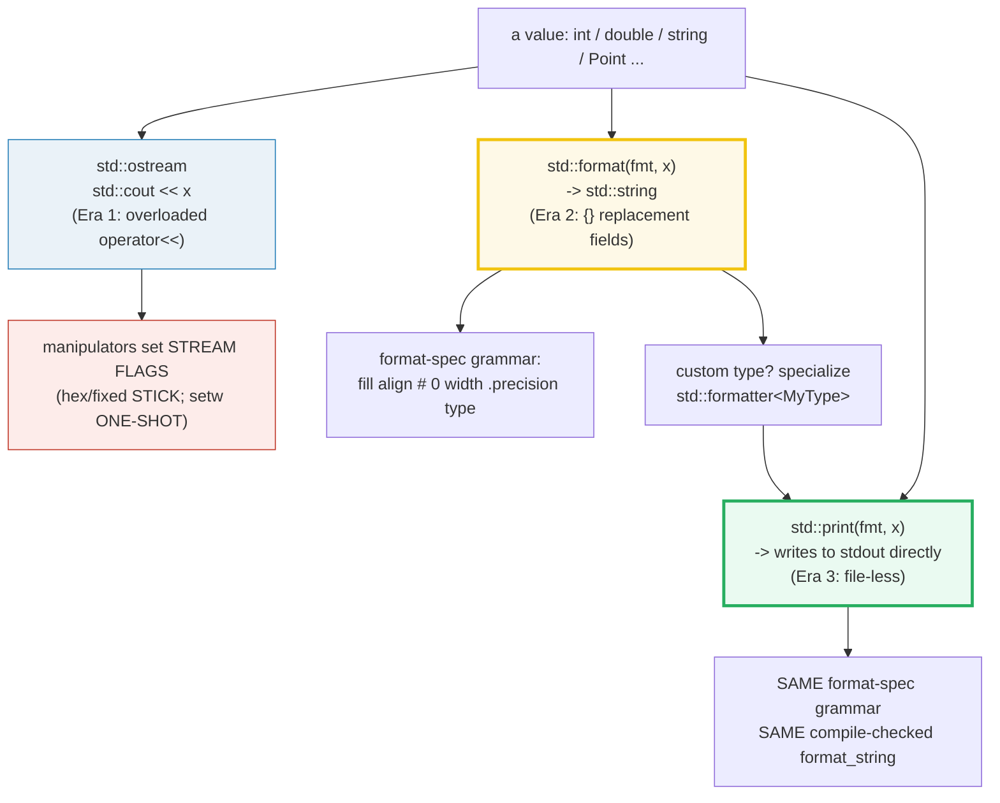
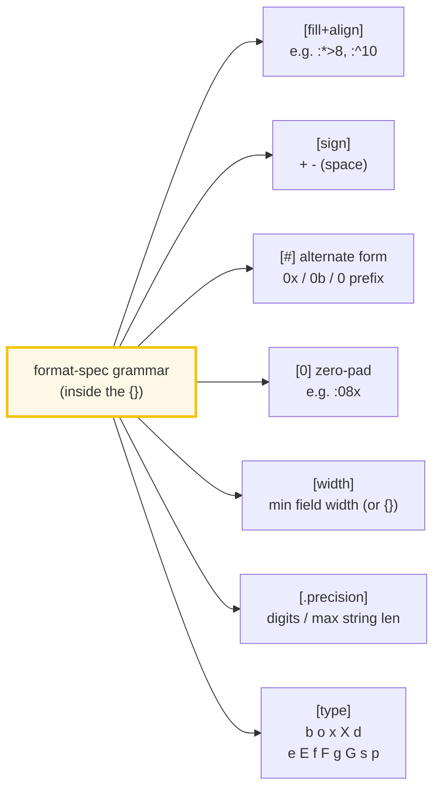

# IOSTREAM_FORMAT — The Three Eras of C++ Output: iostream → std::format → std::print

> **Goal (one line):** show, by printing + asserting every value, the **three
> eras** of C++ output — (1) `<iostream>` with its manipulators (`cout << x`,
> `std::hex`/`std::setw`/`std::setprecision`), (2) `std::format` (C++20,
> Python-style `{}` fields), (3) `std::print`/`std::println` (C++23, direct to
> stdout) — pinning the **sticky-vs-one-shot manipulator trap** and the
> **compile-checked format string** as the expert payoffs.
>
> **Run:** `just run iostream_format`
>
> **Ground truth:** [`iostream_format.cpp`](./iostream_format.cpp) → captured
> stdout in [`iostream_format_output.txt`](./iostream_format_output.txt). Every
> number/table below is pasted **verbatim** from that file under a
> `> From iostream_format.cpp Section X:` callout. Nothing is hand-computed.
>
> **Prerequisites:** 🔗 [`VALUES_TYPES.md`](./VALUES_TYPES.md) (fundamental types;
> the banner/check helpers use `<cstdio>` `printf`, the house scaffold from
> `scripts/skeleton.cpp`).

---

## 1. Why this bundle exists (lineage)

C++ output has had **three distinct eras**, each fixing the previous one's
weakness. Knowing all three — and which to reach for in 2026 — is the mark of a
modern C++ user:

```mermaid
graph LR
    E1["ERA 1: &lt;iostream&gt;<br/>std::cout &lt;&lt; x<br/>(type-safe streams<br/>+ sticky manipulators)"] -->|C++20| E2["ERA 2: std::format<br/>std::format(\"{}\", x)<br/>(Python-style {} fields<br/>compile-checked)"]
    E2 -->|C++23| E3["ERA 3: std::print/println<br/>std::print(\"{}\", x)<br/>(direct to stdout<br/>no stream object)"]
    style E1 fill:#eaf2f8,stroke:#2980b9
    style E2 fill:#fef9e7,stroke:#f1c40f,stroke-width:3px
    style E3 fill:#eafaf1,stroke:#27ae60,stroke-width:3px
```

| Era | Era 1 — `<iostream>` | Era 2 — `std::format` (C++20) | Era 3 — `std::print` (C++23) |
|---|---|---|---|
| **API** | `std::cout << x << std::hex << n` | `std::format("x={}, y={:.2f}", x, y)` | `std::println("x={}, y={:.2f}", x, y)` |
| **Type safety** | yes (overloaded `<<`) | yes (**compile-checked** spec) | yes (compile-checked) |
| **State** | **sticky** stream flags (hex/fixed STICK) | **stateless** per call | stateless per call |
| **Output target** | a `std::ostream` object | returns a `std::string` | **direct** to a `FILE*` |
| **Speed** | slowest (locale + virtual dispatch) | fast (single allocation) | fastest (no stream, no throwaway string) |
| **Model** | unique to C++ | **modeled on Python f-strings / `.format()`** | the natural completion of Era 2 |

> From cppreference — *Formatting library*: "The text formatting library offers a
> safe and extensible alternative to the `printf` family of functions. It is
> intended to **complement** the existing C++ I/O streams library." And
> *std::print*: "prints to `stdout` or a file stream using formatted
> representation of the arguments."

**The modern guidance:** for new code, prefer **`std::format` / `std::print`**
over `<iostream>`. They are type-safe *and* compile-checked *and* stateless (no
sticky flags to leak across output statements) *and* faster. `<iostream>`
remains valuable for its `>>`/`<<` overloads, `std::ostringstream` (build-a-
string), and streaming to/from arbitrary `std::ostream` targets (files, network,
`std::cerr`).

The headline contrast across the 5-language curriculum: `std::format` is
**explicitly the C++ version of Python's `format()`/f-strings** — the grammar is
lifted almost verbatim. So C++ finally joins 🔗 Go (`fmt.Sprintf`), 🔗 Rust
(`format!`/`println!`), and 🔗 Python (f-strings) in the "format string with
replacement fields" club.

---

## 2. The mental model: where each piece lives



The key insight: **Era 2 and Era 3 share one engine** (`std::format_string` + the
format-spec grammar). `std::print` is essentially "`std::format`, but write the
result straight to `stdout` instead of returning a `std::string`." Only **Era 1**
is its own world — the `<<` overloads and the *stateful* stream flags.



The format-spec grammar — `[fill+align][sign][#][0][width][.precision][type]` —
is **identical to Python's** (cppreference: "the format specification is based on
the format specification in Python"). `"%03.2f"` becomes `"{:03.2f}"`.

---

## 3. Section A — `<iostream>`: the type-safe `<<` overloads

> From `iostream_format.cpp` Section A:
> ```
> cout << 42 << 3.5 << 'A' << "hi" << true -> "i=42 d=3.5 c=A s=hi b=1"
> [check] type-safe << formats int/double/char/string/bool -> i=42 d=3.5 c=A s=hi b=1: OK
> with std::boolalpha: true false -> "true false"
> [check] std::boolalpha prints true/false as text -> 'true false': OK
> std::cout->stdout ; std::cerr->stderr(unbuffered) ; std::cin->stdin
> [check] the three standard streams share the << / >> interface: OK
> ```

**What.** `std::cout << x` is the classic C++ output. The insertion operator
`<<` is **overloaded for every standard type**, so the compiler selects the
correct formatting per operand — **type-safe**, unlike C `printf`'s `%d`/`%f`
whose matching is entirely your responsibility (a wrong `printf` specifier is
silent UB at worst; a wrong `<<` is a compile error). Note the default behavior
caught here: **`bool` prints as `1`/`0`** until you insert `std::boolalpha`.

**Why.** The mechanism is free-function overload resolution: `operator<<(std::ostream&, int)`,
`operator<<(std::ostream&, double)`, … each defined in `<ostream>` (pulled in by
`<iostream>`). `std::cout`/`std::cerr`/`std::cin` are pre-constructed global
objects (`std::cout` → stdout, buffered; `std::cerr` → stderr, **unbuffered** so
crash messages survive; `std::cin` → stdin). All three share the `<<` / `>>`
interface, and all derive from the same `std::basic_ios` base (which holds the
sticky flags of Section B).

**The expert detail — why `<<` is *still* slower than `std::print`.** Each `<<`
goes through a **virtual dispatch** (`std::ostream` is a polymorphic class
hierarchy) and consults the stream's **locale** for number formatting on every
call. `std::format`/`std::print` skip both — they parse the spec once and write
bytes directly. This is why `std::cout` is the slowest of the three eras.

> From cppreference — *Standard stream objects*: `std::cout`/`std::cerr`/
> `std::clog` are "objects … associated with the C standard stream `stdout`,
> `stderr` …"; `std::cerr` is "unbuffered."

---

## 4. Section B — I/O manipulators: the **sticky-vs-one-shot trap**

**This is the expert payoff of the whole bundle.** I/O manipulators fall into
two camps with *wildly* different lifetimes, and mixing them up is the #1
`<iostream>` bug:

> From `iostream_format.cpp` Section B:
> ```
> std::hex << 255 -> "ff"
> [check] std::hex formats 255 as 'ff': OK
> std::hex << 255 << ' ' << 16 -> "ff 10" (hex STICKS)
> [check] std::hex STICKS: 255 then 16 -> 'ff 10': OK
> std::oct << 64 -> "100"
> [check] std::oct formats 64 as '100': OK
> setw(5)+setfill('0') << 42 -> "00042"
> [check] setw(5)+setfill('0') << 42 -> '00042': OK
> setw(5)<<42<<'|'<<42 -> "00042|42" (setw ONE-SHOT: 2nd 42 NOT padded)
> [check] setw is ONE-SHOT: 2nd 42 not padded -> '00042|42': OK
> fixed+setprecision(3) << 3.14159 -> "3.142"
> [check] fixed + setprecision(3) << 3.14159 -> '3.142': OK
> scientific+setprecision(2) << 31415.9 -> "3.14e+04"
> [check] scientific + setprecision(2) << 31415.9 -> '3.14e+04': OK
> RULE: base(hex/oct/dec), fixed, scientific, boolalpha, setprecision STICK;
>       setw EXPIRES after exactly one insertion.
> [check] sticky-vs-one-shot manipulator rule documented: OK
> ```

**The two lifetimes, pinned.**

| Manipulator | Lifetime | Why |
|---|---|---|
| `std::hex`/`std::oct`/`std::dec` | **STICKY** (persist) | sets `ios_base::basefield` |
| `std::fixed`/`std::scientific` | **STICKY** | sets `ios_base::floatfield` |
| `std::boolalpha` | **STICKY** | sets `ios_base::boolalpha` bit |
| `std::setprecision(n)` | **STICKY** | sets the precision field |
| `std::setfill(c)` | **STICKY** | sets the fill character |
| **`std::setw(n)`** | **ONE-SHOT** (next insertion only) | the stream **resets width to 0** after each formatted output |

The bundle proves the asymmetry directly: `std::hex << 255 << ' ' << 16` yields
`"ff 10"` — hex **persisted** to the second number. But
`std::setw(5) << 42 << '|' << 42` yields `"00042|42"` — **`setw` had already
expired**, so the second `42` printed unpadded. (Each check uses a **fresh**
`std::ostringstream` so the stickiness is unambiguous and never leaks between
assertions.)

> From cppreference — *std::setw*: "Some operations **reset the width to zero**,
> so `std::setw` may need to be repeatedly called to set the width for multiple
> operations." And *std::hex*: "sets the `basefield` of the stream … as if by
> calling `str.setf(std::ios_base::hex, std::ios_base::basefield)`" — i.e. it
> sets a **persistent flag**, no reset.

**The practical fix when you can't use `std::format`:** if you must use
`<iostream>`, save and restore the flags around a formatting block —
`std::ios_base::fmtflags old = os.flags(); … os.flags(old);` — or (better)
just switch that call site to `std::format`. A leaked `std::hex` on `std::cout`
corrupts **every subsequent integer print** in the program until someone resets
it — a classic "why is my whole log in hex?" incident.

---

## 5. Section C — `std::ostringstream` (build a string) + `std::endl` vs `'\n'`

> From `iostream_format.cpp` Section C:
> ```
> ostringstream builds -> "name=widget price=9.99"
> [check] ostringstream composes a string -> 'name=widget price=9.99': OK
> a="line1"<<endl<<"line2"  b="line1"<<'\n'<<"line2"  ->  a==b ? yes
> (text identical; endl ALSO flushes -> prefer "\n")
> [check] std::endl text == '\n' text (endl just adds an extra flush): OK
> ```

**`std::ostringstream`** is an output stream whose destination is an in-memory
`std::string` instead of a file. You write to it with the **same `<<` interface**
as `std::cout`, then call `.str()` to extract the accumulated string. This was
the **pre-`std::format` way** to compose text type-safely, and it remains useful
for ad-hoc string building and for capturing stream output (exactly how this
bundle asserts the iostream sections deterministically).

**`std::endl` vs `'\n'`.** `std::endl` does two things: writes `'\n'` **and
flushes** the stream. The flush forces the buffer out (a write syscall on a real
file). The bundle proves the **text is identical** (`a == b`), so the only
difference is that **`std::endl`'s flush is a side effect**. In a hot loop that
flushes on every iteration, that is a real performance cliff — **prefer `"\n"`**
unless you genuinely need the flush (e.g. before a possible crash, or to a pipe a
reader is waiting on). Note also that the sticky-flag trap of Section B applies
to `std::ostringstream` too — its flags persist until reset.

> From cppreference — *std::endl*: "inserts a newline character … and flushes
> the output stream." *std::ostringstream*: "implements output operations on
> string-based streams … `str()` … manages the associated string."

---

## 6. Section D — `std::format` (C++20): Python-style `{}` fields

> From `iostream_format.cpp` Section D:
> ```
> std::format("x={}, y={:.2f}", 3, 3.14159) -> "x=3, y=3.14"
> [check] std::format positional fields -> 'x=3, y=3.14': OK
> {:+.3f} 3.14159 -> "+3.142"  (sign + precision)
> [check] spec {:+.3f} -> '+3.142': OK
> {:x} 255 -> "ff"
> [check] spec {:x} -> 'ff': OK
> {:b} 9 -> "1001"
> [check] spec {:b} -> '1001': OK
> {:>8} 42 -> "      42"
> [check] spec {:>8} -> '      42': OK
> {:*>8} 42 -> "******42"
> [check] spec {:*>8} -> '******42': OK
> {:08x} 255 -> "000000ff"
> [check] spec {:08x} -> '000000ff': OK
> {:#x} 255 -> "0xff"
> [check] spec {:#x} -> '0xff': OK
> {1} before {0}  ("B","A") -> "A before B"
> [check] explicit arg-ids -> 'A before B': OK
> "literal {{}} braces" -> "literal {} braces"
> [check] escaped braces {{}} -> 'literal {} braces': OK
> {} adapts to type: int->"v=7"  double->"v=2.5"  string->"v=hi"
> [check] type-safe {}: int -> 'v=7': OK
> [check] type-safe {}: double -> 'v=2.5': OK
> [check] type-safe {}: string -> 'v=hi': OK
> ```

**What.** `std::format(fmt, args...)` returns a `std::string` formatted by
**replacement fields** `{}` / `{n}` (optionally with a `:format-spec`), exactly
like Python's `str.format()`/f-strings. Ordinary characters are copied; `{{`/`}}`
escape to literal `{`/`}`. The bundle exercises the full grammar:

- `{}` — bare positional field, format-spec inferred from the type.
- `{:.2f}`, `{:+.3f}` — precision and sign.
- `{:x}`, `{:b}`, `{:o}` — integer presentation (hex/binary/octal).
- `{:>8}`, `{:*>8}` — fill + alignment (`<` left, `>` right, `^` center).
- `{:08x}` — zero-pad to width; `{:#x}` — alternate form (the `0x` prefix).
- `{1} before {0}` — explicit arg-ids (manual vs automatic; **never mix the two**).

**Why — the compile-checked format string (the headline safety win).** The first
argument is a `std::format_string<Args...>`, a class whose `constexpr` constructor
**parses and validates the format string at compile time** against the argument
types. Consequences:

- **Wrong arg count** → compile error (`std::format("{}", )`, `std::format("{}{}", x)`).
- **Unknown/ill-formed spec** → compile error.
- The argument **types** are checked against the spec — no more `%d`-vs-`%s`
  crashes like `printf`.

A runtime `printf` mismatch is **silent UB**; the equivalent `std::format`
mistake **fails to build**. (The actual compile errors are documented in §9
pitfalls, not executed in the verified path — a file containing one would not
compile, so `just check` could not pass.)

**Why it's stateless.** Unlike `<iostream>`'s sticky flags, **every `std::format`
call starts from a clean slate** — `std::format("{:x}", 255)` in one line does
*not* make the next `std::format("{}", 255)` print hex. The format-spec lives in
the string, not in shared stream state. That alone eliminates the entire Section
B trap.

> From cppreference — *Formatting library*: "stores formatted representation of
> the arguments in a new string." *Standard format specification*: "based on the
> format specification in Python … `"%03.2f"` can be translated to `"{:03.2f}"`."
> *basic_format_string*: "class template that performs **compile-time format
> string checks at construction time**."

---

## 7. Section E — `std::print`/`println` (C++23) + `format_to` + custom formatters

> From `iostream_format.cpp` Section E:
> ```
> [std::print]   x=3, y=3.14
> [std::println] hex=ff fixed=2.718
> [check] std::print text == 'x=3, y=3.14\n': OK
> [check] std::println text == 'hex=ff fixed=2.718\n': OK
> std::format_to(back_inserter) -> "6 squared is 36"
> [check] std::format_to via back_inserter -> '6 squared is 36': OK
> std::format_to_n(buf,5,"abcdefghij") -> "abcde" (full size would be 10)
> [check] std::format_to_n truncates to 'abcde': OK
> [check] std::format_to_n result.size == 10 (untruncated length): OK
> std::format("{}", Point{3,4}) -> "Point(3, 4)"
> [check] custom std::formatter<Point> -> 'Point(3, 4)': OK
> THE THREE ERAS: <iostream>(manipulators) -> std::format {} -> std::print(direct)
> Modern guidance: prefer std::format / std::print over iostream for new code.
> [check] three-eras summary documented: OK
> ```

**`std::print` / `std::println` (C++23).** These write formatted text **directly
to `stdout`** (or a `FILE*`), with **no `std::ostream` object** and no per-call
locale overhead. `std::println` is just `std::print` plus a trailing newline.
They reuse the **same compile-checked `std::format_string`** and the **same
format-spec grammar** as `std::format` — so the bundle asserts that
`std::print(...)` produces exactly the text `std::format(...)` would, then
appends a newline. The two `[std::print]` lines above are the actual direct-to-
stdout output, captured in the run. This is the fastest, cleanest way to print a
line in modern C++.

> From cppreference — *std::print*: "prints to `stdout` or a file stream using
> formatted representation of the arguments." *std::println*: "same as
> `std::print` except that each print is terminated by additional new line."

**`std::format_to` / `std::format_to_n`.** These write the formatted text to an
**output iterator** instead of returning a string:

- `std::format_to(it, fmt, args...)` writes the full result through `it`. With
  `std::back_inserter(buf)` it appends into a pre-sized `std::string`/vector —
  no throwaway allocation, useful in hot paths.
- `std::format_to_n(it, n, fmt, args...)` writes **at most `n` characters** and
  returns `{ .out, .size }` where **`.size` is the full (untruncated) length**
  that *would* have been written. The bundle shows it truncating
  `"abcdefghij"` to `"abcde"` while reporting `size == 10`.

**Custom formatters.** To make `std::format`/`std::print` understand your own
type, **specialize `std::formatter<MyType>`** (allowed for program-defined
types). Two members: `parse(ctx)` consumes the format-spec (here we accept an
empty spec); `format(value, ctx)` writes the representation to `ctx.out()`. Once
defined, *every* formatting function understands the type — the bundle's
`Point{3,4}` renders as `"Point(3, 4)"`:

```cpp
struct Point { int x; int y; };

template <>
struct std::formatter<Point> {
    constexpr auto parse(std::format_parse_context& ctx) { return ctx.begin(); }
    auto format(const Point& p, std::format_context& ctx) const {
        return std::format_to(ctx.out(), "Point({}, {})", p.x, p.y);
    }
};

std::format("{}", Point{3, 4});            // -> "Point(3, 4)"
std::println("origin = {}", Point{0, 0});  // -> "origin = Point(0, 0)"
```

---

## 8. Worked smallest-scale example

Everything above, compressed to the one line per era a beginner must memorize:

```cpp
#include <iostream>
#include <iomanip>
#include <format>
#include <print>

// ERA 1 — iostream (type-safe streams + sticky manipulators; stateful)
std::cout << std::hex << 255 << '\n';        // -> ff   (hex STICKS afterward)

// ERA 2 — std::format (C++20): Python-style {}; stateless; compile-checked
std::string s = std::format("x={}, y={:.2f}", 3, 3.14159);  // -> "x=3, y=3.14"

// ERA 3 — std::print/println (C++23): direct to stdout; no stream object
std::println("x={}, y={:.2f}", 3, 3.14159);  // -> x=3, y=3.14
```

> From `iostream_format.cpp` Section D, `std::format("x={}, y={:.2f}", 3, 3.14159)`
> printed exactly `x=3, y=3.14`; Section E's `std::println` printed the same to
> stdout directly. Section B proves `std::hex` STICKS while `std::setw` is
> one-shot — the contrast that motivates the stateless Era 2/3.

---

## 9. Pitfalls (the expert payoff)

| Trap | Symptom | Fix |
|---|---|---|
| `std::hex` / `std::fixed` / `std::boolalpha` **leaks** on `std::cout` | every later integer prints in hex; whole log corrupted | reset explicitly (`std::cout << std::dec`), or scope via `os.flags()` save/restore — or just use `std::format` (stateless). |
| **`std::setw` is one-shot** — expected it to pad every field in a table | only the first column is padded, the rest collapse | call `setw` before *every* value, or build the row with `std::format("{:>8}{:>8}", a, b)`. |
| Mixing **manual and automatic** arg-ids (`{0} {}`) | **compile error** (or `std::format_error`) | use either all `{}` or all `{n}`, never both. |
| **Wrong arg count / bad spec** in `std::format` | compile error (good!) — but surprising if you expected runtime | it's a feature: the `format_string` is compile-checked. Fix the spec. |
| `std::endl` **inside a hot loop** | a flush syscall per iteration → 10–100× slowdown | use `'\n'`; flush only when you must (e.g. before a likely crash). |
| `std::cout << "n=" << n` interleaved with C `printf` across threads | garbled/overlapping output | both share `stdout`; serialize (mutex) or use `std::osyncstream` (C++20). |
| Capturing/merging streams expecting **ordering** across threads | output race / torn lines | `std::print` is still not atomic across calls; wrap multi-line writes or use a sync stream. |
| `bool` prints as `1`/`0` by default | logs show `flag=1` not `flag=true` | insert `std::boolalpha` (Era 1) or use `{:}` which prints `true`/`false` (Era 2/3). |
| `std::format` of a **custom type without a `std::formatter`** specialization | compile error "formattable" requirement unmet | specialize `std::formatter<MyType>` (parse + format), §7. |
| Assuming `std::format("{}", 3.0)` prints `"3.0"` | prints `"3"` (shortest round-trip via `to_chars`) | use an explicit spec (`{:.1f}`) when a fixed form matters. |
| `<<` on `std::cout` is **slow** vs `std::print` | visible in tight logging loops | switch the hot site to `std::print`/`std::println` (no virtual/locale overhead). |
| `char` formatted as an **integer** by `std::format("{:x}", c)` | you get the code unit value, not the char | since C++23 `char` formats as the character for `{}`/`{:s}`; for the code unit cast explicitly. |

---

## 10. Cheat sheet

```cpp
#include <iostream>   // cout / cerr / cin
#include <iomanip>    // setw / setfill / setprecision / hex / boolalpha ...
#include <sstream>    // ostringstream
#include <format>     // std::format / format_to / format_to_n   (C++20)
#include <print>      // std::print / std::println               (C++23)

// ── ERA 1: <iostream> (type-safe << ; STATEFUL manipulators) ──────────────
std::cout << "x=" << 42 << " b=" << true << "\n";   // bool default prints 1
std::cout << std::boolalpha << true;                // "true"  (STICKY)
std::cout << std::hex << 255;                       // "ff"    (STICKS until dec)
std::cout << std::fixed << std::setprecision(3) << 3.14159;  // "3.142" (STICKY)
std::cout << std::setw(5) << std::setfill('0') << 42;        // "00042" (ONE-SHOT)
//   RULE: base/fixed/scientific/boolalpha/setprecision/setfill STICK;
//         setw EXPIRES after the next insertion only.
std::ostringstream ss; ss << "n=" << 7; std::string s = ss.str();  // build-a-string
//   prefer "\n" over std::endl (endl flushes -> syscall per call).

// ── ERA 2: std::format (C++20) — Python-style {}; STATELESS; compile-checked ──
std::format("x={}, y={:.2f}", 3, 3.14159);     // "x=3, y=3.14"
std::format("{:+.3f}", 3.14159);               // "+3.142"
std::format("{:x} {:b} {:o}", 255, 9, 64);     // "ff 1001 100"
std::format("{:>8} {:*>8} {:^8}", 42, 42, 42); // "      42 ******42   42   "
std::format("{:08x} {:#x}", 255, 255);         // "000000ff 0xff"
std::format("{1} before {0}", "B", "A");       // "A before B"   (all manual OR all auto)
std::format("literal {{}}");                   // "literal {}"   (escaped braces)
std::format_to(std::back_inserter(buf), "{}", x);          // -> output iterator
auto r = std::format_to_n(it, 5, "abcdefghij");            // writes "abcde"; r.size == 10

// ── ERA 3: std::print / std::println (C++23) — direct to stdout; no stream ──
std::print  ("x={}, y={:.2f}\n", 3, 3.14159);  // same text as std::format + '\n'
std::println("x={}, y={:.2f}", 3, 3.14159);    // println appends the '\n' for you

// ── CUSTOM FORMATTER (so format/print understand your type) ─────────────────
template <> struct std::formatter<Point> {
    constexpr auto parse(std::format_parse_context& ctx) { return ctx.begin(); }
    auto format(const Point& p, std::format_context& ctx) const {
        return std::format_to(ctx.out(), "Point({}, {})", p.x, p.y);
    }
};
```

---

## 11. 🔗 Cross-references

**Within C++ (the expertise spine):**

- 🔗 [`VALUES_TYPES.md`](./VALUES_TYPES.md) — the fundamental types this bundle
  formats (`int`/`double`/`bool`/`char` …); its `<cstdio>` `printf` banner/check
  helpers are the house scaffold reused here for the verified-path machinery.
- 🔗 `REFERENCES_POINTERS_INTRO` / `CONST_QUALIFIERS` — `std::cout` is a
  `std::ostream&` (a reference to a global object); `<<` returns the same
  reference, which is what enables the chained `cout << a << b`.
- 🔗 `STRINGS` — `std::ostringstream` and `std::format` both produce
  `std::string`; the format-spec `{:s}` controls string truncation.
- 🔗 `UNDEFINED_BEHAVIOR` (P7) — the C `printf` mismatch that `std::format`
  eliminates (`%d` vs `%s`) is classic variadic UB; the compile-checked
  `format_string` turns it into a build error.

**Cross-language parallels (the 5-language curriculum):**

- 🔗 [`../go/`](../go/) — Go's `fmt.Sprintf`/`fmt.Printf` with `%v`/`%d` verbs is
  the model `std::format` consciously echoes — but Go checks verbs **at runtime**
  (`%!d(string=...)`), whereas `std::format` checks at **compile time**.
- 🔗 [`../rust/FORMATTING.md`](../rust/FORMATTING.md) — Rust's `format!`/
  `println!` macros with `{}`/`{:>8}`/`{:#x}` are the **closest sibling**: the
  `Display`/`Debug` traits are Rust's analog of `std::formatter`, and the macros
  are compile-checked too. `std::format` is C++ catching up to Rust here.
- 🔗 [`../python/`](../python/) — Python's f-strings and `str.format()` are the
  **direct ancestor**: cppreference states the `std::format` spec is "based on
  the format specification in Python." `{:.2f}`, `{:>10}`, `{:#x}` are identical.
- 🔗 [`../ts/STRINGS_CHARS`](../ts/STRINGS_CHARS.md) — TS/JS template literals
  `` `${x}` `` do **runtime** interpolation with no format-spec grammar and no
  type checking; `std::format` is the compile-checked, spec-rich equivalent.

---

## Sources

Every signature, value, and behavioral claim above was verified against
cppreference and the ISO C++ standard, then corroborated by ≥1 independent
secondary source:

- cppreference — *Formatting library (since C++20)* (`std::format`/`format_to`/
  `format_to_n`/`formatted_size`/`format_string`; "a safe and extensible
  alternative to the `printf` family … complement the existing C++ I/O streams
  library"; feature-test `__cpp_lib_format`):
  https://en.cppreference.com/w/cpp/utility/format
- cppreference — *Standard format specification* (the grammar
  `[fill+align][sign][#][0][width][.precision][L][type]`; "based on the format
  specification in Python"; `"%03.2f"` → `"{:03.2f}"`; alignment/sign/`#`/`0`;
  `b o x X B O` integer types, `e E f F g G a A` float types, `s ? c` string
  types, `p P` pointer):
  https://en.cppreference.com/w/cpp/utility/format/spec
- cppreference — *`std::print`* (writes to `stdout`/a `FILE*` via
  `std::format_string`; `__cpp_lib_print`):
  https://en.cppreference.com/w/cpp/io/print
  - *`std::println`* ("same as `std::print` except that each print is terminated
    by additional new line"): https://en.cppreference.com/w/cpp/io/println
- cppreference — *`basic_format_string`* ("class template that performs
  **compile-time format string checks at construction time**"; exposed in C++23,
  applied as a DR to C++20 — P2508):
  https://en.cppreference.com/w/cpp/utility/format/basic_format_string
- cppreference — *Input/output library* overview (`std::cout`→stdout,
  `std::cerr`→stderr unbuffered; stream buffers; `std::ostringstream`):
  https://en.cppreference.com/w/cpp/io
- cppreference — *Standard I/O stream objects* (`std::cout`/`std::cerr`/
  `std::clog`/`std::cin`; `std::cerr` "unbuffered"):
  https://en.cppreference.com/w/cpp/io/std
- cppreference — *`std::setw`* ("Some operations **reset the width to zero** …
  may need to be repeatedly called"):
  https://en.cppreference.com/w/cpp/io/manip/setw
- cppreference — *`std::hex`/`std::dec`/`std::oct`* ("sets the `basefield` of the
  stream … as if by calling `str.setf(std::ios_base::hex, …)`" — a persistent
  flag):
  https://en.cppreference.com/w/cpp/io/manip/hex
- cppreference — *I/O manipulators* (`std::fixed`/`std::scientific`/
  `std::setprecision`/`std::setfill`/`std::boolalpha`/`std::showpoint`):
  https://en.cppreference.com/w/cpp/io/manip
- cppreference — *`std::endl`* ("inserts a newline character into the output
  sequence `os` … and flushes the output stream"):
  https://en.cppreference.com/w/cpp/io/manip/endl
- cppreference — *`std::formatter`* (specialize for program-defined types;
  `parse` consumes the format-spec, `format` writes to `ctx.out()`):
  https://en.cppreference.com/w/cpp/utility/format/formatter
- ISO C++23 draft (open-std.org) — *Text formatting* `[format]`, *Input/output
  library* `[input.output]`; working draft N49xx:
  https://open-std.org/JTC1/SC22/WG21/docs/papers/2023/n4950.pdf
- Secondary corroboration (≥2 independent sources, web-verified) for the
  **sticky-vs-one-shot** manipulator rule:
  - Stack Overflow — *"Which iomanip manipulators are 'sticky'?"* ("`setw()`
    only affects the next insertion … that's just the way `setw()` behaves"):
    https://stackoverflow.com/questions/1532640/which-iomanip-manipulators-are-sticky
  - learncpp.com — *Output with ostream and ios* (manipulator persistence;
    `setw` resets, `hex`/`setprecision` persist):
    https://www.learncpp.com/cpp-tutorial/output-with-ostream-and-ios/
- Secondary corroboration for the **`std::format`/`std::print` performance &
  type-safety over iostream** claim:
  - LinkedIn / Ayman Alheraki — *"C++23 std::print: The End of the iostream vs.
    printf Debate"* ("designed to be as fast as, or faster than, `printf`. It
    avoids the heavy overhead of `std::ostream` locale management"):
    https://www.linkedin.com/pulse/c23-stdprint-end-iostream-vs-printf-debate-ayman-alheraki-jnnlf
  - Reddit r/cpp_questions — *"should I use std::print or std::cout"*
    ("`std::format` was designed to be superior to the alternatives"):
    https://www.reddit.com/r/cpp_questions/comments/1ifcdac/should_i_use_stdprintc20_or_stdcout/

**Facts that could not be verified by running** (documented, not executed,
because they are compile errors by design): the **compile-time format-string
errors** (wrong arg count / ill-formed spec / mixing manual-and-automatic
arg-ids) — a file triggering them would fail `just check`, so the verified path
instead demonstrates the *successful* cases and cites the cppreference wording
that these are validated "at construction time" of `std::format_string`. Also
documented-only: `std::cerr`'s unbuffered semantics (observable only via
stderr/stdout buffering interaction, not asserted as a string) and the
performance ordering iostream < `std::format` < `std::print` (a measured
property, not a single deterministic value).
