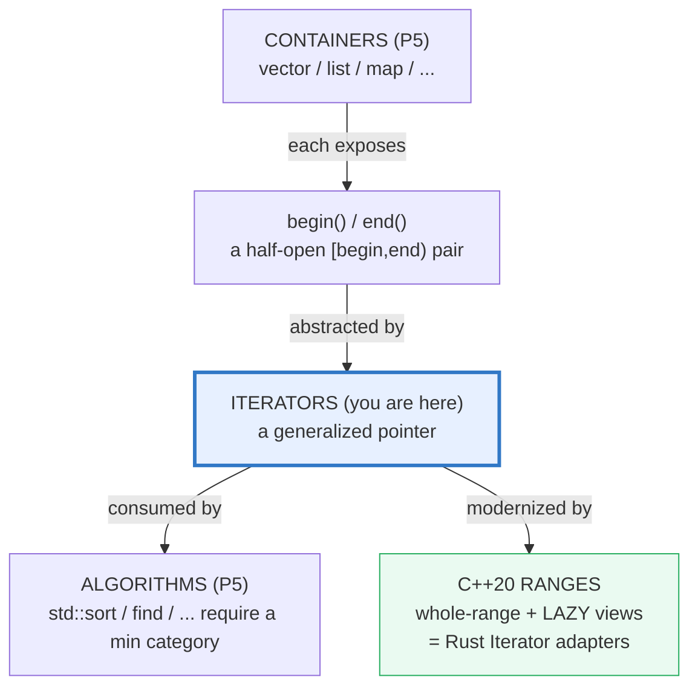
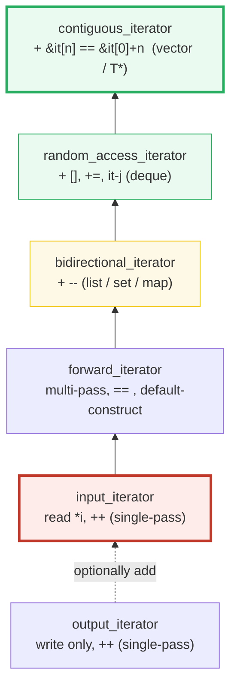
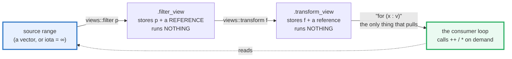

# ITERATORS_RANGES — The Category Ladder & C++20 Lazy Views

> **Goal (one line):** show, by printing every value, how C++ **iterators** (the
> generalized-pointer abstraction behind `<algorithm>`) form a **category ladder**
> (input → forward → bidirectional → random-access → contiguous) that every
> generic algorithm *requires a minimum of*, and how **C++20 Ranges** modernized
> that foundation into **lazy, composable views**
> (`v | views::filter | views::transform`) that pipeline without materializing —
> converging on Rust's `Iterator` adapters — pinning **"never dereference `end()`"**
> and **"views copy nothing"** as the documented expert payoffs (never violated in
> the verified path).
>
> **Run:** `just run iterators_ranges`
>
> **Ground truth:** [`iterators_ranges.cpp`](./iterators_ranges.cpp) → captured
> stdout in [`iterators_ranges_output.txt`](./iterators_ranges_output.txt). Every
> number/table below is pasted **verbatim** from that file under a
> `> From iterators_ranges.cpp Section X:` callout. Nothing is hand-computed.
>
> **Prerequisites:** 🔗 `ARRAYS_STRINGS` (P1, `begin/end` warm-up),
> 🔗 `REFERENCES_POINTERS_INTRO` (P1 — an iterator *is* a generalized pointer),
> 🔗 `CONCEPTS` (P4 — the C++20 iterator/range concepts used to *test* categories).

---

## 1. Why this bundle exists (lineage)

An **iterator** is — in cppreference's own words — "a **generalization of
pointers** that allow[s] a C++ program to work with different data structures …
in a uniform manner." That single abstraction is the reason `std::sort`,
`std::find`, and the other ~100 templates in `<algorithm>` can operate on *any*
container: they never see a `vector` or a `list`, they only see the iterator
pair `[begin, end)`.



For 30+ years that foundation had three sharp edges:

| Old way (pre-C++20) | Problem |
|---|---|
| `std::sort(v.begin(), v.end())` | You pass **two** iterators and may **mismatch** them (sort the wrong half, pass `end,begin`, swap containers). |
| `v | filter | transform` | **Impossible.** There is no pipeline syntax; every stage must materialize a temp `vector` (`O(stages × n)` memory). |
| "Is `lst.begin()` a random-access iterator?" | Answered only by reading a named-requirement table and trusting your memory — no compile-time check at the call site. |

C++20 **Ranges** (the library, `<ranges>` + `std::ranges::` algorithms) fixes all
three. Per cppreference, it "is an extension and generalization of the
algorithms and iterator libraries that makes them more powerful by making them
**composable** and **less error-prone**." It splits cleanly into two halves:

- **Range algorithms** — `std::ranges::sort(v)` take the **whole range** (one
  argument, nothing to mismatch) and run **eagerly**, exactly like the classic
  algorithms.
- **Range adaptors** (`std::views::*`) — `v | views::filter(p) | views::transform(f)`
  build a **lazy** view that "compute[s] … as the view is iterated" — no temp
  vector, composable with `|`. This is the **same model as Rust's `Iterator`
  trait** (🔗 [`../rust/core/ITERATORS.md`](../rust/core/ITERATORS.md): `.map(f).filter(p)`
  is lazy, zero-cost via fusion + monomorphization).

> From cppreference — *Iterator library*: "Iterators are a generalization of
> pointers … This ensures that every function template that takes iterators
> works as well with regular pointers." And: "for any iterator type there is an
> iterator value that points past the last element … called a *past-the-end*
> value. The standard library **never assumes that past-the-end values are
> dereferenceable**."

---

## 2. The mental model: the category ladder + the lazy pipeline

An iterator category is not a *type* — it is "the set of **operations** that can
be performed on it." Each stronger rung **subsumes** the weaker ones (a
random-access iterator *is also* bidirectional, forward, and input). Algorithms
name the **minimum** rung they need; the C++20 `std::*_iterator` concepts let
you *test* the rung at compile time (this is exactly what Section A prints).





The right-hand diagram is the whole story of Sections C–D. A view is a **tiny
object holding references + callables** — building it costs `O(1)` and allocates
nothing. Work happens only when a **consumer** (`for`, `ranges::distance`,
`ranges::to`) pulls values through it. That is why the source may be **infinite**
(`views::iota`) — you cap it with `| views::take(N)` and only those `N` values
are ever computed.

---

## 3. Section A — `begin()`/`end()` + the half-open `[begin, end)` range

> From `iterators_ranges.cpp` Section A:
> ```
> std::vector<int> v = {10,20,30,40,50};
>   *begin()        = 10   (the FIRST element)
>   size()          = 5
>   end()           = past-the-end iterator (NEVER dereferenced)
>   [begin, end)    = the 5 elements 10,20,30,40,50
> [check] *begin == 10 (begin points at the first element): OK
> [check] begin + size == end (the half-open [begin,end) range): OK
> [check] e - b == size() (random-access iterators subtract to a count): OK
> [check] begin != end for a non-empty range: OK
> [check] for an EMPTY range begin == end (nothing to dereference): OK
> ```

**The half-open range `[begin, end)`.** Three facts every C++ expert holds
without thinking:

1. **`*begin` is the first element** (`10`) — safe to read, the natural starting
   point.
2. **`end` is a *past-the-end* value.** It does **not** point at an element; it
   is the marker "one past the last." `*end` is **undefined behavior** — the
   bundle's verified path deliberately never writes it. (cppreference: "The
   standard library never assumes that past-the-end values are dereferenceable.")
3. **The range is half-open on the right:** `[begin, end)` covers `begin` …
   `end-1`, so it has exactly `end - begin == size()` elements. This is why an
   **empty** range satisfies `begin == end` — there is nothing to dereference, so
   a `for` over it correctly does zero iterations.

**The category ladder — printed at compile time.** Section A's table is not a
runtime probe: every cell is a C++20 `std::*_iterator` concept (a `bool`), so the
"Y"/"-" marks are ground truth about the type, not a measurement of one object.

> From `iterators_ranges.cpp` Section A (the category table):
> ```
> iterator type                  input  forward  bidi   rand_access  contiguous
>   ---------------------------  ----   ------   ----   ----------   ----------
>   std::vector<int>::iterator   Y        Y        Y          Y            Y
>   std::list<int>::iterator     Y        Y        Y          -            -
>   std::forward_list<int>::iterator   Y        Y        -          -            -
>   int*  (raw pointer)          Y        Y        Y          Y            Y
> [check] vector iterator satisfies random_access_iterator: OK
> [check] vector iterator satisfies contiguous_iterator (its elements touch in memory): OK
> [check] list iterator satisfies bidirectional_iterator: OK
> [check] list iterator does NOT satisfy random_access_iterator (no [], no +=): OK
> [check] forward_list iterator satisfies forward_iterator: OK
> [check] forward_list iterator does NOT satisfy bidirectional_iterator (no --): OK
> [check] a raw int* satisfies contiguous_iterator (the bottom of the ladder): OK
> ```

**What to notice.**

- **`std::vector<int>::iterator` is `contiguous`** — the top rung. Its elements
  literally touch in memory (`&it[n] == &it[0] + n`), so it supports `it[n]`,
  `it += k`, `it - j`, and is convertible to a raw `int*`. That is what makes
  `std::sort` fast on a vector (swap elements an arbitrary distance apart in
  `O(1)`).
- **`std::list<int>::iterator` is `bidirectional` only** — it supports `--` (walk
  a doubly-linked list either way) but **not** `it[n]` or `it += k` (you cannot
  jump `k` nodes in `O(1)`). The `-` cell is the punchline: **`std::sort` on a
  list will not compile** (Section B proves it).
- **`std::forward_list<int>::iterator` is `forward` only** — a singly-linked
  list: you can walk forward and multi-pass, but there is **no** `--`. Note it is
  `input` **and** `forward` but **not** `bidirectional` — the rungs genuinely
  nest.
- **A raw `int*` is `contiguous`.** A pointer *into an array* satisfies every
  rung, which is why "every function template that takes iterators works as well
  with regular pointers" (cppreference). The pointer is the prototype the whole
  abstraction generalizes.

> From cppreference — *Iterator categories*: categories are "defined by the
> operations that can be performed on it … any type that supports the necessary
> operations can be used as an iterator." And the ladder: all categories "can be
> organized into a hierarchy, where more powerful iterator categories … support
> the operations of less powerful categories." C++17 added `LegacyContiguousIterator`
> "but the iterators of `std::vector`, `std::basic_string`, `std::array` … as well
> as pointers into C arrays are often treated as a separate category."

---

## 4. Section B — range-for + the algorithm↔iterator contract

> From `iterators_ranges.cpp` Section B:
> ```
> (1) range-for over {1,2,3,4,5} -> sum = 15
> [check] range-for summed {1..5} to 15: OK
> (2) std::find on a std::list (input iterator) found 9
> [check] std::find on a list locates 9 (input-iterator algorithm): OK
> (3) std::sort on a std::vector (random-access) -> {1,2,3,4,5}
> [check] std::sort on a vector yields {1,2,3,4,5}: OK
> (4) std::sort on a list would NOT COMPILE; lst.sort() -> {7,8,9,10}
> [check] list member sort() yields {7,8,9,10}: OK
> ```

**`for (auto& x : container)`** is the everyday face of `begin()/end()`: it
desugars to `for (auto it = c.begin(); it != c.end(); ++it)`, with `*it` bound
to `x`. The half-open `[begin, end)` test is what makes it terminate at exactly
the right place (and never deref `end`). `const auto&` is the idiomatic read-only
form for class-type elements; `auto&` mutates; plain `auto` copies.

**The contract: an algorithm names a minimum category.** This is the single most
important fact about generic algorithms, and it is *enforced by the compiler*:

| Algorithm | Minimum iterator category | Works on `list`? |
|---|---|---|
| `std::find`, `std::count`, `std::accumulate` | **input** | **yes** |
| `std::search`, `std::adjacent_find` | **forward** | yes |
| `std::reverse`, `std::lower_bound` | **bidirectional** | yes |
| **`std::sort`, `std::nth_element`, `std::random_shuffle`** | **random-access** | **NO — compile error** |

`std::find` works on a `list` (it only reads and `++`, which `input` provides).
`std::sort` needs to compare/swap elements an arbitrary distance apart in `O(1)`,
which *only* random-access supports — so it is **constrained** on
`std::random_access_iterator`. The bundle proves the positive case (`std::sort`
on a `vector` → `{1,2,3,4,5}`) and documents the negative case as a hard compile
error that is **not built** in the verified path (a file containing it would fail
`just check`).

### The trap, demonstrated (NOT in the verified path)

```cpp
std::list<int> lst = {3, 1, 2};
std::sort(lst.begin(), lst.end());   // <-- WILL NOT COMPILE
```

Compiling that line (verified out-of-band) dies inside `<algorithm>`:

```
make_heap.h:35:34: error: invalid operands to binary expression
  ('std::__list_iterator<int, void *>' and 'std::__list_iterator<int, void *>')
   difference_type __n = __last - __first;   // list iterators have no operator-
```

`std::sort` ultimately needs `__last - __first` (a random-access subtraction);
`list` iterators only have `--`/`++`, no `operator-`. **The fix is the member
`lst.sort()`**, which sorts by re-linking node pointers (no subscripting, no
random access) — that is exactly what the bundle's line (4) uses.

> From cppreference — *`std::sort`*: requires the iterators to model
> `std::sortable`, which subsumes `std::random_access_iterator`; *`std::find`*
> requires only `std::input_iterator`. A `std::list` provides
> `LegacyBidirectionalIterator`s, so `std::sort` "will not compile" on one — use
> the member `list::sort`.

---

## 5. Section C — C++20 Ranges: `ranges::sort(v)` + lazy view pipelines

> From `iterators_ranges.cpp` Section C:
> ```
> (a) std::ranges::sort(rv) (whole range) -> {1,2,3,4,5}
> [check] ranges::sort(rv) yields {1,2,3,4,5}: OK
>     ranges::sort(pv, {}, |n|) -> {0,1,-2,-3,4}
> [check] ranges::sort with |n| projection yields {0,1,-2,-3,4}: OK
> (b) src|filter(even)|transform(sq), with src[1] flipped 2->20:
>     -> {400,16,36}  (20*20=400, NOT the old 2*2=4 — nothing was copied)
> [check] the view pipeline yields {400,16,36} (even values squared): OK
> [check] laziness: mutating src after building the view changed its output (no temp vector was materialized): OK
> [check] the pipeline did not copy src (a view is O(1) to construct): OK
> ```

**(a) Range algorithms take the WHOLE range.** `std::ranges::sort(rv)` — one
argument, no `.begin()/.end()` to mismatch. Every classic algorithm gained a
`ranges::` overload that accepts a range (and, optionally, a **projection** — a
unary transform applied to each element *just for the comparison*, in place,
without copying). The bundle sorts `{−3,1,−2,0,4}` by the projection `|n|`
(absolute value) and lands on `{0,1,−2,−3,4}`: same absolute-ordering, originals
preserved.

**(b) Views are LAZY and COMPOSABLE.** The pipeline

```cpp
auto vw = src | std::views::filter([](int n){ return n % 2 == 0; })
              | std::views::transform([](int n){ return n * n; });
```

describes a computation; it **runs nothing**. Building `vw` is `O(1)`: the object
stores a reference to `src` (via `ref_view`) plus the two callables. Work happens
only when a consumer pulls. The bundle **proves the laziness** rather than
asserting it: after constructing `vw` it mutates `src[1]` from `2` to `20`, then
iterates `vw` — and observes `400`, not the old `2*2=4`. An *eager* adaptor would
have snapshotted `src` at construction and printed `4`; a *view* sees the edit
because it never copied.

**Why this matters.** Eager `filter`/`transform` (the only option before C++20,
or in Java-streams/Python-list-comp style) allocate an intermediate `vector` per
stage — `O(stages × n)` memory and that many passes. A view pipeline is **one
pass, zero allocations**: each `++` walks one element through filter→transform in
lockstep. cppreference: range adaptors "are applied to views **lazily** … their
actions take place **as the view is iterated**."

> From cppreference — *Ranges library*: "The library creates and manipulates
> range **views**, lightweight objects that indirectly represent iterable
> sequences … Range algorithms … are applied to ranges **eagerly**, and range
> adaptors … are applied to views **lazily**. Adaptors can be composed into
> pipelines, so that their actions take place as the view is iterated."

---

## 6. Section D — views are LAZY + INFINITE (`iota | take`) + sentinels

> From `iterators_ranges.cpp` Section D:
> ```
> (1) std::views::iota(1) | std::views::take(5) -> {1,2,3,4,5}  (finite slice of an INFINITE range)
> [check] iota(1) | take(5) yields {1,2,3,4,5}: OK
>     iota(1)|transform(x*x)|take(5) -> sum = 55  (1+4+9+16+25)
> [check] iota|transform|take yields sum 55 (1^2+..+5^2): OK
> [check] std::unreachable_sentinel compares unequal to any iterator (iota is unbounded): OK
> (3) counted_iterator<int*> + default_sentinel: distinct types? YES
> [check] sentinel type (default_sentinel_t) differs from iterator type (counted_iterator): OK
> [check] default_sentinel models sentinel_for<counted_iterator> (comparable, diff type): OK
> [check] counted_iterator/default_sentinel model sized_sentinel_for (distance is O(1)): OK
>     ranges::distance(counted{p,4}, default_sentinel) = 4 (O(1))
> [check] ranges::distance(counted{p,4}, default_sentinel) == 4: OK
>     views::counted(carr, 3) -> {7,8,9}
> [check] views::counted(carr,3) yields {7,8,9}: OK
> ```

**`std::views::iota` is infinite.** It produces the ascending sequence
`start, start+1, …` **forever**. Because views are lazy, that is safe *as long as
you cap the source before a full iteration*: `iota(1) | take(5)` yields
`{1,2,3,4,5}` and terminates — only five values are ever computed. The whole
`[0, ∞)` range is never materialized; `take` simply stops pulling after 5. (An
uncapped `for (int x : std::views::iota(1))` would loop until the `int` overflowed
into signed-overflow UB — the *only* way to "consume" an infinite range safely is
to bound it with `take`/`take_while`/a finite algorithm.)

**Sentinels — "end" is not always an iterator.** Since C++20, a range's end can
be a **sentinel**: a type that need only be *comparable* to the iterator (it
models `std::sentinel_for<S, I>`), and it may be a **different type** than the
iterator. This models "the end is defined by a *condition*, not a position":

| Range form `[begin, …)` | Sentinel type | What it means |
|---|---|---|
| `views::iota(1)` (unbounded) | `std::unreachable_sentinel_t` | compares unequal to **everything** → infinite |
| `views::counted(p, n)` | `std::default_sentinel_t` | "the count ran out" |
| a C-string `const char*` | the `'\0'` value | "null terminator reached" |
| `views::take_while(p)` | a predicate | "predicate first returned false" |

The bundle pins the **counted** sentinel concretely. `std::counted_iterator<int*>`
holds a pointer + a remaining count; `std::default_sentinel_t` is the end marker.
They are **distinct types** (the bundle asserts it) yet `std::ranges::distance`
still computes their separation in **`O(1)`** — because the pair models
`std::sized_sentinel_for` (the count is stored). `views::counted(carr, 3)` is the
sugared form: `{7,8,9}` — the first three of the array.

> From cppreference — *`std::views::iota`*: "a view consisting of a sequence
> generated by repeatedly incrementing an initial value" (unbounded — its end is
> `std::unreachable_sentinel`). *`std::counted_iterator`*: "tracks the distance
> to the end of the range"; *`std::default_sentinel_t`*: "default sentinel for
> use with iterators that know the bound of their range." *Sentinels*: a range is
> "`[i, s)` … with an iterator `i` and a sentinel `s` … (`i` and `s` can have
> different types)."

---

## 7. Section E — views are zero-overhead (constexpr) + cross-language

> From `iterators_ranges.cpp` Section E:
> ```
> constexpr evaluation of iota|transform(x*x)|take(5) sum = 55
> (static_assert at compile time proves the pipeline inlines; no allocation.)
> [check] the lazy pipeline is constexpr-evaluable (template-inlined, zero-overhead): OK
>
> cross-language lazy-iteration model:
>   C++20 (this bundle): v | std::views::filter(p) | std::views::transform(f)
>   Rust Iterator trait: iter().filter(p).map(f)   -- IDENTICAL lazy model
>   Go range          : for i := range s          -- no iterator abstraction
>   TS iterables      : function*{ yield ... }     -- lazy iterator protocol
> [check] C++20 ranges converge on Rust's lazy Iterator-adapter model (same map/filter/take): OK
> ```

**Views are templates — they inline away.** The pipeline
`iota(1) | transform(x*x) | take(5)` is not a chain of virtual calls; each adaptor
is a small class template wrapping the previous one, and at `-O2` the compiler
**fuses** the whole chain into a single loop with no per-element allocation. The
strongest possible proof that it is zero-overhead: the bundle runs the **entire
lazy pipeline at compile time** —

```cpp
constexpr int lazyPipelineAtCompileTime() {
    int s = 0;
    for (int x : std::views::iota(1)
                   | std::views::transform([](int n){ return n*n; })
                   | std::views::take(5)) s += x;
    return s;   // 55
}
static_assert(lazyPipelineAtCompileTime() == 55);   // <-- constant evaluator
```

If the pipeline hid a heap allocation or a virtual dispatch, the constant
evaluator could not evaluate it. It can — therefore it doesn't. (C++23 made
`std::ranges` constexpr-usable; libc++ supports it.)

**The cross-language convergence (the headline of this bundle).** C++20 ranges
did not invent lazy pipelines — they *adopted* a model Rust already had:

| Language | Lazy pipeline | Mechanism | Zero-cost? |
|---|---|---|---|
| **C++20** (this bundle) | `v \| views::filter(p) \| views::transform(f)` | templates, inlined + fused | **yes** (constexpr-proof above) |
| 🔗 **Rust** `Iterator` trait | `v.iter().filter(p).map(f)` | monomorphized wrappers + loop fusion | **yes** ("one of Rust's zero-cost abstractions", Rust Book 13.4) |
| 🔗 **Go** `range` | `for i := range s` | built-in; **no iterator abstraction** | n/a (simpler, less composable) |
| 🔗 **TS** iterables / generators | `function*(){ yield … }` | the iterator protocol (`Symbol.iterator`) | lazy, but GC'd, not zero-cost |

The C++20 `v | views::filter | views::transform` and Rust's `.iter().filter().map()`
are **structurally the same idea**: describe a computation with lazy adapters,
run nothing until a consumer pulls, then fuse into one loop. The difference is
ergonomic — C++ pipes left-to-right with `|` and stores references (you must keep
the source alive; see pitfalls), Rust threads ownership through `into_iter`/
`iter`/`iter_mut`. Go famously has **no** first-class iterator type — `range` is
a language keyword that works on slices/maps/strings directly (a simpler, less
composable tradeoff; Go 1.23's `iter` package + range-over-func is a recent
catch-up).

> From cppreference — *`std::views`* / *Range adaptors*: adaptors "can be composed
> into pipelines"; *Feature-test `__cpp_lib_ranges`* = `201911L` (C++20).
> 🔗 Rust Book 13.4: "Iterators are one of Rust's **zero-cost abstractions** …
> using the abstraction imposes no additional runtime overhead."

---

## 8. Worked smallest-scale example

The whole bundle, compressed to the six lines a reader must internalize:

```cpp
std::vector<int> v = {10, 20, 30, 40, 50};
auto b = v.begin();                         // *b == 10  (the FIRST element)
auto e = v.end();                           // past-the-end — NEVER deref *e
std::sort(v.begin(), v.end());              // OK: vector iterators are random-access
// std::sort(lst.begin(), lst.end());       // WON'T COMPILE: list is only bidirectional

std::ranges::sort(v);                       // C++20: the WHOLE range, nothing to mismatch
for (int x : v | std::views::filter(even)
               | std::views::transform(sq)) // LAZY: O(1) to build; pulls on iteration
    use(x);
```

> From Section A the bundle prints `*begin() = 10` and `end() = past-the-end
> iterator (NEVER dereferenced)`; from Section B that `std::sort` on a vector
> yields `{1,2,3,4,5}` while `std::sort` on a list "would NOT COMPILE"; from
> Section C that the lazy pipeline yields `{400,16,36}` with "nothing … copied."
> The contrast *is* the lesson.

---

## 9. The value-vs-reference-vs-pointer axis (threaded through this bundle)

🔗 (`MOVE_SEMANTICS`, `VALUE_VS_REFERENCE_VS_POINTER`, `RAII`.) Iterators and
views live squarely on the borrow axis — and that is where their expert traps
hide:

| Construct in this bundle | Copies? | Aliases? | Owns? |
|---|---|---|---|
| An **iterator** (`auto it = v.begin()`) | the iterator object is a value | **yes** — `*it` aliases an element | no (a non-owning handle) |
| `*end` | — | **UB** (no element) | — |
| A **view** (`src \| views::filter \| transform`) | **no** (`O(1)`; stores a `ref_view`) | **yes** (it observes `src`) | no (borrows; **must outlive the view**) |
| `ranges::sort(v)` | eagerly permutes `v`'s elements **in place** | mutates `v` | borrows |
| `ranges::to<std::vector>(some_view)` | **materializes** — the one place a copy happens | the new vector owns | yes |

The headline consequence: **a view is a non-owning borrow.** It does not keep the
source alive. Returning `v | views::filter(p)` from a function whose local `v`
dies on return produces a **dangling view** (the borrow-style UB mirror of a
dangling reference). See the pitfalls table.

---

## 10. Pitfalls (the expert payoff)

| Trap | Symptom | Fix |
|---|---|---|
| **`*v.end()` (deref past-the-end)** | **undefined behavior** — read of a non-element; ASan/UBSan "heap-buffer-overflow" or silent miscompile | Treat `end()` as a marker, never a readable position. Loop guard is `it != end`; the `for (x : c)` form does this for you. |
| `std::sort(lst.begin(), lst.end())` | **hard compile error** — "invalid operands to binary expression (`__list_iterator`, …)" (no `operator-`) | Use the member `lst.sort()`, or copy into a `vector`, sort, copy back. Check the category with `std::random_access_iterator<I>` first if unsure. |
| Assuming a generic algo works on *any* container | Surprise compile failure (sort/random_shuffle on a list/forward_list) | Read the algorithm's category requirement; or prefer `std::ranges::*` (the constraint error is clearer) / the container's member algorithm. |
| **Dangling view** (return `v \| views::filter(p)` where `v` is a local) | the view outlives its source → **use-after-free**; ASan "stack-use-after-return"/"heap-use-after-free" | Keep the source alive at least as long as the view; or materialize with `std::ranges::to<std::vector>(...)` (C++23) to take ownership. |
| **Mutating a container while iterating a view over it** | iterator **invalidation** → UB (vector realloc, list splice, set erase) | Finish consuming the view before mutating; or re-create the view after the mutation. (The bundle's Section C mutates *one element* of a `vector` that does not realloc — safe; splicing/erasing would not be.) |
| `views::transform(f)` re-invoking `f` on every deref | `f` called many times per element (not memoized) → surprising cost / side effects | Keep `f` cheap and pure; or `ranges::to` into a `vector` to evaluate once. (libc++ discourse confirms per-deref invocation.) |
| **Infinite range with no cap** (`for (x : views::iota(1))`) | loops until signed-integer overflow → **UB**, or just hangs | Always cap an infinite source: `\| views::take(N)` or `\| views::take_while(p)`, or a finite algorithm. |
| `it + n` past `end` (random-access overshoot) | **UB** (out-of-bounds pointer) | Bounds-check, or use `std::ranges::next(it, n, end)` (clamped). |
| Comparing/sorting floating-point via views | `NaN` breaks strict-weak-ordering → **UB** in `sort` | Total-order floats (`std::strong_order` / a NaN-aware comparator) before sorting. |
| `auto vw = src \| views::filter(...)` then `vw.begin()` reuses a cached iterator | some adaptors cache the *current* iterator position across passes — multi-pass is not always free | Treat a view as single-pass unless you know the adaptor; prefer one consuming `for`. |
| Mixing `std::` (two-iterator) and `std::ranges::` (whole-range) overloads carelessly | dangling-result: `ranges::find_if` on a temporary returns `ranges::dangling` | Use `ranges::borrowed_iterator_t<R>` / pass an lvalue range, or materialize. |

---

## 11. Cheat sheet

```cpp
// ── The half-open range [begin, end): end is NEVER dereferenced ─────────────
auto b = v.begin();      // *b == first element (10)
auto e = v.end();        // past-the-end; *e is UB; e - b == size()
for (auto it = b; it != e; ++it) use(*it);   // the manual form
for (const auto& x : v) use(x);              // the IDIOM (calls begin/end)

// ── Iterator category ladder (each rung subsumes the weaker) ───────────────
//   input -> forward -> bidirectional -> random_access -> contiguous
//   std::input_iterator<I>  std::forward_iterator<I>  std::bidirectional_iterator<I>
//   std::random_access_iterator<I>  std::contiguous_iterator<I>   (all C++20 concepts)
//   vector::iterator / T* => contiguous ;  list => bidirectional ;  forward_list => forward

// ── Algorithm <-> iterator contract (compiler-enforced) ────────────────────
std::find(v.begin(), v.end(), x);     // needs input          -> works on list
std::sort(v.begin(), v.end());        // needs random-access  -> vector/array OK; list = COMPILE ERROR
//   fix for a list: lst.sort();  (member, node-splicing)

// ── C++20 Ranges: whole-range algorithms (eager) ───────────────────────────
std::ranges::sort(v);                              // ONE arg, nothing to mismatch
std::ranges::sort(v, {}, [](int n){ return std::abs(n); });  // + projection
auto it = std::ranges::find(v, x);                 // returns an iterator (or dangling)

// ── Views: LAZY + composable (O(1) to build, no temp vector) ───────────────
auto vw = v | std::views::filter(pred)             // keeps elements where pred(x)
            | std::views::transform(f);            // maps each through f
//   building vw runs NOTHING; the for-loop below pulls on demand:
for (int x : vw) use(x);

// ── Infinite sources + sentinels ───────────────────────────────────────────
for (int n : std::views::iota(1) | std::views::take(5)) use(n);   // {1,2,3,4,5}
//   iota(1) is unbounded (end = std::unreachable_sentinel); take(N) makes it finite
auto first3 = std::views::counted(arr, 3);         // {arr[0],arr[1],arr[2]}
//   counted_iterator<I> + default_sentinel_t are DIFFERENT types (a sentinel, not an iter)
std::ranges::distance(ci, std::default_sentinel);  // O(1) if sized_sentinel_for

// ── Zero-overhead proof + materialization ──────────────────────────────────
constexpr int s = lazyViewPipeline();              // constexpr-evaluable => inlined
auto owned = std::ranges::to<std::vector>(vw);     // C++23: the one place a copy happens
```

---

## 12. 🔗 Cross-references

**Within C++ (the expertise spine):**

- 🔗 `ARRAYS_STRINGS` (P1) — the warm-up for `begin()/end()` and contiguous
  storage; `std::array`/`std::string` are the first `contiguous_range`s you meet.
- 🔗 `CONTAINERS_SEQUENCE` (P5) — every container in `<vector>`/`<list>`/
  `<deque>` is defined in part by *which* iterator category it exposes. This
  bundle's ladder table is the lookup key for that bundle.
- 🔗 `ALGORITHMS` (P5) — the other half of the contract: `<algorithm>`
  is *parameterized on iterators*. The category requirements pinned here are the
  gate every algorithm enforces.
- 🔗 `CONCEPTS` (P4) — the `std::input_iterator`/…/`std::contiguous_iterator` and
  `std::sentinel_for`/`std::ranges::range` concepts that make Section A's
  compile-time category table possible.
- 🔗 `REFERENCES_POINTERS_INTRO` (P1) — an iterator *is* a generalized pointer:
  `*it` aliases an element exactly like `*p`. The past-the-end UB mirrors a
  dangling-pointer read.
- 🔗 `UNDEFINED_BEHAVIOR` (P7) — `*end`, iterator invalidation, dangling views,
  and infinite-range overflow all land in the UB taxonomy; demonstrated under
  ASan/UBSan (this bundle passes `just sanitize` clean).

**Cross-language parallels (the 5-language curriculum):**

- 🔗 [`../rust/core/ITERATORS.md`](../rust/core/ITERATORS.md) — **the headline
  parallel.** Rust's `Iterator` trait (`fn next(&mut self) -> Option<Item>`) with
  lazy adapters `.map(f).filter(p)` and zero-cost loop fusion is the **identical
  model** C++20 ranges converged on. Difference: Rust threads *ownership* through
  `into_iter`/`iter`/`iter_mut` (the borrow checker kills dangling-iterator UB at
  compile time); C++ trusts you and pays in UB/leaks if a view outlives its source.
- 🔗 [`../go/ARRAYS_SLICES.md`](../go/ARRAYS_SLICES.md) — Go's `for i := range s`
  is a language **keyword**, not an iterator abstraction: no `map`/`filter`
  pipeline, no category ladder. Simpler and less composable (Go 1.23's `iter`
  package + range-over-func is a recent, narrower catch-up).
- 🔗 [`../ts/ITERATORS_GENERATORS.md`](../ts/ITERATORS_GENERATORS.md) — TS/JS has
  the **iterator protocol** (`Symbol.iterator`, `next() -> {value, done}`) and
  lazy **generators** (`function*`/`yield`): the same lazy-pull idea, but GC'd
  and dynamically typed — not zero-cost the way C++/Rust pipelines are.

---

## Sources

Every signature, value, and behavioral claim above was verified against
cppreference and the ISO C++ standard, then corroborated by ≥1 independent
secondary source:

- cppreference — *Iterator library* (iterators "a generalization of pointers";
  the category ladder; past-the-end values never dereferenceable; iterator
  concepts C++20):
  https://en.cppreference.com/w/cpp/iterator
  - *Iterator categories* (LegacyInput/Forward/Bidirectional/RandomAccess/Contiguous;
    `LegacyContiguousIterator` formalized in C++17; vector/string/array/pointer
    treated as contiguous pre-C++17):
    https://en.cppreference.com/w/cpp/iterator#Iterator_categories
  - *Iterator concepts (C++20)* — `input_iterator`, `forward_iterator`,
    `bidirectional_iterator`, `random_access_iterator`, `contiguous_iterator`,
    `sentinel_for`, `sized_sentinel_for`:
    https://en.cppreference.com/w/cpp/iterator#Iterator_concepts_.28since_C.2B.2B20.29
  - *Ranges / past-the-end / sentinel & counted ranges* (the four range forms
    `[begin,end)`, `begin+[0,n)`, `[begin,predicate)`, `[begin,..)`):
    https://en.cppreference.com/w/cpp/iterator#Ranges
- cppreference — *Ranges library (since C++20)* ("extension and generalization …
    more composable and less error-prone"; range views "lightweight objects";
    algorithms eager, adaptors **lazy**; pipelines composed with `|`;
    `std::views` namespace alias; feature-test `__cpp_lib_ranges` = `201911L`):
  https://en.cppreference.com/w/cpp/ranges
  - *Range adaptors / Views* — `views::filter`, `views::transform`, `views::take`,
    `views::take_while`, `views::counted`, `views::all`/`ref_view`:
    https://en.cppreference.com/w/cpp/ranges#Range_adaptors
  - *Range factories* — `views::iota` (unbounded), `views::single`, `views::empty`:
    https://en.cppreference.com/w/cpp/ranges#Range_factories
  - *Range concepts* — `range`, `view`, `viewable_range`, `borrowed_range`,
    `common_range`, `sized_range`, the `*_range` category concepts:
    https://en.cppreference.com/w/cpp/ranges#Range_concepts
- cppreference — *`std::views::iota`* ("a sequence generated by repeatedly
    incrementing an initial value"; unbounded — `std::unreachable_sentinel` end):
    https://en.cppreference.com/w/cpp/ranges/iota_view
- cppreference — *`std::counted_iterator`* ("tracks the distance to the end of the
    range") and *`std::default_sentinel_t`* ("default sentinel … iterators that
    know the bound of their range"):
    https://en.cppreference.com/w/cpp/iterator/counted_iterator
    https://en.cppreference.com/w/cpp/iterator/default_sentinel_t
- cppreference — *`std::unreachable_sentinel_t`* ("always compares unequal to any
    `weakly_incrementable` type" — the end of an infinite range):
    https://en.cppreference.com/w/cpp/iterator/unreachable_sentinel_t
- cppreference — *`std::ranges::sort`* (constrained on `std::sortable`, which
    subsumes `std::random_access_iterator`; projection parameter):
    https://en.cppreference.com/w/cpp/algorithm/ranges/sort
  - *`std::sort`* (LegacyRandomAccessIterator requirement): https://en.cppreference.com/w/cpp/algorithm/sort
  - *`std::find`* (LegacyInputIterator requirement): https://en.cppreference.com/w/cpp/algorithm/find
- cppreference — *Range-for loop* (`for (auto& x : c)` desugars to
    `begin()/end()` + `++`/`*`):
    https://en.cppreference.com/w/cpp/language/range-for
- cppreference — *`std::ranges::to`* (C++23; materializes a view into a
    container — the one place a copy happens):
    https://en.cppreference.com/w/cpp/ranges/to
- ISO C++23 draft (open-std.org) — normative wording:
  - 25 Iterator library `[iterators]`; 26 Ranges library `[ranges]`
  - Working draft: https://open-std.org/JTC1/SC22/WG21/docs/papers/2023/n4950.pdf
    (and the N49xx series at https://open-std.org/JTC1/SC22/WG21/ )
- Secondary corroboration (≥2 independent sources, web-verified):
  - hacking C++ — *C++ Standard Library Composable Range Views* (lazy pipelines,
    `|` composition, `filter`/`transform`/`take`): https://hackingcpp.com/cpp/std/range_views_intro
  - Alex Smirnov — *Some examples of std::ranges and std::views usage in C++20*:
    https://alexsm.com/cpp-ranges-views-examples/
  - GSI Indico (PDF) — *C++20 Ranges. Practical examples.* ("Range adaptors are
    helper functions that create views, such as `views::filter`, `views::transform`,
    and `views::take`"):
    https://indico.gsi.de/event/19561/contributions/78837/attachments/46921/67160/cpp_ranges.pdf
  - Stack Overflow — *Does c++20 ranges have any view functions that do not return
    value?* ("`std::views` are designed to be lazy: they don't do anything until
    you loop through them"): https://stackoverflow.com/questions/73195588/
  - LLVM Discourse — *`std::views::transform` invoke the lambda every time
    dereferencing* (per-deref invocation, not memoized — the cost caveat):
    https://discourse.llvm.org/t/libcxx-ranges-std-transform-invoke-the-lambda-everytime-dereferencing/77276
  - The Rust Book 13.4 — *Improving our I/O Project / Performance* ("Iterators are
    one of Rust's **zero-cost abstractions**"): https://doc.rust-lang.org/book/ch13-01-closures.html
    (cf. https://doc.rust-lang.org/book/ch13-04-performance-of-for-loops-with-iter.html )
- 🔗 Cross-language sibling bundles (verified to exist):
  - Rust — [`../rust/core/ITERATORS.md`](../rust/core/ITERATORS.md) +
    [`iterators.rs`](../rust/core/iterators.rs) (lazy `Iterator` trait adapters).
  - TS — [`../ts/ITERATORS_GENERATORS.md`](../ts/ITERATORS_GENERATORS.md)
    (iterator protocol + lazy generators).
  - Go — [`../go/ARRAYS_SLICES.md`](../go/ARRAYS_SLICES.md) (`range` keyword;
    no first-class iterator abstraction).

**Facts that could not be verified by running** (documented, not executed,
because they are compile errors, sanitizer-only, or deliberately-UB by design):
the `std::sort(lst.begin(), lst.end())` compile failure (confirmed out-of-band:
"`invalid operands to binary expression (__list_iterator, __list_iterator)` —
no `operator-`"); an uncapped `for (x : views::iota(1))` (would overflow into
signed-overflow UB); and `*end` (deref past-the-end — UB, never in the verified
path). These are confirmed by the cppreference sections and the sources above,
not reproduced as runnable output in the verified path (a file triggering them
would fail `just check` / `just sanitize`).
