# MODERNIZATION — From C++98/03 to Modern C++ (C++11→23→26)

> **Goal (one line):** by asserting feature-test-macro values and running
> old-vs-modern before/after code shapes, show how C++ evolves
> (98/03/11/14/17/20/23/26) and how the `modernize-*` migration (raw `new`→smart
> pointers, manual loop→range-for, C array→`std::array`, macro→`constexpr`,
> explicit→`auto`, copy→move, SFINAE→concepts, `null`→`nullptr`) fixes whole bug
> classes — **the modern version is the one that runs in the verified path.**
>
> **Run:** `just run modernization`
>
> **Ground truth:** [`modernization.cpp`](./modernization.cpp) → captured stdout in
> [`modernization_output.txt`](./modernization_output.txt). Every number/table
> below is pasted **verbatim** from that file under a
> `> From modernization.cpp Section X:` callout. Nothing is hand-computed.
>
> **Prerequisites:** 🔗 [`VALUES_TYPES.md`](./VALUES_TYPES.md) (value-init, `const`/
> `constexpr`) and the value/ref/pointer trichotomy. This bundle ties them
> together into "why C++11 was a revolution and what to do about pre-11 code."

---

## 1. Why this bundle exists (lineage)

C++ is unique in this curriculum: it has **accrued idioms for ~28 years** under
one (backward-compatible) language. "Modern C++" means **C++11 onward** — the
revision that added `auto`, smart pointers, move semantics, lambdas, range-for,
`constexpr`, and a threading model, then refined them through 14/17/20 and 23.
Pre-11 C++ ("C++98/03") is a *different dialect*: manual `new`/`delete`, index
loops, C arrays, macros-as-constants, copy-everywhere, SFINAE, bare `0`/`NULL`
for null pointers. Migrating from the old dialect to the new **fixes whole
classes of bugs at once** (leaks → RAII; off-by-one loops → range-for; macro
pitfalls → `constexpr`; surprising overloads → `nullptr`). clang-tidy's
`modernize-*` module automates much of the rewrite.

```mermaid
graph LR
    C98["C++98<br/>(1998) first std<br/>STL, templates, exceptions"] --> C03["C++03<br/>(2003) minor<br/>value-init"]
    C03 --> C11["C++11 *** BIG LEAP ***<br/>auto, smart ptrs, move,<br/>lambda, range-for, constexpr,<br/>threading, nullptr"]
    C11 --> C14["C++14<br/>make_unique, generic lambda,<br/>relaxed constexpr"]
    C14 --> C17["C++17<br/>string_view, optional, variant,<br/>if constexpr, CTAD, structured bindings"]
    C17 --> C20["C++20<br/>concepts, ranges, coroutines,<br/>modules, &lt;=&gt;, constinit"]
    C20 --> C23["C++23 (CURRENT)<br/>expected, print, mdspan,<br/>deducing-this"]
    C23 --> C26["C++26 (upcoming)<br/>reflection, contracts,<br/>erroneous behaviour"]
    style C11 fill:#fef9e7,stroke:#f1c40f,stroke-width:3px
    style C23 fill:#e7f0ff,stroke:#3178c6,stroke-width:3px
    style C26 fill:#eafaf1,stroke:#27ae60,stroke-dasharray:4 3
```



The headline contrast across the 5-language curriculum — every language has a
"modernization" story, but C++'s is by far the largest:

| Language | "Modernize" migration? | Why |
|---|---|---|
| **C++** (this bundle) | **yes — decades of idiom churn** | one backward-compatible language; C++11 was a revolution; legacy C++03 still ships |
| 🔗 [`../rust/`](../rust/) | **no — stable since 1.0** | Rust *editions* (2015/18/21/24) are opt-in and never break old code |
| 🔗 [`../go/`](../go/) | **no — Go 1 compat promise** | "Go 1 programs will continue to work forever" |

```mermaid
graph TD
    OLD["LEGACY (C++98/03)"] -->|"raw new/delete"| LEAK["leaks, double-free, exception-unsafe"]
    OLD -->|"manual index loop"| OBO["off-by-one, wrong end()"]
    OLD -->|"C array"| DECAY["decays to ptr, loses size"]
    OLD -->|"#define MACRO"| UNTP["untyped, unscoped, redefinition"]
    OLD -->|"copy everywhere"| SLOW["expensive deep copies"]
    OLD -->|"SFINAE enable_if"| WALL["unreadable template errors"]
    OLD -->|"0 / NULL"| AMBIG["surprising overload resolution"]
    MOD["MODERN (C++11→23)"] -->|"make_unique / smart ptr"| RAIISAFE["RAII: auto-free, exception-safe"]
    MOD -->|"range-for / ranges"| SAFELOOP["no index, no end() bug"]
    MOD -->|"std::array / vector"| KNOWNSIZE["keeps size(), no decay"]
    MOD -->|"constexpr / inline"| TYPEDC["typed, scoped, debuggable"]
    MOD -->|"std::move + RVO"| CHEAPMOVE["cheap move / zero-copy elision"]
    MOD -->|"concepts + if constexpr"| READABLE["named, readable constraints"]
    MOD -->|"nullptr"| UNAMBIG["typed std::nullptr_t"]
    style OLD fill:#fdecea,stroke:#c0392b
    style MOD fill:#eafaf1,stroke:#27ae60,stroke-width:3px
```



> From cppreference — *History of C++*: C++98 (ISO/IEC 14882:1998) was the first
> standard; C++03 was "a minor revision, intended to be little more than a
> technical corrigendum"; C++11 introduced "a large number of changes … to both
> standardize existing practices and improve the abstractions"; C++17 was "the
> major revision of the C++ standard after C++11"; C++20 "the major revision …
> after C++17."

---

## 2. Section A — The timeline (98→26) + feature-test macros

> From `modernization.cpp` Section A:
> ```
> __cplusplus = 202302  -> C++23 (202302L) on this compiler
> [check] __cplusplus == 202302 (C++23): OK
>
> Standard  Year     ISO / era
> --------  ----     -------------------------------------------------
> C++98     1998     ISO/IEC 14882:1998  first standard (STL, templates, exceptions, bool)
> C++03     2003     ISO/IEC 14882:2003  minor revision (defines value initialization)
> C++11     2011     ISO/IEC 14882:2011  *** BIG LEAP *** auto, smart ptrs, move, lambda, range-for
> C++14     2014     ISO/IEC 14882:2014  minor (make_unique, generic lambda, relaxed constexpr)
> C++17     2017     ISO/IEC 14882:2017  major (string_view, optional, variant, if constexpr, CTAD)
> C++20     2020     ISO/IEC 14882:2020  major (concepts, ranges, coroutines, modules, <=>)
> C++23     2024     ISO/IEC 14882:2024  expected, print, mdspan, deducing-this
> C++26     upcoming n5046 (draft)      reflection, contracts, erroneous behaviour
>
> "modern C++" = C++11 onward. C++23 is the CURRENT standard (this bundle).
>
> Feature-test macros (real values on THIS compiler):
>   LANGUAGE features (predefined):
>   __cpp_lambdas              = 200907    C++11 lambdas
> [check] __cpp_lambdas defined (>= 200907, C++11): OK
>   __cpp_range_based_for      = 202211    C++11 range-for
> [check] __cpp_range_based_for defined (>= 200907, C++11): OK
>   __cpp_rvalue_references    = 200610    C++11 move semantics
> [check] __cpp_rvalue_references defined (>= 200610, C++11): OK
>   __cpp_constexpr            = 202211    C++11, refined through C++23
> [check] __cpp_constexpr defined (>= 202207, C++23): OK
>   __cpp_if_constexpr         = 201606    C++17 if constexpr
> [check] __cpp_if_constexpr defined (>= 201606, C++17): OK
>   __cpp_structured_bindings  = 202403    C++17 (DR value)
> [check] __cpp_structured_bindings defined (>= 201606, C++17): OK
>   __cpp_deduction_guides     = 201703    C++17 CTAD
> [check] __cpp_deduction_guides defined (>= 201703, C++17): OK
>   __cpp_concepts             = 202002    C++20 concepts
> [check] __cpp_concepts defined (>= 202002, C++20): OK
>   __cpp_constinit            = 201907    C++20 constinit
> [check] __cpp_constinit defined (>= 201907, C++20): OK
>   LIBRARY features (from <version>):
>   __cpp_lib_make_unique      = 201304    C++14 std::make_unique
> [check] __cpp_lib_make_unique defined (>= 201304, C++14): OK
>   __cpp_lib_string_view      = 201803    C++17 std::string_view
> [check] __cpp_lib_string_view defined (>= 201606, C++17): OK
>   __cpp_lib_ranges           = 202211    C++20 ranges (C++23 value here)
> [check] __cpp_lib_ranges defined (>= 201911, C++20): OK
>   __cpp_lib_expected         = 202211    C++23 std::expected
> [check] __cpp_lib_expected defined (>= 202211, C++23): OK
>   __cpp_lib_print            = 202207    C++23 std::print
> [check] __cpp_lib_print defined (>= 202207, C++23): OK
>   __cpp_lib_mdspan           = 202207    C++23 std::mdspan
> [check] __cpp_lib_mdspan defined (>= 202207, C++23): OK
>
> Note: `nullptr` is a keyword (C++11) with NO __cpp_nullptr macro
>       (keywords need no feature-test macro; detect via __cplusplus).
> [check] nullptr available: __cplusplus >= 201103L (C++11): OK
> ```

**`__cplusplus` is the master switch.** It expands to a `long` literal of the
form `YYYYMML`; `202302L` ⇒ C++23 (what this bundle compiles to). **Pinned here
at `202302L`** for determinism — the very first `[check]` asserts it.

**Feature-test macros (since C++20, SD-6).** The standard defines a set of
preprocessor macros — one per language/library feature — each expanding to the
`YYYYMM` it was added to the working draft. They are **the portable way** to
detect a feature without guessing the compiler:

```cpp
#if defined(__cpp_lib_expected) && __cpp_lib_expected >= 202211L
    // safe to use std::expected (C++23)
#endif
```

- **Language macros** (`__cpp_*`) are **predefined** in every TU (no include):
  `__cpp_concepts`, `__cpp_constexpr`, `__cpp_if_constexpr`, …
- **Library macros** (`__cpp_lib_*`) come from [`<version>`](https://en.cppreference.com/w/cpp/header/version)
  (and the header that ships the feature): `__cpp_lib_expected`,
  `__cpp_lib_make_unique`, `__cpp_lib_ranges`, …

The bundle prints the **real values on this compiler** (Apple clang 17) and
asserts each is present. Note two subtleties the `[check]`s expose:

1. **A macro's value can be newer than its standard.** `__cpp_structured_bindings`
   prints `202403` (a C++26 DR value) even though structured bindings are C++17 —
   a Defect Report backported the fix. The portable test is `>= 201606L` (the
   C++17 value), never `==`.
2. **`nullptr` has NO `__cpp_nullptr` macro.** It is a *keyword* (since C++11),
   and keywords need no feature-test macro — detect it via `__cplusplus >=
   201103L`. (Forgetting this is a common copy-paste mistake.)

> From cppreference — *Feature testing*: "The standard defines a set of
> preprocessor macros corresponding to C++ language and library features
> introduced in C++11 or later. They are intended as a simple and portable way to
> detect the presence of said features." Each "expands to an integer literal
> corresponding to the year and month when the corresponding feature has been
> included in the working draft."

---

## 3. Section B — OLD vs MODERN: before/after idioms

> From `modernization.cpp` Section B:
> ```
> (1) raw new/delete  ->  std::unique_ptr / std::make_unique
>     auto p = std::make_unique<int>(42);   -> *p = 42
> [check] make_unique holds the value: OK
> [check] inner unique_ptr holds 7: OK
> [check] unique_ptr is RAII: no explicit delete needed (freed at scope end): OK
>
> (2) manual index loop  ->  range-for (C++11)
>     sum via index loop = 15 ; sum via range-for = 15
> [check] range-for equals index loop (== 15): OK
>
> (3) C array  ->  std::array / std::vector
>     std::array<int,3> = {10,20,30};  size()=3  sum=60
> [check] std::array keeps its size (3): OK
> [check] std::array sum == 60: OK
>
> (4) #define constant  ->  constexpr
>     constexpr int bufsize = 256;  -> sizeof(buf) = 1024 bytes
> [check] constexpr usable as array bound (bufsize == 256): OK
> [check] buf spans 256 ints and ends are set: OK
>
> (5) explicit type  ->  auto
>     auto it = v.cbegin();   -> *it = 1  (no long type name)
> [check] auto deduces the iterator; *it == 1: OK
> ```

The five foundational modernizations, each as a runnable before→after:

**(1) raw `new`/`delete` → `unique_ptr`/`make_unique`.** The legacy shape
(`int* p = new int(42); ...; delete p;`) is leak-prone: forget the `delete`, or
throw between `new` and `delete`, and you leak. The modern shape is **RAII** —
`std::unique_ptr` frees in its destructor, so scope exit (normal *or*
exceptional) always cleans up. 🔗 `RAII.md` (P3) is the mechanism; 🔗
`UNIQUE_PTR.md` (P3) is the type. `std::make_unique<T>(args...)` (C++14,
`__cpp_lib_make_unique >= 201304L`) is preferred over `std::unique_ptr<T>(new T)`
because it avoids a bare `new` and (for arrays) a leak window.

**(2) manual index loop → range-for.** `for (size_t i = 0; i < v.size(); ++i)`
has three places to go wrong (init/comparison/increment) plus the classic
`!=` vs `<` and the wrong `end()`. `for (auto x : v)` has **none**: no index, no
end check, no off-by-one. The `[check]` proves both compute `15`.

**(3) C array → `std::array`/`std::vector`.** `int carr[3]` **decays** to `int*`
on nearly every use, silently losing its size and breaking `sizeof`/range-for.
`std::array<int,3>` is a fixed-size aggregate that **knows its size**
(`arr.size() == 3`) and never decays — the bundle asserts it. For a size that
changes, `std::vector` is the modern answer (heap, RAII).

**(4) `#define` → `constexpr`.** A macro "constant" is untyped, unscoped, has no
symbol in the debugger, and redefinition silently differs. `constexpr int
bufsize = 256` is **typed, scoped, debuggable**, and still usable as an array
bound (`int buf[bufsize]` — the `[check]` confirms `sizeof(buf) == 1024`). At
namespace scope, reach for **`inline constexpr`** (C++17) to share one definition
across TUs.

**(5) explicit type → `auto`.** Spelling `std::vector<int>::const_iterator it =
v.cbegin();` is noise; `auto it = v.cbegin();` deduces the same type. The
**value-vs-reference axis** matters here (🔗 `TYPE_DEDUCTION` P2): plain `auto`
**copies**, `const auto&` reads through a reference (the idiomatic range-for
form), `auto&` mutates through one.

---

## 4. Section C — copy→move, SFINAE→concepts, null→nullptr

> From `modernization.cpp` Section C:
> ```
> (1) copy-everywhere  ->  std::move + guaranteed copy elision (C++17)
>     Tracker cp = src;            -> copies=1 moves=0  (a copy)
> [check] copy incremented copies, not moves: OK
>     Tracker mv = std::move(cp);  -> copies=0 moves=1  (a cheap move)
> [check] std::move incremented moves, not copies: OK
> [check] moved-into payload is readable (42): OK
>     Tracker rvo = make_tracker(7); -> copies=0 moves=0  (C++17 GUARANTEED elision)
> [check] guaranteed copy elision: no copy, no move: OK
> [check] RVO value == 7: OK
>
> (2) SFINAE (enable_if)  ->  concepts (C++20) + if constexpr (C++17)
>     sfinae_double(21) = 42   concept_double(21) = 42
> [check] SFINAE and concept versions agree (== 42): OK
>     if constexpr: modern_value<int>(5) = 10, modern_value<double>(2.0) = 2.0
> [check] if constexpr integral branch doubles the value (5 -> 10): OK
> [check] if constexpr non-integral branch passes through (2.0 -> 2.0): OK
>
> (3) naked null (0 / NULL)  ->  nullptr (typed)
>     const int* np = nullptr;   -> (np == nullptr) : true
> [check] nullptr is a null pointer: OK
>     call_kind(nullptr) = 1 (POINTER) ; call_kind(0) = 0 (INT)
> [check] nullptr selects the POINTER overload: OK
> [check] bare 0 selects the INT overload (the NULL/0 footgun): OK
> ```

**(1) copy-everywhere → move + guaranteed copy elision.** The `Tracker` type
counts copies vs moves. Three deterministic measurements:

- `Tracker cp = src;` → **`copies=1, moves=0`** — a (potentially expensive) deep
  copy, the *only* option in C++03.
- `Tracker mv = std::move(cp);` → **`copies=0, moves=1`** — `std::move` casts to
  an rvalue reference so the **move constructor** runs: a cheap ownership
  transfer (here just an `int` swap; for `std::string`/`std::vector` it is a
  pointer swap, O(1)). 🔗 `MOVE_SEMANTICS.md` (P3).
- `Tracker rvo = make_tracker(7);` → **`copies=0, moves=0`** — **guaranteed copy
  elision** (C++17, P0135). Returning a prvalue initializes the caller's object
  *directly*; there is no temporary to copy or move. This is **mandatory** (not
  an optimization), so the RVO modernization is a *correctness* guarantee, not a
  performance hope.

**(2) SFINAE → concepts + `if constexpr`.** Two replaces for template
metaprogramming:

- **SFINAE → concepts.** The C++11 shape (`template<class T, class =
  enable_if_t<is_integral_v<T>>>`) hides the constraint inside a default
  template argument and produces walls of substitution-failure text. The C++20
  shape (`template<std::integral T>`) names the constraint **on `T`**, reads
  like prose, and gives short, pointable errors. The `[check]` proves both
  compute `42`. 🔗 `CONCEPTS.md` (P2).
- **SFINAE dispatch → `if constexpr`.** The C++17 `if constexpr (...)` selects a
  branch at **compile time**, discarding the other branch entirely. This even
  lets each instantiation have a *different return type* (`int` vs `double`
  here) — impossible with a runtime `if`. `modern_value<int>(5) == 10`,
  `modern_value<double>(2.0) == 2.0`.

**(3) `0`/`NULL` → `nullptr`.** The bundle proves *why* `nullptr` replaced
`NULL`/`0` with an overload-set test:

```cpp
int call_kind(int);      int call_kind(char*);
call_kind(nullptr);      // -> POINTER overload (nullptr_t converts to char*)
call_kind(0);            // -> INT overload      (0 is an int; classic NULL footgun)
```

`0`/`NULL` is a null-pointer *constant* but also an `int`, so `f(0)` ambiguously
binds `f(int)` — the source of decades of bugs. `nullptr` has the dedicated type
`std::nullptr_t` and converts to *any* pointer (never to `int`), so it
unambiguously selects the pointer overload. The `[check]`s pin both outcomes.

---

## 5. Section D — clang-tidy `modernize-*` + backward-compat

> From `modernization.cpp` Section D:
> ```
> clang-tidy's `modernize-*` module auto-rewrites legacy C++ to modern:
>   modernize-use-nullptr        NULL / 0           -> nullptr          (C++11)
>   modernize-loop-convert       index for-loop     -> range-for        (C++11)
>   modernize-make-unique        new T              -> make_unique<T>   (C++14)
>   modernize-make-shared        new T              -> make_shared<T>   (C++11)
>   modernize-use-auto           long type names    -> auto             (C++11)
>   modernize-deprecated-headers <stdio.h>          -> <cstdio>         (C++11)
>   modernize-use-override       missing `override` -> `override`       (C++11)
>   modernize-use-using          typedef            -> using =          (C++11)
>   modernize-replace-auto-ptr   std::auto_ptr      -> std::unique_ptr  (C++17)
>   modernize-pass-by-value      const T& + copy    -> T (pass + move)  (C++11)
>
> Invocation (documented — clang-tidy is a separate tool, not run inline):
>   clang-tidy -checks='-*,modernize-*' -fix -std=c++23 file.cpp -- -Wall -Wextra
>   (review every diff; auto-fixes are good but not infallible)
>
> Backward-compat: legacy idioms STILL COMPILE alongside modern ones.
>     typedef int LegacyInt;       -> a = 10
>     using ModernInt = int;       -> b = 20   (both compile; 'using' preferred)
> [check] typedef and using alias the same type (std::is_same_v): OK
> [check] legacy + modern coexist and interoperate (a + b == 30): OK
> ```

**clang-tidy's `modernize-*` module** is the automation engine for everything in
Sections B–C. Each check finds a legacy idiom and (with `-fix`) rewrites it to
the modern form:

- **`modernize-use-nullptr`** — `NULL`/`0` → `nullptr`.
- **`modernize-loop-convert`** — index `for` → range-for.
- **`modernize-make-unique` / `modernize-make-shared`** — `new T` →
  `make_unique<T>` / `make_shared<T>`.
- **`modernize-use-auto`** — verbose type names → `auto`.
- **`modernize-deprecated-headers`** — `<stdio.h>` → `<cstdio>`.
- **`modernize-use-override`** — adds the missing `override`.
- **`modernize-use-using`** — `typedef` → `using =`.
- **`modernize-replace-auto-ptr`** — the removed `std::auto_ptr` →
  `std::unique_ptr`.
- **`modernize-pass-by-value`** — `const T&` + copy → pass-by-value + `std::move`.

clang-tidy is a **separate tool** (not run inline by `just`), so this section is
documented, not executed. Run it with `-fix`, then **review every diff** — the
fixes are good but not infallible (e.g. `use-auto` can over-deduce; `loop-
convert` can pick the wrong capture form).

**Backward-compat is the other half of the story.** C++ **accumulates** idioms
rather than replacing them: the legacy `typedef int LegacyInt;` and the modern
`using ModernInt = int;` *both* compile under C++23, and `std::is_same_v`
confirms they alias the same type. That is why a migration can be **incremental**
— you don't rewrite the world, you lift one file/idiom at a time and the old
code keeps working throughout.

---

## 6. Section E — Migrating a legacy codebase + cross-language

> From `modernization.cpp` Section E:
> ```
> Migrating C++03 -> modern is incremental, clang-tidy-assisted, test-covered:
>   1. bump -std to c++23 (or c++17); fix the compile errors first.
>   2. run `clang-tidy -checks='modernize-*' -fix`; review every diff.
>   3. enable -Wall -Wextra -Wpedantic; drive to ZERO warnings.
>   4. add ASan + UBSan to CI; eliminate UB (the silent-killer class).
>   5. replace raw new/delete -> smart pointers one hotspot at a time.
>   6. lock the modern style in via a committed .clang-tidy file.
>
> Micro-example (same result, modern is safer/shorter):
>     legacy  (new/delete)     = 10
>     modern  (make_unique)    = 10   <- same value, no manual delete
> [check] legacy and modern produce the same value (== 10): OK
>
> Cross-language: every language has a 'modernization' story.
>   C++  : 98->03->11(BIG)->14->17->20->23->26  (decades of accumulated idiom)
>   Rust : stable since 1.0 (2015). Editions (2015/2018/2021/2024) are OPT-IN
>          and never break old code -> no 'modernize' migration needed.
>   Go   : Go 1 compatibility promise -> old code keeps working forever.
> [check] cross-language modernization story captured: OK
> ```

**The migration playbook.** Lift a C++03 codebase one safe step at a time: bump
`-std` (fix compile errors), run `clang-tidy modernize-* -fix` (review diffs),
turn on `-Wall -Wextra -Wpedantic` to zero, add ASan/UBSan to CI to kill UB,
then convert raw `new`/`delete` hotspots to smart pointers. Lock the result in
with a committed `.clang-tidy` so the style doesn't regress. The worked
micro-example shows the legacy `new`/`delete` and the modern `make_unique` shapes
**both running** and both printing `10` — the modern one needs no `delete`.

**Cross-language.** C++'s modernization story is uniquely large *because* it
keeps backward compatibility while churning idioms. Rust avoids the problem
entirely: it has been **stable since 1.0** (2015); *editions* (2015/2018/2021/
2024) are opt-in lints that never break old crates, so there is no
"modernize-`*`" migration. Go's **Go 1 compatibility promise** is the same idea
in weaker form ("old code keeps working forever"). C++'s bargain is the opposite:
you get the accumulated idiom *and* the migration work.

---

## 7. Pitfalls (the expert payoff)

| Trap | Symptom | Fix |
|---|---|---|
| Testing a feature-test macro with `==` | `__cpp_structured_bindings == 201606L` **fails** on this compiler (it is `202403`, a backported DR) | Always test `>= <standard value>`, never `==`. A macro's value can rise with DRs/newer toolchains. |
| Assuming `nullptr` has a `__cpp_nullptr` macro | `#ifdef __cpp_nullptr` is **always false** — `nullptr` is a keyword, not a feature | Detect `nullptr` via `__cplusplus >= 201103L`; feature-test macros exist for *features*, not keywords. |
| Forgetting `__cplusplus` values change per `-std` | Code that worked at `-std=c++23` silently disables paths at `-std=c++17` | Pin the standard in the build (`-std=c++23`); fail fast with a top-level `#if __cplusplus < 202302L #error`. |
| `auto` over-deduction after `modernize-use-auto` | `auto x = expr;` when you needed a reference — `auto` **copies** (strips `&`/top-level `const`) | Use `const auto&` (read), `auto&` (mutate); review clang-tidy's `use-auto` diffs. |
| `std::move` on a `const` object | Silently does nothing — `std::move(const T)` yields `const T&&`, which binds the **copy** constructor | Drop the `const`, or accept the copy; `-Wpessimizing-move` flags `return std::move(x);`. |
| Using a moved-from object | Moved-from is "valid but unspecified" — reading is OK, reusing the old value is a bug | After `b = std::move(a)`, reassign `a` before reuse (or don't touch it). 🔗 `MOVE_SEMANTICS.md`. |
| Relying on (pre-C++17) *optional* copy elision | NRVO was a permitted optimization, not guaranteed — debug builds copied | C++17 made **prvalue** elision *mandatory*; for NRVO (named return) still prefer returning a prvalue or rely on the toolchain. |
| `modernize-replace-auto-ptr` on a C++17 codebase | `std::auto_ptr` was **removed** in C++17 — the file won't compile at all | Migrate `auto_ptr` → `unique_ptr` *before* bumping past C++14; clang-tidy's check does this at `-std=c++14`. |
| Migrating idioms without tests/sanitizers | clang-tidy's `-fix` introduces a subtle move/alias bug that compiles clean | Run `modernize-*` behind a green test suite + `just sanitize` (ASan/UBSan) in CI. |
| Treating "modern" as "newer is always better" | `std::span`/`std::format` shine, but `std::expected`/`std::print` need C++23 toolchain support | Gate on feature-test macros (`__cpp_lib_*`), not on `__cplusplus` alone — compilers ship library features incrementally. |

---

## 8. Cheat sheet

```cpp
// ── Which standard am I on? ────────────────────────────────────────────────
//   __cplusplus == 202302L -> C++23 (this bundle). YYYYMML format.
//   "modern C++" = C++11 onward (auto, smart ptrs, move, lambda, range-for).

// ── Feature-test macros: detect a feature portably ─────────────────────────
//   LANGUAGE (predefined):  __cpp_concepts, __cpp_constexpr, __cpp_if_constexpr, ...
//   LIBRARY  (<version>):   __cpp_lib_expected, __cpp_lib_make_unique, __cpp_lib_ranges, ...
//   ALWAYS test >=, never ==. nullptr has NO macro (it's a keyword).
#if defined(__cpp_lib_expected) && __cpp_lib_expected >= 202211L
    std::expected<int, std::string> ok();   // C++23
#endif

// ── The foundational modernizations (old -> modern) ────────────────────────
auto p = std::make_unique<int>(42);   // old: int* p = new int(42); delete p;
for (auto x : v) sum += x;            // old: for (size_t i=0;i<v.size();++i) ...
std::array<int,3> arr{10,20,30};      // old: int arr[3] = {10,20,30}; (decays)
constexpr int bufsize = 256;          // old: #define BUFSIZE 256 (untyped)
auto it = v.cbegin();                 // old: std::vector<int>::const_iterator it = ...
Tracker mv = std::move(src);          // old: Tracker mv = src; (deep copy)
//   C++17 guaranteed copy elision:  T rvo = make_T();  -> 0 copies, 0 moves.

// ── Template metaprogramming: SFINAE -> concepts / if constexpr ────────────
template<std::integral T> int dbl(const T& x) { return int(x)*2; }  // C++20
template<class T> auto val(const T& x) {
    if constexpr (std::is_integral_v<T>) return x + x;   // compile-time branch
    else                                    return x;
}

// ── null -> nullptr (typed std::nullptr_t) ────────────────────────────────
int* p = nullptr;                     // old: int* p = 0; / int* p = NULL;
//   f(nullptr) -> POINTER overload ; f(0) -> INT overload (the NULL footgun).

// ── clang-tidy modernize-* (automated migration) ──────────────────────────
//   clang-tidy -checks='-*,modernize-*' -fix -std=c++23 f.cpp -- -Wall -Wextra
//   checks: use-nullptr, loop-convert, make-unique, use-auto, deprecated-headers,
//           use-override, use-using, replace-auto-ptr, pass-by-value, ...
//   (review every diff; backward-compat means old idioms still compile alongside.)
```

---

## 9. 🔗 Cross-references

**Within C++ (the expertise spine):**

- 🔗 `UNIQUE_PTR` (P3) — the modern RAII replacement for raw `new`/`delete`;
  this bundle's Section B(1) is the warm-up, the dedicated bundle is the depth.
- 🔗 `MOVE_SEMANTICS` (P3) — `std::move`, rvalue references, use-after-move; the
  mechanism beneath Section C(1)'s copy-vs-move counters and guaranteed elision.
- 🔗 `CONCEPTS` (P2) — named template constraints replacing SFINAE (Section C(2)).
- 🔗 `TYPE_DEDUCTION` (P2) — `auto`/`decltype`/CTAD; the `auto`-copies pitfall
  behind Section B(5) and the cheat-sheet.
- 🔗 `RAII` (P3) — deterministic scope-bound destruction; *why* `unique_ptr`/
  `vector`/`std::array` beat raw `new`/C-arrays.
- 🔗 `UNDEFINED_BEHAVIOR` (P7) — the "silent-killer class" the migration playbook
  (Section E step 4) targets with ASan/UBSan; UB is what modern idioms prevent.

**Cross-language parallels (the 5-language curriculum):**

- 🔗 [`../rust/`](../rust/) — Rust has been **stable since 1.0** (2015);
  *editions* are opt-in and never break old crates, so there is **no
  `modernize-*` migration**. C++ keeps backward compat *and* churns idioms — the
  opposite bargain.
- 🔗 [`../go/`](../go/) — Go's **Go 1 compatibility promise** ("old code keeps
  working forever") is a weaker version of Rust's stability; neither has a
  decade-long idiom migration like C++.

---

## Sources

Every version, feature-test-macro value, and behavioral claim above was verified
against cppreference and the ISO C++/clang-tidy docs, then corroborated by ≥1
independent secondary source. The feature-test-macro *values* were additionally
**verified by running** them on this compiler (Apple clang 17, `-std=c++23`) and
asserted in the `.cpp`'s `[check]`s.

- cppreference — *History of C++* (C++98/03 first standard; C++03 "a minor
  revision … technical corrigendum"; C++11 "a large number of changes"; C++17
  "the major revision … after C++11"; C++20 "the major revision … after C++17";
  per-version ISO store links and final drafts):
  https://en.cppreference.com/w/cpp/language/history
- cppreference — *Feature testing (since C++20)* (language `__cpp_*` predefined
  macros; library `__cpp_lib_*` from `<version>`; `YYYYMM` values; the example
  idiom `#if defined(__cpp_lib_X) && __cpp_lib_X >= YYYYMML`):
  https://en.cppreference.com/w/cpp/feature_test
  - *Standard library header `<version>`*: https://en.cppreference.com/w/cpp/header/version
- cppreference — *Predefined macros* (`__cplusplus` value per standard;
  `202302L` ⇒ C++23):
  https://en.cppreference.com/w/preprocessor/replace
- cppreference — per-standard feature pages: *C++11* https://en.cppreference.com/w/cpp/11 ,
  *C++14* https://en.cppreference.com/w/cpp/14 , *C++17* https://en.cppreference.com/w/cpp/17 ,
  *C++20* https://en.cppreference.com/w/cpp/20 , *C++23* https://en.cppreference.com/w/cpp/23
- cppreference — *Copy elision* (C++17 guaranteed elision for prvalues is
  mandatory, P0135; NRVO remains optional):
  https://en.cppreference.com/w/cpp/language/copy_elision
- cppreference — *nullptr* (type `std::nullptr_t`; converts to any pointer,
  never to `int`): https://en.cppreference.com/w/cpp/language/nullptr
- clang-tidy docs — *modernize-use-nullptr* ("converts the usage of null pointer
  constants (e.g. `NULL`, `0`) to use the new C++11 … `nullptr` keyword"; with
  before/after example):
  https://clang.llvm.org/extra/clang-tidy/checks/modernize/use-nullptr.html
- clang-tidy docs — *check list* (the `modernize-*` module: `modernize-loop-
  convert`, `modernize-make-unique`, `modernize-use-nullptr`, `modernize-use-
  override`, …):
  https://clang.llvm.org/extra/clang-tidy/checks/list.html
- ISO C++23 draft (open-std.org) — normative wording for feature-test macros
  (SD-6 / `[cpp.predefined]` and `[version.syn]`):
  https://open-std.org/JTC1/SC22/WG21/ and working draft
  https://open-std.org/JTC1/SC22/WG21/docs/papers/2023/n4950.pdf
- P0135 — *Guaranteed copy elision through simplified value categories* (C++17):
  https://wg21.link/p0135
- Secondary corroboration (≥2 independent sources, web-verified):
  - KDAB — *Clang-Tidy, part 1: Modernize your source code using C++11/C++14*
    (walks the `modernize-*` checks end-to-end):
    https://www.kdab.com/clang-tidy-part-1-modernize-source-code-using-c11c14/
  - Wikipedia — *C++* (standardization timeline 1998→2020, ISO numbers):
    https://en.wikipedia.org/wiki/C%2B%2B
  - Implementing QuantLib — *Leaving C++03: automation* (notes that
    `modernize-make-unique`/`modernize-use-*` target later standards, applied to
    a real legacy codebase): https://www.implementingquantlib.com/2018/05/going-to-11-automation-3.html

**Facts that could not be verified by running** (documented, not executed,
because they describe an external tool, a removed feature, or a different
language): the clang-tidy `modernize-*` auto-fixes (clang-tidy is a separate
tool, not run by `just`); the removal of `std::auto_ptr` in C++17 (a C++17 build
would not compile a file using it); Rust edition stability and the Go 1
compatibility promise (different languages). These are confirmed by the
clang-tidy docs, cppreference, and the language docs above, not reproduced as
runnable output in the verified path. The **feature-test-macro values** are the
one class of claim that *is* verified by running — asserted in the `.cpp` and
pasted verbatim in Section A.
