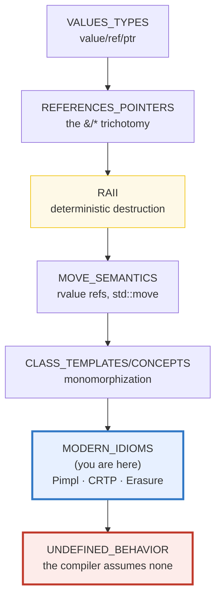
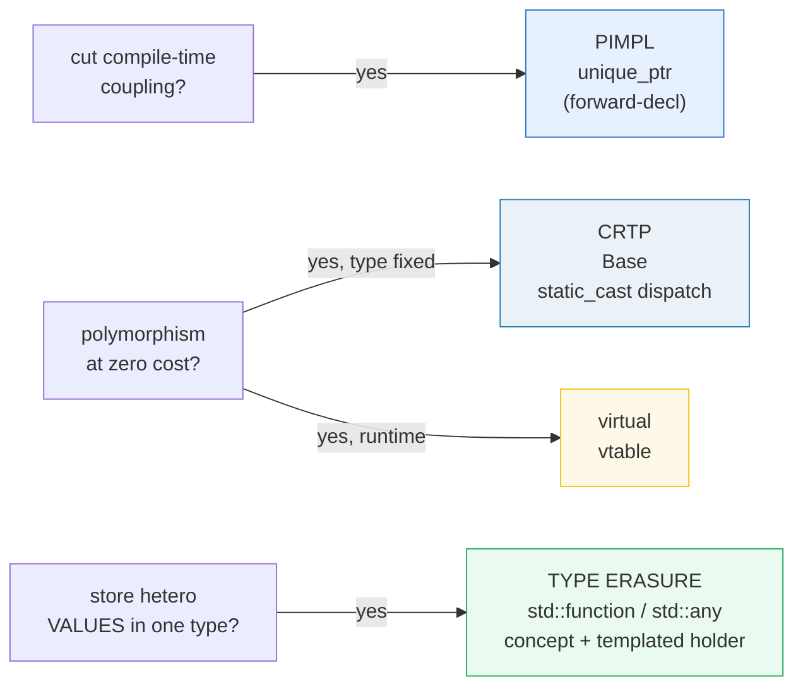
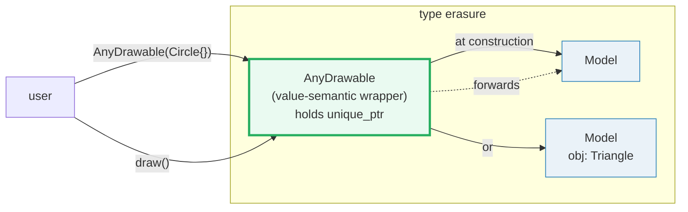

# MODERN_IDIOMS — Pimpl, CRTP & Type Erasure

> **Goal (one line):** show, by printing every value, three recurring C++ design
> idioms — **PIMPL** (the "compilation firewall" via `std::unique_ptr<Impl>`),
> **CRTP** (compile-time, zero-overhead polymorphism via
> `static_cast<Derived*>(this)`), and **TYPE ERASURE** (`std::function` / `std::any`,
> plus the concept+templated-holder mechanism they're built from).
>
> **Run:** `just run modern_idioms`
>
> **Ground truth:** [`modern_idioms.cpp`](./modern_idioms.cpp) → captured stdout in
> [`modern_idioms_output.txt`](./modern_idioms_output.txt). Every number/table
> below is pasted **verbatim** from that file under a
> `> From modern_idioms.cpp Section X:` callout. Nothing is hand-computed.
>
> **Prerequisites:** 🔗 `CLASS_TEMPLATES` (P2 — CRTP is a class template),
> 🔗 `UNIQUE_PTR` (P3 — Pimpl is built on `std::unique_ptr`),
> 🔗 `CONCEPTS` (P2 — type erasure is concept-like), 🔗 `FUNCTIONS_OVERLOADING`
> (P1 — `std::function` wraps callables).

---

## 1. Why this bundle exists (lineage)

Three idioms appear constantly in real C++ libraries, and they answer three
distinct design questions:

- **"How do I change my private members without recompiling my users?"** → **PIMPL**.
  Put the private members in a forward-declared `Impl`, hold it through a
  `std::unique_ptr`. Changing `Impl` never touches the header → a *compilation
  firewall*, and (in a real library) ABI stability.
- **"How do I get polymorphism with zero overhead?"** → **CRTP**. Derive
  `Derived : Base<Derived>`; the base forwards to the derived via
  `static_cast<Derived*>(this)`. Resolved at compile time → no vtable, fully
  inlinable. The cost: the derived type is *fixed* at compile time.
- **"How do I store heterogeneous objects behind ONE type?"** → **TYPE ERASURE**.
  `std::function<R(Args...)>` stores any callable matching the signature;
  `std::any` stores any value. Both hide the concrete type behind a uniform
  interface (with Small-Buffer Optimization so small objects skip the heap).



This bundle is the *payoff* of the value/ref/ptr → RAII → move → templates spine:
Pimpl *is* RAII over a `unique_ptr`; CRTP *is* class templates; type erasure *is*
templates + a virtual interface + RAII. Each one composes the earlier primitives
into a named design pattern.

> From cppreference — *PImpl*: the technique "removes implementation details of a
> class from its object representation by placing them in a separate class,
> accessed through an opaque pointer … used to construct C++ library interfaces
> with **stable ABI** and to **reduce compile-time dependencies**."

---

## 2. The mental model: three idioms, three questions



The three are **orthogonal**: a class can be a Pimpl *and* expose a CRTP base;
a `std::function` is internally built with type erasure over a concept+holder,
and it is *move-only-ish* (copyable) like a value. The cheat sheet (§10) maps
each idiom to its cost.

---

## 3. Section A — PIMPL: the compilation firewall

> From `modern_idioms.cpp` Section A:
> ```
> sizeof(void*) == 8  (one pointer)
> sizeof(Widget) == 8  (only a pointer; Impl's members are hidden)
> [check] sizeof(Widget) == sizeof(void*) (object repr is one pointer; Impl hidden): OK
> 
> Widget w(7): value()=7  data_count()=7  live_impls=1
> [check] Widget w(7).value() == 7: OK
> [check] Widget w(7).data_count() == 7 (Impl built the hidden vector): OK
> [check] one live Impl while a Widget exists: OK
> after move: live_impls still 1 (move transferred the pointer, no copy/free)
> [check] move did not copy or destroy Impl (still 1 live): OK
> [check] moved-to Widget holds the value (7): OK
> after scope exit: live_impls=0 (dtor ran; RAII freed Impl)
> [check] Impl freed after Widget destroyed (RAII; out-of-line ~Widget ran): OK
> ```

**What.** `Widget`'s private members (`int n; std::vector<int> data;`) live in a
forward-declared `struct Impl`, held through `std::unique_ptr<Impl>`. The output
proves three things:

- **`sizeof(Widget) == 8 == sizeof(void*)`.** The object representation is *one
  pointer* — `Impl`'s `int` + `vector` do **not** appear in `sizeof(Widget)`.
  This is the literal cppreference promise: Pimpl "removes implementation details
  of a class from its object representation."
- **The RAII sentinel.** `g_live_impls` goes `0 → 1` on construction, stays `1`
  across the move (the pointer is transferred, not copied or freed), and returns
  to `0` at scope exit — proving the out-of-line `~Widget` ran and freed `Impl`.
- **Move-only by default.** The copy SMFs are `= delete`; only the move SMFs
  exist. A Pimpl class is cheaply movable (one pointer) but not copyable unless
  you write the deep copy yourself.

### The `unique_ptr<Impl>` destructor gotcha (the pinned payoff)

> From cppreference — *PImpl > Implementation* (verbatim): **"Because
> `std::unique_ptr` requires that the pointed-to type is a complete type in any
> context where the deleter is instantiated, the special member functions must be
> user-declared and defined out-of-line, in the implementation file, where the
> implementation class is complete."**

The bundle models the `.h`/`.cpp` split **within a single TU**. In the
"header-equivalent" part, only the forward declaration is visible and the dtor is
**declared but not defined**:

```cpp
class Widget {
public:
    explicit Widget(int n);
    ~Widget();                       // DECLARED here …
    Widget(Widget&&) noexcept;       // … and the move SMFs too
    // ...
private:
    struct Impl;                     // forward declaration ONLY
    std::unique_ptr<Impl> pimpl_;
};
```

The definitions come **after** `struct Widget::Impl { … }` is complete:

```cpp
struct Widget::Impl { int n; std::vector<int> data; /* ... */ };

Widget::Widget(int n) : pimpl_(std::make_unique<Impl>(n)) {}
Widget::~Widget() = default;         // <-- the fix: defined where Impl is COMPLETE
Widget::Widget(Widget&&) noexcept = default;
```

**If you omit the user-declared dtor (or write `= default` inline)**, the
compiler generates `~Widget()` at the point where the class body ends — where
`Impl` is *incomplete*. `unique_ptr`'s deleter then tries to call `delete` on an
incomplete type and clang rejects it (documented here; not executed, since it is a
compile error and the bundle must build):

```
error: invalid application of 'sizeof' to an incomplete type 'Widget::Impl'
note: in instantiation of member function 'std::unique_ptr<Widget::Impl>::~unique_ptr'
note: in implicit destructor for 'Widget'
```

The fix is one line: **declare the dtor in the header; define it (even `=
default`) in the `.cpp`.** The same applies to the move constructor/assignment.
(The copy SMFs are usually `= delete`, as here.)

> **What a single-TU bundle *cannot* show:** the real payoff of Pimpl is a
> **two-TU** effect — editing `Impl` in `widget.cpp` and recompiling does *not*
> recompile `main.cpp` (which only sees the forward decl). That requires a header
> + two `.cpp` files; this bundle proves the *mechanism* (object repr == one
> pointer; out-of-line dtor runs) inside one TU. The coupling cut is the same
> mechanism at the preprocessor boundary.

---

## 4. Section B — CRTP: compile-time (static) polymorphism

> From `modern_idioms.cpp` Section B:
> ```
> CRTP Square(4):      name=Square    area=16   (static_cast dispatch, no vtable)
> CRTP Rectangle(3,5): name=Rectangle area=15
> [check] CRTP Square(4).area() == 16 (dispatched to Square::area_impl): OK
> [check] CRTP Rectangle(3,5).area() == 15: OK
> [check] CRTP name() dispatched to Derived::name_impl (Square): OK
> 
> sizeof(Square)=4  sizeof(VSquare)=16   (CRTP base adds no vptr; virtual does)
> [check] Shape<> has no virtuals: sizeof(Square) == sizeof(int) (EBO, no vptr): OK
> 
> Virtual VSquare(4) via VShape*: name=Square    area=16   (runtime dispatch via vtable)
> [check] virtual VSquare(4).area() == 16 (via VShape*): OK
> ```

**What.** The CRTP base is a template parameterized on its own derived class:

```cpp
template <typename Derived>
struct Shape {
    int area() const { return static_cast<const Derived*>(this)->area_impl(); }
    //                                  ^^^^^^^^^^^^^^^^^^^^^^^^^^^^^^^^^^^^ NOT virtual
};
struct Square : Shape<Square> { int area_impl() const { /* ... */ } };
```

`Shape<Derived>::area()` downcasts `this` to `Derived*` and calls `area_impl()`.
Because `Derived` is a template argument, the compiler knows the concrete type at
compile time → the call is a **direct** call (inlinable), **not** a vtable lookup.

**Why it's zero-overhead — proven by `sizeof`.** `Shape<>` has *no* virtual
functions, so it adds **no vptr**. Empty-Base-Optimization folds `Shape<Square>`
away entirely, so `sizeof(Square) == 4 == sizeof(int)` — it holds only `side`.
The virtual version `VSquare` carries a vptr: `sizeof(VSquare) == 16` (8 vptr + 4
`int` + 4 padding). The 12-byte difference *is* the CRTP win.

**CRTP vs `virtual`** — the bundle prints the tradeoff verbatim:

```
CRTP    : compile-time, inlinable, no vtable/vptr — but the derived type is
          FIXED; Square and Rectangle are unrelated types (no shared base ptr).
virtual : runtime, one indirection (vtable lookup) — but a VShape* addresses
          any derived type, so heterogeneous collections work.
```

The decisive difference: a `VShape*` can point at *any* `VShape` subclass (you
can put them in one `std::vector<VShape*>`); `Shape<Square>*` and
`Shape<Rectangle>*` are **unrelated types** — there is no common base to address
them through. CRTP trades runtime flexibility for zero cost.

> From cppreference — *CRTP*: "CRTP may be used to implement **compile-time
> polymorphism**, when a base class exposes an interface, and derived classes
> implement such interface." The example uses exactly
> `static_cast<Derived*>(this)->impl();`.

### C++23 note: deducing `this`

C++23's *explicit object member function* ("deducing `this`") can express the
same static dispatch without the `static_cast` ceremony:

```cpp
struct Base { void name(this auto&& self) { self.impl(); } };
```

It is the modern replacement for many CRTP uses; the classic `static_cast` form
above remains the lingua franca of existing libraries (`std::enable_shared_from_this`,
`std::ranges::view_interface`, …).

---

## 5. Section C — TYPE ERASURE: `std::function` & `std::any`

> From `modern_idioms.cpp` Section C:
> ```
> std::function<int(int)> holds three different concrete callables:
>   lambda   (x -> x+3): fn(10) = 13
>   fn ptr   (x -> x+1): fn(10) = 11
>   functor  (x -> x+2): fn(10) = 12
> [check] std::function holds a lambda  (fn(10)==13): OK
> [check] std::function holds a fn ptr (fn(10)==11): OK
> [check] std::function holds a functor(fn(10)==12): OK
> [check] a lambda target and a fn-ptr target have DIFFERENT erased target types: OK
> 
> sizeof(std::function<int(int)>) == 32  (impl-defined; includes the SBO buffer)
> [check] sizeof(std::function) >= sizeof(void*) (non-trivial wrapper): OK
> [check] default-constructed std::function is empty: OK
> invoking an empty std::function throws bad_function_call: true
> [check] empty std::function throws std::bad_function_call: OK
> 
> std::any holds heterogeneous values behind one type:
>   a = 42;     type==int: yes   any_cast<int> = 42
> [check] std::any holds an int (type==int, any_cast<int>==42): OK
>   a = "hi";   type==string: yes   any_cast<string> = hi
> [check] std::any re-assigned to string (type==string, any_cast=="hi"): OK
>   any_cast<double>(string any) throws bad_any_cast: true
> [check] wrong-type any_cast<double> on a string any throws bad_any_cast: OK
> ```

### `std::function<R(Args...)>` — any callable, one signature

The *static* type is always `std::function<int(int)>`; the **target** can be a
lambda, a function pointer, or a functor. The bundle stores all three and calls
each — same signature, three unrelated concrete types behind it. That erasure is
exactly what CRTP *cannot* do and what `virtual` *can* (but `std::function` gives
you **value semantics** — you copy/move the wrapper, not a pointer).

- **`sizeof(std::function<int(int)>) == 32`** here (Apple libc++). That 32 bytes
  **includes the SBO (small-buffer optimization) buffer**: small callables (the
  lambda/fn-ptr/functor above) are stored **inline**, with **no heap allocation**,
  exactly like `std::string`'s SSO. The size is implementation-defined; libc++ is
  ~32, libstdc++ ~32–48.
- **An empty `std::function` throws `std::bad_function_call`** when invoked — the
  bundle default-constructs one, checks `!empty`, invokes it, and catches.

### `std::any` (C++17) — any value, one type

`std::any` holds a single value of **any** `CopyConstructible` type; `std::any_cast<T>`
retrieves it. The bundle assigns an `int`, then re-assigns the *same object* to a
`std::string` (a completely unrelated type) — and `typeid` tracks the change. A
**wrong-type** `any_cast<double>` on a `string` any throws `std::bad_any_cast`.

- **SBO applies here too.** cppreference (*any*): *"Implementations are encouraged
  to avoid dynamic allocations for small objects, but such an optimization may
  only be applied to types for which `std::is_nothrow_move_constructible` returns
  `true`."* So a small `int` any usually stays inline; a large object heap-allocates.
- **`std::any` vs `std::variant`** — `any` is *open-ended* (any type, runtime
  checked); `variant` is a *closed* set of types known at compile time (a tagged
  union, no heap, no `typeid`). Reach for `variant` when you can enumerate the
  types; `any` when you genuinely cannot.

> From cppreference — *std::function*: "a general-purpose **polymorphic function
> wrapper**. Instances of `std::function` can store, copy, and invoke any
> `CopyConstructible` `Callable` target — functions, lambda expressions, bind
> expressions, or other function objects … Invoking the target of an *empty*
> `std::function` results in `std::bad_function_call`."
> From cppreference — *std::any*: "a **type-safe container** for single values of
> any copy constructible type."

---

## 6. Section D — the type-erasure MECHANISM (concept + templated holder)

> From `modern_idioms.cpp` Section D:
> ```
> A std::vector<AnyDrawable> of two unrelated concrete types draws as:
> Circle::draw()
> Triangle::draw()
> [check] AnyDrawable erased two unrelated types into one container (size 2): OK
> 
> The mechanism, in miniature (this is how std::function/std::any work):
>   struct Concept { virtual void draw() const = 0; };            // the concept
>   template<class T> struct Model : Concept {                    // the holder
>       T obj; void draw() const override { obj.draw(); }         //   forwards to T
>   };
>   AnyDrawable(T o) : held(make_unique<Model<T>>(move(o))) {}    // <-- erases T
> [check] AnyDrawable is value-semantic (copy of vector would copy each holder): OK
> ```

`std::function` and `std::any` are not magic — they compose a 40-year-old pattern:

1. **A uniform interface (the "concept")** — here `DrawableConcept` with one pure
   virtual `draw() const`.
2. **A templated holder (the "model")** — `DrawableModel<T>` derives from the
   concept and forwards each operation to the wrapped `T obj`.
3. **A value-semantic wrapper** — `AnyDrawable` holds a
   `unique_ptr<DrawableConcept>`, and its **templated constructor** builds a
   `DrawableModel<T>` for whatever `T` you pass. **That templated constructor is
   the erasure step**: the caller knows `T`, the wrapper throws `T` away and
   keeps only the concept operations.

The output shows the payoff: one `std::vector<AnyDrawable>` holds two *unrelated*
concrete types (`Circle`, `Triangle`) and draws both. `std::function` and
`std::any` do exactly this — `std::function` swaps the `virtual` for a hand-rolled
vtable of function pointers (so it can add SBO and `target_type()`); `std::any`
does the same for "store + retrieve by `typeid`". The **shape** is identical to
the miniature above.



---

## 7. Section E — recap: when each idiom wins

> From `modern_idioms.cpp` Section E:
> ```
> Idiom        poly?      overhead            hides impl?  when to use
> ------------ ---------- ------------------- ----------- --------------------------------
> PIMPL        no         1 ptr + heap alloc  YES         cut compile-time coupling; ABI
> CRTP         compile    ZERO (inlineable)   no          static interface / mixin; speed
> virtual      runtime    vtable + indirection no         heterogeneous related types
> type erasure runtime    heap + indirection  yes (value) heterogeneous VALUES, one type
> 
> PIMPL    : hide private members behind a forward-declared unique_ptr<Impl>.
> CRTP     : Base<Derived> forwards to Derived via static_cast<Derived*>(this).
> ERASURE  : a concept + a templated holder store any T behind a uniform type.
> ```

Read the table as a decision procedure: if you need to **hide** implementation
details (compile-time or ABI), reach for **Pimpl**; if you need **zero-overhead**
polymorphism and the type is fixed, reach for **CRTP**; if you need **runtime**
polymorphism over related types, `virtual`; if you need to store **heterogeneous
values** behind one type, **type erasure**. The four are not exclusive — a Pimpl's
`Impl` can internally use CRTP, and `std::function` is type erasure *over* a
callable concept.

---

## 8. Worked smallest-scale examples

Everything above, compressed to the three skeletons a reader must memorize:

```cpp
// ── PIMPL: forward-decl + unique_ptr<Impl>; dtor declared in .h, defined in .cpp ─
class Widget {
public:
    Widget(int);
    ~Widget();                       // MUST be declared here, defined after Impl
    Widget(Widget&&) noexcept;
private:
    struct Impl;                     // forward declaration ONLY
    std::unique_ptr<Impl> pimpl_;
};
struct Widget::Impl { /* private members */ };
Widget::~Widget() = default;         // defined where Impl is complete — the gotcha fix

// ── CRTP: Base<Derived> forwards via static_cast<Derived*>(this) ──────────────
template <class Derived>
struct Base { void f() { static_cast<Derived*>(this)->impl(); } };  // NOT virtual
struct Derived : Base<Derived> { void impl() { /* ... */ } };

// ── TYPE ERASURE: std::function (any callable) + std::any (any value) ────────
std::function<int(int)> g = [](int x){ return x+1; };   // erases the lambda's type
std::any a = 42;                                         // erases the value's type
int i = std::any_cast<int>(a);                           // retrieve (throws if wrong)
```

---

## 9. The value-vs-reference-vs-pointer axis (threaded through this bundle)

| Construct | Copied? | Aliases? | Owns? | Where it sits in the spine |
|---|---|---|---|---|
| `std::unique_ptr<Impl>` (Pimpl) | the pointer is moved | derefs to Impl | **yes** (RAII) | 🔗 `UNIQUE_PTR`, `RAII` |
| `Widget(Widget&&)` (Pimpl move) | moves the pointer | no | transfers ownership | 🔗 `MOVE_SEMANTICS` |
| CRTP `static_cast<Derived*>(this)` | no (compile-time) | `this` aliases the Derived | n/a (no object) | 🔗 `CLASS_TEMPLATES` |
| `std::function` / `std::any` | **value** (copy/move the wrapper) | no | owns the target (heap or SBO) | this bundle |

The recurring lesson: **Pimpl and type erasure are RAII over a heap object**
(ownership via `unique_ptr`); **CRTP owns nothing** — it is pure compile-time
code generation over `this`. (`unique_ptr` and move semantics land in 🔗
`UNIQUE_PTR` / 🔗 `MOVE_SEMANTICS`.)

---

## 10. Pitfalls (the expert payoff)

| Trap | Symptom | Fix |
|---|---|---|
| **Pimpl dtor not user-declared** (or `= default` inline) | Compile error: *"invalid application of 'sizeof' to an incomplete type 'Widget::Impl'*" in `unique_ptr`'s deleter | Declare `~Widget();` in the header; define it (`= default` is fine) in the `.cpp` **after** `Impl` is complete. Same for the move SMFs. |
| Pimpl copy SMFs left implicit | `unique_ptr` is move-only → copy ctor/assign are silently `delete`d → surprising "deleted" errors at the call site | Decide deliberately: `= delete` them (move-only, as here) or write a deep copy in the `.cpp`. |
| Calling a method on a **moved-from** Pimpl | `pimpl_` is `nullptr` → deref is UB (crash under ASan) | After `std::move(w)`, only destroy or re-assign `w`. The bundle deliberately never touches `w.value()` post-move. |
| Using CRTP where you need **runtime** polymorphism | `Shape<Square>*` and `Shape<Rectangle>*` are unrelated → no `std::vector<Shape*>` possible | Use `virtual` (or type erasure) when the concrete type is chosen at runtime; CRTP only when it's fixed at compile time. |
| Instantiating a CRTP base **directly** (`Base<X> b;` with no `X`) | The `static_cast<X*>(this)` is UB (the derived was never constructed); cppreference guards with a `protected` ctor | Give the CRTP base a `protected` default ctor (as here) so only a real `Derived` can create one. |
| `static_cast<Derived*>(this)` when `this` is not really a `Derived` | UB (the cast lies) | CRTP is only sound when every `Base<Derived>` object *is* a `Derived`; the `protected` ctor + private inheritance discipline enforces it. |
| Invoking an **empty** `std::function` | Throws `std::bad_function_call` at runtime (not a compile error) | Check `if (f)` / `if (f) f(x)`; or use `std::move_only_function`/`function_ref` (C++23/C++26). |
| `std::any_cast<WrongT>(a)` | Throws `std::bad_any_cast`; or the **pointer** overload returns `nullptr` (no throw) | Use the pointer form `any_cast<T>(&a)` when you want to probe without exceptions; check the returned pointer. |
| Assuming `std::function`/`std::any` never allocate | Large callables/values heap-allocate (SBO only covers small ones); per-call indirection cost | Don't store a `std::function` per element in a hot inner loop; a function pointer or CRTP is cheaper when the type is known. |
| Pimpl on a **class template** (`template<class T> struct Widget { struct Impl; unique_ptr<Impl>; };`) | Users must see all of `Impl` to instantiate → the **compilation firewall is lost** (cppreference) | Factor the non-templated core into a `WidgetBase` Pimpl; keep the template a thin wrapper (cppCoreGuidelines T.84). |
| Forgetting the **virtual destructor** on a runtime-polymorphic base | Deleting via `Base*` is UB (sliced/leaked) — the classic C++ trap | A base with any `virtual` function needs `virtual ~Base()` (the bundle's `VShape` has one). |

---

## 11. Cheat sheet

```cpp
// ── PIMPL ────────────────────────────────────────────────────────────────────
// header (widget.h):
class Widget {
public:
    explicit Widget(int);
    ~Widget();                          // DECLARE here
    Widget(Widget&&) noexcept;          // DECLARE here (copy = delete)
private:
    struct Impl;                        // forward decl ONLY — the firewall
    std::unique_ptr<Impl> pimpl_;       // object repr == ONE pointer
};
// source (widget.cpp):
struct Widget::Impl { int n; std::vector<int> data; /* private members */ };
Widget::~Widget() = default;            // DEFINE where Impl is COMPLETE (the gotcha)
//   payoff: editing Impl never recompiles users; sizeof(Widget) == sizeof(void*).

// ── CRTP (compile-time polymorphism; no vtable, no vptr) ─────────────────────
template <class D> struct Base {
    void f() const { static_cast<const D*>(this)->impl(); }   // NOT virtual
protected: Base() = default;                                  // only a D may construct
};
struct Derived : Base<Derived> { void impl() const { /* ... */ } };
//   vs virtual: CRTP = zero-overhead but type FIXED; virtual = runtime, vtable.
//   C++23 alt:  void f(this auto&& self) { self.impl(); }     // deducing this

// ── TYPE ERASURE (std::function / std::any) ──────────────────────────────────
std::function<int(int)> fn = [](int x){ return x+1; };  // any callable, one sig
//   empty fn throws bad_function_call; SBO stores small targets inline.
std::any a = 42;                                        // any CopyConstructible value
int  i = std::any_cast<int>(a);                         // retrieve; throws bad_any_cast
int* p = std::any_cast<int>(&a);                        // pointer form: nullptr, no throw

// ── the mechanism (what function/any are made of) ────────────────────────────
struct Concept   { virtual void op() const = 0; };
template<class T> struct Model : Concept { T obj; void op() const override { obj.op(); } };
//   Wrapper(T v) : held(make_unique<Model<T>>(move(v))) {}   // <- erases T
```

---

## 12. 🔗 Cross-references

**Within C++ (the expertise spine):**

- 🔗 `CLASS_TEMPLATES` (P2) — CRTP *is* a class template (`Base<Derived>`); you
  need template instantiation fluency before CRTP makes sense.
- 🔗 `UNIQUE_PTR` (P3) — Pimpl is built on `std::unique_ptr<Impl>`; the
  incomplete-type-in-the-deleter gotcha is a `unique_ptr` property, not a Pimpl one.
- 🔗 `CONCEPTS` (P2) — type erasure is "a concept + a templated holder"; C++20
  concepts name the *requirements* a `T` must meet to be erasable into the wrapper.
- 🔗 `FUNCTIONS_OVERLOADING` (P1) — `std::function` wraps any *callable*; the
  callable conversion is the bridge from concrete functor to erased target.
- 🔗 `MOVE_SEMANTICS` (P3) — Pimpl's cheap move and type erasure's move-only
  variants (`std::move_only_function`, C++23) are move semantics applied.
- 🔗 `RAII` — both Pimpl and type erasure are RAII over a heap object (the
  wrapper's destructor frees the held `Impl`/target).

**Cross-language parallels (the 5-language curriculum):**

- 🔗 [`../rust/`](../rust/) — Rust has **no Pimpl**: modules + privacy give the
  compilation firewall directly (a `pub struct` with private fields already hides
  its layout from other modules, no pointer indirection needed). CRTP ≈ Rust
  **traits** used statically (the type is known at compile time, monomorphized —
  zero overhead, no vtable). Type erasure ≈ Rust **trait objects** `Box<dyn Trait>`:
  the concrete type is erased behind a fat pointer (data ptr + vtable) — the same
  concept+holder mechanism, but with the vtable made *explicit* in the pointer.
- 🔗 [`../go/INTERFACES_BASICS.md`](../go/INTERFACES_BASICS.md) — Go **interfaces
  ARE type erasure**: any value whose methods satisfy an interface is stored
  behind it (a fat pointer: data + itab). Go has **no Pimpl and no CRTP** — the
  GC + interface model replaces both (privacy is per-package, like Rust modules).
- 🔗 [`../ts/`](../ts/) — TypeScript uses **structural typing** + closures: a
  function value is already type-erased (it's just a closure/object). There is no
  Pimpl (no separate compilation/header model) and no CRTP (no monomorphization;
  generics are erased at runtime like Java).

---

## Sources

Every signature, value, and behavioral claim above was verified against
cppreference and the ISO C++ standard, then corroborated by ≥1 independent
secondary source:

- cppreference — *PImpl* ("pointer to implementation"): removes implementation
  details from the object representation; `std::unique_ptr` requires a complete
  type where the deleter is instantiated ⇒ SMFs "must be user-declared and
  defined out-of-line"; compilation firewall vs factory method; class-template
  specialization loses the firewall:
  https://en.cppreference.com/w/cpp/language/pimpl
- cppreference — *Curiously Recurring Template Pattern (CRTP)*: "an idiom in
  which a class `X` derives from a class template instantiation `Y<X>`"; used for
  "compile-time polymorphism"; the `static_cast<Derived*>(this)->impl()` example;
  C++23 deducing-`this` alternative:
  https://en.cppreference.com/w/cpp/language/crtp
- cppreference — *`std::function`* ("general-purpose polymorphic function
  wrapper"; stores any `CopyConstructible` `Callable` target; empty ⇒ throws
  `std::bad_function_call`; `target_type`/`target`):
  https://en.cppreference.com/w/cpp/utility/functional/function
  - *Explicit object member functions (deducing `this`)*, C++23:
    https://en.cppreference.com/w/cpp/language/member_functions#Explicit_object_member_functions
- cppreference — *`std::any`* (C++17; "type-safe container for single values of
  any copy constructible type"; `any_cast`/`bad_any_cast`; "Implementations are
  encouraged to avoid dynamic allocations for small objects … only for types for
  which `std::is_nothrow_move_constructible` returns `true`" — SBO):
  https://en.cppreference.com/w/cpp/utility/any
  - *`std::any_cast`*: https://en.cppreference.com/w/cpp/utility/any/any_cast
  - (There is no dedicated cppreference "type erasure" page; the standard-library
    instances are `std::function` and `std::any`, cited above. The general
    mechanism is covered by the Andrzej's C++ blog link below.)
- ISO C++23 draft (open-std.org) — normative wording:
  - `[unique.ptr]` / `[unique.ptr.dltr]` (the deleter's complete-type requirement)
  - `[func.wrap.func]` (`std::function`); `[any.class]` (`std::any`)
  - Working draft: https://open-std.org/JTC1/SC22/WG21/docs/papers/2023/n4950.pdf
- isocpp.org / CppCoreGuidelines — Pimpl + non-template core (T.84 "Use a
  non-template core implementation to provide an ABI-stable interface"; T.61 "Do
  not over-parametrize members" — why Pimpl on a class template loses the firewall):
  https://isocpp.github.io/CppCoreGuidelines/CppCoreGuidelines#t84-use-a-non-template-core-implementation-to-provide-an-abi-stable-interface
- Sutter, *GOTW #100: Compilation Firewalls* (the canonical Pimpl trade-off
  analysis — what goes in the interface vs the implementation):
  https://herbsutter.com/gotw/_100/
- Sutter, *GOTW #28: The Fast Pimpl Idiom* (in-place `Impl` to avoid the heap
  allocation — the trade-off the SBO section alludes to):
  http://www.gotw.ca/gotw/028.htm
- Secondary corroboration (≥2 independent sources, web-verified):
  - Fluent C++ — *The Curiously Recurring Template Pattern (CRTP)* (what CRTP
    brings, the static-dispatch mechanism, the helper to avoid UB):
    https://www.fluentcpp.com/2017/05/12/curiously-recurring-template-pattern/
  - Sandor Dargo — *Replace CRTP with concepts?* (CRTP vs C++20 concepts, and the
    C++23 deducing-`this` replacement):
    https://www.sandordargo.com/blog/2024/12/04/crtp-vs-concepts
  - Andrzej's C++ blog — *Type erasure — Part I/II* (the concept+holder mechanism
    `std::function`/`std::any` are built from, worked from first principles):
    https://akrzemi1.wordpress.com/2013/11/18/type-erasure-part-i/
  - C++ Stories — *The Pimpl Pattern — what you should know* (the .h/.cpp split,
    the `unique_ptr` incomplete-type gotcha, move-only SMFs):
    https://www.cppstories.com/2018/01/pimpl/

**Facts that could not be verified by running** (documented, not executed,
because they are compile errors, two-TU effects, or implementation-defined
sizes): the Pimpl incomplete-type **compile error** itself (the bundle must
build, so the dtor is correctly defined out-of-line); the real **compilation
firewall** (needs a header + two `.cpp` files — this single-TU bundle proves the
mechanism, not the build-graph effect); the absolute `sizeof(std::function)`
elsewhere (libc++ here is 32; libstdc++ differs — implementation-defined); and
the lambda's mangled `typeid().name()` (impl-defined, so the bundle compares
typeids rather than printing names). These are confirmed by the cppreference
sections and secondary sources above, not reproduced as runnable output in the
verified path.
