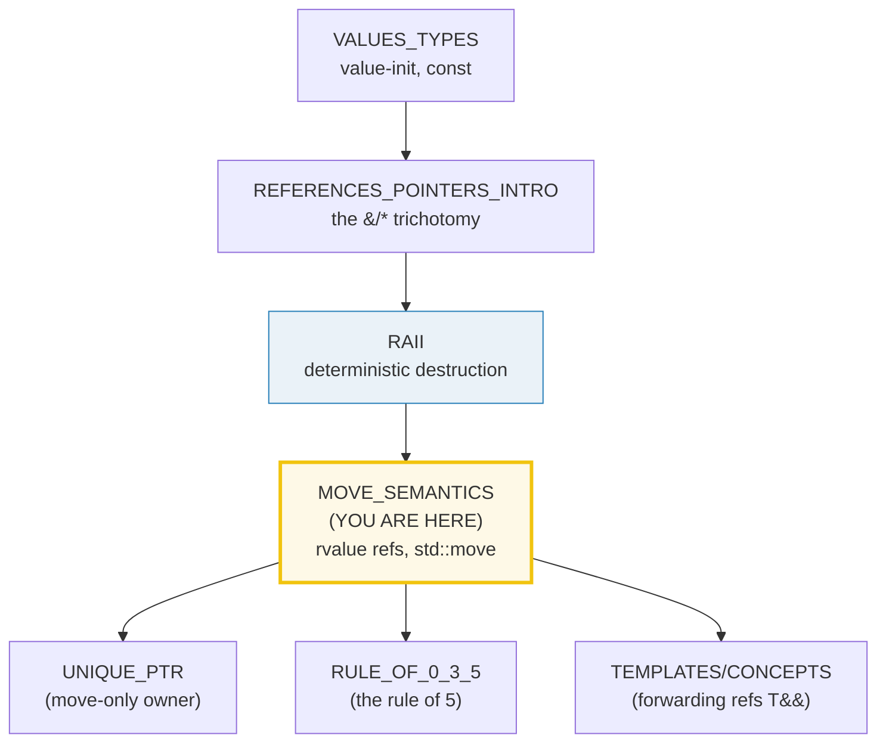
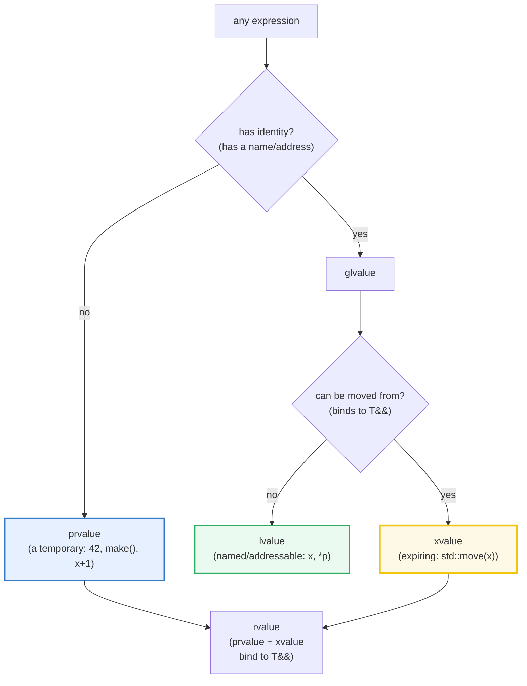
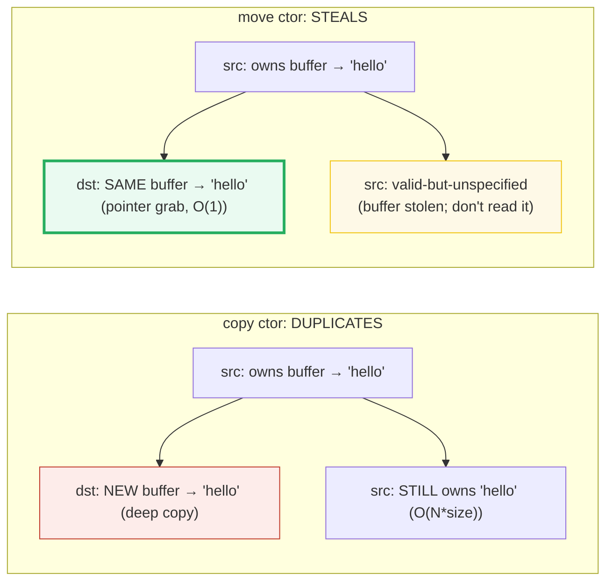

# MOVE_SEMANTICS — Value Categories, `std::move`, and the Move Constructor

> **Goal (one line):** by printing every value, show how C++11 **move semantics**
> works — the **value categories** (lvalue / prvalue / xvalue) and the **rvalue
> reference `T&&`**, **`std::move`** (which IS A CAST, not a move), the **move
> constructor** that STEALS a resource in O(1) and leaves the source
> **valid-but-unspecified**, **RVO/NRVO** (return-by-value is FREE — zero
> copies/moves), the **`noexcept`-move rule** that lets `vector` reallocate with
> moves instead of copies, **perfect forwarding**, and the perf payoff — pinning
> `std::move` as C++'s opt-in ownership-transfer **half-step toward Rust's
> compile-time-enforced move**.
>
> **Run:** `just run move_semantics`
>
> **Ground truth:** [`move_semantics.cpp`](./move_semantics.cpp) → captured stdout
> in [`move_semantics_output.txt`](./move_semantics_output.txt). Every
> number/table below is pasted **verbatim** from that file under a
> `> From move_semantics.cpp Section X:` callout. Nothing is hand-computed.
>
> **Prerequisites:** 🔗 [`VALUES_TYPES.md`](./VALUES_TYPES.md) (value-init, `auto`
> copies) · 🔗 [`REFERENCES_POINTERS_INTRO.md`](./REFERENCES_POINTERS_INTRO.md)
> (the `&`/`*` trichotomy) · 🔗 [`RAII.md`](./RAII.md) (deterministic destruction —
> move steals the resource, RAII frees it at scope exit).

---

## 1. Why this bundle exists (lineage)

C++11 added **move semantics**: an **rvalue reference `T&&`** binds to a temporary
or expiring value; a **move constructor / move assignment** STEALS the resource (a
cheap pointer-grab, O(1)) instead of copying it, leaving the moved-FROM object in a
**"valid-but-unspecified"** state. `std::move(x)` is just a **cast to `T&&`** — it
does NOT move; it ENABLES the move by selecting the `T&&` overload (the move ctor)
over the `const T&` overload (the copy ctor). This is C++'s **opt-in ownership
transfer**, a half-step toward Rust's move — where Rust's move is
**compile-time-enforced** (the moved-from binding is INVALID), C++'s move is
**runtime** (the moved-from object stays valid-but-unspecified, and misuse is
use-after-move UB caught by sanitizers, not the compiler).



The headline contrast across the 5-language curriculum:

| Language | Move semantics? | Moved-from object | Enforcement |
|---|---|---|---|
| **C++** (this bundle) | **yes** — `T&&` + `std::move` + move ctor | **valid-but-unspecified** (runtime) | **runtime** (UB if misused; sanitizer-caught) |
| 🔗 [`../rust/MOVE_SEMANTICS.md`](../rust/MOVE_SEMANTICS.md) | **yes** — identical idea | **INVALID** (compile error to use) | **compile time** (borrow checker) |
| 🔗 [`../go/`](../go/) | **no** — value semantics + GC; copies or pointer-shares | n/a | n/a (GC) |
| 🔗 [`../ts/VALUE_VS_REFERENCE.md`](../ts/VALUE_VS_REFERENCE.md) | **no** — shared refs + GC | n/a | n/a (GC) |

> From cppreference — *`std::move`*: "is used to *indicate* that an object `t` may
> be 'moved from'… It is **exactly equivalent to a `static_cast` to an rvalue
> reference type**." And *Move constructors*: "Move constructors typically transfer
> the resources held by the argument… and **leave the argument in some valid but
> otherwise indeterminate state**."

---

## 2. The mental model: value categories + the move as a steal

Every C++ expression has a **type** AND a **value category** (one of three primary
categories). The category decides whether a `T&&` overload (move) can bind:





The second diagram is the whole story: a **copy** deep-duplicates the resource
(expensive, O(N)); a **move** steals the pointer (cheap, O(1)) and leaves the source
in a valid-but-unspecified state. The key insight: `std::move(x)` does NOT perform
this steal — it merely CASTS `x` to `T&&` so that the assignment `auto y = std::move(x)`
SELECTS the move ctor. The steal happens in the move ctor, at the `=`.

---

## 3. Section A — Value categories: lvalue / prvalue / xvalue + rvalue ref `T&&`

> From `move_semantics.cpp` Section A:
> ```
> expression              decltype((expr))   category
> -----------------------  ----------------   --------
> 42                        int               prvalue
> x                         int&              lvalue 
> lref  (int& lref = x)     int&              lvalue 
> rref  (int&& rref = ...)  int&              lvalue 
> std::move(x)              int&&             xvalue 
> x + 1                     int               prvalue
> [check] 42 is a prvalue (a temporary literal): OK
> [check] x (a named variable) is an lvalue: OK
> [check] a NAMED rvalue reference is an LVALUE (the #1 gotcha): OK
> [check] std::move(x) is an xvalue (an expiring value): OK
> [check] x + 1 (arithmetic) is a prvalue: OK
> 
> rvalue reference T&& binding rules:
>     int&& r = 10;             // OK: prvalue binds to T&&
>     int&& r = std::move(x);   // OK: xvalue binds to T&&
>     const int& r = 10;        // OK: const T& also binds to rvalues
>     // int&& r = x;           // ERROR: lvalue does NOT bind to T&&
> [check] int&& binds to a prvalue (10): OK
> [check] int&& binds to an xvalue (std::move(x) refers to x): OK
> [check] const int& binds to an rvalue (lifetime-extended): OK
> 
> => When both T&& and const T& overloads exist, an rvalue selects T&&.
>    This is how std::move ENABLES the move: it casts to T&& so the move
>    ctor/assign is selected. std::move itself does NOT move anything.
> ```

**The `decltype((expr))` trick** (note the DOUBLE parentheses): `decltype((expr))`
yields `T` for a prvalue, `T&` for an lvalue, `T&&` for an xvalue. The bundle's
three trait specializations (`is_prvalue`/`is_lvalue`/`is_xvalue`) turn that into a
clean category test, applied at compile time via `static_assert` AND at runtime via
the printed table. Six expressions classified:

- **`42`** — a literal → **prvalue** (a temporary with no identity).
- **`x`** (a named variable) → **lvalue** (has a name and address).
- **`lref`** (`int& lref = x`) → **lvalue** — a named lvalue reference is itself an lvalue.
- **`rref`** (`int&& rref = std::move(x)`) → **lvalue** — THE #1 GOTCHA: a **named**
  rvalue reference is an **lvalue**, not an xvalue! Only the *expression*
  `std::move(x)` is an xvalue; once you NAME it (`rref`), using that name is an
  lvalue. This is why a move ctor must `std::move` its members: inside the ctor,
  `other` is a named rvalue ref → an LVALUE → member-wise copy would COPY unless you
  re-cast with `std::move(other.member)`.
- **`std::move(x)`** → **xvalue** (an expiring lvalue whose resources can be reused).
- **`x + 1`** (arithmetic) → **prvalue** (the result is a temporary).

**`T&&` binding rules.** An rvalue reference `T&&` binds to rvalues (prvalues AND
xvalues) but NOT to lvalues. A `const T&` binds to anything (lvalues and rvalues —
that's why `const T&` parameters accept temporaries, with lifetime extension). When
both `T&&` and `const T&` overloads exist, an rvalue selects `T&&` (the move path);
an lvalue selects `const T&` (the copy path). **This is how `std::move` selects the
move ctor:** it casts to `T&&` (an xvalue), so overload resolution picks the `T&&`
overload.

> From cppreference — *Value categories*: "Each expression belongs to exactly one of
> the three primary value categories: *prvalue*, *xvalue*, and *lvalue*." A prvalue
> "computes the value of an operand… or initializes an object"; an xvalue is "a
> glvalue that denotes an object whose resources can be reused"; an lvalue is "a
> glvalue that is not an xvalue." And: "the name of a variable… is an lvalue
> expression… **Even if the variable's type is rvalue reference**."

---

## 4. Section B — `std::move` IS A CAST + move ctor steals O(1) + moved-FROM valid

> From `move_semantics.cpp` Section B:
> ```
> (1) std::move is a CAST — the object is unchanged immediately after:
>     int n = 42;  int&& alias = std::move(n);
>     &alias == &n      = true   (same object — std::move created no copy)
>     n (unchanged)     = 42   (std::move did NOT move anything)
> [check] std::move is a cast: alias refers to the SAME object as n: OK
> [check] std::move did NOT change n (it's just a cast): n == 42: OK
> [check] std::move is noexcept (a cast cannot throw): OK
> 
> (2) The MOVE happens at the assignment (auto u = std::move(t)):
>     Tracked t(100);  auto u = std::move(t);
>     move_ctor delta = 1, copy_ctor delta = 0
>     u.value = 100   (destination owns the value)
> [check] the move ctor ran exactly once (auto u = std::move(t)): OK
> [check] the move ctor was selected, NOT the copy ctor (copy delta == 0): OK
> [check] the destination received the value (u.value == 100): OK
> [check] the moved-FROM Tracked is still USABLE: reassigned to 200: OK
>     moved-from t reassigned to Tracked(200): t.value = 200 (valid state)
> 
> (3) Copy vs move — copy bumps copy_ctor, move bumps move_ctor:
>     Tracked cpy = orig;            -> copy_ctor delta = 1
>     Tracked mov = std::move(orig); -> move_ctor delta  = 1
> [check] copying an lvalue bumps copy_ctor (exactly 1): OK
> [check] moving an xvalue bumps move_ctor (exactly 1): OK
> [check] the copy received the value (cpy.value == 7): OK
> [check] the move received the value (mov.value == 7): OK
> [check] moved-from orig is still valid (reassigned cleanly): OK
> 
> (4) Moved-FROM state: valid-but-unspecified (never read the value):
>     before move: v.size() = 3
>     after  move: v.size() = 0  (valid query; standard doesn't pin the value)
>                  w.size() = 3  (destination received the data)
>     v reassigned: v.size() = 1, v[0] = "fresh"  (valid state, reusable)
> [check] moved-from vector is still a VALID object (queryable: .size() ran): OK
> [check] moved-from vector is REUSABLE: reassigned and holds the fresh value: OK
> [check] the destination received the original data (w.size() == 3, w[0] == alpha): OK
> 
>     RULE: after std::move(x), x is valid-but-unspecified. You may:
>       - destroy it (its dtor runs cleanly)
>       - assign to it (x = fresh_value)
>       - call queries with NO preconditions (.size(), .empty())
>     You must NOT read its VALUE (it could be anything). Don't: x[0], x.back()
>     (those have a precondition !empty() — UB if the moved-from object is empty).
> ```

**Four pinned facts:**

**(1) `std::move` IS A CAST, not a move.** `int&& alias = std::move(n);` — `alias`
refers to the **same object** as `n` (`&alias == &n`), and `n == 42` is **unchanged**.
`std::move` is exactly `static_cast<T&&>(x)` (cppreference's words); it produces an
**xvalue** that identifies its argument, nothing more. It is `noexcept` (a cast
cannot throw). The bundle proves this by showing `n` is untouched immediately after
`std::move(n)`.

**(2) The MOVE happens at the `=`.** `auto u = std::move(t);` — here the move ctor
`Tracked(Tracked&&)` runs (the `auto u =` initialization selects it because
`std::move(t)` is an xvalue). The bundle proves it by counting: `move_ctor` delta =
1, `copy_ctor` delta = 0. **The move ctor was selected, not the copy ctor.** This is
the separation: `std::move` casts (Section B-1); the assignment consumes the cast and
runs the move ctor (Section B-2).

**(3) Copy vs move, by the counters.** `Tracked cpy = orig;` (lvalue → copy ctor,
`copy_ctor` += 1); `Tracked mov = std::move(orig);` (xvalue → move ctor, `move_ctor`
+= 1). Both receive the value (7); the difference is HOW — the copy deep-duplicated
it, the move stole it. A `Tracked` is trivially small, so the perf difference is
invisible here; Section E proves the real payoff on `vector<string>`.

**(4) The moved-FROM state: "valid-but-unspecified."** After `std::move(v)`, the
moved-from `v` is in a valid-but-unspecified state (the standard's words). You may:
destroy it (dtor runs cleanly), assign to it (`v = fresh_value`), or call queries
with NO preconditions (`.size()`, `.empty()`). You must **NOT** read its value (it
could be anything — for `vector`, libc++/libstdc++ leave it empty, but that's an
implementation detail, not a guarantee). The bundle demonstrates: after moving
`v`→`w`, `v.size()` returns 0 (a valid query — printed but NOT asserted, since the
standard doesn't pin it), and `v` is reassigned to `{"fresh"}` successfully (proving
it's a valid, reusable object). Calling `v[0]` or `v.back()` on a moved-from vector
that happens to be empty is **UB** (those have a precondition `!empty()`).

> From cppreference — *`std::move`* Notes: "all standard library objects that have
> been moved from are placed in a **'valid but unspecified state'**, meaning the
> object's class invariants hold (so functions without preconditions, such as the
> assignment operator, can be safely used on the object after it was moved from)."
> And: "`str.back()` // **undefined behavior** if `size() == 0`: `back()` has a
> precondition `!empty()`."

---

## 5. Section C — RVO/NRVO: return-by-value is FREE (zero copies, zero moves)

> From `move_semantics.cpp` Section C:
> ```
> (1) Prvalue return — C++17 GUARANTEED copy elision (zero copy, zero move):
>     Tracked make_prvalue(int v) { return Tracked(v); }
>     auto a = make_prvalue(11);
>     -> value_ctor delta = 1, copy_ctor delta = 0, move_ctor delta = 0
>     a.value = 11  (constructed in place — no copy, no move)
> [check] prvalue return: exactly ONE value_ctor (the Tracked(v) ran once): OK
> [check] prvalue return: ZERO copies (guaranteed C++17 copy elision): OK
> [check] prvalue return: ZERO moves (the prvalue was constructed in place): OK
> 
> (2) NRVO — Named Return Value Optimization (applied at -O2):
>     Tracked make_named_nrvo(int v) { Tracked t(v); return t; }
>     auto b = make_named_nrvo(22);
>     -> value_ctor delta = 1, copy_ctor delta = 0, move_ctor delta = 0
>     b.value = 22  (NRVO: t was constructed directly in b)
> [check] NRVO return: exactly ONE value_ctor (the Tracked t(v) ran once): OK
> [check] NRVO return: ZERO copies (NRVO applied): OK
> [check] NRVO return: ZERO moves (NRVO applied): OK
> 
> (3) Contrast — no elision possible (pass-by-value into a sink):
>     void sink_by_value(Tracked param);  // takes by value
>     Tracked src(33);
>     sink_by_value(src);            // lvalue  -> COPY ctor
>       copy_ctor delta = 1
> [check] lvalue argument -> COPY ctor (exactly 1): OK
>     sink_by_value(std::move(src)); // xvalue  -> MOVE ctor
>       move_ctor delta = 1
> [check] xvalue argument (std::move) -> MOVE ctor (exactly 1): OK
> [check] value_ctor count is stable across the sink calls (just Tracked src(33)): OK
> 
> => Return by value is FREE (RVO/NRVO). The compiler constructs the object
>    directly in the caller's storage — no copy, no move, not even a move ctor
>    call. You NEVER need to return a pointer or reference to avoid a copy.
>    (NRVO is optional per the standard but applied by clang/gcc at -O2.)
> ```

**Three scenarios, by the copy/move counters:**

**(1) Prvalue return — GUARANTEED copy elision (C++17).** `return Tracked(v);` is a
prvalue; since C++17 the standard GUARANTEES it is constructed **directly in the
caller's storage** — no temporary, no copy, no move. The bundle proves it: across
`auto a = make_prvalue(11);`, the counters show `value_ctor` delta = 1 (the one
construction), `copy_ctor` delta = 0, `move_ctor` delta = 0. The move ctor is never
even called. This is not an optimization — it is a core language guarantee
(sometimes called "guaranteed copy elision" or "prvalue semantics"). The type need
not even have an accessible copy/move ctor.

**(2) NRVO — Named Return Value Optimization (optional but applied at -O2).** When
the function returns a **named** local (`Tracked t(v); return t;`), the compiler may
construct `t` directly in the caller's storage. NRVO is **optional** (unlike prvalue
elision) but applied by clang/gcc at `-O2` for this simple single-return shape. The
bundle proves it: across `auto b = make_named_nrvo(22);`, the counters show
`value_ctor` delta = 1, `copy_ctor` delta = 0, `move_ctor` delta = 0. If NRVO were
NOT applied, the standard says (since C++11) the return is treated as an rvalue
(move), so `move_ctor` would be 1 — but at `-O2` it's 0.

**(3) Contrast — no elision (pass-by-value into a sink).** When copy elision CAN'T
apply (the argument is a named local used elsewhere), the move ctor is the fallback
for rvalues: `sink_by_value(src)` copies (lvalue → copy ctor, delta 1);
`sink_by_value(std::move(src))` moves (xvalue → move ctor, delta 1). This proves the
move ctor IS used when elision is impossible — return-by-value is the free path.

> From cppreference — *Copy elision* (C++17 "prvalue semantics"): "a prvalue is not
> materialized until needed, and then it is constructed directly into the storage of
> its final destination. This sometimes means that even when the language syntax
> visually suggests a copy/move… no copy/move is performed." NRVO: "the
> copy-initialization of the result object can be omitted by constructing `obj`
> directly into the function call's result object."

---

## 6. Section D — `noexcept` move (vector realloc) + perfect forwarding

> From `move_semantics.cpp` Section D:
> ```
> (1) vector reallocation: MOVE iff move ctor is noexcept, else COPY:
>     MoveNoThrow: is_nothrow_move_constructible = true
>     MoveThrows:  is_nothrow_move_constructible = false
> 
>     MoveNoThrow (noexcept move) — 3rd push_back (triggers realloc):
>       copies delta = 0  (ZERO — vector MOVED the 2 existing elements)
>       moves  delta = 3  (2 relocated + 1 new element moved in)
> [check] noexcept move: vector reallocated via MOVE (copies delta == 0): OK
> [check] noexcept move: vector used moves for relocation (moves delta >= 2): OK
> 
>     MoveThrows (throwing move) — 3rd push_back (triggers realloc):
>       copies delta = 2  (vector COPIED the 2 existing elements)
>       moves  delta = 1  (only the 1 new element was moved in)
> [check] throwing move: vector reallocated via COPY (copies delta == 2): OK
> [check] throwing move: only the new element was moved (moves delta == 1): OK
> 
>     => Mark your move ctor/assign `noexcept` — or vector will COPY on realloc.
>        (This is the #1 perf surprise: a missing noexcept can turn O(N) moves
>         into O(N) deep copies.)
> 
> (2) Perfect forwarding (preview): T&& in a template + std::forward:
>     int val = 5;
>     relay(val);              // lvalue  -> T = int&  -> forward -> lvalue
>     relay(T&&): T deduced as T&  (lvalue) -> forward -> lvalue  (copy path)
>     relay(std::move(val));   // xvalue  -> T = int   -> forward -> rvalue
>     relay(T&&): T deduced as T   (rvalue) -> forward -> rvalue  (move path)
>     relay(42);               // prvalue -> T = int   -> forward -> rvalue
>     relay(T&&): T deduced as T   (rvalue) -> forward -> rvalue  (move path)
> [check] std::move(val) is an xvalue (forwarded as rvalue by std::forward): OK
> [check] val was NOT moved (relay only inspected the category): val == 5: OK
> ```

**The `noexcept`-move rule (the #1 perf surprise).** When `vector` reallocates (on
`push_back` exceeding capacity), it must relocate every existing element to the new
buffer. It uses `std::move_if_noexcept`: if the element's move ctor is `noexcept`,
it **moves** (cheap, O(1) per element); if the move ctor **may throw**, it **copies**
(expensive, deep copy) to preserve the strong exception guarantee (if a move threw
mid-realloc, the already-moved elements would be lost; copying keeps the source
intact until success). The bundle proves it with two identical types differing only
in their move ctor's `noexcept`:

- **`MoveNoThrow`** (`MoveNoThrow(MoveNoThrow&&) noexcept`): 3rd `push_back` →
  `copies` delta = **0**, `moves` delta = **3** (2 relocated + 1 new). Vector MOVED.
- **`MoveThrows`** (`MoveThrows(MoveThrows&&)` — NOT noexcept): 3rd `push_back` →
  `copies` delta = **2** (the 2 relocated elements were COPIED), `moves` delta = **1**
  (only the new element, which is an rvalue, was moved). Vector COPIED.

**The lesson: always mark your move ctor/assign `noexcept`** (unless it genuinely can
throw). A missing `noexcept` silently turns O(N) moves into O(N) deep copies — the
most common move-semantics perf bug.

**Perfect forwarding (preview).** In a template `template<class T> void relay(T&& x)`,
`T&&` is a **forwarding reference** (NOT an rvalue reference — `T` is being deduced).
When an **lvalue** is passed, `T` deduces to `U&` (reference collapsing: `U& && → U&`),
so `x` is an lvalue reference; when an **rvalue** is passed, `T` deduces to `U`, so
`x` is an rvalue reference. `std::forward<T>(x)` casts `x` back to its **original**
value category — lvalue if an lvalue was passed, rvalue if an rvalue was passed. This
is **perfect forwarding**: the relay preserves the caller's intent (copy path for
lvalues, move path for rvalues). It is the mechanism behind `std::make_unique`,
`std::emplace_back`, `std::function`, and every forwarding wrapper. (🔗
`FUNCTION_TEMPLATES` / `TYPE_DEDUCTION` deepen template argument deduction and
reference collapsing.)

> From cppreference — *Move constructors* Notes: "user-defined move constructors
> should not throw exceptions. For example, `std::vector` relies on
> `std::move_if_noexcept` to choose between move and copy when the elements need to
> be relocated." And *`std::move_if_noexcept`*: "obtains an rvalue reference to its
> argument if its move constructor does not throw exceptions or if there is no copy
> constructor (otherwise obtains a const lvalue reference)."

---

## 7. Section E — Perf payoff: move `vector<string>` is O(1), copy is O(N*size)

> From `move_semantics.cpp` Section E:
> ```
> std::vector<std::string> of N=100 strings, each 1000 chars (= 100000 total chars):
> 
> (1) COPY (vector<string> = original):
>     copied[0].data() == original[0].data() = false   (DIFFERENT buffers — deep copy)
> [check] copy deep-copied the strings (different data() address): OK
> [check] copy left the source intact (original.size() still == N): OK
> [check] copy duplicated all N strings (copied.size() == N): OK
> 
> (2) MOVE (vector<string> = std::move(original)):
>     sizeof(vector<string>) = 24 bytes (3 pointers: begin/end/cap)
>     moved[0].data() == original's original data() = true   (SAME buffer — stolen)
>     &moved[0] == original's original &          = true   (same storage — stolen)
> [check] move stole the SAME buffer (data() address unchanged — zero char copies): OK
> [check] move stole the vector storage (same first-string address): OK
> [check] move preserved all N strings (moved.size() == N): OK
>     original.size() after move = 0  (valid query; value unspecified — don't assert)
> [check] moved-from original is a valid object (.size() ran without precondition breach): OK
> [check] moved-from original is reusable (reassigned cleanly): OK
> 
>     => Copying vector<string> of 100 strings x 1000 chars = 100000 char copies.
>        Moving  vector<string> of 100 strings x 1000 chars = 0 char copies (O(1) steal).
> 
> (3) Cross-language headline (Rust vs C++ move):
>     C++ move  = RUNTIME ownership transfer. Moved-from = valid-but-unspecified.
>                 You CAN keep using the moved-from object (dangerously).
>     Rust move = COMPILE-TIME ownership transfer. Moved-from = INVALID.
>                 The compiler REJECTS any use of the moved-from binding.
>     Same idea (cheap ownership transfer); C++ trusts you, Rust enforces.
> ```

**The payoff, proven by address equality.** A `vector<string>` of N=100 strings ×
1000 chars holds 100000 chars total. The bundle proves:

- **COPY** (`vector<string> copied = original;`): `copied[0].data() !=
  original[0].data()` — the destination has a **DIFFERENT** buffer (deep copy,
  100000 char copies, O(N×size)). The source is intact.
- **MOVE** (`vector<string> moved = std::move(original);`):
  `moved[0].data() == original's original data()` — the destination has the
  **SAME** buffer (the pointer was stolen, **0** char copies, O(1) regardless of N
  or string size). The source is valid-but-unspecified.

The proof is the **address**: the string data lives at the exact same memory address
before and after the move — no copy happened, just a pointer grab. A `vector` is 24
bytes (3 pointers: begin/end/capacity); moving it copies those 3 pointers, nothing
else. This is why move semantics matters: **copying `vector<string>` of N big strings
is O(N×size); moving it is O(1).**

**The cross-language headline.** C++ move is a **runtime** ownership transfer
(moved-from = valid-but-unspecified; you CAN keep using it, dangerously). Rust move
is a **compile-time** ownership transfer (moved-from = INVALID; the compiler REJECTS
any use). Same idea — cheap ownership transfer — but C++ trusts the programmer while
Rust enforces via the borrow checker. This is THE headline contrast: mastering C++
move semantics is understanding Rust's move, plus the extra discipline C++ requires
(don't read moved-from objects; mark moves `noexcept`; use sanitizers to catch
use-after-move).

> From cppreference — *Move constructors*: "Move constructors typically transfer the
> resources held by the argument (e.g. pointers to dynamically-allocated objects,
> file descriptors, TCP sockets, thread handles, etc.) rather than make copies of
> them… For example, moving from a `std::string` or from a `std::vector` may result
> in the argument being left **empty**."

---

## 8. Worked smallest-scale example

Everything above, compressed to the lines a beginner must memorize:

```cpp
std::vector<std::string> v = {"hello", "world"};
auto w = std::move(v);   // STEAL: w gets v's buffer (O(1)); v is valid-but-unspecified
// v is now moved-from — DON'T read v[0] (UB if empty). DO: v.clear(), v = {...}, v.size().
```

> From `move_semantics.cpp` Section B, `std::move(n)` printed `n (unchanged) = 42`
> (the cast didn't move); Section B's `auto u = std::move(t)` printed `move_ctor
> delta = 1, copy_ctor delta = 0` (the `=` is where the move happened); and Section
> E's `moved[0].data() == original's original data() = true` is the O(1) steal in one
> line.

---

## 9. The ownership / value-vs-reference axis (threaded through this bundle)

Where does each construct in this bundle sit on the own/borrow/move axis? (🔗
`VALUE_VS_REFERENCE_VS_POINTER.md`, `RAII.md`.)

| Construct in this bundle | Owns? | Copyable? | Moved-from state | Notes |
|---|---|---|---|---|
| `T x;` (a value) | **yes** (its own bytes) | **yes** (deep copy) | n/a | the default; copy is O(N) |
| `T&& r = std::move(x);` (rvalue ref) | **no** (borrows) | n/a | n/a — `r` aliases `x` | a named rvalue ref is an LVALUE |
| `auto y = std::move(x);` (move ctor) | **yes** (stole the resource) | n/a | `x` = valid-but-unspecified | O(1) steal |
| `std::move(x)` (the cast) | **no** (just a cast) | n/a | nothing (it doesn't move!) | xvalue expression |
| return-by-value (RVO/NRVO) | **yes** (constructed in place) | n/a | n/a | ZERO copies, ZERO moves |
| `unique_ptr<T>` (move-only) | **yes** (exclusive) | **no** (compile error) | empty (`nullptr`) | 🔗 `UNIQUE_PTR` |

---

## 10. Pitfalls (the expert payoff)

| Trap | Symptom | Fix |
|---|---|---|
| **Reading a moved-from object's value** (`v[0]` after `auto w = std::move(v);`) | **UB** if the moved-from object is empty (`.back()`/`v[i]` have preconditions); or a garbage value | Only call functions with **no preconditions** (`.size()`, `.empty()`, `.clear()`, assign). Or: reassign first, then read. |
| **`std::move(x)` thinking it moved** | Nothing happened (it's a cast); the "move" is silently skipped if no `=` consumes it | The move happens at the `=` (or the return, or the function arg). `std::move(x);` alone is a no-op. |
| **Forgetting `noexcept` on the move ctor** | `vector` silently COPIES on realloc (O(N) deep copies instead of O(N) moves) | Mark move ctor/assign `noexcept` unless they genuinely can throw. Check with `std::is_nothrow_move_constructible_v<T>`. |
| **`return std::move(local);`** in a function | **Pessimization**: disables NRVO (the named local is now an xvalue, so the compiler move-constructs instead of eliding). Sometimes a warning (`-Wpessimizing-move`) | `return local;` — the compiler treats it as an rvalue for move purposes since C++11 (move-eligible). Remove the `std::move`. |
| **`auto x = std::move(y);` then using `y` as if unchanged** | use-after-move: `y` is valid-but-unspecified; reading it gives garbage or UB | Treat `y` as dead after `std::move(y)` — unless you reassign it first. |
| **A named rvalue reference is an lvalue** (`void f(T&& x) { g(x); }` — `x` copies!) | `g(x)` sees an lvalue → copies, not moves (the #1 forwarding bug) | `g(std::forward<T>(x));` (perfect forwarding) or `g(std::move(x));` if you always want to move. |
| **`std::move` a `const` object** | `std::move(const T)` → `const T&&`; the move ctor can't bind (needs `T&&`); falls back to COPY — silently! | Don't expect a move from a `const` object. The `const` blocks the steal. |
| **Self-move-assignment** (`x = std::move(x);`) | Standard library types: guaranteed valid-but-unspecified (usually a no-op). User types: may be UB if not handled | Test `if (this != &other)` in move assignment (the bundle's `Tracked` does this). Standard types are safe. |
| **Moving a temporary you don't own** (`std::move(f().x)` where `f()` returns by value) | dangling: the temporary dies at the `;`; the moved-to object may hold stolen state from a dead object | Don't move from a temporary's member unless you extend its lifetime. Move from objects you own. |
| **Not returning by value** ("to avoid a copy") | Unnecessary indirection; a raw pointer/reference return risks dangling | Return by value — RVO/NRVO makes it free (zero copies/moves). |
| **Rule of 5 violation**: a class with a move ctor but no dtor/copy ops | Double-free, leak, or partial copy (the compiler-generated copy shallow-copies a stolen pointer) | If you write any of {dtor, copy ctor, copy assign, move ctor, move assign}, write all 5 (or = default / = delete them deliberately). 🔗 `RULE_OF_0_3_5`. |
| **Assuming `vector::push_back` always moves** your type | If the move isn't `noexcept`, vector copies existing elements on realloc (Section D) | Mark the move `noexcept`; or `reserve()` upfront to avoid realloc. |

---

## 11. Cheat sheet

```cpp
#include <utility>   // std::move, std::forward

// ── Value categories (decltype((expr)) yields T / T& / T&&) ──────────────────
//   prvalue : a temporary (42, make(), x+1)          -> T
//   lvalue  : named/addressable (x, *p, arr[i])       -> T&
//   xvalue  : expiring (std::move(x))                 -> T&&
//   (A NAMED rvalue reference is an LVALUE — the #1 gotcha.)

// ── std::move IS A CAST (not a move) ─────────────────────────────────────────
//   std::move(x) == static_cast<remove_reference_t<T>&&>(x)   — an xvalue
//   it does NOT move; it ENABLES the move by selecting the T&& overload.
auto y = std::move(x);   // the MOVE ctor runs HERE (at the =), not at std::move

// ── Move ctor: STEALS the resource, O(1), source valid-but-unspecified ───────
struct T {
    T(T&& other) noexcept : ptr_(other.ptr_) { other.ptr_ = nullptr; }  // steal
    T& operator=(T&& other) noexcept {
        if (this != &other) { delete ptr_; ptr_ = other.ptr_; other.ptr_ = nullptr; }
        return *this;
    }
    ~T() { delete ptr_; }
    // ... copy ctor/assign, default ctor (Rule of 5) ...
};

// ── Moved-from: valid-but-unspecified (NEVER read the value) ─────────────────
auto w = std::move(v);   // v is now moved-from
// v.size();       // OK  (no precondition)
// v = {...};      // OK  (assign)
// v.clear();      // OK  (no precondition)
// v[0];           // UB  if v is empty (precondition !empty())
// v.back();       // UB  if v is empty

// ── RVO/NRVO: return by value is FREE (zero copies, zero moves) ─────────────
T make() { return T(args); }   // prvalue: constructed in caller's storage (C++17)
T make() { T t(args); return t; }   // NRVO: t IS the return object (applied at -O2)
//   NEVER: return std::move(t);   // pessimization: disables NRVO

// ── noexcept move: vector realloc uses move iff noexcept, else copy ──────────
T(T&&) noexcept;            // GOOD: vector moves on realloc
T(T&&);                     // BAD:  vector copies on realloc (move_if_noexcept)

// ── Perfect forwarding (T&& in a template + std::forward) ────────────────────
template <class T> void relay(T&& x) { target(std::forward<T>(x)); }
//   lvalue arg -> T = U& -> forward -> lvalue (copy path)
//   rvalue arg -> T = U  -> forward -> rvalue (move path)

// ── Perf: move vector<string> is O(1); copy is O(N*size) ────────────────────
auto moved = std::move(original);   // steals the buffer pointer; 0 char copies
auto copied = original;             // deep-copies every string; O(N*size)
```

---

## 12. 🔗 Cross-references

**Within C++ (the expertise spine):**

- 🔗 `UNIQUE_PTR` (P3) — the canonical **move-only** type. `unique_ptr`'s copy ctor
  is deleted; ownership transfers only via `std::move`. This bundle's Section B
  (move ctor steals, moved-from empty) is `unique_ptr` in miniature.
- 🔗 `RULE_OF_0_3_5` (P3) — the **Rule of 5**: if you write any of {dtor, copy
  ctor/assign, move ctor/assign}, write all 5. The move ctor is half of that rule;
  forgetting the dtor or copy ops when you have a move ctor is a double-free/leak.
- 🔗 `VALUE_VS_REFERENCE_VS_POINTER` (P3) — the own/borrow/move axis deepened.
  `T&&` is a borrow that ENABLES a move; `T&` is a plain borrow; `T` is a value.
- 🔗 `RAII` (P2) — move semantics + RAII = deterministic ownership transfer +
  cleanup. The move ctor steals the resource; RAII ensures it's freed at scope exit.
- 🔗 `REFERENCES_POINTERS_INTRO` (P1) — the `&`/`*` trichotomy that `T&&` extends
  (rvalue reference = the third reference kind).
- 🔗 `FUNCTION_TEMPLATES` / `TYPE_DEDUCTION` (P5) — template argument deduction +
  reference collapsing (the mechanism behind forwarding references and `auto&&`).
- 🔗 `UNDEFINED_BEHAVIOR` (P7) — use-after-move (reading a moved-from object's
  value when it fails a precondition) is UB; demonstrated under ASan/UBSan.

**Cross-language parallels (the 5-language curriculum):**

- 🔗 [`../rust/MOVE_SEMANTICS.md`](../rust/MOVE_SEMANTICS.md) — **THE headline**: Rust
  `move` = **compile-time** ownership transfer; the moved-from binding is **INVALID**
  (compile error to use). C++ `move` = **runtime**; moved-from stays
  **valid-but-unspecified** (you CAN use it, dangerously). The same idea, far weaker
  enforcement. If you understand this bundle, you understand Rust's move — plus the
  extra discipline C++ requires.
- 🔗 [`../go/`](../go/) — Go has **no move concept**: value semantics + GC. Go copies
  values (or shares via pointers/`*T`) and the GC reclaims. There's no `&&`, no
  `std::move`, no "steal the resource." C++'s move is the zero-GC answer to "how do I
  transfer a resource cheaply without a copy."
- 🔗 [`../ts/VALUE_VS_REFERENCE.md`](../ts/VALUE_VS_REFERENCE.md) — JS shares object
  references under a GC; no move concept (objects are always shared, never "stolen").
  C++'s move is the deterministic alternative — the price is that YOU must get the
  moved-from discipline right.

> The headline: **`std::move` is C++'s half-step toward Rust's move.** Both steal the
> resource cheaply; C++ trusts you to leave the moved-from object alone (or pay in
> UB), Rust enforces it at compile time. Go and TS have no equivalent — their GC
> removes the need.

---

## Sources

Every signature, value, and behavioral claim above was verified against cppreference
and the ISO C++ standard, then corroborated by ≥1 independent secondary source:

- cppreference — *Value categories* (lvalue/prvalue/xvalue; glvalue/rvalue; the
  `decltype((expr))` classification; a named rvalue reference is an lvalue;
  `T&&` binds to rvalues, `const T&` to anything; rvalue selects `T&&` overload):
  https://en.cppreference.com/w/cpp/language/value_category
- cppreference — *Move constructors* (the move ctor signature `T(T&& other)`; "leaves
  the argument in some **valid but otherwise indeterminate state**"; overload
  resolution selects move for rvalues, copy for lvalues; implicitly-declared move
  ctor conditions; noexcept guidance):
  https://en.cppreference.com/w/cpp/language/move_constructor
- cppreference — *`std::move`* ("exactly equivalent to a `static_cast` to an rvalue
  reference type"; produces an xvalue; "all standard library objects that have been
  moved from are placed in a **'valid but unspecified state'**"; functions without
  preconditions are safe; `back()` has a precondition `!empty()`):
  https://en.cppreference.com/w/cpp/utility/move
- cppreference — *`std::move_if_noexcept`* ("obtains an rvalue reference if its move
  constructor does not throw… otherwise obtains a const lvalue reference" — the
  mechanism vector uses for reallocation):
  https://en.cppreference.com/w/cpp/utility/move_if_noexcept
- cppreference — *Copy elision* (C++17 "prvalue semantics" / guaranteed copy elision:
  "a prvalue is not materialized until needed, and then it is constructed directly
  into the storage of its final destination"; NRVO is optional; `return std::move(t)`
  is a pessimization):
  https://en.cppreference.com/w/cpp/language/copy_elision
- cppreference — *Rvalue references* / *Reference declaration* (the `T&&` syntax;
  rvalue refs bind to rvalues; reference collapsing rules for forwarding refs):
  https://en.cppreference.com/w/cpp/language/reference
- cppreference — *`std::forward`* (perfect forwarding: casts `x` back to its original
  value category via `T`):
  https://en.cppreference.com/w/cpp/utility/forward
- cppreference — *The rule of three/five/zero* (if you declare any of dtor/copy
  pair/move pair, declare all 5 — the Rule of 5 this bundle's move ctor is half of):
  https://en.cppreference.com/w/cpp/language/rule_of_three
- ISO C++23 draft (open-std.org) — normative wording:
  - 7.2.1 Value category `[basic.lval]` (lvalue/prvalue/xvalue/glvalue/rvalue)
  - 11.4.4 Move constructor / 11.4.5 Move assignment `[class.copy.ctor]`
  - Working draft: https://open-std.org/JTC1/SC22/WG21/docs/papers/2023/n4950.pdf
- Secondary corroboration (≥2 independent sources, web-verified):
  - Sutter — *Move, simply* (the "valid but unspecified" state: invariants hold,
    functions without preconditions are safe): https://herbsutter.com/2020/02/17/move-simply/
  - Stack Overflow — *"What constitutes a valid state for a 'moved from' object?"*
    (moved-from is "valid but unspecified"; query with `.empty()`/`.size()`):
    https://stackoverflow.com/questions/12095048/what-constitutes-a-valid-state-for-a-moved-from-object-in-c11
  - Arthur O'Dwyer — *"The vector pessimization"* (vector uses `move_if_noexcept`:
    if move isn't `noexcept`, vector copies on realloc):
    https://quuxplusone.github.io/blog/2022/08/26/vector-pessimization/
  - ibob — *"Be Mindful with Compiler-Generated Move Constructors"* (`std::vector`
    uses `move_if_noexcept` on reallocation):
    https://ibob.bg/blog/2018/07/03/compiler-generated-move/
  - Microsoft DevBlogs — *On harmful overuse of `std::move`* ("`std::move` casts its
    parameter to an rvalue reference, which enables its contents to be consumed"):
    https://devblogs.microsoft.com/oldnewthing/20231124-00/?p=109059
  - learncpp.com — *15.x Move semantics* / *return by value and move semantics*:
    https://www.learncpp.com/cpp-tutorial/introduction-to-move-semantics/
  - 0xghost — *"std::move doesn't move anything"* (std::move is a cast; the moved-from
    state):
    https://0xghost.dev/blog/std-move-deep-dive/

**Facts that could not be verified by running** (documented, not executed, because
they are compile errors or sanitizer-only by design): the `int&& r = x;` binding
error (an lvalue does not bind to `T&&` — a **compile error**); the `return
std::move(t);` pessimization (disables NRVO — would require comparing codegen, and
the verified path shows the correct `return t;` instead); and the actual UB of
reading a moved-from vector's `v[0]` when empty (the verified path deliberately
queries only `.size()`/`.empty()` and reassigns — never reads the value). These are
confirmed by the cppreference sections and secondary sources above, not reproduced as
runnable UB in the verified path (a file triggering them would fail `just check` /
`just sanitize`).
