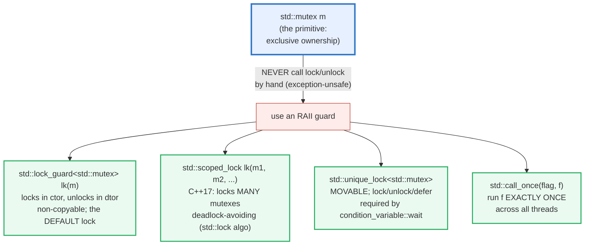
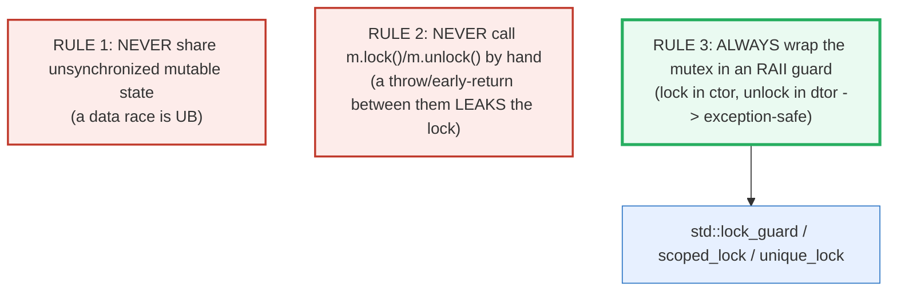
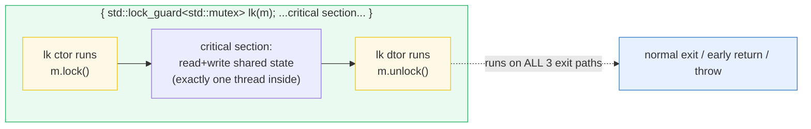
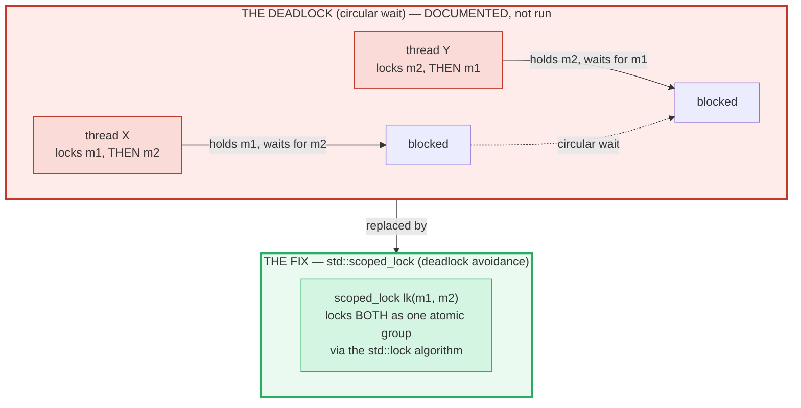

# MUTEX_LOCK_GUARD — std::mutex, lock_guard, scoped_lock, unique_lock & call_once

> **Goal (one line):** by printing every value, show how `std::mutex` serializes
> shared state, how **`std::lock_guard` (RAII)** makes locking exception-safe,
> how **`std::scoped_lock` (C++17)** acquires **multiple mutexes without
> deadlock**, how **`std::unique_lock`** is the movable lock for
> `condition_variable`, and how **`std::call_once`** runs an init exactly once
> across threads — and pin the **data-race-on-a-shared-int-is-UB** trap as a
> documented expert payoff (the racy variant is `#ifdef DEMO_UB`-gated, never on
> the verified path).
>
> **Run:** `just run mutex_lock_guard`
>
> **Ground truth:** [`mutex_lock_guard.cpp`](./mutex_lock_guard.cpp) → captured
> stdout in [`mutex_lock_guard_output.txt`](./mutex_lock_guard_output.txt). Every
> number/table below is pasted **verbatim** from that file under a
> `> From mutex_lock_guard.cpp Section X:` callout. Nothing is hand-computed.
>
> **Prerequisites:** 🔗 `RAII` (P3 — a `lock_guard` **is** RAII applied to a
> mutex), 🔗 `REFERENCES_POINTERS_INTRO` (P1 — shared state is reached via a
> reference/pointer). This is Phase 4 bundle #24, the **synchronization layer**.

---

## 1. Why this bundle exists (lineage)

A `std::thread` (🔗 `STD_THREAD`, P4) shares its stack with no one, but any two
threads that touch the **same** non-`const` object without synchronization are in
a **data race** — and a data race is **undefined behavior** (the central C++ trap,
🔗 `UNDEFINED_BEHAVIOR`, P7). The cure is **mutual exclusion**: a *mutex*
guarantees that only one thread at a time may enter a critical section, so the
shared state is touched by exactly one thread at a time.

C++ wraps that primitive in **RAII** (🔗 `RAII`, P3 — the same acquire-in-ctor /
release-in-dtor discipline that runs destructors and frees heap). The result is a
family of lock types, each with one job:



The headline contrast across the 5-language curriculum:

| Language | The lock primitive | RAII / automatic unlock | Guard carries the data? |
|---|---|---|---|
| **C++** (this bundle) | `std::mutex` | **`lock_guard`** (dtor unlocks at scope exit) | **no** — lock and data are separate |
| 🔗 [`../go/SYNC_PRIMITIVES.md`](../go/SYNC_PRIMITIVES.md) | `sync.Mutex` | **`defer mu.Unlock()`** (function-scope) | no |
| 🔗 [`../rust/MUTEX_RWLOCK.md`](../rust/MUTEX_RWLOCK.md) | `Mutex<T>` | the **guard is a borrow** — `lock().unwrap()` returns `MutexGuard<T>` that derefs to `T` | **yes** — you access `T` *through* the lock |
| 🔗 [`../ts/WORKER_THREADS.md`](../ts/WORKER_THREADS.md) | (single-threaded) | n/a — the **event loop** serializes; no mutex | n/a |

C++ is closest to **Go** (a separate lock object + manual discipline) but makes
the unlock **automatic and scope-bound** via RAII; it is *less* type-safe than
**Rust**, where the compiler forces you to reach the data *through* the guard.

> From cppreference — *`std::lock_guard`*: "a mutex wrapper that provides a
> convenient **RAII-style** mechanism for owning a mutex for the duration of a
> scoped block … When control leaves the scope … the `lock_guard` is destructed
> and the mutex is released … non-copyable." And *`std::scoped_lock`*: "If
> several mutexes are given, **deadlock avoidance algorithm is used as if by
> `std::lock`**."

---

## 2. The mental model: mutex = exclusive ownership; the guard = RAII on top

A `std::mutex` is the lowest layer — an object with two states, **locked by
exactly one thread** or **free**. The discipline has three rules:





The second diagram is the whole story of Section A. Because the **dtor** runs on
*every* exit path — normal end-of-scope, `return`, AND exception unwind — the
lock can **never** be forgotten. This is precisely RAII applied to a lock (🔗
`RAII`, P3): there is no `finally` in C++ because **the destructor IS the
`finally`**.

---

## 3. Section A — `std::mutex` + `std::lock_guard` (RAII lock/unlock)

> From `mutex_lock_guard.cpp` Section A:
> ```
> std::mutex: exclusive ownership. Manual m.lock()/m.unlock() is
> EXCEPTION-UNSAFE (a throw/early-return between them leaks the lock).
> Rule: NEVER call lock/unlock directly — wrap in an RAII guard.
>   inside { lock_guard<std::mutex> lk(m); } : mutex HELD (RAII acquire)
> [check] lock_guard constructed — mutex owned for the scope: OK
>   after scope exit: re-acquired via lock_guard lk2(m) — no deadlock,
>     so lk's dtor ran m.unlock(). lock_guard is non-copyable (= deleted).
> [check] lock_guard lk2 re-acquired after lk's scope (RAII unlock ran; no deadlock): OK
>   TRAP (documented, not executed): `lock_guard(mtx);` is a NAMED variable
>   `mtx`; `lock_guard{mtx};` is destroyed immediately. Always name the
>   guard: `std::lock_guard<std::mutex> lk(m);`.
> [check] guard variable `lk` is named (the unnamed forms are a silent bug): OK
> ```

**What.** `std::lock_guard<std::mutex> lk(m);` locks `m` in its constructor and
unlocks `m` in its destructor. `lock_guard` is **non-copyable** (`operator=` is
deleted) — ownership of a lock cannot be duplicated, only held by the one guard.

**Why — the dtor is the proof.** The bundle proves RAII actually ran the unlock
by *re-acquiring the same mutex* in the very next scope:

```cpp
{
    std::lock_guard<std::mutex> lk(m);   // ctor: m.lock()
    /* critical section */
}                                        // dtor: m.unlock()
std::lock_guard<std::mutex> lk2(m);      // re-acquires — if unlock had NOT
                                         // run, this would DEADLOCK (std::mutex
                                         // is non-recursive; same-thread double
                                         // lock is UB). It succeeds -> unlock ran.
```

Because `std::mutex` is **non-recursive** (a thread that already holds it locking
it again is UB / a deadlock), the fact that `lk2` succeeds is *proof* the
dtor's `unlock()` executed. The same mechanism is what makes a `lock_guard`
exception-safe: if the critical section throws, the stack unwinds and the dtor
still runs, so the lock is released — no `finally` needed.

> From cppreference — *`std::lock_guard` Notes*: "A common beginner error is to
> 'forget' to give a `lock_guard` variable a name, e.g. `std::lock_guard(mtx);`
> (which default constructs a `lock_guard` variable named `mtx`) or
> `std::lock_guard{mtx};` (which constructs a prvalue object that is immediately
> destroyed), thereby not actually constructing a lock that holds a mutex for the
> rest of the scope." → **always name the guard: `T lk(m);`.**

---

## 4. Section B — the data race (UB, documented) vs the mutex fix (exact count)

**This is the expert payoff of the bundle.** Two ways to spell "N threads each
increment a shared counter," two utterly different outcomes:

> From `mutex_lock_guard.cpp` Section B:
> ```
> mutex-protected: 8 threads x 100000 iters = expected 800000
>   actual counter = 800000
>   threads reported (sorted): 0 1 2 3 4 5 6 7 (collect+sort+join for deterministic stdout)
> [check] mutex-protected counter == N*ITERS (no lost updates): OK
> [check] exactly N_THREADS workers reported (all joined): OK
>   (DEMO_UB not defined: the racy increment is correctly omitted from
>    this build — running it would be a data race = undefined behavior.)
> ```

**The mutex-protected version is exact and deterministic.** 8 threads × 100000
increments = **exactly 800000**, every run, regardless of how the scheduler
interleaves the threads. The `lock_guard` serializes the `++ctr.value` so no two
increments overlap; the final value is the precise sum. (Note the
**collect+sort+join** discipline: worker threads never `printf` directly — they
record their index into a mutex-protected vector, and `main` sorts + prints after
every thread joins, so stdout is byte-identical across runs. This is
HOW_TO_RESEARCH §4.2 rule 4.)

### The trap, demonstrated (NOT in the verified path)

`counter++` looks atomic but is a **read-modify-write** (load, add, store). Two
threads doing it unsynchronized on a plain `int` is a **data race**, which is
**undefined behavior**. The bundle gates the racy version behind `#ifdef
DEMO_UB`, which `just run`/`just out`/`just check`/`just sanitize` **never**
pass, so the default and sanitizer builds stay UB-free:

```cpp
#ifdef DEMO_UB
    volatile long racy = 0;          // volatile != atomic; the race is still UB
    auto racer = [&]() {
        for (int i = 0; i < 1000000; ++i) {
            long cur = racy;         // volatile READ  (UB: racing with others)
            racy = cur + 1;          // volatile WRITE  — a non-atomic RMW
        }
    };
    // ... 4 threads run racer() concurrently ...
#endif
```

Compiling that block with `-DDEMO_UB` and running it printed
`[DEMO_UB] racy counter (no mutex) = 1061715 (expected 4000000; LOST updates; …)`
— and the number **varies run to run** (observed: 1118947, 1061715, 1007613).
That shortfall — roughly a quarter of the expected 4000000 — is the classic
**lost update**: thread A reads `5`, thread B reads `5`, both write `6`, one
increment is lost. Repeat a million times and most of the work evaporates. The
exact number is meaningless (UB), but the *pattern* (final ≪ expected, varies) is
the data race's signature.

(`volatile` is used **only** to force the compiler to emit a real load/store per
iteration so the lost-update interleaving is *visible*. `volatile` does **not**
make the access thread-safe — a data race on a `volatile` object is still UB.
ThreadSanitizer (`-fsanitize=thread`) flags this race; ASan/UBSan — what
`just sanitize` runs — do not detect data races, which is why the gate is
mandatory: the verified path must not contain the race at all.)

> From cppreference — *Data race* / *`std::mutex`*: "If the mutex is not
> currently locked by the calling thread, `lock()` … blocks … until the mutex is
> acquired." And the standard: "The execution of a program contains a **data
> race** if it is executed in two different threads, where … at least one
> modifies … the behavior is **undefined**."

---

## 5. Section C — `std::scoped_lock` (C++17): multiple mutexes, deadlock-free

Locking **two or more** mutexes is where a second, sneakier bug appears:
**deadlock by lock-ordering inversion**.



> From `mutex_lock_guard.cpp` Section C:
> ```
> scoped_lock(ma, mb): 8 threads x 50000 transfers, mixed A<->B directions
>   balance_a=1000  balance_b=1000  total=2000 (initial total=2000)
>   (scoped_lock acquired BOTH mutexes per transfer, NO deadlock occurred)
> [check] scoped_lock multi-mutex: total balance conserved (no lost money): OK
> [check] scoped_lock completed all transfers without deadlock (program reached here): OK
>   DEADLOCK trap (documented, not run): thread X locks ma THEN mb,
>   thread Y locks mb THEN ma -> circular wait -> HANG. Fix: lock BOTH
>   mutexes in a GLOBAL order, OR use scoped_lock(ma, mb) (deadlock avoidance).
> [check] deadlock trap understood (opposite-order locking -> circular wait): OK
> ```

**What.** The bundle models a bank: two accounts (`balance_a`, `balance_b`),
each guarded by its own mutex (`ma`, `mb`). 8 threads run transfers **in both
directions** concurrently (half A→B, half B→A). Each transfer must lock **both**
mutexes to move money atomically.

**Why `scoped_lock` is the fix.** If thread X locks `ma` then `mb` while thread Y
locks `mb` then `ma`, you get the **circular wait** in the diagram above — a
permanent hang (the bundle documents this trap; running it would freeze, so it is
not on the verified path). `std::scoped_lock lk(ma, mb);` (C++17) acquires **all**
its mutexes as one atomic group using the **`std::lock` deadlock-avoidance
algorithm** (lock-by-backoff-and-retry), so no global ordering discipline is
required. The bundle's invariant — **total balance conserved** (2000 → 2000) and
**the program completes** — holds precisely because `scoped_lock` never
deadlocks, no matter how the two transfer directions interleave.

**The two manual alternatives** (when you cannot use `scoped_lock`): (1) impose a
**global lock order** — always lock `ma` before `mb`, everywhere; or (2)
`std::lock(ma, mb);` then adopt into two guards:
`std::lock_guard<std::mutex> la(ma, std::adopt_lock);` / same for `mb`. Both are
more error-prone than `scoped_lock`; prefer `scoped_lock` whenever you lock ≥2
mutexes.

> From cppreference — *`std::scoped_lock`*: "If several mutexes are given,
> **deadlock avoidance algorithm is used as if by `std::lock`** … non-copyable."
> Corroborated by Microsoft Learn: "When multiple mutexes are provided, a
> **deadlock-avoidance algorithm (equivalent to `std::lock`)** is used to prevent
> deadlocks. Introduced in C++17."

---

## 6. Section D — `std::unique_lock` (movable) + `std::call_once` (one-shot)

> From `mutex_lock_guard.cpp` Section D:
> ```
> [check] unique_lock with defer_lock does not own the lock: OK
> [check] unique_lock owns the lock after .lock(): OK
> [check] moved-from unique_lock no longer owns the lock: OK
> [check] moved-to unique_lock in the vector still owns the lock: OK
> [check] mutex re-acquired after unique_lock vector cleared (RAII unlock ran): OK
> call_once across 8 threads: init ran 1 time(s) (exactly once)
> [check] call_once ran the init exactly once across N threads: OK
> ```

**`std::unique_lock<std::mutex>` — the movable lock.** Unlike `lock_guard`,
`unique_lock` is **movable** (you can put it in a container, return it from a
function) and supports **deferred / manual locking** via `owns_lock()`, `lock()`,
`unlock()`. That flexibility is exactly what `std::condition_variable::wait`
needs (🔗 `CONDITION_VARIABLES`, P4): `wait` must *release* the lock while the
thread sleeps and *re-acquire* it on wakeup — impossible with the rigid
`lock_guard`. The bundle proves movability: a `unique_lock` is `std::move`d into
a `vector`; the moved-from guard owns nothing (`owns_lock() == false`), the
moved-to guard still owns the lock, and clearing the vector runs the dtors that
unlock. Use `lock_guard` by default; reach for `unique_lock` **only** when you
need to move the lock or to lock/unlock within the scope (i.e., for condvars).

**`std::call_once` + `std::once_flag` — exactly-once init.** The lazy-singleton
idiom: no matter how many threads call `std::call_once(flag, f)` concurrently, `f`
runs **exactly once**, and every caller returns only after that one run is
complete. The bundle asserts `init_count == 1` across 8 threads. This is the
explicit form of what the language does for you automatically with
**function-local `static` initialization** (guaranteed thread-safe since C++11) —
prefer a function-local static where it fits, and `call_once` when you need the
explicit flag/lifetime control.

> From cppreference — *`std::unique_lock`*: "implements movable mutex ownership
> wrapper." *`std::call_once`*: "Executes the Callable `f` **exactly once** even
> if called concurrently … `std::once_flag` ensures that only one invocation is
> performed." And: "Initialization of function-local statics is guaranteed to
> occur only once even when called from multiple threads."

---

## 7. Section E — `std::mutex` vs `std::atomic` (atomic for simple counters)

> From `mutex_lock_guard.cpp` Section E:
> ```
> std::atomic<int>: 8 threads x 100000 iters = expected 800000; actual = 800000
> [check] atomic counter == N*ITERS (data-race-free; no mutex needed): OK
> Rule of thumb: std::atomic<T> for a single shared word/counter;
>   std::mutex for a critical section (several shared variables, or an
>   invariant that must hold as a whole). A mutex is heavier — on heavy
>   contention the runtime may enter the kernel to park/wake the thread.
> [check] mutex-vs-atomic trade-off documented (atomic=counter; mutex=critical section): OK
> Cross-language: Go sync.Mutex + `defer Unlock` is per-FUNCTION RAII;
>   C++ lock_guard is per-SCOPE. Rust Mutex<T> returns a GUARD that IS a
>   borrow -> you access the data THROUGH the lock; C++ separates the lock
>   from the data it guards. TS is single-threaded -> no mutex (the event
>   loop + async patterns replace it).
> ```

For a **single** shared word — a counter, a flag — `std::atomic<T>` is the right
tool: `++` is one (locked) read-modify-write that is **not** a data race (the
atomicity makes it well-defined), and it reaches exactly `N*ITERS` like the
mutex version. The difference is cost: a `std::atomic` is typically a user-space
CAS (compare-exchange) instruction, while a contended `std::mutex` may trap into
the **kernel** to park/wake the blocked thread. **Rule of thumb:** `atomic` for a
single counter; `mutex` for a *critical section* (several shared variables, or an
invariant that must hold as a whole). The deep end of `atomic` — the
`memory_order` orderings (relaxed / acquire-release / seq_cst) and the CAS loop
— is its own bundle (🔗 `ATOMICS_MEMORY_ORDER`, P4). (No timing numbers are
printed here: HOW_TO_RESEARCH §4.2 rule 2 forbids wall-clock measurements as
verified output.)

---

## 8. Worked smallest-scale example

Everything above, compressed to the four lines a beginner must memorize:

```cpp
std::mutex m;

// GOOD — RAII: lock in ctor, unlock in dtor (on return AND on throw):
{
    std::lock_guard<std::mutex> lk(m);   // m locked here
    shared_state++;                       // exactly one thread inside
}                                         // m.unlock() at scope exit

// TWO mutexes — deadlock-free via scoped_lock (C++17):
{
    std::scoped_lock lk(m1, m2);          // both locked as one atomic group
    transfer(a, b);
}                                         // both unlocked
```

> From `mutex_lock_guard.cpp` Section A, the re-acquire-after-scope check proves
> the dtor ran `m.unlock()`; Section C's `scoped_lock` reaches the conserved-total
> invariant without hanging; Section B's mutex-protected counter prints
> `actual counter = 800000` while the `#ifdef DEMO_UB` racy variant (run
> separately) printed `1061715 (expected 4000000)` — the contrast *is* the lesson.

---

## 9. The value-vs-reference-vs-pointer axis (threaded through this bundle)

All shared state in this bundle is reached **through a reference** captured by
each worker thread's lambda — the threads do not *own* the state, they *borrow*
it for the duration of `join()` (🔗 `REFERENCES_POINTERS_INTRO`, P1).

| Shared object in this bundle | Reached by | Guarded by | Owns? |
|---|---|---|---|
| `Counter::value` (Section B) | `&ctr` (reference capture) | `Counter::m` (`std::mutex`) | main owns; threads borrow |
| `Accounts` balances (Section C) | `&ac` (reference capture) | `ac.ma`, `ac.mb` | main owns; threads borrow |
| `init_count` (Section D) | `&` capture | `std::once_flag` + `std::atomic` | main owns |
| `a_ctr` (Section E) | `&a_ctr` (reference capture) | `std::atomic<int>` (self-guarding) | main owns |

The discipline: the **lock object** (or the atomic) is the synchronization
authority; the **data** it guards is a separate object reached by reference.
Contrast Rust (🔗 `MUTEX_RWLOCK.md`), where `Mutex<T>` *owns* the `T` and the
guard *is* the borrow that derefs to it — the compiler makes "touching the data
without the lock" a *compile error*, something C++ cannot do.

---

## 10. Pitfalls (the expert payoff)

| Trap | Symptom | Fix |
|---|---|---|
| `counter++` shared across threads, no mutex, no atomic | **data race = UB** — lost updates (final ≪ N*iters), or appears fine by luck then breaks under load/compiler change | Wrap in `std::lock_guard`, or make it `std::atomic<T>`. Catch with TSan (`-fsanitize=thread`). |
| Calling `m.lock()` / `m.unlock()` by hand | An early `return` or `throw` between them **leaks the lock** → deadlock or the next locker blocks forever | Always use an RAII guard (`lock_guard` / `scoped_lock` / `unique_lock`). |
| `std::lock_guard<std::mutex>(m);` or `{m}` (no name) | Silently constructs nothing useful — the mutex is **not** held for the scope (cppreference "Notes") | Name the guard: `std::lock_guard<std::mutex> lk(m);`. |
| Locking 2 mutexes in different orders across threads | **Circular-wait deadlock** (hang) | `std::scoped_lock(m1, m2)` (deadlock avoidance), or a global lock order, or `std::lock` + `adopt_lock`. |
| Same thread `m.lock()` twice | `std::mutex` is **non-recursive** → UB / deadlock | Use `std::recursive_mutex` (rarely; usually a design smell), or restructure so the re-entrant call doesn't re-lock. |
| `lock_guard` where you need to move the lock / `wait` on a condvar | `lock_guard` is non-copyable AND non-movable — can't be stored/returned, can't release-while-waiting | Use `std::unique_lock` (movable, `defer_lock`, `unlock`/`lock`). |
| Forgetting to `join()` a thread that touches shared state | The thread runs detached/abandoned → `std::terminate` or a use-after-`join` race | Always `join()` before the shared objects go out of scope (🔗 `STD_THREAD`, P4); prefer `std::jthread` (C++20, joins in dtor). |
| Using `volatile` "to make it thread-safe" | `volatile` does **not** synchronize — a race on a `volatile` object is still UB | Use `std::atomic<T>`; `volatile` is for memory-mapped I/O, not concurrency. |
| A `std::mutex` (or `once_flag`) that is **destroyed while locked** or copied | `std::mutex` is non-copyable/movable; destroying a locked mutex is UB | Make the mutex outlive all its users; store by value in a long-lived object, never copy. |
| Expecting a mutex to make a *single* counter fast | Mutex is heavier than needed (kernel on contention) | `std::atomic<T>` for one word; mutex only for a multi-variable critical section (🔗 `ATOMICS_MEMORY_ORDER`). |
| Locking a mutex in a callback that the callback's caller may also lock | Re-entrancy → non-recursive deadlock | Document lock discipline; avoid calling unknown code under a lock; use `recursive_mutex` only as a last resort. |

---

## 11. Cheat sheet

```cpp
#include <mutex>      // mutex, lock_guard, scoped_lock, unique_lock, call_once, once_flag
#include <thread>
#include <atomic>     // atomic (lighter than mutex for a single word)

// ── THE DEFAULT: lock_guard — RAII, non-copyable, locks one mutex ──────────
std::mutex m;
{
    std::lock_guard<std::mutex> lk(m);   // ctor m.lock(); dtor m.unlock()
    /* critical section — exactly one thread here at a time */
}                                        // unlocked on return AND on throw

// ── TWO+ MUTEXES: scoped_lock (C++17) — deadlock-free (std::lock algo) ──────
{
    std::scoped_lock lk(m1, m2);         // locks BOTH as one group; no order needed
    /* both mutexes held */
}                                        // both unlocked

// ── MOVABLE / DEFERRED: unique_lock — for condition_variable::wait ─────────
{
    std::unique_lock<std::mutex> lk(m, std::defer_lock);  // not locked yet
    lk.lock();                          // manual; lk.owns_lock() == true
    cv.wait(lk, [] { return ready; });  // releases lk while waiting, re-locks on wake
}                                        // unlocked
//   unique_lock can be std::move'd (into a container / returned); lock_guard cannot.

// ── EXACTLY-ONCE INIT: call_once + once_flag ───────────────────────────────
std::once_flag flag;
std::call_once(flag, [] { /* runs exactly once across all threads */ } );
//   (equivalent: a function-local `static` is initialized exactly once, thread-safe)

// ── THE NEVER-EVER RULES ───────────────────────────────────────────────────
//   m.lock(); ...; m.unlock();          // NEVER — leaks on throw/early return
//   std::lock_guard<std::mutex>(m);     // NEVER — names a var `m`, holds nothing
//   std::lock_guard<std::mutex>{m};     // NEVER — prvalue destroyed at once
//   ++shared_int;  (unsynchronized)     // NEVER — data race = UB
//   volatile int x;  (for "thread-safety") // NEVER — volatile != atomic; still UB

// ── WHEN TO USE WHAT ───────────────────────────────────────────────────────
//   std::atomic<T>     one shared word/counter (lighter; no kernel on contention)
//   std::lock_guard    one mutex, plain critical section   (the default)
//   std::scoped_lock   2+ mutexes at once                  (deadlock-free)
//   std::unique_lock   needs move / lock-unlock / condvar wait
//   std::call_once     lazy exactly-once init across threads
```

---

## 12. 🔗 Cross-references

**Within C++ (the expertise spine):**

- 🔗 `STD_THREAD` (P4) — `std::thread` / `join` / `detach`; this bundle assumes
  you can spawn and join threads. A thread that touches shared state MUST be
  joined before that state is destroyed.
- 🔗 `RAII` (P3) — **`lock_guard` IS RAII applied to a mutex** (acquire =
  `m.lock()` in the ctor; release = `m.unlock()` in the dtor). The "Lock" wrapper
  in RAII's Section C is exactly this.
- 🔗 `ATOMICS_MEMORY_ORDER` (P4) — `std::atomic<T>` for a single shared counter
  (lighter than a mutex); the `memory_order` orderings (relaxed / acquire-release
  / seq_cst) and the CAS loop.
- 🔗 `CONDITION_VARIABLES` (P4) — `std::condition_variable::wait` REQUIRES a
  `std::unique_lock<std::mutex>` (it must release-while-waiting, re-lock-on-wake);
  that is the reason `unique_lock` exists alongside `lock_guard`.
- 🔗 `UNDEFINED_BEHAVIOR` (P7) — the unsynchronized data race of Section B is a
  first-class UB trap; the full taxonomy (TSan detection, the as-if consequence)
  lands there.

**Cross-language parallels (the 5-language curriculum):**

- 🔗 [`../go/SYNC_PRIMITIVES.md`](../go/SYNC_PRIMITIVES.md) — Go's `sync.Mutex`
  with **`defer mu.Unlock()`** is the per-**function** RAII equivalent of C++'s
  per-**scope** `lock_guard`. `sync.RWMutex` ⟷ C++ `std::shared_mutex`. Go also
  has `sync.Once` ⟷ `std::call_once`.
- 🔗 [`../rust/MUTEX_RWLOCK.md`](../rust/MUTEX_RWLOCK.md) — Rust's `Mutex<T>`
  **owns** the `T`; `lock().unwrap()` returns a `MutexGuard<T>` that **is a
  borrow** — you access the data *through* the guard, so touching it without the
  lock is a **compile error**. C++ separates the lock from the data and trusts
  the programmer (catching misses at runtime via TSan or not at all). Rust's
  `Mutex` is movable like `unique_lock`.
- 🔗 [`../ts/WORKER_THREADS.md`](../ts/WORKER_THREADS.md) — JS is
  **single-threaded** with an event loop; there is no mutex. Concurrency is
  *cooperative* (async/await), so data races on plain variables cannot occur
  (Worker threads share memory only via `SharedArrayBuffer` + `Atomics` ⟷ C++
  `std::atomic`).

---

## Sources

Every signature, value, and behavioral claim above was verified against
cppreference and the ISO C++ standard, then corroborated by ≥1 independent
secondary source:

- cppreference — *`std::mutex`* (`lock`/`unlock`/`try_lock`, non-recursive,
  destroys-while-locked is UB, non-copyable/non-movable):
  https://en.cppreference.com/w/cpp/thread/mutex
- cppreference — *`std::lock_guard`* (RAII wrapper; non-copyable; the
  unnamed-variable trap in "Notes"):
  https://en.cppreference.com/w/cpp/thread/lock_guard
  - *`std::lock_guard` Notes* (the `std::lock_guard(mtx);` / `{mtx};` beginner
    error): https://en.cppreference.com/w/cpp/thread/lock_guard#Notes
- cppreference — *`std::scoped_lock`* (C++17; "If several mutexes are given,
  **deadlock avoidance algorithm is used as if by `std::lock`**"; non-copyable):
  https://en.cppreference.com/w/cpp/thread/scoped_lock
  - *`std::lock`* (the deadlock-avoidance algorithm scoped_lock delegates to):
    https://en.cppreference.com/w/cpp/thread/lock
- cppreference — *`std::unique_lock`* (movable mutex-ownership wrapper;
  `defer_lock`/`try_to_lock`/`adopt_lock`; `owns_lock`; used by
  `condition_variable::wait`):
  https://en.cppreference.com/w/cpp/thread/unique_lock
- cppreference — *`std::call_once`* / *`std::once_flag`* ("Executes the Callable
  `f` exactly once"; function-local statics are also exactly-once):
  https://en.cppreference.com/w/cpp/thread/call_once
  https://en.cppreference.com/w/cpp/thread/once_flag
- cppreference — *Data race* ("two threads … at least one modifies … behavior is
  **undefined**") + *`std::memory_order`* (the atomicity exception):
  https://en.cppreference.com/w/cpp/language/memory_model
  https://en.cppreference.com/w/cpp/atomic/memory_order
- ISO C++23 draft (open-std.org) — normative wording:
  - 33.5 Mutual exclusion `[thread.mutex]`
  - 33.5.4 Locks `[thread.lock]` (lock_guard / scoped_lock / unique_lock)
  - 6.9.2 Data races `[intro.races]`
  - Working draft: https://open-std.org/JTC1/SC22/WG21/docs/papers/2023/n4950.pdf
- Secondary corroboration (≥2 independent sources, web-verified) for the
  **`scoped_lock` deadlock-avoidance** claim:
  - Microsoft Learn — *`scoped_lock` Class*: "When multiple mutexes are provided,
    a **deadlock-avoidance algorithm (equivalent to `std::lock`)** is used to
    prevent deadlocks. Introduced in C++17.":
    https://learn.microsoft.com/en-us/cpp/standard-library/scoped-lock-class
  - open-std.org P3833R0 — *`std::multi_lock`*: "When locking multiple mutexes,
    … must avoid deadlock. The implementation can use a similar
    deadlock-avoidance algorithm as `std::lock`.":
    https://www.open-std.org/jtc1/sc22/wg21/docs/papers/2025/p3833r0.html
  - Stack Overflow — *How do I lock multiple mutexes without deadlock?*:
    https://stackoverflow.com/questions/73393902/how-do-i-lock-multiple-mutexes-without-deadlock-and-without-potential-infinite-b
  - Harvard CS61 — *Section 9: Threads and atomics* ("use `std::scoped_lock` —
    which can lock more than one mutex at a time while avoiding deadlock"):
    https://cs61.seas.harvard.edu/site/2019/Section9/
- Secondary corroboration for the **`call_once` exactly-once** claim:
  - Arthur O'Dwyer — *`std::once_flag` is a glass hill* (lazy-init idiom;
    function-local static as the equivalent):
    https://quuxplusone.github.io/blog/2020/10/23/once-flag/
  - Modernes C++ (Rainer Grimm) — *Thread-Safe Initialization of Data*:
    https://www.modernescpp.com/index.php/thread-safe-initialization-of-data/
  - kuniga.me — *Understanding `std::call_once()` in C++*:
    https://www.kuniga.me/blog/2024/03/01/understanding-call-once-in-cpp.html
- Secondary corroboration for the **data-race-is-UB / lost-update** claim:
  - cppreference — *`std::thread`* / *memory model* (a data race is UB):
    https://en.cppreference.com/w/cpp/language/memory_model
  - learncpp.com — *12.2 Data races*:
    https://www.learncpp.com/cpp-tutorial/data-races/

**Facts that could not be verified by running** (documented, not executed,
because executing them would be UB or a permanent hang): the unsynchronized
`counter++` data race and its lost-update result (UB — the printed number varies
run to run; demonstrated only behind `-DDEMO_UB`, off the verified path); the
opposite-order multi-mutex **deadlock** (would hang forever, so it is documented
and never run); and the assignment `lk = other;` to a `lock_guard` (a compile
error — `operator=` is deleted). These are confirmed by the cppreference sections
and secondary sources above, not reproduced as runnable output in the verified
path (a file triggering them would fail `just check` / `just sanitize`).
