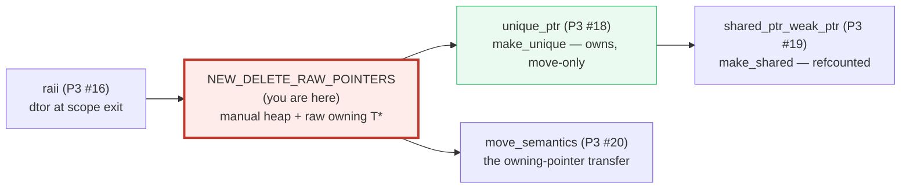
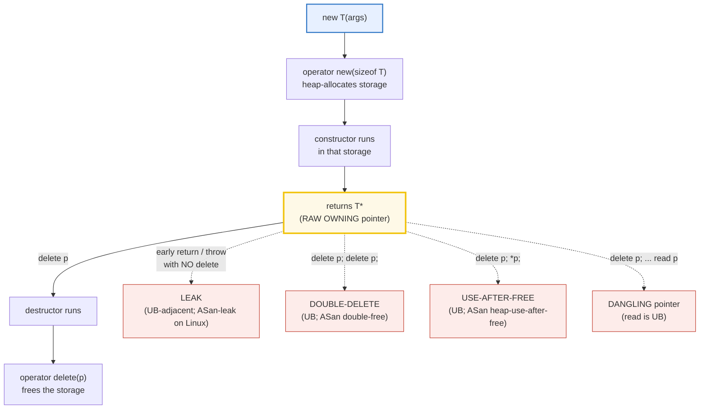
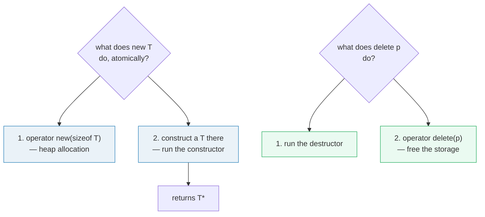

# NEW_DELETE_RAW_POINTERS — `new`/`delete`, Raw Owning Pointers & the UB Traps

> **Goal (one line):** show, by printing every value, how `new`/`delete`/`new[]`/
> `delete[]` drive **raw owning pointers** — the MANUAL memory foundation modern
> C++ AVOIDS — pinning the **leak / double-delete / use-after-free / dangling-
> pointer** UB traps as DOCUMENTED expert payoffs (gated behind `#ifdef DEMO_UB`
> so the verified path stays UB-free and `just sanitize` clean).
>
> **Run:** `just run new_delete_raw_pointers`
>
> **Ground truth:** [`new_delete_raw_pointers.cpp`](./new_delete_raw_pointers.cpp)
> → captured stdout in
> [`new_delete_raw_pointers_output.txt`](./new_delete_raw_pointers_output.txt).
> Every number/table below is pasted **verbatim** from that file under a
> `> From new_delete_raw_pointers.cpp Section X:` callout. Nothing is
> hand-computed.
>
> **Prerequisites:** 🔗 `REFERENCES_POINTERS_INTRO` (P1 — raw `T*` syntax),
> 🔗 `SCOPE_LIFETIMES` (P1 — automatic vs dynamic storage duration, the
> destructor-at-scope-exit preview = RAII). This is the **manual** layer that
> RAII (P3 #16) and the smart pointers (P3 #18-19) replace.

---

## 1. Why this bundle exists (lineage)

`new` allocates an object on the **heap** (dynamic storage duration) **and**
calls its constructor, returning a raw `T*`; `delete` calls the destructor
**and** frees the storage. The object's lifetime is now **decoupled from any
scope** — it lives until *you* write the matching `delete`. That freedom is the
whole problem.



This bundle is the **manual** memory layer. Modern C++ **avoids** it — but you
MUST understand it because (1) it underpins every smart pointer (`unique_ptr`'s
destructor literally calls `delete`), (2) **every** leak / double-delete /
use-after-free / dangling-pointer bug class lives here, and (3) legacy code, C
interoperability, and ABI boundaries still use it. Mastering it means knowing
*exactly* why we moved to RAII.

The headline contrast across the 5-language curriculum:

| Language | Manual free? | Bug class | Safety net |
|---|---|---|---|
| **C++** (this bundle) | **yes — `delete`** | leak / double-free / UAF / dangling = **UB** | sanitizers (runtime), RAII (idiom) |
| 🔗 [`../rust/`](../rust/) | no `delete` — `Box`/`Arc` **own** | **rejected at compile time** (borrow checker) | the type system |
| 🔗 [`../go/`](../go/) | no — **GC** reclaims | no manual double-free/UAF | garbage collector |
| 🔗 [`../ts/`](../ts/) · [`../python/`](../python/) | no — **GC** | no manual double-free/UAF | garbage collector |

C++ (with C) is the only language in this curriculum that gives you a raw
`delete` **and** makes getting it wrong **undefined behavior**. That is why this
bundle spends three sections (C, D, and the mismatch in B) on the traps.

> From cppreference — *`new` expression*: "The `new` expression attempts to
> allocate storage and then attempts to construct and initialize either a single
> unnamed object, or an unnamed array of objects in the allocated storage. The
> `new` expression returns a prvalue pointer to the constructed object."

---

## 2. The mental model: `new` ↔ heap object ↔ raw owning pointer ↔ `delete`

A raw pointer returned by `new` **owns** the object it points to (in the
manual-memory discipline — contrast a *non-owning* `T*` that merely borrows).
Ownership means **the obligation to `delete` exactly once**.



The solid path is the **1:1 match** (one `new` ↔ one `delete`, same form). The
four dashed edges are the **UB traps** this bundle documents (and gates behind
`#ifdef DEMO_UB` so the verified path never executes them). The whole point of
🔗 `unique_ptr` (P3 #18) is to make that solid path **automatic** — its
destructor calls `delete` at scope exit, collapsing all four dashed edges.



---

## 3. Section A — `new` (heap-alloc + ctor) and `delete` (dtor + free); the 1:1 match

> From `new_delete_raw_pointers.cpp` Section A:
> ```
> 1) SCALAR: `new int(42)` -> int*   (heap-alloc + initialize)
>    *p = 42
> [check] new int(42) returned a non-null pointer whose object == 42: OK
>    delete p;   (int is trivial: NO dtor runs, then the storage is freed)
> [check] after delete the raw pointer was nulled out (dangling-prevention hygiene): OK
> 
> 2) CLASS TYPE: `new Traced(7)` -> the ctor runs DURING new
>     [ctor] Traced(7)         (live now = 1)
>    t->value = 7
> [check] new Traced(7) constructed an object with value == 7: OK
> [check] exactly ONE Traced instance is live after `new Traced(7)`: OK
>    delete t;   (the dtor runs FIRST, then the storage is freed)
>     [dtor] ~Traced() value=7  (live now = 0)
> [check] after delete the Traced instance count returned to 0 (no leak): OK
> 
> 3) THE 1:1 MATCH RULE — every `new` needs EXACTLY ONE matching `delete`:
>      new T      <->  delete p;      (non-array form)
>      new T[n]   <->  delete[] p;    (array form — Section B)
>    0 new + 1 delete, or 1 new + 2 deletes => UNDEFINED BEHAVIOR (Section D).
> [check] the 1:1 match rule: new/delete and new[]/delete[] pair by form: OK
> ```

**What.** `new T(args)` does two things as one atomic operation: it
**heap-allocates** (by calling `operator new(sizeof(T))`) and then
**constructs** a `T` there, running the constructor. It returns a `T*` — a
**raw owning pointer**. `delete p` is the mirror image: it runs the
**destructor first**, then calls `operator delete` to free the storage.

**Why the bundle's `Traced` type exists.** Its constructor and destructor
**print**, and an `inline static int live` counter tracks live instances. This
makes the ctor↔`new` / dtor↔`delete` pairing **observable** (so neither the
optimizer at `-O2` nor the sanitizer can elide it) and lets every section
**assert** that each `new`'d object is eventually destroyed (no leak in the
verified path). Note: **no pointer address is ever printed** — heap addresses
are non-deterministic across runs (ASLR), which would break the byte-identical
`just out` ×2 determinism rule (🔗 `HOW_TO_RESEARCH` §4.2).

**The expert details.**

- **`new int(42)` has no destructor to run** — `int` is a trivial type. `delete p`
  therefore only frees; no `[dtor]` line appears for the scalar. The class case
  (`new Traced(7)`) is where you see the destructor fire, *inside* `delete`.
- **`delete p;` does NOT zero the pointer.** The pointer still holds the old
  (now-freed) address — it is **dangling**. The bundle's hygiene line
  `p = nullptr;` after every `delete` is the manual defense (a later
  `delete nullptr` or `*nullptr`... well, `delete nullptr` is a defined no-op;
  dereferencing it is still UB — see Section D). `unique_ptr` removes the need
  for this ritual entirely.
- **`delete nullptr` is a defined no-op.** Per cppreference, "the default
  deallocation functions are guaranteed to do nothing when passed a null
  pointer." So nulling-after-delete is *safe*, not *required for correctness of
  the free* — its value is purely defensive (it makes a subsequent accidental
  `delete p` benign instead of a double-free).

> From cppreference — *`delete` expression*: "`ptr` must be one of: a null
> pointer, a pointer to a non-array object created by a `new`-expression, or a
> pointer to a base subobject… If `ptr` is anything else, the behavior is
> **undefined**." And: "If `ptr` is a null pointer value, no destructors are
> called, and the deallocation function may or may not be called… the default
> deallocation functions are guaranteed to do nothing when passed a null
> pointer."

---

## 4. Section B — `new[]`/`delete[]` (array form); a form MISMATCH is UB

> From `new_delete_raw_pointers.cpp` Section B:
> ```
> 1) `new int[5]{10,20,30,40,50}` -> int* (points at the FIRST element)
>    arr[0] = 10
>    arr[1] = 20
>    arr[2] = 30
>    arr[3] = 40
>    arr[4] = 50
>    sum(arr) = 150
> [check] new int[5]{...} initialized all 5 elements: OK
> [check] array contents sum to 150: OK
> 
>    delete[] arr;   (frees the WHOLE array — must NOT be `delete arr;`)
> [check] array form matched: new[] freed with delete[]: OK
> 
> 2) CLASS ARRAY: `new Traced[3]` -> 3 default ctors run DURING new[]
>     [ctor] Traced()           (live now = 1)
>     [ctor] Traced()           (live now = 2)
>     [ctor] Traced()           (live now = 3)
> [check] new Traced[3] ran 3 ctors (live instances == 3): OK
> 
>    delete[] objs;  -> 3 dtors run in REVERSE construction order (3,2,1)
>     [dtor] ~Traced() value=3  (live now = 2)
>     [dtor] ~Traced() value=2  (live now = 1)
>     [dtor] ~Traced() value=1  (live now = 0)
> [check] delete[] destroyed all 3 array elements (live back to 0): OK
> 
> 3) THE FORM-MISMATCH TRAP — UB (gated behind DEMO_UB; never verified):
>    `delete  p;`  on a `new T[n]` pointer  => UB (1 dtor, wrong free size)
>    `delete[] p;` on a `new T`   pointer   => UB (reads a bogus array cookie)
> [check] new/delete AND new[]/delete[] must be paired BY FORM (mismatch == UB): OK
>    (DEMO_UB not defined: the mismatch UB is correctly omitted from this build.)
> ```

**What.** `new T[n]` allocates + default-constructs `n` elements and returns a
`T*` to the **first** element. `delete[] p` destroys **all** `n` elements — in
**reverse construction order** (visible above: dtors fire `value=3`, then `2`,
then `1`) — then frees. The two forms must **match by form**.

**Why reverse order?** The standard mandates `delete[]` destroy "from the last
element to the first." The bundle proves it: the `[dtor]` lines print in the
order `3 → 2 → 1`, the exact reverse of the `1 → 2 → 3` construction order
(implied by the rising `live` counter during `new[]`).

**The array cookie — and why the mismatch is UB.** A `new T[n]` typically stores
the element count `n` in a hidden header before the first element (the "array
cookie") so `delete[]` knows how many destructors to run. The pointer `new[]`
returns points **past** that cookie, at the first element. Now the trap:

- **`delete p;` on a `new[]` pointer** calls *one* destructor (or none for a
  trivial type) and hands `operator delete` the **element** pointer, not the
  cookie pointer — so the allocator gets the wrong address/size. **UB.**
- **`delete[] p;` on a `new` pointer** backs up from the element pointer looking
  for an array cookie that **isn't there**, reads a garbage count, and runs that
  many destructors over unrelated memory. **UB.**

> From cppreference — *`delete` expression*: "If `ptr` is anything else,
> including if it is a pointer obtained by the array form of `new`-expression,
> the behavior is **undefined**" (for `delete`); symmetrically for `delete[]`
> on a non-array `new` pointer.

The bundle gates the mismatch behind `#ifdef DEMO_UB` (so the verified path
never executes it). Note `-Wall` even **catches the simple cases at compile
time**: building with `-DDEMO_UB` emits `-Wmismatched-new-delete` ("'delete'
applied to a pointer that was allocated with 'new[]'") — a useful early-warning,
but it only fires when the compiler can *see* both sides, so it is no substitute
for matching the forms yourself (or, better, using `std::vector`/`unique_ptr<T[]>`).

---

## 5. Section C — the LEAK trap: a `new` with no matching `delete`

> From `new_delete_raw_pointers.cpp` Section C:
> ```
> THE TRAP — any early exit between `new` and `delete` LEAKS:
>      // BAD (leaks on the early return):
>      //   Traced* p = new Traced(99);
>      //   if (some_condition) return;   // <-- LEAK: p never deleted
>      //   delete p;
> 
> THE RAII FIX (P3 #18, unique_ptr): the smart pointer's DESTRUCTOR runs at
> scope exit — on EVERY path — and that dtor calls `delete`. Leak = impossible.
>      // GOOD (unique_ptr OWNS it; its dtor deletes):
>     [ctor] Traced(99)         (live now = 1)
>    up->value = 99   (owned by the unique_ptr)
> [check] unique_ptr owns a live Traced(99): OK
>     [dtor] ~Traced() value=99  (live now = 0)
> [check] after the inner scope closed, the unique_ptr auto-deleted (live == 0, no leak): OK
> 
> RAII generalizes: std::shared_ptr, std::vector, std::string, std::lock_guard,
> std::fstream... ALL tie resource release to scope exit. See raii (P3 #16).
> 
> (DEMO_UB not defined: the deliberate leak is correctly omitted from this build.)
> ```

**What.** A leak is a `new` whose matching `delete` is **never reached**. The
object stays live on the heap, unreachable, for the rest of the program. The
classic shapes:

- **early return / `throw` between `new` and `delete`** — the bundle's commented
  `BAD` example. This is the most common shape in real code.
- **the pointer is overwritten** — `p = new T; p = nullptr;` loses the only
  handle to the object.
- **the pointer goes out of scope** — `void f() { T* p = new T; }` leaks at `}`.

**Why the verified path doesn't demonstrate the leak directly.** A real leak is
only *caught* by ASan's **leak detector**, which is **Linux-only** (macOS ASan
does not support `detect_leaks`; see the `Justfile` note). So to keep the
verification portable *and* clean, the bundle (a) shows the leak *shape* in
comments, (b) demonstrates the **RAII fix** in the verified path (the
`unique_ptr` block — watch `[dtor]` fire at scope exit, `live` back to 0), and
(c) gates the actual leaking `new` behind `#ifdef DEMO_UB`.

**The RAII fix.** `std::make_unique<Traced>(99)` returns a `unique_ptr<Traced>`
whose **destructor calls `delete`**. Because the destructor runs at **scope
exit on every path** — normal fall-through, early `return`, even exception
unwind — the 1:1 match becomes **automatic and unavoidable**. The leak trap
collapses. This is the single most important lesson of the bundle: **never own
a raw `new` pointer; wrap it the moment it is born** (🔗 `unique_ptr`, P3 #18).

> From cppreference — *`new` expression / Memory leaks*: "The objects created by
> `new` expressions… persist until the pointer returned by the `new` expression
> is used in a matching `delete`-expression. If the original value of pointer is
> lost, the object becomes unreachable and cannot be deallocated: a *memory
> leak* occurs." And: "the result of a `new` expression is often stored in a
> smart pointer: `std::unique_ptr`, or `std::shared_ptr`… These pointers
> guarantee that the `delete` expression is executed in the situations shown
> above."

---

## 6. Section D — DOUBLE-DELETE / USE-AFTER-FREE / DANGLING: all UB

> From `new_delete_raw_pointers.cpp` Section D:
> ```
> After `delete p;` the object's lifetime has ENDED; the storage is freed.
> The pointer VALUE still sits in `p`, but it now DENOTES NOTHING — a DANGLING
> pointer. Three classic UB traps follow from this:
> 
>    TRAP 1 — DOUBLE-DELETE:   delete p; delete p;        => UB
>    TRAP 2 — USE-AFTER-FREE:  delete p; *p; / p->f();    => UB
>    TRAP 3 — DANGLING read:   delete p; int x = *p;      => UB
> 
> THE VERIFIED (safe) SHAPE: new, use, delete, then NULL OUT the pointer so it
> cannot be accidentally double-deleted or dereferenced:
>    int* q = new int(55);   -> *q = 55
> [check] q points at a live int == 55: OK
> [check] after delete, q was nulled out (no dangling pointer left): OK
> 
> THE RAII FIX: a unique_ptr CANNOT be double-deleted (its dtor runs once,
> at scope exit) and CANNOT be used after free (the object is alive for the
> whole lifetime of the unique_ptr). The bug class is designed away.
> 
> (DEMO_UB not defined: the double-delete / UAF / dangling UB is omitted.)
> [check] verified path: no double-delete, no UAF, no dangling-deref (all gated): OK
> ```

**What.** `delete p` ends the object's lifetime and frees the storage, but
**leaves the pointer value sitting in `p`**. That value now denotes **nothing**
— a **dangling pointer**. Three UB traps fall straight out of that:

| Trap | Code | Why it's UB |
|---|---|---|
| **double-delete** | `delete p; delete p;` | the second `delete` sees a pointer that is *not* "a pointer to an object created by `new`" — it was already freed. |
| **use-after-free** | `delete p; p->f();` | `p` denotes ended lifetime; the member access reads/writes freed storage. |
| **dangling read** | `delete p; int x = *p;` | same — reading through a pointer whose object is gone. |

**The verified path here is deliberately the *safe* shape** — `new`, use,
`delete`, then **null out** the pointer — so `just sanitize` stays clean. The
traps themselves are gated behind `#ifdef DEMO_UB`. Building that gate
(`-DDEMO_UB`) and running under ASan **does** fire:

```
==ERROR: AddressSanitizer: attempting double-free on 0x6020000001b0 in thread T0:
SUMMARY: AddressSanitizer: double-free new_delete_raw_pointers.cpp:332 in main
```

(exit code 134 = `SIGABRT`). That is the proof the traps are *real* and that
ASan catches them at runtime — exactly the safety net `just sanitize` exercises
on the verified path (where it stays clean).

**The RAII fix (again).** A `unique_ptr` **cannot** be double-deleted (its
destructor runs **once**, at scope exit — there is no second `delete` to write)
and **cannot** be used-after-free (the owned object is alive for the *entire*
lifetime of the `unique_ptr`). The whole bug class is **designed away** by
making the 1:1 match automatic. This is why the bundle's recurring message is:
*the manual layer is where these bugs live; RAII is where they die.*

> From cppreference — *`delete` expression*: after the first `delete`, `ptr` is
> no longer "a pointer to a non-array object created by a `new`-expression", so
> the precondition of the second `delete` is violated → **undefined behavior**.
> And from *`new` expression / Memory leaks*: storing the `new` result in a
> smart pointer "guarantee[s] that the `delete` expression is executed."

---

## 7. Section E — placement `new`, `operator new`/`delete` customization, the lesson

> From `new_delete_raw_pointers.cpp` Section E:
> ```
> 1) PLACEMENT NEW: construct an object in PRE-ALLOCATED memory (no allocation).
>    Used by std::vector/std::optional/std::any to split storage from object.
>    YOU must manually call the dtor — placement-new memory is NOT freed.
> 
>    alignas(Traced) unsigned char buf[4];   (raw, correctly-aligned storage)
>     [ctor] Traced(314)         (live now = 1)
>    placed->value = 314   (constructed inside buf, no heap allocation)
> [check] placement new constructed a Traced(314) in local storage: OK
> [check] the placement-new'd object is live (count == 1): OK
>     [dtor] ~Traced() value=314  (live now = 0)
> [check] manual ~Traced() ended the object's lifetime (count == 0): OK
>    (buf itself is automatic storage — reclaimed at scope exit; NO delete here!)
> 
> 2) operator new / operator delete CUSTOMIZATION (global & class-specific):
>    `new T`    calls operator new(sizeof(T))   [or a class-specific overload];
>    `delete p` calls operator delete(p)        [or a class-specific overload].
>    You may REPLACE the globals, or give a class its OWN, to instrument/arena/pool.
>     [Tracker::operator new] allocating 4 bytes
>    t->id = 7
> [check] Tracker(7) was allocated via its class-specific operator new: OK
>     [Tracker::operator delete] freeing
> 
> 3) THE LESSON — NEVER use raw new/delete in modern C++:
>    every leak / double-delete / use-after-free / dangling bug class LIVES at
>    this layer. RAII smart pointers (P3 #18-19) make the 1:1 match AUTOMATIC:
>      std::make_unique<T>(...)  -> std::unique_ptr<T>   (owning, move-only)
>      std::make_shared<T>(...)  -> std::shared_ptr<T>   (refcounted sharing)
>    Their destructors call `delete` exactly once, on exactly one path.
> 
>    CROSS-LANGUAGE — this whole bug class is a C/C++ peculiarity:
>      Rust:   NO new/delete. Box<T>/Arc<T>/Vec OWN; the borrow checker makes
>              double-free & use-after-free COMPILE-TIME ERRORS.
>      Go/TS/Python: a garbage collector frees unreachable objects — no `delete`,
>              no manual double-free / UAF (cost: nondeterministic GC pauses).
> [check] placement new + class-specific operator new/delete both demonstrated UB-free: OK
> ```

### 7a. Placement `new` — construct in pre-allocated memory

`::new (buf) T(args)` is the **placement** form: it runs the constructor **in
storage you already own** (`buf`) and does **no allocation**. Because no
allocation happened, **no `delete` should be used** — instead you **manually
call the destructor** (`placed->~Traced()`) and then reclaim `buf` by its own
storage duration (here, automatic — freed at scope exit).

Two non-obvious but critical rules:

- **Alignment.** The storage must be aligned for `T`. The bundle uses
  `alignas(Traced) unsigned char buf[sizeof(Traced)];` to guarantee it. Writing
  into a misaligned buffer and then constructing a `T` there is UB (misaligned
  access). (🔗 `CASTS` for `reinterpret_cast`/`std::start_lifetime_as`
  caveats.)
- **Manual destructor.** Because the storage isn't freed by the destructor call,
  forgetting `placed->~T()` leaks the object's *non-memory* resources (file
  handles, mutexes, …) — though the raw bytes of `buf` are still reclaimed at
  scope exit.

This is exactly how `std::vector`, `std::optional`, and `std::any` work
internally: they hold **raw storage** and placement-`new` objects into it /
destroy them as elements come and go — *decoupling storage from object lifetime*.

### 7b. `operator new` / `operator delete` customization

`new`/`delete` are **two-layer**: the *expression* (`new T`) calls an
*allocation function* named `operator new`, and you may **replace** that
function. Two customization points:

- **Global replacement** — define `void* operator new(std::size_t)` at namespace
  scope; every `new` in the program routes through it (used for arena/pool
  allocators, instrumentation, override tracking).
- **Class-specific** — a `static` member `operator new`/`operator delete` is
  preferred for `new T` of that class (the bundle's `Tracker` does this: note
  the `[Tracker::operator new] allocating 4 bytes` / `[Tracker::operator
  delete] freeing` lines).

A leading `::` (`::new T`, `::delete p`) **forces the global** form, bypassing
class-specific overloads. (C++17 adds aligned forms taking `std::align_val_t`
for over-aligned types; C++20 adds "destroying delete".)

### 7c. The lesson — and the cross-language view

Every leak / double-delete / use-after-free / dangling bug in C++ **lives at
this manual layer**. The modern discipline: **never write a bare `new` whose
result you store in a raw owning pointer**. Wrap it the instant it is born:

```cpp
std::unique_ptr<T>  u = std::make_unique<T>(args);   // owns; dtor deletes — P3 #18
std::shared_ptr<T>  s = std::make_shared<T>(args);   // refcounted; P3 #19
```

Their destructors call `delete` **exactly once, on exactly one path** — the 1:1
match becomes a property of the type, not a discipline of the programmer.

**Cross-language** — this entire bug class is a C/C++ peculiarity:

- 🔗 [`../rust/`](../rust/) — **no `new`/`delete`**. `Box<T>` (unique),
  `Arc<T>`/`Rc<T>` (shared), `Vec<T>` (array) **own**, and the **borrow
  checker** makes double-free and use-after-free **compile-time errors**. The
  bug class C++ still has, Rust *forbids by construction*. (C++'s `unique_ptr`
  ≈ Rust's `Box`, but without the compile-time aliasing guarantee.)
- 🔗 [`../go/`](../go/) — **garbage collected**. `new(T)` / `&T{}` allocate; you
  never `delete`; unreachable objects are collected. No manual double-free/UAF
  (cost: nondeterministic GC pauses, no deterministic destruction — which is why
  `defer`/`runtime.SetFinalizer` are weaker than C++ RAII).
- 🔗 [`../ts/`](../ts/) · [`../python/`](../python/) — **GC** as well; objects
  freed when unreachable. No manual `delete`, no double-free/UAF.

> From cppreference — *`new` expression / Placement new*: "Such allocation
> functions are known as 'placement new'… You must **manually** call the
> object's destructor." And *Allocation*: "The `new` expression allocates
> storage by calling the appropriate allocation function… the C++ program may
> provide global and class-specific replacements for these functions."

---

## 8. Worked smallest-scale example

Everything above, compressed to the four lines a beginner must memorize — and
the one line an expert writes instead:

```cpp
int*  p = new int(42);   // new:  heap-alloc + construct -> owning T*
*p = 7;                  // use it
delete p;                // delete: destruct (trivial for int) + free  (1:1 match!)
p = nullptr;             // hygiene: p is now DANGLING until reassigned

// ── the EXPERT form (never the manual one above) ──────────────────────────
auto u = std::make_unique<int>(42);   // owns; dtor deletes at scope exit
```

> From `new_delete_raw_pointers.cpp` Section A: `new int(42)` prints `*p = 42`
> and `[check] new int(42) returned a non-null pointer whose object == 42: OK`,
> then `delete p` and the null-out. Section C's `unique_ptr` block prints the
> matching `[ctor] Traced(99)` … `[dtor] ~Traced() value=99` pair *with no
> manual `delete` written*. The contrast **is** the lesson.

---

## 9. The value-vs-reference-vs-pointer axis (threaded through this bundle)

This bundle is the **owning** extreme of the pointer axis (🔗
`VALUE_VS_REFERENCE_VS_POINTER`, P3 #21). Where does each thing here sit?

| Construct in this bundle | Owns? | Borrows? | Who frees? |
|---|---|---|---|
| `int* p = new int(42);` (raw owning pointer) | **yes** (manual discipline) | no | **you** — exactly one `delete p` |
| `int* q = &local_int;` (raw non-owning pointer) | no | **yes** | the owner of `local_int` (its scope) |
| `delete p;` then `p` itself | the **pointer object** `p` is automatic | — | freed at its own scope exit (the *pointee* was freed by `delete`) |
| `std::unique_ptr<T> u` | **yes** (RAII) | no | **its destructor** — at `u`'s scope exit |
| placement-`new`'d object in `buf` | you manage lifetime manually | — | **you** call `~T()`; `buf` reclaims at scope exit |
| `Tracker*` from `new Tracker` w/ class `operator new` | **yes** | no | you `delete` → class `operator delete` |

The crux: a raw `T*` **does not say** whether it owns. `new`'s return value
*owns*; `&x` *borrows*; the type is identical. **This ambiguity is the root
cause of every bug in this bundle** — and exactly what `unique_ptr`/`shared_ptr`
remove by making ownership **a property of the type** (🔗 `RULE_OF_0_3_5`, P3 #22).

---

## 10. Pitfalls (the expert payoff)

| Trap | Symptom | Fix |
|---|---|---|
| **leak** — `new` with no matching `delete` (early return / throw / overwrite / scope exit) | grows RSS; ASan **leak detector** (Linux only) reports at exit | wrap in `unique_ptr`/`make_unique` (P3 #18) the instant it is born; **never** store a bare `new` in a raw owning pointer. |
| **double-delete** — `delete p; delete p;` | **UB**; ASan "attempting double-free" (exit 134); heap corruption / crash | one `delete` per `new`; null the pointer after; or use `unique_ptr` (dtor runs once). |
| **use-after-free** — `delete p; p->f();` | **UB**; ASan "heap-use-after-free"; silent corruption or crash | `unique_ptr` keeps the object alive for the whole pointer lifetime; pass *non-owning* `T*`/`T&` only while the owner is known alive. |
| **dangling pointer read** — `delete p; int x = *p;` | **UB**; reads freed/garbage storage | same — don't outlive the owner; prefer `unique_ptr`. |
| **form mismatch** — `delete` on `new[]`, or `delete[]` on `new` | **UB**; `-Wmismatched-new-delete` catches the *visible* cases at compile time; ASan "alloc-dealloc-mismatch" at runtime | match the forms; prefer `std::vector` / `unique_ptr<T[]>`. |
| **forgetting the array is `delete[]`** | the scalar `delete` runs 1 dtor + wrong free → UB | `delete[]` for `new[]`; or `std::vector`/`unique_ptr<T[]>`. |
| **placement `new` without manual `~T()`** | leaks non-memory resources (handles, locks); the bytes are reclaimed but the object isn't destroyed | always pair placement-`new` with an explicit `p->~T()`. |
| **placement `new` into misaligned storage** | misaligned access → slow on x86, **crash** on some ARM, UB everywhere | `alignas(T) unsigned char buf[sizeof(T)];` (the bundle's form). |
| **`delete`-ing through a base with non-virtual dtor** | **UB** — only the base dtor runs; the derived part leaks | base destructor must be `virtual` (🔗 the "forgetting the virtual destructor" trap). |
| **`delete this;` / owning the wrong object** | lifetime errors, double-free | don't — let an owner (`unique_ptr`) manage it. |
| **mixing `malloc`/`free` with `new`/`delete`** | **UB** — different allocators; `free`'ing a `new`'d pointer corrupts the heap | pair each allocator with its own deallocator; prefer `new`/`delete` (or RAII) over `malloc`/`free` in C++. |
| **relying on `delete` to zero the pointer** | it does **not** — `p` keeps the freed address (dangling) | `p = nullptr;` after `delete`, or use `unique_ptr`. |
| **`operator new` returns `nullptr`?** | it does **not** — on failure the *throwing* `operator new` throws `std::bad_alloc`; only `new (std::nothrow) T` can return `nullptr` | check `nullptr` only if you used `std::nothrow`; otherwise catch `std::bad_alloc`. |
| **assuming leak detection on macOS** | macOS ASan has **no** `detect_leaks` — a leak is silent there | run leak-sensitive tests on Linux ASan / Valgrind; don't rely on macOS ASan to catch leaks. |

---

## 11. Cheat sheet

```cpp
// ── the 1:1 match: one new <-> one delete, BY FORM ────────────────────────
T*  p = new T(args);     // heap-alloc + construct  -> OWNING T*
T*  a = new T[n];        // heap-alloc + default-construct n  -> T* (first elem)
delete p;                // destruct + free   (NON-array form)
delete[] a;              // destruct all n (reverse order) + free  (array form)
p = nullptr;             // hygiene: deleted pointer is DANGLING until reassigned
//   delete nullptr;     // defined NO-OP (safe).  *nullptr  is UB.

// ── the FOUR UB traps (all live at this manual layer) ─────────────────────
//   LEAK:           new with no delete  (early return/throw/overwrite/scope)
//   DOUBLE-DELETE:  delete p; delete p;
//   USE-AFTER-FREE: delete p; *p;  / p->f();
//   DANGLING read:  delete p; ... *p
//   FORM MISMATCH:  delete on new[]  /  delete[] on new   (all UB; ASan catches)

// ── placement new: construct in YOUR storage; YOU call the dtor ───────────
alignas(T) unsigned char buf[sizeof(T)];
T* placed = ::new (buf) T(args);   // NO allocation
placed->~T();                      // MANUAL dtor; buf reclaims at its scope exit

// ── operator new / operator delete customization ──────────────────────────
//   global:    void* operator new(std::size_t);            // replaceable
//   class:     static void* operator new(std::size_t);     // preferred for new T
//   force global form:  ::new T  /  ::delete p             (bypass class overload)

// ── THE LESSON: never bare-own; wrap the instant it is born ───────────────
auto u = std::make_unique<T>(args);   // unique_ptr: owns, move-only; dtor deletes
auto s = std::make_shared<T>(args);   // shared_ptr: refcounted; dtor deletes at 0
//   their dtors call delete EXACTLY ONCE, on EXACTLY ONE path -> the 4 traps die.
```

---

## 12. 🔗 Cross-references

**Within C++ (the expertise spine):**

- 🔗 `RAII` (P3 #16) — the deterministic-cleanup idiom this bundle keeps invoking:
  a destructor tied to scope exit. `unique_ptr` *is* RAII for `new`/`delete`.
- 🔗 `UNIQUE_PTR` (P3 #18) — **THE** replacement for everything in Sections A-D.
  Exclusive ownership, `std::make_unique`, move-only, custom deleters. (⟷ Rust
  `Box`.)
- 🔗 `SHARED_PTR_WEAK_PTR` (P3 #19) — refcounted shared ownership
  (`std::make_shared`); `weak_ptr` to break cycles. (⟷ Rust `Rc`/`Arc`/`Weak`.)
- 🔗 `MOVE_SEMANTICS` (P3 #20) — how an *owning* pointer is transferred
  (`unique_ptr` is move-only); the moved-from state.
- 🔗 `VALUE_VS_REFERENCE_VS_POINTER` (P3 #21) — the owning-vs-borrowing axis this
  bundle sits at the extreme of (§9).
- 🔗 `RULE_OF_0_3_5` (P3 #22) — when YOU write a destructor (because you manage a
  raw resource like this bundle's `new`'d pointer), the Rule of 3/5 applies; the
  Rule of 0 says prefer RAII members so you don't.
- 🔗 `SCOPE_LIFETIMES` (P1) — dynamic storage duration (the one `new` creates) vs
  automatic/static; the destructor-at-scope-exit preview that becomes RAII.
- 🔗 `REFERENCES_POINTERS_INTRO` (P1) — raw `T*` syntax; this bundle assumes it.
- 🔗 `UNDEFINED_BEHAVIOR` (P7) — the full UB taxonomy; the four traps here
  (leak/double-delete/UAF/dangling) are central members, demonstrated under
  ASan/UBSan.

**Cross-language parallels (the 5-language curriculum):**

- 🔗 [`../rust/`](../rust/) — **no `new`/`delete`**. `Box<T>`/`Arc<T>`/`Rc<T>`/
  `Vec<T>` **own**; the **borrow checker** makes double-free and use-after-free
  **compile-time errors**. The bug class C++ still has, Rust forbids by
  construction. C++'s `unique_ptr` ≈ `Box` *minus* the compile-time alias
  guarantee; C++'s `shared_ptr` ≈ `Arc` *minus* the thread-safety-by-default.
- 🔗 [`../go/`](../go/) — **garbage collected**. `new(T)`/`&T{}` allocate; you
  never `delete`; no manual double-free/UAF (cost: no deterministic destruction —
  `defer`/finalizers are weaker than RAII).
- 🔗 [`../ts/`](../ts/) · [`../python/`](../python/) — **GC** as well; objects
  freed when unreachable. No `delete`, no double-free/UAF (cost: nondeterministic
  collection).

---

## Sources

Every signature, value, and behavioral claim above was verified against
cppreference and the ISO C++ standard, then corroborated by ≥1 independent
secondary source:

- cppreference — *`new` expression* (allocates + constructs; returns `T*`;
  array form `new T[n]`; placement `new`; the **Memory leaks** section; the
  **Initialization failure** / matching-deallocation rules; `operator new`/
  `operator new[]` allocation functions):
  https://en.cppreference.com/w/cpp/language/new
  - *Placement new*: "Such allocation functions are known as 'placement new'…
    You must **manually** call the object's destructor."
  - *Memory leaks*: "If the original value of pointer is lost, the object
    becomes unreachable and cannot be deallocated: a *memory leak* occurs."
  - *Allocation*: "The `new` expression allocates storage by calling the
    appropriate allocation function… the C++ program may provide global and
    class-specific replacements for these functions."
- cppreference — *`delete` expression* (`ptr` must be null / a `new`'d object /
  a base subobject, else UB; array form `delete[]`; destructors run before
  deallocation; null pointer is a no-op; class-specific `operator delete`
  lookup; `::delete` forces global):
  https://en.cppreference.com/w/cpp/language/delete
  - "If `ptr` is anything else, including if it is a pointer obtained by the
    array form of `new`-expression, the behavior is **undefined**."
  - "the default deallocation functions are guaranteed to do nothing when
    passed a null pointer."
- cppreference — *`operator new`/`operator new[]`* (replaceable global + class-
  specific allocation functions; aligned `std::align_val_t` overloads since
  C++17; the standard placement `void* operator new(std::size_t, void*)`):
  https://en.cppreference.com/w/cpp/memory/new/operator_new
- cppreference — *`operator delete`/`operator delete[]`* (deallocation functions;
  destroying delete since C++20; sized deallocation):
  https://en.cppreference.com/w/cpp/memory/new/operator_delete
- cppreference — *Storage duration* (dynamic storage duration created by `new`;
  object lifetime ends at `delete`):
  https://en.cppreference.com/w/cpp/language/storage_duration
- cppreference — *Object lifetime* (placement-`new` ends/restarts lifetime in
  reused storage; the `[basic.life]` rules this bundle's placement-new demo
  honors):
  https://en.cppreference.com/w/cpp/language/lifetime
- ISO C++23 draft (open-std.org) — normative wording:
  - 7.6.2.8 `new`-expression `[expr.new]`
  - 7.6.2.9 `delete`-expression `[expr.delete]`
  - 6.7.6 Storage duration `[basic.stc]` (dynamic via `new`)
  - Working draft: https://open-std.org/JTC1/SC22/WG21/docs/papers/2023/n4950.pdf
- Secondary corroboration (≥2 independent sources, web-verified):
  - **double-delete is UB** — Stack Overflow, *"What happens in a double
    delete?"* (cites the C++ standard; "It is undefined behaviour"):
    https://stackoverflow.com/questions/9169774/what-happens-in-a-double-delete
  - **use-after-free is UB; ASan catches it** — Ohio Supercomputer Center,
    *HOWTO: Use Address Sanitizer* ("A use-after-free bug occurs when a program
    tries to read or write to memory that has already been freed. This is
    undefined behavior"):
    https://www.osc.edu/resources/getting_started/howto/howto_use_address_sanitizer
  - **placement new + manual destructor** — Eli Bendersky, *"The many faces of
    operator new in C++"* (placement form; explicit destructor call is valid):
    https://eli.thegreenplace.net/2011/02/17/the-many-faces-of-operator-new-in-c
  - **placement new + manual destructor (corroborating)** — isocpp.org, *C++ FAQ
    / Destructors* ("Unless you used placement new, you should simply delete the
    object rather than explicitly calling the destructor"):
    https://isocpp.org/wiki/faq/dtors
  - **operator new/delete customization + placement new** — GeeksforGeeks,
    *"Placement new operator in C++"*:
    https://www.geeksforgeeks.org/cpp/placement-new-operator-cpp/
  - **leak / double-free / UAF detected by ASan** — m-peko, *"Be Wise,
    Sanitize — Keeping Your C++ Code Free From Bugs"* (ASan detects
    "use-after-free, double-free, buffer overflows"):
    https://m-peko.github.io/craft-cpp/posts/be-wise-sanitize-keeping-your-cpp-code-free-from-bugs/

**Facts that could not be verified by running** (documented, not executed in the
verified path, because executing them IS undefined behavior or is gated by
design): the actual double-free / use-after-free / dangling-read outcomes (UB —
ASan aborts with `SIGABRT`/exit 134, demonstrated only under `-DDEMO_UB`); the
`new[]`/`delete` form-mismatch outcome (UB; `-Wmismatched-new-delete` catches
the *visible* cases at compile time, ASan `alloc-dealloc-mismatch` at runtime);
the macOS-ASan absence of leak detection (a platform limitation — leaks are
silent there and must be checked on Linux/Valgrind); and the `std::bad_alloc`
throwing path (the throwing `operator new` aborts by throwing, never returns
`nullptr` — only `new (std::nothrow) T` can return null). These are confirmed by
the cppreference sections and secondary sources above, not reproduced as
verified-path output (a verified path triggering them would fail `just check` /
`just sanitize`).
