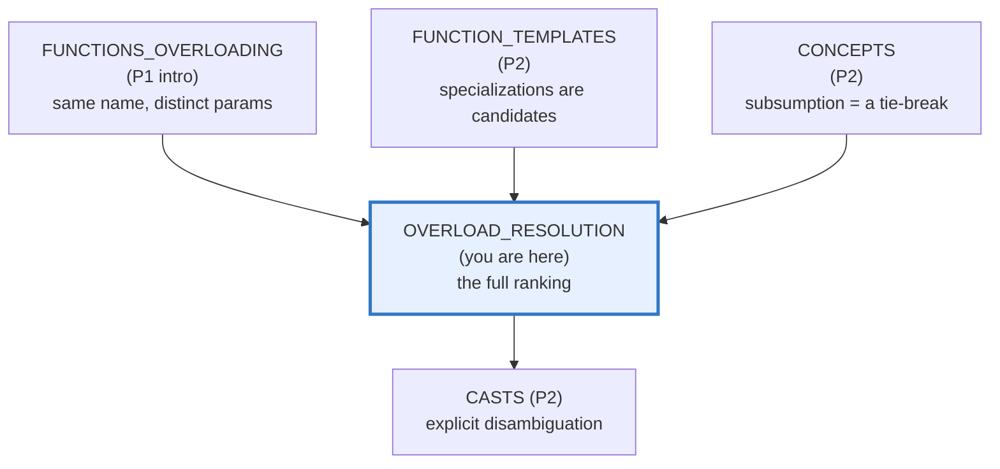
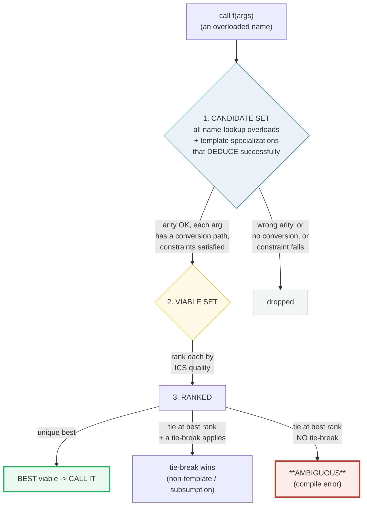
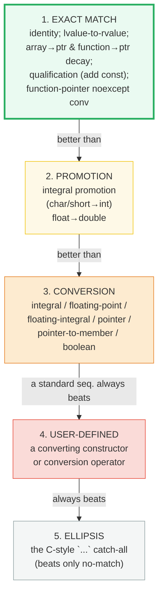

# OVERLOAD_RESOLUTION — The Candidate Funnel, ICS Ranking & Tie-Breakers

> **Goal (one line):** by printing every value, show how C++ **overload resolution**
> builds a **candidate set**, filters it to **viable functions**, then ranks the
> viables by **implicit-conversion-sequence** quality
> (`exact > promotion > standard conversion > user-defined > ellipsis`) and picks
> the **best** — breaking ties with *"non-template beats template"* and
> *"more-constrained concept wins (subsumption)"*, and turning an unbroken
> equal-rank tie into **ambiguity** (a compile error).
>
> **Run:** `just run overload_resolution`
>
> **Ground truth:** [`overload_resolution.cpp`](./overload_resolution.cpp) →
> captured stdout in
> [`overload_resolution_output.txt`](./overload_resolution_output.txt). Every
> number/tag below is pasted **verbatim** from that file under a
> `> From overload_resolution.cpp Section X:` callout. Nothing is hand-computed.
>
> **Prerequisites:** 🔗 [`FUNCTIONS_OVERLOADING.md`](./FUNCTIONS_OVERLOADING.md)
> (P1 — the *intro*: same name, distinct params, pass-by value/ref/ptr), 🔗
> [`FUNCTION_TEMPLATES.md`](./FUNCTION_TEMPLATES.md) (P2 — template specializations
> are candidates too), 🔗 [`CONCEPTS.md`](./CONCEPTS.md) (P2 — subsumption, the
> modern tie-break). This bundle is the **deep dive** the P1 intro promised.

---

## 1. Why this bundle exists (lineage)

🔗 [`FUNCTIONS_OVERLOADING.md`](./FUNCTIONS_OVERLOADING.md) introduced *overloading*
and gave a one-line preview of the ranking. But it left the actual machinery a
black box: *how*, exactly, does the compiler pick one of N same-named functions?
This bundle opens that box. Overload resolution is a **deterministic, well-specified
funnel** that runs on every call to an overloaded name, on every operator use
involving a class/enum, and on every constructor/initialization. Knowing it
precisely is what separates "I added an overload and it works" from "I added an
overload and now the compiler says *ambiguous*."



The headline cross-language contrast — **who has name-based overload resolution
at all?** Only C++:

| Language | Name-based overloading? | How you spell "print an int / print a double" |
|---|---|---|
| **C++** (this bundle) | **yes** — `print(int)` / `print(double)` coexist; resolution ranks them | one name, distinct param types |
| 🔗 [`../go/FUNCTIONS_CLOSURES.md`](../go/FUNCTIONS_CLOSURES.md) | **no** — one signature per name | rename (`printInt`/`printDouble`), or 🔗 [`../go/GENERICS.md`](../go/GENERICS.md) type params / [`../go/INTERFACES_BASICS.md`](../go/INTERFACES_BASICS.md) |
| 🔗 [`../rust/`](../rust/) | **no** — one signature per name | `impl Trait for Type` (a trait can have one method per type) |

Because Go and Rust give each name exactly one signature, **there is nothing to
rank** — C++'s whole ICS machinery has no counterpart there. That is why this
bundle is C++-specific.

> From cppreference — *Overload resolution*: "the compiler must determine which
> overload to call. In simple terms, the overload whose parameters match the
> arguments most closely is the one that is called. In detail, overload
> resolution proceeds through the following steps: 1. Building the set of
> **candidate functions**. 2. Trimming the set to only **viable functions**.
> 3. Analyzing the set to determine the single **best viable function** (this
> may involve ranking of implicit conversion sequences)."

---

## 2. The mental model: the 3-stage funnel



The funnel narrows at each stage. Stage 1 is a *lookup* question (what's
visible?), stage 2 is a *can-it-even-work* question (right arity + a conversion
path for every arg + the concept constraint satisfied), stage 3 is the *which is
closest* question ranked by **implicit-conversion-sequence (ICS)** quality.

### The ICS rank ladder

A standard conversion sequence is assigned one of three ranks; user-defined and
ellipsis conversions sit *below* the whole standard-sequence ladder:



> From cppreference — *Ranking of implicit conversion sequences*: "Each type of
> standard conversion sequence is assigned one of three ranks: **Exact match** …
> **Promotion** … **Conversion** …" and "A standard conversion sequence is
> **always better** than a user-defined conversion sequence or an ellipsis
> conversion sequence. A user-defined conversion sequence is **always better**
> than an ellipsis conversion sequence."

---

## 3. Section A — The pipeline: candidate set → viable → ranked → best

> From `overload_resolution.cpp` Section A:
> ```
> Candidates visible for the name `s`: s(char), s(int), s(double), s(const char*).
> Argument: char c = 'A';
> Stage 2 (viability): s(const char*) DROPPED (no char -> const char* conversion).
> Stage 3 (ranking):   s(char)=exact > s(int)=promotion > s(double)=conversion.
> Result: pipe::s(c) -> tag 1  (s(char), the EXACT match, is the BEST viable)
> [check] for a char arg, pipe::s picks s(char) (exact match, tag 1): OK
>
> The dropped s(const char*) is still a real candidate — for a const char* arg
> it is the EXACT match: pipe::s(cp) -> tag 4
> [check] for a const char* arg, pipe::s picks s(const char*) (tag 4): OK
>
> If s(char) were absent, s(int) [promotion] would be the best viable for `c`.
> [check] the funnel picks the unique best-ranked viable, else it is ambiguous: OK
> ```

The bundle's `pipe::s` is one name with **four** overloads. For a `char`
argument the funnel does exactly what the diagram in §2 promises:

1. **Candidate set** = all four (name lookup found them all).
2. **Viability** keeps `s(char)`, `s(int)`, `s(double)` (a `char` converts to
   each) and **drops** `s(const char*)` — there is no `char → const char*`
   conversion path, so it cannot match this argument. Dropping is silent: a
   non-viable candidate simply does not compete.
3. **Ranking** assigns each viable an ICS rank: `s(char)` exact, `s(int)`
   promotion, `s(double)` conversion. The unique best (exact) wins → tag 1.

The dropped `s(const char*)` is **not** dead code: it is a perfectly real
overload that wins for its own argument type (`pipe::s(cp)` → tag 4, an exact
match for a `const char*`). "Not viable *for this argument*" ≠ "not a candidate."

---

## 4. Section B — The ICS ranking ladder + the trivial "exact" conversions

> From `overload_resolution.cpp` Section B:
> ```
> Argument throughout: char c = 'A';
>   char->char = EXACT ; char->int = PROMOTION ; char->double = CONVERSION.
>
> exact_vs_promo { f(char)=1, f(int)=2 }  f(c) -> 1  (exact beats promotion)
> [check] exact (char->char) beats promotion (char->int): OK
> promo_vs_conv  { f(int)=1, f(double)=2 } f(c) -> 1  (promotion beats conversion)
> [check] promotion (char->int) beats conversion (char->double): OK
> exact_vs_conv  { f(char)=1, f(double)=2 } f(c) -> 1  (exact beats conversion directly)
> [check] exact (char->char) beats conversion (char->double): OK
>
> std_vs_udc { f(long)=1, f(const FromInt&)=2 } f(int) -> 1  (standard conv int->long beats user-defined int->FromInt)
> [check] standard conversion (int->long) beats user-defined (int->FromInt): OK
> udc_vs_ellipsis { f(const string&)=1, f(...)=2 } f("s") -> 1  (user-defined const char*->string beats ellipsis)
> [check] user-defined (const char*->string) beats ellipsis: OK
> ```

The ladder is proven **pairwise**: two visible overloads, one argument, the
winner's tag names the better rank. `char` is the canonical demo argument
because `char→char` is **exact**, `char→int` is a **promotion** (integral
promotion — `int` can represent every `char` value and outranks it), and
`char→double` is a **conversion** (floating-integral). Three pairwise tests pin
the order: exact > promotion, promotion > conversion, exact > conversion.

The two rungs *below* the standard sequence are then pinned:

- **standard > user-defined** — `std_vs_udc::f(int)` is viable both as `f(long)`
  (an `int→long` integral **conversion**, a standard sequence) and as
  `f(const FromInt&)` (an `int→FromInt` **user-defined** conversion via the
  constructor). The standard sequence wins → tag 1.
- **user-defined > ellipsis** — `udc_vs_ellipsis::f("s")` is viable both as
  `f(const std::string&)` (a `const char*→std::string` **user-defined**
  conversion) and as `f(...)` (the **ellipsis**). User-defined wins → tag 1.

> From cppreference — *Integral promotion*: "`char` -> `int` (promotion)" and
> "for a given source type, the destination type of integral promotion is unique
> … overload resolution chooses `char` -> `int` (promotion) over `char` ->
> `short` (conversion)." *Floating-point promotion*: "`float` can be converted to
> `double`. The value does not change. This conversion is called *floating-point
> promotion*."

### The trivial conversions that all count as "exact match"

> From `overload_resolution.cpp` Section B (trivial conversions):
> ```
> The TRIVIAL conversions (all rank EXACT MATCH per cppreference):
>   identity   T->T            : trivIdentity(42)        = 42
>   array decay int[3]->int*   : trivArrayDecay(int[3])  = 10 (a[0])
>   qual conv  int*->const int*: trivQualAdd(int*)       = 7 (*p)
>   fn decay   void()->void(*)(): trivFnDecay(&fn)       = 1
>   ref bind   T& <- T lvalue   : trivRefBind(int&)      = 9
> [check] trivial identity conversion selects the overload (42): OK
> [check] array-to-pointer decay is viable: a[0] == 10: OK
> [check] qualification conversion (add const) is viable: *p == 7: OK
> [check] function-to-pointer decay is viable: target ran (tag 1): OK
> [check] reference binding to an lvalue is viable: x == 9: OK
> ```

These five "do almost nothing" conversions are what make `f(int*)` accept an
`int[3]`, or `f(const int*)` accept an `int*`, **without** dropping out of the
exact-match rank. They are why a "perfect fit" overload stays rank 1:

| Trivial conversion | Example | Why it's "free" |
|---|---|---|
| **Identity** | `int → int` | literally no conversion |
| **lvalue-to-rvalue** | reading an `int` lvalue's value | every value computation |
| **array→pointer decay** | `int[3] → int*` | `int a[3]; f(a);` matches `f(int*)` |
| **function→pointer decay** | `void g()` → `void(*)()` | `f(g)` matches `f(void(*)())` |
| **qualification** (add cv) | `int* → const int*` | `const`-addition is exact |
| **function-pointer noexcept** | `void() noexcept → void()` (C++17) | dropping `noexcept` is exact |

> From cppreference — *Ranking of implicit conversion sequences*: "**Exact
> match**: no conversion required, lvalue-to-rvalue conversion, qualification
> conversion, function pointer conversion, user-defined conversion of class type
> to the same class." And *Implicit conversions — Order of the conversions*: a
> standard conversion sequence is "zero or one … lvalue-to-rvalue, array-to-
> pointer, or function-to-pointer" then "zero or one numeric promotion or numeric
> conversion" then "zero or one qualification conversion."

---

## 5. Section C — Ambiguity: equal-rank viables + no tie-break = compile error

> From `overload_resolution.cpp` Section C:
> ```
> The classic ambiguity: int arg vs f(long) and f(double).
>   int->long  = integral CONVERSION (rank 'conversion')
>   int->double= floating-integral CONVERSION (rank 'conversion')
>   Both best-rank, no tie-break applies -> AMBIGUOUS (compile error).
> [check] two equal-rank viables with no tie-break => ambiguous (documented): OK
>
> Fix #1 (cast the argument):
>   amb2::a(static_cast<long>(0))   -> tag 1  (a(long),  now exact)
>   amb2::a(static_cast<double>(0)) -> tag 2  (a(double),now exact)
> [check] cast to long selects a(long) (tag 1): OK
> [check] cast to double selects a(double) (tag 2): OK
>
> Fix #2 (add an exact-match overload):
>   amb3 { a(int)=1, a(long)=2, a(double)=3 }  amb3::a(0) -> tag 1  (a(int) exact)
> [check] adding a(int) makes amb3::a(0) select a(int) (exact, tag 1): OK
>
>     (DEMO_AMBIGUOUS not defined: the ambiguous amb2::a(0) call is omitted.)
>     Enabling it yields: error: call to 'a' is ambiguous
>       note: candidate function: int amb2::a(long)
>       note: candidate function: int amb2::a(double)
> ```

**Ambiguity is the failure mode of the funnel.** When two viables tie at the
best rank *and* none of the tie-break rules (§6) applies, the compiler refuses
to guess: it is a **hard compile error**, not a warning. The textbook trigger is
an `int` argument against `f(long)` and `f(double)`:

- `int → long` is an integral **conversion**;
- `int → double` is a floating-integral **conversion**;

both rank "conversion," so neither is better, and there is no non-template-vs-
template or subsumption rule to break the tie. (This is cppreference's own
canonical example: `void f(long); void f(float); f(0); // error: ambiguous`.)

### How to resolve an ambiguity

1. **Cast the argument** so the chosen overload becomes an exact match.
   `amb2::a(static_cast<long>(0))` makes `a(long)` rank-1 (exact), which
   outranks `a(double)`'s conversion. (Casts are the explicit-disambiguation
   escape hatch — see 🔗 `CASTS`.)
2. **Add an exact-match overload.** Introducing `a(int)` makes `amb3::a(0)`
   resolve to `a(int)` (exact) — the conversions no longer compete.
3. **Constrain the candidates** (Section D): give each overload a different
   concept constraint so only one is viable per argument type.

The offending bare call `amb2::a(0)` is gated behind `#ifdef DEMO_AMBIGUOUS`,
which `just run`/`out`/`check`/`sanitize` never pass — a file containing it
would not compile, so the verified path documents the error text instead of
triggering it (the same gating discipline `VALUES_TYPES` uses for the UB read).

---

## 6. Section D — Tie-breakers: non-template beats template; concept subsumption

> From `overload_resolution.cpp` Section D:
> ```
> nt { int nt(int)=1 [non-template], int nt<T>(T)=2 [template] }  nt(7) -> 1
>   (both exact; tie-break #4: the NON-TEMPLATE wins)
> [check] non-template nt(int) beats equally-good template nt<T> (tie-break #4): OK
>
> pick { template<integral T>=1, template<signed_integral T>=2 }
>   signed_integral SUBSUMES integral (it adds is_signed on top).
>   pick(7)  [int]     -> 2  (both match; the MORE-CONSTRAINED signed_integral wins)
>   pick(7u) [unsigned] -> 1  (only integral matches; unsigned is not signed)
> [check] pick(int) selects the more-constrained signed_integral overload (tag 2): OK
> [check] pick(unsigned) selects the only-viable integral overload (tag 1): OK
> ```

When two viables have ICS of **equal** quality, resolution falls through to an
ordered list of **tie-break rules** (cppreference, "Best viable function," rules
#1–#12). Two of them matter day-to-day:

**Tie-break #4 — non-template beats template.** `nt(int)` and `nt<T=int>` are
*both* exact matches for an `int` argument — equal rank. Rule #4 hands the win
to the **non-template**: tag 1. This is why a hand-written `int nt(int)` is
preferred over an equally-good `template<typename T> int nt(T)`, the basis of
"provide a non-template fast path alongside a generic template."

**Tie-break #6 (templates) — subsumption.** 🔗 [`CONCEPTS.md`](./CONCEPTS.md)
introduced **subsumption**: if concept B's constraint *includes* concept A's,
then `template <B T>` is *more constrained* than `template <A T>`, and the
more-constrained overload wins when both match. `std::signed_integral` is
defined as `std::integral<T> && std::is_signed_v<T>`, so `signed_integral`
**subsumes** `integral`. The bundle proves it both ways:

- `pick(7)` — `int` satisfies **both** `integral` and `signed_integral`; both
  overloads are viable and equally ranked, and the **more-constrained**
  `signed_integral` wins → tag 2.
- `pick(7u)` — `unsigned` satisfies `integral` but **not** `signed_integral`
  (it isn't signed); only the `integral` overload is viable → tag 1.

> From cppreference — *Best viable function*: "`F1` is determined to be a better
> function than `F2` if implicit conversions for all arguments of `F1` are not
> worse than … `F2`, and … `F1` is a **non-template function while `F2` is a
> template specialization**" and "`F1` and `F2` are non-template functions and
> `F1` is **more partial-ordering-constrained** than `F2`." *Constraints*: "The
> subsumption relation defines a partial ordering on constraints … used to
> determine the best viable candidate."

---

## 7. Section E — The ellipsis catch-all + cross-language (Go/Rust)

> From `overload_resolution.cpp` Section E:
> ```
> e { int e(int)=1, int e(...)=2 }  e(7) -> 1  (exact beats ellipsis)
> [check] e(7): exact-match e(int) beats ellipsis e(...) (tag 1): OK
> e("hi"): e(int) not viable (no const char* -> int) -> e(...) -> 2
> [check] e("hi"): only ellipsis viable (tag 2); it beats no-match: OK
>
> Cross-language: who has name-based FUNCTION OVERLOADING?
>   C++  : YES — pick(int)/pick(double)/pick(T) coexist; resolution ranks them.
>   Go   : NO  — one signature per name; rename (printInt/printDouble) or interfaces.
>   Rust : NO  — traits + generics; `impl Trait for Type` is the substitute.
>   (C++'s whole ranking machinery has no counterpart in Go/Rust: there is nothing
>    to rank when each name has exactly one signature.)
> [check] of {C++, Go, Rust}, only C++ has name-based overload resolution: OK
> ```

**The ellipsis is the cellar of the ladder.** A C-style variadic `...` parameter
accepts anything after a default-argument promotion, but its ICS rank is
**worse than every standard and every user-defined sequence** — it beats only
"no viable candidate at all." So `e(7)` prefers `e(int)` (exact), and `e("hi")`
falls through to `e(...)` only because `e(int)` is not viable for a string
literal. The ellipsis is legacy C compatibility; prefer variadic templates
(🔗 `VARIADIC_TEMPLATES`) for type-safe catch-alls.

**The cross-language punchline.** Overload resolution is a C++ feature with no
direct counterpart in Go or Rust, because those languages give each name exactly
**one** signature. Where C++ writes `print(int)` / `print(double)` / `print(T)`,
Go writes `printInt` / `printFloat` or a single generic `print[T any](v T)`, and
Rust writes a `trait Print { fn print(&self); }` with one `impl Print for i32`
and one `impl Print for f64`. There is nothing to *rank* when the name is unique
— which is why Go/Rust never report "ambiguous overload" and never need an ICS
ladder.

---

## 8. Worked smallest-scale example

The whole bundle, compressed to the three overloads a beginner must memorize —
for a `char` argument, the compiler walks the ladder and stops at the first
exact match:

```cpp
void f(char);         // rank 1: char -> char              EXACT MATCH      <- chosen
void f(int);          // rank 2: char -> int (promotion)   PROMOTION
void f(double);       // rank 3: char -> double            CONVERSION
void g(...) { /* ... */ }

f('A');               // -> f(char)   (exact beats promotion & conversion)
// If f(char) were absent: f('A') -> f(int) (promotion beats conversion).
// If only f(long) & f(double) existed for an int arg: AMBIGUOUS (both conversion).
```

> From `overload_resolution.cpp` Section A, `pipe::s(c) -> tag 1` is exactly the
> first line above; Sections B and C prove the other two comments pairwise.

---

## 9. The value-vs-reference-vs-pointer axis (threaded through this bundle)

The ICS ranking treats the parameter's *top-level* form specially. The trivial
conversions in §4 are why `T`, `T&`, `T*` parameters compete fairly:

| Parameter form | What the ICS ranks | Notes |
|---|---|---|
| by value `T` | the argument→`T` conversion (then a copy) | a temporary may be materialized |
| by reference `T&` / `const T&` | the **binding** (identity if direct) | binding a `T` lvalue to `T&` is rank "exact"; an rvalue→non-`const` `T&` makes the overload **non-viable** |
| by rvalue ref `T&&` | the binding + value category | an rvalue→`T&&` outranks rvalue→`const T&` (move-overload selection) |
| by pointer `T*` | array-decay + qualification as needed | `int[3]→int*` and `int*→const int*` both stay "exact" |

This is the machinery that lets you write `push_back(const T&)` *and*
`push_back(T&&)` and have the compiler pick the move overload for rvalues — the
deep dive lives in 🔗 `MOVE_SEMANTICS`.

---

## 10. Pitfalls (the expert payoff)

| Trap | Symptom | Fix |
|---|---|---|
| `f(long)` + `f(double)`, call `f(int)` | **`error: call to 'f' is ambiguous`** — both are "conversion" rank, no tie-break | Cast the arg (`f((long)0)`), add `f(int)`, or constrain the candidates. |
| Adding an overload **silently changes** an existing call | `g(int)` was winning; you add `g(long long)` expecting the int call to stay — it does, but a `long` call now reroutes | Re-audit call sites after touching an overload set; the funnel is global per name. |
| Surprising **user-defined conversion** picked | `f(bool)` + a class with `operator int()`; `f(obj)` goes `obj→int→bool`? — **no**: only *one* user-defined conversion per ICS, and `obj→bool` directly needs a user-defined `operator bool` | Remember the ICS = std-seq · user-defined · std-seq (at most **one** user-defined step). |
| `f(T&)` not viable for an rvalue, silently falls to `f(...)` | A temporary can't bind to non-const `T&`; the overload is dropped and a worse one (or ellipsis) wins unexpectedly | Take `const T&` for read-only, or `T&&` for rvalues; never rely on `T&` to catch temporaries. |
| **Most vexing parse** masquerading as "no viable" | `T x(U());` declares a *function*, so later `f(x)` resolves against a function type, not a `T` | Use braces: `T x{U()};` (🔗 `VALUES_TYPES` §10). |
| Template **silently loses** to a non-template you didn't notice | `template<class T> void f(T)` plus a stray `void f(int)` in an inherited/base scope — the non-template wins every `int` call | Be aware rule #4 always prefers the non-template on a tie; constrain the template if you need it. |
| **Proxy/reference return** makes two overloads ambiguous that "look" different | `string operator+(const string&, const string&)` vs `const string& operator+(const string&, const string&)` — return type does **not** participate | Only the **parameter list** distinguishes overloads; return type is irrelevant to resolution. |
| `f(...)` swallows the wrong argument | An ellipsis overload is "viable" for everything, so a typo'd type with no good overload quietly hits `f(...)` | Prefer variadic templates; reserve `...` for C ABI. |
| **ADL** injects unexpected candidates | A call `f(x)` where `x`'s type lives in namespace `N` also considers `N::f` — suddenly more candidates, possibly a new best or ambiguity | Know ADL (🔗 to come); qualify or re-name to control the candidate set. |
| Overload **vs specialization** confusion | A function-template *partial* specialization of a free function is **not allowed**; you must overload or fully specialize | Overload (not specialize) free function templates. 🔗 `FUNCTION_TEMPLATES`. |

---

## 11. Cheat sheet

```cpp
// ── THE FUNNEL (3 stages, run on every call to an overloaded name) ─────────
//   1. CANDIDATE SET  = name-lookup overloads + deduced template specializations
//   2. VIABLE         = right arity (or trailing defaults / ellipsis)
//                       + a conversion path for EVERY arg + constraint satisfied
//   3. BEST           = rank viables by ICS; unique best wins; tie+no-break => AMBIGUOUS

// ── ICS RANK LADDER (best -> worst) ────────────────────────────────────────
//   1. EXACT MATCH    identity; lvalue-to-rvalue; array->ptr & fn->ptr decay;
//                     qualification (add const); fn-pointer noexcept conv
//   2. PROMOTION      integral promotion (char/short->int); float->double
//   3. CONVERSION     integral / floating / floating-integral / pointer / bool
//   --- below the standard sequence ---
//   4. USER-DEFINED   a converting constructor or conversion operator
//   5. ELLIPSIS       the C-style `...` (beats only no-match)
//   rule: standard seq > user-defined > ellipsis, always.

// ── TIE-BREAKERS (only when two viables tie at the best rank) ──────────────
//   #4  non-template  beats  template specialization    (nt(int) > nt<T>(T))
//   #5  more-specialized template beats less-specialized (partial ordering)
//   #6  more-constrained concept beats less-constrained (SUBSUMPTION:
//       signed_integral subsumes integral -> the signed_integral overload wins)

// ── THE PINNED DEMOS (this bundle) ─────────────────────────────────────────
//   f(char) > f(int) > f(double)   for a char arg   (exact > promotion > conversion)
//   f(long) vs f(double) for an int arg => AMBIGUOUS (both "conversion", no tie-break)
//   non-template nt(int) beats equally-good template nt<T>          (tie-break #4)
//   pick(int) -> signed_integral overload (more constrained wins)   (subsumption)

// ── RESOLVING AN AMBIGUITY ─────────────────────────────────────────────────
//   - cast the argument:        f(static_cast<long>(0));   // -> f(long), now exact
//   - add an exact overload:    void f(int);               // -> f(int), exact wins
//   - constrain the candidates: template<Integral T> ...   // only one viable per type
```

---

## 12. 🔗 Cross-references

**Within C++ (the expertise spine):**

- 🔗 [`FUNCTIONS_OVERLOADING.md`](./FUNCTIONS_OVERLOADING.md) (P1) — the **intro**:
  what overloading *is*, pass-by value/ref/ptr, default arguments. Its Section E
  gave the one-paragraph ranking preview this bundle expands into the full
  lattice.
- 🔗 [`FUNCTION_TEMPLATES.md`](./FUNCTION_TEMPLATES.md) (P2) — template
  **specializations are candidates**: deduction must succeed for a template to
  enter the candidate set, and the template-vs-non-template / partial-ordering
  tie-breakers live here.
- 🔗 [`CONCEPTS.md`](./CONCEPTS.md) (P2) — **subsumption** is tie-break #6:
  `signed_integral` subsumes `integral`, so the more-constrained overload wins.
  Concepts also *filter viability* (an unsatisfied constraint drops a candidate).
- 🔗 `CASTS` (P2) — `static_cast` is the explicit-disambiguation tool (Section C,
  Fix #1).
- 🔗 `VARIADIC_TEMPLATES` (P2) — the type-safe replacement for the C ellipsis
  catch-all (Section E).
- 🔗 `MOVE_SEMANTICS` (P3) — `push_back(const T&)` vs `push_back(T&&)` resolution
  is overload resolution on value categories (an rvalue→`T&&` outranks
  rvalue→`const T&`).
- 🔗 `UNDEFINED_BEHAVIOR` (P7) — none here; resolution is a pure compile-time,
  well-specified process (the verified path stays UB-free, `just sanitize` clean).

**Cross-language parallels (the 5-language curriculum):**

- 🔗 [`../go/FUNCTIONS_CLOSURES.md`](../go/FUNCTIONS_CLOSURES.md) — Go has **no**
  overloading: one signature per name. Disambiguate by renaming or by
  🔗 [`../go/GENERICS.md`](../go/GENERICS.md) type parameters /
  [`../go/INTERFACES_BASICS.md`](../go/INTERFACES_BASICS.md). No ICS ladder exists.
- 🔗 [`../rust/`](../rust/) — Rust has **no** overloading: traits + generics.
  `impl Trait for Type` gives one method body per type, so there is nothing to
  rank (and no "ambiguous overload" error class).
- 🔗 [`../ts/`](../ts/) — JS/TS have no name-based overloading either; "overloads"
  in TS are *call signatures* unified into one implementation, resolved by
  structural checks, not an ICS ladder.

---

## Sources

Every ranking, tie-break, and behavioral claim above was verified against
cppreference and the ISO C++ standard, then corroborated by ≥1 independent
secondary source:

- cppreference — *Overload resolution* (the 3-stage funnel: candidate → viable →
  best; the viability rules; the ICS ranking; the 12 tie-break rules including
  #4 non-template-wins and #6 subsumption; the `f(long)`/`f(float)` ambiguity
  example):
  https://en.cppreference.com/w/cpp/language/overload_resolution
- cppreference — *Implicit conversions* (the standard-conversion-sequence
  composition: lvalue-to-rvalue / array-to-pointer / function-to-pointer, then a
  promotion *or* conversion, then qualification; user-defined conversions;
  integral promotion vs conversion):
  https://en.cppreference.com/w/cpp/language/implicit_conversion
- cppreference — *Integral promotion* (char→int is a promotion; "overload
  resolution chooses `char` -> `int` (promotion) over `char` -> `short`
  (conversion)"; the promotion target is unique per source type):
  https://en.cppreference.com/w/cpp/language/implicit_conversion#Integral_promotion
- cppreference — *Constraints and concepts (C++20)* (subsumption defines a
  partial ordering "used to determine the best viable candidate"; `signed_integral`
  subsumes `integral`):
  https://en.cppreference.com/w/cpp/language/constraints
- ISO C++23 draft (open-std.org / eel.is) — normative wording, `[over.match]`
  ("Overload resolution is a mechanism for selecting the best function to call"),
  `[over.ics.rank]` (the ICS ranking), `[over.match.best]` (the tie-break rules):
  https://eel.is/c++draft/over.match
- IBM Docs — *Overload resolution (C++ only)* (independent corroboration of the
  candidate→viable→best pipeline and ICS ranking):
  https://www.ibm.com/docs/en/i/7.4.0?topic=only-overload-resolution-c
- Andrzej Krzemieński — *Ordering by constraints* (independent corroboration of
  subsumption as the partial-ordering mechanism behind constrained-overload
  selection):
  https://akrzemi1.wordpress.com/2020/05/07/ordering-by-constraints/
- Stack Overflow — *How is constraint overloading resolved by the partial
  ordering of concepts?* (community corroboration of subsumption-driven
  overload selection):
  https://stackoverflow.com/questions/64066633/how-is-constraint-overloading-resolved-by-the-partial-ordering-of-concept
- CppCon 2021 — Bob Steagall, *Back To Basics: Overload Resolution* (video
  walkthrough of candidates, viable functions, ICS, and tie-breakers):
  https://www.youtube.com/watch?v=b5Kbzgx1w9A

**Facts that could not be verified by running** (documented, not executed,
because they are compile errors by design): the bare ambiguous call
`amb2::a(0)` against `a(long)`/`a(double)` (the file would not compile — error
text reproduced from the gated `-DDEMO_AMBIGUOUS` path and from the cppreference
canonical example), and "return type does not participate in resolution" (a file
declaring `int f(int);` *and* `double f(int);` is a redefinition error). These
are confirmed by the cppreference sections above, not reproduced as runnable
output in the verified path (a file triggering them would fail
`just check` / `just sanitize`).
