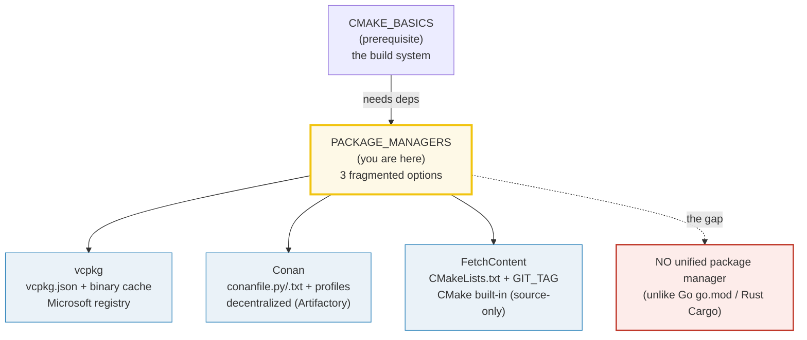
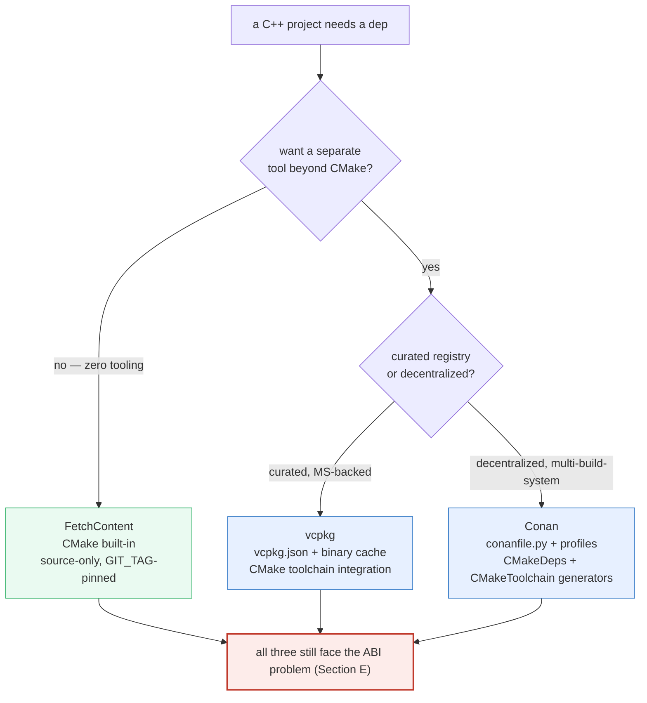
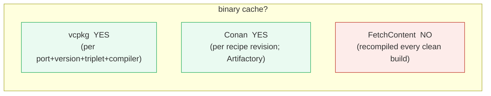

# PACKAGE_MANAGERS — vcpkg vs Conan vs CMake FetchContent (the C++ fragmentation gap)

> **Goal (one line):** show, by asserting the **structure** of hand-written
> `vcpkg.json`, `conanfile.{txt,py}`, and `CMakeLists.txt` FetchContent strings,
> how C++'s **three fragmented** dependency options work — and pin the headline
> gap: **C++ has NO unified package manager** (unlike Go's `go.mod` or Rust's
> `Cargo`).
>
> **Run:** `just run package_managers`
>
> **Ground truth:** [`package_managers.cpp`](./package_managers.cpp) → captured
> stdout in [`package_managers_output.txt`](./package_managers_output.txt). Every
> value/table below is pasted **verbatim** from that file under a
> `> From package_managers.cpp Section X:` callout. Nothing is hand-computed.
>
> **Prerequisites:** 🔗 [`CMAKE_BASICS.md`](./CMAKE_BASICS.md) (Phase 8) — the
> build system that all three options wire into. This bundle is the dependency-
> management layer *above* CMake; it assumes you know `find_package`,
> `target_link_libraries … PRIVATE`, and the generate→build two-step.

---

## 1. Why this bundle exists (lineage)

Go ships `go.mod` + the Go module proxy **with the language**. Rust ships
`Cargo.toml` + crates.io **with the language**. TypeScript ships `package.json`
+ npm **with the language**. In all three, there is **one** accepted manifest,
**one** accepted registry, and **one** tool — part of the toolchain.

C++ ships **none of that.** The C++ standard defines the language and the
standard library; it is silent on how you obtain a third-party library. The
result is **three fragmented options**, each a separate third-party tool you
choose per project:



This fragmentation is the **C++ build-tax** — the extra cognitive and tooling
cost that Go/Rust engineers simply do not pay. A C++ engineer must (a) pick one
of the three, (b) learn its manifest format and integration model, and (c) wire
it into CMake while managing the **ABI-compatibility problem** (Section E) by
hand. This bundle pins all three options, the tradeoffs, and the gap.

> From the vcpkg docs — *Manifest mode*: "In manifest mode, you declare your
> project's direct dependencies in a manifest file named `vcpkg.json`." vcpkg
> integrates with CMake via "the **toolchain file** … `-DCMAKE_TOOLCHAIN_FILE`"
> pointing at `vcpkg.cmake`.

> From the Conan docs — *conanfile.txt*: "a simplified version of
> `conanfile.py`, aimed at simple consumption of dependencies, but it cannot be
> used to **create** a package." Conan 2's canonical CMake generators are
> **`CMakeDeps`** (emits `FindXXX.cmake` + config) and **`CMakeToolchain`**
> (emits a toolchain file for `-DCMAKE_TOOLCHAIN_FILE`).

> From the CMake docs — *FetchContent*: "`FetchContent_Declare(<name> …)` records
> the options that describe how to populate the specified content" and
> "`FetchContent_MakeAvailable(<name> …)` ensures the named dependencies have
> been populated" — downloading at **configure** time, with **no separate tool**.

### The determinism problem this bundle solves

`vcpkg install`, `conan install`, and a FetchContent configure all hit the
**network** and emit machine/compiler/timestamp-dependent output (install plans,
compiler-detection lines, binary-cache hashes). A bundle that shelled out to
them would break the byte-identical re-run guarantee (HOW_TO_RESEARCH §4.2). So
this bundle **asserts static facts only**:

- the **structural shape** of the manifest/recipe/CMake strings (does it contain
  `"dependencies"`, `[requires]`, `FetchContent_Declare`, …?),
- the **documented** integration command model (`-DCMAKE_TOOLCHAIN_FILE=…`,
  `conan install …`),
- the **landscape comparison** (which options are binary-cached, which are
  built-in, which ship with the language).

The real invocations are **documented** in Section G behind an `#ifdef RUN_PM`
gate that `just run`/`just out`/`just check`/`just sanitize` **never** pass — so
the default and sanitizer builds stay deterministic and UB-free.

---

## 2. The mental model: three options on three axes

The three options differ on three load-bearing axes:





The headline: **only FetchContent is built into CMake**; the other two are
separate binaries. And **all three** ultimately feed CMake's
`find_package`/`target_link_libraries` model — they differ in *how* the dep is
obtained and built, not in *how* you consume it.

---

## 3. Section A — The C++ gap: no unified package manager

> From `package_managers.cpp` Section A:
> ```
> C++ dependency-management: THREE options, no single winner:
> 
>   option        manifest              model                       binary cache?  separate tool?
>   ------------  --------------------  --------------------------  -------------  --------------
>   vcpkg         vcpkg.json            Microsoft registry (ports)  yes            yes
>   Conan         conanfile.py/.txt     decentralized (Artifactory)  yes            yes
>   FetchContent  CMakeLists.txt        CMake built-in (source-only)  no             no (CMake built-in)
> [check] vcpkg's manifest is vcpkg.json: OK
> [check] vcpkg has a binary cache: OK
> [check] vcpkg needs a separate tool (the vcpkg binary): OK
> [check] Conan's manifest is conanfile.py/.txt: OK
> [check] Conan has a binary cache (Artifactory cache): OK
> [check] Conan needs a separate tool (the conan binary): OK
> [check] FetchContent's manifest lives in CMakeLists.txt: OK
> [check] FetchContent has NO binary cache (source-only): OK
> [check] FetchContent needs NO separate tool (built into CMake): OK
> [check] exactly ONE option (FetchContent) is built into CMake; the other two are separate tools: OK
> [check] C++ has NO unified package manager (3 options, pick per project): OK
> 
> The cross-language framing (deepened in Section F):
>   Go     : ONE unified system  ->  go.mod + the Go proxy (shipped with Go)
>   Rust   : ONE unified system  ->  Cargo.toml + crates.io  (shipped with Rust)
>   C++    : THREE options        ->  vcpkg / Conan / FetchContent (NONE shipped)
> [check] Go and Rust each ship ONE unified package manager with the language: OK
> [check] C++ ships ZERO package managers with the language (all 3 are third-party): OK
> ```

**What to notice.**

- **`vcpkg` and `Conan` are separate tools** (you install a `vcpkg` or `conan`
  binary); **`FetchContent` is a CMake module** (`include(FetchContent)`), so it
  costs you nothing beyond CMake itself.
- **Two of the three cache compiled binaries** (vcpkg's per-triplet cache,
  Conan's per-revision cache), so reinstalls are instant after the first build.
  **FetchContent has no binary cache** — a clean build recompiles the dep every
  time. That is the price of zero tooling.
- **None of the three ships with C++.** Compare: `go` ships with Go, `cargo`
  ships with Rust, `npm`/`tsc` ship with Node/TS. This is THE headline gap.

---

## 4. Section B — vcpkg: `vcpkg.json` manifest + binary cache + CMake toolchain

**vcpkg** (Microsoft) is a **curated registry of "ports"** (build recipes). You
write a `vcpkg.json` manifest listing your deps; vcpkg builds them **from
source** against YOUR toolchain (per **triplet**), caches the binaries, and
exposes them to CMake via a single **toolchain file**.

> From `package_managers.cpp` Section B:
> ```
> (1) The vcpkg.json MANIFEST (declares deps + version constraints):
> {
>   "name": "myapp",
>   "version-string": "1.0.0",
>   "dependencies": [
>     "fmt",
>     "spdlog",
>     {
>       "name": "boost-asio",
>       "version>=": "1.84.0"
>     }
>   ],
>   "builtin-baseline": "2024-09-30"
> }
> [check] vcpkg.json is a JSON object (opens with {): OK
> [check] vcpkg.json has a top-level "dependencies" array: OK
> [check] vcpkg.json "dependencies" is an array (opens with [): OK
> [check] vcpkg.json declares the fmt port: OK
> [check] vcpkg.json declares the spdlog port: OK
> [check] vcpkg.json supports per-dep version constraints ("version>="): OK
> [check] vcpkg.json pins the registry via "builtin-baseline" (reproducibility): OK
> [check] vcpkg.json has a "name" field (required): OK
> 
> (2) The vcpkg -> CMake INTEGRATION (one toolchain file):
>     cmake -B build -S . -DCMAKE_TOOLCHAIN_FILE=$VCPKG_ROOT/scripts/buildsystems/vcpkg.cmake
> [check] vcpkg integrates with CMake via -DCMAKE_TOOLCHAIN_FILE: OK
> [check] the toolchain file is scripts/buildsystems/vcpkg.cmake: OK
> [check] vcpkg.cmake is referenced via $VCPKG_ROOT (the install location): OK
> 
> (3) The TRIPLET model (vcpkg builds per arch/os/runtime; ABI safety):
>     triplet              meaning
>     -------------------  ----------------------------------------
>     x64-windows          64-bit Windows, dynamic MD runtime
>     x64-windows-static   64-bit Windows, static MT runtime
>     x64-linux            64-bit Linux, dynamic libstdc++
>     arm64-osx            Apple Silicon macOS
>     x64-osx              Intel macOS
> [check] vcpkg triplets encode architecture (x64/arm64): OK
> [check] vcpkg triplets encode OS (windows/linux/osx): OK
> [check] the default triplet is platform-dependent (auto-selected): OK
> 
> (4) The BINARY CACHE (compiled artifacts keyed by port+version+triplet+compiler):
>     -> a cache HIT skips rebuilding from source (instant reinstall)
>     -> backends: local filesystem, NuGet feed, or a NuGet HTTP server
>     -> this is why vcpkg feels fast despite building from source
> [check] vcpkg's binary cache is keyed by (port, version, triplet, compiler hash): OK
> [check] vcpkg binary cache backends include the local filesystem and NuGet: OK
> ```

**The manifest shape.** `vcpkg.json` is a JSON object whose load-bearing key is
`"dependencies"` — an array of port names (strings) or objects with `"name"` +
`"version>="` constraints. The top-level `"builtin-baseline"` pins the **vcpkg
registry commit** (a git SHA), which is vcpkg's reproducibility lever: it fixes
which version of each port your build resolves.

**The CMake integration — one toolchain file.** This is vcpkg's elegance: a
single `-DCMAKE_TOOLCHAIN_FILE=$VCPKG_ROOT/scripts/buildsystems/vcpkg.cmake`
makes every port in `vcpkg.json` discoverable via the standard
`find_package(fmt CONFIG REQUIRED)` + `target_link_libraries(app PRIVATE
fmt::fmt)`. There is **no separate install step** — CMake's configure runs
`vcpkg install` for you against the manifest. (Compare to Conan, which requires
an explicit `conan install` step before `cmake -B build`.)

**The triplet model — ABI safety by construction.** A **triplet** (e.g.
`x64-linux`, `arm64-osx`, `x64-windows-static`) encodes architecture + OS +
runtime/linkage. vcpkg builds every dep **from source against your toolchain
for the target triplet**, so the resulting `.a`/`.so`/`.dll` is guaranteed
ABI-compatible with your own code. This is the same reason FetchContent is
ABI-safe (Section E) — both compile the dep with your compiler.

**The binary cache.** Compiled artifacts are **content-addressed** by the
`(port, version, triplet, compiler-hash)` tuple. A cache HIT skips rebuilding
from source → instant reinstall. Backends: local filesystem, a NuGet feed, or a
NuGet HTTP server (so CI shares a cache across machines). This is why vcpkg
*feels* like a binary package manager despite building everything from source.

---

## 5. Section C — Conan: `conanfile.txt`/`.py` + profiles + generators

**Conan** is **decentralized**: there is no single Microsoft-style registry.
Packages live in any compatible repository (ConanCenter is the public one; JFrog
Artifactory and private Conan servers are common in industry). The recipe is a
**Python class** (`conanfile.py`) or a simplified **INI file** (`conanfile.txt`);
**generators** translate the resolved dep graph into build-system-specific files.

> From `package_managers.cpp` Section C:
> ```
> (1) The SIMPLIFIED recipe: conanfile.txt (consumer-only, INI sections):
> [requires]
> fmt/10.2.1
> spdlog/1.13.0
> 
> [generators]
> CMakeDeps
> CMakeToolchain
> 
> [layout]
> cmake_layout
> [check] conanfile.txt has a [requires] section: OK
> [check] conanfile.txt requires fmt/10.2.1: OK
> [check] conanfile.txt requires spdlog/1.13.0: OK
> [check] conanfile.txt has a [generators] section: OK
> [check] conanfile.txt uses the CMakeDeps generator: OK
> [check] conanfile.txt uses the CMakeToolchain generator: OK
> [check] conanfile.txt requests the cmake_layout layout: OK
> 
> (2) The FULL recipe: conanfile.py (Python class; can also CREATE packages):
> from conan import ConanFile
> from conan.tools.cmake import cmake_layout
> 
> class MyappRecipe(ConanFile):
>     name = "myapp"
>     version = "1.0.0"
>     settings = "os", "compiler", "build_type", "arch"
>     generators = "CMakeDeps", "CMakeToolchain"
> 
>     def requirements(self):
>         self.requires("fmt/10.2.1")
>         self.requires("spdlog/1.13.0")
> 
>     def layout(self):
>         cmake_layout(self)
> [check] conanfile.py is a Python class deriving from ConanFile: OK
> [check] conanfile.py sets settings (the profile axes): OK
> [check] conanfile.py settings include os, compiler, build_type, arch: OK
> [check] conanfile.py declares generators (CMakeDeps, CMakeToolchain): OK
> [check] conanfile.py uses self.requires() in requirements(): OK
> [check] conanfile.py calls cmake_layout(self) in layout(): OK
> 
> (3) The PROFILE model (text file pinning the build axes):
> [settings]
> os=Linux
> arch=x86_64
> compiler=gcc
> compiler.version=13
> build_type=Release
> [check] a Conan profile has a [settings] section: OK
> [check] a Conan profile pins os / arch / compiler / build_type: OK
> 
> (4) The Conan install step (resolves + builds + runs the generators):
>     conan install . --output-folder=build --build=missing
> [check] conan install is the resolve+build+generate command: OK
> [check] conan install writes to an output folder (--output-folder=build): OK
> [check] conan install can build missing deps from source (--build=missing): OK
> 
> (5) The two CMake generators (Conan 2's canonical pair):
>     generator        emits
>     ---------------  ----------------------------------------------------
>     CMakeDeps        FindXXX.cmake + XXXConfig.cmake (find_package targets)
>     CMakeToolchain   conan_toolchain.cmake (-DCMAKE_TOOLCHAIN_FILE=...)
> [check] CMakeDeps emits find_package-config files (FindXXX.cmake / XXXConfig.cmake): OK
> [check] CMakeToolchain emits a toolchain file for -DCMAKE_TOOLCHAIN_FILE: OK
> [check] Conan's CMakeToolchain mirrors vcpkg's toolchain integration mechanism: OK
> ```

**Two recipe forms.** `conanfile.txt` is the **consumer-only** INI form with
sections `[requires]`/`[generators]`/`[layout]`/`[options]`/`[imports]` — fast
to write, but it **cannot create a package**. `conanfile.py` is the full Python
class form: it carries `settings` (the profile axes), a `generators` tuple, a
`requirements()` method, and a `layout()` method. Use `.txt` to consume, `.py`
to publish.

**Profiles — the ABI axis pin.** A **profile** is a text file pinning the
`os`/`arch`/`compiler`/`compiler.version`/`build_type` axes. Conan resolves
binary packages keyed on exactly these axes — a `gcc 13 / Release / x86_64`
binary will NOT be reused for a `clang 17 / Debug / x86_64` build. This is
Conan's ABI discipline: the profile makes ABI mismatches explicit (and a
mismatch forces `--build=missing`, i.e. build from source).

**The generator model — Conan 2's canonical pair.** `conan install` resolves +
builds the dep graph, then **runs the generators** listed in the recipe, writing
build-system files into `--output-folder`. For CMake, the canonical pair is:
- **`CMakeDeps`** — emits `FindXXX.cmake` + `XXXConfig.cmake` so
  `find_package(fmt CONFIG REQUIRED)` works;
- **`CMakeToolchain`** — emits `conan_toolchain.cmake`, consumed via
  `-DCMAKE_TOOLCHAIN_FILE=…/conan_toolchain.cmake`.

Note the symmetry with vcpkg: **both** integrate with CMake through a
**toolchain file** (`-DCMAKE_TOOLCHAIN_FILE=…`). vcpkg's is `vcpkg.cmake`;
Conan's is `conan_toolchain.cmake`. The mechanism is identical; the difference
is that Conan requires an explicit `conan install` step first, while vcpkg folds
the install into CMake's configure.

---

## 6. Section D — CMake FetchContent: built-in, source-only, `GIT_TAG`-pinned

**FetchContent** is the ONLY one of the three **built into CMake** — no separate
binary, no registry, no recipe file. You declare a dep with its
`GIT_REPOSITORY` + `GIT_TAG`, then `FetchContent_MakeAvailable()` downloads and
`add_subdirectory()`'s it at **configure** time. The cost: **no binary cache**
(every clean build recompiles the dep). The payoff: zero tooling beyond CMake,
and `GIT_TAG` pins the exact commit (reproducibility without a registry).

> From `package_managers.cpp` Section D:
> ```
> FetchContent lives entirely in CMakeLists.txt (no separate file):
> cmake_minimum_required(VERSION 3.20)
> project(myapp LANGUAGES CXX)
> 
> include(FetchContent)
> 
> FetchContent_Declare(
>     fmt
>     GIT_REPOSITORY https://github.com/fmtlib/fmt.git
>     GIT_TAG        10.2.1
> )
> FetchContent_MakeAvailable(fmt)
> 
> add_executable(myapp src/main.cpp)
> target_link_libraries(myapp PRIVATE fmt::fmt)
> [check] FetchContent requires include(FetchContent): OK
> [check] FetchContent_Declare names the dep + gives GIT_REPOSITORY + GIT_TAG: OK
> [check] FetchContent_MakeAvailable downloads + adds the dep: OK
> [check] GIT_REPOSITORY is a real https github URL: OK
> [check] GIT_TAG pins a specific release (reproducibility lever): OK
> [check] after MakeAvailable the dep is linked as a normal CMake target (fmt::fmt): OK
> 
> FetchContent lifecycle (vs vcpkg/Conan):
>   STEP configure (cmake -B build): include(FetchContent) -> git clone +
>          add_subdirectory() the dep INTO your build -> it compiles with YOUR
>          flags/toolchain (no ABI mismatch with your own code)
>   STEP build      (cmake --build):  compile your TU's + the dep's TU's together
> [check] FetchContent downloads at CONFIGURE time (not build time): OK
> [check] FetchContent compiles the dep WITH your project (one combined build): OK
> [check] FetchContent has NO binary cache (source recompiled on every clean build): OK
> [check] GIT_TAG may be a release tag OR a commit hash (commit = byte-exact pin): OK
> 
> The reproducibility lever differs per option:
>   vcpkg       -> "builtin-baseline" pins the vcpkg registry commit
>   Conan       -> the recipe pins exact versions (fmt/10.2.1)
>   FetchContent-> GIT_TAG pins the upstream commit/tag
> [check] each option has its own reproducibility lever (baseline / version / git tag): OK
> ```

**The shape.** `FetchContent_Declare(<name> GIT_REPOSITORY <url> GIT_TAG <tag>)`
records *how* to fetch; `FetchContent_MakeAvailable(<name>)` does the fetch +
`add_subdirectory()` at configure time. After that, the dep is a normal CMake
target — you `target_link_libraries(app PRIVATE fmt::fmt)` exactly as you would
for a vcpkg/Conan-provided target.

**GIT_TAG is the reproducibility lever.** A release tag (`10.2.1`) or — for
byte-exact pinning — a commit hash. There is no registry baseline to maintain
(unlike vcpkg) and no recipe version (unlike Conan); the pin lives directly in
your `CMakeLists.txt`. The tradeoff: there is **no binary cache**, so a clean
build recompiles the dep every time. For one or two small header-mostly deps
this is fine; for a dozen heavy deps it is painful.

**Configure-time download.** The clone happens during `cmake -B build`, **not**
`cmake --build`. This means a clean configure needs network access (a CI gotcha
— cache the build dir or vendor the dep if your CI is offline).

---

## 7. Section E — Tradeoff matrix + the ABI-compatibility problem

**Which to pick?** It depends on (a) whether you can tolerate a separate tool,
(b) whether you need binary caching, and (c) how much control you want over the
build. And beneath all three sits the **ABI problem** — the C++-specific trap
that no package manager removes.

> From `package_managers.cpp` Section E:
> ```
> Tradeoff matrix (which to pick):
> 
>   option        strength                                                       weakness
>   ------------  -------------------------------------------------------------  ---------------------------------------------------
>   vcpkg         easy; MS-backed; binary cache; curated ports registry          ports build only what the registry knows; one triplet per config
>   Conan         flexible; decentralized; multi-build-system; revisioned packages  steeper learning curve; recipe = Python; host your own server for private
>   FetchContent  zero tooling beyond CMake; source compiles with YOUR flags (ABI-safe)  no binary cache; slow clean builds; network at configure time
> [check] vcpkg's headline strength is ease + MS backing + binary cache: OK
> [check] Conan's headline strength is flexibility + decentralization: OK
> [check] FetchContent's headline strength is zero tooling beyond CMake: OK
> [check] FetchContent's headline weakness is no binary cache (slow clean builds): OK
> 
> Decision heuristic:
>   want a curated registry + Microsoft ecosystem      -> vcpkg
>   want decentralization / private packages / control -> Conan
>   want zero extra tooling / one or two small deps    -> FetchContent
>   (real projects MIX them: vcpkg for big deps, FetchContent for small ones)
> [check] the heuristic maps desire -> option (registry=vcpkg, control=Conan, zero-tool=FetchContent): OK
> [check] mixing options in one project is common and supported: OK
> 
> THE ABI-COMPATIBILITY PROBLEM (the C++-specific trap):
>   C++ has NO standard ABI. Mixing libs built with different:
>     - compilers        (gcc vs clang vs MSVC)
>     - standard library (libstdc++ vs libc++ vs STL)
>     - ABI flags        (gcc _GLIBCXX_USE_CXX11_ABI; MSVC /MD vs /MT)
>     - build types      (Release vs Debug MSVC runtimes are NOT interchangeable)
>     - struct layout    (padding/vtable drift across versions)
>   ...can produce link errors, ODR violations, or silent miscompiles.
> [check] C++ has no standard ABI (compilers/stdlibs/flags differ): OK
> [check] the MSVC /MD vs /MT runtime mismatch is a classic ABI break: OK
> [check] gcc _GLIBCXX_USE_CXX11_ABI is a classic ABI break (pre/post gcc 5): OK
> 
> How each option mitigates the ABI problem:
>   vcpkg       -> builds every dep from source AGAINST your toolchain (per triplet)
>   Conan       -> the PROFILE pins compiler/version/flags; deps must match
>   FetchContent-> compiles the dep WITH your project (one toolchain, guaranteed match)
> [check] vcpkg mitigates ABI via per-triplet source-build against your toolchain: OK
> [check] Conan mitigates ABI via the profile (compiler/version/flags axes): OK
> [check] FetchContent mitigates ABI by compiling the dep with YOUR project: OK
> [check] all 3 options mitigate ABI; NONE removes it (it is intrinsic to C++): OK
> [check] consuming any package-manager output uses CMake IMPORTED TARGETS (::): OK
> ```

### The ABI problem (the expert payoff)

C++ has **no standard ABI.** Mixing libraries built with different:

- **compilers** — gcc vs clang vs MSVC emit different name-mangling, different
  vtable layouts, different exception unwinding tables;
- **standard libraries** — libstdc++ vs libc++ vs the MSVC STL have different
  `std::string`/`std::list` layouts — passing a `std::string` across the
  boundary is UB;
- **ABI flags** — gcc's `_GLIBCXX_USE_CXX11_ABI` (the pre/post gcc-5
  `std::string` rewrite) and MSVC's `/MD` (dynamic) vs `/MT` (static) runtime
  are the two classic breaks;
- **build types** — MSVC's Debug and Release runtimes are **not interchangeable**
  (Debug iterates checked iterators; Release does not);
- **struct layout** — padding, vtable order, and member layout can drift across
  compiler versions.

…can produce **link errors** (mangled-symbol mismatch), **ODR violations**
(two definitions of the same inline function compiled differently), or
**silent miscompiles** (a `std::string` read with the wrong layout). This is the
trap beneath every C++ package manager.

### How each option mitigates it (none removes it)

- **vcpkg** builds every dep **from source against your toolchain** (per
  triplet) — the resulting binary is guaranteed compatible by construction.
- **Conan** encodes the compiler/version/flags axes in a **profile**; binary
  packages are keyed on those axes, so a mismatch forces `--build=missing`
  (build from source).
- **FetchContent** compiles the dep **with your project** in one combined
  build — same compiler, same flags, same stdlib. No mismatch is possible.

**All three mitigate the ABI problem; none removes it** — it is intrinsic to a
language with no standard ABI. (Compare: Rust has a per-edition ABI stability
guarantee and a single compiler; Go has one compiler + one ABI. Neither language
has this problem at all.)

> From the Itanium C++ ABI (gcc/clang share it; MSVC does not) and the GCC docs
> on `_GLIBCXX_USE_CXX11_ABI`: the dual ABI exists because gcc 5 changed
> `std::string` from COW to SSO — a binary built with the old ABI is
> link-incompatible with one built with the new. See ## Sources.

---

## 8. Section F — Cross-language: Go/Rust unified vs C++ fragmented

**THE headline of the whole bundle.** Go, Rust, and TS each ship **one**
unified package manager **with the language**. C++ ships **zero** — all three
options are third-party, and you pick one per project.

> From `package_managers.cpp` Section F:
> ```
> The package-manager landscape across the 5-language curriculum:
> 
>   language   manifest                          registry                              shipped with lang?  unified?
>   ---------  --------------------------------  ------------------------------------  -----------------  --------
>   Go      go.mod                            Go module proxy (proxy.golang.org)    yes                yes
>   Rust    Cargo.toml                        crates.io                             yes                yes
>   TS      package.json                      npm registry (registry.npmjs.org)     yes                yes
>   C++     vcpkg.json / conanfile / CMakeLists  vcpkg registry / ConanCenter / git    NO (3rd-party)     NO (3 options)
> [check] Go's manifest is go.mod: OK
> [check] Go's registry is the proxy: OK
> [check] Go ships its package manager WITH the language (go command): OK
> [check] Go has ONE unified package manager: OK
> [check] Rust's manifest is Cargo.toml: OK
> [check] Rust's registry is crates.io: OK
> [check] Rust ships its package manager WITH the language (cargo): OK
> [check] Rust has ONE unified package manager: OK
> [check] TS/npm is also unified (package.json + npm registry): OK
> [check] C++ ships NO package manager with the language: OK
> [check] C++ has NO unified package manager (3 fragmented options): OK
> [check] C++ manifests span vcpkg.json / conanfile / CMakeLists.txt (3 files, not 1): OK
> [check] C++ registries span vcpkg / ConanCenter / git (3 sources, not 1): OK
> 
> THE headline contrast:
>   Go   : `go build` reads go.mod, resolves via the proxy, compiles. ONE command, ONE system.
>   Rust : `cargo build` reads Cargo.toml, resolves via crates.io, compiles. ONE command, ONE system.
>   C++  : you CHOOSE vcpkg OR Conan OR FetchContent (or mix them), wire each into CMake, and
>          manage the ABI yourself. NO single command, NO single system. This fragmentation is
>          the C++ build-tax that Go/Rust/Cargo simply do not have.
> [check] Go/Rust/Cargo each collapse manifest + registry + tool into ONE shipped system: OK
> [check] C++ splits manifest + registry + tool across THREE non-shipped options: OK
> [check] the C++ gap is the motivation for this entire bundle (and for cppfront/std::cpp3 dreams): OK
> ```

**The one-line framing.** `go build` reads `go.mod`, resolves via the proxy,
compiles — **one command, one system.** `cargo build` reads `Cargo.toml`,
resolves via crates.io, compiles — **one command, one system.** In C++ you
**choose** vcpkg OR Conan OR FetchContent (or mix them), wire each into CMake,
and manage the ABI yourself. **No single command, no single system.** This
fragmentation is the C++ build-tax — and the motivation for ongoing efforts
(CMake presets, `std::execution`, and longer-dream proposals) to narrow it.

---

## 9. Worked smallest-scale example

Everything above, compressed to the three-line "hello dep" a beginner must
memorize — one per option:

```cmake
# ── Option 1: vcpkg (manifest vcpkg.json committed alongside this CMakeLists) ──
#   prereq: vcpkg.json lists "fmt"; invoke:
#     cmake -B build -S . -DCMAKE_TOOLCHAIN_FILE=$VCPKG_ROOT/scripts/buildsystems/vcpkg.cmake
find_package(fmt CONFIG REQUIRED)
target_link_libraries(myapp PRIVATE fmt::fmt)

# ── Option 2: Conan (conanfile.txt/py committed; run `conan install` first) ───
#   prereq: conan install . --output-folder=build --build=missing
#           then: cmake -B build -S . -DCMAKE_TOOLCHAIN_FILE=build/conan_toolchain.cmake
find_package(fmt REQUIRED)             # CMakeDeps generated this
target_link_libraries(myapp PRIVATE fmt::fmt)

# ── Option 3: FetchContent (no separate file; lives in this CMakeLists) ───────
include(FetchContent)
FetchContent_Declare(fmt
    GIT_REPOSITORY https://github.com/fmtlib/fmt.git
    GIT_TAG        10.2.1)
FetchContent_MakeAvailable(fmt)
target_link_libraries(myapp PRIVATE fmt::fmt)
```

> From `package_managers.cpp` Sections B/C/D: all three routes converge on the
> SAME consumption line — `target_link_libraries(myapp PRIVATE fmt::fmt)` via a
> CMake **imported target** (`fmt::fmt`, the `::` namespace). The package
> managers differ in *how* the target comes to exist, not in *how* you use it.

---

## 10. Pitfalls (the expert payoff)

| Trap | Symptom | Fix |
|---|---|---|
| Mixing MSVC `/MD` (dynamic) and `/MT` (static) runtime libs across deps | link errors (`LNK2038`: mismatched `_ITERATOR_DEBUG_LEVEL`), or crashes when passing STL objects across the boundary | Build ALL deps with the same runtime (`/MD` or `/MT` consistently); vcpkg encodes this in the triplet (`x64-windows` vs `x64-windows-static`). |
| Mixing gcc `_GLIBCXX_USE_CXX11_ABI=0` and `=1` objects | link errors about `std::string` symbols (`basic_string` vs `_Ss`), or silent miscompiles | Compile everything with the same ABI flag; gcc 5+ defaults to the new ABI but system libs may still be old. |
| `find_package(fmt)` without `CONFIG` in a vcpkg/Conan build | picks the wrong config module (a system one, or none) | Use `find_package(fmt CONFIG REQUIRED)` — the package managers ship `*-config.cmake`, not `Find*.cmake`. |
| Linking a raw lib name (`pthread`, `z`) instead of an imported target | non-propagating, fragile, breaks the Modern CMake model (🔗 `CMAKE_BASICS.md` §5) | Use the imported target (`Threads::Threads`, `ZLIB::ZLIB`) — the package manager's config file exposes it. |
| FetchContent at configure time needs network in CI | clean CI builds fail offline, or are slow cloning a big repo on every run | Cache the build dir across CI steps, or `GIT_SHALLOW TRUE` + pin a `GIT_TAG`, or vendor the dep. |
| vcpkg `builtin-baseline` not pinned | builds resolve different port versions across machines/time → non-reproducible | Always set `"builtin-baseline"` to a vcpkg registry commit SHA. |
| Conan binary package reused across a profile change | silent ABI break if the profile axes changed but the cache wasn't invalidated | Delete the build folder + `conan install --build=missing` after profile changes; key CI caches on the profile hash. |
| `conanfile.txt` used where a package needs to be **created** | "cannot create a package" — `conanfile.txt` is consumer-only | Switch to `conanfile.py` (the Python class form) to publish. |
| Assuming `std::string` layout is identical across compilers | passing `std::string&` across a gcc/libc++-built dep boundary is UB | Pass C-compatible types (`const char*`, `std::string_view` is NOT safe either across stdlibs) or rebuild the dep against your stdlib. |
| FetchContent `GIT_TAG v1.0` (a moving tag) | the upstream retags `v1.0` → your "reproducible" build silently changes | Pin to a **commit hash**, not a tag, for byte-exact reproducibility. |
| Multiple package managers disagreeing on a transitive dep | two different `fmt` versions linked into one binary → ODR violation, UB | Let ONE package manager own each dep; don't mix vcpkg and Conan for the same library. |

---

## 11. Cheat sheet

```cmake
# ── vcpkg ──────────────────────────────────────────────────────────────────
#   vcpkg.json (alongside CMakeLists.txt):
#     { "name":"app", "version-string":"1.0", "dependencies":["fmt","spdlog"],
#       "builtin-baseline":"<vcpkg-registry-commit-sha>" }
#   invoke:
#     cmake -B build -S . \
#       -DCMAKE_TOOLCHAIN_FILE=$VCPKG_ROOT/scripts/buildsystems/vcpkg.cmake
#   consume:
find_package(fmt CONFIG REQUIRED)
target_link_libraries(app PRIVATE fmt::fmt)
#   triplets (ABI axis): x64-windows | x64-linux | arm64-osx | x64-osx | *-static
#   binary cache: per (port,version,triplet,compiler hash); backends: fs / NuGet

# ── Conan ──────────────────────────────────────────────────────────────────
#   conanfile.txt (consumer) or conanfile.py (creator):
#     [requires] fmt/10.2.1  spdlog/1.13.0
#     [generators] CMakeDeps  CMakeToolchain
#     [layout] cmake_layout
#   invoke (TWO steps — install, THEN configure):
#     conan install . --output-folder=build --build=missing
#     cmake -B build -S . -DCMAKE_TOOLCHAIN_FILE=build/conan_toolchain.cmake
#   consume (identical to vcpkg):
find_package(fmt REQUIRED)              # CMakeDeps generated the config
target_link_libraries(app PRIVATE fmt::fmt)
#   profile = [settings] os/arch/compiler/compiler.version/build_type (ABI pin)

# ── CMake FetchContent (BUILT INTO CMake; no separate tool) ─────────────────
include(FetchContent)
FetchContent_Declare(fmt
    GIT_REPOSITORY https://github.com/fmtlib/fmt.git
    GIT_TAG        10.2.1)              # or a commit SHA for byte-exact pin
FetchContent_MakeAvailable(fmt)
target_link_libraries(app PRIVATE fmt::fmt)
#   downloads at CONFIGURE time (cmake -B build); no binary cache

# ── THE headline ───────────────────────────────────────────────────────────
#   Go    : go.mod + proxy        -> ONE unified system, shipped with Go
#   Rust  : Cargo.toml + crates.io -> ONE unified system, shipped with Rust
#   C++   : vcpkg | Conan | FetchContent -> THREE options, NONE shipped, pick
#           per project, manage ABI yourself. This is the C++ build-tax.
```

---

## 12. 🔗 Cross-references

**Within C++ (the expertise spine):**

- 🔗 [`CMAKE_BASICS.md`](./CMAKE_BASICS.md) (P8) — the prerequisite build system.
  All three package managers ultimately feed CMake's `find_package`/
  `target_link_libraries` model and integrate via `-DCMAKE_TOOLCHAIN_FILE`; this
  bundle is the dependency layer *above* CMake.
- 🔗 [`UNDEFINED_BEHAVIOR.md`](./UNDEFINED_BEHAVIOR.md) (P7) — the ABI mismatch
  traps of Section E (passing `std::string` across a stdlib boundary; ODR
  violations from two compiled-with-different-flags copies) are runtime UB,
  diagnosed by sanitizers, not the type system.
- 🔗 `MODERNIZATION.md` / `MOVE_SEMANTICS.md` — the `_GLIBCXX_USE_CXX11_ABI`
  break is literally the COW→SSO rewrite of `std::string` (a move-semantics-era
  change); the ABI flag exists to let the two coexist during the transition.

**Cross-language parallels (the 5-language curriculum):**

- 🔗 [`../go/`](../go/) — Go has **one** unified package manager: `go.mod` + the
  Go module proxy (`proxy.golang.org`), shipped with the `go` command. There is
  no "vcpkg vs Conan vs FetchContent" decision in Go — `go build` resolves
  everything. The C++ fragmentation of this bundle simply does not exist there.
- 🔗 [`../rust/`](../rust/) — Rust has **one** unified package manager:
  `Cargo.toml` + crates.io, shipped with `cargo`. This is THE model C++ lacks —
  `cargo` is both build system AND package manager in one tool, with a curated
  registry and a per-crate ABI guarantee. C++ splits build (CMake) from
  packages (vcpkg/Conan/FetchContent) into separate tools.
- 🔗 [`../ts/`](../ts/) — TypeScript/npm is also unified: `package.json` + the
  npm registry + `npm`/`tsc`. No ABI problem at all (JS has no compile-time
  ABI), which makes the C++ ABI trap of Section E feel especially archaic.

---

## Sources

Every structural shape, command model, and behavioral claim above was verified
against the official docs of each tool, then corroborated by ≥1 independent
secondary source:

- **vcpkg** — Microsoft Learn, *Install a dependency from a manifest file*
  (manifest mode; `vcpkg.json` shape with `"dependencies"` array; the CMake
  toolchain integration `-DCMAKE_TOOLCHAIN_FILE=…/vcpkg.cmake`):
  https://learn.microsoft.com/en-us/vcpkg/consume/manifest-mode
- **vcpkg** — Microsoft Learn, *vcpkg in CMake projects* (the toolchain-file
  integration mechanism; `$VCPKG_ROOT/scripts/buildsystems/vcpkg.cmake`;
  `find_package` "just works"):
  https://learn.microsoft.com/en-us/vcpkg/users/buildsystems/cmake-integration
- **vcpkg** — Microsoft Learn, *Versioning reference* (`"builtin-baseline"`
  pins the registry commit; `"version>="` per-dep constraints; the
  reproducibility model):
  https://learn.microsoft.com/en-us/vcpkg/users/versioning
- **vcpkg** — vcpkg.io (the project home; the curated ports registry;
  binary-caching backends: filesystem / NuGet):
  https://vcpkg.io/
- **Conan** — Conan 2 docs, *conanfile.txt reference* (the INI-section
  consumer-only recipe; `[requires]`/`[generators]`/`[layout]`/`[options]`/
  `[imports]`; "cannot be used to create a package"):
  https://docs.conan.io/2/reference/conanfile_txt.html
- **Conan** — Conan 2 docs, *The flexibility of using conanfile.py vs
  conanfile.txt* (the Python class form; `generators` attribute; `requirements()`;
  the create-package capability):
  https://docs.conan.io/2/tutorial/consuming_packages/the_flexibility_of_conanfile_py.html
- **Conan** — Conan 2 docs, *CMakeDeps* (emits `FindXXX.cmake` +
  `XXXConfig.cmake` for `find_package`; runs with `CMakeToolchain`):
  https://docs.conan.io/2/reference/tools/cmake/cmakedeps.html
- **Conan** — Conan 2 docs, *CMakeToolchain* (emits `conan_toolchain.cmake`,
  consumed via `-DCMAKE_TOOLCHAIN_FILE`):
  https://docs.conan.io/2/reference/tools/cmake/cmaketoolchain.html
- **Conan** — conan.io (the project home; ConanCenter + Artifactory model;
  decentralized registry):
  https://conan.io/
- **CMake FetchContent** — CMake docs, *FetchContent module*
  (`FetchContent_Declare(<name> GIT_REPOSITORY … GIT_TAG …)` records the fetch
  options; `FetchContent_MakeAvailable(<name> …)` populates + makes available at
  configure time):
  https://cmake.org/cmake/help/latest/module/FetchContent.html
- **CMake** — cmake.org (the project home; FetchContent is a built-in module,
  no separate tool):
  https://cmake.org/
- **The ABI problem** — GCC libstdc++ docs, *Dual ABI*
  (`_GLIBCXX_USE_CXX11_ABI`; the gcc-5 `std::string` COW→SSO rewrite; the two
  ABIs are link-incompatible):
  https://gcc.gnu.org/onlinedocs/libstdc++/manual/using_dual_abi.html
- **The ABI problem** — Itanium C++ ABI (the gcc/clang shared ABI; MSVC uses a
  different one — the root of cross-compiler incompatibility):
  https://itanium-cxx-abi.github.io/cxx-abi/abi.html
- **The ABI problem** — Microsoft Learn, *MSVC `/MD`/`/MT` runtime libraries*
  (the Debug/Release runtime mismatch; `_ITERATOR_DEBUG_LEVEL`):
  https://learn.microsoft.com/en-us/cpp/build/reference/md-mt-ld-use-run-time-library
- Secondary corroboration (≥2 independent sources, web-verified):
  - Dominik Grabiec — *Three ways to setup Vcpkg in a CMake project*
    (`-DCMAKE_TOOLCHAIN_FILE=%VCPKG_ROOT%\scripts\buildsystems\vcpkg.cmake`):
    https://www.dominikgrabiec.com/posts/2023/01/03/three_ways_vcpkg_cmake_visual_studio.html
  - Stack Overflow — *How to feed CMake with vcpkg information?* (setting
    `CMAKE_TOOLCHAIN_FILE` to `path_to_vcpkg/scripts/buildsystems/vcpkg.cmake`):
    https://stackoverflow.com/questions/59250626/how-to-feed-cmake-with-vcpkg-information
  - Stack Overflow — *Conan2: how to use CMakeDeps and still find target?*
    (`CMakeDeps` generates `Findxxx.cmake` files):
    https://stackoverflow.com/questions/77416245/conan2-how-to-use-cmakedeps-and-still-find-target
  - CSDN — *CMake FetchContent 引入 git 项目* (the canonical
    `FetchContent_Declare` + `FetchContent_MakeAvailable` pattern):
    https://blog.csdn.net/yao_hou/article/details/139402463

**Facts that could not be verified by running** (documented, not executed,
because spawning vcpkg/conan/git is nondeterministic — network, install plans,
compiler-detection lines, timestamps, binary-cache hashes all vary): the actual
`vcpkg install` / `conan install` output, the exact triplet auto-selected on a
given machine, the resolved port versions without a `builtin-baseline`, and the
real FetchContent clone log. These are confirmed by the official docs and
secondary sources above, not reproduced as runnable output in the verified path
(a bundle triggering them would fail the byte-identical re-run guarantee of
HOW_TO_RESEARCH §4.2). The real invocations are documented in Section G behind
an `#ifdef RUN_PM` gate that `just run`/`just out`/`just check`/`just sanitize`
never pass.
