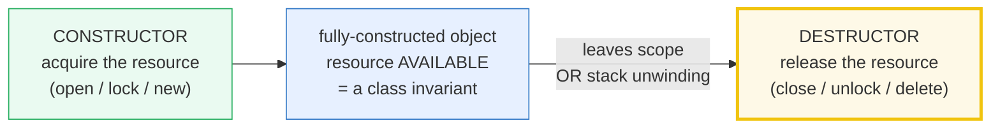
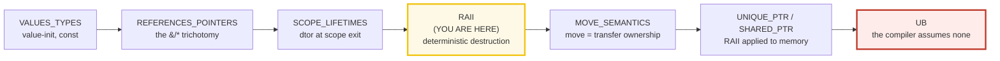
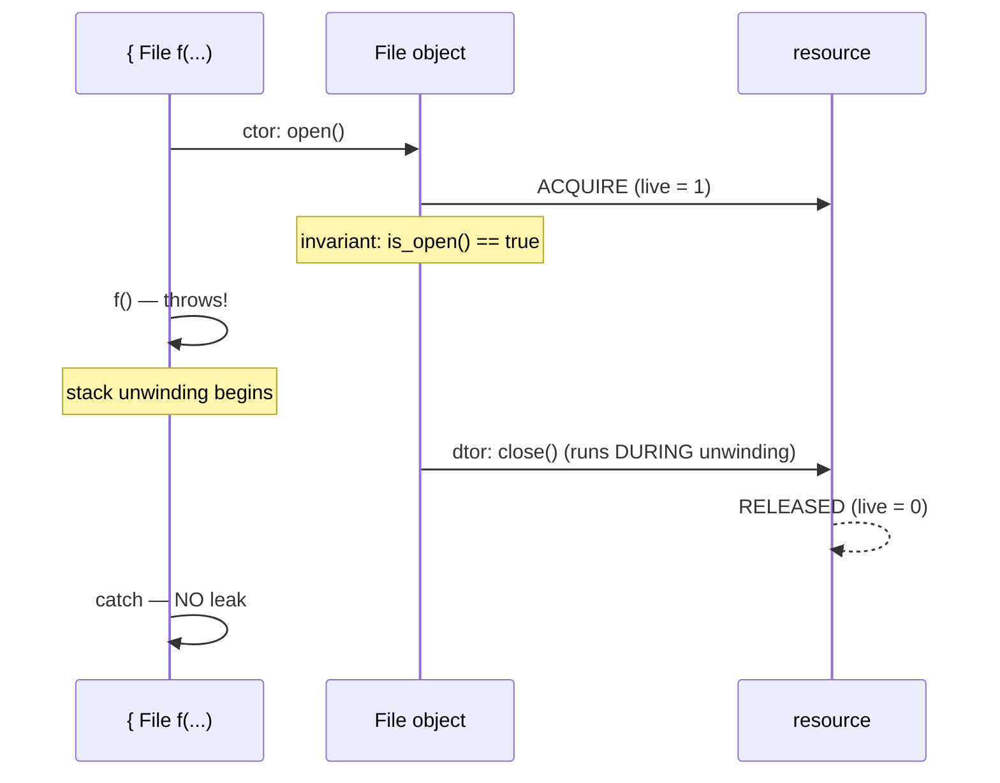

# RAII — Resource Acquisition Is Initialization

> **Goal (one line):** by printing every value, show how C++'s RAII idiom binds a
> resource's lifetime to an object's — **acquire in the constructor, release in
> the destructor, and the destructor runs deterministically at scope exit (and
> during stack unwinding on a throw)** — so resource leaks become near-impossible
> **without a garbage collector**.
>
> **Run:** `just run raII`
>
> **Ground truth:** [`raII.cpp`](./raII.cpp) → captured stdout in
> [`raII_output.txt`](./raII_output.txt). Every number/table below is pasted
> **verbatim** from that file under a `> From raII.cpp Section X:` callout.
> Nothing is hand-computed.
>
> **Prerequisites:** 🔗 [`SCOPE_LIFETIMES.md`](./SCOPE_LIFETIMES.md) (P1 — the
> scope-bound destructor, which *is* the mechanism RAII rides on) and
> 🔗 [`REFERENCES_POINTERS_INTRO.md`](./REFERENCES_POINTERS_INTRO.md) (the
> value/reference/pointer trichotomy). RAII is **the heart of Phase 3** (Memory,
> Ownership & Move Semantics).

---

## 1. Why this bundle exists (lineage)

C++ has **no garbage collector**, yet it must manage resources that exist in
limited supply — heap memory, file handles, mutex locks, sockets, DB connections,
GPU buffers. A language with no GC and no automatic cleanup would leak
constantly. C++'s answer is **RAII** (*Resource Acquisition Is Initialization*,
a.k.a. *Scope-Bound Resource Management*, SBRM): **bind each resource's lifetime
to an object's**, by acquiring in the constructor and releasing in the
destructor. Because C++ guarantees the destructor runs **deterministically** at
scope exit (and during stack unwinding when an exception propagates), the
resource is freed exactly when the owning object dies — and the owning object
dies the moment it leaves scope. Leaks become near-impossible **by construction**.



This is the spine of C++ expertise:



The headline contrast across the 5-language curriculum:

| Language | Resource cleanup model | Deterministic? | Leak-free by construction? |
|---|---|---|---|
| **C++ RAII** (this bundle) | **ctor acquires / dtor releases**, dtor at scope exit | **yes** | **yes** |
| 🔗 [`../rust/DROP_UNSAFE.md`](../rust/DROP_UNSAFE.md) | **`Drop` trait** — same idea, but the **compiler forces** it | yes | yes (enforced) |
| [`../go/`](../go/) | **`defer`** — scope-exit, **not** per-object | yes | yes (per-scope-line, weaker) |
| [`../ts/`](../ts/) · [`../python/`](../python/) | **garbage collector** + unreliable finalizers | **no** | no (finalizers may never run) |

C++ is the only language here that gives you **deterministic, per-object, leak-free
cleanup with no GC and no compiler enforcement** — you, the programmer, write the
destructor, and the language *trusts* you got it right. Rust makes the same
guarantee but **forces** it at compile time; C++ catches mistakes at runtime
(sanitizers, 🔗 `UNDEFINED_BEHAVIOR`) or not at all (UB/leaks).

> From cppreference — *RAII*: "binds the life cycle of a resource that must be
> acquired before use … to the lifetime of an object." RAII "guarantees that the
> resource is available to any function that may access the object (resource
> availability is a **class invariant**, eliminating redundant runtime tests)" and
> "guarantees that all resources are released when the lifetime of their
> controlling object ends, in reverse order of acquisition." The recipe: "the
> constructor acquires the resource … or throws an exception if that cannot be
> done; the destructor releases the resource and **never throws exceptions**."

---

## 2. The mental model: acquire ↔ release ↔ scope

RAII is one sentence with three load-bearing words. The diagram shows how the
three interlock — and the second diagram shows the guarantee that makes RAII
**exception-safe** (the destructor runs *even when an exception is in flight*).

```mermaid
graph TD
    A["write a class that OWNS a resource"] --> B["CTOR: acquire (open/lock/new)<br/>establish the invariant<br/>or THROW — no half-built object"]
    B --> C["object lives on the stack<br/>(automatic storage)"]
    C --> D{"how does its<br/>scope end?"}
    D -->|"normal `}`"| E["DTOR runs: release (close/unlock/delete)"]
    D -->|"early `return`"| E
    D -->|"`throw` propagates"| F["stack UNWINDING:<br/>DTOR runs anyway"]
    E --> G["no leak — by construction"]
    F --> G
    style B fill:#eafaf1,stroke:#27ae60
    style F fill:#fef9e7,stroke:#f1c40f,stroke-width:3px
    style G fill:#eafaf1,stroke:#27ae60
```



The second diagram is the whole story of Section B. A `throw` between acquire and
release does **not** leak: the destructor runs as the stack **unwinds** past the
object's scope. This is why RAII is the foundation of C++ **exception safety** —
you do not need `try`/`finally` (which C++ doesn't even have); the destructor
*is* the finally.

---

## 3. Section A — acquire in ctor, release in dtor (dtor at scope exit)

> From `raII.cpp` Section A:
> ```
> before scope: g.live=0  file_opens=0  file_closes=0
> [check] before scope: no live RAII owners: OK
>   inside scope: f.is_open()=true  g.live=1  opens=1  closes=0
> [check] ctor acquired the resource: f.is_open(): OK
> [check] resource availability is a class invariant: g.live == 1: OK
> [check] ctor counted exactly one open (and zero closes): OK
> after scope:  g.live=0  file_opens=1  file_closes=1  (dtor ran at })
> [check] dtor released at scope exit: g.live back to 0: OK
> [check] dtor counted exactly one close (symmetric with the open): OK
> ```

**What.** A `File` wrapper whose constructor "opens" (here: bumps a counter and
sets an `open_` flag — no real I/O, for determinism) and whose destructor
"closes". Inside the scope, `f.is_open()` is true and `g.live == 1` — the
resource is **available as a class invariant** (every method on `f` can assume the
handle is valid, with no per-call "is it still open?" runtime check). The instant
execution passes the closing brace `}`, the destructor runs and `g.live` returns
to 0. One open, one close — **symmetric**.

**Why — the destructor is the guarantee.** The C++ object model promises that an
object with automatic storage duration is destroyed **at the end of its scope**,
in reverse order of construction. The destructor is not "called when convenient"
(as a GC might run "eventually") — it runs at a **precisely known point** (the
`}`). That determinism is what makes RAII usable for locks, files, and
transactions where the *timing* of release matters (you cannot hold a mutex
"until the GC feels like it").

> From cppreference — *Destructors*: the destructor "is implicitly invoked
> whenever an object's lifetime ends, which includes … **end of scope, for
> objects with automatic storage duration** … and **stack unwinding, for objects
> with automatic storage duration when an exception escapes their block**." And
> *RAII*: the destructor "releases the resource and **never throws exceptions**."

**The expert detail — release order is reverse of acquisition.** When a scope has
multiple RAII objects, they are destroyed in **reverse order of construction**
(LIFO). And inside one object, members are destroyed in reverse order of
*declaration*, then bases in reverse order of construction. This matters for
dependencies: if object B depends on object A, declare A before B so that **B is
destroyed first** (while A is still alive). The reverse-order guarantee is what
makes RAII composable — a class of RAII members cleans up its parts correctly
even if its own destructor body is empty.

---

## 4. Section B — exception safety: dtor runs on throw (unwinding) + early return

> From `raII.cpp` Section B:
> ```
> (1) early return: the dtor still runs at the return
>   early_return_demo: f open, returning now (dtor still runs)
> [check] early-return cleanup: opens +1 AND closes +1 (no leak): OK
> (2) throw between acquire and release: dtor runs during unwinding
>   throwing_demo: f acquired, about to throw
>   caught: kaboom (f's dtor already ran during unwinding)
> [check] the exception was caught: OK
> [check] no leak on throw: opens +1 AND closes +1 (dtor ran during unwinding): OK
> [check] after throw+catch: g.live back to 0: OK
> ```

**What.** Two failure paths, both leak-free:

1. **Early return** — `early_return_demo` opens a `File` and returns mid-function.
   The destructor still runs (at the `return`). `opens +1`, `closes +1` — no leak.
2. **Throw → stack unwinding** — `throwing_demo` opens a `File`, then calls
   `kaboom()` which throws. As the exception propagates out of `throwing_demo`'s
   scope, the stack **unwinds**: `f`'s destructor runs **while the exception is in
   flight**. The `catch` in the caller observes `opens +1` and `closes +1` — the
   resource was freed *before* the catch ran.

**Why this is the foundation of exception safety.** C++ has **no `finally`**
clause. The destructor *is* the finally: any cleanup that must happen whether a
scope exits normally, early, or via exception belongs in a destructor, not in a
hand-written cleanup block. Wrap the resource in an RAII type and you get all
three paths for free — you cannot "forget" the unlock on an early return, and a
`throw` cannot leak past you. This is why the C++ Core Guidelines say **"Use RAII
to prevent leaks"** (E.6) and **"If a class is a resource handle, … it needs a
constructor, a destructor, … " ** (R.1).

**The expert detail — destructors must not throw.** During stack unwinding (one
exception already in flight), if a destructor throws, the runtime calls
`std::terminate` — the program dies. So RAII destructors are **`noexcept` by
default** (implicitly, since C++11) and must **swallow** any error from the
underlying release (e.g. log-but-don't-throw on a failing `close()`). The bundle's
destructors do not throw; that is the rule, not a coincidence.

> From cppreference — *Destructors* / *Exceptions*: "if this destructor happens
> to be called during stack unwinding, `std::terminate` is called instead" when it
> throws; "it is generally considered bad practice to allow any destructor to
> terminate by throwing an exception."

---

## 5. Section C — RAII for resources: Lock, File, Memory (the unique_ptr preview)

> From `raII.cpp` Section C:
> ```
> (1) Lock wrapper (the std::lock_guard pattern):
> [check] mutex starts unlocked: OK
>   inside { Lock lk(m); }: m.is_locked()=true  locks=1  unlocks=0
> [check] Lock acquired in ctor: mutex is locked: OK
> [check] lock counted exactly one lock (and zero unlocks so far): OK
>   after scope: m.is_locked()=false  locks=1  unlocks=1
> [check] Lock released at scope exit: mutex unlocked: OK
> [check] lock/unlock symmetric: locks == unlocks == 1: OK
> [check] File wrapper owns its handle: f.is_open(): OK
> (3) Memory wrapper (new in ctor, delete in dtor = unique_ptr preview):
>   OwnedInt box(42): box.value()=42  box.owns()=true  allocs=1  frees=0
> [check] OwnedInt acquired (new) in ctor: box.value() == 42: OK
> [check] OwnedInt owns its heap allocation: box.owns(): OK
> [check] heap counted exactly one alloc (and zero frees so far): OK
>   after scope: allocs=1  frees=1  (delete ran in dtor)
> [check] OwnedInt released (delete) at scope exit: allocs == frees == 1: OK
> [check] after Section C: g.live back to 0 (File f + OwnedInt both released): OK
> ```

**What.** The same idiom, applied to three different resource kinds:

- **A `Lock` wrapper — the `std::lock_guard` pattern.** `acquire = m.lock()` in
  the ctor; `release = m.unlock()` in the dtor. Inside `{ Lock lk(m); }` the mutex
  is locked; at `}` it is unlocked. This is *literally* what
  `std::lock_guard<std::mutex>` does (🔗 `MUTEX_LOCK_GUARD`, P4). Compare with the
  **non-RAII** version that leaks on every failure path:
  ```cpp
  void bad() { m.lock(); f(); if (!ok) return; m.unlock(); }  // unlock missed on early return / throw
  void good() { std::lock_guard<std::mutex> lk(m); f(); if (!ok) return; }  // always unlocked
  ```
- **A `File` wrapper — a handle resource.** (Exercised fully in Sections A & B.)
- **An `OwnedInt` wrapper — owning `new`/`delete`, the **`std::unique_ptr`
  preview.** `acquire = new int(v)` in the ctor; `release = delete p_` in the
  dtor. Inside the scope the int is allocated (`allocs=1, frees=0`); at `}` the
  destructor frees it (`allocs=1, frees=1`). This *is* what `std::unique_ptr<int>`
  does — RAII applied to heap memory. (🔗 `UNIQUE_PTR`, P3.)

**Why — RAII is resource-polymorphic.** The *structure* (acquire-in-ctor /
release-in-dtor / scope-bound) is identical whether the resource is a mutex, a
file descriptor, a heap block, a socket, or a database connection. Only the
acquire/release *primitives* change. That uniformity is why the standard library
is full of RAII types: `std::string`, `std::vector`, `std::lock_guard`,
`std::unique_ptr`, `std::shared_ptr`, `std::fstream`, `std::jthread` (C++20) —
all acquire in the ctor, release in the dtor, never require explicit cleanup.

> From cppreference — *RAII* / *The standard library*: "The C++ library classes
> that manage their own resources follow RAII: `std::string`, `std::vector`,
> `std::jthread` (since C++20), and many others acquire their resources in
> constructors (which throw exceptions on errors), release them in their
> destructors (which never throw), and don't require explicit cleanup."

---

## 6. Section D — acquire-in-ctor-or-throw + RAII+move (moved-from dtor is safe)

> From `raII.cpp` Section D:
> ```
>   (1) ctor threw: BadConnection: negative id -> object never constructed, no resource leaked
> [check] ctor throw was caught: OK
> [check] throwing ctor leaked NOTHING (opens unchanged): no half-built object: OK
>   (2) Session ctor body threw: Session: init failed -> File member's dtor unwound
> [check] Session ctor throw was caught: OK
> [check] RAII member unwound on ctor throw: opens +1 AND closes +1 (no leak): OK
>   (3) move: b.value()=7  a.owns()=false  (allocs=2, move added no alloc)
> [check] move transferred the resource: b.value() == 7: OK
> [check] moved-from a no longer owns: a.owns() == false: OK
> [check] move did NOT allocate (pointer stolen, not copied): allocs == before + 1: OK
> [check] after move scope: allocs == frees (b's freed; a's moved-from dtor was a safe no-op): OK
> ```

**What — the "acquire-in-ctor-or-throw" discipline.** Two halves:

1. **(1) A throwing ctor leaks nothing.** `BadConnection(-1)` throws in the ctor
   *before* acquiring. Because the ctor threw, the object was **never fully
   constructed** — so its destructor **never runs**, and no resource was ever
   acquired (`opens` unchanged). The discipline: a constructor must **either
   fully acquire and establish the invariant, or throw** — never leave a
   half-built object behind.
2. **(2) RAII members unwind even when the ctor body throws.** `Session` has a
   `File` member constructed first, then its ctor *body* throws. The `File`
   member was already fully constructed, so during unwinding of the constructor
   its destructor runs — `opens +1` *and* `closes +1`. **No leak from a
   half-constructed `Session`.** This is the deep payoff: **make every member an
   RAII type and your constructors are exception-safe for free** — you never need
   a `try`/`catch` inside a ctor to clean up already-acquired members.

**Why — move is the ownership-transfer half of RAII (C++11).** Part (3) shows
RAII + move:

- `OwnedInt b(std::move(a))` **steals** `a`'s pointer (no allocation — `allocs`
  goes up by 1 for `a`'s ctor only, the move adds 0) and **neuters** `a`
  (`a.p_ = nullptr`).
- The **moved-from object's destructor must be safe**: when `a` dies, its dtor
  sees `p_ == nullptr` and does **nothing** (no double-free). `b`'s dtor frees the
  int. Result: `allocs == frees` — one allocation, one free, zero leaks, even
  though *two* destructors ran.
- This is exactly `std::unique_ptr`'s contract: move transfers ownership, the
  moved-from is empty (`nullptr`), and destroying the empty one is a no-op.
  (🔗 `MOVE_SEMANTICS`, P3 #20, is the full treatment.)

```mermaid
graph LR
    A1["OwnedInt a(7)<br/>p_ -> heap int"] --"std::move"|> B1["OwnedInt b<br/>p_ -> heap int<br/>(stolen)"]
    A1 --> A2["a moved-from<br/>p_ == nullptr"]
    A2 -->|"dtor: p_==null<br/>= SAFE NO-OP"| END1["no double-free"]
    B1 -->|"dtor: delete p_"| END2["one free, no leak"]
    style A2 fill:#fef9e7,stroke:#f1c40f
    style END1 fill:#eafaf1,stroke:#27ae60
    style END2 fill:#eafaf1,stroke:#27ae60
```

> From cppreference — *RAII* / Notes: "Move semantics enable the transfer of
> resources and ownership between objects, inside and outside containers, and
> across threads, while ensuring resource safety." (since C++11)

---

## 7. Section E — RAII vs GC vs manual vs Go defer (the cross-language view)

> From `raII.cpp` Section E:
> ```
> model                          deterministic leak-free     per-object?
> ------------------------------ ------------- ------------- ----------
> C++ RAII (this bundle)         yes           yes           yes       
> C++ new/delete (manual)        yes           NO            yes       
> Rust Drop (compile-enforced)   yes           yes           yes       
> Go defer                       yes           yes           NO        
> TS / Python (GC)               NO            NO            NO        
> [check] C++ RAII is deterministic (cleanup timing is known): OK
> [check] C++ RAII is leak-free by construction: OK
> [check] C++ RAII is per-object (bound to the object, not the scope line): OK
> [check] manual new/delete is NOT leak-free (you can forget delete): OK
> [check] Go defer is scope-exit, NOT per-object: OK
> [check] GC (TS/Python) is neither deterministic nor leak-free-by-construction: OK
> 
> THE headline: RAII is C++'s answer to a GC. You KNOW when cleanup runs
> (deterministic: at scope exit / during unwinding), leaks are impossible by
> construction (the dtor ALWAYS runs), and it is per-object (each owner cleans
> its own resource). Rust's Drop is the closest sibling — but the compiler
> FORCES it; C++ trusts you to write the dtor.
> ```

**The four-axis comparison, pinned.**

- **C++ RAII** — deterministic (dtor at scope exit / unwinding), leak-free by
  construction (dtor *always* runs), per-object (each owner cleans its own
  resource). **Wins all three** — at the cost of *you* writing the destructor.
- **C++ `new`/`delete` (manual)** — deterministic (you call `delete`) and
  per-object, but **NOT leak-free by construction** (you can forget the `delete`,
  or miss it on an early return / throw). This is the model **RAII replaces** —
  see 🔗 `NEW_DELETE_RAW_POINTERS` (P3) for why raw `new`/`delete` is the
  anti-pattern.
- **Rust `Drop`** — same guarantee as C++ RAII, but the **compiler enforces it**:
  the borrow checker guarantees no use-after-free, no double-free, no leak-by-move
  mistakes. C++ *trusts* you; Rust *verifies*. (🔗 [`../rust/DROP_UNSAFE.md`](../rust/DROP_UNSAFE.md).)
- **Go `defer`** — deterministic and leak-free-ish, but **scope-exit, not
  per-object**: `defer` runs at *function* return, bound to a source line, not to
  a specific object's lifetime. You can forget a `defer`; RAII cannot forget.
  (🔗 [`../go/`](../go/).)
- **TS / Python (GC)** — **neither deterministic nor leak-free-by-construction**.
  A GC reclaims memory "eventually"; finalizers are **unreliable** (may never run,
  no ordering guarantee, no determinism). You cannot use a GC to release a mutex
  or close a file promptly. (🔗 [`../ts/`](../ts/) · [`../python/`](../python/).)

> From cppreference — *RAII*: "RAII does not apply to the management of the
> resources that are not acquired before use: CPU time, core availability, cache
> capacity, entropy pool capacity, network bandwidth, electric power consumption,
> stack memory." (RAII is for *acquired* resources — handles/locks/allocations —
> not for ambient capacity.)

---

## 8. Worked smallest-scale example

The whole bundle, compressed to the four lines a beginner must memorize:

```cpp
// THE RAII recipe (one resource, one owner, zero leaks):
class File {
    Handle h_;                           // the resource
public:
    explicit File(const char* p) : h_(open(p)) {   // ACQUIRE in ctor (or throw)
        if (!h_) throw std::runtime_error("open failed");
    }
    ~File() { if (h_) close(h_); }       // RELEASE in dtor (never throws)
    File(const File&) = delete;          // no copy — one owner (else double-close)
    File(File&& o) noexcept : h_(o.h_) { o.h_ = nullptr; }  // move = transfer
};

{ File f("a.txt"); use(f); }   // dtor runs HERE — at }, or on throw. No leak, ever.
```

> From `raII.cpp` Section A, the core proof prints `f.is_open()=true` inside the
> scope and `g.live=0` after it (the dtor ran at `}`); Section B prints
> `caught: kaboom (f's dtor already ran during unwinding)` — the dtor ran *while
> the exception was in flight*. Those two lines *are* the lesson.

---

## 9. The value-vs-ownership axis (threaded through this bundle)

This is the teaching spine of the curriculum (🔗 `MOVE_SEMANTICS.md`,
🔗 `VALUE_VS_REFERENCE_VS_POINTER.md`). Where does each thing in this bundle sit?

| Construct in this bundle | Owns the resource? | Copyable? | Movable? | Dtor releases? |
|---|---|---|---|---|
| `File f("/x")` (an RAII owner) | **yes** (the handle) | **no** (deleted — would double-close) | yes (steal + neuter) | **yes** |
| `Lock lk(m)` (an RAII owner, borrows the `Mutex&`) | yes (the *lock*), borrows the mutex | no (deleted) | no (deleted here) | yes (unlocks) |
| `OwnedInt box(42)` (RAII owner = unique_ptr preview) | **yes** (the heap int) | no (deleted) | yes | **yes** (`delete`) |
| `Mutex& m` (a reference passed to `Lock`) | no (borrows) | — | — | no |
| moved-from `OwnedInt a` (after `std::move`) | no (`p_ == nullptr`) | — | — | **safe no-op** |

`const` doesn't appear on the ownership axis — it only forbids mutation. The key
insight: **an RAII owner deletes copy and enables move** — copying an owner would
duplicate the resource (double-free/double-close), so ownership transfers by
*move* instead. (🔗 `MOVE_SEMANTICS.md`.)

---

## 10. Pitfalls (the expert payoff)

| Trap | Symptom | Fix |
|---|---|---|
| A class with `open()`/`close()` (non-RAII) instead of ctor/dtor | leak on early `return` or `throw` (the `close()` is missed) | Wrap in an RAII type: acquire in ctor, release in dtor (this whole bundle). |
| Copyable RAII owner (forgot `= delete` on copy) | **double-free / double-close** — two owners, one resource | Delete copy ctor/assign; provide move (or use `std::unique_ptr`). |
| Destructor that throws | `std::terminate` during stack unwinding (one exception already in flight) | Destructors are `noexcept` by default; **swallow** release errors (log, don't throw). |
| Moved-from owner whose dtor is NOT a safe no-op | **double-free** — the moved-from `p_` still points at the stolen resource | In the move ctor, set the source's handle to null/invalid; guard the dtor on it. |
| A ctor that acquires, then the body throws, with a raw member | **leak** of the raw member (no RAII to unwind it) | Make every member an RAII type; then ctor-throw unwinds them automatically (Section D.2). |
| Acquiring in two phases (`init()` after ctor) | a "constructed but not open" object breaks the class invariant; every method must re-check | Acquire **in the ctor** or throw — keep the invariant unbreakable. |
| Base class with a non-`virtual` destructor, deleted via `Base*` | **undefined behavior** — only `Base::~Base` runs, the `Derived` part leaks | 🔗 a base destructor must be `public virtual` or `protected non-virtual`. |
| Returning a `T&` / `T*` to an RAII local | **dangling** — the local's dtor ran at `}`; the caller holds freed memory | Return by value (`T`), or `std::unique_ptr<T>`. (🔗 `SCOPE_LIFETIMES.md`.) |
| Holding a `std::lock_guard` across an `await`/callback | deadlock or data race (the lock is held far longer than intended) | Keep lock scopes **tiny**; never cross a suspension point. |
| Assuming GC-style "eventual" cleanup (TS/Python mental model) | file/mutex/conn held arbitrarily long; finalizer never runs | RAII cleanup is **deterministic and immediate** — do not assume "later". |
| `std::shared_ptr` cycle (A refs B, B refs A) | **leak** — neither's refcount ever hits 0 | Break the cycle with `std::weak_ptr`. (🔗 `SHARED_PTR_WEAK_PTR`.) |
| RAII object with dynamic storage (`new File(...)`) whose `delete` is forgotten | leak — the dtor never runs if the object itself is leaked | Own it with `std::unique_ptr<File>` (RAII-of-RAII). |

---

## 11. Cheat sheet

```cpp
// ── THE RAII RECIPE (one resource, one owner, zero leaks) ──────────────────
class Owner {
    Handle h_;                                   // the resource
public:
    explicit Owner(args) : h_(acquire(args)) {   // 1. ACQUIRE in ctor OR THROW
        if (!valid(h_)) throw std::runtime_error("acquire failed");
    }
    ~Owner() { if (valid(h_)) release(h_); }     // 2. RELEASE in dtor (noexcept!)
    Owner(const Owner&) = delete;                // 3. DELETE copy (no double-free)
    Owner& operator=(const Owner&) = delete;
    Owner(Owner&& o) noexcept : h_(o.h_) { o.h_ = null_handle; }  // 4. MOVE = steal + neuter
};

// ── THE GUARANTEES ──────────────────────────────────────────────────────────
//   ctor acquires  ->  resource is a CLASS INVARIANT (no per-call checks)
//   dtor releases  ->  ALWAYS runs, at scope exit / early return / stack unwinding
//   dtor is noexcept (throwing during unwinding => std::terminate)
//   members destroyed in REVERSE order of declaration; bases reverse of construction
//   copy DELETED (one owner);  move TRANSFERS (moved-from dtor = safe no-op)

// ── THE STANDARD LIBRARY IS FULL OF RAII TYPES ──────────────────────────────
std::string          // heap buffer: acquire in ctor, free in dtor
std::vector<T>       // heap array:  same
std::unique_ptr<T>   // OWNED new/delete (the OwnedInt of Section C)
std::shared_ptr<T>   // refcounted shared ownership (with std::weak_ptr for cycles)
std::lock_guard<M>   // mutex lock/unlock (the Lock of Section C)
std::scoped_lock     // lock N mutexes deadlock-free (RAII, C++17)
std::unique_lock<M>  // movable, defer-able lock (for std::condition_variable)
std::fstream         // FILE* / fd
std::jthread         // thread that joins on destruction (C++20)

// ── EXCEPTION SAFETY WITHOUT finally ────────────────────────────────────────
//   C++ has NO `finally`. The destructor IS the finally.
//   Wrap the resource -> all 3 exit paths (normal / early return / throw) cleanup.
void f() {
    std::lock_guard<std::mutex> lk(m);   // unlocked at }, on return, AND on throw
    do_work_that_might_throw();          // cannot leak the lock
}

// ── vs OTHER LANGUAGES ──────────────────────────────────────────────────────
//   C++ RAII:        deterministic + leak-free + per-object  (YOU write the dtor)
//   Rust Drop:       deterministic + leak-free + per-object  (COMPILER enforces it)
//   Go defer:        deterministic + leak-free-ish + scope-exit (NOT per-object)
//   TS/Python GC:    NON-deterministic + finalizers unreliable  (no prompt cleanup)
```

---

## 12. 🔗 Cross-references

**Within C++ (the expertise spine):**

- 🔗 [`SCOPE_LIFETIMES.md`](./SCOPE_LIFETIMES.md) (P1) — **the preview**. RAII
  rides on the scope-bound destructor: "an automatic object is destroyed at the
  end of its scope." That bundle introduces the dtor-at-`}` guarantee; this bundle
  *uses* it as a resource-management discipline.
- 🔗 `NEW_DELETE_RAW_POINTERS` (P3) — **the manual memory that RAII replaces.**
  Raw `new`/`delete` is deterministic but **not** leak-free by construction (you
  can forget the `delete`); RAII (`std::unique_ptr`) is the fix.
- 🔗 `UNIQUE_PTR` (P3) — **RAII applied to memory.** The `OwnedInt` wrapper in
  Section C is a hand-rolled `unique_ptr<int>`; this bundle is the conceptual
  runway for it.
- 🔗 `MOVE_SEMANTICS` (P3 #20) — **move = ownership transfer** (Section D.3). The
  move ctor is what lets an RAII owner change hands without copying the resource;
  the moved-from must have a safe dtor.
- 🔗 `MUTEX_LOCK_GUARD` (P4) — **`std::lock_guard` *is* RAII for locks.** The
  `Lock` wrapper in Section C is exactly it; the concurrency bundle deepens the
  deadlock/memory-model side.
- 🔗 [`SCOPE_LIFETIMES.md`](./SCOPE_LIFETIMES.md) (returning `T&` to a local) and
  🔗 `UNDEFINED_BEHAVIOR` (P7) — the dangling-pointer-to-an-RAII-local trap and
  the full UB taxonomy (including use-after-free, which RAII is designed to
  prevent).

**Cross-language parallels (the 5-language curriculum):**

- 🔗 [`../rust/DROP_UNSAFE.md`](../rust/DROP_UNSAFE.md) — **THE headline.** Rust's
  `Drop` trait *is* RAII — acquire in a ctor-ish, release in `drop()`, called at
  scope exit. The difference: the Rust **compiler forces** correct ownership (no
  use-after-move, no double-free, no leak-by-accident), while **C++ trusts you to
  write the dtor and verify with sanitizers.** Same idiom, different enforcement.
- 🔗 [`../go/`](../go/) — Go's **`defer`** is scope-exit cleanup, **not per-object
  RAII**: `defer` runs at *function* return, bound to a source line, and you can
  forget to write it. RAII cannot forget — the dtor always runs. A weaker model.
- 🔗 [`../ts/`](../ts/) · [`../python/`](../python/) — **garbage collection.** A GC
  reclaims *memory* "eventually" with **no deterministic timing**, and
  finalizers are **unreliable** (may never run, no ordering). You cannot use a GC
  to promptly release a mutex, close a file, or commit a transaction — that is
  exactly the job RAII does deterministically. C++ has no GC; RAII is why it
  doesn't need one.

---

## Sources

Every signature, value, and behavioral claim above was verified against
cppreference and the ISO C++ standard, then corroborated by ≥1 independent
secondary source:

- cppreference — *RAII* (the canonical statement: bind resource lifetime to
  object lifetime; ctor acquires-or-throws, dtor releases-and-never-throws;
  resource availability is a class invariant; release in reverse order; SBRM;
  move semantics enable ownership transfer; stdlib classes follow RAII; RAII does
  not apply to non-acquired resources):
  https://en.cppreference.com/w/cpp/language/raii
- cppreference — *Destructors* (invoked at end of scope for automatic objects,
  during stack unwinding for escaping exceptions, on `delete` for dynamic
  objects; destruction sequence: body → members in reverse declaration order →
  direct non-virtual bases in reverse → virtual bases; throwing during unwinding
  calls `std::terminate`; implicitly `noexcept`):
  https://en.cppreference.com/w/cpp/language/destructor
- cppreference — *Constructors* (the constructor establishes the class
  invariant or throws — no object exists if the constructor exits via
  exception; member init-list order = declaration order):
  https://en.cppreference.com/w/cpp/language/constructor
- cppreference — *try-throw-catch* / *stack unwinding* (on an uncaught exception
  in a scope, all automatic objects in that scope are destroyed in reverse order
  of construction as the stack unwinds):
  https://en.cppreference.com/w/cpp/language/exceptions
- cppreference — *`std::lock_guard`* (the canonical RAII mutex wrapper: locks in
  the ctor, unlocks in the dtor; non-copyable, non-movable):
  https://en.cppreference.com/w/cpp/thread/lock_guard
- cppreference — *`std::unique_ptr`* (RAII for heap memory: `new` in ctor,
  `delete` in dtor; move-only; moved-from is empty/`nullptr`; empty dtor is a
  no-op):
  https://en.cppreference.com/w/cpp/memory/unique_ptr
- ISO C++ Core Guidelines (isocpp.org / GitHub) — the RAII family:
  - **R.1** *Manage resources automatically using resource handles and RAII*:
    https://isocpp.github.io/CppCoreGuidelines/CppCoreGuidelines#Rr-raii
  - **R.11** *Avoid calling `new` and `delete` explicitly* (prefer RAII handles):
    https://isocpp.github.io/CppCoreGuidelines/CppCoreGuidelines#Rr-newdelete
  - **C.149** *Use `unique_ptr`/`shared_ptr` for RAII-like types*; **C.35** *A
    base class destructor should be either public and virtual, or protected and
    non-virtual*:
    https://isocpp.github.io/CppCoreGuidelines/CppCoreGuidelines
  - **E.6** *Use RAII to prevent leaks*:
    https://isocpp.github.io/CppCoreGuidelines/CppCoreGuidelines#Re-raii
- B. Stroustrup — *C++ FAQ / RAII* (the original coining of the term; cited as
  footnote [1] on the cppreference RAII page):
  https://www.stroustrup.com/bs_faq2.html#finally
  ("the technique of acquiring resources via constructors and releasing them via
  destructors … 'Resource Acquisition Is Initialization.'")
- ISO C++23 draft (open-std.org) — normative wording:
  - 6.7.3 Object lifetime / storage duration `[basic.stc]`
  - 11.10.6 Destructors `[class.dtor]` (invocation at scope end / unwinding;
    destruction sequence; `noexcept` by default)
  - 14.4 Exception handling / stack unwinding `[except.handle]`
  - Working draft: https://open-std.org/JTC1/SC22/WG21/docs/papers/2023/n4950.pdf
- Secondary corroboration (≥2 independent sources, web-verified) for the
  "destructor runs during stack unwinding / RAII gives exception safety" claim:
  - Stack Overflow — *"Why is RAII so important?"* (destructor = deterministic
    finally; runs on all exit paths incl. unwinding):
    https://stackoverflow.com/questions/28674378/why-is-raii-so-important
  - learncpp.com — *22.6 std::unique_ptr* + *RAII* notes ("when an object is
    destroyed, the resource is automatically cleaned up … the destructor runs
    whether we leave scope normally or via an exception"):
    https://www.learncpp.com/cpp-tutorial/stdunique_ptr/
  - Microsoft Learn — *RAII* ("ensures that … resources are released when the
    controlling object goes out of scope … even in the presence of exceptions"):
    https://learn.microsoft.com/en-us/cpp/cpp/object-lifetime-and-resource-management-raii
- Cross-language claims (the Rust/Go/TS/Python rows of Section E):
  - Rust — *The Rust Programming Language* / *Drop* ("you can customize what
    happens when a value goes out of scope … `drop` is called automatically"):
    https://doc.rust-lang.org/book/ch15-03-drop.html
    and the `Drop` trait reference: https://doc.rust-lang.org/std/ops/trait.Drop.html
  - Go — *Defer, Panic, and Recover* (`defer` runs at function return, LIFO):
    https://go.dev/blog/defer
  - Python — *`__del__` / finalizers* (no guarantee of when/if a finalizer runs;
    CPython uses refcounting + a GC for cycles, so cleanup is best-effort):
    https://docs.python.org/3/reference/datamodel.html#object.__del__

**Facts that could not be verified by running** (documented, not executed,
because they are compile errors, sanitizer-only, or cross-language runtime
behaviors): a copy of an RAII owner double-freeing (the copy ctor is deleted →
compile error, so it cannot be *run*); a destructor throwing during unwinding
calling `std::terminate` (would abort the program, breaking `just check`); a
non-`virtual` base destructor deleted via `Base*` (UB, demonstrated in
🔗 `UNDEFINED_BEHAVIOR` under sanitizers, not here); and the GC/finalizer
non-determinism claims for TS/Python/Rust/Go (verified via their language docs
above, not reproduced as C++ output). These are confirmed by the cppreference
sections and secondary sources above, not reproduced as runnable output in the
verified path (a file triggering them would fail `just check` / `just sanitize`).
