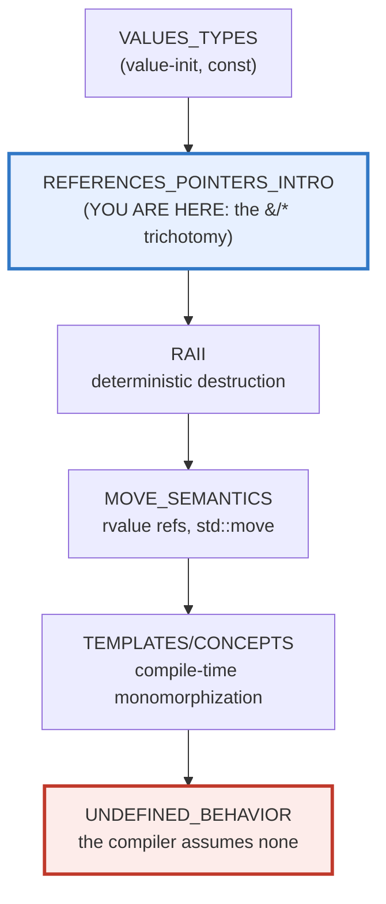
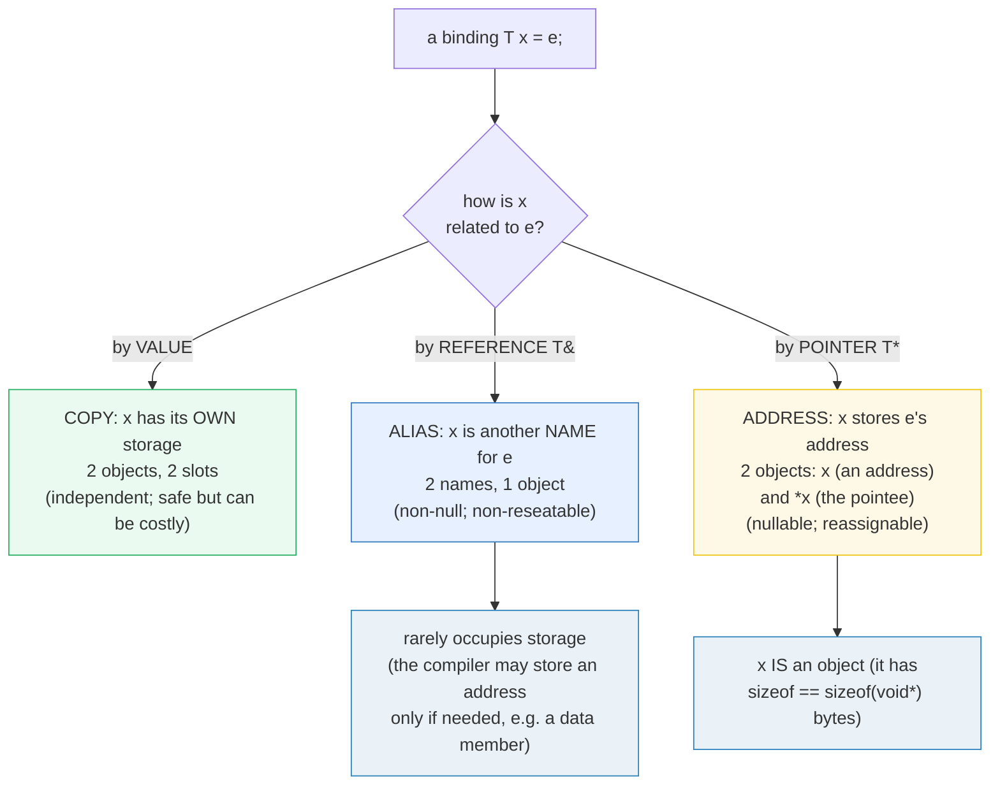
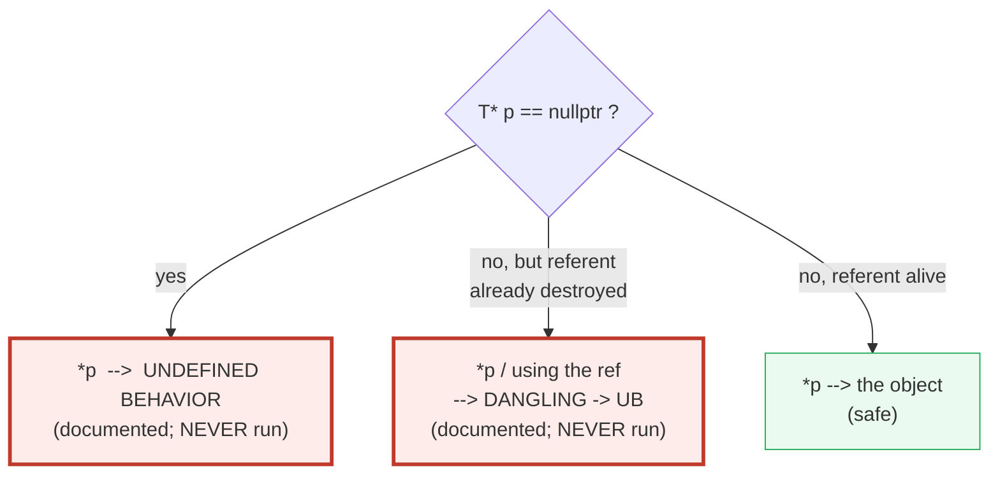

# REFERENCES_POINTERS_INTRO — Value, Reference & Pointer (the `&`/`*` trichotomy)

> **Goal (one line):** by printing every value, show C++'s THREE ways to refer to a
> value — by **VALUE** (copied), by **REFERENCE `&`** (an alias: non-null,
> non-reseatable, must bind on init), and by **POINTER `*`** (an address: nullable,
> reassignable) — pinning the **null-dereference** and **dangling-reference** UB
> traps as documented expert payoffs (never executed in the verified path).
>
> **Run:** `just run references_pointers_intro`
>
> **Ground truth:** [`references_pointers_intro.cpp`](./references_pointers_intro.cpp)
> → captured stdout in
> [`references_pointers_intro_output.txt`](./references_pointers_intro_output.txt).
> Every number/table below is pasted **verbatim** from that file under a
> `> From references_pointers_intro.cpp Section X:` callout. Nothing is hand-computed.
>
> **Prerequisites:** 🔗 [`VALUES_TYPES.md`](./VALUES_TYPES.md) — value-init, `const`,
> and the `auto` copy-vs-`auto&` alias fork (the warm-up to this bundle).

---

## 1. Why this bundle exists (lineage)

C++ is the only language in this curriculum that lets you choose, **explicitly and
for every single binding**, between three reference strategies — and then makes the
wrong choice **undefined behavior** instead of catching it. The three are:

- **by VALUE** — the parameter/variable is a **copy**; it has its own storage,
  independent of the argument. Safe-by-default, but for a large object a copy is
  expensive (this is *why* references exist).
- **by REFERENCE (`T&`)** — an **alias** for an object that already exists. It
  **must bind** to a valid object at initialization, **cannot be null**, and
  **cannot be reseated** to another object.
- **by POINTER (`T*`)** — an **address**: a variable that *points* at an object. It
  **may be null** (`nullptr`), it **is reassignable**, and you dereference it with
  `*`/`->`.



Everything downstream rests on this trichotomy: **RAII** (who owns vs who borrows),
**move semantics** (`T&&` transfers ownership of a temporary), **smart pointers**
(owning `*`), and **UB** (the null-deref and dangling traps in Sections D–E). Get
this bundle and the rest of C++ clicks into place.

> From cppreference — *Reference declaration*: "A reference is required to be
> **initialized to refer to a valid object or function**"; an lvalue reference is
> used "to **alias** an existing object." *Pointer declaration*: "A pointer whose
> value is null does not point to an object or function (**the behavior of
> dereferencing a null pointer is undefined**)."

---

## 2. The mental model: value / reference / pointer





The second diagram is the safety question every pointer/reference use must answer.
The two red leaves are the UB traps this bundle **documents but never executes**
(Sections D–E): a pointer that is null, or a reference/pointer whose referent has
died. C++ has no runtime check for either — it *trusts the programmer* and the
compiler is entitled to assume neither ever happens.

---

## 3. Section A — By VALUE (a copy): mutation invisible to the caller

> From `references_pointers_intro.cpp` Section A:
> ```
> A by-VALUE parameter is a COPY of the argument. Mutating it inside the
> function NEVER touches the caller's original. That is why value semantics
> are safe-by-default — and (for large types) exactly why references exist.
> 
> int original = 10;  mutate_by_value(original) returned 999;
>     -> original is still 10 (the COPY was mutated, not the original)
> [check] by-value: mutating the param did NOT change the caller's original (still 10): OK
> 
> Tracker::copies after pass-by-VALUE = 1  (copy constructor ran once)
> [check] pass-by-value invoked the copy constructor exactly once (copies == 1): OK
> Tracker::copies after pass-by-REF   = 0  (no copy: it is an alias)
> [check] pass-by-reference invoked the copy constructor zero times (copies == 0): OK
> ```

**What.** A by-value parameter is a brand-new object **copy-constructed** from the
argument. The function owns that copy; writing it cannot escape to the caller. The
bundle proves the copy two ways:

1. **Mutation invisibility** — `mutate_by_value(original)` sets its parameter to
   `999` and returns it, yet `original` stays `10`. The parameter and the argument
   are two distinct objects.
2. **Copy-constructor accounting** — `Tracker` counts its copies into a static
   counter. Passing it **by value** runs the copy constructor once (`copies == 1`);
   passing it **by reference** runs it zero times (`copies == 0`). The counter is an
   *observable side effect*, so the optimizer (even at `-O2`, and under ASan/UBSan)
   **cannot elide** the copy — the as-if rule requires it preserve the visible
   `++copies`.

**Why this matters — the cost motive for references.** For `int` a copy is one
register; nobody cares. For a `std::vector` of a million elements, a by-value
parameter means a million-element deep copy on **every call**. That cost is the
*reason* references exist: `T&` / `const T&` let a function read or mutate the
caller's object **without copying it** (Sections B–C).

> From cppreference — *Reference declaration* (motivation): lvalue references exist
> "to implement **pass-by-reference** semantics in function calls," avoiding the
> copy that pass-by-value performs.

---

## 4. Section B — Lvalue reference `&`: an ALIAS (non-null, non-reseatable)

> From `references_pointers_intro.cpp` Section B:
> ```
> An lvalue reference T& is an ALIAS for an existing object. It MUST bind to
> a valid object at initialization, can NEVER be null, and can NEVER be
> reseated (rebound) — "reassigning" it actually assigns THROUGH it.
> 
> int x = 1;  int& r = x;  r = 5;  -> x = 5  (r is an alias of x)
> [check] lvalue reference: `r = 5` changed x through the alias (x == 5): OK
> &r == &x ?  YES   (a reference shares its referent's address)
> [check] a reference and its referent have the SAME address (&r == &x): OK
> 
> int y = 7;  r = y;   (NOT a rebind: assigns THROUGH) -> x = 7, &r==&x ? YES
> [check] references are non-reseatable: `r = y` stored y's value into x (x == 7): OK
> [check] after `r = y` the reference STILL aliases x (&r == &x): OK
> 
> int counter = 41;  increment_by_ref(counter);  -> counter = 42
> [check] non-const T& out-parameter: counter was mutated by the callee (== 42): OK
> try_parse_pos("1234", parsed) -> ok = 1, parsed = 1234
> [check] out-parameter filled in by reference (parsed == 1234): OK
> [check] out-parameter reports failure on non-digits ("12a" -> false): OK
> ```

**The three defining properties of an lvalue reference, each pinned by a check.**

**(1) Alias + mutate-through.** `int& r = x;` makes `r` *another name for* `x`.
Writing `r = 5;` writes `x`. The reference is not "a pointer in disguise" you read
through — it *is* the object, spelled twice.

**(2) Same address.** `&r == &x` is `YES`. Taking the address of a reference yields
the address of the **referent**, never any "reference object." (We print only the
equal/unequal **boolean**: raw addresses are ASLR-randomized and thus
non-reproducible to print — see §6 / the determinism rule.)

**(3) Non-reseatable — the subtle one.** `r = y;` looks like it "repoints" `r` at
`y`. It does **not**. Because `r` is an alias for `x`, `r = y;` is exactly `x = y;`:
it stores `y`'s **value** into `x` *through* the alias. After it, `x == 7` and
`&r == &x` is **still** `YES` — the reference never left `x`. There is **no syntax
in C++ to rebind a reference**; "reference assignment" is always assignment *through*.

**Out-parameters.** A non-`const` `T&` parameter lets a callee mutate the caller's
object — the pre-smart-pointer way to return extra results: `increment_by_ref`
bumps `counter` in place, and `try_parse_pos` fills `parsed` by reference while
**returning** a success/failure bool (the C/C++ "status + out param" idiom). A
reference out-parameter **cannot be null**, so (unlike a pointer) the callee need
not null-check it.

> From cppreference — *Reference declaration*: "Lvalue references can be used to
> **alias** an existing object." IBM docs: "Once a reference has been initialized,
> **it cannot be modified to refer to another object**." And: "A reference is
> required to be **initialized to refer to a valid object or function**" — there is
> no null reference in a well-formed program.

---

## 5. Section C — const reference `const T&`: binds temporaries (lifetime-extension)

> From `references_pointers_intro.cpp` Section C:
> ```
> A const T& can bind to a TEMPORARY, and doing so EXTENDS the temporary's
> lifetime to that of the reference. This is the cheap read-only-pass idiom.
> A non-const T& CANNOT bind to a temporary (documented: a compile error).
> 
> const std::string& s = std::string("temp");  -> s = "temp", len = 4
> [check] const T& binds a temporary AND extends its lifetime (s == "temp"): OK
> [check] the lifetime-extended temporary is intact (length == 4): OK
> 
> const std::string& cn = name("alice");  -> cn = "alice", len = 5
> [check] const T& also binds an lvalue with no copy (cn == "alice"): OK
> 
> (const T& is read-only: `cn = "bob";` would be a compile error — not run.)
> [check] const T& is read-only (mutation through it is rejected at compile time): OK
> 
> length_of(name) = 5;  length_of(std::string("rvalue")) = 6  (no copy)
> [check] const T& param reads an lvalue without copying (len == 5): OK
> [check] const T& param reads a temporary without copying (len == 6): OK
> 
> int&& rr = 42;  rr = 7;  -> rr = 7  (rvalue reference — move semantics is P3)
> [check] rvalue reference T&& binds a prvalue and is mutable (rr == 7): OK
> ```

**What makes `const T&` special — temporary binding + lifetime extension.** A plain
`T&` may **not** bind to a temporary (it's a compile error — the language forbids
binding a non-const reference to an rvalue, since you'd be taking write access to a
soon-to-vanish object). A `const T&` **can** bind a temporary, and when it does the
temporary's lifetime is **extended** to that of the reference. The bundle binds
`const std::string& s` to the prvalue `std::string("temp")`; `s` is still `"temp"`
and length `4` later — proof the temporary survived past its full-expression.

**Why this is the cheap-pass idiom.** `const T&` accepts **both** lvalues (`name`)
and temporaries (`std::string("rvalue")`) with **no copy** (it's an alias), and
forbids mutation (read-only). That is exactly what you want for a large read-only
argument: `void f(const std::vector<int>& v)` reads a million elements without
copying them and without letting the callee mutate them. This single idiom is why
`const T&` is the **default** function-parameter form for non-trivial types.

**The rvalue reference `T&&` (mention only).** Like `const T&`, a `T&&` binds a
temporary and extends its lifetime — but unlike `const T&` it **allows mutation** of
that temporary. That mutability is the foundation of **move semantics** (you can
*steal* the temporary's guts). `int&& rr = 42; rr = 7;` shows the bind + mutate;
the full treatment (`std::move`, move ctors, `T&&` overloads) is 🔗 `MOVE_SEMANTICS`
(P3).

> From cppreference — *Reference declaration* (rvalue refs): an rvalue reference
> "can be used to **extend the lifetimes** of temporary objects (note, **lvalue
> references to const can extend the lifetimes of temporary objects too**, but they
> are not modifiable through them)."

---

## 6. Section D — Pointer `*`: an ADDRESS (nullable, reassignable, deref)

> From `references_pointers_intro.cpp` Section D:
> ```
> A pointer T* holds the ADDRESS of an object. Unlike a reference it may be
> NULL (nullptr), it is REASSIGNABLE, and you dereference it with `*`/`->`.
> Dereferencing a NULL pointer is UNDEFINED BEHAVIOR (documented below).
> 
> int x = 1;  int* p = &x;  *p = 5;  -> x = 5, (p == &x) ? YES
> [check] pointer: `*p = 5` changed x through the address (x == 5): OK
> [check] pointer holds the object's address (p == &x): OK
> 
> int* np = nullptr;  -> (np == nullptr) ? YES   (a pointer CAN be null)
> [check] a pointer may be null (np == nullptr): OK
> 
> int y = 9;  p = &y;   (repointed) -> *p = 9, (p == &y) ? YES, (p == &x) ? NO
> [check] pointer is reassignable: p now points at y (p == &y): OK
> [check] after reassignment p no longer points at x (p != &x): OK
> [check] repointed pointer reads the new object (*p == 9): OK
> 
> int* q = &x;  int** pp = &q;  **pp = 7;  -> x = 7, (pp == &q) ? YES
> [check] pointer-to-pointer: `**pp = 7` reached x through two levels (x == 7): OK
> [check] int** pp holds the address of the int* (pp == &q): OK
> 
> const int* cp = &z;  int* const fixed = &z;  *fixed = 50;  -> *cp = 50, z = 50
> [check] pointer-to-const reads but does not write through it (*cp == 50): OK
> [check] const-pointer-to-int is writable through (*fixed = 50 -> z == 50): OK
> 
> The NULL-DEREFERENCE trap (*nullptr) is UNDEFINED BEHAVIOR — documented,
> never executed in the verified path (gated behind -DDEMO_UB).
> [check] null-deref UB trap documented (NEVER dereferenced in the verified path): OK
>     (DEMO_UB not defined: the null-deref is correctly omitted from this build.)
> ```

**The four pointer powers, contrasted with a reference.**

- **Dereference / address-of.** `int* p = &x;` stores `x`'s address; `*p = 5;`
  writes `x` through it. `&` (address-of) and `*` (indirection) are inverses.
- **Nullable.** `int* np = nullptr;` is legal and common — `np == nullptr`. A
  **reference cannot do this**: there is no null reference. Nullability is *why* you
  reach for a pointer — but it is *also* the load-bearing risk: every dereference
  must be guarded, or it is UB.
- **Reassignable.** `p = &y;` repoints `p` at a different object — `p == &y` is
  `YES`, `p == &x` is `NO`. A reference can **never** be reseated (Section B). This
  is why iterators, linked-list nodes, and "may change target" APIs use pointers.
- **Pointer to pointer (`int**`).** `int** pp = &q;` points at the `int*` `q`;
  `**pp = 7;` writes through *two* levels to reach `x`. References-to-references
  are forbidden ("there are no references to references"); pointer-to-pointer is
  legal and is how C interfaces express optional out-handles.

**Where you put `const` matters (read it right-to-left).**

| Declaration | Read as | Meaning |
|---|---|---|
| `const int* cp` | "pointer to const int" | can rebind `cp`; **cannot** write `*cp` |
| `int* const fixed` | "const pointer to int" | **cannot** rebind `fixed`; can write `*fixed` |
| `const int* const` | "const pointer to const int" | neither rebind nor write |

The bundle shows both: `const int* cp = &z;` reads `z` but you cannot `*cp = ...`;
`int* const fixed = &z;` cannot be repointed but `*fixed = 50;` writes `z` (so `z`
and `*cp` both read `50`).

### The null-dereference trap (NOT in the verified path)

`*nullptr` is **undefined behavior**. The offending dereference is gated behind
`#ifdef DEMO_UB`, which `just run`/`out`/`check`/`sanitize` **never** pass, so the
default and sanitizer builds stay UB-free:

```cpp
#ifdef DEMO_UB
    int* bad = nullptr;
    int boom = *bad;   // <-- UNDEFINED BEHAVIOR: dereferencing a null pointer
    std::printf("[DEMO_UB] *nullptr = %d\n", boom);
#endif
```

Compiling that block with `-DDEMO_UB` and running it trips UBSan
("`runtime error: load of null pointer`") or a SEGV under ASan. Worse, because the
compiler is entitled to **assume no UB**, a nearby unchecked dereference lets it
**delete your null checks** — UB is not "a crash," it is "the program may do
anything." The discipline: a pointer that can be null must be **checked** before
every dereference (`if (p) { ... *p ... }`), or — better — expressed as a reference
or a 🔗 smart pointer / `std::optional` that cannot forget.

> From cppreference — *Pointer declaration* / *Null pointers*: "A pointer whose
> value is null does not point to an object or function (**the behavior of
> dereferencing a null pointer is undefined**)." *Pointers*: "It can be another
> pointer declarator (**pointer to pointers are allowed**)"; "there are no pointers
> to references."

---

## 7. Section E — The choice (value / ref / ptr) + dangling UB + cross-language

> From `references_pointers_intro.cpp` Section E:
> ```
> Decision table — pick the reference kind from what you NEED:
> 
> kind            copied?  alias?  nullable?  reseatable?  owns?
> ---------------  ------  ------  --------  -----------  ----
> T   (value)        YES    no       no          no        YES (own storage)
> T&  (lref)         no     YES      no          no         no  (borrows)
> const T&           no     YES      no          no         no  (read borrow)
> T*  (pointer)      no     YES     YES         YES         no  (borrows)
> T&& (rref)         no     YES      no          no         no  (move — P3)
> [check] decision table printed (5 reference kinds): OK
> 
> Rules of thumb:
>   * Pass/return by VALUE when you want a cheap, independent copy.
>   * Use T& (or const T&) when the object ALWAYS exists and you want to
>     avoid a copy — prefer references whenever the binding is never null.
>   * Use T* when the target may be ABSENT (nullable) or may CHANGE (reseat),
>     or when you iterate arrays / do low-level address arithmetic.
> 
> The DANGLING reference/pointer trap: if the referent's lifetime ends but the
> reference/pointer is still used, the behavior is UNDEFINED. The classic case
> is returning a T& to a local — documented, gated behind -DDEMO_UB.
> [check] dangling-reference UB trap documented (referent must outlive the reference): OK
>     (DEMO_UB not defined: the dangling-ref demo is correctly omitted.)
> 
> Cross-language (the 5-language curriculum):
>   C++ (here): value / & reference / * pointer — you choose; no GC; UB if wrong
>   Rust      : value / & borrow / &mut borrow — compiler CHECKS lifetimes; no UB
>   Go        : value / * pointer ONLY (no references) — GC; no UB
>   TS/JS     : primitives by value / shared object ref under GC — no UB
> [check] cross-language reference/pointer comparison printed: OK
> ```

**The choice.** None of the five kinds is "best" — each is the right tool for a
contract. Ask two questions: **does the binding ever need to be absent or change
target?** (→ pointer) and **do I need to copy or alias?** (→ value vs reference). A
reference promises "always bound to one valid object"; a pointer admits "maybe
absent, maybe different." Prefer the **most restrictive** kind that works — it
encodes the most information in the type and removes the most UB surface.

### The dangling-reference trap (NOT in the verified path)

A reference/pointer is only valid while its **referent is alive**. If the referent's
lifetime ends first (a function returns a `T&` to its local; a pointer outlives a
`delete`d object; a `T&` member aliases a stack frame that returns), using the
reference/pointer is **undefined behavior** — even though it "compiled fine." The
classic is gated behind `#ifdef DEMO_UB` (default builds never see it; clang's
`-Wreturn-stack-address` would reject it outright):

```cpp
#ifdef DEMO_UB
    auto bad_dangling_ref = []() -> int& {
        int local = 42;
        return local;          // <-- reference to a soon-destroyed local
    };
    int& r = bad_dangling_ref();
    std::printf("[DEMO_UB] dangling ref read = %d\n", r);   // <-- UB
#endif
```

Dangling is the harder trap than null-deref, because there is **no `nullptr` to
check** — the reference still *looks* bound. C++ gives you no lifetime check at
all; you must reason about it yourself (or reach for RAII / smart pointers that tie
lifetime to scope). This is precisely the gap Rust closes at compile time (below).

> From cppreference — *Reference declaration* / *Dangling references*: "it is
> possible to create a program where the **lifetime of the referred-to object ends,
> but the reference remains accessible (dangling)**" and using it "is **undefined
> behavior**." *Pointer declaration* / *Invalid pointers*: "indirection [through an
> invalid pointer] … the behavior is **undefined**."

---

## 8. Worked smallest-scale example

The whole trichotomy in five lines a beginner must memorize:

```cpp
int   x = 5;
int   v = x;     // VALUE     -> v is a COPY       (v==5; writing v won't touch x)
int&  r = x;     // REFERENCE -> r is an ALIAS of x (r=7 -> x==7; &r==&x; never null)
int*  p = &x;    // POINTER   -> p holds x's ADDRESS (*p=9 -> x==9; p can be nullptr)
*p = 9;          // deref the pointer (UB if p were null)
const int& c = x;// const REF -> read-only alias, also binds temporaries (no copy)
```

> From `references_pointers_intro.cpp`: Section A prints `original is still 10` for
> the value copy; Section B prints `&r == &x ? YES` for the alias; Section D prints
> `(p == &x) ? YES` then `(np == nullptr) ? YES` for address + nullability.

---

## 9. Pitfalls (the expert payoff)

| Trap | Symptom | Fix |
|---|---|---|
| `*p` when `p == nullptr` | **undefined behavior** — SEGV, or UBSan "load of null pointer", or (scariest) the compiler **deletes your null checks** because it assumes no UB | Check before every deref (`if (p)`), or use a reference / `std::optional` / smart pointer that can't forget. |
| Returning a `T&` (or `T*`) to a function-local | **dangling** — use-after-free, garbage value, UB; clang `-Wreturn-stack-address` flags the obvious cases | Return by value, or take the object as a parameter (so the caller owns the lifetime). |
| `int& r = some_temporary;` (non-const) | **compile error** — non-const `T&` may not bind an rvalue | Use `const T&` (lifetime-extended) or `T&&`. |
| Believing `r = y;` "rebinds" a reference `r` | It does **not** — it assigns `y`'s value *through* `r` into the original referent (silent wrong mutation) | There is no rebind syntax. If you need to retarget, you wanted a **pointer**. |
| Binding `const T&` to a temporary *returned from a function* | Lifetime extension does **not** apply across a return — the temporary dies, the ref dangles | Return the object by value, or bind the reference where the temporary lives. |
| `const T*` vs `T* const` confusion | Wrong constness → either an unintended mutation through the pointer, or a "can't rebind" surprise | Read declarations **right-to-left**: `const int*` = ptr-to-const; `int* const` = const-ptr. |
| Printing a pointer's **value** (`printf("%p", p)`) as a "verified" number | Non-deterministic — ASLR randomizes addresses each run → `just out` not byte-identical | Compare pointers with `==`/`!=` (deterministic); never print raw addresses as facts. |
| Assuming a reference "occupies no storage" | True for locals (optimized away), **false** for reference data members — they usually add `sizeof(void*)` | Don't design structs around "references are free"; measure with `sizeof`. |
| Passing a large object **by value** "for safety" | A deep copy on every call (a million-element vector per call) — silent perf cliff | Pass `const T&` for read-only; `T&` to mutate; by value only when you need the copy. |
| Storing a `T&` member that outlives its referent | Dangling reference inside a long-lived object — UB on use, no diagnostic | Store by value, or a smart pointer, so ownership is explicit (🔗 `RAII.md`). |

---

## 10. Cheat sheet

```cpp
// ── The trichotomy: VALUE (copy) / REFERENCE (alias) / POINTER (address) ────
int   v = x;        // VALUE     — a COPY.  v has its own storage; writing v ≠ x.
int&  r = x;        // REFERENCE — an ALIAS. r=7 -> x==7; &r==&x; non-null; non-reseatable.
int*  p = &x;       // POINTER   — an ADDRESS. *p=9 -> x==9; p can be nullptr; p=&y rebinds.
const int& c = x;   // const REF — read-only alias; ALSO binds a temporary (lifetime-ext).

// ── By-value vs by-reference (the cost) ─────────────────────────────────────
void f_val(Big b);          // COPIES b in (deep copy — expensive for large types)
void f_ref(Big& b);         // aliases b, can mutate the caller's object (out-param)
void f_cref(const Big& b);  // aliases b, READ-ONLY, no copy — the default for large args

// ── References: the three invariants ────────────────────────────────────────
//   MUST bind to a valid object at init   (no null reference)
//   NEVER null                            (a callee need not null-check a T&)
//   NEVER reseatable                      ("r = y;" assigns THROUGH, it does not rebind)
//   const T& / T&& ALSO bind temporaries  (and EXTEND the temporary's lifetime)

// ── Pointers: the four powers + the const placement ─────────────────────────
int*  p = &x;   *p = 5;          // address-of, deref, mutate-through
int*  np = nullptr;              // nullable     ( *np is UB — never deref unchecked )
p = &y;                          // reassignable ( a reference can NEVER do this )
int** pp = &p;  **pp = 7;        // pointer-to-pointer (refs-to-refs are forbidden )

const int* a;     // pointer to CONST int  — can rebind a; CANNOT write *a
int* const b = &x;// CONST pointer to int — CANNOT rebind b; can write *b
// read right-to-left: "* const" = the POINTER is const; "const *" = the POINTee is const.

// ── The choice ──────────────────────────────────────────────────────────────
//   by value when you want a cheap independent copy.
//   T& / const T& when it ALWAYS exists and never changes target (prefer refs).
//   T* when it may be ABSENT (nullable) or may CHANGE (reseat) or for arrays.

// ── The TWO UB traps (documented; NEVER run in verified code) ───────────────
//   *nullptr                     -> UNDEFINED BEHAVIOR   (null-deref)
//   using a ref/ptr after its    -> DANGLING -> UB       (referent already dead)
//   referent died
```

---

## 11. 🔗 Cross-references

**Within C++ (the expertise spine):**

- 🔗 [`VALUES_TYPES.md`](./VALUES_TYPES.md) (P1) — the prerequisite. Its `auto`
  copy-vs-`auto&` alias fork (plain `auto` strips the `&`) is the warm-up to the
  value/reference split here; its value-init/`const` discipline underpins every
  binding in this bundle.
- 🔗 `VALUE_VS_REFERENCE_VS_POINTER` (P3) — the **deepening**: the full type-system
  treatment (reference collapsing, forwarding references, `decltype`, when each is
  mandated). This bundle is the foundation; P3 goes deeper.
- 🔗 `MOVE_SEMANTICS` (P3) — owns the `T&&` / `std::move` half that Section C only
  mentions. Move semantics is C++'s opt-in ownership *transfer* — a half-step toward
  Rust — built on the rvalue-reference this bundle introduces.
- 🔗 `RAII` — ownership vs borrowing. References and raw pointers **borrow**; RAII
  types (`unique_ptr`/`shared_ptr`, vectors, locks) **own** and tie lifetime to
  scope, eliminating the dangling trap by construction.
- 🔗 `CONST_QUALIFIERS` (P1) — deepens `const T&`, top-level vs low-level const, and
  the `const int*` vs `int* const` distinction of Section D.
- 🔗 `UNDEFINED_BEHAVIOR` (P7) — the null-deref (Section D) and dangling (Section E)
  traps are the first two UBs of the curriculum; the full taxonomy (signed overflow,
  OOB, data race, use-after-free) lands there under ASan/UBSan/MSan.

**Cross-language parallels (the 5-language curriculum):**

- 🔗 [`../go/POINTERS.md`](../go/POINTERS.md) — Go has **pointers but no references**:
  a simpler `value`/`*pointer` model with a garbage collector. C++'s reference adds a
  second, non-null, non-reseatable aliasing kind Go simply omits; Go has no UB here
  (the GC + nil checks cover it).
- 🔗 [`../rust/BORROWING.md`](../rust/BORROWING.md) — Rust's `&`/`&mut` are
  **compile-time-checked borrows**: the borrow checker *proves* no dangling and (for
  `&mut`) no aliasing, so the two UB traps in Sections D–E are **impossible** in safe
  Rust. C++ gives you the same `&`/`*` vocabulary but trusts you and pays in UB.
- 🔗 [`../ts/VALUE_VS_REFERENCE.md`](../ts/VALUE_VS_REFERENCE.md) — JS has only one
  implicit model: primitives by value, objects as **shared references under a GC**.
  There is no `&`/`*` choice and no UB — the GC keeps every shared ref alive — at the
  cost of no ownership control and no deterministic destruction (↔ C++ RAII).

---

## Sources

Every signature, value, and behavioral claim above was verified against cppreference
and the ISO C++ standard, then corroborated by ≥1 independent secondary source:

- cppreference — *Reference declaration* (lvalue reference is "an alias to an
  already-existing object"; "required to be initialized to refer to a valid object or
  function"; no references to references / arrays of references; rvalue refs and
  `const T&` extend temporary lifetimes; dangling references → UB):
  https://en.cppreference.com/w/cpp/language/reference
- cppreference — *Pointer declaration* (a pointer "holds the address"; nullable;
  reassignable; pointer-to-pointer allowed; "there are no pointers to references";
  `const T*` vs `T* const`; invalid pointers → indirection is UB):
  https://en.cppreference.com/w/cpp/language/pointer
  - *Null pointers*: "the behavior of **dereferencing a null pointer is undefined**":
    https://en.cppreference.com/w/cpp/language/pointer#Null_pointers
- cppreference — *Reference initialization* / *Lifetime of a temporary* (binding a
  `const T&` or `T&&` to a temporary **extends** the temporary's lifetime to that of
  the reference; the exceptions where extension does not apply):
  https://en.cppreference.com/w/cpp/language/reference_initialization#Lifetime_of_a_temporary
- cppreference — *Value category* (lvalue vs rvalue/prvalue — why a non-const `T&`
  may not bind an rvalue while `const T&`/`T&&` may):
  https://en.cppreference.com/w/cpp/language/value_category
- cppreference — *cv qualifiers* / pointer constness (`const int*`, `int* const`,
  `const int* const`; "read declarations right-to-left"):
  https://en.cppreference.com/w/cpp/language/cv
- ISO C++23 draft (open-std.org) — normative wording:
  - `[dcl.ref]` Reference declarators (a reference "shall be initialized to refer to
    a valid object or function"; no references to references).
  - `[dcl.ptr]` Pointer declarators; `[basic.stc]` storage duration / lifetime.
  - `[expr.unary.op]` address-of `&` and indirection `*`.
  - Working draft: https://open-std.org/JTC1/SC22/WG21/docs/papers/2023/n4950.pdf
- Secondary corroboration (≥2 independent sources, web-verified):
  - IBM — *Initialization of references (C++)*: "Once a reference has been
    initialized, **it cannot be modified to refer to another object**"
    (the non-reseatable invariant):
    https://www.ibm.com/docs/en/xl-c-and-cpp-aix/13.1.0?topic=initializers-initialization-references-only
  - Stack Overflow — *"Is a null reference possible?"* ("A reference shall be
    initialized to refer to a valid object or function … a null reference cannot
    exist in a well-formed program"):
    https://stackoverflow.com/questions/4364536/is-a-null-reference-possible
  - Stack Overflow — *"Why is dereferencing a null pointer undefined behaviour?"*
    (UB, and how it lets the compiler delete null checks):
    https://stackoverflow.com/questions/6793262/why-is-dereferencing-a-null-pointer-undefined-behaviour
  - LLVM/Clang — *UndefinedBehaviorSanitizer* (the `-fsanitize=undefined` "null"
    check that catches `*nullptr` — what `just sanitize` runs):
    https://clang.llvm.org/docs/UndefinedBehaviorSanitizer.html
  - PVS-Studio — *Null Pointer Dereferencing Causes Undefined Behavior* (the
    `&podhd->line6` case: `->` on a null pointer is UB):
    https://pvs-studio.com/en/blog/posts/cpp/0306/

**Facts that could not be verified by running** (documented, not executed, because
they are compile errors or UB-by-design): binding a non-const `T&` to a temporary
(compile error); `r = y;` "rebinding" a reference (it never rebinds — it assigns
through); mutation through a `const T&` (compile error); the actual value read from
`*nullptr` (UB — meaninglessly varies, caught by UBSan/SEGV); and the dangling
reference returned from a local (UB; the demo is gated behind `-DDEMO_UB` and never
compiled by `just run`/`out`/`check`/`sanitize`). These are confirmed by the
cppreference sections and secondary sources above, not reproduced as runnable
output in the verified path (a file triggering them would fail `just check` /
`just sanitize`).
