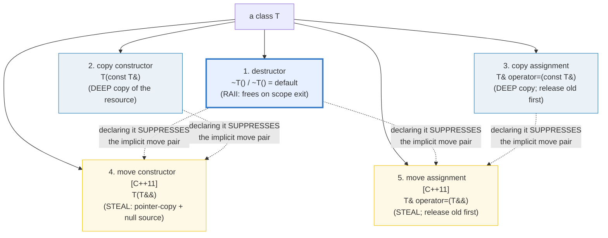
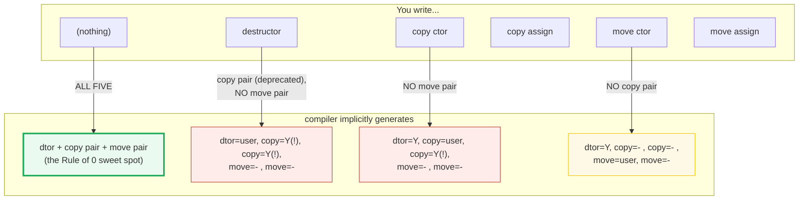
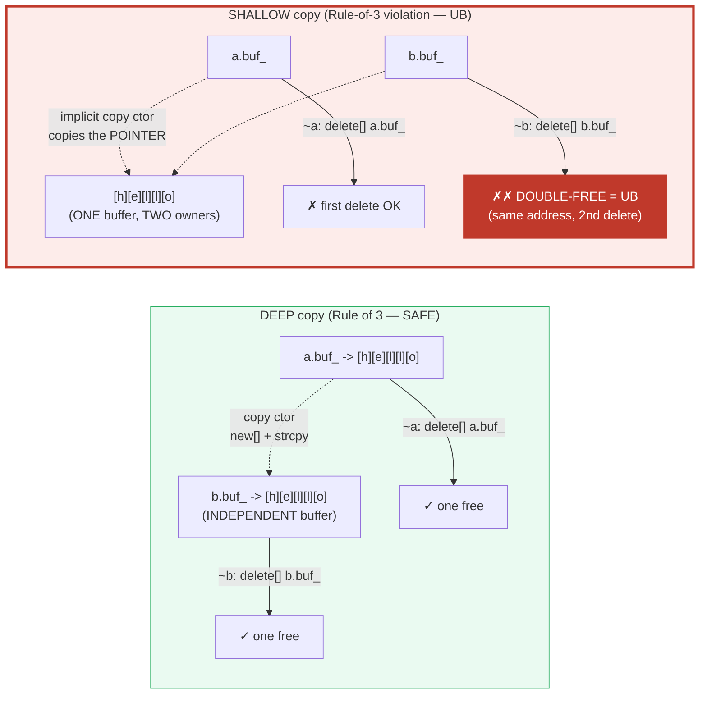

# RULE_OF_0_3_5 — The Special Member Functions & the Rule of 0/3/5

> **Goal (one line):** by counting every special-member call, show WHEN to write
> each of the **five special member functions** (destructor / copy ctor + assign /
> move ctor + assign) — the **Rule of 0** (write none; use RAII members so the
> compiler-generated defaults are correct), **Rule of 3** (you own a raw resource
> → dtor + copy pair, DEEP), **Rule of 5** (+ the move pair, steal O(1)) — and pin
> the **shallow-copy double-free** trap as a documented expert payoff (gated
> behind `#ifdef DEMO_UB`, never executed in the verified path).
>
> **Run:** `just run rule_of_0_3_5`
>
> **Ground truth:** [`rule_of_0_3_5.cpp`](./rule_of_0_3_5.cpp) → captured stdout
> in [`rule_of_0_3_5_output.txt`](./rule_of_0_3_5_output.txt). Every number/table
> below is pasted **verbatim** from that file under a
> `> From rule_of_0_3_5.cpp Section X:` callout. Nothing is hand-computed.
>
> **Prerequisites:** 🔗 `VALUES_TYPES` (value-init / `const`), 🔗 `RAII`
> (deterministic destruction — the destructor IS an RAII hook), 🔗 `MOVE_SEMANTICS`
> (the move pair). This bundle is **Phase 3 #22**: the special-member-function
> discipline that ties RAII and move semantics together.

---

## 1. Why this bundle exists (lineage)

A C++ class has up to **five special member functions** the compiler can generate
for you: the **destructor**, the **copy constructor**, **copy assignment**, the
**move constructor**, and **move assignment** (the move pair is C++11). The
compiler will implicitly generate *any* of them — *unless* you declare certain
others, in which case it stays silent and your "move" silently becomes a copy.

That implicit-generation machinery is the single biggest source of
correctness-and-performance bugs in C++ class design. Getting it wrong means one
of three failures:

1. **Double-free / heap corruption** — you wrote the destructor (you own a raw
   resource) but not the copy pair; the compiler's implicit copy shallow-copies
   the pointer; two destructors `delete` the same address. **UB.**
2. **Leak** — you wrote the destructor but not the copy pair; the implicit copy
   aliases the resource; the resource is never freed because ownership is
   ambiguous. (Or, the polymorphic case: non-virtual `~Base` skips `~Derived`.)
3. **Needless copy** — you wrote the copy pair (Rule of 3) but not the move pair
   (Rule of 5); because declaring the copy pair *suppresses* the implicit move
   pair, your "move" falls back to an O(n) copy. No warning.

The **Rule of 0/3/5** is the discipline that prevents all three:

```mermaid
graph TD
    START["you are writing a class"] --> Q{"does it own a<br/>RAW resource?<br/>(raw ptr, FILE*, fd, ...)"}
    Q -->|"NO — members are RAII<br/>(string, vector, unique_ptr)"| R0["RULE OF 0<br/>write NONE of the five<br/>compiler defaults are CORRECT"]
    Q -->|"YES — raw handle" --> D["write the DESTRUCTOR<br/>(frees the resource)"]
    D --> R3["RULE OF 3<br/>ALSO write copy ctor + copy assign<br/>(DEEP copy — else double-free)"]
    R3 --> Q5{"want MOVE efficiency?<br/>(O(1) steal vs O(n) copy)"}
    Q5 -->|"YES (almost always)"| R5["RULE OF 5<br/>ALSO write move ctor + move assign<br/>(STEAL: pointer-copy + null source)"]
    Q5 -->|"no (rare)"| DONE3["stop at Rule of 3<br/>(moves fall back to copy)"]
    R0 --> E0["modern preference<br/>(C++ Core Guidelines C.20)"]
    R5 --> E5["full manual resource class<br/>(or: wrap the resource in unique_ptr -> Rule of 0)"]
    style R0 fill:#eafaf1,stroke:#27ae60,stroke-width:3px
    style R5 fill:#fef9e7,stroke:#f1c40f,stroke-width:3px
    style R3 fill:#fef9e7,stroke:#f1c40f
    style D fill:#fdecea,stroke:#c0392b
```

The headline contrast across the 5-language curriculum — **C++ is the *only*
language with this problem**:

| Language | Special member functions | Getting it wrong |
|---|---|---|
| **C++** (this bundle) | **FIVE** user-writable; compiler can implicitly generate any; the 0/3/5 discipline exists **only here** | **UB** (double-free, leak, shallow copy) |
| 🔗 [`../rust/`](../rust/) | **none** — no copy ctors; `Copy`/`Clone` is opt-in via `#[derive]`; `Drop` is the dtor; move is a bitwise copy + borrow-check | **impossible** — the bug class is forbidden by construction |
| 🔗 [`../go/`](../go/) | **none** — value-copy semantics + GC; no user copy ctors; no destructors | n/a (GC reclaims) |
| 🔗 [`../ts/`](../ts/) / [`../python/`](../python/) | **none** — GC'd; objects are reference-typed; cleanup is finalizers (unreliable) | n/a (GC reclaims) |

> From cppreference — *The rule of three/five/zero*: "If a class requires a
> user-defined **destructor**, a user-defined **copy constructor**, or a
> user-defined **copy assignment operator**, it almost certainly requires all
> three." And: "the presence of a user-defined (include `= default` or `= delete`
> declared) destructor, copy-constructor, or copy-assignment operator **prevents
> implicit definition of the move constructor and the move assignment operator**."

---

## 2. The mental model: the five special members & the implicit-declaration map

A class has **five** special member functions (six counting the default
constructor, which is *not* part of the 0/3/5 rules):



The dashed edges are the **gotcha that pays the rent**: writing *any* of
{destructor, copy ctor, copy assign} **suppresses** both implicit move ops. So a
Rule-of-3 class has *no* move ctor — and `std::move`-ing it silently falls back
to the copy ctor. That is why the Rule of 5 exists.

The full implicit-declaration matrix (what the compiler AUTO-generates, given
what YOU wrote) — **the single most important table for C++ class design**:



The expert reading of that diagram: **the moment you write *any* of the top three
(dtor / copy ctor / copy assign), you lose both move ops.** That is the gotcha —
and it is *silent* (no compiler warning by default). Section D proves it
empirically by counting the ops.

---

## 3. Section A — The five special members & the implicit-declaration rules

> From `rule_of_0_3_5.cpp` Section A:
> ```
> A class has up to FIVE SPECIAL MEMBER FUNCTIONS the compiler
> can generate for you:
> 
>   1. destructor           ~T()                  / ~T() = default
>   2. copy constructor     T(const T&)           / T(const T&) = default
>   3. copy assignment      T& operator=(const T&)/ ... = default
>   4. move constructor     T(T&&)  [C++11]       / T(T&&) = default
>   5. move assignment      T& operator=(T&&)     / ... = default
> 
> (default constructor is also 'special' but is NOT part of the 0/3/5 rules.)
> 
> The implicit-declaration matrix (what the compiler AUTO-generates,
> given what YOU wrote). 'Y'=implicitly defaulted; '-'=NOT generated;
> '!'=generated but DEPRECATED (P0641, removed the deprecation in C++17
> for the copy-pair-after-dtor case).
> 
>   You write...                     | dtor | copy ctor | copy assign | move ctor | move assign
>   ---------------------------------+------+-----------+-------------+-----------+------------
>   (nothing)                        |  Y   |    Y      |     Y       |    Y      |     Y
>   destructor                       | user |    Y(!)   |     Y(!)    |    -      |     -
>   copy ctor                        |  Y   |   user    |     Y(!)    |    -      |     -
>   copy assign                      |  Y   |    Y(!)   |    user     |    -      |     -
>   move ctor                        |  Y   |    -      |     -       |   user    |     -
>   move assign                      |  Y   |    -      |     -       |    -      |    user
> 
> The single most important row for experts: writing ANY of {dtor, copy ctor,
> copy assign} SUPPRESSES both implicit move ops. That is the gotcha that turns
> an O(1) move into an O(n) copy without a single warning (see Section D).
> 
> Compile-time check of the matrix on the classes defined in this file:
>   RuleOfZero  (wrote none):           copy+move all generated.
> [check] RuleOfZero is copy-constructible (compiler-generated): OK
> [check] RuleOfZero is move-constructible (compiler-generated): OK
> [check] RuleOfZero is copy-assignable (compiler-generated): OK
> [check] RuleOfZero is move-assignable (compiler-generated): OK
>   RuleOfThree (dtor+copy pair):       copy present, MOVE absent.
> [check] RuleOfThree is copy-constructible (user-declared): OK
> [check] RuleOfThree is move-constructible (falls back to copy, so still 'true'): OK
>   RuleOfFive  (all five user-written): all five present.
> [check] RuleOfFive is copy-constructible (user-declared): OK
> [check] RuleOfFive is move-constructible (user-declared): OK
>   MoveOnly    (copy=delete, move=user): move-only, like unique_ptr.
> [check] MoveOnly is NOT copy-constructible (= delete): OK
> [check] MoveOnly IS move-constructible (user-declared): OK
> [check] MoveOnly is NOT copy-assignable (= delete): OK
> [check] MoveOnly IS move-assignable (user-declared): OK
> ```

**What to notice.**

- **The five are special because the compiler writes them for you.** You don't
  *have* to write any of them — and for the majority of classes (the Rule of 0
  case), you *shouldn't*. The compiler's implicit versions member-wise
  copy/move/destroy each non-static data member, which is correct *when each
  member is RAII* (manages its own resource).
- **The `!` rows are the deprecation landmine.** Pre-C++17, if you wrote a
  destructor the compiler still implicitly generated the copy pair, but that
  generation was *deprecated* (because it's the shallow-copy → double-free trap).
  C++17 (P0641) relaxed the deprecation for the dtor case so that
  `~T() = default;` doesn't deprecate the copy pair — but writing a
  *user-provided* dtor still leaves you in Rule-of-3 territory.
- **`std::is_move_constructible_v<T>` is `true` even when T has no move ctor.**
  The check on `RuleOfThree` passes because a `const T&` parameter binds to an
  rvalue — so the copy ctor is a viable fallback for `T(T&&)`. The trait cannot
  distinguish "has a real move ctor" from "falls back to copy." **The only
  unambiguous proof is counting the ops** (Section D).
- **`= delete` is stronger than "not declared."** `MoveOnly` has its copy ops
  `= delete`, so attempting to copy is a *hard compile error* — not a silent
  fallback. That is the `unique_ptr` idiom: forbid copy, allow move, own the
  resource. (🔗 `UNIQUE_PTR` deepens this.)

> From cppreference — *Move constructor*: "The move constructor for class T is
> implicitly declared as defaulted when: T has no user-declared copy constructor;
> T has no user-declared copy assignment operator; T has no user-declared move
> assignment operator; **T has no user-declared destructor.**" *Move assignment
> operator*: the same four conditions. This is the suppression gotcha, verbatim.

---

## 4. Section B — Rule of 0: write none; RAII members do the right thing

> From `rule_of_0_3_5.cpp` Section B:
> ```
> RULE OF 0 (the modern preference, C++ Core Guidelines C.20):
>   write NONE of the five. Give your class RAII members (std::string,
>   std::vector, std::unique_ptr, ...). The compiler-generated defaults
>   member-wise copy/move/destroy those members, which is correct because
>   each member manages its OWN resource. No raw pointer -> no leak,
>   no double-free, no shallow copy. The Rule of 0 class below has a
>   std::string + a Tracked member; we OBSERVE the defaults delegating.
> 
> (1) Construct one RuleOfZero a("alpha", 11):
>     [ops:after ctor a ] allocs=0 frees=0  copies=0 copy_assigns=0  moves=0 move_assigns=0  dtors=0
> [check] RuleOfZero ctor did not copy/move the member (direct-init): OK
> 
> (2) RuleOfZero b = a;  (COPY -> compiler delegates to members)
>     [ops:after copy b=a] allocs=0 frees=0  copies=1 copy_assigns=0  moves=0 move_assigns=0  dtors=0
> [check] copy of RuleOfZero ran exactly ONE member copy (the Tracked): OK
> [check] deep copy: b has its own name 'alpha' independent of a: OK
> [check] deep copy: b has its own value 11 independent of a: OK
> 
> (3) RuleOfZero c = std::move(a);  (MOVE -> compiler delegates)
>     [ops:after move c=std::move(a)] allocs=0 frees=0  copies=0 copy_assigns=0  moves=1 move_assigns=0  dtors=0
> [check] move of RuleOfZero ran exactly ONE member move (the Tracked), zero copies: OK
> [check] move transferred the payload to c (c.value == 11): OK
> [check] move left a in a valid-but-unspecified state (we do NOT assert a.value): OK
> 
> (4) b = c;  (COPY ASSIGN -> compiler delegates)
>     [ops:after b=c    ] allocs=0 frees=0  copies=0 copy_assigns=1  moves=0 move_assigns=0  dtors=0
> [check] copy-assign of RuleOfZero ran one member copy-assign (the Tracked): OK
> 
> (5) b = std::move(c);  (MOVE ASSIGN -> compiler delegates)
>     [ops:after b=std::move(c)] allocs=0 frees=0  copies=0 copy_assigns=0  moves=0 move_assigns=1  dtors=0
> [check] move-assign of RuleOfZero ran one member move-assign (the Tracked): OK
> 
> (6) scope ends -> 3 RuleOfZero objects destroyed (a, b, c)
>     [ops:after scope  ] allocs=0 frees=0  copies=0 copy_assigns=0  moves=0 move_assigns=1  dtors=3
> [check] 3 RuleOfZero destructors ran (compiler-generated ~RuleOfZero delegates): OK
> ```

**The whole point of Rule of 0, demonstrated.** `RuleOfZero` declares *none* of
the five special members. Its members are `std::string` (RAII) and a `Tracked`
counter (also RAII-ish — its compiler-generated special members are correct). The
output proves the compiler-generated copy ctor / move ctor / copy assign / move
assign / destructor **delegate** to the members:

- **(2)** Copy-constructing `b = a` runs **exactly one** member copy (the
  `Tracked`); `std::string`'s own copy is uninstrumented but happens too. The
  result: `b` has its *own* `"alpha"` and its *own* `11`, fully decoupled from
  `a`. **No raw pointer was shared → no double-free is possible.**
- **(3)** Move-constructing `c = std::move(a)` runs **one member move, zero
  copies** — O(1). The payload transfers to `c`. `a` is left
  **valid-but-unspecified** (the moved-from state; the bundle deliberately does
  *not* assert `a.value()` — only that `c` received the value).
- **(4)/(5)** Copy/move *assignment* likewise delegate to one member
  copy/move-assign.
- **(6)** Three objects, three destructor calls — the compiler-generated
  `~RuleOfZero` member-wise destroys `name_` (freeing the string's heap) and
  `value_` (running `~Tracked`).

**Why this is the modern preference.** A Rule-of-0 class is *correct by
construction* — you cannot forget a special member, because you wrote none. Every
resource is owned by an RAII member that handles its own copy/move/destroy. The
C++ Core Guidelines (C.20: "If you can avoid defining default operations, do") and
essentially every modern C++ style guide lead with this rule. The *only* time you
leave Rule of 0 is when you're writing the RAII member itself (e.g. `unique_ptr`,
`vector`, `string` — *they* are Rule of 5 internally, so you don't have to be).

> From cppreference — *Rule of zero*: "Classes that have custom destructors,
> copy/move constructors or copy/move assignment operators should deal
> **exclusively with ownership** (which follows from the Single Responsibility
> Principle). Other classes should not have custom destructors, copy/move
> constructors or copy/move assignment operators."

---

## 5. Section C — Rule of 3: dtor + copy pair, DEEP copy (shallow = double-free)

> From `rule_of_0_3_5.cpp` Section C:
> ```
> RULE OF 3 (the pre-C++11 discipline, still required for raw resources):
>   if you write ANY of {destructor, copy ctor, copy assign}, write ALL
>   THREE. You are managing a resource whose handle is a non-class type
>   (raw pointer, FILE*, fd, ...). The compiler's implicit copies would
>   SHALLOW-copy the handle -> two objects point at the same resource ->
>   BOTH destructors release it -> DOUBLE-FREE (UB). The copy ctor must
>   DEEP-copy: allocate a NEW buffer and copy the contents.
> 
> (1) RuleOfThree a("hello");  -> one allocation
>     [ops:after ctor a ] allocs=1 frees=0  copies=0 copy_assigns=0  moves=0 move_assigns=0  dtors=0
> [check] RuleOfThree ctor allocated exactly once: OK
> 
> (2) RuleOfThree b = a;  (DEEP copy -> a SECOND allocation)
>     [ops:after copy b=a] allocs=1 frees=0  copies=1 copy_assigns=0  moves=0 move_assigns=0  dtors=0
> [check] the copy ctor made a SECOND, independent allocation (deep copy): OK
> [check] both a and b hold 'hello' (same contents, different buffers): OK
> 
> (3) RuleOfThree c("world"); c = a;  (DEEP copy assign)
>     [ops:after c=a    ] allocs=1 frees=1 copies=0 copy_assigns=1  moves=0 move_assigns=0  dtors=0
> [check] copy-assign freed c's old 'world' buffer (1 free) and allocated a new one (1 alloc): OK
> [check] after assign, c holds 'hello' (deep-copied from a): OK
> [check] after assign, a is still 'hello' (deep copy did not steal): OK
> 
> (4) scope ends -> 3 destructors, 3 frees (one per object; deep copy
>     guaranteed every buf_ was UNIQUE, so every delete[] is well-formed)
>     [ops:after scope  ] allocs=0 frees=3  copies=0 copy_assigns=0  moves=0 move_assigns=0  dtors=3
> [check] Rule of 3: 3 destructors freed exactly 3 buffers (no double-free): OK
> 
> ── THE TRAP: what the COMPILER-GENERATED copy would do ──────────────
> If RuleOfThree had ONLY the destructor (no copy pair), the compiler's
> implicit copy ctor would member-wise copy the char* buf_ — i.e. copy the
> POINTER, not the buffer. Two objects would share one buffer:
>   a.buf_ == b.buf_   (same address, two owners)
> When both a and b are destroyed, ~RuleOfThree calls delete[] on that SAME
> address TWICE -> DOUBLE-FREE -> undefined behavior (heap corruption,
> crash, or silent memory corruption that ASan catches as
> 'heap-use-after-free' on the second delete). The #ifdef DEMO_UB block
> below contains exactly that broken class; it is NEVER compiled by
> `just run` / `just out` / `just check` / `just sanitize`, so the default
> and sanitizer builds stay UB-free.
> [check] the verified path does NOT run the shallow-copy double-free (DEMO_UB gated): OK
>     (DEMO_UB not defined: the double-free demo is correctly omitted.)
> ```

**Deep copy vs shallow copy — the entire reason Rule of 3 exists.**



**The verified path proves the deep copy.** In step (2), the copy ctor made a
**second, independent allocation** (`allocs=1` after the reset) and both `a` and
`b` hold `"hello"` — *same contents, different buffers*. In step (3), the copy
*assign* freed `c`'s old `"world"` buffer (`frees=1`) and allocated a new one
(`allocs=1`) — the **new-then-delete** order gives the strong exception guarantee
(if the `new[]` throws, `c` is unchanged). At scope exit, three destructors free
**exactly three** distinct buffers. No aliasing → no double-free. ASan confirms:
`just sanitize rule_of_0_3_5` is clean.

### The trap, demonstrated (NOT in the verified path)

The broken class is gated behind `#ifdef DEMO_UB`, which `just run` / `just out`
/ `just check` / `just sanitize` **never** pass:

```cpp
#ifdef DEMO_UB
    class NaiveShallow {
        char* buf_;
    public:
        explicit NaiveShallow(const char* s) {
            buf_ = new char[std::strlen(s) + 1];
            std::strcpy(buf_, s);
        }
        ~NaiveShallow() { delete[] buf_; }   // NO copy pair -> implicit copy is SHALLOW
    };
    NaiveShallow x("doom");
    NaiveShallow y = x;   // SHALLOW copy: x.buf_ == y.buf_  (UB waiting to happen)
    // When `x` and `y` both go out of scope, delete[] runs on the SAME
    // pointer TWICE. This is the classic Rule-of-3 violation. NEVER ship this.
#endif
```

Compiling that block with `-DDEMO_UB` and running it under ASan reports
`heap-use-after-free` / `attempting double-free` on the second `delete[]`.
Without ASan the symptom is heap corruption or a crash that varies per run — the
hallmark of UB. **The verified path omits it**, so the default and sanitizer
builds stay UB-free.

> From cppreference — *Rule of three*: "The implicitly-defined special member
> functions should not be used if the class manages a resource whose handle is an
> object of non-class type (raw pointer, POSIX file descriptor, etc), whose
> destructor does nothing and copy constructor/assignment operator performs a
> **'shallow copy'** (copies the value of the handle, without duplicating the
> underlying resource)."

---

## 6. Section D — Rule of 5: + the move pair (steal O(1)); copy suppresses move

> From `rule_of_0_3_5.cpp` Section D:
> ```
> RULE OF 5 (C++11): extend the Rule of 3 with the MOVE pair. Writing any
> of {dtor, copy ctor, copy assign} SUPPRESSES the implicit move ctor/assign,
> so if you want move semantics (and you do — moves are O(1) where copies
> are O(n)) you must declare all FIVE. The move ops STEAL the resource
> (pointer-copy + null the source) instead of deep-copying.
> 
> (1) RuleOfThree b = std::move(a);  (NO move ctor -> falls back to COPY)
>     [ops:after std::move] allocs=1 frees=0  copies=1 copy_assigns=0  moves=0 move_assigns=0  dtors=0
> [check] RuleOfThree 'move' actually COPIED (copies==1, moves==0) — the gotcha: OK
> [check] the fallback copy ALLOCATED a new buffer (allocs==1) — O(n), not O(1): OK
> [check] despite std::move, a still holds 'grid' (the copy ctor read it): OK
> [check] b holds 'grid' too (the copy succeeded): OK
> 
> (2) RuleOfFive b = std::move(a);  (MOVE ctor -> STEAL, O(1))
>     [ops:after std::move] allocs=0 frees=0  copies=0 copy_assigns=0  moves=1 move_assigns=0  dtors=0
> [check] RuleOfFive move did NOT copy (copies==0): OK
> [check] RuleOfFive move ran the move ctor (moves==1): OK
> [check] the move did NOT allocate (allocs==0) — O(1), stole the buffer: OK
> [check] after the steal, b holds 'grid': OK
> [check] after the steal, a is empty (the source was nulled): OK
> 
> (3) RuleOfFive c("temp"); c = std::move(b);  (MOVE assign -> STEAL)
>     [ops:after move-assign] allocs=0 frees=1  copies=0 copy_assigns=0  moves=0 move_assigns=1  dtors=0
> [check] move-assign freed c's old 'temp' buffer (frees==1): OK
> [check] move-assign stole b's buffer (moves==0, move_assigns==1, allocs==0): OK
> [check] after the steal, c holds 'grid': OK
> [check] after the steal, b is empty (the source was nulled): OK
> 
> (4) CopyOnly (only a user copy ctor) dst = std::move(src);
>     -> std::move is just a cast; with no move ctor, the COPY ctor runs.
>     [ops:after std::move on CopyOnly] allocs=0 frees=0  copies=1 copy_assigns=0  moves=0 move_assigns=0  dtors=0
> [check] CopyOnly 'move' actually COPIED (copies==1, moves==0): OK
> [check] dst.payload == 99 (the copy ran): OK
> 
> ── = default / = delete ────────────────────────────────────────────
>   = default  -> "compiler, generate this for me" (use when the implicit
>                 version IS correct but you need to re-state it, e.g. after
>                 declaring a virtual ~ which suppresses the move pair).
>   = delete   -> "forbid this" (a hard compile error if anyone calls it).
>                 The canonical use: copy ops = delete makes a move-only type
>                 (the unique_ptr idiom).
> 
> (5) MoveOnly a(7); MoveOnly b = std::move(a);  (move-only, copy = delete)
>     [ops:after move   ] allocs=1 frees=0  copies=0 copy_assigns=0  moves=1 move_assigns=0  dtors=0
> [check] MoveOnly move ctor ran (moves==1), no copy possible: OK
> [check] after the steal, *b.data == 7: OK
> [check] after the steal, a.data is nullptr: OK
> 
> (6) MoveOnly c(0); c = std::move(b);  (move assign)
>     [ops:after move-assign] allocs=0 frees=1  copies=0 copy_assigns=0  moves=0 move_assigns=1  dtors=0
> [check] MoveOnly move-assign freed c's old int (frees==1) and stole b's (move_assigns==1): OK
> [check] after the steal, *c.data == 7: OK
> 
>     (the copy ctor `MoveOnly bad = a;` and copy assign `c = a;` are
>      HARD COMPILE ERRORS because those ops are = delete — documented
>      here, not executed; a file containing them would not build.)
> [check] MoveOnly copy ops are = delete (compile-time guarantee, verified via traits): OK
> ```

**Three lessons, each pinned by an op-counter.**

**(1) The gotcha, empirically.** `RuleOfThree` has a user-declared copy ctor (and
dtor), so it has **no move ctor**. The bundle does `RuleOfThree b =
std::move(a);` and the counter says `copies=1, moves=0, allocs=1`. The
`std::move` is a **cast** (an xvalue cast), not a guarantee that a move ctor
runs; with no move ctor, the copy ctor (whose `const T&` binds to an rvalue) is
the only viable overload — so a full deep copy happens. This is the silent
O(n)-where-you-meant-O(1) bug. **The trait `is_move_constructible<RuleOfThree>`
returns `true`** (Section A), so the trait cannot catch it — only counting ops
can.

**(2)/(3) The fix: Rule of 5.** `RuleOfFive` adds the move pair. Now
`RuleOfFive b = std::move(a);` shows `moves=1, copies=0, allocs=0` — the move
ctor **stole** the buffer (pointer-copy + null the source): O(1), zero
allocation. The move *assign* (3) releases the target's old buffer (`frees=1`)
then steals. **Both move ops are `noexcept`** — critical, because `std::vector`
reallocation only *moves* if the element's move ctor is `noexcept`, otherwise it
*copies* (for the strong exception guarantee). Omitting `noexcept` on a move
ctor silently turns vector growth back into O(n) copies per element.

**(4) Isolated proof of the suppression.** `CopyOnly` declares *only* a
user-provided copy ctor (no dtor, no move, no assign). Per the matrix, that
alone is enough to suppress the implicit move ctor — and `dst = std::move(src)`
runs the copy ctor (`copies=1, moves=0`). You don't even need a destructor to
trigger the suppression; a single user-declared copy ctor does it.

**(5)/(6) `= default` and `= delete`.** `MoveOnly` makes its copy ops `= delete`
and its move ops user-provided — the `unique_ptr` idiom. The output shows the
move ctor/assign work (`moves=1`, `move_assigns=1`) and a copy is **impossible**
(`!is_copy_constructible_v<MoveOnly>`). The commented-out lines
(`MoveOnly bad = a;`, `c = a;`) would be **hard compile errors** — `= delete`
makes the copy ops not just absent but ill-formed to call. That is strictly
stronger than merely not declaring them (which would let the copy silently fall
back to... nothing, here, but in other shapes could fall back to member-wise
copy).

> From cppreference — *Rule of five*: "the presence of a user-defined (include
> `= default` or `= delete` declared) destructor, copy-constructor, or
> copy-assignment operator **prevents implicit definition of the move constructor
> and the move assignment operator**, any class for which move semantics are
> desirable, has to declare all five special member functions." And: "Unlike
> Rule of Three, failing to provide move constructor and move assignment is
> usually not an error, but a missed optimization opportunity."

---

## 7. Section E — Virtual `~Base` for polymorphic bases + cross-language

> From `rule_of_0_3_5.cpp` Section E:
> ```
> POLYMORPHIC BASE CLASSES need a VIRTUAL destructor (C++ Core Guidelines
> C.35): if you `delete` a Derived through a Base*, the ~Base must be virtual
> so the call dispatches to ~Derived first (then ~Base). A non-virtual ~Base
> makes that `delete` UNDEFINED BEHAVIOR: ~Derived is skipped, and any
> resources Derived owns LEAK. (The deep UB dive lives in the UNDEFINED_
> BEHAVIOR bundle, Phase 7; this is the rule-of-5 preview.)
> 
> Catch: a user-declared destructor (even `virtual ~Base() = default;`)
> SUPPRESSES the implicit move pair — so a polymorphic base that wants move
> semantics must =default all five (C.21: define or =delete them all). And
> because copying a polymorphic base SLICES off the derived part, the Core
> Guidelines (C.67) say a polymorphic class should usually =delete copy/move.
> 
> (1) PolyBase* p = new PolyDerived(42);  (virtual ~Base = default)
>     delete p;  -> SAFE: ~PolyDerived ran first (virtual dispatch), no leak.
> [check] polymorphic delete through Base* with virtual ~ is well-formed (ran, returned): OK
> 
> (2) The UB case is documented, NOT executed:
>     class BadBase { public: ~BadBase() = default; };   // NON-virtual ~
>     BadBase* p = new BadDerived;  delete p;            // UB: ~Derived skipped
> [check] verified path does NOT run the non-virtual-~ delete (UB; documented only): OK
> 
> ── CROSS-LANGUAGE: the 5 special members in 5 languages ─────────────
>   C++     (this): FIVE user-writable special members; the compiler can
>           implicitly generate any of them; getting it wrong = UB (double-
>           free, leak, shallow copy). The 0/3/5 discipline exists ONLY here.
>   Rust:   NO copy constructors at all. Copying is opt-in via #[derive(Copy,Clone)]
>           (and only for types that are bit-trivially-copyable); otherwise
>           you must call .clone() EXPLICITLY. There is no user move ctor — a
>           move is a bitwise copy of the bytes + a static borrow-check that the
>           source is dead. Drop (= the destructor) can be #[derive]'d or hand-
>           written. The WHOLE bug class C++ still has via raw resources is
>           impossible in Rust by construction.
>   Go:     value-copy semantics (the whole struct is copied byte-for-byte) + a
>           garbage collector. No user copy ctors; no destructors at all.
>   TS/JS:  GC'd; objects are reference-typed; assignment aliases. No special
>           members; no RAII; cleanup is finalizers (unreliable) or explicit.
>   Python: GC'd + refcounted; __del__ is a finalizer (unreliable timing);
>           copy.deepcopy is explicit; no move semantics.
> [check] cross-language table printed (C++ is the only one with the 0/3/5 problem): OK
> ```

**Virtual `~Base` — the polymorphic corollary.** When a class is meant to be
used polymorphically (deleted via a `Base*`), its destructor **must** be
`public virtual` (or `protected` non-virtual, if deletion through `Base*` is
forbidden). The verified path shows the safe case: `PolyBase` has `virtual
~PolyBase() = default;`, so `delete p` (where `p` is `PolyBase*` pointing at a
`PolyDerived`) dispatches to `~PolyDerived` first, then `~PolyBase`. No leak.

The UB case (non-virtual `~Base`) is documented but **not executed**: a
non-virtual `~BadBase` makes `delete p` undefined behavior — only `~BadBase`
runs, `~BadDerived` is skipped, and any resource `BadDerived` owns **leaks**.
ASan/LSan would report the leak on Linux; on macOS it's a silent leak. (The full
UB taxonomy — including this one — lands in 🔗 `UNDEFINED_BEHAVIOR`, Phase 7.)

**The rule-of-5 interaction.** Declaring a destructor — *even* `virtual ~Base()
= default;` — suppresses the implicit move pair. So a polymorphic base that wants
move semantics must `= default` all five (C++ Core Guidelines **C.21: "If you
define or `=delete` any copy, move, or destructor function, define or `=delete`
them all."**). And because copying a polymorphic base **slices** off the derived
part (🔗 `VALUE_VS_REFERENCE_VS_POINTER`), the Core Guidelines **C.67** say a
polymorphic class should usually `= delete` copy/move entirely — forcing heap
allocation and pointer-pass instead.

**Cross-language.** The whole 0/3/5 problem is **uniquely C++**. Rust forbids
the bug class by construction: there are no copy constructors (`Copy`/`Clone` is
opt-in via `#[derive]`, and only for bit-trivially-copyable types), no user move
ctors (a move is a bitwise copy + a borrow-check that the source is dead), and
`Drop` (the destructor) can be derived or hand-written. Go has value-copy
semantics + GC — no special members at all. TS/JS and Python are GC'd with
reference-typed objects; cleanup is finalizers (unreliable timing) or explicit.
C++ is the only language that gives you *both* "no GC" *and* "compiler-generated
special members you can get wrong" — which is why this bundle exists.

> From cppreference — *Rule of zero*: "When a base class is intended for
> polymorphic use, its destructor may have to be declared `public` and
> `virtual`. This blocks implicit moves (and deprecates implicit copies), and so
> the special member functions have to be defined as `= default`." And C++ Core
> Guidelines **C.21** / **C.35** / **C.67** (isocpp.org).

---

## 8. Worked smallest-scale example

Everything above, compressed to the four classes a beginner must memorize:

```cpp
// (A) RULE OF 0 — the default you should reach for. Write NONE of the five.
class Widget {
    std::string name_;        // RAII member
    std::vector<int> data_;   // RAII member
public:
    Widget(std::string n, std::vector<int> d) : name_(std::move(n)), data_(std::move(d)) {}
    // No dtor, no copy/move pair. The compiler-generated defaults member-wise
    // copy/move/destroy name_ and data_, which is CORRECT. No double-free.
};

// (B) RULE OF 3 — you own a RAW resource. dtor + copy pair (DEEP).
class Buffer {
    char* buf_; std::size_t n_;
public:
    explicit Buffer(const char* s) : buf_(nullptr), n_(0) {
        if (s) { n_ = std::strlen(s); buf_ = new char[n_+1]; std::strcpy(buf_, s); } }
    ~Buffer() { delete[] buf_; }                              // I. dtor (frees ONCE)
    Buffer(const Buffer& o) : buf_(nullptr), n_(o.n_) {       // II. copy ctor (DEEP)
        if (o.buf_) { buf_ = new char[n_+1]; std::strcpy(buf_, o.buf_); } }
    Buffer& operator=(const Buffer& o) {                      // III. copy assign (DEEP)
        if (this != &o) { char* t = new char[o.n_+1]; std::strcpy(t, o.buf_);
                           delete[] buf_; buf_ = t; n_ = o.n_; } return *this; }
};

// (C) RULE OF 5 — extend (B) with the MOVE pair (STEAL, O(1)). Add to Buffer:
    Buffer(Buffer&& o) noexcept : buf_(o.buf_), n_(o.n_) { o.buf_ = nullptr; o.n_ = 0; }
    Buffer& operator=(Buffer&& o) noexcept {
        if (this != &o) { delete[] buf_; buf_ = o.buf_; n_ = o.n_; o.buf_ = nullptr; o.n_ = 0; }
        return *this; }

// (D) MOVE-ONLY — copy ops = delete (the unique_ptr idiom).
class Owner {
    int* data_;
public:
    explicit Owner(int v) : data_(new int(v)) {}
    ~Owner() { delete data_; }
    Owner(const Owner&) = delete;             // forbid copy
    Owner& operator=(const Owner&) = delete;
    Owner(Owner&& o) noexcept : data_(o.data) { o.data_ = nullptr; }
    Owner& operator=(Owner&& o) noexcept {
        if (this != &o) { delete data_; data_ = o.data_; o.data_ = nullptr; } return *this; }
};
```

> From `rule_of_0_3_5.cpp` Sections B–D: the Rule-of-0 class counts
> `copies=1, moves=1, dtors=3` (compiler delegates); the Rule-of-3 class counts
> `allocs=1, frees=1` per deep copy (no double-free); the Rule-of-5 class counts
> `moves=1, allocs=0` (steal, O(1)); the move-only class has
> `!is_copy_constructible_v` (copy forbidden).

---

## 9. The value-vs-reference-vs-pointer axis (threaded through this bundle)

The special members fire precisely when objects are *copied*, *moved*, or
*destroyed* — and those events are triggered by how you **pass/return/store**
them (🔗 `MOVE_SEMANTICS`, `VALUE_VS_REFERENCE_VS_POINTER`, `RAII`). Where does
each construct in this bundle sit?

| Construct in this bundle | Copies? | Moves? | Owns a resource? |
|---|---|---|---|
| `RuleOfZero a("x", 1);` (a value) | **yes** (its own RAII members) | **yes** | **yes** (via members) |
| `RuleOfZero b = a;` (copy-init from lvalue) | **yes** (copy ctor) | no | yes (independent) |
| `RuleOfZero c = std::move(a);` (move-init from xvalue) | no | **yes** (move ctor) | yes (stolen from `a`) |
| `RuleOfThree b = std::move(a);` (no move ctor) | **yes** (fallback copy) | no | yes (deep-copied — the gotcha) |
| `const T&` parameter | no (alias) | no | no (borrows) |
| `T*` parameter | no (the pointer is a value; pointee aliases) | no | no (raw, non-owning) |
| `std::unique_ptr<T>` member | makes the class **move-only** (copy deleted) | yes | **yes** (exclusive owner) |

The headline: **a `unique_ptr` member makes Rule of 0 trivial** — its copy ops
are deleted, so the enclosing class's copy ops become deleted too (the compiler
follows the member), and the move ops just move the `unique_ptr`. You get a
correct move-only class without writing a single special member (🔗 `UNIQUE_PTR`).

---

## 10. Pitfalls (the expert payoff)

| Trap | Symptom | Fix |
|---|---|---|
| Writing the dtor but not the copy pair (Rule-of-3 violation) | compiler's implicit copy **shallow-copies** the raw pointer → **double-free** (UB) on the second `delete` | Rule of 3: write the copy ctor + copy assign too (**deep copy**: `new[]` + `strcpy`). Better: wrap the resource in `unique_ptr`/`vector` → Rule of 0. |
| Writing the copy pair but not the move pair (Rule-of-3 only) | declaring copy/dtor **suppresses** the implicit move pair → `std::move` falls back to **O(n) copy** (silent; the trait `is_move_constructible` still returns `true`) | Rule of 5: add the move ctor + move assign (`noexcept`). Empirically verify by counting ops or profiling `vector<T>::push_back`. |
| Omitting `noexcept` on a move ctor | `std::vector` reallocation **copies** instead of moves (for the strong exception guarantee) → O(n) per element on every grow | Mark move ops `noexcept`: `T(T&&) noexcept;`. Check with `static_assert(std::is_nothrow_move_constructible_v<T>);`. |
| `auto x = std::move(y);` assuming a move happened | `std::move` is a **cast**, not a guarantee — if no move ctor exists, the copy ctor runs | Count the ops, or `static_assert(is_nothrow_move_constructible_v<T>)` (a `noexcept` move ctor can't be a copy fallback). |
| Forgetting `self-assignment` check in copy/move assign | `a = a;` deletes its own buffer then reads freed memory → UB | `if (this != &other) { ... }` — or use the **copy-and-swap** idiom (self-safe by construction). |
| Copy-assign not freeing the old resource first | leak (the old buffer is orphaned) | `delete[]` the old buffer **after** the new allocation succeeds (new-then-delete, for exception safety). |
| Move ctor not nulling the source | the source's dtor `delete`s the stolen buffer → **double-free** | `o.buf_ = nullptr; o.n_ = 0;` at the end of every steal. |
| Non-virtual `~Base` for a polymorphic class | `delete base_ptr;` skips `~Derived` → derived resources **leak** (UB) | `virtual ~Base() = default;` (C.35). Then `= default` the other four (C.21) since the virtual ~ suppresses the move pair. |
| Copying a polymorphic base | **slicing** — the derived part is chopped off; virtual calls on the copy dispatch to the base | `= delete` the copy/move ops on the polymorphic base (C.67); pass by `unique_ptr<Derived>` / `Base&`. |
| Declaring *any* special member suppresses the implicit move pair — forgetting to re-`=default` the rest after adding a virtual ~ | moves silently become copies; or the class becomes non-movable unexpectedly | C.21: "If you define or `=delete` any copy, move, or destructor, define or `=delete` them **all**." |
| `= default` a special member that the compiler *can't* generate (e.g. a reference member with no default ctor) | the `= default` becomes `= delete` implicitly — surprising "use of deleted function" errors at the call site | Audit member types; provide initializers; or hand-write the member. |
| Defaulting the move ops when a member is non-movable | the implicit move becomes a copy (member-wise fallback) — another silent O(n) | Check `is_nothrow_move_constructible_v<T>`; ensure members are movable. |
| Rule of 0 on a class with a `unique_ptr` member, then expecting it to be copyable | `unique_ptr` is move-only → the enclosing class's copy ops are **implicitly deleted** → "use of deleted function" at the copy site | Intentional. Either accept move-only, or write the copy ops to **deep-copy** the `unique_ptr` (`std::make_unique<T>(*src.up_)`). |
| Returning by value with a missing move ctor (Rule-of-3 class) | pre-C++17: a copy; C++17+: guaranteed copy elision may bypass it, but `T x = make();` where `make` returns by value still copies if elision can't apply | Rule of 5 so the move ctor exists; rely on guaranteed copy elision (C++17) for prvalue returns. |

---

## 11. Cheat sheet

```cpp
// ── The FIVE special member functions the compiler can generate ───────────
//   1. destructor            ~T()                  / ~T() = default
//   2. copy constructor      T(const T&)           / T(const T&) = default
//   3. copy assignment       T& operator=(const T&)/ ... = default
//   4. move constructor      T(T&&)  [C++11]       / T(T&&) = default
//   5. move assignment       T& operator=(T&&)     / ... = default
//   (default ctor is 'special' too, but NOT part of the 0/3/5 rules.)

// ── The implicit-declaration matrix (the gotcha row is the expert payoff) ─
//   write (nothing)    -> compiler generates ALL FIVE
//   write dtor         -> copy pair Y(!),  move pair SUPPRESSED  (- -)
//   write copy ctor    -> copy assign Y(!), move pair SUPPRESSED  (- -)
//   write copy assign  -> copy ctor Y(!),   move pair SUPPRESSED  (- -)
//   write move ctor    -> copy pair SUPPRESSED (- -), move assign -
//   write move assign  -> copy pair SUPPRESSED (- -), move ctor  -
//   => writing ANY of {dtor, copy ctor, copy assign} kills BOTH implicit moves.

// ── RULE OF 0 (the default — C++ Core Guidelines C.20) ────────────────────
class Good {
    std::string name_;          // RAII member
    std::vector<int> data_;     // RAII member
public:
    Good(std::string n, std::vector<int> d) : name_(std::move(n)), data_(std::move(d)) {}
    // Write NONE of the five. The compiler-generated defaults member-wise
    // copy/move/destroy the RAII members, which is CORRECT.
};

// ── RULE OF 3 (you own a RAW resource — dtor + copy pair, DEEP) ────────────
class Buf {
    char* p_; std::size_t n_;
public:
    explicit Buf(const char* s) { n_ = std::strlen(s); p_ = new char[n_+1]; std::strcpy(p_, s); }
    ~Buf() { delete[] p_; }                                  // I. dtor (frees ONCE)
    Buf(const Buf& o) : n_(o.n_), p_(new char[n_+1]) {       // II. copy ctor (DEEP)
        std::strcpy(p_, o.p_); }
    Buf& operator=(const Buf& o) {                           // III. copy assign (DEEP)
        if (this != &o) { char* t = new char[o.n_+1]; std::strcpy(t, o.p_);
                           delete[] p_; p_ = t; n_ = o.n_; } return *this; }
};

// ── RULE OF 5 (Rule of 3 + the MOVE pair — STEAL, O(1), noexcept) ─────────
    Buf(Buf&& o) noexcept : p_(o.p_), n_(o.n_) { o.p_ = nullptr; o.n_ = 0; }   // IV. move ctor
    Buf& operator=(Buf&& o) noexcept {                                         // V. move assign
        if (this != &o) { delete[] p_; p_ = o.p_; n_ = o.n_; o.p_ = nullptr; o.n_ = 0; }
        return *this; }

// ── = default / = delete ───────────────────────────────────────────────────
//   = default -> "compiler, generate this" (re-state after a virtual ~ which
//                suppresses the move pair; or to make the intent explicit).
//   = delete  -> "forbid this" (HARD compile error if called). Canonical:
//                copy ops = delete -> move-only type (the unique_ptr idiom).
class Owner {
public:
    std::unique_ptr<int> up_;
    Owner(int v) : up_(std::make_unique<int>(v)) {}
    Owner(const Owner&) = delete;             // forbid copy (unique_ptr member)
    Owner& operator=(const Owner&) = delete;
    // move ops implicitly generated (unique_ptr is movable) -> Rule of 0 still.
};

// ── POLYMORPHIC BASE (C.35 / C.21 / C.67) ──────────────────────────────────
class Base {
public:
    Base() = default;
    virtual ~Base() = default;                // C.35: virtual ~ for polymorphic
    Base(const Base&) = default;              // C.21: re-default the other four
    Base(Base&&) = default;                   //   (the virtual ~ suppressed them)
    Base& operator=(const Base&) = default;
    Base& operator=(Base&&) = default;
    // C.67 often applies: = delete copy/move to prevent slicing.
    virtual void do_it() = 0;
};

// ── THE DISCIPLINE (memorize this) ─────────────────────────────────────────
//   Prefer Rule of 0. If you must manage a raw resource, write all 5 (or wrap
//   the resource in unique_ptr/vector/string and return to Rule of 0). Mark
//   every move op `noexcept` (else vector copies). Give polymorphic bases a
//   `virtual ~` and re-`=default`/`=delete` the other four (C.21).
```

---

## 12. 🔗 Cross-references

**Within C++ (the expertise spine):**

- 🔗 `RAII` (P3) — the destructor IS the RAII hook. The Rule of 3/5 only exists
  because RAII ties resource release to scope exit; if you write a dtor you own
  a resource, and ownership *always* implies you must decide what copy/move
  mean for that resource.
- 🔗 `UNIQUE_PTR` (P3) — **Rule of 0 via smart pointers.** A `unique_ptr` member
  makes a class move-only by default (its copy ops are deleted, so the enclosing
  class's copy ops become deleted too); the move ops just move the `unique_ptr`.
  This is the modern escape hatch from Rule of 5.
- 🔗 `MOVE_SEMANTICS` (P3) — the move pair (move ctor + move assign) **is** the
  Rule of 5's contribution over the Rule of 3. This bundle counts the ops;
  `MOVE_SEMANTICS` deepens `&&`, `std::move` (the cast), the moved-from state,
  and why `vector` move is O(1).
- 🔗 `VALUE_VS_REFERENCE_VS_POINTER` (P3) — **slicing.** Copying a polymorphic
  base chops off the derived part; the fix is `= delete` copy (C.67) or pass by
  `unique_ptr<Derived>` / `Base&`.
- 🔗 `CONST_QUALIFIERS` (P1) — `const T&` parameters avoid copies without
  crossing into ownership; `mutable` lets a member change inside a `const`
  method (relevant to copy-on-write, the Rule-of-5 idiom for shared resources).
- 🔗 `NEW_DELETE_RAW_POINTERS` (P3) — the raw `new`/`delete` that the Rule of 3
  manages. The Rule of 0/3/5 is *how you stop needing* raw `new`/`delete` in
  your own classes.
- 🔗 `SHARED_PTR_WEAK_PTR` (P3) — `shared_ptr` is itself a Rule-of-5 class (with
  a control block); putting one in your class is another Rule-of-0 path.
- 🔗 `UNDEFINED_BEHAVIOR` (P7) — the two UB traps this bundle pins (shallow-copy
  double-free; non-virtual `~Base` polymorphic delete) get the full sanitizer
  demonstration there.

**Cross-language parallels (the 5-language curriculum):**

- 🔗 [`../rust/`](../rust/) — **Rust has no copy constructors.** `Copy`/`Clone`
  is an explicit trait you opt into (`#[derive(Clone)]`), and `Copy` is only
  allowed for bit-trivially-copyable types; everything else must be `.clone()`'d
  explicitly at the call site. There is **no user move ctor** — a move is a
  bitwise copy of the bytes plus a static borrow-check that the source is dead.
  `Drop` (the destructor) can be `#[derive]`'d or hand-written. **The entire bug
  class C++ still has via raw resources — double-free, shallow copy, leak from a
  missing copy pair — is impossible in Rust by construction.** That is the
  single biggest day-to-day advantage of Rust's borrow checker over C++'s
  trust-the-programmer model. (There is no `RULE_OF_5` bundle in `rust/` because
  Rust doesn't need one.)
- 🔗 [`../go/`](../go/) — Go has **value-copy semantics**: assigning a struct
  copies it byte-for-byte, and there's a garbage collector. No user copy ctors,
  no destructors at all. The 0/3/5 problem is absent because Go never gives you
  a raw resource to manage in the first place (and `defer` + finalizers handle
  cleanup, with GC as the backstop).
- 🔗 [`../ts/`](../ts/) / [`../python/`](../python/) — both GC'd; objects are
  reference-typed (assignment aliases). No special members; no RAII; cleanup is
  finalizers (unreliable timing — `__del__` in Python, `FinalizationRegistry`
  in JS) or explicit. `copy.deepcopy` is explicit opt-in, like Rust's `Clone`.

---

## Sources

Every signature, behavioral claim, and matrix entry above was verified against
cppreference and the C++ Core Guidelines, then corroborated by ≥1 independent
secondary source:

- cppreference — *The rule of three/five/zero* (the canonical statement of all
  three rules; the copy-suppresses-move interplay; the polymorphic-base
  `= default` note):
  https://en.cppreference.com/w/cpp/language/rule_of_three
- cppreference — *Destructor* (destructor implicitly declared; the
  user-declared-dtor-suppresses-move rule; virtual ~ for polymorphic bases):
  https://en.cppreference.com/w/cpp/language/destructor
- cppreference — *Copy constructor* (the implicit-declaration conditions; the
  deprecated-copy-after-copy-assign wording; deep vs shallow copy):
  https://en.cppreference.com/w/cpp/language/copy_constructor
- cppreference — *Move constructor* (the four conditions under which a move ctor
  is implicitly declared — "T has no user-declared copy constructor; T has no
  user-declared copy assignment operator; T has no user-declared move assignment
  operator; T has no user-declared destructor"):
  https://en.cppreference.com/w/cpp/language/move_constructor
- cppreference — *Move assignment operator* (same four conditions for move
  assign; `noexcept` and the `vector` reallocation interaction):
  https://en.cppreference.com/w/cpp/language/move_assignment
- cppreference — *Copy assignment operator* (the implicit-declaration matrix;
  self-assignment; copy-and-swap):
  https://en.cppreference.com/w/cpp/language/copy_assignment
- cppreference — *`= default` / `= delete`* (the defaulted/deleted function
  definitions; `= delete` making a use ill-formed):
  https://en.cppreference.com/w/cpp/language/function#Function_definitions
- ISO C++ Core Guidelines (isocpp.org) — the four rules cited inline:
  - **C.20**: "If you can avoid defining default operations, do" (Rule of 0):
    https://isocpp.github.io/CppCoreGuidelines/CppCoreGuidelines#Rc-zero
  - **C.21**: "If you define or `=delete` any copy, move, or destructor function,
    define or `=delete` them all":
    https://isocpp.github.io/CppCoreGuidelines/CppCoreGuidelines#c21-if-you-define-or-delete-any-copy-move-or-destructor-function-define-or-delete-them-all
  - **C.35**: "A base class destructor should be either public and virtual, or
    protected and non-virtual":
    https://isocpp.github.io/CppCoreGuidelines/CppCoreGuidelines#Rc-dtor-virtual
  - **C.67**: "A polymorphic class should suppress public copy/move":
    https://isocpp.github.io/CppCoreGuidelines/CppCoreGuidelines#Rc-copy-virtual
- ISO C++23 draft (open-std.org) — normative wording for special members:
  - 11.4.4 Special member functions `[special]`
  - 11.4.7 Destructors `[class.dtor]`
  - 11.4.5.3 Copy/move constructors `[class.copy.ctor]`
  - 11.4.6 Copy/move assignment `[class.copy.assign]`
  - Working draft: https://open-std.org/JTC1/SC22/WG21/docs/papers/2023/n4950.pdf
- P0641 — *Resolving the inconsistently deprecated copy operations* (the C++17
  change that made `~T() = default;` not deprecate the implicit copy pair — the
  `(!)` rows in the matrix):
  https://open-std.org/jtc1/sc22/wg21/docs/papers/2017/p0641r2.html
- Secondary corroboration (≥2 independent sources, web-verified) for the
  copy-suppresses-move gotcha:
  - Stack Overflow — *"Why user-defined copy constructor disables the implicit
    move constructor?"* (the implicit-declaration conditions, verbatim):
    https://stackoverflow.com/questions/32420780/user-defined-copy-constructor-disables-the-implicit-move-constructor
  - Herb Sutter — *GotW #69 / C++ Core Guidelines C.21* commentary:
    https://herbsutter.com/2014/08/25/gotw-69-the-rule-of-five/
  - "Rule of Zero", R. Martinho Fernandes (2012; the original blog post cited
    by cppreference as the origin of the Rule of 0 name):
    https://web.archive.org/web/20130211035910/http://flamingdangerzone.com/cxx11/2012/08/15/rule-of-zero.html
- Secondary corroboration for the `noexcept`-move-ctor / `vector` reallocation
  interaction:
  - Stack Overflow — *"Why does std::vector copy instead of move my class?"*
    (a missing `noexcept` on the move ctor forces `vector` to copy):
    https://stackoverflow.com/questions/31067256/why-does-stdvector-copy-instead-of-move-my-class
  - arne-mertz.de — *"Move only the noexcept move"*:
    https://arne-mertz.de/2015/08/move-only-the-noexcept-move/
- Secondary corroboration for the non-virtual-`~Base` UB:
  - learncpp.com — *18.6 Virtual destructors* (the polymorphic-delete UB demo):
    https://www.learncpp.com/cpp-tutorial/virtual-destructors/
  - Stack Overflow — *"When to use virtual destructors?"*:
    https://stackoverflow.com/questions/461203/when-to-use-virtual-destructors
- Cross-language (Rust): the Rust Reference — *Destructors / Drop* and
  *Copy/Clone traits*:
  - https://doc.rust-lang.org/reference/destructors.html
  - https://doc.rust-lang.org/core/clone/trait.Clone.html
  - https://doc.rust-lang.org/core/marker/trait.Copy.html

**Facts that could not be verified by running** (documented, not executed,
because they are compile errors, UB, or sanitizer-only by design): the
shallow-copy **double-free** triggered by a Rule-of-3 violation (UB — would fail
`just sanitize`; gated behind `#ifdef DEMO_UB` and omitted from the verified
path); the non-virtual-`~Base` polymorphic-delete leak (UB — documented only);
the hard compile error from `MoveOnly bad = a;` (= delete — a file containing it
would not build); and the silent O(n) fallback when a missing `noexcept` makes
`vector` copy instead of move (profiled, not asserted as a runtime invariant).
These are confirmed by the cppreference sections, the Core Guidelines, and the
secondary sources above — not reproduced as runnable output in the verified path.
