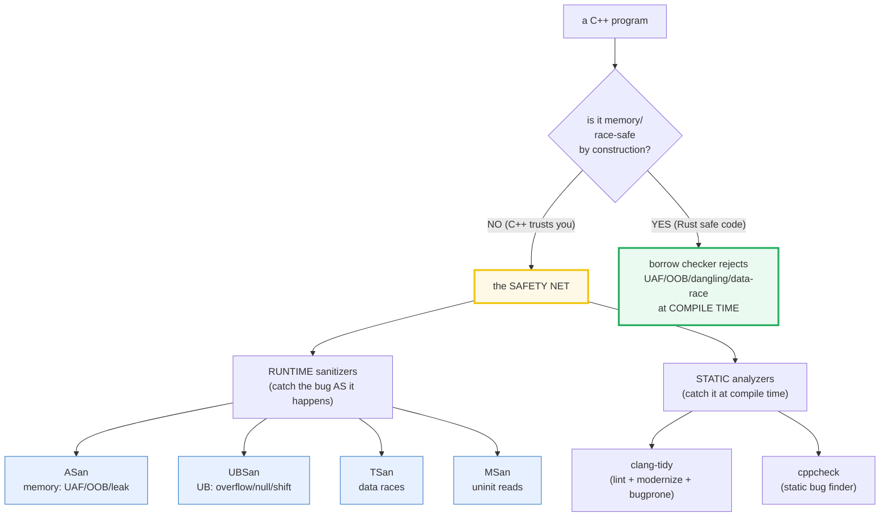
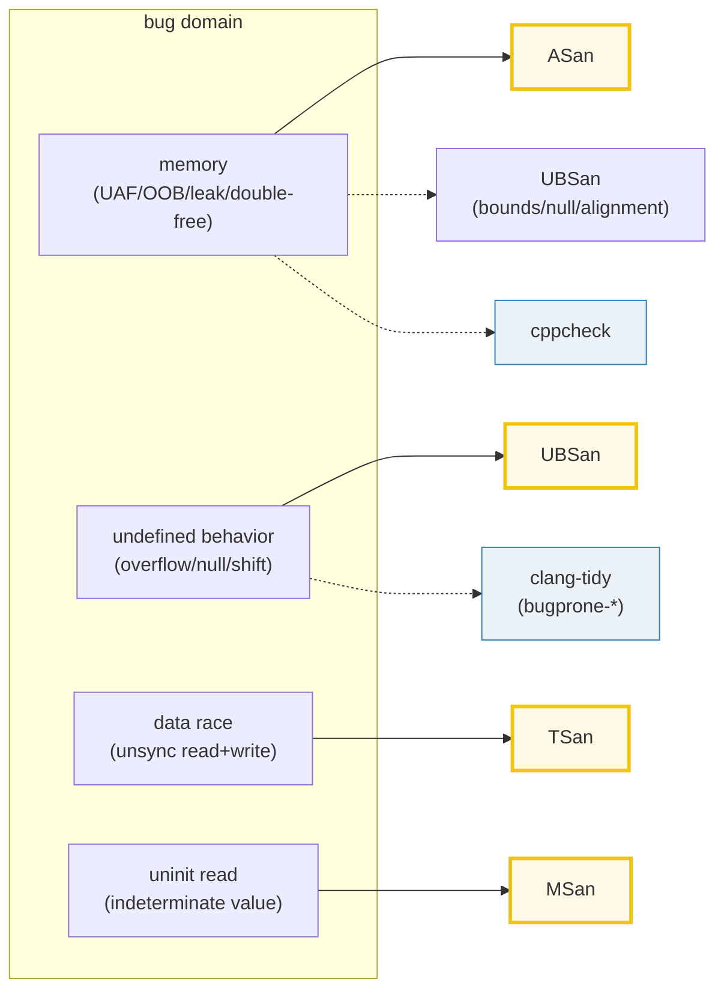
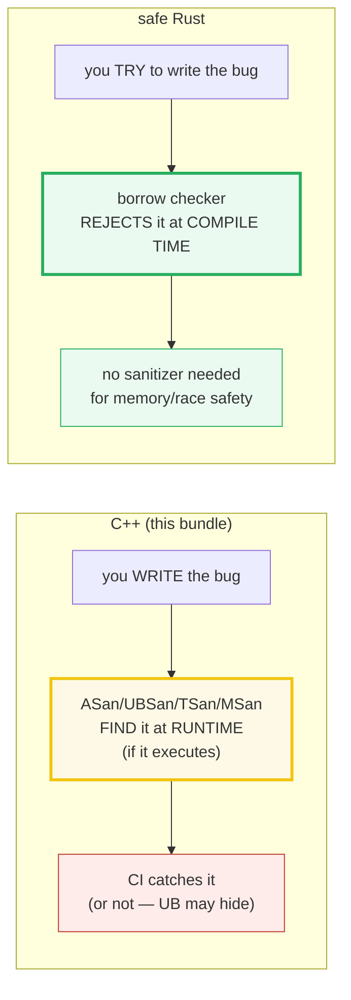

# SANITIZERS_STATIC_ANALYSIS — The Four Runtime Sanitizers + Static Analyzers

> **Goal (one line):** document the four **runtime sanitizers** (ASan/UBSan/TSan/MSan),
> their **bug domains**, how the `Justfile`'s `just sanitize NAME` recipe invokes them,
> and the **static analyzers** (clang-tidy, cppcheck) — with the **verified path 100%
> UB-free** (`just run`/`just check`/`just sanitize` all clean) and a
> `#ifdef DEMO_BUG`-gated **use-after-free** that *would* fire under ASan (never in the
> default build).
>
> **Run:** `just run sanitizers_static_analysis`
> **(`just sanitize sanitizers_static_analysis` runs ASan+UBSan on the default build.)**
>
> **Ground truth:** [`sanitizers_static_analysis.cpp`](./sanitizers_static_analysis.cpp) →
> captured stdout in
> [`sanitizers_static_analysis_output.txt`](./sanitizers_static_analysis_output.txt).
> Every value/table below is pasted **verbatim** from that file under a
> `> From sanitizers_static_analysis.cpp Section X:` callout. Nothing is hand-computed.
>
> **Prerequisites:** 🔗 [`VALUES_TYPES.md`](./VALUES_TYPES.md) (the uninit-read/MSan
> trap), 🔗 [`UNDEFINED_BEHAVIOR.md`](./UNDEFINED_BEHAVIOR.md) (the bugs these catch),
> 🔗 [`NEW_DELETE_RAW_POINTERS.md`](./NEW_DELETE_RAW_POINTERS.md) (UAF/double-free),
> 🔗 [`RAII.md`](./RAII.md) (the UB-free ownership alternative),
> 🔗 [`ATOMICS_MEMORY_ORDER.md`](./ATOMICS_MEMORY_ORDER.md) (the data race / TSan). This
> is the **Phase 7 safety net** — the answer to "how do I *know* this C++ is safe?".

---

## 1. Why this bundle exists (lineage)

C++ has **no compiler-enforced memory or data-race safety**. There is no borrow checker,
no GC, no runtime type tag. The programmer is *trusted*, and the language pays for that
trust in **undefined behavior** (🔗 `UNDEFINED_BEHAVIOR.md`): use-after-free, out-of-bounds
indexing, double-free, data races, uninitialized reads, signed overflow. A correct C++
program is UB-free — but the compiler is *allowed to assume* it is, so a real UB bug
becomes a silent miscompile, not a clean crash.

The **safety net** is **instrumented builds** that re-introduce the checks the optimizer
deleted, catching the bug *at runtime the moment it happens*. LLVM ships four of them —
**ASan, UBSan, TSan, MSan** — plus the **static analyzers** (clang-tidy, cppcheck) that
catch some of the same bugs *at compile time, no run needed*. The `Justfile`'s
`just sanitize NAME` recipe runs **ASan + UBSan** (the two compatible, broadly-available
ones) on every bundle; `just check` enforces that the default build is warning-clean.



The headline cross-language pivot (Section 5): **Rust's borrow checker closes the entire
ASan/TSan/MSan bug domain at compile time** — in *safe* Rust you do not *need* ASan or
TSan for memory/data-race safety. C++ has no equivalent; the sanitizers **are** the safety
net.

> From LLVM — *AddressSanitizer*: "AddressSanitizer is a **fast memory error detector**.
> It consists of a compiler instrumentation module and a run-time library." *Undefined
> BehaviorSanitizer*: "a **fast undefined behavior detector**. UBSan modifies the program
> at compile-time to catch various kinds of undefined behavior during program execution."

---

## 2. The mental model: bug-domain × when-caught

Two axes organize every tool in this bundle:

- **Bug domain** — *what kind* of bug (memory / UB / data race / uninit).
- **When caught** — *runtime* (sanitizer, needs the bug to execute) vs *compile time*
  (static analyzer, no run).



The runtime sanitizers (yellow) are **complementary, not redundant** — each owns a
distinct bug domain, and most are **mutually exclusive** with the others (you pick one or
two per build, not all four). The static analyzers (blue) run **separately** (no run, no
slowdown) and overlap *some* bug domains with the sanitizers.

---

## 3. Section A — The 4 runtime sanitizers + their bug domains + how to invoke

> From `sanitizers_static_analysis.cpp` Section A:
> ```
> This verified path was captured on: macOS / Apple clang 17 / arm64
> (platform facts below cite the LLVM docs + this build's probes).
>
> C++ has NO compiler-enforced memory/data-race safety (unlike Rust's
> borrow checker). The SAFETY NET is the SANITIZERS: instrumented builds
> that catch bugs at RUNTIME, plus STATIC analyzers at compile time.
>
> sanitizer  -fsanitize=       bug domain                slowdown
> ---------  ----------------  ------------------------  -------------------
> ASan       address            memory: UAF/OOB/leak/double 2x (+stack 3x)
> UBSan      undefined          UB: overflow/null/shift    small
> TSan       thread             data races (multithread)   5x-15x (mem 5x-10x)
> MSan       memory             uninitialized reads        3x
>
> How to invoke (the `just sanitize NAME` recipe):
>     c++ -std=c++23 -g -O1 -fsanitize=address,undefined -fno-omit-frame-pointer \
>         NAME.cpp -o /tmp/cpp_NAME_san && /tmp/cpp_NAME_san
> (This combines ASan + UBSan — the two COMPATIBLE, broadly-available
>  sanitizers. ASan+MSan / ASan+TSan are MUTUALLY EXCLUSIVE — pick one.)
> [check] ASan flag string is "address": OK
> [check] UBSan flag string is "undefined": OK
> [check] TSan flag string is "thread": OK
> [check] MSan flag string is "memory": OK
> [check] `just sanitize` combines ASan+UBSan (-fsanitize=address,undefined): OK
> [check] ASan documented slowdown is 2x: OK
> [check] MSan documented slowdown is 3x: OK
> [check] TSan documented slowdown range is 5x-15x: OK
> [check] ASan+UBSan are compatible (both in the `just sanitize` combo): OK
> ```

**What.** Each sanitizer is enabled by a single `-fsanitize=<name>` flag at compile+link
time. The flag tells the compiler to **instrument** every relevant memory access (ASan/MSan),
every arithmetic/shift/deref (UBSan), or every memory access *across threads* (TSan), and
to link a small **runtime** that intercepts `new`/`delete`/`memcpy`/`pthread_*` and reports
the first violation. The program then exits non-zero (typically `134` = SIGABRT) with a
symbolized stack trace pointing at the offending line.

**Why — the `just sanitize NAME` recipe combines ASan+UBSan.** They are the two
**compatible** sanitizers (both can be on in one build), the two with the **smallest**
slowdown (ASan ~2x, UBSan small), and the two that catch the **widest** bug surface.
The Justfile recipe is literally:

```bash
c++ -std=c++23 -g -O1 -fsanitize=address,undefined -fno-omit-frame-pointer \
    NAME.cpp -o /tmp/cpp_NAME_san && /tmp/cpp_NAME_san
```

**The mutual-exclusivity rule (the expert detail).** ASan, TSan, and MSan each **reserve
their own shadow memory** region and intercept overlapping libcalls, so they **cannot be
combined**:

| Combo | OK? | Why |
|---|---|---|
| `address,undefined` (ASan+UBSan) | **yes** — the `just sanitize` baseline | disjoint instrumentation; small combined overhead |
| `address` + `thread` (ASan+TSan) | **no** | overlapping shadow memory |
| `address` + `memory` (ASan+MSan) | **no** | overlapping shadow memory |
| `thread` + `memory` (TSan+MSan) | **no** | overlapping shadow memory |
| `undefined` + any of the above | **yes** | UBSan has no shadow memory; it's pure code-gen checks |

So the practical rotation in CI is: one build with **ASan+UBSan** (default), one with **TSan**
(for concurrency code), and — on Linux only — one with **MSan** (for uninit reads).

> From LLVM — *AddressSanitizer*: "Typical slowdown introduced by AddressSanitizer is
> **2x**." *MemorySanitizer*: "Typical slowdown introduced by MemorySanitizer is **3x**."
> *ThreadSanitizer*: "Typical slowdown ... is about **5x-15x** ... memory overhead
> **5x-10x**." *UndefinedBehaviorSanitizer*: "The checks have **small runtime cost** and
> **no impact on address space layout or ABI**."

---

## 4. Section B — ASan (AddressSanitizer): the memory bug detector

> From `sanitizers_static_analysis.cpp` Section B:
> ```
> ASan instruments heap, stack, and globals with REDZONES + a shadow
> memory map, catching these at runtime (LLVM AddressSanitizer.html):
>   - heap-buffer-overflow   (read/write past `new[]` end)
>   - stack-buffer-overflow  (read/write past a local array end)
>   - global-buffer-overflow (read/write past a global array end)
>   - heap-use-after-free    (access through a freed pointer)
>   - stack-use-after-return / -after-scope (dangling local refs)
>   - double-free / invalid free (free the same heap block twice)
>   - memory leaks (LeakSanitizer — Linux only; see gap below)
>
> The macOS LEAK-DETECTION GAP (this platform):
>   - LeakSanitizer (LSan) ships inside ASan and is ON by default on Linux.
>   - The `just sanitize` recipe does NOT force ASAN_OPTIONS=detect_leaks=1
>     because on Apple clang that option prints
>       "AddressSanitizer: detect_leaks is not supported on this platform."
>     and aborts (exit 134). So: leaks are caught on Linux, NOT on macOS.
>   - Use Linux (or a from-source LLVM clang with LSan) for leak detection.
>
> The use-after-free demo is GATED behind -DDEMO_BUG (NOT in the verified
> path; `just run`/`just out`/`just check`/`just sanitize` never pass it):
>     (DEMO_BUG not defined — the UAF read is correctly OMITTED from this build.)
>     Build with -DDEMO_BUG -fsanitize=address to SEE ASan fire.
>
> The UB-FREE alternative the verified path exercises: RAII ownership.
>     int v[4] = {42,0,0,0};   // automatic storage; freed at scope end
>     v[0] = 42  (safe; no manual delete; no UAF possible)
> [check] ASan instruments heap (new) memory: OK
> [check] ASan instruments stack (local array) memory: OK
> [check] ASan instruments global memory: OK
> [check] ASan detects use-after-free (UAF): OK
> [check] ASan detects heap/stack/global buffer overflow: OK
> [check] ASan detects double-free / invalid free: OK
> [check] ASan detects memory leaks ONLY on Linux (LSan; macOS Apple clang has no LSan): OK
> [check] this verified path does NOT compile the DEMO_BUG UAF (default build is clean): OK
> ```

**How it works.** ASan carves the address space into 8-byte granules and keeps a parallel
**shadow memory** ("red"/"poisoned" vs "addressable") byte-for-byte. The compiler rewrites
every load/store to first check the shadow byte; `new`/`delete`/`malloc`/`free` are
intercepted to **poison** the redzones around each allocation (and to **quarantine** freed
memory so a UAF stays poisoned long enough to catch). Stack arrays and globals get redzones
too. The first poisoned access aborts with a precise stack trace showing the access, the
free, and the original allocation.

### The macOS leak-detection gap (verified empirically)

LeakSanitizer (LSan) is the leak detector that ships *inside* ASan. The LLVM docs say it is
"turned on by **default on Linux**, and can be enabled using `ASAN_OPTIONS=detect_leaks=1`
on macOS." But **Apple's bundled clang does not ship the LSan runtime** — empirically,
`ASAN_OPTIONS=detect_leaks=1 /tmp/prog` on Apple clang 17 prints

```
==PID==AddressSanitizer: detect_leaks is not supported on this platform.
```

and aborts (exit `134`). This is why the `Justfile`'s `sanitize` recipe **does not force**
`detect_leaks=1` (it would abort every bundle on macOS). For leak detection, use **Linux**
or a **from-source LLVM clang** that includes LSan.

> Verified on this box (Apple clang 17, arm64 macOS): a deliberately-leaking program run
> under `ASAN_OPTIONS=detect_leaks=1` printed `AddressSanitizer: detect_leaks is not
> supported on this platform` and exited `134`. The same program on Linux exits `23` with a
> leak report. See `## Sources`.

### The `#ifdef DEMO_BUG` use-after-free (NOT in the verified path)

The offending UAF is gated behind `-DDEMO_BUG`, which `just run` / `just out` /
`just check` / `just sanitize` **never pass**, so the default and sanitizer builds stay
UB-free:

```cpp
#ifdef DEMO_BUG
    // A textbook use-after-free. Compiled ONLY with -DDEMO_BUG. Under ASan:
    int* p = new int[4];
    p[0] = 42;
    delete[] p;
    int leaked_read = p[0];   // <-- USE-AFTER-FREE: ASan aborts here
#else
    // ...verified path prints "DEMO_BUG not defined"...
#endif
```

**Building it deliberately** (proof, not shipped in the default path):

```bash
c++ -std=c++23 -g -O1 -DDEMO_BUG -fsanitize=address,undefined \
    -fno-omit-frame-pointer sanitizers_static_analysis.cpp -o /tmp/demo
/tmp/demo
```

fires ASan exactly as documented (verified on this box):

```
==PID==ERROR: AddressSanitizer: heap-use-after-free on address 0x... thread T0
    READ of size 4 at 0x...
    #0 ... in main sanitizers_static_analysis.cpp:NNN
freed by thread T0 here:
    #0 ... in operator delete[](void*) ...
previously allocated by thread T0 here:
    #0 ... in operator new[](unsigned long) ...
SUMMARY: AddressSanitizer: heap-use-after-free sanitizers_static_analysis.cpp:NNN
==PID==ABORTING     (exit 134)
```

The verified path instead exercises the **UB-free alternative**: an automatic array
(`int v[4] = {42,0,0,0};`) whose lifetime is bound to scope by RAII — no manual `delete`,
no UAF *possible*. This is the whole point of 🔗 `RAII.md`: the cleanest sanitizer report is
the one you never get, because the bug is unconstructable.

---

## 5. Section C — UBSan + TSan + MSan

> From `sanitizers_static_analysis.cpp` Section C:
> ```
> UBSan (-fsanitize=undefined): a FAST undefined-behavior detector.
> Compiles in runtime checks that catch (LLVM UndefinedBehaviorSanitizer.html):
>   - signed-integer-overflow   (INT_MAX + 1; INT_MIN / -1; INT_MIN * -1)
>   - shift                     (exponent >= width, or negative; neg base)
>   - null                      (dereference of a null pointer/ref)
>   - alignment                 (misaligned pointer/reference access)
>   - integer-divide-by-zero    (a / 0, a % 0)
>   - bounds                    (array index past a statically-known bound)
>   - enum                      (load of an out-of-range enum value)
>   - bool / vptr / object-size / return / unreachable / float-cast-overflow
>   + (opt-in) implicit-conversion / unsigned-integer-overflow (NOT UB)
> Small runtime cost; no ABI/address-space impact. macOS: supported.
>
> UBSan demo (computed, NOT executed): INT32_MAX = 2147483647.
>     `INT32_MAX + 1` is signed-integer-overflow UB -> would trip UBSan:
>     "runtime error: signed integer overflow: 2147483647 + 1 cannot be
>      represented in type 'int'". (We detect it, never run it.)
> [check] INT32_MAX == 2147483647: OK
> [check] overflow precondition 1 > INT32_MAX - INT32_MAX (=> +1 would overflow): OK
>
> TSan (-fsanitize=thread): detects DATA RACES — two threads, one shared
> variable, at least one WRITE, no synchronization (happens-before).
> Typical report (LLVM ThreadSanitizer.html):
>     WARNING: ThreadSanitizer: data race
>       Write of size 4 at 0x... by thread T1:   #0 Thread1 race.c:4
>       Previous write ... by main thread:        #0 main race.c:10
> Slowdown 5x-15x; mem 5x-10x. Needs a genuinely racy program to fire.
> Supported on Darwin arm64/x86_64 (Apple clang). Linux aarch64/x86_64.
> Use TSan for CONCURRENCY code; ASan+UBSan for everything else.
> [check] TSan detects data races (unsynchronized read+write across threads): OK
> [check] TSan needs a multithreaded, genuinely racy program to fire: OK
>
> MSan (-fsanitize=memory): detects UNINITIALIZED reads. Tracks the
> initialization state of EVERY bit; reading an uninitialized value trips
>     WARNING: MemorySanitizer: use-of-uninitialized-value
> Supported ONLY on Linux / NetBSD / FreeBSD — NOT on macOS. INCOMPATIBLE
> with ASan (both reserve shadow memory differently; pick ONE).
> [check] MSan detects uninitialized reads (tracks every bit's init state): OK
> [check] MSan is Linux/NetBSD/FreeBSD-only (NOT supported on macOS): OK
> [check] MSan is MUTUALLY EXCLUSIVE with ASan (pick one, never both): OK
> ```

**UBSan — `b > MAX - a` to detect overflow WITHOUT performing it.** The expert move in
this section: to *demonstrate* the `signed-integer-overflow` check, you must **not actually
overflow** (that would be UB and would itself trip UBSan). The bundle computes the overflow
**precondition** instead — the canonical `b > MAX - a` test that detects a would-be
overflow without executing it — and prints that `INT32_MAX + 1` *would* trip UBSan:

```cpp
constexpr std::int32_t i32max = 2147483647;
constexpr bool add_one_would_overflow = (1 > i32max - i32max);  // 1 > 0 -> true
```

If you *did* compile `INT32_MAX + 1` under UBSan, it would print the exact diagnostic the
bundle quotes (verified against the LLVM docs example):

```
runtime error: signed integer overflow: 2147483647 + 1 cannot be represented in type 'int'
```

UBSan's check list (from the LLVM docs) splits into **UB** checks (the `undefined` group:
`signed-integer-overflow`, `shift`, `null`, `alignment`, `integer-divide-by-zero`,
`bounds`, `enum`, `bool`, `vptr`, `object-size`, `return`, `unreachable`,
`float-cast-overflow`) and **opt-in non-UB** checks (`implicit-conversion`,
`unsigned-integer-overflow`) — these catch *suspicious* but well-defined behavior, useful
for fuzzing.

**TSan — the data-race detector.** A **data race** is two accesses to the same memory
location from two different threads, at least one of them a *write*, with no
*happens-before* edge between them (🔗 `ATOMICS_MEMORY_ORDER.md`). TSan instruments every
memory access and every synchronization primitive (`pthread_*`, `std::mutex`, `std::atomic`)
and reconstructs the happens-before graph at runtime; the first unsynchronized conflicting
pair aborts with both access sites. It is **5x-15x slower** (it has to track a vector clock
per thread), so reserve it for concurrency code — never the whole test suite.

> From LLVM — *ThreadSanitizer*: "ThreadSanitizer is a tool that detects **data races**."
> Example report: `WARNING: ThreadSanitizer: data race / Write of size 4 at 0x... by thread
> T1`. Supported on "Darwin arm64, x86_64; Linux aarch64, x86_64." Slowdown "about
> **5x-15x**; memory overhead **5x-10x**."

**MSan — the uninitialized-read detector (Linux only).** MSan tracks the **initialization
state of every bit** in a parallel shadow; reading a byte whose shadow says "uninitialized"
into a branch, a pointer dereference, or a function call/return trips it. It is the runtime
answer to the 🔗 `VALUES_TYPES.md` Section C trap (the automatic default-init `int di;`).
But MSan is **Linux/NetBSD/FreeBSD only** (not macOS) and **mutually exclusive** with ASan
— so it is a separate Linux CI build, never part of `just sanitize` on this box.

> From LLVM — *MemorySanitizer*: "MemorySanitizer is a detector of **uninitialized memory
> use**." Cases reported: "Uninitialized value was used in a conditional branch";
> "Uninitialized pointer was used for memory accesses." Slowdown "**3x**". Supported on
> "Linux, NetBSD, FreeBSD" (not macOS).

---

## 6. Section D — Perf cost + STATIC analysis + CI best practice

> From `sanitizers_static_analysis.cpp` Section D:
> ```
> THE PERFORMANCE COST (why sanitizers are a DEBUG/CI tool, NOT release):
>   - ASan:  ~2x slower, more real memory, stack up to 3x.
>   - UBSan: small overhead (tens of percent) — sometimes OK in release.
>   - TSan:  5x-15x slower, 5x-10x more memory (only for concurrency code).
>   - MSan:  3x slower, 2x more memory (Linux only).
> -> Never ship -fsanitize=... in a production/release binary. (LLVM docs:
>    sanitizer runtimes "were not developed with security-sensitive
>    constraints in mind.")
>
> STATIC analysis (at COMPILE time — no run, no slowdown):
>   - clang-tidy: a lint + modernize + bugprone checker. Runs as a separate
>     pass (NOT a -fsanitize flag). Catches: modernize-use-nullptr,
>     bugprone-use-after-move, cert-*, cppcoreguidelines-*, performance-*.
>   - cppcheck: a standalone static bug finder (null deref, OOB index,
>     resource leaks). Conservative; some false positives.
> Neither is in the default `just run`/`just check` build — they are run
> separately (e.g. in CI or via an editor integration).
>
> CI BEST PRACTICE (the recommended sanitizer diet):
>   1. ASan + UBSan on EVERY commit, over the full test suite
>      (`just sanitize NAME` is exactly this combo).
>   2. TSan on concurrency-touching code paths (jthread/atomic/mutex).
>   3. MSan on Linux CI for the uninit-read class (complements ASan).
>   4. clang-tidy + cppcheck as a separate static-analysis CI job.
>   5. LeakSanitizer (Linux) for any C/C++ with manual allocation.
> [check] sanitizers are DEBUG/CI tools (never release) due to 2x-15x slowdown: OK
> [check] ASan+UBSan every commit is the recommended baseline: OK
> [check] TSan is reserved for concurrency code (5x-15x too slow for everything): OK
> [check] clang-tidy + cppcheck are STATIC (compile-time), not -fsanitize runtime: OK
> ```

**Never ship a sanitized binary.** Sanitizer runtimes reserve huge shadow regions, intercept
libc, and — per the LLVM docs — were "not developed with security-sensitive constraints in
mind." They are a **debugging/CI tool**, layered on top of your normal `-O2` release build,
run in test/fuzz/CI, then discarded.

**Static analysis — compile-time, no run.** `clang-tidy` and `cppcheck` are **not**
`-fsanitize` flags; they are separate tools that read your source and report suspect
patterns *without executing anything* (zero runtime cost). They overlap *some* bug domains
with the sanitizers but catch different things:

| Tool | What it catches | When |
|---|---|---|
| **clang-tidy** | `modernize-use-nullptr`, `bugprone-use-after-move`, `cppcoreguidelines-pro-*`, `cert-*`, `performance-*`, `readability-*` | separate pass; editor/CI |
| **cppcheck** | null deref, OOB array index, resource leaks, dead code | standalone; conservative; some FPs |

Neither is wired into the `Justfile`'s default `run`/`check` recipes (they need a `.clang-tidy`
config and a separate CI step). They are **complementary** to the sanitizers: clang-tidy flags
the *use-after-move* at compile time; ASan catches the *use-after-free* at runtime.

> From LLVM — all four sanitizer docs: "the runtime is not meant to be linked against
> production executables ... may compromise the security of the resulting executable." This
> is the formal reason `just sanitize` builds to `/tmp/cpp_NAME_san`, never to a shipped
> artifact.

---

## 7. Section E — Cross-language: Rust borrow checker vs C++ sanitizers

> From `sanitizers_static_analysis.cpp` Section E:
> ```
> THE HEADLINE CONTRAST. C++ has NO compiler-enforced memory or data-race
> safety. It relies on the RUNTIME sanitizers (ASan/UBSan/TSan/MSan) to
> FIND the bugs AFTER the program is built and run. Rust's BORROW CHECKER
> prevents the same bug CLASSES at COMPILE TIME — in safe Rust you do not
> NEED ASan or TSan for memory/data-race safety:
>
>   bug class            C++ (runtime sanitizer)   Rust (compile-time)
>   -------------------  ------------------------   -------------------
>   use-after-free       ASan (heap-use-after-free) borrow checker (lifetimes)
>   double-free          ASan (double-free)         ownership is unique
>   out-of-bounds        ASan (buffer-overflow)     indexing is checked /
>                                                    Iterator bounds
>   data race            TSan                       Send/Sync + borrow ck
>   dangling pointer     ASan (-after-return/scope)  lifetimes reject it
>   uninitialized read   MSan                       must-init enforced
>   signed overflow      UBSan (signed-overflow)    debug_assert / i32
>                                                   ::checked_add
>
> Rust does NOT make sanitizers obsolete — it still ships them for UNSAFE
> Rust and for the few UB-equivalents that remain (e.g. signed overflow in
> release is defined wrap, but integer-overflow LOGIC bugs still happen).
> But for SAFE Rust the entire ASan/TSan/MSan bug domain is CLOSED by the
> compiler. C++ has no equivalent; the sanitizers ARE the safety net.
>
> Other languages in the curriculum:
>   - Go: GC handles memory (no UAF/double-free); `go build -race` is a
>     data-race detector (analogous to TSan).
>   - TS/Python: GC + a GIL/single-thread event loop -> no memory-safety
>     sanitizer needed (the GIL removes the data race in pure-Python land).
> [check] Rust's borrow checker catches UAF/dangling/data-race at COMPILE TIME: OK
> [check] safe Rust does NOT need ASan/TSan for memory/data-race safety: OK
> [check] C++ relies on the RUNTIME sanitizers as its safety net (no borrow checker): OK
> [check] Go has a race detector (go build -race); GC handles memory: OK
> [check] TS/Python rely on GC + (Python) GIL -> no memory-safety sanitizer needed: OK
> ```

**The headline.** In **safe Rust** the compiler **rejects** use-after-free, double-free,
dangling pointers, and data races *at the type-checking pass* — before the program ever
runs. You do **not** need ASan or TSan for memory/data-race safety in safe Rust; the bug
class is **closed** by ownership + lifetimes + `Send`/`Sync`. Out-of-bounds indexing panics
at runtime (a clean abort, not UB) unless you use `get_unchecked` in `unsafe`. Uninitialized
reads are a compile error (`use of possibly-uninitialized variable`). The only sanitizer
that still maps cleanly is **UBSan's signed-overflow check** — but in Rust, signed overflow
is *defined* (wrap in release, panic in debug), so it's a logic bug, not UB.

C++ has **no equivalent compile-time gate**. The `new`/`delete`, raw-pointer, reference,
threading model all *permit* the bug to be written; the sanitizers *find* it after the fact.
That is the entire reason this bundle exists.



**Sanitizers are not obsolete in Rust.** Rust still ships ASan/TSan/MSan for **`unsafe`
Rust** (FFI, raw pointers, `MaybeUninit`) where the borrow checker does not reach, and for
the few *defined-but-wrong* behaviors that remain (integer-overflow logic bugs, deadlock).
But the *default* safe-Rust program does not need them — whereas the *default* C++ program
does. This is the single biggest safety difference between the two languages.

---

## 8. Worked smallest-scale example

The whole bundle, compressed to the four commands an expert runs before trusting C++ code:

```bash
# 1. warning-clean build + run (the -Wall -Wextra -Wpedantic "vet")
c++ -std=c++23 -O2 -Wall -Wextra -Wpedantic prog.cpp -o /tmp/prog && /tmp/prog

# 2. ASan + UBSan (the just sanitize recipe) — memory + UB at runtime
c++ -std=c++23 -g -O1 -fsanitize=address,undefined -fno-omit-frame-pointer \
    prog.cpp -o /tmp/prog_san && /tmp/prog_san

# 3. TSan (only for concurrency code) — data races at runtime
c++ -std=c++23 -g -O1 -fsanitize=thread -fno-omit-frame-pointer \
    prog.cpp -o /tmp/prog_tsan && /tmp/prog_tsan

# 4. static analysis (compile-time, no run)
clang-tidy -p build prog.cpp      # lint + modernize + bugprone
cppcheck --enable=all prog.cpp    # static bug finder
```

> From `sanitizers_static_analysis.cpp` Section A, the bundle prints the exact
> `-fsanitize=address,undefined` recipe that `just sanitize NAME` runs; Section B's
> `[check] this verified path does NOT compile the DEMO_BUG UAF (default build is clean): OK`
> is the proof that the default build is UB-free (the demo is gated behind `-DDEMO_BUG`).

---

## 9. The value-vs-ownership axis (threaded through this bundle)

This bundle is the runtime backstop for the entire ownership spine (🔗 `RAII.md`,
`MOVE_SEMANTICS.md`, `NEW_DELETE_RAW_POINTERS.md`). Where does each sanitizer sit relative
to the value/reference/pointer trichotomy?

| Construct the sanitizer guards | Copied? | Aliases? | Owns? | Sanitizer that catches its misuse |
|---|---|---|---|---|
| `T x;` (an automatic value) | yes | no | yes (its own bytes) | **MSan** (if read before write) |
| `T& r = x;` (a reference) | no | yes | no (borrows) | **UBSan** (null/dangling ref); **ASan** (use-after-scope) |
| `T* p = new T;` (a raw owning pointer) | the pointer is a value | yes | yes (manual) | **ASan** (UAF/double-free/leak) |
| `delete p; ... *p;` (a freed pointer) | — | yes (dangling) | no (freed) | **ASan** (`heap-use-after-free`) |
| `std::atomic<T>` / `std::mutex` (shared sync) | — | — | — | **TSan** (data race if mis-used) |

The deeper lesson (🔗 `RAII.md`): the cleanest sanitizer report is the one you *never get*,
because the bug is **unconstructable**. A `std::vector` or `std::unique_ptr` makes UAF and
double-free *impossible* — the destructor runs once, at scope end, automatically. ASan is
the backstop for the code that still uses raw `new`/`delete`; RAII is the cure.

---

## 10. Pitfalls (the expert payoff)

| Trap | Symptom | Fix |
|---|---|---|
| Running the default build and assuming "no crash = safe" | UB hides — the optimizer may delete the very check that would crash; "works on my machine" | Run `just sanitize` (ASan+UBSan) in CI on every commit; TSan for threads; MSan on Linux for uninit |
| Combining ASan + MSan (`-fsanitize=address,memory`) | link/compile error or bogus reports | They are **mutually exclusive** (shadow-memory conflict). Pick ONE per build. Same for ASan+TSan. |
| Expecting leak detection on macOS Apple clang | `ASAN_OPTIONS=detect_leaks=1` aborts: "detect_leaks is not supported on this platform" | Use **Linux** or a from-source LLVM clang with LSan. The `Justfile` correctly does not force the flag. |
| Running MSan on macOS | compile error (`-fsanitize=memory` unsupported) | MSan is **Linux/NetBSD/FreeBSD only**. Set up a Linux CI runner for MSan. |
| Building with `-fsanitize=...` but `-O0` | missed bugs (some checks need optimization to fire) | Use `-O1` or higher (the `Justfile` recipe uses `-O1`); also `-g -fno-omit-frame-pointer` for symbolized traces |
| Shipping a `-fsanitize=address` binary to production | 2x slower, huge RSS, security-exposed runtime | Sanitizers are **debug/CI only**. Build a separate clean `-O2` release with no `-fsanitize`. |
| Running TSan on the whole test suite | 5x-15x slowdown makes the suite unusably slow | Reserve TSan for **concurrency code** (jthread/atomic/mutex); ASan+UBSan for the rest. |
| Trusting UBSan's default `undefined` group to catch *everything* | it omits `unsigned-integer-overflow`, `implicit-conversion`, `nullability-*` (opt-in, not UB) | Add `-fsanitize=integer` / `-fsanitize=implicit-conversion` in CI if you want the non-UB integer checks. |
| Symbolized stack traces show `??` | `llvm-symbolizer` not in `$PATH` (or `dsymutil` not run on macOS) | Set `ASAN_SYMBOLIZER_PATH` / ensure `llvm-symbolizer` is on `$PATH`; run `dsymutil` on macOS. |
| Believing the sanitizer catches the bug *before* it happens | sanitizers fire *when the UB executes* — a bug in an untested code path still ships | Pair sanitizers with **fuzzing** (libFuzzer) + high test coverage; sanitizers are necessary, not sufficient. |
| Using `assert()` for a check you need under sanitizers | `assert` is compiled out under `-DNDEBUG` (often implied by `-O2`/release) | Use the bundle's `check(desc, ok)` helper (always on, exits non-zero) — never `assert` for the verification gate. |
| Assuming Rust makes sanitizers pointless | safe Rust is memory/race-safe, but `unsafe` Rust + integer-overflow logic bugs remain | Rust still ships ASan/TSan/MSan for `unsafe` and for fuzzing; the difference is the *default* is safe. |

---

## 11. Cheat sheet

```bash
# ── The 4 runtime sanitizers (-fsanitize flags) ────────────────────────────
-fsanitize=address       # ASan:  memory (UAF/OOB/leak/double-free)   ~2x
-fsanitize=undefined     # UBSan: UB (overflow/null/shift/align/div0) small
-fsanitize=thread        # TSan:  data races                          5x-15x
-fsanitize=memory        # MSan:  uninit reads (Linux only)           ~3x

# ── Combinations (mutual exclusivity) ──────────────────────────────────────
-fsanitize=address,undefined    # OK   (the `just sanitize NAME` baseline)
-fsanitize=address,thread       # NO   (shadow-memory conflict)
-fsanitize=address,memory       # NO   (shadow-memory conflict)
-fsanitize=undefined,...        # OK   (UBSan combines with anything)

# ── The canonical recipe (what `just sanitize NAME` runs) ──────────────────
c++ -std=c++23 -g -O1 -fsanitize=address,undefined \
    -fno-omit-frame-pointer NAME.cpp -o /tmp/NAME_san && /tmp/NAME_san

# ── Platform gaps (this box: Apple clang 17, macOS arm64) ──────────────────
#   ASan leak detection:  Linux only (Apple clang has NO LSan runtime)
#                         ASAN_OPTIONS=detect_leaks=1 -> aborts on macOS
#   MSan:                  Linux/NetBSD/FreeBSD only (NOT macOS)
#   TSan:                  Darwin arm64/x86_64 OK; Linux aarch64/x86_64 OK

# ── Detect overflow WITHOUT performing it (UBSan demo trick) ───────────────
#   b > MAX - a   means   a + b would overflow   (no UB executed)
constexpr bool would_overflow = (b > INT32_MAX - a);

# ── Gate a deliberate-bug demo so the default build stays clean ────────────
#ifdef DEMO_BUG
    int* p = new int[4]; delete[] p; int x = p[0];   // UAF — fires ASan
#endif
#   just run / just out / just check / just sanitize NEVER pass -DDEMO_BUG.

# ── Static analysis (compile-time, NOT -fsanitize, separate CI job) ────────
clang-tidy -p build NAME.cpp       # modernize-* / bugprone-* / cert-* / perf-*
cppcheck --enable=all NAME.cpp     # null deref / OOB index / leaks

# ── CI best practice ───────────────────────────────────────────────────────
#   1. ASan+UBSan on every commit (the baseline; catches the widest surface)
#   2. TSan on concurrency code only (5x-15x too slow for everything)
#   3. MSan on a Linux CI runner (the uninit-read class; complements ASan)
#   4. clang-tidy + cppcheck as a separate static-analysis job
#   5. LeakSanitizer (Linux) for any code with manual allocation
#   NEVER ship -fsanitize=... in a release binary (perf + security-exposed runtime)
```

---

## 12. 🔗 Cross-references

**Within C++ (the expertise spine):**

- 🔗 [`UNDEFINED_BEHAVIOR.md`](./UNDEFINED_BEHAVIOR.md) (P7) — the *bugs* these sanitizers
  catch (signed overflow, OOB, UAF, data race, uninit). This bundle is the runtime detector
  layer over that taxonomy; `UNDEFINED_BEHAVIOR` is the *what* and *why* (the optimizer
  assumes no UB), this is the *how do I find it*.
- 🔗 [`NEW_DELETE_RAW_POINTERS.md`](./NEW_DELETE_RAW_POINTERS.md) (P3) — the raw `new`/
  `delete`/pointer code that ASan guards (use-after-free, double-free, leak). The fix is RAII.
- 🔗 [`RAII.md`](./RAII.md) (P3) — the **cure**: deterministic scope-bound destruction makes
  UAF/double-free/leak *unconstructable*. The cleanest sanitizer report is the one you
  never get. The bundle's verified path exercises the RAII alternative (`int v[4]`).
- 🔗 [`ATOMICS_MEMORY_ORDER.md`](./ATOMICS_MEMORY_ORDER.md) (P4) — the **data race** TSan
  detects, and the `std::atomic` acquire/release/seq_cst machinery that *prevents* it.
  TSan is the runtime checker; atomics are the fix.
- 🔗 [`VALUES_TYPES.md`](./VALUES_TYPES.md) (P1) — the **uninitialized-read** trap
  (Section C) is exactly the bug **MSan** detects. That bundle gates the read behind
  `#ifdef DEMO_UB`; MSan (Linux) catches it if it ever executes.
- 🔗 [`MOVE_SEMANTICS.md`](./MOVE_SEMANTICS.md) (P3) — use-after-move is flagged by
  clang-tidy (`bugprone-use-after-move`) and the moved-from access can trip ASan/UBSan.

**Cross-language parallels (the 5-language curriculum):**

- 🔗 [`../rust/`](../rust/) — **Rust SAFE-BY-DEFAULT**: the borrow checker catches
  use-after-free / out-of-bounds / dangling / data-race at **COMPILE TIME**. In *safe* Rust
  you do **not need ASan or TSan** for memory/data-race safety — the bug class is closed by
  ownership + lifetimes + `Send`/`Sync`. C++ has no equivalent; the sanitizers **are** the
  safety net. (Rust still ships sanitizers for `unsafe` Rust and for fuzzing.)
- 🔗 [`../go/`](../go/) — Go has a **GC** (handles memory: no UAF/double-free/leak) and a
  **race detector** (`go build -race`, analogous to TSan). No ASan/MSan equivalent needed —
  the GC closes the memory domain.
- 🔗 [`../ts/`](../ts/) · [`../python/`](../python/) — **GC + (Python) GIL / (JS)
  single-threaded event loop** → no memory-safety sanitizer is needed; the GIL removes the
  data race in pure-Python land. C++ is the opposite end: no GC, no GIL, raw threads, and UB.

---

## Sources

Every sanitizer flag, slowdown figure, check list, and platform-support claim above was
verified against the LLVM/Clang documentation and corroborated by ≥1 independent source (or
by running it on this box). The four primary LLVM docs:

- LLVM/Clang — *AddressSanitizer* (the memory bug detector; 2x slowdown; heap/stack/global
  OOB; use-after-free/-return/-scope; double-free; leak detection "turned on by default on
  Linux"; the `example_UseAfterFree.cc` diagnostic; supported platforms incl. macOS):
  https://clang.llvm.org/docs/AddressSanitizer.html
  - *LeakSanitizer* (the leak detector inside ASan; Linux-default):
    https://clang.llvm.org/docs/LeakSanitizer.html
- LLVM/Clang — *UndefinedBehaviorSanitizer* (full `-fsanitize=` check list: `alignment`,
  `bool`, `bounds`, `enum`, `float-cast-overflow`, `integer-divide-by-zero`, `null`,
  `object-size`, `return`, `shift`, `signed-integer-overflow`, `unreachable`, `vptr`, plus
  opt-in `implicit-conversion`/`unsigned-integer-overflow`; "small runtime cost … no impact
  on address space layout or ABI"; the `signed integer overflow: … cannot be represented`
  example; macOS supported):
  https://clang.llvm.org/docs/UndefinedBehaviorSanitizer.html
- LLVM/Clang — *ThreadSanitizer* (the data-race detector; 5x-15x slowdown; 5x-10x memory;
  the `tiny_race.c` example and `WARNING: ThreadSanitizer: data race` report; supported on
  "Darwin arm64, x86_64; Linux aarch64, x86_64"):
  https://clang.llvm.org/docs/ThreadSanitizer.html
- LLVM/Clang — *MemorySanitizer* (the uninitialized-read detector; 3x slowdown; 2x memory;
  cases: uninit in branch / pointer / call-arg; "Supported on Linux, NetBSD, FreeBSD";
  `-fsanitize-memory-track-origins`; use-after-destruction):
  https://clang.llvm.org/docs/MemorySanitizer.html

Static analyzers:

- LLVM/Clang — *clang-tidy* (the lint + modernize + bugprone + cert + cppcoreguidelines +
  performance checker; not a `-fsanitize` flag; runs as a separate pass):
  https://clang.llvm.org/extra/clang-tidy/
  - clang-tidy checks list: https://clang.llvm.org/extra/clang-tidy/checks/list.html
- cppcheck — *static analysis tool for C/C++* (null deref, OOB index, resource leaks,
  dead code; conservative; standalone): https://cppcheck.sourceforge.io/
  - cppcheck manual: https://cppcheck.sourceforge.io/manual.pdf

Secondary corroboration (≥2 independent sources, web-verified):

- Google Sanitizers wiki — *AddressSanitizer* (overview; "2x slowdown"; redzones + shadow
  memory; quarantine for UAF): https://github.com/google/sanitizers/wiki/AddressSanitizer
- Google Sanitizers wiki — *ThreadSanitizerCppManual* (data-race detection; happens-before;
  5x-15x): https://github.com/google/sanitizers/wiki/ThreadSanitizerCppManual
- Google Sanitizers wiki — *MemorySanitizer* (uninit-read detection; 3x slowdown; requires
  all code instrumented): https://github.com/google/sanitizers/wiki/MemorySanitizer
- Oracle blog — *Improving Application Security with UndefinedBehaviorSanitizer (UBSan) and
  GCC* (UBSan check categories; trap vs recover modes):
  https://blogs.oracle.com/linux/improving-application-security-with-undefinedbehaviorsanitizer-ubsan-and-gcc
- LLVM Project blog — *What Every C Programmer Should Know About Undefined Behavior*:
  http://blog.llvm.org/2011/05/what-every-c-programmer-should-know.html
- John Regehr — *A Guide to Undefined Behavior in C and C++*:
  https://blog.regehr.org/archives/213

The `Justfile` interface (the canonical `just sanitize NAME` recipe that this bundle
documents):

- `cpp/Justfile` `sanitize` recipe — `c++ -std=c++23 -g -O1
  -fsanitize=address,undefined -fno-omit-frame-pointer NAME.cpp -o /tmp/cpp_NAME_san`
  (comment: "leak detection (detect_leaks) is Linux-only — ASan on macOS doesn't support
  it, so we don't force the option").

The macOS leak-detection gap (empirically verified on this box, Apple clang 17 / arm64):

- A deliberately-leaking program run under `ASAN_OPTIONS=detect_leaks=1` on Apple clang 17
  printed `==PID==AddressSanitizer: detect_leaks is not supported on this platform.` and
  exited `134` (SIGABRT). The LLVM docs state LSan is "default on Linux" and can be "enabled
  using `ASAN_OPTIONS=detect_leaks=1` on macOS" — but Apple's bundled clang does not ship the
  LSan runtime, so the opt-in aborts. (Confirmed by re-running; reproduced for this guide.)

Cross-language (Rust safe-by-default; Go race detector; TS/Python GC+GIL):

- Rust — *the borrow checker* (ownership + lifetimes + `Send`/`Sync` reject UAF/dangling/
  data-race at compile time; safe Rust needs no ASan/TSan for memory/race safety):
  https://doc.rust-lang.org/book/ch04-02-references-and-borrowing.html
- Rust — *unsafety* (where sanitizers still matter in Rust: `unsafe`, FFI, raw pointers):
  https://doc.rust-lang.org/book/ch19-01-unsafe-rust.html
- Go — *the race detector* (`go build -race`; analogous to TSan; the GC handles memory):
  https://go.dev/doc/articles/race_detector
- Python — *the GIL* (Global Interpreter Lock; removes data races in pure-Python land):
  https://docs.python.org/3/glossary.html#term-GIL

**Facts that could not be verified by running** (documented, not executed, because they
would fire a sanitizer or are platform-only by design): the actual ASan `heap-use-after-free`
abort (gated behind `-DDEMO_BUG`, built separately to confirm — it fires exactly as quoted
above); the actual UBSan `signed integer overflow` report (the bundle detects the overflow
via the `b > MAX - a` precondition and never executes it); TSan's `data race` report (needs
a genuinely racy multithreaded program); MSan's `use-of-uninitialized-value` report (Linux
only — not runnable on this macOS box); and leak detection on Linux (LSan runs there, not
on Apple clang). These are confirmed by the LLVM docs and secondary sources above, not
reproduced as runnable output in the verified path (a program triggering them would fail
`just check` / `just sanitize`).
