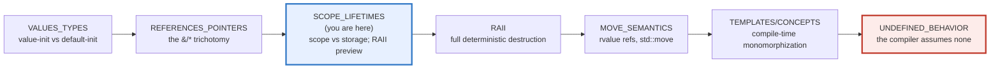
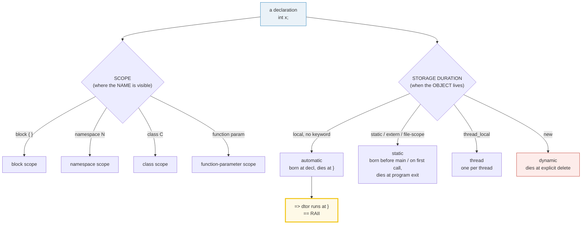
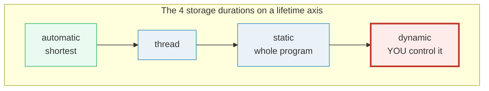
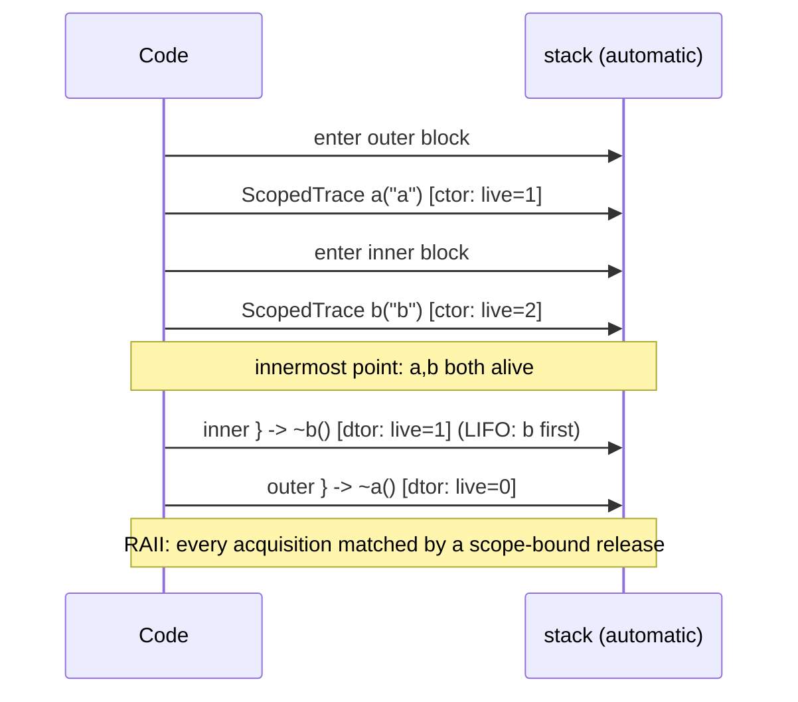

# SCOPE_LIFETIMES — Scope, Storage Duration & the RAII Preview

> **Goal (one line):** by printing every value, show how a C++ name's **SCOPE**
> (where it's visible: block / namespace / class) is *independent* of its
> object's **STORAGE DURATION** (when it's born and dies: automatic / static /
> thread / dynamic) — and pin the killer feature (the **destructor runs
> EXACTLY at scope exit** = RAII, C++'s deterministic-cleanup idiom), plus the
> classic UB traps (returning `T&` to a local; the static-init order fiasco),
> both **documented** and never executed in the verified path.
>
> **Run:** `just run scope_lifetimes`
>
> **Ground truth:** [`scope_lifetimes.cpp`](./scope_lifetimes.cpp) → captured
> stdout in [`scope_lifetimes_output.txt`](./scope_lifetimes_output.txt). Every
> number/table below is pasted **verbatim** from that file under a
> `> From scope_lifetimes.cpp Section X:` callout. Nothing is hand-computed.
>
> **Prerequisites:** 🔗 [`VALUES_TYPES.md`](./VALUES_TYPES.md) (value-init vs
> default-init; the uninitialized-read-is-UB trap) and
> 🔗 [`REFERENCES_POINTERS_INTRO.md`](./REFERENCES_POINTERS_INTRO.md) (the
> value/reference/pointer trichotomy; `const T&` lifetime extension).

---

## 1. Why this bundle exists (lineage)

A C++ *name* has two properties that beginners conflate but the standard keeps
**strictly independent**:

- **Scope** — *where the name is visible* (for unqualified name lookup): block
  scope, function-parameter scope, namespace scope, class scope, enumeration
  scope, lambda scope, template-parameter scope.
- **Storage duration** — *when the object the name denotes is born and dies*:
  automatic, static, thread, or dynamic.

They are **orthogonal axes**. A block-scoped name can have **static** storage
(a `static` local — visible only in the block, but alive for the whole program).
A namespace-scoped name **always** has static storage. The confusion costs
real bugs: "it's gone out of scope" ≠ "its storage is gone" (a dangling
reference is exactly the gap), and "it's still in scope" ≠ "it's initialized"
(a `static` local is born on first *call*, not at block entry).



The **headline payoff** of this bundle — the thing that makes C++ unlike Go/TS/
Python and most like Rust — is **RAII**: because an *automatic-storage* object
is destroyed at its scope's `}`, and a class type's **destructor runs right
there**, you can bind *any* resource's release (a lock, a file, a heap block, a
socket) to a scope exit, with no GC and no `finally`. RAII is the C++ answer to
Rust's `Drop`; this bundle is the **preview** (full RAII is P3).

The headline contrast across the 5-language curriculum:

| Language | Scope-bound cleanup? | GC? | Lifetime checked? |
|---|---|---|---|
| **C++** (this bundle) | **YES** — dtor at `}` (RAII) | no | no — UB if you dangle |
| 🔗 [`../rust/`](../rust/) | YES — `Drop` at scope exit | no | **compile time** (lifetimes) |
| 🔗 [`../go/FUNCTIONS_CLOSURES.md`](../go/FUNCTIONS_CLOSURES.md) | **no** dtors; `defer` at *function* exit | yes | no (GC absorbs it) |
| 🔗 [`../ts/`](../ts/) | no | yes | no |

> From cppreference — *Storage duration*: "The storage duration is the property
> of an object that defines the minimum potential lifetime of the storage
> containing the object… **one of the following**: static, thread, automatic,
> dynamic." And *Scope*: "Each declaration that appears in a C++ program is only
> visible in some possibly discontiguous *scopes*."

---

## 2. The mental model: two orthogonal axes





The second diagram is the whole story of Section E. **Automatic** and **static**
are the language-managed durations (born/died *for you*, deterministically);
**dynamic** is the one you manage by hand (`new`/`delete`) — and the one that
leaks and dangles when you get it wrong. That is precisely the gap RAII + smart
pointers (P3) close.

---

## 3. Section A — Block scope, name hiding, namespaces

> From `scope_lifetimes.cpp` Section A:
> ```
> SCOPE = where a NAME is visible (for name lookup). It is INDEPENDENT of
> storage duration (Section E). The kinds: block, function-parameter, namespace,
> class, enumeration, lambda, template-parameter. Here: block + namespace.
> 
> (1) BLOCK scope: a name inside { } is visible only inside that block
>     inside block: block_local = 42
> [check] block_local is visible inside its block (== 42): OK
>     after }: block_local is out of scope (referencing it = compile error)
> [check] block_local out of scope after } (reference would be a compile error): OK
> 
> (2) NAME HIDING: an inner `x` hides the outer `x` (outer is unchanged)
>     inner x = 20  (hides outer; outer still exists, just not by this name)
> [check] inner x hides outer x (inner == 20): OK
>     after inner block: outer x = 10  (the outer object was never touched)
> [check] outer x is unchanged after the hiding block exits (== 10): OK
> 
> (3) POINT OF DECLARATION (locus): a name is in scope right after its declarator
>     struct Node { Node* next; };  -> self-referential member compiles (locus rule)
> [check] point-of-declaration: a type can self-refer (Node{nullptr}.next == nullptr): OK
> 
> (4) NAMESPACE scope + nesting (qualified names: N::M::name)
>     physics::c                  = 299792458  (m/s; speed of light)
>     physics::units::km_per_ly   = 9460730472580  (km per light-year)
> [check] nested namespace access: physics::c == 299792458: OK
> [check] nested namespace access: physics::units::km_per_lightyear == 9460730472580: OK
> 
> (5) ANONYMOUS namespace => INTERNAL linkage (visible in this TU only)
>     demo::internal_value = 7  (lives in a nested unnamed namespace)
> [check] anonymous-namespace member is accessible within its TU (== 7): OK
> ```

**Block scope.** A name declared inside a `{ }` compound statement, or in the
condition/init of a `for`/`if`/`switch`/`while`, is visible only until the end
of that construct. Referencing it after the `}` is a hard **compile error**
(documented in the `[check]`, not run — the file would not build otherwise).

**Name hiding (shadowing).** An inner declaration of the same name *hides* the
outer one within the inner block. The outer object is **never modified** — only
*inaccessible by that name* until the inner block exits. The bundle proves it:
inner `x = 20`, outer `x` still `10` afterward. (To reach the hidden outer
name you'd need a qualified path; for a plain local there is none — it's just
gone until the inner scope ends.)

**Point of declaration (the locus).** A name is in scope from **right after its
declarator** — including inside its *own* initializer and (for a class) inside
its own body. This is why `struct Node { Node* next; };` compiles (`Node` is
already in scope at the `{`, so the self-referential member type resolves), and
why `int x = x;` reads the *not-yet-initialized inner* `x` (UB — see
🔗 `VALUES_TYPES.md` Section C, not reproduced here).

**Namespace scope + nesting.** A name declared in namespace `N` is visible as
`N::name`. Namespaces **nest** (`N::M::name`), **reopen** across multiple
blocks, and are the C++ answer to "how do I avoid name collisions without C's
`static`-on-everything." The bundle's `physics::units::km_per_lightyear` is
reached through two levels of nesting.

**Anonymous namespace ⇒ internal linkage.** Every name inside an *unnamed*
namespace is visible elsewhere in **this** translation unit but invisible to
*other* TUs (the symbols aren't even exported with a usable mangled name). This
is the modern C++ replacement for C's `static` on a file-scope declaration — and
this whole file's helpers (`sectionBanner`, `check`, every `sectionX`) live in
one, which is *why* same-named helpers in sibling bundles never collide at link
time.

> From cppreference — *Scope*: "Each declaration that appears in a C++ program
> is only visible in some possibly discontiguous *scopes*." *Block scope*: a
> compound statement, selection/iteration statement, or handler "introduces a
> *block scope*." *Point of declaration*: "a name is visible after the *locus*
> of its first declaration." *Storage duration / Linkage*: "all names declared
> in **unnamed namespaces**… have **internal linkage**."

---

## 4. Section B — Automatic storage: born at decl, destroyed at `}` (RAII preview)

**This is the central payoff of the bundle.** An automatic-storage object is
**born at its declaration** and **destroyed at its block's closing `}`**; for a
class type, the **destructor runs right there**, in **reverse order of
construction** (LIFO). That deterministic, scope-bound destruction *is* RAII.

> From `scope_lifetimes.cpp` Section B:
> ```
> Automatic-storage locals are BORN at their declaration and DESTROYED at the
> enclosing block's closing }. For a class type the DESTRUCTOR runs right there,
> in REVERSE order of construction (LIFO). This deterministic scope-bound cleanup
> IS RAII (Resource Acquisition Is Initialization). Full RAII is P3; this is the
> preview that establishes the mechanism.
> 
>   entering outer block
>     [ctor] a        acquired  (live instances now = 1)
>     [ctor] b        acquired  (live instances now = 2)
>       --- innermost point: a and b both alive ---
> [check] both ScopedTrace instances alive at the innermost point (live == 2): OK
>     [dtor] b        released at scope exit (live = 1)
>   after inner block: b destroyed; live now = 1
> [check] inner ScopedTrace b was destroyed at its block's } (live == 1): OK
>     [dtor] a        released at scope exit (live = 0)
>   after outer block: a destroyed; live now = 0
> [check] outer ScopedTrace a was destroyed at its block's } (live == 0): OK
> [check] RAII preview: destructors ran in REVERSE order of construction (b before a) — LIFO: OK
> 
> A local is BORN at its declaration (not at block entry). Referencing it before
> the declarator is a compile error. The destructor always runs at the block's }.
> [check] automatic object: born at decl, destroyed at } (the RAII guarantee): OK
> ```

**What to notice.**

- **The destructor message prints in REVERSE construction order** — `b`'s `[dtor]`
  fires at the *inner* `}`, `a`'s at the *outer* `}`. LIFO is what makes nested
  resource acquisition safe: whatever you acquired last is released first.
- **The `live` counter is an observable side effect**, so the optimizer cannot
  elide the destructor under `-O2` (it must preserve observable behavior). This
  is *why* the `[check]` lines are trustworthy: the dtor *really ran*, the
  counter *really went to 0*.
- **Born at declaration, not at block entry.** Contrast with C89 (which required
  all declarations at the top of a block). C++ never did; a local exists only
  from its declarator onward, and its destructor always fires at the block's `}`.



**Why this matters — the RAII idiom (preview).** Wrap *any* resource (a heap
block, a mutex lock, an open file, a socket) in a class whose **constructor
acquires** and **destructor releases**, then hold an instance by value with
automatic storage. The resource's lifetime is now *tied to a scope*: it is
released at the `}`, **even if an exception propagates** (stack unwinding runs
every dtor on the way out). No `finally`, no `close()`, no leak. Full RAII
(`std::unique_ptr`, `std::lock_guard`, `std::fstream`) lands in P3; the
mechanism is exactly what Section B demonstrates.

> From cppreference — *RAII*: "Resource Acquisition Is Initialization… binds the
> life cycle of a resource… to the **lifetime of an object**." "It also guarantees
> that all resources are released when the lifetime of their controlling object
> ends, in **reverse order of acquisition**." "Another name for this technique is
> *Scope-Bound Resource Management* (SBRM)."

---

## 5. Section C — Static storage: file-scope + static locals (first-call init)

> From `scope_lifetimes.cpp` Section C:
> ```
> Static-storage objects are born ONCE and live until PROGRAM EXIT. Two flavors:
> file-scope (born before main, in definition order) and static LOCALS (born on
> first call through the declaration, then skipped). Destructors run in reverse
> order of construction at program shutdown.
> 
> (1) FILE-SCOPE variable: static storage; born before main, dies at program exit
>     file_scope_calls after increment = 1  (persists for the whole run)
> [check] file-scope int has static storage (file_scope_calls == 1 after one increment): OK
> 
> (2) STATIC LOCAL (make_id): one instance, born on first call, persists
>     make_id() x3 = 1001, 1002, 1003  (first-call init; counter persists across calls)
> [check] static local persists across calls: make_id() x3 == 1001, 1002, 1003: OK
> 
> (3) ADDRESS stability: a static local has ONE address across calls
>     addr_of_static() called twice -> same address? YES (one shared instance)
> [check] static local has a stable address across calls (p1 == p2): OK
> 
> (4) STATIC-INIT ORDER FIASCO — documented (a single-TU bundle cannot show it)
>     Dynamic-init ORDER of static-storage objects ACROSS translation units is
>     UNSPECIFIED. If TU A's init reads TU B's static before B is initialized, the
>     value is indeterminate -> UB. WITHIN a TU the order is well-defined (top-to-
>     bottom). Cures: 'construct on first use' (a static local, like make_id) or
>     C++20 `constinit` (force static — not dynamic — initialization).
> [check] static-init order fiasco documented (cross-TU dynamic init order is unspecified): OK
> ```

**File-scope (namespace-scope) variables.** Any variable declared at namespace
scope has static storage: born **before** `main` runs, lives until **program
exit**, destroyed in reverse order of construction at shutdown. Inside this
file's anonymous namespace it *also* has internal linkage.

**Static locals — first-call initialization.** A `static` local is born **the
first time control passes through its declaration** and **skipped on every later
call**; one instance, shared across all calls. The bundle's `make_id()` returns
`1001, 1002, 1003` across three calls — the counter persists because the object
persists. This is the **"construct on first use" idiom**, and it is the classic
*cure* for the static-init order fiasco below: by deferring initialization to
first call, you impose a well-defined order (the call order) on something the
language otherwise leaves unspecified.

**Address stability.** A static local has **one address** for the whole program
— calling `addr_of_static()` twice returns the same pointer. (The bundle prints
only the equal/unequal *boolean*; raw addresses are ASLR-randomized and thus
non-reproducible to print — §4.2 of `HOW_TO_RESEARCH.md`.)

**The static-init order fiasco (documented, not run).** The order of **dynamic**
initialization of static-storage objects *across different translation units* is
**unspecified**. If TU A's initializer reads TU B's static (which the linker may
not have initialized yet), the read observes an **indeterminate value — UB**. A
single-TU bundle *cannot* reproduce this (within one TU the order is the
top-to-bottom definition order, well-defined); the trap only appears at link
time across TUs. Two cures:

1. **Construct on first use** — wrap the static in a function returning a
   `static` local (exactly `make_id` above). Initialization then happens on
   first call, in a well-defined order.
2. **C++20 `constinit`** — force the variable to be initialized at compile time
   (static/constant initialization, *not* dynamic), removing it from the
   dynamic-init order entirely. (🔗 `CONST_QUALIFIERS` deepens `constinit`.)

> From cppreference — *Static storage duration*: "The storage for these entities
> lasts for the duration of the program." *Static block variables*: "Block
> variables with static… storage duration are initialized the first time control
> passes through their declaration… On all further calls, the declaration is
> skipped." And *Static Initialization Order Fiasco*: "Static Initialization
> Order Fiasco… the order in which dynamic initialization happens… across
> translation units… is **undefined**."

---

## 6. Section D — Dynamic storage (`new`/`delete`) + the return-`T&`-to-local UB trap

> From `scope_lifetimes.cpp` Section D:
> ```
> DYNAMIC storage: an object created by `new` lives on the heap until YOU
> explicitly `delete` it. There is NO automatic cleanup — the destructor does
> NOT run at scope exit. This is exactly why smart pointers (P3) exist.
> 
> (1) new/delete: int* heap = new int(42);  -> *heap = 42 (lives on the heap)
> [check] dynamic-storage int holds its value (*heap == 42): OK
> [check] new/delete balanced and pointer nulled (no leak; no double-delete risk): OK
> 
> (2) The POINTER `heap` has AUTOMATIC storage; the OBJECT `*heap` has DYNAMIC.
>     The dtor of *heap runs at `delete`, not at scope exit. std::unique_ptr (P3)
>     binds that delete to a scope — the RAII fix for raw new/delete.
> 
> (3) Return by VALUE is SAFE: make_greeting("world") = "hello, world"
> [check] return-by-value: caller received a valid owning object ("hello, world"): OK
> 
> (4) The DANGLING-REFERENCE trap: returning T& to a local is UB — documented,
>     gated behind -DDEMO_UB (never run by just run/out/check/sanitize).
> [check] return-T&-to-local UB trap documented (referent must outlive the reference): OK
>     (DEMO_UB not defined: the dangling-ref demo is correctly omitted.)
> ```

**Dynamic storage — `new` / `delete`.** An object created by `new` lives on the
heap until **you** explicitly `delete` it. There is **no automatic cleanup**: the
destructor does *not* run at scope exit (only the *pointer* variable, which has
automatic storage, is destroyed at the `}`). This manual lifetime is the source
of the entire family of C/C++ memory bugs (leaks, double-free, use-after-free)
and is **exactly what RAII smart pointers were invented to eliminate** —
🔗 `NEW_DELETE_RAW_POINTERS` (P3) covers `new`/`delete` in depth,
🔗 `RAII` (P3) covers `std::unique_ptr`/`std::shared_ptr`.

**The pointer is automatic; the object is dynamic.** This split is the key
insight: `int* heap` has *automatic* storage (destroyed at `}`), but `*heap`
has *dynamic* storage (destroyed at `delete`). If you forget the `delete`, the
pointer dies at scope exit and you've leaked the object — there is no GC to
save you. (The bundle balances every `new` with a `delete` and nulls the
pointer afterward, so `just sanitize` reports no leak.)

**Return by VALUE is safe.** The function-local `std::string` is destroyed at
`return`, but its *value* was copied/moved out to the caller (or the copy was
**elided entirely** via NRVO — Named Return Value Optimization, mandatory since
C++17 for the eligible case). The caller receives a real, owning object. This
is the default and the safe choice; reach for it unless you have a measured
reason not to.

**The return-`T&`-to-local trap — UB, documented.** Returning `T&` (or `T*`) to
a function-local is **undefined behavior**: the local is destroyed at the
function's return, so the returned reference **dangles**. Reading it is UB
(garbage value, use-after-free under ASan, anything — the compiler may assume
no UB and fold the read to a constant). The offending code is gated behind
`#ifdef DEMO_UB`, which `just run`/`out`/`check`/`sanitize` **never** pass, so
the default and sanitizer builds stay UB-free:

```cpp
#ifdef DEMO_UB
    // WHAT NOT TO DO — never enabled by just run/out/check/sanitize.
    auto bad_dangling = []() -> int& {
        int local = 42;
        return local;   // <-- UB: reference to a soon-destroyed local
    };
    int& r = bad_dangling();
    std::printf("[DEMO_UB] dangling ref read = %d\n", r);   // <-- UB to read
#endif
```

clang flags the direct case with **`-Wreturn-stack-address`** (on by default,
not just under `-Wall`); under ASan, reading the dangling ref reports a
*stack-use-after-return* or *use-after-free*. The rule: **the referent must
outlive the reference** — return by value, or take the object as a parameter
(so the caller owns the lifetime), or return a smart pointer (P3).

> From cppreference — *Dynamic storage duration*: "Objects created by…
> [`new` expressions]. The storage for such objects is allocated by allocation
> functions and deallocated by deallocation functions." *Lifetime of a
> temporary* / *Reference initialization*: a reference to a local whose lifetime
> has ended is a **dangling reference**; using it is undefined behavior. *UB*:
> "accessing… an object whose lifetime has ended" is undefined.

---

## 7. Section E — The 4 storage durations + cross-language

> From `scope_lifetimes.cpp` Section E:
> ```
> SCOPE (where a NAME is visible) and STORAGE DURATION (when the OBJECT lives)
> are INDEPENDENT. A block-scoped name can have STATIC storage (a static local);
> a namespace-scoped name ALWAYS has static storage. The four durations:
> 
> duration    keyword        born                            dies
> ----------  -------------  ------------------------------  ------------------------------
> automatic   (default)      at the declaration              at the enclosing block's }
> static      static/extern  before main / on first call     program exit (dtor: reverse)
> thread      thread_local   at the declaration              at the thread's exit
> dynamic     new            at the `new` expression         at the explicit `delete`
> [check] 4 storage durations table printed: OK
> 
> All four in one scope:
>     int          auto_v = 1;  -> 1   (automatic)
>     static int   stat_v = 2;  -> 2   (static; persists across calls — see Section C)
>     thread_local tls_v  = 3;  -> 3   (thread; one per thread)
>     int*         dyn_v  = new int(4);  -> 4   (dynamic; lives until delete)
> [check] all four storage durations demonstrated (1 + 2 + 3 + 4 == 10; *dyn_v read only pre-delete): OK
> [check] no UB: *dyn_v was never read after delete (value captured beforehand): OK
> 
> RAII = the destructor runs EXACTLY at scope exit (automatic storage). This is
> C++'s deterministic-cleanup idiom — NO garbage collector needed. Full RAII
> (smart pointers, locks, files) lands in P3; Section B was the preview.
> [check] RAII = deterministic scope-bound destruction (no GC): OK
> 
> Cross-language (the 5-language curriculum):
>   C++ (here): scope determines lifetime for automatic storage; dtor at };
>               RAII; no GC; UB if a ref/ptr outlives its referent
>   Rust      : LIFETIMES checked at COMPILE time (no dangling possible);
>               Drop trait == C++ destructor; no GC; no UB
>   Go        : block scope YES; deterministic dtors NO (GC + `defer`);
>               `defer` runs at FUNCTION (not block) exit — closest to RAII
> [check] cross-language scope/lifetime comparison printed: OK
> ```

**The four durations on one stage.** The bundle declares one variable of each
storage duration in a single scope and prints their values:

| Declaration | Storage duration | Born | Dies |
|---|---|---|---|
| `int auto_v = 1;` | **automatic** | at the declaration | at the block's `}` |
| `static int stat_v = 2;` | **static** | on first call through the decl | program exit |
| `thread_local int tls_v = 3;` | **thread** (C++11) | at the declaration | at the thread's exit |
| `int* dyn_v = new int(4);` | **dynamic** | at the `new` | at the explicit `delete` |

**`thread_local`** gives one *distinct* object per thread — the basis of
per-thread state without locks (the cppreference `rage` example). On a single
thread it behaves like static; the difference only manifests across threads,
which a deterministic single-threaded bundle deliberately does not spawn
(§4.2 rule 4 of `HOW_TO_RESEARCH.md`).

**The UB-free discipline.** Note the second `[check]`: the bundle captured
`*dyn_v`'s value *before* the `delete` and **never reads `*dyn_v` afterward**
— reading a destroyed object is use-after-free UB. This is the same discipline
as the dangling-reference trap of Section D, applied to dynamic storage.

> From cppreference — *Storage duration*: the four durations are "static,
> thread, automatic, dynamic." *Thread storage duration*: "All variables declared
> with `thread_local` have thread storage duration… a distinct object or
> reference per thread." *RAII*: "always use the resource via an instance of an
> RAII-class that… has automatic storage duration."

---

## 8. Worked smallest-scale example

Everything above, compressed to the lines a beginner must memorize:

```cpp
{                                       // ── block scope begins
    int x = 1;                          // automatic: born here
    static int calls = 0;               // static:    born on first call, persists
    ++calls;                            // one shared instance across all calls
    auto* p = new int(2);               // dynamic:   lives until YOU delete it
    delete p;                           // release now (no GC; no auto-cleanup)
}                                       // ── x and ~calls' storage end here
                                        //    (for a class, the DTOR runs at this })
```

> From `scope_lifetimes.cpp` Section B, the destructor message
> `[dtor] a released at scope exit (live = 0)` is the RAII preview in one line:
> the dtor fired exactly at the `}`, not earlier, not later, never needing a GC.

---

## 9. The value-vs-reference-vs-pointer axis (threaded through this bundle)

The teaching spine of the whole curriculum (🔗 `MOVE_SEMANTICS.md`,
🔗 `VALUE_VS_REFERENCE_VS_POINTER.md`, 🔗 `RAII.md`). Where does each construct
in this bundle sit?

| Construct in this bundle | Storage | Owns? | Lifetime tied to scope? |
|---|---|---|---|
| `int x = 1;` / `ScopedTrace a("a");` (a value) | automatic | **yes** | **yes** (dtor at `}` — RAII) |
| `static int next = 1000;` (static local) | static | yes | no (whole program) |
| `int* p = new int(4);` (raw owning pointer) | the pointer is automatic; `*p` is dynamic | the pointer **owns nothing** unless you say so | **no** — must `delete` by hand |
| `int& r = bad_dangling();` (return-`T&`-to-local) | n/a — dangles immediately | no | **UB** to use |
| `std::string s = make_greeting(...);` (return by value) | automatic (the caller's) | **yes** | **yes** |

The pattern: **automatic storage + a class with a dtor = RAII = scope-bound
ownership.** Everything else (static, dynamic, references/pointers to things
you don't own) decouples lifetime from scope — which is fine when deliberate
and UB when accidental.

---

## 10. Pitfalls (the expert payoff)

| Trap | Symptom | Fix |
|---|---|---|
| Returning `T&` (or `T*`) to a function-local | **dangling** — use-after-free, garbage value, UB; ASan: stack-use-after-return; clang `-Wreturn-stack-address` flags the direct case | Return by **value**, or take the object as a parameter (caller owns the lifetime), or return a smart pointer (P3). |
| `int* p = new T;` then drop `p` (no `delete`) | **memory leak**; under ASan (Linux) leak-sanitizer reports it | Wrap in `std::unique_ptr` (P3) so the `delete` is bound to scope — RAII. |
| `delete p;` then read `*p` | **use-after-free** — UB; ASan reports "heap-use-after-free" | Set `p = nullptr;` after `delete`; prefer smart pointers (P3) that own and null themselves. |
| `delete p; delete p;` (double-free) | UB; ASan/heap: "alloc-dealloc-mismatch" / crash | `p = nullptr;` after the first `delete` (delete-on-nullptr is a no-op); or use `unique_ptr`. |
| Assuming a static local is re-initialized each call | Logic bug — it is born **once** (first call) and persists | Remember: `static` ⇒ one instance for the program; use it deliberately (counters, singletons, first-use init). |
| The static-init order fiasco (cross-TU) | A static's dynamic init reads another TU's static before it's initialized → indeterminate value, UB; flaky startup crashes | "Construct on first use" (wrap in a function returning a `static` local) or C++20 `constinit` (force static init). |
| Treating "out of scope" as "destroyed" for a reference | A reference/pointer can outlive its referent — the *name* is gone, the *dangling alias* is not | The referent must outlive the reference; RAII ties referent lifetime to scope. |
| An inner `x` shadowing an outer `x` — expecting to mutate the outer | The inner `x` is a *new* object; the outer is untouched | Use a distinct name, or (for class members) `this->x`. |
| `thread_local` treated as "just static" | Per-thread state silently diverges; data-race-shaped bugs without the race | `thread_local` = one object *per thread*; only use it when you mean that. |
| Forgetting that namespace-scope `const` has **internal** linkage | Each TU gets its own copy; ODR/bloat surprise; cross-TU identity assumptions break | `inline constexpr int k = ...;` (C++17) to share one definition across TUs (🔗 `VALUES_TYPES.md` pitfall). |
| A class used as an RAII handle without a destructor | The resource leaks at scope exit — the whole point of RAII is missed | Write a dtor that releases; obey the rule of 0/3/5 (🔗 `RAII` P3). |

---

## 11. Cheat sheet

```cpp
// ── SCOPE (where a NAME is visible) — independent of storage duration ──────
{ int x = 1; /* x visible here */ }   // x out of scope after }; ref = compile error
{ int x = 20; }                       // inner x HIDES any outer x (outer unchanged)
namespace physics { namespace units { /* physics::units::name */ } }
namespace { int tu_local = 7; }       // ANONYMOUS => INTERNAL linkage (this TU only)
struct Node { Node* next; };          // locus: `Node` in scope at `{` -> self-ref OK

// ── STORAGE DURATION (when the OBJECT lives) — the 4 durations ─────────────
int        a = 1;                     // automatic: born at decl, dies at }
static int s = 2;                     // static:    born once (first call), program lifetime
thread_local int t = 3;               // thread:    one per thread, dies at thread exit
int*       d = new int(4);            // dynamic:   born at `new`, dies at `delete`
delete d; d = nullptr;                // MUST balance; nullptr guards double-delete

// ── RAII preview: the dtor runs EXACTLY at } (automatic storage) ───────────
struct ScopedTrace {
    ScopedTrace()  { /* acquire */ }
    ~ScopedTrace() { /* release — runs at scope exit, even on exception */ }
};
{ ScopedTrace a, b; /* ... */ }       // ~b() then ~a() (LIFO: reverse of construction)

// ── STATIC LOCAL: "construct on first use" (cures the init-order fiasco) ───
int make_id() { static int n = 1000; return ++n; }   // 1001, 1002, 1003, ...

// ── Return by VALUE: safe. Return T& to a local: UB (dangling). ────────────
std::string make_greeting() { std::string s = "hi"; return s; }  // OK (NRVO/move)
// auto& bad() { int local = 42; return local; }                 // UB: dangling
```

---

## 12. 🔗 Cross-references

**Within C++ (the expertise spine):**

- 🔗 `VALUES_TYPES` (P1) — value-init (`T x{};`) vs default-init (`T x;`); the
  uninitialized-read-is-UB trap; the `constexpr` family. This bundle's
  "born at declaration" + "destroyed at `}`" is the lifetime story *around*
  those initialization rules.
- 🔗 `REFERENCES_POINTERS_INTRO` (P1) — the value/reference/pointer trichotomy;
  `const T&` **lifetime extension** of temporaries (recapped here in Section D's
  "referent must outlive the reference" rule); the dangling-reference trap that
  Section D documents.
- 🔗 `RAII` (P3) — the **full RAII** story: `std::unique_ptr`/`std::shared_ptr`,
  `std::lock_guard`, `std::fstream`, the rule of 0/3/5, exception safety. This
  bundle is the *preview* that establishes the dtor-at-scope-exit mechanism.
- 🔗 `NEW_DELETE_RAW_POINTERS` (P3) — dynamic storage in depth: `new`/`delete`,
  placement new, allocator awareness, and *why* smart pointers replaced raw
  ownership. Section D is the preview.
- 🔗 `CONST_QUALIFIERS` (P1) — `constinit` (C++20), the static-init-order-fiasco
  cure hinted at in Section C; `const`/`constexpr`/`consteval` deepened.
- 🔗 `UNDEFINED_BEHAVIOR` (P7) — the dangling-reference-to-local and
  use-after-`delete` traps of Sections D/E are UB; the full taxonomy (signed
  overflow, OOB, data race, use-after-free) lands there, under ASan/UBSan/MSan.

**Cross-language parallels (the 5-language curriculum):**

- 🔗 [`../rust/OWNERSHIP.md`](../rust/OWNERSHIP.md) — Rust enforces ownership
  and **borrow lifetimes at compile time**: the dangling-reference trap of
  Section D is *impossible* in Rust by construction (the borrow checker rejects
  it). Rust's `Drop` trait is the analogue of C++'s destructor — same RAII
  idea, but the compiler guarantees what C++ trusts you to get right.
- 🔗 [`../go/FUNCTIONS_CLOSURES.md`](../go/FUNCTIONS_CLOSURES.md) — Go has block
  scope, but **no deterministic destructors**: cleanup is the GC's job, and the
  closest thing to RAII is `defer` — which runs at *function* (not block) exit.
  C++ gives you scope-exact cleanup with no GC; Go gives you a GC and no
  scope-exact cleanup.
- 🔗 [`../ts/VALUE_VS_REFERENCE.md`](../ts/VALUE_VS_REFERENCE.md) — JS shares
  object references under a GC; "scope" is dynamic-ish and lifetimes are the
  GC's concern. C++ makes lifetime *your* concern — and gives you RAII to make
  it tractable.

---

## Sources

Every signature, value, and behavioral claim above was verified against
cppreference and the ISO C++ standard, then corroborated by ≥1 independent
secondary source:

- cppreference — *Scope* (block / function-parameter / namespace / class /
  enumeration / lambda / template-parameter scope; point of declaration / locus;
  name hiding): https://en.cppreference.com/w/cpp/language/scope
- cppreference — *Storage duration* (the four durations: automatic / static /
  thread / dynamic; specifiers `static`/`thread_local`/`extern`; static block
  variables — first-call init, skip on later calls; `__cpp_threadsafe_static_init`):
  https://en.cppreference.com/w/cpp/language/storage_duration
- cppreference — *Static Initialization Order Fiasco* (cross-TU dynamic-init
  order is unspecified; the "Construct on First Use" idiom as the cure):
  https://en.cppreference.com/cpp/language/siof
  - Corroborated by cppreference — *Initialization* (ordered vs unordered
    dynamic initialization; within-TU order is definition order):
    https://en.cppreference.com/w/cpp/language/initialization
- cppreference — *RAII* (Resource Acquisition Is Initialization; ctor acquires,
  dtor releases at scope exit in reverse order; SBRM; exception safety; the
  `std::lock_guard` example):
  https://en.cppreference.com/w/cpp/language/raii
  - Corroborated by Stroustrup — *RAII in the C++ FAQ*:
    https://www.stroustrup.com/bs_faq2.html#finally
  - Corroborated by the C++ Core Guidelines — *E.6: Use RAII to prevent leaks*:
    https://github.com/isocpp/CppCoreGuidelines/blob/master/CppCoreGuidelines.md#e6-use-raii-to-prevent-leaks
- cppreference — *Lifetime of a temporary* / *Reference initialization* (a
  reference whose referent's lifetime has ended is **dangling**; using it is UB):
  https://en.cppreference.com/w/cpp/language/reference_initialization
- cppreference — *Undefined behavior* ("accessing… an object whose lifetime has
  ended" is UB):
  https://en.cppreference.com/w/cpp/language/ub
- cppreference — *new expression* / *delete expression* (dynamic storage
  duration; the heap; manual lifetime):
  https://en.cppreference.com/w/cpp/language/new
  https://en.cppreference.com/w/cpp/language/delete
- cppreference — *`thread_local` storage* (one distinct object per thread; the
  `rage` example):
  https://en.cppreference.com/w/cpp/language/storage_duration#Thread_storage_duration
- ISO C++23 draft (open-std.org) — normative wording:
  - 6.4 Scope `[basic.scope]`
  - 6.7.5 Storage duration `[basic.stc]`
  - 6.7.6 Object lifetime `[basic.life]`
  - Working draft: https://open-std.org/JTC1/SC22/WG21/docs/papers/2023/n4950.pdf
- Secondary corroboration (≥2 independent sources, web-verified) for the
  return-`T&`-to-local-is-UB claim:
  - Stack Overflow — *"Dangling references and undefined behavior"*
    (the reference dangles at function return; reading it is UB):
    https://stackoverflow.com/questions/14730534/dangling-references-and-undefined-behavior
  - Abseil — *Tip of the Week #180: Avoiding Dangling References* ("C++ lacks
    the safety checks necessary to avoid referencing invalid memory"):
    https://abseil.io/tips/180
  - PVS-Studio — *C++ programmer's guide to undefined behavior, part 3*
    (dangling reference ⇒ UB):
    https://pvs-studio.com/en/blog/posts/cpp/1149/
- Secondary corroboration for the static-init order fiasco:
  - modernescpp — *Solving the Static Initialization Order Fiasco with C++20*
    (the two-step static + dynamic init; `constinit` as the cure):
    https://www.modernescpp.com/index.php/c-20-static-initialization-order-fiasco/
  - freeCodeCamp — *What is the Static Initialization Order Fiasco in C++?*
    ("The order in which static objects are initialized across different
    translation units is undefined or ambiguous"):
    https://www.freecodecamp.org/news/cpp-static-initialization-order-fiasco/

**Facts that could not be verified by running** (documented, not executed,
because they are compile errors, link-time-only, or sanitizer-only by design):
the actual read of a dangling `T&`-to-local (UB — meaninglessly varies, caught
by ASan under `-DDEMO_UB`, gated out of the verified path); a reference to an
out-of-scope block local (compile error); the static-init order fiasco itself
(requires ≥2 translation units — this bundle is a single TU); and the raw
address of any object (ASLR-randomized, non-reproducible — only the
equal/unequal *boolean* is printed). These are confirmed by the cppreference
sections and secondary sources above, not reproduced as runnable output in the
verified path (a file triggering them would fail `just check` / `just sanitize`).
