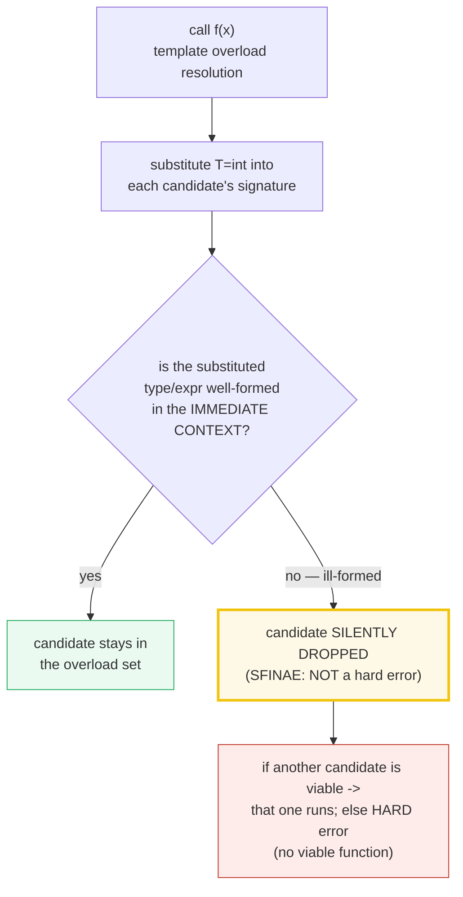
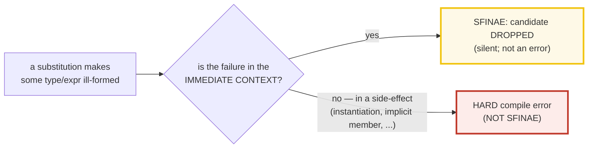

# SFINAE_ENABLE_IF — Substitution Failure Is Not An Error & `std::enable_if`

> **Goal (one line):** show, by printing every value and asserting the right
> overload/template is selected, how **SFINAE** (Substitution Failure Is Not An
> Error) silently *drops* ill-formed immediate-context substitutions, how
> `std::enable_if` exploits that to conditionally enable/disable templates, how
> `std::void_t` (C++17) builds member/expression detectors — and why **C++20
> concepts** and **C++17 `if constexpr`** have *replaced* all of this for new
> code.
>
> **Run:** `just run sfinae_enable_if`
>
> **Ground truth:** [`sfinae_enable_if.cpp`](./sfinae_enable_if.cpp) → captured
> stdout in [`sfinae_enable_if_output.txt`](./sfinae_enable_if_output.txt).
> Every number/line below is pasted **verbatim** from that file under a
> `> From sfinae_enable_if.cpp Section X:` callout. Nothing is hand-computed.
>
> **Prerequisites:** 🔗 [`FUNCTION_TEMPLATES.md`](./FUNCTION_TEMPLATES.md) and
> 🔗 [`OVERLOAD_RESOLUTION.md`](./OVERLOAD_RESOLUTION.md) (SFINAE *is* part of
> overload resolution of templates). Read those first.

---

## 1. Why this bundle exists (lineage) — "the pre-concepts metaprogramming workhorse"

Before C++20 concepts, the only way to say *"this template overload should only
be viable when condition `C` holds on `T`"* was to make the template's signature
**ill-formed when `C` is false** and rely on a language rule — **SFINAE** — that
silently drops the ill-formed candidate instead of erroring. `std::enable_if`
(C++11) is the standard-library gadget that manufactures exactly such an
ill-formed substitution; `std::void_t` (C++17) is the same idea applied to
**member/expression detection** (a SFINAE-friendly detector).

This works, but the error messages are famously terrible: a misuse produces a
30–50-line wall of nested substitution internals, because the compiler only
knows *"no candidate was viable"*, not *"you violated constraint X."* **C++20
concepts** were invented precisely to fix this — a named constraint that fails
with a one-line *"concept X was not satisfied."* **C++17 `if constexpr`** fixes
the other half: branching on type *inside* a single function body without an
overload set at all.

> **The framing for this whole bundle:** SFINAE / `enable_if` is the
> **pre-concepts way** of constraining templates. You will absolutely meet it in
> pre-C++20 codebases (and the standard library still uses it internally). But
> **for new code: prefer concepts, and `if constexpr`.** This bundle teaches the
> mechanism so you can *read* legacy SFINAE — and know why we left it behind.



The headline contrast across the 5-language curriculum — **compile-time
conditional types**:

| Language | Mechanism | Ergonomics |
|---|---|---|
| **C++ pre-C++20** (this bundle) | `std::enable_if<cond,T>::type` (SFINAE) | powerful, but terse & terrible error walls |
| **C++ C++20+** | `template <std::integral T>` (**concepts**) | the modern replacement — named, readable errors |
| 🔗 [`../ts/MAPPED_CONDITIONAL_TYPES.md`](../ts/MAPPED_CONDITIONAL_TYPES.md) | `T extends U ? X : Y` (**conditional types**) | the closest sibling — same idea, far cleaner syntax |
| 🔗 [`../rust/`](../rust/) | trait bounds | **no SFINAE at all** — traits are the clean model from the start |

> From cppreference — *SFINAE*: "When substituting the explicitly specified or
> deduced type for the template parameter fails, the specialization is
> **discarded from the overload set** instead of causing a compile error." And
> *Alternatives*: "tag dispatch, `if constexpr` (since C++17), and concepts
> (since C++20) are usually preferred over use of SFINAE."

---

## 2. The SFINAE rule, precisely

Two facts define SFINAE (both verifiable in Section A):

1. **Where substitution happens.** During overload resolution of a function
   template, the compiler substitutes the deduced/explicit template arguments
   into: the **function type** (return type + all parameter types), the
   **template-parameter declarations**, and the **template-argument list of a
   partial specialization**; since C++11 also **expressions** used in those
   positions; since C++20 the **explicit specifier**.
2. **What counts as a SFINAE failure.** A *substitution failure* is any case
   where the substituted type or expression would be **ill-formed** *if written
   with the substituted arguments*. **Only failures in the *immediate context***
   of the function type / template-parameter types / explicit specifier are
   SFINAE. Errors triggered as a *side-effect* of substitution — e.g. a forced
   template instantiation, or an implicitly-defined member function — are **HARD
   errors**, not SFINAE.



This distinction is the source of the **famous SFINAE error walls**: when the
*wrong* thing fails (a late, after-instantiation error) you get a hard error
that buries you in nested template output. The immediate-context drop itself is
silent and clean.

---

## 3. Section A — the SFINAE rule: ill-formed immediate-context substitution is dropped

> From `sfinae_enable_if.cpp` Section A:
> ```
> probe(T, typename T::value_type* = nullptr)   // overload #1
> probe(...)                                     // overload #2 (fallback)
> 
> probe(std::vector<int>) -> #1 VIABLE: T::value_type names a type (overload #1 selected)
> probe(42)               -> #2 FALLBACK: T::value_type ill-formed -> #1 SFINAE-DROPPED -> #2 runs
> [check] probe(vector<int>) selects #1 (vector<int>::value_type is int): OK
> [check] probe(42) selects #2 (int has no value_type; #1 was SFINAE-dropped): OK
> [check] the drop is SILENT (no compile error) — that IS the SFINAE rule: OK
> 
> Substitution occurs in: the function type (return + all params),
> template-parameter declarations, the partial-specialization arg list;
> expressions since C++11; the explicit specifier since C++20.
> Only IMMEDIATE-CONTEXT failures are SFINAE; later errors are HARD.
> [check] SFINAE applies only in the immediate context (cppreference rule): OK
> ```

**What.** Overload `#1` is `probe(T, typename T::value_type* = nullptr)`. For
`T = std::vector<int>`, `typename T::value_type` is `int` — well-formed — so the
candidate is **viable** and wins. For `T = int`, `typename int::value_type` is
**ill-formed**, and because that ill-formedness sits in the **immediate context**
(a parameter type), `#1` is **silently dropped**; the catch-all `probe(...)`
(the ellipsis, lowest overload-resolution rank) then wins. **No compile error.**

**Why this is the whole game.** The drop is *silent*. That silence is what
`std::enable_if` (Section B) and `std::void_t` (Section C) *manufacture on
purpose*: deliberately make a template's signature ill-formed when some
compile-time condition is false, so it drops out of the overload set and a
*different* overload (or partial specialization) is selected instead. SFINAE
turns "ill-formed" into a *signal*, not a failure.

**The expert detail — "immediate context".** If the same ill-formedness is
reached only as a *side-effect* of substitution (e.g. substituting `T` forces
instantiation of `B<T>`, and *that* is ill-formed), it is a **hard error**, not
SFINAE. The classic trap:

```cpp
template<class T, class U = typename T::type, class V = typename B<T>::type>
void foo(int);   // if T has no ::type, the FIRST default arg fails (SFINAE).
                 // if T has ::type but B<T> has no ::type, the SECOND fails
                 // AFTER instantiating B<T> -> a HARD error (not SFINAE).
```

> From cppreference — *SFINAE / Explanation*: "Only the failures in the types
> and expressions in the **immediate context** of the function type or its
> template parameter types or its explicit specifier (since C++20) are SFINAE
> errors. If the evaluation of a substituted type/expression causes a
> side-effect such as instantiation of some template specialization, generation
> of an implicitly-defined member function, etc, errors in those side-effects
> are treated as **hard errors**."

---

## 4. Section B — `std::enable_if`: conditionally enable a template

> From `sfinae_enable_if.cpp` Section B:
> ```
> std::enable_if<B, T=void>::type  exists (== T) iff B is true; absent otherwise.
>   is_integral_v<int>          = true   -> integral  half<int>    VIABLE
>   is_integral_v<double>       = false  -> integral  half<double> DROPPED
>   is_floating_point_v<double> = true   -> floating half<double> VIABLE
> [check] is_integral_v<int> true -> integral half<int> viable: OK
> [check] is_integral_v<double> false -> integral half<double> SFINAE-dropped: OK
> [check] is_floating_point_v<double> true -> floating half<double> viable: OK
> 
> half(10)  = 5    (integral  overload: 10/2)
> half(3.0) = 1.500000    (floating overload: 3.0/2)
> [check] half(10) == 5 (integral overload selected): OK
> [check] half(3.0) == 1.5 (floating overload selected): OK
> [check] the integral overload was DROPPED for 3.0 (the floating one ran instead): OK
> 
> With NO floating overload, half(3.0) would be a HARD compile error
> (no viable function) — not silently wrong. That is the SFINAE contract.
> [check] half(3.0) drops the integral overload (documented): OK
> ```

**What.** `std::enable_if<B, T = void>` (C++11) has a public member typedef
`type` (equal to `T`) **iff `B` is true**; otherwise there is no such member.
Accessing `enable_if<false, T>::type` is therefore ill-formed — and if that
access happens *during template substitution*, it is a SFINAE drop, not a hard
error. The bundle pins the classic **return-type form**:

```cpp
template <typename T>
typename std::enable_if<std::is_integral_v<T>, T>::type half(T x) { return x / 2; }
template <typename T>
std::enable_if_t<std::is_floating_point_v<T>, T> half(T x) { return x / 2; }  // enable_if_t (C++14)
```

**Why `half(10) == 5` and `half(3.0) == 1.5`.** For `T = int`, the integral
overload is viable (`is_integral_v<int>` true) and the floating overload is
SFINAE-dropped (`is_floating_point_v<int>` false) → the integral overload runs.
For `T = double`, it's the mirror image → the floating overload runs. **The right
overload is selected because the wrong one was silently dropped.** The verifiable
proof is the three `[check]` predicates on `is_integral_v` / `is_floating_point_v`
*plus* the printed results `5` and `1.5`.

**The expert detail — what "drops it" means.** With **no** floating overload,
`half(3.0)` is a **hard compile error** ("no matching function for call to
half(double)") — *not* silently wrong. SFINAE never produces a wrong answer; it
either selects a viable candidate or yields a clean (if ugly) "no viable
function" error. That is the contract.

> From cppreference — `std::enable_if`: "If `B` is true, `std::enable_if` has a
> public member typedef `type`, equal to `T`; otherwise, there is no member
> typedef." And: "This metafunction is a convenient way to leverage SFINAE
> **prior to C++20's concepts**, in particular for conditionally removing
> functions from the candidate set based on type traits."

---

## 5. Section C — the 4 `enable_if` positions + `void_t` (C++17) detection

> From `sfinae_enable_if.cpp` Section C:
> ```
> The 4 places to put enable_if (all enabled for int here):
>   (1) return type:               pos1_return(7)   = 7
>   (2) function parameter:        pos2_param(7)    = (2) function-parameter position
>   (3) non-type template param:   pos3_nontype(7)  = (3) non-type template-parameter position (default value)
>   (4) default template-type arg: pos4_defaultarg(7) = (4) default template-type-argument position
> [check] (1) return-type position runs for int: OK
> [check] (2) function-parameter position runs for int: OK
> [check] (3) non-type template-param position runs for int: OK
> [check] (4) default template-type-arg position runs for int: OK
> 
> Tradeoffs:
>   (1) return type: classic; NOT usable for constructors/destructors.
>   (2) parameter:   NOT usable for most operator overloads (fixed arity).
>   (3) non-type tpl: CAN discriminate two overloads (distinct default vals).
>   (4) default arg:  CANNOT discriminate two overloads -> redeclaration trap.
> [check] only the non-type position (3) cleanly discriminates two overloads: OK
> 
> void_t (C++17) detection idiom (primary=false_type; specialization via void_t=true_type):
>   has_value_type<vector<int>>::value = true
>   has_value_type<int>::value         = false
>   has_size<vector<int>>::value       = true
>   has_size<int>::value               = false
>   has_iterator_category<int*>::value = true
>   has_iterator_category<int>::value  = false
> [check] has_value_type<vector<int>> true (vector has ::value_type): OK
> [check] has_value_type<int> false (int has no ::value_type): OK
> [check] has_size<vector<int>> true (.size() is well-formed): OK
> [check] has_size<int> false (int has no .size()): OK
> [check] has_iterator_category<int*> true (int* is an iterator): OK
> [check] has_iterator_category<int> false (int is not an iterator): OK
> [check] void_t works for BOTH type detection and expression detection: OK
> ```

### The 4 positions

`enable_if` can live in **four** syntactic positions. They all *enable* a
template; they differ in **where** the constraint sits and **whether two
overloads can be discriminated**:

| # | Position | Form | Limitation |
|---|---|---|---|
| (1) | **Return type** | `enable_if_t<cond, R> f(...)` | the classic; **not** usable for constructors / destructors (no return type) |
| (2) | **Function parameter** | `f(..., enable_if_t<cond>* = nullptr)` | **not** usable for most operator overloads (operators have fixed arity) |
| (3) | **Non-type template param** (default value) | `template<class T, enable_if_t<cond, bool> = true>` | **CAN discriminate two overloads** — each gets a distinct defaulted non-type arg (the recommended form) |
| (4) | **Default template-type arg** | `template<class T, class = enable_if_t<cond>>` | **CANNOT discriminate two overloads** — the famous redeclaration trap |

**The redeclaration trap (position 4).** Two function templates that differ
*only* in their **default template arguments** are treated as **redeclarations
of the same template** — default template arguments are not part of a function
template's signature. So you cannot write two `half()` overloads that differ
only in the `enable_if` condition on a defaulted *type* parameter. The fix is
position (3): make it a **non-type** template parameter with a default value
(`enable_if_t<cond, bool> = true`) — now the two templates have *different*
non-type template parameters and are distinct.

```cpp
// WRONG — these are REDECLARATIONS (default template args aren't in the signature):
template <class T, class = enable_if_t<is_integral_v<T>>>  void f(T);   // #1
template <class T, class = enable_if_t<is_floating_point_v<T>>> void f(T); // #2  <- redefinition

// RIGHT — distinct NON-TYPE template params -> two distinct templates:
template <class T, enable_if_t<is_integral_v<T>, bool> = true>       void f(T);  // #1
template <class T, enable_if_t<is_floating_point_v<T>, bool> = true> void f(T);  // #2  OK
```

### `std::void_t` (C++17) — the detection idiom

`std::void_t` is `template<class...> using void_t = void;` — a variadic alias
that maps any types to `void`. Its only job is to **give substitution a place to
fail**: in a partial specialization, `void_t<typename T::value_type>` is
well-formed (== `void`) iff `T::value_type` is a type; otherwise the
specialization's substitution is ill-formed and the **primary template** is
selected instead. That yields the cleanest SFINAE *detector*:

```cpp
template <class T, class = void> struct has_value_type : std::false_type {};       // primary
template <class T> struct has_value_type<T, std::void_t<typename T::value_type>>
    : std::true_type {};                                                           // specialization
```

`has_value_type<std::vector<int>>::value == true`; `has_value_type<int>::value ==
false`. The same pattern detects a valid **expression** (not just a type) via
`decltype` + `std::declval`: `has_size<T>` checks `decltype(declval<T&>().size())`
in an unevaluated context — the bundle's `has_size<vector<int>> == true` and
`has_size<int> == false`, and `has_iterator_category<int*> == true` (a classic
🔗 `<iterator>` SFINAE context) prove both modes.

> From cppreference — `std::void_t`: "Utility metafunction that maps a sequence
> of any types to the type `void`. This metafunction is a convenient way to
> leverage SFINAE prior to C++20's concepts, in particular for conditionally
> removing functions from the candidate set based on whether an expression is
> valid in the **unevaluated context**." *(Note: until CWG 1558, unused alias
> parameters were not guaranteed to ensure SFINAE, so pre-C++17 compilers
> required a `make_void` struct workaround.)*

---

## 6. Section D — the famously-bad SFINAE errors + `if constexpr`

> From `sfinae_enable_if.cpp` Section D:
> ```
> SFINAE error messages leak template internals (the famous 'wall'):
>   error: no type named 'type' in 'std::enable_if<false, int>'
>     -> followed by ~30-50 lines of nested substitution/instantiation.
>   That wall is THE reason C++20 concepts and C++17 if constexpr exist.
>   (A late / AFTER-instantiation error is NOT SFINAE — it is a HARD error.)
> 
> if constexpr (C++17) replaces enable_if-overload-sets for in-body branching:
>   describe_modern<int>()    -> if constexpr: T is integral (other branches discarded, NOT instantiated)
>   describe_modern<double>() -> if constexpr: T is floating-point (other branches discarded)
> [check] describe_modern<int> takes the integral branch: OK
> [check] describe_modern<double> takes the floating-point branch: OK
> [check] the discarded branch was NOT instantiated (if constexpr, C++17): OK
> ```

**The error-message problem.** When *no* SFINAE candidate is viable, the compiler
has only one thing to say: *"no matching function."* It then dumps every
candidate it tried and *why each failed* — which, for deeply nested templates,
means a 30–50-line wall whose root cause is buried under template internals.
The bundle prints a representative snippet (`no type named 'type' in
'std::enable_if<false, int>'`). **This wall is the single biggest reason
concepts exist** (Section E).

**`if constexpr` (C++17) — the modern alternative for *in-body* branching.**
When the goal is *"branch on a property of `T` inside one function"* (rather
than *select a different overload*), SFINAE/`enable_if` is overkill: you had to
write a whole overload set. `if constexpr` discards the non-taken branch at
compile time — the discarded branch is **not instantiated** when the enclosing
template is instantiated — so you can write type-dependent code in each branch
without it failing to compile:

```cpp
template <typename T>
const char* describe_modern() {
    if constexpr (std::is_integral_v<T>)        return "...integral...";
    else if constexpr (std::is_floating_point_v<T>) return "...floating-point...";
    else                                         return "...neither...";
}
```

The bundle asserts `describe_modern<int>()` takes the integral branch and
`describe_modern<double>()` takes the floating branch — one function, no overload
set, no `enable_if`. (🔗 `IF_CONSTEXPR` — the dedicated bundle for `if constexpr`
and its discarded-statement rules.)

> From cppreference — *if / Constexpr if*: "If condition yields true, then
> statement-false is discarded (if present), otherwise, statement-true is
> discarded. … If a constexpr if statement appears inside a templated entity, and
> if condition is not value-dependent after instantiation, the discarded
> statement is **not instantiated** when the enclosing template is instantiated."

---

## 7. Section E — prefer concepts (C++20) for new code; cross-language

> From `sfinae_enable_if.cpp` Section E:
> ```
> The concept equivalent of enable_if — one line, named constraint:
>   template <std::integral T>        T half_concept(T x) { return x / 2; }
>   template <std::floating_point T>  T half_concept(T x) { return x / 2; }
>   half_concept(10)  = 5
>   half_concept(3.0) = 1.500000
> [check] half_concept(10) == 5 (integral concept overload): OK
> [check] half_concept(3.0) == 1.5 (floating concept overload): OK
> [check] std::integral<double> is false (concept cleanly excludes it): OK
> 
> Modern guidance (cppreference 'Alternatives'): PREFER concepts (C++20) and
> if constexpr (C++17) — and tag dispatch — OVER SFINAE/enable_if. Use
> static_assert if you only want a conditional compile-time error.
> [check] cppreference: concepts / if constexpr / tag dispatch preferred over SFINAE: OK
> 
> Cross-language: compile-time conditional types / constraints ---
>   C++ (this):   std::enable_if<cond, T>::type   (SFINAE; pre-concepts, messy)
>   C++ modern:   template <std::integral T>        (concept: the replacement)
>   TS:           T extends U ? X : Y              (conditional types; clean)
>   Rust:         trait bounds (no SFINAE; traits are the clean model)
> [check] TS conditional types are the closest sibling (same idea, cleaner syntax): OK
> ```

**The concept replacement.** The two-line `half_concept` above does *exactly*
what Section B's `enable_if` overloads did — discriminate integral vs floating
`T` — but as a **named, readable constraint** (`template <std::integral T>`) with
no `enable_if` machinery and, crucially, a **one-line error message** when
violated (`concept std::integral<double> was not satisfied`) instead of the
SFINAE wall. **This is the recommended form for all new C++20+ code.**

**The decision tree (new code):**

```mermaid
graph TD
    Q["I need to constrain / branch on a type at compile time"] --> Q1{"what do I want?"}
    Q1 -->|"reject bad types at the API boundary<br/>with a good error"| Concept["concepts (C++20)<br/>template <std::integral T>"]
    Q1 -->|"branch on type INSIDE one function"| IfC["if constexpr (C++17)<br/>(discarded branch not instantiated)"]
    Q1 -->|"just fail fast with a message"| SA["static_assert(cond, \"...\")"]
    Q1 -->|"select among overloads by category<br/>(legacy/pre-C++20 codebase)"| SFINAE["enable_if / void_t<br/>(this bundle — read it, don't write it)"]
    style Concept fill:#eafaf1,stroke:#27ae60,stroke-width:3px
    style IfC fill:#eafaf1,stroke:#27ae60
    style SFINAE fill:#fef9e7,stroke:#f1c40f
    style SA fill:#eaf2f8,stroke:#2980b9
```

**Cross-language — compile-time conditional types.** The idea "a type that
exists iff a compile-time predicate holds" is universal; the syntax varies wildly:

- 🔗 [`../ts/MAPPED_CONDITIONAL_TYPES.md`](../ts/MAPPED_CONDITIONAL_TYPES.md) —
  TypeScript **conditional types** `T extends U ? X : Y` are the *closest
  sibling*: the same compile-time conditional-type idea, but with far cleaner
  syntax. C++ SFINAE is the lower-level, messier version that concepts replaced.
- 🔗 [`../rust/`](../rust/) — Rust has **no SFINAE at all**: trait bounds are the
  clean model from the start, and there is no "ill-formed substitution is
  silently dropped" rule. (Rust's analog of `if constexpr` is a separate `const`
  generics story.)
- 🔗 [`CONCEPTS.md`](./CONCEPTS.md) — the full treatment of the C++20 replacement
  (the 4 ways to apply a concept, subsumption, the error-message revolution).

---

## 8. Worked smallest-scale example

The whole bundle compressed to the one idiom a reader of legacy code must
recognize — *and* its modern replacement:

```cpp
// ── LEGACY (pre-C++20): enable_if on the return type ──────────────────────
template <typename T>
typename std::enable_if<std::is_integral_v<T>, T>::type half(T x) { return x / 2; }
//   half(10) == 5            // integral overload runs
//   half(3.0)                // integral overload DROPPED; needs a floating overload
//                             //   or it's a hard "no matching function" error.

// ── MODERN (C++20): the concept equivalent (write THIS for new code) ──────
template <std::integral T>
T half(T x) { return x / 2; }
//   half(10) == 5            // std::integral<int> satisfied
//   half(3.0)                // std::integral<double> is false -> clean 1-line error
```

> From `sfinae_enable_if.cpp` Section B, `half(10) = 5` and `half(3.0) = 1.500000`
> (the floating overload); Section E, `half_concept(10) = 5` and
> `std::integral<double>` is `false`. The contrast *is* the lesson: same
> semantics, vastly better ergonomics.

---

## 9. Pitfalls (the expert payoff)

| Trap | Symptom | Fix |
|---|---|---|
| Two `enable_if` overloads differing **only in a default *type* template arg** (position 4) | **redeclaration error** — "redefinition of `f`" | Use position (3): a **non-type** template param with a default value (`enable_if_t<cond, bool> = true`); or use concepts. |
| `enable_if` on the **return type** of a constructor / destructor | compile error — ctors/dtors have **no return type** | Move `enable_if` to a template parameter (position 3 or 4); ctors/dtors can't use position (1). |
| `enable_if` on an **extra function parameter** for an operator (e.g. `operator+`) | compile error — operators have **fixed arity** | Use the return type (position 1) or a template parameter (position 3). |
| Forgetting the `typename` in `typename std::enable_if<...>::type` | "dependent name is not a type" error | Always write `typename` before a dependent qualified type name. (Or use the `enable_if_t` C++14 helper, which hides it.) |
| Treating an **after-instantiation** error as SFINAE | a **hard** 50-line error wall (the famous SFINAE mess), not a silent drop | Only **immediate-context** failures are SFINAE. Restructure so the ill-formed expression is in the function signature, not in a forced instantiation. |
| `void_t` "doesn't work" on an old compiler | detection idiom always returns `false_type` | Pre-C++17 / pre-CWG-1558 compilers ignored unused alias params; use the `make_void` struct workaround. (Modern compilers are fine.) |
| Reading a "no viable function" wall as a SFINAE *bug* | confused by the 30–50-line cascade | The root cause is usually one line up: *"no type named 'type' in enable_if<false,…>"*. Read the candidate list bottom-up. |
| Writing new SFINAE in 2026 | terrible errors, hard to maintain, reinvents concepts | **Prefer concepts** (`template <std::integral T>`) or `if constexpr`. SFINAE is for *reading* legacy code, not writing new code. |
| Two overloads where **both** `enable_if` conditions are true for some `T` | **ambiguous call** — "no unique viable overload" | Make the conditions **mutually exclusive** (as the `half` integral-vs-floating pair does). |
| `enable_if` in a const **non-type** template param's type | **ABI/mangling** collisions on some ABIs (Itanium) — two distinct templates mangle identically and link wrongly | Prefer a `bool` non-type param, or use concepts. (cppreference documents this Itanium-ABI hazard.) |

---

## 10. Cheat sheet

```cpp
// ── SFINAE: the rule (one line) ────────────────────────────────────────────
//   An ill-formed type/expression in the IMMEDIATE CONTEXT of a template's
//   signature DROPS the candidate silently — NOT a hard error. Only
//   immediate-context failures count; after-instantiation errors are HARD.

// ── std::enable_if (C++11): conditionally define ::type ────────────────────
//   enable_if<B, T=void>::type   == T   iff B is true; absent otherwise.
//   enable_if_t<B, T=void>             (C++14 helper alias)
//   Possible impl:  template<bool B, class T=void> struct enable_if {};
//                   template<class T> struct enable_if<true,T> { using type = T; };

// ── The 4 positions for enable_if ──────────────────────────────────────────
template <class T> enable_if_t<cond, R>  f(T);                              // (1) return type
template <class T> void f(T, enable_if_t<cond>* = nullptr);                 // (2) param (no operators)
template <class T, enable_if_t<cond, bool> = true>  void f(T);              // (3) non-type tpl — DISCRIMINATES
template <class T, class = enable_if_t<cond>>       void f(T);              // (4) default type arg — NO discrim

// ── std::void_t (C++17): the detection idiom ───────────────────────────────
//   template<class...> using void_t = void;
template <class T, class = void> struct has_foo : std::false_type {};
template <class T> struct has_foo<T, std::void_t<decltype(T::foo)>> : std::true_type {};
//   works for types (typename T::value_type) AND expressions (decltype(t.size())).

// ── The classic return-type overload set (legacy) ──────────────────────────
template <class T> enable_if_t<is_integral_v<T>, T>        half(T x) { return x/2; }
template <class T> enable_if_t<is_floating_point_v<T>, T>  half(T x) { return x/2; }

// ── MODERN replacements (write THESE) ──────────────────────────────────────
template <std::integral T>        T half(T x) { return x/2; }   // C++20 concept
template <std::floating_point T>  T half(T x) { return x/2; }   //   (mutually exclusive, readable)
if constexpr (is_integral_v<T>) { ... } else { ... }            // C++17 (discarded branch not instantiated)
static_assert(cond, "msg");                                      // C++11 (just fail with a message)
```

---

## 11. 🔗 Cross-references

**Within C++ (the expertise spine):**

- 🔗 [`OVERLOAD_RESOLUTION.md`](./OVERLOAD_RESOLUTION.md) (P2) — SFINAE *is* part
  of candidate viability in overload resolution of templates. Read this to see
  *why* a dropped candidate disappears from the overload set.
- 🔗 [`CONCEPTS.md`](./CONCEPTS.md) (P2) — **the modern replacement: "use
  concepts instead."** Named constraints, subsumption, and the one-line
  error-message revolution that retires the SFINAE wall.
- 🔗 `IF_CONSTEXPR` (P6) — the *other* modern alternative: discarded branches are
  not instantiated, replacing `enable_if` overload sets for in-body branching.
- 🔗 `TYPE_TRAITS` (P6) — the `is_integral_v` / `is_floating_point_v` /
  `enable_if` / `void_t` *predicates* that `enable_if` consumes. SFINAE is the
  *plumbing*; the traits are the *conditions*.
- 🔗 [`FUNCTION_TEMPLATES.md`](./FUNCTION_TEMPLATES.md) /
  [`CLASS_TEMPLATES.md`](./CLASS_TEMPLATES.md) / [`VARIADIC_TEMPLATES.md`](./VARIADIC_TEMPLATES.md) —
  the template machinery SFINAE operates on (substitution, deduction, partial
  specialization).

**Cross-language parallels (the 5-language curriculum):**

- 🔗 [`../ts/MAPPED_CONDITIONAL_TYPES.md`](../ts/MAPPED_CONDITIONAL_TYPES.md) —
  TypeScript **conditional types** `T extends U ? X : Y` are the **closest
  sibling**: the *same* compile-time conditional-type idea ("a type that exists
  iff a predicate holds"), but with far cleaner syntax. C++ SFINAE is the
  lower-level, messier version that concepts replaced.
- 🔗 [`../rust/`](../rust/) — Rust has **no SFINAE**: trait bounds are the clean
  model from the start, and there is no "ill-formed substitution is silently
  dropped" rule. (C++'s concepts were partly an attempt to reach Rust's
  trait-bound ergonomics.)
- 🔗 [`../go/`](../go/) / [`../python/`](../python/) — neither has compile-time
  conditional types; type constraints are runtime/dynamic. SFINAE is a
  uniquely-statically-typed-template-engine feature.

---

## Sources

Every signature, behavioral claim, and standard-version citation above was
verified against cppreference and the ISO C++ standard, then corroborated by
≥1 independent secondary source:

- cppreference — *SFINAE* (the rule; substitution locations; immediate-context vs
  hard error; expression SFINAE since C++11; partial-specialization SFINAE;
  library support `enable_if`/`void_t`; **Alternatives** — "tag dispatch,
  `if constexpr` (since C++17), and concepts (since C++20) are usually
  preferred over use of SFINAE"):
  https://en.cppreference.com/w/cpp/language/sfinae
- cppreference — `std::enable_if` (`template<bool B, class T = void> struct
  enable_if;`; `type` exists iff `B` true; `enable_if_t` helper since C++14;
  the three forms — function argument / return type / template parameter; the
  **redeclaration-trap** note and the Itanium-ABI mangling hazard; "a convenient
  way to leverage SFINAE **prior to C++20's concepts**"):
  https://en.cppreference.com/w/cpp/types/enable_if
- cppreference — `std::void_t` (`template<class...> using void_t = void;`;
  since C++17; feature-test `__cpp_lib_void_t == 201411L`; the detection-idiom
  examples — `has_type_member`, `has_pre_increment_member`; the CWG 1558
  `make_void` workaround note):
  https://en.cppreference.com/w/cpp/types/void_t
- cppreference — *if statement / Constexpr if* (`if constexpr` since C++17;
  feature-test `__cpp_if_constexpr == 201606L`; the discarded branch is **not
  instantiated** when the enclosing template is instantiated; not a substitute
  for `#if`; the `dependent_false_v` workaround history):
  https://en.cppreference.com/w/cpp/language/if
- cppreference — *Constraints and concepts* (the C++20 replacement for SFINAE;
  named constraints; subsumption): https://en.cppreference.com/w/cpp/language/constraints
- ISO C++23 draft (open-std.org) — normative wording:
  - 13.10 Template resolution `[temp.res]` / SFINAE rules
  - 13.10.1.2 SFINAE-immediate context
  - 17.3.5 `enable_if`, 17.3.7 `void_t` (`[meta.trans.other]`)
  - Working draft: https://open-std.org/JTC1/SC22/WG21/docs/papers/2023/n4950.pdf
- Secondary corroboration (≥2 independent sources, web-verified):
  - Lei Mao — *C++ Template Specialization Using Enable If* (the 4 positions,
    the type- vs non-type-template-parameter distinction, the **redeclaration
    trap** with the worked WRONG/RIGHT example, `enable_if_t<cond,bool> = true`
    as the discriminating form):
    https://leimao.github.io/blog/CPP-Enable-If/
  - Boost — `enable_if` (pre-standard origin; "Many operators have a fixed
    number of arguments, thus enable_if must be used either in the return type
    or in an extra template parameter"):
    https://www.boost.org/libs/utility/enable_if.html
  - Stack Overflow — *How does changing a template argument from a type to a
    non-type make SFINAE work?* (defaulted non-type template args participate in
    signature; defaulted type args do not):
    https://stackoverflow.com/questions/55667758/
  - Microsoft DevBlogs — *Why isn't C++ using my default parameter to deduce a
    template type?* (default arguments are not used for deduction):
    https://devblogs.microsoft.com/oldnewthing/20240325-00/?p=109570

**Facts that could not be verified by running** (documented, not executed,
because they are compile errors, legacy-compiler behavior, or error-message text
by design): the actual ~30–50-line SFINAE error wall (a misuse is a *compile
error*, so a file triggering it would fail `just check`); the redeclaration
error from two position-(4) overloads (compile error); the Itanium-ABI name
mangling collision (linker-level, multi-TU); and pre-CWG-1558 `void_t` failure
on old compilers. These are confirmed by the cppreference sections and secondary
sources above, not reproduced as runnable output in the verified path.
