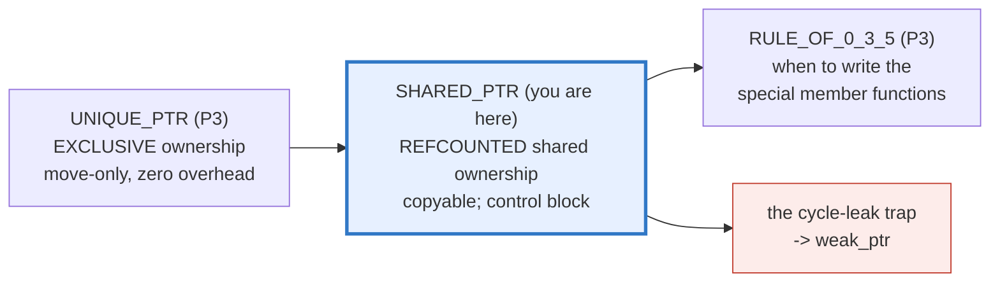
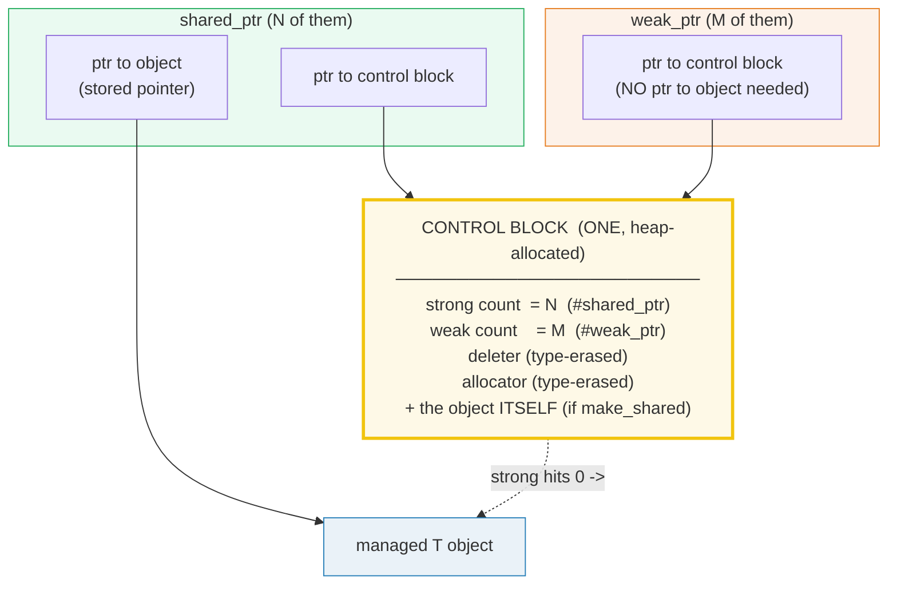
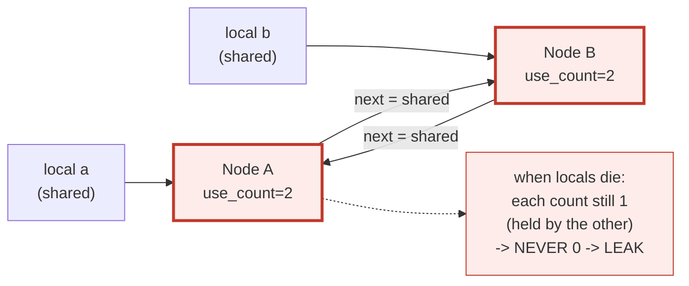
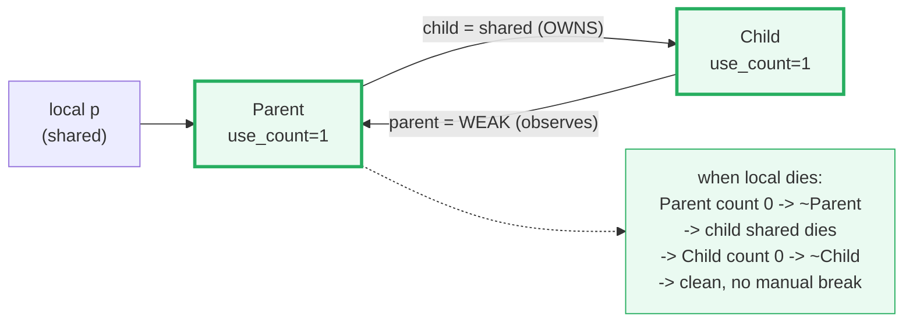

# SHARED_PTR_WEAK_PTR — Refcounted Shared Ownership, the Control Block & Cycle-Breaking

> **Goal (one line):** by printing every value, show how `std::shared_ptr` is
> **refcounted shared ownership** (the object dies when the *last* `shared_ptr`
> dies), how the **control block** carries the strong + weak counts, and how
> `std::weak_ptr` is a **non-owning observer** used to **break reference
> cycles** — pinning the `make_shared` (1 allocation) vs `shared_ptr(new T)` (2
> allocations) difference, the **cycle-leak trap**, and
> `std::enable_shared_from_this` as documented expert payoffs.
>
> **Run:** `just run shared_ptr_weak_ptr`
>
> **Ground truth:** [`shared_ptr_weak_ptr.cpp`](./shared_ptr_weak_ptr.cpp) →
> captured stdout in
> [`shared_ptr_weak_ptr_output.txt`](./shared_ptr_weak_ptr_output.txt). Every
> number/table below is pasted **verbatim** from that file under a
> `> From shared_ptr_weak_ptr.cpp Section X:` callout. Nothing is hand-computed.
>
> **Prerequisites:** 🔗 `SCOPE_LIFETIMES` (RAII — destructors run at scope exit)
> and 🔗 `UNIQUE_PTR` (exclusive ownership, the move-only sibling). This bundle
> is the **shared-ownership** half of the smart-pointer pair.

---

## 1. Why this bundle exists (lineage)

`std::unique_ptr` (🔗 bundle #18) is **exclusive** ownership — move-only, zero
overhead, no control block. But some data structures genuinely have **shared**
ownership: a graph node owned by every edge that points at it, an object cached
and also held by a live caller, a resource shared across subsystems with no
single clear owner. `std::unique_ptr` cannot express that (you cannot *copy* it
to share). `std::shared_ptr<T>` is the answer: **multiple** `shared_ptr` objects
may own the **same** heap object, and the object is destroyed when the **last**
one dies — implemented by a **reference count** kept in a heap-allocated
**control block**.



`std::weak_ptr<T>` exists *because* shared ownership has one trap unique_ptr does
not: if `A` owns `B` and `B` owns `A`, neither refcount can ever reach 0 → a
**leak** (Section D). `weak_ptr` is the **non-owning** observer that breaks the
cycle: it can *see* the object and `.lock()` into a real `shared_ptr` on demand,
but it does **not** bump the strong count, so it cannot keep the object alive.

> From cppreference — *`std::shared_ptr`*: "a smart pointer that retains **shared
> ownership** of an object through a pointer. Several `shared_ptr` objects may own
> the same object. The object is destroyed … when … the **last remaining
> `shared_ptr` owning the object is destroyed**."

### The headline contrast across the 5-language curriculum

| Language | Shared ownership mechanism | Cycles handled by |
|---|---|---|
| **C++** (this bundle) | `std::shared_ptr` (manual refcount) + `weak_ptr` | **you** (weak_ptr on one side) |
| 🔗 `../rust/` | `Rc<T>` / `Arc<T>` (refcount) + `Weak<T>` | **you** (`Weak`); `Arc` = atomic, threads |
| 🔗 `../go/` | GC-traced pointers | **GC automatically** (no weak_ptr needed) |
| 🔗 `../ts/` / `../python/` | GC + `WeakMap`/`WeakRef` | **GC automatically**; `WeakRef` for caches |

C++ (and Rust) are the **no-GC** languages here, so refcounting is *manual
discipline*. The difference: Rust's borrow checker rejects many mistakes at
compile time; C++ trusts you and pays in leaks/UB if you get the cycle wrong.

---

## 2. The mental model: the control block

A `shared_ptr` is really **two pointers**: the **stored pointer** (what `get()` /
`->` / `*` use) and a pointer to the **control block** — a heap-allocated
bookkeeping struct shared by *all* the `shared_ptr`s and `weak_ptr`s that refer
to one object. This indirection is the entire cost of shared ownership.



The **two counts** are the heart of the mechanism:

- **strong count** = number of `shared_ptr`s. When it hits **0**, the **object**
  is destroyed (its destructor runs) — but the control block is *not* freed yet.
- **weak count** = number of `weak_ptr`s (+1 bookkeeping while any `shared_ptr`
  exists). The control block itself is freed only when the weak count *also*
  hits 0. That is why a `weak_ptr` can outlive the object: it keeps the
  **control block** alive (so it can answer `expired()`), not the object.

> From cppreference — *`std::shared_ptr` → Implementation notes*: "the control
> block is a dynamically-allocated object that holds … the number of `shared_ptr`s
> that own the managed object; the number of `weak_ptr`s that refer to the managed
> object. … The control block **does not deallocate itself until the
> `std::weak_ptr` counter reaches zero as well**."

---

## 3. Section A — make_shared, shared ownership, use_count, dtor-at-zero

> From `shared_ptr_weak_ptr.cpp` Section A:
> ```
> (1) make_shared<Traced>("A", 42) — born with use_count == 1
>     [ctor] Traced("A", 42)   live=1
>     sp.use_count() = 1
> [check] make_shared produced use_count == 1: OK
> [check] exactly one Traced is alive after make_shared: OK
> [check] dereference: sp->value == 42: OK
> [check] sp.get() != nullptr: OK
> 
> (2) COPY a shared_ptr: auto sp2 = sp  -> use_count == 2 (both)
>     sp.use_count() = 2   sp2.use_count() = 2 (same control block)
> [check] after copy, sp.use_count() == 2: OK
> [check] after copy, sp2.use_count() == 2 (same control block): OK
> [check] sp.get() == sp2.get() (they alias the SAME object): OK
> [check] still exactly one Traced alive (a copy, not a second object): OK
> 
> (3) Pass BY VALUE into a function: bumps to 3 inside, back to 2 after
>     use_count inside use_count_inside(sp) = 3
> [check] use_count == 3 while the by-value parameter is alive: OK
> [check] back to use_count == 2 after the parameter died: OK
> 
> (4) Reset one owner: sp2.reset()  -> use_count back to 1
>     sp.use_count() = 1
> [check] after sp2.reset(), sp.use_count() == 1: OK
> [check] object still alive (the last owner has NOT died yet): OK
> 
> (5) Reset the LAST owner: sp.reset()  -> use_count 0 -> DTOR runs
>     [dtor] ~Traced("A")       live=0
>     sp.use_count() = 0   Traced::live = 0
> [check] after last owner reset, sp.use_count() == 0: OK
> [check] dtor-at-zero: the Traced object was destroyed (live == 0): OK
> [check] sp is now empty (operator bool == false): OK
> ```

**What.** `std::make_shared<T>(args...)` constructs a `T` and returns a
`shared_ptr<T>` whose strong count is `1`. **Copying** a `shared_ptr`
(`auto sp2 = sp;`) does **not** copy the object — it makes `sp2` a *co-owner* of
the same object and **bumps the strong count** (`use_count()` rises to 2 for
*both*; they share one control block). **Resetting** one owner decrements the
count; when the **last** owner dies/resets, the count hits **0** and the object's
**destructor runs** (dtor-at-zero) — the `[dtor]` trace fires *exactly* then, not
before.

**Why — the refcount lifecycle.** This is RAII (🔗 `SCOPE_LIFETIMES`,
🔗 `RAII`) applied to *shared* ownership: each `shared_ptr`'s destructor
decrements the strong count, and the **last destructor** does the cleanup. There
is no GC, no "stop the world" — destruction is **deterministic** and
**immediate**, exactly like a stack object but with shared, heap-backed
ownership. Passing a `shared_ptr` **by value** into a function is a *legal* way
to share ownership (it bumps the count for the call's duration), though passing
`const shared_ptr<T>&` is cheaper when the callee just wants to *look* and not
share.

> From cppreference — *`std::shared_ptr`*: "The object is destroyed using a
> delete-expression or a custom deleter that is supplied to `shared_ptr` during
> construction." And *Notes*: "The ownership of an object can only be shared with
> another `shared_ptr` by **copy constructing or copy assigning** its value to
> another `shared_ptr`."

---

## 4. Section B — the control block; make_shared (1) vs shared_ptr(new T) (2)

> From `shared_ptr_weak_ptr.cpp` Section B:
> ```
> Measuring heap allocations via a counting global operator new.
>     [ctor] Traced("MS", 1)   live=1
>     [dtor] ~Traced("MS")       live=0
>     make_shared<Traced>("MS", 1)  -> allocations = 1
> [check] make_shared uses exactly 1 heap allocation: OK
>     [ctor] Traced("NEW", 2)   live=1
>     [dtor] ~Traced("NEW")       live=0
>     shared_ptr<Traced>(new Traced("NEW", 2)) -> allocations = 2
> [check] shared_ptr(new T) uses 2 heap allocations (object + control block): OK
> [check] make_shared (1) < shared_ptr(new T) (2): OK
> 
> The control block holds: strong count, weak count, deleter, allocator.
> make_shared fuses the object INTO the control block (1 alloc, 1 cache
> line). Caveat: the object's memory is freed only when BOTH counts hit 0,
> so a large object + a lingering weak_ptr can delay its memory release.
> [check] make_shared is the preferred factory for shared ownership: OK
> 
> When the last shared_ptr dies, the object dies even if a weak remains:
>     [ctor] Traced("CB", 3)   live=1
>     inside scope: Traced::live=1  wp.expired()=0  wp.use_count()=1
> [check] while shared alive: weak is not expired: OK
> [check] weak does not bump the strong count (use_count == 1): OK
>     [dtor] ~Traced("CB")       live=0
>     after scope: Traced::live=0  wp.expired()=1 (object dead, CB alive)
> [check] after last shared dies, the OBJECT is destroyed (live == 0): OK
> [check] after last shared dies, weak is EXPIRED: OK
> ```

**The allocation fact — measured, not asserted.** The bundle *replaces global
`operator new`* with a counting version so the 1-vs-2 allocation difference
becomes a printed number (`shared_ptr_weak_ptr.cpp` lines ~30-65). The output is
unambiguous: `make_shared` does **1** allocation; `shared_ptr(new T)` does **2**.

- **`std::make_shared<T>(args...)`** allocates the control block **and** the
  object in **one** heap block — the `T` is constructed **in place** inside a
  data member of the control block. One `malloc`, one cache line, one `free`.
- **`std::shared_ptr<T>(new T(args...))`** does `new T` (**allocation 1**: the
  object) *and then* allocates the control block separately (**allocation 2**).
  Two `malloc`s, two `free`s, worse locality.

That is **the** reason to prefer `make_shared`: fewer allocations, better cache
behavior, and it's also **exception-safe** (no leak if an exception fires
between the two allocations in a `f(shared_ptr<T>(new T), g())` call sequence —
`make_shared` sidesteps the whole problem).

**The one caveat (expert detail).** Because `make_shared` fuses the object into
the control block, the object's **memory** is not returned until **both** counts
hit 0. So if you hold a `weak_ptr` to a large object after the last `shared_ptr`
dies, the object's *destructor* runs (strong == 0) but its **bytes linger** until
the last `weak_ptr` is gone (weak == 0). With `shared_ptr(new T)` the object's
memory is freed immediately at strong == 0. For a huge object that might be
observed briefly by a long-lived `weak_ptr`, `shared_ptr(new T)` releases the
object's memory sooner — a rare case where the "worse" constructor wins.

**The strong-0 / weak-0 separation — observed.** The last block of Section B
holds a `weak_ptr` while the last `shared_ptr` dies. The trace proves the rule:
`[dtor] ~Traced("CB")` fires when `s` goes out of scope (strong → 0, **object
dead**), but `wp.expired()` flips to `1` *and `wp` is still queryable* — because
the **control block** is still alive (weak count ≥ 1), even though the object it
once pointed at is gone.

> From cppreference — *`std::shared_ptr` → Implementation notes*: "When
> `shared_ptr` is created by calling `std::make_shared` … the memory for **both
> the control block and the managed object** is created with a **single
> allocation**. … When `shared_ptr` is created via one of the `shared_ptr`
> constructors, the managed object and the control block **must be allocated
> separately**." And *`std::make_shared`*: "`std::shared_ptr<T>(new T(args...))`
> performs **at least two allocations** (one for the object `T` and one for the
> control block) … while `std::make_shared<T>` typically performs **a single
> allocation**."

---

## 5. Section C — weak_ptr: non-owning observer, .lock(), .expired()

> From `shared_ptr_weak_ptr.cpp` Section C:
> ```
> (1) A weak_ptr observes a shared_ptr WITHOUT bumping the strong count
>     [ctor] Traced("W", 99)   live=1
>     sp.use_count() = 1   wp.expired() = 0   wp.use_count() = 1
> [check] weak_ptr did NOT bump the strong count (sp.use_count == 1): OK
> [check] weak_ptr is not expired while a shared owns it: OK
> [check] weak_ptr's use_count() reflects the strong count (1): OK
> 
> (2) .lock() -> a shared_ptr (or nullptr if the object already died)
>     locked.get() != nullptr   *locked->value = 99   sp.use_count() = 2
> [check] wp.lock() returned a non-null shared_ptr (object was alive): OK
> [check] after lock, sp.use_count() == 2 (sp + locked): OK
> [check] locked aliases the same object: OK
> 
> (3) Release the shared_ptrs -> object dies -> weak EXPIRES
>     [dtor] ~Traced("W")       live=0
>     wp.expired() = 1   wp.use_count() = 0
> [check] after all shared_ptrs die, weak is EXPIRED: OK
> [check] expired weak's use_count() == 0: OK
> 
> (4) .lock() on an EXPIRED weak_ptr returns an EMPTY shared_ptr
>     locked2.get() == nullptr   (bool)locked2 = 0
> [check] locking an expired weak_ptr yields an empty (null) shared_ptr: OK
> [check] weak_ptr cannot keep the object alive (it died despite wp existing): OK
> ```

**What.** `std::weak_ptr<T>` is a **non-owning** reference to an object managed
by a `shared_ptr`. Constructing `std::weak_ptr<T> wp = sp;` does **not** bump the
strong count (Section C proves `sp.use_count()` stays `1`), so a `weak_ptr`
**cannot keep the object alive** — when the last `shared_ptr` dies, the object
dies *even though `wp` still exists* (`wp.expired()` becomes `true`).

**The two operations that matter:**

- **`.expired()`** — returns `true` if the managed object has already been
  destroyed (strong count == 0). A quick "is it still there?" check.
- **`.lock()`** — **atomically** converts the `weak_ptr` into a `shared_ptr`: if
  the object is alive you get a real, owning `shared_ptr` (the strong count bumps
  by 1 and the object is guaranteed alive for as long as you hold it); if it is
  already dead you get an **empty** `shared_ptr` (`nullptr`). `.lock()` is the
  *only* safe way to use the object through a `weak_ptr`, because between a bare
  `.expired()==false` check and your next line another thread could destroy it —
  `.lock()` removes that race.

**Why — the two canonical use cases.**

1. **Observers / caches that must not keep things alive.** A cache of large
   objects, a subscriber list, a timer holding a callback target — each wants to
   *see* the object if it exists but **not** prevent its destruction. A
   `weak_ptr` is exactly that: "tell me if it's still there; if so, let me use
   it for a moment."
2. **Breaking reference cycles** — Section D.

> From cppreference — *`std::weak_ptr`*: "`std::weak_ptr` is a smart pointer that
> holds a **non-owning** ("weak") reference to an object that is managed by
> `std::shared_ptr`. … `lock` creates a `shared_ptr` that manages the referred
> object. … Another use for `std::weak_ptr` is to **break reference cycles**
> formed by objects managed by `std::shared_ptr`."

---

## 6. Section D — the cycle-leak trap, the weak_ptr fix, enable_shared_from_this

> From `shared_ptr_weak_ptr.cpp` Section D:
> ```
> (D1) THE CYCLE: A.next = shared(B); B.next = shared(A)
>     [ctor] Node('A') live=1
>     [ctor] Node('B') live=2
>     a.use_count()=2  b.use_count()=2  (each held by the other)
> [check] cycle: a.use_count() == 2 (local + b->next): OK
> [check] cycle: b.use_count() == 2 (local + a->next): OK
> [check] both Nodes are alive (live == 2): OK
>     (breaking the cycle explicitly so this path does not leak)
>     after break: a.use_count()=1  b.use_count()=1
> [check] after breaking the cycle, a.use_count() == 1: OK
> [check] after breaking the cycle, b.use_count() == 1: OK
>     [dtor] ~Node('B') live=1
>     [dtor] ~Node('A') live=0
> [check] after the cycle was broken, both Nodes destructed (live == 0): OK
> 
> (D2) THE FIX: parent owns child (shared); child->parent is WEAK
>     [ctor] Parent live=1
>     [ctor] Child live=1
>     p.use_count()=1  child.use_count()=1  child->parent.expired()=0
> [check] weak child->parent did NOT bump parent's strong count (use_count == 1): OK
> [check] parent owns child (child.use_count == 1): OK
> [check] child can still OBSERVE the parent (not expired): OK
> [check] both Parent and Child alive (live == 1 each): OK
>     [dtor] ~Parent live=0
>     [dtor] ~Child live=0
> [check] the weak_ptr fix destructed cleanly: Parent::live == 0: OK
> [check] the weak_ptr fix destructed cleanly: Child::live == 0: OK
> 
> (D3) enable_shared_from_this::shared_from_this() reuses the control block
>     [ctor] Widget(7) live=1
>     sp.use_count()=2  self.get()==sp.get(): 1  wself.expired()=0
> [check] shared_from_this() returned a shared_ptr to the SAME object: OK
> [check] shared_from_this() bumped use_count to 2 (reused control block): OK
> [check] weak_from_this() is not expired: OK
>     [dtor] ~Widget live=0
> [check] enable_shared_from_this path destructed cleanly (live == 0): OK
> ```

### D1 — THE CYCLE LEAK TRAP



If `A` holds a `shared_ptr<Node>` to `B` and `B` holds one to `A`, closing the
loop, then when the **outside** owners (the locals `a` and `b`) die, each node's
strong count drops from 2 to **1** — still held by the *other* node. Neither
count can ever reach 0, so neither destructor ever runs: a **leak** that
`std::shared_ptr` cannot detect (it is *not* a cycle-collecting GC). The bundle
**observes** the trap — `use_count()==2` for both, the "stuck at 1 if locals
died" condition — then **breaks the cycle explicitly** (`a->next.reset();
b->next.reset();`) so the verified path stays leak-clean for ASan. A real program
would simply leak (the leak is documented here, not shipped).

### D2 — THE FIX: weak_ptr on one side



The idiomatic fix is to make **one side** of any potential cycle a `weak_ptr`.
The classic shape is a **tree**: the parent **owns** its children (`shared_ptr`),
and each child holds a **weak** back-pointer to the parent. Because the child's
pointer does not bump the parent's strong count, when the last outside owner of
the parent dies the whole subtree destructs **on its own** — no manual
cycle-breaking, no leak. Section D2's trace shows exactly that: `~Parent` fires,
its `child` member dies, `~Child` fires, all counters reach 0.

**The rule of thumb:** in any parent↔child or owner↔observer relationship, ask
"who *should* keep whom alive?" The owner gets the `shared_ptr`; the other side
gets the `weak_ptr`. If both sides genuinely own each other, you have a design
problem no smart pointer can fix.

### D3 — enable_shared_from_this (the safe `shared_ptr(this)`)

Sometimes an object needs to hand out a `shared_ptr` to **itself** — e.g. a
callback registered with an asynchronous system that must keep the object alive
until completion. The **wrong** way is `return std::shared_ptr<T>(this);`: that
constructs a brand-new `shared_ptr` with a **second, independent control block**
and a strong count of 1. Now *two* control blocks believe they own the same
object → a **double free** (UB). 

The **safe** way is to derive from `std::enable_shared_from_this<T>` and call
`shared_from_this()`. The CRTP base secretly holds a `mutable weak_ptr<T>` (the
standard calls it `weak_this`) that the *first* `shared_ptr` to manage the object
seeds; `shared_from_this()` then `.lock()`s it, **reusing the existing control
block** (use_count goes 1 → 2, same object). Section D3's trace confirms it:
`self.get() == sp.get()` and `use_count()==2` — one control block, not two. There
is also `weak_from_this()` (C++17) for the non-owning form directly.

**Two preconditions** (documented, not executed — both are exceptions/UB): the
object **must** already be managed by a `shared_ptr` when you call
`shared_from_this()` (otherwise `weak_this` was never seeded → throws
`std::bad_weak_ptr`); and you must never call it from the **constructor** (the
`shared_ptr` does not exist yet).

> From cppreference — *`std::enable_shared_from_this`*: "allows an object `t`
> that is currently managed by a `std::shared_ptr` … to safely generate
> additional `std::shared_ptr` instances … all of which **share ownership**." And
> *Notes*: "it is permitted to call `shared_from_this` only on a **previously
> shared** object, i.e. on an object managed by `std::shared_ptr<T>`."

---

## 7. Section E — copyable shared_ptr; atomic refcount; unique-by-default

> From `shared_ptr_weak_ptr.cpp` Section E:
> ```
> (1) shared_ptr is COPYABLE — copy ctor & copy assign both share ownership
>     [ctor] Traced("S", 5)   live=1
>     s1.use_count()=4  s2.use_count()=4  (4 owners, 1 object)
> [check] 4 shared_ptr owners -> use_count == 4: OK
> [check] one object, four owners (live == 1): OK
> [check] after 3 reset, use_count back to 1: OK
> 
> (2) unique_ptr is MOVE-ONLY (the opposite end of the spectrum)
>     after std::move: u1 == nullptr, *u2 = 7
> [check] after move, the source unique_ptr is empty (u1 == nullptr): OK
> [check] the destination unique_ptr owns the value (*u2 == 7): OK
> [check] unique_ptr is move-only — it has NO copy constructor: OK
> 
> (3) Atomic refcount: thread-safe COUNT, NOT thread-safe OBJECT
>     - The strong/weak counts are mutated atomically (fetch_add-style).
>     - Different threads MAY copy/destroy DIFFERENT shared_ptrs that share
>       ownership, with NO extra synchronization.
>     - Different threads mutating the SAME shared_ptr object -> DATA RACE
>       (use std::atomic<std::shared_ptr<T>>, C++20, for that).
>     - Concurrent access to the POINTED-TO object is STILL a data race
>       unless you synchronize it (mutex / atomic fields).
> [check] refcount operations are atomic (thread-safe counts): OK
> [check] the pointed-to object is NOT made thread-safe by sharing it: OK
>     [dtor] ~Traced("S")       live=0
> [check] end of section E: Traced destructed (live == 0): OK
> ```

**Copyable vs move-only.** `shared_ptr` is **`CopyConstructible`** and
**`CopyAssignable`** — that is the whole point (you copy to share). `unique_ptr`
is the opposite: its copy constructor/assignment are **deleted**; ownership can
only **move** (`std::move`). Section E demonstrates both: four `shared_ptr`
owners of one object (`use_count()==4`), and a `unique_ptr` whose source is empty
after `std::move` (`u1 == nullptr`, `*u2 == 7`).

**The atomic-refcount guarantee — precise.** The strong/weak counts are mutated
atomically (cppreference: "an equivalent of `std::atomic::fetch_add`"). The
guarantee has a **narrow** scope that is easy to over-read:

| Operation | Thread-safe? |
|---|---|
| Thread 1 copies `sp_a` while thread 2 copies `sp_b` (**different** `shared_ptr` objects sharing one control block) | **yes** — no synchronization needed |
| Two threads both call non-`const` members on the **same** `shared_ptr` object (`sp = …;`, `sp.reset();`) | **NO — data race**; use `std::atomic<std::shared_ptr<T>>` (C++20) |
| Two threads both read/write the **pointed-to** object (`*sp`) | **NO — data race**; synchronize with a mutex / atomic fields |

So sharing a `shared_ptr` makes the **pointer** safe to hand across threads; it
does **not** make the **pointee** safe. That is on you (🔗 `MUTEX_LOCK_GUARD`,
🔗 the concurrency memory model).

**Default to `unique_ptr`.** Reach for `shared_ptr` only when ownership is
**genuinely shared** (graphs, caches, observers, async callbacks that outlive the
caller). `unique_ptr` is zero-overhead (no control block, no atomics, no
indirection beyond the raw pointer) and expresses the common case — *one* owner.
`std::make_unique` (C++14) is its factory. Use `shared_ptr` when you can prove
you need it; default to `unique_ptr` (`std::move`-ing a `unique_ptr` into a
`shared_ptr` is free if you later need to share).

> From cppreference — *`std::shared_ptr`*: "All member functions (including copy
> constructor and copy assignment) can be called by multiple threads on
> **different** `shared_ptr` objects without additional synchronization even if
> these objects are copies and share ownership. If multiple threads … access the
> **same** `shared_ptr` object … and any … uses a non-const member function … a
> data race will occur; the `std::atomic<shared_ptr>` can be used." And
> *Implementation notes*: "the reference counters are typically incremented using
> an equivalent of `std::atomic::fetch_add` with `std::memory_order_relaxed`
> (decrementing requires stronger ordering to safely destroy the control block)."

---

## 8. Worked smallest-scale example

The four-line core a beginner must memorize — own, share, observe, break cycles:

```cpp
auto sp  = std::make_shared<Widget>(7);   // OWN:    1 allocation, use_count 1
auto sp2 = sp;                            // SHARE:  copy bumps use_count -> 2
std::weak_ptr<Widget> wp = sp;            // OBSERVE: does NOT bump use_count (still 2)
if (auto live = wp.lock()) { /* use *live */ }   // safe: alive for as long as `live` lives
```

> From `shared_ptr_weak_ptr.cpp` Section A, copying bumps `use_count` from 1 to 2;
> Section C, a `weak_ptr` leaves `use_count` at 1 and `.lock()` bumps it to 2;
> Section D, the `weak_ptr` on one side of a parent↔child link lets the whole
> subtree destruct on its own. That is the whole API in miniature.

---

## 9. The value-vs-reference-vs-ownership axis

Where do the smart pointers sit on the C++ teaching spine
(🔗 `VALUE_VS_REFERENCE_VS_POINTER`, 🔗 `MOVE_SEMANTICS`, 🔗 `RAII`)?

| Construct | Copied? | Aliases? | Owns? | Cost |
|---|---|---|---|---|
| `unique_ptr<T>` | no (move-only) | yes (the pointer) | **yes** (exclusive) | zero overhead (no control block) |
| `shared_ptr<T>` | **yes** (copy ctor bumps count) | yes (stored ptr + CB ptr) | **yes** (shared, refcounted) | control block + atomic refcount |
| `weak_ptr<T>` | yes (copy bumps weak count) | yes (CB ptr only) | **no** (observer) | control block lookup on `.lock()` |
| raw `T*` / `T&` | the pointer/ref is a value | yes | **no** (non-owning) | zero; but no safety net |

`shared_ptr` is the **copyable, owning** corner — the only smart pointer you can
freely copy to share ownership. `weak_ptr` is the **non-owning** observer that
matches it (a raw `T*` into a `shared_ptr`-managed object would dangle the moment
the last owner died; a `weak_ptr` tells you it dangled via `expired()`).

---

## 10. Pitfalls (the expert payoff)

| Trap | Symptom | Fix |
|---|---|---|
| **Reference cycle**: `A.next=shared(B)`, `B.next=shared(A)` | Both `use_count()` stuck at 1 after outside owners die → **leak** (no dtor ever runs) | Make **one** side a `weak_ptr`; `.lock()` to use. shared_ptr has no cycle GC. |
| `std::shared_ptr<T>(this)` inside a member fn | **Double free / UB** — mints a *second* control block for the same object | Derive from `enable_shared_from_this<T>`; call `shared_from_this()` (reuses the CB). |
| Calling `shared_from_this()` before the object is managed by a `shared_ptr` (e.g. in the ctor) | Throws `std::bad_weak_ptr` (or UB pre-C++17) — `weak_this` was never seeded | Only call it once a `shared_ptr` already owns `*this`; construct via `make_shared`. |
| `shared_ptr<T>(p)` from a pointer **already** owned by another `shared_ptr` | **UB** — two independent control blocks, same object | Never construct a `shared_ptr` from a raw pointer you got via `.get()`; copy the `shared_ptr` instead. |
| Holding a `weak_ptr` to a **huge** object made via `make_shared` | Object's **memory** lingers until the last `weak_ptr` dies (object fused into CB) | Accept it, or use `shared_ptr(new T)` so the object frees at strong==0 (trades 2 allocs for prompt free). |
| Two threads calling `.reset()`/`operator=` on the **same** `shared_ptr` object | **Data race** (the pointer object, not the count, is racing) | `std::atomic<std::shared_ptr<T>>` (C++20), or protect with a mutex. |
| Two threads reading/writing the **pointed-to** object via shared_ptrs | **Data race** on the pointee — sharing does *not* synchronize access | Mutex / atomic fields; the refcount being atomic protects only the count. |
| `make_shared<T>(args...)` with a **private** constructor (e.g. factory-only types) | Compile error — `make_shared` must access the ctor, but it's not a friend | `std::shared_ptr<T>(new T(args...))` (2 allocs) or befriend `make_shared` via a private token. |
| Passing `shared_ptr<T>` **by value** to "just look" | Unnecessary atomic increment/decrement (a control-block round trip) per call | Pass `const shared_ptr<T>&` (or `const T&`) when the callee needn't share ownership. |
| `weak_ptr` used without `.lock()` then dereferencing `.lock().get()` chained | Dangling access if it expired between the check and the use | Always bind `auto sp = wp.lock();` first, check `sp`, then use — the bound `sp` keeps it alive. |
| Reaching for `shared_ptr` when **one** owner suffices | needless control block + atomic refcount overhead (vs `unique_ptr`'s zero) | Default to `unique_ptr`; move into a `shared_ptr` only when sharing is proven necessary. |

---

## 11. Cheat sheet

```cpp
#include <memory>

// ── OWN: shared_ptr + make_shared (the copyable, refcounted owner) ──────────
auto sp  = std::make_shared<Widget>(7);   // PREFERRED: 1 allocation (obj + CB fused)
auto sp2 = sp;                            // COPY bumps strong count -> use_count 2
sp.use_count();                           // #shared_ptr owners sharing this control block
sp->method();   *sp;   sp.get();          // use the object
sp.reset();                              // --count; if 0, object dtor runs (dtor-at-zero)
std::shared_ptr<Widget> sp3(new Widget);  // 2 allocations — avoid unless you must

// ── OBSERVE: weak_ptr (non-owning; does NOT bump the strong count) ──────────
std::weak_ptr<Widget> wp = sp;            // observe without keeping alive
wp.expired();                             // true if the object already died
auto locked = wp.lock();                  // atomic: shared_ptr (alive) or empty (dead)
wp.use_count();                           // reflects the STRONG count (not the weak count)

// ── THE CONTROL BLOCK (one per managed object, heap-allocated) ──────────────
//   strong count  (#shared_ptr)   -> hits 0 => OBJECT destroyed (dtor runs)
//   weak count    (#weak_ptr)     -> hits 0 => CONTROL BLOCK freed
//   deleter (type-erased) + allocator (type-erased)
//   + the object itself, IF make_shared fused them (else: a pointer to the object)

// ── BREAK CYCLES: one side shared, the other weak ───────────────────────────
struct Parent { std::shared_ptr<Child> child; };   // OWNS the child
struct Child  { std::weak_ptr<Parent> parent; };   // observes (doesn't keep alive)
//   both-shared => A<->B => use_count stuck at 1 => LEAK (no cycle GC)

// ── SAFE "shared_ptr(this)": enable_shared_from_this ────────────────────────
struct Widget : std::enable_shared_from_this<Widget> {
    std::shared_ptr<Widget> get() { return shared_from_this(); }   // reuses CB
    std::weak_ptr<Widget>   peek() { return weak_from_this(); }    // C++17
};
//   NEVER std::shared_ptr<Widget>(this) — second control block => double free (UB)

// ── THREADING: atomic COUNT, NOT atomic OBJECT ──────────────────────────────
//   different threads, DIFFERENT shared_ptr objects (sharing one CB): SAFE (no sync)
//   different threads, SAME shared_ptr object:           DATA RACE -> std::atomic<shared_ptr<T>>
//   different threads, the POINTED-TO object:            DATA RACE -> mutex / atomic fields

// ── DEFAULT TO unique_ptr; shared_ptr only when ownership is genuinely shared ─
auto up = std::make_unique<Widget>(7);    // zero overhead; move-only
std::shared_ptr<Widget> shared = std::move(up);  // free upgrade if you later need to share
```

---

## 12. 🔗 Cross-references

**Within C++ (the expertise spine):**

- 🔗 `UNIQUE_PTR` (P3) — the **exclusive**, move-only sibling. Prefer it by
  default (zero overhead, no control block); reach for `shared_ptr` only when
  ownership is genuinely shared. `std::move(unique_ptr)` upgrades to
  `shared_ptr` for free.
- 🔗 `RAII` (P3) — `shared_ptr` is RAII applied to *shared* ownership: the last
  destructor does the cleanup, **deterministically** and **immediately** (no GC).
- 🔗 `RULE_OF_0_3_5` (P3) — when *you* manage a resource, the special member
  functions interact with smart-pointer members; a `shared_ptr` member makes your
  class copyable + refcount-shared by default (Rule of 0).
- 🔗 `SCOPE_LIFETIMES` (P1) — the dtor-at-zero behavior in Section A is exactly
  "the destructor runs at scope exit," generalized to shared, heap-backed
  ownership.
- 🔗 `MOVE_SEMANTICS` (P2) — `shared_ptr` is the rare copyable smart pointer;
  `unique_ptr` is move-only. Both are move-aware (move is cheaper than copy — no
  atomic refcount bump).
- 🔗 `MUTEX_LOCK_GUARD` / the concurrency memory model (P4/P7) — the
  atomic-refcount guarantee in Section E is narrow: the **count** is atomic, the
  **pointee** is not. Threads accessing the object still need a mutex.

**Cross-language parallels (the 5-language curriculum):**

- 🔗 [`../rust/`](../rust/) — Rust's `Rc<T>` / `Arc<T>` + `Weak<T>` are the
  closest siblings: **refcounted**, `Arc` = **atomic** (thread-safe, the analog
  of `shared_ptr`'s atomic count), `Rc` = non-atomic (single-threaded, cheaper).
  `Weak<T>` breaks cycles the same way C++'s `weak_ptr` does. Rust does **not**
  make the cycle-leak impossible either (you still opt into `Weak`), but the
  borrow checker rejects most of the *other* shared_ptr mistakes (double-manage,
  dangling `this`) at compile time.
- 🔗 [`../go/`](../go/) — Go's GC **automatically** collects cycles: there is no
  `weak_ptr` for cycle-breaking because the GC handles it. Go has
  `runtime.SetFinalizer` (a weak analog) and `weak.Pointer` (Go 1.24+) for
  caches/observers, but the *refcounting discipline* of this bundle is entirely
  absent — Go trades determinism for automatic safety.
- 🔗 [`../ts/`](../ts/) / [`../python/`](../python/) — both are GC'd with
  cycle-collecting tracing, so cycles do **not** leak (unlike C++/Rust
  refcounts). `WeakMap`/`WeakRef`/`weakref` are the observer analogs of
  `weak_ptr` — same use case (caches, observers), no manual cycle-breaking.

---

## Sources

Every signature, value, and behavioral claim above was verified against
cppreference and the ISO C++ standard, then corroborated by ≥1 independent
secondary source (web-verified, URLs below):

- cppreference — *`std::shared_ptr`* (shared ownership; destroyed when last owner
  dies; two-pointer layout; control block holds strong count, weak count,
  deleter, allocator; thread-safety of different-vs-same `shared_ptr` objects;
  `std::atomic<shared_ptr>` for the pointer object itself):
  https://en.cppreference.com/w/cpp/memory/shared_ptr
  - *Implementation notes*: "make_shared … single allocation"; "constructors …
    must be allocated separately"; "control block does not deallocate itself
    until the `std::weak_ptr` counter reaches zero"; "reference counters are
    typically incremented using an equivalent of `std::atomic::fetch_add`."
- cppreference — *`std::make_shared`* ("`std::shared_ptr<T>(new T(args...))`
  performs **at least two allocations** … while `std::make_shared<T>` typically
  performs **a single allocation**"; preferred over the constructor):
  https://en.cppreference.com/w/cpp/memory/shared_ptr/make_shared
- cppreference — *`std::weak_ptr`* (non-owning reference; `.lock` /
  `.expired` / `.use_count`; "another use … is to **break reference cycles**
  formed by objects managed by `std::shared_ptr`"):
  https://en.cppreference.com/w/cpp/memory/weak_ptr
- cppreference — *`std::enable_shared_from_this`* (`shared_from_this()` reuses
  the control block; permitted "only on a previously shared object";
  `weak_from_this()` since C++17; the hidden `weak_this` member):
  https://en.cppreference.com/w/cpp/memory/enable_shared_from_this
- cppreference — *`std::shared_ptr` notes* (constructing a `shared_ptr` from a
  raw pointer "owned by another `shared_ptr` leads to **undefined behavior**";
  aliasing/empty `shared_ptr`; usable with incomplete `T`):
  https://en.cppreference.com/w/cpp/memory/shared_ptr (Notes section)
- cppreference — *`std::unique_ptr`* (exclusive ownership; move-only — copy
  constructor/assignment deleted; `make_unique` since C++14):
  https://en.cppreference.com/w/cpp/memory/unique_ptr
- cppreference — *`std::atomic<std::shared_ptr>`* (C++20; the fix for two threads
  mutating the same `shared_ptr` object):
  https://en.cppreference.com/w/cpp/memory/shared_ptr/atomic2
- Microsoft C++ DevBlog — Raymond Chen, *"Inside STL: The shared_ptr constructor
  vs make_shared"* (the two-allocation vs single-allocation memory layout, and
  the make_shared caveat that weak_ptr delays the object's *memory* release):
  https://devblogs.microsoft.com/oldnewthing/20230815-00/?p=108602
- Microsoft C++ DevBlog — Raymond Chen, *"Inside STL: The shared_ptr constructor
  and enable_shared_from_this"* (the secret `weak_this` member; how
  `shared_from_this` reuses the control block):
  https://devblogs.microsoft.com/oldnewthing/20230816-00/?p=108608
- Stack Overflow — *"What happens when using make_shared"* (corroborates the
  single-allocation fusion of object + control block):
  https://stackoverflow.com/questions/24779929/what-happens-when-using-make-shared
- learncpp.com — *Circular dependency issues with std::shared_ptr, and
  std::weak_ptr* (corroborates the cycle leak + `weak_ptr` fix; "calling `lock()`
  on an expired `std::weak_ptr` … returns a `std::shared_ptr` to `nullptr`"):
  https://www.learncpp.com/cpp-tutorial/circular-dependency-issues-with-stdshared_ptr-and-stdweak_ptr/
- ISO C++23 draft (open-std.org) — normative wording:
  - 20.3.2 Smart pointers `[smartptr]` (`shared_ptr`, `weak_ptr`,
    `enable_shared_from_this`)
  - Working draft: https://open-std.org/JTC1/SC22/WG21/docs/papers/2023/n4950.pdf

**Facts that could not be verified by running** (documented, not executed,
because they are compile errors, exceptions, or UB by design): the `auto u2 = u1;`
copy of a `unique_ptr` (deleted — compile error, shown as a comment); the
`std::shared_ptr<T>(this)` double-free (UB — second control block, never run);
calling `shared_from_this()` on an un-managed object (throws
`std::bad_weak_ptr`); and the *actual* leak of an unbroken cycle (we break the
cycle in the verified path so ASan stays clean — the leak *condition* is observed
via `use_count()==2`, but the leak itself is not shipped). These are confirmed by
the cppreference sections and secondary sources above, not reproduced as runnable
output (a file triggering them would fail `just check` / `just sanitize`).
