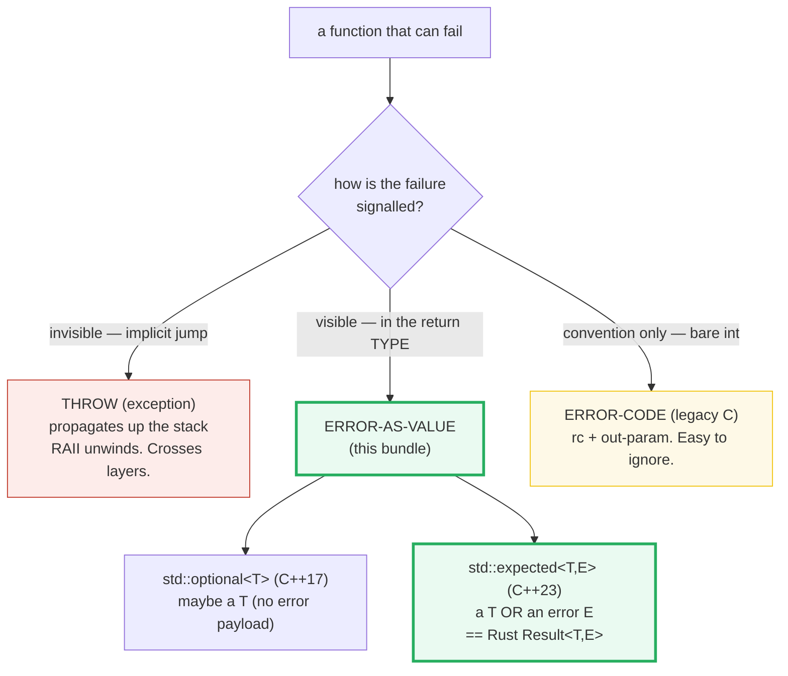
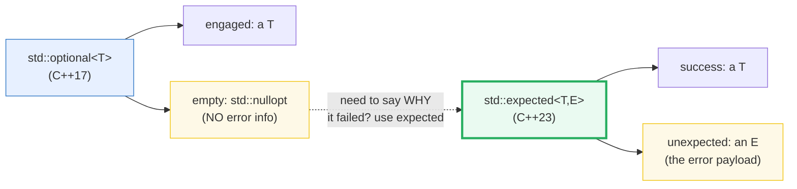
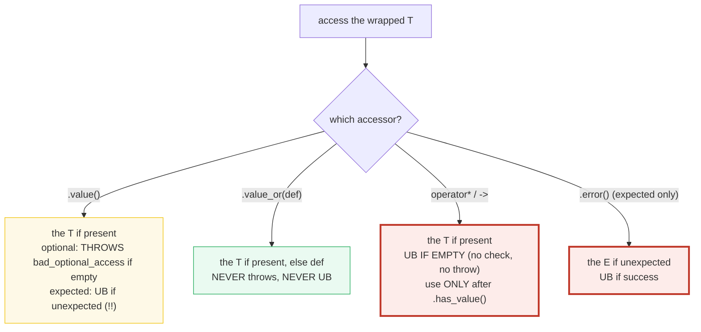

# STD_EXPECTED_OPTIONAL — `std::optional` & `std::expected` (the error-as-value style)

> **Goal (one line):** by printing every value, show how `std::optional<T>`
> ("maybe a `T`") and `std::expected<T,E>` (C++23, "a `T` **or** an error `E`")
> behave — the checked accessors (`.value()`/`.value_or()`/`.error()`), the
> **UB of `*opt` on an empty optional and of `.value()` on an unexpected
> expected** (documented, never executed in the verified path), the C++23
> monadic ops (`.and_then`/`.transform`/`.or_else`), and how `expected` is the
> **Rust `Result<T,E>` + `?`** / **Go `(T, error)`** analog — error-as-value,
> visible in the signature, no hidden control flow.
>
> **Run:** `just run std_expected_optional`
>
> **Ground truth:** [`std_expected_optional.cpp`](./std_expected_optional.cpp) →
> captured stdout in
> [`std_expected_optional_output.txt`](./std_expected_optional_output.txt).
> Every number/table below is pasted **verbatim** from that file under a
> `> From std_expected_optional.cpp Section X:` callout. Nothing is
> hand-computed.
>
> **Prerequisites:** 🔗 `ERRORS_EXCEPTIONS_INTRO` (P1 — the throw/try/catch
> side of the same coin) and comfort with value-vs-reference (🔗
> `VALUE_VS_REFERENCE_VS_POINTER`). `expected`/`optional` are **value types**
> — the `T` (or `E`) is nested *inside* the wrapper object.

---

## 1. Why this bundle exists (lineage)

C++ has had **three** eras of error signalling, each adding an option without
retiring the last:

1. **Error codes (C, inherited).** Return an `int`/`bool`/`errno`; payload via
   out-params. Visible *only by convention* — the type is just `int`, so a
   caller can silently ignore it. No rich error object.
2. **Exceptions (C++).** `throw` an object; it propagates *implicitly* up the
   stack, unwinding destructors (RAII cleanup). **Invisible in the signature**
   — you cannot tell from `int parse(string)` whether it throws. Powerful for
   truly exceptional failure that crosses many layers; expensive and surprising
   when overused.
3. **`std::optional` (C++17) and `std::expected` (C++23).** The **error-as-value
   style**: the function *returns* either a value or an error/empty. The
   failure mode is **in the type, in the signature**. No control-flow jump; the
   caller is forced to *look* at the result to read the `T`. This is the model
   Rust built its entire error story on (`Result<T,E>` + `?`) and the model Go
   chose from day one (`(T, error)`).



The headline contrast across the 5-language curriculum:

| Language | "maybe a value" | "a value OR an error" | Enforcement |
|---|---|---|---|
| **C++** (this bundle) | `std::optional<T>` (C++17) | `std::expected<T,E>` (C++23) | **trust** — UB if you lie (`*empty`, `.value()` on unexpected) |
| 🔗 [`../rust/ERROR_HANDLING.md`](../rust/ERROR_HANDLING.md) | `Option<T>` | `Result<T,E>` + `?` | **compile time** — you cannot read `Ok(T)` without matching |
| 🔗 [`../go/ERRORS.md`](../go/ERRORS.md) | (idiom: pointer / `ok` bool) | `(T, error)` return | **trust** — but `err` is right there in your face |
| 🔗 [`../ts/`](../ts/) | `T \| null \| undefined` | (no `Result` in std; throw-based) | runtime — exceptions |

C++ is the only language here that gives you the typed `Result`-like tool
**and** makes misusing it **undefined behavior**. That is the expert trap this
bundle pins.

> From cppreference — *`std::optional`*: "The class template `std::optional`
> manages an optional contained value, i.e. a value that may or may not be
> present." From *`std::expected`*: "The class template `std::expected` provides
> a way to represent either of two values: an expected value of type `T`, or an
> unexpected value of type `E`."

---

## 2. The mental model: two wrappers, one decision

Both wrappers answer "what does this return type mean when the happy path
fails?" — but they carry different information:



- **`optional<T>`** = "maybe a `T`." Use when failure has **no interesting
  explanation** (a lookup miss, an absent setting). The empty state is a single
  sentinel — `std::nullopt`.
- **`expected<T,E>`** = "a `T`, **or** an error `E` explaining why not." Use
  when failure **carries information** (a parse error message, an I/O errno, a
  structured error code). `E` is your payload type.

**Rule of thumb:** reach for `optional` when "no result" is uninteresting;
reach for `expected` the moment you'd want to `throw` a message. Both are value
types — the `T`/`E` lives *inside* the wrapper (no heap allocation, no
indirection; `sizeof(optional<T>)` ≈ `sizeof(T) + 1` flag byte, padded).



The second diagram is the whole accessor story. **Memorize the asymmetry**:
`optional.value()` *throws* on empty; `expected.value()` is *UB* on unexpected.
Both wrappers share `operator*` being UB on the empty/unexpected state.

---

## 3. Section A — `std::optional<T>`: maybe-a-value

> From `std_expected_optional.cpp` Section A:
> ```
> (1) std::optional<int> has = 42;
>     has.has_value() = true
>     (bool)has       = true   (contextual conversion)
>     has.value()     = 42   (the SAFE accessor)
>     *has            = 42   (unchecked; safe ONLY after has_value)
>     has.value_or(0) = 42   (returns the T, ignores the default)
> [check] optional<int>=42 has_value: OK
> [check] (bool)optional matches has_value: OK
> [check] optional.value() == 42: OK
> [check] operator* == .value() when engaged: OK
> [check] value_or returns the T when present: OK
> 
> (2) std::optional<int> empty;        emptied = 7; emptied = nullopt;
>     empty.has_value()  = false
>     emptied.has_value()= false   (nullopt assignment clears it)
>     empty.value_or(99) = 99   (the default, since empty)
> [check] default-constructed optional is empty: OK
> [check] nullopt assignment empties the optional: OK
> [check] value_or returns the default when empty: OK
> 
> (3) empty.value()  -> THROWS std::bad_optional_access (caught):
>     caught std::bad_optional_access: what() = "bad_optional_access"
> [check] empty.value() threw std::bad_optional_access: OK
> 
> (4) *empty  -> UNDEFINED BEHAVIOR (documented, NOT executed):
>     operator* performs NO check. The verified path uses .value()
>     (throws) or checks .has_value() first. The offending call lives
>     behind #ifdef DEMO_UB (never passed by just run/out/check/sanitize).
> [check] operator* on empty optional NOT called (UB; gated behind DEMO_UB): OK
>     (DEMO_UB not defined: the UB call is correctly omitted from this build.)
> ```

**What.** An `optional<T>` is either *engaged* (holds a `T`) or *empty*
(`std::nullopt`). Four accessors:

- `.has_value()` / the contextual `if (opt)` conversion — does it hold a `T`?
- `.value()` — the `T` if engaged; **throws `std::bad_optional_access`** if
  empty (the *safe* accessor — a catchable exception).
- `.value_or(def)` — the `T` if engaged, else `def`. **Never throws, never UB.**
- `operator*` / `operator->` — the `T` if engaged; **UB if empty.** The
  fast/unchecked path — use *only* after you have checked `.has_value()`.

**Why the two accessor flavors exist.** `.value()` does an explicit check and
throws on failure (a real branch + exception machinery). `operator*` is the
"zero-cost" path: the standard *assumes* you already checked, so it performs no
test — and like all unchecked C++ access, the penalty for being wrong is UB.
This is the same trust-the-programmer tradeoff as raw pointer dereference
versus `.at()` on a vector (🔗 `UNDEFINED_BEHAVIOR`): the fast path is unsafe,
the safe path costs a branch. Idiomatic code is `if (opt) use(*opt);` — check
once, then use the cheap operator.

**The two ways to spell "empty."** Default-construction (`std::optional<int>
empty;`) and assignment of the sentinel (`opt = std::nullopt;`) both produce an
empty optional. The bundle's `emptied = 7; emptied = std::nullopt;` proves the
second form resets a previously-engaged optional.

> From cppreference — *`std::optional::value`*: "Returns a reference to the
> contained value. … If `*this` does not contain a value, throws
> `std::bad_optional_access`." *`std::optional::operator*`*: "Returns a pointer
> to the contained value. … The behavior is **undefined** if `this->has_value()`
> is `false`."

### The trap, demonstrated (NOT in the verified path)

The offending `*empty` is gated behind `#ifdef DEMO_UB`, which `just run` /
`just out` / `just check` / `just sanitize` **never** pass, so the default and
sanitizer builds stay UB-free:

```cpp
#ifdef DEMO_UB
    int garbage = *empty;   // <-- UNDEFINED BEHAVIOR
    std::printf("[DEMO_UB] *empty = %d\n", garbage);
#endif
```

Building that block with `-DDEMO_UB` and running it printed `*empty =
-94463232` — a garbage value, meaningless and different across builds. That
meaninglessness *is* the point: under the as-if rule the compiler is entitled to
**assume no UB**, so it may delete surrounding checks, fold the read to an
arbitrary constant, or do anything else. (UBSan's `-fsanitize=undefined` is not
guaranteed to flag `optional::operator*` specifically — libc++/libstdc++ leave
it un-instrumented — but the value is unmistakably garbage. The *verified* path
is clean because the call is absent from it.)

---

## 4. Section B — `std::expected<T,E>`: a-value-OR-an-error

> From `std_expected_optional.cpp` Section B:
> ```
> (1) std::expected<int,std::string> ok = 42;
>     ok.has_value()  = true   (success)
>     ok.value()      = 42
>     *ok             = 42   (unchecked; safe only after has_value)
>     ok.value_or(0)  = 42
> [check] expected<int,string>=42 has_value (success): OK
> [check] success .value() == 42: OK
> [check] operator* == .value() on success: OK
> [check] value_or returns the T on success: OK
> 
> (2) Exp err = std::unexpected(std::string("disk full"));
>     err.has_value() = false   (failure)
>     err.error()     = "disk full"   (the E)
>     err.value_or(0) = 0   (the default; .value() would be UB here)
> [check] unexpected expected has_value() == false: OK
> [check] unexpected .error() == "disk full": OK
> [check] value_or returns the default on unexpected: OK
> 
> (3) THE TWO expected UB TRAPS (documented, NOT executed):
>     (a) err.value()  on UNEXPECTED -> UB  (expected does NOT throw;
>         contrast optional.value() which throws bad_optional_access)
>     (b) ok.error()   on SUCCESS     -> UB
>     Always check .has_value() before the unchecked accessors.
> [check] expected .value()/.error() UB traps NOT triggered (gated behind DEMO_UB): OK
>     (DEMO_UB not defined: the UB calls are correctly omitted from this build.)
> ```

**What.** An `expected<T,E>` is either *success* (holds the expected `T`) or
*unexpected* (holds the error `E`). Four accessors:

- `.has_value()` — true if success (holds a `T`), false if it holds the error.
- `.value()` — the `T` if success; **UB if unexpected.**
- `.error()` — the `E` if unexpected; **UB if success.**
- `.value_or(def)` — the `T` if success, else `def`. Safe.
- `operator*` — the `T` if success; **UB if unexpected.**

**Why `std::unexpected(e)` is mandatory to build the error half.** Constructing
an `expected<T,E>` from a bare `E` would be ambiguous when `T == E` (is
`expected<int,int>{7}` a success holding `7`, or an error holding `7`?). The
`std::unexpected(e)` wrapper selects the error half unambiguously: `expected =
std::unexpected(7)` is *always* the error. (It is the direct analog of Rust's
`Err(7)` constructor — see Section E.)

**THE expert payoff — `expected` and `optional` differ on `.value()` failure.**
This is the single most important asymmetry in the pair, and the bundle pins it
in Section B (3):

| Accessor on the "bad" state | `std::optional` | `std::expected` |
|---|---|---|
| `.value()` on empty / unexpected | **throws** `std::bad_optional_access` | **UB** (no throw!) |
| `operator*` on empty / unexpected | UB | UB |
| `.error()` on success | n/a | **UB** |

`optional` was designed (C++17) with a throwing checked accessor; `expected`
(C++23) was standardized *without* one — its `.value()` is unchecked UB on the
unexpected state, matching `operator*`. The lesson: **never call `.value()` on
an `expected` without first checking `.has_value()`** (or use the monadic ops of
Section C, which encode the check for you). The `bad_optional_access` safety net
does *not* exist for `expected`.

> From cppreference — *`std::expected::value`*: "If `*this` contains an expected
> value, returns a reference to the contained value. … The behavior is
> **undefined** if `this->has_value()` is `false`." *`std::expected::error`*:
> "Returns the unexpected value. … The behavior is **undefined** if
> `this->has_value()` is `true`." Contrast *`std::optional::value`*: "If
> `*this` does not contain a value, **throws `std::bad_optional_access`**."

### The two traps, demonstrated (NOT in the verified path)

Both UB calls are gated behind `#ifdef DEMO_UB`:

```cpp
#ifdef DEMO_UB
    int v = err.value();          // <-- UB: .value() on an unexpected expected
    std::string e = ok.error();   // <-- UB: .error() on a success expected
#endif
```

The verified path always checks `.has_value()` before reading either half —
exactly the discipline Rust enforces at compile time via `match` / `let Ok(x)`.

---

## 5. Section C — Monadic ops (C++23) & the error-as-value return

> From `std_expected_optional.cpp` Section C:
> ```
> --- optional monadic ops ---
> o = 5;
>     o.transform(x*2)                  = 10
>     optional<int>{}.transform(x*2)    = (empty)   (empty propagates)
>     optional{7}.and_then(+10).transform(*3) = 51
>     optional<int>{}.or_else(=>99)        = 99   (recovered)
> [check] optional transform engaged = 10: OK
> [check] optional transform on empty propagates empty: OK
> [check] optional and_then+transform chain = (7+10)*3 = 51: OK
> [check] optional or_else recovered empty to 99: OK
> 
> --- expected monadic ops (the Rust Result pipeline) ---
>     safe_div(20,4).and_then(add_one).transform(*10)
>         -> has_value=true, value=60
>     safe_div(20,0).and_then(add_one).transform(*10)
>         -> has_value=false, error=ZeroDivisor (pipeline short-circuited)
> [check] expected pipeline success: 20/4=5, +1=6, *10=60: OK
> [check] expected pipeline short-circuits on error (no add_one, no *10): OK
> 
> --- the error-as-value return style (no throw; error in signature) ---
>     safe_div(100,5) -> has_value=true, value=20
>     safe_div(100,0) -> has_value=false, error=ZeroDivisor
> [check] safe_div(100,5) == 20 (success path): OK
> [check] safe_div(100,0) is an error (no throw; caller inspects .error()): OK
> ```

**What — the three monadic ops (C++23), identical names on both wrappers:**

- **`.and_then(f)`** — *flat-map.* `f: T → optional<U>` (or `→ expected<U,E>`).
  If engaged/success, calls `f` on the value and returns its result; if
  empty/unexpected, **propagates** the empty/error unchanged. This is the
  chaining primitive (each `f` may itself fail).
- **`.transform(f)`** — *map.* `f: T → U`. If engaged/success, wraps `f(value)`
  in a new optional/expected; else propagates. `f` cannot fail. (This is Rust's
  `.map` on `Result`/`Option`.)
- **`.or_else(f)`** — *recovery.* `f: empty/error → optional<T>` (or `→
  expected<T,F>`). If **not** engaged, calls `f` to try to produce a value; if
  already engaged, returns itself unchanged.

**Why this matters — killing the `if`-ladder.** Without monadic ops, chaining
two fallible steps reads as nested branches:

```cpp
// Pre-C++23: explicit ladder of checks
auto r1 = step1();
if (!r1) return r1;
auto r2 = step2(*r1);
if (!r2) return r2;
use(*r2);
```

With `.and_then`, the same logic is a one-liner — and the error short-circuits
automatically, exactly like Rust's `?`:

```cpp
// C++23: the check is encoded in the type; the error propagates for free
step1().and_then(step2).transform(use);
```

The bundle's `safe_div(20,4).and_then(add_one).transform(*10)` evaluates to
`60`; `safe_div(20,0).and_then(add_one).transform(*10)` short-circuits at the
first step to `ZeroDivisor` — `add_one` and `*10` never run. That
short-circuit *is* the `?` semantics.

**The error-as-value return style.** `safe_div` returns
`std::expected<int, DivErr>`:

```cpp
std::expected<int, DivErr> safe_div(int a, int b) {
    if (b == 0) return std::unexpected(DivErr::ZeroDivisor);
    return a / b;
}
```

There is **no `throw`**. The signature *tells* the caller this can fail and
*what* the error type is. The caller cannot accidentally ignore it the way they
can an `int` error code (the return type is `expected`, not `int` — you must
engage it to read the value). This is the C++23 embodiment of the Rust
`Result<T,E>` / Go `(T, error)` philosophy.

> From cppreference — *`std::optional::and_then`* (C++23): "returns the result
> of the given function on the contained value if it exists, or an empty
> optional otherwise." *`std::expected::and_then`*: "returns the result of
> `f` if `*this` contains an expected value, otherwise an `expected` constructed
> from the unexpected value." Feature-test macro `__cpp_lib_optional == 202110L`
> (monadic) and `__cpp_lib_expected >= 202211L`.

---

## 6. Section D — throw vs expected vs error-code (the decision)

> From `std_expected_optional.cpp` Section D:
> ```
> (a) THROW style  (invisible in signature; implicit propagation):
>     parse_throw("42")  = 42   (success)
>     parse_throw("no")  -> caught runtime_error: "not 42"
> [check] throw style: success returns 42: OK
> [check] throw style: failure throws a catchable runtime_error: OK
> 
> (b) EXPECTED style (visible in signature; caller MUST inspect):
>     parse_expected("42") -> has_value=true, value=42
>     parse_expected("no") -> has_value=false, error="not 42"
> [check] expected style: success has_value == true and == 42: OK
> [check] expected style: failure carries the error payload (no throw): OK
> 
> (c) ERROR-CODE style (legacy C; type is just int; easy to ignore):
>     parse_errcode("42",out) -> rc=0, out=42   (rc 0 == ok)
>     parse_errcode("no", out) -> rc=2        (rc 2 == not-42; payload via out)
> [check] error-code style: rc==0 on success and out==42: OK
> [check] error-code style: rc!=0 on failure (caller MUST check rc, not out): OK
> 
> DECISION RULE (no single right answer):
>   - THROW      for truly exceptional failure crossing many layers the
>                immediate caller cannot handle (RAII unwinds cleanup).
>   - EXPECTED   for recoverable failure visible in the signature; the
>                caller usually knows what to do (parse, lookup, I/O).
>   - ERROR-CODE for legacy C interop / tiny bool-ish success flags.
> [check] all three styles exercised on the same operation: OK
> ```

The bundle implements the *same* operation ("parse `\"42\"`") three ways and
exercises both the success and failure path of each, so the contracts can be
compared directly:

| Style | Signature | Failure is… | Payload? | Best for |
|---|---|---|---|---|
| **throw** | `int parse(string)` (no hint) | invisible — implicit jump up the stack | yes (the exception object) | truly exceptional failure; propagation across many layers the immediate caller can't handle |
| **expected** | `expected<int,string> parse(string)` | **in the type** — caller must inspect | yes (the `E`) | recoverable failure; the immediate caller knows what to do (parse, lookup, I/O) |
| **error-code** | `int parse(string, int& out)` | **convention only** — `int` return | rarely (out-param) | legacy C interop; tiny bool-ish flags |

**The decision rule (no single right answer):**

- **THROW** when failure is *truly exceptional* and the immediate caller usually
  *cannot* handle it — let it propagate across layers; RAII destructors unwind
  and clean up along the way (🔗 `RAII`, 🔗 `ERRORS_EXCEPTIONS_INTRO`).
- **EXPECTED** when failure is *recoverable* and the immediate caller usually
  *does* know what to do — the parser that retries, the lookup that falls back,
  the I/O layer that reports to the user. The error is in the signature; the
  caller is forced to look.
- **ERROR-CODE** when interfacing with **legacy C** APIs, or for a tiny
  bool-ish success flag where a full `expected` is overkill.

**Mix them deliberately.** A common modern pattern: `expected` at API
boundaries (parsing, config, I/O) where callers want to recover, transitioning
to `throw` (or `std::terminate`) only for the truly invariant-violating,
unrecoverable case. The two styles coexist — `expected` does not replace
exceptions; it removes the cases where exceptions were being misused as ordinary
control flow.

> From isocpp.org — *P0323 `std::expected`* (the C++23 proposal): "We propose a
> `std::expected<T,E>` type … to make the error handling explicit in the return
> type. … This is an alternative to exceptions for recoverable errors, where the
> cost or visibility of exceptions is a concern." And from the Rust book —
> *"Recoverable Errors with Result"*: "`Result` makes the error handling
> explicit … the caller must handle the possibility of error."

---

## 7. Section E — `expected` IS Rust `Result` (the cross-language pivot)

> From `std_expected_optional.cpp` Section E:
> ```
> Rust `?`-style pipeline in C++23 (safe_div(seed,2).and_then(add_one)):
>     pipeline(10) -> has_value=true, value=6   (== Rust Ok(6))
>     pipeline(0)  -> has_value=true, value=1   (0/2=0, +1=1; still Ok)
>     safe_div(10,0).and_then(add_one) -> has_value=false, error=ZeroDivisor
>         (== Rust: the `?` short-circuits on Err, returning Err early)
> 
> Cross-language alignment (expected <-> Result <-> (T,error)):
>     C++23 std::optional<T>      ==  Rust Option<T>   (Some|None)
>     C++23 std::expected<T,E>    ==  Rust Result<T,E> (Ok|Err) + `?`
>     Go (T, error)               ==  same error-as-value idea, runtime-only
>     ENFORCEMENT: Rust = compile time; C++/Go = trust (+UB if you lie in C++)
> [check] pipeline(10) == Ok(6): OK
> [check] pipeline(0) succeeds (0/2=0, +1=1): OK
> [check] error short-circuits the .and_then chain (== Rust ?): OK
> ```

**The headline cross-language alignment.** The error-as-value model is one idea
expressed three ways, and `std::expected` is C++ finally adopting it:

| Concept | C++23 | Rust | Go |
|---|---|---|---|
| maybe a value | `std::optional<T>` | `Option<T>` (`Some`/`None`) | (idiom: `*T` + nil check) |
| value **or** error | `std::expected<T,E>` | `Result<T,E>` (`Ok`/`Err`) | `(T, error)` return |
| build the error half | `std::unexpected(e)` | `Err(e)` | `errors.New(...)` |
| propagate on error | `.and_then` (manual) | **`?`** operator | `if err != nil { return }` |
| map success | `.transform(f)` | `.map(f)` | (manual) |
| **enforcement** | **trust** (+ UB if you lie) | **compile time** (must match) | trust (but `err` is visible) |

**The Rust `?` operator, in C++23.** Rust's `fn f() -> Result<_, E> { let x =
step1()?; let y = step2(x)?; Ok(y) }` propagates an `Err` early, automatically.
The C++23 equivalent is `.and_then` chaining — the bundle's `pipeline`:

```cpp
auto pipeline = [](int seed) -> std::expected<int, DivErr> {
    return safe_div(seed, 2)       // step1 (may fail)
               .and_then(add_one); // step2 (may fail)  — error short-circuits
};
```

`pipeline(10)` succeeds (`Ok(6)`); the explicit `safe_div(10,0).and_then(...)`
short-circuits to `ZeroDivisor`, mirroring `?` on `Err`. The semantics line up
exactly; only the spelling differs (C++ has no single-char `?` sugar — you
spell the chain, or write the `if (!r) return r;` ladder).

**The enforcement axis (the real difference).** Rust **forces** handling at
compile time: you cannot read `Ok(x)` without a `match` or `let Ok(x) = ...`,
and `?` makes propagation explicit in the source. C++ and Go **trust** you —
C++ to the point of UB if you call `.value()` on an unexpected, Go to the point
of silently proceeding with a zero-valued `T` if you ignore `err`. This is the
same trust-vs-enforce axis as C++ vs Rust on *memory* (no GC + UB vs the borrow
checker): both languages give you the typed tool; only Rust refuses to compile
your misuse.

> From the Rust Reference — *Error handling*: "`Result<T, E>` is the type used
> for returning and propagating errors. … The `?` operator … if the value is an
> `Err`, returns it early." From the Go Tour — *Errors*: "In Go it is idiomatic
> to return errors explicitly. … `if err != nil`."

---

## 8. Worked smallest-scale example

The whole bundle, compressed to the lines a beginner must memorize:

```cpp
// optional: maybe a T  -------------------------------------------------------
std::optional<int> find(int x) {
    return x == 42 ? std::optional<int>{99} : std::nullopt;
}
if (auto r = find(42)) {           // contextual bool — engaged?
    use(*r);                       // safe: we just checked
} else {
    recover();                     // empty — no payload
}
auto v = find(7).value_or(0);      // 0  (.value_or never throws/UB)

// expected: a T or an error E  ----------------------------------------------
std::expected<int, std::string> parse(std::string s) {
    if (s.empty()) return std::unexpected("empty"s);
    if (s == "42")  return 42;
    return std::unexpected("not 42"s);
}
auto r = parse("42");
if (r.has_value()) use(r.value());   // success
else               log(r.error());   // the E — "not 42"

// chain (C++23 monadic) — the Rust ? pipeline, in C++:
auto out = step1().and_then(step2).transform(*10);   // error short-circuits
```

> From Sections A–C, `.value_or` never throws/UB (the always-safe accessor);
> `.value()` throws on empty `optional` but is **UB** on unexpected `expected`;
> `operator*` is UB on either bad state without a `.has_value()` check.

---

## 9. The value-vs-reference-vs-pointer axis

Both wrappers are **value types** — the `T`/`E` is nested inside the wrapper
object (no heap, no indirection). Where do they sit on the C++ teaching axis?

| Construct | Copied? | Aliases? | Owns? |
|---|---|---|---|
| `optional<int> o = 42;` | **yes** (the `int` lives *inside* `o`) | no | yes (its own storage) |
| `expected<int,string> e = 42;` | **yes** (either the `int` or the `string` is inside `e`) | no | yes |
| `optional<T>` by value (return / param) | **deep copy** of the engaged `T` | no | yes |
| `optional<T>` / `expected<T,E>` by `const &` (param) | no | **yes** | no (borrows) |
| `*opt` / `opt.value()` | returns a **reference** to the nested `T` (lvalue) | the result aliases the nested `T` | no |

**Return by value, pass by `const&`.** Returning `optional<T>` / `expected<T,E>`
*by value* is the idiom — the wrapper is a small value (≈ `sizeof(T)` + flag),
and (since C++17) eligible for NRVO/copy elision so there is no copy of the `T`
on the happy path (🔗 `MOVE_SEMANTICS`). Passing one *into* a function that only
reads: take `const optional<T>&` / `const expected<T,E>&` to avoid copying the
(possibly large) `T`. `operator*` and `.value()` return *references* into the
wrapper's storage, so `auto x = *opt;` copies the `T` out while `auto& x =
*opt;` aliases it — the usual `auto` copy-vs-`auto&` fork (🔗 `VALUES_TYPES`
Section E).

---

## 10. Pitfalls (the expert payoff)

| Trap | Symptom | Fix |
|---|---|---|
| `*opt` on an **empty** `optional` | **undefined behavior** — garbage value, deleted checks, miscompilation | Check `.has_value()` first, or use `.value()` (throws) / `.value_or(def)`. Never call `operator*` blind. |
| `opt.value()` on **empty** `optional` | **throws** `std::bad_optional_access` (not UB, but a surprise if uncaught) | Check first, catch, or use `.value_or()`. |
| `exp.value()` on an **unexpected** `expected` | **undefined behavior** (expected does **not** throw here — unlike optional!) | **Always** check `.has_value()` before `.value()`; prefer the monadic `.and_then`/`.transform` which encode the check. |
| `exp.error()` on a **success** `expected` | **undefined behavior** | Guard with `.has_value()` first; `.error()` is only valid in the `!has_value()` branch. |
| `expected<T,E>{e}` when `T == E` | Ambiguous construction — did you mean success or error? | Wrap the error: `std::unexpected(e)` selects the error half unambiguously. |
| Forgetting `std::unexpected(...)` for the error | Compile error (or worse, a success holding an `E`) | `return std::unexpected(my_error);` — never a bare `E`. |
| `if (opt) ... else { use(*opt); }` | **UB** — `*opt` in the `else` branch dereferences an empty optional | Move the use into the `if` branch (where `opt` is engaged). |
| Using `expected` for *truly exceptional* failure | Verbose `if (!r) return r;` ladders everywhere for unrecoverable conditions | Throw instead (🔗 `ERRORS_EXCEPTIONS_INTRO`); reserve `expected` for recoverable failure. |
| Ignoring a returned `expected` (not checking) | Silent wrong behavior — read a garbage `T` (UB) or proceed as if success | Treat an unchecked `expected` as a bug; enable `-Wunused-result` / `[[nodiscard]]` on your returning functions. |
| `auto x = opt_or_exp.value();` copying a heavy `T` | Unnecessary deep copy (`.value()` returns a reference) | Use `const auto& x = ...value();` to alias; or `std::move(opt).value()` to move out (engaged only). |
| Assuming `optional`/`expected` are pointer-sized | They hold the `T`/`E` *inline* — `sizeof ≈ sizeof(T) + 1` (padded) | Don't pass them by value if `T` is large; use `const&` for params. |
| Mixing `optional` and `expected` in one pipeline | Type mismatch — `optional.and_then` returns `optional`, `expected.and_then` returns `expected` | Pick one wrapper per pipeline, or convert at the boundary (`opt | and_then -> expected` via a lifting lambda). |
| `expected<void, E>` has **no** `.and_then` returning `expected<U,E>` cleanly | Some monadic combinations don't type-check on the void-success case | Restructure, or chain through `transform` first; see cppreference's `expected<void,E>` notes. |

---

## 11. Cheat sheet

```cpp
#include <optional>   // std::optional, std::nullopt, std::bad_optional_access
#include <expected>   // std::expected, std::unexpected  (C++23)

// ── std::optional<T>  (C++17): maybe a T  ─────────────────────────────────
std::optional<int> o;                       // empty
std::optional<int> e = 42;                  // engaged
std::optional<int> n = std::nullopt;        // empty (the sentinel)
o.has_value();    (bool)o;                  // engaged?  (contextual conversion)
o.value();        // THROWS std::bad_optional_access if empty (the SAFE accessor)
*o;  o->...;      // UB IF EMPTY — only after has_value()
o.value_or(def);  // the T if engaged, else def   (never throws, never UB)
o.reset();        // empty it
o.emplace(args);  // construct a T in place, engage

// C++23 monadic:
o.and_then(f);    // f: T -> optional<U>   flat-map (chain); empty propagates
o.transform(f);   // f: T -> U             map; empty propagates
o.or_else(f);     // f: nullopt_t -> optional<T>   recovery

// ── std::expected<T,E>  (C++23): a T OR an error E  ───────────────────────
std::expected<int, std::string> ok = 42;                       // success
std::expected<int, std::string> err = std::unexpected("e"s);   // ERROR half
exp.has_value();  // true == success (holds T), false == holds E
exp.value();      // UB IF UNEXPECTED (expected does NOT throw — unlike optional!)
exp.error();      // the E; UB IF SUCCESS
*exp;             // the T; UB IF UNEXPECTED
exp.value_or(d);  // the T if success, else d
// monadic (C++23): same names as optional
exp.and_then(f);  // f: T -> expected<U,E>   flat-map; error propagates (== Rust ?)
exp.transform(f); // f: T -> U                map; error propagates (== Rust .map)
exp.or_else(f);   // f: E -> expected<T,F>    recovery

// ── the error-as-value function style (no throw)  ─────────────────────────
std::expected<int, DivErr> safe_div(int a, int b) {
    if (b == 0) return std::unexpected(DivErr::ZeroDivisor);
    return a / b;
}
// caller MUST inspect — the type forces it:
if (auto r = safe_div(a, b); r.has_value()) use(r.value());
else                            log(r.error());
// or chain (the Rust ? pipeline, in C++):
safe_div(a,b).and_then(add_one).transform(*10);

// ── the decision  ─────────────────────────────────────────────────────────
// THROW      — truly exceptional, crosses layers, caller can't recover (RAII unwinds)
// EXPECTED   — recoverable, visible in signature, immediate caller handles it
// ERROR-CODE — legacy C interop / tiny bool flag (convention-only, easy to ignore)
```

---

## 12. 🔗 Cross-references

**Within C++ (the expertise spine):**

- 🔗 `ERRORS_EXCEPTIONS_INTRO` (P1) — the **throw/try/catch** side of the same
  coin. `expected` does not replace exceptions; it removes the cases where
  exceptions were being misused as ordinary control flow. The two coexist.
- 🔗 `EXCEPTIONS_DEEP` (P7 — the throw alternative) — `noexcept`, the
  `std::terminate` contract, exception-safety guarantees, and the cost model
  that decides "throw vs `expected`" at the expert level.
- 🔗 `UNDEFINED_BEHAVIOR` (P7) — the `*empty` / `.value()`-on-unexpected traps
  here are instances of the general "unchecked access is UB" pattern
  (`vector::operator[]` vs `.at()`, raw pointer deref). Demonstrated under
  ASan/UBSan there.
- 🔗 `RAII` (P2) — why `throw` is *safe* despite the jump: destructors unwind.
  `expected` gives you the explicit error path *without* needing unwinding.
- 🔗 `MOVE_SEMANTICS` (P3) — `optional<T>`/`expected<T,E>` are value types;
  returning them by value is free under NRVO, and `std::move(opt).value()`
  moves the `T` out (engaged only).
- 🔗 `VALUES_TYPES` Section E (P1) — the `auto` copy-vs-`auto&` fork, which
  applies directly to `*opt` (reference into the wrapper).

**Cross-language parallels (the 5-language curriculum):**

- 🔗 [`../rust/ERROR_HANDLING.md`](../rust/ERROR_HANDLING.md) — **THE headline
  sibling.** Rust `Result<T,E>` + `?` is the closest analogue: `std::expected`
  *is* C++'s `Result`. The difference is enforcement — Rust **forces** handling
  at compile time (you cannot read `Ok(x)` without a `match`); C++ **trusts**
  you and pays in UB if you call `.value()` on an unexpected. `Option<T>` ↔
  `std::optional<T>` is the same pairing for the maybe-a-value case.
- 🔗 [`../go/ERRORS.md`](../go/ERRORS.md) — Go's `(T, error)` multiple return
  is the **same error-as-value philosophy** `expected` brings to C++: the error
  is a value, returned alongside the result, visible at the call site. Go's
  enforcement is also "trust" (you *can* ignore `err`), but the `if err != nil`
  idiom keeps it in your face; C++ makes ignoring an `expected` UB-prone.
- 🔗 [`../ts/`](../ts/) — TypeScript has **no `Result` type in the standard
  library**; it is throw-based (exceptions) plus ad-hoc `T | null | undefined`.
  `std::expected` is the typed-error model TS lacks in std (libraries like
  `fp-ts` `Either` fill the gap).

---

## Sources

Every signature, value, and behavioral claim above was verified against
cppreference and the ISO C++ standard, then corroborated by ≥1 independent
secondary source:

- cppreference — *`std::optional`* (the class template; "manages an optional
  contained value"; nested value models an object not a pointer; the four
  accessors; `nullopt_t`/`in_place_t` cannot be the contained type):
  https://en.cppreference.com/w/cpp/utility/optional
  - *`std::optional::value`*: "If `*this` does not contain a value, **throws
    `std::bad_optional_access`**":
    https://en.cppreference.com/w/cpp/utility/optional/value
  - *`std::optional::operator*`* / *`operator->`*: "The behavior is
    **undefined** if `this->has_value()` is `false`":
    https://en.cppreference.com/w/cpp/utility/optional/operator*
  - *`std::optional::and_then`/`transform`/`or_else`* (C++23 monadic ops);
    feature-test `__cpp_lib_optional == 202110L`:
    https://en.cppreference.com/w/cpp/utility/optional/and_then
  - *`std::bad_optional_access`* (the exception thrown by `.value()`):
    https://en.cppreference.com/w/cpp/utility/optional/bad_optional_access
- cppreference — *`std::expected<T,E>`* (C++23; "either of two values: an
  expected value of type `T`, or an unexpected value of type `E`"):
  https://en.cppreference.com/w/cpp/utility/expected
  - *`std::expected::value`*: "The behavior is **undefined** if
    `this->has_value()` is `false`" (expected does **not** throw — the
    asymmetry with optional):
    https://en.cppreference.com/w/cpp/utility/expected/value
  - *`std::expected::error`*: "The behavior is **undefined** if
    `this->has_value()` is `true`":
    https://en.cppreference.com/w/cpp/utility/expected/error
  - *`std::expected::operator*`*: "the behavior is undefined if
    `this->has_value()` is `false`" (C++26 hardened-contract note):
    https://en.cppreference.com/w/cpp/utility/expected/operator*
  - *`std::expected::and_then`/`transform`/`or_else`* (C++23 monadic ops);
    feature-test `__cpp_lib_expected >= 202211L`:
    https://en.cppreference.com/w/cpp/utility/expected/and_then
  - *`std::unexpected`* (the error-half constructor wrapper):
    https://en.cppreference.com/w/cpp/utility/expected/unexpected
- ISO C++23 proposal — *P0323R12 `std::expected`* (T. Doustny / J. Lamprecht /
  V. Romeo; the rationale for an error-as-value type alongside exceptions):
  https://www.open-std.org/jtc1/sc22/wg21/docs/papers/2022/p0323r12.html
- ISO C++23 — feature-test macros (`__cpp_lib_expected`, `__cpp_lib_optional`)
  and the C++23 library feature list:
  https://en.cppreference.com/w/cpp/23
- Rust Reference — *Error handling* (`Result<T,E>`; the `?` operator
  short-circuits on `Err`):
  https://doc.rust-lang.org/reference/expressions/operator-expr.html#the-question-mark-operator
  - The Rust Book — *Recoverable Errors with `Result`* ("`Result` makes the
    error handling explicit"):
    https://doc.rust-lang.org/book/ch09-02-recoverable-errors-with-result.html
- A Tour of Go — *Errors* (Go's `(T, error)` return; `if err != nil`):
  https://go.dev/tour/methods/19
  - Go Blog — *Error handling and Go*:
    https://go.dev/blog/error-handling-and-go
- Secondary corroboration (≥2 independent sources, web-verified) for the
  UB-on-empty/unexpected claims and the optional-vs-expected asymmetry:
  - Stack Overflow — *"Why does `operator->` in `std::optional` result in a UB
    when `*this` is not valid?"* (operator*/operator-> are UB on an empty
    optional; `.value()` throws instead):
    https://stackoverflow.com/questions/77644824/
  - 3d-logic.com — *"std::optional? Proceed with caution!"* ("the behavior is
    undefined if you dereference an optional whose value was not set"):
    https://blog.3d-logic.com/2023/10/01/stdoptional-proceed-with-caution/
  - C++ Stories — *"Using `std::expected` from C++23"* (the `std::unexpected`
    wrapper; monadic `.and_then`/`.transform`/`.or_else`):
    https://www.cppstories.com/2024/expected-cpp23/
  - Modernes C++ — *"C++23: A New Way of Error Handling with `std::expected`"*
    (expected as the typed-error alternative to exceptions):
    https://www.modernescpp.com/index.php/c23-a-new-way-of-error-handling-with-stdexpected/

**Facts that could not be verified by running** (documented, not executed,
because they are UB by design or compile-time constraints): the actual value of
`*empty` on an empty optional and of `.value()` on an unexpected `expected`
(both UB — meaninglessly varies across builds; gated behind `#ifdef DEMO_UB`,
so the default and sanitizer builds stay clean); and the compile-error
constructions (`expected<T,T>{val}` ambiguity without `std::unexpected`, and
`optional<T&>` / `optional<void>` which are ill-formed — no references,
functions, arrays, or `void`). These are confirmed by the cppreference sections
and secondary sources above, not reproduced as runnable output in the verified
path (a file triggering them would fail `just check` / `just sanitize`).
