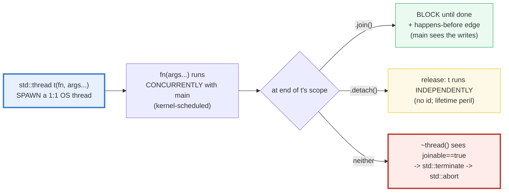
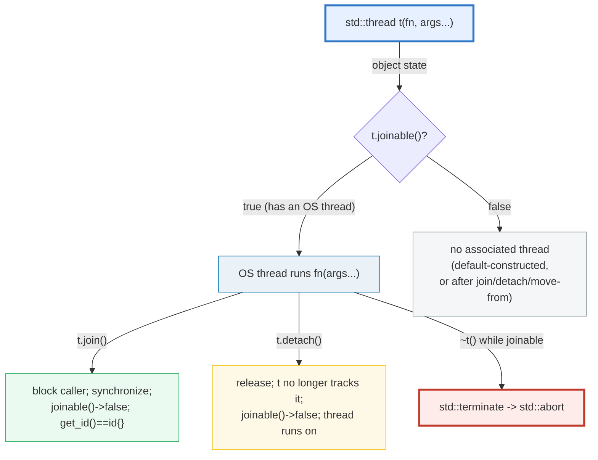
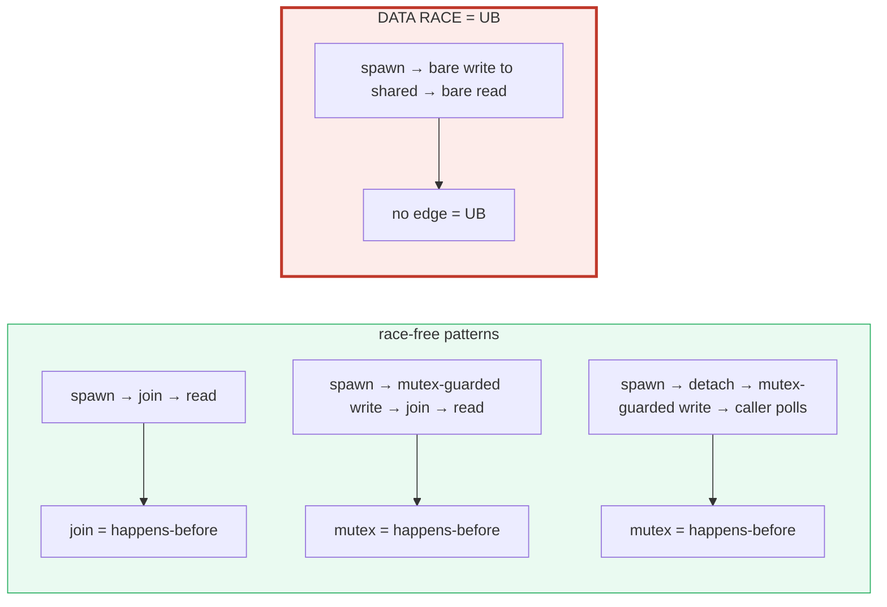

# STD_THREAD — `std::thread`, `join`/`detach`, Passing Args & the destruct-terminate trap

> **Goal (one line):** by **collecting every result into a mutex-protected
> container and printing from `main` after all threads `join`**, show how
> `std::thread` spawns a **1:1 OS thread**, how `join()`/`detach()` manage its
> lifetime, how arguments are **decayed + moved** (`std::ref` for references), and
> how a joinable thread destroyed without join/detach **calls `std::terminate`** —
> pinning the **data-race-is-UB** link as a documented preview
> (🔗 `ATOMICS_MEMORY_ORDER` owns the deep dive).
>
> **Run:** `just run std_thread`
>
> **Ground truth:** [`std_thread.cpp`](./std_thread.cpp) → captured stdout in
> [`std_thread_output.txt`](./std_thread_output.txt). Every value/table below is
> pasted **verbatim** from that file under a `> From std_thread.cpp Section X:`
> callout. Nothing is hand-computed.
>
> **Prerequisites:** 🔗 `RAII` (destruction semantics; `std::jthread` is the RAII
> thread), 🔗 `REFERENCES_POINTERS_INTRO` (`std::ref` is a reference wrapper),
> 🔗 `MOVE_SEMANTICS` (args are moved into the thread). This is **Phase 4 bundle
> #1** — the entry point to the concurrency memory model.

---

## 1. Why this bundle exists (lineage)

`std::thread` (C++11) is the **lowest-level** concurrency primitive in the
standard library: it runs a function on a **new OS thread** (a **1:1, kernel-
scheduled** thread — unlike Go's **M:N** goroutines). You spawn with
`std::thread t(fn, args...)`, then **either** `.join()` (block until it finishes)
**or** `.detach()` (let it run independently). A thread that is **neither** joined
nor detached before its object is destroyed **calls `std::terminate` → `std::abort`**
— no exception, no recovery.



The headline contrast across the 5-language curriculum:

| Language | Thread model | Spawn cost | Sharing safety |
|---|---|---|---|
| **C++** (this bundle) | **1:1 OS thread** (`std::thread`) | **~MB** stack, syscall | **you** sync (mutex/atomic); a race is **UB** |
| 🔗 [`../go/GOROUTINES.md`](../go/GOROUTINES.md) | **M:N** goroutines on a runtime | **~KB**, user-scheduled | **channels** ("share memory by communicating") |
| 🔗 [`../rust/THREADS.md`](../rust/THREADS.md) | **1:1 OS thread** (identical mechanism) | ~MB stack | **`Send`/`Sync`** auto-traits **prove** thread-safety at **compile time** |
| 🔗 [`../ts/WORKER_THREADS.md`](../ts/WORKER_THREADS.md) | separate V8 isolate per worker | ~MB | `postMessage` (copied, no shared heap) |

C++ and Rust use the **same** 1:1 OS-thread mechanism — but Rust **rejects** a
data-racing program at compile time via `Send`/`Sync`, while C++ **trusts you**
and pays in **undefined behavior** if you get it wrong. That trust is the whole
shape of Phase 4.

> From cppreference — *`std::thread`*: "The class `thread` represents a **single
> thread of execution**. Threads allow multiple functions to execute
> **concurrently**." … "The **return value** of the top-level function is
> **ignored** and if it terminates by throwing an exception, `std::terminate` is
> called." It is **move-only** ("not `CopyConstructible` or `CopyAssignable`").

---

## 2. The mental model: spawn → run concurrently → join

`std::thread` is an **RAII handle** over an OS thread. Three lifetimes matter:



The **single most important fact** in the diagram: `join()` does **two** things at
once — it **blocks** the caller **and** it establishes a **happens-before edge**
between the thread's writes and the caller's subsequent reads. That edge is what
makes the read after `join` race-free even though it touches memory the worker
wrote. `detach()` does **not** give you that edge — you must supply your own
synchronization (a mutex, an atomic, a future) to talk to a detached thread.



> From cppreference — *`std::thread::~thread`*: "If `*this` has an associated
> thread (`joinable() == true`), `std::terminate()` is called." *`std::thread::join`*:
   "Blocks the current thread until the thread identified by `*this` finishes its
   execution." *`std::thread::detach`*: "Separates the thread of execution from the
   thread object … the thread continues its execution independently."

---

## 3. Section A — spawn + join; `joinable()`; the destruct-terminate trap

> From `std_thread.cpp` Section A:
> ```
> std::thread t(fn, args...); spawns a 1:1 OS thread running fn(args...).
> t.join() blocks until t finishes; join SYNCHRONIZES (main then sees the
> thread's writes — a happens-before edge). joinable() is true until join/detach.
> 
> (1) spawned a worker; before join: t.joinable() = true
> [check] a spawned std::thread is joinable() before join/detach: OK
>     after  join: t.joinable() = false  (results.size = 1)
> [check] after join, t.joinable() == false: OK
> 
> (2) main reads the worker's result AFTER join (join = happens-before):
>     squarePlusOffset(7, 100) = 7*7 + 100 = 149
> [check] the worker ran and pushed 7*7+100 == 149: OK
> [check] join synchronizes: main safely reads the worker's write after join: OK
> 
> (3) THE destruct-terminate TRAP (documented, NOT run):
>     a joinable std::thread destroyed -> std::terminate -> std::abort.
>     No exception. Always join() or detach() before end-of-scope, OR use
>     std::jthread (C++20), which joins on destruction (the RAII fix).
>     // WHAT NOT TO DO (compiled only with -DDEMO_UB):
>     //   { std::thread t2([]{}); }  // <- ~thread sees joinable -> terminate
> [check] the destruct-terminate trap is documented (not executed): OK
> ```

**What to notice.**

- **Spawn is immediate.** `std::thread t(fn, args...)` creates the OS thread in
  the constructor (subject to OS scheduling). By the time the next line runs, the
  worker may already be done — or not started. Either way, the **`join()`** at the
  end is what makes the read **race-free**, because join is a **synchronization
  point** (a happens-before edge).
- **`joinable()` flips to `false` after `join`/`detach`/move-from/default-ctor.**
  It is the cheap predicate to call before a redundant `join()` (which would throw
  `std::system_error` on a non-joinable thread).
- **The destruct-terminate trap is `std::terminate`, not an exception.** You
  cannot catch it (the `noexcept` machinery is already unwinding); the program
  **aborts**. The C++ designers chose this deliberately: silently joining could
  hide bugs (the caller forgot to synchronize); silently detaching could dangle
  references (the caller's stack is gone). The only safe default is to **crash
  loudly**, forcing you to be explicit. (`std::jthread` (C++20) flips the default
  to join-on-destruction — the RAII fix, 🔗 `RAII`.)

> From cppreference — *`std::thread::~thread`*: "Destroys the thread object. If
> `*this` has an associated thread (`joinable() == true`), `std::terminate()` is
> called." A `std::thread` that throws `std::terminate` from its destructor is one
> of the few places C++ deliberately **aborts** rather than recover.

### The trap, demonstrated (NOT in the verified path)

The offending snippet is gated behind `#ifdef DEMO_UB`, which `just run` / `out`
/ `check` / `sanitize` **never** pass, so the default and sanitizer builds stay
UB-free (and crash-free):

```cpp
#ifdef DEMO_UB
    // Would call std::terminate at scope exit. Never enabled by the Justfile.
    std::thread t2([]{});
    (void)t2;   // no join, no detach -> ~thread() -> std::terminate -> std::abort
#endif
```

Compiling that with `-DDEMO_UB` and running aborts with
`libc++abi: terminating due to uncaught exception of type std::__1::__libcpp_abi_breaking_exceptions...`
(a `std::terminate` from the destructor). That hard crash *is* the lesson: the
destructor refuses to guess.

---

## 4. Section B — `detach`; passing args (decay + move, `std::ref`)

> From `std_thread.cpp` Section B:
> ```
> t.detach() releases the thread to run INDEPENDENTLY; t is no longer joinable
> and no longer has an id. The thread keeps running until it returns or the
> program exits. LIFETIME PERIL: a detached thread must not touch state that
> has been destroyed (automatics of the spawning scope, statics at shutdown).
> 
> (1) detached worker writes a mutex-protected result + done flag;
>     main busy-waits (lock-check-unlock-yield) until done -> safe sync.
>     before detach: t.joinable() = true
>     after  detach: t.joinable() = false, get_id() == default id = true
> [check] after detach, t.joinable() == false: OK
> [check] after detach, t.get_id() == thread::id{} (no associated thread): OK
>     main observed done==true; detachedResult = 128
> [check] the detached thread ran; main observed its result via mutex-sync: OK
> 
> (2) PASSING ARGS: by default DECAYED + MOVED into the thread.
>     To pass a reference (so the worker can mutate the caller's variable),
>     wrap it in std::ref / std::cref — otherwise it is copied/moved.
>     (2a) caller_msg = "hello"; worker appended " from worker" to ITS copy.
>          caller's string unchanged (size 5); worker's local size = 17
> [check] by-value std::string arg: caller's string unchanged (worker got a copy): OK
> [check] worker's local copy was "hello from worker" (size 17): OK
>     (2b) int counter = 0; worker did r += 100 with std::ref(counter);
>          caller's counter = 100  (std::ref passed a reference)
> [check] std::ref passes a reference: worker mutated the caller's counter to 100: OK
> 
> (3) LIFETIME PERIL of a detached thread (documented, not run):
>     If the spawning scope returns before the detached thread finishes, any
>     reference/pointer to its automatics dangles -> use-after-free (UB).
>     Rule: a detached thread must touch ONLY state whose lifetime it does
>     NOT depend on (heap that outlives it, statics, copied-in values).
> [check] the detached-thread lifetime peril is documented (not executed): OK
> ```

**`detach()` — and why this bundle had to bring in a mutex.** `join()` is the
default-safe path; `detach()` is the **footgun**. The moment you detach, the
thread runs **independently** and `t` forgets it exists (`joinable()==false`,
`get_id()==thread::id{}`). You can no longer call `join` to get the happens-before
edge — so to observe anything the detached thread writes, **you must synchronize
some other way**. The bundle's Section B(1) does this with a **mutex-protected
`done` flag** that `main` busy-waits on:

```cpp
std::mutex mtx;  bool done = false;  long long result = 0;
std::thread([&]{ /* compute */ std::lock_guard lk(mtx); result = r; done = true; }).detach();
while (true) {
    std::lock_guard<std::mutex> lk(mtx);
    if (done) break;
    std::this_thread::yield();   // don't spin 100%
}
// now `result` is safe to read (the mutex supplied the happens-before edge)
```

The mutex (🔗 `MUTEX_LOCK_GUARD` owns the deep dive) is the **only** reason this
isn't a data race. (In real code you'd use a `std::future`/`std::promise`
(🔗 `FUTURES_PROMISES`) or a `std::atomic<bool>` (🔗 `ATOMICS_MEMORY_ORDER`)
instead of a busy-wait — but those bundles don't exist yet, so the mutex preview
does the job.)

**Passing arguments — the decay + move trap.** When you write
`std::thread t(fn, arg)`, the `arg` is **not** forwarded perfectly. The thread
constructor copies/moves `arg` into internal storage as if by
`std::decay_t<Arg>` (so `T[N]` → `T*`, `const T` → `T`, a function name → a
function pointer) **and then moves** it into `fn`'s parameter. Two consequences
this bundle pins:

1. **A by-value arg is the worker's OWN copy.** Section B(2a) passes a
   `std::string caller_msg = "hello";` to a worker that appends `" from worker"`.
   The caller's string stays `"hello"` (size 5); the worker's local copy grows to
   `"hello from worker"` (size 17). No aliasing.
2. **A reference is NOT forwarded as a reference.** Section B(2b) wants the worker
   to mutate the caller's `int counter`. Writing `std::thread t([](int& r){...}, counter)`
   would **copy** `counter` (the worker's `+= 100` would vanish at thread exit).
   You **must** wrap it: `std::thread t([](int& r){...}, std::ref(counter))`.
   `std::ref` returns a `std::reference_wrapper<int>` (🔗 `REFERENCES_POINTERS_INTRO`),
   which the thread forwards through and which has an implicit conversion to
   `int&`, so the worker mutates the caller's variable. The bundle proves it:
   `counter == 100` after the join.

> From cppreference — *`std::thread::thread`*: "The arguments to the function are
> moved or copied by value. … If a reference argument needs to be passed to the
> thread function, it must be wrapped (e.g., with `std::ref` or `std::cref`)."

### The detached-thread lifetime peril (documented, not run)

If the spawning scope returns **before** the detached thread finishes, every
reference/pointer the thread captured to the scope's automatics **dangles** — a
use-after-free, which is UB (and which ASan catches). The rule: a detached thread
must touch **only** state whose lifetime it does not depend on — heap that
outlives it (e.g. a `std::shared_ptr`-owned object), globals/statics that outlive
all threads, or values **copied into** the thread.

---

## 5. Section C — `thread::id`/`get_id`, `hardware_concurrency`, collect+sort+join

> From `std_thread.cpp` Section C:
> ```
> thread::id is the opaque identifier of a thread; get_id() returns it.
> Two ids compare equal iff they identify the same thread. The default-
> constructed thread::id{} identifies NO thread (a joined/detached thread).
> Streaming with operator<< is allowed but impl-defined — we DON'T print the
> value here (it varies across runs); we rely on == / != only.
> [check] a joined thread's get_id() == thread::id{} (no associated thread): OK
> 
> (1) main's get_id() and the worker's get_id() differ (ids NOT shown;
>     streamed representation is impl-defined and varies across runs).
> [check] main's thread::id != worker's thread::id (two distinct threads): OK
> 
> (2) std::thread::hardware_concurrency() = 10  (hint; may be 0; not asserted)
> 
> (3) COLLECT + SORT + JOIN: spawn 6 workers; each pushes {n, n*n+n}
>     into a mutex-protected vector; main joins all, SORTS, prints.
>     sorted results (n, n*n+n):
>       n=1  ->  2
>       n=2  ->  6
>       n=3  ->  12
>       n=4  ->  20
>       n=5  ->  30
>       n=6  ->  42
> [check] collected exactly N results after all joined: OK
> [check] the sorted set is the deterministic {n, n*n+n} for n=1..6 (NOT arrival order): OK
> ```

**`thread::id` — print at your peril.** `std::thread::id` is an **opaque,
implementation-defined** identifier. It is **equality-comparable** (two ids are
equal iff they identify the same thread) and **streamable** via `operator<<`, but
the **streamed representation is implementation-defined and varies across runs**
(on libc++ it prints the pthread numerical ID, which the kernel hands out
nondeterministically). The bundle therefore **deliberately does NOT print the
streamed id** — it relies on `==` / `!=` only, which is the portable contract.
The **default-constructed** `thread::id{}` is the "no thread" sentinel: a joined
or detached thread's `get_id()` returns exactly that.

**`hardware_concurrency()` — a hint, not a guarantee.** Returns the number of
concurrent threads the implementation claims to support (here 10; your number
will differ). It may return **0** ("not computable or ill-defined"). The bundle
prints it but **does not assert** the value — it is platform-specific and not
stable enough to be a verified number. Use it only to **size** a thread pool, and
always handle the `0` case.

**COLLECT + SORT + JOIN — the deterministic-output discipline (§4.2 rule 4).**
This is **the** pattern for any concurrency bundle in this curriculum, and the
reason `just out` is byte-identical across runs:

```cpp
std::mutex mtx;
std::vector<std::pair<int,long long>> collected;
std::vector<std::thread> pool;
for (int i = 1; i <= 6; ++i)
    pool.emplace_back([&mtx, &collected, i] {
        long long r = static_cast<long long>(i)*i + i;
        std::lock_guard<std::mutex> lk(mtx);   // PROTECT the push
        collected.emplace_back(i, r);
    });
for (auto& th : pool) th.join();               // wait for ALL
std::sort(collected.begin(), collected.end()); // KILL arrival-order nondeterminism
for (const auto& [n,r] : collected) std::printf("n=%d -> %lld\n", n, r);
```

The workers finish in **whatever order** the kernel scheduled them; the mutex
makes each `push_back` atomic (no torn vector); the **`sort` after all `join`**
erases the arrival order entirely. The printed list `2,6,12,20,30,42` is the
deterministic set `{n*n+n : n∈1..6}`, byte-identical every run. **No worker
thread ever calls `printf`** — that is the rule that keeps stdout stable.

> From cppreference — *`std::thread::id`*: "The class `id` represents the id of a
> thread … Equality-comparable. … The text representation is implementation-
> defined." *`hardware_concurrency`*: "Returns the number of concurrent threads
> supported by the implementation. The value should be considered only a hint …
> returns 0 if not computable or ill-defined."

---

## 6. Section D — the DATA-RACE-is-UB link (preview; ATOMICS owns it)

> From `std_thread.cpp` Section D:
> ```
> A DATA RACE: two+ threads access the SAME memory location, at least one is a
> WRITE, and they are NOT synchronized (no mutex, no atomic, no join/happens-
> before edge). The C++ standard makes this UNDEFINED BEHAVIOR (§4.2 rule 5).
> ASan/UBSan do NOT catch data races — ThreadSanitizer (-fsanitize=thread) does.
> This bundle keeps ALL sharing mutex/join-synchronized so even TSan is clean.
> 
>     // WHAT NOT TO DO (compiled only with -DDEMO_RACE):
>     //   int counter = 0;
>     //   std::thread t1([&]{ for (int i=0;i<100000;++i) ++counter; });  // UB!
>     //   std::thread t2([&]{ for (int i=0;i<100000;++i) ++counter; });  // UB!
>     //   t1.join(); t2.join();  // counter < 200000 (lost updates) AND UB.
>     // Fix: std::mutex + lock_guard, OR std::atomic<int> (acquire/release).
> [check] the data-race-is-UB preview is documented (not executed): OK
> 
> The SAFE version (mutex-protected increment): 4 threads * 1000 = 4000
> [check] mutex-protected increment is race-free: 4*1000 == 4000: OK
> ```

**The rule, stated once.** Two or more threads, same memory location, at least
one write, **no synchronization** (no mutex, no atomic, no join/fence/happens-
before edge) → **undefined behavior**. Not "might give a wrong answer" —
**undefined**, in the full C++ sense: the compiler may assume it doesn't happen,
so surrounding checks can be deleted and the program's meaning collapses. This is
the exact same UB category as the uninitialized read in 🔗 `VALUES_TYPES`, and it
is why Phase 4 (🔗 `ATOMICS_MEMORY_ORDER`) is the concurrency analog of Phase 7
(🔗 `UNDEFINED_BEHAVIOR`).

**Why the bundle doesn't *run* the racy demo.** ASan/UBSan (what
`just sanitize` runs) **do not catch data races** — they catch spatial/temporal
memory errors (use-after-free, OOB, uninitialized via MSan). Data races are
detected by **ThreadSanitizer** (`-fsanitize=thread`). The bundle is kept
mutex/join-synchronized everywhere so that **both** ASan/UBSan **and** TSan are
clean (the bundle was verified under TSan — empty stderr). The racy demo is
`#ifdef DEMO_RACE`-gated and never compiled by the Justfile; if you compiled it
with `-DDEMO_RACE`, you would see (a) TSan report a race, and (b) a final
`counter` well below `200000` from **lost updates** — but that number is itself
meaningless, because the race is UB.

**The safe version.** Section D's tail runs four threads each doing
`total += 1000` **under a mutex** — the mutex supplies the happens-before edge,
so the final `total == 4000` is deterministic and race-free. This is exactly the
pattern Sections A, B, C use throughout. (The atomic alternative —
`std::atomic<int>` with `fetch_add` — is the subject of 🔗 `ATOMICS_MEMORY_ORDER`.)

> From cppreference — *Data race*: "A data race occurs when … two or more threads
> … access the same memory location, at least one … is a write, and … they do not
> synchronize. The behavior is **undefined**." TSan (a compiler-supported
> sanitizer) is the standard detection tool.

---

## 7. Worked smallest-scale example

Everything above, compressed to the four lines a beginner must memorize:

```cpp
std::thread t([] { /* work */ });   // SPAWN a 1:1 OS thread; t is joinable
t.join();                           // WAIT + synchronize (happens-before)
//   t.detach();                   //  …OR release (lifetime peril; sync yourself)
//   { std::thread t2([]{}); }     //  …NEITHER: ~thread -> std::terminate (abort)
```

> From `std_thread.cpp` Section A, the spawn+join half prints
> `before join: t.joinable() = true` then `after join: t.joinable() = false`, and
> the worker's result is read safely after the join. Section A(3) documents the
> third line (the destruct-terminate trap) without executing it.

---

## 8. The value-vs-reference-vs-pointer axis (threaded through this bundle)

(🔗 the teaching spine: `VALUES_TYPES` → `REFERENCES_POINTERS_INTRO` → `RAII` →
`MOVE_SEMANTICS`.) Where do the things this bundle touches sit?

| Construct in this bundle | Copied? | Aliases? | Owns? |
|---|---|---|---|
| `std::thread t(fn)` (the handle) | move-only | no | **yes** the OS-thread join-right (RAII) |
| A by-value arg `std::thread t(fn, std::string s)` | **yes** (decay+move into the thread) | no | yes (worker's own copy) |
| A `std::ref(x)` arg | the `reference_wrapper` is copied; the referent is **aliased** | **yes** | no (borrows) |
| A capture `[&vec]` in a worker lambda | no | **yes** (a closure reference) | no (borrows — caller must outlive the thread) |
| `std::thread` put in a `std::vector<std::thread>` | **moved** in (`emplace_back`) | no | the vector owns the handles |

The recurring theme: **borrowing across a thread boundary is dangerous**. A
by-reference capture (`[&x]`) or a `std::ref(x)` aliases the caller's storage; if
the caller's scope ends before the thread reads/writes it, you have a dangling
reference (UB). Either **join before the scope ends** (Sections A, C) or **copy
the data in** and sync the result back via a mutex (Section B).

---

## 9. Pitfalls (the expert payoff)

| Trap | Symptom | Fix |
|---|---|---|
| A joinable `std::thread` destroyed (no `join`/`detach`) | **`std::terminate` → `std::abort`** — no exception, program dies | Always `join()` or `detach()` before end-of-scope; or use `std::jthread` (C++20), which joins on destruction. |
| `std::thread t(fn, x);` expecting `x` to be passed by reference | `x` is **copied/moved** (decay+move) — the worker's mutation vanishes | Wrap in `std::ref(x)` / `std::cref(x)`; declare the callable's param as `T&`. |
| Detached thread captures `[&local]` and outlives the scope | **use-after-free** (dangling reference) — UB; ASan catches it | Copy in (`[local]`) or use `std::shared_ptr`; never let a detached thread borrow automatics. |
| Two threads `++counter` with no sync | **Data race = UB**; lost updates; final value nondeterministic | `std::mutex` + `lock_guard`, or `std::atomic<T>` (`fetch_add`). |
| Calling `t.join()` twice (or on a non-joinable `t`) | `std::system_error` (resource_deadlock_would_occur / invalid_argument) | Check `t.joinable()` first; join exactly once. |
| Printing from a worker thread directly | **Nondeterministic output** — interleaved/cross-run garbage | Collect into a mutex-protected container, **sort**, print from `main` after all join (this bundle's discipline). |
| A `std::thread` throwing from the worker's top level | `std::terminate` (exceptions don't propagate across thread boundaries) | Catch inside the worker; or transport via `std::promise`/`std::exception_ptr` (🔗 `FUTURES_PROMISES`). |
| Treating `thread::id`'s streamed text as meaningful | Impl-defined; **varies across runs** (kernel-assigned) | Use `==` / `!=` only; never parse the streamed form. |
| Spawning one `std::thread` per tiny task (e.g. per loop iteration) | ~MB stack + syscall each → slower than serial | Use a thread **pool** (or `std::async` / a task graph); size by `hardware_concurrency()`. |
| `std::thread t = other;` (copy) | **Compile error** — `std::thread` is move-only | `std::thread t = std::move(other);` (or `emplace_back` into a vector). |
| Assuming `hardware_concurrency() > 0` | May legally return **0** ("not computable") | Always handle the `0` case (fall back to 1, or to a fixed pool size). |

---

## 10. Cheat sheet

```cpp
// ── SPAWN a 1:1 OS thread (kernel-scheduled; move-only handle) ─────────────
std::thread t(fn, arg1, arg2);          // spawns immediately; t.joinable()==true
//   std::thread is MOVE-ONLY (no copy); store in std::vector<std::thread> via emplace_back.
//   The worker's RETURN VALUE is IGNORED; an uncaught exception -> std::terminate.

// ── LIFETIME: pick exactly one before the handle goes out of scope ─────────
t.join();        // BLOCK until done + happens-before edge (caller sees writes)
t.detach();      // release: t no longer tracks it; you must sync some other way
//   ~t() while joinable -> std::terminate -> std::abort  (the #1 thread trap)
//   std::jthread (C++20) joins on destruction — the RAII fix.

// ── PASSING ARGS: DECAY + MOVE (NOT perfect forwarding) ────────────────────
std::thread t(f, x);            // x is COPIED/MOVED (the worker gets its own)
std::thread t(f, std::ref(x));  // pass by REFERENCE (worker can mutate x)
std::thread t(f, std::cref(x)); // pass by const reference

// ── thread::id / hardware_concurrency ──────────────────────────────────────
std::this_thread::get_id();             // this thread's id (opaque; == / != only)
t.get_id();                             // == std::thread::id{} if not joinable
std::thread::id{};                      // the "no thread" sentinel
std::thread::hardware_concurrency();    // HINT; may be 0; size pools with it

// ── THE deterministic-output pattern (collect + sort + join) ───────────────
std::mutex m;  std::vector<T> out;
std::vector<std::thread> pool;
for (int i = 0; i < N; ++i)
    pool.emplace_back([&m,&out,i]{ /* work */ std::lock_guard lk(m); out.push_back(r); });
for (auto& th : pool) th.join();
std::sort(out.begin(), out.end());      // erase arrival-order nondeterminism
//   NEVER call printf from a worker. Print from main, AFTER all join.

// ── DATA RACE = UB (the rule that shapes all of Phase 4) ───────────────────
//   2+ threads, same memory, >=1 write, NO sync (mutex/atomic/join) -> UB.
//   ASan/UBSan do NOT catch it; ThreadSanitizer (-fsanitize=thread) does.
```

---

## 11. 🔗 Cross-references

**Within C++ (the expertise spine):**

- 🔗 `MUTEX_LOCK_GUARD` (P4) — **the** synchronization primitive this bundle leans
  on (`std::mutex`, `std::lock_guard`, `std::scoped_lock`). The mutex supplies the
  happens-before edge that makes every shared read in Sections A–D race-free.
- 🔗 `ATOMICS_MEMORY_ORDER` (P4) — **owns** the data-race-is-UB link and the
  acquire/release/seq_cst memory model. Section D is a deliberate preview; the
  deep dive (CAS loops, `fetch_add`, `memory_order`) lives there.
- 🔗 `FUTURES_PROMISES` (P4) — `std::async`/`std::future`/`std::promise` are the
  idiomatic way to get a **return value** from a thread (a `std::thread`'s return
  is ignored) and to transport exceptions across thread boundaries.
- 🔗 `CONDITION_VARIABLES` (P4) — the wait/notify pattern; the right tool for
  Section B(1)'s busy-wait (a condvar wait replaces the yield loop).
- 🔗 `RAII` (P2) — `std::thread` is an RAII handle; `std::jthread` (C++20) is the
  RAII-correct version (joins on destruction). `std::lock_guard` is RAII for locks.
- 🔗 `MOVE_SEMANTICS` (P2) — `std::thread` is **move-only**; args are moved into
  the thread. The decay+move forwarding is the move-semantics payoff for threads.
- 🔗 `UNDEFINED_BEHAVIOR` (P7) — the data race (Section D) is the same UB category
  as the uninitialized read; the whole taxonomy is demonstrated there under
  ASan/UBSan/MSan/TSan.

**Cross-language parallels (the 5-language curriculum):**

- 🔗 [`../go/GOROUTINES.md`](../go/GOROUTINES.md) — THE headline contrast. Go
  goroutines are **M:N** (user-scheduled onto a pool of OS threads) and
  **lightweight** (~KB stack, grows), and Go's motto is *"don't communicate by
  sharing memory; share memory by communicating"* (channels). C++ `std::thread`
  is **1:1** (one OS thread per `std::thread`), ~MB stack, and the **default** is
  shared memory (which you must lock). Same goal, opposite defaults.
- 🔗 [`../rust/THREADS.md`](../rust/THREADS.md) — Rust's `std::thread::spawn` uses
  the **identical 1:1 OS-thread mechanism** as C++. The difference is the type
  system: the closure must be `Send + 'static` (the borrow checker **proves** at
  compile time that no data race is possible). C++ trusts you; Rust refuses to
  compile a racy program. A C++ data race is UB; the Rust analog won't build.
- 🔗 [`../ts/WORKER_THREADS.md`](../ts/WORKER_THREADS.md) — Node `worker_threads`
  each run a **separate V8 isolate** (own heap, own event loop); they communicate
  by `postMessage` (structured-clone copied, with optional `SharedArrayBuffer`).
  C++ threads share the same address space by default (the danger zone TSan
  patrols); TS workers are isolated by construction.

---

## Sources

Every signature, value, and behavioral claim above was verified against
cppreference and the ISO C++ standard, then corroborated by ≥1 independent
secondary source:

- cppreference — *`std::thread`* (the class; 1:1 OS thread; move-only; top-level
  return ignored; exception → `std::terminate`; not `CopyConstructible`):
  https://en.cppreference.com/w/cpp/thread/thread
  - *Member functions*: `joinable`, `get_id`, `hardware_concurrency`, `join`,
    `detach`: https://en.cppreference.com/w/cpp/thread/thread
- cppreference — *`std::thread::~thread`* ("If `*this` has an associated thread
  (`joinable() == true`), `std::terminate()` is called"):
  https://en.cppreference.com/w/cpp/thread/thread/~thread
- cppreference — *`std::thread::thread`* (constructor; arguments "moved or copied
  by value"; "If a reference argument needs to be passed … it must be wrapped
  (e.g., with `std::ref` or `std::cref`)"):
  https://en.cppreference.com/w/cpp/thread/thread/thread
- cppreference — *`std::thread::id`* (opaque, equality-comparable, streamable but
  impl-defined text representation; default `id{}` = no thread):
  https://en.cppreference.com/w/cpp/thread/thread/id
- cppreference — *`std::thread::hardware_concurrency`* ("number of concurrent
  threads supported by the implementation … only a hint … 0 if not computable"):
  https://en.cppreference.com/w/cpp/thread/thread/hardware_concurrency
- cppreference — *`std::thread::join`* ("Blocks the current thread until the
  thread identified by `*this` finishes"):
  https://en.cppreference.com/w/cpp/thread/thread/join
- cppreference — *`std::thread::detach`* ("Separates the thread of execution from
  the thread object … continues independently"):
  https://en.cppreference.com/w/cpp/thread/thread/detach
- cppreference — *`std::jthread`* (C++20; auto-joins on destruction; cooperative
  cancellation via `stop_token`):
  https://en.cppreference.com/w/cpp/thread/jthread
- cppreference — *Data race* ("A data race occurs … the behavior is undefined"):
  https://en.cppreference.com/w/cpp/language/memory_model#Threads_and_data_races
- ISO C++23 draft (open-std.org) — normative wording:
  - 33.3.2 Class `thread` `[thread.thread.class]`
  - 33.3.3 Class `thread::id` `[thread.thread.this]`
  - 6.9.2 Data races `[intro.races]`
  - Working draft: https://open-std.org/JTC1/SC22/WG21/docs/papers/2023/n4950.pdf
- Secondary corroboration (≥2 independent sources, web-verified):
  - cppreference — *`std::thread::~thread`* (the destruct-terminate rule):
    https://en.cppreference.com/cpp/thread/thread/~thread
  - Lei Mao — *Ensure Join or Detach Before Thread Destruction in C++* (the
    joinable destructor → `std::terminate` analysis):
    https://leimao.github.io/blog/CPP-Ensure-Join-Detach-Before-Thread-Destruction/
  - Andrzej Krzemieński — *"(Not) using std::thread"* (why the destructor
    terminates rather than joining):
    https://akrzemi1.wordpress.com/2012/11/14/not-using-stdthread/
  - Stack Overflow — *"Why does std::thread's destructor terminate the program if
    the thread is joinable?"* (the design rationale):
    https://stackoverflow.com/questions/15187479/why-does-stdthreads-destructor-terminate-the-program-if-the-thread-is-joinab
  - modernescpp.com — *C++ Core Guidelines: Taking Care of your Child Thread*
    ("the destructor of a joinable thread throws a `std::terminate` exception
    which ends in `std::abort`"):
    https://www.modernescpp.com/index.php/c-core-guidelines-taking-care-of-your-child-thread/
  - Sutter & Alexandrescu — *C++ Core Guidelines CP.20* ("Use RAII, never plain
    `lock()`/`unlock()`"; "always join or detach a thread before its handle goes
    out of scope"): https://isocpp.github.io/CppCoreGuidelines/CppCoreGuidelines#cp20

**Facts that could not be verified by running** (documented, not executed,
because executing them would crash the program, race, or produce nondeterministic
output): the destruct-terminate trap (`-DDEMO_UB`; would `std::abort`); the
data-race demo (`-DDEMO_RACE`; would be UB, flagged only by TSan, with a
nondeterministic final value); and the streamed text of `thread::id` (impl-
defined and varies across runs). These are confirmed by the cppreference sections
and secondary sources above, not reproduced as runnable output in the verified
path (a file triggering them would fail `just check` / `just sanitize` /
`just out` determinism).
