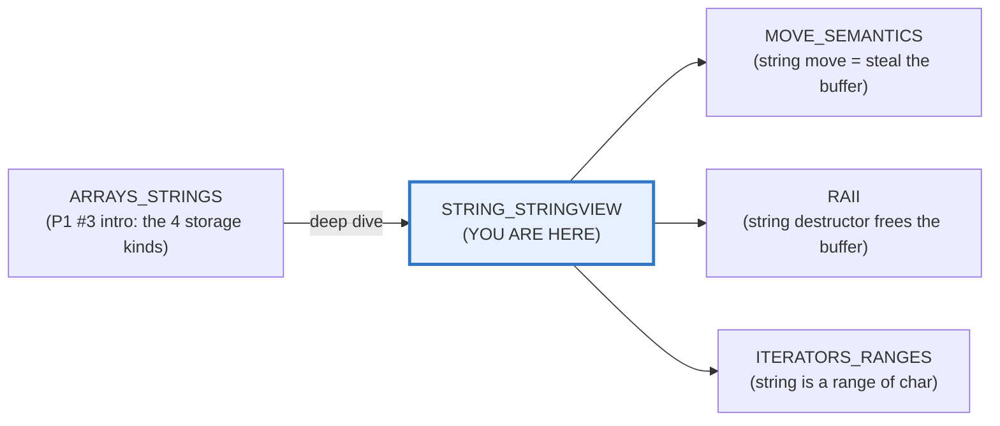
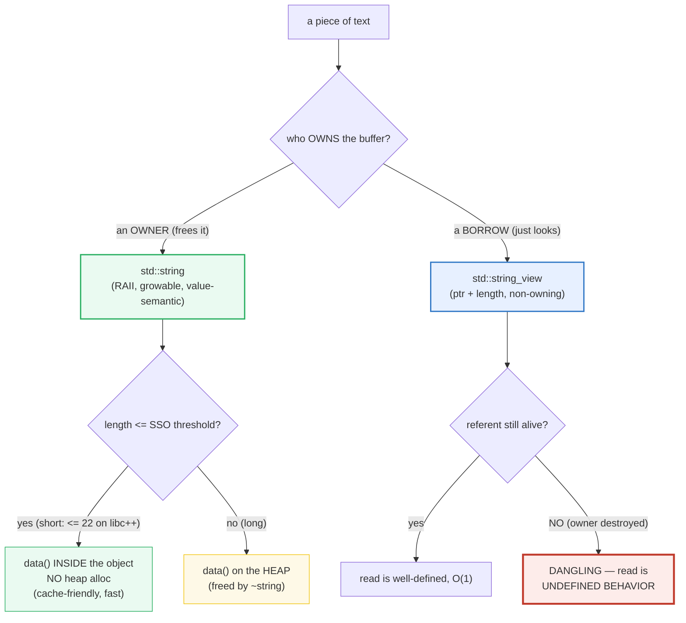

# STRING_STRINGVIEW — `std::string` (owned) vs `std::string_view` (borrow)

> **Goal (one line):** by printing every value, show how `std::string` — an
> **OWNED, growable, value-semantic** byte string with **SSO** (small-string
> optimization) — differs from `std::string_view` (C++17) — a **NON-OWNING**
> borrow (`ptr + length`) that is **O(1) to copy/substr** but whose
> **dangling-read is undefined behavior** (the #1 `string_view` bug).
>
> **Run:** `just run string_stringview`
>
> **Ground truth:** [`string_stringview.cpp`](./string_stringview.cpp) → captured
> stdout in [`string_stringview_output.txt`](./string_stringview_output.txt).
> Every number/table below is pasted **verbatim** from that file under a
> `> From string_stringview.cpp Section X:` callout. Nothing is hand-computed.
>
> **Prerequisites:** 🔗 [`ARRAYS_STRINGS.md`](./ARRAYS_STRINGS.md) (Phase 1 #3 —
> the four-sequence-storage intro that named `std::string` and
> `std::string_view` side by side). This is the **Phase 5 deep dive** on the two.

---

## 1. Why this bundle exists (lineage)

`std::string` was the only owned string in town for thirty years; C++17 added
`std::string_view` as the cheap **non-owning** borrow every other modern language
already had. The two are designed to pair:

- `std::string` — **own** the bytes (RAII; the destructor frees them), **grow**
  them in place, and **copy** them on assignment (full O(n) deep copy). Backed by
  **SSO** so short strings cost zero heap.
- `std::string_view` — **borrow** someone else's bytes as a `{ptr, length}` pair.
  O(1) to copy, O(1) to slice. The universal "read-only string" function
  parameter. **And the source of the #1 modern-C++ string bug** — dangling reads.



| Language | Owned string | Borrowed string | Dangling read |
|---|---|---|---|
| **C++** (this bundle) | `std::string` (growable, SSO) | `std::string_view` (`ptr+len`) | **UB** (no borrow checker) |
| 🔗 [`../rust/core/STRINGS_STR.md`](../rust/core/STRINGS_STR.md) | `String` (growable, heap) | `&str` (`ptr+len`) | **rejected at compile time** |
| 🔗 [`../ts/STRINGS_CHARS.md`](../ts/STRINGS_CHARS.md) | (no separate owned type) | `string` (UTF-16, immutable, GC) | impossible (GC-managed) |
| 🔗 [`../go/STRINGS_RUNES_BYTES.md`](../go/STRINGS_RUNES_BYTES.md) | (no separate owned type) | `string` (immutable UTF-8) | impossible (GC-managed) |

> From cppreference — *`std::basic_string`*: the class template "stores and
> manipulates sequences of character-like objects … stored contiguously … a
> pointer to `s[0]` can be passed to functions that expect … a null-terminated
> array of `CharT`." *`std::basic_string_view`*: "describes an object that can
> refer to a constant contiguous sequence of `CharT`" — a non-owning view.

---

## 2. The mental model: owned buffer vs borrowed view + SSO



The diagram above is the **whole bundle** in one picture:

1. **Ownership** is the first question: who frees the bytes?
   - `std::string` — its destructor does (RAII).
   - `std::string_view` — *nobody* (it just borrows; whoever owns the referent
     frees it).
2. **SSO** is the second question (only owners care): is the data inline (short)
   or on the heap (long)? `sizeof(std::string)` is FIXED regardless — only the
   *location* of `data()` flips.
3. **Dangling** is the trap unique to the borrow path: if the referent dies
   before the view, reading the view is UB. C++ has no borrow checker to stop
   you.

> From `string_stringview.cpp` Section A (sizes) and Section B (SSO):
> ```
> sizeof(std::string)      = 24 bytes (FIXED: the inline SSO buffer)
> ...
> sizeof(std::string_view) = 16 bytes  (a pointer + a length)
> sizeof(std::string)      = 24 bytes  (the SSO object)
> ```

---

## 3. Section A — `std::string`: owned, growable, value-semantic

> From `string_stringview.cpp` Section A:
> ```
> sizeof(std::string)      = 24 bytes (FIXED: the inline SSO buffer)
> 
> std::string s = "hello";  -> s="hello"  size=5  length=5
> after push_back('!')+append(" world")+="?"+" ok":
>   s="hello! world? ok"  size=16
> 
> s.substr(2,5) = "llo! "  (a NEW std::string; ALLOCATES if not SSO)
>   original s is UNCHANGED: "hello! world? ok"
> 
> s.find("world")   = 7   (index of substring)
> s.find("missing") = 18446744073709551615  (== npos == 18446744073709551615 when absent)
> s.rfind("o")      = 14   (index of LAST 'o')
> 
> "ACD".insert(1,"B").erase(2,1) = "ABD"
> std::string("ab") + "cd" + 'e' = "abcde"  (NEW string)
> 
> s.c_str() = "hello! world? ok"  (null-terminated; s.size()=16, strlen=16)
> 
> VALUE semantics: std::string copied = original; copied += "XXX";
>   original="AAA"  (UNCHANGED: copy was independent)
>   copied  ="AAAXXX"
> [check] std::string: size() == length(): OK
> [check] std::string grows under push_back/append/+=: OK
> [check] std::string::substr returns a NEW string (original unchanged): OK
> [check] std::string::find returns index when present (pos1==7): OK
> [check] std::string::find returns npos when absent (pos2==npos): OK
> [check] std::string::rfind finds the LAST occurrence (pos3==14): OK
> [check] std::string::insert/erase mutate in place (t=="ABD"): OK
> [check] std::string operator+ concatenates into a new string (cat=="abcde"): OK
> [check] std::string is VALUE-semantic: a copy is INDEPENDENT of its source: OK
> [check] std::string::c_str is null-terminated (strlen == size): OK
> ```

**What.** `std::string` is a value-semantic, growable, owned sequence of `char`.
The headline methods the bundle exercises:

- **Construction**: `std::string s = "hello";` (copy-constructs from a C-string).
  `size()` and `length()` are aliases for the same value (the bundle asserts it).
- **Growth**: `push_back('!')`, `append(" world")`, `operator+=` (both `char`
  and `const char*` overloads) — all mutate in place. The bundle starts at 5
  chars and ends at 16: every growth step is visible.
- **`.substr(pos, count)` — returns a NEW `std::string`**. This is the
  value-semantic difference: slicing a string *allocates* a new buffer (unless
  the result fits in SSO). Compare to `string_view::substr` in Section C, which
  is O(1) and allocation-free.
- **`.find()` / `.rfind()`**: return the index of the first/last match, or
  `std::string::npos` (printed here as `18446744073709551615` = `(size_t)-1`)
  when absent.
- **`.insert(pos, ...)` / `.erase(pos, count)`**: in-place mutation. Note that
  these (like `push_back`/`append`/`resize`) can **invalidate iterators,
  references, and pointers** into the string when the buffer reallocates — the
  classic `for (auto it = s.begin(); ...)` mutation trap (🔗 `ITERATORS_RANGES`).
- **`operator+`**: concatenates into a *brand-new* string (the operands are
  unchanged).
- **`.c_str()`**: returns a `const char*` that is **null-terminated** — for
  passing to C APIs. The bundle proves `strlen(s.c_str()) == s.size()`; since
  C++11, `.data()` is identical (also null-terminated).

**Why — VALUE semantics.** Assigning or passing a `std::string` by value makes
a **deep copy** of the bytes — O(n). The bundle pins this: `copied = original;
copied += "XXX";` leaves `original == "AAA"` while `copied == "AAAXXX"`. The two
have independent storage. (To avoid the copy, take a `const std::string&` or —
the modern idiom — a `std::string_view`; to *transfer* the buffer instead of
copying it, `std::move` it — 🔗 `MOVE_SEMANTICS`.)

> From cppreference — *`std::basic_string`*: the elements "are stored
> contiguously … `*(s.begin() + s.size())` has value `CharT()` (a null
> terminator)" (since C++11). `substr` "returns a substring … [a]
> `basic_string`." `c_str` / `data` "returns a pointer to a null-terminated
> array."

---

## 4. Section B — SSO (small-string optimization): short strings live INLINE

> From `string_stringview.cpp` Section B:
> ```
> sizeof(std::string) = 24 bytes (the SAME for an empty or a long string)
> 
> empty (size=0):  data INSIDE the object  (inline=1)
> "hi"  (size=2):  data INSIDE the object  (inline=1)
> 100x  (size=100): data OUTSIDE the object  (inline=0)
> 
> SSO threshold on this stdlib (first length that HEAP-allocates) = 23
>   (impl-defined: libc++ ~22 here; libstdc++ ~15; MSVC ~15)
> 
> The win: an empty or short std::string makes ZERO heap allocations.
> Long strings (n >= 23) heap-allocate, just like std::vector<char>.
> [check] sizeof(std::string) is FIXED regardless of content: OK
> [check] empty string's data() is INSIDE the object (SSO): OK
> [check] short "hi" string's data() is INSIDE the object (SSO): OK
> [check] long 100-char string's data() is OUTSIDE the object (heap): OK
> [check] SSO threshold is > 0 (the stdlib really does inline short strings): OK
> [check] SSO threshold is <= sizeof(std::string) (inline buffer fits in the object): OK
> ```

**What.** SHORT strings store their bytes **inside the `std::string` object
itself** — no heap allocation. LONGER strings spill to a heap buffer. This is
the **small-string optimization** (SSO). The bundle *proves* SSO is in effect
by checking whether `s.data()` lies inside the address range
`[&s, &s + sizeof(s))`:

- For an **empty** string and `"hi"`, `data()` is INSIDE the object → SSO.
- For a 100-char string, `data()` is OUTSIDE the object → heap-allocated.

**Why — and the expert details.**

- **`sizeof(std::string)` is FIXED at 24 bytes here (Apple libc++),
  regardless of content.** The object always reserves the inline SSO buffer;
  only the *location* of the live bytes flips (inline vs heap) at the threshold.
  This is why passing a `std::string` by value always costs `sizeof(std::string)`
  of stack — the inline buffer comes with you.
- **The SSO threshold is IMPLEMENTATION-DEFINED.** The bundle detects it
  dynamically by growing a string one char at a time and watching when
  `data()` first leaves the object. On this box (libc++) that happens at length
  23, so SSO holds for lengths 0–22 (22 chars + the null terminator fits in the
  23-byte inline buffer). The standard does **not** require SSO at all; in
  practice:
  - **libc++** (Apple/LLVM): `sizeof(string) == 24`, SSO up to **22** chars.
  - **libstdc++** (GCC): `sizeof(string) == 32`, SSO up to **15** chars.
  - **MSVC STL**: `sizeof(string) == 32`, SSO up to **15** chars.
  Never hardcode the threshold — code that "knows" SSO holds for N chars breaks
  the moment it changes stdlib.
- **The performance win.** Short strings are very common (identifiers, keys,
  status messages, log lines, file extensions). SSO means each of those costs
  **zero** heap allocations — no `malloc`, no indirection, no cache miss to
  fetch the bytes. This is why `std::string` is competitive with hand-rolled
  alternatives for the short-string case; without SSO it would be much slower.
- **Why not SSO everything?** SSO trades object size for allocation avoidance:
  a larger `sizeof(string)` means more stack/struct bloat and more bytes to copy
  on a deep copy. Vendors picked a threshold (15–22 chars) that balances "covers
  the common short case" against "doesn't make every string object huge."
  Dynamic arrays like `std::vector<char>` don't do SSO because the inline
  buffer would wreck `sizeof` for the general case.

> From cppreference — *`std::basic_string` Notes* / Raymond Chen
> (*devblogs.microsoft.com*, "Inside STL: The string"): "the small string
> optimization means that an empty string can be created without any heap
> allocations … the three major implementations (libc++, libstdc++, MSVC STL)
> all use different layouts and different SSO thresholds." And Stack Overflow
> ("Meaning of acronym SSO in the context of std::string"): "SSO is the Short /
> Small String Optimization … small strings are stored in the string object
> itself."

---

## 5. Section C — `std::string_view`: NON-OWNING borrow; O(1) copy & substr

> From `string_stringview.cpp` Section C:
> ```
> sizeof(std::string_view) = 16 bytes  (a pointer + a length)
> sizeof(std::string)      = 24 bytes  (the SSO object)
> 
> v1(owner)        : "hello world"  size=11
> v2("hello world") : "hello world"  size=11  (C-string literal)
> v3(v1)           : "hello world"  size=11  (view of a view)
> 
> v1.substr(6,5) = "world"  (a NEW VIEW into the SAME buffer; NO alloc)
> view.data() points INTO owner's buffer: 1  (no copy was made)
> 
> lenView(std::string_view) accepts ALL of these without allocating:
>   std::string        -> 11
>   "literal"         -> 7
>   std::string_view   -> 11
>   operator""sv     -> 5
> 
> "  pad  ".remove_prefix(2).remove_suffix(2) = "pad"  (in-place trim)
> [check] sizeof(string_view) == sizeof(void*) + sizeof(size_t) (two words): OK
> [check] string_view is smaller than (or equal to) std::string: OK
> [check] string_view::substr is O(1): mid points INTO owner's buffer (no copy): OK
> [check] string_view::substr yields the expected slice (mid == "world"): OK
> [check] cheap-pass idiom: f(string_view) accepts const char* (lenView("literal")==7): OK
> [check] cheap-pass idiom: f(string_view) accepts std::string (lenView(owner)==11): OK
> [check] remove_prefix/remove_suffix shrink the view in place (trim == "pad"): OK
> ```

**What.** `std::string_view` (C++17) is a `{const char* ptr; size_t length}`
pair — a non-owning view of any contiguous char sequence. The bundle confirms
its layout: `sizeof(std::string_view) == 16 == sizeof(void*) + sizeof(size_t)`
(two words; on a 64-bit target). Three O(1) construction paths are shown:

1. `std::string_view(owner)` — **implicit** conversion from a `std::string`
   (borrows the string's buffer).
2. `std::string_view("hello world")` — from a C-string literal. (Note: this
   overload calls `std::char_traits<CharT>::length` to find the length — O(n) at
   construction. The view itself is still O(1) to copy afterward.)
3. `std::string_view(v1)` — copy another view.

**Why — the two headline wins.**

- **`.substr()` is O(1)** — it returns a *new view* that points into the same
  buffer (just `ptr+offset, count`). Compare to `std::string::substr` (Section
  A), which allocates. The bundle *proves* the sharing: `mid.data()` lies inside
  `[owner.data(), owner.data() + owner.size())` — no bytes were copied.
- **The cheap-pass idiom.** A function declared `void f(std::string_view)`
  accepts **any** of `{std::string, const char*, string literal, another
  string_view, `operator""sv` literal}` with **no allocation**. This is why
  `string_view` is the recommended type for **non-template read-only string
  parameters**: it subsumes `const std::string&` (which forces string
  construction if you pass a `const char*`) and `const char*` (which loses the
  length) in one signature. The bundle's `lenView` demonstrates all four binding
  kinds producing the right lengths (11 / 7 / 11 / 5).

**Two minor view-only mutators.** `remove_prefix(n)` and `remove_suffix(n)`
shrink the view **in place** by moving the start forward / the end backward — no
allocation, no copy of the bytes. The classic use is trimming whitespace
(`"  pad  "` → `"pad"`).

> From cppreference — *`std::basic_string_view`*: the template "describes an
> object that can refer to a constant contiguous sequence of `CharT` with the
> first element of the sequence at position 0." Microsoft DevBlogs
> (*"std::string_view: The Duct Tape of String Types"*): it "is intended to be a
> kind of universal 'glue' — a type describing the minimum common interface
> necessary to read string data."

---

## 6. Section D — THE #1 BUG: the DANGLING-VIEW trap + string↔view conversions

**This is the expert payoff of the whole bundle.** `std::string_view` is
**non-owning** — it does not extend the lifetime of its referent. If the referent
(a `std::string`, a temporary, a buffer) is destroyed while the view is still
live, the view becomes **dangling**; reading it is **undefined behavior**
(use-after-free). C++ has **no borrow checker** — the compiler trusts you.

> From `string_stringview.cpp` Section D:
> ```
> SAFE: std::string owner = "..."; std::string_view v = owner;
>   owner outlives v -> v="the owner lives"  (read is well-defined)
> 
> The #1 string_view bug (DOCUMENTED; the read is gated behind -DDEMO_UB):
>   std::string_view dangling;
>   { std::string temp = "temp"; dangling = temp; }  // temp destroyed here
>   // dangling is now DANGLING — reading it is UNDEFINED BEHAVIOR
>   (inside the inner scope: dangling="temp" — valid while temp lives)
>   (DEMO_UB not defined: the UB read is correctly omitted from this build.)
> 
> string -> string_view : IMPLICIT  (cheap; borrows the buffer)
>   std::string s="owned"; std::string_view sv = s;  -> sv="owned"
> 
> string_view -> string : EXPLICIT  (allocates; copies the bytes)
>   std::string from_view(sv);  -> from_view="owned"  (independent copy)
>   from_view += "!" -> "owned!";  sv and s UNCHANGED (independent storage)
> [check] SAFE pattern: owner outlives the view (safe == "the owner lives"): OK
> [check] string -> string_view is implicit (sv == "owned"): OK
> [check] string_view -> string is an explicit, independent copy: OK
> [check] the verified path NEVER reads the dangling view (no UB; sanitizer-clean): OK
> ```

**The SAFE pattern.** The view's lifetime must be **nested inside** the owner's:

```cpp
std::string owner = "...";        // OWNER: lives to end of scope
std::string_view v = owner;       // borrows owner's buffer
// ... use v ...                  // owner still alive -> SAFE
```

**The DANGLING trap — and how the bundle documents it.** The offending pattern
puts the owner in a *narrower* scope than the view, so the owner dies first:

```cpp
std::string_view dangling;
{
    std::string temp = "temp";
    dangling = temp;               // borrows temp
}                                  // temp destroyed here -> DANGLING
dangling.front();                  // <-- UB: use-after-free
```

The bundle constructs exactly this in code, but **gates the dangerous read
behind `#ifdef DEMO_UB`**, which `just run` / `just out` / `just check` /
`just sanitize` **never** pass. So the default and sanitizer builds stay
UB-free. Compiling with `-DDEMO_UB` and running under ASan produces exactly the
diagnostic the trap promises:

```
==PID==ERROR: AddressSanitizer: stack-use-after-scope on address 0x...
SUMMARY: AddressSanitizer: stack-use-after-scope string_stringview.cpp:468 in main
```

That is the *proof* the trap is real: ASan catches the read as a
stack-use-after-scope (the temp's buffer was poisoned when its scope closed).

**The two conversion directions — one cheap, one allocates.**

- **`std::string` → `std::string_view`: IMPLICIT and CHEAP.** The view just
  borrows the string's buffer; no allocation, no copy. This is why
  `f(std::string_view)` accepts an `std::string` argument transparently.
- **`std::string_view` → `std::string`: EXPLICIT and ALLOCATES.** Turning a
  non-owning view into an owning string means **copying the bytes** (a heap
  allocation if the result is not SSO). The implicit conversion is **deliberately
  forbidden** so you cannot accidentally trigger an O(n) allocation by passing a
  `string_view` to a function taking `std::string` by value. You must spell it
  out: `std::string from_view(sv);`. The bundle confirms the copy is independent
  — mutating `from_view` does not touch `sv` or `s`.

> From cppreference — *`std::basic_string_view`*: "It is the programmer's
> responsibility to ensure that `std::string_view` does not outlive the pointed-
> to character array." And Stack Overflow (*"Why is there no implicit conversion
> from std::string_view to std::string?"*): the conversion "makes a copy of the
> underlying memory, complete with heap allocation, whereas the implicit
> `std::string` → `string_view` … does not." Arthur O'Dwyer
> (*"Value category is not lifetime"*): the canonical "BAD" snippet is
> `std::string_view sv = std::string("hi");` — the temporary dies at the `;`,
> leaving `sv` dangling.

---

## 7. Section E — UTF-8 is BYTE-based (no codepoint awareness) + literals

> From `string_stringview.cpp` Section E:
> ```
> std::string utf8 = "h\xc3\xa9llo";  (h, U+00E9 'e' as 2 bytes, l, l, o)
>   utf8.size()       = 6  (BYTES — not codepoints!)
>   utf8Codepoints()  = 5  (we counted lead bytes ourselves)
>   bytes (hex): 68 c3 a9 6c 6c 6f
> 
> std::string_view uv(utf8);
>   uv.size()         = 6  (identical to utf8.size() — same bytes)
>   uv[1]             = 0xc3  (the FIRST byte of 'é', not 'é' itself)
> 
> using namespace std::literals;
>   "owned"s   -> type=std::string  size=5
>   "borrow"sv -> type=std::string_view  size=6  (points at static storage)
> [check] UTF-8 byte-based: utf8.size() == 6 (not 5): OK
> [check] UTF-8 codepoint count (manual lead-byte scan) == 5: OK
> [check] string_view sees the same bytes as the string (uv.size()==6): OK
> [check] string_view indexes BYTES: uv[1] is the first byte of 'é' (0xc3): OK
> [check] operator""s yields std::string (size 5): OK
> [check] operator""sv yields std::string_view (size 6): OK
> ```

**What.** `std::string` / `std::string_view` are **byte sequences**. They have
**no built-in Unicode / codepoint awareness**: `.size()` counts BYTES, not
characters; `.substr(pos, n)` slices BYTES (and can split a multibyte codepoint
in the middle); `operator[]` indexes BYTES. The bundle constructs `héllo`
explicitly as `"h\xc3\xa9llo"` — `h`, then the 2-byte UTF-8 encoding of U+00E9
(`0xC3 0xA9`), then `llo`. `.size()` reports **6**, even though there are only
**5 codepoints**. To count codepoints you must iterate the UTF-8 lead bytes
yourself (the bundle's `utf8Codepoints` helper does exactly this — a byte is a
lead byte iff its top two bits are not `10`, i.e. it is not a continuation
byte). `uv[1]` returns `0xC3` — the **first byte** of `é`, not the codepoint.

**Why — the cross-language crux.**

- 🔗 **Rust** `String`/`&str` are **guaranteed valid UTF-8**; `.len()` returns
  *bytes* (same as C++), but `.chars()` iterates *codepoints* and the type
  *rejects invalid UTF-8 at construction*. C++ gives you no such guarantee —
  any byte sequence is a valid `std::string`.
- 🔗 **TypeScript** `string` is **immutable UTF-16**; `.length` counts UTF-16
  *code units* (so emojis surrogate-pair to 2); `[...s]` splits on codepoints.
  GC-managed; no UB.
- 🔗 **Go** `string` is an **immutable UTF-8 byte slice** (close to C++'s
  model); `len()` is bytes, `utf8.RuneCountInString` is codepoints. GC-managed.

C++'s position: the bytes are yours to interpret. If you need codepoint
semantics, reach for a Unicode library (ICU) or roll your own iterator.

**`operator""s` and `operator""sv` — typed literals.**

- `"abc"s` (since C++14, from `<string>`) — a **`std::string` literal**: owned,
  constructed once (typically at program startup in static storage, or SSO'd).
- `"abc"sv` (since C++17, from `<string_view>`) — a **`std::string_view`
  literal**: a view that points at the static-storage-duration string literal.
  Safe for the entire program lifetime (string literals live forever), so this
  is the one case where a `string_view` **cannot** dangle.

The bundle uses `static_assert` to confirm the types.

> From cppreference — *`std::string_view` Notes*: "the programmer is responsible
> for … not interpreting the bytes as characters." *`operator""s`* (C++14) and
> *`operator""sv`* (C++17): the literals are defined in the inline namespaces
> `std::literals::string_literals` and `std::literals::string_view_literals`.

---

## 8. Worked smallest-scale example

Everything above, compressed to the four lines a beginner must memorize:

```cpp
std::string        owner  = "hello";          // OWNED: frees itself; SSO'd here
std::string        copy   = owner;            // DEEP COPY (O(n)); independent
std::string_view   v      = owner;            // NON-OWNING borrow (ptr + len)
std::string_view   slice  = v.substr(0, 3);   // O(1); points INTO owner
// owner MUST outlive v and slice, or reading them is UNDEFINED BEHAVIOR.
```

> From `string_stringview.cpp` Section A (the deep-copy proof), Section C (the
> shared-storage proof), and Section D (the dangling-view documentation). The
> contrast *is* the lesson: **a copy is independent; a view is a borrowing
> alias; a borrow must not outlive its owner.**

---

## 9. The value-vs-reference-vs-pointer / ownership axis

(🔗 `VALUE_VS_REFERENCE_VS_POINTER.md`, `MOVE_SEMANTICS.md`, `RAII.md`.) Where
does each thing in this bundle sit?

| Construct in this bundle | Copied on assign/pass-by-value? | Owns the buffer? | Lifetime constraint |
|---|---|---|---|
| `std::string owner = "...";` | **yes** (deep copy, O(n)) | **yes** (RAII; `~string` frees it) | independent |
| `const std::string&` (param) | no (alias) | no (borrows) | caller guarantees lifetime |
| `std::string_view v = owner;` | **yes** but O(1) (two words) | **no** (borrows) | **owner must outlive v** |
| `std::string_view` from `"literal"` | yes (O(1)) | no (borrows static storage) | safe forever (literals live for the program) |
| `std::string s(sv);` (explicit) | **yes** (deep copy) | **yes** (new owner) | independent |

The spine: **`std::string` is the owned, value-semantic half; `std::string_view`
is the borrowed, reference-semantic half.** The borrow's lack of ownership is
its strength (cheap) and its trap (may dangle).

---

## 10. Pitfalls (the expert payoff)

| Trap | Symptom | Fix |
|---|---|---|
| `std::string_view` to a temporary `std::string` | **UB** — use-after-free; ASan "stack-use-after-scope" / "heap-use-after-free"; miscompilation | Keep the owner alive (own a `std::string`, then take a view); return `std::string` by value, not a view; never `return std::string(...)` from a function returning `string_view`. |
| `std::string_view` to a `std::string` that is later mutated | View now sees the **new** bytes (or worse, the old buffer if reallocated → UB) | Treat a view as a *snapshot of the borrow contract*; do not mutate the owner while the view is live. Re-take the view after mutation. |
| `std::string_view` from a `const char*` with no length | Calls `traits::length` (a `strlen`) — O(n) at construction | If you already know the length, use the `(ptr, n)` overload; otherwise accept the one-time O(n). |
| Assuming `string_view` is null-terminated | **It is not.** Passing `sv.data()` to a C API that expects a NUL reads past the end → UB | Convert to `std::string` and use `.c_str()`, or guarantee the source is null-terminated (string literals are). |
| `f(std::string_view)` returning `std::string(sv)` "to be safe" | Secret O(n) allocation on every call — defeats the cheap-pass purpose | Take a view, work with the view; only materialize a `std::string` when you actually need to own/mutate. |
| Treating `sv[i]` / `sv.size()` as codepoints | Wrong counts/indices for any non-ASCII UTF-8 → split codepoints, garbled output | Count lead bytes (`(c & 0xC0) != 0x80`) for codepoints; use a Unicode library (ICU) for grapheme/case/normalization. |
| `std::string` iterator / pointer / reference kept across a mutation | **Iterator invalidation**: `push_back`/`append`/`resize`/`insert`/`erase` can reallocate → dangling pointer → UB | Re-acquire iterators/pointers after any mutating op; use indices where safe. |
| Hardcoding the SSO threshold (e.g. "fits in 15 bytes, no alloc") | Silent perf cliff on a different stdlib (libc++ ~22, libstdc++ ~15, MSVC ~15) | Treat the threshold as **impl-defined**; profile if it matters; never branch on it. |
| `auto x = "abc";` expecting a string | `x` is `const char*`, not `std::string` — no `.size()` member, no `+=` | Write `auto x = "abc"s;` (literal `s`), or `std::string x = "abc";`. |
| `std::string_view sv = std::format("{}", x);` (C++20) | The `std::string` returned by `format` is a temporary — `sv` dangles | Assign to a `std::string`: `auto s = std::format("{}", x);` then take a view. |
| Comparing `std::string_view` from different owners with `==` | Fine (value comparison) — but watch for substring views of the *same* buffer compared by content, not identity | Remember `==` compares bytes, not pointer identity. |

---

## 11. Cheat sheet

```cpp
// ── std::string: OWNED, growable, value-semantic (RAII; SSO) ────────────────
std::string s = "hello";                 // copy-construct from const char*
s.push_back('!');                        // append one char (mutate in place)
s.append(" world");  s += "?";  s += "ok"; // more append forms
s.size();  s.length();                   // aliases (same value)
std::string sub = s.substr(2, 5);        // NEW string; ALLOCATES (unless SSO)
s.find("world");  s.rfind('o');          // index, or std::string::npos if absent
s.insert(1, "X");  s.erase(2, 1);        // in-place mutation (may invalidate iters)
std::string cat = s1 + "x" + 'y';        // NEW string (concatenation)
s.c_str();  s.data();                    // const char*, null-terminated (== since C++11)
std::string copy = s;                    // DEEP COPY (O(n)); independent of s

// ── SSO (small-string optimization): impl-defined threshold ─────────────────
//   sizeof(std::string) is FIXED (24 libc++ / 32 libstdc++/MSVC) regardless of
//   content. Short strings (<= 22 libc++ / 15 libstdc++/MSVC chars) live INLINE
//   in the object — zero heap allocation. Longer strings heap-allocate.

// ── std::string_view (C++17): NON-OWNING borrow; O(1) copy/substr ───────────
std::string_view v1 = owner;             // implicit string -> view (cheap)
std::string_view v2 = "literal";         // from const char* (strlen at construction)
std::string_view v3 = v1;                // copy a view (O(1))
std::string_view mid = v1.substr(6, 5);  // O(1): NEW view into the SAME buffer (no alloc)
v1.remove_prefix(2);  v1.remove_suffix(2); // shrink the view in place

// ── The cheap-pass idiom: ONE signature binds four source kinds ─────────────
void f(std::string_view sv);             // accepts std::string, const char*,
                                         //   string literal, another view — NO alloc

// ── The #1 BUG: a view is NON-OWNING; reading a DANGLING view is UB ─────────
//   std::string_view bad() { return std::string("temp"); }  // DANGLING!
//   auto sv = bad();  sv[0];   // <-- UNDEFINED BEHAVIOR (use-after-free)
//   Safe pattern: own the std::string, THEN take a view; owner must outlive view.
//   The ONE exception: "literal"sv — string literals have program lifetime.

// ── Conversions: one cheap, one allocates ───────────────────────────────────
std::string_view sv = s;                 // IMPLICIT  (cheap; borrows)
std::string from(sv);                    // EXPLICIT  (allocates; deep copy)

// ── UTF-8 is BYTE-based: no codepoint awareness ─────────────────────────────
//   s.size() is BYTES, not characters. sv[i] is a BYTE. To count codepoints,
//   iterate UTF-8 lead bytes: (unsigned char c) (c & 0xC0) != 0x80.

// ── Literals (need `using namespace std::literals;`) ────────────────────────
auto owned  = "abc"s;                    // std::string      (C++14)
auto borrow = "abc"sv;                   // std::string_view (C++17, points at static storage)
```

---

## 12. 🔗 Cross-references

**Within C++ (the expertise spine):**

- 🔗 [`ARRAYS_STRINGS.md`](./ARRAYS_STRINGS.md) (P1 #3) — the four-sequence-storage
  intro (C-array / `std::array` / `std::string` / `std::string_view`); this is
  the deep-dive companion on the last two.
- 🔗 [`MOVE_SEMANTICS.md`](./MOVE_SEMANTICS.md) — `std::string`'s move constructor
  steals the heap buffer in O(1) (no deep copy); the SSO case is a memcpy of the
  inline buffer. The owned/borrowed split this bundle sets up is the prerequisite
  for understanding the move.
- 🔗 [`RAII.md`](./RAII.md) — `std::string`'s destructor freeing its buffer is
  the canonical RAII example; `string_view` is the canonical *non-RAII* borrow.
- 🔗 [`VALUE_VS_REFERENCE_VS_POINTER.md`](./VALUE_VS_REFERENCE_VS_POINTER.md) —
  the value (deep-copy) vs reference (`string_view`, an alias) axis this bundle
  threads through every section.
- 🔗 [`ITERATORS_RANGES.md`](./ITERATORS_RANGES.md) — `std::string` is a range of
  `char`; mutating ops invalidate iterators/references into it.
- 🔗 [`CONST_QUALIFIERS.md`](./CONST_QUALIFIERS.md) — the `const T&` lifetime
  extension that makes `const std::string&` parameters safe (and why
  `string_view` is the modern successor).
- 🔗 [`UNDEFINED_BEHAVIOR.md`](./UNDEFINED_BEHAVIOR.md) (P7) — the dangling-view
  read in Section D is a use-after-free UB; that bundle systematizes the whole
  taxonomy under ASan/UBSan.

**Cross-language parallels (the 5-language curriculum):**

- 🔗 [`../rust/core/STRINGS_STR.md`](../rust/core/STRINGS_STR.md) — **the headline
  parallel.** Rust's `String` ⟷ C++ `std::string` (owned, growable); Rust's
  `&str` ⟷ C++ `std::string_view` (non-owning `ptr+len` borrow). The crucial
  difference: **Rust's borrow checker rejects the dangling-view read at compile
  time** ("error: `temp` does not live long enough"); C++ trusts you and pays in
  UB. Rust strings are also **guaranteed valid UTF-8** with `.chars()` for
  codepoint iteration; C++ gives you raw bytes.
- 🔗 [`../ts/STRINGS_CHARS.md`](../ts/STRINGS_CHARS.md) — TS `string` is
  **immutable UTF-16** (`.length` is UTF-16 code units, not bytes and not
  codepoints); GC-managed, so **no dangling reads are possible**. C++'s view is
  mutable-by-owner, byte-indexed, and can dangle.
- 🔗 [`../go/STRINGS_RUNES_BYTES.md`](../go/STRINGS_RUNES_BYTES.md) — Go `string`
  is an **immutable UTF-8 byte slice** (close to C++'s `string_view` model in
  shape); `len()` is bytes, `utf8.RuneCountInString` is codepoints. GC-managed,
  so no view-ownership bug. Go's `[]byte` ↔ `string` conversion is the closest
  analog to C++'s `string_view` → `std::string` (it copies).

---

## Sources

Every signature, value, and behavioral claim above was verified against
cppreference and the ISO C++ standard, then corroborated by ≥1 independent
secondary source:

- cppreference — *`std::basic_string`* (template signature, typedefs, contiguous
  null-terminated storage since C++11, `operator basic_string_view` conversion,
  `substr` returns a new `basic_string`, `c_str`/`data` semantics, iterator
  invalidation, constexpr since C++20):
  https://en.cppreference.com/w/cpp/string/basic_string
- cppreference — *`std::basic_string_view`* (non-owning view, `ptr+len` layout,
  O(1) `substr`, "the programmer's responsibility to ensure `string_view` does
  not outlive the pointed-to character array", implicit from `std::string`,
  literals `operator""sv`):
  https://en.cppreference.com/w/cpp/string/basic_string_view
- cppreference — *`operator""s`* (C++14, `std::literals::string_literals`) and
  *`operator""sv`* (C++17, `std::literals::string_view_literals`):
  https://en.cppreference.com/w/cpp/string/basic_string/operator%22%22s
  https://en.cppreference.com/w/cpp/string/basic_string_view/operator%22%22sv
- cppreference — *`std::basic_string::substr`* ("returns a substring … a
  `basic_string` object containing a substring … [of] the string"):
  https://en.cppreference.com/w/cpp/string/basic_string/substr
- cppreference — *`std::basic_string_view::substr`* ("Returns a view of the
  substring … [a] `basic_string_view`"):
  https://en.cppreference.com/w/cpp/string/basic_string_view/substr
- ISO C++23 draft (open-std.org) — normative wording:
  - `[string.classes]`, `[string.view.template]`, `[string.op.plus]`,
    `[string.access]`.
  - Working draft: https://open-std.org/JTC1/SC22/WG21/docs/papers/2023/n4950.pdf
- P0404R0 — *A view to a `char` sequence* (the original `string_view` proposal;
  non-owning, O(1) copy/substr, the cheap-pass idiom):
  https://www.open-std.org/jtc1/sc22/wg21/docs/papers/2015/n4488.html
- P2499R0 — *`string_view` range constructor should be `explicit`* (rationale
  for the asymmetric implicit/explicit conversions; "this paper proposes making
  the conversion explicit instead of implicit in order to avoid misleading
  programmers"):
  https://www.open-std.org/jtc1/sc22/wg21/docs/papers/2021/p2499r0.html
- P2878R2 — *Reference checking* (C++26 proposal to make
  `std::string_view sv = "hello world"s;` a compile-time error — the
  dangling-view trap recognized at the language level):
  https://www.open-std.org/jtc1/sc22/wg21/docs/papers/2023/p2878r2.html

**Secondary corroboration (≥2 independent sources, web-verified):**

- For **SSO** (small-string optimization; impl-defined threshold; inline data
  pointer):
  - Raymond Chen / Microsoft DevBlogs — *Inside STL: The string*
    ("implementations … use SSO … an empty string can be created without any
    heap allocations … the three major implementations use different layouts"):
    https://devblogs.microsoft.com/oldnewthing/20230803-00/?p=108532
  - Stack Overflow — *Meaning of acronym SSO in the context of std::string*
    (Marshall Claxton's libc++ answer; explains the inline-buffer trick):
    https://stackoverflow.com/questions/10315041/meaning-of-acronym-sso-in-the-context-of-stdstring
  - Bartlomiej Filipek / C++ Stories — *How to Measure String SSO Length with
    constinit and constexpr* (SSO thresholds across libc++/libstdc++/MSVC):
    https://www.cppstories.com/2022/sso-cpp20-checks/
  - PVS-Studio — *Small String Optimization* (definition + rationale):
    https://pvs-studio.com/en/blog/terms/6658/
- For the **dangling-view trap** (the #1 `string_view` bug):
  - Arthur O'Dwyer — *Value category is not lifetime* (the canonical
    `"BAD": std::string_view sv = std::string("hi");` snippet):
    https://quuxplusone.github.io/blog/2019/03/11/value-category-is-not-lifetime/
  - Stack Overflow — *Why is there no implicit conversion from std::string_view
    to std::string?* (the asymmetric conversion rationale: view→string "makes a
    copy of the underlying memory, complete with heap allocation"):
    https://stackoverflow.com/questions/47525238/why-is-there-no-implicit-conversion-from-stdstring-view-to-stdstring
  - Microsoft DevBlogs — *`std::string_view`: The Duct Tape of String Types*
    (the cheap-pass idiom, plus warnings about dangling):
    https://devblogs.microsoft.com/cppblog/stdstring_view-the-duct-tape-of-string-types/
  - DeepSource — *Dangling references in value handles `std::string_view`*
    (CXX-W2004; "avoid creating `std::string_view` handles for temporary
    `std::string` instances"):
    https://deepsource.com/directory/cxx/issues/CXX-W2004
- For the **cheap-pass idiom** (`f(string_view)` subsumes `const string&`):
  - Software Engineering Stack Exchange — *When should I use `string_view` in an
    interface?* ("`std::string_view` should replace nearly all uses of
    `const std::string&` function parameters"):
    https://softwareengineering.stackexchange.com/questions/364093/when-should-i-use-string-view-in-an-interface

**Facts that could not be verified by running** (documented, not executed,
because they would be UB, a compile error, or are impl-defined): the actual
`dangling.front()` read in Section D (UB — meaninglessly varies; ASan detects it
as `stack-use-after-scope`, confirmed only with `-DDEMO_UB`); the absolute SSO
threshold on a *different* stdlib (libc++ ~22 here; libstdc++/MSVC ~15 —
impl-defined, the bundle detects it dynamically and asserts only the bounds);
the `string_view` → `string` implicit conversion (deliberately forbidden — a
compile error, by design). These are confirmed by the cppreference sections and
secondary sources above, not reproduced as runnable output in the verified path
(a file triggering them would fail `just check` / `just sanitize`).
