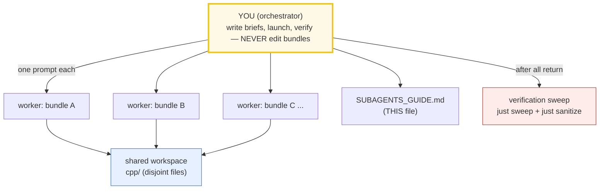

# SUBAGENTS_GUIDE — Delegating Bundle-Building at Scale (C++)

> A note from past-me to future-me: **how to spin up many `cpp/` concept bundles in
> parallel using subagents, without losing rigor.**
>
> This sits **above** [`HOW_TO_RESEARCH.md`](./HOW_TO_RESEARCH.md) (the per-bundle
> workflow). That guide defines *what* a bundle is; this one defines *how to
> delegate* that work to many agents at once — the worker prompt template, the
> coordination rules, and the verification sweep.
>
> Sister guides: [`../go/SUBAGENTS_GUIDE.md`](../go/SUBAGENTS_GUIDE.md) ·
> [`../rust/SUBAGENTS_GUIDE.md`](../rust/SUBAGENTS_GUIDE.md) ·
> [`../ts/SUBAGENTS_GUIDE.md`](../ts/SUBAGENTS_GUIDE.md).



---

## 0. When to use this mode

Use subagent delegation when you need **≥3 concept bundles** built to a uniform
bar. For 1–2 bundles, just build them by hand (follow `HOW_TO_RESEARCH.md`). The
moment you're doing a whole phase, delegate.

**The trap it prevents:** when you build many things yourself in one session,
context fills up, quality drifts, and the later bundles get sloppy. Subagents
each get a *fresh* context, so bundle #51 is as rigorous as #1.

**The throughput rule:** launch **at most 4 workers per batch** (parallel `Task`
calls in one message). After each batch returns, run `just sweep` + spot
`just sanitize`, then launch the next batch of 4.

---

## 1. The mental model: orchestrator + workers

- **You (the orchestrator)** do NOT write bundle code. You: (a) write the worker
  prompt template (§2), (b) fill one brief per bundle (§3), (c) launch workers in
  parallel — **max 4 per batch**, all `Task` calls in ONE message, (d) run the
  verification sweep (`just sweep`) + sanitizer spot-checks after each batch,
  (e) re-spawn any worker that failed.
- **Each worker** owns exactly ONE bundle (its `.cpp` + `_output.txt` + `.md`)
  and follows `HOW_TO_RESEARCH.md` to the letter. It is forbidden from touching
  any other bundle's files, the `Justfile`, `scripts/`, `HOW_TO_RESEARCH.md`,
  `SUBAGENTS_GUIDE.md`, and `TODO.md`.
- **The workspace is shared** (`cpp/`), but file ownership is disjoint (flat —
  each bundle's 3 files share a unique stem), so parallel writes are safe.

---

## 2. The standard worker prompt (copy this, fill the blanks)

Every worker gets this preamble verbatim, then a per-concept "brief".

```text
You are building ONE "concept bundle" for the C++ learning repo. Work ENTIRELY
inside /Volumes/data/workspace/tutorials/cpp/. Do NOT touch any file that is not
part of your assigned bundle, and do NOT edit Justfile, HOW_TO_RESEARCH.md,
SUBAGENTS_GUIDE.md, TODO.md, or anything under scripts/.

=== STEP 0: ABSORB THE WORKFLOW (mandatory, do first, in order) ===
1. Read /Volumes/data/workspace/tutorials/cpp/HOW_TO_RESEARCH.md IN FULL.
   It is the law: the bundle = {name}.cpp (ground truth) + {name}_output.txt
   (captured stdout) + {NAME}.md (guide). There is NO .html.
2. Study the canonical model bundle(s) and COPY THEIR STYLE EXACTLY:
   {MODEL_BUNDLES}   # e.g. cpp/values_types.cpp + VALUES_TYPES.md (Phase 1 onward)
   Match: the sectionBanner()/check() helpers; the section_*() print structure;
   the "> From {name}.cpp Section X:" verbatim callouts + mermaid + pitfalls
   table + cheat sheet + ## Sources in the .md; the three-layer depth
   (what / why-internals / gotchas). Start from scripts/skeleton.cpp.

=== STEP 1: MINE THE AUTHORITATIVE SOURCE ===
Read these and quote real code/API/signatures, not paraphrases:
{CITE_SOURCES}   # e.g. "cppreference.com/w/cpp/...; open-std.org C++23 draft;
                 #        ISO C++ papers (wg21.link); isocpp.org"

=== STEP 2: FACT-CHECK VIA WEB SEARCH (mandatory, do NOT skip) ===
For every signature, version, and behavioral claim: web-search the official docs
(cppreference.com, open-std.org JTC1/SC22/WG21 C++23 draft, ISO C++ papers via
wg21.link, llvm.org/docs, gcc.gnu.org) and >=1 other authoritative source
(CppCon talks, isocpp.org guidelines,Effective C++ / Meyers, Sutter's SaaS).
Verify the EXACT behavior in >=2 places. Record every URL in a "## Sources"
section at the bottom of {NAME}.md.
NEVER guess a signature or a number. If you cannot verify a fact, search until
you can, or flag it explicitly in your final report.

=== HARD RULES (C++-specific, from HOW_TO_RESEARCH.md §4.2) ===
- Run via `just run {name}` (== c++ -std=c++23 -O2 -Wall -Wextra -Wpedantic
  {name}.cpp -o /tmp/cpp_{name} && /tmp/cpp_{name}). NEVER leave a binary in
  the source dir.
- NEVER hand-compute. The .cpp prints every value. The .md pastes values
  verbatim under "> From {name}.cpp Section X:" callouts.
- DETERMINISM (or _output.txt won't reproduce):
  * NO std::rand()/srand(time) for printed values -> use std::mt19937 with a
    FIXED seed (std::mt19937 rng(42);).
  * NO std::chrono::system_clock::now() for printed values -> fixed durations.
  * std::unordered_map/unordered_set iteration is UNSPECIFIED -> collect keys
    into a std::vector, std::sort, then print. (std::map/set ARE ordered.)
  * Thread/async output ORDER is nondeterministic -> collect into a container,
    SORT, print from main after all threads join. Never print from a worker thread.
  * FLOATS: print to fixed precision if drift is possible. Never -ffast-math.
- UB-FREE OR DIE: the bundle MUST be free of undefined behavior (UB makes output
  meaningless). `just sanitize {name}` MUST be clean (ASan + UBSan). UB is TAUGHT
  in Phase 7 via sanitizer demos + documented examples — NEVER in a runnable
  bundle's verified path. A deliberate-UB demo must #ifdef-gate the offending
  line so the default build + sanitize stay clean.
- NO assert(): use the check(description, ok) helper (prints "[check] desc: OK",
  exits non-zero on failure -> sweep catches it).
- -Wall -Wextra -Wpedantic IS CANON: the file MUST compile with ZERO warnings.
  Fix the cause; do NOT -Wno-suppress without an orchestrator-approved reason.
- STDLIB-FIRST, SINGLE TU: one self-contained .cpp, no sibling-file includes,
  Phases 1-7 pure stdlib. If you "need" a third-party lib, implement from scratch
  or flag it.
- VALUE-VS-REFERENCE-VS-POINTER is a teaching axis: when a section touches a
  value, the .md must say whether it's by value (copied), by reference (&,
  aliased), or by pointer (*, aliased + nullable); and whether it owns (RAII /
  smart pointer) or borrows.

=== DELIVERABLES (exact paths — flat in cpp/, like ../go/ and ../python/) ===
- /Volumes/data/workspace/tutorials/cpp/{name}.cpp
- /Volumes/data/workspace/tutorials/cpp/{name}_output.txt
    (produce via:  just out {name})
- /Volumes/data/workspace/tutorials/cpp/{NAME}.md

{NAME}.md MUST contain: the lineage old->new with WHY each step happened (for
ecosystem bundles) or the mechanism (for language bundles); mermaid diagrams;
"> From {name}.cpp Section X:" verbatim output blocks; a worked smallest-scale
example; a pitfalls table (trap | symptom | fix); a cheat sheet; the
value-vs-reference-vs-pointer analysis where relevant; cross-references to
sibling bundles (🔗) AND cross-language parallels where they exist
(../go/ ../rust/ ../ts/ ../python/); and a "## Sources" section (URLs).

=== VERIFICATION (do ALL of these, then report) ===
Run from /Volumes/data/workspace/tutorials/cpp/ :
1. `just check {name}` -> "compile: OK (no warnings)", "run: OK", checks > 0.
2. `just out {name}` -> {name}_output.txt non-empty; byte-identical on a 2nd run.
3. `just sanitize {name}` -> "ASan/UBSan: clean" (no errors).
4. Every "[check] ... OK" line in _output.txt is mirrored verbatim under a
   "> From {name}.cpp Section X:" callout in the .md.

=== REPORT BACK (your final message) ===
- The 3 file paths created.
- Check result: how many "[check] ... OK" printed, and the `just check` verdict.
- Sanitizer verdict (`just sanitize`).
- Determinism confirmation (2nd `just out` byte-identical? yes/no).
- Web sources used (list URLs).
- Any fact you could NOT verify (do not hide uncertainty).

=== YOUR CONCEPT BRIEF ===
Bundle name: {name} / {NAME}
Phase: {PHASE_N} ({PHASE_THEME})
Lineage (old -> new): {LINEAGE}
Anchor concepts/signatures (verify on web, implement in the .cpp, assert):
  {ANCHOR_CONCEPTS}
Suggested .cpp sections: {SECTION_LIST}
Suggested mermaid in .md: {MERMAID_IDEAS}
A concrete value the .cpp must print (pin it so you can sanity-check):
  {PINNED_VALUE_OR_HOW_TO_DERIVE_IT}
Cross-references to wire up: {SIBLING_LINKS}
```

The `{BLANK}` fields are the only thing that changes between workers.

> **Bootstrap note (Phase 1 only):** the very first bundle has no model to copy.
> Give it a richer brief (spell out the banner style, the callout format, the
> pitfalls-table columns), then designate it the style anchor for all later
> workers by putting its path in `{MODEL_BUNDLES}`.

---

## 3. Filling the brief — the per-concept fields

For each concept you delegate, fill in:

| Field | What to put |
|---|---|
| `{MODEL_BUNDLES}` | 1–2 already-shipped bundles to copy style from (Phase 1's first bundle onward). |
| `{CITE_SOURCES}` | Real docs refs: `cppreference.com/w/cpp/<page>`, `open-std.org` C++23 draft sections, `wg21.link/<paper>`, `isocpp.org`. |
| `{WEB_ANCHORS}` | Official doc URL + a search phrase, e.g. "cppreference std::move; move semantics; Meyers Effective Modern C++ item 25". |
| `{ANCHOR_CONCEPTS}` | The exact behaviors/signatures to verify & assert, e.g. "a moved-from object is in a valid-but-unspecified state; std::move is a cast, not a move". |
| `{SECTION_LIST}` | Suggested teachable points (A: the basic API, B: internals, C: worked example, D: contrast/gotcha). |
| `{PINNED_VALUE}` | A concrete output the .cpp must print, for sanity-check. |
| `{SIBLING_LINKS}` | Which 🔗 bundles to reference, e.g. "MOVE_SEMANTICS (why a moved-from object is unspecified), VALUE_VS_REFERENCE_VS_POINTER". |

**Rule of thumb:** spend 5 minutes on the brief. A lazy brief → a lazy bundle.

---

## 4. Coordination rules (keep the swarm safe)

1. **Disjoint file ownership.** Each worker writes only its 3 files (flat in
   `cpp/`, unique stem). State the exact paths and forbid edits elsewhere
   (`Justfile`, `scripts/`, `HOW_TO_RESEARCH.md`, all other bundles). Safe parallelism.
2. **No external deps.** Phases 1–7 are pure stdlib — workers never need a
   package manager. If one "needs" a lib, it implements from scratch.
3. **Max 4 workers per batch.** Send up to 4 worker `Task` calls in ONE message.
   After they return + you sweep, launch the next 4.
4. **One concept per worker.** Never let a worker build two bundles.

---

## 5. The verification sweep (do this after EACH batch returns)

```bash
cd /Volumes/data/workspace/tutorials/cpp
just sweep                  # compile (-Wall -Wextra clean) + run + [check] count + output presence
```

Then **spot-check sanitizers** on 2–3 bundles from the batch (especially any
touching pointers/threads/templates — the UB-prone areas):

```bash
just sanitize <name>
```

Then spot-check: open 2–3 `.md` files, confirm `> From ... Section X:` callouts
match the corresponding `_output.txt` byte-for-byte.

**Re-spawn failures.** Any bundle that fails the sweep: re-launch ONE worker for
just that bundle, paste its prior output + the failing check, ask it to fix only
the failure. Common fixes are mapped in §7.

---

## 6. Handling style drift (the "improve existing" worker)

When new bundles raise the bar, spawn a **style-consistency worker** to backport
old bundles. Its brief edits ONLY the old files; conformance checklist per
bundle: `.md` has `## Sources` with cppreference/wg21 URLs; value-vs-ref-ptr
analysis; cross-refs; banners/callouts/pitfalls table match the new style;
`.cpp` still `just check` + `just sanitize` clean.

---

## 7. Common failure modes (and the fix)

| Worker symptom | Cause | Fix |
|---|---|---|
| `compile: FAILED` | syntax/type error, missing `#include`, wrong signature | re-spawn with correct `{ANCHOR_CONCEPTS}` + exact signature |
| warnings under `-Wall -Wextra` | unused var, sign-compare, missing `[[nodiscard]]`, narrowing init | re-spawn: fix the cause, no `-Wno-` |
| `_output.txt` differs on re-run | unseeded `rand()` / `system_clock::now()` / unsorted `unordered_map` / unordered thread output / **UB** | re-spawn citing §4.2 rules 1–5; run `just sanitize` to rule out UB |
| `ASan/UBSan: REPORTED ISSUES` | a REAL bug (use-after-free, OOB, signed overflow, leak, data race) — the bundle has UB! | re-spawn — this is correctness, not determinism; fix the UB |
| `[check]` count is 0 | worker skipped invariants | re-spawn, emphasize "add a `check(...)` for every invariant" |
| Numbers in `.md` don't match `_output.txt` | worker hand-typed a table | re-spawn; `just out {name}` to regenerate, paste verbatim |
| No `## Sources` | worker skipped web search | re-spawn, make Step 2 non-optional |
| No pitfalls table | worker wrote a junior tutorial | re-spawn, cite the "expert payoff" (HOW_TO_RESEARCH.md §3) |

---

## 8. The batch-run checklist (orchestrator's pre-flight)

Before launching a batch of up to 4 workers:
- [ ] Each worker's 3 file paths are disjoint from every other worker's.
- [ ] Each brief has `{CITE_SOURCES}`, `{WEB_ANCHORS}`, `{ANCHOR_CONCEPTS}`.
- [ ] Each brief has a concrete `{PINNED_VALUE}`.
- [ ] For Phase 1, the first bundle is the designated style anchor (ship solo/first).
- [ ] `just sweep` + `just sanitize` are your post-batch checks.

After the batch returns:
- [ ] `just sweep` green for all bundles in the batch.
- [ ] `just sanitize` clean on 2–3 UB-prone bundles.
- [ ] Spot-checked 2–3 `.md` callouts against `_output.txt`.
- [ ] Re-spawned any failures (max 4 again).
- [ ] Ticked the boxes in `TODO.md`; updated its Progress table.

---

## 9. Why this works (and where it breaks)

- **Fresh context per bundle** → bundle #51 is as rigorous as #1.
- **Disjoint file ownership** → safe parallel writes; no merge conflicts.
- **The constant preamble** → uniform style without micromanaging each.
- **The `Justfile` sweep + sanitizer** → one/two commands catch every silent
  failure: a worker that reported OK but shipped a non-deterministic output, a
  warning, a **UB bug ASan catches**, or a missing `_output.txt`.
- **The brief is the leverage** → your judgment in 5-minute briefs, not
  50-minute hand-writes.

Where it breaks: if a brief is vague, the worker guesses; if you skip the sweep,
silent bugs ship. **The brief + the sweep + the sanitizer are non-negotiable.**
