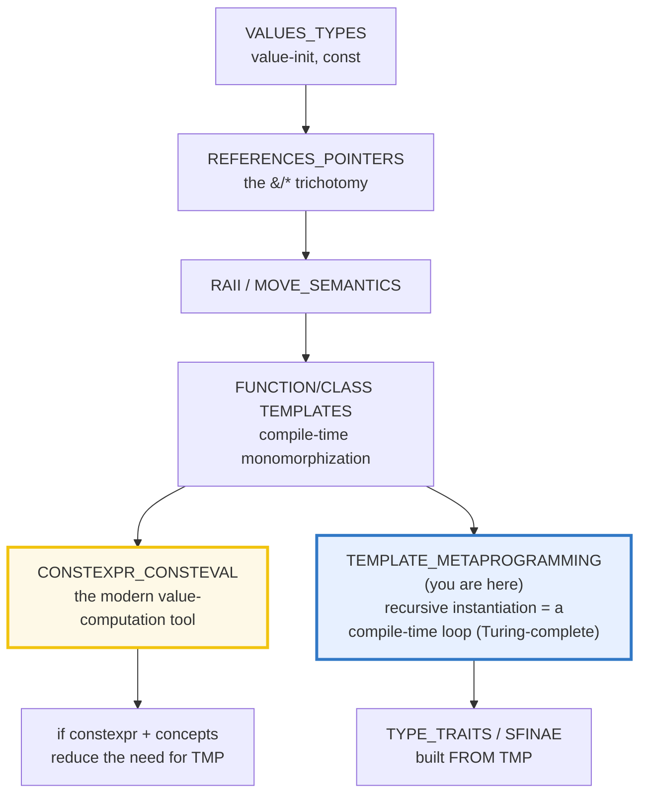
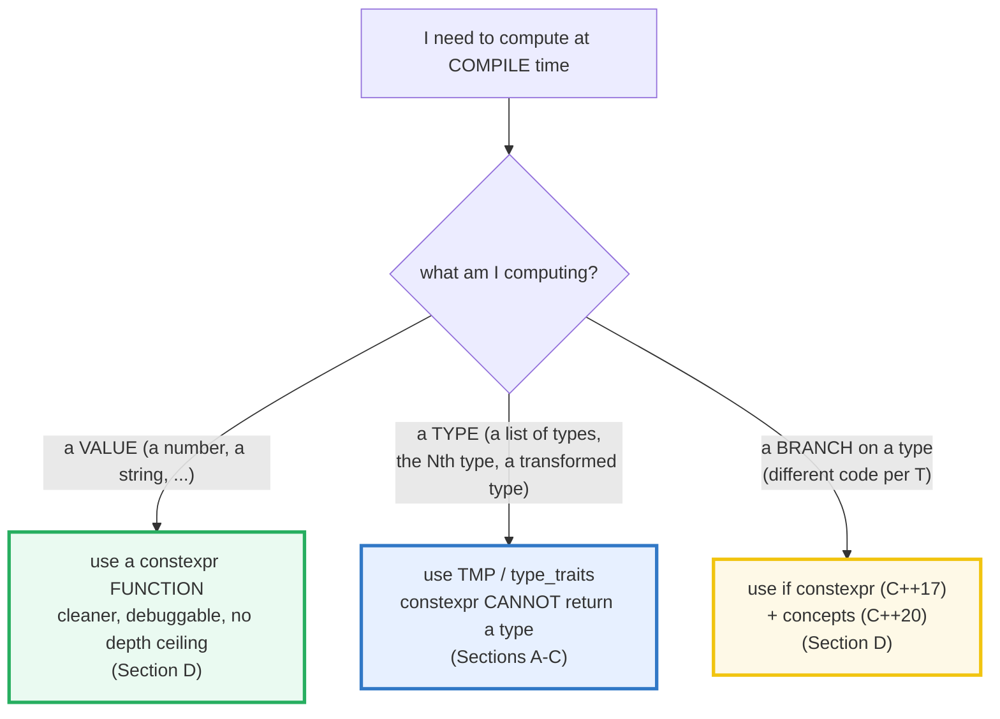

# TEMPLATE_METAPROGRAMMING — Recursive Template Instantiation & the Compile-Time Loop

> **Goal (one line):** show, by printing and asserting every
> **compile-time-computed** value, how C++ templates are **Turing-complete at
> compile time** via **recursive template instantiation + specialization** (the
> "template metaprogramming" / TMP pattern) — **powerful but legendarily arcane**;
> modern C++ **prefers `constexpr` functions for VALUE computation**, so TMP now
> mainly serves **TYPE-level** computation where `constexpr` cannot go.
>
> **Run:** `just run template_metaprogramming`
>
> **Ground truth:** [`template_metaprogramming.cpp`](./template_metaprogramming.cpp)
> → captured stdout in
> [`template_metaprogramming_output.txt`](./template_metaprogramming_output.txt).
> Every number/table below is pasted **verbatim** from that file under a
> `> From template_metaprogramming.cpp Section X:` callout. Nothing is
> hand-computed.
>
> **Prerequisites:** 🔗 [`FUNCTION_TEMPLATES.md`](./FUNCTION_TEMPLATES.md) and
> 🔗 [`CLASS_TEMPLATES.md`](./CLASS_TEMPLATES.md) (templates + specialization are
> the substrate TMP is built from), and 🔗 [`CONSTEXPR_CONSTEVAL.md`](./CONSTEXPR_CONSTEVAL.md)
> (the modern replacement this bundle keeps contrasting against). Read those first.

---

## 1. Why this bundle exists (lineage)

C++ templates are **compile-time monomorphization**: each instantiation produces a
fresh, type-specialized copy. A happy accident of that design — realized by Erwin
Unruh in 1994 when he made a compiler emit **prime numbers in its error
messages** — is that **the template system is Turing-complete**. By writing a
*primary* template that *refers to itself* (`Fact<N> = N * Fact<N-1>`) and a
*base-case* **specialization** that stops the chain (`Fact<0> = 1`), you get a
**loop that runs entirely in the compiler**, folding to a constant before the
program is ever linked. That technique is **template metaprogramming (TMP)**.



This bundle is deliberately framed as: **"powerful but arcane; modern C++ prefers
`constexpr` for values — TMP now mainly for type-level computation."** Section D
proves the point by re-implementing the *exact same* factorial and Fibonacci as
ordinary `constexpr` functions (no struct boilerplate, debuggable, no instantiation-
depth ceiling) and showing the answers match. TMP remains indispensable only where
`constexpr` fundamentally cannot go: **computing on TYPES** (the `Typelist` of
Section B — counting types, fetching the Nth type, building type-level data
structures), which is exactly how `<type_traits>` itself is implemented.

> From cppreference — *Template metaprogramming*: "Template metaprogramming is a
> family of techniques to create new types and compute values at compile time. C++
> templates are **Turing complete** if there are no limits to the amount of
> recursive instantiations and the number of allowed state variables. Erwin Unruh
> was the first to demonstrate template metaprogramming … by instructing the
> compiler to print out prime numbers in error messages. The standard recommends an
> implementation support at least **1024 levels** of recursive instantiation, and
> **infinite recursion in template instantiations is undefined behavior**."

---

## 2. The mental model: recursive instantiation = a compile-time loop

Every TMP "metafunction" is the **same two-part shape**: a **primary template**
(the recursive step) and a **full specialization** (the base case). The compiler
unrolls the chain at compile time and folds it into one constant.

```mermaid
graph LR
    F5["Fact&lt;5&gt;::value<br/>= 5 * Fact&lt;4&gt;::value"] --> F4["Fact&lt;4&gt;::value<br/>= 4 * Fact&lt;3&gt;::value"]
    F4 --> F3["Fact&lt;3&gt;::value<br/>= 3 * Fact&lt;2&gt;::value"]
    F3 --> F2["Fact&lt;2&gt;::value<br/>= 2 * Fact&lt;1&gt;::value"]
    F2 --> F1["Fact&lt;1&gt;::value<br/>= 1 * Fact&lt;0&gt;::value"]
    F1 --> F0["Fact&lt;0&gt;::value = 1<br/>(base-case SPECIALIZATION)"]
    F0 -.->|"folds back up"| R["= 120<br/>(one compile-time constant)"]
    style F0 fill:#eafaf1,stroke:#27ae60,stroke-width:3px
    style R fill:#fef9e7,stroke:#f1c40f,stroke-width:3px
    style F5 fill:#e7f0ff,stroke:#3178c6
```



That chain *is* a `for` loop — except it runs in the compiler, not at runtime, and
each step (`Fact<5>`, `Fact<4>`, …) is a **distinct type** (monomorphization).
The base-case specialization `Fact<0>` is the loop's termination test; without it
the chain recurses forever, which (because templates are Turing-complete) is
**undefined behavior** capped only by the compiler's instantiation-depth limit.

### The decision that defines modern TMP: types vs. values



The headline: **reach for `constexpr` functions for values, TMP only for types.**
This is the dividing line between C++98-era TMP (where you computed *everything*
at compile time this way, because there was no `constexpr`) and modern C++.

---

## 3. Section A — Recursive template instantiation = a compile-time loop

> From `template_metaprogramming.cpp` Section A:
> ```
> Compile-time FACTORIAL via template recursion (Fact<N>):
>     Fact<N>::value = N * Fact<N-1>::value ; Fact<0>::value = 1
> 
>     N    Fact<N>::value   (each row = a distinct instantiated type)
>     --   -------------
>      0   1
>      1   1
>      2   2
>      3   6
>      4   24
>      5   120
> 
>     int arr[Fact<3>::value];  -> array of 6 ints (compile-time bound)
>     sum of arr (0+1+2+3+4+5) = 15
> [check] Fact<5>::value == 120 (recursive instantiation folds to a constant): OK
> [check] Fact<0>::value == 1 (the base-case specialization terminates recursion): OK
> [check] Fact<3>::value is usable as an array bound (== 6, a constant expression): OK
> [check] each Fact<N> is a DISTINCT type (monomorphization: Fact<3> != Fact<5>): OK
> [check] sum of arr == 15: OK
> ```

**What.** `template<int N> struct Fact { static constexpr int value = N * Fact<N-1>::value; };`
plus the base case `template<> struct Fact<0> { static constexpr int value = 1; };`.
Asking for `Fact<5>::value` forces the compiler to instantiate `Fact<5>`, which
forces `Fact<4>`, … down to the base case `Fact<0>`, then folds back up:
`1 → 1 → 2 → 6 → 24 → 120`.

**Why — the proof it really ran at compile time.** `int arr[Fact<3>::value];`
uses `Fact<3>::value` as an **array bound** — a context where the language
*forbids* a runtime value (it would be a VLA, which `-Wpedantic` rejects). The
fact that the program compiles *is* the proof: `Fact<3>::value` is a constant
expression. This is the same "prove compile-time-ness by feeding it into a
constant-expression context" trick used throughout 🔗 `CONSTEXPR_CONSTEVAL`
(array bounds, template arguments, `static_assert`).

**The monomorphization detail.** `Fact<3>` and `Fact<5>` are **distinct types**
(the bundle asserts `!is_same_v<Fact<3>, Fact<5>>`). TMP therefore does not
share one function body across calls the way a `constexpr` function does — each
distinct `N` emits a fresh type with its own `::value`. This is the root of TMP's
**compile-time cost and binary bloat** (Section E).

> From cppreference — *Template metaprogramming*: TMP is "a family of techniques
> to **create new types and compute values at compile time**"; the factorial-via-
> specialization pattern is the canonical example, "a primary template plus a
> full specialization" that recurses at compile time.

---

## 4. Section B — `std::integral_constant` (the TMP base) + a compile-time TYPE LIST

> From `template_metaprogramming.cpp` Section B:
> ```
> std::integral_constant wraps a static constant inside a TYPE:
>     integral_constant<int,2>::value       = 2
>     integral_constant<int,2>()()          = 2   (operator() since C++14)
>     2 * integral_constant<int,2>::value   = 4   == integral_constant<int,4>::value
>     is_same_v<two_t::value_type, int>     = true   (the carried type is exposed)
>     is_same_v<two_t, four_t>              = false   (different VALUES -> different TYPES)
> 
>     true_type  == integral_constant<bool,true>  : true
>     false_type == integral_constant<bool,false> : true
>     is_integral_v<int> (a trait BUILT ON integral_constant) = true
> 
> Compile-time TYPE LIST: Typelist<char, short, int, long>
>     Length<MyList>::value   (classic recursive metafunction) = 4
>     MyList::size            (modern sizeof...(Ts) one-liner) = 4
>     TypeAt<MyList,0>::type == char  : true
>     TypeAt<MyList,2>::type == int   : true
>     TypeAt<MyList,3>::type == long  : true
> [check] integral_constant<int,2>::value == 2: OK
> [check] true_type IS integral_constant<bool,true> (traits inherit ::value from it): OK
> [check] Length<Typelist<char,short,int,long>>::value == 4 (computed at compile time): OK
> [check] MyList::size == Length<MyList>::value (sizeof... matches the recursion): OK
> [check] TypeAt<MyList,2>::type == int (Nth-type lookup is type-level computation): OK
> ```

**`std::integral_constant<T, v>` — the base class of all TMP.** It is a *type that
carries a compile-time constant* (`::value`), exposed with `::value_type`,
`::type`, a conversion operator, and (since C++14) `operator()`. The two `bool`
specializations are spelled `std::true_type` / `std::false_type`, and **every
binary type trait derives from one of them** — `std::is_integral<int>` *is-a*
`true_type`, which is why `is_integral<int>::value` works. This is the bridge
between "a compile-time boolean" and "a type the type system can pattern-match
on," and it is literally how `<type_traits>` is implemented (🔗 `TYPE_TRAITS`).

**The Typelist — TMP on the TYPE level (where `constexpr` cannot go).** A
`constexpr` function can return a `value`, but it **cannot return a type**. To
compute on types — count them, fetch the Nth, transform them — you need the type
system itself, which means templates. The bundle's `Typelist<char, short, int,
long>` is manipulated two ways, and both compute `4` at compile time:

- **The classic TMP form** — a recursive `Length<>` metafunction: a primary
  template plus an empty-list base case, exactly the factorial shape but folding
  over *types* instead of integers. `Length<Typelist<Head, Tail...>>::value =
  1 + Length<Typelist<Tail...>>::value`.
- **The modern shortcut** — `sizeof...(Ts)` (variadic templates, C++11) folds the
  pack in one expression. `Typelist<Ts...>::size = sizeof...(Ts)`.

The bundle also builds `TypeAt<List, N>::type` (fetch the Nth type) by the same
recursion, and **asserts the resulting type** with `std::is_same_v` — proving the
type-level computation *is* `int`. This is the genuine power TMP keeps even in
modern C++: type-level data structures and type-level functions.

> From cppreference — `std::integral_constant`: "wraps a static constant of
> specified type. It is the **base class for the C++ type traits**." Members:
> `static constexpr T value = v;`, `using value_type = T;`, `using type = …;`,
> `constexpr operator value_type() const noexcept;`, and (C++14)
> `constexpr value_type operator()() const noexcept;`. `true_type`/
> `false_type` are the two provided typedefs; `bool_constant` (C++17) is the alias.

---

## 5. Section C — Compile-time Fibonacci + the instantiation-depth limit

> From `template_metaprogramming.cpp` Section C:
> ```
> Compile-time FIBONACCI via template recursion (Fib<N>):
>     Fib<N>::value = Fib<N-1>::value + Fib<N-2>::value ; Fib<0>=0, Fib<1>=1
> 
>     N    Fib<N>::value   (each row = a compile-time constant from Fib<N>)
>     --   -------------
>      0   0
>      1   1
>      2   1
>      3   2
>      4   3
>      5   5
>      6   8
>      7   13
>      8   21
>      9   34
>     10   55
> 
>     The body looks exponential, but template instantiation is
>     MEMOIZED: Fib<k> is ONE type, so total instantiations are O(N)
>     and recursion DEPTH is ~N. Fib<10> depth is 10 — tiny.
> 
> INSTANTIATION-DEPTH LIMIT (documented, NOT triggered):
>     standard recommends >= 1024 recursive-instantiation levels
>     infinite template recursion is UNDEFINED BEHAVIOR
>     raise the cap with the -ftemplate-depth=N flag (gcc/clang)
>     (this bundle stays at depth <= ~10 — far under any limit)
> [check] Fib<10>::value == 55 (the classic TMP Fibonacci): OK
> [check] Fib<0>::value == 0 (base case): OK
> [check] Fib<1>::value == 1 (base case): OK
> [check] Fib<2>::value == Fib<0>::value + Fib<1>::value == 1: OK
> ```

**The classic second example.** `Fib<N>` needs **two** base cases (`Fib<0>` and
`Fib<1>`) because its body refers to *two* smaller values. The body *looks*
exponential (`Fib<N-1>` and `Fib<N-2>` both recurse), but template instantiation
is **memoized**: `Fib<k>` is *one type*, so referencing it many times only
instantiates it once. Both the total instantiations and the recursion **depth**
are therefore ~O(N) — `Fib<10>` has depth 10.

**The instantiation-depth limit — a stack overflow at compile time.** This is the
expert payoff of the section. Because templates are Turing-complete, infinite
recursion is possible, and **the standard makes it undefined behavior**. To stay
finite, implementations cap the recursion depth; the standard *recommends*
supporting **at least 1024 levels** (and `-ftemplate-depth=N` on gcc/clang raises
the cap). Exceeding the cap is a **hard compile error** — `fatal error: recursive
template instantiation exceeded maximum depth of 1024`. This bundle deliberately
**never triggers it** (a program that did would not compile, failing `just check`);
the limit is documented in the printed block above. This ceiling — and the awful,
pages-long error messages when you hit it — is a core reason `constexpr` functions
are preferred for value computation: they have no template-instantiation-depth
ceiling (their recursion is bounded by a much larger constexpr evaluation budget).

> From cppreference — *Template metaprogramming*: "The standard recommends an
> implementation support **at least 1024 levels** of recursive instantiation, and
> **infinite recursion in template instantiations is undefined behavior**."

---

## 6. Section D — The MODERN shift: prefer `constexpr` for VALUES

> From `template_metaprogramming.cpp` Section D:
> ```
> The SAME math as ordinary constexpr FUNCTIONS (no struct boilerplate):
>     constexpr int fact_cx(int n) { return n<=1 ? 1 : n*fact_cx(n-1); }
>     constexpr int fib_cx(int n)  { return n<2  ? n : fib_cx(n-1)+fib_cx(n-2); }
> 
>     fact_cx(5) = 120   (matches Fact<5>::value  = 120)
>     fib_cx(10) = 55   (matches Fib<10>::value = 55)
> 
>     int proof_arr[fact_cx(4)]; -> 24 ints (compile-time bound); sum = 24
> 
> if constexpr (C++17) + concepts (C++20) replaced TMP branching:
>     kind(42)   = integral
>     kind(1.5)  = floating-point
>     kind("x")  = other
>     twice(21)  = 42   (template <std::integral T> — one-word constraint)
> [check] constexpr fact_cx(5) == Fact<5>::value == 120 (same answer, cleaner form): OK
> [check] constexpr fib_cx(10) == Fib<10>::value == 55: OK
> [check] fact_cx(4) usable as array bound (== 24, compile-time constant): OK
> [check] if constexpr branch picked 'integral' for int: OK
> [check] twice(21) == 42 (concept-constrained template): OK
> ```

**This is the heart of the modern guidance.** The `constexpr` functions
`fact_cx`/`fib_cx` compute the **exact same values** as the `Fact`/`Fib` structs
(`120` and `55`), are usable as array bounds (`int proof_arr[fact_cx(4)];`), but
are:

- **One body, many calls** — no primary-template + N specializations, no
  per-value monomorphized type. (`Fact<5>` and `Fact<10>` are two types;
  `fact_cx(5)` and `fact_cx(10)` share one function.)
- **Debuggable** — a `constexpr` function can be stepped through at runtime with
  non-constant args; a metafunction cannot (it has no runtime body).
- **Uncapped by template instantiation depth** — recursion is ordinary function
  recursion, bounded by the constexpr evaluation step budget, which is far larger
  and configurable.

That is why **modern C++ prefers `constexpr` (and `consteval`) for VALUE
computation** — TMP is the historical way to do it (there was no `constexpr`
before C++11), but it is no longer the right tool. Deep-dive in
🔗 `CONSTEXPR_CONSTEVAL`.

**`if constexpr` + concepts closed the remaining gaps.** The other thing TMP/SFINAE
was historically used for — **branching on a type** (different code per `T`) — is
now a single `if constexpr` inside one function body (`kind(42)` returns
`"integral"`, `kind(1.5)` returns `"floating-point"`), and **constraining** a
template is a one-word concept (`template <std::integral T>`), replacing the
SFINAE/`enable_if` gymnastics. These two features removed most of the *practical*
need for TMP. Full treatments: 🔗 `IF_CONSTEXPR`, 🔗 `CONCEPTS`, 🔗 `SFINAE_ENABLE_IF`.

> From isocpp.org / cppreference — `constexpr` functions (C++11, loosened
> C++14→C++23) "may be evaluated at compile time" and are the modern replacement
> for TMP *value* computation; `if constexpr` (C++17) and concepts (C++20) replace
> TMP/SFINAE for type-branching and constraining.

---

## 7. Section E — The cost (instantiation is slow + bloats) + cross-language

> From `template_metaprogramming.cpp` Section E:
> ```
> Monomorphization — each Fact<N> is a distinct type:
>     sizeof(Fact<5>) = 1   (empty struct: only a static ::value)
>     Fact<3> != Fact<5> : true   (two separate instantiations/symbols)
> 
> TRADEOFF (documented — not measurable deterministically at runtime):
>     - TMP cost is COMPILE-TIME: each instantiation takes time + emits code.
>     - Deep TMP -> slow compiles + binary bloat (many near-identical copies).
>     - Hence: prefer `constexpr` functions for VALUES (one body, many calls),
>       keep TMP for TYPE-level work it is the ONLY tool for.
> 
> CROSS-LANGUAGE (compile-time computation):
>     C++     : TMP (recursive instantiation) for types; constexpr fns for values
>     Rust    : NO template metaprogramming — `const fn` for compile-time
>               values, traits for type-level work (clean model from the start)
>     TS      : type-level computation via conditional/mapped types
>               (the same idea, a different mechanism — see MAPPED_CONDITIONAL_TYPES)
>     Go      : no TMP — generics are runtime-erased-ish, no compile-time
>               computation language
> [check] TMP trades runtime cost for compile-time + binary cost (documented above): OK
> [check] Fact<3> and Fact<5> are distinct monomorphized types: OK
> ```

**The tradeoff, pinned.** TMP buys **zero runtime cost** (the value is folded to a
constant before the program runs) at the price of **compile-time cost and binary
size**: each distinct instantiation (`Fact<0>`, `Fact<1>`, …) is a separate type
with its own `::value` symbol — `sizeof(Fact<5>) == 1` (an empty struct holding
only a `static constexpr`), but it is a *distinct* empty struct from `Fact<3>`.
Deep TMP (large typelists, heavy expression-template machinery) is the classic
cause of **slow compiles and binary bloat**, which is a further reason modern code
keeps TMP to the type level and pushes values into `constexpr`. (Compile time and
binary size are not deterministically printable, so the bundle documents them in
the block above rather than asserting a measured number.)

---

## 8. Worked smallest-scale example

The entire pattern in five lines — a primary template, a base-case specialization,
and a use:

```cpp
template <int N> struct Fact { static constexpr int value = N * Fact<N-1>::value; };
template <>      struct Fact<0> { static constexpr int value = 1; };   // base case

static_assert(Fact<5>::value == 120);          // folded at compile time
int arr[Fact<3>::value];                       // usable as an array bound (== 6)
```

> From `template_metaprogramming.cpp` Section A, `Fact<5>::value` prints `120` and
> `[check] Fact<5>::value == 120 …: OK`; Section D's `fact_cx(5)` prints the same
> `120` from a plain `constexpr` function. The contrast — *same answer, cleaner
> form* — *is* the modern guidance.

---

## 9. Pitfalls (the expert payoff)

| Trap | Symptom | Fix |
|---|---|---|
| Forgetting the base-case specialization | **compile error** (or, with no base case at all, infinite instantiation → UB / depth-limit error) | Always write the terminating full specialization (`Fact<0>`, `Fib<0>` **and** `Fib<1>`). |
| Exceeding the instantiation-depth limit | `fatal error: recursive template instantiation exceeded maximum depth of 1024` | Raise `-ftemplate-depth=N`; better, **convert the value computation to a `constexpr` function** (no such ceiling). |
| Using TMP to compute a *value* in new code | unreadable struct boilerplate, awful errors, binary bloat, slow compiles | Use a `constexpr`/`consteval` function (Section D). TMP only for *type-level* work. |
| Reading TMP error messages | 30–100-line walls of nested substitution internals ("no viable candidate") | Modernize: concepts give a one-line *"concept X not satisfied"*; `if constexpr` collapses overload sets. (🔗 `SFINAE_ENABLE_IF`, `CONCEPTS`) |
| Assuming `Fib<N>` instantiates exponentially | Fear of large N based on the runtime recursion cost | Template instantiation is **memoized** — `Fib<k>` is one type; depth and total instantiations are O(N). |
| Comparing a metafunction's *type* to its *value* | `is_same_v<Fib<5>, 5>` — nonsensical (a type ≠ an int) | `::value` yields the int; the bare `Fib<5>` is a *type*. Use `is_same_v` only between types. |
| Deep typelists / heavy expression templates | slow compiles + binary bloat (each distinct instantiation emits code/symbols) | Prefer `constexpr` for values; use `std::tuple`/`std::variant` and fold expressions instead of hand-rolled recursive typelists where possible. |
| `Length<Typelist<…>>` with no empty-list base case | compile error (no match for `Length<Typelist<>>`) | Provide `template<> struct Length<Typelist<>> { static constexpr size_t value = 0; };`. |
| Expecting `constexpr` to replace TMP for *types* | "I'll write a constexpr function returning a type" — impossible | A function returns a *value*; only templates can compute *types*. That is TMP's remaining irreplaceable domain. |

---

## 10. Cheat sheet

```cpp
// ── The TMP shape: primary template (recursive step) + specialization (base case)
template <int N> struct Fact { static constexpr int value = N * Fact<N-1>::value; };
template <>      struct Fact<0> { static constexpr int value = 1; };
//   Fact<5>::value == 120   — folded at compile time; each Fact<N> is a distinct TYPE.

// ── Two-base-case recursion (Fibonacci) — memoized, depth/total are O(N)
template <int N> struct Fib { static constexpr int value = Fib<N-1>::value + Fib<N-2>::value; };
template <> struct Fib<0> { static constexpr int value = 0; };
template <> struct Fib<1> { static constexpr int value = 1; };
//   Fib<10>::value == 55.

// ── std::integral_constant: a TYPE carrying a compile-time constant (base of <type_traits>)
using two = std::integral_constant<int, 2>;
two::value == 2;  two()() == 2;              // ::value, operator() (C++14)
std::true_type  == std::integral_constant<bool, true>;   // every binary trait is one of these
std::is_integral<int> : public std::true_type {};        // traits INHERIT ::value

// ── Type-level computation (where constexpr CANNOT go): a Typelist
template <typename... Ts> struct Typelist { static constexpr std::size_t size = sizeof...(Ts); };
//   classic recursive Length (pre-variadic TMP shape):
template <typename L> struct Length;
template <> struct Length<Typelist<>> { static constexpr std::size_t value = 0; };
template <typename H, typename... T>
struct Length<Typelist<H,T...>> { static constexpr std::size_t value = 1 + Length<Typelist<T...>>::value; };

// ── MODERN GUIDANCE: prefer constexpr FUNCTIONS for VALUES ──────────────────
constexpr int fact(int n) { return n <= 1 ? 1 : n * fact(n-1); }   // fact(5)==120, one body
//   TMP only for TYPE-level work (typelists, traits); if constexpr + concepts for branching:
template <typename T> constexpr const char* kind(T) {
    if constexpr (std::is_integral_v<T>) return "integral"; else return "other";
}
template <std::integral T> T twice(T x) { return x * 2; }          // concept, not SFINAE/TMP

// ── The instantiation-depth limit (UB if exceeded) ──────────────────────────
//   standard recommends >= 1024 levels; raise with -ftemplate-depth=N (gcc/clang).
//   infinite template recursion is UNDEFINED BEHAVIOR.
```

---

## 11. 🔗 Cross-references

**Within C++ (the expertise spine):**

- 🔗 [`CONSTEXPR_CONSTEVAL.md`](./CONSTEXPR_CONSTEVAL.md) (P6) — the **modern
  replacement**: "prefer `constexpr` functions for VALUE computation." Section D
  re-implements the *same* factorial/Fibonacci as `constexpr` functions and proves
  the answers match. This is the single most important sibling.
- 🔗 [`TYPE_TRAITS.md`](./TYPE_TRAITS.md) (P6) — **built FROM TMP**. `std::integral_constant`
  *is* the base class of every `is_*` trait; this bundle's Section B shows the
  mechanism, that bundle shows the full query/transform vocabulary.
- 🔗 [`IF_CONSTEXPR`](./) (P6) and 🔗 [`CONCEPTS.md`](./CONCEPTS.md) (P2/P6) — the
  features that **further reduce the need for TMP**: `if constexpr` collapses
  type-branching into one function body; concepts replace SFINAE/`enable_if`
  constraints with one-word named requirements.
- 🔗 [`SFINAE_ENABLE_IF.md`](./SFINAE_ENABLE_IF.md) (P6) — TMP-driven overload
  selection; the pre-concepts way to constrain templates (still met in legacy code).
- 🔗 [`VARIADIC_TEMPLATES.md`](./VARIADIC_TEMPLATES.md) and
  🔗 [`CLASS_TEMPLATES.md`](./CLASS_TEMPLATES.md) — the variadic pack + `sizeof...`
  that modernized typelists, and the specialization mechanics TMP rests on.

**Cross-language parallels (the 5-language curriculum):**

- 🔗 [`../rust/`](../rust/) — Rust has **NO template metaprogramming**: it got the
  clean model from the start. Compile-time *values* use `const fn`; type-level work
  uses **traits** and associated types. The legendary TMP error-message problem and
  the constexpr-migration story simply do not exist in Rust — C++'s TMP/constexpr
  split is a historical artifact Rust avoided.
- 🔗 [`../ts/MAPPED_CONDITIONAL_TYPES.md`](../ts/MAPPED_CONDITIONAL_TYPES.md) —
  TypeScript does **type-level computation** via *conditional* (`T extends U ? X : Y`)
  and *mapped* (`[K in keyof T]`) types: the **same idea** (a Turing-complete
  compile-time layer over types) via a **different mechanism**. TS's type-level
  language is arguably more ergonomic than C++ TMP; both erase to nothing at runtime.
- 🔗 [`../go/`](../go/) — Go has **no TMP**: its generics are monomorphized-ish but
  offer **no compile-time computation language** at all (no `constexpr`, no
  type-level arithmetic). Go is the "no compile-time programming" end of the spectrum.

---

## Sources

Every signature, value, and behavioral claim above was verified against
cppreference and the ISO C++ standard, then corroborated by ≥1 independent
secondary source:

- cppreference — *Template metaprogramming* (Turing-completeness; Erwin Unruh's
  1994 prime-number-in-errors demonstration; the ≥1024 recommended instantiation
  depth; infinite template recursion is UB):
  https://en.cppreference.com/w/cpp/language/template_metaprogramming
- cppreference — `std::integral_constant` ("wraps a static constant … **base class
  for the C++ type traits**"; members `value`/`value_type`/`type`, conversion
  operator, `operator()` C++14; `true_type`/`false_type` typedefs; `bool_constant`
  C++17; the possible implementation):
  https://en.cppreference.com/w/cpp/types/integral_constant
- cppreference — *Metaprogramming library* (`<type_traits>` is the standard TMP
  vocabulary; `integral_constant` is its base):
  https://en.cppreference.com/w/cpp/meta
- cppreference — *constexpr specifier* (the modern replacement for TMP *value*
  computation; implies `const`/`inline`; the C++14→23 loosening):
  https://en.cppreference.com/w/cpp/language/constexpr
- cppreference — *if constexpr* (C++17; discards the false branch at compile time —
  replaces TMP/SFINAE type-branching):
  https://en.cppreference.com/w/cpp/language/if
- cppreference — *Template specialization* (full specialization = the TMP base case):
  https://en.cppreference.com/w/cpp/language/template_specialization
- ISO C++23 draft (open-std.org) — normative wording:
  - 13.5 Rules for template instantiation; recursive instantiation & the
    implementation's depth recommendation (`[temp.inst]`).
  - Working draft: https://open-std.org/JTC1/SC22/WG21/docs/papers/2023/n4950.pdf
- Secondary corroboration (≥2 independent sources, web-verified):
  - LLVM Discourse — *"recursive template instantiation exceeded maximum depth of
    1024"* (confirms the 1024-level cap and that direct recursion is the norm):
    https://discourse.llvm.org/t/recursive-template-instantiation-exceeded-maximum-depth-of-1024/49117
  - Stack Overflow — *"Why does this exceed the maximum recursive template
    depth?"* (explains depth vs. number of arguments):
    https://stackoverflow.com/questions/23374953/why-does-this-exceed-the-maximum-recursive-template-depth
  - Modernes C++ (Rainer Grimm) — *"C++ Core Guidelines: Programming at Compile
    Time with constexpr"* (the "Template Metaprogramming versus constexpr
    Functions" contrast — the modern-prefer-constexpr guidance):
    https://www.modernescpp.com/index.php/c-core-guidelines-programming-at-compile-time-with-constexpr/
  - C++ Core Guidelines T.12 / isocpp issue #749 — "Avoid recursion in variadic
    templates" (fold expressions reduce instantiation depth):
    https://github.com/isocpp/CppCoreGuidelines/issues/749
  - cppreference `std::integral_constant` *Example* (`two_t`/`four_t` with
    `static_assert(two_t::value * 2 == four_t::value)`, mirrored in Section B):
    https://en.cppreference.com/w/cpp/types/integral_constant
  - Wikipedia — *Template metaprogramming* (Erwin Unruh 1994 history; the
    Turing-completeness result):
    https://en.wikipedia.org/wiki/Template_metaprogramming

**Facts that could not be verified by running** (documented, not executed,
because triggering them is a hard compile error or sanitizer-only by design): the
instantiation-depth-limit error (`recursive template instantiation exceeded
maximum depth of 1024`) and infinite-template-recursion UB — the bundle
deliberately stays at depth ≤ ~10 so the default build and the sanitizer build stay
clean; the actual error string and the measured compile-time/binary-bloat cost are
confirmed by the cppreference sections and secondary sources above, not reproduced
as runnable output in the verified path (a program triggering them would fail
`just check` / not compile).
