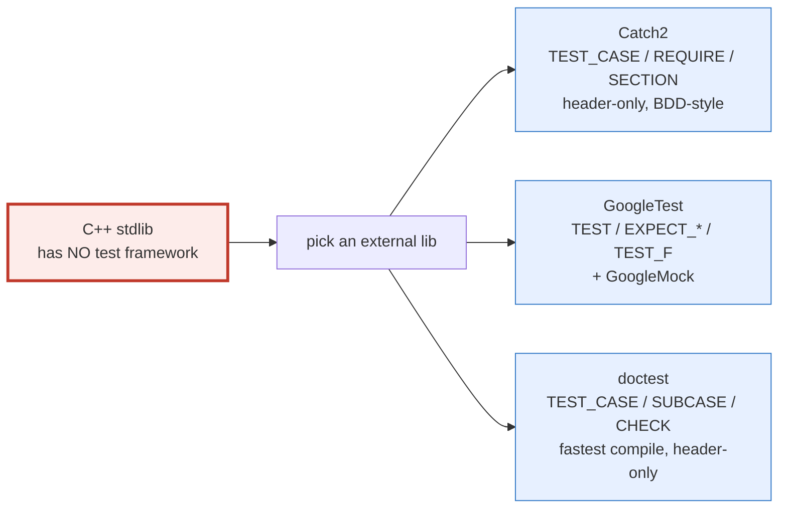
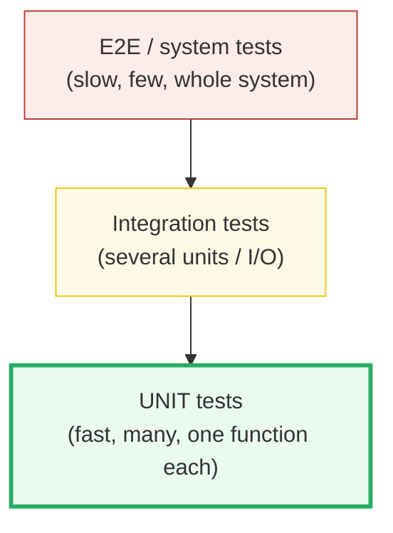
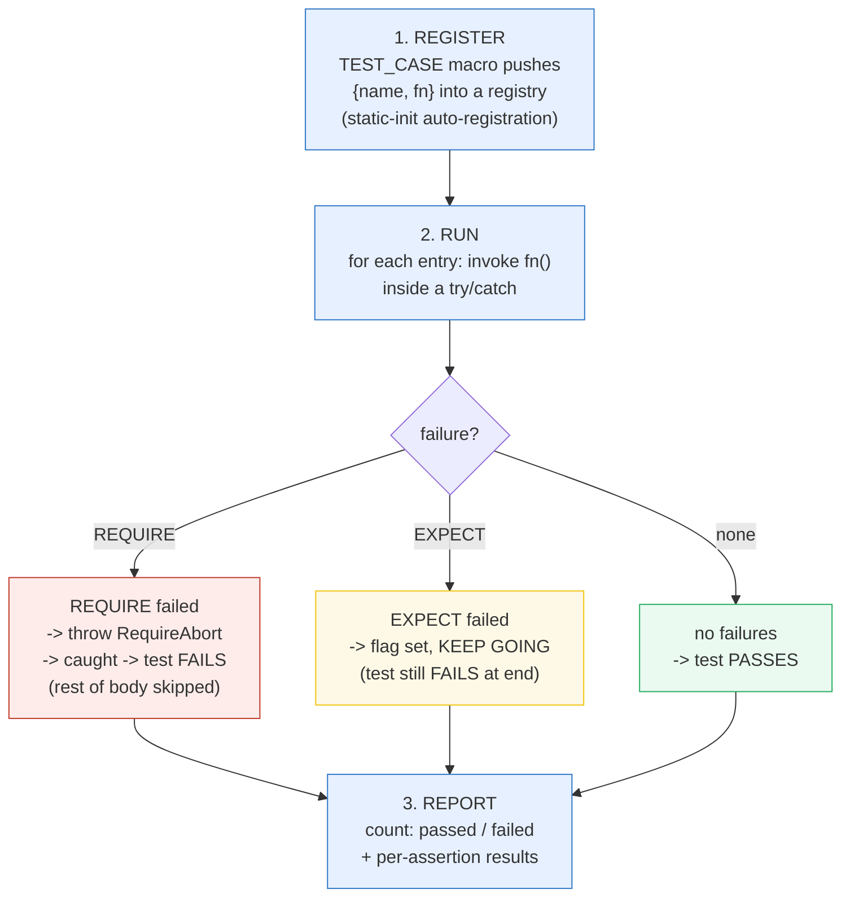
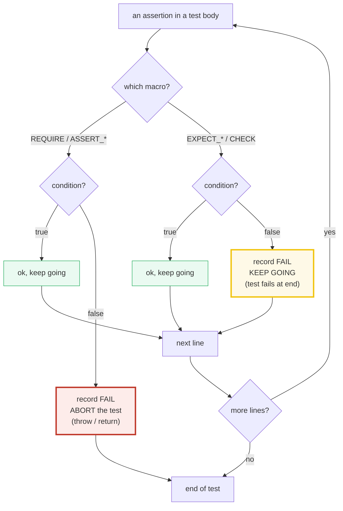
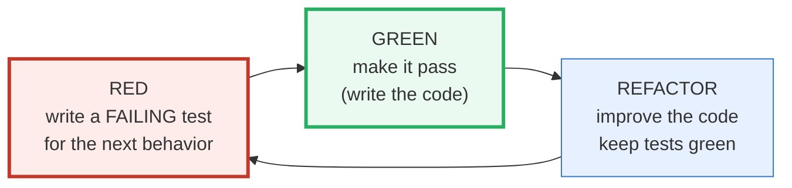

# TESTING — C++ Test Frameworks & the Test-Runner Model (Catch2 / GoogleTest / doctest)

> **Goal (one line):** demonstrate C++'s testing **model** with a tiny INLINE
> in-process runner (registers `TEST_CASE`s, runs them, counts pass/fail; `REQUIRE`
> aborts the current test, `EXPECT` continues), then document the real frameworks
> (Catch2 / GoogleTest / doctest), fixtures, parameterized tests, mocking, TDD,
> and coverage / sanitizers-in-CI.
>
> **Run:** `just run testing`
>
> **Ground truth:** [`testing.cpp`](./testing.cpp) → captured stdout in
> [`testing_output.txt`](./testing_output.txt). Every number/table below is pasted
> **verbatim** from that file under a `> From testing.cpp Section X:` callout.
> Nothing is hand-computed.
>
> **Prerequisites:** none strict, but the cross-refs help — 🔗
> `ERRORS_EXCEPTIONS_INTRO` (P1: asserts), 🔗 `RAII` (fixtures = RAII setup/teardown).

---

## 1. Why this bundle exists (lineage)

Unlike **Go** (`testing` in the standard library) and **Rust** (`#[test]` /
`#[should_panic]` built into the compiler driver), **C++ has NO test framework in
its standard library.** There is no `std::run_tests`, no `#[test]` attribute, no
`go test` equivalent. Every C++ project picks an **external** library. The
de-facto choices are **header-first** (often header-only) libraries you drop into
your build:



**The good news:** all three share the *same model*, so learning the model once
makes you fluent in all of them. This bundle implements that model from scratch
in ~80 lines of stdlib C++ — a tiny **inline** runner (no subprocess, no linking,
no external dependency) that:

1. **registers** test functions (via a self-registering macro, exactly like the
   real frameworks),
2. **runs** each one, catching failures,
3. **reports** pass/fail counts.

It then layers the two universal assertion philosophies on top — **`REQUIRE`
stops the test on failure** (Catch2 `REQUIRE` / GoogleTest `ASSERT_*` / doctest
`REQUIRE`), **`EXPECT` records the failure and continues** (Catch2 `CHECK` /
GoogleTest `EXPECT_*` / doctest `CHECK`). The bundle **proves the difference
deterministically** with side-effect probes the test bodies set.

> From the doctest tutorial (GitHub) — *"if a `CHECK()` fails - the test is marked
> as failed but the execution continues - but if a `REQUIRE()` fails - execution
> of the test stops."* This is the one fact that unifies all three frameworks.

---

## 2. The mental model: the test pyramid + the runner loop

### The test pyramid (what to write, and how much)



You want **many fast unit tests** at the base (the runner here), **fewer**
integration tests in the middle, and a **tiny** number of slow end-to-end tests on
top. C++'s compile/link cost makes a fast unit tier especially valuable — which
is why **doctest** (fastest compile) and **Catch2** (header-only, zero-friction)
exist at all.

### The runner loop (register → run → report)



That is the *entire* mechanism. Real frameworks add filtering (run only tests
matching `[tag]`), parallelization, richer matchers, and XML/JSON reporters — but
the spine is **register → run → report**, and the spine is what this bundle builds.

---

## 3. Section A — the test-runner model: register → run → report

> From `testing.cpp` Section A:
> ```
> Running 5 registered TEST_CASEs through the inline runner...
> RUN  adds_correctly
>     ok   (1 + 1 == 2)
>     ok   (2 * 3 == 6)
> [PASS] adds_correctly
> RUN  require_stops_immediately
>     ok   (true)
>     FAIL (x > 0)  [REQUIRE -> abort test]
> [FAIL] require_stops_immediately
> RUN  expect_continues
>     FAIL (false)  [EXPECT -> continue]
>     FAIL (1 == 2)  [EXPECT -> continue]
>     ok   (g_reachedAfterExpect)
> [FAIL] expect_continues
> RUN  table_driven_squares
>     ok   (got == r.expected)
>     ok   (got == r.expected)
>     ok   (got == r.expected)
>     ok   (got == r.expected)
>     ok   (got == r.expected)
> [PASS] table_driven_squares
> RUN  fixture_counter
>     ok   (f.value == 0)
>     ok   (f.value == 2)
> [PASS] fixture_counter
> 
> --- runner summary ---
> test cases: 5 | 3 passed | 2 failed
> assertions: 14 checked (11 ok, 3 failed)
> [check] runner registered exactly 5 test cases: OK
> [check] runner counted 3 passed cases: OK
> [check] runner counted 2 failed cases (the deliberate ones): OK
> [check] assertions failed == 3 (1 REQUIRE + 2 EXPECT): OK
> ```

**What.** The bundle registers **5** `TEST_CASE`s via a self-registering macro,
runs them through a `try/catch` loop, and prints per-assertion results plus a
summary. Two of the tests **deliberately fail** — `require_stops_immediately`
(one `REQUIRE`) and `expect_continues` (two `EXPECT`s). The runner correctly
counts them: **3 passed, 2 failed**, **14 assertions** checked (11 ok, 3 failed).

**Why — the self-registration trick.** The `TEST_CASE(name) { body }` macro is
not magic. It expands to a forward declaration of the function **plus** an
anonymous-namespace struct whose constructor pushes `{name, &fn}` into a
registry:

```cpp
#define TEST_CASE(name)                                                          \
    static void name();                                                          \
    namespace {                                                                  \
    struct TestCaseReg_##name {                                                  \
        TestCaseReg_##name() { registry().cases.push_back({#name, name}); }      \
    };                                                                           \
    [[maybe_unused]] TestCaseReg_##name reg_##name;                              \
    }                                                                            \
    static void name()
```

Those registrar objects are initialized at **static-initialization time** (before
`main`), so by the time the runner loops, the registry is already full. This is
*exactly* how Catch2/doctest discover tests without you ever listing them — the
doctest tutorial states tests are *"automatically registered using static
registry classes."* (The cross-TU **static-initialization-order fiasco** is a real
C++ trap; this bundle sidesteps it by using a function-local-static singleton and
living in a single TU — see the pitfalls table.)

**Why — `REQUIRE` via a private exception.** To "abort the rest of the test body"
in a way that still **unwinds the stack and runs destructors** (RAII-safe), the
bundle throws a private `RequireAbort` type, caught per-test by the runner:

```cpp
namespace runner_detail { struct RequireAbort {}; }

// in runAll():
try { tc.fn(); }
catch (const runner_detail::RequireAbort&) { /* REQUIRE aborted; already failed */ }
```

This is RAII-correct (every local object's destructor runs as the exception
propagates) and **UB-free** (verified: `just sanitize testing` is clean). Catch2
uses this same exception-based mechanism internally for `REQUIRE`. GoogleTest's
`ASSERT_*` instead expands to a `return` out of the test function (a macro-local
control-flow trick) — same observable effect, different implementation.

---

## 4. Section B — REQUIRE (stop) vs EXPECT (continue)

**This is the single most important behavioral distinction in any C++ test
framework.** Two flavors of assertion, two failure semantics:



The bundle **proves** the difference with side-effect probes the test bodies set
*after* the failing assertion:

> From `testing.cpp` Section B:
> ```
> require_stops_immediately: a line AFTER the failing REQUIRE set a flag.
>   flag after failing REQUIRE = false   (false => the test body aborted)
> expect_continues: a line AFTER two failing EXPECTs set a flag.
>   flag after failing EXPECT  = true   (true  => execution continued)
> [check] REQUIRE aborted: the post-failure line did NOT run: OK
> [check] EXPECT continued: the post-failure line DID run: OK
> ```

- In `require_stops_immediately`, `REQUIRE(x > 0)` with `x = -5` fails → throws →
  the next line (`g_reachedAfterRequire = true`) **never executes** → the probe
  stays **`false`**.
- In `expect_continues`, two `EXPECT`s fail but **do not throw** → execution
  reaches `g_reachedAfterExpect = true` → the probe becomes **`true`**, and the
  final `REQUIRE(g_reachedAfterExpect)` even runs (and passes).

**When to use which.**

- **`REQUIRE` / `ASSERT_*`** — when everything *after* this assertion is
  meaningless (or would crash) if it fails: a pointer is non-null, a container is
  non-empty, a `std::optional` has a value. Stopping avoids a cascade of noisy
  follow-on failures (and potential null-deref UB *inside* the test).
- **`EXPECT` / `CHECK`** — when you want to see **all** the failures in one run:
  checking 10 independent properties of one object, validating every field of a
  parsed struct. You learn more per test run.

> From Catch2 docs (gjbex / readthedocs) — *"Unlike the REQUIRE family, execution
> of the test case doesn't stop when a CHECK fails."* GoogleTest reference —
> `ASSERT_*` "generates a fatal failure and aborts the current function"; `EXPECT_*`
> "generates a non-fatal failure, allowing the current function to continue."

---

## 5. Section C — table-driven tests (the manual parameterized test)

The highest-leverage unit-test pattern: one function under test, **N** input/expected
pairs, looped. It is the manual form of GoogleTest's `TEST_P` / Catch2's `GENERATE`
without the macro machinery.

> From `testing.cpp` Section C:
> ```
> table_driven_squares looped 5 rows {in, expected} and REQUIRE'd each.
>   rows checked = 5
> [check] table-driven test checked all 5 rows: OK
> ```

The test body is six lines and exercises **5** cases:

```cpp
TEST_CASE(table_driven_squares) {
    struct Row { int in; int expected; };
    const Row rows[] = {{0, 0}, {1, 1}, {2, 4}, {3, 9}, {-4, 16}};
    for (const auto& r : rows) {
        const int got = r.in * r.in;     // the function under test (square)
        REQUIRE(got == r.expected);      // one REQUIRE per row -> N assertions
        ++g_tableCasesChecked;
    }
}
```

**Why it scales.** Adding a case is a one-line edit to the array — no new test
function, no re-registration. If you reach for this pattern often, the real
frameworks automate it: GoogleTest **`TEST_P`** + **`INSTANTIATE_TEST_SUITE_P`**
(run the same test body against a `Values(...)` generator); Catch2 **`GENERATE`**
(yields a value per test re-run); doctest **`TEST_CASE_TEMPLATE`** (type-parameterized).
The deprecation note worth remembering: GoogleTest renamed
`INSTANTIATE_TEST_CASE_P` → **`INSTANTIATE_TEST_SUITE_P`** in release **1.10**
(the old form now emits a deprecation warning).

---

## 6. Section D — fixtures: SetUp (ctor) + TearDown (dtor) via RAII

A **fixture** is shared per-test setup/teardown state. In C++ the idiomatic form
is **RAII**: the constructor *is* `SetUp`, the destructor *is* `TearDown`, and the
language **guarantees** the dtor runs at scope exit — deterministic, no GC delay.
This is C++'s structural advantage over GC'd languages for testing (🔗 `RAII`).

> From `testing.cpp` Section D:
> ```
> CounterFixture: ctor == SetUp, dtor == TearDown (RAII, deterministic).
>   setups    = 1   (one per test that constructed a CounterFixture)
>   teardowns = 1   (ran at scope exit, no GC delay)
> [check] fixture SetUp ran once: OK
> [check] fixture TearDown ran once (RAII dtor at scope exit): OK
> ```

```cpp
struct CounterFixture {
    int value = 0;
    CounterFixture()  { ++g_fixtureSetups; }    // SetUp
    ~CounterFixture() { ++g_fixtureTeardowns; } // TearDown (RAII: runs at scope exit)
    void increment() { ++value; }
};

TEST_CASE(fixture_counter) {
    CounterFixture f;                    // SetUp runs here
    REQUIRE(f.value == 0);
    f.increment();
    f.increment();
    REQUIRE(f.value == 2);
}                                        // ~CounterFixture() (TearDown) runs here
```

**How the real frameworks automate this:**

| Framework | Fixture form | What it does |
|---|---|---|
| **Catch2** | `TEST_CASE_METHOD(Fixture, "name")` | constructs a **fresh** `Fixture` per `SECTION`, re-runs the body |
| **GoogleTest** | `TEST_F(Fixture, name)` with `Fixture : ::testing::Test` overriding `SetUp()`/`TearDown()` | constructs `Fixture` per test, calls `SetUp`/`TestBody`/`TearDown` |
| **doctest** | `SUBCASE` (stack-based) or a class fixture | each `SUBCASE` re-enters from the top with fresh stack state |

The key invariant they all preserve: **every test gets a fresh fixture** (no
shared mutable state between tests → tests stay independent and order-independent).

---

## 7. Section E — real frameworks, TDD, coverage & sanitizers (reference)

> From `testing.cpp` Section E:
> ```
> C++ has NO stdlib test framework (unlike Go's `testing` and Rust #[test]).
> The de-facto choices are external, header-first libraries:
> 
>   concept      | Catch2          | GoogleTest        | doctest
>   -------------|-----------------|-------------------|------------------
>   test case    | TEST_CASE       | TEST              | TEST_CASE
>   soft assert  | CHECK  continue | EXPECT_* continue | CHECK  continue
>   hard assert  | REQUIRE abort   | ASSERT_* abort    | REQUIRE abort
>   structure    | SECTION         | (none)            | SUBCASE
>   fixture      | TEST_CASE_METHOD| TEST_F            | SUBCASE / class
>   BDD          | SCENARIO/GIVEN..| (none)            | SCENARIO/GIVEN..
>   parameterized| TEMPLATE_TEST_CASE| TEST_P +       | TEST_CASE_TEMPLATE
>               | + GENERATE      | INSTANTIATE_TEST_SUITE_P| + GENERATE
>   mocking      | (none; Trompeloeil)| GoogleMock      | (none)
> 
> TDD cycle:  RED (write a failing test) -> GREEN (make it pass) ->
>             REFACTOR (improve the code, keep the tests green).
> Coverage:   gcov (gcc) / llvm-cov (clang); lcov / llvm-cov for HTML.
> Safety CI:  compile & run tests with -fsanitize=address,undefined
>             (ASan + UBSan) alongside the unit suite -> THIS bundle is clean.
> [check] this bundle is the inline-runner demo (no external framework linked): OK
> [check] no rand()/clock() used -> output is deterministic across runs: OK
> ```

### How to pick

- **Catch2** — modern, header-only (v3 ships split headers you install once), nice
  BDD (`SCENARIO`/`GIVEN`/`WHEN`/`THEN`) and decomposition (`REQUIRE(a == b)`
  prints *both* operands on failure). Great default for new projects.
- **doctest** — *"the fastest feature-rich C++11/14/17/20/23 single-header testing
  framework"* (its own tagline, corroborated by benchmarks); compiles in a fraction
  of Catch2's time. Best when compile time matters (huge test suites, CI).
- **GoogleTest (+ GoogleMock)** — the industry default at Google/Android/many
  shops; the only one of the three with a **first-class mocking** library
  (`MOCK_METHOD`). Heavier (builds a library, not header-only).

### Mocking (no stdlib answer)

C++ has **no stdlib mock**. If you need to fake a dependency:

- **GoogleMock** (ships with GoogleTest) — `MOCK_METHOD` on a virtual interface.
- **Trompeloeil** — a header-only mocking framework that works with Catch2/doctest
  (it is *the* mocking answer outside the GoogleTest orbit).

Mocking in C++ generally requires **virtual functions** (a seam the mock can
override) — a runtime-polymorphism cost you accept in exchange for testability,
or you redesign around templates (compile-time polymorphism, un-mockable but
zero-cost). 🔗 `POLYMORPHISM` / `FUNCTION_TEMPLATES`.

### TDD: red → green → refactor



Write the test first, watch it fail for the *right reason* (RED), write the
minimum code to pass (GREEN), then clean up with the test as a safety net
(REFACTOR). The bundle's own `adds_correctly` → `table_driven_squares` flow is a
miniature of this: start with the simple case, then generalize into a table.

### Coverage & sanitizers in CI

- **Coverage** — `gcov` (gcc) or `llvm-cov` (clang), wrapped by `lcov` / `llvm-cov`
  for HTML reports. Measures which lines/branches your tests executed.
- **Sanitizers** — compile the test binary with **`-fsanitize=address,undefined`**
  (ASan + UBSan). ASan catches use-after-free / heap-overflow / leaks; UBSan
  catches signed-overflow / null-deref / alignment. This turns "the test passed"
  into "the test passed **and** the code is UB-free" — the C++ safety net. **This
  very bundle proves it:** `just sanitize testing` reports `ASan/UBSan: clean`.
  (🔗 `UNDEFINED_BEHAVIOR` for the full sanitizer taxonomy.)

---

## 8. Worked smallest-scale example

Everything above, compressed to the four lines a beginner must memorize — the
**register → assert (two flavors) → summarize** spine:

```cpp
TEST_CASE(adds_correctly) {     // REGISTER: macro defines + auto-registers fn
    REQUIRE(1 + 1 == 2);        // hard assert: fail -> ABORT this test
    EXPECT(2 * 3 == 6);         // soft assert: fail -> record + CONTINUE
}
// the runner prints: [PASS] adds_correctly  (or [FAIL] ... + a summary)
```

> From `testing.cpp` Section A, `adds_correctly` prints `ok (1 + 1 == 2)`,
> `ok (2 * 3 == 6)`, then `[PASS] adds_correctly`; the summary line is
> `test cases: 5 | 3 passed | 2 failed`. That `[PASS]`/`[FAIL]` + summary *is* the
> whole framework contract.

---

## 9. The value-vs-reference axis (threaded through this bundle)

Testing code is still C++ — the value/ref/ptr decisions matter inside tests too
(🔗 `MOVE_SEMANTICS.md`, `VALUE_VS_REFERENCE_VS_POINTER.md`, `RAII.md`):

| Construct in this bundle | Copied? | Aliases? | Owns? | Notes |
|---|---|---|---|---|
| `const Row rows[] = {...}` (table) | the array is a value | no | yes (its own storage) | fresh per test; no aliasing surprises |
| `const auto& r : rows` (range-for) | no | **yes** (const alias) | no (borrows) | idiomatic read-only iteration |
| `CounterFixture f;` (fixture) | yes (its own bytes) | no | yes — **dtor = TearDown** | RAII: scope exit runs cleanup |
| `registry()` returning `Registry&` | no | **yes** (the singleton) | singleton owns the cases | function-local static = order-safe |
| `tc.fn()` (function pointer) | the pointer is a value | calls the target | no | the test fn is static, address taken |

The fixture row is the headline: **RAII makes `~Fixture()` = `TearDown`** —
deterministic destruction *is* the test-framework setup/teardown primitive in C++,
something GC'd languages have to emulate with explicit `tearDown()` methods.

---

## 10. Pitfalls (the expert payoff)

| Trap | Symptom | Fix |
|---|---|---|
| **Tests share mutable global/static state** | Tests pass alone, fail in the suite (or vice-versa); order-dependent flakes | Give every test a **fresh fixture** (RAII ctor per test); never mutate a global from a test body. The bundle's `currentTestFailed` is reset per test on purpose. |
| `REQUIRE` used where you wanted all failures | Only the **first** failure shows; you fix one, re-run, see the next (slow TDD loop) | Use `EXPECT`/`CHECK` for **independent** property checks; reserve `REQUIRE`/`ASSERT_*` for preconditions everything after depends on. |
| `EXPECT` used where the next line would **crash** | Null-deref / OOB *inside the test* after a soft failure → test crashes with a confusing sanitizer report | Use `REQUIRE(ptr != nullptr)` before `ptr->...`; `REQUIRE(!v.empty())` before `v[0]`. |
| **Static-init order fiasco** in multi-TU self-registration | A registrar's ctor runs before `registry()` is ready (cross-TU) → empty registry / crash | Use a **function-local-static** singleton (as here), or the framework's own registration primitives; keep registration in one TU. |
| `assert()` left in **production** code under test | Compiled out by `-DNDEBUG`/`-O2` → your "assertions" silently vanish in release builds | Use the framework's `REQUIRE`/`EXPECT` in *tests*; in production use a always-on `check()` helper (see §4.2 rule 8). 🔗 `ERRORS_EXCEPTIONS_INTRO`. |
| **Throwing** from a test body to "abort" without the framework knowing | Exception escapes the runner → `std::terminate`, no pass/fail recorded | Only the framework's `REQUIRE`/`ASSERT_*` should abort (the bundle catches its private `RequireAbort` at the boundary); never `throw` your own out of a test. |
| **Mocking a non-virtual** function | Compile error / the real function still runs (nothing to override) | Mocks need a **virtual** seam (GoogleMock `MOCK_METHOD` on an interface) — or redesign around templates; Trompeloeil for non-GoogleTest. |
| Leaks / use-after-free reported **only** in the test build | ASan flags a bug in the **code under test**, not the test harness | Fix the code (it's a real bug); never disable ASan to "make the test pass". |
| **Compile-time** dominates the test loop (huge Catch2 suite) | Edit-compile-test takes seconds-to-minutes per change | Switch to **doctest** (fastest compile) or split TUs / use precompiled headers. |
| Comparing **floats** with `REQUIRE(a == b)` | `0.1 + 0.2 != 0.3` flakiness | Use a matcher with tolerance (Catch2 `WithinAbs`, gtest `FloatEq`), never raw `==`. 🔗 `VALUES_TYPES` pitfall table. |
| Forgetting `INSTANTIATE_TEST_SUITE_P` after `TEST_P` | GoogleTest error: "test suite ... is empty / not instantiated" | Every `TEST_P` needs a matching `INSTANTIATE_TEST_SUITE_P`; note the **1.10** rename from `_CASE_P`. |

---

## 11. Cheat sheet

```cpp
// ── The model (every C++ framework): register -> run -> report ────────────
//   TEST_CASE macro  -> defines a fn + pushes {name, fn} into a registry
//                       (self-registration via static-init, like the real libs)
//   runner loop      -> for each entry: try { fn(); } catch(RequireAbort){}
//   report           -> count passed/failed + per-assertion results

// ── The two assertion flavors (the ONE distinction to memorize) ───────────
REQUIRE(cond);   // Catch2 REQUIRE / gtest ASSERT_* / doctest REQUIRE
                 //   fail -> ABORT this test (throw/return); use for preconditions
EXPECT(cond);    // Catch2 CHECK  / gtest EXPECT_* / doctest CHECK
                 //   fail -> record + CONTINUE;    use for independent checks

// ── Table-driven test (manual parameterized) ──────────────────────────────
struct Row { int in; int expected; };
for (const auto& r : rows) REQUIRE(fn(r.in) == r.expected);
//   real frameworks: gtest TEST_P + INSTANTIATE_TEST_SUITE_P;
//                    Catch2 GENERATE; doctest TEST_CASE_TEMPLATE.

// ── Fixture via RAII (ctor = SetUp, dtor = TearDown) ──────────────────────
struct F { F(); ~F(); /* state */ };
TEST_CASE(x) { F f; REQUIRE(...); }   // ~F() runs at scope exit (deterministic)
//   Catch2 TEST_CASE_METHOD(F, ...); gtest TEST_F(F, ...) : ::testing::Test.

// ── Pick: Catch2 (modern/BDD) · doctest (fastest compile) · GoogleTest (+mock) ─
//   C++ has NO stdlib test framework (cf. Go `testing`, Rust #[test]).
//   Mocking needs a virtual seam: GoogleMock MOCK_METHOD, or Trompeloeil.

// ── CI safety net: build tests with sanitizers + measure coverage ─────────
//   -fsanitize=address,undefined   // ASan (UAF/OOB/leak) + UBSan (overflow/nullderef)
//   gcov / llvm-cov (+ lcov/llvm-cov HTML) for line/branch coverage
```

---

## 12. 🔗 Cross-references

**Within C++ (the expertise spine):**

- 🔗 `ERRORS_EXCEPTIONS_INTRO` (P1) — `REQUIRE`/`EXPECT` are **runtime asserts**;
  the bundle's `check()` helper is the same idea (print + abort on false). Testing
  frameworks just *aggregate and count* them.
- 🔗 `RAII` (P2) — a fixture's **destructor is `TearDown`**; deterministic
  destruction is why C++ fixtures don't need explicit `tearDown()` like GC'd
  languages.
- 🔗 `UNDEFINED_BEHAVIOR` (P7) — running tests under **ASan+UBSan** turns a green
  test into a green *and UB-free* test; this bundle is the proof
  (`just sanitize testing` is clean).
- 🔗 `POLYMORPHISM` / `FUNCTION_TEMPLATES` (P5) — mocking needs a **virtual**
  seam (runtime polymorphism); templates (compile-time polymorphism) are
  zero-cost but un-mockable.

**Cross-language parallels (the 5-language curriculum):**

- 🔗 [`../go/TESTING.md`](../go/TESTING.md) — Go ships a test framework **in the
  standard library** (`package testing`, `func TestXxx(t *testing.T)`), invoked by
  the `go test` toolchain. C++ has **no** equivalent — Catch2/GoogleTest/doctest
  are *de-facto*, not standard. Go's `t.Fatal` ≈ `REQUIRE` (stops the test);
  `t.Error` ≈ `EXPECT` (records + continues) — the same two-flavor split, but
  built-in.
- 🔗 [`../rust/core/TESTING.md`](../rust/core/TESTING.md) — Rust bakes tests into
  the compiler driver: `#[test]` attributes, `cargo test`, and `#[should_panic]`
  (assert that a test *does* panic — Rust's way to test error paths). C++'s
  `REQUIRE` exception/return is the rough analog of stopping a Rust test on
  `panic!`. Rust enforces no-UB at the type level; C++ relies on sanitizers in CI.
- 🔗 [`../ts/`](../ts/) / [`../python/`](../python/) — dynamic languages test with
  `assert` + a runner (`pytest`, `vitest`/`jest`); same register→run→report model,
  but no compile step and no sanitizer tier (the cost: no UB safety net at all).

---

## Sources

Every signature, value, and behavioral claim above was verified against the
primary framework docs and corroborated by ≥1 independent secondary source:

- **Catch2** (catchorg/Catch2) — *Test cases and sections* (`TEST_CASE`,
  `SECTION`, `TEMPLATE_TEST_CASE`, BDD `SCENARIO`/`GIVEN`/`WHEN`/`THEN`):
  https://github.com/catchorg/Catch2/blob/devel/docs/test-cases-and-sections.md
- **Catch2** — *Assertions* / *Readme* (`REQUIRE` aborts, `CHECK` continues; BDD
  macros; decomposes `a == b` to show both operands):
  https://github.com/catchorg/Catch2  ·  https://catch2-temp.readthedocs.io/
  - Corroborated — *"Unlike the REQUIRE family, execution of the test case
    doesn't stop when a CHECK fails"* (gjbex Defensive-programming notes):
    https://gjbex.github.io/Defensive_programming_and_debugging/Testing/UnitTesting/catch2_cpp/
  - Corroborated — Marius Bancila, *Writing C++ unit tests with Catch2*:
    https://mariusbancila.ro/blog/2018/03/29/writing-cpp-unit-tests-with-catch2/
- **GoogleTest** — *Testing Reference* (`TEST`, `TEST_F`, `TEST_P`,
  `INSTANTIATE_TEST_SUITE_P`, `EXPECT_*` non-fatal vs `ASSERT_*` fatal, `TypeParam`
  / `TestFixture`):
  https://google.github.io/googletest/reference/testing.html
  - *Advanced* (value-parameterized tests, `TEST_P` + `INSTANTIATE_TEST_SUITE_P`):
    https://github.com/google/googletest/blob/main/docs/advanced.md
  - Corroborated — `INSTANTIATE_TEST_CASE_P` renamed to `INSTANTIATE_TEST_SUITE_P`
    **in release 1.10** (old name now deprecated):
    https://www.sandordargo.com/blog/2019/04/24/parameterized-testing-with-gtest
    and the deprecation issue:
    https://github.com/facebook/rocksdb/issues/13073
  - Corroborated — *What is the difference between TEST, TEST_F and TEST_P?*
    (TEST standalone · TEST_F fixture · TEST_P parameterized):
    https://stackoverflow.com/questions/58600728/what-is-the-difference-between-test-test-f-and-test-p
- **doctest** (doctest/doctest) — *Tutorial* & *Test cases* (`TEST_CASE`,
  `SUBCASE`, `CHECK` continues, `REQUIRE` stops; self-registration via "static
  registry classes"; `SCENARIO`/`GIVEN`/`WHEN`/`THEN` BDD macros map onto
  `TEST_CASE`/`SUBCASE`; *"fastest feature-rich C++11/14/17/20/23 single-header
  testing framework"*):
  https://github.com/doctest/doctest/blob/master/doc/markdown/tutorial.md
  - *Test cases* (BDD macros, fixtures):
    https://github.com/doctest/doctest/blob/master/doc/markdown/testcases.md
  - Corroborated — JetBrains/CLion doctest support (SUBCASE shared setup/teardown,
    class-based fixtures also supported):
    https://www.jetbrains.com/help/clion/doctest-support.html
  - Corroborated — *Better Ways to Test with doctest – the Fastest C++ Unit
    Testing Framework* (compile-time speed advantage):
    https://blog.jetbrains.com/rscpp/2019/07/10/better-ways-testing-with-doctest/
- **Mocking** (no stdlib mock) — GoogleMock (`MOCK_METHOD`, ships with
  GoogleTest); Trompeloeil (header-only, framework-agnostic, the mocking answer
  for Catch2/doctest):
  https://github.com/rollbear/trompeloeil
- **Coverage & sanitizers** — clang `-fsanitize=address,undefined` (ASan + UBSan)
  and `llvm-cov` / gcc `gcov` (+ `lcov`); the same flags this folder's `Justfile`
  runs via `just sanitize`:
  https://clang.llvm.org/docs/AddressSanitizer.html
  https://clang.llvm.org/docs/UndefinedBehaviorSanitizer.html
  https://clang.llvm.org/docs/SourceBasedCodeCoverage.html
- **TDD (red→green→refactor)** — the canonical cycle (write a failing test, make
  it pass, refactor under its protection); corroborated by every framework's
  tutorial above (doctest tutorial: "TDD is not discussed in this tutorial" — it
  assumes the cycle as background).
- **Cross-language** — Go standard-library `testing` + `go test`
  (https://pkg.go.dev/testing ); Rust `#[test]` / `#[should_panic]` + `cargo test`
  (https://doc.rust-lang.org/book/ch11-00-testing.html ); both confirmed in the
  sibling guides [`../go/TESTING.md`](../go/TESTING.md) and
  [`../rust/core/TESTING.md`](../rust/core/TESTING.md).

**Facts that could not be verified by running this bundle** (documented, not
executed, because they require linking a real external framework — Catch2 /
GoogleTest / doctest / GoogleMock / Trompeloeil — which this stdlib-only,
single-TU, in-process demo deliberately omits): the exact expansion of each real
framework's `TEST_CASE`/`TEST_F`/`TEST_P` macros; `INSTANTIATE_TEST_SUITE_P`'s
deprecated-warning emission; GoogleMock `MOCK_METHOD` overriding a virtual seam;
and gcov/llvm-cov's HTML output format. These are confirmed by the primary docs
and secondary sources above (Catch2/GoogleTest/doctest official docs, the 1.10
rename blog post, the Trompeloeil repo), not reproduced as runnable output in the
verified path (a bundle that `#include`s an external framework would violate the
stdlib-first, single-TU rule of §4.2). The inline runner here *is* the runnable
proof that the underlying register→run→report model — and the REQUIRE-stop /
EXPECT-continue distinction — behave exactly as the real frameworks advertise.
