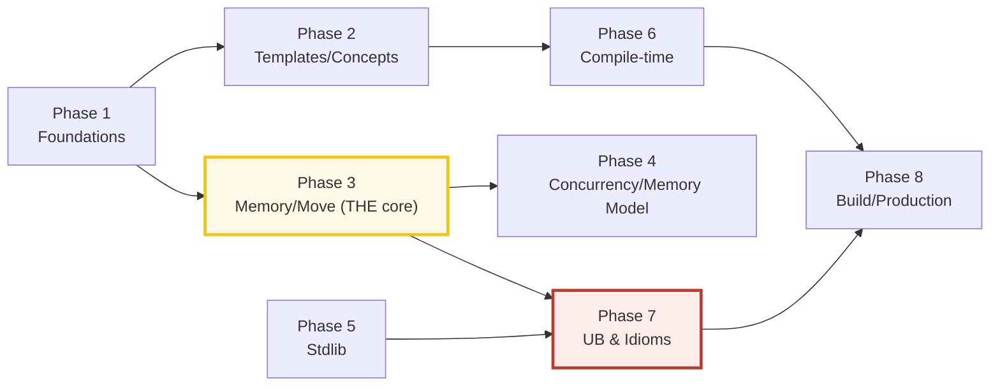

# TODO.md — The C++ Expertise Curriculum (build checklist)

> **Goal:** a reader who walks every bundle start-to-finish becomes a **modern
> C++ expert** — fluent in the value/reference/pointer trichotomy and move
> semantics, RAII and the smart pointers, templates/concepts and compile-time
> computation, the concurrency memory model, **undefined behavior** (the central
> expert topic), and the C++23 standard library.
>
> **How bundles get built:** see [`HOW_TO_RESEARCH.md`](./HOW_TO_RESEARCH.md)
> (per-bundle workflow) and [`SUBAGENTS_GUIDE.md`](./SUBAGENTS_GUIDE.md)
> (delegation at scale). The orchestrator **never edits a bundle by hand** — each
> is produced by a subagent (one worker per bundle, **max 4 per batch**), then
> passed through `just sweep` + `just sanitize`.
>
> Each bundle = `{name}.cpp` (ground truth) + `{name}_output.txt` (captured
> stdout) + `{NAME}.md` (guide). No `.html`. Flat in `cpp/`, **C++23**.
>
> **Cross-language siblings:** [`../go/`](../go/) · [`../rust/`](../rust/) ·
> [`../ts/`](../ts/) · [`../python/`](../python/). C++ is closest to **Rust**
> (manual memory, no GC, templates = monomorphization, RAII ≈ Drop). Phase 1
> mirrors all four; the memory + type-system phases are designed for direct
> cross-comparison.

---

## Progress

| Phase | Theme | Bundles | Status |
|---|---|---|---|
| 1 | Language Foundations | 8 | ✅ done (8/8, 233 checks) |
| 2 | Templates & Concepts | 7 | ✅ done (7/7, 207 checks) |
| 3 | Memory, Ownership & Move Semantics | 7 | ✅ done (7/7, 286 checks) |
| 4 | Concurrency & the Memory Model | 6 | ✅ done (6/6, 138 checks) |
| 5 | Standard Library Essentials | 7 | ✅ done (7/7, 234 checks) |
| 6 | Compile-time Computation & Metaprogramming | 5 | ✅ done (5/5, 143 checks) |
| 7 | Error Handling, UB & Idioms | 5 | ✅ done (5/5, 155 checks) |
| 8 | Build, Tooling & Production | 6 | ⬜ pending |
| — | Companion walkthroughs (Boost.Asio/Crow/redis-plus-plus) | ~18 | ⬜ pending |
| | **Total** | **51 + ~18** | **45/51 built** |

**Reading order is the phase order.** Each phase assumes the prior — Phase 3's
move semantics leans on Phase 1's value/reference/pointer; Phase 4's memory
model leans on Phase 3's ownership; Phase 6 leans on Phase 2's templates; Phase
7's UB leans on everything. Do not skip ahead.

---

## Phase 1 — Language Foundations (8)

> **Goal:** rock-solid command of the primitives + the **value/reference/pointer
> trichotomy** (THE C++ foundation every downstream concept rests on).
> **Cross-language:** 1:1 with Go/Rust/TS/Python P1.

- [ ] **1. `values_types`** — fundamental types, value initialization (and the
  uninitialized-read UB trap), `sizeof`/`alignof`, `auto`, `const`/`constexpr`
  intro, fixed-width ints (`<cstdint>`). *(Designated **style anchor** — ship first.)*
- [ ] **2. `references_pointers_intro`** — the **trichotomy**: value (copied) vs
  reference `&` (alias, non-null) vs pointer `*` (alias + nullable + reassignable);
  pass/return semantics. THE foundation. *(⟷ Go pointers, Rust borrowing.)*
- [ ] **3. `arrays_strings`** — C arrays decay-to-pointer, `std::array`,
  `std::string` (owned), `std::string_view` (borrow, ⟷ Rust `&str`); C-string pitfalls.
- [ ] **4. `control_flow`** — `if`/`switch` (with initializer: `switch (auto x = f(); x)`),
  range-`for`, `goto` (and why not); structured bindings.
- [ ] **5. `functions_overloading`** — overload resolution (the ranking), default
  args, `inline`, pass-by value/ref/ptr, `[[nodiscard]]`/`constexpr` functions.
- [ ] **6. `scope_lifetimes`** — block scope, automatic storage duration, name
  hiding, static locals, **RAII preview** (destructors run at scope exit).
- [ ] **7. `const_qualifiers`** — `const` objects/params/returns, `const T*` vs
  `T const*` vs `T* const`, `constexpr`/`constinit`, `mutable`.
- [ ] **8. `errors_exceptions_intro`** — `throw`/`try`/`catch`, exception
  classes, the basics; full depth (safety guarantees, `noexcept`) is Phase 7.

---

## Phase 2 — Templates & Concepts (7)

> **Goal:** mastery of C++ templates — compile-time monomorphized generics (⟷
> Rust generics) — and C++20 concepts (the constraint layer ⟷ Rust trait bounds).
> *This separates C++ users from C++ experts.*
> **Cross-language:** analog to Go P2 (interfaces), Rust P2 (traits/generics).

- [ ] **9. `function_templates`** — template params, argument deduction,
  explicit args, monomorphization (⟷ Rust generics, ≠ Java erasure).
- [ ] **10. `class_templates`** — class templates, member functions, CTAD
  (C++17 class-template-arg-deduction), non-type/symbol template params.
- [ ] **11. `type_deduction`** — `auto` (template-deduction rules), `decltype`,
  `decltype(auto)`, the `auto&&` forwarding curiosity, `std::declval`.
- [ ] **12. `concepts`** — C++20 `concept` definitions + `requires` clauses /
  expressions; constrained templates (⟷ Rust trait bounds, Go constraints);
  the error-message revolution.
- [ ] **13. `overload_resolution`** — the ranking (exact → conversion →
  variadic), the template/non-template tiebreaker, why `T` vs `const T&` matters.
- [ ] **14. `casts`** — `static_cast` (related type), `dynamic_cast` (polymorphic,
  runtime-checked), `const_cast`, `reinterpret_cast` (the UB-prone one); C-cast
  avoidance. *(⟷ TS `as`, Rust `as`/`From`/`Into`.)*
- [ ] **15. `variadic_templates`** — parameter packs, fold expressions (C++17),
  recursive pack expansion, `sizeof...(pack)`.

---

## Phase 3 — Memory, Ownership & Move Semantics (7)

> **Goal:** THE C++ core — how memory is owned, transferred, and shared without
> a GC. RAII + smart pointers + move semantics = modern C++ memory safety.
> **Cross-language:** analog to Rust P1/P3 (ownership/smart pointers), Go P4
> (pointers), TS P3 (value/reference).

- [ ] **16. `raii`** — constructors/destructors tied to scope; deterministic
  cleanup; the resource-is-initialization idiom (files, locks, memory). *(⟷ Rust Drop.)*
- [ ] **17. `new_delete_raw_pointers`** — `new`/`delete`/`new[]`/`delete[]`, raw
  owning pointers, the leak/double-delete/use-after-free traps (and why we avoid them).
- [ ] **18. `unique_ptr`** — exclusive ownership, `std::make_unique`, move-only,
  custom deleters. THE default smart pointer. *(⟷ Rust `Box`.)*
- [ ] **19. `shared_ptr_weak_ptr`** — refcounted shared ownership
  (`std::make_shared`), control block; `weak_ptr` to break cycles (⟷ Rust
  `Rc`/`Arc`/`Weak`); the atomic-refcount cost.
- [ ] **20. `move_semantics`** — rvalue references `&&`, `std::move` (a cast, not
  a move), the moved-from "valid-but-unspecified" state, move ctors/assigns, why
  `std::vector` move is O(1). C++'s ownership half-step (⟷ Rust move, but opt-in).
- [ ] **21. **`value_vs_reference_vs_pointer`**** — the trichotomy deepened:
  when to pass/return by value (cheap/copyable) vs reference (alias) vs pointer;
  ownership vs borrowing; slicing; lifetime extension of temporaries.
- [ ] **22. `rule_of_0_3_5`** — the special member functions (dtor / copy ctor+assign
  / move ctor+assign); the Rule of 0 (prefer RAII) vs Rule of 3/5 (when you manage a resource).

---

## Phase 4 — Concurrency & the Memory Model (6)

> **Goal:** threads, mutexes, atomics with the acquire/release/seq_cst orderings,
> and C++20 coroutines. Proved safe by the type system + sanitizers (TSan).
> **Cross-language:** analog to Rust P4 (threads/atomics), Go P3 (goroutines),
> TS P4 (event loop).

- [ ] **23. `std_thread`** — `std::thread`, `join`/`detach`, passing args,
  `std::thread::id`; a detached thread's lifetime perils.
- [ ] **24. `mutex_lock_guard`** — `std::mutex`, `lock_guard`/`scoped_lock` (RAII
  lock), `unique_lock`, `std::call_once`, the deadlock-avoidance discipline.
- [ ] **25. `atomics_memory_order`** — `std::atomic<T>`, the CAS loop
  (`compare_exchange_weak/strong`), memory_order: relaxed / acquire-release /
  seq_cst (⟷ Rust atomics, Go `sync/atomic`, TS `SharedArrayBuffer`+`Atomics`).
- [ ] **26. `condition_variables`** — `std::condition_variable`, wait/notify_one/
  notify_all, the predicate-wait pattern, spurious wakeups.
- [ ] **27. `futures_promises`** — `std::future`/`promise`, `std::async`,
  `std::packaged_task`, the shared-future; the deferred-vs-async launch policy.
- [ ] **28. `coroutines`** — C++20 coroutines (`co_await`/`co_yield`/`co_return`),
  the coroutine frame, a hand-rolled task type (⟷ Rust async, TS async/await).

---

## Phase 5 — Standard Library Essentials (7)

> **Goal:** fluent with the containers/iterators/algorithms every C++ program leans on.
> **Cross-language:** near-identical to all P5.

- [ ] **29. `containers_sequence`** — `std::vector` (the workhorse: capacity/growth,
  invalidation), `deque`/`list`/`array`/`forward_list`; when each wins.
- [ ] **30. `containers_associative`** — `std::map`/`set` (ordered, tree) vs
  `std::unordered_map`/`unordered_set` (hash; **unspecified order — sort!**);
  custom comparators/hashes.
- [ ] **31. `iterators_ranges`** — iterator categories (input/forward/bidirectional/
  random-access/contiguous), `<iterator>`; C++20 ranges (views, the lazy pipeline).
- [ ] **32. `algorithms`** — `<algorithm>` (`sort`/`find`/`transform`/`accumulate`/
  `partition`), iterators as the algorithm boundary, projections (C++20).
- [ ] **33. `string_stringview`** — `std::string` deep dive (SSO, small-string
  optimization); `std::string_view` the non-owning borrow (and the dangling-view trap).
- [ ] **34. `iostream_format`** — `<iostream>` (`cin`/`cout`, manipulators),
  `std::format`/`std::print` (C++20/23, the modern formatted-output).
- [ ] **35. `chrono`** — `<chrono>`: durations, time points, clocks (system/
  steady/high_resolution), `std::chrono::duration_cast`; never print `now()`.

---

## Phase 6 — Compile-time Computation & Metaprogramming (5)

> **Goal:** the C++ "compile-time programming language" — constexpr, type traits,
> SFINAE, if-constexpr, Turing-complete template metaprogramming.
> **Cross-language:** analog to Rust P6 (macros), TS P2 (mapped/conditional types).

- [ ] **36. `constexpr_consteval`** — `constexpr` (compile-or-run), `consteval`
  (immediate, C++20), `constinit`; `constexpr` functions/ctors/`if constexpr`.
- [ ] **37. `type_traits`** — `<type_traits>` (`is_same`/`is_base_of`/
  `remove_reference`/`conditional`), the `_v`/`_t` shortcuts; ⟷ TS utility types.
- [ ] **38. `sfinae_enable_if`** — SFINAE (substitution-failure-is-not-an-error),
  `std::enable_if`, the pre-concepts metaprogramming workhorse (now mostly superseded).
- [ ] **39. `if_constexpr`** — `if constexpr` (compile-time discard of branches;
  enables branch-on-type without SFINAE), paired with `if constexpr` + concepts.
- [ ] **40. `template_metaprogramming`** — Turing-complete templates: recursive
  template instantiation, compile-time list/factorial, the compile-cost caveats.

---

## Phase 7 — Error Handling, UB & Idioms (5)

> **Goal:** the C++-special layer — exception safety, **undefined behavior**
> (the central expert topic), and the modern idioms. *No clean sibling in the
> other languages; this is where C++ expertise uniquely lives.*

- [ ] **41. `exceptions_deep`** — exception safety guarantees (basic/strong/
  nothrow), RAII+exceptions, `noexcept`, the cost model, exceptions vs error codes.
- [ ] **42. `undefined_behavior`** — THE expert topic: what UB is, WHY the
  compiler assumes none (and the resulting optimizations/time-travel), the common
  UBs (signed overflow, OOB, use-after-free, data race, null deref, aliasing),
  demonstrated via **UBSan** (never in a runnable verified path — sanitizer demos).
- [ ] **43. `std_expected_optional`** — `std::optional<T>` (maybe-a-value), and
  **`std::expected<T,E>` (C++23)** — the Rust-`Result` analog; the error-code-vs-
  exception decision. *(⟷ Rust `Result`+`?`, Go error-return.)*
- [ ] **44. `modern_idioms`** — Pimpl (compilation firewall), CRTP (static
  polymorphism), type erasure (`std::function`/`std::any`), SBO.
- [ ] **45. `sanitizers_static_analysis`** — ASan (memory), UBSan (UB), TSan
  (threads), MSan (uninit); `clang-tidy`/`cppcheck`; the CI safety net.

---

## Phase 8 — Build, Tooling & Production (6)

> **Goal:** ship correct, fast, well-tested C++ — the engineering layer.
> **Cross-language:** analog to Go P7 (CLI/tooling), Rust P8 (production).

- [ ] **46. `cmake_basics`** — the de-facto build system: targets, dependencies,
  `add_executable`/`target_link_libraries`, generator expressions; the modern
  target-based approach (not the old variable-based).
- [ ] **47. `package_managers`** — vcpkg vs Conan vs CMake `FetchContent`; how a
  real project consumes dependencies (one walkthrough section per, documented).
- [ ] **48. `testing`** — Catch2 / GoogleTest / doctest; the test-runner model,
  fixtures, parameterized tests (⟷ Go testing, Rust #[test]).
- [ ] **49. `benchmarking`** — `<benchmark>`/Google Benchmark, perf, Valgrind/
  Callgrind, the "measure don't guess" law; -O levels and their surprises.
- [ ] **50. `deployment_linking`** — static vs dynamic linking, the ABI
  (libstdc++/libc++/ABI tags), cross-compile, RPATH; packaging a library/app.
- [ ] **51. `modernization`** — migrating old (C++03) → modern C++ (11/14/17/20/23):
  raw-pointers→smart, loops→range-for, macros→constexpr/inline, the clang-tidy
  `modernize-*` checks; the evolution timeline.

---

## Companion walkthroughs (~18) · `boost.asio/` / `crow/` / `redis-plus-plus/`

> **Goal:** deep, end-to-end `.md`-only notes on the production pillars — the
> ecosystem mirror of Rust's `axum/`/`sqlx/`/`fred.rs/` and TS's `hono/`/`drizzle/`/
> `ioredis/`. Built last, as a swarm. `.md`-only (cite upstream examples; no deps
> to install — like the Rust/TS walkthroughs).

### `boost.asio/` (~7) — the async I/O runtime ⟷ Rust tokio
- [ ] 01-io-objects · 02-proactor-model · 03-strands · 04-timers ·
  05-buffers · 06-coroutines · 07-executors

### `crow/` (~6) — the web framework (on Asio) ⟷ Rust axum, TS hono
- [ ] 01-hello-world · 02-routing · 03-json · 04-middleware ·
  05-websockets · 06-testing

### `redis-plus-plus/` (~5) — the Redis client ⟷ Rust fred.rs, TS ioredis
- [ ] 01-basic · 02-pipelines · 03-transactions · 04-pub-sub · 05-cluster

---

## Cross-cutting 🔗 map (the expertise chain + cross-language)

Key cross-links workers should wire up:
- `references_pointers_intro` (P1) ⟷ `value_vs_reference_vs_pointer` (P3) ⟷
  `move_semantics` (P3) — **the trichotomy→ownership→move chain is the heart of
  "C++ expert".**
- `raii` (P3) ⟷ `mutex_lock_guard` (P4) — RAII is the lock-safety idiom too.
- `atomics_memory_order` (P4) ⟷ `undefined_behavior` (P7) — a data race IS UB.
- **Cross-language:** `raii` ⟷ `../rust/OWNERSHIP.md`+`DROP_UNSAFE.md` (Rust
  enforces at compile time; C++ trusts + sanitizers); `concepts` ⟷
  `../rust/TRAITS_BASICS.md`+`TRAIT_BOUNDS.md` (the closest sibling); `std_expected_optional`
  ⟷ `../rust/ERROR_HANDLING.md` (Result+?); `move_semantics` ⟷ `../rust/MOVE_SEMANTICS.md`;
  `atomics_memory_order` ⟷ `../rust/ATOMICS.md`+`../go/ATOMIC_STATE.md`.

---

## How to run a phase (orchestrator recipe)

For each phase:
1. **Write briefs:** fill the `SUBAGENTS_GUIDE.md` §2 template for each bundle
   (5 min each). Phases 1–7 are pure stdlib — no dep setup.
2. **Launch the swarm:** one `Task` worker per bundle, up to **4 per batch**
   (disjoint file ownership = safe parallelism). For Phase 1, ship `values_types`
   first as the style anchor, then launch the rest against it.
3. **Verify:** run `just sweep` (compile-clean + run + checks + output); spot
   `just sanitize` on 2–3 UB-prone bundles; spot-check 2–3 `.md` callouts vs `_output.txt`.
4. **Re-spawn** any failures; tick the boxes above; update the Progress table.
