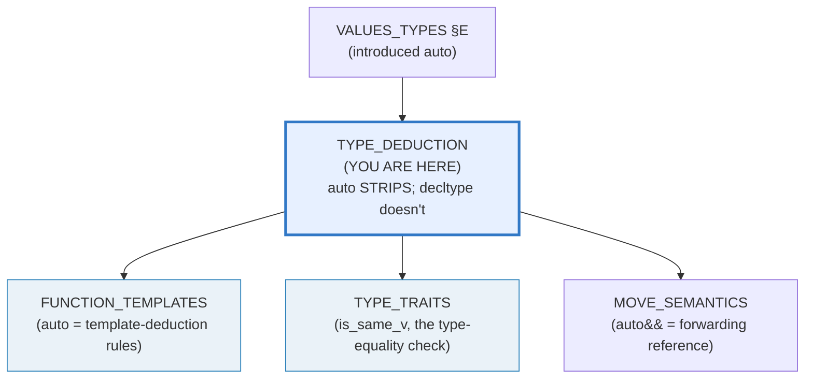
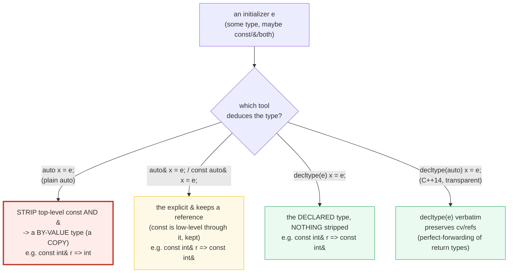
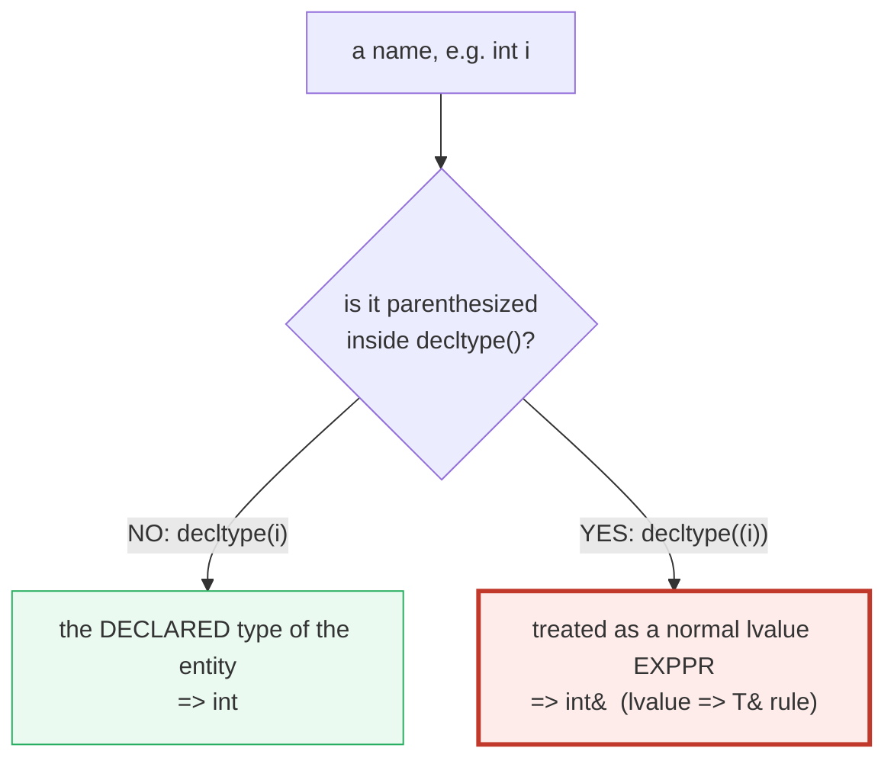

# TYPE_DEDUCTION — `auto`, `decltype`, and `decltype(auto)`

> **Goal (one line):** show, by printing every deduced type via
> `std::is_same_v<...>`, how `auto`, `decltype`, and `decltype(auto)` deduce
> types — centering on the famous SURPRISE that **plain `auto` STRIPS top-level
> `const` and `&` (it makes a COPY)**, while `decltype` / `decltype(auto)`
> **preserve** them (transparent).
>
> **Run:** `just run type_deduction`
>
> **Ground truth:** [`type_deduction.cpp`](./type_deduction.cpp) → captured stdout
> in [`type_deduction_output.txt`](./type_deduction_output.txt). Every deduced
> type below is verified at **compile time** with `std::is_same_v<...>` and its
> boolean is printed (never `typeid().name()`, which is impl-defined and
> nondeterministic). Every block below is pasted **verbatim** from that file
> under a `> From type_deduction.cpp Section X:` callout. Nothing is
> hand-computed.
>
> **Prerequisites:** 🔗 [`VALUES_TYPES.md`](./VALUES_TYPES.md) (Section E
> introduced `auto` + `const`/`constexpr`), 🔗
> [`REFERENCES_POINTERS_INTRO.md`](./REFERENCES_POINTERS_INTRO.md) (the
> value/reference/pointer trichotomy — the strip rule is *about* references).

---

## 1. Why this bundle exists (lineage)

C++11 reintroduced `auto` (it had been a storage-duration keyword in C++98, now
repurposed) as a **placeholder type** deduced from an initializer. The crucial
design decision — the one this whole bundle exists to pin — is that **`auto`
uses the SAME deduction rules as template argument deduction**. And those rules
**strip top-level `const` and the top-level `&`**. So:

```cpp
const int& r = i;
auto a = r;   // a is `int` — a COPY. The const AND the & were STRIPPED.
```

That single line is the most common C++11+ surprise. `a` is **not** an alias of
`i`; it is a brand-new `int` holding `i`'s value at copy time. To *keep* the
reference you must spell it (`auto&`), and to *keep everything verbatim* you use
`decltype` (no stripping) or `decltype(auto)` (the C++14 "transparent"
deduction).



The headline contrast across the 5-language curriculum (type inference styles):

| Language | Inference keyword | Strips const/ref on the local? | Notes |
|---|---|---|---|
| **C++** (this bundle) | `auto` / `decltype` | **yes — `auto` strips top-level const & `&`** | `decltype`/`decltype(auto)` don't |
| 🔗 [`../rust/`](../rust/) | `let x = …` | no const-stripping concept (`mut` is a separate axis) | types inferred; no references-stripping surprise |
| 🔗 [`../ts/GENERICS.md`](../ts/GENERICS.md) | `let x = 5` (inferred `number`) | no reference concept at all | GC'd; primitives by value, objects by reference |
| 🔗 [`../go/`](../go/) | `:=` | no; copies values, shares pointers/slices/maps | no `const`, no reference types |

C++ is the only language here where "infer the type" silently **changes the
value category** (reference → value). That is the trap, and the reason this
bundle spends Section A on it.

> From cppreference — *Placeholder type specifiers (`auto`)*: "Type is deduced
> using the rules for **template argument deduction**" and "`auto a = 5; // OK:
> a has type int`." The `auto` "may be accompanied by modifiers, such as `const`
> or `&`, which will **participate in the type deduction**."

---

## 2. The mental model: three deduction tools, one strip rule



The **red** node (`auto`) is the famous surprise; the **green** nodes
(`decltype`, `decltype(auto)`) are "transparent" — they hand back the type
exactly as declared. `auto&`/`const auto&` are the middle road: you explicitly
opt back into a reference.

The second diagram is the **paren trap** — a subtle rule that makes
`decltype(name)` and `decltype((name))` *different types*:



A single pair of parentheses flips `decltype(i)` from `int` to `int&`. Section C
proves it with `std::is_same_v`. The rule generalizes: an **unparenthesized
id-expression** yields its declared type; **any other (parenthesized) expression**
is classified by **value category** (xvalue → `T&&`, lvalue → `T&`, prvalue →
`T`).

> From cppreference — *decltype specifier*: form (1) "an **unparenthesized**
> id-expression … yields the type of the entity named"; form (2) "any other
> expression of type `T` … if the value category is **lvalue**, yields `T&`."
> "Note that if the name of an object is **parenthesized**, it is treated as an
> ordinary lvalue expression, thus `decltype(x)` and `decltype((x))` are often
> **different types**."

---

## 3. Section A — `auto` basics & the STRIP rule (the famous surprise)

> From `type_deduction.cpp` Section A:
> ```
> auto x = i (i == 5):
>   decltype(x) is int                                         : true
> [check] decltype(x) is int: OK
> 
> const int& r = i;  auto a = r;  a = 999;
>   -> a = 999, i = 5   (a is a COPY; i untouched by the strip)
> [check] auto a = r made a COPY (a = 999 left i == 5): OK
>   decltype(a) is int (NOT const int& — the famous strip)   : true
> [check] decltype(a) is int (NOT const int& — the famous strip): OK
>   decltype(a) is NOT const int&                              : true
> [check] decltype(a) is NOT const int&: OK
> 
> The strip is systematic (top-level const and & both vanish):
>   const int ci = 7;  auto b = ci;  -> b = 7
>   int& ri = i;       auto c = ri;  -> c = 5
>   auto b = ci  -> int (top-level const stripped)             : true
> [check] auto b = ci  -> int (top-level const stripped): OK
>   auto c = ri  -> int (the & stripped)                       : true
> [check] auto c = ri  -> int (the & stripped): OK
> 
> Mental model: plain `auto` deduces a BY-VALUE type (a copy).
> [check] plain auto always yields a value type (copy semantics): OK
> ```

**The famous trap, pinned.** `const int& r = i;` makes `r` a const alias of `i`.
But `auto a = r;` is **not** a reference — `auto` strips *both* the top-level
`const` and the top-level `&`, leaving a plain **`int`**. The program proves it
two ways:

- **Behaviorally:** `a = 999;` leaves `i == 5`. `a` is a decoupled copy.
- **Typewise:** `std::is_same_v<decltype(a), int>` is `true`, and
  `std::is_same_v<decltype(a), const int&>` is `false` (both booleans printed).

**Why does it strip?** Because `auto` deduction **is** template argument
deduction. Imagine `template<class T> void f(T x);` called as `f(r);` — `T`
deduces to `int` (the reference is ignored, then top-level const is dropped).
`auto a = r;` runs the identical machinery with `auto` standing in for `T`. This
is the single most important sentence in the bundle: **🔗 `auto` uses the
template-deduction rules** (see `FUNCTION_TEMPLATES`). The strip is therefore
*systematic*: `auto b = ci;` (top-level const) → `int`; `auto c = ri;` (a
reference) → `int`.

> From cppreference — *template argument deduction* (the rules `auto` reuses):
> "Top-level cv-qualifiers … are not part of the function parameter type" and
> the reference is dropped before matching. Learncpp (corroboration): "When you
> use `auto`, C++ deduces the type as if you were passing the expression **by
> value**. That means: **references are removed; top-level const is removed**."

---

## 4. Section B — Keeping cv/refs: `auto&` / `const auto&` / `decltype`

> From `type_deduction.cpp` Section B:
> ```
> Setup: int i = 5; int& ri = i;
> 
> auto& a3 = ri;
>   decltype(a3) is int& (auto& kept the mutable ref)          : true
> [check] decltype(a3) is int& (auto& kept the mutable ref): OK
> a3 = 11 (mutated THROUGH the alias)  -> i = 11
> [check] auto& a3 = ri is a real alias (a3 = 11 set i == 11): OK
> 
> const auto& a4 = r;   -> read-only borrow (idiom)
>   decltype(a4) is const int&                                 : true
> [check] decltype(a4) is const int&: OK
> 
> decltype(expr) = the DECLARED type, NOTHING stripped:
>   decltype(r)  is const int& (no strip)                      : true
> [check] decltype(r)  is const int& (no strip): OK
>   decltype(ci) is const int (no strip)                       : true
> [check] decltype(ci) is const int (no strip): OK
>   decltype(i)  is int (no strip)                             : true
> [check] decltype(i)  is int (no strip): OK
>   decltype(ri) is int& (no strip)                            : true
> [check] decltype(ri) is int& (no strip): OK
> ```

**`auto&` keeps the reference — and the const is preserved because it becomes
*low-level*.** Write `auto& a3 = ri;` and you opt back into a reference. Now the
const can't be stripped: when a reference is involved, the const of the
referent is a **low-level const** (it qualifies what's pointed at, not the
local binding), and the deduction rules never strip low-level const. That is
why `auto& c = ci;` (Section E matrix) deduces `const int&`, not `int&`.

The alias is real: `a3 = 11;` sets `i == 11` *through* the alias.

**`const auto&` is the idiomatic "read-only borrow."** This is the form you
write in a range-for (`for (const auto& x : v)`) and in function parameters — a
read-only reference, no copy, no mutation. See Section D.

**`decltype(expr)` never strips.** This is the decisive contrast with `auto`:
`decltype(r)` is `const int&` *verbatim*, `decltype(ci)` is `const int`,
`decltype(ri)` is `int&`. Use `decltype` when you want "the type exactly as
written/declared," and `auto` when you want "a value of about that type."

> From cppreference — *decltype* form (1): for "an **unparenthesized**
> id-expression … decltype yields **the type of the entity** named" (no
> stripping of const or references). Learncpp (corroboration): "When the
> expression to which we apply `decltype` is a variable, `decltype` returns the
> type of that variable, **including top-level const and references**."

---

## 5. Section C — `decltype(auto)` + the PAREN TRAP

> From `type_deduction.cpp` Section C:
> ```
> decltype(auto) da1 = r   (r is const int&):
>   decltype(da1) is const int& (transparent — unlike plain auto) : true
> [check] decltype(da1) is const int& (transparent — unlike plain auto): OK
> decltype(auto) da2 = i   (i is int):
>   decltype(da2) is int                                       : true
> [check] decltype(da2) is int: OK
> 
> THE PAREN TRAP — decltype(i) vs decltype((i)):
>   decltype(i)   is int   (unparenthesized -> declared type)  : true
> [check] decltype(i)   is int   (unparenthesized -> declared type): OK
>   decltype((i)) is int&  (parenthesized -> lvalue expr -> T&) : true
> [check] decltype((i)) is int&  (parenthesized -> lvalue expr -> T&): OK
> 
> decltype(auto) da3 = (i);   (parenthesized initializer):
>   decltype(da3) is int& (paren trap via decltype(auto))      : true
> [check] decltype(da3) is int& (paren trap via decltype(auto)): OK
> 
> The paren trap applies to const too:
>   decltype(ci)   is const int  (declared type)               : true
> [check] decltype(ci)   is const int  (declared type): OK
>   decltype((ci)) is const int& (parenthesized -> lvalue expr) : true
> [check] decltype((ci)) is const int& (parenthesized -> lvalue expr): OK
> ```

**`decltype(auto)` (C++14) is the "transparent" deduction.** The deduced type is
literally `decltype(<initializer>)`. So `decltype(auto) da1 = r;` is
`decltype(r)` = `const int&` — **contrast** with plain `auto a = r;` (Section A)
which stripped to `int`. The placeholder `decltype(auto)` must be **the sole
constituent** of the declared type (you can't write `const decltype(auto)`).

Its killer app: **perfect forwarding of a return type** (Section D). When a
function returns a reference and you forward it with plain `auto`, the `&` is
stripped and callers get a copy; `decltype(auto)` preserves it.

**The PAREN TRAP.** `decltype(i)` is `int`, but `decltype((i))` is `int&`. The
rule:

- **Unparenthesized id-expression** → its *declared* type (`int`).
- **Anything parenthesized** → a normal expression classified by *value
  category*: an lvalue of type `T` yields `T&`, an xvalue yields `T&&`, a
  prvalue yields `T`. `(i)` is an lvalue → `int&`.

The trap flows **through `decltype(auto)`**: `decltype(auto) da3 = (i);` is
`int&` (because it's `decltype((i))`). It even applies to `const`:
`decltype((ci))` is `const int&`, not `const int`. The mnemonic: **parentheses
add `&`** (for lvalues).

> From cppreference — *Placeholder type specifiers*: `decltype(auto)` "Type is
> `decltype(expr)`, where `expr` is the initializer" and "must be the **sole
> constituent** of the declared type." *decltype*: "if the name of an object is
> **parenthesized**, it is treated as an ordinary lvalue expression, thus
> `decltype(x)` and `decltype((x))` are often **different types**."

---

## 6. Section D — range-for (copy vs borrow) + return-type deduction

> From `type_deduction.cpp` Section D:
> ```
> (1) for (auto x : v) { x += 1000; copy_sum += x; }   -> COPIES
>     v[0]=10  v[1]=20  v[2]=30   (v untouched)
>     copy_sum = 3060   (1010 + 1020 + 1030 = 3060; x held 1000 + element)
> [check] for(auto x:v) COPIES: v[0] still 10 after x += 1000: OK
> [check] for(auto x:v) COPIES: copy_sum == 3060 (x was a local copy): OK
> 
> (2) for (auto& x : v) { x += 5; }   -> ALIASES (v changed)
>     v[0]=15  v[1]=25  v[2]=35
> [check] for(auto& x:v) ALIASES: v[0] now 15 after x += 5: OK
> 
> (3) for (const auto& x : v) { sum += x; }   -> read-only BORROW
>     sum = 75   (15 + 25 + 35 = 75)
> [check] for(const auto& x:v) borrows: sum == 75: OK
>   auto copy of v[0] is int (the range-for copy form)         : true
> [check] auto copy of v[0] is int (the range-for copy form): OK
>   const auto& of v[0] is const int& (the range-for borrow idiom) : true
> [check] const auto& of v[0] is const int& (the range-for borrow idiom): OK
> 
> Return-type deduction   (int n = 7):
>     int bv = by_value_return(n);    -> bv = 7
>     double tr = trailing_return(2,3); -> tr = 6.0
> [check] by_value_return(n) == 7 (auto return, by value): OK
> [check] trailing_return(2,3) == 6.0: OK
>   decltype(by_value_return(n)) is int   (auto return STRIPS the &) : true
> [check] decltype(by_value_return(n)) is int   (auto return STRIPS the &): OK
>   decltype(trailing_return(2,3)) is double (trailing return) : true
> [check] decltype(trailing_return(2,3)) is double (trailing return): OK
>   decltype(ref_return(n)) is int&  (decltype(auto) PRESERVES the &) : true
> [check] decltype(ref_return(n)) is int&  (decltype(auto) PRESERVES the &) : OK
> 
> ref_return(n) = 99;   -> n = 99   (returns int&, so writable)
> [check] decltype(auto) return is a real ref (ref_return(n)=99 set n == 99): OK
> ```

**range-for is just `auto` in a loop — so the strip rule applies per element.**
The three idioms, all verified:

1. `for (auto x : v)` — **copies** each element. `x += 1000` can't reach `v`
   (`v[0]` stays `10`). The `copy_sum == 3060` check proves `x` really *held*
   `1000 + element` in a local copy.
2. `for (auto& x : v)` — **aliases** each element. `x += 5` mutates `v` through
   the alias (`v[0]` becomes `15`).
3. `for (const auto& x : v)` — **read-only borrow**, the *idiom* for iterating
   without copying or mutating (use it for non-trivial element types).

**Return-type deduction.** Three flavors, and the strip rule is again the
difference:

- `auto f(){ return x; }` — by **value**. Plain `auto` strips the `&`, so
  `by_value_return` returns `int` even though its parameter is `int&`. Callers
  get a copy (`bv == 7`).
- `auto f() -> T { … }` — **trailing return type** (C++11). You write the type
  explicitly after `->`; no deduction surprise. Indispensable when the return
  type depends on parameters (`-> decltype(a + b)`).
- `decltype(auto) f(){ return x; }` — **transparent** (C++14). The return type
  is `decltype(x)`, so `ref_return` returns `int&`. The proof: `ref_return(n) =
  99;` *compiles and writes* `n` — only possible because the return is a real
  reference. This is **perfect forwarding of a return type**: forward a
  function that returns `T&` and your wrapper also returns `T&`.

> From cppreference — *auto*: "`auto g() { return 0.0; } // OK since C++14: g
> returns double`" (return type deduction). *decltype* example: "`auto
> getRefFwdBad(const int* p) { return getRef(p); }` … `Just returning auto isn't
> perfect forwarding.` `decltype(auto) getRefFwdGood(const int* p) { return
> getRef(p); }` … `Returning decltype(auto) perfectly forwards the return
> type.`"

---

## 7. Section E — The deduction-rules matrix + `std::declval`

> From `type_deduction.cpp` Section E:
> ```
> Deduction matrix (every cell is std::is_same_v-verified):
> initializer   | auto       | auto&       | const auto&   | decltype()
> --------------+------------+-------------+---------------+------------
> int i         | int        | int&        | const int&    | int
>   [i]  auto        -> int                                    : true
> [check] [i]  auto        -> int: OK
>   [i]  auto&       -> int&                                   : true
> [check] [i]  auto&       -> int&: OK
>   [i]  const auto& -> const int&                             : true
> [check] [i]  const auto& -> const int&: OK
>   [i]  decltype(i) -> int                                    : true
> [check] [i]  decltype(i) -> int: OK
> const int ci  | int        | const int&  | const int&    | const int
>   [ci] auto        -> int (const STRIPPED!)                  : true
> [check] [ci] auto        -> int (const STRIPPED!): OK
>   [ci] auto&       -> const int&                             : true
> [check] [ci] auto&       -> const int&: OK
>   [ci] const auto& -> const int&                             : true
> [check] [ci] const auto& -> const int&: OK
>   [ci] decltype(ci)-> const int (no strip)                   : true
> [check] [ci] decltype(ci)-> const int (no strip): OK
> int& ri       | int        | int&        | const int&    | int&
>   [ri] auto        -> int (ref STRIPPED!)                    : true
> [check] [ri] auto        -> int (ref STRIPPED!): OK
>   [ri] auto&       -> int&                                   : true
> [check] [ri] auto&       -> int&: OK
>   [ri] const auto& -> const int&                             : true
> [check] [ri] const auto& -> const int&: OK
>   [ri] decltype(ri)-> int& (no strip)                        : true
> [check] [ri] decltype(ri)-> int& (no strip): OK
> const int& r  | int        | const int&  | const int&    | const int&
>   [r]  auto        -> int (const AND & STRIPPED!)            : true
> [check] [r]  auto        -> int (const AND & STRIPPED!): OK
>   [r]  auto&       -> const int&                             : true
> [check] [r]  auto&       -> const int&: OK
>   [r]  const auto& -> const int&                             : true
> [check] [r]  const auto& -> const int&: OK
>   [r]  decltype(r) -> const int& (no strip)                  : true
> [check] [r]  decltype(r) -> const int& (no strip): OK
> 
> auto&& is a FORWARDING reference (collapses by value category):
>   auto&& rr1 = i;    -> decltype(rr1) bound, i is lvalue
>   auto&& rr2 = 42;   -> decltype(rr2) bound, 42 is prvalue
>   auto&& rr1 = i  (lvalue)   -> int&  (collapsed)            : true
> [check] auto&& rr1 = i  (lvalue)   -> int&  (collapsed): OK
>   auto&& rr2 = 42 (prvalue)  -> int&& (rvalue ref)           : true
> [check] auto&& rr2 = 42 (prvalue)  -> int&& (rvalue ref): OK
> 
> std::declval<T>() — fabricate a T (as T&&) in an UNEVALUATED context:
>   std::declval<Widget>().compute() -> int                    : true
> [check] std::declval<Widget>().compute() -> int: OK
>   std::declval<int>()  -> int&& (add_rvalue_reference_t<int>) : true
> [check] std::declval<int>()  -> int&& (add_rvalue_reference_t<int>): OK
> [check] std::declval used only in decltype (unevaluated) — never evaluated: OK
> ```

**The matrix is the whole story in one table.** Read down the `auto` column:
every initializer — `int`, `const int`, `int&`, `const int&` — collapses to a
bare `int`. That *is* the strip rule. Read the `decltype()` column: each type
comes back *exactly as declared*. `auto&` and `const auto&` sit in between,
preserving the reference (and the const becomes low-level, so it's kept).

**`auto&&` is a FORWARDING reference** (a.k.a. "universal reference"), *not* a
plain rvalue reference. It deduces by **value category** of the initializer:

- `auto&& rr1 = i;` → `i` is an **lvalue** → `int&` (reference-collapses:
  `auto = int&`, then `int& &&` → `int&`).
- `auto&& rr2 = 42;` → `42` is a **prvalue** → `int&&`.

This is the template-deduction special case for `T&&`, and it is the foundation
of `std::move` / `std::forward` (🔗 `MOVE_SEMANTICS.md`). It only behaves this
way when deduction happens (a bare `int&&` parameter is a true rvalue ref).

**`std::declval<T>()`** fabricates a `T` (as `T&&`) **in an unevaluated
context** — the operand of `decltype`, `sizeof`, or `noexcept`. It exists so you
can ask *"what type does `t.compute()` have?"* **without ever constructing a
`T`**. The bundle's `Widget` deletes its default constructor, so
`Widget().compute()` would be ill-formed; `std::declval<Widget>().compute()`
sidesteps construction entirely, and `decltype(…)` yields `int`. `declval` yields
`add_rvalue_reference_t<T>` (= `T&&` for an object `T`), and **must never be
evaluated** at runtime (odr-use is ill-formed).

> From cppreference — *std::declval*: "Helper template for writing expressions
> that appear in **unevaluated contexts**, typically the operand of `decltype`."
> "The return type is `T&&` (reference collapsing rules apply) unless `T` is …
> `void`." "it is an error to evaluate an expression that contains this
> function."

---

## 8. Worked smallest-scale example

Everything above, compressed to the lines a beginner must memorize:

```cpp
int i = 5;
const int& r = i;

auto       a = r;   // int         — STRIPS const AND & (a COPY; the famous trap)
auto&      b = r;   // const int&  — the & keeps the reference (const is low-level, kept)
const auto& c = r;  // const int&  — read-only borrow (the range-for / param idiom)
decltype(r) d = r;  // const int&  — the DECLARED type, nothing stripped
decltype(auto) e = r; // const int& — transparent (decltype(r) verbatim)

decltype(i);   // int   — unparenthesized name => declared type
decltype((i)); // int&  — parenthesized => lvalue expr => T&  (THE paren trap)
```

> From `type_deduction.cpp` Section A, the trap prints `auto a = r … a = 999` →
> `i = 5` and `[check] decltype(a) is int (NOT const int& — the famous strip):
> OK`; Section C prints `[check] decltype((i)) is int& …: OK`. The contrast *is*
> the lesson.

---

## 9. The value-vs-reference axis (threaded through this bundle)

This bundle sits squarely on the curriculum's teaching spine (🔗
`MOVE_SEMANTICS.md`, `VALUE_VS_REFERENCE_VS_POINTER.md`, `RAII.md`). Where does
each `auto` spelling land?

| Construct | Copies? | Aliases? | Owns? |
|---|---|---|---|
| `auto a = e;` | **yes** (strips const/&, a copy) | no | yes (its own storage) |
| `auto& a = e;` | no | **yes** (mutable alias) | no (borrows) |
| `const auto& a = e;` | no | **yes** (read-only alias) | no (borrows) |
| `decltype(e) a = e;` / `decltype(auto) a = e;` | depends on `e`'s declared type | if `e` is a reference | no (if a reference) |
| `auto&& a = e;` | no | **yes** (lvalue→`&`, rvalue→`&&`) | no (forwarding ref) |

The choice of `auto` spelling is, in disguise, the **copy vs borrow vs move**
decision — the same axis `REFERENCES_POINTERS_INTRO` teaches explicitly.

---

## 10. Pitfalls (the expert payoff)

| Trap | Symptom | Fix |
|---|---|---|
| `auto x = ref;` expecting an alias | `x` is a **copy** (auto strips `&`) — mutations to `x` don't reach the referent; silent perf/correctness bug | Write `auto&` (mutate) or `const auto&` (read). The bundle's Section A proves `a = 999` left `i == 5`. |
| `auto x = someConst;` expecting `const` | `const` **stripped** — `x` is mutable even though the source was const | Write `const auto` if you need the immutability; otherwise know you got a value. |
| `for (auto x : container)` on expensive elements | **copies every element** (string/vector/object) per iteration — accidental O(n) copies | `for (const auto& x : c)` to borrow; `for (auto& x : c)` to mutate. Section D. |
| `auto f(){ return ref; }` then mutating the call result | returns a **value**, not a reference — the call is an rvalue; `f() = 7;` is a compile error or no-op | Use `decltype(auto) f(){ … }` to forward the reference (Section D). |
| `decltype(x)` vs `decltype((x))` confusion | one pair of parens flips `int` → `int&`; templates/macros that parenthesize their argument change the type | Know the rule (parens ⇒ lvalue ⇒ `T&`); when in doubt, `decltype(auto)` is unambiguous. |
| `decltype(auto) x = (name);` | inherits the paren trap → `int&` when you meant `int` | Don't add stray parens; use `decltype(auto) x = name;` (unparenthesized) for the declared type. |
| Treating `auto&&` as "rvalue reference" | it's a **forwarding reference** under deduction — binds to lvalues too (`int&`), surprising | Only in templates/`auto` does `&&` collapse; a bare `T&&` param is a true rvalue ref. See 🔗 `MOVE_SEMANTICS`. |
| Using `typeid().name()` to "show" a type | output is **impl-defined & nondeterministic** (e.g. `i`, `PKi`) — unfit for verified output | Assert with `std::is_same_v<T,U>` and **print the boolean** (this bundle's `assertType`). |
| `decltype(unevaluated)` that *needs* a value of an unconstructible `T` | `T()` is ill-formed (deleted/private ctor) → compile error | `std::declval<T>()` fabricates a `T&&` in the unevaluated context (Section E). |
| `auto x = {1,2};` vs `auto x{1,2};` | `= {...}` deduces `std::initializer_list<int>`; `{...}` (direct) deduces `int` for one elem / error for many (DR n3922) | Know brace-init deduction differs; use `std::vector v = {1,2};` for a list. |
| Forwarding a return through `auto` in a wrapper | drops the `&`/`const` of the wrapped call — callers silently get copies (the perfect-forwarding-of-return bug) | Return `decltype(auto)` (or a trailing `-> decltype(inner(args))`). |

---

## 11. Cheat sheet

```cpp
#include <type_traits>   // std::is_same_v<A,B>  (compile-time type equality)
#include <utility>       // std::declval<T>()    (fabricated T&&, unevaluated ctx)

// ── auto: deduces via TEMPLATE-ARGUMENT DEDUCTION; plain auto COPIES ──────
auto       a = r;     // STRIPS top-level const AND &  -> a value (a COPY)
auto&      b = r;     // keeps the reference (const is low-level, kept)
const auto& c = r;    // read-only borrow (the range-for / param idiom)
auto&&     d = e;     // FORWARDING ref: lvalue -> T& ; rvalue -> T&&

// ── decltype: the DECLARED type, NOTHING stripped ──────────────────────────
decltype(r) x = r;    // const int&  (verbatim)
decltype(i) y = i;    // int         (verbatim)
decltype((i)) z = i;  // int&        (PAREN TRAP: paren => lvalue => T&)

// ── decltype(auto) (C++14): transparent — decltype(<initializer>) ──────────
decltype(auto) t = r; // const int&  (preserves cv/refs, unlike plain auto)

// ── Return-type deduction ──────────────────────────────────────────────────
auto        f1() { return x; }   // by VALUE (strips &)           — NOT perfect fwd
auto        f2() -> T { … }      // trailing return (explicit)
decltype(auto) f3() { return x; }  // transparent (preserves &) — perfect fwd

// ── range-for idioms ───────────────────────────────────────────────────────
for (auto x : v)         {}   // COPIES each element
for (auto& x : v)        {}   // ALIASES each element (mutate)
for (const auto& x : v)  {}   // read-only BORROW (the idiom)

// ── verifying a type at compile time (NOT typeid().name()) ─────────────────
static_assert(std::is_same_v<decltype(a), int>);          // a is int
bool ok = std::is_same_v<decltype(z), int&>;              // z is int& (paren trap)
// std::declval<T>() — a fake T (as T&&) for decltype/sizeof/noexcept only:
static_assert(std::is_same_v<decltype(std::declval<Widget>().compute()), int>);

// ── THE two sentences ──────────────────────────────────────────────────────
//   1) `auto`  uses the template-deduction rules  => it STRIPS top-level const/&.
//   2) `decltype` / `decltype(auto)` are TRANSPARENT  => they preserve them.
```

---

## 12. 🔗 Cross-references

**Within C++ (the expertise spine):**

- 🔗 `FUNCTION_TEMPLATES` (P2) — `auto` **uses the template-argument-deduction
  rules**; the strip behavior is exactly `template<class T> void f(T x);` applied
  to the initializer. This bundle's matrix *is* the deduction table for one
  argument.
- 🔗 `TYPE_TRAITS` (P6) — `std::is_same_v<A,B>` is the type-equality check this
  bundle uses to *assert* deduced types at compile time and print the boolean.
  The whole `<type_traits>` machinery (decay, add_pointer, …) builds on these.
- 🔗 `MOVE_SEMANTICS` (P3) — `auto&&` is the **forwarding reference** that
  underpins `std::move`/`std::forward`; reference collapsing (`int& &&` →
  `int&`) is why it binds to lvalues.
- 🔗 `VALUES_TYPES.md` (P1, the style anchor) — its Section E introduced `auto`
  (the copy-vs-`auto&`-alias fork); this bundle deepens it into the full
  `auto`/`decltype`/`decltype(auto)` system.
- 🔗 `REFERENCES_POINTERS_INTRO.md` (P1) — the strip rule is *about* references;
  this bundle assumes you know what `int&` / `const int&` mean.
- 🔗 `CONST_QUALIFIERS.md` (P1) — top-level vs low-level `const` is exactly why
  `auto` strips the former but `auto&` keeps the latter.

**Cross-language parallels (the 5-language curriculum):**

- 🔗 [`../rust/`](../rust/) — Rust's `let x = expr;` infers a type but has **no
  const/reference-stripping concept**: `mut` is a *separate* axis from the type,
  and references (`&`/`&mut`) are explicit and never silently dropped. C++'s
  `auto` silently changing value category is a surprise Rust doesn't have. This
  is C++'s closest sibling (manual memory, templates = monomorphization).
- 🔗 [`../ts/GENERICS.md`](../ts/GENERICS.md) — TypeScript's `let x = 5` infers
  `number`, but TS has **no value/reference distinction** for primitives and no
  `const`-stripping (objects are reference types under a GC). C++ makes the
  copy/borrow choice explicit and the compiler-enforced deduction *changes* it.
- 🔗 [`../go/`](../go/) — Go's `:=` infers a type and **copies values / shares
  pointers, slices, maps**; no `const`, no reference types, no stripping
  surprise. C++'s reference is the thing Go deliberately lacks.

---

## Sources

Every signature, value, and behavioral claim above was verified against
cppreference and the ISO C++ standard, then corroborated by ≥1 independent
secondary source:

- cppreference — *Placeholder type specifiers (`auto`, `decltype(auto)`)* ("Type
  is deduced using the rules for **template argument deduction**";
  "`decltype(auto)` … Type is `decltype(expr)` … must be the **sole
  constituent**"; modifiers "such as `const` or `&` … **participate in the type
  deduction**"; return-type deduction `auto g() { return 0.0; }`):
  https://en.cppreference.com/w/cpp/language/auto
- cppreference — *decltype specifier* (form 1 unparenthesized id-expression ⇒
  declared type; form 2 ⇒ value-category rules lvalue→`T&`/xvalue→`T&&`/
  prvalue→`T`; the paren note "`decltype(x)` and `decltype((x))` are often
  **different types**"; the `decltype(auto)` perfect-forwarding example):
  https://en.cppreference.com/w/cpp/language/decltype
- cppreference — *Template argument deduction* (the rules `auto` reuses:
  top-level cv-qualifiers are not part of the deduced parameter type; references
  are dropped before matching):
  https://en.cppreference.com/w/cpp/language/template_argument_deduction
- cppreference — *`std::declval`* ("Helper template for writing expressions that
  appear in **unevaluated contexts**, typically the operand of `decltype`";
  "return type is `T&&` (reference collapsing)"; "error to evaluate an
  expression that contains this function"):
  https://en.cppreference.com/w/cpp/utility/declval
- cppreference — *`std::is_same`* (`is_same_v<T,U>` — the compile-time
  type-equality boolean this bundle asserts with):
  https://en.cppreference.com/w/cpp/types/is_same
- cppreference — *typeid* (why this bundle avoids `typeid().name()`: "the
  actual name returned … is **implementation-defined** … may be … in any form"):
  https://en.cppreference.com/w/cpp/language/typeid
- ISO C++23 draft (open-std.org) — normative wording:
  - 9.2.9.6 Placeholder type specifiers `[dcl.spec.auto]`
  - 9.2.9.5 Decltype specifiers `[dcl.type.decltype]`
  - Working draft: https://open-std.org/JTC1/SC22/WG21/docs/papers/2023/n4950.pdf
- Secondary corroboration (≥2 independent sources, web-verified) for the
  "`auto` strips top-level const and references" claim:
  - learncpp.com — *12.14 Type deduction with pointers, references, and const*
    ("When you use `auto`, C++ deduces the type as if you were passing the
    expression **by value** … **references are removed; top-level const is
    removed**"):
    https://www.learncpp.com/cpp-tutorial/type-deduction-with-pointers-references-and-const/
  - Stack Overflow — *"Why does the auto type specifier ignore the top-level
    const?"* (decltype returns the type "including top-level const and
    references"; auto does not):
    https://stackoverflow.com/questions/48390824/why-auto-type-specifier-ignores-the-top-level-const
  - IBM XL C/C++ — *The auto type specifier (C++11)* ("Auto type deduction
    cannot deduce cv-qualifier or reference type from the initializer"):
    https://www.ibm.com/docs/en/xl-c-and-cpp-aix/16.1.0?topic=specifiers-auto-type-specifier-c11
- Secondary corroboration for the paren trap / value-category rule:
  - learncpp.com — *12.15 Type deduction for functions* / decltype (the
    `decltype(x)` vs `decltype((x))` distinction):
    https://www.learncpp.com/cpp-tutorial/decltype/
  - cppreference — *decltype* (the paren note cited above).

**Facts that could not be verified by running** (documented, not executed,
because they are compile errors by design): `Widget()` (the deleted default
constructor) being ill-formed — so `decltype(Widget().compute())` would not
compile; this is why `std::declval<Widget>()` is required, as the bundle shows.
The deduced types themselves are **all** verified by running via
`std::is_same_v<...>` + a printed boolean (54 `[check]` lines), never via the
impl-defined `typeid().name()`.
