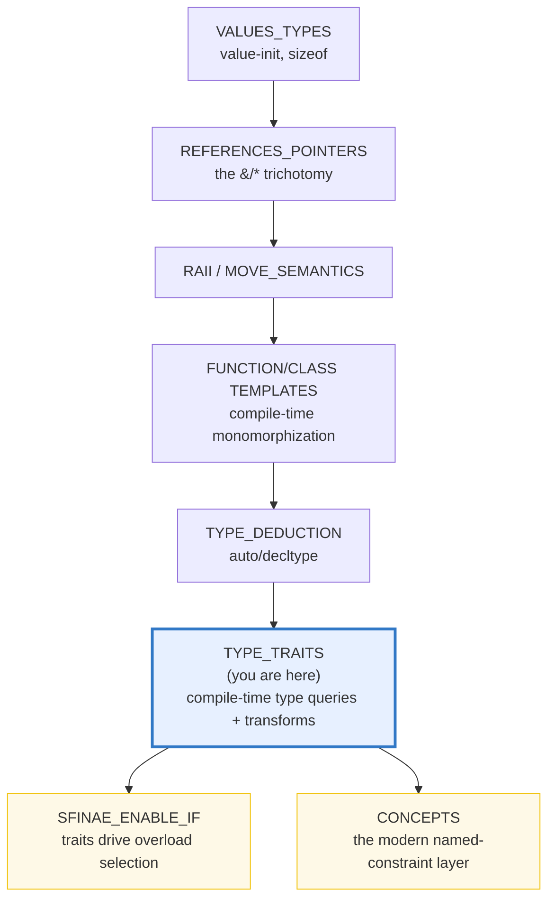
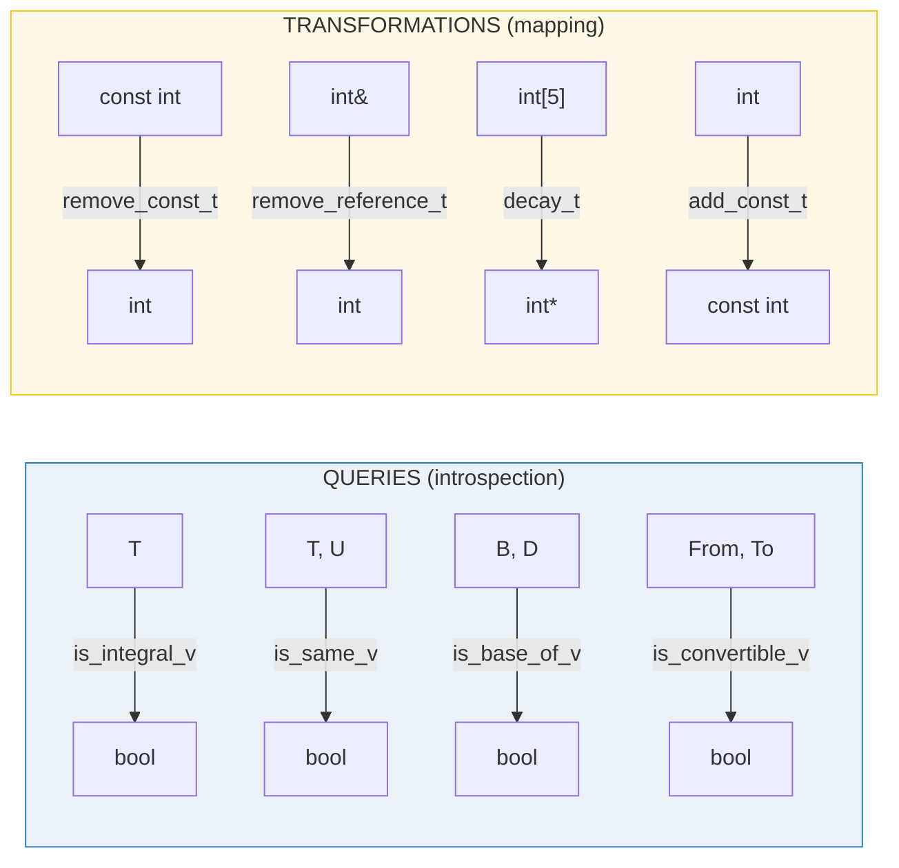
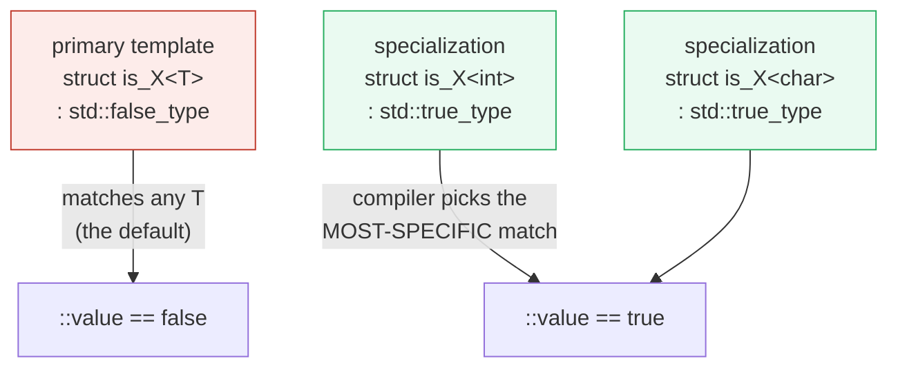

# TYPE_TRAITS — Compile-Time Type Introspection & Transformation

> **Goal (one line):** by printing every boolean and asserting every resulting
> type via `std::is_same_v`, show how `<type_traits>` provides **compile-time
> TYPE INTROSPECTION** (queries → `bool`: `is_integral_v`, `is_same_v`,
> `is_base_of_v`, `is_convertible_v`) and **TYPE TRANSFORMATION** (maps → type:
> `remove_const_t`, `remove_reference_t`, `add_const_t`, `decay_t`) — the
> building blocks of SFINAE, modernized by C++20 concepts.
>
> **Run:** `just run type_traits`
>
> **Ground truth:** [`type_traits.cpp`](./type_traits.cpp) → captured stdout in
> [`type_traits_output.txt`](./type_traits_output.txt). Every value/table below
> is pasted **verbatim** from that file under a
> `> From type_traits.cpp Section X:` callout. Nothing is hand-computed.
>
> **Prerequisites:** 🔗 `TYPE_DEDUCTION` (P2 — `is_same_v` is the type-equality
> check that *verifies* every deduction claim there) and a working knowledge of
> templates (🔗 `FUNCTION_TEMPLATES`, `CLASS_TEMPLATES`).

---

## 1. Why this bundle exists (lineage)

C++ templates are **compile-time monomorphization**: every instantiation
produces a fresh type-specialized copy. Once you write a template, two questions
immediately arise — *what kind of type is `T`?* and *can I derive a related type
from `T`?* — and both must be answered **at compile time**, with zero runtime
cost. `<type_traits>` is the standard library's answer: a vocabulary of
**predicates** (`is_integral_v<T>` → `bool`) and **type-level functions**
(`remove_const_t<T>` → a type), all evaluated by the compiler.



Two design facts make `<type_traits>` possible:

1. **Templates can be specialized.** A *primary* template can give a default
   answer, and *full specializations* can override it for specific types. Section
   E proves this by hand-rolling a tiny `is_my_integral<T>` that works exactly
   like the real `std::is_integral`.
2. **Types are compile-time values.** C++'s type system is a pure, deterministic
   term-rewriting system. `decay_t<int[5]>` is *always* `int*` — on every
   compiler, every run, every platform. That determinism is **why this bundle can
   exist**: every printed boolean is a compile-time constant, never observed at
   runtime.

The headline cross-language contrast: type traits are the **low-level** C++ layer
that TypeScript folds into a composable **utility-type** vocabulary, and that
Go outsources entirely to runtime `reflect`.

| Language | Compile-time type queries | Compile-time type transforms |
|---|---|---|
| **C++** (this bundle) | `is_integral_v<T>`, `is_same_v<T,U>`, `is_base_of_v<B,D>` | `remove_const_t<T>`, `decay_t<T>` — individual transforms |
| 🔗 [`../ts/UTILITY_TYPES.md`](../ts/UTILITY_TYPES.md) | `T extends string` (constraints) | `Partial<T>`, `Pick<T,K>`, `ReturnType<F>` — **composable** type-level functions |
| 🔗 [`../rust/`](../rust/) | `T: Trait` bounds; `std::any::Any` for **runtime** type info | (no `remove_const` — ownership/cv is enforced by the borrow checker, not erased) |
| 🔗 [`../go/REFLECTION.md`](../go/REFLECTION.md) | — (no compile-time type queries) | — (Go uses **runtime** `reflect`, the opposite end of the spectrum) |

> From cppreference — *Type traits (since C++11)*: "The type traits library …
> provides a way to inspect and modify the properties of types at compile time."
> The `_v` variable templates were added by C++17 (P0006) as sugar over the
> `::value` member constants; the `_t` alias templates by C++14 over `::type`.

---

## 2. The mental model: query → bool, transform → type

`<type_traits>` has exactly two kinds of tool, distinguished by what they
**return**. Conflating them is the #1 beginner trap (you cannot `if
(remove_const_t<T>)` — it's a *type*, not a value).



The **only** way to verify a transformation is to compare its result type
against an expected type with `is_same_v` and print *that* boolean — there is no
portable way to "print a type" (`typeid().name()` is implementation-defined
mangled garbage like `i`, `PKi`, `Ss`, unfi t for verified output). This is the
discipline every cross-ref bundle follows:

> From `type_traits.cpp` Section C: `decay_t<int[5]> == int* ? true` — the
> transform yields `int*`, the predicate `is_same_v<…, int*>` yields `true`, and
> the boolean is what gets printed.



That second diagram *is* the implementation trick (Section E proves it with a
hand-rolled `is_my_integral<T>`). Every query trait is a primary template that
defaults to `false_type`, plus a list of specializations that flip specific types
to `true_type`. The compiler's overload-resolution-style specialization picking
does all the work — at compile time, with zero runtime cost.

---

## 3. Section A — Primary categories + the `_v` (C++17) bool shortcut

> From `type_traits.cpp` Section A:
> ```
> PRIMARY CATEGORY TRAITS (each returns a compile-time bool):
> 
> trait                              result
> ---------------------------------- ------
> is_integral_v<int>                 true
> is_integral_v<bool>                true   (bool IS integral)
> is_integral_v<char>                true
> is_integral_v<std::size_t>         true   (size_t is an integer typedef)
> is_integral_v<double>              false   (floats are NOT integral)
> is_integral_v<std::string>         false
> is_floating_point_v<float>         true
> is_floating_point_v<double>        true
> is_floating_point_v<int>           false
> is_class_v<MyClass>                true
> is_class_v<std::string>            true   (string is a class)
> is_class_v<int>                    false
> is_class_v<MyEnum>                 false   (enums are NOT classes)
> is_pointer_v<int*>                 true
> is_pointer_v<std::string*>         true
> is_pointer_v<int>                  false
> is_pointer_v<int&>                 false   (references are NOT pointers)
> is_enum_v<MyEnum>                  true
> is_array_v<int[5]>                 true
> is_union_v<MyUnion>                true
> is_void_v<void>                    true
> 
> The _v shortcut vs the old ::value form (identical bool):
>   C++11:  std::is_integral<int>::value   = true
>   C++17:  std::is_integral_v<int>        = true   (same bool, less typing)
> [check] is_integral_v<int> == true: OK
> [check] is_integral_v<bool> == true (bool IS integral): OK
> [check] is_integral_v<double> == false (floats are not integral): OK
> [check] is_floating_point_v<double> == true: OK
> [check] is_class_v<std::string> == true: OK
> [check] is_pointer_v<int*> == true: OK
> [check] is_pointer_v<int&> == false (a reference is not a pointer): OK
> [check] is_enum_v<MyEnum> == true: OK
> [check] is_integral<int>::value == is_integral_v<int> (the two forms agree): OK
> ```

**What.** The *primary category* traits partition every type into exactly one
bucket: `is_void`, `is_null_pointer`, `is_array`, `is_pointer`, `is_enum`,
`is_union`, `is_class`, `is_function`, `is_reference` (split into
`is_lvalue_reference` / `is_rvalue_reference`), `is_member_pointer`, and the two
arithmetic primaries `is_integral` / `is_floating_point`. They answer "what
*kind* of thing is `T`?" with a single `bool`.

**Why — the expert details.**

- **`bool` IS integral.** `is_integral_v<bool>` is `true` — the standard lists
  `bool` among the integral types, alongside `char`/`short`/`int`/`long`/`long
  long` (signed and unsigned), `wchar_t`, `char8_t`/`char16_t`/`char32_t`. So a
  generic `template<class T> requires std::integral<T>` *does* accept `bool`,
  and `is_arithmetic_v<bool>` is `true` (Section D).
- **A typedef is NOT a new type.** `is_same_v<int, std::int32_t>` is `true` on
  this LP64 box because `std::int32_t` is literally a typedef of `int`. Traits
  see *through* typedefs to the underlying type — they are not name-based.
- **`const`, references, and signedness make distinct types.** `is_same_v<int,
  const int>` is `false`; so are `is_same_v<int, int&>` and `is_same_v<int,
  unsigned int>`. `is_pointer_v<int&>` is `false` — a reference is a *reference*,
  not a pointer, even though both alias another object (🔗
  `REFERENCES_POINTERS_INTRO`).
- **`is_class_v` does not mean "user-defined."** `is_class_v<std::string>` is
  `true` — standard-library types are classes too. `is_class_v<MyEnum>` is
  `false`: enums are their own category, distinct from classes.

**The `_v` shortcut (C++17).** Before C++17 you wrote `std::is_integral<T>::value`
— a member constant of the `integral_constant<bool, …>` base. C++17 added the
**variable template** `std::is_integral_v<T>`, which is defined as exactly that
`::value` and saves five characters. Both compile to the identical `bool`
constant; the bundle's `[check] is_integral<int>::value == is_integral_v<int>`
proves they agree. Always write `_v`; the `::value` form survives only for
back-compat and for the rare trait that lacks a `_v` (most do not).

> From cppreference — *`std::is_integral`*: "If `T` is an **integral type** … `T`
> is one of `bool`, `char`, `char8_t`, `char16_t`, `char32_t`, `wchar_t`,
> `short`, `int`, `long`, `long long`, … or any **implementation-defined**
> extended integer types, including the signed, unsigned, and **cv-qualified**
> variants." And P0006 (C++17): "Adopt the Type Trait **Variable Templates** from
> the Library Fundamentals TS."

---

## 4. Section B — Type relations (`is_same` / `is_base_of` / `is_convertible`)

> From `type_traits.cpp` Section B:
> ```
> is_same_v<T, U> (type equality — cv-qualifiers make distinct types):
>   is_same_v<int, int>            = true
>   is_same_v<int, const int>      = false   (const matters!)
>   is_same_v<int, int&>           = false   (a reference is a distinct type)
>   is_same_v<int, unsigned int>   = false   (signedness matters)
>   is_same_v<int, std::int32_t>   = true   (int32_t is a typedef of int here)
> 
> is_base_of_v<Base, Derived> (inheritance — incl. private/ambiguous):
>   is_base_of_v<Base, Derived>    = true   (Derived : Base)
>   is_base_of_v<Derived, Base>    = false   (reversed: false)
>   is_base_of_v<Base, Base>       = true   (a class is a base of ITSELF)
>   is_base_of_v<Base, Other>      = false   (unrelated)
> 
> is_convertible_v<From, To> (IMPLICIT conversion only — no casts):
>   is_convertible_v<Derived*, Base*> = true   (upcast is implicit)
>   is_convertible_v<Base*, Derived*> = false   (downcast needs static_cast)
>   is_convertible_v<int, double>     = true   (numeric promotion)
>   is_convertible_v<double, int>     = true   (narrowing, but still implicit)
>   is_convertible_v<std::string, int> = false
> [check] is_same_v<int, int>: OK
> [check] is_same_v<int, const int> == false (cv makes distinct types): OK
> [check] is_same_v<int, std::int32_t> == true on this LP64 ABI: OK
> [check] is_base_of_v<Base, Derived>: OK
> [check] is_base_of_v<Derived, Base> == false (reversed): OK
> [check] is_base_of_v<Base, Base> == true (reflexive): OK
> [check] is_convertible_v<Derived*, Base*> (implicit upcast): OK
> [check] is_convertible_v<Base*, Derived*> == false (downcast needs static_cast): OK
> ```

**`is_same_v<T, U>`** is the foundational predicate — it is how *every* type
claim elsewhere in this curriculum is verified (🔗 `TYPE_DEDUCTION` builds its
entire `assertType` helper around it). The expert details:

- **cv-qualifiers and references make distinct types.** `is_same_v<int, const
  int>` and `is_same_v<int, int&>` are both `false`. This is why
  `remove_const_t` / `remove_reference_t` exist (Section C) — to *erase* the
  distinction so two types compare equal.
- **A typedef is the SAME type.** `is_same_v<int, std::int32_t>` is `true` here
  (LP64, where `int32_t` aliases `int`). On a platform where `int32_t` aliases
  something else it stays `true` *for that aliasing* — `is_same_v` sees through
  typedefs to the underlying type. This is the trait's guarantee and its trap:
  you cannot use it to tell two typedef-spellings apart.

**`is_base_of_v<Base, Derived>`** answers inheritance:

- **Reflexive.** `is_base_of_v<Base, Base>` is `true` — a class counts as its
  own base. (This matters in generic code: a constraint `is_base_of_v<T, T>` is
  a no-op identity, not a contradiction.)
- **Asymmetric.** `is_base_of_v<Base, Derived>` is `true` but
  `is_base_of_v<Derived, Base>` is `false`. Order matters.
- **Includes private/ambiguous/virtual bases.** Unlike `std::derived_from` (the
  C++20 concept), `is_base_of_v` reports `true` even for *private* or
  *ambiguous* inheritance — it inspects the type graph, not accessibility.

**`is_convertible_v<From, To>`** answers "would `From x; To y = x;` compile?"
— i.e. **implicit** conversion only, no casts:

- **Upcast `Derived*` → `Base*` is implicit** (`true`); **downcast `Base*` →
  `Derived*` requires `static_cast`** (`false`). This is the bedrock of
  overload/SFINAE dispatch on polymorphic hierarchies.
- **Narrowing conversions are still "convertible."** `is_convertible_v<double,
  int>` is `true` — implicit narrowing is allowed (with a possible
  `-Wconversion` warning at the call site). The trait reports *well-formedness*,
  not *safety*.
- Use **`is_nothrow_convertible_v`** (C++20) if you also care about exception
  safety of the conversion.

> From cppreference — *`std::is_base_of`*: "If `Derived` is derived from `Base`
> or if both are the same non-union class (in either case ignoring cv-qualifiers)
> … `value == true`." *`std::is_convertible`*: "If the imaginary function
> definition `To test() { return std::declval<From>(); }` is well-formed …
> `value == true`."

---

## 5. Section C — Type TRANSFORMATIONS (yield a type; assert via `is_same_v`)

**This is the half of `<type_traits>` that produces types, not booleans.** Because
the result is a *type*, the only way to assert it is to compare against an
expected type with `is_same_v` and print *that* boolean — you cannot print a
type portably (`typeid().name()` is impl-defined, see pitfalls).

> From `type_traits.cpp` Section C:
> ```
> cv-qualifier additions / removals (assert via is_same_v):
>   remove_const_t<const int>          == int        ? true
>   remove_volatile_t<volatile int>    == int        ? true
>   remove_cv_t<const volatile int>    == int        ? true
>   add_const_t<int>                   == const int  ? true
>   add_cv_t<int>                      == const vola ? true
> 
> reference additions / removals:
>   remove_reference_t<int&>           == int        ? true
>   remove_reference_t<int&&>          == int        ? true
>   add_lvalue_reference_t<int>        == int&       ? true
>   add_rvalue_reference_t<int>        == int&&      ? true
> 
> pointer addition:
>   add_pointer_t<int>                 == int*       ? true
>   remove_pointer_t<int*>             == int        ? true
> 
> decay_t<T> — simulates passing T BY VALUE to a template:
>   decay_t<int>                       == int        ? true
>   decay_t<int&>                      == int        ? true   (ref stripped)
>   decay_t<int&&>                     == int        ? true   (rref stripped)
>   decay_t<const int&>                == int        ? true   (cv AND ref stripped)
>   decay_t<int[5]>                    == int*       ? true   (array -> pointer)
>   decay_t<int(int)>                  == int(*)(int)? true   (function -> fn-ptr)
>   decay_t<int[4][2]>                 == int(*)[2]  ? true   (one level only)
> 
> remove_cvref_t (C++20) — the modern shortcut for cv+ref stripping:
>   remove_cvref_t<const int&>         == int        ? true
>   remove_cvref_t<int&&>              == int        ? true
> 
> The _t shortcut vs the old ::type form (identical type):
>   C++11:  std::remove_const<const int>::type   == int ? true
>   C++14:  std::remove_const_t<const int>       == int ? true
> [check] remove_const_t<const int> == int: OK
> [check] remove_cv_t<const volatile int> == int: OK
> [check] remove_reference_t<int&> == int: OK
> [check] remove_reference_t<int&&> == int: OK
> [check] add_const_t<int> == const int: OK
> [check] add_pointer_t<int> == int*: OK
> [check] decay_t<const int&> == int (cv AND ref stripped): OK
> [check] decay_t<int[5]> == int* (array decays to pointer): OK
> [check] decay_t<int(int)> == int(*)(int) (function decays to fn-ptr): OK
> [check] decay_t<int[4][2]> == int(*)[2] (one level only): OK
> [check] remove_cvref_t<const int&> == int (C++20 shortcut): OK
> [check] remove_const<T>::type == remove_const_t<T> (the two forms agree): OK
> ```

**The transform families.**

- **cv-qualifier** — `remove_const_t`/`remove_volatile_t`/`remove_cv_t` strip;
  `add_const_t`/`add_volatile_t`/`add_cv_t` add. `remove_const_t<const int>` is
  `int`; `add_const_t<int>` is `const int`.
- **reference** — `remove_reference_t` strips the `&` or `&&`; the `add_*`
  variants add them. `remove_reference_t<int&&>` is `int` — both reference kinds
  collapse to the underlying type.
- **pointer** — `add_pointer_t<T>` yields `T*`; `remove_pointer_t<T*>` yields
  `T`. (`add_pointer_t<int&>` is `int*`, *not* `int&*` — references don't have
  pointers; the trait applies `remove_reference` first.)
- **`remove_cvref_t` (C++20)** — the one-liner for "strip cv and ref" that
  everyone wrote by hand for a decade: `remove_cv_t<remove_reference_t<T>>`.
  Replaces the most common hand-rolled composition in pre-C++20 code.

**`decay_t<T>` — the crown jewel.** It applies the *exact* conversions the
language performs when passing a `T` argument **by value** to a function
template. The three rules:

| If `T` is… | `decay_t<T>` is… |
|---|---|
| an array of `U` (or ref to one) | `U*` (array-to-pointer decay) |
| a function type `F` (or ref to one) | `add_pointer_t<F>` (function-to-pointer) |
| anything else | `remove_cv_t<remove_reference_t<T>>` (strip cv + ref) |

`std::tuple`, `std::function`, `std::thread`, `std::optional`'s perfect-forwarding
overloads — every generic "store-by-value" wrapper normalizes its template
parameter with `decay_t` (or, post-C++20, `remove_cvref_t` when it does not want
array/function decay). The expert detail that bites: **multi-dimensional arrays
decay ONE level only.** `decay_t<int[4][2]>` is `int(*)[2]` — a pointer to
`int[2]` — *not* `int**`. A `int[4][2]` is an "array of 4 arrays of 2 ints";
decaying an array yields a pointer to its *element type*, which is `int[2]`.

**The `_t` shortcut (C++14).** The C++11 form is `typename
std::remove_const<T>::type` — you need the `typename` because `::type` is a
dependent type. The C++14 **alias template** `std::remove_const_t<T>` packages
the `typename ::type` for you, so `remove_const_t<const int>` is just `int`
without the `typename` dance. Always write `_t`.

> From cppreference — *`std::decay`*: "Performs the type conversions equivalent
> to the ones performed when passing function arguments by value." The possible
> implementation shown is exactly the three-rule cascade above. *`std::remove_cvref`*
> (C++20): "If the type `T` is a reference type, provides the member typedef `type`
> which is `std::remove_cv_t<std::remove_reference_t<T>::type>`."

---

## 6. Section D — Composite categories + property queries (`rank` / `extent`)

> From `type_traits.cpp` Section D:
> ```
> COMPOSITE category traits (unions of the primary categories):
>   is_arithmetic_v<int>          = true   (integral OR floating_point)
>   is_arithmetic_v<double>       = true
>   is_arithmetic_v<bool>         = true   (bool is integral -> arithmetic)
>   is_arithmetic_v<int*>         = false   (pointers are NOT arithmetic)
>   is_arithmetic_v<std::string>  = false
> 
>   is_object_v<int>              = true   (an int IS an object)
>   is_object_v<int&>             = false   (references are NOT objects)
>   is_object_v<void>             = false   (void is incomplete)
> 
>   is_scalar_v<int>              = true
>   is_scalar_v<MyEnum>           = true   (enums are scalars)
>   is_scalar_v<int*>             = true
> 
> PROPERTY QUERIES (return std::size_t — a dimension, not a bool):
>   rank_v<int>                   = 0   (not an array -> 0 dimensions)
>   rank_v<int[10]>               = 1   (1-dimensional)
>   rank_v<int[3][4]>             = 2   (2-dimensional)
>   rank_v<int[2][3][4]>          = 3   (3-dimensional)
> 
>   extent_v<int, 0>              = 0   (not an array -> 0)
>   extent_v<int[10]>             = 10   (== extent_v<int[10], 0>)
>   extent_v<int[3][4], 0>        = 3
>   extent_v<int[3][4], 1>        = 4   (the inner dimension)
>   extent_v<int[3], 5>           = 0   (no such dimension -> 0)
> 
> sizeof the array TYPES (the extent product * sizeof element):
>   sizeof(int[10])    = 40   (10 * 4)
>   sizeof(int[3][4])  = 48   (3 * 4 * 4)
> [check] is_arithmetic_v<int>: OK
> [check] is_arithmetic_v<double>: OK
> [check] is_arithmetic_v<bool> (bool is arithmetic): OK
> [check] is_arithmetic_v<int*> == false (pointers are not arithmetic): OK
> [check] is_object_v<int>: OK
> [check] is_object_v<int&> == false (references are not objects): OK
> [check] is_scalar_v<MyEnum> (enums are scalars): OK
> [check] rank_v<int> == 0 (not an array): OK
> [check] rank_v<int[10]> == 1: OK
> [check] rank_v<int[3][4]> == 2: OK
> [check] extent_v<int[3][4], 1> == 4: OK
> [check] extent_v<int> == 0 (not an array): OK
> [check] sizeof(int[3][4]) == 3 * 4 * sizeof(int): OK
> ```

**Composite categories** are unions of the primaries:

- **`is_arithmetic_v<T>` = `is_integral_v<T> || is_floating_point_v<T>`.** `bool`,
  `int`, `double` are all arithmetic; pointers and classes are not.
- **`is_object_v<T>`** is true for anything that is *not* a reference, not a
  function, and not `void` — i.e. anything that actually occupies storage. (An
  `int&` is *not* an object; it is an alias. This matches the value-vs-reference
  axis threaded through the whole curriculum, 🔗 `VALUE_VS_REFERENCE_VS_POINTER`.)
- **`is_scalar_v<T>`** = arithmetic ∪ enum ∪ pointer ∪ member-pointer ∪
  null-pointer. The C legacy notion of "a single register-width value."

**Property queries return a number, not a bool** — a `std::size_t`:

- **`rank_v<T>`** = number of array dimensions. `0` for a non-array, `1` for
  `int[10]`, `2` for `int[3][4]`, `3` for `int[2][3][4]`.
- **`extent_v<T, N>`** = bound of the `N`th dimension. `extent_v<int[3][4], 1>`
  is `4`. `0` if `T` is not an array, or if there is no `N`th dimension.

These let generic code recurse over arrays of arbitrary rank (the trick behind
`std::extent`-driven multidimensional iteration). Note the consistency check at
the bottom: `sizeof(int[3][4]) == 3 * 4 * sizeof(int)` — the `extent` product
times the element size is the storage footprint.

> From cppreference — *`std::rank`*: "If `T` is an array type, provides the member
> constant `value` equal to the number of dimensions of the array; otherwise 0."
> *`std::extent`*: "If `T` is an array type … provides the member constant `value`
> equal to the number of elements along the `N`th dimension …; otherwise 0."

---

## 7. Section E — The implementation trick + `_v`/`_t` history + traits vs concepts

> From `type_traits.cpp` Section E:
> ```
> (1) A HAND-ROLLED is_my_integral<T> (primary = false_type + specializations):
>     is_my_integral<int>::value         = true   (specialization hit)
>     is_my_integral<long>::value        = true   (specialization hit)
>     is_my_integral<double>::value      = false   (PRIMARY template: false)
>     is_my_integral<std::string>::value = false   (PRIMARY template: false)
> [check] hand-rolled is_my_integral<int>::value (specialization matches): OK
> [check] hand-rolled is_my_integral<double>::value == false (primary template wins): OK
> 
> (2) The _v / _t SHORTCUTS vs the old ::value / ::type forms:
>     QUERY  (-> bool):
>       C++11:  std::is_integral<int>::value              = true
>       C++17:  std::is_integral_v<int>                   = true   (variable template)
>     TRANSFORM (-> type):
>       C++11:  std::remove_const<const int>::type == int ? true
>       C++14:  std::remove_const_t<const int>      == int ? true   (alias template)
> [check] is_integral<int>::value == is_integral_v<int>: OK
> 
> (3) TRAITS vs CONCEPTS (C++20): the modern replacement for category/relation traits
>     trait (bool)                       concept (constraint)            same answer?
>     ----------------------------------  -----------------------------  -------------
>     is_integral_v<int>           = true   std::integral<int>           = true   true
>     is_integral_v<double>        = false  std::integral<double>        = false  true
>     is_base_of_v<Base,Derived>   = true   std::derived_from<Derived,Base> = true   true
>     is_convertible_v<Derived*,Base*> = true   std::convertible_to<Derived*,Base*> = true   true
> 
>     static_assert(std::integral<int>);                       passes
>     static_assert(!std::integral<double>);                    passes
>     static_assert(std::derived_from<Derived, Base>);         passes
>     static_assert(std::convertible_to<Derived*, Base*>);     passes
> 
>     -> Concepts give NAMED constraint-failure diagnostics instead of an
>        SFINAE substitution-failure wall of template spew. But they cannot
>        REPLACE transformations (remove_const_t, decay_t) — there is no
>        'remove_const concept'; traits remain the type-level compute layer.
> [check] std::integral<int> (concept form) == is_integral_v<int>: OK
> [check] std::integral<double> == false (matches the trait): OK
> [check] std::derived_from<Derived, Base> == is_base_of_v<Base, Derived>: OK
> [check] std::convertible_to<Derived*, Base*> == is_convertible_v<Derived*, Base*>: OK
> ```

**(1) How traits are actually implemented — the primary-template + specializations
trick.** This is the mechanism beneath every query trait. The bundle proves it
with a hand-rolled `is_my_integral<T>`:

```cpp
template <class T>
struct is_my_integral : std::false_type {};          // primary: false for ALL T
template <> struct is_my_integral<bool>      : std::true_type {};
template <> struct is_my_integral<char>      : std::true_type {};
template <> struct is_my_integral<short>     : std::true_type {};
template <> struct is_my_integral<int>       : std::true_type {};
template <> struct is_my_integral<long>      : std::true_type {};
template <> struct is_my_integral<long long> : std::true_type {};
```

The primary template derives from `std::false_type` (so `::value == false` for
any `T` by default). Each specialization for a type the trait should be *true*
for derives from `std::true_type` (so `::value == true`). The compiler picks the
**most-specific** specialization that matches; if none matches, the primary
template wins (`false`). That is the *entire* mechanism — no runtime work, no
RTTI, just template specialization picking, which the compiler does anyway. The
real `std::is_integral` is the same shape, with more specializations (signed and
unsigned variants, `wchar_t`, `char8_t`/`16_t`/`32_t`, and the cv-qualified
forms).

**(2) The `_v` (C++17) / `_t` (C++14) history.** Two pieces of syntactic sugar
landed a few years apart:

| Era | Query form | Transform form |
|---|---|---|
| C++11 | `std::is_integral<T>::value` | `typename std::remove_const<T>::type` |
| C++14 | (unchanged) | `std::remove_const_t<T>` (alias template — drops the `typename`) |
| C++17 | `std::is_integral_v<T>` (variable template — drops the `::value`) | (unchanged) |

Both shortcuts are *pure sugar* — the bundle asserts
`is_integral<int>::value == is_integral_v<int>` and
`remove_const<T>::type == remove_const_t<T>` to prove it. Always use the short
forms; the long forms survive only for back-compat.

**(3) Traits vs concepts (C++20).** C++20 concepts are the *modern, named*
replacement for *many* category/relation traits — the bundle prints a side-by-side
table showing they agree for every tested case:

| Trait (bool) | Concept (C++20 constraint) |
|---|---|
| `is_integral_v<T>` | `std::integral<T>` |
| `is_floating_point_v<T>` | `std::floating_point<T>` |
| `is_class_v<T>` | (no direct concept) |
| `is_same_v<T,U>` | (no direct concept; use `requires { requires std::is_same_v<T,U>; }`) |
| `is_base_of_v<B,D>` | `std::derived_from<D,B>` (note: **swapped argument order**, and excludes private/ambiguous bases) |
| `is_convertible_v<F,T>` | `std::convertible_to<F,T>` |

Two crucial distinctions:

1. **Concepts give *named* diagnostics.** When a `requires std::integral<T>`
   constraint fails, the compiler reports *"the required trait `std::integral<T>`
   was not satisfied"* — not a wall of SFINAE substitution-failure template spew.
   This is the user-facing win.
2. **Concepts do NOT replace transformations.** There is no `remove_const`
   concept, no `decay` concept — concepts *constrain* types, they do not
   *compute* types. Traits remain the type-level compute layer underneath
   everything. Concepts sit on top of traits, they do not abolish them.

> From cppreference — *`std::integral` (concept)*: "The concept
> `integral<T>` is satisfied if and only if `T` is an integral type." It is
> specified as `template<class T> concept integral = std::is_integral_v<T>;` —
> i.e. the concept is literally *defined in terms of the trait*. The same holds
> for `std::convertible_to` (`is_convertible_v`) and `std::derived_from`
> (`is_base_of_v` plus an accessibility check).

---

## 8. Worked smallest-scale example

Everything above, compressed to the lines a beginner must memorize:

```cpp
#include <type_traits>

// QUERIES return a bool:
static_assert( std::is_integral_v<int>);          // true
static_assert( std::is_class_v<std::string>);     // true
static_assert(!std::is_pointer_v<int&>);          // false — a ref is not a ptr
static_assert( std::is_same_v<int, std::int32_t>);// true on LP64 (typedef)
static_assert( std::is_base_of_v<Base, Derived>); // true (note: reflexive!)
static_assert( std::is_convertible_v<Derived*, Base*>); // upcast is implicit

// TRANSFORMS return a TYPE — assert via is_same_v, never typeid().name():
static_assert(std::is_same_v<std::remove_const_t<const int>, int>);
static_assert(std::is_same_v<std::remove_reference_t<int&&>, int>);
static_assert(std::is_same_v<std::add_const_t<int>,         const int>);
static_assert(std::is_same_v<std::decay_t<int[5]>,          int*>);
static_assert(std::is_same_v<std::decay_t<int(int)>,        int (*)(int)>);
static_assert(std::is_same_v<std::remove_cvref_t<const int&>, int>);   // C++20

// PROPERTY QUERIES return a size_t:
static_assert(std::rank_v<int[3][4]>     == 2);
static_assert(std::extent_v<int[3][4],1> == 4);
```

> From `type_traits.cpp` Section C, `decay_t<int[5]> == int* ? true` and
> `decay_t<int(int)> == int(*)(int)? true` — the two canonical decay rules — are
> the lines to internalize. Section A's `is_integral_v<bool> == true` is the
> canonical "gotcha."

---

## 9. The value-vs-reference-vs-pointer axis (threaded through this bundle)

`<type_traits>` is pure **compile-time** introspection — it produces no runtime
objects. But the *types it inspects* sit on the curriculum's value/ref/ptr axis,
and the most-used transforms exist precisely to *cross* that axis:

| What the trait/transform does | Axis consequence |
|---|---|
| `is_object_v<int&>` → `false` | A reference is *not* an object — it aliases, it does not own bytes. |
| `is_pointer_v<int&>` → `false` | References and pointers are *distinct* categories, despite both aliasing. |
| `remove_reference_t<int&>` → `int` | Strips the alias to recover the value type — the move-semantics warm-up. |
| `decay_t<const int&>` → `int` | Simulates *pass-by-value*: alias collapses to a copy-able value. |
| `add_lvalue_reference_t<int>` → `int&` | Invents an alias over a value (used by `std::forward`). |
| `is_convertible_v<Derived*, Base*>` → `true` | The polymorphic upcast is *implicit*; the downcast needs `static_cast` (🔗 `CASTS`). |

`remove_reference_t` and `add_lvalue_reference_t` are the load-bearing transforms
behind `std::move` and `std::forward` (🔗 `MOVE_SEMANTICS`) — they manipulate the
value-vs-reference axis at the type level so the runtime cast helpers can do
their job.

---

## 10. Pitfalls (the expert payoff)

| Trap | Symptom | Fix |
|---|---|---|
| Using `typeid().name()` to "show" a type | output is **impl-defined & nondeterministic** (`i`, `PKi`, `Ss`, `l`, …) — unfit for verified output, varies by compiler/ABI | Assert with `std::is_same_v<T,U>` and **print the boolean** (this bundle's `b(...)` helper). |
| `if (remove_const_t<T>)` — treating a transform like a query | compile error ("expected a value, got a type") | Queries (`*_v`) yield `bool`; transforms (`*_t`) yield a *type*. Verify a transform with `is_same_v<…, expected>`. |
| `is_same_v<int, std::int32_t>` assumed `false` (different "names") | `true` — `int32_t` is a typedef, traits see *through* to the underlying type | Use a strong typedef (`struct` wrapper) if you need a genuinely distinct type; traits cannot distinguish two typedef-spellings. |
| `is_same_v<int, const int>` expected `true` | `false` — cv-qualifiers make **distinct** types | Wrap with `remove_cv_t`/`remove_cvref_t` *before* comparing if you want cv-agnostic equality. |
| `is_base_of_v<Base, Base>` expected `false` | `true` — a class is a base of **itself** (reflexive) | If you need strict derivation, AND with `!is_same_v<B,D>`. |
| `is_base_of_v` reports `true` for a `private` base | You dispatch on an inheritance the caller cannot actually name/use | Use `std::derived_from` (C++20 concept) — it excludes inaccessible/ambiguous bases. |
| `is_convertible_v<double, int>` expected `false` (it's "narrowing") | `true` — implicit narrowing is allowed (well-formedness, not safety) | Use `-Wconversion` at the call site, or guard with a stricter custom check; consider `is_nothrow_convertible_v`. |
| `decay_t<int[4][2]>` expected `int**` | `int(*)[2]` — arrays decay **one level only** | Iterate with `remove_extent_t` if you need to peel levels; do not assume full flattening. |
| `decay_t<int&>` expected `int&` | `int` — decay strips the reference (simulates pass-by-value) | If you want to keep the reference, do not decay; use `remove_cv_t<T>` alone. |
| Forgetting `typename std::remove_const<T>::type` (C++11 form) | compile error in a dependent context | Use the C++14 `_t` alias (`std::remove_const_t<T>`) — it folds in the `typename`. |
| `extent_v<int, 5>` assumed well-defined for any `N` | returns `0` for out-of-range `N` or non-array — silent, not an error | Check `rank_v` first if the dimension's existence matters. |
| Treating `bool` as "not arithmetic" | `is_arithmetic_v<bool>` is `true` (bool is integral) | If you need "integer or float, excluding bool," write `is_integral_v<T> && !is_same_v<remove_cv_t<T>, bool>`. |
| Assuming concepts fully replaced traits (C++20) | No `remove_const` concept, no `decay` concept — transforms have no concept form | Concepts *constrain*, traits *compute*. Both still needed post-C++20. |
| `is_same_v` with `auto`-deduced types | top-level `const`/`&` are *stripped* by `auto` (🔗 `TYPE_DEDUCTION`) so the comparison surprises | Use `decltype(var)` directly (no strip), not `auto`, when asserting a stored type. |

---

## 11. Cheat sheet

```cpp
#include <type_traits>   // queries + transforms
#include <concepts>      // std::integral / convertible_to / derived_from (C++20)

// ── QUERIES (return a compile-time bool; prefer the _v shortcut) ──────────
//   primary categories (one bucket per type):
std::is_integral_v<int>;           // true   (bool, char, short/int/long, +signed/unsigned/cv)
std::is_floating_point_v<double>;  // true   (float / double / long double, +cv)
std::is_class_v<std::string>;      // true
std::is_pointer_v<int*>;           // true   (NOT int& — refs are their own category)
std::is_enum_v<E>;   std::is_union_v<U>;   std::is_array_v<int[5]>;   std::is_void_v<void>;

//   relations (two types -> bool):
std::is_same_v<T, U>;              // type equality (cv and refs make distinct types!)
std::is_base_of_v<Base, Derived>;  // incl. private/ambiguous; REFLEXIVE (B,B) == true
std::is_convertible_v<From, To>;   // implicit conversion only (upcast yes, downcast no)

//   composite categories:
std::is_arithmetic_v<T>;   // = is_integral || is_floating_point  (bool IS arithmetic)
std::is_object_v<T>;       // not a reference, function, or void
std::is_scalar_v<T>;       // arithmetic | enum | pointer | member-ptr | nullptr_t

//   property queries (return std::size_t — a NUMBER, not a bool):
std::rank_v<int[3][4]>;          // 2   (number of array dimensions; 0 if not an array)
std::extent_v<int[3][4], 1>;     // 4   (bound of the Nth dimension; 0 if none)

// ── TRANSFORMATIONS (return a TYPE; assert via is_same_v) ─────────────────
//   cv / ref stripping (the most-used transforms):
std::remove_const_t<const int>;        // int
std::remove_cv_t<const volatile int>;  // int
std::remove_reference_t<int&>;         // int   (strips both & and &&)
std::remove_cvref_t<const int&>;       // int   (C++20 one-liner: remove_cv<remove_reference<T>>)

//   cv / ref / pointer adding:
std::add_const_t<int>;                 // const int
std::add_pointer_t<int>;               // int*
std::add_lvalue_reference_t<int>;      // int&   (used by std::forward)

//   decay_t: simulate template-deduction-by-value (array->ptr, fn->fnptr, strip cv-ref):
std::decay_t<int[5]>;                  // int*
std::decay_t<int(int)>;                // int(*)(int)
std::decay_t<const int&>;              // int
std::decay_t<int[4][2]>;               // int(*)[2]   (one level only!)

// ── The _v / _t SHORTCUTS (C++17 / C++14 sugar over the C++11 forms) ──────
std::is_integral_v<T>            == std::is_integral<T>::value;        // (variable template)
std::remove_const_t<T>           == typename std::remove_const<T>::type; // (alias template)

// ── TRAITS vs CONCEPTS (C++20): concepts sit ON TOP of traits ─────────────
std::integral<T>              == std::is_integral_v<T>;             // concept DEFINED as the trait
std::convertible_to<From, To> ~ std::is_convertible_v<From, To>;
std::derived_from<Derived, B> ~ std::is_base_of_v<B, Derived>;      // arg order SWAPPED;
                                                                    // excludes private bases
//   concepts give NAMED constraint-failure diagnostics; they do NOT replace
//   transforms — there is no `remove_const` concept. Traits compute types.

// ── VERIFYING a type claim (the discipline of this whole curriculum) ──────
//   assert with is_same_v and PRINT THE BOOLEAN — never typeid().name():
static_assert(std::is_same_v<std::decay_t<T>, int*>);
bool ok = std::is_same_v<decltype(x), int>;     // print `ok`, not the type name

// ── The implementation trick (primary + specializations) ──────────────────
template<class T> struct is_my_X : std::false_type {};       // primary:  false for all T
template<>        struct is_my_X<int>  : std::true_type {};   // specialization: true
template<>        struct is_my_X<long> : std::true_type {};
```

---

## 12. 🔗 Cross-references

**Within C++ (the expertise spine):**

- 🔗 `TYPE_DEDUCTION` (P2) — `std::is_same_v<A,B>` is the type-equality check this
  bundle defines; `TYPE_DEDUCTION` uses it (via an `assertType` helper) to verify
  *every* `auto`/`decltype`/`decltype(auto)` deduction. Read that bundle first
  if `is_same_v` is unfamiliar.
- 🔗 `CONCEPTS` (P2) — the modern, *named* constraint layer that sits on top of
  the category/relation traits (`std::integral<T>` is literally defined as
  `std::is_integral_v<T>`). Concepts give better error messages; they do *not*
  replace transformations.
- 🔗 `SFINAE_ENABLE_IF` (P6) — the pre-C++20 technique that uses
  `enable_if_t<is_integral_v<T>>` to make a template overload *disappear* for
  non-matching `T`. Type traits are the predicates that drive SFINAE; concepts
  (C++20) largely replaced this pattern with cleaner `requires` clauses.
- 🔗 `FUNCTION_TEMPLATES` / `CLASS_TEMPLATES` (P5) — the template machinery whose
  specialization behavior the "implementation trick" in Section E relies on.
- 🔗 `MOVE_SEMANTICS` (P3) — `remove_reference_t` and `add_lvalue_reference_t`
  are the load-bearing transforms behind `std::move` and `std::forward`.
- 🔗 `CASTS` (P5) — `is_convertible_v` reports *implicit* convertibility; the
  casts (`static_cast`, `dynamic_cast`, `reinterpret_cast`) extend what the type
  system allows but the trait does not report.
- 🔗 `VALUES_TYPES` (P1) — the value/reference/pointer axis that the transforms
  (`remove_reference_t`, `decay_t`) cross at the type level.

**Cross-language parallels (the 5-language curriculum):**

- 🔗 [`../ts/UTILITY_TYPES.md`](../ts/UTILITY_TYPES.md) — **the closest sibling.**
  TypeScript's `Partial<T>`, `Pick<T,K>`, `Omit<T,K>`, `ReturnType<F>`,
  `Parameters<F>` are *composable* type-level functions over mapped types — the
  same idea as C++ traits, but higher-level and composable. C++ traits are
  individual low-level transforms (`remove_const_t`); TS gives you a vocabulary
  to build new ones from `keyof`, conditional types, and `infer`. Both are
  compile-time, both are erased at runtime.
- 🔗 [`../rust/`](../rust/) — Rust's traits (`T: Clone`, `T: Iterator`) are
  *runtime* interface bounds, not compile-time type predicates. Rust has no
  `remove_const` because ownership and mutability are enforced by the **borrow
  checker**, not erased. `std::any::Any` provides runtime type info (`TypeId`),
  which C++ has too (`typeid`) but which neither language uses for the
  compile-time metaprogramming that `<type_traits>` exists for.
- 🔗 [`../go/REFLECTION.md`](../go/REFLECTION.md) — Go has **no compile-time type
  queries at all** (no generics-time introspection until very recently, and even
  now no trait library). Go's `reflect` package is **runtime** reflection — the
  opposite end of the spectrum from `<type_traits>`'s zero-cost compile-time
  predicates. C++ traits cost zero at runtime; Go's reflection costs a heap
  allocation and a type switch.

---

## Sources

Every signature, value, and behavioral claim above was verified against
cppreference and the ISO C++ standard, then corroborated by ≥1 independent
secondary source:

- cppreference — *`<type_traits>` header* (the full library index — primary
  categories, composite categories, type properties, type relations, property
  queries, type modifications, type transformations):
  https://en.cppreference.com/w/cpp/header/type_traits
- cppreference — *Primary type categories* (`is_void`, `is_null_pointer`,
  `is_integral`, `is_floating_point`, `is_array`, `is_pointer`, `is_enum`,
  `is_union`, `is_class`, `is_function`, `is_lvalue_reference`,
  `is_rvalue_reference`, `is_member_pointer`, `is_member_object_pointer,
  `is_member_function_pointer`):
  https://en.cppreference.com/w/cpp/types/is_integral
  (and the sibling pages `is_floating_point`, `is_class`, `is_pointer`,
  `is_enum`, `is_array`, `is_union`, `is_void`).
- cppreference — *Composite type categories* (`is_arithmetic`, `is_fundamental,
  `is_object`, `is_scalar`, `is_compound`, `is_reference`):
  https://en.cppreference.com/w/cpp/types/is_arithmetic
  (and `is_object`, `is_scalar`).
- cppreference — *Type relations* (`is_same`, `is_base_of`, `is_convertible`,
  `is_nothrow_convertible`):
  - `is_same`: https://en.cppreference.com/w/cpp/types/is_same
  - `is_base_of`: https://en.cppreference.com/w/cpp/types/is_base_of
  - `is_convertible`: https://en.cppreference.com/w/cpp/types/is_convertible
- cppreference — *Type modifications* (`remove_cv`, `remove_const`,
  `remove_volatile`, `add_cv`, `add_const`, `remove_reference`,
  `add_lvalue_reference`, `add_rvalue_reference`, `remove_pointer`,
  `add_pointer`, `remove_extent`, `remove_all_extents`):
  https://en.cppreference.com/w/cpp/types/remove_cv
  (and `remove_const`, `remove_reference`, `add_const`, `add_pointer`).
- cppreference — *Type transformations* (`decay`, `remove_cvref` C++20,
  `enable_if`, `conditional`, `common_type`, `type_identity`):
  - `std::decay` (the three-rule cascade; the possible implementation shown):
    https://en.cppreference.com/w/cpp/types/decay
  - `std::remove_cvref` (C++20 = `remove_cv_t<remove_reference_t<T>>`):
    https://en.cppreference.com/w/cpp/types/remove_cvref
- cppreference — *Property queries* (`rank`, `extent`):
  - `std::rank`: https://en.cppreference.com/w/cpp/types/rank
  - `std::extent`: https://en.cppreference.com/w/cpp/types/extent
- cppreference — *`std::integral_constant` / `bool_constant` / `true_type` /
  `false_type`* (the base classes every trait derives from — the
  implementation trick):
  https://en.cppreference.com/w/cpp/types/integral_constant
- cppreference — *C++20 concepts library* (`std::integral`, `std::floating_point,
  `std::convertible_to`, `std::derived_from` — the named-constraint layer built
  *on top of* the traits):
  - `std::integral`: https://en.cppreference.com/w/cpp/concepts/integral
  - `std::convertible_to`: https://en.cppreference.com/w/cpp/concepts/convertible_to
  - `std::derived_from`: https://en.cppreference.com/w/cpp/concepts/derived_from
- ISO C++ standard — P0006R0 *Adopt Type Trait Variable Templates from Library
  Fundamentals TS for C++17* (the `_v` variable templates):
  https://www.open-std.org/jtc1/sc22/wg21/docs/papers/2015/p0006r0.html
- ISO C++23 draft (open-std.org) — normative wording:
  - 21 [*Metafunctions library* / *Type traits*]
  - Working draft: https://open-std.org/JTC1/SC22/WG21/docs/papers/2023/n4950.pdf
- Secondary corroboration (≥2 independent sources, web-verified):
  - Stack Overflow — *"Difference between `std::is_same<T,U>::value` and
    `std::is_same_v<T,U>`"* (the `_v` shortcut == `::value`):
    https://stackoverflow.com/questions/79258344/is-there-any-difference-between-using-stdis-samet-uvalue-and-stdis-same
  - studyplan.dev — *Type Traits in C++: Compile-Time Type Analysis* ("`std::is_integral_v<T>`
    is equivalent to `std::is_integral<T>::value`; same API for custom traits"):
    https://www.studyplan.dev/pro-cpp/type-traits
  - 3DGep — *Beginning C++ Template Programming* (variable templates for type
    traits, SFINAE, and C++20 concepts):
    https://www.3dgep.com/beginning-cpp-template-programming/

**Facts that could not be verified by running** (documented, not executed,
because they are platform-specific or compile-error-only): the `is_same_v<int,
std::int32_t> == true` claim is LP64-specific (on a platform where `int32_t`
aliases `long` it would be `false` — the trait is correct *either way*, it just
follows the typedef); `typeid().name()` output strings (`i`, `PKi`, …) are
implementation-defined and intentionally never printed by this bundle; and the
hand-rolled `is_my_integral<T>` is a *demo* of the implementation technique, not
a claim about how any specific standard library literally implements
`std::is_integral` (real implementations use compiler intrinsics / built-in
traits under the hood, but the *visible* mechanism is the primary +
specializations pattern this bundle demonstrates).
