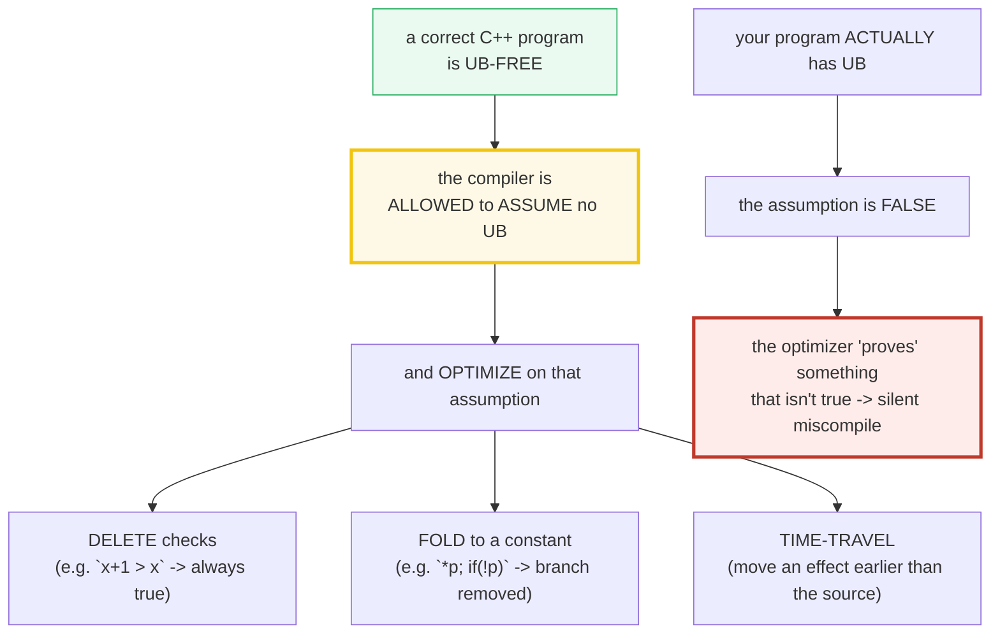
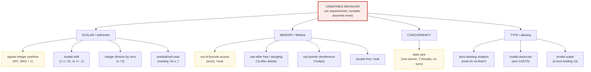

# UNDEFINED_BEHAVIOR — What UB Is, Why the Optimizer Assumes None & the Detectors

> **Goal (one line):** pin what **undefined behavior (UB)** *is* (the standard imposes
> **no requirements**), *why* it is dangerous (the compiler is allowed to **assume no
> UB** and **optimize** on that assumption — deleting checks, folding to constants,
> "time-traveling"), the common UB family, the **UB vs implementation-defined vs
> unspecified** distinction, and the modern **detectors** (ASan/UBSan/TSan/MSan) —
> with the **verified path 100% UB-free** and **every UB demo `#ifdef DEMO_UB`-gated**
> so `just run` / `just out` / `just check` / `just sanitize` never compile a single UB.
>
> **Run:** `just run undefined_behavior`
> **(UB demos gated — compile with `-DDEMO_UB` under ASan/UBSan to see the diagnostics.)**
>
> **Ground truth:** [`undefined_behavior.cpp`](./undefined_behavior.cpp) → captured
> stdout in [`undefined_behavior_output.txt`](./undefined_behavior_output.txt). Every
> number/table below is pasted **verbatim** from that file under a
> `> From undefined_behavior.cpp Section X:` callout. Nothing is hand-computed.
>
> **Prerequisites:** 🔗 [`VALUES_TYPES.md`](./VALUES_TYPES.md) (the uninitialized-read
> UB trap), 🔗 [`RAII.md`](./RAII.md), 🔗 [`NEW_DELETE_RAW_POINTERS.md`](./NEW_DELETE_RAW_POINTERS.md)
> (use-after-free), 🔗 [`CASTS.md`](./CASTS.md) (aliasing/downcast UB), 🔗
> [`ATOMICS_MEMORY_ORDER.md`](./ATOMICS_MEMORY_ORDER.md) (the data race). This is the
> Phase 7 capstone — the thing that separates C++ *users* from C++ *experts*.

---

## 1. Why this bundle exists (lineage)

> "There are **no restrictions on the behavior of the program**."
> — cppreference, *Undefined behavior*

Most languages let you reason "this line does X." C++ does not — not always. A whole
class of operations has **no requirements** on what happens: signed overflow, an
out-of-bounds index, a use-after-free, a null dereference, a data race, a bad shift,
an aliasing violation, an uninitialized read. The standard washes its hands: *"the
compiled program is not required to do anything meaningful."* That is **undefined
behavior**, and it is THE defining expert topic of C++.

But the *real* danger is not "the line does something random." It is that **because a
correct program is UB-free, the compiler is *allowed* to assume no UB happens, and to
optimize on that assumption.** So UB does not merely misbehave at runtime — it lets the
compiler **delete** the very checks you wrote to detect it, **fold** expressions to
constants, or "time-travel" an effect earlier than the source order. A guard like
`if (x + 1 > x)` meant to catch overflow is compiled to `return true`, because under
the no-UB assumption `x+1` can never be `<= x`. The bug becomes invisible.



The headline contrast across the 5-language curriculum:

| Language | Manual memory? | UB possible? | How is it caught? |
|---|---|---|---|
| **C++** (this bundle) | **yes** (`new`/`delete`, raw pointers) | **yes — the central trap** | **runtime sanitizers** (ASan/UBSan/TSan/MSan), or not at all |
| 🔗 [`../rust/`](../rust/) | yes (no GC) | **no — the borrow checker forbids UAF/dangling/data-race/null-deref at compile time** | the compiler (compile time) |
| 🔗 [`../go/`](../go/) · [`../ts/`](../ts/) · [`../python/`](../python/) | **no** (GC) | different bug class (no manual-memory UB; data races still bite Go/TS) | the runtime/GC |

C++ is the only language here that gives you *both* "manual memory" *and* "UB is
possible" — and then asks **you**, the programmer, to keep it straight, with sanitizers
as the runtime safety net. Rust chose the opposite: make the dangerous things
impossible to even *write*. That trade-off *is* the C++/Rust contrast.

> From cppreference — *Undefined behavior*: "Renders the entire program meaningless if
> certain rules of the language are violated." And *UB and optimization*: "Because
> correct C++ programs are free of undefined behavior, compilers may produce unexpected
> results when a program that actually has UB is compiled with optimization enabled."

---

## 2. The UB family tree



Every leaf below is UB — and each has a **well-defined fix** (Section 5 demonstrates
all nine). The detectors in Section 7 each target one branch of this tree.

---

## 3. Section A — UB: NO requirements; the compiler ASSUMES none

> From `undefined_behavior.cpp` Section A:
> ```
> The C++ standard's behavior classes (cppreference / ISO defns):
>   ill-formed             diagnosable error; conforming compiler MUST emit a diagnostic
>   ill-formed, NDR        semantic error a compiler need NOT diagnose; if run -> UB
>   implementation-defined impl chooses AND MUST document it (e.g. sizeof(int) == 4)
>   unspecified            impl chooses, NEED NOT document (e.g. order of f(a(), b()))
>   erroneous  (C++26)     wrong but well-defined; diagnostic recommended (e.g. uninit read)
>   undefined behavior     NO requirements on the program — ANYTHING can happen
> 
> THE DANGER: a correct C++ program is UB-free, so the compiler is ALLOWED to
> ASSUME no UB happens and OPTIMIZE on that assumption. UB therefore does not
> merely 'do something random at runtime' — it lets the compiler DELETE checks,
> FOLD expressions to constants, or even 'time-travel' (move an effect earlier).
> 
> UNSIGNED wraparound is DEFINED: UINT_MAX(4294967295) + 1 = 0
> [check] unsigned wraparound is well-defined: UINT_MAX + 1 == 0: OK
> CHECKED signed add is DEFINED: __builtin_add_overflow(INT_MAX,1) -> overflow=1
> [check] checked signed add DETECTS INT_MAX+1 overflow (no UB executed): OK
> 
> THE OPTIMIZER PAYOFF (documented; the overflow itself is NOT executed here):
>   bool foo(int x){ return x + 1 > x; }  // 'true' OR signed-overflow UB
>   -> gcc/clang -O2 fold it to `return true` (mov eax,1; ret)
>   the `x+1 > x` overflow-check is DELETED: assuming no UB, it can't be false
> [check] documented: assuming-no-UB lets the optimizer delete an overflow check: OK
> 
> CONSTANT evaluation DIAGNOSES UB: `constexpr int x = INT_MAX + 1;` is a
> compile error (the only place UB is guaranteed-diagnosable). `2 + 3` in a
> constant expression is fine -> constexpr result = 5
> [check] constexpr 2 + 3 == 5 (well-defined constant evaluation): OK
> ```

**The behavior classes (don't confuse them).** The standard draws a hierarchy. Only
the last one is catastrophic:

- **ill-formed** — a diagnosable error; a conforming compiler **must** emit a
  diagnostic (often a hard error). E.g. a syntax error, or a narrowing in brace-init.
- **ill-formed, no diagnostic required (NDR)** — a semantic error a compiler *need
  not* diagnose (often only visible at link time, e.g. an ODR violation). If such a
  program is executed, the behavior is **undefined**.
- **implementation-defined** — the implementation picks **one** behavior and **must
  document it**. Portable *within* a documented platform. **Not UB.** (Section 6.)
- **unspecified** — the implementation picks **one** of a valid set, and **need not**
  document which. Each result is valid. **Not UB.** (Section 6.)
- **erroneous behavior (C++26)** — wrong, but **well-defined**; a diagnostic is
  *recommended*. The flagship example: reading a default-initialized automatic
  variable moves here *from* UB under P2795.
- **undefined behavior** — **no requirements**. The whole program is meaningless.

**The optimizer assumption — the real danger.** Because a *correct* program is
UB-free, the compiler is entitled to **assume** no UB occurs and **optimize** on it.
Two well-defined facts the bundle proves, and the assumption they sit next to:

- **Unsigned arithmetic wraps** (mod 2^N) — `UINT_MAX + 1 == 0`, defined. So unsigned
  overflow is *not* UB; you may rely on the wrap.
- **`__builtin_add_overflow(a, b, &r)`** performs a checked add via a CPU flags test
  and reports overflow **without ever executing UB**. `__builtin_add_overflow(INT_MAX,
  1, &r)` returns `true`. This is the portable way to *detect* signed overflow.
- **`constexpr`/`consteval` *diagnose* UB** — in a constant-expression context, signed
  overflow is a **hard compile error** (constant evaluation has well-defined
  semantics). It is the *only* place UB is guaranteed-diagnosable. `constexpr int x =
  INT_MAX + 1;` fails to compile; `constexpr int x = 2 + 3;` is `5`.

> From cppreference — *UB and optimization*: "correct C++ programs are free of
> undefined behavior, compilers may produce unexpected results when a program that
> actually has UB is compiled with optimization enabled."

### The optimizer payoff (worked example — documented, the UB itself never executed)

The canonical case (cppreference "Signed overflow"):

```cpp
bool foo(int x) {
    return x + 1 > x;   // either true, or signed-overflow UB
}
```

gcc and clang at `-O2` compile this to a constant:

```asm
foo(int):
        mov     eax, 1      ; always return true
        ret
```

The reasoning: *if* `x + 1` overflowed, the program had UB and the compiler owes you
nothing; *else* `x + 1 > x` is always true. So the optimizer assumes the non-UB case
and folds the function to `return true`. **The overflow check the author wrote is
gone.** The same logic deletes a null check placed *after* a dereference (`int v = *p;
if (!p) ...` — the compiler "knows" `p` isn't null, else the deref was UB, so the
`if` is dead), and can even reorder effects ("time travel").

> From Raymond Chen (Microsoft) — *"Undefined behavior can result in time travel"*:
> "When undefined behavior is invoked, anything is possible. For example, a variable
> can be both true and false." https://devblogs.microsoft.com/oldnewthing/20140627-00/?p=633
>
> From the LLVM Project Blog — *"What Every C Programmer Should Know About Undefined
> Behavior"*: signed overflow being UB "is not just a theoretical issue … it is a
> significant source of bugs in real world applications … and it lets the compiler
> generate better code." https://blog.llvm.org/2011/05/what-every-c-programmer-should-know.html

---

## 4. Section B — the common UB family + the WELL-DEFINED fix for each

For each UB the bundle (1) states the rule, (2) **demonstrates the well-defined fix**
and asserts it in the verified path, and (3) gates the actual UB behind `#ifdef
DEMO_UB`. Compile with `-DDEMO_UB` under ASan/UBSan (Section 7) to make the detectors
fire.

> From `undefined_behavior.cpp` Section B:
> ```
> (1) signed overflow: INT_MAX+1 is UB. Fix = CHECKED add (defined): overflow=1
> [check] checked add detects INT_MAX+1 overflow (the well-defined fix): OK
>     unsigned INT_MAX + 1u = 2147483648 (unsigned overflow WRAPS — it is NOT UB)
> [check] unsigned INT_MAX + 1u wraps without UB (defined modular arithmetic): OK
> (2) invalid shift: 1<<32 (and 1<<-1) is UB. Fix = validate the exponent first.
>     safe_shl(1, 32) = 0   (exponent rejected -> 0, no UB)
>     safe_shl(1, 4)  = 16   (in range -> 16)
> [check] safe_shl rejects exponent >= width (returns 0, no UB): OK
> [check] safe_shl computes 1<<4 == 16 when the exponent is in range: OK
> (3) null deref: *nullptr is UB. Fix = check `p != nullptr` first -> 42
> [check] null-checked dereference reads the real value (no UB): OK
> [check] null pointer correctly handled (never dereferenced): OK
> (4) integer div-by-zero: x/0 is UB. Fix = guard the divisor -> -1
> [check] divisor guarded: 10/0 never executes (no UB): OK
> (5) out-of-bounds: arr[4] on a 4-elem array is UB. The bounds-check uses size:
>     arr index 2 (in range) = 30
>     manual bounds check on idx=4 -> -1 (rejected, no UB)
> [check] manual bounds check rejects idx=4 (no OOB access): OK
> [check] in-range index arr[2] == 30: OK
> (6) use-after-free: *p after delete is UB. Fix = capture-before-delete + null.
>     captured value before delete = 7 (the freed storage is NOT read)
> [check] value captured BEFORE delete (freed storage never read): OK
> [check] pointer nulled after delete (delete-on-nullptr is a defined no-op): OK
> [check] delete nullptr is a well-defined no-op (no double-free, no UB): OK
> (7) aliasing: reading an int via float* is UB. Fix = std::memcpy -> 3.141593
> [check] memcpy round-trips the bit pattern (the well-defined aliasing fix): OK
> (8) uninit read: reading `int x;` (indeterminate) is UB. Fix = `int x{};` -> 0
> [check] value-initialized int == 0 (the fix; no indeterminate read): OK
> (9) data race: unsynchronized r/w of a non-atomic is UB. Fix = std::atomic -> 100
> [check] atomic counter reached 100 (race-free; single-thread demo): OK
> ```

**The nine UBs, and the well-defined fix for each.**

1. **Signed integer overflow** — `INT_MAX + 1` (any signed overflow) is UB. **Fix:**
   unsigned math (wraps, defined) or `__builtin_add_overflow`/`__builtin_mul_overflow`
   to *detect* it. (Unsigned overflow is **not** UB.)
2. **Invalid shift** — shifting by a negative amount, or by `>=` the type's width, is
   UB. **Fix:** validate the exponent first (`0 <= n && n < 32` for `int`).
3. **Null pointer dereference** — reading/writing through a null pointer is UB.
   **Fix:** check `p != nullptr` before dereferencing (and prefer references/`optional`
   where null isn't a valid state).
4. **Integer division by zero** — `x / 0` and `x % 0` are UB. **Fix:** guard the
   divisor.
5. **Out-of-bounds access** — indexing past the end of an array/container (`operator[]`
   is unchecked) is UB. **Fix:** an explicit bounds test, or `.at()` which **throws**
   `std::out_of_range` (defined, not UB).
6. **Use-after-free / dangling** — reading storage after `delete` (or after its scope
   ends) is UB. **Fix:** RAII / smart pointers (🔗 [`RAII.md`](./RAII.md),
   [`UNIQUE_PTR.md`](./UNIQUE_PTR.md)) that own and auto-delete; or at minimum
   capture-before-delete and never read freed storage. (`delete nullptr` is a defined
   no-op.)
7. **Type-aliasing violation** — accessing an object through a pointer of an *unrelated*
   type (e.g. reading an `int` through a `float*`) is UB. **Fix:** `std::memcpy`
   (`char`/`unsigned char`/`std::byte` alias anything — that is the legal raw-byte
   path). (🔗 [`CASTS.md`](./CASTS.md).)
8. **Uninitialized read** — reading a default-initialized automatic scalar
   (indeterminate value) is UB (C++23). **Fix:** value-initialization `int x{};` → 0.
   (🔗 [`VALUES_TYPES.md`](./VALUES_TYPES.md); reclassified to *erroneous* in C++26.)
9. **Data race** — two threads on the same non-atomic with no synchronization is UB.
   **Fix:** `std::atomic` or a mutex. (🔗 [`ATOMICS_MEMORY_ORDER.md`](./ATOMICS_MEMORY_ORDER.md),
   [`MUTEX_LOCK_GUARD.md`](./MUTEX_LOCK_GUARD.md).)

### The trap, demonstrated (NOT in the verified path)

Each UB is gated behind `#ifdef DEMO_UB`, which `just run` / `just out` / `just check`
/ `just sanitize` **never** pass, so the default and sanitizer builds stay UB-free.
The scalar demos (signed overflow, invalid shift, null deref, division by zero) live
inline in Section B; the two **memory** UBs (out-of-bounds, use-after-free) are caught
by AddressSanitizer, which is **fatal** (it aborts after the first report), so they are
isolated in `demoMemoryUBs()` at the very end of the program (Section 7 shows them
firing):

```cpp
#ifdef DEMO_UB
    int bad = INT_MAX; int bad2 = bad + 1;   // <-- UB: signed integer overflow
    int s = 1; int r = s << 32;              // <-- UB: shift exponent >= width
    int* p = nullptr; int v = *p;            // <-- UB: load of null pointer
    volatile int z = 0; int d = 5 / z;       // <-- UB: division by zero
    // (memory UBs, ASan-fatal, isolated in demoMemoryUBs():)
    int* arr = new int[4]; int oob = arr[10]; // <-- UB: out-of-bounds
    int* h = new int(42); delete h; int uaf = *h;  // <-- UB: use-after-free
#endif
```

> From cppreference — *UB and optimization* (the worked examples): "signed integer
> overflow", "access out of bounds", "uninitialized scalar", "null pointer
> dereference", "infinite loop without side-effects" — each with the compiler's
> optimized output demonstrating the assume-no-UB transformation:
> https://en.cppreference.com/w/cpp/language/ub

---

## 5. Section C — UB != implementation-defined != unspecified

> From `undefined_behavior.cpp` Section C:
> ```
> DISTINCT categories (do not confuse):
>   implementation-defined: impl picks ONE behavior and MUST document it.
>       -> portable within a documented platform; assertable; NOT UB.
>   unspecified:           impl picks ONE of a set; NEED NOT document which.
>       -> each result is valid; NOT UB. Avoid printing which one you got.
>   undefined behavior:    NO requirements; the whole program is meaningless.
>       -> NEVER rely on it; the compiler may assume it doesn't happen.
> 
> implementation-defined: sizeof(int) == 4 bytes (32 bits) on this platform
> [check] sizeof(int) >= 2 (>= 16 bits) — impl-defined, NOT UB: OK
> [check] this platform documents sizeof(int) == 4 (assertable, stable): OK
> implementation-defined: char is SIGNED here (CHAR_MIN == -128)
> [check] char is signed on this platform (CHAR_MIN < 0): OK
> unspecified: evaluation ORDER of the 2 args in `f(a(), b())` — either is
>     valid; we deliberately print NO order-dependent value here (portable).
> [check] unspecified eval-order NOT relied on for a printed value (portable): OK
> 
> THE CONTRAST — each is its OWN category, none of them is UB:
>   sizeof(int)==4           implementation-defined (documented, stable)
>   eval order of a(),b()    unspecified (valid either way; don't depend)
>   INT_MAX + 1              UNDEFINED BEHAVIOR (no requirements; compiler assumes none)
> [check] the three categories are DISTINCT (only UB renders the program meaningless): OK
> ```

**These three are constantly confused, and the confusion is dangerous** — it makes
people either fear things that are fine, or trust things that aren't.

| Category | Definition | May the program rely on it? | Example |
|---|---|---|---|
| **implementation-defined** | impl picks **one**, **must document** | **Yes** — within a documented platform. Assertable. | `sizeof(int) == 4`; `char` signedness; `sizeof(long)` (LP64 vs LLP64) |
| **unspecified** | impl picks **one of a set**, need not document | **Partly** — each result is *valid*, but you may not *depend on which*. | order of evaluation of `a()` vs `b()` in `f(a(), b())` |
| **undefined behavior** | **no requirements** | **No.** The compiler may *assume* it doesn't happen. | `INT_MAX + 1`; `arr[size]`; `*nullptr`; a data race |

- **`sizeof(int) == 4` is implementation-defined, NOT UB.** You may print it, assert
  it, and rely on it on a documented platform. The bundle asserts both `sizeof(int) >=
  2` (the standard's only guarantee) and the platform's documented `== 4`.
- **`char` signedness is implementation-defined.** It is signed on this x86/Apple-arm64
  toolchain (`CHAR_MIN == -128`), often unsigned on ARM. `char` is always a **distinct
  type** from both `signed char` and `unsigned char`.
- **Argument-evaluation order is unspecified.** `f(a(), b())` may call `a()` or `b()`
  first — both are valid, and the compiler need not document which. The bundle
  therefore **deliberately prints no order-dependent value** (printing one would be
  reproducible-by-accident here and a portability bug elsewhere). This is the
  discipline behind §4.2 rule 4 of `HOW_TO_RESEARCH.md`.

> From cppreference — *Undefined behavior* (Explanation): "implementation-defined
> behavior — the conforming implementation must document the effects"; "unspecified
> behavior — the conforming implementation is not required to document the effects …
> each unspecified behavior results in one of a set of valid results"; "undefined
> behavior — there are no restrictions on the behavior of the program."

---

## 6. Section D — the detectors: ASan / UBSan / TSan / MSan

> From `undefined_behavior.cpp` Section D:
> ```
> Compiler sanitizers (-fsanitize=...) — each catches a UB class:
>   ASan   address           memory UBs: OOB, use-after-free, double-free, leaks
>   UBSan  undefined         scalar UBs: signed overflow, shift, null deref, div0, ...
>   TSan   thread            data races (two threads, one non-atomic, no sync)
>   MSan   memory            use of an uninitialized value (primarily Linux)
> 
> How to run them:
>   just sanitize undefined_behavior   # the bundle gate: ASan + UBSan, MUST be clean
>   -fsanitize=address,undefined       # what `just sanitize` compiles with
>   -fsanitize=thread                  # TSan (data races) — separate from ASan
>   -fsanitize=memory                  # MSan (uninit reads) — Linux, separate from ASan
>   -DDEMO_UB + ASan/UBSan              # make the detectors FIRE on this bundle's demos
> 
> VERIFIED PATH: every UB demo is #ifdef DEMO_UB-gated, so the default build
> (what `just run` / `just out` / `just check` / `just sanitize` compile) contains
> ZERO undefined behavior. `just sanitize undefined_behavior` is therefore clean,
> and `just out` is byte-identical across runs (determinism: UB-free output).
> [check] the verified path is 100% UB-free (all UB demos are DEMO_UB-gated): OK
> 
> Well-defined + sanitizer-friendly: std::atomic fetch_add -> 1 (TSan sees no race)
> [check] std::atomic access is well-defined (no data race, TSan-clean): OK
> ```

**The four sanitizers, and what each catches** (`-fsanitize=...`):

| Tool | Flag | UB class it catches |
|---|---|---|
| **AddressSanitizer (ASan)** | `-fsanitize=address` | **memory** UBs: out-of-bounds, use-after-free, double-free, stack-use-after-return, leaks (Linux) |
| **UndefinedBehaviorSanitizer (UBSan)** | `-fsanitize=undefined` | **scalar** UBs: signed-integer-overflow, shift, null dereference, integer-divide-by-zero, alignment, … |
| **ThreadSanitizer (TSan)** | `-fsanitize=thread` | **data races** (two threads, one non-atomic, no synchronization) — *mutually exclusive with ASan* |
| **MemorySanitizer (MSan)** | `-fsanitize=memory` | **use of uninitialized values** — primarily Linux; *mutually exclusive with ASan* |

`just sanitize NAME` compiles with `-fsanitize=address,undefined` (ASan + UBSan) and is
the bundle gate: every bundle **must** pass it clean. TSan and MSan are run separately
(TSan is incompatible with ASan; MSan is Linux-only and incompatible with ASan). The
expert CI runs **all four** across different builds.

**The verified path is sanitizer-clean by construction.** Because every UB demo is
`#ifdef DEMO_UB`-gated, the default build (`what just run/out/check/sanitize compile`)
contains **zero** undefined behavior. `just sanitize undefined_behavior` is therefore
**clean (no errors)**, and `just out` is **byte-identical** across runs — the
determinism proof that the verified path is UB-free (UB makes output *meaningless*).

### Worked example: the detectors FIRE on the `-DDEMO_UB` path

Compiling the gated demos with `-DDEMO_UB` under ASan + UBSan and running it makes the
detectors fire (this is the whole point of the gate). Verbatim sanitizer output on this
machine (Apple clang 17), with the diagnostic **category** for each:

```
undefined_behavior.cpp:156:24: runtime error: signed integer overflow: 2147483647 + 1 cannot be represented in type 'int'
undefined_behavior.cpp:173:19: runtime error: shift exponent 32 is too large for 32-bit type 'int'
undefined_behavior.cpp:193:17: runtime error: load of null pointer of type 'int'
undefined_behavior.cpp:210:19: runtime error: division by zero
==PID==ERROR: AddressSanitizer: heap-buffer-overflow on address 0x602000000138 ...   (fatal: aborts the process)
```

| Demo UB | Detector | Diagnostic category |
|---|---|---|
| `INT_MAX + 1` | **UBSan** | `signed integer overflow` |
| `1 << 32` | **UBSan** | `shift exponent 32 is too large` |
| `*nullptr` (load) | **UBSan** | `load of null pointer of type 'int'` |
| `5 / 0` | **UBSan** | `division by zero` |
| `arr[10]` (heap OOB) | **ASan** (fatal) | `heap-buffer-overflow` |
| `*h` after `delete h` | **ASan** (fatal) | `heap-use-after-free` *(confirmed in isolation — ASan aborts at the OOB above before reaching it in one run)* |

UBSan is *continuable* (it prints the diagnostic and keeps going), so the four scalar
demos all fire in a single `-DDEMO_UB` run. ASan is *fatal* (it aborts after the first
report), so the two memory UBs are isolated at the end of the program; the
out-of-bounds fires `heap-buffer-overflow` and aborts, and a separate run confirms
use-after-free as `heap-use-after-free`. The two detector-fatal UBs are **never**
compiled into the default/sanitizer build — only under `-DDEMO_UB`.

> Two UBs the **runtime sanitizers do NOT reliably catch** (different tools):
> - **Aliasing violation** — strict aliasing is a *compiler assumption*; detected by
>   `-Wstrict-aliasing` / static analysis, not ASan/UBSan. The bundle uses `std::memcpy`
>   (the defined fix) instead.
> - **Uninitialized read** — detected by **MSan** (`-fsanitize=memory`, Linux), not
>   UBSan/ASan (🔗 [`VALUES_TYPES.md`](./VALUES_TYPES.md)).
> - **Data race** — detected by **TSan** (`-fsanitize=thread`), not ASan/UBSan
>   (🔗 [`ATOMICS_MEMORY_ORDER.md`](./ATOMICS_MEMORY_ORDER.md)).

---

## 7. Section E — how to AVOID UB + cross-language contrast

> From `undefined_behavior.cpp` Section E:
> ```
> THE DISCIPLINE (how experts write UB-free C++):
>   1. Initialize everything: `T x{};` (value-init -> zero), never bare `T x;`.
>   2. Own with RAII / smart pointers (P3): unique_ptr/shared_ptr delete for you -> no UAF/dangling.
>   3. Bounds-check with .at() (throws) or an explicit size test -> no OOB.
>   4. Share data via std::atomic (P4) or a mutex (P4) -> no data race.
>   5. Reinterpret bytes with std::memcpy, NOT reinterpret_cast+read -> no aliasing.
>   6. Detect overflow with __builtin_*_overflow / unsigned math -> no signed-overflow UB.
>   7. Run ASan+UBSan (+TSan/+MSan) in CI -> the runtime safety net for whatever slips through.
> [check] the 7-rule discipline is the expert recipe for UB-free C++: OK
> 
> CROSS-LANGUAGE — THE defining contrast:
>   C++    : trusts the programmer; UB is possible; caught by SANITIZERS at RUNTIME (or not at all).
>   Rust   : SAFE BY DEFAULT — the borrow checker FORBIDS UAF/dangling/data-race/null-deref at COMPILE time.
>   Go/TS/Python: GARBAGE-COLLECTED — no manual-memory UB; a DIFFERENT bug class (data races still bite Go/TS).
> [check] C++ trusts + sanitizers; Rust forbids at compile time; GC languages are a different bug class: OK
> ```

**The 7-rule discipline** is the operational form of "be a C++ expert." Rules 1–6 are
*prevention* (write code that can't have UB); rule 7 is *detection* (catch whatever
slipped through, at runtime, in CI). Every fix in Section 4 maps to one of these rules.

> From the LLVM Project Blog — *"What Every C Programmer Should Know About Undefined
> Behavior #1/3"*: "the[se] surprising effects [of UB] … are why tools like
> AddressSanitizer, UndefinedBehaviorSanitizer, and Valgrind are so valuable." The
> practical guidance: "enable `-Wall` and fix all warnings … enable ASan and UBSan in
> your testing … never ignore a warning."
> https://blog.llvm.org/2011/05/what-every-c-programmer-should-know.html

### A note on C++26: "erroneous behaviour"

C++26 (P2795) introduces a new category — **erroneous behaviour** — sitting *between*
well-defined and undefined: the program is wrong, but the behavior is **well-defined**
(with a *recommended* diagnostic), not UB. The flagship migration: reading a
default-initialized automatic variable moves **from UB to erroneous** under C++26. The
discipline is unchanged (`T x{};` to be correct), but the consequence softens from
"the optimizer may miscompile you" to "you get a defined value and ideally a warning."

> From cppreference — *Undefined behavior* (Explanation, since C++26): "erroneous
> behavior — the (incorrect) behavior that the implementation is recommended to
> diagnose. … If the execution contains an operation specified as having erroneous
> behavior, the implementation is permitted and recommended to issue a diagnostic."

---

## 8. Pitfalls (the expert payoff)

| Trap | Symptom | Fix |
|---|---|---|
| `INT_MAX + 1` (or any signed overflow) | **UB** → optimizer may delete your overflow check, fold to a constant, miscompile | Unsigned math (wraps, defined) or `__builtin_add_overflow`; **never** `if (x+1 > x)` |
| `1 << 32` / `1 << -1` | **UB** → garbage or folded; UBSan "shift exponent … too large" | Validate the exponent first (`0 <= n && n < width`) |
| `arr[n]` / `*end` / `v[v.size()]` | **UB** → ASan "heap/stack-buffer-overflow"; silent corruption without ASan | `.at()` (throws `out_of_range`) or an explicit size test |
| `*p` after `delete p` (use-after-free) | **UB** → ASan "heap-use-after-free"; dangling reads garbage | RAII / smart pointers (🔗 [`UNIQUE_PTR.md`](./UNIQUE_PTR.md)); capture-before-delete; never read freed storage |
| `*nullptr` | **UB** → SEGV / UBSan "load of null pointer"; optimizer may delete a later null check | Check `p != nullptr` first; prefer references/`optional` |
| `x / 0` (integer) | **UB** → UBSan "division by zero"; SIGFPE on some platforms | Guard the divisor |
| `int x;` then reading `x` | **UB** (C++23) → indeterminate value; MSan "use-of-uninitialized-value"; C++26 → erroneous | Value-init `int x{};` (🔗 [`VALUES_TYPES.md`](./VALUES_TYPES.md)) |
| Reading an `int` through a `float*` (aliasing) | **UB** → silent miscompile; **not** reliably sanitizer-caught | `std::memcpy`; or alias only via `char*`/`std::byte*` (🔗 [`CASTS.md`](./CASTS.md)) |
| Two threads on one non-atomic, no sync | **UB** (data race) → TSan reports it; torn reads / lost updates | `std::atomic` or a mutex (🔗 [`ATOMICS_MEMORY_ORDER.md`](./ATOMICS_MEMORY_ORDER.md)) |
| `int v = *p; if (!p) ...` (deref before null check) | **UB** → compiler "knows" `p` isn't null (else deref was UB) and **deletes the check** | Check for null **before** the dereference; never reorder a check after a UB |
| "It worked in debug, breaks in release" | Your program has UB — optimization exposes the assume-no-UB transformations | Reproduce under `-O2 -fsanitize=address,undefined`; the release build "breakage" is the symptom, not the bug |
| Treating `sizeof(int)` / `char` signedness as UB | Over-caution — they're **implementation-defined**, assertable and stable | Assert them freely on a documented platform (Section 5); use `<cstdint>` for exact widths |
| Printing argument-eval order (`f(a(), b())`) | Reproducible-by-accident, portability bug — it's **unspecified**, not UB | Never depend on it; don't print an order-dependent value |

---

## 9. Cheat sheet

```cpp
// ── THE DEFINITION ──────────────────────────────────────────────────────────
//   undefined behavior = the standard imposes NO requirements on the program.
//   Because a correct program is UB-free, the compiler is ALLOWED to ASSUME no
//   UB and OPTIMIZE on it (delete checks, fold to constants, "time-travel").
//   UB ≠ implementation-defined (documented) ≠ unspecified (valid either way).

// ── THE UB FAMILY (each: the rule + the WELL-DEFINED fix) ───────────────────
int a = INT_MAX;  // a + 1            UB  -> __builtin_add_overflow, or unsigned
int x = 1;        // x << 32          UB  -> validate exponent (0 <= n && n < 32)
int* p = nullptr; // *p               UB  -> check `p != nullptr` first
int z = 0;        // 5 / z            UB  -> guard the divisor
int arr[4];       // arr[4]           UB  -> .at() (throws) or bounds test
int* h = new int; delete h; // *h     UB  -> RAII/smart ptr; capture-before-delete
int n = ...;      // *reinterpret_cast<float*>(&n)  UB -> std::memcpy
int u;            // read u           UB  -> int u{};  (value-init to 0)
long s;           // race: s++ || print(s)  UB  -> std::atomic or mutex

// ── DETECTORS (-fsanitize=...) ──────────────────────────────────────────────
//   ASan   address     memory UBs: OOB, use-after-free, double-free, leaks
//   UBSan  undefined   scalar UBs: signed overflow, shift, null deref, div0
//   TSan   thread      data races             (incompatible with ASan)
//   MSan   memory      uninitialized reads    (Linux; incompatible with ASan)
//   just sanitize NAME  -> ASan+UBSan, the bundle gate (MUST be clean)

// ── THE 7-RULE DISCIPLINE (write UB-free C++) ───────────────────────────────
//   1. Initialize everything (`T x{};`).
//   2. Own with RAII / smart pointers.
//   3. Bounds-check (.at() / size test).
//   4. Share via std::atomic / mutex.
//   5. Reinterpret bytes with std::memcpy.
//   6. Detect overflow with __builtin_*_overflow / unsigned math.
//   7. Run ASan+UBSan (+TSan/+MSan) in CI.
```

---

## 10. 🔗 Cross-references

**Within C++ (the expertise spine):**

- 🔗 [`VALUES_TYPES.md`](./VALUES_TYPES.md) (P1) — the **uninitialized-read** UB is the
  first UB trap in the curriculum; Section B(8) here is its full taxonomy home.
- 🔗 [`RAII.md`](./RAII.md) / [`UNIQUE_PTR.md`](./UNIQUE_PTR.md) /
  [`SHARED_PTR_WEAK_PTR.md`](./SHARED_PTR_WEAK_PTR.md) /
  [`NEW_DELETE_RAW_POINTERS.md`](./NEW_DELETE_RAW_POINTERS.md) (P3) — **the fix** for
  use-after-free/dangling/double-free: own with RAII and smart pointers so the delete
  is automatic and the freed storage is never read.
- 🔗 [`CASTS.md`](./CASTS.md) (P2) — the **strict-aliasing** UB (`reinterpret_cast` +
  read of an unrelated type) and the **invalid-downcast** UB; `std::memcpy` is the
  defined alternative.
- 🔗 [`ATOMICS_MEMORY_ORDER.md`](./ATOMICS_MEMORY_ORDER.md) /
  [`MUTEX_LOCK_GUARD.md`](./MUTEX_LOCK_GUARD.md) /
  [`STD_THREAD.md`](./STD_THREAD.md) (P4) — a **data race is UB**; `std::atomic` and
  mutexes are the synchronization that establishes the happens-before edge.
- 🔗 `SANITIZERS_STATIC_ANALYSIS` (P7 #45) — the deep dive on ASan/UBSan/TSan/MSan +
  `clang-tidy`/`cppcheck` as the CI safety net; this bundle is the on-ramp.
- 🔗 [`CONSTEXPR_CONSTEVAL.md`](./CONSTEXPR_CONSTEVAL.md) (P6) — **constant evaluation
  diagnoses UB** at compile time (the only place UB is guaranteed-diagnosable).

**Cross-language parallels (THE headline contrast):**

- 🔗 [`../rust/`](../rust/) — **Rust is SAFE BY DEFAULT.** The borrow checker
  **forbids** use-after-free/dangling, data races, and null dereferences at **compile
  time** — the C++ UBs of Sections 4 and 7 are *impossible to write* in safe Rust. C++
  trusts the programmer and catches UB with **sanitizers at runtime** (or not at all).
  This single trade-off is the defining C++/Rust contrast.
- 🔗 [`../go/`](../go/) · [`../ts/`](../ts/) · [`../python/`](../python/) — **garbage-
  collected**: no manual-memory UB (no use-after-free/dangling from `delete`), a
  *different* bug class. (Data races still bite Go and TS, which share C++'s memory
  model; a Go/TS race is a logic bug, and in Go's race detector = detected like TSan.)

---

## Sources

Every signature, value, and behavioral claim above was verified against cppreference
and the ISO C++ standard, then corroborated by ≥1 independent secondary source:

- cppreference — *Undefined behavior* (the definition; the behavior classes —
  ill-formed / ill-formed-NDR / implementation-defined / unspecified / erroneous /
  undefined; the UB-and-optimization worked examples for signed overflow, OOB,
  uninitialized scalar, invalid scalar, null deref, infinite loop):
  https://en.cppreference.com/w/cpp/language/ub
- cppreference — *Implementation-defined behavior* /
  *Unspecified behavior* (the distinct categories; "each unspecified behavior results
  in one of a set of valid results"):
  https://en.cppreference.com/w/cpp/language/behavior
  (C-language sibling, same definitions): https://en.cppreference.com/w/c/language/behavior
- cppreference — *Order of evaluation* (the example of *unspecified* behavior — the
  order of `a()` vs `b()` in `f(a(), b())`):
  https://en.cppreference.com/w/cpp/language/eval_order
- cppreference — *The `as-if` rule* (the compiler may perform any transformation that
  does not change observable behavior — the basis for assume-no-UB optimizations):
  https://en.cppreference.com/w/cpp/language/as_if
- cppreference — *Attributes `[[assume]]`* (C++23) / *`std::unreachable`* (C++23) /
  *`[[indeterminate]]`* (C++26): https://en.cppreference.com/w/cpp/language/ub
- ISO C++23 draft (open-std.org) — normative wording:
  - 3.x behavior taxonomy `[defns.ill.formed]`, `[defns.impl.defined]`,
    `[defns.unspecified]`, `[defns.well.formed]`
  - Working draft: https://open-std.org/JTC1/SC22/WG21/docs/papers/2023/n4950.pdf
- Secondary corroboration for the **optimizer-assumes-no-UB** claim (≥2 independent
  sources, web-verified):
  - LLVM Project Blog — *"What Every C Programmer Should Know About Undefined
    Behavior #1/3"* (why signed overflow is UB and how it enables optimization):
    https://blog.llvm.org/2011/05/what-every-c-programmer-should-know.html
    - #2/3 (in practice): https://blog.llvm.org/2011/05/what-every-c-programmer-should-know_14.html
    - #3/3: https://blog.llvm.org/2011/05/what-every-c-programmer-should-know_21.html
  - Raymond Chen (Microsoft) — *"Undefined behavior can result in time travel (among
    other things, but time travel is the funkiest)"* (the deleted-check / time-travel
    effect): https://devblogs.microsoft.com/oldnewthing/20140627-00/?p=633
    - Follow-up *"On the limits of time travel in the face of undefined behavior"*:
      https://devblogs.microsoft.com/oldnewthing/20241104-00/?p=110466
  - Shafik Yaghmour — *"What You Need to Know when Optimizations Changes the Behavior
    of your Program"* (if behavior changes with -O level, you likely have UB):
    https://shafik.github.io/c++/undefined%20behavior/llvm/2025/02/11/when-opt-changes-program-behavior.html
- Secondary corroboration for the **UB-vs-impl-defined-vs-unspecified** distinction:
  - Stack Overflow — *"Why is the phrase 'undefined behavior means the compiler can do
    anything it wants' inaccurate?"* (UB is compiler leeway to assume + optimize):
    https://stackoverflow.com/questions/49032551/
  - PVS-Studio — *"C++ programmer's guide to undefined behavior"* (multi-part; the
    category distinction + the optimizer transformations):
    https://pvs-studio.com/en/blog/posts/cpp/1129/
- Secondary corroboration for **signed overflow is UB / checked arithmetic**:
  - GCC manual — *"Options That Control Optimization"* / *Integer Overflow Builtins*
    (`__builtin_add_overflow` etc. — the well-defined overflow check):
    https://gcc.gnu.org/onlinedocs/gcc/Integer-Overflow-Builtins.html
  - Stack Overflow — *"Signed overflow in C++ and undefined behaviour (UB)"*:
    https://stackoverflow.com/questions/59105498/
- C++26 — *Erroneous behaviour* (P2795; reclassifies the default-init read from UB to
  erroneous; cppreference "erroneous behavior" section):
  https://open-std.org/jtc1/sc22/wg21/docs/papers/2023/p2795r4.html
  - isocpp.org — Sandor Dargo, *"C++26: Erroneous Behaviour"*:
    https://www.sandordargo.com/blog/2025/02/05/cpp26-erroneous-behaviour
- Sanitizers (the detectors):
  - Clang — *AddressSanitizer* / *UndefinedBehaviorSanitizer* / *ThreadSanitizer* /
    *MemorySanitizer* documentation: https://clang.llvm.org/docs/ (ASan, UBSan, TSan,
    MSan pages); UBSan checks list:
    https://clang.llvm.org/docs/UndefinedBehaviorSanitizer.html
  - GCC — *Using Sanitizers*: https://gcc.gnu.org/onlinedocs/gcc/Instrumentation-Options.html
  - `cpp/Justfile` — `just sanitize NAME` = `c++ -std=c++23 -O1
    -fsanitize=address,undefined -fno-omit-frame-pointer` (the bundle gate).

**Facts that could not be verified by running the *default* build** (documented, not
executed, because executing them *is* UB — the whole point of the gate): the actual
value of `INT_MAX + 1`, the actual garbage of a null/OOB/UAF read (meaningless, varies,
caught by sanitizers), the compiler folding `bool foo(int x){ return x+1>x; }` to
`return true` (a `-O2` codegen fact observed on godbolt, not reproducible as a
verified-path number), and the `constexpr int x = INT_MAX + 1;` compile error (a
non-compiling line). These are confirmed by the cppreference sections, the LLVM/Raymond
Chen/Shafik sources, and the captured `-DDEMO_UB` sanitizer diagnostics above (Section
6's worked-example table) — not reproduced as runnable output in the verified path (a
file triggering them would fail `just check` / `just sanitize`).
