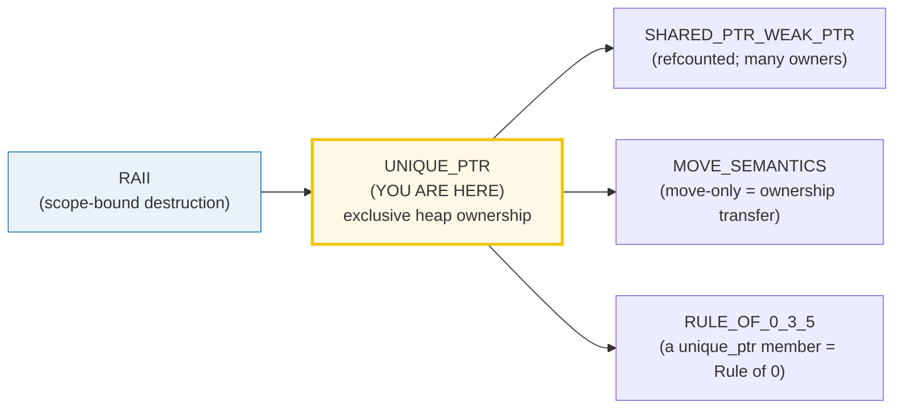
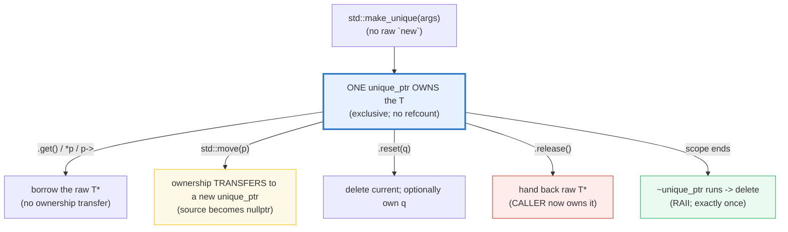
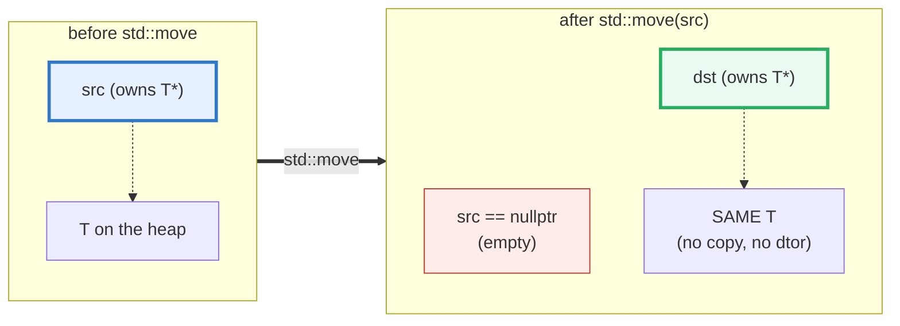

# UNIQUE_PTR — Exclusive Ownership, the Default Smart Pointer

> **Goal (one line):** by printing every value, show how `std::unique_ptr<T>` is
> THE default smart pointer — **exclusive ownership** (one owner), **MOVE-ONLY**
> (copying is a compile error; ownership transfers only via `std::move`), and
> **RAII** (its destructor calls `delete`, so no leak, no double-delete, no manual
> `new`/`delete`) — pinning `make_unique` (the exception-safe factory),
> `.get`/`.reset`/`.release`, custom deleters, polymorphic containers
> (`vector<unique_ptr<Base>>`), and the zero-overhead-vs-raw-pointer invariant.
>
> **Run:** `just run unique_ptr`
>
> **Ground truth:** [`unique_ptr.cpp`](./unique_ptr.cpp) → captured stdout in
> [`unique_ptr_output.txt`](./unique_ptr_output.txt). Every number/table below is
> pasted **verbatim** from that file under a `> From unique_ptr.cpp Section X:`
> callout. Nothing is hand-computed.
>
> **Prerequisites:** 🔗 [`RAII.md`](./RAII.md) (deterministic scope-bound
> destruction) · 🔗 [`MOVE_SEMANTICS.md`](./MOVE_SEMANTICS.md) (`std::move`,
> move-only types) · 🔗 [`REFERENCES_POINTERS_INTRO.md`](./REFERENCES_POINTERS_INTRO.md)
> (raw `T*`, the thing `unique_ptr` replaces).

---

## 1. Why this bundle exists (lineage)

A raw `new` without a matching `delete` **leaks**. A raw `delete` twice
**double-frees** (UB). A raw pointer gives you *no help* remembering which of
those you owe. `std::unique_ptr<T>` (C++11) fixes all three by **binding the
delete to the pointer's lifetime**: when the `unique_ptr` dies (goes out of
scope, is reset, or is moved-from-and-then-dies), it deletes its object **exactly
once**. That is RAII applied to a single heap object.



The three design facts that define `unique_ptr` — and that this bundle prints
proofs of — are:

1. **Exclusive ownership.** Exactly ONE `unique_ptr` owns each object (no
   refcount, no control block — that's `shared_ptr`). The owner's destructor
   deletes the object (Section A proves the dtor runs at scope exit).
2. **MOVE-ONLY.** The copy constructor and copy assignment are **deleted**, so
   copying a `unique_ptr` is a *compile error*. Ownership transfers **only**
   explicitly, via `std::move` — and after a move, the source is empty
   (`nullptr`). This is what makes ownership *auditable* (Section B).
3. **Zero-overhead.** A default-deleter `unique_ptr<T>` is the **same size as a
   raw `T*`** (Section E). There is no runtime cost over a raw pointer — you pay
   nothing for the safety. This is why `unique_ptr` is the default and
   `shared_ptr` is the exception.

> From cppreference — *`std::unique_ptr`*: "a smart pointer that owns … and
> manages another object via a pointer and subsequently **disposes of that object
> when the `unique_ptr` goes out of scope**." It "satisfies the requirements of
> `MoveConstructible` and `MoveAssignable`, but of **neither `CopyConstructible`
> nor `CopyAssignable`**."

### The headline cross-language parallel: Rust `Box<T>`

`std::unique_ptr<T>` is C++'s **direct equivalent of Rust's `Box<T>`** — both are
exclusive heap ownership, move-only, with the destructor freeing the object. The
one difference is *enforcement*: C++ trusts the programmer (a wrong move is
use-after-move UB at runtime, caught by sanitizers), while Rust's borrow checker
rejects the misuse at compile time. See the 🔗 cross-language table below.

---

## 2. The mental model: ownership as a graph





The second diagram is the whole of Section B: a move is a **pointer handoff**,
not a copy. The heap object never moves, never gets copied, and never gets
destroyed — only the *ownership token* (the raw pointer inside the
`unique_ptr`) changes hands. The source walks away empty.

---

## 3. Section A — `make_unique` + exclusive ownership + RAII dtor

> From `unique_ptr.cpp` Section A:
> ```
> make_unique<Tracked>(42) created ONE owner:
>     p->value           = 42   (*p dereferences the owned object)
>     (*p).value         = 42   (equivalent dot form)
>     p.get() == nullptr = false   (.get() borrows the raw ptr; no transfer)
>     bool(p)            = true   (operator bool: owns an object)
>     sizeof(p)          = 8 bytes (= sizeof(T*); zero overhead)
> [check] make_unique produced a non-null owner: OK
> [check] operator bool is true for a non-empty unique_ptr: OK
> [check] *p / p-> access the owned object (value == 42): OK
> [check] Tracked ctor ran exactly once for this make_unique: OK
> [check] Tracked dtor has NOT run yet (owner still alive in scope): OK
> [check] exactly one Tracked is now live (exclusive ownership: ONE owner): OK
> 
> After the inner scope closed (p destroyed):
>     Tracked dtor ran exactly once at scope exit (RAII)
>     Tracked::ctor_calls delta = 1
>     Tracked::dtor_calls delta = 1
>     Tracked::live delta       = 0   (back to where we started)
> [check] RAII: dtor ran exactly once when the unique_ptr left scope: OK
> [check] RAII: no net live objects left (no leak): OK
> [check] ctor and dtor call counts balance (1 each, no double-delete): OK
> ```

**`std::make_unique<T>(args...)`** is the safe factory: it does the `new` for you
and returns a `unique_ptr<T>` that owns the result. **Prefer it over writing
`unique_ptr<T>(new T)`** — it is shorter and exception-safe (Section E). The
bundle proves three things at once by counting constructor/destructor calls on a
`Tracked` helper:

- **The object is born exactly once** (`ctor_calls` delta = 1) when `make_unique`
  runs.
- **The object is NOT destroyed while the owner is in scope** (`dtor_calls`
  delta = 0 inside the block).
- **The object IS destroyed exactly once the instant the owner leaves scope**
  (`dtor_calls` delta = 1 after the `}`), and the live count returns to its
  starting value (no leak). That is **RAII**: destruction is bound to scope,
  deterministically, no `finally`, no GC pause.

The accessor surface: **`*p` / `p->`** dereference the owned object (just like a
raw pointer); **`p.get()`** hands back the raw `T*` **without transferring
ownership** (safe to pass to a legacy API that borrows); **`bool(p)`** (operator
bool) is `true` iff it owns an object.

> From cppreference — *`std::make_unique`* (C++14): "creates a unique pointer that
> manages a new object" — it "constructs an object of type `T` and wraps it in a
> `std::unique_ptr`." And *`unique_ptr` destructor*: "destructs the managed object
> if such is present … invokes the deleter … the default deleter uses the `delete`
> operator."

---

## 4. Section B — MOVE-ONLY (copy is a compile error; move transfers)

> From `unique_ptr.cpp` Section B:
> ```
> (1) Compile-time traits (the copy ban is enforced by the type system):
>     is_copy_constructible<unique_ptr<T>> = false   (copy ctor is DELETED)
>     is_move_constructible<unique_ptr<T>> = true   (move ctor is fine)
> [check] unique_ptr is NOT copy-constructible (copy is a compile error): OK
> [check] unique_ptr IS move-constructible: OK
> 
> (2) std::move TRANSFERS ownership (source becomes empty):
>     before move: src.get() != nullptr = true
>     after  move: src.get() == nullptr = true   (source is now EMPTY)
>     after  move: bool(src)            = false   (operator bool false)
>     after  move: dst->value           = 100   (destination owns it)
>     after  move: dst.get() == raw     = true   (SAME address; no copy made)
>     ctor/dtor deltas across the move  = 0 / 0   (ZERO — move is free)
> [check] after move, the source is empty (.get() == nullptr): OK
> [check] after move, operator bool on the source is false: OK
> [check] after move, the destination owns the object (value == 100): OK
> [check] move did NOT copy: destination holds the SAME address: OK
> [check] move did NOT construct or destroy the Tracked (no ctor/dtor delta): OK
> ```

**(1) Copying is a compile error.** `unique_ptr`'s copy constructor and copy
assignment operator are `= delete`'d. The bundle can't *run* a copy (the file
wouldn't compile), so it asserts the fact at compile time via
`std::is_copy_constructible<unique_ptr<T>>::value` (printed as `false`) plus a
`static_assert`. A literal `std::unique_ptr<T> q = p;` against a non-const `p`
fails to build with a "deleted function" error — the type system makes the
ownership rule impossible to violate silently. This is the core difference from
`shared_ptr` (which is copyable, because copying just bumps a refcount).

**(2) `std::move` transfers ownership — and that's it.** The bundle proves a move
is a **zero-cost pointer handoff**: after `auto dst = std::move(src);`, the
destination holds the *same* address `src` held, the source is `nullptr`, and the
`Tracked`'s constructor and destructor ran **zero** times across the move (deltas
`0 / 0`). Nothing was copied; nothing was destroyed; only the ownership token
moved. A moved-from `unique_ptr` is in a **valid but unspecified** state — for
`unique_ptr` specifically that state is *empty* (`get() == nullptr`), which is why
you may safely assign to it, reset it, or destroy it. (You must NOT dereference a
moved-from `unique_ptr` — see pitfalls.)

> From cppreference — *`std::unique_ptr`* notes: "Only non-const `unique_ptr` can
> transfer the ownership of the managed object to another `unique_ptr`." The class
> "satisfies … `MoveConstructible` and `MoveAssignable`, but of **neither
> `CopyConstructible` nor `CopyAssignable`**."

---

## 5. Section C — `.get` / `.reset` / `.release` + custom deleters

> From `unique_ptr.cpp` Section C:
> ```
> (1) reset(new Tracked(2)):
>     p->value = 2   (old object deleted, new one owned)
>     Tracked dtor delta across reset = 1   (the old(1) was deleted)
> [check] reset replaced the owned object (value now 2): OK
> [check] reset deleted the previous object (dtor ran once): OK
>     p.reset() (no arg): p.get() == nullptr = true   (emptied, dtor ran again)
> [check] reset() with no argument empties the unique_ptr: OK
> 
> (2) release():
>     q.get() == nullptr = true   (q released ownership)
>     raw->value = 3   (caller now owns `raw`; must delete it)
> [check] release emptied the unique_ptr: OK
> [check] release handed back a valid raw pointer (value == 3): OK
>     caller deleted `raw`: Tracked dtor delta = 1   (no leak)
> [check] the released pointer was manually deleted (no leak): OK
> 
> (3) Custom deleter (unique_ptr<T, Deleter>):
>     sizeof(unique_ptr<T, default_delete>)     = 8 bytes (== raw ptr)
>     sizeof(unique_ptr<T, CountingDeleter>)    = 8 bytes (stateless fn-obj: EBO -> free)
>     sizeof(unique_ptr<T, void(*)(T*)>)        = 16 bytes (fn-ptr deleter: +1 ptr)
> [check] a stateless function-object deleter adds ZERO bytes over the raw pointer: OK
> [check] a function-pointer deleter makes the unique_ptr larger than a raw pointer: OK
>     inside scope: cp->value = 7, custom_deleter_calls = 0
> [check] custom-deleter unique_ptr owns the object: OK
> [check] custom deleter has NOT run yet (still in scope): OK
>     after scope:  custom_deleter_calls = 1   (OUR fn ran at exit)
> [check] custom deleter ran exactly once at scope exit: OK
>     fn-ptr-deleter unique_ptr: fp->value = 9
> [check] function-pointer-deleter unique_ptr owns the object: OK
>     after scope: Tracked dtor delta via fp_deleter = 1
> [check] the function-pointer deleter ran (dtor fired once via the hook): OK
> ```

**The four modifiers/observers, in one breath:**

- **`p.get()`** — borrow the raw `T*`. No ownership transfer; safe to pass to a
  C API that will not free it. Do **not** save this pointer beyond the
  `unique_ptr`'s lifetime (dangling — see pitfalls).
- **`p.reset(q)`** — delete the currently-owned object (if any), then take
  ownership of `q` (or become empty if `q` is omitted). The bundle proves the
  old object's dtor fires exactly once on `reset`.
- **`p.release()`** — the **escape hatch**: hand back the raw `T*` and
  relinquish ownership. The `unique_ptr` becomes empty; **the caller now owns the
  object and must eventually `delete` it** (the bundle does so manually to stay
  leak-free under ASan). This is the burden `release()` hands you — reach for
  `reset()`/scope-exit first, and reserve `release()` for handing the pointer to
  an API that takes raw ownership.
- **`*p` / `p->`** — dereference (Section A).

**Custom deleters — `unique_ptr<T, Deleter>`.** The second template parameter is
a *callable* invoked instead of `delete`. This turns `unique_ptr` into a
generic RAII handle for **any** cleanup: `fclose` for a `FILE*`, `free` for a
`malloc`'d buffer, `SDL_FreeSurface`, `sqlite3_close`, a Windows `HANDLE`, etc.
The bundle proves the custom callable runs at scope exit (a `CountingDeleter`
increments a counter exactly once), and demonstrates the size consequence:

- A **stateless function-object deleter** (an empty struct with `operator()`) is
  **free**: Empty Base Optimization (EBO) folds it away, so
  `sizeof(unique_ptr<T, CountingDeleter>) == sizeof(T*)` == 8 bytes. Prefer this
  form.
- A **function-pointer deleter** is **stored as a member**, so it costs one extra
  pointer: `sizeof == 16` here. It's the natural fit when all you have is a
  C-API release function (e.g. `unique_ptr<FILE, decltype(&fclose)>`), but prefer
  a stateless functor when you can write one.

The canonical real-world pattern (a `FILE*` that closes itself — *not* in the
verified path, since it would touch the filesystem and break determinism):

```cpp
struct FileCloser {
    void operator()(std::FILE* f) const { if (f) std::fclose(f); }
};
std::unique_ptr<std::FILE, FileCloser> fp(std::fopen("data.txt", "r"));
if (fp) std::fgetc(fp.get());   // closes itself at scope exit — never leaks
```

> From cppreference — *`unique_ptr::reset`*: "replaces the managed object …
> destroys the previous object." *`unique_ptr::release`*: "returns a pointer to
> the managed object and **releases the ownership**." *`unique_ptr`* (Deleter
> parameter): "the function object … to be called from the destructor"; the
> default `std::default_delete<T>` "uses the `delete` operator."

---

## 6. Section D — containers of `unique_ptr` + `Derived`→`Base` move

> From `unique_ptr.cpp` Section D:
> ```
> (1) vector<unique_ptr<Tracked>> (move-only elements):
>     v.size() = 3
>     v[0]->value = 10, v[1]->value = 20, v[2]->value = 30
>     source p after move into vector: p.get() == nullptr = true
> [check] vector holds 3 unique_ptr elements: OK
> [check] the moved-from source is empty after push_back(std::move(p)): OK
> [check] the vector now owns the moved object (same address): OK
>     sum of all owned values = 60
> [check] range-for over the vector reads each owned object: OK
>     after v.clear(): Tracked dtor delta = 3   (all 3 freed)
> [check] clearing the vector deleted all 3 owned objects (RAII through the container): OK
> 
> (2) Polymorphism (vector<unique_ptr<Base>>):
>     zoo.size() = 2
>     animal->legs() = 8   (virtual dispatch through Base*)
>     animal->legs() = 6   (virtual dispatch through Base*)
>     total legs = 14
> [check] zoo holds 2 polymorphic animals: OK
> [check] virtual dispatch works through unique_ptr<Base> (8 + 6 == 14): OK
> 
> (3) unique_ptr<Derived> -> unique_ptr<Base> move conversion:
>     source sp.get() == nullptr = true
>     target ap->legs() = 8
> [check] Derived->Base move emptied the source: OK
> [check] the Base unique_ptr now owns the Derived object (legs == 8): OK
> ```

**`std::vector<std::unique_ptr<T>>`** is the idiomatic "container of heap
objects." Because the elements are move-only, you `std::move` them *into* the
vector (the bundle shows the source going empty), and **the vector owns each
element**: when the vector is destroyed or `clear()`'d, every element's
`unique_ptr` destructor fires and deletes its object (the bundle proves a 3-for-3
dtor count on `v.clear()`). RAII propagates through the container — you never
write a cleanup loop. This is also why `vector<unique_ptr<T>>` is the standard
answer to "I want polymorphic, heap-allocated, leak-free storage."

**Polymorphism — `vector<unique_ptr<Base>>`.** A `unique_ptr<Derived>` converts
to `unique_ptr<Base>` via **move** (an implicit Derived→Base pointer conversion
inside the move). The bundle moves a `Spider` into a `unique_ptr<Animal>` and
shows virtual dispatch (`->legs()`) still works through the `Base*`. **The Base
MUST have a virtual destructor** — otherwise deleting a `Derived` through a
`Base*` is **undefined behavior** (the #1 `unique_ptr` gotcha; see pitfalls).
`shared_ptr` sidesteps this (it remembers the original type in its control block
and deletes correctly even without a virtual dtor); `unique_ptr` does not, so the
virtual destructor is on *you*.

> From cppreference — *`std::unique_ptr`* notes: "`unique_ptr` is commonly used
> … as the element type in move-aware containers, such as `std::vector`, which
> hold pointers to dynamically-allocated objects (e.g. if polymorphic behavior is
> desired)." And: "If `T` is a derived class of some base `B`, then
> `unique_ptr<T>` is implicitly convertible to `unique_ptr<B>` … leading to
> **undefined behavior unless the destructor of `B` is virtual**."

---

## 7. Section E — `unique` vs `shared` + zero overhead + cross-language

> From `unique_ptr.cpp` Section E:
> ```
> (1) Size: unique_ptr is zero-overhead vs a raw pointer:
>     sizeof(Tracked*)                  = 8
>     sizeof(unique_ptr<Tracked>)       = 8   (== raw ptr; default deleter)
>     sizeof(shared_ptr<Tracked>)       = 16   (2 ptrs: object + control block)
> [check] default-deleter unique_ptr is the same size as a raw pointer: OK
> [check] shared_ptr is strictly larger than unique_ptr (control-block pointer): OK
> 
> (2) Prefer unique by default (one-way upgrade to shared):
>     unique->shared move: sp->value = 5, sp.use_count() = 1
>     source up after move: up.get() == nullptr = true
>     Tracked ctor delta across the upgrade = 0   (NO new object; same one)
> [check] unique_ptr moves INTO shared_ptr (ownership transferred): OK
> [check] after the upgrade the source unique_ptr is empty: OK
> [check] the upgrade did NOT construct a new Tracked (same object, new owner type): OK
> 
> (3) make_unique exception-safety (documented; not executed):
>     f(unique_ptr<T>(new T), may_throw());  // CAN leak (unsequenced news)
>     f(make_unique<T>(),     may_throw());  // SAFE  (one bundled op)
>     => always prefer make_unique over `unique_ptr<T>(new T)`.
> [check] make_unique is the exception-safe factory (documented, not run): OK
> ```

**(1) Zero-overhead.** A default-deleter `unique_ptr<T>` is **exactly one pointer
wide** (`sizeof == 8` here, == `sizeof(T*)`). There is no control block, no
refcount, no atomic. `shared_ptr<T>` is **two pointers** (`sizeof == 16`): the
object pointer plus a pointer to a heap-allocated control block that holds the
refcount and the deleter. `shared_ptr` *also* pays an atomic
increment/decrement on every copy/destroy. This is why the rule is **prefer
`unique_ptr` by default**; reach for `shared_ptr` only when ownership is
genuinely shared.

**(2) The one-way upgrade.** A `shared_ptr` can be built from a `unique_ptr&&`
(the bundle shows `std::shared_ptr<T> sp = std::move(up);`), transferring
ownership with **no new object constructed** (ctor delta 0). The reverse does
**not** exist — once shared, there may be many owners, so you can't go back to
"exactly one." This asymmetry makes `unique_ptr` the safe default: start unique,
upgrade to shared *if and only if* you later need sharing.

**(3) `make_unique` exception-safety (documented, not run).** The hazard is
**unsequenced evaluation** in the raw-`new` form:

```cpp
f(std::unique_ptr<T>(new T), may_throw());   // CAN LEAK
```

The two arguments' evaluations are unsequenced relative to each other. If the
compiler evaluates `new T` first, then `may_throw()` throws, the just-`new`'d `T`
has not yet been captured by any `unique_ptr` — it **leaks**. The `make_unique`
form closes the gap by bundling the `new` and the construction into a **single**
expression the standard guarantees cannot interleave with `may_throw()`:

```cpp
f(std::make_unique<T>(), may_throw());       // SAFE
```

So: **always `make_unique`, never `unique_ptr<T>(new T)`** — for exception-safety
*and* readability. (The bundle documents this rather than executing a throwing
ctor, which would require a `try`/`catch` and obscure the point.)

> From cppreference — *`std::make_unique`*: "for exception-safety: … there is no
> leak if an exception is thrown." (Sutter, GotW #56, and N2186 make the
> unsequenced-evaluation argument explicit; see Sources.)

---

## 8. Worked smallest-scale example

Everything above, compressed to the lines a beginner must memorize:

```cpp
auto p = std::make_unique<Widget>(args);   // OWN: make_unique (no raw new)
p->method();                               // USE: dereference like a raw ptr
auto q = std::move(p);                     // MOVE: ownership transfers; p is now nullptr
// p is now empty — do NOT deref p. q owns the Widget.
// At scope exit, q's dtor calls delete — no leak, no manual cleanup.  (RAII)
```

> From `unique_ptr.cpp` Section A, the inner scope prints `make_unique<Tracked>(42)
> created ONE owner` with `ctor delta = 1`; Section B prints `after move:
> src.get() == nullptr = true` and `dst.get() == raw = true`; and the closing
> `[check] ctor and dtor call counts balance (1 each, no double-delete): OK` is
> the RAII guarantee in one line.

---

## 9. The ownership / value-vs-reference axis (threaded through this bundle)

Where does each construct in this bundle sit on the own/borrow axis? (🔗
`VALUE_VS_REFERENCE_VS_POINTER.md`, `RAII.md`.)

| Construct in this bundle | Owns? | Aliases? | Copyable? | Notes |
|---|---|---|---|---|
| `unique_ptr<T>` (the owner) | **yes** (exclusive; dtor deletes) | the raw `T*` it holds | **no** (move-only) | THE owner. One per object. |
| `*p` / `p->` (dereference) | no | **yes** (borrows the object) | n/a | valid only while `p` owns it |
| `p.get()` (raw `T*`) | no | **yes** (borrows; no transfer) | the pointer itself is a value | never `delete` this; never save it past `p`'s lifetime |
| `std::move(p)` → new owner | the destination owns | n/a | n/a | source becomes `nullptr` |
| `p.release()` → raw `T*` | the **caller** now owns | the pointer aliases | the pointer is a value | caller must `delete`; escape hatch |
| `unique_ptr<T, Deleter>` (custom) | **yes** (deletes via `Deleter`) | same as above | **no** (move-only) | RAII handle for any cleanup fn |
| `shared_ptr<T>` (contrast) | **shared** (refcounted) | n/a | **yes** (bumps refcount) | 2 ptrs; atomic; the heavier sibling |

---

## 10. Pitfalls (the expert payoff)

| Trap | Symptom | Fix |
|---|---|---|
| `vector<unique_ptr<Base>>` where `Base` has a **non-virtual destructor** | deleting a `Derived` through a `Base*` → **undefined behavior** (partial destruction / leak); ASan may not catch it | Make `~Base()` `virtual` (or `= default` if there's any other virtual). `unique_ptr` uses `delete` on the *static* type; `shared_ptr` remembers the dynamic type. |
| Dereferencing a **moved-from** `unique_ptr` (`*p` after `auto q = std::move(p);`) | UB (the source is `nullptr`) — null dereference, ASan catches | After a move, treat the source as empty: only `reset()`, reassign, or destroy it. Check `if (p)` first. |
| `delete p.release();` then keep using `p` | `p` is empty; any use is the moved-from/empty case; the object is gone | `release()` hands you ownership — once you `delete` it, the object no longer exists anywhere. |
| Saving `T* raw = p.get();` then letting `p` die | **dangling pointer** — `raw` points at freed memory; use-after-free (ASan catches) | Never let a borrowed raw pointer outlive the owner. Pass `p.get()` *immediately* to a borrowing API. |
| `func(p.get());` where `func` takes ownership / frees the pointer | double-free when `p`'s dtor runs (ASan catches) | If the API takes ownership, `func(p.release());` (hand off). If it borrows, ensure it doesn't free. |
| `std::make_unique<T[]>(n)` used for a non-array, or `unique_ptr<T>` for an array | wrong `delete` form (`delete` vs `delete[]`) → UB | Match the form: `unique_ptr<T>` for one object, `unique_ptr<T[]>` (or preferably `std::vector`/`std::array`) for an array. |
| Returning a `unique_ptr<T>&&` and the caller forgetting to capture | the temporary dies at the `;`, object freed → caller holds a dangling raw borrow | Return `unique_ptr<T>` **by value** (NRVO/move); capture it into a `unique_ptr` at the call site. |
| `unique_ptr<T> p(new T, some_deleter)` where `some_deleter` is a stateful functor with captured-by-reference locals | use-after-scope when the deleter fires later | Make the deleter self-contained (capture by value), or use a function pointer to a function with static lifetime. |
| Two `unique_ptr`s pointing at the same `new`'d object (e.g. via `get()`) | double-free → UB (ASan catches) | `unique_ptr` = **exclusive**. Never construct two owners from one raw pointer. If you need sharing, that's `shared_ptr`. |
| Putting a `unique_ptr` member in a class and writing a copy constructor | copy tries to copy the member → hard compile error ("deleted") | Either delete the copy ops (Rule of 3), write them to deep-copy (Rule of 3), or — best — let the `unique_ptr` member make the class Rule-of-0 move-only by default (🔗 `RULE_OF_0_3_5`). |
| `make_unique` vs raw `new` in `f(unique_ptr<T>(new T), g())` | leak if `g()` (or the 2nd `new`) throws after the 1st `new` | Always `make_unique` — see Section E. |
| Assuming `sizeof(unique_ptr<T>) == sizeof(void*)` for a **function-pointer** deleter | it's 2 pointers (deleter stored as a member) | Use a stateless functor deleter for EBO (free); accept the cost for a C-API function pointer. |

---

## 11. Cheat sheet

```cpp
#include <memory>
// ── Create (the exception-safe factory; NO raw new) ──────────────────────────
auto p = std::make_unique<Widget>(args...);      // unique_ptr<Widget>, owns the object
auto a = std::make_unique<Widget[]>(n);          // array form (prefer std::vector)

// ── Use (just like a raw pointer) ────────────────────────────────────────────
p->method();        (*p).method();     // dereference
T* raw = p.get();                      // borrow the raw ptr (NO transfer; never delete it)
if (p) { /* non-empty */ }             // operator bool

// ── Transfer (MOVE-ONLY: copy is a COMPILE error) ────────────────────────────
auto q = std::move(p);   // ownership TRANSFERS; p is now nullptr (do NOT deref p)
// auto bad = p;         // COMPILE ERROR: copy ctor is deleted

// ── Reseat / hand off ────────────────────────────────────────────────────────
p.reset(new Widget);    // delete current; own the new one
p.reset();              // delete current; become empty
Widget* w = p.release();// hand back raw ptr; p is empty; CALLER now owns `w`

// ── Custom deleter (any cleanup: fclose, free, SDL_FreeSurface, ...) ─────────
struct FileCloser { void operator()(std::FILE* f) const { if (f) std::fclose(f); } };
std::unique_ptr<std::FILE, FileCloser> fp(std::fopen("x","r"));   // EBO -> sizeof == 1 ptr
std::unique_ptr<FILE, decltype(&fclose)> fp2(fopen("x","r"), &fclose); // fn-ptr: +1 ptr

// ── Containers & polymorphism ───────────────────────────────────────────────
std::vector<std::unique_ptr<Base>> v;            // move-only elements; vector owns each
v.push_back(std::make_unique<Derived>());        // implicit Derived->Base move
std::unique_ptr<Base> b = std::make_unique<Derived>();  // Base MUST have a virtual ~dtor

// ── unique vs shared (prefer unique) ─────────────────────────────────────────
//   sizeof(unique_ptr<T>)  == sizeof(T*)        zero overhead (default deleter)
//   sizeof(shared_ptr<T>)  == 2 * sizeof(T*)    object + control block; atomic refcount
std::shared_ptr<T> s = std::move(p);             // one-way upgrade: unique -> shared (OK)
// std::unique_ptr<T> u = std::move(s);          // shared -> unique does NOT exist
```

---

## 12. 🔗 Cross-references

**Within C++ (the expertise spine):**

- 🔗 `NEW_DELETE_RAW_POINTERS` (P3) — the **raw form** that `unique_ptr` replaces:
  `new`/`delete` and raw `T*`. Every `unique_ptr` is a `new`+`delete` pair with
  the delete bound to scope — this bundle's `p.get()` is exactly that raw `T*`.
- 🔗 `MOVE_SEMANTICS` (P3) — the **move-only mechanism**: `&&`, `std::move`, the
  deleted copy ctor. Section B is `unique_ptr` as the canonical move-only type;
  the `0 / 0` ctor/dtor delta across a move is move semantics made visible.
- 🔗 `SHARED_PTR_WEAK_PTR` (P3) — the **refcounted alternative**: many owners,
  copyable, `sizeof == 2 ptrs`, atomic refcount, and `weak_ptr` to break cycles.
  Reach for it only when ownership is genuinely shared; otherwise stay unique.
- 🔗 `RULE_OF_0_3_5` (P3) — a `unique_ptr` member makes **Rule of 0** trivial: the
  compiler-generated dtor/move do exactly the right thing, and the class becomes
  correctly move-only by default. This is the modern idiom for resource-holding
  classes.
- 🔗 `RAII` (P2) — the deterministic scope-bound destruction model that
  `unique_ptr` instantiates for a single heap object. The `[check] ctor/dtor call
  counts balance` line is RAII in one assertion.
- 🔗 `REFERENCES_POINTERS_INTRO` (P1) — the value/`&`/`*` trichotomy;
  `unique_ptr::get()` is the raw `T*` from that bundle, and `*p`/`p->` dereference
  identically.

**Cross-language parallels (the 5-language curriculum):**

| Language | Exclusive heap ownership? | Move-only enforced? | The equivalent |
|---|---|---|---|
| **C++** (this bundle) | **yes** — `std::unique_ptr<T>` | at runtime (copy = compile error; misuse = UB, sanitizer-caught) | `std::unique_ptr<T>` |
| 🔗 [`../rust/`](../rust/) | **yes** — **identical model** | **at compile time** (borrow checker) | **`Box<T>`** — exclusive heap ownership, move-only, `Drop` frees. The closest sibling in any language. The only difference is *enforcement*: Rust rejects misuse before the program runs. |
| 🔗 [`../go/`](../go/) | **no equivalent** | n/a (GC) | Go has **no unique-ownership smart pointer**: the GC manages lifetimes, and raw pointers (`*T`) don't own. `defer` is the manual-cleanup analog; there's no RAII move semantics. |
| 🔗 [`../ts/`](../ts/) + [`../python/`](../python/) | **no** (GC) | n/a | Both are GC'd; "ownership" is implicit. C++'s `unique_ptr` is the deterministic, zero-GC alternative — the price is that *you* must get the move semantics right (or the borrow checker, in Rust, must). |

> The headline: **`std::unique_ptr<T>` is C++'s `Box<T>`**. If you understand this
> bundle, you understand Rust's `Box` — and vice versa. Go/TS/Python have no
> analog because their GC removes the need.

---

## Sources

Every signature, value, and behavioral claim above was verified against
cppreference and the ISO C++ standard, then corroborated by ≥1 independent
secondary source:

- cppreference — *`std::unique_ptr`* (definition: "owns … and manages another
  object … disposes of that object when the `unique_ptr` goes out of scope";
  MoveConstructible/MoveAssignable but not CopyConstructible/CopyAssignable;
  virtual-dtor requirement for `unique_ptr<Derived>` → `unique_ptr<Base>`; use as
  container element type; incomplete-type / pImpl note):
  https://en.cppreference.com/w/cpp/memory/unique_ptr
- cppreference — *`std::make_unique` / `make_unique_for_overwrite`* (the
  exception-safe factory; "constructs an object of type `T` and wraps it in a
  `std::unique_ptr`"; the array overload):
  https://en.cppreference.com/w/cpp/memory/unique_ptr/make_unique
- cppreference — *`unique_ptr` member functions* (the API surface used here):
  - `unique_ptr::~unique_ptr`: https://en.cppreference.com/w/cpp/memory/unique_ptr/~unique_ptr
  - `unique_ptr::operator=` (move/self-reset): https://en.cppreference.com/w/cpp/memory/unique_ptr/operator%3D
  - `unique_ptr::release`: https://en.cppreference.com/w/cpp/memory/unique_ptr/release
  - `unique_ptr::reset`: https://en.cppreference.com/w/cpp/memory/unique_ptr/reset
  - `unique_ptr::get` / `operator*`,->` / `operator bool`:
    https://en.cppreference.com/w/cpp/memory/unique_ptr/get
- cppreference — *`std::default_delete`* (the default deleter "uses the `delete`
  operator"; the array specialization uses `delete[]`):
  https://en.cppreference.com/w/cpp/memory/default_delete
- cppreference — *`std::shared_ptr`* (contrast: copyable, refcounted, control
  block; converts from `unique_ptr&&`; deletes correctly without a virtual dtor):
  https://en.cppreference.com/w/cpp/memory/shared_ptr
- ISO C++23 draft (open-std.org) — normative wording:
  - 20.11.2 Class template `unique_ptr` `[unique.ptr]`
  - 20.11.2.5 `unique_ptr` constructors / destructor / assignment
  - Working draft: https://open-std.org/JTC1/SC22/WG21/docs/papers/2023/n4950.pdf
- Secondary corroboration (≥2 independent sources, web-verified):
  - Sutter — *GotW #56 (and the make_unique exception-safety argument)* /
    isocpp.org: https://isocpp.org/wiki/faq/freestore-memory#exception-safe-classes
    and the classic `f(unique_ptr<T>(new T), g())` leak discussion
    (https://herbsutter.com/ — GotW series).
  - ISO C++ paper N2186 — *Exception-Safe Move semantics* (the unsequenced-eval
    leak that motivates `make_unique`):
    https://www.open-std.org/jtc1/sc22/wg21/docs/papers/2007/n2186.html
  - learncpp.com — *15.x std::unique_ptr* (make_unique, move-only, custom
    deleters, polymorphism):
    https://www.learncpp.com/cpp-tutorial/stdunique_ptr/
  - Microsoft Learn — *How to: Create and use unique_ptr instances* (custom
    deleters, `make_unique` guidance):
    https://learn.microsoft.com/en-us/cpp/cpp/how-to-create-and-use-unique-ptr-instances
  - Arthur O'Dwyer — *"unique_ptr in plain English"* (the move-only / exclusive
    model and the virtual-dtor gotcha):
    https://quuxplusone.github.io/blog/2020/03/05/unique-ptr-in-plain-english/

**Facts that could not be verified by running** (documented, not executed,
because they are compile errors, sanitizer-only, or would break determinism): the
copy-constructor call `std::unique_ptr<T> q = p;` (a hard **compile error** — the
copy ctor is `delete`'d); the leak in `f(unique_ptr<T>(new T), g())` when `g()`
throws (would require a throwing ctor inside a `try`/`catch`, obscuring the
point); the UB of deleting a `Derived` through a `Base*` with a non-virtual
destructor (deliberately not constructed — the bundle always gives `Base` a
virtual dtor); and the `FILE*`/`fclose` custom-deleter pattern (touches the
filesystem, breaking determinism — demonstrated with a counting functor instead).
These are confirmed by the cppreference sections and secondary sources above,
not reproduced as runnable output in the verified path.
