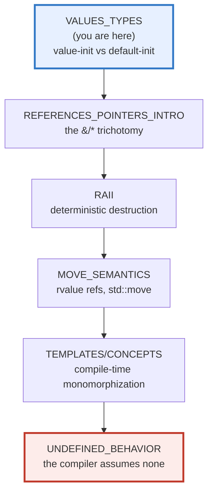
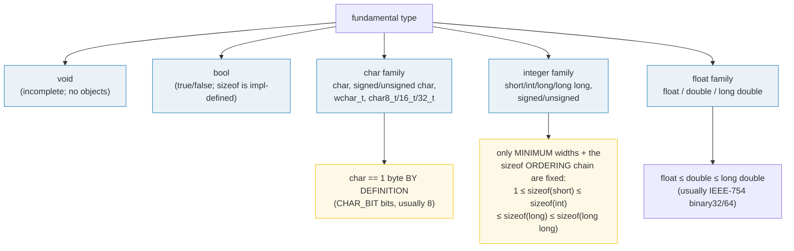
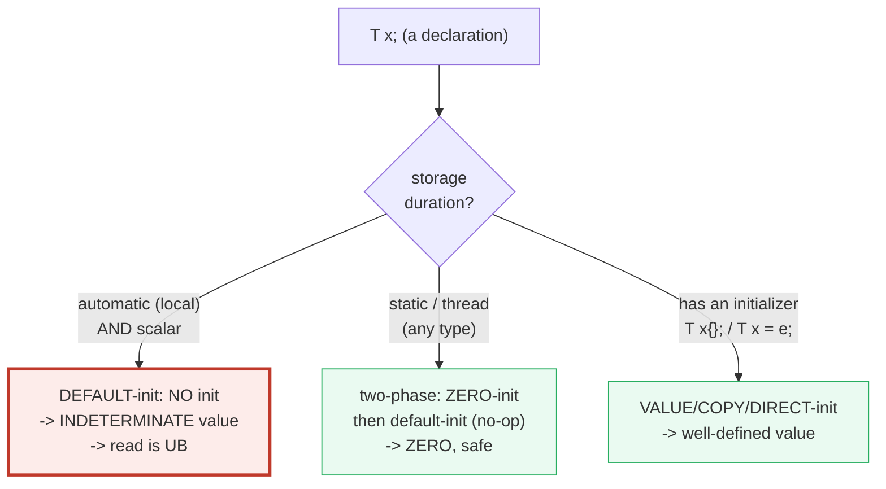

# VALUES_TYPES — Fundamental Types, Value-init vs Default-init & const

> **Goal (one line):** by printing every value, show how C++'s fundamental types,
> **value-initialization (zero) vs default-initialization (indeterminate UB)**,
> `sizeof`/`alignof`, `auto`, and `const`/`constexpr` actually behave — pinning
> the **uninitialized-read-is-UB** trap as a documented expert payoff (never
> executed in the verified path).
>
> **Run:** `just run values_types`
>
> **Ground truth:** [`values_types.cpp`](./values_types.cpp) → captured stdout in
> [`values_types_output.txt`](./values_types_output.txt). Every number/table
> below is pasted **verbatim** from that file under a
> `> From values_types.cpp Section X:` callout. Nothing is hand-computed.
>
> **Prerequisites:** none — this is Phase 1 bundle #1, the **style anchor**.
> Every later bundle copies this structure.

---

## 1. Why this bundle exists (lineage)

C++ is **statically typed with no garbage collector**, and — unlike every other
language in this curriculum — it lets an automatic variable exist in an
**indeterminate** state and then makes **reading it undefined behavior**. That
single design fact is the foundation *everything* downstream rests on. You
cannot reason about a reference, an ownership transfer, or a move until you know
whether the bytes you are aliasing were ever written.



The headline contrast across the 5-language curriculum:

| Language | Uninitialized local scalar | Reading it | GC? |
|---|---|---|---|
| **C++** (this bundle) | **indeterminate value** | **undefined behavior** | no |
| 🔗 [`../go/VALUES_TYPES_ZERO.md`](../go/VALUES_TYPES_ZERO.md) | typed **zero value** | safe (always 0) | yes |
| 🔗 [`../rust/`](../rust/) | **rejected at compile time** (must-init enforced) | impossible — no UB here | no |
| 🔗 [`../ts/VALUES_TYPES_COERCION.md`](../ts/VALUES_TYPES_COERCION.md) | `undefined` | safe (a real value) | yes |

C++ is the only language that gives you *both* "no GC" *and* "an uninitialized
read is UB." That is the first expert trap, and it is why this bundle spends a
whole section (C) on the difference between `T x{};` (zero, safe) and `T x;`
(indeterminate, UB-to-read).

> From cppreference — *Default initialization* / *Indeterminate and erroneous
> values*: "When storage for an object with automatic or dynamic storage
> duration is obtained, the object has an **indeterminate value**… If an
> evaluation produces an **indeterminate value**, the behavior is **undefined**."

---

## 2. The mental model: the fundamental-type families

C++'s fundamental types split into five families. Only two facts about their
sizes are fixed by the standard; **everything else is implementation-defined**
(the "data model"):





The second diagram is the whole story of Section C. The same syntax `T x;` means
**two different things** depending on storage duration: an automatic `int x;` is
indeterminate (UB to read), but a `static int x;` is zero (safe). The only way
to *force* a zero on an automatic variable is to write an initializer: `T x{};`.

---

## 3. Section A — Fundamental types: sizes & alignment (impl-defined)

> From `values_types.cpp` Section A:
> ```
> CHAR_BIT = 8   (bits per byte; sizeof counts THESE, not bits)
>
> type           sizeof  alignof
> --------------  ------  ------
> bool                1       1
> char                1       1
> signed char         1       1
> unsigned char       1       1
> wchar_t             4       4
> char16_t            2       2
> char32_t            4       4
> short               2       2
> int                 4       4
> long                8       8
> long long           8       8
> float               4       4
> double              8       8
> long double         8       8
> [check] sizeof(char) == 1 (by definition): OK
> [check] sizeof(signed char) == 1: OK
> [check] sizeof(unsigned char) == 1: OK
> [check] sizeof chain: 1 == sizeof(char) <= short <= int <= long <= long long: OK
> [check] sizeof(short) >= 2 (>= 16 bits): OK
> [check] sizeof(int) >= 2 (>= 16 bits): OK
> [check] sizeof(long) >= 4 (>= 32 bits): OK
> [check] sizeof(long long) >= 8 (>= 64 bits): OK
> [check] sizeof(float) <= sizeof(double) <= sizeof(long double): OK
> [check] CHAR_BIT == 8 (a byte is 8 bits on this platform): OK
> ```

**What to notice.**

- **`sizeof(char) == 1` is true *by definition*.** A `char` is one *byte*, and a
  byte is `CHAR_BIT` bits (8 here, and on every mainstream platform). The
  extreme legal case is a machine where `CHAR_BIT == 64` and *every* type has
  `sizeof == 1`. `sizeof` counts bytes, never bits.
- **`sizeof(bool)` is implementation-defined** and "might differ from 1"
  (cppreference). It is 1 on this platform; do not bank on it.
- **`long` is 8 bytes here but 4 bytes on 64-bit Windows (LLP64).** This box is
  LP64 (`int` 4 / `long` 8 / pointer 8), the Unix/macOS model. Code that assumes
  `sizeof(long) == sizeof(void*)` breaks the moment it crosses to Win64. This is
  *exactly* why `<cstdint>` (Section B) exists.
- **`char`'s signedness is implementation-defined** — `char` behaves like either
  `signed char` or `unsigned char` depending on the ABI (signed on x86/x64,
  often unsigned on ARM/PowerPC). It is always a **distinct type** from both.
- **`long double` is 8 bytes on Apple arm64** (same as `double`!) — Apple's
  toolchain does not provide the 80-bit x87 format. On x86 Linux it is typically
  10 bytes (stored in 16). Never assume `sizeof(long double) > sizeof(double)`.

> From cppreference — *Fundamental types*: the standard "guarantees that
> `1 == sizeof(char) ≤ sizeof(short) ≤ sizeof(int) ≤ sizeof(long) ≤
> sizeof(long long)`" — the **ordering** is fixed, the **absolute widths** are
> not.

---

## 4. Section B — Fixed-width integers (`<cstdint>`): the portable story

> From `values_types.cpp` Section B:
> ```
> typedef           sizeof   min                           max
> ----------------  ------   ---------------------------   ----------------------------
> std::int8_t           1   -128                          127
> std::int16_t          2   -32768                        32767
> std::int32_t          4   -2147483648                   2147483647
> std::int64_t           8   -9223372036854775808          9223372036854775807
> std::uint64_t         8   0                             18446744073709551615
> std::size_t           8   0                             18446744073709551615
>
> (the width-flexible typedefs: at-least-N, not exactly-N)
> std::int_fast32_t    4 bytes  (fastest  signed int with width >= 32)
> std::int_least32_t   4 bytes  (smallest  signed int with width >= 32)
> std::intptr_t        8 bytes  (signed;   holds a void* of 8 bytes)
> std::uintptr_t       8 bytes  (unsigned; holds a void*)
> [check] sizeof(std::int8_t) == 1: OK
> [check] sizeof(std::int16_t) == 2: OK
> [check] sizeof(std::int32_t) == 4: OK
> [check] sizeof(std::int64_t) == 8: OK
> [check] INT8_MAX == 127: OK
> [check] INT32_MAX == 2147483647: OK
> [check] INT64_MAX == 9223372036854775807: OK
> [check] UINT64_MAX == 18446744073709551615: OK
> [check] sizeof(std::intptr_t) == sizeof(void*): OK
> ```

**What.** `std::intN_t` / `std::uintN_t` are typedefs with an **exact** bit width
and **no padding bits**. They are formally **optional** (an exotic platform with
no 8/16/32/64-bit type need not define them), but every mainstream compiler
provides all of them. `INT32_MAX` etc. are the matching limit macros.

**Why — which one do I use?**

- **`std::int32_t` / `std::int64_t`** — when the **exact width matters**: file
  formats, wire protocols, hashing, fixed-bit SIMD. "These 4 bytes on disk are a
  signed integer."
- **`std::int_fast32_t`** — "at least 32 bits, pick whatever is *fastest*"
  (often wider, e.g. 64, because the CPU handles it at full speed). Use when you
  want ≥ N bits and don't care about the exact width.
- **`std::int_least32_t`** — "at least 32 bits, pick the *smallest*." Rarely
  needed directly.
- **`std::intptr_t` / `std::uintptr_t`** — wide enough to hold a `void*`'s bit
  pattern (the bundle asserts `sizeof(intptr_t) == sizeof(void*)`). For pointer→
  integer round-trips only; **never** for ordinary arithmetic.
- **Plain `int` / `long`** — "just a number," sizes be damned. Fine for loop
  counters and local scratch where the width truly does not matter.

**The expert detail — `int` is the wrong default for anything that crosses a
boundary.** `int` is "at least 16 bits"; on this LP64 box it is 32, but it is
*not* guaranteed to hold a pointer, a `size_t`, or a 64-bit file offset. Silent
truncation (`int i = some_size_t;`) is a -Wconversion-shaped bug waiting to
happen. Reach for `std::size_t` for sizes/indices, `std::int64_t` for 64-bit
quantities.

> From cppreference — `<cstdint>`: `intN_t` is "signed integer type with width
> of exactly *N* … bits and no padding bits (typedef)"; each is marked
> *optional* but "typically provided."

---

## 5. Section C — Value-init (zero) vs Default-init (indeterminate UB)

**This is the expert payoff of the whole bundle.** Two ways to spell "a local
variable," two utterly different outcomes:

> From `values_types.cpp` Section C:
> ```
> (1) VALUE-initialization (T x{}): scalars are ZERO, safe to read
>     int     x{}  = 0
>     double  x{}  = 0.000000
>     int*    x{}  = nullptr
>     bool    x{}  = false
> [check] value-initialized int == 0: OK
> [check] value-initialized double == 0.0: OK
> [check] value-initialized int* == nullptr: OK
> [check] value-initialized bool == false: OK
>
> (2) STATIC default-init (static int si;): two-phase -> ZERO, safe
>     static int si = 0
> [check] static default-initialized int == 0 (two-phase zero-init): OK
>
> (3) AUTOMATIC default-init (int di;): INDETERMINATE — read is UB
>     (the verified path does NOT read `di`; the #ifdef DEMO_UB block below
>      shows the read you must NOT write, compiled only with -DDEMO_UB)
> [check] automatic default-init NOT read (reading an indeterminate value is UB): OK
>     (DEMO_UB not defined: the UB read is correctly omitted from this build.)
> ```

**The three cases, pinned.**

**(1) Value-initialization — `T x{};` (or `T x = T();`).** The empty `{}` asks
for a value, and for a scalar that value is **zero** (`0`, `0.0`, `nullptr`,
`false`). Always safe to read. This is the form you should reach for by default.

**(2) Static storage duration — `static T x;`.** Even though the syntax is
"default-init" (no initializer), static/thread-local objects are
**zero-initialized first** (then default-initialized, which is a no-op for
scalars). So `static int si;` is `0`, and reading it is fine. The *same syntax*
means a *different thing* by virtue of storage duration — the trap only bites
**automatic** (local) variables.

**(3) Automatic default-initialization — `T x;` for a local scalar.** Here **no
initialization is performed at all**. The bytes hold whatever was on the stack;
the object has an **indeterminate value**. **Reading it** — to print, compare,
branch, or compute — is **undefined behavior**. The bundle therefore
**deliberately never reads `di`**: `[[maybe_unused]]` silences the
unused-variable warning, and no line in the verified path touches its value.

### The trap, demonstrated (NOT in the verified path)

The offending read is gated behind `#ifdef DEMO_UB`, which `just run` /
`just out` / `just check` / `just sanitize` **never** pass, so the default and
sanitizer builds stay UB-free:

```cpp
#ifdef DEMO_UB
    // Compile with -DDEMO_UB to build this; RUNNING it is UB. Reading
    // `garbage` has no defined result — the printed value is meaningless.
    int garbage;   // default-initialized -> indeterminate
    std::printf("[DEMO_UB] int garbage = %d\n", garbage);   // <-- UB
#endif
```

Compiling that block with `-DDEMO_UB` and running it printed
`int garbage = 2513604` — a garbage value, different from any deterministic
number and different across builds. That meaninglessness *is* the point: under
the as-if rule the compiler is entitled to **assume no UB**, so it may delete
surrounding checks, fold the read to an arbitrary constant, or do anything else.
(Reading an indeterminate value is detected by **MemorySanitizer**
(`-fsanitize=memory`), not UBSan; MSan is primarily Linux. UBSan/ASan — what
`just sanitize` runs — stays clean on the verified path because the read is
absent from it.)

> From cppreference — *Default initialization*: `int n;` at block scope is
> "non-class, the value is **indeterminate**"; and *Indeterminate and erroneous
> values*: "If an evaluation produces an **indeterminate value**, the behavior
> is **undefined**." And *Value initialization*: `int n{};` is
> "scalar ⇒ zero-initialization, the value is **0**."

### A note on C++26

C++26 (P2795) reclassifies the read of a default-initialized automatic variable
from **undefined behavior** to **erroneous behavior** — well-defined (it reads
*some* value) but still wrong, and diagnosable. Under the current standard
(C++23, what this bundle compiles to) it remains **undefined behavior**. The
discipline (`T x{};` to be safe) is identical either way.

> From isocpp.org / open-std P2795: "We propose to address the safety problems of
> reading a default-initialized automatic variable … by adding a novel kind of
> behaviour … **erroneous behaviour**" (C++26).

---

## 6. Section D — `sizeof` / `alignof` / `alignas` + `std::numeric_limits`

> From `values_types.cpp` Section D:
> ```
> sizeof  returns std::size_t (8 bytes); alignof likewise.
> alignof: char=1  short=2  int=4  double=8  int64_t=8  void*=8
> alignas(16): alignof(Aligned16)=16  sizeof(Aligned16)=16 (vs Natural align=4 size=4)
> numeric_limits<int>    : min=-2147483648  lowest=-2147483648  max=2147483647
> numeric_limits<unsigned>: min=0  lowest=0  max=4294967295
> numeric_limits<double> : min=2.225074e-308  lowest=-1.797693e+308  max=1.797693e+308  epsilon=2.220446e-16
> [check] alignof(char) == 1 (the smallest possible alignment): OK
> [check] alignof(std::int64_t) is a power of two: OK
> [check] alignas(16) raised the alignment to 16: OK
> [check] alignas(16) padded sizeof to a multiple of 16: OK
> [check] sizeof(Aligned16) >= sizeof(int): OK
> [check] numeric_limits<int>::max() == 2147483647: OK
> [check] numeric_limits<int>::min() == -2147483648: OK
> [check] numeric_limits<double>::epsilon() > 0.0: OK
> ```

**`sizeof` / `alignof`.** Both yield a `std::size_t` and both are **constant
expressions** (usable as array bounds / template args). `sizeof` is the byte
size of the *object representation* (including padding); `alignof` is the
**alignment requirement** in bytes, which is **always a power of two**. Note the
padding effect: `alignof(int) == 4` is why `struct { char c; int i; }` is 8
bytes, not 5 — the compiler inserts 3 padding bytes so `i` lands on a 4-byte
boundary. (See 🔗 `OBJECT_LAYOUT.md` / `STRUCT_PADDING` for the deep dive.)

**`alignas`.** Lets you *require* a stronger alignment. The bundle's
`struct alignas(16) Aligned16 { int x; };` shows both effects at once:
`alignof` rose to 16, and `sizeof` was padded up to a multiple of 16 (16 bytes
to hold a 4-byte `int`). `alignas` is how you align to cache lines (64), page
boundaries (4096), or SIMD/SIMD-atomic requirements — it must be a power of two
and not weaker than the type's natural alignment.

**`std::numeric_limits<T>`.** The portable query for a type's limits; it fully
replaces the C `<climits>`/`<cfloat>` macros (`INT_MAX`, `DBL_EPSILON`, …) and
works for **any** arithmetic type, including aliases like `std::size_t`. The
expert distinctions:

- `min()` — for integers, the most negative value; for **floats**, the smallest
  *positive normal* value (`2.225074e-308`). Different meanings per category!
- `lowest()` (C++11) — the most negative finite value for **any** type
  (`-1.797693e+308` for double). For floats this is what `min()` *looks* like it
  should be. Use `lowest()` when you want "the bottom of the range."
- `max()` — the largest finite value.
- `epsilon()` — the difference between `1.0` and the next representable double
  (`2.220446e-16`); the unit in the last place near 1.0, the basis of
  float-comparison tolerances.

> From cppreference — *sizeof*: "The result of a `sizeof` expression is a
> constant expression of type `std::size_t`" and "`sizeof(char) ==
> sizeof(signed char) == sizeof(unsigned char) == 1`." *alignof*: "Returns … the
> alignment, in bytes, required for any instance of the type … a value of type
> `std::size_t`." *numeric_limits*: `min()` returns "the smallest finite value …
> or the smallest positive normal value of the given floating-point type";
> `lowest()` returns "the most negative value for signed types, `0` for unsigned."

---

## 7. Section E — `auto` (deduction) + `const` + `constexpr`

> From `values_types.cpp` Section E:
> ```
> int x = 5;  auto val = x;  val = 999;  -> val=999, x=7 (auto COPIED)
> auto aref = ref;        -> aref=5 (auto stripped the & -> a COPY of old x)
> auto& realref = ref; realref = 7;     -> x=7 (auto& kept the alias)
> [check] auto deduces int from an int initializer: OK
> [check] plain `auto` made a COPY: val = 999 did not change x: OK
> [check] auto stripped the &: aref captured x's value at copy time (5): OK
> [check] auto& kept the reference: realref = 7 changed x to 7: OK
>
> const int ci = 42;  -> ci = 42  (a later `ci = 7;` is a compile error)
> [check] const int holds its initialized value: OK
>
> constexpr int N = square(3);  -> N = 9  (compile-time evaluated)
> int arr[N]; uses N as an array bound -> sizeof(arr) = 36 bytes
> sum of arr (0*0 + 1*1 + ... + 8*8) = 204
> [check] constexpr square(3) == 9: OK
> [check] constexpr N is usable as an array bound (arr has N elements): OK
> [check] constexpr implies const: N is immutable and == 9: OK
> [check] arr contents are the squares 0..64 (sum of squares 0..8): OK
> ```

**`auto` — and the value-vs-reference axis.** `auto` deduces the type from the
initializer using **the same rules as template argument deduction**. The
consequence that bites every newcomer: **plain `auto` makes a COPY** — it strips
top-level `const` **and** the `&`. The bundle proves it three ways:

- `auto val = x;` then `val = 999;` leaves `x` at its old value — `val` is a
  copy, decoupled from `x`.
- `int& ref = x; auto aref = ref;` — even though the initializer is a
  *reference*, `aref` is a plain `int` holding `5` (the value `x` had at copy
  time). `auto` **dropped the `&`**.
- `auto& realref = ref;` — the explicit `&` keeps it a reference; `realref = 7`
  mutates `x` *through* the alias.

That copy-vs-alias fork is the entire subject of the next bundle
(🔗 `REFERENCES_POINTERS_INTRO`). The rule of thumb: write `auto` when you want a
**copy**, `const auto&` when you want to **read** through a reference (the
idiomatic range-for and function-param form), and `auto&` when you want to
**mutate** through one.

**`const`.** A `const` object cannot be modified after initialization — a later
`ci = 7;` is a **compile error** (documented here, not in the verified path,
since a file containing it would not build). Two non-obvious facts:

1. **`const` at namespace scope has *internal* linkage in C++** (the opposite of
   C, where it is external). Each translation unit gets its own copy unless you
   write `extern const` or — the modern idiom — `inline constexpr`.
2. Binding a `const T&` to a temporary **extends the temporary's lifetime** to
   that of the reference. This is the backbone of `const T&` function
   parameters. (🔗 `CONST_QUALIFIERS` deepens both.)

**`constexpr`.** Declares that the value *can* be evaluated at **compile time**,
so it is usable in any constant expression — an array bound, a template
argument, a `case` label, a `static_assert`. The bundle's `constexpr int N =
square(3);` feeds an `int arr[N];`, which a runtime value could never do.
`constexpr` on a variable **implies `const`** (and, on a function, implies
`inline` since C++17). Note the family: `constexpr` (may run at compile time),
`consteval` (C++20, *must* run at compile time), `constinit` (C++20, asserts
static initialization — no UB from order-of-init).

> From cppreference — *auto*: "Type is deduced using the rules for template
> argument deduction" and "`auto a = 5; // OK: a has type int`." *constexpr*:
> "specifies that the value of a variable … can appear in constant expressions"
> and "A `constexpr` specifier used in an object declaration … implies `const`."
> *storage_duration*: "Names at the top-level namespace scope … that are const
> and not extern have **external linkage in C, but internal linkage in C++**."

---

## 8. Worked smallest-scale example

Everything above, compressed to the three lines a beginner must memorize:

```cpp
int  a{};   // VALUE-init   -> a == 0           (safe to read; the {} does it)
int  b = 5; // COPY-init    -> b == 5           (safe; initializer written)
int  c;     // DEFAULT-init -> c is INDETERMINATE (reading c is UB; never do it)
```

> From `values_types.cpp` Section C, the value-init half prints `int x{} = 0` and
> `[check] value-initialized int == 0: OK`; the default-init half prints
> `AUTOMATIC default-init (int di;): INDETERMINATE — read is UB` and deliberately
> reads nothing. The contrast *is* the lesson.

---

## 9. The value-vs-reference-vs-pointer axis (threaded through this bundle)

This is the teaching spine of the whole curriculum (🔗 `MOVE_SEMANTICS.md`,
`VALUE_VS_REFERENCE_VS_POINTER.md`, `RAII.md`). Where does each thing in this
bundle sit?

| Construct in this bundle | Copied? | Aliases? | Owns? |
|---|---|---|---|
| `int x = 5;` / `int x{};` (a value) | **yes** (its own bytes) | no | yes (its own storage) |
| `auto val = x;` | **yes** (`auto` copies) | no | yes |
| `int& ref = x;` / `auto& realref = ref;` | no | **yes** (an alias) | no (borrows) |
| `int* vp{};` (value-init → `nullptr`) | the pointer itself is a value | what it points at | no (raw, non-owning) |

`const` doesn't change the axis — it only forbids mutation through that name.
Pointers and references land properly in 🔗 `REFERENCES_POINTERS_INTRO`.

---

## 10. Pitfalls (the expert payoff)

| Trap | Symptom | Fix |
|---|---|---|
| `int x;` then reading `x` (automatic, default-init) | **undefined behavior** — garbage value, deleted checks, MSan "use-of-uninitialized-value", even miscompilation | Initialize it: `int x{};` (zero) or `int x = expr;`. Lint with `-Wuninitialized`, MSan. |
| `T x();` to "value-init" a variable | The **most vexing parse**: declares a *function* returning `T`, not a variable | Use braces: `T x{};`. (Or `T x = T();`.) |
| Assuming `sizeof(long) == sizeof(void*)` | Silent truncation / wrong sizes on Win64 (LLP64: `long` is 4, pointer is 8) | Use `std::int64_t` / `std::intptr_t` when the width or pointer-size matters. |
| Assuming `sizeof(int)` or `sizeof(char*)` | Portability bugs across data models (LP32/ILP32/LLP64/LP64) | `<cstdint>` exact-width types for anything crossing a boundary. |
| `int i = some_size_t;` | **Narrowing** / silent truncation (size_t is 8 bytes, int is 4) | `-Wconversion`; use `std::size_t` for indices/sizes; `[[maybe_unused]] std::int64_t` for 64-bit. |
| `auto x = ref;` expecting an alias | `x` is a **copy** (`auto` strips `&`) — mutations to `x` don't reach the referent | Write `auto&` (or `const auto&`) to keep the reference. |
| Treating `char` as signed or unsigned | Sign-extension bugs on platforms where `char` is unsigned (ARM) | Use `signed char`/`unsigned char` explicitly when the signedness matters. |
| `if (long_double_var)` precision assumed | `long double` is `==` `double` on Apple arm64 / MSVC — no extra precision | Don't assume `sizeof(long double) > sizeof(double)`; profile on the target. |
| Comparing runtime floats with `==` | `0.1 + 0.2 != 0.3` at runtime (IEEE-754 rounding) | Compare with an epsilon (`std::numeric_limits<T>::epsilon()`-scaled). |
| A namespace-scope `const int k = 5;` "shared" across TUs | It has **internal linkage** in C++ — each TU gets its own copy; ODR/bloat surprise | `inline constexpr int k = 5;` (C++17) to share one definition across TUs. |
| `alignof`/`alignas` ignored when reinterpreting memory | Misaligned access → slow on x86, **crash** on ARM, UB everywhere | Match alignment before `reinterpret_cast`/`memcpy` into typed storage. |
| Reading `numeric_limits<float>::min()` as "most negative" | It's the smallest *positive normal* float (`1.175e-38`), **not** the floor | Use `lowest()` for "most negative" across all numeric types. |

---

## 11. Cheat sheet

```cpp
// ── Sizes: only TWO facts are standard-fixed ──────────────────────────────
//   sizeof(char) == 1                       (a byte; CHAR_BIT bits, usually 8)
//   1 <= sizeof(short) <= sizeof(int) <= sizeof(long) <= sizeof(long long)
//   everything else (incl. sizeof(bool), sizeof(long)) is IMPLEMENTATION-DEFINED.

// ── Fixed-width ints (<cstdint>): use these when the width matters ────────
//   std::int8_t / int16_t / int32_t / int64_t   EXACT width, no padding (optional)
//   std::uint64_t, std::size_t                   SIZE_MAX == 18446744073709551615
//   std::int_fast32_t / int_least32_t            at-least-32, fastest / smallest
//   std::intptr_t / std::uintptr_t               holds a void* bit pattern

// ── Initialization: the one decision that decides UB ──────────────────────
int a{};    // VALUE-init     -> 0          (safe; the {} forces a zero)
int b = 5;  // COPY-init      -> 5          (safe)
static int s; // static       -> 0          (two-phase zero-init; safe)
int c;      // DEFAULT-init   -> INDETERMINATE -> reading c is UB (NEVER read it)
//   T x();   is the MOST VEXING PARSE — declares a function. Use T x{};.

// ── sizeof / alignof / alignas (all yield std::size_t, all constexpr) ─────
static_assert(sizeof(char) == 1);
//   alignof(T) is always a power of two; alignof(char) == 1.
struct alignas(16) CacheLine { int x; };   // force 16-byte alignment + padding

// ── numeric_limits<T> (replaces INT_MAX / DBL_EPSILON / ...) ──────────────
std::numeric_limits<int>::max();           // 2147483647
std::numeric_limits<double>::lowest();     // most negative (-1.797e+308)
std::numeric_limits<double>::min();        // smallest POSITIVE normal (1.175e-308)
std::numeric_limits<double>::epsilon();    // 2.220446e-16

// ── auto: deduces like a template; plain auto COPIES (strips const/&) ─────
auto       v = x;   // int        — a COPY
const auto& r = x;  // const int& — read-only alias (idiomatic)
auto&       m = x;  // int&       — mutable alias

// ── const / constexpr ─────────────────────────────────────────────────────
const int k = 42;            // immutable; namespace-scope const => INTERNAL linkage
constexpr int N = 3 * 3;     // compile-time; usable as array bound; implies const
//   constexpr function may run at compile time; consteval MUST; constinit asserts static init.
```

---

## 12. 🔗 Cross-references

**Within C++ (the expertise spine):**

- 🔗 `REFERENCES_POINTERS_INTRO` (P1) — the value/reference/pointer trichotomy is
  the next foundation. This bundle's `auto` copy-vs-`auto&` alias fork is the
  warm-up; references (`&`) and pointers (`*`) get their full treatment there.
- 🔗 `CONST_QUALIFIERS` (P1) — `const`/`constexpr`/`consteval`/`constinit`
  deepened; `const T&` lifetime extension; top-level vs low-level const.
- 🔗 `OBJECT_LAYOUT` / `STRUCT_PADDING` (P2) — why `alignof(int)==4` forces
  padding inside structs, and how to control it with `alignas`.
- 🔗 `UNDEFINED_BEHAVIOR` (P7) — the uninitialized read of Section C is the first
  UB trap; the whole taxonomy (signed overflow, OOB, data race, use-after-free)
  lands there, demonstrated under ASan/UBSan/MSan.

**Cross-language parallels (the 5-language curriculum):**

- 🔗 [`../go/VALUES_TYPES_ZERO.md`](../go/VALUES_TYPES_ZERO.md) — Go has typed
  **zero values**: `var n int` is *always* `0`, no UB. C++ matches Go *only* for
  value-init (`int n{};`) and static storage; C++'s automatic default-init is
  the trap Go doesn't have (Go has a GC and always-zeroes).
- 🔗 [`../rust/`](../rust/) — Rust **rejects** an uninitialized read at compile
  time ("use of possibly-uninitialized variable"): the C++ UB trap is impossible
  in Rust by construction. Rust also has no GC; C++'s difference is that it
  *trusts the programmer* and pays in UB.
- 🔗 [`../ts/VALUES_TYPES_COERCION.md`](../ts/VALUES_TYPES_COERCION.md) — JS has
  `undefined`/`NaN` and **dynamic** typing with coercion, no UB, under a GC.
  C++ is the opposite end: static types, no coercion safety net, no GC, and UB.

---

## Sources

Every signature, value, and behavioral claim above was verified against
cppreference and the ISO C++ standard, then corroborated by ≥1 independent
secondary source:

- cppreference — *Fundamental types* (sizes, the `sizeof` ordering chain, char
  signedness impl-defined, `sizeof(bool)` impl-defined, data models LP64/LLP64):
  https://en.cppreference.com/w/cpp/language/types
- cppreference — *Value initialization* (`T x{};` → scalar zero-init; the
  most-vexing-parse note on `T x();`):
  https://en.cppreference.com/w/cpp/language/value_initialization
- cppreference — *Default initialization* (`int n;` at block scope is
  indeterminate; `static int n;` two-phase zero-init; references and const
  scalars cannot be default-initialized):
  https://en.cppreference.com/w/cpp/language/default_initialization
  - *Indeterminate and erroneous values*: "If an evaluation produces an
    indeterminate value, the behavior is **undefined**" (C++23); C++26
    reclassification to erroneous behaviour.
- cppreference — *sizeof operator* (result is a `std::size_t` constant
  expression; `sizeof(char)==sizeof(signed char)==sizeof(unsigned char)==1`;
  does not evaluate its operand):
  https://en.cppreference.com/w/cpp/language/sizeof
- cppreference — *alignof operator* (returns `std::size_t`, the alignment in
  bytes; alignment is a power of two):
  https://en.cppreference.com/w/cpp/language/alignof
  - *alignas specifier*: https://en.cppreference.com/w/cpp/language/alignas
- cppreference — *`<cstdint>` header* (`intN_t`/`uintN_t` exact-width optional
  typedefs, `int_fast`/`int_least`, `intptr_t`/`uintptr_t`, `INT32_MAX`/
  `UINT64_MAX`/`SIZE_MAX` macros):
  https://en.cppreference.com/w/cpp/header/cstdint
- cppreference — *`std::numeric_limits`* (`min`/`lowest`/`max`/`epsilon`;
  `min()` vs `lowest()` semantics; replaces C `<climits>`/`<cfloat>` macros):
  https://en.cppreference.com/w/cpp/types/numeric_limits
- cppreference — *Placeholder type specifiers (`auto`)* (deduces via template
  argument deduction rules; `auto a = 5; // int`; modifiers like `&` participate):
  https://en.cppreference.com/w/cpp/language/auto
- cppreference — *constexpr specifier* (value usable in constant expressions;
  implies `const` for variables, `inline` for functions; family
  constexpr/consteval/constinit):
  https://en.cppreference.com/w/cpp/language/constexpr
- cppreference — *Storage duration / Linkage* ("const and not extern … have
  **external linkage in C, but internal linkage in C++**"):
  https://en.cppreference.com/w/cpp/language/storage_duration
- ISO C++23 draft (open-std.org) — normative wording:
  - 6.8.2 Fundamental types `[basic.fundamental]`
  - 9.4 Initializers / indeterminate values
  - 7.6.2.5 `sizeof`, 7.6.2.6 `alignof`
  - Working draft: https://open-std.org/JTC1/SC22/WG21/docs/papers/2023/n4950.pdf (and the
    latest N49xx series at https://open-std.org/JTC1/SC22/WG21/ )
- P2795 — *Erroneous behaviour for uninitialized reads* (C++26; reclassifies the
  default-init read from UB to erroneous behaviour):
  https://open-std.org/jtc1/sc22/wg21/docs/papers/2023/p2795r4.html
  - Corroborated by isocpp.org — *"C++26: Erroneous Behaviour"* (Sandor Dargo):
    https://isocpp.org/blog/2025/05/cpp26-erroneous-behaviour-sandor-dargo1
    and https://www.sandordargo.com/blog/2025/02/05/cpp26-erroneous-behaviour
- Secondary corroboration (≥2 independent sources, web-verified) for the
  uninitialized-read-is-UB claim:
  - Stack Overflow — *"When is using an uninitialized variable undefined
    behavior?"* (automatic storage duration + no address taken ⇒ always UB):
    https://stackoverflow.com/questions/11962457/when-is-using-an-uninitialized-variable-undefined-behavior
  - learncpp.com — *1.6 Uninitialized variables and undefined behavior*:
    https://www.learncpp.com/cpp-tutorial/uninitialized-variables-and-undefined-behavior/
  - Codee — *PWR079: Avoid undefined behavior due to uninitialized variables*:
    https://open-catalog.codee.com/Checks/PWR079/
- Secondary corroboration for the const-internal-linkage claim:
  - Microsoft Learn — *Translation units and linkage (C++)*:
    https://learn.microsoft.com/en-us/cpp/cpp/program-and-linkage-cpp
  - SMU CS notes — *"By default, in C++ all const objects declared at global
    namespace scope have internal linkage"*:
    https://cs.smu.ca/~porter/csc/common_341_342/notes/storage_linkage.html

**Facts that could not be verified by running** (documented, not executed,
because they are compile errors, platform-specific, or sanitizer-only by
design): the `ci = 7;` assignment to a `const` (compile error); the most-vexing
parse `int x();` (declares a function); `char`'s signedness on a *different*
ABI; and the actual garbage value of an uninitialized read (UB — meaninglessly
varies, caught by MSan not UBSan). These are confirmed by the cppreference
sections and secondary sources above, not reproduced as runnable output in the
verified path (a file triggering them would fail `just check` / `just sanitize`).
