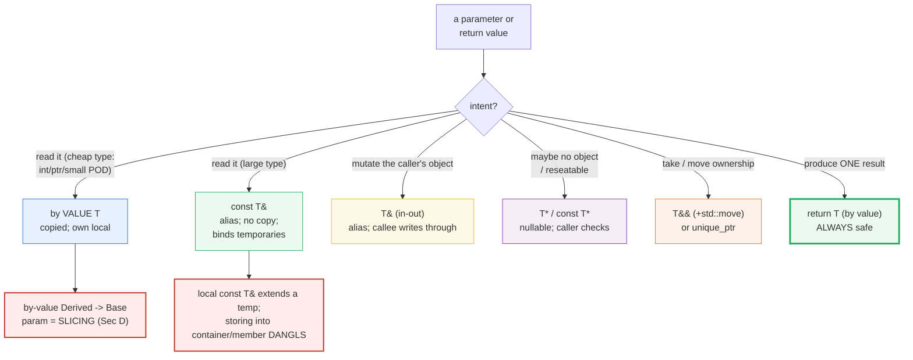
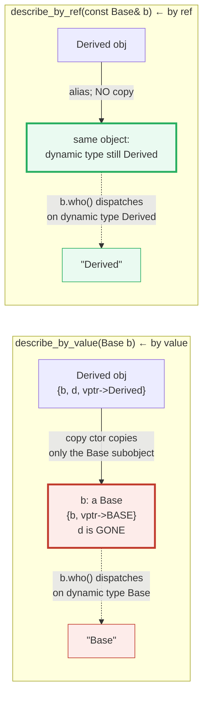

# VALUE_VS_REFERENCE_VS_POINTER — The Full Pass/Return Decision Matrix

> **Goal (one line):** by printing every value, show the FULL decision matrix for
> how to PASS and RETURN an object in C++ — **by VALUE** (copied; cheap/safe/
> own), **by `T&`** (alias; mutate the caller's), **by `const T&`** (cheap
> read-only; binds temporaries via lifetime extension), **by `T*`/`const T*`**
> (nullable/reseatable), **by `T&&`** (rvalue ref — the move/ownership sink) —
> pinning **SLICING** (Derived-by-value-to-Base loses the Derived part) and the
> **dangling-return** UB trap as documented expert payoffs (never executed in the
> verified path).
>
> **Run:** `just run value_vs_reference_vs_pointer`
>
> **Ground truth:** [`value_vs_reference_vs_pointer.cpp`](./value_vs_reference_vs_pointer.cpp)
> → captured stdout in
> [`value_vs_reference_vs_pointer_output.txt`](./value_vs_reference_vs_pointer_output.txt).
> Every number/table below is pasted **verbatim** from that file under a
> `> From value_vs_reference_vs_pointer.cpp Section X:` callout. Nothing is
> hand-computed.
>
> **Prerequisites:** 🔗 [`VALUES_TYPES.md`](./VALUES_TYPES.md) (value-init / types)
> and 🔗 [`REFERENCES_POINTERS_INTRO.md`](./REFERENCES_POINTERS_INTRO.md) (the
> P1 *intro* to `&`/`*`). This Phase-3 bundle **deepens** that intro into the
> complete decision matrix the Core Guidelines F.call formalize.

---

## 1. Why this bundle exists (lineage)

`REFERENCES_POINTERS_INTRO` (P1) introduced the value / reference / pointer
**trichotomy** as three *things*. This bundle makes it a **decision**: for every
parameter and every return, you choose one of five pass-modes based on **intent**
(read it? mutate it? take ownership of it? maybe-not-have-it? return it?), and
choosing wrong costs you either **performance** (a needless 64-byte copy),
**correctness** (a silent **slicing** bug), or **defined behavior** (a
**dangling** reference → UB). The C++ Core Guidelines `F.call` section
(`F.15`–`F.21`) is exactly this matrix, normative.



The headline contrast across the 5-language curriculum — *how each language lets
you refer to a value, and what goes wrong*:

| Language | Pass-by-value? | Reference type? | Nullable ptr? | Slicing possible? | No-object read |
|---|---|---|---|---|---|
| **C++** (this bundle) | yes (copied) | **`T&` / `const T&`** | **yes (`nullptr`)** | **yes (silent)** | **UB** |
| 🔗 [`../go/POINTERS.md`](../go/POINTERS.md) | yes | **no** (only value/*) | yes (`nil`) | no (no inheritance-by-value-B) | panic / nil-deref |
| 🔗 [`../rust/BORROWING.md`](../rust/BORROWING.md) | yes (`T`) | **`&` / `&mut`** (compile-checked) | yes (`Option<&T>`) | **no** (no by-value-Base-into-Derived copy) | rejected at compile time |
| 🔗 [`../ts/VALUE_VS_REFERENCE.md`](../ts/VALUE_VS_REFERENCE.md) | primitives only | object refs are **shared** under GC | no (no null for objects; `undefined`) | no (no value-classes) | safe (GC keeps alive) |

C++ is the **only** language here that gives you *all five* pass-modes *and*
charges you UB if you pick a dangling one. That freedom + that risk is what this
bundle maps.

---

## 2. Section A — By VALUE: a copy (mutation invisible); safe to return

> From `value_vs_reference_vs_pointer.cpp` Section A:
> ```
> A by-VALUE parameter is an INDEPENDENT COPY of the argument. Mutating it
> NEVER reaches the caller — the whole point for cheap types, ownership, and
> thread-safe local state. The cost: each by-value pass runs the copy ctor.
> 
> int original = 10;  mutate(original) -> 999;  original still 10 (copy mutated)
> [check] by-value: mutating the param left the caller's original at 10: OK
> Tracker::copies after by_value(t)   = 1  (copy ctor ran once)
> [check] by_value invoked the copy constructor exactly once (copies == 1): OK
> 
> a lambda returns Tracker(7) BY VALUE; caller receives value = 7 (no dangle)
> [check] return-by-value gives the caller a safe, owning copy (value == 7): OK
> 
> sizeof(int)=4  sizeof(void*)=8  sizeof(Tracker)=4  sizeof(Large)=64
> [check] int and pointer are 'cheap': sizeof <= 2 words: OK
> [check] Large is 'expensive' to copy: sizeof(Large) == 64: OK
> ```

**What.** A by-value parameter `T t` is a *brand-new object* copy-constructed
from the argument. Mutating `t` inside the callee is invisible to the caller
(`original` stays `10`). A by-value **return** is likewise a fresh value the
caller receives — **never an alias to a dead local**, so it is the one return
mode that *cannot* dangle. The copy is *observable*: the bundle's `Tracker` type
has a copy constructor that bumps a counter, so `-O2` / ASan / UBSan cannot elide
it (they must preserve observable behavior) — and it counts exactly **1**.

**Why by-value, then?** Two motives:

1. **Cheap-to-copy types.** An `int` (4 bytes), a pointer (8 bytes), or a small
   POD is *cheaper to copy than to dereference through*. The Core Guidelines
   `F.16`: "For *in* parameters, pass cheaply copied values … by value and others
   by reference to `const`." The bundle asserts `sizeof(int)=4`,
   `sizeof(void*)=8` are both ≤ 2 words.
2. **You want a copy / ownership.** When the callee needs its own private,
   mutable, thread-local snapshot, a by-value parameter gives it one for free.
   Returning by value is the canonical *ownership transfer* of one result
   (`F.20`).

**The `Large` counterexample.** `sizeof(Large)=64` — that is sixteen times an
`int`. Copying it on every call is exactly the cost `const T&` exists to avoid
(Section B).

> From cppreference — *copy constructor*: "A copy constructor … initializes an
> object from another object." *copy elision* (mandatory since C++17 for
> prvalue returns) is why `return Tracker(v);` need not copy on return — but a
> by-value *parameter* still copies (there is an argument, not a prvalue-in-place
> return, to materialize).

---

## 3. Section B — `T&` (in-out mutate) + `const T&` (cheap read-only, binds temps)

> From `value_vs_reference_vs_pointer.cpp` Section B:
> ```
> A non-const T& is an ALIAS the callee mutates THROUGH (an out-parameter). A
> const T& is a cheap READ-ONLY alias: NO copy, and it can bind a TEMPORARY
> (binding a const T& to a temporary EXTENDS the temporary's lifetime).
> 
> Tracker t(42);  by_lvalue_ref_mut(t) -> 142;  t.value now 142; copies = 0
> [check] non-const T& mutated the caller's object THROUGH the alias (t.value == 142): OK
> [check] non-const T& performed ZERO copies (it is an alias): OK
> 
> Large big (sizeof 64 bytes) read via const Large& -> header = 5 (NO 64-byte copy)
> [check] const T& read a large object with no copy (header == 5): OK
> 
> const std::string& bound = std::string("temp-literal");  -> "temp-literal" (len 12)
> [check] const T& binds a temporary AND extends its lifetime (bound intact): OK
> [check] the lifetime-extended temporary is readable (length == 12): OK
> 
> Tracker::copies after by_ref(tt) = 0  (const T& is an alias, no copy)
> [check] const T& on an lvalue performed ZERO copies: OK
> ```

**`T&` — the in-out parameter (`F.17`).** A non-const reference is an *alias*;
writing through it writes the caller's object. The bundle proves both halves:
`t.value` jumps `42 → 142` *through the alias*, and the copy counter stays `0`
(no copy — it is the same object). This is the pre-`std::optional`/pre-tuple way
to return an extra result alongside a status (`bool try_parse(..., T& out)`), and
it is still idiomatic when you genuinely want to *mutate* the caller's object.

**`const T&` — the cheap read-only pass (`F.16`).** Also an alias (no copy — the
counter is `0`), but read-only, and it gains one superpower over `T&`: **it binds
to a temporary**. Binding a `const T&` to the prvalue `std::string("temp-literal")`
**extends the temporary's lifetime** to that of the reference — so `bound` stays
readable for its whole scope. This is *the* idiom for "pass a large object
read-only" (no 64-byte copy) and is why range-`for` and most read parameters are
`const T&`.

> From cppreference — *reference initialization* / *lifetime*: "Whenever a
> reference is bound to a temporary object or to a subobject thereof, the type of
> the temporary expression is adjusted … the lifetime of the temporary is
> **extended** to match the lifetime of the reference." (See Section D for the
> boundaries — this does *not* survive storing into a container/member.)

---

## 4. Section C — `T*`/`const T*` (nullable, reseatable) + `T&&` (rvalue-ref sink)

> From `value_vs_reference_vs_pointer.cpp` Section C:
> ```
> A POINTER expresses what a reference cannot: NULLABLE ("maybe no object") and
> RESEATABLE (point it at a different object). An rvalue reference T&& expresses
> "I will take ownership / move from this" — the move-semantics sink (preview).
> 
> maybe_find(true,...)  -> non-null (value 100)
> maybe_find(false,...) -> nullptr
> [check] T* is nullable: a 'miss' is represented by nullptr: OK
> [check] caller MUST check: a hit yields a readable object (value == 100): OK
> 
> Tracker* cursor = &pool_a; cursor->value = 100; cursor = &pool_b; cursor->value = 200
> [check] pointer is reseatable: same variable, two referents (100 then 200): OK
> 
> by_rvalue_ref(Tracker(55))         copies = 0 (binds a temporary, no copy)
> by_rvalue_ref(std::move(src))       copies = 0 (std::move -> rvalue, no copy)
> [check] T&& binds a temporary rvalue with ZERO copies: OK
> [check] std::move(lvalue) is an rvalue: T&& binds it with ZERO copies: OK
> ```

**`T*` / `const T*` — when null or reseatable is part of the contract (`F.22`).**
A pointer is still an alias (no copy), but it adds two things a reference
*cannot* express: **nullable** (`nullptr` = "no object") and **reseatable** (the
same variable can point at a different object later). The bundle exercises both:
`maybe_find(false, …)` returns `nullptr` to mean "not found", and the **caller
must check** (`hit != nullptr`) before dereferencing — there is no compiler
enforcement, unlike Rust's `Option<&T>`. Then `cursor = &pool_b;` rebinds the
*same* pointer variable to a new referent — something a reference cannot do
(`r = y;` *assigns through* `r`, it does not rebind it; see 🔗
`REFERENCES_POINTERS_INTRO`).

> From the C++ Core Guidelines — `F.7` (semantics of pointer parameters) and
> `F.22`: use `T*` only when it can be null or when you need to reseat it; for a
> non-null, non-owning parameter, prefer `T&`. `I.12`: declare a pointer that
> *must not* be null as `not_null<T*>` (GSL) so the contract is checkable.

**`T&&` — the rvalue-reference sink (preview; `F.18`).** An rvalue reference is
*still a reference* — the bundle proves it: binding `Tracker(55)` or
`std::move(src)` to a `T&&` parameter causes **zero copies** (the counter is
`0`). What distinguishes `T&&` from `const T&` is *intent*: a `T&&` parameter
says "I may **move from** / **take ownership** of this," because it binds only
rvalues (things safe to pillage). `std::move` is just a cast that turns an
lvalue into an rvalue so it can bind to `T&&`. The *full* machinery —
move-constructors, `moved-from` state, perfect forwarding — is the subject of 🔗
`MOVE_SEMANTICS`; this bundle pins only the property that `T&&` is a *reference*
(no copy) and that it is the **sink** cell of the F-call matrix.

---

## 5. Section D — SLICING + lifetime-extension boundaries + dangling-return UB

**This is the expert payoff: three silent traps.** The bundle *documents* the UB
ones (never executes them) and *demonstrates* slicing safely.

> From `value_vs_reference_vs_pointer.cpp` Section D:
> ```
> Three silent traps that turn a wrong choice into a bug: SLICING (a Derived
> passed by-value to Base loses the Derived part); lifetime extension that
> does NOT survive storing into a container/member; and RETURNING a reference
> to a local/temp (dangling — UB, documented, never executed here).
> 
> Derived obj; describe_by_value(obj) -> "Base" (SLICED: dynamic type is Base)
>                   describe_by_ref(obj) -> "Derived" (no slicing: dynamic type is Derived)
> [check] SLICING: Derived passed by-value to Base loses its dynamic type (== "Base"): OK
> [check] const Base& AVOIDS slicing: virtual dispatch sees Derived (== "Derived"): OK
> sizeof(Base) = 24, sizeof(Derived) = 32 (the Derived-only field `d` is 8 bytes)
> [check] Derived is strictly larger than Base (it adds the `d` field): OK
> 
> (Lifetime extension applies to LOCAL const T& only. Storing a const T& into
>  a container/member from a temporary DANGLS — read is UB; documented, not run.)
> const std::string& view bound to an owning local: "alive" (safe — local outlives ref)
> [check] a reference to a long-lived local is safe to read (== "alive"): OK
> 
> return_by_value(21) -> 42   (returning a VALUE is always safe: no alias to a local)
> [check] return-by-value is dangling-free (== 42): OK
> second_of(p) returns a const int& to p.b (caller-owned lifetime) -> 99
> [check] returning a member ref of a caller-owned object is safe (== 99): OK
> 
> (DANGLING-RETURN: `const T& f(){ int x=5; return x; }` is UB to read. The
>  verified path returns by value or a member-ref of caller-owned storage only.)
> [check] verified path never returns a ref to a local/temp (dangling UB): OK
> ```

### (1) Slicing — the silent bug

Pass a `Derived` **by value** to a **`Base`** parameter and the copy
copy-constructs *only the `Base` subobject*: the `Derived`-only field `d` is
discarded, and — worse — the copy's **dynamic type is `Base`**, so virtual
dispatch sees `Base` (`describe_by_value` prints `"Base"`). Pass the *same*
object **by `const Base&`** and there is no copy, the dynamic type stays
`Derived`, and the virtual call prints `"Derived"`. The trap is *silent*: it
compiles cleanly, produces a plausible-looking `Base`, and silently loses
polymorphism. The fix is a one-character change: `Base` → `const Base&`.



> From the C++ Core Guidelines — `C.145` ("Access members and base classes
> hierarchically") and the slicing discussion in `C.hier`: do not pass
> polymorphic objects by value; a by-value `Base` parameter slices any
> `Derived`. cppreference — *Object* / polymorphic objects: "the type with which
> the object was **created**" determines `virtual`/`dynamic_cast` behavior —
> slicing re-creates it as a plain `Base`, destroying that.

### (2) Lifetime extension has boundaries

Section B proved that a **local** `const T&` extends a temporary's lifetime. The
boundary, which bites everyone once: this extension applies **only** to the
local reference directly bound to the temporary — **not** when the reference is
*stored* in a container element, a class member, or returned. There, the
temporary dies at the end of the full-expression, and the stored reference
**dangles** (reading it is UB). The verified path instead binds `view` to an
**owning local** (`std::string kept`), which outlives the reference — the safe
shape. A dangling `std::vector<const std::string&>` built from temporaries is the
classic mistake.

> From cppreference — *reference initialization* / *lifetime*: lifetime
> extension has explicit **exclusions** — "the lifetime of a temporary bound to
> a return value of a function is **not** extended," and a temporary bound to a
> reference member in a constructor's mem-initializer persists only until the
> constructor exits. Arthur O'Dwyer's "Lifetime extension applies to whole
> objects" enumerates the further edge cases (binding to a *member* subobject).

### (3) Returning a reference to a local/temp is DANGLING (UB)

The single most important return rule: **never return a reference (or pointer)
to a function-local automatic object or to a temporary.** The frame is gone
before the caller reads it; the reference dangles; reading it is UB (ASan flags
*stack-use-after-return* or *use-after-free*). The bundle demonstrates the two
**safe** return shapes instead:

- **Return by value** — `return v * 2;` is always dangling-free (it is a fresh
  value, RVO/moved into the caller; `F.20`).
- **Return a reference to a member of a caller-owned object** —
  `[](const Pair& p) -> const int& { return p.b; }` is safe because the
  referent's lifetime is the *caller's*, not the callee's frame.

```cpp
const int& bad()   { int local = 5; return local; }   // DANGLING — UB to read
const int& bad2()  { return int(5); }                 // DANGLING — temp dies
```

The verified path **deliberately never** builds these; they are documented here
and (if you compiled them) would be caught by `just sanitize`.

> From cppreference — *returning references/pointers to locals* and *lifetime*:
> returning a pointer/reference to an automatic local is undefined behavior;
> tools (ASan `-fsanitize=address` with `detect_stack_use_after_return`) detect
> it at run time, but the language itself makes it UB.

---

## 6. Section E — The F-call decision matrix (the whole bundle in one table)

> From `value_vs_reference_vs_pointer.cpp` Section E:
> ```
> The C++ Core Guidelines (F.call: F.15-F.21) collapse the whole bundle into one
> decision per PARAMETER and per RETURN, keyed on INTENT (in / in-out / sink /
> forward / out). Pick the intent, get the signature:
> 
>   intent   | signature        | when / why
>   ---------|------------------|--------------------------------------------
>   in       | T  (by value)    | cheap-to-copy (int, ptr, small POD); or you
>            |                  | WANT a local copy / ownership (F.16)
>   in       | const T&         | read-only pass of a LARGE/expensive object;
>            |                  | binds temporaries via lifetime extension (F.16)
>   in-out   | T&               | the callee MUTATES the caller's object (F.17)
>   sink/own | T&& (+ std::move)| take/move ownership of the argument (F.18);
>            | unique_ptr       | the full story is MOVE_SEMANTICS
>   nullable | T* / const T*    | "maybe no object" (nullptr) OR reseatable;
>            |                  | caller MUST check for null (F.7/F.22)
>   out      | return T (value) | ONE result — always safe (no dangle) (F.20)
>   out-many | return struct/   | several results — prefer a struct/tuple over
>            | tuple            | multiple out-params (F.21)
> 
> pipeline(5, io, big, true) -> 8; io.value now 45; Tracker copies = 0
> [check] F-call matrix: cheap `in` passed by value; large `in` by const T& (no Tracker copy): OK
> [check] F-call matrix: in-out via T& mutated the caller's object (io.value == 45): OK
> [check] F-call matrix: out via return-by-value is safe (result == 5+2+1): OK
> ```

**The matrix is intent → signature.** Read the intent off the call site, look up
the row, write the signature. `F.16` (in) splits cheap (`T`) vs large (`const
T&`); `F.17` (in-out) is `T&`; `F.18` (sink/own) is `T&&`+`std::move` or a
`unique_ptr` (🔗 `MOVE_SEMANTICS` / `UNIQUE_PTR`); `F.22`/`F.7` (nullable or
reseatable) is `T*`; `F.20` (one out) is a plain return-by-value; `F.21` (many
out) is a returned `struct`/`tuple`, *not* a handful of `T&` out-params.

The worked `pipeline` exercises four cells at once — a cheap `in` by value, a
large `in` by `const Large&` (no Tracker copy: `copies == 0`), an in-out `T&`
(that mutated `io.value` to `45`), and a single safe return-by-value (`8`). That
is the whole bundle in one call.

> From the C++ Core Guidelines — `F.call: Parameter passing` (F.15 "Prefer simple
> and conventional ways of passing information"; F.16–F.21 as cited). The
> `Modernes C++` / Rainer Grimm summary phrases it: "in → by value or `const T&`;
> in-out → `T&`; consume/sink → `T&&` or `unique_ptr`; forward → `T&&` +
> `std::forward`; out → return value; out-many → `tuple`/`struct`."

---

## 7. Worked smallest-scale example

Everything above, compressed to the five lines a reader must memorize — one per
cell of the matrix:

```cpp
int   f_val(int n);              // in (cheap)    — a copy; mutation local
int   f_cref(const Large& l);    // in (large)    — alias; no copy; binds temps
void  f_out(Tracker& t);         // in-out        — mutate the caller's object
const T* f_find(bool hit);       // nullable      — nullptr == "no object"; check
Tracker make() { return T(7); }  // out           — return by value: ALWAYS safe
//   NEVER:  const T& bad(){ T t; return t; }     // DANGLING — UB to read
//   NEVER:  void g(Base b);  called with Derived // SLICING  — silent loss
```

> From `value_vs_reference_vs_pointer.cpp`: Section A proves the by-value copy
> (`copies == 1`) and the safe return; Section B proves `const T&` copies zero
> and binds a temporary; Section C proves `T*` nullable + reseatable; Section D
> documents the two `NEVER` lines (slicing is *demonstrated*, dangling-return is
> *documented* — never executed).

---

## 8. Pitfalls (the expert payoff)

| Trap | Symptom | Fix |
|---|---|---|
| Passing `Derived` **by value** to a **`Base`** parameter | **Slicing**: the copy's dynamic type is `Base`; `virtual` calls dispatch wrong; `Derived`-only fields silently vanish | Pass **by `const Base&`** (or `Base&` / pointer); reserve by-value for the *most-derived* type you actually want |
| Returning a reference/pointer to a **local/temp** | **Dangling** → UB; ASan: `stack-use-after-return` / `use-after-free` | **Return by value**, or a reference to a member of a **caller-owned** object |
| `std::vector<const T&> v = { make_temp(), ... };` | Temporaries die at end of full-expression; stored refs **dangle** (UB) | Store **owning** `std::vector<T>` (values); lifetime extension does **not** survive container/member storage |
| Pass a **large** object **by value** | Needless 64-byte (or N-KB) copy on every call — a silent perf cliff | `const T&` for read-only; `T&` for in-out; `T&&` to move a sink |
| `T*` parameter that "should never be null" but isn't checked | Caller passes `nullptr` → null-deref UB; no compiler enforcement | Prefer `T&` (non-null by construction), or `gsl::not_null<T*>` / `std::reference_wrapper`; if you *must* take `T*`, document + `check` |
| Forgetting to check a **nullable** `T*` return | `maybe_find(false)->value` → null deref (UB) | Treat `T*` as `Option<&T>`: `if (auto* p = find(...)) { use(*p); }` |
| `T&&` parameter you **read** without moving | Looks like a sink but copies/keeps the lvalue's value — defeats the move | A `T&&` sink should `std::move` into its destination; for read-only use `const T&` (🔗 `MOVE_SEMANTICS`) |
| Assuming "references can't dangle" | `T&` to a member of a destroyed object, or returned from a function, dangles just like a pointer | A reference is non-null *at binding*; it carries no lifetime guarantee thereafter. Use ASan `-fsanitize=address` |
| `auto x = obj;` where you wanted an alias | `auto` strips `&` → a **copy** (see 🔗 `VALUES_TYPES` §7) | `const auto&` to read through a reference; `auto&` to mutate |
| Reseating "through" a reference (`r = y;` expecting rebind) | It **assigns through** `r` into the original referent, not rebinds | Use a pointer (`p = &y;`) when you need to rebind; references are non-reseatable |

---

## 9. Cheat sheet

```cpp
// ── The F-call matrix: intent -> signature (Core Guidelines F.15-F.21) ────
//   in     (cheap)         void f(int n);            // by value: copied; own local
//   in     (large/read)    void f(const Large& l);   // const T&: alias, no copy, binds temps
//   in-out (mutate)        void f(Tracker& t);       // T&: callee writes THROUGH
//   sink   (take/move)     void f(T&& t);            // T&& + std::move (see MOVE_SEMANTICS)
//          (own)           void f(std::unique_ptr<T>);// ownership transfer (see UNIQUE_PTR)
//   nullable/reseatable    void f(const T* p);       // T*: nullptr = no object; CALLER CHECKS
//   out    (one)           T    f();                 // return by value: ALWAYS safe (no dangle)
//   out    (many)          std::tuple<A,B,C> f();    // return a struct/tuple (F.21)

// ── By value: a copy (mutation invisible; safe to return) ─────────────────
int mutate(int n) { n = 999; return n; }   // caller's int UNCHANGED
Tracker make()    { return Tracker(7); }    // RVO/move; caller owns; no dangle

// ── const T&: cheap read + binds a temporary (lifetime extension) ─────────
const std::string& s = std::string("temp"); // temp lives as long as `s` (LOCAL only)
//   std::vector<const std::string&> bad;     // stored refs to temps DANGL — use vector<string>

// ── T&: in-out mutate through the alias ───────────────────────────────────
void bump(Tracker& t) { t.value += 100; }   // writes the caller's object

// ── T*: nullable + reseatable (caller MUST null-check) ────────────────────
const T* find(bool hit, const T* in) { return hit ? in : nullptr; }
if (const T* p = find(true, &pool)) use(*p); // nullptr == "no object"

// ── T&&: rvalue-ref sink (move target) ────────────────────────────────────
void sink(Tracker&& t);   // binds rvalues (Tracker(55), std::move(x)); NO copy
//   full move machinery: MOVE_SEMANTICS

// ── THE TWO NEVERS ────────────────────────────────────────────────────────
//   NEVER  return a ref/ptr to a local/temp  -> DANGLING (UB)
//   NEVER  pass Derived by-value to a Base   -> SLICING  (silent)
```

---

## 10. 🔗 Cross-references

**Within C++ (the expertise spine):**

- 🔗 [`REFERENCES_POINTERS_INTRO.md`](./REFERENCES_POINTERS_INTRO.md) (P1) — the
  *intro* to the value/`&`/`*` trichotomy: what a value, a reference, and a
  pointer *are*. This Phase-3 bundle is its decision-matrix deepening: five
  pass-modes keyed on intent, plus slicing, lifetime-extension boundaries, and
  the dangling-return trap.
- 🔗 `MOVE_SEMANTICS` (P3) — owns the `T&&` sink / `std::move` / moved-from-state
  / perfect-forwarding deep dive that this bundle only previews (Section C's
  `T&&` is one cell of the matrix).
- 🔗 [`RAII.md`](./RAII.md) — `std::unique_ptr` is the *owning* form of the
  F-call `sink` row: when "take ownership" means "own the lifetime," pass
  `std::unique_ptr<T>` by value (the smart pointer is the ownership token).
- 🔗 [`CONST_QUALIFIERS.md`](./CONST_QUALIFIERS.md) — `const T&` lifetime
  extension and top-level vs low-level `const` deepened; why `const T&` (not
  `T&`) is the read-only pass.
- 🔗 `UNDEFINED_BEHAVIOR` (P7) — the dangling-reference and dangling-return traps
  here are UB; that bundle taxonomizes all of it under ASan/UBSan/MSan.

**Cross-language parallels (the 5-language curriculum):**

- 🔗 [`../go/POINTERS.md`](../go/POINTERS.md) — Go collapses the trichotomy to
  just **value vs pointer**: Go has **no reference type** (everything is a value;
  a pointer is `*T`, nullable as `nil`). No slicing (no value-base-copy of a
  derived struct in the same way), no reference-dangle. A *simpler* matrix —
  this bundle is what C++ adds on top.
- 🔗 [`../rust/BORROWING.md`](../rust/BORROWING.md) — Rust's `&` / `&mut` are
  **compile-time-checked** borrows: the borrow checker rejects a dangling
  reference, a `&mut` aliasing another borrow, and (because there is no
  by-value-copy-into-a-base) **slicing** — at compile time. C++ lets you write
  every one of those and charges you UB at runtime; Rust makes the matrix
  *enforceable*.
- 🔗 [`../ts/VALUE_VS_REFERENCE.md`](../ts/VALUE_VS_REFERENCE.md) — JavaScript
  has only **shared references under a GC**: objects are passed by sharing a
  reference, primitives by value, and the GC keeps everything alive (no
  dangling, no UB). There is no `const T&`-no-copy lever and no slicing — C++'s
  five-mode freedom is the contrast.

---

## Sources

Every signature, value, and behavioral claim above was verified against
cppreference and the C++ Core Guidelines, then corroborated by ≥1 independent
secondary source:

- C++ Core Guidelines — *F: Functions / F.call: Parameter passing*
  (F.15 "Prefer simple and conventional ways of passing information"; F.16 in by
  value / `const T&`; F.17 in-out by `T&`; F.18 consume by `T&&`+`std::move`;
  F.20 out by return value; F.21 multiple-out by `tuple`/`struct`; F.22 use
  `T*`/`owner<T*>`; F.7 pointer-parameter semantics):
  https://isocpp.github.io/CppCoreGuidelines/CppCoreGuidelines#Rf-in
  - *Slicing* rule `C.145` and the class-hierarchy slicing discussion:
    https://isocpp.github.io/CppCoreGuidelines/CppCoreGuidelines#Rh-copy
  - `I.12` (`not_null<T*>`), `F.7` (only "will not call" pointers by raw `T*`):
    https://isocpp.github.io/CppCoreGuidelines/CppCoreGuidelines#Ri-null
- cppreference — *Object* (size/alignment/lifetime/polymorphic objects; the type
  with which an object was created governs `virtual`/`dynamic_cast`, which is
  what slicing destroys; `#Object_slicing` is documented under polymorphic
  objects / class copy semantics):
  https://en.cppreference.com/w/cpp/language/object
- cppreference — *Reference declaration* / *Reference initialization*
  (lvalue ref `T&` non-null non-reseatable; `const T&` binds rvalues; lifetime
  extension of temporaries bound to references, and its exclusions for return
  values and member-initializer-list bindings):
  https://en.cppreference.com/w/cpp/language/reference
  - *Lifetime* (temporary lifetime extension; "the lifetime of a temporary bound
    to the return value of a function is not extended"):
    https://en.cppreference.com/w/cpp/language/lifetime
- cppreference — *Value category* (lvalue vs prvalue/xvalue; what `std::move`
  casts to, what `T&&` binds):
  https://en.cppreference.com/w/cpp/language/value_category
- cppreference — *Copy constructor* / *copy elision* (mandatory RVO since C++17
  for prvalue returns — why return-by-value is cheap and safe):
  https://en.cppreference.com/w/cpp/language/copy_constructor
  https://en.cppreference.com/w/cpp/language/copy_elision
- Secondary corroboration (≥2 independent sources, web-verified):
  - Modernes C++ (Rainer Grimm) — *"C++ Core Guidelines: The Rules for in, out,
    in-out, consume, and forward parameters"* (the intent→signature matrix):
    https://www.modernescpp.com/index.php/c-core-guidelines-semantic-of-function-parameter-and-return-values/
  - abseil Tip of the Week #107 — *"Reference Lifetime Extension"* (the
    boundaries: only direct local binding; not containers/members/returns):
    https://abseil.io/tips/107
  - PVS-Studio — *"Lifetime extension of temporary objects in C++"* (rules +
    dangling-ref-from-stored-member/container traps):
    https://pvs-studio.com/en/blog/posts/cpp/1006/
  - Arthur O'Dwyer — *"Lifetime extension applies to whole objects"* (the
    member-subobject and base-class edge cases):
    https://quuxplusone.github.io/blog/2020/11/16/lifetime-extension-tidbit/
  - Stack Overflow — *"Why do const references extend the lifetime of
    rvalues?"* (rationale + dangling cases):
    https://stackoverflow.com/questions/39718268/why-do-const-references-extend-the-lifetime-of-rvalues
  - isocpp / Modernes C++ — *F.call parameter-passing rules* (in/out/in-out/
    consume/forward summary):
    https://www.linkedin.com/pulse/c-core-guidelines-rules-out-in-out-consume-forward-function-grimm

**Facts that could not be verified by running** (documented, not executed,
because they are UB, compile errors, or sanitizer-only by design): the dangling
return `const T& f(){ int x=5; return x; }` (UB — read of dead storage, caught
by ASan `stack-use-after-return`, never built in the verified path); a
`std::vector<const T&>` storing references to dead temporaries (UB); the
`ci = 7;`-style rebinding of a reference (`r = y;` is a compile-OK *assignment
through*, not a rebind — demonstrated by value, not as a rejected rebind); and
the non-const `T&` failing to bind a temporary (a compile error — `const T&` is
required). These are confirmed by the cppreference sections and secondary sources
above, not reproduced as runnable output (a file triggering the UB ones would
fail `just check` / `just sanitize`).
