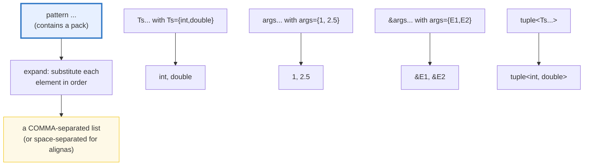
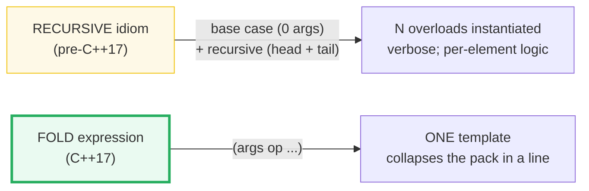

# VARIADIC_TEMPLATES — Parameter Packs, Recursive Idiom & Fold Expressions

> **Goal (one line):** by printing every value, show how a **variadic template**
> accepts any number of arguments via a **parameter pack** (`template <typename...
> Ts>` / `Ts... args`), how the pre-C++17 **recursive idiom** (head + tail, base
> case) consumed it, and how C++17 **fold expressions** collapse a pack with a
> binary operator in one line — the mechanism behind `std::make_unique`,
> `std::tuple`, `std::function`, and **perfect forwarding**.
>
> **Run:** `just run variadic_templates`
>
> **Ground truth:** [`variadic_templates.cpp`](./variadic_templates.cpp) → captured
> stdout in
> [`variadic_templates_output.txt`](./variadic_templates_output.txt). Every
> number/tag/table below is pasted **verbatim** from that file under a
> `> From variadic_templates.cpp Section X:` callout. Nothing is hand-computed.
>
> **Prerequisites:** 🔗 [`FUNCTION_TEMPLATES.md`](./FUNCTION_TEMPLATES.md)
> (a function template is a blueprint parameterized by `T`; this bundle is its
> *zero-or-more-`T`* generalization) and 🔗 [`CLASS_TEMPLATES.md`](./CLASS_TEMPLATES.md)
> (`std::tuple<Ts...>` is the headline variadic *class* template).

---

## 1. Why this bundle exists (lineage)

A **function template** (the previous bundle) stamps out one function per *type*
you call it with — but each signature is fixed at a **fixed arity**: `my_max(a, b)`
takes exactly two. A **variadic template** breaks that last ceiling: one template
takes **zero or more** arguments of **any** types. You write

```cpp
template <typename... Ts> void f(Ts... args);
```

**once**, and `f()`, `f(1)`, `f(1, 2.0, "x")` all resolve to it. `Ts...` is a
**type parameter pack**; `args...` is a **function parameter pack**. A template
with at least one pack is, by definition, a **variadic template** (C++11).

The hard part is *consuming* the pack — you cannot index `args[2]`; a pack is not
an array. Two eras of solution:

1. **Pre-C++17 — recursion.** Peel off the **head** (one typed argument) and
   recurse on the **tail** (the remaining pack), with a **base case** overload for
   the empty pack. This is section B. It still matters: any per-element logic a
   fold can't express (different return type per element, branching on `sizeof...`)
   still uses it.
2. **C++17 — fold expressions.** Collapse the whole pack with a binary operator
   in one line: `(args + ...)`, `(args && ...)`, `(fn(args), ...)`. This is
   section C/D/E — the backbone of modern generic code.

```mermaid
graph TD
    SRC["template &lt;typename... Ts&gt;<br/>void f(Ts... args)<br/>(BLUEPRINT, any arity)"]
    SRC -->|"call f(1, 2.0, \"x\")"| DED["DEDUCTION<br/>Ts = {int, double, const char*}<br/>args = {1, 2.0, \"x\"}"]
    DED --> PACK["a PARAMETER PACK<br/>(NOT an array — not indexable)"]
    PACK -->|"pre-C++17"| REC["RECURSIVE idiom<br/>head T + tail Ts...<br/>base case: 0 args"]
    PACK -->|"C++17+"| FOLD["FOLD expression<br/>(args op ...)<br/>one line, no recursion"]
    REC --> OUT1["per-element logic<br/>(join_rec, tprintf)"]
    FOLD --> OUT2["sum / all / any<br/>(make_unique, emplace, tuple)"]
    style SRC fill:#e7f0ff,stroke:#3178c6,stroke-width:3px
    style FOLD fill:#fef9e7,stroke:#f1c40f,stroke-width:3px
    style PACK fill:#fdecea,stroke:#c0392b
```

The headline contrast across the 5-language curriculum — **this is the
cross-language headline of the whole bundle**:

| Language | Variadic generics? | How you get "any arity" |
|---|---|---|
| **C++** (this bundle) | **yes — first-class** (`template <typename... Ts>`) | parameter packs + fold expressions (compile-time) |
| 🔗 [`../rust/`](../rust/) | **no** — variadic generics require changing the compiler | **macros** (`vec![]`, `println!`) or **tuples** (each arity is a distinct type); [draft RFC #376](https://github.com/rust-lang/rfcs/issues/376) still open |
| 🔗 [`../go/`](../go/) | **no** — generics are not variadic | variadic only for **same-type** `...T` (a `[]T` slice at runtime); no heterogeneous pack |
| 🔗 [`../ts/`](../ts/) | partial — **rest params** `...args: T[]` + **spread** `...xs` | a **runtime** array (erasure, not compile-time monomorphization) |

C++ is the only language in this curriculum with **true compile-time variadic
generics** — monomorphized, zero-cost, heterogeneous. That power is why `std::make_unique`,
`std::tuple`, `std::function`, and every `emplace_back` exist.

> From cppreference — *Packs*: "A template with at least one parameter pack is
> called a *variadic template*." And: `template<class... Types> void f(Types...
> args);` — "`f();` // OK: args contains no arguments; `f(1);` // OK … `f(2,
> 1.0);` // OK."

---

## 2. The mental model: pack expansion

The single mechanism underneath everything is **pack expansion**: a *pattern*
followed by `...` expands into a comma-separated (or, for `alignas`, space-
separated) list, substituting each pack element in order.



Wherever the `...` appears, the **same** comma-list substitution happens — only
the *syntactic slot* changes (function call args, template args, a parameter
list, a base-class list, a brace-init list, …). This is why one feature
parameterizes everything from `f(args...)` to `class X : public Mixins...`.



The right diagram is the whole story of sections B vs C: for *reducing* a pack
with an operator (sum, all-true, call-on-each), the C++17 fold replaces the
recursive idiom outright. Recursion survives only where a fold cannot express the
logic (heterogeneous return types, conditional branching per element).

---

## 3. Section A — Parameter packs: accepts 0+ args; `sizeof...(pack)`

> From `variadic_templates.cpp` Section A:
> ```
> template <typename... Ts> arity(const Ts&... args) { return sizeof...(args); }
> arity()              = 0   <- EMPTY pack (zero args accepted)
> arity(1)             = 1
> arity(1, 2.0, "x")   = 3   <- heterogeneous types, ONE signature
> [check] empty pack:  arity() == 0: OK
> [check] one arg:     arity(1) == 1: OK
> [check] three args:  arity(1, 2.0, "x") == 3: OK
> 
> sizeof...(pack) is a constant expression: constexpr n = arity(1,2,3) = 3
>   -> int arr[n]; compiles (a runtime value could not be an array bound)
> [check] sizeof...(args) usable as array bound (n == 3): OK
> 
> Non-type pack  template <auto... Ns>  sizeof...(Ns)
> nttp_count<1, 2UL, 'a'>() = 3   (int, unsigned long, char in ONE pack)
> [check] non-type pack nttp_count<1,2UL,'a'>() == 3: OK
> ```

**What.** `template <typename... Ts> void f(Ts... args)` declares a **type
parameter pack** `Ts` and a **function parameter pack** `args`. One signature
accepts **zero or more** arguments of **heterogeneous** types — `arity()`,
`arity(1)`, `arity(1, 2.0, "x")` all resolve to it. `sizeof...(args)` is the
count; `sizeof...(Ts)` is the type-pack count (they are equal here).

**Why — `sizeof...` is a constant expression.** The bundle proves it the only way
that matters: `constexpr std::size_t n = arity(1, 2, 3);` then `int arr[n];`. A
runtime value could **never** be an array bound; the fact that this compiles is
the proof that `sizeof...(pack)` is evaluated at compile time. This is the gateway
to compile-time branching on pack size (`if constexpr (sizeof...(Ts) == 0)`).

**Non-type template parameter packs.** `template <auto... Ns>` is a pack of
**non-type** template parameters (C++17's `auto` lets each element's type be
deduced independently). The bundle's `nttp_count<1, 2UL, 'a'>()` holds an `int`,
an `unsigned long`, and a `char` **in one pack** — heterogeneous *values*, not
just types. This is how `std::index_sequence<size_t... Indices>` and
`std::integer_sequence` are built.

**The two pack-positioning rules** (cppreference):

- In a **primary class template**, the parameter pack must be the **final**
  template parameter: `template <typename... Ts, typename U>` is an error.
- In a **function template**, the pack may appear **earlier**, *provided* every
  following parameter can be deduced from the function arguments (or has a
  default): `template <typename... Ts, typename U> void g(U, Ts...);` is fine
  because `U` is deduced from the first call argument.

> From cppreference — *Packs*: "In a primary class template, the template
> parameter pack must be the final parameter… In a function template, the
> template parameter pack may appear earlier… provided that all following
> parameters can be deduced."

---

## 4. Section B — The RECURSIVE idiom (pre-C++17): base case + head/tail

> From `variadic_templates.cpp` Section B:
> ```
> void join_rec() { return ""; }                          // base case
> template <typename T, typename... Ts>                    // recursive case
> std::string join_rec(const T& head, const Ts&... rest);
> 
> join_rec()               = ""    (empty pack -> base case)
> join_rec(42)             = "42"
> join_rec(1, 2.5, "hello") = "1, 2.5, hello"   (head + ", " + tail, recursed)
> [check] recursive base case: join_rec() == "": OK
> [check] recursive single:    join_rec(42) == "42": OK
> [check] recursive walk:      join_rec(1,2.5,"hello") == "1, 2.5, hello": OK
> ```

**What.** Before fold expressions, consuming a pack required **recursive pattern
matching**: an **overload set** of exactly two functions.

- **Base case** — `join_rec()` with *zero* arguments: terminates the recursion.
  Without it, `join_rec()` would have no matching overload.
- **Recursive case** — `join_rec(const T& head, const Ts&... rest)`: peels off
  the **head** as one concrete `T`, and recurses on the **tail** `Ts...` (one
  element shorter each call). Each instantiation deduces a new `T`.

So `join_rec(1, 2.5, "hello")` dispatches as: head=`1`/tail=`{2.5,"hello"}` →
head=`2.5`/tail=`{"hello"}` → head=`"hello"`/tail=`{}` → base case `""`. The
output `"1, 2.5, hello"` is the concatenation, built right-to-left on the way
back up the call stack.

**Why this still matters (the expert detail).** Folds *replaced* recursion for the
common case of "reduce a pack with an operator." But recursion is **irreplaceable**
when:

- each element needs a **different return type** (a fold's result has one type);
- you branch on `sizeof...(Ts)` mid-walk (`if constexpr`);
- you need **early termination** (`return` on the first satisfying element) — a
  fold over `&&` short-circuits, but a fold over `,` evaluates *all* elements.

cppreference's own canonical example — a `tprintf` that walks `%`-marked slots —
uses exactly this base-case + recursive-case shape. (See §7 *Sources*.)

> From cppreference — *Packs* example: "The first overload is called when only
> the format string is passed and there is no parameter expansion. The second
> overload contains a separate template parameter for the head … and a parameter
> pack, this allows the recursive call to pass only the tail."

---

## 5. Section C — FOLD EXPRESSIONS (C++17): collapse a pack in one line

> From `variadic_templates.cpp` Section C:
> ```
> (args + ...)  unary RIGHT fold  : E1 + (E2 + (E3 + ...))
> (... + args)  unary LEFT  fold  : ((E1 + E2) + E3) + ...
> 
> sum_right(1,2,3,4) = (args + ...) = 10
> sum_left (1,2,3,4) = (... + args) = 10   (+ is associative: same result)
> [check] unary right fold: (1+2+3+4 via (args+...)) == 10: OK
> [check] unary left  fold: (1+2+3+4 via (...+args)) == 10: OK
> 
> (args && ...)  unary right fold over && : all-true
> (args || ...)  unary right fold over || : any-true
> all_true(true,true,false) = false
> all_true(true,true)       = true
> any_true(false,false,true)= true
> any_true(false,false)     = false
> [check] all_true(true,true,false) == false: OK
> [check] all_true(true,true) == true: OK
> [check] any_true(false,false,true) == true: OK
> [check] any_true(false,false) == false: OK
> 
> EMPTY-pack unary folds (the ONLY 3 legal operators):
>   all_true()        = (args && ...) with 0 args = true   (identity for &&)
>   any_true()        = (args || ...) with 0 args = false  (identity for ||)
> [check] empty pack: (args && ...) == true: OK
> [check] empty pack: (args || ...) == false: OK
> 
> BINARY fold with init: (args + ... + 0)  -> init when pack is empty
>   sum_empty_safe(1,2,3) = (args + ... + 0) = 6
>   sum_empty_safe()      = (args + ... + 0) = 0   (empty -> the init 0)
> [check] binary fold non-empty: sum_empty_safe(1,2,3) == 6: OK
> [check] binary fold empty:     sum_empty_safe() == 0  (init value): OK
> ```

**What.** A **fold expression** (C++17) reduces a pack over a binary operator in
one expression — no manual recursion, no overload set. `(args + ...)` sums; `(args
&& ...)` is all-true; `(args || ...)` is any-true. The bundle asserts all of them.

**The empty-pack rule — the expert payoff.** A **unary** fold over an *empty*
pack is **ill-formed for every operator except three**, which yield the operator's
identity element:

| Operator | Empty unary fold | Why |
|---|---|---|
| `&&` (logical AND) | **`true`** | identity of `&&` — "all of nothing" is vacuously true |
| `\|\|` (logical OR) | **`false`** | identity of `\|\|` — "any of nothing" is vacuously false |
| `,` (comma) | **`void()`** | an empty sequence of expressions |

This is why `all_true()` is `true` and `any_true()` is `false` in the output —
and why `(args + ...)` over an empty pack **would not compile**. To make `+` (or
any other operator) empty-safe, use a **binary fold with an init value**:
`(args + ... + 0)`. With an empty pack the result is just `0` (the init); with a
non-empty pack the init is folded in. The bundle proves both: `sum_empty_safe()`
is `0`, `sum_empty_safe(1,2,3)` is `6`.

**Left vs right — when does it matter?** For **associative** operators (`+`, `*`,
`&&`, `||`, `,`), left and right folds give the **same** result — the bundle shows
`sum_right == sum_left == 10`. For **non-associative** operators (`-`, `/`, `%`,
`<<`, `>>`, comparisons), the direction changes the answer (see Section E: the
four forms over `-` give 8, 6, -92, 86). Pick the form that matches your intent.

**Parentheses are mandatory.** The `( ... )` around a fold are a *required* part
of the syntax, not grouping — `(args + ...)` is a fold, `args + ...` is a syntax
error. And after CWG defect 2611, each fold step is itself parenthesized, so
precedence inside the expansion can't surprise you.

> From cppreference — *Fold expressions*: "When a unary fold is used with a pack
> expansion of length zero, only the following operators are allowed: `&&` (the
> value is `true`), `||` (the value is `false`), and the comma operator `,` (the
> value is `void()`)." Feature-test macro: `__cpp_fold_expressions == 201603L`.

---

## 6. Section D — Pack EXPANSION in other contexts

> From `variadic_templates.cpp` Section D:
> ```
> (1) std::tuple<Ts...> from a pack (args... expands in the ctor call):
>     std::tuple<int,double,const char*> t = make_tup(1, 2.5, "hi");
>     std::get<0>(t) = 1
>     std::get<1>(t) = 2.5
>     std::get<2>(t) = hi
>     std::tuple_size = 3  (== sizeof...(Ts))
> [check] tuple pack expansion: get<0> == 1: OK
> [check] tuple pack expansion: get<1> == 2.5: OK
> [check] tuple pack expansion: tuple_size == sizeof...(pack) == 3: OK
> 
> (2) Comma-fold  (fn(args), ...) : call fn on each, left-to-right
>     collect_each(10, 2.5, "z") = [10, 2.5, z]
>     collect_each()             = 0 elements  (empty pack -> void())
> [check] comma-fold collect_each(10,2.5,"z") has 3 elements: OK
> [check] comma-fold order preserved: [0]=="10": OK
> [check] comma-fold order preserved: [2]=="z": OK
> [check] comma-fold empty pack -> 0 elements: OK
> 
> (3) Perfect forwarding PREVIEW (full treatment: MOVE_SEMANTICS, P3):
>     template <typename... Ts> void f(Ts&&... args) { g(forward<Ts>(args)...); }
>     forward_to_target(string("yo"), 42) -> sink = ("yo", 42)
> [check] perfect forwarding: string passed through: OK
> [check] perfect forwarding: int passed through: OK
> ```

Pack expansion is **not** just for folds. The `...` works wherever a comma-list
(or space-list) is grammatical:

**(1) Pack expansion into a TYPE — `std::tuple<Ts...>`.** `std::tuple` is **the**
variadic class template (🔗 `CLASS_TEMPLATES`). The bundle's `make_tup` builds a
`std::tuple<Ts...>` by expanding `args...` into the constructor call. Note the
**decay**: because the helper takes its parameters **by value**, the string
literal `"hi"` (type `const char[3]`) decays to `const char*` — so `Ts` deduces
to `{int, double, const char*}`, exactly what we want stored. (Taking by
`const Ts&...` would deduce the array type and fail to construct the tuple — a
classic trap; see §10.) `std::tuple_size` then equals `sizeof...(Ts)`, and
`std::get<I>` indexes elements — packs are *not* indexable at runtime, but a
tuple built from one is.

**(2) Comma-fold — call a function on EACH element.** `(fn(args), ...)` is a unary
right fold over the comma operator: it evaluates `fn(E1), fn(E2), fn(E3)` in
**left-to-right order** (the comma sequences its operands), discarding each result
except the last. This is the C++17 **one-liner replacement** for the recursive
printer of section B — `collect_each` pushes each element into a vector, in order,
with no recursion. The empty-pack case yields `void()` (the legal empty comma
fold), so `collect_each()` returns an empty vector cleanly.

**(3) Perfect-forwarding PREVIEW — the `make_unique` / `emplace` idiom.** The
single most important application of variadic templates in the wild:

```cpp
template <typename... Ts> void f(Ts&&... args) {
    g(std::forward<Ts>(args)...);
}
```

`Ts&&...` is a pack of **forwarding references** (🔗 `MOVE_SEMANTICS`, P3 — each
`Ts&&` deduces to `T&` for lvalues and `T&&` for rvalues). `std::forward<Ts>(args)...`
**re-expands the pack**, preserving each argument's value category perfectly. This
is *literally* how `std::make_unique<T>(args...)`, `vector::emplace_back(args...)`,
and `std::make_tuple(args...)` forward their arguments without copying. The bundle
verifies the values pass through (`("yo", 42)`); the **move** half — proving an
rvalue is actually *moved* not copied — is the subject of P3.

> From cppreference — *Pack expansion* loci: a pack expansion is allowed "inside
> the parentheses of a function call operator" (`f(args...)`), in "brace-enclosed
> initializers" (`{args...}`), in "template argument lists" (`C<Ts...>`), in "base
> specifiers and member initializer lists" (`class X : Mixins...`), and in fold
> expressions.

---

## 7. Section E — The 4 fold forms (direction + init matter)

> From `variadic_templates.cpp` Section E:
> ```
> Pack = {10, 3, 1}, operator = '-'  (NOT associative -> forms diverge):
> 
>   form  syntax              expansion              result
>   ----  -----------------   ---------------------  ------
>   (1)   (args - ...)        E1-(E2-(...-EN))       8   (10-(3-1))
>   (2)   (... - args)        ((E1-E2)-...)-EN       6   ((10-3)-1)
>   (3)   (args - ... - 100)  E1-(...-(EN-100))      -92   (10-(3-(1-100)))
>   (4)   (100 - ... - args)  ((100-E1)-...)-EN      86   (((100-10)-3)-1)
> [check] form 1 unary right:  (args - ...) == 8: OK
> [check] form 2 unary left:   (... - args) == 6: OK
> [check] form 3 binary right: (args - ... - 100) == -92: OK
> [check] form 4 binary left:  (100 - ... - args) == 86: OK
> 
> 32 binary operators may fold: + - * / % ^ & | << >> == != <= >= && || ,
>   (and += -= *= ... ->* etc.). In a BINARY fold, both ops must match.
> [check] this file exercises fold over +, &&, ||, and ,  (all legal fold operators): OK
> ```

There are **exactly four** fold forms. Subtraction is non-associative, so the same
pack `{10, 3, 1}` produces **four different answers** — the clearest possible way
to see that left/right and unary/binary are genuinely different:

| Form | Syntax | Expansion (N elements) | Result for `{10,3,1}` |
|---|---|---|---|
| **1. unary right** | `(pack op ...)` | `E1 op (E2 op (... op EN))` | `10-(3-1)` = **8** |
| **2. unary left** | `(... op pack)` | `((E1 op E2) op ...) op EN` | `(10-3)-1` = **6** |
| **3. binary right** | `(pack op ... op init)` | `E1 op (... op (EN op init))` | `10-(3-(1-100))` = **-92** |
| **4. binary left** | `(init op ... op pack)` | `((init op E1) op ...) op EN` | `((100-10)-3)-1` = **86** |

**When to reach for which.**

- **Unary** when the pack is guaranteed non-empty (or the operator is `&&`/`||`/`,`).
- **Binary with init** when the pack *might* be empty and you need a defined result
  — the init is the empty-pack value. `(args + ... + 0)` for a safe sum, `(false
  || ... || args)` for "any-true with a forced-empty default," `(pack | ... |
  std::byte{0})` for a bitmask OR.
- **Left vs right** only matters for **non-associative** operators or when side
  effects must sequence in a particular direction. For `+ * && || ,` it doesn't.

Any of **32 binary operators** may fold: `+ - * / % ^ & | = < > << >> += -= *= /= %=
^= &= |= <<= >>= == != <= >= && || , .* ->*`. In a **binary** fold, both operators
must be the *same* (`(args + ... + 0)`, never `(args + ... - 0)`). The expression
used as `pack` or `init` must not have an operator with precedence below cast at
the top level — if it does, parenthesize it: `(args + ... + (1 * 2))`.

> From cppreference — *Fold expressions*: the four syntaxes and their expansions
> (quoted in the table above); "any of the following 32 binary operators"; "In a
> binary fold, both ops must be the same." Standard reference: `[expr.prim.fold]`.

---

## 8. Worked smallest-scale example

Everything above, compressed to the three lines a beginner must memorize:

```cpp
template <typename... Ts>           // a TYPE parameter pack
void f(Ts... args) {                // a FUNCTION parameter pack; f(), f(1), f(1,2,"x") all OK
    std::size_t n = sizeof...(args);      // the count (a constant expression)
    int sum = (args + ... + 0);           // C++17 fold: sum, empty-safe via init 0
}
```

> From `variadic_templates.cpp` Section A, `arity(1, 2.0, "x") == 3` proves one
> signature accepts a heterogeneous, 3-argument call; Section C's
> `sum_empty_safe() == 0` proves the binary fold is empty-safe. Those two facts —
> *any arity, any type* and *collapse with an operator* — are the whole feature.

---

## 9. The value-vs-reference-vs-pointer axis (threaded through this bundle)

Every pack parameter also sits on the C++ value/reference axis (🔗
`MOVE_SEMANTICS.md`, `VALUE_VS_REFERENCE_VS_POINTER.md`). How each form in this
bundle passes its arguments:

| Pack-parameter form in this bundle | Copies? | Aliases? | Owns / forwards? |
|---|---|---|---|
| `arity(const Ts&... args)` (const-ref pack) | no | **yes** (read-only aliases) | borrows — cheapest read |
| `make_tup(Ts... args)` (by-value pack) | **yes** (each arg copied/moved in) | no | owns the copies |
| `forward_to_target(Ts&&... args)` (forwarding-ref pack) | no | n/a | **forwards** value category via `std::forward` |

The by-value form (`Ts... args`) is what `std::make_tuple` uses — it **decays**
array types (`"hi"` → `const char*`) and copies each argument in. The
forwarding-ref form (`Ts&&... args`) is what `std::make_unique` /
`emplace_back` use — it forwards without copying. Choosing the wrong one (e.g. a
const-ref pack where you needed decay) is a real trap (§10).

---

## 10. Pitfalls (the expert payoff)

| Trap | Symptom | Fix |
|---|---|---|
| `(args + ...)` over an **empty** pack | **ill-formed** — compile error ("fold expression has empty pack for non-associative operator") | Use a binary fold with init: `(args + ... + 0)`. Only `&& \|\| ,` accept an empty unary fold. |
| `make_tup(const Ts&... args)` returning `tuple<Ts...>` with a string-literal arg | `Ts` deduces to `const char[N]` → `tuple<…, char[N]>` won't construct → pages of "no matching constructor" errors | Take **by value** (`Ts... args`) so the array **decays** to `const char*` (mirrors `std::make_tuple`); or constrain/decay explicitly. |
| A parameter pack **not last** in a primary class template | `template <typename... Ts, typename U> struct X;` → hard compile error | Move the pack to the end, or (function templates only) put it before a parameter that is **deducible** from a call argument. |
| Expecting `args[2]` to work | "type/value mismatch" / packs aren't indexable at runtime | Index via `std::get<I>(tuple)` (after packing into a tuple), or recursion, or (C++26) **pack indexing** `Ts...[I]`. |
| Comma-fold `(fn(args), ...)` whose `fn` returns a type with an **overloaded `operator,`** | Silent wrong semantics — the overloaded comma hijacks the fold | Cast each operand to `void`: `(void(fn(args)), ...)`; or `static_cast<void>(fn(args))`. |
| Fold over a non-associative op **without** checking direction | `(args - ...)` (right) ≠ `(... - args)` (left) for `- / % <<` — wrong numeric result | Pick the form deliberately (§7); for `+ * && \|\| ,` it doesn't matter. |
| `(args op ...)` written **without** the outer parens | syntax error — the `(…)` are a *required* part of fold syntax | Always write the parentheses: `(args + ...)`, never `args + ...`. |
| `sizeof...(pack)` mistaken for byte size | it's the **count** of elements, not `sizeof` bytes | `sizeof...(args)` = N elements; `sizeof...(Ts)` = N types; they're equal. |
| Recursive idiom **without a base case** | infinite template instantiation → "recursive template instantiation exceeded depth" | Always provide the 0-arg (or 1-arg) terminating overload. |
| Perfect forwarding that **forgets** `std::forward` | `f(Ts&&... args){ g(args...); }` → all args become **lvalues** → rvalues get copied, not moved (silent pessimization) | Always `g(std::forward<Ts>(args)...)`. (🔗 `MOVE_SEMANTICS`, P3.) |
| Fold expression with `init`/`pack` containing a low-precedence operator | compile error ("operator with precedence below cast") | Parenthesize the sub-expression: `(args + ... + (n * 2))`. |
| Two packs of **different lengths** in one expansion | "pack expansion contains packs of different lengths" | Ensure both packs have the same `sizeof...` (e.g. zip from one index sequence). |

---

## 11. Cheat sheet

```cpp
// ── Declare a variadic template (C++11) ────────────────────────────────────
template <typename... Ts>              // TYPE parameter pack (must be last in a class)
void f(Ts... args);                    // FUNCTION parameter pack; f(), f(1), f(1,"x") OK
template <auto... Ns>                  // NON-TYPE pack (heterogeneous values)
struct IntSeq {};

// ── Query the count (constant expression) ─────────────────────────────────
std::size_t n = sizeof...(args);       // == sizeof...(Ts); usable as array bound / tmpl arg

// ── Consume: RECURSIVE idiom (pre-C++17, still useful) ─────────────────────
void g() {}                            // base case (0 args) — TERMINATES the recursion
template <class T, class... R>
void g(const T& head, const R&... rest) { use(head); g(rest...); }  // head + tail

// ── Consume: FOLD expressions (C++17) — the 4 forms ───────────────────────
(args  op ...);          // (1) unary RIGHT : E1 op (E2 op (... op EN))
(...   op args);         // (2) unary LEFT  : ((E1 op E2) op ...) op EN
(args  op ... op init);  // (3) binary RIGHT: E1 op (... op (EN op init))
(init  op ... op args);  // (4) binary LEFT : ((init op E1) op ...) op EN
//   Parentheses are MANDATORY. 32 binary ops allowed; both ops match in a binary fold.

// ── Empty-pack unary folds: the ONLY 3 legal operators ─────────────────────
(args && ...);           // empty -> true   (identity of &&)
(args || ...);           // empty -> false  (identity of ||)
(args , ...);            // empty -> void() (identity of comma)
//   For any OTHER op on an empty pack, use a binary fold with init:
(args + ... + 0);        // empty-safe sum -> 0 when pack is empty

// ── Everyday folds ─────────────────────────────────────────────────────────
int  sum   = (args + ... + 0);         // sum, empty-safe
bool all   = (args && ...);            // all-true (empty -> true)
bool any   = (args || ...);            // any-true (empty -> false)
(fn(args), ...);                       // call fn on each, left-to-right

// ── Pack expansion in other slots (the SAME comma-list substitution) ──────
std::tuple<Ts...>   t{args...};        // expand into a TYPE and a ctor call
f(args...);                            // expand into a function-call arg list
container<Ts...>    c;                 // expand into a template-argument list
class X : public Mixins... {};         // expand into a base-class list

// ── Perfect forwarding (the make_unique / emplace idiom; full: MOVE_SEMANTICS)
template <typename... Ts>
void wrap(Ts&&... args) {              // Ts&&... = pack of FORWARDING references
    target(std::forward<Ts>(args)...); // re-expand, preserving value category
}

// ── Feature-test macros ───────────────────────────────────────────────────
__cpp_variadic_templates >= 200704L    // C++11
__cpp_fold_expressions  >= 201603L     // C++17
__cpp_pack_indexing     >= 202311L     // C++26 (Ts...[I] — index a pack directly)
```

---

## 12. 🔗 Cross-references

**Within C++ (the expertise spine):**

- 🔗 `FUNCTION_TEMPLATES` (P2) — this bundle is the *zero-or-more-`T`* twin of the
  single-`T` function template. Same monomorphization model, same deduction rules,
  one new mechanism (the pack).
- 🔗 `CLASS_TEMPLATES` (P2) — `std::tuple<Ts...>` is the headline **variadic
  class** template; the pack-must-be-last rule and `template <typename... Ts,
  typename U>` partial-specialization patterns live there.
- 🔗 `MOVE_SEMANTICS` (P3) — the **full** treatment of `Ts&&...` forwarding
  references + `std::forward`, and why `make_unique`/`emplace_back` *move* rvalues
  rather than copy them. Section D's (3) is a preview.
- 🔗 `CONCEPTS` (P2) — `template <typename... Ts>` meets constraints:
  `template <std::convertible_to<int>... Ts>` constrains every element of a pack,
  and `(Concept<Ts> && ...)` is a **fold-expanded constraint**.
- 🔗 `UNDEFINED_BEHAVIOR` (P7) — a variadic template that **forgets the base case**
  recurses until the implementation's instantiation-depth limit (a compile-time
  analogue of runaway recursion); template diagnostics are the closest C++ gets to
  "UB-shaped" metaprogramming errors.

**Cross-language parallels (the 5-language curriculum):**

- 🔗 [`../rust/`](../rust/) — Rust has **no variadic generics** (it would require
  changing the compiler; [draft RFC #376](https://github.com/rust-lang/rfcs/issues/376)
  is still open). Rust fakes it with **macros** (`vec![]`, `println!`, `format!`)
  or **tuples** (each arity is a distinct type — `(A,B)`, `(A,B,C)` are unrelated).
  C++'s `template <typename... Ts>` is true compile-time variadic generics; Rust's
  macros are textual expansion. ([Stack Overflow: "Rust is missing Variadic
  Generics"](https://stackoverflow.com/questions/76350527/))
- 🔗 [`../go/`](../go/) — Go's variadic functions accept only **same-type** `...
  T` (a `[]T` slice at runtime); there are **no variadic generics**. C++'s pack is
  heterogeneous and monomorphized at compile time.
- 🔗 [`../ts/`](../ts/) — TypeScript **rest parameters** `...args: T[]` and the
  **spread** operator `...xs` are the runtime analogue, but they operate on a
  (garbage-collected) **array** under **erasure** — not compile-time
  monomorphization. C++ packs have zero runtime representation.

---

## Sources

Every signature, value, and behavioral claim above was verified against
cppreference and the ISO C++ standard, then corroborated by ≥1 independent
secondary source:

- cppreference — *Packs (since C++11)* / *Parameter pack* (template & function
  parameter packs, variadic template definition, the pack-must-be-last rule,
  non-type/template-template packs, pack expansion loci, the recursive `tprintf`
  example, `sizeof...`):
  https://en.cppreference.com/w/cpp/language/parameter_pack
  (canonical URL: https://en.cppreference.com/w/cpp/language/pack )
- cppreference — *Fold expressions (since C++17)* (the 4 syntaxes and their
  expansions, the 32 legal binary operators, the empty-pack rule for `&&`/`||`/`,`,
  the feature-test macro `__cpp_fold_expressions == 201603L`, CWG 2611
  parenthesization, the `all()` example, standard ref `[expr.prim.fold]`):
  https://en.cppreference.com/w/cpp/language/fold
- cppreference — *`sizeof...` operator* (returns the number of elements; result is
  a `std::size_t` constant expression):
  https://en.cppreference.com/w/cpp/language/sizeof...
- cppreference — *Function template* / *Template parameters* (the deduction
  context that lets a function-template pack appear before a deducible parameter;
  forwarding-reference deduction `Ts&&...`):
  https://en.cppreference.com/w/cpp/language/function_template
- cppreference — *Pack indexing (C++26)* (`Ts...[I]` / `args...[I]`, the upcoming
  direct pack-index feature, `__cpp_pack_indexing == 202311L`):
  https://en.cppreference.com/w/cpp/language/pack_indexing
- ISO C++23 draft (open-std.org) — normative wording:
  - 13.7.3 Variadic templates `[temp.variadic]` (pack declaration + expansion)
  - 7.5.6 Fold expressions `[expr.prim.fold]` (the four forms + empty-pack rule)
  - Working draft: https://open-std.org/JTC1/SC22/WG21/docs/papers/2023/n4950.pdf
    (and the N49xx series at https://open-std.org/JTC1/SC22/WG21/ )
- Secondary corroboration (≥2 independent sources, web-verified) for the
  empty-pack fold rule and the four fold forms:
  - Stanford (D. Mazieres) — *C++20 idioms for parameter packs*
    ("If ⊕ is `&&`, an empty unary fold is `true`; if `||`, `false`; if `,`,
    `void()`; for all others, an empty unary fold is ill-formed"):
    https://www.scs.stanford.edu/~dm/blog/param-pack.html
  - StudyPlan.dev — *Empty Parameter Packs in Fold Expressions*
    (unary vs binary fold handling of empty packs):
    https://www.studyplan.dev/pro-cpp/fold-expressions/q/empty-parameter-packs-in-fold-expressions
  - foonathan blog — *Nifty Fold Expression Tricks* (comma-fold "call on each",
    the `(fn(args), ...)` idiom and its empty-pack result):
    https://www.foonathan.net/2020/05/fold-tricks/
  - Stack Overflow — *Fold expression with comma operator and variadic template
    parameter pack* (unary right vs left fold over `,`):
    https://stackoverflow.com/questions/53330713/fold-expression-with-comma-operator-and-variadic-template-parameter-pack
- Secondary corroboration for the cross-language claim (Rust lacks variadic
  generics):
  - Stack Overflow — *Is it possible to emulate variadic generics in Rust?*
    ("Rust is missing Variadic Generics (and also variadic functions) as a
    language feature"):
    https://stackoverflow.com/questions/76350527/is-it-possible-to-emulate-variadic-generics-in-rust
  - rust-lang/rfcs — *Draft RFC: variadic generics* (Issue #376, still open):
    https://github.com/rust-lang/rfcs/issues/376
  - Rust Internals — *Variadic Generics ideas that won't work for Rust*
    (tuples/macros as the current workarounds):
    https://internals.rust-lang.org/t/variadic-generics-ideas-that-won-t-work-for-rust/23201

**Facts that could not be verified by running** (documented, not executed,
because they are compile errors, C++26-only, or sanitizer-shaped by design): the
hard compile error for an empty unary fold over `+` (a file containing it would
fail `just check`); pack indexing `Ts...[I]` (C++26, not yet in this toolchain's
default); the recursion-depth-limit diagnostic from a missing base case; and the
rvalue-*moved*-not-copied half of perfect forwarding (the runtime proof is the
subject of `MOVE_SEMANTICS`, P3). These are confirmed by the cppreference sections
and secondary sources above, not reproduced as runnable output in the verified
path.
