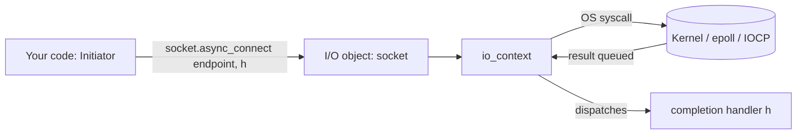

# IO Objects: Sockets, Timers, and the Asio Model

**Doc Source**: [Basic Asio Anatomy](https://think-async.com/Asio/asio-1.36.0/doc/asio/overview/basics.html) · [Timer.1 Tutorial](https://think-async.com/Asio/asio-1.36.0/doc/asio/tutorial/tuttimer1.html) · [Timer.2 Tutorial](https://think-async.com/Asio/asio-1.36.0/doc/asio/tutorial/tuttimer2.html)

## The Core Concept: Why This Example Exists

**The Problem:** Network and I/O code has historically been split between two ugly extremes — blocking calls that waste a thread per connection, and raw OS multiplexing (`select`/`epoll`/`kqueue`/IOCP) that requires you to hand-roll event tables, buffer lifetimes, and error translation. Neither is portable, and neither scales without a disciplined abstraction on top.

**The Solution:** Asio introduces a unified mental model built on three roles: an **I/O execution context** (the bridge to the OS), an **I/O object** (a socket/timer/serial-port bound to that context), and a **completion handler** (the callback that fires when work finishes). The same object supports *both* synchronous and asynchronous use — the only thing that changes is whether your thread blocks inside the call or hands a handler to the event loop.

Think of Asio as a post office. The `io_context` is the sorting facility. The I/O object (a socket) is a mailbox you open at that facility. A synchronous `connect()` is you standing at the counter until the letter is delivered; an `async_connect()` is you dropping off a self-addressed envelope and leaving a phone number (the handler) so the facility can call you back.

## Practical Walkthrough: Code Breakdown

Let's trace the exact anatomy the official docs draw, using real code from the Timer tutorials.

### The I/O Execution Context: `io_context`

Every Asio program begins by creating an execution context. From the official [Basic Asio Anatomy](https://think-async.com/Asio/asio-1.36.0/doc/asio/overview/basics.html):

> Your program will have at least one I/O execution context, such as an `asio::io_context` object... This I/O execution context represents your program's link to the operating system's I/O services.

```cpp
asio::io_context io_context;
```

This single line is Asio's equivalent of Tokio's runtime builder or Node's libuv loop. It is the scheduler that owns the work queue and (eventually) dispatches completion handlers.

### The I/O Object: bound to the context

An I/O object is *constructed against* a context. The context is always the first constructor argument:

```cpp
asio::ip::tcp::socket socket(io_context);
```

From the Timer.1 tutorial, the same pattern holds for a timer:

```cpp
asio::steady_timer t(io, asio::chrono::seconds(5));
```

The official docs make the design rule explicit:

> The core asio classes that provide I/O functionality (or as in this case timer functionality) always take an executor, or a reference to an execution context (such as `io_context`), as their first constructor argument.

This binding is what lets the object later route work back through *your* event loop rather than some global.

### Synchronous use: the blocking path

For a synchronous `connect`, the docs describe a six-step sequence: your program calls the I/O object, the I/O object forwards to the context, the context calls the OS, the OS returns the result, the context translates errors into `error_code`, and the I/O object either throws or sets your `ec`:

```cpp
// Throws asio::system_error on failure:
socket.connect(server_endpoint);

// Or, the non-throwing overload:
asio::error_code ec;
socket.connect(server_endpoint, ec);
```

The Timer.1 tutorial shows the synchronous timer equivalent:

```cpp
t.wait();   // blocks until the 5 seconds elapse
std::cout << "Hello, world!" << std::endl;
```

### Asynchronous use: initiate, run, complete

The async path is where Asio's model diverges. From Timer.2:

```cpp
void print(const std::error_code& /*e*/)
{
  std::cout << "Hello, world!" << std::endl;
}

int main()
{
  asio::io_context io;
  asio::steady_timer t(io, asio::chrono::seconds(5));

  t.async_wait(&print);   // initiate, return immediately
  io.run();               // drive the loop — blocks here
  return 0;
}
```

Two guarantees the docs hammer home:

1. **Handlers only run from inside `io_context::run()`.** Quote: *"The asio library provides a guarantee that completion handlers will only be called from threads that are currently calling `asio::io_context::run()`."* If you never call `run()`, your handler never fires.
2. **`run()` exits when there's no more work.** *"It is important to remember to give the io_context some work to do before calling `run()`."* Omit the `async_wait` and `run()` returns instantly — the canonical beginner trap.

### The completion handler signature

The async initiation call dictates the handler's signature. For `async_wait`:

```cpp
void your_completion_handler(const asio::error_code& ec);
```

For a socket read it adds a byte count: `void handler(asio::error_code ec, std::size_t bytes_transferred)`. The exact form is documented per operation.

## Mental Model: Thinking in Asio

**The Three-Role Triangle:** Every Asio interaction is a triangle of *Initiator → I/O object → io_context → completion handler*. The synchronous case collapses the last two steps into the calling thread. The asynchronous case stretches them across time: initiation returns immediately, the OS/kernel does the work, and the context reifies the result as a handler invocation on a thread that is *inside* `run()`.



**Why It's Designed This Way:** By making the context an *explicit* first argument (not a global), Asio lets one process host multiple independent loops — one per thread pool, one for the GUI thread, one for tests. By giving the I/O object a stable synchronous *and* asynchronous API, you can prototype with blocking calls and migrate to async without rewriting the call sites.

## Pitfalls

- **Forgetting `io.run()`.** The #1 newcomer bug. Initiation only *queues* work; `run()` is what actually pumps it. No `run()`, no callback.
- **Calling `run()` before any work is posted.** It returns immediately because the work counter is zero. Always post/initiate first.
- **The I/O object outliving the context.** The socket/timer holds a reference to the context's executor; destroying the context while objects exist is undefined. Tie lifetimes with RAII.
- **Letting buffers/objects go out of scope before completion.** An async op captures buffers by reference implicitly; if the `std::string` you passed to `async_write` is destroyed before the handler fires, you get use-after-free (Asio's optional *buffer debugging* catches this under `_GLIBCXX_DEBUG`).

## 🔗 Cross-references

**Within C++ (the expertise spine):**

- 🔗 `COROUTINES` (P4) — once you understand the initiate→handler model here, C++20 `co_await` is the modern way to *flatten* those handler chains. See `06-coroutines.md` in this bundle.
- 🔗 `FUTURES_PROMISES` (P4) — `std::future` is the synchronous analogue: a one-shot completion token. Asio's `use_future` token bridges the two.
- 🔗 `STD_THREAD` (P4) — `io_context::run()` can be called from *multiple* threads; the threading rules here dictate when you need strands (`03-strands.md`).
- 🔗 `RAII` (P2) — I/O objects are RAII handles; destruction closes the underlying descriptor.

**Cross-language parallels (the 5-language curriculum):**

- 🔗 [`../rust`](../rust) — **Tokio** is the direct sibling. `asio::io_context` ↔ `tokio::runtime::Runtime`; `async_connect` ↔ `TcpStream::connect().await`; the "handler runs inside `run()`" guarantee ↔ Tokio's reactor driving the task. Asio *is* C++'s tokio — the foundation Crow and redis-plus-plus build on.
- 🔗 [`../ts`](../ts) — **Node's libuv event loop** is the same conceptual runtime. `io_context::run()` ↔ the Node event loop tick; a completion handler ↔ a Promise `.then` callback. The difference: Asio makes the loop an *explicit* object you can own multiple of; Node bakes one global loop in.
