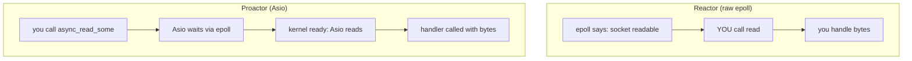

# The Proactor Model: How Asio Does Async

**Doc Source**: [The Proactor Design Pattern: Concurrency Without Threads](https://think-async.com/Asio/asio-1.36.0/doc/asio/overview/core/async.html)

## The Core Concept: Why This Example Exists

**The Problem:** Asynchronous I/O has two classical architectural patterns. The **Reactor** (`select`/`epoll`/`kqueue`) tells you *"a socket is ready — you go read it now"* — the application does the actual I/O synchronously when notified. The **Proactor** inverts this: you say *"go do the read, and tell me when it's done"* — the system performs the I/O asynchronously and hands you the result. Each platform picks a side (POSIX leans Reactor, Windows IOCP is a native Proactor), so a portable C++ library has to paper over the split.

**The Solution:** Asio exposes a *Proactor* API uniformly on every platform, even on Linux where the kernel only offers a Reactor (`epoll`). It achieves this by internally running a Reactor and *simulating* Proactor semantics: when `epoll` reports readiness, Asio performs the operation itself and enqueues the completion handler. From the outside, your code always says "initiate async op, give me a callback" — never "tell me when it's readable." This is what makes an Asio program portable from a Linux box to a Windows server with no code changes.

## Practical Walkthrough: Code Breakdown

### The Proactor roles, mapped to Asio

The official docs define the Proactor pattern with six roles and show exactly how Asio fills each. Here is the mapping verbatim from the [Proactor doc](https://think-async.com/Asio/asio-1.36.0/doc/asio/overview/core/async.html):

| Proactor role | Asio implementation |
|---|---|
| **Asynchronous Operation** | "An operation that is executed asynchronously, such as an asynchronous read or write on a socket." |
| **Asynchronous Operation Processor** | "Executes async ops and queues events on completion event queue when ops complete. Internally, services like `reactive_socket_service` are async op processors." |
| **Completion Event Queue** | "Buffers completion events until dequeued." |
| **Completion Handler** | "Processes the result. Function objects, often created using `boost::bind`." |
| **Asynchronous Event Demultiplexer** | "Blocks waiting for events... returns a completed event to its caller." |
| **Proactor** | "Calls the demultiplexer to dequeue events, and dispatches the completion handler. Represented by the `io_context` class." |

The headline: **`io_context` *is* the Proactor.** That is the role it plays.

### Implementation on POSIX: Reactor underneath

On Linux/macOS, there is no native async-I/O API good enough, so Asio builds the Proactor *on top of* a Reactor. The docs spell out the construction:

> **Asynchronous Operation Processor** — A reactor implemented using `select`, `epoll` or `kqueue`. When the reactor indicates that the resource is ready to perform the operation, the processor executes the asynchronous operation and enqueues the associated completion handler on the completion event queue.

> **Completion Event Queue** — A linked list of completion handlers (i.e. function objects).

So when you call `socket.async_read_some(buf, handler)`:
1. Asio registers the socket with `epoll` (the Reactor).
2. `epoll_wait` later reports the socket readable.
3. Asio performs the actual `read()` syscall *itself* (the simulated Proactor step).
4. The handler is appended to the completion queue.
5. `io_context::run()` dequeues and invokes your handler.

### Implementation on Windows: native IOCP

On Windows the OS *is* the Proactor, so Asio leans on it directly:

> **Asynchronous Operation Processor** — This is implemented by the operating system. Operations are initiated by calling an overlapped function such as `AcceptEx`.

> **Completion Event Queue** — This is implemented by the operating system, and is associated with an I/O completion port. There is one I/O completion port for each `io_context` instance.

Same source code, two wildly different kernels, one uniform API. That portability is the whole point of the abstraction.

### Why Proactor over Reactor: the docs' own argument

Asio's docs list concrete advantages of the Proactor approach:

> **Decoupling threading from concurrency.** "Long-duration operations are performed asynchronously by the implementation on behalf of the application. Consequently applications do not need to spawn many threads in order to increase concurrency."

> **Simplified application synchronisation.** "Async operation completion handlers can be written as though they exist in a single-threaded environment... developed with little or no concern for synchronisation issues."

> **Performance and scalability.** "With asynchronous operations it is possible to avoid the cost of context switching by minimising the number of operating system threads... and only activating the logical threads of control that have events to process."

> **Function composition.** "Asynchronous operations can be chained together. A completion handler for one operation can initiate the next." This is how a `read_message` op composes two lower-level reads.

### The documented trade-offs

The docs are honest about the costs:

> **Program complexity.** "It is more difficult to develop applications using asynchronous mechanisms due to the separation in time and space between operation initiation and completion. Applications may also be harder to debug due to the inverted flow of control."

> **Memory usage.** "Buffer space must be committed for the duration of a read or write operation... The Reactor pattern, on the other hand, does not require buffer space until a socket is ready."

## Mental Model: Thinking in Proactors

**Proactor vs Reactor — the dispatch moment:** The difference is *when* the I/O happens relative to the notification. A Reactor notifies you *"ready to read"* — *you* then call `read()`. A Proactor performs the read and notifies you *"done, here are the bytes."* Asio always presents the latter, even when the kernel only offers the former.

**Why It's Designed This Way:** By committing to the Proactor shape, Asio makes completion handlers the *single* integration point. You can swap the completion token (a lambda, a coroutine, a future, `detached`) without touching the operation — the pattern is uniform. It is also what lets the same code target IOCP (true async) and epoll (simulated) transparently.

## Pitfalls

- **Confusing the model with raw Reactor code.** If you're used to hand-rolled `epoll`, remember: in Asio you *never* call `read()` yourself in the async path. Asio does it. Calling `read()` on a socket you also have an outstanding `async_read_some` on is a data race.
- **Buffer must live until completion.** The Proactor commits buffer for the operation's duration (the documented memory cost). Destroy the buffer early → use-after-free.
- **The "inverted flow of control" debugging pain.** Stack traces don't show the call chain across an async boundary; use Asio's handler tracking (`ASIO_ENABLE_HANDLER_TRACKING`) to reconstruct causal chains.
- **Proactor hides that epoll path is single-syscall-per-ready, not zero-copy.** There's still a kernel→userspace copy on Linux; IOCP can do true zero-copy on Windows. The abstraction is uniform but performance characteristics differ per platform.

## 🔗 Cross-references

**Within C++ (the expertise spine):**

- 🔗 `COROUTINES` (P4) — the Proactor's "inverted flow of control" pain is exactly what C++20 `co_await` solves: linear-looking code that compiles to a chain of completion handlers. See `06-coroutines.md`.
- 🔗 `STD_THREAD` (P4) — the Proactor's "decoupling threading from concurrency" promise is realized by running `io_context::run()` on a thread pool; the threading rules govern when strands are needed (`03-strands.md`).
- 🔗 `FUTURES_PROMISES` (P4) — a `std::future` is a miniature Proactor (one-shot completion); Asio's `use_future` token maps each async op onto a future.

**Cross-language parallels (the 5-language curriculum):**

- 🔗 [`../rust`](../rust) — **Tokio uses the identical Proactor-over-Reactor strategy** (mio wraps `epoll`/`kqueue`/IOCP; Tokio simulates async read on top). `io_context` ↔ `tokio::runtime`; the completion handler ↔ the task woken by the reactor. Asio and Tokio are architectural twins.
- 🔗 [`../ts`](../ts) — **Node's libuv** also exposes a Proactor-style API (`fs.readFile` does the I/O then calls back) layered on thread-pool + `epoll`/IOCP underneath. Same pattern, same reasons: portable async I/O with a single uniform callback shape.
