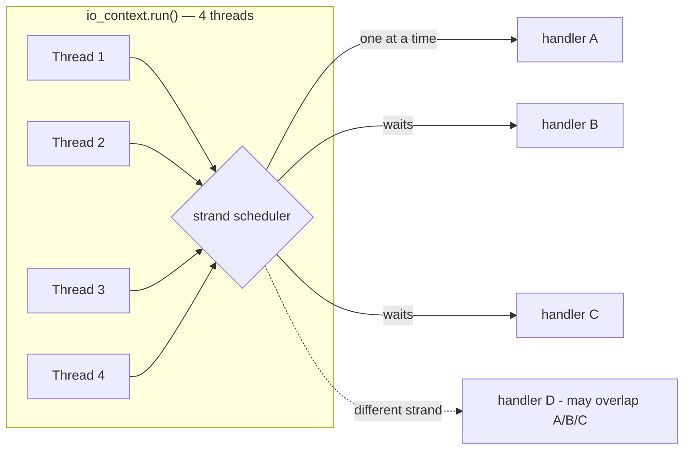

# Strands: Logical Thread-Safety Without Mutexes

**Doc Source**: [Strands: Use Threads Without Explicit Locking](https://think-async.com/Asio/asio-1.36.0/doc/asio/overview/core/strands.html) · [Timer.5 Tutorial](https://think-async.com/Asio/asio-1.36.0/doc/asio/tutorial/tuttimer5.html)

## The Core Concept: Why This Example Exists

**The Problem:** Once you run `io_context::run()` on *multiple* threads to use all your cores, completion handlers can execute concurrently — and now every shared resource (`std::cout`, a session map, a counter) needs a `std::mutex`. Locking inside every handler is correct but ugly: it's easy to forget a lock, easy to deadlock when an async chain re-enters, and the lock contention erodes the concurrency you were trying to gain.

**The Solution:** A **strand** is a logical serialized-execution context. Handlers dispatched through the same strand are guaranteed *not* to overlap — even if the `io_context` is driven by a dozen threads. The serialization is enforced by the scheduler, not by a lock you write. As the docs put it: a strand is *"a strictly sequential invocation of event handlers (i.e. no concurrent invocation)."* You get thread-safety for a group of handlers by *construction*, by binding them to the same strand, instead of by sprinkling mutexes.

Think of a strand as a single-lane toll booth on an eight-lane highway. Cars (handlers) from anywhere can queue for it, but only one passes through at a time — no collisions possible, no traffic lights (mutexes) needed inside the booth.

## Practical Walkthrough: Code Breakdown

### The three kinds of strand

The [strands doc](https://think-async.com/Asio/asio-1.36.0/doc/asio/overview/core/strands.html) enumerates how strands arise:

> - Calling `io_context::run()` from only one thread means all event handlers execute in an **implicit strand**, due to the io_context's guarantee that handlers are only invoked from inside `run()`.
> - Where there is a single chain of asynchronous operations associated with a connection (e.g. in a half duplex protocol implementation like HTTP) there is no possibility of concurrent execution of the handlers. This is an **implicit strand**.
> - An **explicit strand** is an instance of `strand<>` or `io_context::strand`. All event handler function objects need to be bound to the strand using `asio::bind_executor()` or otherwise posted/dispatched through the strand object.

The first is free (single-threaded `run`). The second is structural (a half-duplex connection's read→process→write chain can't overlap itself). The third is the explicit tool you reach for when you scale to a thread pool.

### Binding a handler to a strand: `bind_executor`

The canonical idiom, straight from the docs:

```cpp
my_socket.async_read_some(my_buffer,
    asio::bind_executor(my_strand,
      [](error_code ec, size_t length)
      {
        // ...
      }));
```

`asio::bind_executor(strand, handler)` returns a *new* handler that, when the operation completes, routes its execution through `strand`. Two handlers bound to the same `strand` can never run at the same instant, regardless of how many threads sit in `run()`.

### Real example: Timer.5 — two timers, two threads, one strand

The [Timer.5 tutorial](https://think-async.com/Asio/asio-1.36.0/doc/asio/tutorial/tuttimer5.html) is the official demonstration. It runs two timers concurrently on a two-thread `io_context`, with both handlers bound to one strand so the shared `count_` and `std::cout` stay safe without a mutex:

```cpp
class printer
{
public:
  printer(asio::io_context& io)
    : strand_(asio::make_strand(io)),
      timer1_(io, asio::chrono::seconds(1)),
      timer2_(io, asio::chrono::seconds(1)),
      count_(0)
  {
    timer1_.async_wait(asio::bind_executor(strand_,
          std::bind(&printer::print1, this)));

    timer2_.async_wait(asio::bind_executor(strand_,
          std::bind(&printer::print2, this)));
  }

  ~printer()
  {
    std::cout << "Final count is " << count_ << std::endl;
  }

  void print1()
  {
    if (count_ < 10)
    {
      std::cout << "Timer 1: " << count_ << std::endl;
      ++count_;

      timer1_.expires_at(timer1_.expiry() + asio::chrono::seconds(1));

      timer1_.async_wait(asio::bind_executor(strand_,
            std::bind(&printer::print1, this)));
    }
  }

  void print2()
  {
    if (count_ < 10)
    {
      std::cout << "Timer 2: " << count_ << std::endl;
      ++count_;

      timer2_.expires_at(timer2_.expiry() + asio::chrono::seconds(1));

      timer2_.async_wait(asio::bind_executor(strand_,
            std::bind(&printer::print2, this)));
    }
  }

private:
  asio::strand<asio::io_context::executor_type> strand_;
  asio::steady_timer timer1_;
  asio::steady_timer timer2_;
  int count_;
};
```

And the multithreaded `main` that makes the strand *necessary*:

```cpp
int main()
{
  asio::io_context io;
  printer p(io);
  std::thread t([&]{ io.run(); });
  io.run();
  t.join();
  return 0;
}
```

The tutorial's commentary is the key insight:

> The `strand` class template is an executor adapter that guarantees that, for those handlers that are dispatched through it, an executing handler will be allowed to complete before the next one is started. This is guaranteed irrespective of the number of threads that are calling `io_context::run()`.

Note the *re-binding on every re-arm*: each `async_wait` call wraps the next handler in `bind_executor` again. The strand association does not magically propagate — you bind it at each initiation.

### Why strands matter for composed operations

A subtle but critical rule from the docs:

> In the case of composed asynchronous operations, such as `async_read()` or `async_read_until()`, if a completion handler goes through a strand, then **all intermediate handlers should also go through the same strand**. This is needed to ensure thread safe access for any objects that are shared between the caller and the composed operation.

Asio obtains the handler's associated executor via `get_associated_executor` and threads it through the composed op automatically — so an `async_read` whose final handler is strand-bound also runs its internal intermediate steps on that strand. You don't have to re-bind each internal step.

## Mental Model: Thinking in Strands

**Strand = a virtual single thread.** A strand is best understood as a *logical* single-threaded context that the runtime materializes on whatever physical thread happens to be inside `run()`. From the handler's perspective, it's as if it always ran on the same thread. You write handler code as though single-threaded; the strand makes that fiction true.



**Why It Beats a Mutex:** A mutex protects a *resource*; a strand serializes a *flow*. With a mutex you must remember to lock everywhere the resource is touched, and an async re-entry can self-deadlock (a handler holding the lock initiates an op whose completion handler also needs the lock). A strand sidesteps both: the serialization is declarative (bind once per op) and non-reentrant by construction — the next handler simply isn't scheduled until the current one returns.

## Pitfalls

- **One strand per shared resource, not one global strand.** A single global strand re-serializes your whole program and throws away the multi-threading you paid for. Give each session/connection its own strand; only handlers touching the *same* objects need to share a strand.
- **Forgetting to re-bind on re-arm.** As seen in Timer.5, every `async_wait` re-wraps with `bind_executor`. Miss one and that handler escapes the strand.
- **Strands don't protect synchronous code outside handlers.** If you call a session method directly from a non-strand thread, the strand can't help. Post the call through the strand instead: `asio::post(strand, [...]{ ... });`.
- **`strand::wrap` is deprecated; use `bind_executor`.** Older code uses `strand_.wrap(handler)`; the modern, executor-aware API is `asio::bind_executor(strand_, handler)`.

## 🔗 Cross-references

**Within C++ (the expertise spine):**

- 🔗 `STD_THREAD` (P4) — strands exist *because* `run()` can be called from multiple threads. Single-threaded `run()` is itself an implicit strand; strands are the tool that lets you go multi-threaded safely.
- 🔗 `MUTEX_LOCK_GUARD` (P4) — the explicit-lock alternative strands replace. A strand is "a mutex you never write," declared at the executor level instead of the data level.
- 🔗 `COROUTINES` (P4) — `co_spawn(executor, coro, detached)` runs a coroutine on an executor; spawning onto a strand makes the entire coroutine body run serialized. See `06-coroutines.md`.
- 🔗 `CONDITION_VARIABLES` (P4) — the wait/notify primitive strands render unnecessary for handler-to-handler synchronization.

**Cross-language parallels (the 5-language curriculum):**

- 🔗 [`../rust`](../rust) — **Tokio's runtime is single-threaded per task by default** (the green-thread scheduler), so each task is inherently an implicit strand. Where Rust needs explicit serialization across tasks it uses channels or `Mutex`; Asio gives you the *strand* as a first-class executor for the same job. Tokio also has no direct strand analog — its `mpsc` channel is the closest idiom.
- 🔗 [`../ts`](../ts) — **Node's single-threaded event loop is one giant implicit strand** (the whole process). Node's `worker_threads` break that isolation; Asio lets you have *many* logical strands within one multi-threaded process, a finer granularity than Node offers natively.
