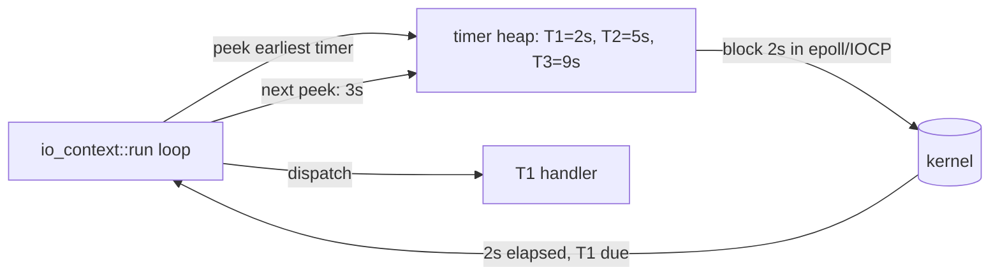

# Timers: Deadlines and Async Waits

**Doc Source**: [Timer.1 — Using a timer synchronously](https://think-async.com/Asio/asio-1.36.0/doc/asio/tutorial/tuttimer1.html) · [Timer.2 — Using a timer asynchronously](https://think-async.com/Asio/asio-1.36.0/doc/asio/tutorial/tuttimer2.html) · [Timers overview](https://think-async.com/Asio/asio-1.36.0/doc/asio/overview/timers.html)

## The Core Concept: Why This Example Exists

**The Problem:** Async programs constantly need "do X after N seconds" or "give up if Y doesn't happen by deadline T." A thread that calls `sleep(5)` to wait is a wasted thread; a hand-rolled deadline check inside a busy loop burns CPU. What you want is a timer that *integrates with the event loop* — so the wait costs nothing while it's pending and fires a handler precisely when it expires, all multiplexed alongside your socket I/O.

**The Solution:** Asio's `steady_timer` (and the `basic_waitable_timer` family) is an I/O object exactly like a socket. You construct it against an `io_context`, set an expiry, and either block on `wait()` or register a handler via `async_wait()`. Because it's a first-class I/O object, a timer's completion is dispatched by the *same* `run()` loop that handles your network reads — one thread can juggle thousands of timers and sockets together. This is also why the timer tutorials are the official "Hello, World" of Asio: they teach the async model without any networking distraction.

## Practical Walkthrough: Code Breakdown

### Timer.1: the synchronous baseline

The [Timer.1 tutorial](https://think-async.com/Asio/asio-1.36.0/doc/asio/tutorial/tuttimer1.html) is the simplest possible Asio program — a blocking wait:

```cpp
#include <iostream>
#include <asio.hpp>

int main()
{
  asio::io_context io;

  // Construct a timer that expires 5 seconds from now.
  asio::steady_timer t(io, asio::chrono::seconds(5));

  // Blocking wait — does not return until expiry.
  t.wait();

  std::cout << "Hello, world!" << std::endl;
  return 0;
}
```

The tutorial's commentary on construction is the design rule that generalizes to every I/O object:

> The core asio classes that provide I/O functionality (or as in this case timer functionality) always take an executor, or a reference to an execution context (such as `io_context`), as their first constructor argument. The second argument to the constructor sets the timer to expire 5 seconds from now.

And on the two-state model:

> A timer is always in one of two states: "expired" or "not expired". If the `steady_timer::wait()` function is called on an expired timer, it will return immediately.

So `wait()` on an already-expired timer is a no-op — handy for "run immediately if the deadline already passed."

### Timer.2: the asynchronous version

The [Timer.2 tutorial](https://think-async.com/Asio/asio-1.36.0/doc/asio/tutorial/tuttimer2.html) converts the same program to async — the minimal demonstration of Asio's initiate→run→complete cycle:

```cpp
#include <iostream>
#include <asio.hpp>

void print(const std::error_code& /*e*/)
{
  std::cout << "Hello, world!" << std::endl;
}

int main()
{
  asio::io_context io;
  asio::steady_timer t(io, asio::chrono::seconds(5));

  // Initiate async wait, return immediately.
  t.async_wait(&print);

  // Drive the loop — blocks until no work remains.
  io.run();
  return 0;
}
```

Two guarantees the tutorial stresses, which are *the* rules of Asio's async model:

> The asio library provides a guarantee that completion handlers will only be called from threads that are currently calling `asio::io_context::run()`. Therefore unless the `io_context::run()` function is called the completion handler for the asynchronous wait completion will never be invoked.

> The `io_context::run()` function will also continue to run while there is still "work" to do. In this example, the work is the asynchronous wait on the timer, so the call will not return until the timer has expired and the completion handler has returned.

> It is important to remember to give the io_context some work to do before calling `asio::io_context::run()`. For example, if we had omitted the above call to `async_wait()`, the `io_context` would not have had any work to do, and consequently `run()` would have returned immediately.

That last point is the #1 beginner trap: post work *before* you call `run()`.

### The expiry model and re-arming

A `steady_timer` is reusable. The expiry is manipulated with `expires_at()` (absolute time-point) and `expires_after()` (relative duration). Timer.5 in the official tutorials shows the re-arm idiom inside a handler:

```cpp
timer1_.expires_at(timer1_.expiry() + asio::chrono::seconds(1));
timer1_.async_wait(asio::bind_executor(strand_,
      std::bind(&printer::print1, this)));
```

This is how you build a repeating timer: each completion pushes the expiry forward and re-initiates the wait.

### Canceling a timer

`steady_timer::cancel()` cancels all outstanding `async_wait` operations. Their handlers are posted with `error_code` set to `asio::error::operation_aborted`. This is the idiomatic way to implement a timeout: arm a timer alongside your read, and whichever completes first cancels the other:

```cpp
// Pseudocode for the race:
steady_timer deadline(io, seconds(5));
deadline.async_wait([&](error_code ec){ if (!ec) socket.cancel(); });
socket.async_read_some(buf, [&](error_code ec, size_t n){
    if (!ec) deadline.cancel();
    /* handle */
});
io.run();
```

### Why `steady_timer` specifically

The "steady" name matters: it's a `basic_waitable_timer<std::chrono::steady_clock>`. A `steady_clock` is monotonic — it is immune to system clock adjustments (NTP jumps, manual date changes). If you used a wall-clock timer, a backwards NTP correction could make your deadline already-passed or never-arrive. `steady_timer` is the safe default for deadlines and timeouts; reach for `system_timer` only when you genuinely need wall-clock semantics.

## Mental Model: Thinking in Timers

**A timer is a socket that fires on a clock instead of a wire.** Internally, Asio maintains one timer queue per `io_context`, kept sorted by expiry. The earliest-expiring timer determines how long `run()`'s internal `epoll_wait`/`GetQueuedCompletionStatus` should block before waking to check for timer expiries. So timers cost ~nothing while pending — they're just entries in a heap — and fire with microsecond-ish precision when due.



**Why It's Designed This Way:** Making the timer a regular I/O object (constructed from an executor, with sync `wait()` and async `async_wait()`) means the *same* mental model covers sockets, timers, signals, and serial ports. You don't learn a separate "timer API" — once you understand `async_wait(&print)`, you understand `async_read_some(&on_read)`.

## Pitfalls

- **No work before `run()` → instant exit.** As the Timer.2 docs warn, omitting `async_wait` before `run()` makes `run()` return immediately with nothing dispatched.
- **Using `system_timer` for a deadline.** Wall-clock jumps break it. Use `steady_timer` for timeouts and rate-limiting.
- **Dangling references in the handler.** The timer object and any captured state must outlive the async wait. If the timer is a stack local in `main` and `main` returns before the wait completes, it's UB.
- **Forgetting that `cancel()` posts the handler, doesn't call it inline.** `cancel()` enqueues aborted handlers on the strand/io_context; they fire on the next `run()` turn, not synchronously inside `cancel()`.
- **Re-arming without resetting expiry.** Calling `async_wait` again without `expires_at`/`expires_after` on an already-expired timer fires the handler immediately (it's in the "expired" state).

## 🔗 Cross-references

**Within C++ (the expertise spine):**

- 🔗 `CHRONO` — `steady_timer` is `basic_waitable_timer<std::chrono::steady_clock>`; the `chrono` clock/duration/time-point vocabulary is the timer's type system. Understanding `steady_clock` vs `system_clock` vs `high_resolution_clock` is prerequisite.
- 🔗 `STD_THREAD` (P4) — the timer tutorials' `main` calling `run()` is single-threaded; Timer.5 graduates to a thread pool and introduces strands (`03-strands.md`).
- 🔗 `COROUTINES` (P4) — `co_await timer.async_wait(asio::use_awaitable)` flattens the timeout-race pattern into linear code. See `06-coroutines.md`.
- 🔗 `FUTURES_PROMISES` (P4) — a `steady_timer` with `use_future` token yields a `std::future`, the synchronous-completion analog.

**Cross-language parallels (the 5-language curriculum):**

- 🔗 [`../rust`](../rust) — **Tokio's `tokio::time::sleep` / `interval`** are the direct siblings: async, integrated with the reactor, monotonic. `steady_timer.async_wait(&h)` ↔ `tokio::time::sleep(dur).await`. Same design: timers live in the same scheduler as I/O.
- 🔗 [`../ts`](../ts) — **Node's `setTimeout`/`setInterval`** are the same concept (timer wheel inside the event loop), but Node exposes them as globals whereas Asio makes them I/O objects bound to an explicit `io_context`. Node's timers are also single-threaded-globally; Asio timers participate in per-context strand serialization.
