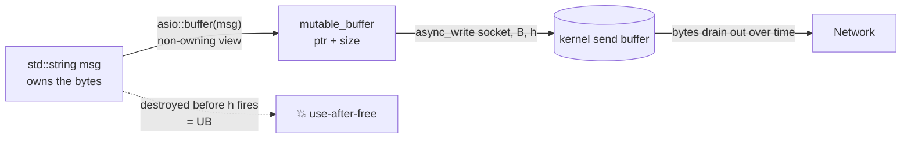

# Buffers: Mutable/Const, the Scatter-Gather Model

**Doc Source**: [Buffers](https://think-async.com/Asio/asio-1.36.0/doc/asio/overview/core/buffers.html)

## The Core Concept: Why This Example Exists

**The Problem:** Every I/O operation ultimately moves bytes between user memory and the kernel. The naive representation — a `(void*, size_t)` pair — is unsafe (no const-correctness, no overrun protection) and limiting: high-performance network code wants *scatter-gather*, where a single syscall reads into or writes from *several* disjoint memory regions at once (the kernel does the vectored I/O via `readv`/`writev`/WSASend). A buffer abstraction has to express both "one region" and "a sequence of regions," and it must do so *without owning the memory* — because ownership semantics differ per call site (a stack buffer, a `std::string`, a recycled pool).

**The Solution:** Asio defines two opaque buffer types — `mutable_buffer` and `const_buffer` — that represent a non-owning view over contiguous memory, plus the `MutableBufferSequence` / `ConstBufferSequence` concepts that let any container of buffers feed a scatter-gather op. The `asio::buffer()` adapter auto-derives size and const-ness from whatever you hand it (a raw array, a `std::vector`, a `std::string`). Crucially, **Asio never copies or owns your buffers** — you retain lifetime responsibility, which is the source of both its zero-copy efficiency and its sharpest footgun.

## Practical Walkthrough: Code Breakdown

### The two buffer types

The [Buffers doc](https://think-async.com/Asio/asio-1.36.0/doc/asio/overview/core/buffers.html) opens with the conceptual pair and then explains why they're classes, not raw tuples:

> Fundamentally, I/O involves the transfer of data to and from contiguous regions of memory, called buffers. These buffers can be simply expressed as a tuple consisting of a pointer and a size in bytes. However, to allow the development of efficient network applications, Asio includes support for scatter-gather operations.

The conceptual definitions:

```cpp
typedef std::pair<void*, std::size_t> mutable_buffer;
typedef std::pair<const void*, std::size_t> const_buffer;
```

> Here, a `mutable_buffer` would be convertible to a `const_buffer`, but conversion in the opposite direction is not valid.

But Asio doesn't use these raw pairs — it wraps them in classes with three properties the docs list explicitly:

> - Types behave as `std::pair` would in conversions. That is, a `mutable_buffer` is convertible to a `const_buffer`, but the opposite conversion is disallowed.
> - There is protection against buffer overruns. Given a buffer instance, a user can only create another buffer representing the same range of memory or a sub-range of it. To provide further safety, the library also includes mechanisms for automatically determining the size of a buffer from an array, `boost::array` or `std::vector` of POD elements, or from a `std::string`.
> - The underlying memory is explicitly accessed using the `data()` member function. In general an application should never need to do this, but it is required by the library implementation to pass the raw memory to the underlying operating system functions.

So the type system enforces: read→write is forbidden; you can only *shrink* a buffer view, never enlarge it; raw pointer access is opt-in via `data()`.

### Scatter-gather: a sequence of buffers

The reason two types exist is to feed vectored I/O. The docs explain:

> A scatter-read receives data into multiple buffers.
> A gather-write transmits multiple buffers.

> Finally, multiple buffers can be passed to scatter-gather operations (such as `read()` or `write()`) by putting the buffer objects into a container. The `MutableBufferSequence` and `ConstBufferSequence` concepts have been defined so that containers such as `std::vector`, `std::list`, `std::array` or `boost::array` can be used.

So a `std::vector<mutable_buffer>` is itself a valid buffer sequence — one `async_read` can populate a header buffer and a body buffer in a single syscall.

### The `asio::buffer()` adapter

You rarely construct `mutable_buffer`/`const_buffer` by hand. The `asio::buffer()` free function deduces everything:

```cpp
char raw[128];
std::vector<char> vec(1024);
std::string msg = "hello";

asio::buffer(raw);            // mutable_buffer, size 128 (array size deduced)
asio::buffer(vec);            // mutable_buffer, size 1024
asio::buffer(msg);            // mutable_buffer — std::string is mutable storage
asio::buffer("literal");      // const_buffer — string literal is const
asio::buffer(raw, 64);        // sub-range: mutable_buffer over first 64 bytes
```

This deduces const-ness from the argument's type and the size from the container — the "automatically determining the size" safety property the docs mention.

### Buffer literals (zero-copy for literals)

A neat newer feature — the `_buf` suffix produces a `const_buffer` over static-storage-duration memory, safe for async use:

```cpp
using namespace asio::buffer_literals;

asio::const_buffer b1 = "hello"_buf;
asio::const_buffer b2 = 0xdeadbeef_buf;
asio::const_buffer b3 = 0x01234567'89abcdef'01234567'89abcdef_buf;
asio::const_buffer b4 = 0b1010101011001100_buf;
```

> The memory associated with a buffer literal is valid for the lifetime of the program. This means that the buffer can be safely used with asynchronous operations:

```cpp
async_write(my_socket, "hello"_buf, my_handler);
```

Because the literal lives in static storage, the buffer can't dangle — a rare case where async + literal composes safely.

### `streambuf`: bridging to iostreams

For code that wants iostream-style append/consume, Asio provides `basic_streambuf`:

> The class `asio::basic_streambuf` is derived from `std::basic_streambuf`... direct access to the array elements is provided to permit them to be used with I/O operations:
> - The input sequence... is accessible via the `data()` member function. The return type meets `ConstBufferSequence` requirements.
> - The output sequence... is accessible via the `prepare()` member function. The return type meets `MutableBufferSequence` requirements.
> - Data is transferred from the front of the output sequence to the back of the input sequence by calling `commit()`.
> - Data is removed from the front of the input sequence by calling `consume()`.

And the canonical line-read idiom the docs show:

```cpp
asio::streambuf sb;
// ...
std::size_t n = asio::read_until(sock, sb, '\n');
asio::streambuf::const_buffers_type bufs = sb.data();
std::string line(
    asio::buffers_begin(bufs),
    asio::buffers_begin(bufs) + n);
```

The `buffers_iterator` lets you traverse a buffer *sequence* as if it were one contiguous byte range — the scatter-gather abstraction made iterable.

### Buffer debugging: the dangling-buffer trap

The docs close with the footgun and a mitigation:

> When you call an asynchronous read or write you need to ensure that the buffers for the operation are valid until the completion handler is called. In the above example, the buffer is the `std::string` variable `msg`. This variable is on the stack, and so it goes out of scope before the asynchronous operation completes.

```cpp
void dont_do_this()
{
  std::string msg = "Hello, world!";
  asio::async_write(sock, asio::buffer(msg), my_handler);
}   // msg destroyed here — async_write still pending → use-after-free
```

> When buffer debugging is enabled, Asio stores an iterator into the string until the asynchronous operation completes, and then dereferences it to check its validity.

This is auto-enabled under MSVC's iterator debugging or GCC's `_GLIBCXX_DEBUG`, and toggleable via `ASIO_ENABLE_BUFFER_DEBUGGING` / `ASIO_DISABLE_BUFFER_DEBUGGING`.

## Mental Model: Thinking in Buffers

**A buffer is a borrow, not a box.** The single most important thing to internalize: `asio::buffer(x)` does *not* copy `x`. It is a `const_buffer`/`mutable_buffer` *pointing at* `x`'s storage. Asio is a zero-copy library by design — the buffer abstraction exists to hand raw memory to the kernel without an intermediary copy. The price of that efficiency is that *you* own the lifetime: the buffer must remain valid from initiation until the completion handler returns.



**Why Asio Doesn't Own Buffers:** Ownership is a policy the caller is best placed to choose. Sometimes you want a stack buffer (cheapest), sometimes a `std::string` you mutate, sometimes a recycled pool, sometimes a `shared_ptr` captured in the handler to extend lifetime. By refusing to own, Asio lets each call site pick the right strategy instead of imposing a one-size allocator. The flip side: the lifetime burden is on you.

## Pitfalls

- **The dangling buffer (`dont_do_this`).** The #1 Asio bug. Any object you pass to `async_write`/`async_read` must outlive the operation. Capture it into the handler (often via `shared_from_this` / a `shared_ptr`) to extend lifetime.
- **`asio::buffer(std::string)` is mutable, but the string's capacity can change.** If anything mutates the string (and reallocates) while an async op holds a buffer into it, the buffer dangles. Don't touch the string between initiation and completion.
- **Confusing `prepare()` (writable, output sequence) with `data()` (readable, input sequence)** on a `streambuf`. `prepare(n)` *reserves* space you then `commit()`; `data()` is what was `commit`ted and is read-only. Forgetting `commit()` means data never moves from output to input.
- **Assuming `buffer()` deep-copies.** It never does. If you need a copy, make one explicitly before handing a buffer to an async op.
- **C-style `(buf, sizeof(buf))` on a pointer-to-array.** `asio::buffer(p, n)` requires you to know `n`; `sizeof(p)` where `p` is a pointer gives the pointer size, not the allocation. Use the array overload (`asio::buffer(arr)`) where possible so size is deduced.

## 🔗 Cross-references

**Within C++ (the expertise spine):**

- 🔗 `STRING_STRINGVIEW` — `asio::buffer()` is the I/O analog of `std::string_view`: a non-owning, const-correct view over contiguous storage. Both borrow, neither owns. `string_view` is for parsing; `mutable_buffer`/`const_buffer` are for I/O.
- 🔗 `MOVE_SEMANTICS` (P2) — the canonical lifetime fix for a dangling buffer is to move a `shared_ptr` to the buffer's owner into the completion handler (capture by value).
- 🔗 `SHARED_PTR_WEAK_PTR` — `shared_from_this()` in a session class keeps the session (and its buffers) alive across async ops; `enable_shared_from_this` is the standard Asio session base.
- 🔗 `RAII` (P2) — `basic_streambuf` is RAII over its internal character arrays; `commit`/`consume` are the manual bookkeeping the abstraction automates.
- 🔗 `COROUTINES` (P4) — in a coroutine, the buffer can be a plain stack local *inside the coroutine frame*, because the frame is heap-allocated and lives until the coroutine completes. See `06-coroutines.md` — this is a major ergonomic win of coroutines over callbacks.

**Cross-language parallels (the 5-language curriculum):**

- 🔗 [`../rust`](../rust) — **Tokio's `bytes::BytesMut` / `Bytes`** are the sibling abstraction: reference-counted, zero-copy splittable buffers. The key difference: Rust's borrow checker *proves* the buffer outlives the async op at compile time (the `AsyncRead` future borrows the slice); C++ trusts you and offers optional runtime buffer debugging. Asio buffers are raw views; `bytes::Bytes` owns and reference-counts.
- 🔗 [`../ts`](../ts) — **Node's `Buffer`** is a owning, heap-allocated, reference-counted `Uint8Array` subclass. Node chose ownership (GC manages lifetime); Asio chose borrowing (caller manages lifetime). The trade is convenience vs. zero-copy control — Asio's model is closer to the kernel, Node's is closer to the application.
